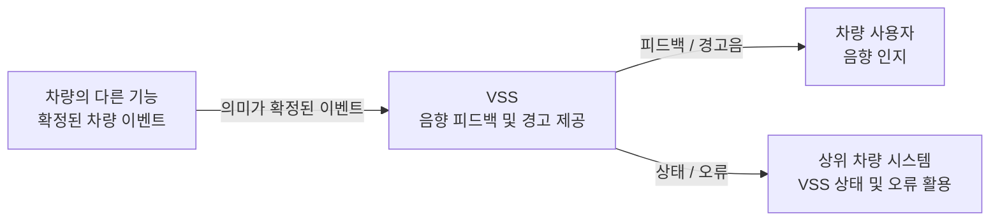

# VSS System Requirement (SR) — Functional Baseline Draft

> 상태: DRAFT / 기능 범위 검토용  
> 작성 원칙: 고객·상위 시스템 관점의 **What**을 기술한다.  
> 개별 요구사항 ID는 부여하지 않는다.  
> 기존 VSS 문서의 번호 체계는 승계하지 않는다.

---

## 1. 목적

본 문서는 차량의 상태 및 안전 관련 이벤트를 사용자가 음향으로 인지할 수 있도록 하는
VSS(Virtual Sound System)의 상위 요구사항을 정의한다.

VSS는 차량의 다른 기능에서 확정된 상태 또는 이벤트를 음향으로 표현하며,
안전 관련 경고가 일반 피드백보다 우선적으로 인지될 수 있도록 해야 한다.

---

## 2. 기능 범위

VSS는 다음 차량 이벤트에 대한 음향 출력을 제공해야 한다.

- 차량 사용 시작 및 종료
- 도어 잠금 및 잠금 해제
- 도어 잠금 이상
- 파워윈도우 안티핀치
- 잔류 탑승자 위험
- 후방 장애물 접근 및 충돌 위험
- VSS 상태 및 오류 알림 연계

### 2.1 VSS 상위 시스템 컨텍스트

> 본 SR의 컨텍스트 다이어그램은 기능 경계만 표현한다.  
> MCU, 통신 프로토콜, 메시지 구조 및 오디오 하드웨어는 SysRS 이후 단계에서 구체화한다.

---

## 3. 기능 경계

VSS는 차량 이벤트를 직접 감지하거나 해당 이벤트의 발생 조건을 판단하는 기능을 담당하지 않는다.

다음과 같은 상태 판단은 해당 기능을 담당하는 차량 시스템에서 수행되어야 한다.

- 도어 잠금 성공 또는 실패 판단
- 파워윈도우 끼임 위험 판단
- 잔류 탑승자 존재 및 위험 상태 판단
- 후방 장애물의 접근 거리 및 충돌 위험 수준 판단
- 차량 전원 또는 운행 상태 판단

VSS는 확정된 이벤트에 대응하는 음향을 제공해야 한다.

---

## 4. 일반 피드백 음향 요구사항

### 4.1 차량 사용 시작 및 종료

- 차량 사용 시작 상태가 확정된 경우 사용자가 인지할 수 있는 웰컴 음향이 제공되어야 한다.
- 차량 사용 종료 상태가 확정된 경우 사용자가 인지할 수 있는 굿바이 음향이 제공되어야 한다.
- 차량 사용 시작 및 종료 음향은 안전 관련 경고보다 우선해서는 안 된다.

### 4.2 도어 잠금 및 잠금 해제

- 도어 잠금이 정상적으로 완료된 경우 잠금 완료를 인지할 수 있는 음향이 제공되어야 한다.
- 도어 잠금 해제가 정상적으로 완료된 경우 잠금 완료 음향과 구분 가능한 음향이 제공되어야 한다.
- 도어가 정상적으로 잠기지 않은 상태가 확인된 경우 정상 잠금 완료 음향과 구분 가능한 경고가 제공되어야 한다.

---

## 5. 안전 및 주의 경고 요구사항

### 5.1 파워윈도우 안티핀치

- 파워윈도우 끼임 위험이 확인된 경우 일반 피드백과 명확히 구분 가능한 긴급 경고음이 제공되어야 한다.
- 안티핀치 경고는 일반 피드백 및 주의 수준의 경고보다 우선적으로 인지되어야 한다.
- 끼임 위험 상태가 해제된 경우 해당 지속 경고음은 종료되어야 한다.

### 5.2 잔류 탑승자

- 차량 내부의 위험 상태에서 잔류 탑승자가 확인된 경우 사용자가 인지할 수 있는 긴급 경고음이 제공되어야 한다.
- 잔류 탑승자 위험 상태가 해제된 경우 해당 지속 경고음은 종료되어야 한다.

### 5.3 후방 장애물 접근 및 충돌 위험 경고

- 차량 후방의 장애물이 주의가 필요한 거리 범위에 접근한 것으로 확인된 경우 사용자가 이를 인지할 수 있는 주의 경고음이 제공되어야 한다.
- 차량 후방의 장애물이 충돌 위험이 높은 거리 범위에 접근한 것으로 확인된 경우 주의 경고음보다 명확히 구분되는 긴급 경고음이 제공되어야 한다.
- 후방 장애물의 충돌 위험 수준이 높아질수록 사용자가 위험 증가를 구분할 수 있는 음향이 제공되어야 한다.
- 후방 장애물이 경고 대상 범위를 벗어난 경우 해당 경고음은 종료되어야 한다.

---

## 6. 음향 우선순위 요구사항

- 안전과 직접 관련된 긴급 경고는 주의 경고 및 일반 피드백보다 우선되어야 한다.
- 주의 경고는 일반 피드백보다 우선되어야 한다.
- 서로 다른 의미의 음향이 동시에 출력되어 사용자가 상황을 구분하기 어렵게 되어서는 안 된다.
- 높은 우선순위의 경고가 발생한 경우 낮은 우선순위 음향은 해당 경고의 인지를 방해하지 않아야 한다.
- 안전 경고가 종료된 후 이미 유효 시점을 지난 일반 피드백이 불필요하게 다시 출력되어서는 안 된다.

---

## 7. 상태 및 오류 요구사항

- VSS가 정상적으로 음향을 제공할 수 있는 상태인지 상위 차량 시스템에서 확인할 수 있어야 한다.
- VSS가 정상적으로 음향을 제공할 수 없는 오류가 발생한 경우 해당 오류 상태를 상위 차량 시스템에서 확인할 수 있어야 한다.
- 지원되지 않거나 유효하지 않은 음향 요청으로 인해 잘못된 의미의 음향이 출력되어서는 안 된다.
- VSS의 오류가 다른 차량 기능의 동작을 불필요하게 중단시켜서는 안 된다.
- VSS가 오류 상태에서 정상 상태로 복구된 경우 상위 차량 시스템에서 복구 여부를 확인할 수 있어야 한다.

---

## 8. 음향 품질 및 비기능 요구사항

- 서로 다른 의미를 가진 주요 피드백 및 경고음은 사용자가 구분할 수 있어야 한다.
- 안전 관련 경고음은 일반 피드백음과 혼동하기 어렵도록 구분되어야 한다.
- 동일한 차량 이벤트는 정상 동작 상태에서 일관된 음향으로 표현되어야 한다.
- VSS는 차량 사용에 필요한 시간 안에 음향 출력이 가능한 상태로 진입해야 한다.
- 안전 관련 이벤트에 대한 음향은 사용자가 적절한 시점에 인지할 수 있도록 제공되어야 한다.
- 실제 출력 수준과 평가 조건은 적용 오디오 하드웨어 및 시험 환경이 확정된 후 정의되어야 한다.

---

## 9. 기능 제외 범위

본 VSS 범위에는 다음 기능을 포함하지 않는다.

- 조도 센서 값에 따른 자동 음량 변경
- 시간대 또는 주야간 상태에 따른 자동 음량 변경
- 외부 장치에서 전달되는 오디오 스트리밍
- 차량 네트워크를 통한 음원 파일 전송 및 스트리밍 재생
- 일반 음악 재생
- 플레이리스트 관리
- 곡 선택, 탐색 또는 재생 위치 이동
- 다수 음원의 동시 믹싱
- 일반 미디어 음향의 Ducking
- Fade-in 또는 Fade-out 연출
- 이퀄라이저 및 음장 효과

VSS의 핵심 기능은 **차량 이벤트에 대응하는 저장 음향 기반의 피드백 및 경고 제공**으로 한정한다.

---

## 10. 상위 시스템 연계 원칙

- VSS는 센서 원시 데이터를 직접 해석하지 않아야 한다.
- VSS에는 음향 출력에 필요한 의미가 확정된 차량 이벤트가 제공되어야 한다.
- VSS의 세부 음향 재생 방법은 상위 차량 기능이 직접 제어하지 않아야 한다.
- VSS의 상태 및 오류는 상위 차량 시스템에서 활용 가능해야 한다.

---

## 11. 범위 요약

> **VSS는 다른 차량 기능에서 확정한 차량 이벤트를 받아,
> 해당 이벤트에 대응하는 저장 음향을 제공하고,
> 안전 경고의 우선순위와 자신의 상태 및 오류를 관리하는 음향 시스템이다.**
