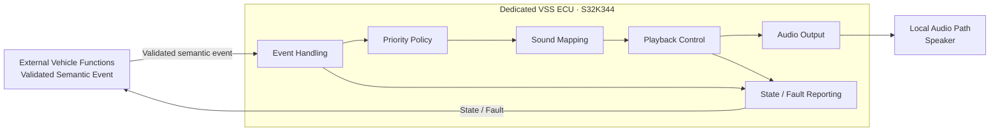
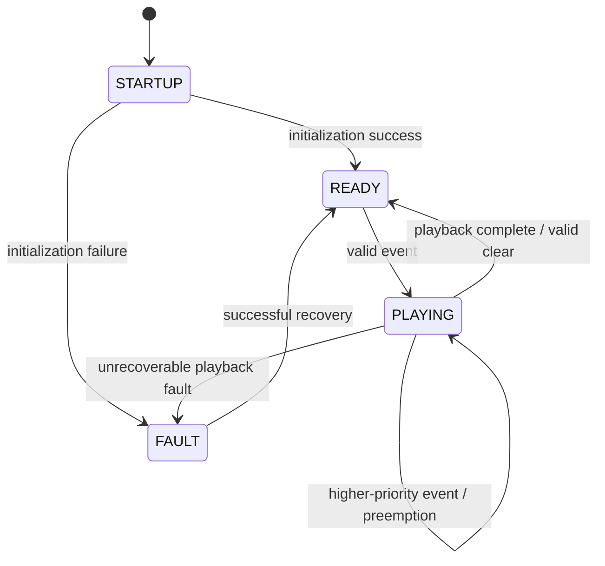
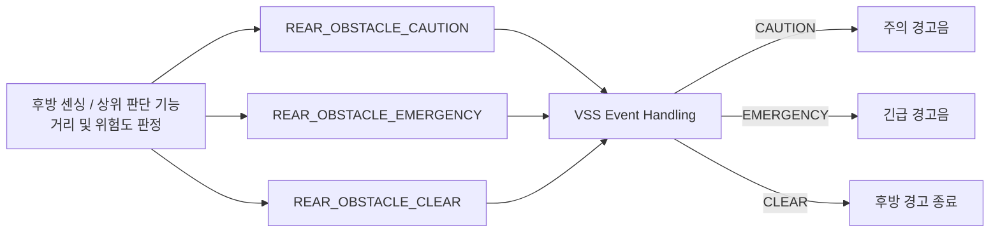

# VSS System Requirement Specification (SysRS)
## Dedicated S32K344 ECU — Functional Baseline Draft

> 상태: DRAFT / 기능·성능 기준 검토용  
> 대상 시스템: **VSS 전용 S32K344 ECU 1대**  
> 신규 SysRS ID 체계를 사용하며 이전 번호를 승계하지 않는다.  
> `[CANDIDATE]`는 초기 개발 및 벤치 검증을 위한 임시값이다.  
> 통신 프로토콜, 메시지 ID, 신호 배치, 송신 주기 및 버스 파라미터는 본 단계에서 확정하지 않는다.

---

# 1. 대상 시스템과 책임

본 SysRS의 대상은 독립된 물리 S32K344 보드 1대로 구성되는 VSS ECU이다.

VSS ECU의 책임은 다음과 같다.

- 외부 차량 시스템에서 확정된 VSS 관련 이벤트 수용
- 이벤트 유효성 확인
- 이벤트와 로컬 음향 자산의 대응
- 재생 시작 및 종료
- 음향 우선순위 처리
- 재생 상태 관리
- 자체 오류 검출 및 상태 제공

VSS ECU의 책임이 아닌 항목은 다음과 같다.

- 센서 Raw Data 처리
- 파워윈도우 끼임 판정
- 잔류 탑승자 판정
- 후방 장애물 거리 측정
- 후방 장애물 충돌 위험 수준 판정
- 차량 전체 상태 판단
- 조도 또는 시간 기반 음량 계산
- 외부 오디오 스트림 수신 및 재생

---

# 2. 논리 시스템 구조

후방 장애물 기능의 경우 거리 측정과 위험도 판정은 VSS 외부에서 수행한다.
VSS는 `주의`, `긴급`, `해제`처럼 의미가 확정된 상태를 받아 음향으로 표현한다.

이 구조에서 물리 통신 방식과 메시지 표현은 후속 전체 인터페이스/네트워크 설계에서 결정한다.

---

# 3. 시스템 상태

VSS ECU는 최소 다음의 논리 상태를 제공해야 한다.

- `STARTUP`: 초기화 진행 중
- `READY`: 음향 요청 수용 가능
- `PLAYING`: 하나의 음향을 출력 중
- `FAULT`: 정상 음향 출력을 보장할 수 없음

기본 상태 전이는 다음과 같다.

---

# 4. Functional Requirements

| ID | Requirement |
|---|---|
| VSS-SYS-FUN-001 | VSS ECU는 전원 인가 후 자체 초기화를 수행하고 정상적인 경우 `READY` 상태로 전이해야 한다. |
| VSS-SYS-FUN-002 | VSS ECU는 외부 차량 시스템에서 제공된 유효한 VSS 이벤트를 수용할 수 있어야 한다. |
| VSS-SYS-FUN-003 | VSS ECU는 수용한 이벤트를 사전에 정의된 로컬 음향 자산과 대응시켜야 한다. |
| VSS-SYS-FUN-004 | VSS ECU는 동일한 이벤트에 대해 정상 상태에서 일관된 음향을 선택해야 한다. |
| VSS-SYS-FUN-005 | VSS ECU는 한 시점에 하나의 음향만 활성 출력해야 한다. |
| VSS-SYS-FUN-006 | VSS ECU는 일반 피드백, 주의 경고, 긴급 경고의 세 우선순위 등급을 구분해야 한다. |
| VSS-SYS-FUN-007 | 긴급 경고는 현재 출력 중인 주의 경고 및 일반 피드백보다 우선해야 한다. |
| VSS-SYS-FUN-008 | 주의 경고는 현재 출력 중인 일반 피드백보다 우선해야 한다. |
| VSS-SYS-FUN-009 | 현재 음향보다 낮은 우선순위의 신규 이벤트는 현재 음향을 중단시키지 않아야 한다. |
| VSS-SYS-FUN-010 | 높은 우선순위 이벤트에 의해 중단된 1회성 일반 피드백은 자동으로 재개되지 않아야 한다. |
| VSS-SYS-FUN-011 | VSS ECU는 1회성 피드백 이벤트를 지정된 횟수만큼 재생하고 종료할 수 있어야 한다. |
| VSS-SYS-FUN-012 | VSS ECU는 상태 유지형 경고에 대해 반복 음향을 제공할 수 있어야 한다. |
| VSS-SYS-FUN-013 | 상태 유지형 경고의 해제 정보가 유효하게 제공된 경우 해당 경고음은 종료되어야 한다. |
| VSS-SYS-FUN-014 | VSS ECU는 후방 장애물 주의 상태가 유효하게 제공된 경우 주의 경고음을 출력해야 한다. |
| VSS-SYS-FUN-015 | VSS ECU는 후방 장애물 긴급 상태가 유효하게 제공된 경우 주의 경고음과 구분되는 긴급 경고음을 출력해야 한다. |
| VSS-SYS-FUN-016 | 후방 장애물 상태가 주의에서 긴급으로 변경된 경우 VSS ECU는 긴급 경고를 우선 출력해야 한다. |
| VSS-SYS-FUN-017 | 후방 장애물 위험 해제 상태가 유효하게 제공된 경우 VSS ECU는 해당 장애물 경고음을 종료해야 한다. |
| VSS-SYS-FUN-018 | VSS ECU는 후방 장애물의 실제 거리값을 이용하여 위험 수준을 직접 판정하지 않아야 한다. |
| VSS-SYS-FUN-019 | VSS ECU는 지원하지 않는 이벤트를 수용한 경우 임의의 음향을 출력하지 않아야 한다. |
| VSS-SYS-FUN-020 | VSS ECU는 필요한 로컬 음향 자산을 사용할 수 없는 경우 다른 의미의 음향으로 임의 대체하지 않아야 한다. |
| VSS-SYS-FUN-021 | VSS ECU는 현재 동작 가능 상태와 오류 존재 여부를 외부 차량 시스템이 확인할 수 있도록 제공해야 한다. |
| VSS-SYS-FUN-022 | VSS ECU는 조도 변화만을 근거로 음량을 자동 변경하지 않아야 한다. |
| VSS-SYS-FUN-023 | VSS ECU는 시간대 또는 주야간 정보만을 근거로 음량을 자동 변경하지 않아야 한다. |
| VSS-SYS-FUN-024 | VSS ECU는 외부에서 전달되는 오디오 스트림에 의존하지 않고 본 SysRS의 핵심 음향을 제공할 수 있어야 한다. |
| VSS-SYS-FUN-025 | VSS ECU는 다수 음원의 동시 Mixing을 수행하지 않아야 한다. |
| VSS-SYS-FUN-026 | VSS ECU는 일반 미디어 Ducking을 핵심 기능으로 포함하지 않아야 한다. |
| VSS-SYS-FUN-027 | VSS ECU는 Fade-in/Fade-out 연출을 핵심 기능으로 포함하지 않아야 한다. |

## 4.1 Event-specific Functional Requirements

상위 SR의 개별 기능을 직접 추적할 수 있도록 주요 의미 이벤트별 요구사항을 별도로 정의한다.

| ID | Requirement |
|---|---|
| VSS-SYS-FUN-028 | `VEHICLE_WELCOME` 이벤트가 유효하게 수용된 경우 VSS ECU는 차량 사용 시작을 나타내는 일반 피드백 음향을 1회 출력해야 한다. |
| VSS-SYS-FUN-029 | `VEHICLE_GOODBYE` 이벤트가 유효하게 수용된 경우 VSS ECU는 차량 사용 종료를 나타내는 일반 피드백 음향을 1회 출력해야 한다. |
| VSS-SYS-FUN-030 | `DOOR_LOCK_COMPLETE` 이벤트가 유효하게 수용된 경우 VSS ECU는 도어 잠금 완료를 나타내는 일반 피드백 음향을 출력해야 한다. |
| VSS-SYS-FUN-031 | `DOOR_UNLOCK_COMPLETE` 이벤트가 유효하게 수용된 경우 VSS ECU는 도어 잠금 완료 음향과 구분 가능한 음향 또는 재생 패턴을 출력해야 한다. |
| VSS-SYS-FUN-032 | `DOOR_LOCK_ERROR` 이벤트가 유효하게 수용된 경우 VSS ECU는 정상 잠금 완료 음향과 구분 가능한 주의 경고음을 출력해야 한다. |
| VSS-SYS-FUN-033 | `WINDOW_ANTIPINCH` 위험 상태가 유효하게 수용된 경우 VSS ECU는 긴급 경고음을 출력하고 해당 위험 상태가 유지되는 동안 경고를 지속할 수 있어야 한다. |
| VSS-SYS-FUN-034 | `OCCUPANT_HAZARD` 상태가 유효하게 수용된 경우 VSS ECU는 긴급 경고음을 출력하고 해당 위험 상태가 유지되는 동안 경고를 지속할 수 있어야 한다. |

---

# 5. Semantic Event Requirements

본 단계에서는 실제 통신 신호나 숫자 Event ID를 정의하지 않는다.
VSS가 필요로 하는 **의미 이벤트의 종류**만 정의한다.

| Semantic Event | Meaning | Default Class | Behavior |
|---|---|---|---|
| `VEHICLE_WELCOME` | 차량 사용 시작 | Feedback | One-shot |
| `VEHICLE_GOODBYE` | 차량 사용 종료 | Feedback | One-shot |
| `DOOR_LOCK_COMPLETE` | 도어 잠금 정상 완료 | Feedback | One-shot |
| `DOOR_UNLOCK_COMPLETE` | 도어 잠금 해제 정상 완료 | Feedback | Two cues |
| `DOOR_LOCK_ERROR` | 도어 잠금 이상 | Warning | One-shot / bounded repeat |
| `WINDOW_ANTIPINCH` | 파워윈도우 끼임 위험 | Emergency | Repeat while active |
| `OCCUPANT_HAZARD` | 잔류 탑승자 위험 | Emergency | Repeat while active |
| `REAR_OBSTACLE_CAUTION` | 후방 장애물 주의 수준 | Warning | Intermittent repeat |
| `REAR_OBSTACLE_EMERGENCY` | 후방 장애물 충돌 위험 수준 | Emergency | Fast repeat / continuous cue |
| `REAR_OBSTACLE_CLEAR` | 후방 장애물 경고 해제 | Control state | Stop rear obstacle warning |

> `REAR_OBSTACLE_*` 상태를 만들기 위한 실제 초음파 센서 거리값과 임계값은
> VSS SysRS의 책임 범위가 아니다. 해당 값은 후방 센싱/상위 판단 기능에서 정의한다.  
> 실제 신호명, 숫자 값, 메시지 배치 및 전송 방식은 후속 인터페이스 설계에서 확정한다.

## 5.1 후방 장애물 위험 상태의 VSS 처리 개념

> 이 다이어그램은 위험 상태의 **의미 흐름**을 표현한다.  
> 초음파 센서의 거리 임계값, 필터링 및 실제 통신 신호 정의는 포함하지 않는다.

---

# 6. Candidate Playback Behavior

다음 값은 기능 검증을 위한 임시 기준이다.

| Item | Candidate |
|---|---:|
| Active audio channels | `1` |
| Priority levels | `3` |
| Feedback output setpoint | `60 %` |
| Warning output setpoint | `80 %` |
| Emergency output setpoint | `100 %` |
| General one-shot sound duration | `≤ 2.0 s` |
| Lock feedback recognition cues | `1` |
| Unlock feedback recognition cues | `2` |
| Unlock cue-to-cue interval | `[CANDIDATE] 150–300 ms` |
| Rear obstacle caution repeat interval | `[CANDIDATE] 500 ms` |
| Rear obstacle emergency repeat interval | `[CANDIDATE] 200 ms or continuous asset` |
| Duplicate one-shot suppression window | `[CANDIDATE] 150 ms` |

> 60/80/100%는 출력 제어 기준을 잡기 위한 상대 Setpoint이다. 실제 음압(dBA) 요구사항이 아니다.  
> 후방 장애물의 거리 임계값은 이 표에 포함하지 않는다.

---

# 7. Performance Requirements

| ID | Requirement | Candidate |
|---|---|---:|
| VSS-SYS-PER-001 | 전원 인가 후 VSS ECU는 `READY` 또는 `FAULT` 상태를 확정해야 한다. | `≤ 1000 ms` |
| VSS-SYS-PER-002 | 일반 피드백 이벤트가 VSS 내부에서 유효하게 수용된 시점부터 음향 출력이 시작될 때까지의 지연은 제한되어야 한다. | `≤ 200 ms` |
| VSS-SYS-PER-003 | 주의 경고 이벤트가 VSS 내부에서 유효하게 수용된 시점부터 음향 출력이 시작될 때까지의 지연은 제한되어야 한다. | `≤ 100 ms` |
| VSS-SYS-PER-004 | 긴급 경고 이벤트가 VSS 내부에서 유효하게 수용된 시점부터 음향 출력이 시작될 때까지의 지연은 제한되어야 한다. | `≤ 50 ms` |
| VSS-SYS-PER-005 | 긴급 경고가 낮은 우선순위 음향을 선점하는 내부 처리 시간은 제한되어야 한다. | `≤ 50 ms` |
| VSS-SYS-PER-006 | 상태 유지형 경고의 유효한 해제 정보가 VSS 내부에서 수용된 후 음향 출력이 종료될 때까지의 지연은 제한되어야 한다. | `≤ 100 ms` |
| VSS-SYS-PER-007 | 후방 장애물 상태가 주의에서 긴급으로 변경된 후 긴급 경고 출력으로 전환되는 시간은 제한되어야 한다. | `[CANDIDATE] ≤ 50 ms` |
| VSS-SYS-PER-008 | VSS의 내부 상태가 변경된 후 외부에 제공할 상태 정보가 갱신 가능한 상태가 되기까지의 시간은 제한되어야 한다. | `≤ 100 ms` |
| VSS-SYS-PER-009 | 복구 가능한 VSS 음향 출력 오류는 제한된 시간 안에 정상 상태로 복귀할 수 있어야 한다. | `[CANDIDATE] ≤ 2000 ms` |

> 위 시간은 **VSS ECU 내부 수용 시점부터의 시스템 성능**이다.  
> 차량 네트워크 전송 지연 및 메시지 주기는 아직 포함하지 않는다.

---

# 8. External Logical Interface Requirements

본 절은 통신 프로토콜을 정의하지 않는다.
후속 인터페이스 설계에서 필요한 정보 항목을 누락하지 않기 위한 논리 계약만 정의한다.

## 8.1 VSS가 외부에서 필요로 하는 정보

| ID | Requirement |
|---|---|
| VSS-SYS-INT-001 | VSS ECU는 어떤 차량 이벤트가 발생했는지 식별 가능한 정보를 제공받아야 한다. |
| VSS-SYS-INT-002 | 지속형 이벤트의 경우 VSS ECU는 해당 이벤트의 활성 및 해제 상태를 구분 가능한 형태로 제공받아야 한다. |
| VSS-SYS-INT-003 | 후방 장애물 경고 기능을 위해 VSS ECU는 최소한 `주의`, `긴급`, `해제`의 의미 상태를 구분 가능한 형태로 제공받아야 한다. |
| VSS-SYS-INT-004 | VSS ECU에 제공되는 후방 장애물 정보는 거리 Raw Data가 아니라 위험 수준이 판단된 의미 상태를 기본으로 해야 한다. |
| VSS-SYS-INT-005 | 이벤트 정보는 VSS가 센서 Raw Data를 직접 판정하지 않아도 될 정도로 의미가 확정된 형태여야 한다. |

## 8.2 VSS가 외부에 제공해야 하는 정보

| ID | Requirement |
|---|---|
| VSS-SYS-INT-006 | VSS ECU는 음향 요청 수용 가능 여부를 외부 시스템이 확인할 수 있도록 해야 한다. |
| VSS-SYS-INT-007 | VSS ECU는 정상/오류 상태를 외부 시스템이 확인할 수 있도록 해야 한다. |
| VSS-SYS-INT-008 | VSS ECU는 필요한 경우 현재 음향 출력 상태를 외부 시스템이 확인할 수 있도록 해야 한다. |
| VSS-SYS-INT-009 | VSS ECU가 오류에서 복구된 경우 외부 시스템이 정상 복귀 여부를 확인할 수 있도록 해야 한다. |

## 8.3 본 단계에서 결정하지 않는 항목

- CAN / LIN / UART 등 실제 물리·데이터링크 프로토콜
- Message ID
- Signal ID
- Payload Byte Layout
- DLC / Frame Length
- Endianness
- 송신 주기
- Timeout
- Alive Counter
- Rolling Counter
- CRC / E2E
- Bus-Off 정책
- Bit Rate / Data Rate
- Arbitration 우선순위
- Bus Load
- 후방 장애물 주의/긴급 거리 임계값
- 초음파 센서 샘플링 주기
- 센서 필터링 방식

---

# 9. Safety / Priority Requirements

| ID | Requirement |
|---|---|
| VSS-SYS-SAF-001 | 긴급 경고는 주의 경고 및 일반 피드백보다 높은 우선순위로 처리되어야 한다. |
| VSS-SYS-SAF-002 | 주의 경고는 일반 피드백보다 높은 우선순위로 처리되어야 한다. |
| VSS-SYS-SAF-003 | 후방 장애물 긴급 상태는 후방 장애물 주의 상태보다 높은 우선순위로 처리되어야 한다. |
| VSS-SYS-SAF-004 | 유효하지 않은 이벤트 또는 사용할 수 없는 음향 자산으로 인해 잘못된 의미의 음향이 출력되어서는 안 된다. |
| VSS-SYS-SAF-005 | VSS ECU의 오류가 파워윈도우, 공조, 조명, 센싱 등 다른 차량 기능의 제어 상태를 직접 변경해서는 안 된다. |
| VSS-SYS-SAF-006 | VSS ECU가 정상적인 음향 출력을 보장할 수 없는 경우 해당 상태가 외부 시스템에서 식별 가능해야 한다. |

---

# 10. Diagnostic Requirements

## 10.1 Logical Fault Categories

- `INVALID_EVENT`
- `SOUND_ASSET_UNAVAILABLE`
- `PLAYBACK_START_FAILURE`
- `AUDIO_OUTPUT_FAILURE`
- `PLAYBACK_STATE_FAILURE`
- `INITIALIZATION_FAILURE`

실제 DTC 번호 및 네트워크 진단 포맷은 본 단계에서 정의하지 않는다.

## 10.2 Requirements

| ID | Requirement |
|---|---|
| VSS-SYS-DIA-001 | VSS ECU는 정상 음향 출력을 방해하는 오류를 검출할 수 있어야 한다. |
| VSS-SYS-DIA-002 | VSS ECU는 최근 발생한 주요 오류 원인을 식별 가능하게 유지해야 한다. |
| VSS-SYS-DIA-003 | 초기화 실패 시 VSS ECU는 `FAULT` 상태로 전이해야 한다. |
| VSS-SYS-DIA-004 | 복구 가능한 음향 출력 오류의 경우 VSS ECU는 전체 차량 시스템 재시작 없이 정상 상태로 복귀할 수 있어야 한다. |
| VSS-SYS-DIA-005 | 복구에 실패한 경우 VSS ECU는 `FAULT` 상태를 유지하고 오류 상태를 외부에 제공할 수 있어야 한다. |
| VSS-SYS-DIA-006 | 유효하지 않은 이벤트가 수용된 경우 VSS ECU는 잘못된 음향을 출력하지 않고 해당 이상을 진단 가능하게 처리해야 한다. |
| VSS-SYS-DIA-007 | 필요한 로컬 음향 자산을 사용할 수 없는 경우 해당 이벤트에 대해 잘못된 대체 음향을 출력하지 않아야 한다. |

---

# 11. Non-Functional Requirements

## 11.1 Robustness

| ID | Requirement |
|---|---|
| VSS-SYS-NFR-001 | 유효하지 않은 이벤트 입력이 VSS ECU 전체의 비정상 종료를 유발해서는 안 된다. |
| VSS-SYS-NFR-002 | 반복되는 동일 이벤트로 인해 재생 상태가 비정상적으로 누적되거나 교착되어서는 안 된다. |
| VSS-SYS-NFR-003 | VSS ECU는 정상적인 이벤트 처리 과정에서 무한 대기 상태에 진입하지 않아야 한다. |
| VSS-SYS-NFR-004 | VSS 관련 오류는 다른 차량 기능과 기능적으로 격리되어야 한다. |

## 11.2 Predictability

| ID | Requirement |
|---|---|
| VSS-SYS-NFR-005 | 동일한 초기 상태와 동일한 이벤트 조건에서는 동일한 우선순위 및 재생 정책이 적용되어야 한다. |
| VSS-SYS-NFR-006 | 동시에 여러 이벤트가 유효한 경우 결과 음향은 명시된 우선순위 정책에 따라 결정되어야 한다. |
| VSS-SYS-NFR-007 | 한 시점의 활성 음향 수는 1개를 초과하지 않아야 한다. |

## 11.3 Maintainability

| ID | Requirement |
|---|---|
| VSS-SYS-NFR-008 | 의미 이벤트와 음향 자산의 대응 관계는 일관된 관리 단위로 변경 가능해야 한다. |
| VSS-SYS-NFR-009 | 음향 우선순위 정책은 전체 기능 로직에 분산되지 않고 일관되게 관리 가능해야 한다. |
| VSS-SYS-NFR-010 | 실제 통신 프로토콜 변경이 VSS의 음향 정책 자체를 불필요하게 변경시키지 않도록 논리 인터페이스와 통신 구현이 분리 가능해야 한다. |

## 11.4 Testability

| ID | Requirement |
|---|---|
| VSS-SYS-NFR-011 | VSS ECU는 실제 파워윈도우 또는 초음파 센서를 직접 연결하지 않고 의미 이벤트 입력만으로 핵심 음향 기능을 시험할 수 있어야 한다. |
| VSS-SYS-NFR-012 | VSS ECU는 각 의미 이벤트에 대해 대응 음향과 우선순위 정책을 독립적으로 검증할 수 있어야 한다. |
| VSS-SYS-NFR-013 | VSS ECU는 음향 자산 미사용 가능, 유효하지 않은 이벤트 및 출력 실패 조건을 시험할 수 있어야 한다. |
| VSS-SYS-NFR-014 | 서로 다른 의미를 가진 주요 피드백 및 경고 음향은 사용자가 의미 차이를 구분할 수 있도록 서로 구분 가능한 재생 특성을 가져야 한다. |

---

# 12. Candidate Acceptance Criteria

| Test | Candidate Acceptance |
|---|---|
| Power-on readiness | 전원 인가 후 `≤ 1000 ms` 이내 READY 또는 FAULT 확정 |
| Feedback response | 내부 수용 후 `≤ 200 ms` 이내 출력 시작 |
| Warning response | 내부 수용 후 `≤ 100 ms` 이내 출력 시작 |
| Emergency response | 내부 수용 후 `≤ 50 ms` 이내 출력 시작 |
| Emergency preemption | 낮은 우선순위 출력 중 `≤ 50 ms` 이내 긴급 음향으로 전환 |
| Rear obstacle caution | 주의 상태 수용 후 `≤ 100 ms` 이내 주의 경고 시작 |
| Rear obstacle escalation | 주의→긴급 상태 변경 수용 후 `≤ 50 ms` 이내 긴급 경고 전환 |
| Rear obstacle clear | 해제 상태 수용 후 `≤ 100 ms` 이내 장애물 경고 종료 |
| Invalid event | 잘못된 음향 출력 없음 |
| Missing asset | 다른 의미 음향으로 대체하지 않음 |
| Repeated input | 1000회 순차 입력 후 교착 없음 |
| Illumination variation | 조도 변화만으로 출력 Setpoint 변경 없음 |
| Time variation | 시간/주야간 변화만으로 출력 Setpoint 변경 없음 |
| Streaming dependency | 외부 오디오 스트림 없이 모든 핵심 이벤트 재생 가능 |

---

# 13. Candidate Parameter Summary

| Category | Parameter | Candidate |
|---|---|---:|
| Architecture | VSS controller | Dedicated S32K344 ECU |
| Playback | Active channels | 1 |
| Playback | Priority levels | 3 |
| Output | Feedback setpoint | 60 % |
| Output | Warning setpoint | 80 % |
| Output | Emergency setpoint | 100 % |
| Timing | Startup | ≤ 1000 ms |
| Timing | Feedback start | ≤ 200 ms |
| Timing | Warning start | ≤ 100 ms |
| Timing | Emergency start | ≤ 50 ms |
| Timing | Emergency preemption | ≤ 50 ms |
| Timing | Rear caution→emergency transition | ≤ 50 ms |
| Timing | Warning clear | ≤ 100 ms |
| Timing | Local recoverable fault recovery | ≤ 2000 ms |
| Behavior | One-shot duration | ≤ 2.0 s |
| Behavior | Rear obstacle caution repeat | 500 ms |
| Behavior | Rear obstacle emergency repeat | 200 ms or continuous |
| Behavior | Duplicate suppression | 150 ms |
| Robustness | Sequential event test | 1000 events |

---

# 14. TBD / 후속 단계 결정 항목

## 14.1 후방 센싱/상위 판단 기능에서 결정

- 초음파 센서 구성 및 장착 위치
- 후방 장애물 거리 측정 방식
- 주의 거리 임계값
- 긴급 거리 임계값
- 거리값 필터링
- 센서 고장 및 비정상값 판단
- 후진/차량 상태와의 활성 조건
- `주의 / 긴급 / 해제` 상태 결정 로직

## 14.2 전체 기능 취합 후 Interface / Network 단계에서 결정

- VSS와 상대 ECU 간 물리 통신 경로
- 실제 통신 프로토콜
- 메시지 및 신호 이름
- 메시지 ID
- 데이터 길이 및 비트 배치
- 송신 방식 및 주기
- Timeout / Freshness
- Alive Counter / CRC / E2E
- 통신 장애 복구 정책
- 네트워크 우선순위 및 Bus Load

## 14.3 Element / SW / HW 설계 단계에서 결정

- 실제 Audio Codec / DAC / Amplifier / Speaker
- 로컬 음향 저장 매체
- MP3 / WAV / PCM 등 실제 저장 포맷
- Sample Rate / Bit Depth
- 내부 Queue 깊이
- Task 주기 및 RTOS 적용 여부
- Watchdog 주기
- DMA 사용 여부
- 내부 Buffer 구조
- CPU / RAM 세부 Budget

---

# 15. Baseline Scope

> **VSS 전용 S32K344 ECU는 외부 차량 시스템에서 의미가 확정된 이벤트를 받아,
> 로컬 음향을 단일 채널로 출력하고,
> 음향 우선순위·상태·오류를 관리한다.**

후방 장애물 기능에서는 VSS가 초음파 거리값을 직접 판정하지 않고,
외부에서 확정된 **주의 / 긴급 / 해제 상태를 음향으로 표현**한다.

실제 차량 통신 프로토콜과 메시지 설계는 전체 시스템 기능 및 인터페이스가 취합된 이후 수행한다.
