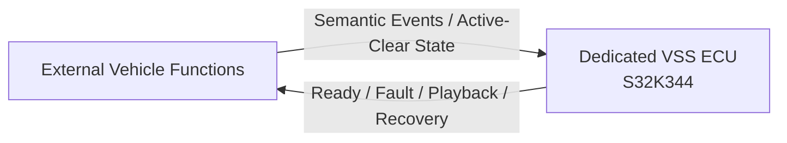
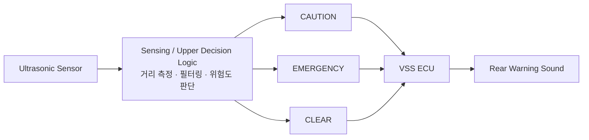

# VSS Logical Interface Needs — Pre-Network Draft

> 목적: 통신 설계를 선행하지 않고, VSS SysRS에서 필요한 **정보 교환 항목만 보존**한다.  
> 이 문서는 CAN Matrix 또는 Protocol Specification이 아니다.

---

## 1. Logical Interface Overview

> 현재 단계에서는 정보의 **의미와 방향**만 정의한다.  
> 실제 프로토콜, 메시지 ID, 주기 및 Payload는 전체 기능 취합 후 결정한다.

## 2. External → VSS

| Information Need | Purpose | Source Owner | Protocol |
|---|---|---|---|
| 차량 사용 시작 확정 | Welcome 출력 | TBD | Deferred |
| 차량 사용 종료 확정 | Goodbye 출력 | TBD | Deferred |
| 도어 잠금 완료 | Lock 피드백 | TBD | Deferred |
| 도어 잠금 해제 완료 | Unlock 피드백 | TBD | Deferred |
| 도어 잠금 이상 | Warning 출력 | TBD | Deferred |
| 안티핀치 활성/해제 | 긴급 경고 시작/종료 | TBD | Deferred |
| 잔류 탑승자 위험 활성/해제 | 긴급 경고 시작/종료 | TBD | Deferred |
| 후방 장애물 주의 상태 | 후방 주의 경고 시작 | Sensing/Central TBD | Deferred |
| 후방 장애물 긴급 상태 | 후방 긴급 경고로 전환 | Sensing/Central TBD | Deferred |
| 후방 장애물 경고 해제 | 후방 경고 종료 | Sensing/Central TBD | Deferred |

### 후방 장애물 정보 경계

- 초음파 거리 Raw Data를 VSS가 직접 판정하는 구조를 기본으로 하지 않는다.
- 거리 임계값 및 충돌 위험도 판정은 VSS 외부 기능에서 정의한다.
- VSS는 `주의 / 긴급 / 해제` 의미 상태만 필요로 한다.

---

## 3. VSS → External

| Information Need | Purpose | Consumer | Protocol |
|---|---|---|---|
| VSS Ready 여부 | 음향 기능 사용 가능 확인 | TBD | Deferred |
| VSS Fault 여부 | 상위 시스템 오류 확인 | TBD | Deferred |
| 현재 Playback 상태 | 동작 확인/진단 | TBD | Deferred |
| 오류 복구 여부 | 정상 복귀 확인 | TBD | Deferred |
| 필요 시 현재 이벤트 상태 | 통합 진단 및 상태 확인 | TBD | Deferred |

---

## 4. 인터페이스 설계 원칙

- 센서 Raw Data보다 의미가 확정된 상태를 우선 전달한다.
- 상대 ECU가 VSS 내부 Sound Asset 이름을 알 필요가 없도록 한다.
- 상대 ECU가 VSS 내부 재생 Sequence를 세세하게 제어하지 않도록 한다.
- VSS는 이벤트 의미를 받아 로컬 Sound Mapping과 Priority를 적용한다.
- 같은 의미의 상태를 여러 메시지로 중복 정의하지 않는다.
- 실제 주기 및 Timeout은 기능별 필요 반응시간과 전체 Bus Load를 보고 결정한다.

---

## 5. 아직 만들지 않는 것

| Item | Current Status |
|---|---|
| CAN ID | NOT DEFINED |
| Signal ID | NOT DEFINED |
| DLC | NOT DEFINED |
| Bit Position | NOT DEFINED |
| Period | NOT DEFINED |
| Timeout | NOT DEFINED |
| Alive Counter | NOT DEFINED |
| CRC / E2E | NOT DEFINED |
| Bit Rate | NOT DEFINED |
| Rear caution distance | NOT DEFINED |
| Rear emergency distance | NOT DEFINED |
