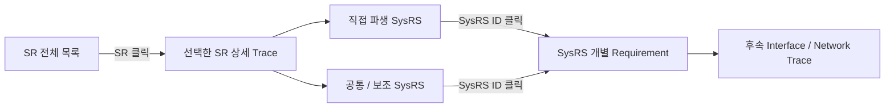

# VSS SR → SysRS Traceability — Navigation Draft

> 목적: **SR 전체 확인 → 특정 SR 선택 → 해당 SR에서 파생된 SysRS 확인** 흐름으로 추적한다.  
> `TR-SR-xxx`는 추적 문서 내부의 탐색용 Reference이며 **SR 원문에 부여하는 공식 요구사항 ID가 아니다.**  
> 상단 SR 문구는 SR Baseline의 표현을 그대로 사용한다.

## Trace Navigation Overview

## 1. SR 전체 목록

특정 항목을 클릭하면 아래의 해당 **SR → SysRS 상세 추적** 위치로 이동한다.

- 추적 Reference: **49개**
- Functional SR: **25개**
- Non-functional SR: **5개**
- Boundary: **6개**
- Scope: **12개**
- Deferred: **1개**

### 3. 기능 경계

- [`BOUNDARY` TR-SR-001](#tr-sr-001) — VSS는 차량 이벤트를 직접 감지하거나 해당 이벤트의 발생 조건을 판단하는 기능을 담당하지 않는다.
- [`BOUNDARY` TR-SR-002](#tr-sr-002) — VSS는 확정된 이벤트에 대응하는 음향을 제공해야 한다.

### 4.1 차량 사용 시작 및 종료

- [`FUNCTIONAL` TR-SR-003](#tr-sr-003) — 차량 사용 시작 상태가 확정된 경우 사용자가 인지할 수 있는 웰컴 음향이 제공되어야 한다.
- [`FUNCTIONAL` TR-SR-004](#tr-sr-004) — 차량 사용 종료 상태가 확정된 경우 사용자가 인지할 수 있는 굿바이 음향이 제공되어야 한다.
- [`FUNCTIONAL` TR-SR-005](#tr-sr-005) — 차량 사용 시작 및 종료 음향은 안전 관련 경고보다 우선해서는 안 된다.

### 4.2 도어 잠금 및 잠금 해제

- [`FUNCTIONAL` TR-SR-006](#tr-sr-006) — 도어 잠금이 정상적으로 완료된 경우 잠금 완료를 인지할 수 있는 음향이 제공되어야 한다.
- [`FUNCTIONAL` TR-SR-007](#tr-sr-007) — 도어 잠금 해제가 정상적으로 완료된 경우 잠금 완료 음향과 구분 가능한 음향이 제공되어야 한다.
- [`FUNCTIONAL` TR-SR-008](#tr-sr-008) — 도어가 정상적으로 잠기지 않은 상태가 확인된 경우 정상 잠금 완료 음향과 구분 가능한 경고가 제공되어야 한다.

### 5.1 파워윈도우 안티핀치

- [`FUNCTIONAL` TR-SR-009](#tr-sr-009) — 파워윈도우 끼임 위험이 확인된 경우 일반 피드백과 명확히 구분 가능한 긴급 경고음이 제공되어야 한다.
- [`FUNCTIONAL` TR-SR-010](#tr-sr-010) — 안티핀치 경고는 일반 피드백 및 주의 수준의 경고보다 우선적으로 인지되어야 한다.
- [`FUNCTIONAL` TR-SR-011](#tr-sr-011) — 끼임 위험 상태가 해제된 경우 해당 지속 경고음은 종료되어야 한다.

### 5.2 잔류 탑승자

- [`FUNCTIONAL` TR-SR-012](#tr-sr-012) — 차량 내부의 위험 상태에서 잔류 탑승자가 확인된 경우 사용자가 인지할 수 있는 긴급 경고음이 제공되어야 한다.
- [`FUNCTIONAL` TR-SR-013](#tr-sr-013) — 잔류 탑승자 위험 상태가 해제된 경우 해당 지속 경고음은 종료되어야 한다.

### 5.3 후방 장애물 접근 및 충돌 위험 경고

- [`FUNCTIONAL` TR-SR-014](#tr-sr-014) — 차량 후방의 장애물이 주의가 필요한 거리 범위에 접근한 것으로 확인된 경우 사용자가 이를 인지할 수 있는 주의 경고음이 제공되어야 한다.
- [`FUNCTIONAL` TR-SR-015](#tr-sr-015) — 차량 후방의 장애물이 충돌 위험이 높은 거리 범위에 접근한 것으로 확인된 경우 주의 경고음보다 명확히 구분되는 긴급 경고음이 제공되어야 한다.
- [`FUNCTIONAL` TR-SR-016](#tr-sr-016) — 후방 장애물의 충돌 위험 수준이 높아질수록 사용자가 위험 증가를 구분할 수 있는 음향이 제공되어야 한다.
- [`FUNCTIONAL` TR-SR-017](#tr-sr-017) — 후방 장애물이 경고 대상 범위를 벗어난 경우 해당 경고음은 종료되어야 한다.

### 6. 음향 우선순위 요구사항

- [`FUNCTIONAL` TR-SR-018](#tr-sr-018) — 안전과 직접 관련된 긴급 경고는 주의 경고 및 일반 피드백보다 우선되어야 한다.
- [`FUNCTIONAL` TR-SR-019](#tr-sr-019) — 주의 경고는 일반 피드백보다 우선되어야 한다.
- [`FUNCTIONAL` TR-SR-020](#tr-sr-020) — 서로 다른 의미의 음향이 동시에 출력되어 사용자가 상황을 구분하기 어렵게 되어서는 안 된다.
- [`FUNCTIONAL` TR-SR-021](#tr-sr-021) — 높은 우선순위의 경고가 발생한 경우 낮은 우선순위 음향은 해당 경고의 인지를 방해하지 않아야 한다.
- [`FUNCTIONAL` TR-SR-022](#tr-sr-022) — 안전 경고가 종료된 후 이미 유효 시점을 지난 일반 피드백이 불필요하게 다시 출력되어서는 안 된다.

### 7. 상태 및 오류 요구사항

- [`FUNCTIONAL` TR-SR-023](#tr-sr-023) — VSS가 정상적으로 음향을 제공할 수 있는 상태인지 상위 차량 시스템에서 확인할 수 있어야 한다.
- [`FUNCTIONAL` TR-SR-024](#tr-sr-024) — VSS가 정상적으로 음향을 제공할 수 없는 오류가 발생한 경우 해당 오류 상태를 상위 차량 시스템에서 확인할 수 있어야 한다.
- [`FUNCTIONAL` TR-SR-025](#tr-sr-025) — 지원되지 않거나 유효하지 않은 음향 요청으로 인해 잘못된 의미의 음향이 출력되어서는 안 된다.
- [`FUNCTIONAL` TR-SR-026](#tr-sr-026) — VSS의 오류가 다른 차량 기능의 동작을 불필요하게 중단시켜서는 안 된다.
- [`FUNCTIONAL` TR-SR-027](#tr-sr-027) — VSS가 오류 상태에서 정상 상태로 복구된 경우 상위 차량 시스템에서 복구 여부를 확인할 수 있어야 한다.

### 8. 음향 품질 및 비기능 요구사항

- [`NON_FUNCTIONAL` TR-SR-028](#tr-sr-028) — 서로 다른 의미를 가진 주요 피드백 및 경고음은 사용자가 구분할 수 있어야 한다.
- [`NON_FUNCTIONAL` TR-SR-029](#tr-sr-029) — 안전 관련 경고음은 일반 피드백음과 혼동하기 어렵도록 구분되어야 한다.
- [`NON_FUNCTIONAL` TR-SR-030](#tr-sr-030) — 동일한 차량 이벤트는 정상 동작 상태에서 일관된 음향으로 표현되어야 한다.
- [`NON_FUNCTIONAL` TR-SR-031](#tr-sr-031) — VSS는 차량 사용에 필요한 시간 안에 음향 출력이 가능한 상태로 진입해야 한다.
- [`NON_FUNCTIONAL` TR-SR-032](#tr-sr-032) — 안전 관련 이벤트에 대한 음향은 사용자가 적절한 시점에 인지할 수 있도록 제공되어야 한다.
- [`DEFERRED` TR-SR-033](#tr-sr-033) — 실제 출력 수준과 평가 조건은 적용 오디오 하드웨어 및 시험 환경이 확정된 후 정의되어야 한다.

### 9. 기능 제외 범위

- [`SCOPE` TR-SR-034](#tr-sr-034) — 조도 센서 값에 따른 자동 음량 변경
- [`SCOPE` TR-SR-035](#tr-sr-035) — 시간대 또는 주야간 상태에 따른 자동 음량 변경
- [`SCOPE` TR-SR-036](#tr-sr-036) — 외부 장치에서 전달되는 오디오 스트리밍
- [`SCOPE` TR-SR-037](#tr-sr-037) — 차량 네트워크를 통한 음원 파일 전송 및 스트리밍 재생
- [`SCOPE` TR-SR-038](#tr-sr-038) — 일반 음악 재생
- [`SCOPE` TR-SR-039](#tr-sr-039) — 플레이리스트 관리
- [`SCOPE` TR-SR-040](#tr-sr-040) — 곡 선택, 탐색 또는 재생 위치 이동
- [`SCOPE` TR-SR-041](#tr-sr-041) — 다수 음원의 동시 믹싱
- [`SCOPE` TR-SR-042](#tr-sr-042) — 일반 미디어 음향의 Ducking
- [`SCOPE` TR-SR-043](#tr-sr-043) — Fade-in 또는 Fade-out 연출
- [`SCOPE` TR-SR-044](#tr-sr-044) — 이퀄라이저 및 음장 효과
- [`SCOPE` TR-SR-045](#tr-sr-045) — VSS의 핵심 기능은 **차량 이벤트에 대응하는 저장 음향 기반의 피드백 및 경고 제공**으로 한정한다.

### 10. 상위 시스템 연계 원칙

- [`BOUNDARY` TR-SR-046](#tr-sr-046) — VSS는 센서 원시 데이터를 직접 해석하지 않아야 한다.
- [`BOUNDARY` TR-SR-047](#tr-sr-047) — VSS에는 음향 출력에 필요한 의미가 확정된 차량 이벤트가 제공되어야 한다.
- [`BOUNDARY` TR-SR-048](#tr-sr-048) — VSS의 세부 음향 재생 방법은 상위 차량 기능이 직접 제어하지 않아야 한다.
- [`BOUNDARY` TR-SR-049](#tr-sr-049) — VSS의 상태 및 오류는 상위 차량 시스템에서 활용 가능해야 한다.

---

## 2. SR → SysRS 상세 추적

각 항목은 **SR 원문 → 직접 파생 SysRS → 공통/보조 SysRS** 순서로 구성한다.

### TR-SR-001 · 3. 기능 경계

**분류:** `BOUNDARY`  
**Trace 상태:** `COVERED`

**SR 원문**

> VSS는 차량 이벤트를 직접 감지하거나 해당 이벤트의 발생 조건을 판단하는 기능을 담당하지 않는다.

**직접 파생 SysRS**

- [VSS-SYS-INT-005](./02_VSS_SYSRS_FUNCTIONAL_BASELINE_DRAFT_v0.2.5.md#vss-sys-int-005) — 이벤트 정보는 VSS가 센서 Raw Data를 직접 판정하지 않아도 될 정도로 의미가 확정된 형태여야 한다.

**공통 / 보조 SysRS**

- [VSS-SYS-FUN-018](./02_VSS_SYSRS_FUNCTIONAL_BASELINE_DRAFT_v0.2.5.md#vss-sys-fun-018) — VSS ECU는 후방 장애물의 실제 거리값을 이용하여 위험 수준을 직접 판정하지 않아야 한다.
- [VSS-SYS-INT-004](./02_VSS_SYSRS_FUNCTIONAL_BASELINE_DRAFT_v0.2.5.md#vss-sys-int-004) — VSS ECU에 제공되는 후방 장애물 정보는 거리 Raw Data가 아니라 위험 수준이 판단된 의미 상태를 기본으로 해야 한다.
- [VSS-SYS-NFR-011](./02_VSS_SYSRS_FUNCTIONAL_BASELINE_DRAFT_v0.2.5.md#vss-sys-nfr-011) — VSS ECU는 실제 파워윈도우 또는 초음파 센서를 직접 연결하지 않고 의미 이벤트 입력만으로 핵심 음향 기능을 시험할 수 있어야 한다.

[↑ SR 전체 목록으로](#sr-index)

---

### TR-SR-002 · 3. 기능 경계

**분류:** `BOUNDARY`  
**Trace 상태:** `COVERED`

**SR 원문**

> VSS는 확정된 이벤트에 대응하는 음향을 제공해야 한다.

**직접 파생 SysRS**

- [VSS-SYS-FUN-002](./02_VSS_SYSRS_FUNCTIONAL_BASELINE_DRAFT_v0.2.5.md#vss-sys-fun-002) — VSS ECU는 외부 차량 시스템에서 제공된 유효한 VSS 이벤트를 수용할 수 있어야 한다.
- [VSS-SYS-FUN-003](./02_VSS_SYSRS_FUNCTIONAL_BASELINE_DRAFT_v0.2.5.md#vss-sys-fun-003) — VSS ECU는 수용한 이벤트를 사전에 정의된 로컬 음향 자산과 대응시켜야 한다.

**공통 / 보조 SysRS**

- [VSS-SYS-INT-001](./02_VSS_SYSRS_FUNCTIONAL_BASELINE_DRAFT_v0.2.5.md#vss-sys-int-001) — VSS ECU는 어떤 차량 이벤트가 발생했는지 식별 가능한 정보를 제공받아야 한다.

[↑ SR 전체 목록으로](#sr-index)

---

### TR-SR-003 · 4.1 차량 사용 시작 및 종료

**분류:** `FUNCTIONAL`  
**Trace 상태:** `COVERED`

**SR 원문**

> 차량 사용 시작 상태가 확정된 경우 사용자가 인지할 수 있는 웰컴 음향이 제공되어야 한다.

**직접 파생 SysRS**

- [VSS-SYS-FUN-028](./02_VSS_SYSRS_FUNCTIONAL_BASELINE_DRAFT_v0.2.5.md#vss-sys-fun-028) — `VEHICLE_WELCOME` 이벤트가 유효하게 수용된 경우 VSS ECU는 차량 사용 시작을 나타내는 일반 피드백 음향을 1회 출력해야 한다.

**공통 / 보조 SysRS**

- [VSS-SYS-PER-002](./02_VSS_SYSRS_FUNCTIONAL_BASELINE_DRAFT_v0.2.5.md#vss-sys-per-002) — 일반 피드백 이벤트가 VSS 내부에서 유효하게 수용된 시점부터 음향 출력이 시작될 때까지의 지연은 제한되어야 한다.

[↑ SR 전체 목록으로](#sr-index)

---

### TR-SR-004 · 4.1 차량 사용 시작 및 종료

**분류:** `FUNCTIONAL`  
**Trace 상태:** `COVERED`

**SR 원문**

> 차량 사용 종료 상태가 확정된 경우 사용자가 인지할 수 있는 굿바이 음향이 제공되어야 한다.

**직접 파생 SysRS**

- [VSS-SYS-FUN-029](./02_VSS_SYSRS_FUNCTIONAL_BASELINE_DRAFT_v0.2.5.md#vss-sys-fun-029) — `VEHICLE_GOODBYE` 이벤트가 유효하게 수용된 경우 VSS ECU는 차량 사용 종료를 나타내는 일반 피드백 음향을 1회 출력해야 한다.

**공통 / 보조 SysRS**

- [VSS-SYS-PER-002](./02_VSS_SYSRS_FUNCTIONAL_BASELINE_DRAFT_v0.2.5.md#vss-sys-per-002) — 일반 피드백 이벤트가 VSS 내부에서 유효하게 수용된 시점부터 음향 출력이 시작될 때까지의 지연은 제한되어야 한다.

[↑ SR 전체 목록으로](#sr-index)

---

### TR-SR-005 · 4.1 차량 사용 시작 및 종료

**분류:** `FUNCTIONAL`  
**Trace 상태:** `COVERED`

**SR 원문**

> 차량 사용 시작 및 종료 음향은 안전 관련 경고보다 우선해서는 안 된다.

**직접 파생 SysRS**

- [VSS-SYS-SAF-001](./02_VSS_SYSRS_FUNCTIONAL_BASELINE_DRAFT_v0.2.5.md#vss-sys-saf-001) — 긴급 경고는 주의 경고 및 일반 피드백보다 높은 우선순위로 처리되어야 한다.
- [VSS-SYS-SAF-002](./02_VSS_SYSRS_FUNCTIONAL_BASELINE_DRAFT_v0.2.5.md#vss-sys-saf-002) — 주의 경고는 일반 피드백보다 높은 우선순위로 처리되어야 한다.

**공통 / 보조 SysRS**

- [VSS-SYS-FUN-006](./02_VSS_SYSRS_FUNCTIONAL_BASELINE_DRAFT_v0.2.5.md#vss-sys-fun-006) — VSS ECU는 일반 피드백, 주의 경고, 긴급 경고의 세 우선순위 등급을 구분해야 한다.

[↑ SR 전체 목록으로](#sr-index)

---

### TR-SR-006 · 4.2 도어 잠금 및 잠금 해제

**분류:** `FUNCTIONAL`  
**Trace 상태:** `COVERED`

**SR 원문**

> 도어 잠금이 정상적으로 완료된 경우 잠금 완료를 인지할 수 있는 음향이 제공되어야 한다.

**직접 파생 SysRS**

- [VSS-SYS-FUN-030](./02_VSS_SYSRS_FUNCTIONAL_BASELINE_DRAFT_v0.2.5.md#vss-sys-fun-030) — `DOOR_LOCK_COMPLETE` 이벤트가 유효하게 수용된 경우 VSS ECU는 도어 잠금 완료를 나타내는 일반 피드백 음향을 출력해야 한다.

**공통 / 보조 SysRS**

- [VSS-SYS-PER-002](./02_VSS_SYSRS_FUNCTIONAL_BASELINE_DRAFT_v0.2.5.md#vss-sys-per-002) — 일반 피드백 이벤트가 VSS 내부에서 유효하게 수용된 시점부터 음향 출력이 시작될 때까지의 지연은 제한되어야 한다.

[↑ SR 전체 목록으로](#sr-index)

---

### TR-SR-007 · 4.2 도어 잠금 및 잠금 해제

**분류:** `FUNCTIONAL`  
**Trace 상태:** `COVERED`

**SR 원문**

> 도어 잠금 해제가 정상적으로 완료된 경우 잠금 완료 음향과 구분 가능한 음향이 제공되어야 한다.

**직접 파생 SysRS**

- [VSS-SYS-FUN-031](./02_VSS_SYSRS_FUNCTIONAL_BASELINE_DRAFT_v0.2.5.md#vss-sys-fun-031) — `DOOR_UNLOCK_COMPLETE` 이벤트가 유효하게 수용된 경우 VSS ECU는 도어 잠금 완료 음향과 구분 가능한 음향 또는 재생 패턴을 출력해야 한다.

**공통 / 보조 SysRS**

- [VSS-SYS-NFR-014](./02_VSS_SYSRS_FUNCTIONAL_BASELINE_DRAFT_v0.2.5.md#vss-sys-nfr-014) — 서로 다른 의미를 가진 주요 피드백 및 경고 음향은 사용자가 의미 차이를 구분할 수 있도록 서로 구분 가능한 재생 특성을 가져야 한다.

[↑ SR 전체 목록으로](#sr-index)

---

### TR-SR-008 · 4.2 도어 잠금 및 잠금 해제

**분류:** `FUNCTIONAL`  
**Trace 상태:** `COVERED`

**SR 원문**

> 도어가 정상적으로 잠기지 않은 상태가 확인된 경우 정상 잠금 완료 음향과 구분 가능한 경고가 제공되어야 한다.

**직접 파생 SysRS**

- [VSS-SYS-FUN-032](./02_VSS_SYSRS_FUNCTIONAL_BASELINE_DRAFT_v0.2.5.md#vss-sys-fun-032) — `DOOR_LOCK_ERROR` 이벤트가 유효하게 수용된 경우 VSS ECU는 정상 잠금 완료 음향과 구분 가능한 주의 경고음을 출력해야 한다.

**공통 / 보조 SysRS**

- [VSS-SYS-SAF-002](./02_VSS_SYSRS_FUNCTIONAL_BASELINE_DRAFT_v0.2.5.md#vss-sys-saf-002) — 주의 경고는 일반 피드백보다 높은 우선순위로 처리되어야 한다.
- [VSS-SYS-PER-003](./02_VSS_SYSRS_FUNCTIONAL_BASELINE_DRAFT_v0.2.5.md#vss-sys-per-003) — 주의 경고 이벤트가 VSS 내부에서 유효하게 수용된 시점부터 음향 출력이 시작될 때까지의 지연은 제한되어야 한다.
- [VSS-SYS-NFR-014](./02_VSS_SYSRS_FUNCTIONAL_BASELINE_DRAFT_v0.2.5.md#vss-sys-nfr-014) — 서로 다른 의미를 가진 주요 피드백 및 경고 음향은 사용자가 의미 차이를 구분할 수 있도록 서로 구분 가능한 재생 특성을 가져야 한다.

[↑ SR 전체 목록으로](#sr-index)

---

### TR-SR-009 · 5.1 파워윈도우 안티핀치

**분류:** `FUNCTIONAL`  
**Trace 상태:** `COVERED`

**SR 원문**

> 파워윈도우 끼임 위험이 확인된 경우 일반 피드백과 명확히 구분 가능한 긴급 경고음이 제공되어야 한다.

**직접 파생 SysRS**

- [VSS-SYS-FUN-033](./02_VSS_SYSRS_FUNCTIONAL_BASELINE_DRAFT_v0.2.5.md#vss-sys-fun-033) — `WINDOW_ANTIPINCH` 위험 상태가 유효하게 수용된 경우 VSS ECU는 긴급 경고음을 출력하고 해당 위험 상태가 유지되는 동안 경고를 지속할 수 있어야 한다.

**공통 / 보조 SysRS**

- [VSS-SYS-SAF-001](./02_VSS_SYSRS_FUNCTIONAL_BASELINE_DRAFT_v0.2.5.md#vss-sys-saf-001) — 긴급 경고는 주의 경고 및 일반 피드백보다 높은 우선순위로 처리되어야 한다.
- [VSS-SYS-PER-004](./02_VSS_SYSRS_FUNCTIONAL_BASELINE_DRAFT_v0.2.5.md#vss-sys-per-004) — 긴급 경고 이벤트가 VSS 내부에서 유효하게 수용된 시점부터 음향 출력이 시작될 때까지의 지연은 제한되어야 한다.
- [VSS-SYS-NFR-014](./02_VSS_SYSRS_FUNCTIONAL_BASELINE_DRAFT_v0.2.5.md#vss-sys-nfr-014) — 서로 다른 의미를 가진 주요 피드백 및 경고 음향은 사용자가 의미 차이를 구분할 수 있도록 서로 구분 가능한 재생 특성을 가져야 한다.

[↑ SR 전체 목록으로](#sr-index)

---

### TR-SR-010 · 5.1 파워윈도우 안티핀치

**분류:** `FUNCTIONAL`  
**Trace 상태:** `COVERED`

**SR 원문**

> 안티핀치 경고는 일반 피드백 및 주의 수준의 경고보다 우선적으로 인지되어야 한다.

**직접 파생 SysRS**

- [VSS-SYS-SAF-001](./02_VSS_SYSRS_FUNCTIONAL_BASELINE_DRAFT_v0.2.5.md#vss-sys-saf-001) — 긴급 경고는 주의 경고 및 일반 피드백보다 높은 우선순위로 처리되어야 한다.

**공통 / 보조 SysRS**

- [VSS-SYS-FUN-007](./02_VSS_SYSRS_FUNCTIONAL_BASELINE_DRAFT_v0.2.5.md#vss-sys-fun-007) — 긴급 경고는 현재 출력 중인 주의 경고 및 일반 피드백보다 우선해야 한다.
- [VSS-SYS-PER-005](./02_VSS_SYSRS_FUNCTIONAL_BASELINE_DRAFT_v0.2.5.md#vss-sys-per-005) — 긴급 경고가 낮은 우선순위 음향을 선점하는 내부 처리 시간은 제한되어야 한다.

[↑ SR 전체 목록으로](#sr-index)

---

### TR-SR-011 · 5.1 파워윈도우 안티핀치

**분류:** `FUNCTIONAL`  
**Trace 상태:** `COVERED`

**SR 원문**

> 끼임 위험 상태가 해제된 경우 해당 지속 경고음은 종료되어야 한다.

**직접 파생 SysRS**

- [VSS-SYS-FUN-013](./02_VSS_SYSRS_FUNCTIONAL_BASELINE_DRAFT_v0.2.5.md#vss-sys-fun-013) — 상태 유지형 경고의 해제 정보가 유효하게 제공된 경우 해당 경고음은 종료되어야 한다.

**공통 / 보조 SysRS**

- [VSS-SYS-PER-006](./02_VSS_SYSRS_FUNCTIONAL_BASELINE_DRAFT_v0.2.5.md#vss-sys-per-006) — 상태 유지형 경고의 유효한 해제 정보가 VSS 내부에서 수용된 후 음향 출력이 종료될 때까지의 지연은 제한되어야 한다.
- [VSS-SYS-INT-002](./02_VSS_SYSRS_FUNCTIONAL_BASELINE_DRAFT_v0.2.5.md#vss-sys-int-002) — 지속형 이벤트의 경우 VSS ECU는 해당 이벤트의 활성 및 해제 상태를 구분 가능한 형태로 제공받아야 한다.

[↑ SR 전체 목록으로](#sr-index)

---

### TR-SR-012 · 5.2 잔류 탑승자

**분류:** `FUNCTIONAL`  
**Trace 상태:** `COVERED`

**SR 원문**

> 차량 내부의 위험 상태에서 잔류 탑승자가 확인된 경우 사용자가 인지할 수 있는 긴급 경고음이 제공되어야 한다.

**직접 파생 SysRS**

- [VSS-SYS-FUN-034](./02_VSS_SYSRS_FUNCTIONAL_BASELINE_DRAFT_v0.2.5.md#vss-sys-fun-034) — `OCCUPANT_HAZARD` 상태가 유효하게 수용된 경우 VSS ECU는 긴급 경고음을 출력하고 해당 위험 상태가 유지되는 동안 경고를 지속할 수 있어야 한다.

**공통 / 보조 SysRS**

- [VSS-SYS-SAF-001](./02_VSS_SYSRS_FUNCTIONAL_BASELINE_DRAFT_v0.2.5.md#vss-sys-saf-001) — 긴급 경고는 주의 경고 및 일반 피드백보다 높은 우선순위로 처리되어야 한다.
- [VSS-SYS-PER-004](./02_VSS_SYSRS_FUNCTIONAL_BASELINE_DRAFT_v0.2.5.md#vss-sys-per-004) — 긴급 경고 이벤트가 VSS 내부에서 유효하게 수용된 시점부터 음향 출력이 시작될 때까지의 지연은 제한되어야 한다.

[↑ SR 전체 목록으로](#sr-index)

---

### TR-SR-013 · 5.2 잔류 탑승자

**분류:** `FUNCTIONAL`  
**Trace 상태:** `COVERED`

**SR 원문**

> 잔류 탑승자 위험 상태가 해제된 경우 해당 지속 경고음은 종료되어야 한다.

**직접 파생 SysRS**

- [VSS-SYS-FUN-013](./02_VSS_SYSRS_FUNCTIONAL_BASELINE_DRAFT_v0.2.5.md#vss-sys-fun-013) — 상태 유지형 경고의 해제 정보가 유효하게 제공된 경우 해당 경고음은 종료되어야 한다.

**공통 / 보조 SysRS**

- [VSS-SYS-PER-006](./02_VSS_SYSRS_FUNCTIONAL_BASELINE_DRAFT_v0.2.5.md#vss-sys-per-006) — 상태 유지형 경고의 유효한 해제 정보가 VSS 내부에서 수용된 후 음향 출력이 종료될 때까지의 지연은 제한되어야 한다.
- [VSS-SYS-INT-002](./02_VSS_SYSRS_FUNCTIONAL_BASELINE_DRAFT_v0.2.5.md#vss-sys-int-002) — 지속형 이벤트의 경우 VSS ECU는 해당 이벤트의 활성 및 해제 상태를 구분 가능한 형태로 제공받아야 한다.

[↑ SR 전체 목록으로](#sr-index)

---

### TR-SR-014 · 5.3 후방 장애물 접근 및 충돌 위험 경고

**분류:** `FUNCTIONAL`  
**Trace 상태:** `COVERED`

**SR 원문**

> 차량 후방의 장애물이 주의가 필요한 거리 범위에 접근한 것으로 확인된 경우 사용자가 이를 인지할 수 있는 주의 경고음이 제공되어야 한다.

**직접 파생 SysRS**

- [VSS-SYS-FUN-014](./02_VSS_SYSRS_FUNCTIONAL_BASELINE_DRAFT_v0.2.5.md#vss-sys-fun-014) — VSS ECU는 후방 장애물 주의 상태가 유효하게 제공된 경우 주의 경고음을 출력해야 한다.

**공통 / 보조 SysRS**

- [VSS-SYS-PER-003](./02_VSS_SYSRS_FUNCTIONAL_BASELINE_DRAFT_v0.2.5.md#vss-sys-per-003) — 주의 경고 이벤트가 VSS 내부에서 유효하게 수용된 시점부터 음향 출력이 시작될 때까지의 지연은 제한되어야 한다.
- [VSS-SYS-INT-003](./02_VSS_SYSRS_FUNCTIONAL_BASELINE_DRAFT_v0.2.5.md#vss-sys-int-003) — 후방 장애물 경고 기능을 위해 VSS ECU는 최소한 `주의`, `긴급`, `해제`의 의미 상태를 구분 가능한 형태로 제공받아야 한다.

[↑ SR 전체 목록으로](#sr-index)

---

### TR-SR-015 · 5.3 후방 장애물 접근 및 충돌 위험 경고

**분류:** `FUNCTIONAL`  
**Trace 상태:** `COVERED`

**SR 원문**

> 차량 후방의 장애물이 충돌 위험이 높은 거리 범위에 접근한 것으로 확인된 경우 주의 경고음보다 명확히 구분되는 긴급 경고음이 제공되어야 한다.

**직접 파생 SysRS**

- [VSS-SYS-FUN-015](./02_VSS_SYSRS_FUNCTIONAL_BASELINE_DRAFT_v0.2.5.md#vss-sys-fun-015) — VSS ECU는 후방 장애물 긴급 상태가 유효하게 제공된 경우 주의 경고음과 구분되는 긴급 경고음을 출력해야 한다.

**공통 / 보조 SysRS**

- [VSS-SYS-PER-004](./02_VSS_SYSRS_FUNCTIONAL_BASELINE_DRAFT_v0.2.5.md#vss-sys-per-004) — 긴급 경고 이벤트가 VSS 내부에서 유효하게 수용된 시점부터 음향 출력이 시작될 때까지의 지연은 제한되어야 한다.
- [VSS-SYS-INT-003](./02_VSS_SYSRS_FUNCTIONAL_BASELINE_DRAFT_v0.2.5.md#vss-sys-int-003) — 후방 장애물 경고 기능을 위해 VSS ECU는 최소한 `주의`, `긴급`, `해제`의 의미 상태를 구분 가능한 형태로 제공받아야 한다.
- [VSS-SYS-NFR-014](./02_VSS_SYSRS_FUNCTIONAL_BASELINE_DRAFT_v0.2.5.md#vss-sys-nfr-014) — 서로 다른 의미를 가진 주요 피드백 및 경고 음향은 사용자가 의미 차이를 구분할 수 있도록 서로 구분 가능한 재생 특성을 가져야 한다.

[↑ SR 전체 목록으로](#sr-index)

---

### TR-SR-016 · 5.3 후방 장애물 접근 및 충돌 위험 경고

**분류:** `FUNCTIONAL`  
**Trace 상태:** `COVERED`

**SR 원문**

> 후방 장애물의 충돌 위험 수준이 높아질수록 사용자가 위험 증가를 구분할 수 있는 음향이 제공되어야 한다.

**직접 파생 SysRS**

- [VSS-SYS-FUN-016](./02_VSS_SYSRS_FUNCTIONAL_BASELINE_DRAFT_v0.2.5.md#vss-sys-fun-016) — 후방 장애물 상태가 주의에서 긴급으로 변경된 경우 VSS ECU는 긴급 경고를 우선 출력해야 한다.
- [VSS-SYS-SAF-003](./02_VSS_SYSRS_FUNCTIONAL_BASELINE_DRAFT_v0.2.5.md#vss-sys-saf-003) — 후방 장애물 긴급 상태는 후방 장애물 주의 상태보다 높은 우선순위로 처리되어야 한다.

**공통 / 보조 SysRS**

- [VSS-SYS-PER-007](./02_VSS_SYSRS_FUNCTIONAL_BASELINE_DRAFT_v0.2.5.md#vss-sys-per-007) — 후방 장애물 상태가 주의에서 긴급으로 변경된 후 긴급 경고 출력으로 전환되는 시간은 제한되어야 한다.

[↑ SR 전체 목록으로](#sr-index)

---

### TR-SR-017 · 5.3 후방 장애물 접근 및 충돌 위험 경고

**분류:** `FUNCTIONAL`  
**Trace 상태:** `COVERED`

**SR 원문**

> 후방 장애물이 경고 대상 범위를 벗어난 경우 해당 경고음은 종료되어야 한다.

**직접 파생 SysRS**

- [VSS-SYS-FUN-017](./02_VSS_SYSRS_FUNCTIONAL_BASELINE_DRAFT_v0.2.5.md#vss-sys-fun-017) — 후방 장애물 위험 해제 상태가 유효하게 제공된 경우 VSS ECU는 해당 장애물 경고음을 종료해야 한다.

**공통 / 보조 SysRS**

- [VSS-SYS-PER-006](./02_VSS_SYSRS_FUNCTIONAL_BASELINE_DRAFT_v0.2.5.md#vss-sys-per-006) — 상태 유지형 경고의 유효한 해제 정보가 VSS 내부에서 수용된 후 음향 출력이 종료될 때까지의 지연은 제한되어야 한다.
- [VSS-SYS-INT-003](./02_VSS_SYSRS_FUNCTIONAL_BASELINE_DRAFT_v0.2.5.md#vss-sys-int-003) — 후방 장애물 경고 기능을 위해 VSS ECU는 최소한 `주의`, `긴급`, `해제`의 의미 상태를 구분 가능한 형태로 제공받아야 한다.

[↑ SR 전체 목록으로](#sr-index)

---

### TR-SR-018 · 6. 음향 우선순위 요구사항

**분류:** `FUNCTIONAL`  
**Trace 상태:** `COVERED`

**SR 원문**

> 안전과 직접 관련된 긴급 경고는 주의 경고 및 일반 피드백보다 우선되어야 한다.

**직접 파생 SysRS**

- [VSS-SYS-SAF-001](./02_VSS_SYSRS_FUNCTIONAL_BASELINE_DRAFT_v0.2.5.md#vss-sys-saf-001) — 긴급 경고는 주의 경고 및 일반 피드백보다 높은 우선순위로 처리되어야 한다.

**공통 / 보조 SysRS**

- [VSS-SYS-FUN-007](./02_VSS_SYSRS_FUNCTIONAL_BASELINE_DRAFT_v0.2.5.md#vss-sys-fun-007) — 긴급 경고는 현재 출력 중인 주의 경고 및 일반 피드백보다 우선해야 한다.
- [VSS-SYS-NFR-006](./02_VSS_SYSRS_FUNCTIONAL_BASELINE_DRAFT_v0.2.5.md#vss-sys-nfr-006) — 동시에 여러 이벤트가 유효한 경우 결과 음향은 명시된 우선순위 정책에 따라 결정되어야 한다.

[↑ SR 전체 목록으로](#sr-index)

---

### TR-SR-019 · 6. 음향 우선순위 요구사항

**분류:** `FUNCTIONAL`  
**Trace 상태:** `COVERED`

**SR 원문**

> 주의 경고는 일반 피드백보다 우선되어야 한다.

**직접 파생 SysRS**

- [VSS-SYS-SAF-002](./02_VSS_SYSRS_FUNCTIONAL_BASELINE_DRAFT_v0.2.5.md#vss-sys-saf-002) — 주의 경고는 일반 피드백보다 높은 우선순위로 처리되어야 한다.

**공통 / 보조 SysRS**

- [VSS-SYS-FUN-008](./02_VSS_SYSRS_FUNCTIONAL_BASELINE_DRAFT_v0.2.5.md#vss-sys-fun-008) — 주의 경고는 현재 출력 중인 일반 피드백보다 우선해야 한다.
- [VSS-SYS-NFR-006](./02_VSS_SYSRS_FUNCTIONAL_BASELINE_DRAFT_v0.2.5.md#vss-sys-nfr-006) — 동시에 여러 이벤트가 유효한 경우 결과 음향은 명시된 우선순위 정책에 따라 결정되어야 한다.

[↑ SR 전체 목록으로](#sr-index)

---

### TR-SR-020 · 6. 음향 우선순위 요구사항

**분류:** `FUNCTIONAL`  
**Trace 상태:** `COVERED`

**SR 원문**

> 서로 다른 의미의 음향이 동시에 출력되어 사용자가 상황을 구분하기 어렵게 되어서는 안 된다.

**직접 파생 SysRS**

- [VSS-SYS-FUN-005](./02_VSS_SYSRS_FUNCTIONAL_BASELINE_DRAFT_v0.2.5.md#vss-sys-fun-005) — VSS ECU는 한 시점에 하나의 음향만 활성 출력해야 한다.

**공통 / 보조 SysRS**

- [VSS-SYS-NFR-007](./02_VSS_SYSRS_FUNCTIONAL_BASELINE_DRAFT_v0.2.5.md#vss-sys-nfr-007) — 한 시점의 활성 음향 수는 1개를 초과하지 않아야 한다.
- [VSS-SYS-NFR-014](./02_VSS_SYSRS_FUNCTIONAL_BASELINE_DRAFT_v0.2.5.md#vss-sys-nfr-014) — 서로 다른 의미를 가진 주요 피드백 및 경고 음향은 사용자가 의미 차이를 구분할 수 있도록 서로 구분 가능한 재생 특성을 가져야 한다.

[↑ SR 전체 목록으로](#sr-index)

---

### TR-SR-021 · 6. 음향 우선순위 요구사항

**분류:** `FUNCTIONAL`  
**Trace 상태:** `COVERED`

**SR 원문**

> 높은 우선순위의 경고가 발생한 경우 낮은 우선순위 음향은 해당 경고의 인지를 방해하지 않아야 한다.

**직접 파생 SysRS**

- [VSS-SYS-FUN-007](./02_VSS_SYSRS_FUNCTIONAL_BASELINE_DRAFT_v0.2.5.md#vss-sys-fun-007) — 긴급 경고는 현재 출력 중인 주의 경고 및 일반 피드백보다 우선해야 한다.
- [VSS-SYS-FUN-008](./02_VSS_SYSRS_FUNCTIONAL_BASELINE_DRAFT_v0.2.5.md#vss-sys-fun-008) — 주의 경고는 현재 출력 중인 일반 피드백보다 우선해야 한다.

**공통 / 보조 SysRS**

- [VSS-SYS-SAF-001](./02_VSS_SYSRS_FUNCTIONAL_BASELINE_DRAFT_v0.2.5.md#vss-sys-saf-001) — 긴급 경고는 주의 경고 및 일반 피드백보다 높은 우선순위로 처리되어야 한다.
- [VSS-SYS-SAF-002](./02_VSS_SYSRS_FUNCTIONAL_BASELINE_DRAFT_v0.2.5.md#vss-sys-saf-002) — 주의 경고는 일반 피드백보다 높은 우선순위로 처리되어야 한다.
- [VSS-SYS-NFR-006](./02_VSS_SYSRS_FUNCTIONAL_BASELINE_DRAFT_v0.2.5.md#vss-sys-nfr-006) — 동시에 여러 이벤트가 유효한 경우 결과 음향은 명시된 우선순위 정책에 따라 결정되어야 한다.

[↑ SR 전체 목록으로](#sr-index)

---

### TR-SR-022 · 6. 음향 우선순위 요구사항

**분류:** `FUNCTIONAL`  
**Trace 상태:** `COVERED`

**SR 원문**

> 안전 경고가 종료된 후 이미 유효 시점을 지난 일반 피드백이 불필요하게 다시 출력되어서는 안 된다.

**직접 파생 SysRS**

- [VSS-SYS-FUN-010](./02_VSS_SYSRS_FUNCTIONAL_BASELINE_DRAFT_v0.2.5.md#vss-sys-fun-010) — 높은 우선순위 이벤트에 의해 중단된 1회성 일반 피드백은 자동으로 재개되지 않아야 한다.

[↑ SR 전체 목록으로](#sr-index)

---

### TR-SR-023 · 7. 상태 및 오류 요구사항

**분류:** `FUNCTIONAL`  
**Trace 상태:** `COVERED`

**SR 원문**

> VSS가 정상적으로 음향을 제공할 수 있는 상태인지 상위 차량 시스템에서 확인할 수 있어야 한다.

**직접 파생 SysRS**

- [VSS-SYS-INT-006](./02_VSS_SYSRS_FUNCTIONAL_BASELINE_DRAFT_v0.2.5.md#vss-sys-int-006) — VSS ECU는 음향 요청 수용 가능 여부를 외부 시스템이 확인할 수 있도록 해야 한다.

**공통 / 보조 SysRS**

- [VSS-SYS-FUN-021](./02_VSS_SYSRS_FUNCTIONAL_BASELINE_DRAFT_v0.2.5.md#vss-sys-fun-021) — VSS ECU는 현재 동작 가능 상태와 오류 존재 여부를 외부 차량 시스템이 확인할 수 있도록 제공해야 한다.
- [VSS-SYS-PER-008](./02_VSS_SYSRS_FUNCTIONAL_BASELINE_DRAFT_v0.2.5.md#vss-sys-per-008) — VSS의 내부 상태가 변경된 후 외부에 제공할 상태 정보가 갱신 가능한 상태가 되기까지의 시간은 제한되어야 한다.

[↑ SR 전체 목록으로](#sr-index)

---

### TR-SR-024 · 7. 상태 및 오류 요구사항

**분류:** `FUNCTIONAL`  
**Trace 상태:** `COVERED`

**SR 원문**

> VSS가 정상적으로 음향을 제공할 수 없는 오류가 발생한 경우 해당 오류 상태를 상위 차량 시스템에서 확인할 수 있어야 한다.

**직접 파생 SysRS**

- [VSS-SYS-INT-007](./02_VSS_SYSRS_FUNCTIONAL_BASELINE_DRAFT_v0.2.5.md#vss-sys-int-007) — VSS ECU는 정상/오류 상태를 외부 시스템이 확인할 수 있도록 해야 한다.
- [VSS-SYS-SAF-006](./02_VSS_SYSRS_FUNCTIONAL_BASELINE_DRAFT_v0.2.5.md#vss-sys-saf-006) — VSS ECU가 정상적인 음향 출력을 보장할 수 없는 경우 해당 상태가 외부 시스템에서 식별 가능해야 한다.

**공통 / 보조 SysRS**

- [VSS-SYS-DIA-001](./02_VSS_SYSRS_FUNCTIONAL_BASELINE_DRAFT_v0.2.5.md#vss-sys-dia-001) — VSS ECU는 정상 음향 출력을 방해하는 오류를 검출할 수 있어야 한다.
- [VSS-SYS-DIA-002](./02_VSS_SYSRS_FUNCTIONAL_BASELINE_DRAFT_v0.2.5.md#vss-sys-dia-002) — VSS ECU는 최근 발생한 주요 오류 원인을 식별 가능하게 유지해야 한다.
- [VSS-SYS-DIA-005](./02_VSS_SYSRS_FUNCTIONAL_BASELINE_DRAFT_v0.2.5.md#vss-sys-dia-005) — 복구에 실패한 경우 VSS ECU는 `FAULT` 상태를 유지하고 오류 상태를 외부에 제공할 수 있어야 한다.
- [VSS-SYS-PER-008](./02_VSS_SYSRS_FUNCTIONAL_BASELINE_DRAFT_v0.2.5.md#vss-sys-per-008) — VSS의 내부 상태가 변경된 후 외부에 제공할 상태 정보가 갱신 가능한 상태가 되기까지의 시간은 제한되어야 한다.

[↑ SR 전체 목록으로](#sr-index)

---

### TR-SR-025 · 7. 상태 및 오류 요구사항

**분류:** `FUNCTIONAL`  
**Trace 상태:** `COVERED`

**SR 원문**

> 지원되지 않거나 유효하지 않은 음향 요청으로 인해 잘못된 의미의 음향이 출력되어서는 안 된다.

**직접 파생 SysRS**

- [VSS-SYS-FUN-019](./02_VSS_SYSRS_FUNCTIONAL_BASELINE_DRAFT_v0.2.5.md#vss-sys-fun-019) — VSS ECU는 지원하지 않는 이벤트를 수용한 경우 임의의 음향을 출력하지 않아야 한다.
- [VSS-SYS-FUN-020](./02_VSS_SYSRS_FUNCTIONAL_BASELINE_DRAFT_v0.2.5.md#vss-sys-fun-020) — VSS ECU는 필요한 로컬 음향 자산을 사용할 수 없는 경우 다른 의미의 음향으로 임의 대체하지 않아야 한다.
- [VSS-SYS-SAF-004](./02_VSS_SYSRS_FUNCTIONAL_BASELINE_DRAFT_v0.2.5.md#vss-sys-saf-004) — 유효하지 않은 이벤트 또는 사용할 수 없는 음향 자산으로 인해 잘못된 의미의 음향이 출력되어서는 안 된다.

**공통 / 보조 SysRS**

- [VSS-SYS-DIA-006](./02_VSS_SYSRS_FUNCTIONAL_BASELINE_DRAFT_v0.2.5.md#vss-sys-dia-006) — 유효하지 않은 이벤트가 수용된 경우 VSS ECU는 잘못된 음향을 출력하지 않고 해당 이상을 진단 가능하게 처리해야 한다.
- [VSS-SYS-DIA-007](./02_VSS_SYSRS_FUNCTIONAL_BASELINE_DRAFT_v0.2.5.md#vss-sys-dia-007) — 필요한 로컬 음향 자산을 사용할 수 없는 경우 해당 이벤트에 대해 잘못된 대체 음향을 출력하지 않아야 한다.
- [VSS-SYS-NFR-001](./02_VSS_SYSRS_FUNCTIONAL_BASELINE_DRAFT_v0.2.5.md#vss-sys-nfr-001) — 유효하지 않은 이벤트 입력이 VSS ECU 전체의 비정상 종료를 유발해서는 안 된다.
- [VSS-SYS-NFR-013](./02_VSS_SYSRS_FUNCTIONAL_BASELINE_DRAFT_v0.2.5.md#vss-sys-nfr-013) — VSS ECU는 음향 자산 미사용 가능, 유효하지 않은 이벤트 및 출력 실패 조건을 시험할 수 있어야 한다.

[↑ SR 전체 목록으로](#sr-index)

---

### TR-SR-026 · 7. 상태 및 오류 요구사항

**분류:** `FUNCTIONAL`  
**Trace 상태:** `COVERED`

**SR 원문**

> VSS의 오류가 다른 차량 기능의 동작을 불필요하게 중단시켜서는 안 된다.

**직접 파생 SysRS**

- [VSS-SYS-SAF-005](./02_VSS_SYSRS_FUNCTIONAL_BASELINE_DRAFT_v0.2.5.md#vss-sys-saf-005) — VSS ECU의 오류가 파워윈도우, 공조, 조명, 센싱 등 다른 차량 기능의 제어 상태를 직접 변경해서는 안 된다.

**공통 / 보조 SysRS**

- [VSS-SYS-NFR-004](./02_VSS_SYSRS_FUNCTIONAL_BASELINE_DRAFT_v0.2.5.md#vss-sys-nfr-004) — VSS 관련 오류는 다른 차량 기능과 기능적으로 격리되어야 한다.

[↑ SR 전체 목록으로](#sr-index)

---

### TR-SR-027 · 7. 상태 및 오류 요구사항

**분류:** `FUNCTIONAL`  
**Trace 상태:** `COVERED`

**SR 원문**

> VSS가 오류 상태에서 정상 상태로 복구된 경우 상위 차량 시스템에서 복구 여부를 확인할 수 있어야 한다.

**직접 파생 SysRS**

- [VSS-SYS-INT-009](./02_VSS_SYSRS_FUNCTIONAL_BASELINE_DRAFT_v0.2.5.md#vss-sys-int-009) — VSS ECU가 오류에서 복구된 경우 외부 시스템이 정상 복귀 여부를 확인할 수 있도록 해야 한다.

**공통 / 보조 SysRS**

- [VSS-SYS-DIA-004](./02_VSS_SYSRS_FUNCTIONAL_BASELINE_DRAFT_v0.2.5.md#vss-sys-dia-004) — 복구 가능한 음향 출력 오류의 경우 VSS ECU는 전체 차량 시스템 재시작 없이 정상 상태로 복귀할 수 있어야 한다.
- [VSS-SYS-DIA-005](./02_VSS_SYSRS_FUNCTIONAL_BASELINE_DRAFT_v0.2.5.md#vss-sys-dia-005) — 복구에 실패한 경우 VSS ECU는 `FAULT` 상태를 유지하고 오류 상태를 외부에 제공할 수 있어야 한다.
- [VSS-SYS-PER-009](./02_VSS_SYSRS_FUNCTIONAL_BASELINE_DRAFT_v0.2.5.md#vss-sys-per-009) — 복구 가능한 VSS 음향 출력 오류는 제한된 시간 안에 정상 상태로 복귀할 수 있어야 한다.

[↑ SR 전체 목록으로](#sr-index)

---

### TR-SR-028 · 8. 음향 품질 및 비기능 요구사항

**분류:** `NON_FUNCTIONAL`  
**Trace 상태:** `COVERED`

**SR 원문**

> 서로 다른 의미를 가진 주요 피드백 및 경고음은 사용자가 구분할 수 있어야 한다.

**직접 파생 SysRS**

- [VSS-SYS-NFR-014](./02_VSS_SYSRS_FUNCTIONAL_BASELINE_DRAFT_v0.2.5.md#vss-sys-nfr-014) — 서로 다른 의미를 가진 주요 피드백 및 경고 음향은 사용자가 의미 차이를 구분할 수 있도록 서로 구분 가능한 재생 특성을 가져야 한다.

**공통 / 보조 SysRS**

- [VSS-SYS-FUN-004](./02_VSS_SYSRS_FUNCTIONAL_BASELINE_DRAFT_v0.2.5.md#vss-sys-fun-004) — VSS ECU는 동일한 이벤트에 대해 정상 상태에서 일관된 음향을 선택해야 한다.
- [VSS-SYS-NFR-012](./02_VSS_SYSRS_FUNCTIONAL_BASELINE_DRAFT_v0.2.5.md#vss-sys-nfr-012) — VSS ECU는 각 의미 이벤트에 대해 대응 음향과 우선순위 정책을 독립적으로 검증할 수 있어야 한다.

[↑ SR 전체 목록으로](#sr-index)

---

### TR-SR-029 · 8. 음향 품질 및 비기능 요구사항

**분류:** `NON_FUNCTIONAL`  
**Trace 상태:** `COVERED`

**SR 원문**

> 안전 관련 경고음은 일반 피드백음과 혼동하기 어렵도록 구분되어야 한다.

**직접 파생 SysRS**

- [VSS-SYS-NFR-014](./02_VSS_SYSRS_FUNCTIONAL_BASELINE_DRAFT_v0.2.5.md#vss-sys-nfr-014) — 서로 다른 의미를 가진 주요 피드백 및 경고 음향은 사용자가 의미 차이를 구분할 수 있도록 서로 구분 가능한 재생 특성을 가져야 한다.

**공통 / 보조 SysRS**

- [VSS-SYS-FUN-006](./02_VSS_SYSRS_FUNCTIONAL_BASELINE_DRAFT_v0.2.5.md#vss-sys-fun-006) — VSS ECU는 일반 피드백, 주의 경고, 긴급 경고의 세 우선순위 등급을 구분해야 한다.
- [VSS-SYS-SAF-001](./02_VSS_SYSRS_FUNCTIONAL_BASELINE_DRAFT_v0.2.5.md#vss-sys-saf-001) — 긴급 경고는 주의 경고 및 일반 피드백보다 높은 우선순위로 처리되어야 한다.
- [VSS-SYS-SAF-002](./02_VSS_SYSRS_FUNCTIONAL_BASELINE_DRAFT_v0.2.5.md#vss-sys-saf-002) — 주의 경고는 일반 피드백보다 높은 우선순위로 처리되어야 한다.

[↑ SR 전체 목록으로](#sr-index)

---

### TR-SR-030 · 8. 음향 품질 및 비기능 요구사항

**분류:** `NON_FUNCTIONAL`  
**Trace 상태:** `COVERED`

**SR 원문**

> 동일한 차량 이벤트는 정상 동작 상태에서 일관된 음향으로 표현되어야 한다.

**직접 파생 SysRS**

- [VSS-SYS-FUN-004](./02_VSS_SYSRS_FUNCTIONAL_BASELINE_DRAFT_v0.2.5.md#vss-sys-fun-004) — VSS ECU는 동일한 이벤트에 대해 정상 상태에서 일관된 음향을 선택해야 한다.

**공통 / 보조 SysRS**

- [VSS-SYS-NFR-005](./02_VSS_SYSRS_FUNCTIONAL_BASELINE_DRAFT_v0.2.5.md#vss-sys-nfr-005) — 동일한 초기 상태와 동일한 이벤트 조건에서는 동일한 우선순위 및 재생 정책이 적용되어야 한다.

[↑ SR 전체 목록으로](#sr-index)

---

### TR-SR-031 · 8. 음향 품질 및 비기능 요구사항

**분류:** `NON_FUNCTIONAL`  
**Trace 상태:** `COVERED`

**SR 원문**

> VSS는 차량 사용에 필요한 시간 안에 음향 출력이 가능한 상태로 진입해야 한다.

**직접 파생 SysRS**

- [VSS-SYS-PER-001](./02_VSS_SYSRS_FUNCTIONAL_BASELINE_DRAFT_v0.2.5.md#vss-sys-per-001) — 전원 인가 후 VSS ECU는 `READY` 또는 `FAULT` 상태를 확정해야 한다.

**공통 / 보조 SysRS**

- [VSS-SYS-FUN-001](./02_VSS_SYSRS_FUNCTIONAL_BASELINE_DRAFT_v0.2.5.md#vss-sys-fun-001) — VSS ECU는 전원 인가 후 자체 초기화를 수행하고 정상적인 경우 `READY` 상태로 전이해야 한다.
- [VSS-SYS-DIA-003](./02_VSS_SYSRS_FUNCTIONAL_BASELINE_DRAFT_v0.2.5.md#vss-sys-dia-003) — 초기화 실패 시 VSS ECU는 `FAULT` 상태로 전이해야 한다.
- [VSS-SYS-NFR-003](./02_VSS_SYSRS_FUNCTIONAL_BASELINE_DRAFT_v0.2.5.md#vss-sys-nfr-003) — VSS ECU는 정상적인 이벤트 처리 과정에서 무한 대기 상태에 진입하지 않아야 한다.

[↑ SR 전체 목록으로](#sr-index)

---

### TR-SR-032 · 8. 음향 품질 및 비기능 요구사항

**분류:** `NON_FUNCTIONAL`  
**Trace 상태:** `COVERED`

**SR 원문**

> 안전 관련 이벤트에 대한 음향은 사용자가 적절한 시점에 인지할 수 있도록 제공되어야 한다.

**직접 파생 SysRS**

- [VSS-SYS-PER-003](./02_VSS_SYSRS_FUNCTIONAL_BASELINE_DRAFT_v0.2.5.md#vss-sys-per-003) — 주의 경고 이벤트가 VSS 내부에서 유효하게 수용된 시점부터 음향 출력이 시작될 때까지의 지연은 제한되어야 한다.
- [VSS-SYS-PER-004](./02_VSS_SYSRS_FUNCTIONAL_BASELINE_DRAFT_v0.2.5.md#vss-sys-per-004) — 긴급 경고 이벤트가 VSS 내부에서 유효하게 수용된 시점부터 음향 출력이 시작될 때까지의 지연은 제한되어야 한다.
- [VSS-SYS-PER-005](./02_VSS_SYSRS_FUNCTIONAL_BASELINE_DRAFT_v0.2.5.md#vss-sys-per-005) — 긴급 경고가 낮은 우선순위 음향을 선점하는 내부 처리 시간은 제한되어야 한다.

**공통 / 보조 SysRS**

- [VSS-SYS-PER-007](./02_VSS_SYSRS_FUNCTIONAL_BASELINE_DRAFT_v0.2.5.md#vss-sys-per-007) — 후방 장애물 상태가 주의에서 긴급으로 변경된 후 긴급 경고 출력으로 전환되는 시간은 제한되어야 한다.
- [VSS-SYS-NFR-003](./02_VSS_SYSRS_FUNCTIONAL_BASELINE_DRAFT_v0.2.5.md#vss-sys-nfr-003) — VSS ECU는 정상적인 이벤트 처리 과정에서 무한 대기 상태에 진입하지 않아야 한다.

[↑ SR 전체 목록으로](#sr-index)

---

### TR-SR-033 · 8. 음향 품질 및 비기능 요구사항

**분류:** `DEFERRED`  
**Trace 상태:** `DEFERRED`

**SR 원문**

> 실제 출력 수준과 평가 조건은 적용 오디오 하드웨어 및 시험 환경이 확정된 후 정의되어야 한다.

**직접 파생 SysRS**

- 현재 없음 — 오디오 하드웨어와 시험 환경 확정 후 정량 요구사항으로 파생한다.

[↑ SR 전체 목록으로](#sr-index)

---

### TR-SR-034 · 9. 기능 제외 범위

**분류:** `SCOPE`  
**Trace 상태:** `COVERED`

**SR 원문**

> 조도 센서 값에 따른 자동 음량 변경

**직접 파생 SysRS**

- [VSS-SYS-FUN-022](./02_VSS_SYSRS_FUNCTIONAL_BASELINE_DRAFT_v0.2.5.md#vss-sys-fun-022) — VSS ECU는 조도 변화만을 근거로 음량을 자동 변경하지 않아야 한다.

[↑ SR 전체 목록으로](#sr-index)

---

### TR-SR-035 · 9. 기능 제외 범위

**분류:** `SCOPE`  
**Trace 상태:** `COVERED`

**SR 원문**

> 시간대 또는 주야간 상태에 따른 자동 음량 변경

**직접 파생 SysRS**

- [VSS-SYS-FUN-023](./02_VSS_SYSRS_FUNCTIONAL_BASELINE_DRAFT_v0.2.5.md#vss-sys-fun-023) — VSS ECU는 시간대 또는 주야간 정보만을 근거로 음량을 자동 변경하지 않아야 한다.

[↑ SR 전체 목록으로](#sr-index)

---

### TR-SR-036 · 9. 기능 제외 범위

**분류:** `SCOPE`  
**Trace 상태:** `COVERED`

**SR 원문**

> 외부 장치에서 전달되는 오디오 스트리밍

**직접 파생 SysRS**

- [VSS-SYS-FUN-024](./02_VSS_SYSRS_FUNCTIONAL_BASELINE_DRAFT_v0.2.5.md#vss-sys-fun-024) — VSS ECU는 외부에서 전달되는 오디오 스트림에 의존하지 않고 본 SysRS의 핵심 음향을 제공할 수 있어야 한다.

[↑ SR 전체 목록으로](#sr-index)

---

### TR-SR-037 · 9. 기능 제외 범위

**분류:** `SCOPE`  
**Trace 상태:** `COVERED`

**SR 원문**

> 차량 네트워크를 통한 음원 파일 전송 및 스트리밍 재생

**직접 파생 SysRS**

- [VSS-SYS-FUN-024](./02_VSS_SYSRS_FUNCTIONAL_BASELINE_DRAFT_v0.2.5.md#vss-sys-fun-024) — VSS ECU는 외부에서 전달되는 오디오 스트림에 의존하지 않고 본 SysRS의 핵심 음향을 제공할 수 있어야 한다.

[↑ SR 전체 목록으로](#sr-index)

---

### TR-SR-038 · 9. 기능 제외 범위

**분류:** `SCOPE`  
**Trace 상태:** `SCOPE_ONLY`

**SR 원문**

> 일반 음악 재생

**직접 파생 SysRS**

- 없음 — 상위 SR에서 구현 제외 범위를 확정하는 항목으로 종결한다.

[↑ SR 전체 목록으로](#sr-index)

---

### TR-SR-039 · 9. 기능 제외 범위

**분류:** `SCOPE`  
**Trace 상태:** `SCOPE_ONLY`

**SR 원문**

> 플레이리스트 관리

**직접 파생 SysRS**

- 없음 — 상위 SR에서 구현 제외 범위를 확정하는 항목으로 종결한다.

[↑ SR 전체 목록으로](#sr-index)

---

### TR-SR-040 · 9. 기능 제외 범위

**분류:** `SCOPE`  
**Trace 상태:** `SCOPE_ONLY`

**SR 원문**

> 곡 선택, 탐색 또는 재생 위치 이동

**직접 파생 SysRS**

- 없음 — 상위 SR에서 구현 제외 범위를 확정하는 항목으로 종결한다.

[↑ SR 전체 목록으로](#sr-index)

---

### TR-SR-041 · 9. 기능 제외 범위

**분류:** `SCOPE`  
**Trace 상태:** `COVERED`

**SR 원문**

> 다수 음원의 동시 믹싱

**직접 파생 SysRS**

- [VSS-SYS-FUN-025](./02_VSS_SYSRS_FUNCTIONAL_BASELINE_DRAFT_v0.2.5.md#vss-sys-fun-025) — VSS ECU는 다수 음원의 동시 Mixing을 수행하지 않아야 한다.

[↑ SR 전체 목록으로](#sr-index)

---

### TR-SR-042 · 9. 기능 제외 범위

**분류:** `SCOPE`  
**Trace 상태:** `COVERED`

**SR 원문**

> 일반 미디어 음향의 Ducking

**직접 파생 SysRS**

- [VSS-SYS-FUN-026](./02_VSS_SYSRS_FUNCTIONAL_BASELINE_DRAFT_v0.2.5.md#vss-sys-fun-026) — VSS ECU는 일반 미디어 Ducking을 핵심 기능으로 포함하지 않아야 한다.

[↑ SR 전체 목록으로](#sr-index)

---

### TR-SR-043 · 9. 기능 제외 범위

**분류:** `SCOPE`  
**Trace 상태:** `COVERED`

**SR 원문**

> Fade-in 또는 Fade-out 연출

**직접 파생 SysRS**

- [VSS-SYS-FUN-027](./02_VSS_SYSRS_FUNCTIONAL_BASELINE_DRAFT_v0.2.5.md#vss-sys-fun-027) — VSS ECU는 Fade-in/Fade-out 연출을 핵심 기능으로 포함하지 않아야 한다.

[↑ SR 전체 목록으로](#sr-index)

---

### TR-SR-044 · 9. 기능 제외 범위

**분류:** `SCOPE`  
**Trace 상태:** `SCOPE_ONLY`

**SR 원문**

> 이퀄라이저 및 음장 효과

**직접 파생 SysRS**

- 없음 — 상위 SR에서 구현 제외 범위를 확정하는 항목으로 종결한다.

[↑ SR 전체 목록으로](#sr-index)

---

### TR-SR-045 · 9. 기능 제외 범위

**분류:** `SCOPE`  
**Trace 상태:** `COVERED`

**SR 원문**

> VSS의 핵심 기능은 **차량 이벤트에 대응하는 저장 음향 기반의 피드백 및 경고 제공**으로 한정한다.

**직접 파생 SysRS**

- [VSS-SYS-FUN-003](./02_VSS_SYSRS_FUNCTIONAL_BASELINE_DRAFT_v0.2.5.md#vss-sys-fun-003) — VSS ECU는 수용한 이벤트를 사전에 정의된 로컬 음향 자산과 대응시켜야 한다.
- [VSS-SYS-FUN-024](./02_VSS_SYSRS_FUNCTIONAL_BASELINE_DRAFT_v0.2.5.md#vss-sys-fun-024) — VSS ECU는 외부에서 전달되는 오디오 스트림에 의존하지 않고 본 SysRS의 핵심 음향을 제공할 수 있어야 한다.

[↑ SR 전체 목록으로](#sr-index)

---

### TR-SR-046 · 10. 상위 시스템 연계 원칙

**분류:** `BOUNDARY`  
**Trace 상태:** `COVERED`

**SR 원문**

> VSS는 센서 원시 데이터를 직접 해석하지 않아야 한다.

**직접 파생 SysRS**

- [VSS-SYS-INT-005](./02_VSS_SYSRS_FUNCTIONAL_BASELINE_DRAFT_v0.2.5.md#vss-sys-int-005) — 이벤트 정보는 VSS가 센서 Raw Data를 직접 판정하지 않아도 될 정도로 의미가 확정된 형태여야 한다.

**공통 / 보조 SysRS**

- [VSS-SYS-INT-004](./02_VSS_SYSRS_FUNCTIONAL_BASELINE_DRAFT_v0.2.5.md#vss-sys-int-004) — VSS ECU에 제공되는 후방 장애물 정보는 거리 Raw Data가 아니라 위험 수준이 판단된 의미 상태를 기본으로 해야 한다.
- [VSS-SYS-FUN-018](./02_VSS_SYSRS_FUNCTIONAL_BASELINE_DRAFT_v0.2.5.md#vss-sys-fun-018) — VSS ECU는 후방 장애물의 실제 거리값을 이용하여 위험 수준을 직접 판정하지 않아야 한다.
- [VSS-SYS-NFR-011](./02_VSS_SYSRS_FUNCTIONAL_BASELINE_DRAFT_v0.2.5.md#vss-sys-nfr-011) — VSS ECU는 실제 파워윈도우 또는 초음파 센서를 직접 연결하지 않고 의미 이벤트 입력만으로 핵심 음향 기능을 시험할 수 있어야 한다.

[↑ SR 전체 목록으로](#sr-index)

---

### TR-SR-047 · 10. 상위 시스템 연계 원칙

**분류:** `BOUNDARY`  
**Trace 상태:** `COVERED`

**SR 원문**

> VSS에는 음향 출력에 필요한 의미가 확정된 차량 이벤트가 제공되어야 한다.

**직접 파생 SysRS**

- [VSS-SYS-FUN-002](./02_VSS_SYSRS_FUNCTIONAL_BASELINE_DRAFT_v0.2.5.md#vss-sys-fun-002) — VSS ECU는 외부 차량 시스템에서 제공된 유효한 VSS 이벤트를 수용할 수 있어야 한다.
- [VSS-SYS-INT-001](./02_VSS_SYSRS_FUNCTIONAL_BASELINE_DRAFT_v0.2.5.md#vss-sys-int-001) — VSS ECU는 어떤 차량 이벤트가 발생했는지 식별 가능한 정보를 제공받아야 한다.

**공통 / 보조 SysRS**

- [VSS-SYS-INT-005](./02_VSS_SYSRS_FUNCTIONAL_BASELINE_DRAFT_v0.2.5.md#vss-sys-int-005) — 이벤트 정보는 VSS가 센서 Raw Data를 직접 판정하지 않아도 될 정도로 의미가 확정된 형태여야 한다.

[↑ SR 전체 목록으로](#sr-index)

---

### TR-SR-048 · 10. 상위 시스템 연계 원칙

**분류:** `BOUNDARY`  
**Trace 상태:** `COVERED`

**SR 원문**

> VSS의 세부 음향 재생 방법은 상위 차량 기능이 직접 제어하지 않아야 한다.

**직접 파생 SysRS**

- [VSS-SYS-NFR-010](./02_VSS_SYSRS_FUNCTIONAL_BASELINE_DRAFT_v0.2.5.md#vss-sys-nfr-010) — 실제 통신 프로토콜 변경이 VSS의 음향 정책 자체를 불필요하게 변경시키지 않도록 논리 인터페이스와 통신 구현이 분리 가능해야 한다.

**공통 / 보조 SysRS**

- [VSS-SYS-NFR-008](./02_VSS_SYSRS_FUNCTIONAL_BASELINE_DRAFT_v0.2.5.md#vss-sys-nfr-008) — 의미 이벤트와 음향 자산의 대응 관계는 일관된 관리 단위로 변경 가능해야 한다.
- [VSS-SYS-NFR-009](./02_VSS_SYSRS_FUNCTIONAL_BASELINE_DRAFT_v0.2.5.md#vss-sys-nfr-009) — 음향 우선순위 정책은 전체 기능 로직에 분산되지 않고 일관되게 관리 가능해야 한다.

[↑ SR 전체 목록으로](#sr-index)

---

### TR-SR-049 · 10. 상위 시스템 연계 원칙

**분류:** `BOUNDARY`  
**Trace 상태:** `COVERED`

**SR 원문**

> VSS의 상태 및 오류는 상위 차량 시스템에서 활용 가능해야 한다.

**직접 파생 SysRS**

- [VSS-SYS-FUN-021](./02_VSS_SYSRS_FUNCTIONAL_BASELINE_DRAFT_v0.2.5.md#vss-sys-fun-021) — VSS ECU는 현재 동작 가능 상태와 오류 존재 여부를 외부 차량 시스템이 확인할 수 있도록 제공해야 한다.
- [VSS-SYS-INT-006](./02_VSS_SYSRS_FUNCTIONAL_BASELINE_DRAFT_v0.2.5.md#vss-sys-int-006) — VSS ECU는 음향 요청 수용 가능 여부를 외부 시스템이 확인할 수 있도록 해야 한다.
- [VSS-SYS-INT-007](./02_VSS_SYSRS_FUNCTIONAL_BASELINE_DRAFT_v0.2.5.md#vss-sys-int-007) — VSS ECU는 정상/오류 상태를 외부 시스템이 확인할 수 있도록 해야 한다.

**공통 / 보조 SysRS**

- [VSS-SYS-INT-008](./02_VSS_SYSRS_FUNCTIONAL_BASELINE_DRAFT_v0.2.5.md#vss-sys-int-008) — VSS ECU는 필요한 경우 현재 음향 출력 상태를 외부 시스템이 확인할 수 있도록 해야 한다.
- [VSS-SYS-INT-009](./02_VSS_SYSRS_FUNCTIONAL_BASELINE_DRAFT_v0.2.5.md#vss-sys-int-009) — VSS ECU가 오류에서 복구된 경우 외부 시스템이 정상 복귀 여부를 확인할 수 있도록 해야 한다.
- [VSS-SYS-PER-008](./02_VSS_SYSRS_FUNCTIONAL_BASELINE_DRAFT_v0.2.5.md#vss-sys-per-008) — VSS의 내부 상태가 변경된 후 외부에 제공할 상태 정보가 갱신 가능한 상태가 되기까지의 시간은 제한되어야 한다.

[↑ SR 전체 목록으로](#sr-index)

---

## 3. 역추적 점검

- SysRS 공식 요구사항 수: **79개**
- SR Trace에서 직접 또는 보조로 연결된 SysRS: **75개**
- SR 문장에 1:1로 직접 연결하지 않고 SysRS 단계에서 추가 구체화한 요구사항: **4개**

### SysRS 단계 추가 구체화

아래 항목은 상위 SR의 의미를 구현 가능한 시스템 동작으로 구체화하면서 추가된 요구사항이다.

- [VSS-SYS-FUN-009](./02_VSS_SYSRS_FUNCTIONAL_BASELINE_DRAFT_v0.2.5.md#vss-sys-fun-009) — 현재 음향보다 낮은 우선순위의 신규 이벤트는 현재 음향을 중단시키지 않아야 한다.  
  - 근거: 우선순위 충돌 시 낮은 우선순위 신규 이벤트 처리 정책의 시스템 구체화
- [VSS-SYS-FUN-011](./02_VSS_SYSRS_FUNCTIONAL_BASELINE_DRAFT_v0.2.5.md#vss-sys-fun-011) — VSS ECU는 1회성 피드백 이벤트를 지정된 횟수만큼 재생하고 종료할 수 있어야 한다.  
  - 근거: 1회성 이벤트 재생 종료 방식의 시스템 구체화
- [VSS-SYS-FUN-012](./02_VSS_SYSRS_FUNCTIONAL_BASELINE_DRAFT_v0.2.5.md#vss-sys-fun-012) — VSS ECU는 상태 유지형 경고에 대해 반복 음향을 제공할 수 있어야 한다.  
  - 근거: 지속형 경고 반복 재생 방식의 시스템 구체화
- [VSS-SYS-NFR-002](./02_VSS_SYSRS_FUNCTIONAL_BASELINE_DRAFT_v0.2.5.md#vss-sys-nfr-002) — 반복되는 동일 이벤트로 인해 재생 상태가 비정상적으로 누적되거나 교착되어서는 안 된다.  
  - 근거: 반복 이벤트 입력에 대한 Robustness 구체화

## 4. 추적 문서 운영 규칙

- SR 원문에는 `TR-SR-xxx`를 넣지 않는다. Trace 문서에서만 탐색 Reference로 사용한다.
- Trace 상단의 SR 문구는 SR 원문과 동일하게 유지한다. 임의로 요약하거나 표현을 바꾸지 않는다.
- SR 하나에서 여러 SysRS가 파생될 수 있고, 하나의 공통 SysRS가 여러 SR을 지원할 수도 있다.
- 기능 의미를 직접 구현하는 요구사항은 `직접 파생 SysRS`, 여러 기능에 공통 적용되는 요구사항은 `공통 / 보조 SysRS`로 구분한다.
- 범위 제외 항목은 필요 이상으로 하위 SysRS를 생성하지 않고 `SCOPE_ONLY`로 종결할 수 있다.
- 아직 하드웨어·시험 조건이 없어 수치 확정이 불가능한 항목은 `DEFERRED`로 명시한다.
- 전체 기능 SysRS가 취합되기 전에는 CAN ID, 주기, DLC, Bitrate 같은 Network 요구사항을 이 Trace에 혼합하지 않는다.
