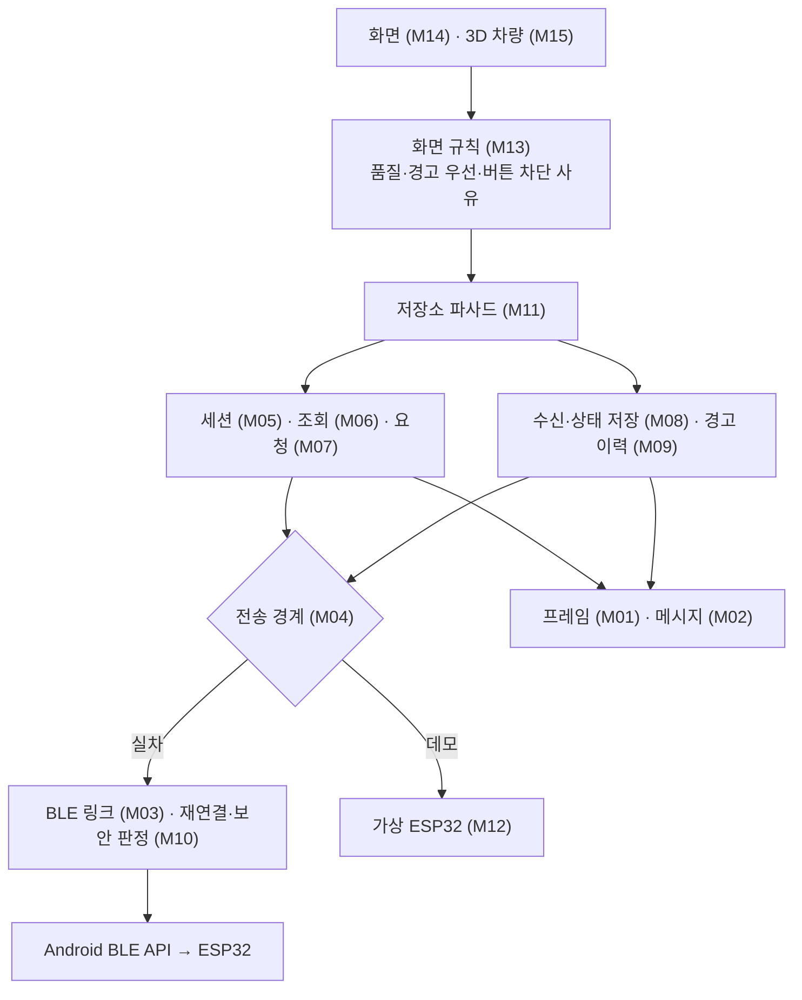
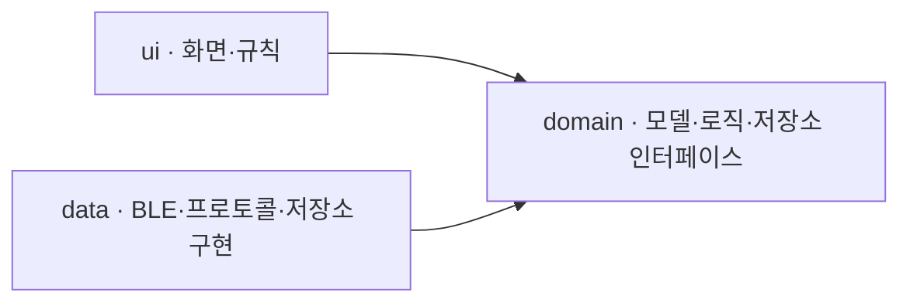
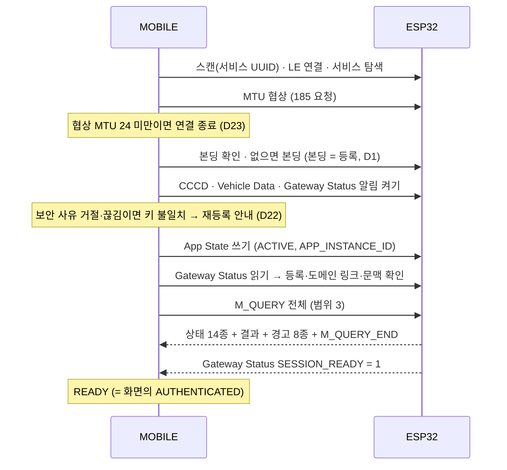
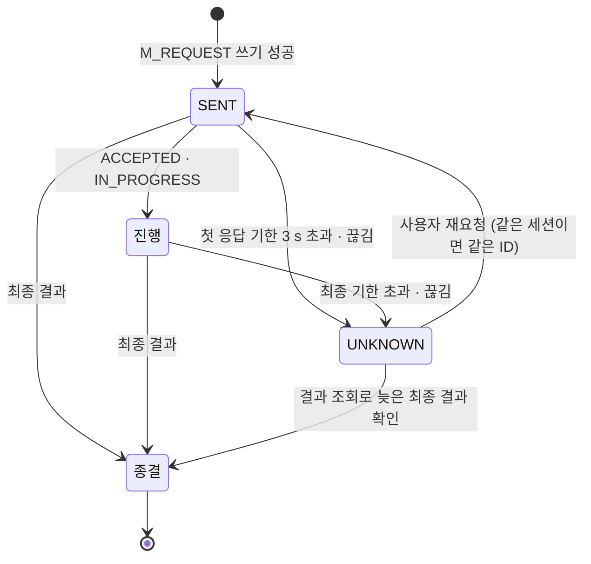
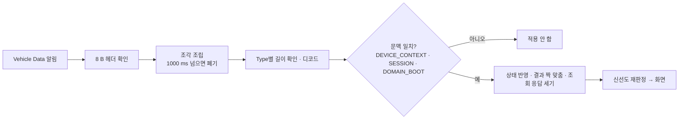

# MOBILE SW Architecture

> Status: Draft / Team-shareable
> Scope: MOBILE 안드로이드 애플리케이션의 구성 요소, Layer, 연결·세션·요청·수신 흐름과 책임 경계
> Validation: Document design only

## 0. 문서 목적과 읽는 순서

[sysRS §6 MOBILE 상세 요구사항](../requirements/sysRS.md)과 [MOBILE 요구사항 문서](../requirements/MOBILE/)를 **앱 안에서 누가 담당하고 어떻게 연결하는지** 설명한다. V 모델의 SW 설계 단계 산출물이며, §13에서 요구사항을 설계 요소로 추적한다.

처음에는 §1~2의 외부 경계와 전체 구조를 읽는다. §3에서 구성 요소 M01~M16을 확인한 뒤, 관심 있는 흐름(§5 연결·세션, §6 요청, §7 수신·조회, §8 경고)을 본다. 표시 규칙은 §9, 시간 값은 §11, 설계 결정과 분석은 §12, 요구 추적은 §13에 있다.

이 문서는 Automotive SPICE SWE.2(SW 아키텍처 설계)의 기본 실행 항목을 목차의 기준으로 삼는다.

| SWE.2 항목 | 내용 | 이 문서 |
|---|---|---|
| BP1 정적 측면 | 구성 요소 분해, 책임, 구성 요소 간 인터페이스 | §2 · §3 · §3.1 · §4 |
| BP2 동적 측면 | 상태, 순서, 시간 동작 | §5 ~ §11 |
| BP3 설계 분석 | 결정 근거, 대안 비교, 자원·시간 분석 | §12 |
| BP4 일관성·양방향 추적 | 요구 ↔ 구성 요소 | §13 |

인터페이스 바이트 배치는 이 문서에서 다시 정의하지 않는다. ESP32 ↔ MOBILE BLE 인터페이스(v0.3, PR #58)와 네트워크 설계(PR #54)를 따른다.

## 1. System Context

MOBILE은 사용자의 제어 요청을 만들고 차량 상태·결과·경고를 보여 준다. **차량 기능을 직접 수행하거나 허용 여부를 판단하지 않는다.** 차량 노드와 직접 통신하지 않고 ESP32 무선 게이트웨이를 거쳐 Domain과 주고받는다.

| 외부 경계 | MOBILE이 하는 일 | MOBILE이 하지 않는 일 |
|---|---|---|
| 사용자 | 요청 생성, 상태·결과·경고 표시, 경고 확인(ACK) | 차량 상태 추정·보정 |
| ESP32 (BLE) | 연결·본딩·구독, 프레임 분할/조립, 세션 문맥 대조, 조회 | 근접 판정, 등록 판정(결과만 따름) |
| Domain (ESP32 경유) | 요청 결과 대기·UNKNOWN 관리 | 요청 허용 판정, 중복 실행 방지 판정 |

## 2. 한눈에 보는 MOBILE SW 구조

**화면 → 화면 규칙 → 저장소(세션·요청·수신) → BLE 링크 → 프레임/메시지 코덱** 순서로 쌓인다. 데모 모드는 BLE 링크 자리에 가상 ESP32(M12)를 끼운다 — 같은 바이트가 같은 파이프라인을 탄다.

## 3. 구성 요소와 역할

구성 요소는 논리적 책임 단위이며 파일·클래스와 하나씩 대응할 필요는 없다.

| ID | 구성 요소 | 책임 |
|---|---|---|
| M01 | 프레임 코덱 | 8 B 헤더, MTU 분할, 조각 조립·만료, Little Endian |
| M02 | 메시지 코덱 | M_* 인코딩·디코딩, Type별 고정 길이 검증, Gateway Status 21 B·App State 5 B |
| M03 | BLE 링크 | 스캔→연결→탐색→MTU→본딩→CCCD 구독, GATT 작업 직렬화, 끊김 감지 |
| M04 | 전송 경계 | 링크 상태·프레임 송수신·Gateway Status·App State를 상위에 같은 형태로 제공. 실차(M03)와 데모(M12)가 같은 경계를 구현 |
| M05 | 세션 | v0.3 §46 연결 단계, 문맥(DEVICE_CONTEXT_ID·SESSION_ID·DOMAIN_BOOT_ID) 확정·대조, App State 1 s 송신 |
| M06 | 조회 | M_QUERY 한 번에 하나, 완결 판정(개수 + 필수 목록) |
| M07 | 요청 | REQUEST_ID 발급, 결과 단계 추적, 기한 → UNKNOWN, 조각 순서 송신 |
| M08 | 수신·상태 | 조립→디코드→문맥 대조→상태 반영, 신선도 재판정(STALE) |
| M09 | 경고 이력 | 발생 이력 보관, 미확인 수, 앱 내 확인 |
| M10 | 재연결·보안 판정 | 횟수·시간 제한 재연결, 본딩 키 불일치 판정 |
| M11 | 저장소 | 화면에 상태 흐름과 요청 기능 제공, 하위 구성 요소 조율 |
| M12 | 가상 ESP32 | ESP32와 같은 프레임을 만드는 데모용 전송, 시연 조작 |
| M13 | 화면 규칙 | 품질별 표시, 경고 우선, 버튼 차단 사유, 값 서식 |
| M14 | 화면 | 탭 5개(차량 / 공조 / 조명·키 / 알림 / 진단), 상단 고정 연결·경고 영역 |
| M15 | 3D 차량 | 도어·실내등·공조 빛·경고 위치 핀 표시 |
| M16 | 조립·설정 | 구성 요소 조립, 시간 값 한 곳 관리, 모드(실차·데모) 전환 |

### 3.1 구성 요소 간 인터페이스

| 제공 | 사용 | 주고받는 것 | 시점 |
|---|---|---|---|
| M14 화면 | M11 저장소 | 사용자 요청(도어·공조·조명·디지털 키), 조회, 경고 확인, 연결·해제·등록 해제 | 사용자 조작 시 |
| M11 저장소 | M13 · M14 · M15 | 차량 상태(값 + 품질 + 수신 시각), 연결 단계와 사유, 요청 목록과 결과, 경고·이력 | 상태가 바뀔 때마다 흐름으로 |
| M13 화면 규칙 | M14 · M15 | 표시 문장, 품질 표시, 버튼 차단 사유, 3D 표시 정보 | 화면 상태 계산 시 |
| M16 조립·설정 | 전 구성 요소 | 시간 값, 모드(실차·데모) 선택, 화면 활성 여부 | 시작 · 모드 전환 · 화면 전환 |
| M05 세션 | M11 · M06 · M07 | 세션 단계, 현재 문맥(DEVICE_CONTEXT_ID · SESSION_ID · DOMAIN_BOOT_ID), 요청·조회 가능 여부 | 단계 변경 시 |
| M04 전송 경계 | M05 | 링크 상태, Gateway Status(읽기 · 알림), App State 쓰기 결과 | 링크 변화 · 알림 · 1 s 주기 |
| M07 요청 | M04 (M01 · M02 경유) | M_REQUEST 프레임 | 요청 시 |
| M06 조회 | M04 (M01 · M02 경유) | M_QUERY 프레임 | 동기화 · 결과 확인 · 사용자 조회 시 |
| M04 전송 경계 | M08 수신 | Vehicle Data 프레임 | 알림 수신 시 |
| M08 수신 | M07 · M06 · M09 · M11 | 결과(요청 짝 맞춤), 조회 응답 항목과 종료, 경고 발생, 상태 갱신 | 메시지 디코드 직후 |
| M03 BLE 링크 | M04 | 링크 수립·끊김, 프레임 송수신, 협상 MTU | — (M04 구현) |
| M10 재연결·보안 판정 | M03 | 재시도 여부·대기 시간, 키 불일치 여부 | 끊김 · 구독 실패 시 |
| M12 가상 ESP32 | M04 | M03과 같은 형태의 링크·프레임 (데모) | — (M04 구현) |

## 4. Layer Architecture

구글 권장 구조(UI / Domain / Data)를 따르고 **의존 방향은 안쪽(domain)으로만** 둔다.

| Layer | 규칙 |
|---|---|
| Domain (모델·로직) | 플랫폼(Android) 의존 없음. 시각은 외부에서 주입 |
| Domain (저장소 경계) | 저장소·연결 인터페이스와 도메인 오류. Data 계층이 플랫폼 오류를 이 형태로 바꿔 올린다 |
| Data · BLE (M03) | 플랫폼 BLE 기능은 이 계층에서만 사용 |
| Data · 프로토콜 (M01·M02) | 바이트 배치는 이 계층에서만 다룸 |
| UI · 화면 규칙 (M13) | 플랫폼 의존 없음. 품질 판단은 "표시 가능"·"신뢰 가능" 두 기준으로만 |

**동시성**: Data 계층의 가변 상태는 하나의 실행 흐름에서만 다룬다(confinement). 상태 보호용 잠금을 두지 않고, 플랫폼 콜백은 그 실행 흐름으로 넘긴다. 남는 상호 배제는 순서 보장용뿐이다 — 조각 섞임 금지(M07), GATT 한 번에 한 작업(M03), 모드 전환(M16).

## 5. 연결과 세션 (M03 · M05 · M10)

### 5.1 연결 절차

### 5.2 세션 단계

| 단계 | 의미 | 다음 단계 조건 |
|---|---|---|
| Disconnected | 링크 없음 | 사용자 연결 또는 자동 재연결 |
| Linking | 스캔 ~ CCCD | 구독 완료 |
| Subscribed | App State 수락 대기 | App State 쓰기 성공 |
| ContextWait | Gateway Status로 등록·도메인 링크·문맥 확인 | REGISTERED ∧ DOMAIN_LINK UP ∧ 문맥 ID 확정 |
| QuerySync | 초기 전체 조회 | 조회 완결(§7.2) — 미완결이면 재시도 |
| SessionReadyWait | SESSION_READY 대기 | SESSION_READY = 1 |
| Ready | 요청 가능 | — |

- **AUTHENTICATED (화면 표시) = Ready** (D9). 기능별 가용성(Availability)은 버튼 단위로 막는다.
- **AUTH_FAILED** (D13): 본딩 실패, ATT 0x86 NOT_REGISTERED, Gateway Status REGISTRATION_STATE = NOT_REGISTERED. 요청·조회를 막고 사유를 표시하며, 자동 재시도로 우회하지 않는다. 사용자의 다시 연결만 해제한다.
- **BOND_MISMATCH** (D22): 본딩된 기기인데 CCCD 쓰기가 ATT 0x05·0x08·0x0C·0x0F로 거절되거나 링크가 HCI 0x05·0x06·0x3D로 끊김 → "재등록 필요" 안내, 재시도 금지.
- **SESSION_ID 변경**: 진행 중 요청 UNKNOWN, 조회·조립 폐기, 표시 STALE, 전체 재조회(D8).
- **끊김**: 진행 중 요청 UNKNOWN, **자동 재전송 없음**.

### 5.3 재연결 (M10)

- 화면이 보이는 동안(foreground)에만 자동 재연결. 최대 5회 · 60 s, 대기 1 s부터 두 배씩 최대 10 s.
- 한도 도달·화면 비활성이면 멈추고 사유를 표시한다. 화면으로 돌아오면 새 한도로 다시 시작한다.
- 사용자 해제·AUTH_FAILED·BOND_MISMATCH·지원하지 않는 MTU는 재연결 대상이 아니다.
- 배경(background)에서는 링크를 유지하고 App State INACTIVE를 보낸다(D16).

## 6. 요청 처리 (M07)

| 묶음 | 상태 | 의미 |
|---|---|---|
| 진행 | ACCEPTED · IN_PROGRESS | 차량이 받았거나 수행 중 |
| 종결 | DONE · REJECTED · FAILED · CANCELLED | 최종 결과. 종결 뒤 늦은 진행 응답은 무시 |
| UNKNOWN | — | 결과를 확인하지 못함. 실패로 단정하지 않으며 종결이 아님 |

- **REQUEST_ID**: 세션(SESSION_ID)마다 1부터 증가. 결과는 REQUEST_SESSION + REQUEST_ID로 짝을 맞춘다. 번호를 다 쓰면 APP_INSTANCE_ID를 새로 만든다.
- **쓰기 실패**(GATT 실패, ATT 0x80~0x89)는 차량 결과가 아니다. 요청을 SENT로 등록하지 않고 사유를 표시한다(D12).
- **UNKNOWN**은 실패가 아니다. 결과 조회(범위 1, REQUEST_SESSION + REQUEST_ID)로 확인하고, 재요청은 사용자 조작으로만 한다. 같은 세션이면 같은 REQUEST_ID로 다시 보낸다(D10).
- **기한**: 첫 응답 3 s(D23). 수용 후 최종 결과 — 설정 2 s · 도어 3 s · 공조 5 s(sysRS 후보값).
- 최근 결과 5건을 화면에 보관한다(D17, MB-SYS-REQ-010).

## 7. 수신과 조회 (M01 · M02 · M06 · M08)

### 7.1 수신 파이프라인

- 현재 문맥이 미확인(0)이면 하행을 적용하지 않는다(D8).
- 신선도: 200 ms 주기 메시지는 600 ms, 1000 ms 주기 메시지는 3000 ms 동안 갱신이 없으면 차량이 OK로 보낸 값도 STALE로 강등한다. 값은 남기고 수신 시각을 함께 표시한다.

### 7.2 조회 완결 판정

M_QUERY_END만 받았다고 완결로 보지 않는다. 다음을 모두 만족해야 완결이다.

| 조건 | 내용 |
|---|---|
| 문맥 | DEVICE_CONTEXT_ID · SESSION_ID · DOMAIN_BOOT_ID 일치 |
| QUERY_ID | 진행 중인 조회와 같음 (한 번에 하나) |
| 개수 | 받은 메시지 수 = ITEM_COUNT |
| STATUS | 0 완료 · 1 요청 없음 · 2 일부 확인 불가 (3 문맥 거부는 미완결) |
| 필수 목록 | 현재 상태 14종, 경고 Type 1~8 각 1건 — 개수가 맞아도 중복으로 하나 빠지면 미완결 (요청 결과 범위는 목록 없음) |

STATUS 2는 형식은 정상이고 일부 값만 확인 불가라는 뜻이다. 해당 값은 메시지의 품질(INVALID·NO_DATA)로 표시된다. 조회 대기 한도는 3000 ms이다.

## 8. 경고 (M08 · M09 · M13)

| Type | 화면 이름 | 3D 위치 |
|---|---|---|
| 1 | 후방 물체 접근 | 후면 |
| 2 | 차 안에 탑승자 남음 | 실내 |
| 3 | 창문 끼임 감지 | 창문 |
| 4 | 차체 제어 장치 고장 | 없음 (배너·알림 탭) |
| 5 | 실내 감지 장치 고장 | 없음 |
| 6 | 창문 장치 고장 | 창문 |
| 7 | 경고음 장치 고장 | 없음 |
| 8 | 하차 후 도어 열림 | 운전석 도어 |

- 심각도는 차량이 보낸 SEVERITY를 그대로 표시한다. 경고는 일반 상태보다 앞에 배치하고, 상단 고정 영역에 발생 중 경고를 유지한다(SAF-001).
- 발생 이력은 OCCURRENCE_ID 기준으로 보관한다(최대 50건). 같은 Type의 새 발생이 이전 발생을 덮지 않는다.
- 확인(READ)은 해제가 아니다. 현재 경고는 차량에 M_WARNING_ACK를 보낸다. 같은 Type의 새 발생으로 밀려난 이전 발생은 차량이 ACK를 받지 않으므로 **앱 내 확인**으로 따로 기록한다(D21f).

## 9. 표시 규칙 (M13 · M14 · M15)

| 품질 | 표시 |
|---|---|
| OK | 값 표시 |
| STALE | 값 + 마지막 수신 시각, 최신으로 보이지 않게 흐리게 |
| INVALID · NO_DATA | 수치 미표시, "확인 불가" |

- 연결이 Ready가 아니거나 기능 가용성이 없으면 버튼을 막고 **사유 문장**을 함께 보인다.
- 후방 감지 INACTIVE(5)는 "감지 꺼짐"으로 표시하며, 고장이 아니므로 3D 핀을 띄우지 않는다(D22).
- 3D 차량은 보고된 것만 그린다 — 도어 열림, 실내등 색, 공조 방향·출력에 비례한 실내 빛, 경고 위치 핀(심각도 색 + 짧은 이름).
- 실내등 "실제 점등 확인"은 BCM이 지원하지 않으므로 "점등 미확인"으로 구분해 표시한다.
- 데모 모드는 상단 연결 줄에 "모의"를 표시한다.

## 10. 데모 모드 (M12)

ESP32 없이 화면·3D·요청 흐름을 시연한다. 가상 ESP32가 ESP32와 **같은 형식의 프레임**을 만들어 같은 수신 경로(M01·M02·M08)로 보낸다. 시연 조작(경고 발생·해제, 결과 지연 등)은 데모일 때만 진단 탭에 보인다.

## 11. 시간·설정값

| 항목 | 값 | 근거 |
|---|---|---|
| 조각 조립 한도 | 1000 ms | v0.3 §5.6 |
| 첫 응답 대기 | 3000 ms | sysRS COM-SYS-REQ-003 |
| 최종 결과 대기 | 설정 2 s · 도어 3 s · 공조 5 s | sysRS §2.3.1 후보 |
| 수신 중단 판정 | 600 ms / 3000 ms | v0.3 §38 |
| App State 주기 | 1000 ms | v0.3 §9.4 |
| 조회 대기 한도 | 3000 ms | 전체 조회 응답(최대 31건 + 종료) 수신과 조립 여유 |
| 동기화 재시도 간격 | 2000 ms | 실패 반복 시 ESP32·무선 구간 부하 제한 |
| 재연결 | 5회 · 60 s · 1~10 s | 06_MOBILE §7 |
| 최소 지원 MTU | 24 | Gateway Status 21 B가 Notify 한 번에 실림 |
| 최근 결과 보관 | 5건 | MB-SYS-REQ-010 |
| 경고 이력 보관 | 50건 | 미확인 경고 확인에 충분한 상한, 저장 크기 제한 |
| 목표 온도 범위 | 17.0~27.0 °C, 0.5 단위 | 양산차 일반 범위 |

## 12. 설계 결정과 분석

### 12.1 설계 결정

| ID | 결정 | 내용 |
|---|---|---|
| D1 | 등록 | 본딩 성공 = 등록. Gateway Status REGISTRATION_STATE와 대조 |
| D2 | 조립 | DI 프레임워크 없이 수동 조립(M16), 시간 값은 한 곳에서 관리 |
| D3 | 화면 | 선언형 UI(Jetpack Compose · Material 3), 화면 상태는 한 곳에서 관리 |
| D4·D5 | 3D | glTF(glb) 모델을 Filament 기반 렌더러로 표시. 차량 모델은 생성 스크립트로 재현 가능하게 관리 |
| D6 | 전송 경계 | 링크 수립(스캔~구독)은 BLE 계층(M03), 세션 진행은 전송 경계(M04) 위에서. 실차·데모가 같은 상위 흐름을 사용 |
| D8 | 문맥 불일치 | 문맥이 다르거나 미확인이면 하행 미적용. SESSION_ID 변경 시 UNKNOWN·폐기·STALE·재조회 |
| D9 | AUTHENTICATED | = §46 READY. 기능 가용성은 버튼 단위 |
| D10 | 재요청 ID | 같은 세션이면 같은 REQUEST_ID, 세션이 바뀌면 새 번호 |
| D11 | 경고 종류 | 8종 (Type 8 하차 후 도어 열림 포함) |
| D12 | 쓰기 실패 | GATT·ATT 오류는 차량 결과가 아님 — SENT로 등록하지 않고 사유 표시 |
| D13 | AUTH_FAILED | 본딩 실패 · ATT 0x86 · NOT_REGISTERED. 재시도로 우회 금지 |
| D15 | WINDOW | 상태·고장 표시만 (제어 요청 없음) |
| D16 | 배경 | 링크 유지 + App State INACTIVE. 자동 재연결은 foreground에서만 |
| D17 | 최근 결과 | 5건 |
| D18·D21 | UI | 자동차 앱형 — 히어로 3D, 원형 빠른 제어, 하단 탭. 진단은 별도 탭. 장식 아이콘 금지 |
| D19 | 3D 상태 | 경고 위치 핀, 도어·실내등·공조 빛. 보고되지 않은 것은 그리지 않음 |
| D21f | 보관 이력 확인 | 밀려난 경고 발생은 앱 내 확인으로 기록(차량 READ와 구분) |
| D22 | v0.3 반영 | 후방 INACTIVE, 조회 완결(개수 + 필수 목록), 본딩 키 불일치 → 재등록 안내 |
| D23 | 운용 조건 | MTU 24 미만이면 연결하지 않음, 첫 응답 대기 3 s, 등록 해제 시 차량 측 등록 삭제 안내 |

### 12.2 주요 대안 비교

| 문제 | 검토한 안 | 선택 | 이유 |
|---|---|---|---|
| 동시 접근 보호 | ① 상태마다 잠금 ② 한 실행 흐름에서만 상태 변경 | ② | BLE 콜백·화면·타이머가 섞여도 순서가 하나로 정해져 경쟁 조건이 생기지 않는다. 잠금 순서 실수(교착)가 원천적으로 없다 |
| 조회 완결 판정 | ① 개수만 대조 ② 개수 + 필수 목록 | ② | 같은 종류가 중복되면 개수는 맞아도 항목이 빠진다(v0.3 §36). 빠진 상태를 정상으로 표시하지 않기 위해 |
| 작은 MTU(23) | ① Gateway Status를 200 ms마다 읽기 ② 연결 거부 | ② | GATT는 한 번에 한 작업이라 ①은 명령을 지연시킨다. 최근 단말은 MTU 협상이 실패하는 경우가 드물다 |
| 결과 미수신 | ① 실패로 처리 ② UNKNOWN으로 두고 조회 | ② | 차량은 실행했을 수 있다. 실패로 단정하면 사용자가 다시 눌러 중복 실행을 부른다 |
| 배경 동작 | ① 배경에서도 자동 재연결 ② 화면이 보일 때만 | ② | 배터리 소모와 OS 배경 실행 제한 |
| 데모 구성 | ① 화면에 가짜 값 주입 ② 전송 경계에 가상 ESP32 | ② | 실차와 같은 수신·세션 경로를 지나므로 데모가 실차 흐름을 대표한다 |
| 조립 방식 | ① DI 프레임워크 ② 수동 조립 | ② | 구성 요소 수가 적어 프레임워크의 이득보다 복잡도가 크다 |

### 12.3 자원·시간 분석

| 항목 | 분석 |
|---|---|
| 하행 메시지 양 | 200 ms 주기 6종(초당 30건) + 1000 ms 주기 3종(3건) + 경고 8종 보완(8건) ≈ **초당 40건**. MTU 185에서는 모든 메시지(최대 62 B)가 조각 1개 → 알림 약 40건/s. MTU 23이면 메시지당 조각 3~6개로 늘어 알림이 수 배가 된다 → §12.2 작은 MTU 결정의 근거 |
| GATT 작업 | 쓰기(요청·조회·App State)는 한 번에 하나씩 순서대로. App State 1 s 주기 + 사용자 요청 → 평상시 대기 없음 |
| 조립 메모리 | 조립 중인 메시지는 한 번에 하나, 1000 ms 안에 완성되지 않으면 폐기 — 조각 누락이 메모리를 쌓지 않는다 |
| 상태 보관 | 종류별 최신값 1개 + 최근 요청 결과 5건 + 경고 이력 50건(저장) — 상한이 정해져 있어 오래 켜 두어도 늘지 않는다 |
| 응답 시간 예산 | 첫 응답 3 s = 차량 확인 제한 0.8 s + 무선 왕복·중계 여유(sysRS 근거). 조회 완결 3 s, 내부 점검 주기 200 ms |
| 3D 자산 | 차량 모델 삼각형 3만 개 · 3 MB 이하 상한(실제 약 0.25 MB) — 저사양 단말에서도 첫 화면 지연을 줄이기 위해 |

## 13. 요구 추적

### 13.1 요구 → 구성 요소

sysRS §6 MOBILE 요구(MB-SYS-*)를 담당 구성 요소로 연결한다. SR §7 → sysRS 연결은 [04 추적 문서](../requirements/MOBILE/04_MOBILE_SR_SYSRS_TRACE_NAVIGATION_DRAFT.md)를 따른다.

앱 책임이 아닌 요구(근접 판정·중복 실행 방지·인증 허용 판정·게이트웨이 채택)는 차량 측 몫이라 추적에서 제외한다.

| 요구 ID | sysRS | 구성 요소 |
|---|---|---|
| MB-SYS-REQ-001 | sysRS §6.4.1 | M02 |
| MB-SYS-REQ-002 | sysRS §6.4.1 | M02 |
| MB-SYS-REQ-003 | sysRS §6.4.1 | M07 |
| MB-SYS-REQ-004 | sysRS §6.4.1 | M07 |
| MB-SYS-REQ-005 | sysRS §6.4.1 | M07 |
| MB-SYS-REQ-006 | sysRS §6.4.1 | M13 |
| MB-SYS-REQ-007 | sysRS §6.4.1 | M11 |
| MB-SYS-REQ-008 | sysRS §6.4.1 | M11 |
| MB-SYS-REQ-009 | sysRS §6.4.1 | M11 |
| MB-SYS-REQ-010 | sysRS §6.4.1 | M07 |
| MB-SYS-REQ-011 | sysRS §6.4.1 | M13 |
| MB-SYS-REQ-012 | sysRS §6.4.1 | M05 |
| MB-SYS-DSP-001 | sysRS §6.4.2 | M13 |
| MB-SYS-DSP-002 | sysRS §6.4.2 | M13 |
| MB-SYS-DSP-003 | sysRS §6.4.2 | M13 |
| MB-SYS-DSP-004 | sysRS §6.4.2 | M13 |
| MB-SYS-DSP-005 | sysRS §6.4.2 | M11 |
| MB-SYS-DSP-006 | sysRS §6.4.2 | M13 |
| MB-SYS-DSP-007 | sysRS §6.4.2 | M15 |
| MB-SYS-DSP-008 | sysRS §6.4.2 | M13 |
| MB-SYS-DSP-009 | sysRS §6.4.2 | M13 |
| MB-SYS-DSP-010 | sysRS §6.4.2 | M13 |
| MB-SYS-ALT-001 | sysRS §6.4.3 | M13 |
| MB-SYS-ALT-002 | sysRS §6.4.3 | M13 |
| MB-SYS-ALT-003 | sysRS §6.4.3 | M13 |
| MB-SYS-ALT-004 | sysRS §6.4.3 | M09 |
| MB-SYS-ALT-005 | sysRS §6.4.3 | M13 |
| MB-SYS-ALT-006 | sysRS §6.4.3 | M11 |
| MB-SYS-ALT-007 | sysRS §6.4.3 | M09 |
| MB-SYS-CON-001 | sysRS §6.4.4 | M05 |
| MB-SYS-CON-002 | sysRS §6.4.4 | M10 |
| MB-SYS-CON-003 | sysRS §6.4.4 | M10 |
| MB-SYS-CON-004 | sysRS §6.4.4 | M11 |
| MB-SYS-CON-005 | sysRS §6.4.4 | M11 |
| MB-SYS-CON-006 | sysRS §6.4.4 | M03 |
| MB-SYS-SEC-001 | sysRS §6.4.5 | M03 |
| MB-SYS-SEC-002 | sysRS §6.4.5 | M03 |
| MB-SYS-SEC-003 | sysRS §6.4.5 | M11 |
| MB-SYS-SEC-004 | sysRS §6.4.5 | M05 |
| MB-SYS-SEC-005 | sysRS §6.4.5 | M07 |
| MB-SYS-SEC-006 | sysRS §6.4.5 | M05 |
| MB-SYS-SEC-007 | sysRS §6.4.5 | M03 |
| MB-SYS-SEC-008 | sysRS §6.4.5 | M03 |
| MB-SYS-DK-001 | sysRS §6.4.6 | M11 |
| MB-SYS-DK-002 | sysRS §6.4.6 | M03 |
| MB-SYS-DK-003 | sysRS §6.4.6 | M02 |
| MB-SYS-DK-004 | sysRS §6.4.6 | M11 |
| MB-SYS-DK-005 | sysRS §6.4.6 | M13 |
| MB-SYS-DK-006 | sysRS §6.4.6 | M03 |
| MB-SYS-SEM-001 | sysRS §6.5 | M02 |
| MB-SYS-SEM-002 | sysRS §6.5 | M08 |
| MB-SYS-SEM-003 | sysRS §6.5 | M02 |
| MB-SYS-SEM-004 | sysRS §6.5 | M13 |
| MB-SYS-SEM-005 | sysRS §6.5 | M02 |
| MB-SYS-SEM-006 | sysRS §6.5 | M11 |
| MB-SYS-SEM-007 | sysRS §6.5 | M08 |
| MB-SYS-SEM-008 | sysRS §6.5 | M11 |
| MB-SYS-PERF-001 | sysRS §6.7 | M11 |
| MB-SYS-PERF-002 | sysRS §6.7 | M11 |
| MB-SYS-PERF-003 | sysRS §6.7 | M07 |
| MB-SYS-PERF-004 | sysRS §6.7 | M11 |
| MB-SYS-PERF-005 | sysRS §6.7 | M11 |
| MB-SYS-INT-001 | sysRS §6.8 | M02 |
| MB-SYS-INT-002 | sysRS §6.8 | M11 |
| MB-SYS-INT-003 | sysRS §6.8 | M02 |
| MB-SYS-INT-004 | sysRS §6.8 | M13 |
| MB-SYS-INT-005 | sysRS §6.8 | M11 |
| MB-SYS-INT-007 | sysRS §6.8 | M11 |
| MB-SYS-INT-008 | sysRS §6.8 | M02 |
| MB-SYS-INT-009 | sysRS §6.8 | M08 |
| MB-SYS-INT-010 | sysRS §6.8 | M07 |
| MB-SYS-INT-011 | sysRS §6.8 | M13 |
| MB-SYS-INT-012 | sysRS §6.8 | M11 |
| MB-SYS-INT-013 | sysRS §6.8 | M09 |
| MB-SYS-INT-014 | sysRS §6.8 | M02 |
| MB-SYS-INT-015 | sysRS §6.8 | M07 |
| MB-SYS-INT-016 | sysRS §6.8 | M03 |
| MB-SYS-INT-018 | sysRS §6.8 | M11 |
| MB-SYS-INT-019 | sysRS §6.8 | M13 |
| MB-SYS-INT-020 | sysRS §6.8 | M13 |
| MB-SYS-SAF-001 | sysRS §6.9 | M13 |
| MB-SYS-SAF-002 | sysRS §6.9 | M13 |
| MB-SYS-SAF-003 | sysRS §6.9 | M13 |
| MB-SYS-SAF-004 | sysRS §6.9 | M11 |
| MB-SYS-SAF-005 | sysRS §6.9 | M13 |
| MB-SYS-SAF-006 | sysRS §6.9 | M13 |
| MB-SYS-DIAG-001 | sysRS §6.10 | M13 |
| MB-SYS-DIAG-002 | sysRS §6.10 | M13 |
| MB-SYS-DIAG-003 | sysRS §6.10 | M13 |
| MB-SYS-DIAG-004 | sysRS §6.10 | M11 |
| MB-SYS-NFR-001 | sysRS §6.11 | M02 |
| MB-SYS-NFR-002 | sysRS §6.11 | M02 |
| MB-SYS-NFR-003 | sysRS §6.11 | M07 |
| MB-SYS-NFR-004 | sysRS §6.11 | M13 |
| MB-SYS-NFR-005 | sysRS §6.11 | M13 |
| MB-SYS-NFR-006 | sysRS §6.11 | M13 |
| MB-SYS-NFR-007 | sysRS §6.11 | M03 |
| MB-SYS-NFR-008 | sysRS §6.11 | M13 |
| MB-SYS-NFR-009 | sysRS §6.11 | M12 |
| MB-SYS-NFR-010 | sysRS §6.11 | M15 |
| MB-SYS-NFR-011 | sysRS §6.11 | M13 |

### 13.2 구성 요소 → 요구

요구 ID는 `MB-SYS-` 를 생략했다. 직접 담당한 요구가 없는 구성 요소는 다른 구성 요소의 요구를 지원한다.

| 구성 요소 | 담당 요구 | 수 |
|---|---|---:|
| M01 프레임 코덱 | — (M02·M08을 통해 INT·SEM 지원) | 0 |
| M02 메시지 코덱 | REQ-001, REQ-002, DK-003, SEM-001, SEM-003, SEM-005, INT-001, INT-003, INT-008, INT-014, NFR-001, NFR-002 | 12 |
| M03 BLE 링크 | CON-006, SEC-001, SEC-002, SEC-007, SEC-008, DK-002, DK-006, INT-016, NFR-007 | 9 |
| M04 전송 경계 | — (M03·M12를 같은 흐름으로 묶어 CON·SEC 지원) | 0 |
| M05 세션 | REQ-012, CON-001, SEC-004, SEC-006 | 4 |
| M06 조회 | — (M11의 초기 동기화·결과 조회 요구 지원) | 0 |
| M07 요청 | REQ-003, REQ-004, REQ-005, REQ-010, SEC-005, PERF-003, INT-010, INT-015, NFR-003 | 9 |
| M08 수신·상태 | SEM-002, SEM-007, INT-009 | 3 |
| M09 경고 이력 | ALT-004, ALT-007, INT-013 | 3 |
| M10 재연결·보안 판정 | CON-002, CON-003 | 2 |
| M11 저장소 | REQ-007, REQ-008, REQ-009, DSP-005, ALT-006, CON-004, CON-005, SEC-003, DK-001, DK-004, SEM-006, SEM-008, PERF-001, PERF-002, PERF-004, PERF-005, INT-002, INT-005, INT-007, INT-012, INT-018, SAF-004, DIAG-004 | 23 |
| M12 가상 ESP32 | NFR-009 | 1 |
| M13 화면 규칙 | REQ-006, REQ-011, DSP-001, DSP-002, DSP-003, DSP-004, DSP-006, DSP-008, DSP-009, DSP-010, ALT-001, ALT-002, ALT-003, ALT-005, DK-005, SEM-004, INT-004, INT-011, INT-019, INT-020, SAF-001, SAF-002, SAF-003, SAF-005, SAF-006, DIAG-001, DIAG-002, DIAG-003, NFR-004, NFR-005, NFR-006, NFR-008, NFR-011 | 33 |
| M14 화면 | — (M13 규칙을 화면에 표시) | 0 |
| M15 3D 차량 | DSP-007, NFR-010 | 2 |
| M16 조립·설정 | — (시간 값·모드로 전 구성 요소 지원) | 0 |
| **합계** | | **101** |
