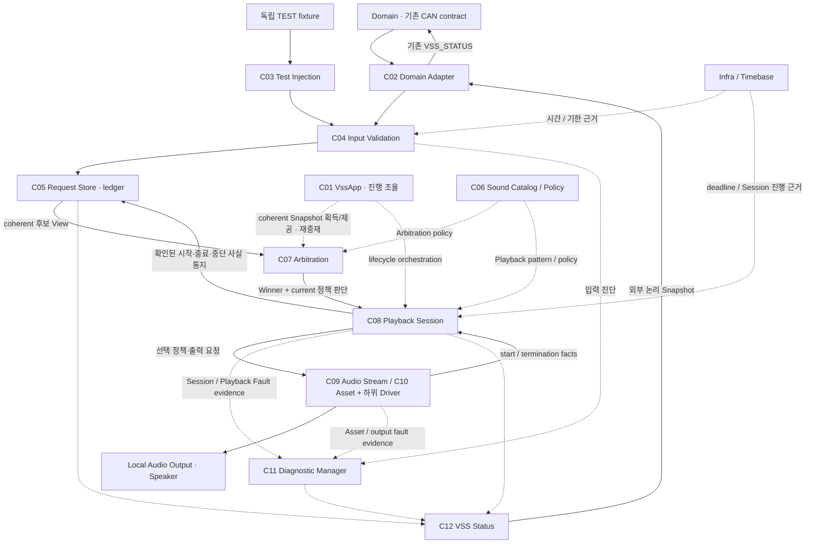
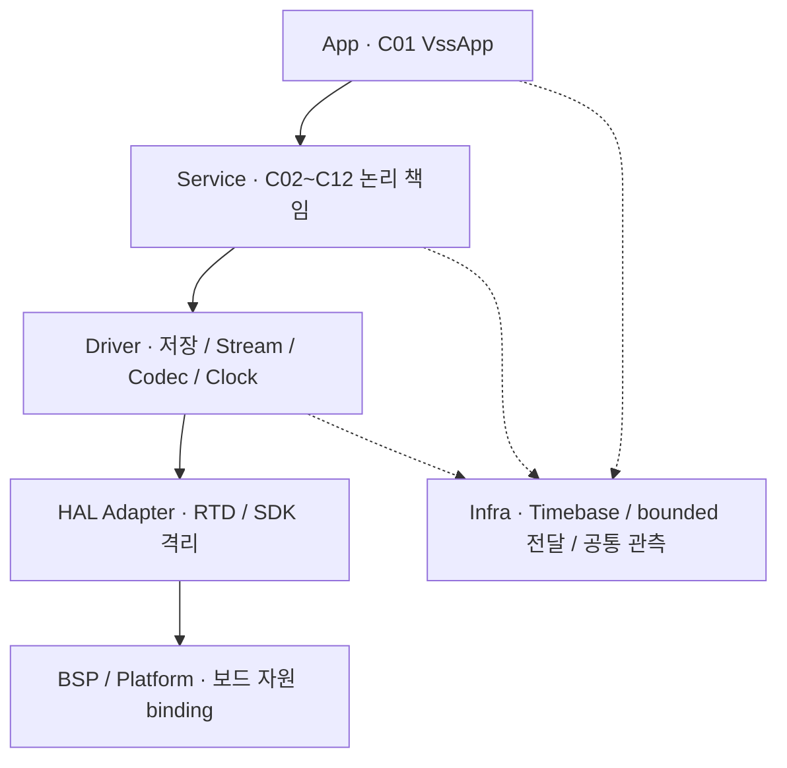
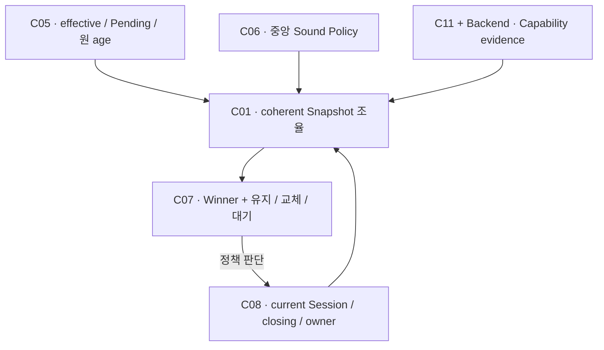
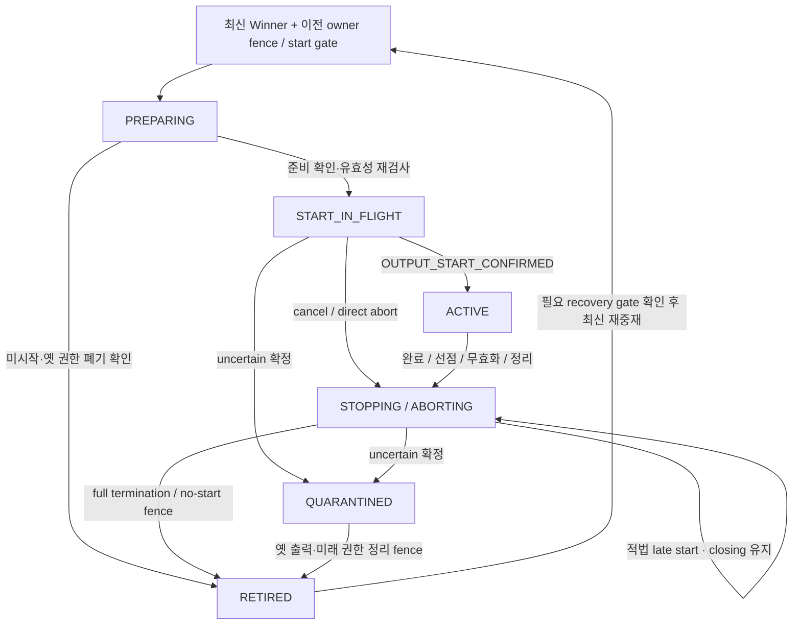
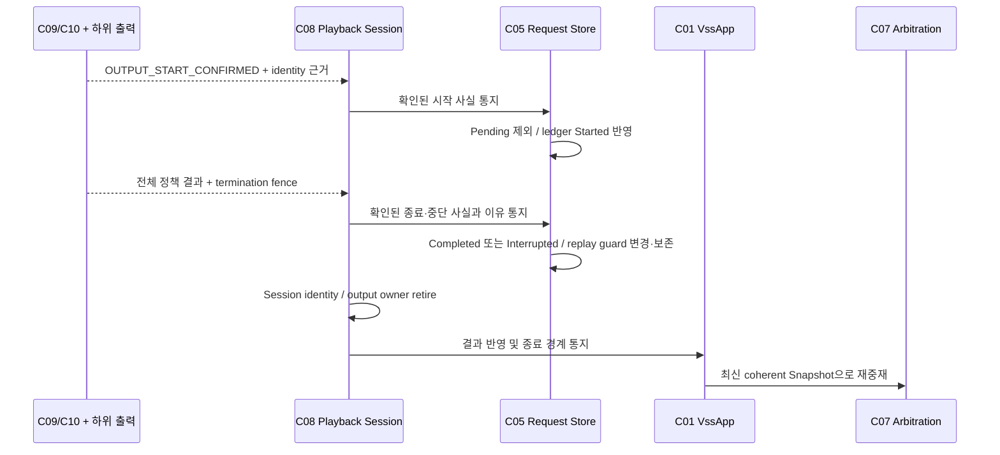
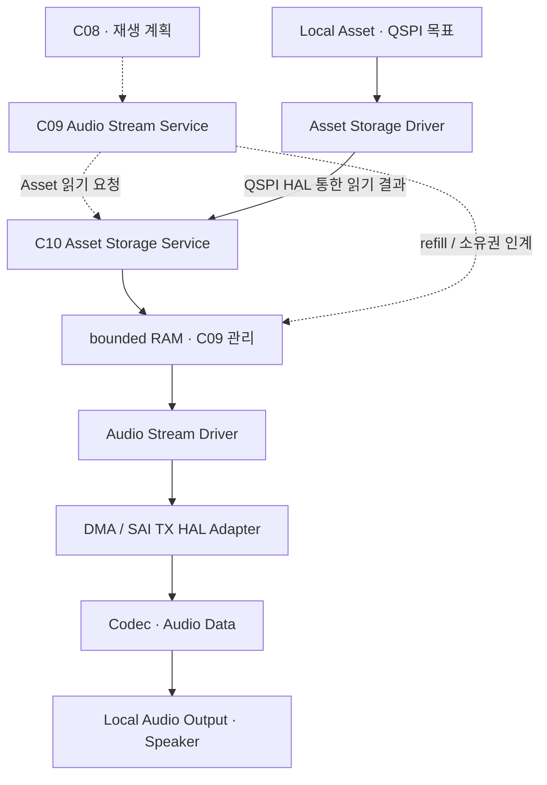
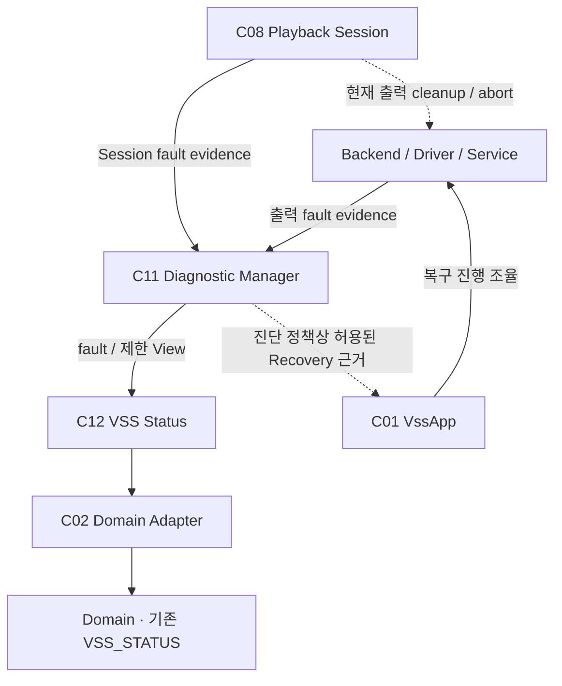

# VSS SW Architecture

> Status: Draft / Team-shareable  
> Scope: Dedicated S32K344 VSS Software의 논리 Component·Layer·데이터 흐름·책임 경계  
> Validation: Document design only · Firmware/board validation not performed

## 0. 문서 상태와 목적

| 문서 | 역할 |
|---|---|
| VSS Functional Design | VSS가 기능적으로 어떻게 동작하는가 |
| VSS SW Architecture | 그 기능을 Firmware Component/Layer 책임으로 나누는 구조 |
| Domain Interface Matrix §4.5 | 이미 정해진 VSS Logical Interface |
| Network Design / Network SW Architecture | 기존 wire contract와 Network Stack |

[VSS Functional Design](VSS_function_design_draft_v0.1.md)의 기능을 **어떤 Firmware 책임으로 나누고 어떻게 연결할지** 설명한다. Stage 0~2, Stage 3A v0.2, Stage 3B v0.4 Frozen 및 Architecture Baseline v1.1을 적용한다. Component는 논리 소유 단위이며 Task/File/Class와 1:1 대응을 강제하지 않는다.

전체 구조는 §3, 소유권과 Layer는 §4~5, 입력·중재·Playback은 §6~8, Audio/Driver·Fault·실행 경계는 §9~13에서 읽는다. §14~16은 현재 확정 수준과 후속 구현을 구분한다.

## 1. 기준 자료와 문서 경계

| 자료 | 사용하는 책임 |
|---|---|
| `VSS_SOFTWARE_ARCHITECTURE_BASELINE_v1.1.md` | 최신 전체 Component/Layer와 VSS 내부 동작 |
| `VSS_02_LOGICAL_ARCHITECTURE.md` | 기존 C01~C12·하위 Driver·HAL/BSP 골격 |
| `VSS_05~07` | Semantic Input·Source Context·Request Store·ledger/profile |
| `VSS_09~12` | Arbitration·Session·Backend facts·Fault/Recovery 경계 |
| `Domain_Master_Interface_Matrix_v0.1(2).md` §4.5 | 기존 10 input / 10 output 논리 의미 |
| `network_design_draft_v0.1.md` §5.2~5.4 | 기존 VSS CAN/Wire mapping |
| `network_sw_architecture.md` §4~8 | Network 계층과 typed port·callback 경계의 연결 기준 |

기능 규칙과 10 D2V / 10 V2D 요약은 기능 문서 §4~12를 따른다. Network Design의 CAN ID/payload/cycle/timeout은 그대로 참조하고, 이 문서는 그 contract를 Firmware 안의 semantic/status 경계에 연결한다.

## 2. System Context

Domain은 차량·위험 의미를 판단하고, VSS는 이를 검증해 로컬 음향을 제공한다. CAN은 기존 외부 transport이며 차량 위험 정책이나 VSS Sound Policy의 owner가 아니다.

| 경계 | 책임 |
|---|---|
| Domain / 기존 CAN Network SW | 기존 VSS_EVENT·VSS_WARNING_STATE 전달, VSS_STATUS 송신 contract 처리 |
| C02 Domain Adapter | typed 입력의 의미·원본 품질/시간/출처를 보존해 VSS ingress로 연결, C12 Snapshot을 기존 출력 contract로 전달 |
| C03 Test Injection Adapter | 별도 TEST 출처/runtime으로 같은 ingress를 사용 |
| Local Audio Output / Speaker | 로컬 Asset을 재생. CAN payload가 Audio sample 경로가 되지 않음 |

기존 Network SW는 **Node Communication ↔ CAN Application Port → Message Service → Protocol/Codec → Transport → Driver → HAL Adapter/BSP**를 소유한다(`network_sw_architecture.md` §3~5·§7). **Network Node Communication ↔ C02 Domain Adapter**가 typed semantic/status integration boundary이며, C02는 raw CAN parsing·sequence·transport scheduling·Driver/HAL을 소유하지 않는다.

| 방향 | typed integration 경계 |
|---|---|
| 공통 연결 | 기존 CAN Stack ↔ CAN Application Port ↔ Node Communication ↔ C02 |
| 입력 | Node Communication → typed VSS semantic / evidence → C02 → C04 |
| 상태 | C12 → C02 → typed VSS status / evidence → Node Communication → CAN Application Port → 기존 CAN Stack |

§3/§11의 Domain ↔ C02 연결은 이 표의 기존 Network 전달 경로를 축약한다.

WINDOW / Anti-Pinch는 **[구현 보류 — 설계 유지]**다. 실제 WINDOW source는 현재 제품 구성에서 deferred이고, 전용 Test Injection에서 같은 정책·Playback 경로를 사용할 수 있다. 시험 상태/이력은 제품 runtime에 이관하지 않는다.

## 3. VSS SW 전체 구조

실선은 의미/요청/확인 사실, 점선은 진단·View와 정책·시간·진행 조율 지원이다. **Backend는 C09/C10과 하위 출력 기능의 추상 경계**이며 새 Component가 아니다. C01/C06/Infra는 각 Component의 상태 소유와 실제 lifecycle 실행을 대체하지 않는다.

C05가 후보와 발생 이력을 변경하고 C08은 확인 사실을 통지한다. C11의 fault 원본 상태와 C12의 외부 파생 상태도 별도 책임이다.

## 4. Component별 책임

| Component | 소유 State / Decision | 하지 않는 일 |
|---|---|---|
| C01 VssApp | 초기화·허용 Recovery 진행, coherent Snapshot 획득/제공과 재중재 orchestration | C05/C08/C11 상태 복제 소유, 차량 위험/음향 순위 재판정, RTD 직접 호출 |
| C02 Domain Adapter | 제품 logical I/O의 의미/Meta 변환·출력 Snapshot 전달 | 원 age 초기화, SNA→정상값 합성, Asset 선택 |
| C03 Test Injection Adapter | TEST 출처·runtime·fixture 진입 | C04/C05 우회, C07/C08/Driver 직접 제어, PRODUCT 출처 위장 |
| C04 Input Validation | 값/Meta·품질·시간·순서·세대 검증, 독립 Source Context 전환 | 후보/accepted ledger 복제, 위험 임계값 판정, 입력 품질의 Output Fault 합성 |
| C05 Request Store | Stateful slot, Pending One-shot, occurrence ledger와 replay guard의 단일 변경 책임 | 출력 장치 호출, 별도 우선순위, terminal 발생을 Pending으로 부활 |
| C06 Sound Catalog / Policy | 의미→Class/sub-priority→Asset→패턴의 중앙 정의 | QSPI/DMA 주소·자원, Runtime Store/Session 복제 |
| C07 Arbitration | coherent 후보·정책·Capability·current Session 비교, Winner/없음과 유지/교체/대기 정책 판단 | Store 변경, 실제 stop/abort/start 실행, sample/HW 처리 |
| C08 Playback Session | 시도 identity·단일 output owner·시작 확인·closing·cue/반복 lifecycle 실행 | occurrence ledger/replay guard 직접 변경·소유, 독자 우선순위, Stateful CLEAR 생성 |
| C09 Audio Stream Service | Stream/refill 조율, bounded RAM block 관리, 하위 결과 취합 | 차량 의미 중재, ISR 대량 읽기, runtime heap 의존 |
| C10 Asset Storage Service | Asset 식별·메타/호환성·read 진행·Asset별 결과 | 다른 의미 Asset 대체, 외부 Audio Stream, Session owner 소유 |
| C11 Diagnostic Manager | 입력 진단과 출력 Fault 분리, active/recent fault·diagnostic/recovery evidence 및 제한 상태 | occurrence 이력 대체, STALE→출력 Fault, 직접 HW re-init |
| C12 VSS Status | lifecycle·C05/C08/C11·Capability View를 결합한 외부 Snapshot | 별도 Store/ledger, 새로운 고장 원인 추정, PLAYING=순간 파형으로 취급 |

C04의 source 문맥, C05의 occurrence, C08의 출력 시도 identity는 서로 다른 수명이다. 한 파일/Task에 묶더라도 변경 권한과 결과 반영 경계는 구분한다.

## 5. Layer Architecture

| Layer | 지식과 의존 경계 |
|---|---|
| App | Service 공개 경계로 진행 조율. Driver 내부 Buffer·register 비공개 |
| Service | semantic/state·중립 결과 처리. SDK type·vendor handle 비공개 |
| Driver | 장치 동작·사용 구간·오류 근거. 공개 경계에 vendor enum/handle 노출 금지 |
| HAL Adapter | RTD/SDK 호출·type·IRQ acknowledge를 격리 |
| BSP / Platform | board Clock/PinMux/IRQ/instance·메모리 연결. 상위 의미 정책 없음 |
| Infra | 단조 시간·bounded utility/전달·관측. 차량 순위와 장치 정책 없음 |

Vendor RTD/SDK 지식은 HAL Adapter에 모으고 board 차이는 BSP/Platform에 둔다. 하위 결과는 중립 evidence로 전달하며 ISR이 App 정책 구현을 직접 실행하지 않는다. 실제 파일·API·RTOS primitive 배치는 후속 상세 설계다.

Network Common Infra/Diagnostics는 transport/link metric·Network diagnostics·공통 RTOS/timebase utility를 제공하고, C11은 VSS semantic input diagnostic·Audio/Playback Fault·active/recent VSS fault·recovery 제한 근거를 관리한다. VSS Infra/Timebase는 논리 dependency이며 Platform/Network와 공유하는 공통 monotonic time/RTOS utility를 소비할 수 있으므로 별도 물리 timer/timebase 구현을 강제하지 않는다.

## 6. Semantic Input과 Request Store

제품 C02와 시험 C03 모두 **C04 검증 → C05 admission commit**을 통과한다. Network RX 성공은 received이며 validation 통과는 valid, Store가 추적 근거까지 반영한 때가 accepted다.

Network Node Communication은 wire/source AGE·context를 보존·누적해 C02에 typed evidence로 전달한다. C04는 전달받은 evidence가 현재 VSS semantic admission에 사용 가능한지 판단한다.

| 논리 데이터 | Owner / 역할 |
|---|---|
| Source / ordering context | C04: 검증된 source 세대·연속성·과거 세대 barrier 및 적용 순서 |
| Stateful slot / Rear combination view | C05: last valid·current quality·effective·Hold, Rear 위험/Activation의 양립 근거 |
| Pending One-shot | C05: 아직 실제 시작하지 않은 accepted occurrence와 원 age/deadline |
| Occurrence ledger / replay guard | C05: Pending/Started/terminal 추적, 동일 발생 재전달의 재생 차단 |
| Input diagnostic / Output fault | C11: 서로 분리된 evidence와 상태 |
| External status | C12: 각 owner View에서 파생한 일관된 Snapshot |

**Network SW의 TX/context pending과 C05의 Semantic Pending One-shot은 서로 다른 lifecycle이다.** 전자는 Message Service / Node Communication의 전달 대기이며, 후자는 C05에 accepted됐지만 아직 `OUTPUT_START_CONFIRMED` 전인 semantic occurrence다. Network-side queue/context cleanup은 이미 C05에 accepted된 occurrence의 ledger·replay·terminal 상태를 직접 변경하지 않으며, occurrence 변경은 기존 C05 ownership 계약을 따른다.

Source Context 전환과 개별 semantic admission은 별도 commit이다. 검증된 Context 전환 뒤 Event 자원 거부가 발생해도 source 전환을 되돌리지 않는다. 현재 값/Meta/기한·후방 결합을 부분 상태로 노출하지 않는다.

신규 Event는 Pending과 향후 terminal까지의 ledger 근거를 함께 확보한다. 공간 부족은 atomic reject이며 accepted-but-untracked나 terminal 이력의 drop-oldest를 만들지 않는다. Stateful 고정 slot과 Event 자원은 구분한다. bounded/static 저장이 기본이며 실제 수·크기·pool/array 선택은 **[TBD]**다.

PRODUCT/TEST는 같은 규칙을 실행하되 출처·저장·시간/runtime을 격리한다. 재부팅 후 이력/시간을 잃었을 때는 replay 방지 gate 확인 없이 옛 Event를 새 발생으로 수용하지 않는다.

## 7. Arbitration 구조

C01은 각 owner의 commit과 양립하는 coherent Snapshot을 획득/제공하고 C07의 재평가를 조율한다. **Internal Playback Capability는 C11의 진단/복구 제한 + Backend의 Asset/common path/controller/current owner evidence**를 결합한 View다.

C07은 읽기 전용 View를 비교하고 C08이 실제 lifecycle을 실행한다. 정책 비교 기준과 **[잠정]** semantic sub-priority는 기능 문서 §8을 따른다.

외부 VSS_AVAILABILITY=FULL은 개별 start 허가가 아니다. 현재 owner가 있어도 높은 선점 후보는 비교할 수 있으며 실행은 이전 retirement fence를 기다린다. closing 중 provisional Winner가 바뀌어도 기존 종료 의도를 취소하지 않는다. fence 뒤 최신 Snapshot을 다시 비교하고 prepare/start 직전 유효성을 재검사한다.

## 8. Playback Session 구조와 Store 통지

C08은 C06 정책을 한 출력 시도에 연결하고 Backend의 실제 사실을 검증한다. 아래는 책임 이해를 위한 요약 FSM이다.

| 내부 단계 | C08이 추적하는 경계 |
|---|---|
| PREPARING | 아직 출력 없음. prepare에는 start 권한 없음 |
| START_IN_FLIGHT | start 요청 후 실제 결과 추적. 정상 bounded 대기 자체는 Fault 아님, 다른 시도 차단 |
| ACTIVE | 적법한 start 확인. cue gap/repeat wait도 같은 Session |
| STOPPING | 종료 의도 확정 후 termination을 기다리는 logical closing. stop API 호출과 동일하지 않음 |
| ABORTING | 긴급/비정상 cleanup. 미확정 START_IN_FLIGHT에서 직접 진입 가능 |
| QUARANTINED | start outcome/owner 보장 불명이 확정됨. 정상 start 차단, C11 Fault evidence와 cleanup/허용 Recovery |
| RETIRED | 출력 종료/미시작과 미래 옛 activation 차단 입증 후 identity/owner retire. Fault 해제는 별도 gate |

STOPPING과 direct ABORTING 모두 start 미확정이면 같은 세 결과를 판정한다.

| 결과 | Session / C05 반영 |
|---|---|
| `NO_START_CONFIRMED` | 과거 출력 없음 + 모든 미래 옛 activation 차단. 유효 미시작 Pending은 원 age/replay 조건 안에서 유지 가능 |
| `OUTPUT_START_CONFIRMED` | 살아 있는 동일 시도의 적법한 late start이고 terminal latch 전이면 C05에 Started 통지. PLAYING 사실을 반영하되 기존 abort/closing intent 유지, ACTIVE 복귀 금지 |
| `START_OUTCOME_UNCERTAIN` | QUARANTINED / FAULT / UNAVAILABLE / PLAYBACK_STATE_FAILURE. C05에 uncertain terminal의 재생 금지 근거 통지, 옛 owner cleanup 계속 |

abort 요청 성공·현재 무음은 no-start나 termination을 입증하지 않는다. 이미 uncertain terminal을 latch한 뒤의 start/complete는 진단·옛 cleanup 근거로만 쓰며 C05 ledger나 새 Session을 되살리지 않는다.

### 시작·종료 사실과 두 owner

아래는 시작 확인 후 전체 완료 또는 중단 종료가 확인된 예다. 자연 policy complete도 full termination fence가 필요하며 개별 sample block 완료로 종결하지 않는다.

**C05만 occurrence ledger와 replay guard를 변경한다. C08은 사실 통지와 Session identity / output owner retire를 담당한다.** uncertain terminal은 fence 전에 C05에 기록될 수 있으므로 terminal 기록을 owner 해제 증거로 사용하지 않는다. 비동기 결과는 전체 identity·operation 인과·fact 시점에 귀속하며 옛 callback이 현재 Session/발생을 완료시키지 않는다.

## 9. Audio Data Path와 Backend 경계

실선은 sample 이동, 점선은 재생 계획·읽기·소유권 조율이다.

C10이 호환/가용 데이터와 read 결과를 제공하고 C09가 RAM/refill·TX 진행을 조율한다. Clock과 Codec 제어는 sample 경로와 분리한다. 이 그림은 실제 Clock topology·장치 설정 순서를 지정하지 않는다.

| Backend 사실 | 상위가 사용할 수 있는 근거 |
|---|---|
| prepare 결과 | 해당 시도에 준비됐지만 아직 출력하지 않음 |
| actual start | OUTPUT_START_CONFIRMED: identity·권한과 실제 출력 시작 경계가 일치 |
| no-start | 과거 실제 출력 없음과 미래 옛 activation 차단 |
| termination | 실제 종료/미시작, 모든 옛 start/cue/repeat 권한 차단, owner 재취득 불가 |

C08은 이전 **retirement fence 전 두 번째 Backend Session을 prepare/start하지 않는다**. 요청 accepted, DMA 제출·소비 완료, cue gap은 전체 시작/종료 사실을 대신하지 않는다. 실제 HW 증거·오차·취소 효력과 유한 progress는 Stage 4 이후에서 입증한다.

## 10. Driver / Peripheral 책임

| 하위 책임 | 구현할 역할 | 상위 비공개 / 미확정 |
|---|---|---|
| Asset Storage Driver | 로컬 저장 장치 읽기와 완료/실패 evidence | QSPI part/address/명령·실제 HAL binding |
| Audio Stream Driver | DMA/SAI TX 사용 구간·abort·하위 callback | channel/descriptor/register·Buffer lease 실제 표현 |
| Codec Driver | Codec 준비·제어 결과 | register·reset/설정 sequence |
| Clock Generator Driver | clock generator 자체 설정·상태 확인 | 장치 설정·ratio·실제 연결 |
| Clock Reference Driver | generator에 공급할 reference source 생성·제어·준비 | source/timer/pin/frequency 생성 구현 |

Clock Generator와 Clock Reference는 별도 책임이다. 실제 source·Clock topology와 모든 자원/설정값은 **[TBD]**다.

통신은 **기존 Network의 Node Communication ↔ C02 Domain Adapter**의 typed semantic/status integration boundary로 연결한다(§2). CAN Application Port·Message Service·Protocol/Codec·Transport·Driver·HAL/BSP 및 CAN Controller 처리는 기존 Network SW가 소유한다.

## 11. Fault / Status / Recovery Architecture

| Owner | Fault/Recovery에서 하는 일 |
|---|---|
| Backend/Driver/Service | 실제 Asset/common output path 오류 검출·evidence, 허용된 실제 recovery action/검증 |
| C08 | 현재 출력 정리, Session-state evidence, 확인된 시작/종료/중단 사실을 C05에 통지. fence 이후 Session identity/owner retire |
| C05 | 통지된 사실로 occurrence ledger·replay guard 변경, 원 age와 terminal 재생 차단 보존 |
| C11 | 입력 진단과 출력 Fault 분리, active/recent fault·recovery evidence·제한 상태 관리 |
| C12 | C05/C08/C11 및 lifecycle/Capability View를 결합해 외부 State/Availability/Fault Snapshot 파생 |
| C01 | 진단 정책상 허용된 Recovery orchestration. 하위 실제 action과 결과 확인 조율 |

C11은 직접 HW re-init하지 않고 C12는 새로운 고장 원인을 추정하지 않는다. **C08이 replay guard를 소유하거나 바꾸지 않는다.**

공통 출력 불능 또는 uncertain 확정은 FAULT/UNAVAILABLE과 정상 새 start 차단으로 연결한다. recovery 성공에는 옛 owner/future activation, 공통 경로, Store·시간/replay 연속성과 허용 gate를 확인해야 한다. retire만으로 fault를 해제하지 않는다. 실제 action·DIA-017 recoverability 분류는 Stage 6/7 **[TBD]**, PER-009는 recoverable로 분류된 Fault에만 적용한다. 기능 상태와 Recovery 후 후보 선택은 기능 문서 §11~12를 따른다.

## 12. ISR / Callback / RAM Ownership

| 문맥 / owner | 수행 범위 |
|---|---|
| HAL/Driver ISR·callback | IRQ acknowledge, 짧은 상태/evidence 기록, bounded 저장, deferred 처리 알림 |
| deferred Service 처리 | 결과 귀속·deadline·Stream 보충·상태 반영. 전체 정책 처리를 ISR에서 실행하지 않음 |
| C09 | 송신 가능 block 준비·refill·인계/회수 관리 |
| Audio Stream Driver / DMA TX | 인계받은 사용 구간 보호. 소비/안전 abort 확인 전 변경·반납·재사용 금지 |

ISR에서 parsing·대량 Asset 읽기/복사·Arbitration·전체 Session 전이·blocking 제어/복구·동적 할당을 수행하지 않는다. DMA block 소비 완료와 전체 Session 종료는 별도 사실이다.

runtime heap 없이 bounded/static resource를 기본으로 한다. 실제 buffer count/size/alignment·가시성·cache·Queue/Pool 및 실행 context는 **[TBD]**다. late callback은 옛 사용 구간과 현재 시도를 구분해야 한다.

## 13. Runtime 실행 기본 방향

C01이 초기화·재중재·복구 진행을 조율하고 각 owner가 자신의 commit을 수행한다. 실행은 입력 도착뿐 아니라 **deadline / Backend result / 진단·Capability 변화**에 반응해야 한다. RX가 없어도 Event expiry·Freshness/Hold·출력 정리의 진척을 평가한다.

C04/C05 admission, C07 coherent 비교, C08 fact 처리의 경합을 직렬화한다. Infra Timebase는 원 age·Hold·fact 시점을 비교할 단조 시간 근거를 제공하며 재중재/복구로 기산점을 리셋하지 않는다.

Network의 CAN worker/typed port와 Node Communication 역할은 기존 Network SW Architecture를 따르며, VSS와의 전달은 §2의 Node Communication ↔ C02 경계를 거친다. VSS 내부의 실제 Task 수·주기·priority·stack·Queue/IPC와 RTOS/deferred 배치는 Stage 5 상세 설계다. Component마다 Task를 하나씩 만드는 구조를 요구하지 않는다.

## 14. 현재 확정하지 않는 구현 항목

| 후속 상세 | 필요한 결정·근거 |
|---|---|
| Storage / Asset | QSPI part/address/layout·명령, 실제 파일/호환 데이터 형식 |
| RAM / TX | Buffer count/size/alignment·가시성, DMA channel/descriptor·SAI register |
| Codec / Clock | 실제 설정·sequence·source/pin/timer/topology |
| Backend facts | actual start/no-start/termination의 HW 증거·취소 효력·유한 결과 판단 |
| Execution / Module | Task/IRQ·priority/stack/queue, C API/struct·identity 표현, resource budget |
| Diagnostics / Integration | recoverability/clear/Recovery Action, Availability 최종 파생, 기존 Network contract의 semantic/status binding |

기존 CAN ID/payload/cycle/timeout은 Network Design 참조 항목이며, 여기의 미정 항목은 실제 구현·증거·integration 상세다.

## 15. 현재 상태

| 항목 | 상태 |
|---|---|
| Component / Layer / 소유권 경계 | 정의, Frozen 기준 적용 |
| Semantic Input / Store / Arbitration / Session / Backend 논리 계약 | 정의 |
| Logical Interface / Network mapping | 기존 contract 사용 |
| Audio HW binding / Resource sizing | **[TBD]**, 실제 target 확인·실측 필요 |
| Firmware 구현 / Board validation | 본 문서에서 수행하지 않음 |
| WINDOW 실제 source / ECU 통합 | **[구현 보류 — 설계 유지]**, TEST semantic 경로 유지 |

## 16. 후속 상세 설계와 관련 문서

| 단계 | 이 구조를 구체화할 내용 |
|---|---|
| Stage 4 | Asset·Stream·RAM·Audio/Clock binding과 실제 Backend facts/fence |
| Stage 5 | 실행·동시성·ISR integration·deadline/직렬화 |
| Stage 6 | Module/API/data model·identity/resource·Fault 정책 |
| Stage 7 | 기존 Interface/Network contract의 binding·source/time/replay·외부 Snapshot integration |
| Stage 8 | Backend double·Test Injection·경합/고장·보드/음향 성능 검증 |

기능 관점은 [VSS_function_design_draft_v0.1.md](VSS_function_design_draft_v0.1.md)를 읽는다. 상세 근거는 Baseline v1.1 §3~13, VSS_05~07의 입력/Store, VSS_09의 coherent Snapshot/정책 판단, VSS_10~11의 Session/facts/fence, VSS_12의 Fault/후속 인수조건에 있다. wire detail은 기존 Network Design §5.2~5.4와 §8을 따른다.
