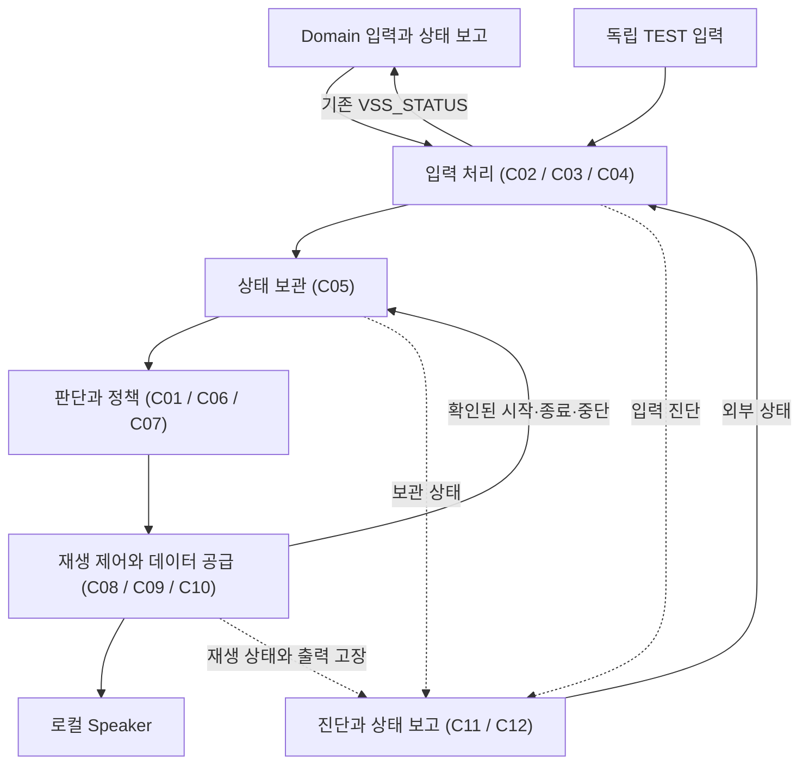
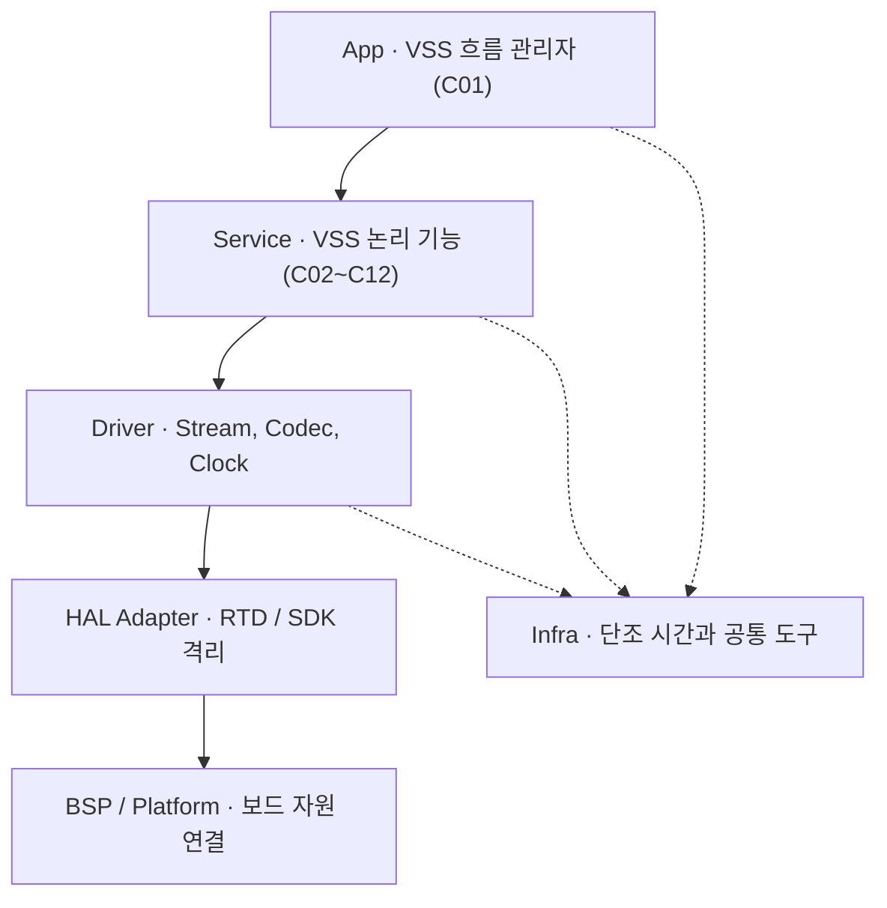
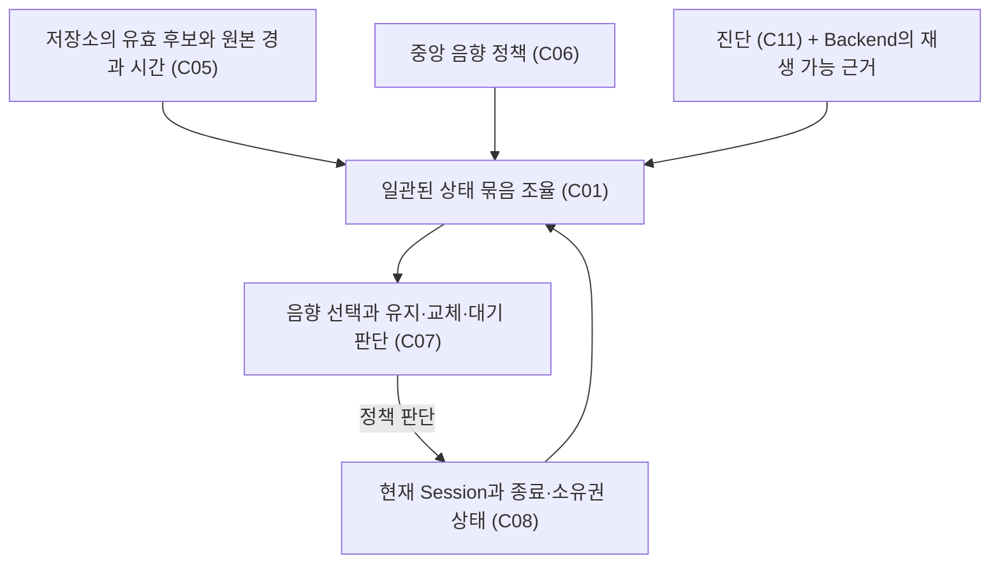
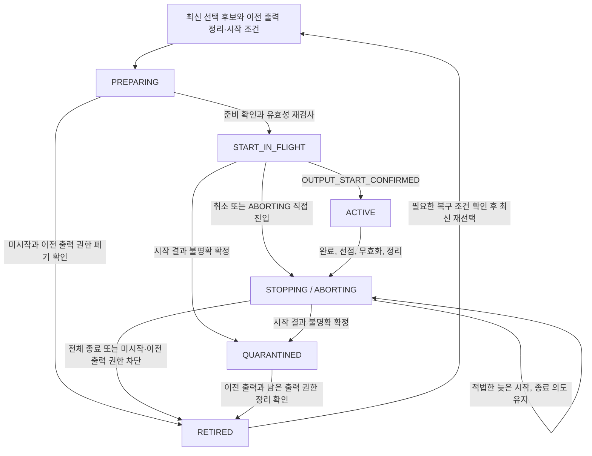
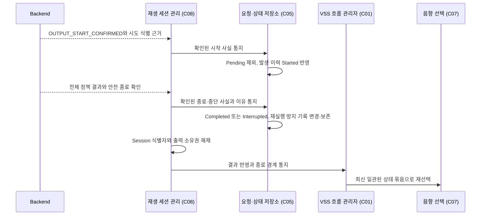
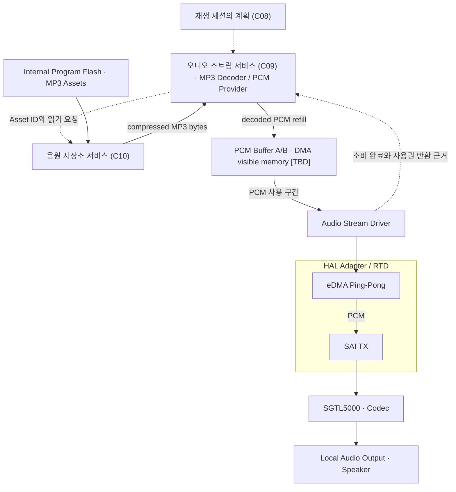
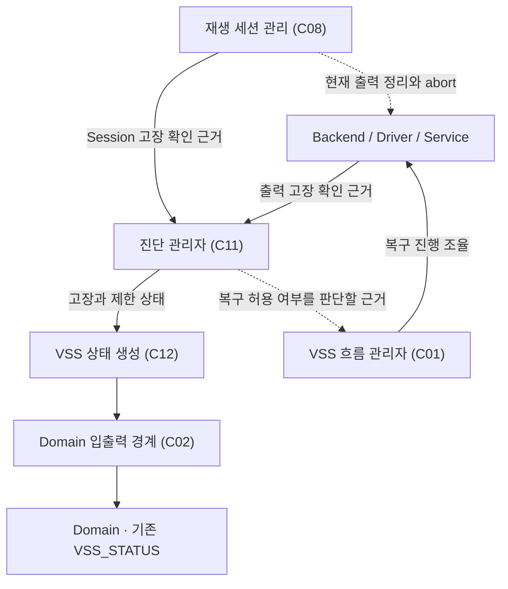

# VSS SW Architecture

> Status: Draft / Team-shareable  
> Scope: Dedicated S32K344 VSS 펌웨어의 구성 요소, Layer, 데이터 흐름과 책임 경계  
> Validation: Document design only · Firmware/board validation not performed

## 0. 문서 목적과 읽는 순서

[VSS Functional Design](../vss/VSS_function_design_draft_v0.1.md)의 기능을 **펌웨어 내부에서 누가 담당하고 어떻게 연결하는지** 설명한다. 구성 요소(Component)는 논리적 책임 단위이며 Task, 파일, Class와 하나씩 대응할 필요는 없다. 이 구조에서 구현할 기능은 사건이 한 번 발생했을 때의 음향(One-shot)과 현재 위험에 따른 경고(Stateful)다.

처음에는 §1~2의 외부 경계와 전체 구조를 읽는다. §3에서 역할 이름과 C01~C12를 연결한 뒤, §5~8에서 필요한 입력 처리와 음향 선택, 재생, Audio 경로를 확인한다. 진단과 실행 원칙은 §9~10, 확정 범위와 설계 기준은 §11에 있다. 실제 HW·RTOS 설정값은 후속 상세 설계에서 정한다.

## 1. System Context

Domain은 차량 상태와 위험 수준을 판단한다. VSS는 그 입력을 확인해 로컬 음향을 제공한다. CAN은 기존 전송 경로이며 차량 위험이나 VSS 음향 정책을 판단하지 않는다.

| 외부 경계 | 담당 |
|---|---|
| Domain / 기존 Network SW | VSS_EVENT·VSS_WARNING_STATE 전달과 VSS_STATUS 송신 |
| Domain 입출력 경계(Domain Adapter, C02) | 구조화된 입력의 의미와 원본 품질·시간·출처를 보존하고 VSS 상태를 기존 출력 계약에 연결 |
| 시험 입력 경계(Test Injection Adapter, C03) | 독립된 TEST 출처와 실행 환경에서 같은 입력 경로 사용 |
| Local Audio Output / Speaker | 로컬 음원 재생. CAN payload를 오디오 sample로 사용하지 않음 |

**기존 Network의 Node Communication ↔ Domain 입출력 경계(C02)**가 구조화된 의미 입력과 상태를 연결하는 지점이다. CAN Application Port와 하위 Message Service → Protocol/Codec → Transport → Driver → HAL Adapter/BSP는 기존 Network SW가 소유한다. 입출력 경계는 원시 CAN 해석과 순서 처리, 전송 스케줄링, Driver/HAL을 담당하지 않는다.

| 방향 | 기존 연결 경로 |
|---|---|
| 입력 | CAN Stack ↔ CAN Application Port ↔ Node Communication → 의미 입력·확인 근거 → Domain 입출력 경계(C02) → 입력 검증(C04) |
| 상태 | VSS 상태 생성(C12) → Domain 입출력 경계(C02) → 구조화된 상태·확인 근거 → Node Communication → CAN Application Port → CAN Stack |

§2와 §9의 Domain 연결은 위 Network 경로를 축약한 것이다. CAN ID와 payload, 전송 주기, timeout은 기존 Network Design을 따른다.

WINDOW / Anti-Pinch는 **[구현 보류 — 설계 유지]**다. 전용 Test Injection에서는 같은 정책과 재생 경로를 유지한다. 실제 WINDOW 연동은 보류하며, 시험 상태와 이력을 제품 실행 환경으로 옮기지 않는다.

## 2. 한눈에 보는 VSS SW 구조

**입력 처리 → 상태 보관 → 판단과 정책 → 재생**으로 이어지고, 진단과 상태 보고가 각 단계의 정보를 받는다. 먼저 이 5개 큰 책임으로 읽고, 괄호의 ID는 상세 계약을 찾을 때 사용한다.

흐름 관리자는 판단과 실행을 조율하고, 음향 정책은 선택 기준을 제공한다. 음향 선택은 후보를 비교하고 재생 세션 관리는 실제 재생을 진행한다. 시간 서비스(Infra/Timebase)는 입력 기한과 재생 진행을 판단할 시간 근거를 제공한다.

음원(Asset)을 읽고 실제 출력을 진행하는 하위 기능 묶음을 **Backend**라고 한다. 오디오 스트림 서비스와 음원 저장소 서비스, 하위 Driver를 함께 가리키며 새 Component는 아니다.

## 3. 구성 요소와 역할

역할 이름을 먼저 읽고 ID는 상세 계약을 찾을 때 사용한다. 한 파일이나 Task에 묶더라도 각 상태의 변경 책임은 구분한다.

| 역할과 ID | 주된 책임 | 책임 경계 |
|---|---|---|
| VSS 흐름 관리자(VssApp, C01) | 초기화와 정책상 허용된 복구를 조율한다. 일관된 상태 묶음을 확보해 제공하고 음향 재선택을 조율한다 | 저장소, 재생, 진단 상태를 복제해 소유하지 않는다. 위험이나 음향 순위를 다시 판단하거나 RTD를 직접 호출하지 않는다 |
| Domain 입출력 경계(Domain Adapter, C02) | 제품의 논리 입출력 의미와 Meta를 변환하고 상태 보고를 전달한다 | 원본 경과 시간을 초기화하거나 SNA를 정상값으로 만들지 않는다. 음원 선택과 CAN Stack 처리는 담당하지 않는다 |
| 시험 입력 경계(Test Injection Adapter, C03) | 시험용 출처와 실행 환경에서 입력을 전달한다 | 검증과 저장 경로를 우회하거나 음향 선택, 재생, Driver를 직접 제어하지 않는다. PRODUCT 출처를 위장하지 않는다 |
| 입력 검증(Input Validation, C04) | 값과 Meta의 품질, 시간, 순서, 세대를 확인한다. 검증된 출처 문맥 전환은 독립적으로 반영한다 | 수용 이력과 후보를 복제하지 않는다. 위험 임계값을 판단하거나 입력 품질로 출력 고장을 만들지 않는다 |
| 요청·상태 저장소(Request Store, C05) | 현재 경고, 미시작 이벤트와 발생 처리 이력을 보관한다. 발생 이력과 재실행 방지 기록은 이 저장소만 변경한다 | 출력 장치를 호출하거나 별도 우선순위를 두지 않는다. 최종 처리된 발생을 Pending으로 되살리지 않는다 |
| 음향 정책과 목록(Sound Catalog / Policy, C06) | 의미에 따른 Class, 세부 순위, 음원과 재생 패턴을 한곳에서 정의한다 | Internal Program Flash Asset 주소·배치와 DMA 자원, 실행 중 저장소나 Session 상태를 소유하지 않는다 |
| 음향 선택(Arbitration, C07) | 일관된 후보와 정책, 재생 가능 상태, 현재 Session을 비교한다. 선택 후보(Winner)의 유무와 현재 음향의 유지·교체·대기를 판단한다 | 저장소를 변경하거나 실제 stop/abort/start를 실행하지 않는다. sample과 HW 처리도 수행하지 않는다 |
| 재생 세션 관리(Playback Session, C08) | 한 출력 시도의 식별자와 단일 출력 소유권을 관리한다. 실제 시작 확인부터 종료까지 진행하며 개별 소리(cue)와 반복을 제어한다 | 발생 이력과 재실행 방지 기록을 직접 소유하거나 변경하지 않는다. 독자적인 우선순위나 Stateful CLEAR를 만들지 않는다 |
| 오디오 스트림 서비스(Audio Stream Service, C09) | **C10이 제공한 compressed MP3 bytes를 내부 decoder/provider로 decode해 PCM을 생성하고, 비어 있는 PCM Buffer A/B를 채워 Audio Stream Driver에 공급한다.** Buffer 사용권과 데이터 보충, 하위 처리 결과를 관리한다 | 어떤 경고음을 선택할지 판단하지 않는다. ISR의 대량 읽기나 실행 중 heap 할당에 의존하지 않는다 |
| 음원 저장소 서비스(Asset Storage Service, C10) | **Asset ID와 metadata로 S32K344 Internal Code/Program Flash(PFLASH controller를 통해 접근)의 MP3 Asset 위치·길이를 확인하고 compressed MP3 bytes를 제공한다.** 음원 호환성과 가용성, 읽기 진행과 음원별 결과를 관리한다 | 다른 의미의 음원으로 대체하지 않는다. 외부 Audio Stream이나 Session 출력 소유권, Runtime Flash erase/program을 담당하지 않는다 |
| 진단 관리자(Diagnostic Manager, C11) | 입력 진단과 출력 Fault를 구분한다. 현재 고장과 최근 고장을 관리하며 복구 허용 여부를 판단할 근거와 제한 상태도 관리한다 | 발생 이력을 대체하지 않는다. STALE을 출력 고장으로 바꾸거나 HW를 직접 재초기화하지 않는다 |
| VSS 상태 생성(VSS Status, C12) | 저장소 정보와 재생·진단 정보, 내부 재생 가능 상태를 종합해 일관된 외부 상태를 만든다 | 저장소나 발생 이력을 따로 소유하거나 새 고장 원인을 추정하지 않는다. PLAYING을 순간 파형의 유무로 판단하지 않는다 |

입력 검증의 출처 문맥, 저장소의 사건 발생, 재생 세션의 출력 시도 식별자는 유지되는 기간이 서로 다르다. 상태 보고는 각 담당이 제공한 정보를 사용한다.

## 4. Layer Architecture

| Layer | 담당하는 지식과 의존 경계 |
|---|---|
| App | Service의 공개 경계를 통해 진행을 조율한다. Driver 내부 Buffer·register는 모른다 |
| Service | 의미와 상태, 중립적인 결과를 처리한다. SDK 자료형이나 vendor handle을 외부에 노출하지 않는다 |
| Driver | 장치 동작과 사용 구간, 오류 근거를 관리한다. 공개 경계에 vendor enum이나 handle을 노출하지 않는다 |
| HAL Adapter | RTD/SDK 호출과 자료형, IRQ acknowledge를 격리한다 |
| BSP / Platform | 보드의 Clock, PinMux, IRQ, instance와 메모리를 연결한다. 상위 의미 정책은 두지 않는다 |
| Infra | 단조 시간과 자원 한도가 정해진 공통 도구, 전달·관측 기능을 제공한다. 차량 순위나 장치 정책은 소유하지 않는다 |

Vendor RTD/SDK 지식은 HAL Adapter에, 보드별 차이는 BSP/Platform에 둔다. 하위 결과는 중립적인 확인 근거로 전달한다. 실제 파일과 API, RTOS primitive의 배치는 후속 설계에서 정한다.

Internal Program Flash의 read-only Asset 접근은 C10이 담당하며 별도 외부 Storage Driver나 새 Flash Driver Component를 두지 않는다.

Network Common Infra/Diagnostics는 link와 transport 관측, Network 진단, 공통 RTOS/timebase 도구를 제공한다. VSS 진단 관리자는 의미 입력을 진단하고 Audio/Playback Fault, 현재 고장과 최근 고장, 복구 제한을 관리한다. VSS Infra/Timebase는 논리적 의존 관계이며 Platform/Network의 공통 단조 시간·RTOS 도구를 사용할 수 있다. 별도 물리 timer/timebase 구현을 강제하지 않는다.

## 5. 입력 검증과 상태 저장

제품의 Domain 입출력 경계와 시험 입력 경계는 모두 **입력 검증 → 저장소 수용 반영**을 거친다. Network RX 성공은 수신(received), 검증 통과는 유효(valid), 추적 정보까지 저장한 상태는 수용 완료(accepted)다.

Network Node Communication은 wire/source AGE와 문맥을 보존하고 누적해 구조화된 확인 근거로 전달한다. 입력 검증은 전달받은 근거를 현재 VSS 의미 입력의 수용 판단에 사용할 수 있는지 확인한다.

| 보관 정보 | 담당과 역할 |
|---|---|
| 출처 문맥과 적용 순서 | 입력 검증(C04): 검증된 세대와 연속성, 과거 세대를 차단할 근거와 적용 순서 |
| 현재 경고와 후방 결합 상태 | 요청·상태 저장소(C05): 마지막 정상 판단과 현재 품질, 유효 경고와 Hold. Rear 위험과 Activation을 함께 적용할 근거 |
| Pending One-shot | 요청·상태 저장소(C05): 수용됐지만 실제 시작하지 않은 발생, 원본 발생 후 경과 시간과 기한 |
| 발생 이력과 재실행 방지 기록 | 요청·상태 저장소(C05): Pending/Started/최종 처리 상태를 추적하고 동일 발생의 재전달에 따른 재실행 차단 |
| 입력 진단과 출력 고장 | 진단 관리자(C11): 서로 분리된 확인 근거와 상태 |
| 외부 보고 상태 | VSS 상태 생성(C12): 각 담당 정보로 만든 일관된 상태 묶음 |

**Network의 TX/context pending과 저장소의 Pending One-shot은 생명주기가 다르다.** 전자는 Message Service / Node Communication의 전달 대기다. 후자는 저장소에 수용됐지만 `OUTPUT_START_CONFIRMED` 전인 사건 발생이다. Network Queue나 문맥 정리는 수용된 발생의 이력, 재실행과 최종 상태를 직접 변경하지 않는다. 변경 책임은 기존 저장소 계약을 따른다.

검증된 출처 문맥 전환과 개별 입력 수용은 별도로 반영한다. 문맥 전환 뒤 이벤트 자원이 부족해도 출처 전환을 되돌리지 않는다. 현재 값과 Meta, 기한, 후방 결합은 일부만 반영된 상태로 노출하지 않는다.

새 이벤트를 수용할 때는 Pending과 최종 처리까지 추적할 이력 자원을 함께 확보한다. 자원이 부족하면 수용 전체를 거부한다. 수용한 발생의 추적 정보를 잃거나 가장 오래된 최종 이력을 임의로 버리지 않는다. Stateful 고정 slot과 이벤트 자원은 구분하며 실제 개수와 크기, pool/array는 **[TBD]**다.

PRODUCT와 TEST는 같은 규칙을 사용하되 출처, 저장소, 시간과 실행 환경을 격리한다. 재부팅 뒤 이력이나 시간 근거를 잃었다면 재실행 방지 조건을 확인하지 않고 이전 이벤트를 새 발생으로 수용하지 않는다.

## 6. 음향 선택

VSS 흐름 관리자는 각 담당이 반영한 상태와 맞는 **일관된 상태 묶음(coherent Snapshot)**을 확보해 제공하고 재평가를 조율한다. 음향 선택은 이 묶음을 읽기 전용으로 비교한다. 실제 재생은 재생 세션 관리가 실행한다.

내부 재생 가능 상태(Internal Playback Capability)는 진단 관리자의 고장·복구 제한과 Backend의 확인 근거를 종합한다. Backend는 음원과 공통 출력 경로, 제어기 준비 상태와 현재 출력 소유권을 확인한다.

정책과 **[잠정]** 세부 우선순위는 [기능 문서 §6](../vss/VSS_function_design_draft_v0.1.md#priority)을 따른다. 외부 VSS_AVAILABILITY=FULL은 개별 시작 허가가 아니다. 현재 재생이 출력 소유권을 갖고 있어도 더 높은 선점 후보를 비교한다. 실제 실행은 이전 재생의 안전 종료 경계를 기다린다.

종료 중 우선 선택된 후보가 바뀌어도 기존 종료 의도를 취소하지 않는다. 안전하게 종료한 뒤 최신 상태로 다시 선택하고 준비와 시작 직전에 유효성을 재검사한다.

## 7. 재생 제어

재생 세션 관리는 선택된 정책을 한 출력 시도에 연결하고 Backend가 실제로 출력을 시작했는지, 종료했는지 확인한다. 준비와 시작 요청, 실제 시작 확인을 구분한다. Session은 cue 사이의 무음과 반복 대기까지 포함하는 하나의 재생 단위다.

### 7.1 진행 상태

| 단계 | 의미 |
|---|---|
| PREPARING | 아직 출력 없음. 준비에는 시작 권한이 없음 |
| START_IN_FLIGHT | 시작 요청 뒤 결과를 추적함. 정해진 시간 안의 정상 대기는 Fault가 아니며 다른 시도는 차단 |
| ACTIVE | 적법한 실제 시작이 확인됨. cue 사이의 무음과 반복 대기도 같은 Session |
| STOPPING | 종료 의도를 확정하고 실제 종료를 기다리는 상태. stop API 호출과 동일하지 않음 |
| ABORTING | 긴급하거나 비정상적인 상황의 정리. 시작 미확정인 START_IN_FLIGHT에서 직접 진입 가능 |
| QUARANTINED | 시작 결과나 출력 소유권을 확실히 확인할 수 없다고 확정됨. 정상 시작을 차단하고 진단 관리자에 고장 근거 전달. 정리와 정책상 허용된 복구 수행 |
| RETIRED | 출력 종료 또는 미시작을 확인하고 이전 재생의 모든 출력 권한을 차단한 뒤 식별자와 소유권 해제. 고장 해제에는 별도 조건이 필요 |

### 7.2 시작 확인 전 종료의 세 결과

STOPPING과 ABORTING 직접 진입 모두 시작 여부가 미확정이면 같은 세 결과를 적용한다.

| 결과 | Session과 저장소 반영 |
|---|---|
| `NO_START_CONFIRMED` | 실제 출력이 없었고 이전 재생의 어떤 출력도 이후 발생할 수 없음을 확인. 유효한 미시작 Pending은 원본 경과 시간과 재실행 조건 안에서 유지 가능 |
| `OUTPUT_START_CONFIRMED` | 아직 유지 중인 동일 시도에서 적법한 늦은 시작이 확인되고 최종 처리 확정 전이면 저장소에 Started 통지. PLAYING 사실을 반영하되 종료·abort 의도는 유지. 정상 ACTIVE 복귀 금지 |
| `START_OUTCOME_UNCERTAIN` | QUARANTINED / FAULT / UNAVAILABLE / PLAYBACK_STATE_FAILURE. 저장소에 시작 여부를 확정할 수 없는 최종 상태와 재실행 금지 근거를 통지하고 이전 출력 정리 계속 |

abort 요청 성공이나 현재 무음으로 미시작이나 종료를 입증할 수 없다. 시작 결과가 불명확하다고 최종 확정한 뒤 도착하는 시작·완료 결과는 진단과 이전 출력 정리에만 사용한다. 발생 이력이나 새 Session을 되살리지 않는다.

### 7.3 발생 이력과 출력 소유권의 분리

전체 정책의 완료와 출력 종료를 확인한 예다. 정책이 자연스럽게 완료돼도 안전 종료를 확인해야 한다. 개별 sample block이 끝났다고 전체 재생을 종결하지 않는다.

**요청·상태 저장소(C05)만 발생 처리 이력(occurrence ledger)과 재실행 방지 기록(replay guard)을 변경한다.** 재생 세션 관리(C08)는 확인된 사실을 통지하고 Session 식별자와 출력 소유권을 해제한다. 시작 여부가 불명확한 발생도 안전 종료 전에 최종 상태가 기록될 수 있다. 그 기록으로 출력 소유권 해제를 입증하지 않는다.

비동기 결과는 전체 시도 식별자와 요청·결과의 인과관계, 출력 결과가 실제로 발생한 시점에 연결한다. 이전 시도의 Callback으로 현재 Session이나 다른 발생을 완료시키지 않는다.

## 8. Audio Data Path와 Driver

**음원 저장소 서비스(C10)는 Internal Program Flash의 MP3 Asset을 찾아 compressed MP3 bytes를 제공하고, 오디오 스트림 서비스(C09)는 이를 decode해 PCM Buffer A/B에 채워 Audio Stream Driver로 공급한다.** 저장 음향 경로는 Internal Program Flash → C10 → C09 내부 MP3 decode → PCM Double Buffer A/B → Audio Stream Driver → eDMA Ping-Pong → SAI TX → SGTL5000 → Speaker다. 어느 음향을 재생할지는 이 두 서비스가 결정하지 않는다.

실선은 MP3 압축 byte와 decode된 PCM의 이동을, 점선은 재생 계획과 읽기·사용권 조율을 나타낸다.

음원 Asset은 build-time에 Firmware image와 함께 포함되는 read-only data다. C10은 memory-mapped Internal Program Flash의 Asset span/chunk를 제공한다. decoder의 Internal Program Flash pointer 직접 읽기와 compressed staging window 사용 중 어느 방식을 택할지는 Stage 4 **[TBD]**다. Runtime Flash erase/program은 이 저장 경로의 책임이 아니다.

MP3 Decoder / PCM Provider는 C09 내부 역할이며 새 Component가 아니다. **MP3 → PCM decode는 CPU/C09에서 수행하고, eDMA는 PCM Buffer A/B의 decode된 PCM만 SAI TX로 전송한다. SGTL5000은 MP3를 decode하지 않는다.** Clock과 Codec 제어는 sample 이동과 분리한다. 그림은 실제 Clock 연결이나 장치 설정 순서를 지정하지 않는다.

| Backend에서 확인하는 출력 결과 | 상위가 사용하는 근거 |
|---|---|
| 준비 결과 | 해당 출력 시도의 준비가 끝났지만 아직 출력하지 않음 |
| 실제 시작 | OUTPUT_START_CONFIRMED: 시도 식별자와 권한이 실제 출력 시작 경계와 일치 |
| 미시작 | 실제 출력이 없었고 이전 재생의 출력 권한이 차단돼 이후에도 출력되지 않음 |
| 전체 종료 | 실제 종료 또는 미시작 확인. 이전 재생의 모든 시작·cue·반복 권한 차단. 출력 소유권 재취득 불가 |

이전 출력이 완전히 끝나고 예약된 후속 출력도 더는 발생하지 않음을 확인하는 경계를 **retirement fence**라고 한다. 재생 세션 관리는 이 경계 전에 두 번째 Backend Session을 준비하거나 시작하지 않는다. 요청 수락, DMA 제출이나 소비 완료, cue 사이의 무음으로 전체 시작·종료를 입증할 수 없다. 실제 HW 근거와 오차, 취소 효력은 Stage 4 이후에서 입증한다. 처리가 무기한 대기하지 않고 정해진 시간 안에 진행되는지도 검증한다.

### 8.1 Driver / Peripheral 책임

| 하위 담당 | 역할 | 후속 상세 |
|---|---|---|
| Audio Stream Driver | PCM Buffer A/B 사용 구간과 eDMA/SAI TX, abort, 하위 Callback 관리 | DMA channel, descriptor 수, SAI register와 PCM Buffer 사용권 표현 |
| Codec Driver | Codec을 준비하고 제어 결과 제공 | register, reset과 설정 순서 |
| Clock Generator Driver | clock generator 자체를 설정하고 상태 확인 | 장치 설정, ratio와 실제 연결 |
| Clock Reference Driver | generator에 공급할 reference source를 생성·제어하고 준비 | source, timer, pin, frequency 구현 |

Clock Generator와 Clock Reference의 책임은 다르다. 실제 source와 Clock 연결, 모든 자원과 설정값은 **[TBD]**이며 상위에 노출하지 않는다.

통신은 §1의 기존 Node Communication ↔ Domain 입출력 경계(C02)로 연결한다. CAN Controller와 CAN Application Port, 하위 CAN Stack 처리는 기존 Network SW가 소유한다.

## 9. Fault / Status / Recovery

진단 관리자는 고장 정보와 제한을 관리한다. VSS 상태 생성은 고장 정보와 저장소·재생 정보를 종합해 외부 보고를 만든다. VSS 흐름 관리자는 진단 정책상 허용된 복구를 조율하고 실제 장치 동작은 Backend가 수행한다.

| 담당 | 고장과 복구에서 하는 일 |
|---|---|
| Backend/Driver/Service | 음원과 공통 출력 경로의 오류를 검출한다. 정책상 허용된 실제 복구와 검증을 수행한다 |
| 재생 세션 관리(C08) | 현재 출력을 정리하고 Session 상태를 확인할 근거를 제공한다. 시작·종료·중단 사실을 저장소에 통지하고 안전 종료 경계 뒤 Session 식별자와 소유권을 해제한다 |
| 요청·상태 저장소(C05) | 통지된 사실에 따라 발생 이력과 재실행 방지 기록을 변경한다. 원본 경과 시간을 유지하고 최종 처리된 발생의 재생을 계속 차단한다 |
| 진단 관리자(C11) | 입력 진단과 출력 Fault를 분리한다. 현재 고장과 최근 고장을 관리하고 복구 허용 여부를 판단할 근거와 제한 상태도 관리한다 |
| VSS 상태 생성(C12) | 저장소 정보와 재생·진단 정보, 전체 진행 및 재생 가능 상태를 종합해 외부 State/Availability/Fault를 만든다 |
| VSS 흐름 관리자(C01) | 정책상 허용된 Recovery를 조율한다. 하위 동작의 실행과 결과 확인을 조율한다 |

진단 관리자는 HW를 직접 재초기화하지 않는다. VSS 상태 생성도 새 고장 원인을 추정하지 않는다. **재생 세션 관리는 재실행 방지 기록을 소유하거나 변경하지 않는다.**

공통 출력 경로를 사용할 수 없거나 시작 결과가 불명확하다고 확정되면 FAULT/UNAVAILABLE로 보고하고 새 정상 시작을 차단한다. 복구에는 이전 출력의 종료와 남은 출력 권한 정리, 공통 경로의 정상 상태가 필요하다. 저장소와 시간 근거가 계속 유지되는지, 기존 발생의 재실행 방지 정보가 계속 보존되는지, 진단상 복구가 허용되는지도 확인한다. 소유권 해제만으로 고장을 해제하지 않는다.

PER-009는 **복구 가능(recoverable)으로 분류된 출력 Fault에만** 적용한다. 실제 복구 동작과 DIA-017 분류는 Stage 6/7 **[TBD]**다. 외부 상태와 복구 뒤 후보 선택은 [기능 문서 §8](../vss/VSS_function_design_draft_v0.1.md#external-status)을 따른다.

## 10. Runtime / ISR / Resource 원칙

VSS 흐름 관리자는 초기화와 재선택, 복구를 조율하고 각 담당은 자신의 상태를 반영한다. 실행은 입력 도착뿐 아니라 **기한, Backend 결과, 진단과 재생 가능 상태 변화**에 반응한다. RX가 없어도 이벤트 만료와 입력 최신성, Hold, 출력 정리의 진행을 평가한다.

입력 검증과 수용, 음향 선택의 일관된 비교, 재생 사실 처리 사이의 경합은 직렬화한다. Infra/Timebase는 원본 경과 시간과 Hold, 출력 결과가 실제로 발생한 시점을 비교할 단조 시간 근거를 제공한다. 재선택이나 복구로 기산점을 초기화하지 않는다.

Network의 CAN worker, typed port와 Node Communication 역할은 기존 Network SW Architecture를 따른다. VSS로 전달할 때는 §1의 Node Communication ↔ Domain 입출력 경계를 거친다. 실제 Task 수와 주기, priority, stack, Queue/IPC, RTOS 배치는 Stage 5 상세 설계다. Component마다 Task 하나를 두도록 요구하지 않는다.

### 10.1 ISR / Callback과 RAM 사용권

| 문맥 / 담당 | 수행 범위 |
|---|---|
| HAL/Driver ISR·Callback | IRQ acknowledge, 짧은 상태·근거 기록, 용량이 제한된 저장과 후속 처리 알림 |
| 후속 Service 처리 | 결과를 해당 시도에 연결하고 기한 처리와 데이터 보충, 상태 반영 수행. 전체 정책을 ISR에서 실행하지 않음 |
| 오디오 스트림 서비스(C09) | MP3 decode와 PCM Buffer A/B refill, PCM 사용 구간의 인계와 회수 관리 |
| Audio Stream Driver / DMA TX | 인계받은 사용 구간 보호. 소비 또는 안전 abort 확인 전 변경·반납·재사용 금지 |

ISR에서 MP3 decode, 해석 처리, 대량 음원 읽기·복사, 음향 선택, 전체 Session 전이, blocking 제어·복구, 동적 할당을 수행하지 않는다. DMA block 소비 완료와 전체 Session 종료는 별개 사실이다.

eDMA가 Buffer A를 전송하는 동안 C09는 사용권이 반환된 Buffer B만 refill하고, Buffer B 전송 중에는 반환된 Buffer A만 refill한다. 전송 예정으로 인계된 Buffer도 C09가 덮어쓰지 않는다. DMA completion/callback은 해당 PCM buffer의 소비 완료와 handoff 근거이며 전체 Playback Session 종료가 아니다.

실행 중 heap 할당 없이 사용량이 제한된 정적 자원을 기본으로 한다. 기타 작업 Buffer 개수와 PCM Buffer A/B 크기·정렬·DMA-visible memory 배치와 cache coherency 전략(non-cacheable 배치 또는 필요한 cache maintenance), Queue/Pool, 실행 문맥은 실제 linker / MPU / RTD / cache 설정을 확인한 뒤 Stage 4~5 **[TBD]**다. 늦은 Callback은 이전 사용 구간과 현재 시도를 구분해야 한다.

## 11. TBD와 후속 구현

| 항목 | 현재 상태 |
|---|---|
| Component / Layer / 책임 경계 | 기존에 확정된 논리 설계를 적용한 공유 초안 |
| 입력·저장·음향 선택·Session·Backend 계약 | 정의 |
| Logical Interface / Network mapping | 기존 계약 사용 |
| Audio HW 연결과 자원 산정 | **[TBD]**, 실제 대상 HW 확인과 실측 필요 |
| Firmware 구현 / Board validation | 수행하지 않음 |
| WINDOW 실제 source / ECU 통합 | **[구현 보류 — 설계 유지]**, TEST 의미 입력 경로는 유지 |

### 11.1 아직 확정하지 않은 구현 항목

| 상세 영역 | 필요한 결정과 근거 |
|---|---|
| 저장소와 음원 | Internal Program Flash asset region, linker section / asset table, address / alignment, 실제 MP3 Asset과 총 용량 |
| MP3 decode | decoder library binding, bitrate / sample rate / channel, PCM format, decoder state/scratch·decoded frame의 RAM / CPU budget, compressed input direct/staging 전략과 window 크기 |
| RAM / TX | PCM Buffer A/B 크기·정렬·DMA-visible memory 배치와 cache coherency 전략(non-cacheable 배치 또는 필요한 cache maintenance): Stage 4~5 **[TBD]**. DMA channel/descriptor 수와 배치, SAI register |
| Codec / Clock | 실제 설정과 순서, source, pin, timer, 연결 구조 |
| Backend에서 확인할 출력 결과 | 실제 시작·미시작·종료의 HW 근거, 취소 효력과 정해진 시간 안의 결과 판단 |
| 실행과 모듈 | Task/IRQ와 priority, stack, queue, C API/struct 및 식별자 표현, 자원 예산 |
| 진단과 통합 | 복구 가능성 분류와 고장 해제, Recovery Action, Availability 최종 파생, 기존 Network 의미 입력·상태 연결 |

기존 CAN ID와 payload, 전송 주기, timeout을 새로 정의하지 않는다.

전체 Flash 용량을 VSS Asset 가용 용량으로 간주하지 않는다. Stage 4에서 Boot/HSE reserved, Application code, const/rodata와 기타 reserved를 제외하고 실제 linker map 기준으로 MP3 Asset budget과 여유 공간을 계산한다. decoder state/scratch, compressed staging, decoded frame, PCM A/B의 CPU/SRAM 예산은 Stage 4~5 **[TBD]**다.

Asset missing/metadata invalid, unsupported/corrupt MP3, decoder failure, Internal Program Flash ECC/read issue는 원인 후보이며 새 Fault Category가 아니다. 기존 Fault와의 정확한 mapping은 Stage 6 진단 정책 **[TBD]**다.

### 11.2 후속 구현

현재 [SysRS §7](../requirements/VSS/02_VSS_SYSRS_FUNCTIONAL_BASELINE_DRAFT.md#7-performance-requirements)의 **PER-001~010 시간 요구를 본 Architecture가 상속한다.** 수치와 Candidate 상태는 원문에서 관리한다.

| 성능 요구 | 담당 책임 |
|---|---|
| PER-001: 초기화 상태 확정 | VSS 흐름 관리자(C01) / 초기화 경로(Service·Driver·Backend) / 진단 관리자(C11) / VSS 상태 생성(C12) |
| PER-002~005 / PER-007 / PER-010: 재생 시작·선점·위험 단계 전환 | 음향 선택(C07) / 재생 세션 관리(C08) / Backend |
| PER-006: Stateful 해제 | 요청·상태 저장소(C05) / 음향 선택(C07) / 재생 세션 관리(C08) / Backend |
| PER-008: 외부 상태 갱신 가능 | VSS 상태 생성(C12) / Domain 입출력 경계(C02) |
| PER-009: 복구 판단 | VSS 흐름 관리자(C01) / 진단 관리자(C11) / Backend. §9의 recoverable 조건 유지 |

Backend/HW 시간 근거는 Stage 4, 실행 구조와 deadline 상세는 Stage 5, 실측 검증은 Stage 8에서 다룬다. 이 연결은 설계 반영이며 펌웨어·보드 성능 검증 완료를 뜻하지 않는다.

MP3 경로에는 compressed read → decode → 첫 PCM Buffer priming → eDMA/SAI start 시간이 추가된다. 이 비용을 포함해 PER-002~005 Candidate timing을 만족할 수 있는지는 Stage 4 feasibility에서 확인하고 Stage 8에서 실측한다. 충족을 가정하지 않으며 predecode/cache 같은 후속 대안도 이번 설계의 확정 정책이 아니다.

| 단계 | 구체화할 내용 |
|---|---|
| Stage 4 | Internal Program Flash Asset layout·Flash capacity budget, MP3 format/decoder binding, PCM Buffer·eDMA·SAI·Codec·Clock 연결, 실제 시작·미시작·종료 근거와 안전 종료 |
| Stage 5 | decoder/refill 실행과 DMA Callback/deferred work, A/B 사용권, deadline·동시성·선점 직렬화와 underrun 방지 |
| Stage 6 | 모듈과 API, 데이터 모델, 식별자, 자원과 Fault 정책 |
| Stage 7 | 기존 Interface/Network 계약 연결, 출처와 시간, 재실행 방지와 외부 상태 통합 |
| Stage 8 | Backend 시험 대역과 Test Injection, 경합, 실제 MP3 decode timing·DMA underrun·start latency·선점/abort·Fault injection·음질·Flash capacity 및 보드 검증 |

### 11.3 설계 기준과 상세 자료

아래 표는 현재 `develop`의 Repository 기준 자료를 먼저 보여준다. SR·SysRS는 상위 요구의 의도와 최소 범위를, Trace는 요구 근거 탐색을 담당한다. SR은 Draft, SysRS는 Functional Baseline Draft / Review Draft, Trace는 Review Draft이며, Matrix는 Logical Interface Freeze Review Candidate다. Domain VSS 정보서는 Cross-check 상세 자료로 함께 사용한다. 어느 한 문서만을 후속 변경까지 모두 반영한 단일 최신 기준으로 간주하지 않는다. 외부 Logical Interface의 이름·방향·값은 Matrix를 기준으로 확인하고, Original Age·Priority·Hold·Recovery의 세부 의미는 Domain VSS Cross-check 자료와 함께 대조한다. 문구 차이만으로 검증된 내부 설계를 되돌리지 않는다.

| 자료 | 필요한 내용 |
|---|---|
| [docs/requirements/VSS/01_VSS_SR_FUNCTIONAL_BASELINE_DRAFT.md](../requirements/VSS/01_VSS_SR_FUNCTIONAL_BASELINE_DRAFT.md) | 상위 기능 범위와 책임 경계 |
| [docs/requirements/VSS/02_VSS_SYSRS_FUNCTIONAL_BASELINE_DRAFT.md](../requirements/VSS/02_VSS_SYSRS_FUNCTIONAL_BASELINE_DRAFT.md) | 시스템 요구. §7의 PER-001~010, §10의 진단, §11의 비기능, §14의 미정 항목 |
| [docs/requirements/VSS/04_VSS_SR_SYSRS_TRACE_NAVIGATION_DRAFT.md](../requirements/VSS/04_VSS_SR_SYSRS_TRACE_NAVIGATION_DRAFT.md) | SR↔SysRS 근거 탐색. 후속 refinement까지 모두 갱신됐다는 뜻은 아님 |
| [docs/Domain/interface/Domain_Master_Interface_Matrix_v0.1.md](../Domain/interface/Domain_Master_Interface_Matrix_v0.1.md) §4.5 | 현재 10 D2V / 10 V2D의 이름·방향·값 기준 |
| [docs/Domain/require/VSS/VSS_ECU_Interface_정보서_v1.3.1.md](../Domain/require/VSS/VSS_ECU_Interface_정보서_v1.3.1.md) §4.3·§7.3·§8.3·§8.5·§8.8 | 입력 수명, Priority, Hold, Fault/Recovery의 세부 의미. **[잠정]/TBD** 유지 |
| `VSS_SOFTWARE_ARCHITECTURE_BASELINE_v1.1.md` §3~13 / `VSS_02_LOGICAL_ARCHITECTURE.md` | 내부 상세 구체화(refinement) 근거. 전체 Component/Layer와 하위 Driver·HAL/BSP 골격 |
| VSS_05~07 | 내부 상세 구체화 근거. 입력 검증, 출처 문맥, 저장소와 발생 이력 |
| VSS_09 / VSS_10~11 / VSS_12 | 내부 상세 구체화 근거. 일관된 선택 / Session과 Backend 사실·안전 종료 / 고장과 후속 인수조건 |
| `network_design_draft_v0.1.md` §5.2~5.4, §8 / `network_sw_architecture.md` §3~10 | 기존 CAN 계약과 Network 책임·실행 경계 |

Stage 0~2, Stage 3A v0.2, Stage 3B v0.4 Frozen 및 Architecture Baseline v1.1의 설계 의미를 유지한다. 내부 Frozen 근거가 외부 Matrix나 명시적 상위 요구를 자동으로 덮어쓰지는 않는다. 의미 차이는 상위 문서 동기화 대상으로 분리하고, 경로가 확인되지 않은 내부 상세 자료는 파일명으로 참조한다.

기능 관점은 [VSS Functional Design](../vss/VSS_function_design_draft_v0.1.md)을 읽는다.
