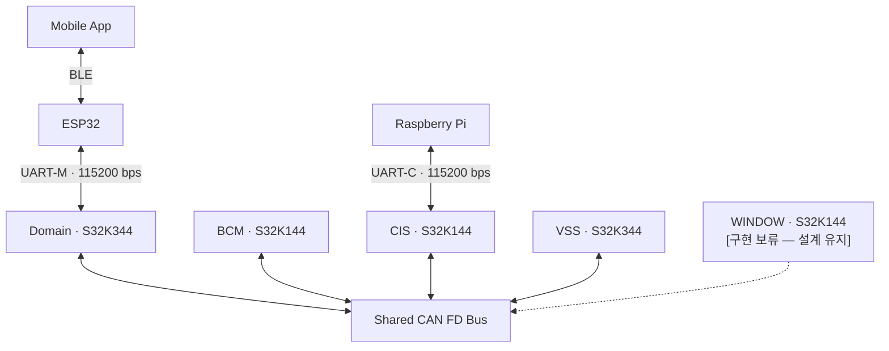
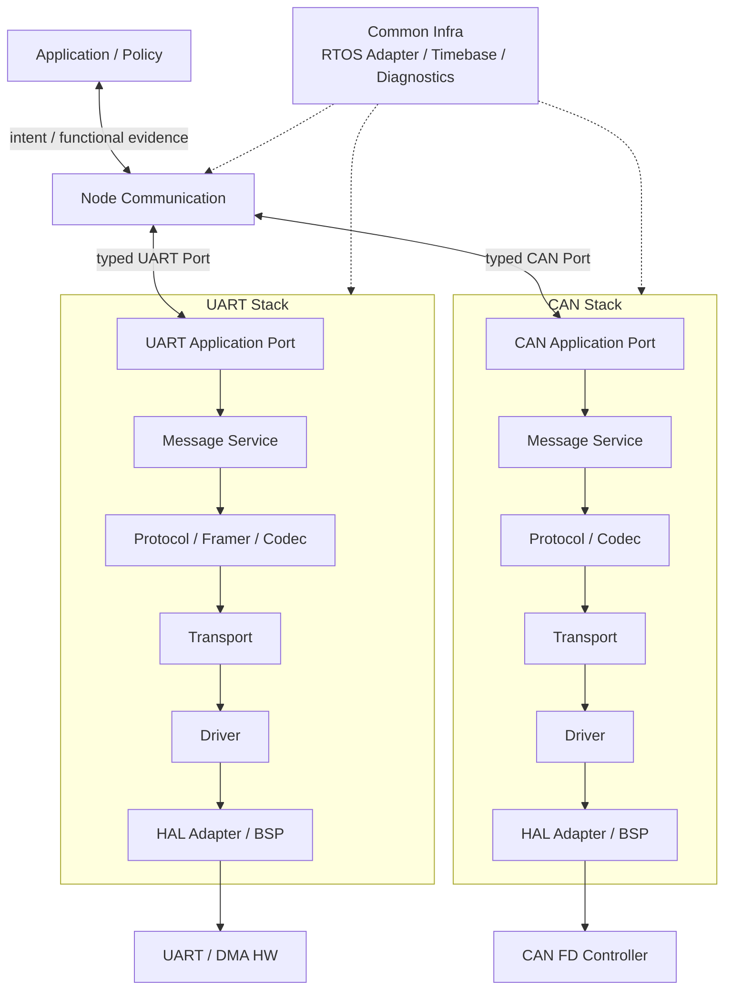
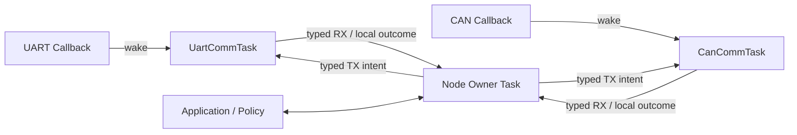

# Network SW Architecture

> Status: Draft  
> Related Issue: #47 `[ARCH] 네트워크 SW 전체 구조 설계`  
> Scope: CAN FD / UART 기반 Network Software의 논리 구조와 책임 경계  
> Validation: Document design only · Firmware/board validation not performed

## 1. 목적

본 문서는 현재 네트워크 설계를 실제 펌웨어 구조로 연결하기 위해
Network Software의 전체 Layer, 모듈 책임, Node별 적용 범위를 정의한다.

이 문서에서는 다음을 다룬다.

- UART / CAN FD Network SW의 공통 구조
- Layer별 책임과 의존 방향
- UART와 CAN의 공통점 및 개별 책임
- Domain / BCM / CIS / VSS의 Network SW 배치
- Application과 Network SW의 책임 경계
- FreeRTOS 기반 실행 구조의 기본 방향
- 후속 상세 설계로 분리할 항목

CAN ID, UART Type, payload layout, 주기, timeout 등
**wire contract의 상세 값은 이 문서에서 다시 정의하지 않는다.**

상세 통신 계약은 다음 문서를 기준으로 한다.

- [`../network/network_design_draft_v0.1.md`](../network/network_design_draft_v0.1.md)

---

## 2. 전체 네트워크 구성

현재 논리 연결은 다음과 같다.



주요 경계는 다음과 같다.

| 구간 | 통신 | 역할 |
| --- | --- | --- |
| App ↔ ESP32 | BLE | 사용자 요청/상태 표시. 상세 BLE 설계는 ESP32/App 담당 |
| ESP32 ↔ Domain | UART-M | App 요청, Query, 차량 상태/결과/경고 전달 |
| Domain ↔ BCM/CIS/VSS | CAN FD | 차량 내부 상태·명령·결과·이벤트 전달 |
| CIS ↔ Raspberry Pi | UART-C | Vision 결과와 Domain permission 전달 |
| WINDOW | CAN FD | 계약은 유지하되 현재 구현은 보류 |

Pi와 Domain은 직접 UART로 연결하지 않는다.

---

## 3. Network SW 전체 구조

Network SW는 Application/Policy와 물리 통신 Driver 사이를 계층화한다.



### 기본 원칙

1. **Application/Policy**
   - 기능 상태와 차량 정책의 owner다.
   - 통신 sequence, framing, Driver 상태를 직접 관리하지 않는다.

2. **Node Communication**
   - 통신 identity, request/result correlation, source freshness, cross-link semantic mapping을 담당한다.
   - UART frame을 CAN frame으로 단순 복사하지 않는다.
   - UART Stack과 CAN Stack 사이의 직접 호출을 만들지 않는다.

3. **UART Stack / CAN Stack**
   - 각 링크의 wire format, transport scheduling, Driver lifetime을 담당한다.
   - 서로 runtime, codec, queue를 공유하지 않는다.

4. **Common Infra**
   - RTOS primitive, timebase, bounded diagnostics 등 공통 기능을 제공한다.
   - message semantics나 차량 정책을 소유하지 않는다.

---

## 4. Layer별 책임

| Layer | 주요 책임 | 하지 않는 일 |
| --- | --- | --- |
| Application / Policy | 기능 상태, authorization, arbitration, command intent, warning 의미, 기능 Result | UART/CAN framing, sequence, Driver 제어 |
| Node Communication | session/context, Request/Command/Result correlation, source identity/AGE, semantic mapping | 차량 기능 정책 재판정, Driver 직접 접근 |
| Application Port | Node와 Stack 사이 typed API 경계 | vendor SDK type 노출 |
| Message Service | TX pending/scheduling, sequence 관리, periodic/change/event 처리 | payload 의미의 기능 정책 결정 |
| Protocol / Codec | field encode/decode, wire validation | transport scheduling, 차량 정책 |
| UART Framer | byte stream에서 frame 조립, resync, CRC frame 경계 | Application 의미 처리 |
| Transport | bounded TX/RX lifetime, stable data handoff, Driver admission/outcome | 기능 Result 생성 |
| Driver | HW/SDK callback, TX/RX primitive, local HW error | parsing, policy |
| HAL Adapter / BSP | vendor SDK 및 target 차이 격리 | Network semantic 소유 |
| Common Infra | RTOS adapter, timebase, diagnostics, bounded utility | UART/CAN 간 routing |

---

## 5. UART와 CAN의 공통·개별 구조

### 5.1 공통

UART와 CAN 모두 다음 원칙을 사용한다.

- callback/ISR에서는 최소 작업만 수행한다.
- 실제 parsing, codec, scheduling은 FreeRTOS Task context에서 처리한다.
- Application에는 raw frame 대신 typed message/evidence를 전달한다.
- 송신 요청의 admission과 실제 차량 기능 Result를 구분한다.
- source freshness와 local transport 상태를 구분한다.
- runtime dynamic allocation 없이 bounded/static resource 사용을 기본으로 한다.

### 5.2 UART 전용

UART는 byte stream이므로 별도의 framing이 필요하다.

```text
Driver
→ Transport
→ Framer
→ Codec
→ Message Service
→ Application Port
```

현재 설계 방향:

- DMA-first
- UART-M / UART-C는 동일 Stack 구조를 사용하되 Profile/Runtime은 독립
- frame split/continuous 수신 대응
- CRC 및 frame resync
- LINK_SEQUENCE는 Message Service가 선택하고 Driver accepted 시 commit
- DMA 완료와 실제 UART line 전송 완료를 구분
- RTS/CTS를 사용하지 않으므로 RX overflow/loss를 명시적으로 검출

### 5.3 CAN 전용

CAN Controller가 frame 경계를 제공하므로 UART Framer는 없다.

```text
Driver
→ Transport
→ Codec
→ Message Service
→ Application Port
```

현재 설계 방향:

- CAN DMA는 사용하지 않음
- MB / FIFO / filter의 실제 binding은 구현 직전 target 확인
- TX_SEQUENCE는 Message Service가 선택하고 Driver accepted 시 commit
- local TX complete와 상대 ECU 수신/Vehicle Result를 구분
- Bus-off는 CAN transport 내부에서 복구하며 old command를 자동 재실행하지 않음
- CAN 5 ms는 accepted frame의 강제 cancel 시간이 아니라 현재 계약의 hop allowance 제안값으로 취급

---

## 6. Message Service의 전송 의미

전송 대기 데이터는 단순 FIFO 한 종류로 보지 않는다.

### A. Replaceable Current State / Current Warning

현재 값이 중요한 정보다.

예:

- 일반 ECU State
- `VSS_WARNING_STATE`
- `M_WARNING`의 unsolicited current update

동일 semantic key의 아직 시작되지 않은 pending 값은
최신 값으로 교체할 수 있다.

### B. Discrete Command / Result / Event

발생 identity와 순서를 보존해야 한다.

예:

- Command
- Result
- Event

silent overwrite를 허용하지 않는다.

### C. Query-scoped Ordered Response

Query에 속한 응답은 일반 current-state와 분리한다.

예:

- Query에 대한 State 응답
- Query에 대한 Warning 응답
- Query Result
- Query End

동일 Type의 unsolicited 최신 상태가
진행 중 Query 응답을 덮어쓰지 않도록 한다.

> Scheduling urgency와 storage semantics는 별개다.  
> Current Warning은 높은 우선순위로 처리할 수 있지만 Event처럼 모든 중간 값을 보존해야 하는 것은 아니다.

---

## 7. Node별 Network SW 적용 범위

| Node | 통신 Stack | Node Communication 책임 | Application/Policy 책임 |
| --- | --- | --- | --- |
| Domain · S32K344 | UART-M + CAN | App session/context, Request↔Command↔Result correlation, Query, CAN↔UART semantic mapping, source freshness | authorization, arbitration, vehicle command intent, warning/hazard 정책 |
| CIS · S32K144 | UART-C + CAN | Pi source identity/AGE, Vision forwarding, Domain permission forwarding, CAN/UART semantic mapping | sensor/vision 기능값·validity·reason·status/fault |
| BCM · S32K144 | CAN | typed command/result/state 통신 경계, replay evidence | actuator 실행, 상태/Result 생성, 기능 안전 정책 |
| VSS · S32K344 | CAN | typed warning/event/evidence 전달 | warning/audio/recovery 정책 |
| ESP32 | UART-M endpoint | 차량 문맥 확인 및 `SESSION_READY` 판단, App 중계 | BLE 상세는 별도 담당 |
| Raspberry Pi | UART-C endpoint | Vision/Permission contract endpoint | Vision 내부 처리 별도 담당 |
| WINDOW · S32K144 | CAN | 계약 유지 | **[구현 보류 — 설계 유지]** |

---

## 8. FreeRTOS 실행 구조

기본 실행 구조는 Link worker와 Node owner를 분리한다.



기본 role:

| Node | Task Role |
| --- | --- |
| Domain | `UartCommTask` + `CanCommTask` + `DomainOwnerTask` |
| CIS | `UartCommTask` + `CanCommTask` + `CisOwnerTask` |
| BCM | `CanCommTask` + Application role |
| VSS | `CanCommTask` + Application role |

실제 Task 수, priority, stack, queue depth는 아직 확정값이 아니다.

원칙:

- callback은 wake reason과 최소 HW evidence만 제공
- data는 별도 bounded storage에 보존
- notification count를 message count로 사용하지 않음
- 고정 1 ms polling 대신 event/deadline 기반 실행
- current state / discrete / query response의 storage 의미를 보존
- numeric priority/stack/capacity는 실제 target 측정 후 확정

---

## 9. Cross-stack / Network Service 책임

Issue #47에서 언급한 공통 Network Service 후보는 다음처럼 배치한다.

| 후보 기능 | 현재 배치 방향 |
| --- | --- |
| Message Router | 전역 Router를 만들지 않고 **Node Communication**이 semantic mapping 담당 |
| Tx Scheduler | UART/CAN 각 **Message Service**가 자신의 link scheduling 담당 |
| Freshness / Timeout | source AGE/context freshness는 Node Communication, transport due/repeat/expiry는 각 Stack, 기능 timeout은 Application/Policy |
| Diagnostics | Common Infra에 공통 metric/snapshot을 두고 Stack/Node별 확장 |
| Message Codec | UART/CAN별 독립. 서로 wire payload/codec을 직접 공유하지 않음 |

이 구조를 통해 `UART Stack → CAN Stack` 직접 의존을 만들지 않는다.

---

## 10. Fault / Recovery 기본 원칙

### UART

- malformed / CRC error frame은 실행하지 않는다.
- stream loss와 parser error를 구분한다.
- Driver BUSY와 accepted 이후 failure를 구분한다.
- transport failure를 Vehicle Result로 변환하지 않는다.

### CAN

- Bus-off 동안 신규 TX를 제한한다.
- recovery 후 old command/event를 자동 재실행하지 않는다.
- current state는 현재 snapshot부터 재개할 수 있다.
- local TX complete는 Vehicle Result가 아니다.

### Node Context

- restart/session 변경 시 old context의 not-yet-started pending을 제거할 수 있다.
- context-dependent pending은 local context tag를 통해 관리한다.
- 이 local tag는 wire의 `SESSION_ID`, `REQUEST_ID`, `QUERY_ID`와 별개다.

상세 lifecycle/API는 구현 상세 설계에서 정의한다.

---

## 11. 현재 확정하지 않는 항목

다음 항목은 Architecture 문서에서 임의로 수치를 고정하지 않는다.

- UART DMA backend 방식
- CAN MB / FIFO / acceptance filter 실제 binding
- physical pin / wiring / transceiver
- CAN bit timing 세부 값
- IRQ numeric priority
- FreeRTOS Task numeric priority
- Task stack size
- Queue / pool depth
- CPU 사용률
- 최종 RAM budget
- 실제 callback ISR context

위 항목은 실제 SDK/RTD와 Board에서 확인 후 확정한다.

---

## 12. 현재 상태

| 항목 | 상태 |
| --- | --- |
| Network SW 논리 구조 | 정의 |
| UART/CAN 책임 경계 | 정의 |
| Node별 적용 범위 | 정의 |
| FreeRTOS role baseline | 정의 |
| Context / correlation 기본 원칙 | 정의 |
| RTD / SDK target binding | 확인 필요 |
| Resource numeric sizing | 실측 필요 |
| Firmware 구현 | 미진행 |
| Board validation | 미진행 |
| WINDOW 구현 | **[구현 보류 — 설계 유지]** |

---

## 13. 후속 상세 설계 항목

본 문서를 기준으로 실제 구현 단계에서는 다음 항목을 분리해 진행한다.

1. UART Driver / DMA / Transport binding
2. UART Framer / Codec / Message Service
3. CAN Driver / MB-FIFO / Transport binding
4. CAN Codec / Scheduling / Recovery
5. Network Diagnostics / Observability
6. Domain Request / Command / Result / Query integration
7. CIS Vision / Permission integration
8. BCM / VSS typed Port integration
9. FreeRTOS Task / IPC 실제 배치
10. Resource / Timing 실측 및 closure
11. Target / Node / Multi-node validation

후속 상세 문서는 이 Architecture의 책임 경계를 변경하지 않고,
필요한 경우 Architecture 변경 Issue를 먼저 통해 갱신한다.

---

## 14. Issue #47 완료 조건 대응

| Issue #47 완료 조건 | 본 문서 |
| --- | --- |
| 전체 네트워크 SW 구조도 | §3 |
| Layer별 책임과 의존 방향 | §4 |
| CAN FD / UART 모듈 책임 구분 | §5 |
| Domain / BCM / CIS / VSS 적용 범위 | §7 |
| Network Service 공통 모듈 후보 정리 | §9 |
| 후속 상세 설계 Issue로 분리 가능한 수준 | §13 |

---

## 15. 관련 문서

- Network / Protocol contract: [`../network/network_design_draft_v0.1.md`](../network/network_design_draft_v0.1.md)
- Architecture index: [`README.md`](README.md)

본 문서는 Network SW의 **논리 구조와 책임 경계**를 관리한다.
Wire contract를 변경할 경우 Network 설계 문서를 먼저 갱신하고,
SW Architecture 영향 여부를 함께 검토한다.
