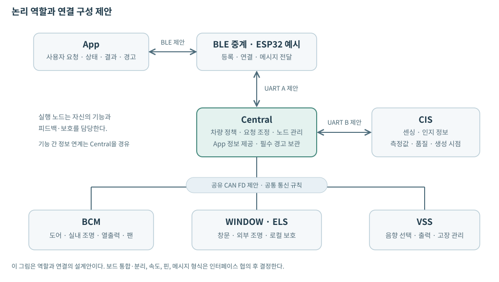

# 통합 차량 제어 시스템 네트워크 설계서

| 항목 | 내용 |
|---|---|
| 문서 상태 | 인터페이스 협의용 초안 |
| 기준 자료 | SR v0.46 / SysRS v0.46 — 2026-09-18 제공본 |
| 작성 기준 | 네트워크 설계 초안 v0.7에서 통신 구성과 정보 교환에 필요한 내용을 정리 |

## 1. 목적과 범위

본 문서는 저전압 차량 기능 시연 시스템의 노드 구성, 연결 방식, 교환 정보 및 공통 통신 규칙을 정의한다. 고정된 소수의 노드와 활성 화면의 App 한 대를 기본 구성으로 한다.

통신 경로와 메시지 구성은 협의 단계의 설계안이다. 실제 보드 배치, 통신 속도, 메시지 식별자와 필드 형식은 아직 확정되지 않았다. 기존 인터페이스 예시는 확정 규격으로 적용하지 않는다. 요구사항의 잠정값과 후보값은 해당 구분을 유지한다.

개별 기능의 제어 알고리즘, 센서·구동기 구현, 운영체제 구성 및 시험 코드는 본 문서의 범위에 포함하지 않는다. 기능별 동작 조건은 기준 SR·SysRS를 따른다.

## 2. 네트워크 구성

Central은 차량 기능 간 정보를 연계하고 App에 상태와 결과를 제공한다. 실행 노드는 Central의 목표를 수신하고 실행 결과와 관측 상태를 반환한다. 장치 자체의 보호 기능은 통신 응답을 기다리지 않고 해당 노드에서 수행한다.

### 2.1 연결 방식

| 구간 | 연결 제안 | 설계 목적 |
|---|---|---|
| Central ↔ BCM·WINDOW/ELS·VSS | 공유 CAN FD | 차량 내부의 제어 명령, 상태, 결과 및 경고 전달 |
| Central ↔ ESP32 | UART A | App 요청과 차량 정보 중계, 무선 연결 상태 전달 |
| Central ↔ CIS | UART B | 센서 관측과 품질 정보, 센싱 활성 조건 전달 |
| ESP32 ↔ App | BLE GATT | 등록된 단말의 무선 요청·응답 및 상태 전달 |

CAN FD는 여러 실행 노드를 하나의 버스로 연결하기 위한 제안이다. CIS와 ESP32는 별도 UART 경로로 연결하여 센싱과 무선 중계의 통신 경로를 분리한다. UART A·B는 경로를 구분하는 이름이며 실제 포트 번호는 미정이다.

WINDOW와 ELS의 동일 보드 배치를 제안하며, 실제 통합 여부는 보드 구성에 따라 결정한다. 공유 CAN 버스에서도 각 노드는 자신에게 허용된 정보만 사용한다. 통신 속도, 메시지 길이와 우선순위는 실제 교환 정보와 전달 기한을 기준으로 결정한다.

### 2.2 노드별 통신 역할

| 노드 | 통신 역할 |
|---|---|
| Central | 입력 정보 취합, 최종 제어 목표 전달, 요청·결과 연결, App 정보 제공 |
| BCM | 도어·공조·실내 조명 목표 수신, 적용 상태·관측값·결과·고장 제공 |
| WINDOW | 창문 목표·정지 명령 수신, 위치·이동·보호 상태와 결과 제공 |
| ELS | 외부 조명 목표 수신, 출력 적용·임시 점등 상태와 결과 제공 |
| CIS | 실내 환경·탑승자·후방 관측과 품질 제공, 센싱 활성 조건 수신 |
| VSS | 차량 이벤트·경고 수신, 음향 서비스 가용성과 고장 정보 제공 |
| ESP32 | 무선 등록·연결·App 활성·근접 정보 제공, App과 Central 사이의 메시지 중계 |
| App | 사용자 요청 전송, 상태·결과·경고 수신, 이력 조회 및 경고 읽음 전달 |

## 3. 노드 간 교환 정보

다음 표는 정보의 전달 관계를 정의한다. 각 행이 하나의 메시지나 패킷을 의미하지는 않는다. 실제 전송 단위는 인터페이스 협의에서 정한다.

| 송신 | 수신 | 주요 교환 정보 |
|---|---|---|
| App | Central, ESP32 경유 | 도어 잠금·해제, 공조·Fan 제어와 설정, 실내 조명 설정, 디지털 키 사용 설정, 조회·경고 읽음 |
| ESP32 | Central | 등록·현재 연결 상태, App 활성 여부, 근접 판단과 품질 |
| Central | BCM | 도어·Fan·냉각/가열·실내 조명 최종 목표, 해당 목표의 동작 유지 허용 |
| BCM | Central | 잠금·개폐 상태, Fan·열출력·실내 조명 적용 및 관측 상태, 결과, 구동 허용·고장 |
| Central | WINDOW | 목표 위치 이동, 대상 이동을 지정한 정지 명령, 해당 목표의 동작 유지 허용 |
| WINDOW | Central | 위치·이동·출력·보호 상태, 끼임 발생과 현장 확인, 결과·고장 |
| Central | ELS | 최종 ON/OFF 목표, 임시 점등 작업 정보, 해당 목표의 동작 유지 허용 |
| ELS | Central | 출력 적용·임시 작업 상태, 결과·구동 허용·고장 |
| CIS | Central | 실내 온도·습도·조도, 탑승자 존재·인원수, 후방 거리·측정 종류·활성 상태, 정보별 품질·관측 시점·가용성 |
| Central | CIS | 후방 센싱 활성 허용 |
| Central | VSS | 도어 목표 상태 확인·잠금 실패, 차량 사용 시작·종료 이벤트, 끼임·잔류 탑승자·후방 위험 경고 |
| VSS | Central | 서비스 가용성, 현재 고장 및 고장 이력 |
| Central | App, ESP32 경유 | 현재 설정·상태·가용성, 원 요청의 처리 결과, 경고·고장·이력 |

차량 사용·사용자 이탈·외부 조도, 자동 환기 사용 허용, 외부 조명 수동 요청·자동 사용 허용은 Central에 필요한 추가 입력이다. 실제 공급 노드와 전달 경로는 미정이다. Central 내부에서 생성되는 입력은 별도 네트워크 메시지로 만들 필요가 없다.

관측 정보에는 값·단위, 유효 여부, 원본 시점, 갱신 순서와 실제·모의 구분이 필요하다. 제공하지 않는 값은 정상값으로 채우지 않는다. 후방 영상 원본 대신 관측 결과를 전달하며, 후방 위험 판단은 Central이 수행한다. VSS에는 판단된 이벤트와 경고를 전달한다.

App의 창문·외부 조명 원격 제어와 범용 음향 재생 명령은 현재 교환 범위에 포함하지 않는다. 후진 연계는 선택 기능으로 두며 기본 구성에서는 사용하지 않는다.

## 4. 공통 통신 규칙

| 항목 | 설계 기준 |
|---|---|
| 수신 유효성 | 허용된 송신 노드·대상·연결, 메시지 형식과 내용의 유효성을 확인한다. 형식 오류나 미지원 요청으로 기존 정상 상태를 변경하지 않는다. |
| 요청과 결과 | 원 요청과 실행 결과를 연결한다. 전달 확인, 요청 수용, 실행 중, 목표 완료를 구분한다. Central은 실행 노드가 제공한 결과와 사유를 바탕으로 사용자 결과를 제공한다. |
| 중복 요청 | 같은 요청 식별자와 같은 내용은 다시 실행하지 않고 기존 상태·결과를 제공한다. 같은 식별자에 다른 내용이 오면 거부한다. 유효한 연결에서 기존 요청을 판별할 근거를 유지한다. |
| 정보의 시점·순서 | 중계 후에도 원본 시점과 품질을 유지한다. 이전 상태로 현재 상태를 덮어쓰지 않는다. 단순 재전달로 정보의 유효기간이나 요청 기한을 연장하지 않는다. |
| 목표 변경·정지 | 새 목표나 유효한 정지 명령으로 대체된 이전 명령은 지연 도착해도 실행하지 않는다. 정지 대상과 결과를 원 요청에 연결하며, 이미 완료된 요청의 결과는 이후 정지 때문에 변경하지 않는다. |
| 동작 유지 허용 | Central이 특정 목표의 실행을 계속 허용하는 정보다. 새 명령이나 실행 노드의 자체 구동 조건과 구분한다. 유효한 STOP·OFF는 유지 허용이 없다는 이유로 거부하지 않는다. |
| 연결·재시작 | 이전 연결 또는 재시작 전 메시지를 현재 메시지와 구분한다. 연결 복구 시 상태와 결과를 다시 확인하며, 중단된 명령을 자동으로 재실행하지 않는다. |
| 이벤트·경고 | 같은 발생을 반복 전달해도 새 발생으로 처리하지 않는다. 현재 경고, 발생 이력, 사용자 읽음을 구분한다. 경고 읽음이나 통신 단절을 위험 해제로 처리하지 않는다. |
| 결과·이력 조회 | 조회는 제어 요청과 구분한다. App에 최근 제어 요청 5건의 결과, 현재 경고·미확인 이력, VSS 가용성·현재 고장·고장 이력을 제공한다. 일부만 수신한 목록을 빈 목록이나 정상 상태로 표시하지 않는다. |

물리 동작의 완료 여부는 해당 기능이 확인한 결과를 사용한다. 도어 잠금과 개폐, 출력 지시 적용과 실제 동작 확인은 서로 구분한다. 응답이 없다는 이유만으로 성공·실패·정지를 추정하지 않는다. App은 결과 확인 불가 상태에서 제어 요청을 자동으로 다시 보내지 않는다.

정지·허용 철회·경고·요청 결과는 일반 주기 상태와 이력 조회보다 우선 전달한다. 구체적인 CAN 메시지 우선순위와 링크별 전송 순서는 메시지 할당 시 정한다.

## 5. 전달 주기와 시간 기준

아래 값은 SysRS §2.3, §2.5~2.6, §7.6.3의 **잠정 기준**이다. 통신 속도나 실측 성능의 확정값이 아니다. 원본 경과 시간은 관측·생성·평가 시점부터 실제 사용 시점까지의 전달·대기 시간과 시각 오차를 포함한다.

| 대상 | 주기 또는 기한 | 적용 기준 |
|---|---|---|
| 후방 관측, 후방 위험, 후방 활성 허용 | 200 ms 주기 / 원본 경과 시간 500 ms 미만 | CIS → Central, Central → VSS, Central → CIS |
| 차량 사용·이탈·탑승자·도어 관측, 지정된 창문 보호 상태와 경고 | 200 ms 주기 / 원본 경과 시간 1,000 ms 미만 | SysRS §2.5의 지정 정보에 적용 |
| 온도·습도·실내·외부 조도 | 500 ms 주기 / 원본 경과 시간 2,000 ms 미만 | Central이 사용하는 관측 정보 |
| App 일반 상태 | 500 ms 주기 / 마지막 새 갱신 수신 후 2초 미만 | 정보별 원본 기한도 함께 적용 |
| 목표별 동작 유지 허용 | 100 ms 재평가 / 마지막 유효 평가부터 300 ms에 상실 | 필요한 입력이 먼저 무효화되면 즉시 반영 |
| App의 새 제어·설정 요청 | 최초 송신부터 3초 미만에 수용 | 최초 응답 대기와 별도로 요청의 유효성 판정 |
| Central의 새 실행 명령 | 명령 생성부터 1초 미만 | 수용 직전과 최초 실행 직전에 확인 |
| App 최초 처리 응답 | 최초 송신부터 3초 | 전달 ACK는 처리 응답으로 인정하지 않음 |
| VSS 단발성 이벤트 | 발생부터 음향 시작까지 2초 미만 | 중계 시 원 발생 시점 유지 |

수용 후 최종 결과 대기는 SysRS §2.3.1을 따른다. 잠정값은 설정 2초, 도어 3초, Fan·공조 실행/정지 5초, BCM·ELS 조명 목표 적용 1초, WINDOW 이동 10초·STOP 1초다. 각 결과 확인 기능이 최초 수용·진행 응답을 확인한 때부터 측정하며, 중간 응답으로 연장하지 않는다. 기한까지 도착한 유효 결과를 먼저 반영하고, 결과가 없으면 확인 불가로 처리한다. 늦은 중간 응답만으로 대기를 다시 시작하지 않는다.

주기 정보는 송수신 준비를 마치고 합의한 주기 전송을 시작할 때부터 감시한다. 지정 경로의 첫 예정 수신 기한은 `P + 100 ms`, 이후 기한은 `P` 간격이며, CIS의 연속 누락 3회 기준은 후보값으로 유지한다. 이벤트·명령이 발생하지 않은 것은 통신 누락으로 보지 않는다. 통신 누락과 관측값의 만료·센서 오류는 구분한다.

표의 시간은 실제 구동·보호 시간과 구분한다. 경고·품질·결과 변화에 더 짧은 요구 기한이 있으면 해당 기준을 우선 적용한다. 메시지 크기와 발생 빈도가 확정되면 통신량과 전달 지연을 산정하여 연결 방식과 속도에 반영한다.

## 6. 통신 이상과 복구

| 상황 | 네트워크 처리 기준 |
|---|---|
| App·ESP32 연결 상실 | 새 원격 요청을 제한하고 연결 상실을 표시한다. 진행 요청의 결과를 임의 확정하지 않는다. 차량 기능은 각 기능의 유지 허용과 보호 조건을 따른다. |
| CIS 정보 누락·만료 | 해당 관측을 유효하지 않은 정보로 전달하고 관련 판단에 사용하지 않는다. 센서 오류 보고 수신과 통신 자체의 단절을 구분한다. |
| Central과 실행 노드 간 단절 | 관련 상태·결과의 유효성을 갱신하고, 활성 목표는 유지 허용 상실 규칙을 따른다. 실행 노드 자체의 보호는 계속 동작한다. |
| VSS 통신·서비스 이상 | 음향 서비스의 사용 가능 여부와 고장을 구분해 제공한다. 음향을 제공하지 못한다는 이유로 차량 경고를 해제하지 않는다. |
| 재연결·노드 재시작 | 현재 연결과 상태를 다시 확인하고 필요한 결과·이력을 조회한다. 이전 명령이나 오래된 상태를 자동으로 복원하지 않는다. |

통신 복구 자체는 동작 재개 조건이 아니다. 기능별 복구·새 명령 조건은 해당 기능 요구를 따른다.

## 7. 인터페이스 협의 사항

아래 항목은 현재 미정이다. 필요한 정보의 의미와 전달 기한을 먼저 확인한 뒤 실제 메시지 형식을 정한다.

| 협의 항목 | 결정할 내용 | 협의 대상 |
|---|---|---|
| 노드와 물리 연결 | 실제 보드 배치, CAN FD 지원, UART 포트·전압, 네트워크 배선·종단 구성 | 네트워크·하드웨어·각 노드 담당 |
| 신호 정의 | 입력 공급원, 송수신 대상, 단위·범위·지원 여부, 품질, 실제·모의 구분, 결과·고장 의미 | Central·각 기능 담당 |
| 메시지 규격 | 메시지 식별자, 필드·길이·바이트 순서, 프레임 경계·오류 검출, 분할 전송 필요 여부 | 네트워크·송수신 담당 |
| 전송 조건 | 링크 속도, 메시지별 주기·발생 조건·우선순위, 최대 전달 지연, 상태 묶음 여부 | 네트워크·송수신 담당 |
| 식별과 시간 표현 | 요청·이벤트 식별, 재시작·현재 연결 구분, 원본 시점·경과 시간·갱신 순서 전달 방식 | 네트워크·Central·각 노드 담당 |
| App 연결과 조회 | 등록·연결·활성·근접 정보의 제공 범위, 결과·경고·고장 목록의 전달 및 재연결 처리 | Central·ESP32·App·관련 기능 담당 |

협의 결과는 본문의 해당 경로와 교환 정보에 반영한다. 메시지 번호나 전송 형식이 미정인 항목에는 임의의 확정값을 부여하지 않는다.
