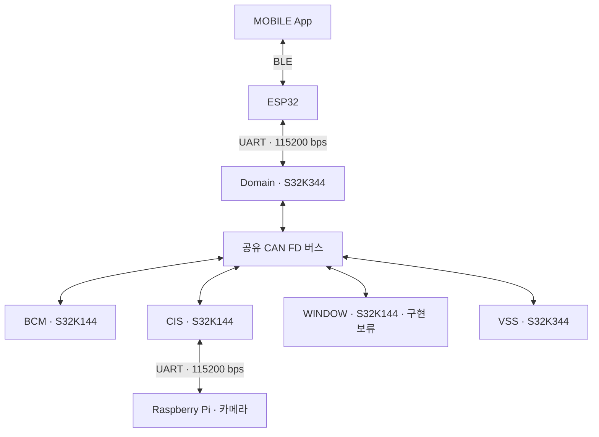

# 통합 차량 제어 시스템 네트워크 설계서

개정: v0.1 · 기준일: 2026-10-01 · 상태: 팀 검토용 공유 초안(확인 항목 있음) / 보드 시험 미수행

확정된 범위·연결은 §1~4를 따른다. CAN ID·UART Type·인코딩·주기·Timeout은 팀 검토로 조정할 수 있는 초안 제안이다. App–ESP32 BLE 구현 상세는 ESP32/MOBILE 담당 범위다. 먼저 전체 구조와 역할을 읽고, 담당 구간의 요약표를 확인한 뒤 필요한 상세 필드만 읽는다.

| 읽을 내용 | 위치 |
|---|---|
| 범위·기준·전체 구조·역할 | [§1](#scope) · [§2](#basis) · [§3](#network) · [§4](#roles) |
| 담당 통신 구간·메시지·상세 필드 | [CAN FD §5](#can) · [UART §6](#uart) · [BLE §7](#ble) |
| 주기·시간·결과·재시작·경고 | [§8](#behavior) · [중계/조회 §6.3](#relay) |
| 전송량 가정·결과·한계 | [§9](#load) |
| 팀 결정·연결 전 확인·보드 시험 | [§10](#checks) · [검토 요청서](검토_요청서.md) |

이번 개정의 실제 변경과 유지 판단은 [변경·반영 기록](네트워크_설계_변경반영기록.md)을 따른다. 팀 승인·실물 시험 결과는 아직 없다.

**[구현 보류 — 설계 유지] WINDOW는 전체 설계에 포함되며, 이번 구현·시연에서는 실제 WINDOW ECU 연결, 창문 구동·위치 확인·Anti-Pinch 감지와 해당 End-to-End 통합시험을 보류한다.** 메시지·ID·필드·연동 경로는 유지하고, 구현 재개 시 현재 설계에서 이어서 확인한다.

## 1. 목적과 설계 범위

각 노드가 어떤 정보를 어떤 형식으로 주고받는지 정의한다. 정상 동작 경로, 기본 통신 이상 대응, 통신량을 함께 정리하여 보드 연결과 팀 검토에 사용할 수 있는 초안을 만든다.

도어, 공조, 실내 조명, 디지털 키, 탑승자·환경·후방 거리 정보, 창문, VSS 음향을 포함한다. 외부 라이트는 사용자 결정으로 제외한다. MOBILE App의 창문 제어는 현재 범위 밖이다. 창문 명령은 Domain의 자동 기능·차량 정책 또는 시험 입력에서 생성할 수 있으나, 이 문서로 새 앱 기능을 추가하지 않는다.

**[구현 보류 — 설계 유지]** 위 범위 중 WINDOW 관련 창문·끼임 기능은 설계 범위에 남겨 두며 이번 구현·시연 대상에서는 보류한다. WINDOW 결과·사유의 App 표시 범위도 **[보류]**로 두고 구현 재개 시 확인한다(§10.2, Matrix §2.7).

원본 SR·SysRS·Master Matrix나 펌웨어 내부 구조는 개정하지 않는다. 전송에 필요한 필드·주기·식별·오류 처리까지 정의하며, 센서 알고리즘·RTOS·드라이버·보호 회로의 구현은 각 담당자가 정한다.

## 2. 기준 자료와 주요 전제

| 순서 | 자료 | 적용 범위 |
|---|---|---|
| 1 | 사용자 결정, 2026-09-30 | 외부 라이트 제외, 현재 보드 연결, UART 시작값·상향 허용 |
| 2 | Domain_Master_Interface_Matrix_v0.1(1).md, 2026-09-24 | 기능 의미, 정보 생성·판단·실행 주체, 인터페이스 식별자 |
| 3 | 이전 SR·SysRS·네트워크 자료 | 현재 기준과 일치하는 내용만 참고 |

2026-10-01의 후속 사용자 결정으로 WINDOW 구현·시연과 결과·사유의 App 표시 범위를 보류하고, UART/CAN 물리 설정은 구현 직전 확인으로 넘긴다. 기존 설계 계약은 유지한다.

이 문서의 **확정**은 사용자 결정 또는 최신 Matrix의 논리 의미를 뜻한다. **초안 제안**은 이번에 작성한 ID·형식·수치이며 팀 검토로 조정할 수 있다. **확인 필요**는 장치·담당자·실측 확인이 남은 항목이다. 보드 시험 완료를 뜻하는 표시는 없다.

UART 두 구간은 모두 **115200 bps**로 시작한다. 전송량과 응답 시간이 부족하면 필요한 구간만 상향한다. 8N1, 전이중, 흐름제어 미사용은 초안 제안이다. CAN FD 사용은 확정이며, 상세 속도와 ID는 §5에서 제안한다.

Matrix에 남아 있는 외부 라이트 삭제 대기 표기는 현재 사용자 결정으로 대체한다. 실내 조명과 실내 조도는 유지한다. 이전 자료의 속도·주기·노드 수·통신량은 현재 설계값으로 승계하지 않는다.

## 3. 전체 네트워크 구성

CAN FD 참여 노드 5개(Domain·BCM·CIS·WINDOW·VSS)는 **WINDOW 포함 전체 설계 기준**이다. Domain과 VSS는 별도 S32K344다. 그림의 버스 노드는 공유 관계를 나타내며 실제 스타 배선을 지정하지 않는다.

**[구현 보류 — 설계 유지]** 이번 구현·시연에서 WINDOW 물리 연결과 통합시험은 보류한다. 실제 연결 구성과 송신 목록이 아직 확정되지 않았으므로 이번 구현의 물리 노드 수를 여기서 확정하지 않는다.

| 구간 | 연결 | 현재 적용 기준 | 상태 |
|---|---|---|---|
| L-BLE | MOBILE App ↔ ESP32 | BLE | BLE 연결 유지, 상세 설계·검증은 ESP32/MOBILE 담당 |
| L-UART-M | ESP32 ↔ Domain | 115200 bps, 8N1, 전이중 | 속도 시작값 확정, 직렬 형식 제안 |
| L-CAN | Domain ↔ BCM·CIS·WINDOW·VSS | 공유 CAN FD | FD 확정, 상세는 초안 제안. WINDOW는 **[구현 보류 — 설계 유지]** |
| L-UART-C | Raspberry Pi ↔ CIS | 115200 bps, 8N1, 전이중 | 속도 시작값 확정, 직렬 형식 제안 |

카메라 정보는 **Pi → UART → CIS → CAN FD → Domain**으로 전달한다. 일반 센서는 CIS가 처리한다. 이 연결에는 Pi–Domain 직접 UART가 없다. Pi의 영상 원본은 UART로 보내지 않고 카메라 판정 결과와 품질·갱신 정보를 보낸다. 결과 전달안은 §6.2의 추가 네트워크 설계 제안이다.

## 4. 노드별 역할과 데이터 전달 경로

### 4.1 역할

| 노드 | 정보 생성·처리 | 전달·판단 책임 |
|---|---|---|
| MOBILE App | 사용자 요청, 앱 활성 정보 | 상태·결과·경고 표시, 경고 읽음 전달 |
| ESP32 | 등록·연결·Session, RSSI 근접 판정 | App–Domain 중계. 차량 실행 결과를 자체 생성하지 않음 |
| Domain | 요청 검증, 차량 정책·중재, ECU 명령, 경고·가용성 | 원 요청과 ECU 결과 연결, 각 경로로 표시·음향 정보 전달 |
| BCM | 도어·공조·실내 조명 실행, 상태·결과·고장 | 로컬 보호, 적용 결과 제공 |
| CIS | 일반 센서값, 품질, Pi 카메라 결과 취합 | 값별 원본 갱신·경과 시간·부분 고장 제공 |
| Raspberry Pi | 카메라 판정 결과, 비전 준비·고장 | CIS와 UART 통신 |
| WINDOW | 창문 실행, 로컬 스위치·끼임 보호 | 상태·결과·끼임 이벤트 제공. **[구현 보류 — 설계 유지]** |
| VSS | 전달받은 의미에 따른 음향, 자체 상태·고장 | 거리 원값으로 위험 수준을 다시 판단하지 않음 |

### 4.2 주요 전달 경로

| 기능 | 입력·실행 경로 | 결과·상태 경로 |
|---|---|---|
| 도어 | App → ESP32 → Domain → BCM | BCM → Domain → App. 정상 목표 확인 시 Domain → VSS |
| 공조 | App 설정 + CIS 관측값 → Domain → BCM | BCM 지시·측정·보호 상태 → Domain → App |
| 실내 조명 | App 설정 → Domain → BCM | 적용 상태·적용 결과 → Domain → App |
| 디지털 키 | App 설정·활성 + ESP32 근접 → Domain → BCM | BCM → Domain → DIGITAL_KEY_RESULT → App |
| 탑승자 | Pi → CIS → Domain | Domain → App 및 관련 차량 정책 |
| 환경·후방 거리 | CIS → Domain | 표시 → App, Domain 위험 판단 → VSS·App |
| 창문·끼임 | Domain → WINDOW, WINDOW 로컬 보호 | WINDOW → Domain → VSS·App. **[구현 보류 — 설계 유지]**: 실물·End-to-End 시험 보류 |
| VSS 고장 | VSS → Domain | 가용성·고장 표시 → App |

공조 목표 온도는 사용자 설정이며 BCM에 보낼 Fan·Thermal 지시와 구분한다. 실내 조명 적용 성공은 실제 점등 확인을 뜻하지 않는다. 현재 물리 점등 확인은 미지원이다.

차량 실행 Result는 ACCEPTED·IN_PROGRESS·DONE·REJECTED·CANCELLED·FAILED의 6종이다. 결과를 확인할 수 없으면 RESULT_CONFIRMATION을 UNCONFIRMED로 전달하고 App이 UNKNOWN으로 표시한다. 도어·연결·이동 상태의 UNKNOWN 코드는 그대로 유지한다.

WINDOW 위치는 **0%=완전 열림, 100%=완전 닫힘**이며 VENT 기본 목표는 **70% Closed**다. CIS 인원수는 **0~5명**이다. 후방 NO_OBJECT와 측정 불가, 경고 읽음과 위험 해제는 구분한다.

### 4.3 메시지 구성 원칙과 목록

함께 생성·사용되는 정보는 같은 메시지로 묶는다. 환경 3값은 함께 전송하되 품질·갱신 번호·경과 시간은 값마다 따로 둔다. 명령·결과·새 이벤트·현재 상태는 전송 목적이 달라 구분한다. Meta·집계 인터페이스도 아래 메시지의 필드나 전체 블록으로 반영한다.

아래 목록은 전달 경로·목적·원본 인터페이스 ID를 연결한다. CAN/UART의 숫자 ID·길이·배치는 §5~6을 따른다. App–ESP32 구간의 상세는 §7의 담당 경계를 따른다. 변경 전송의 의미는 §8.1에서 정의한다.

**[구현 보류 — 설계 유지]** WINDOW_COMMAND/STATE/EVENT/RESULT/FAULT와 M_WINDOW_STATE/M_WINDOW_FAULT, DOMAIN_PERMISSION의 WINDOW 허용, VSS의 끼임 경고 경로는 전체 설계 기준으로 유지한다. 아래 WINDOW 관련 행과 상태 집계의 WINDOW 부분은 이번 구현·시연 및 연동시험이 보류된 항목이다.

| 메시지 | 구간 | 송수신 | 목적 | 원본 ID | 전송 조건 |
| --- | --- | --- | --- | --- | --- |
| DOMAIN_PERMISSION | L-CAN | Domain → BCM/CIS/WINDOW/VSS | 전원 허용·창문 이동 허용 및 Domain 생존 확인 | D2C-001, D2C-002, D2W-007 D2W-008, D2W-009 | 50ms 주기·변경 시 |
| BCM_DOOR_COMMAND | L-CAN | Domain → BCM | 도어 목표 실행 | D2B-001, D2B-002, D2B-009 | 새 도어 명령 생성 시·§8.1의 제한된 반복 |
| BCM_CLIMATE_COMMAND | L-CAN | Domain → BCM | Domain이 결정한 공조 출력 | D2B-002, D2B-003, D2B-004 D2B-005, D2B-009 | 새 공조 명령 생성 시·§8.1의 제한된 반복 |
| BCM_LIGHT_COMMAND | L-CAN | Domain → BCM | 실내 조명 적용 | D2B-002, D2B-006, D2B-007 D2B-008, D2B-009 | 새 조명 명령 생성 시·§8.1의 제한된 반복 |
| WINDOW_COMMAND | L-CAN | Domain → WINDOW | 창문 동작; STOP도 같은 형식 | D2W-001, D2W-002, D2W-003 D2W-004, D2W-005, D2W-006 | 새 창문 명령 생성 시(STOP 포함)·§8.1의 제한된 반복 |
| BCM_DOOR_STATE | L-CAN | BCM → Domain | 도어 실제 상태 | B2D-002, B2D-003, B2D-004 B2D-015 | 100ms 주기·변경 시 |
| BCM_CLIMATE_STATE | L-CAN | BCM → Domain | 지시·측정·보호 상태 | B2D-005, B2D-006, B2D-007 B2D-008, B2D-009, B2D-015 | 200ms 주기·변경 시 |
| BCM_LIGHT_STATE | L-CAN | BCM → Domain | 실내 조명 적용 상태 | B2D-010, B2D-011, B2D-012 B2D-013, B2D-014, B2D-015 | 200ms 주기·변경 시 |
| BCM_RESULT | L-CAN | BCM → Domain | 명령 결과·도어 완료 이벤트 | B2D-016, B2D-017, B2D-018 B2D-019, B2D-020, B2D-021 B2D-022, D2B-002 | 새 결과 단계 시·§8.1의 제한된 반복 |
| BCM_EVENT | L-CAN | BCM → Domain | 보호·복구 이벤트 | B2D-023, B2D-024, B2D-025 | 새 보호·복구 이벤트 시·§8.1의 제한된 반복 |
| BCM_STATUS | L-CAN | BCM → Domain | ECU 가용성·현재 고장 | B2D-001, B2D-026, B2D-027 B2D-028, B2D-029, B2D-030 B2D-031, B2D-032, B2D-033 | 250ms 주기·변경 시 |
| CIS_ENVIRONMENT | L-CAN | CIS → Domain | 환경 3값; 측정 시점과 품질은 값마다 독립 | C2D-003, C2D-004, C2D-005 C2D-011, C2D-012, C2D-013 C2D-014 | 200ms 주기·변경 시 |
| CIS_OCCUPANT | L-CAN | CIS → Domain | 카메라 판정의 원본 갱신을 보존 | C2D-001, C2D-002, C2D-009 C2D-011, C2D-012, C2D-013 C2D-014 | 100ms 주기·변경 시 |
| CIS_REAR | L-CAN | CIS → Domain | 후방 관측값; 위험 판단은 Domain | C2D-006, C2D-007, C2D-011 C2D-012, C2D-013, C2D-014 | 50ms 주기·변경 시 |
| CIS_STATUS | L-CAN | CIS → Domain | 기능별 가용성·현재/최근 고장 | C2D-008, C2D-009, C2D-010 C2D-015, C2D-016, C2D-017 C2D-018, C2D-019, C2D-020 C2D-021, C2D-022, C2D-023 C2D-024, C2D-025, C2D-026 C2D-027 | 250ms 주기·변경 시 |
| WINDOW_STATE | L-CAN | WINDOW → Domain | 창문 상태·보호 상태 집계 | W2D-001, W2D-002, W2D-003 W2D-004, W2D-005, W2D-006 W2D-007, W2D-011 | 50ms 주기·변경 시 |
| WINDOW_EVENT | L-CAN | WINDOW → Domain | 새 끝단 전이·끼임 | W2D-008, W2D-009, W2D-010 | 새 끝단 전이·끼임 시·§8.1의 제한된 반복 |
| WINDOW_RESULT | L-CAN | WINDOW → Domain | 창문 명령 결과 | D2W-003, W2D-012, W2D-013 | 새 결과 단계 시·§8.1의 제한된 반복 |
| WINDOW_FAULT | L-CAN | WINDOW → Domain | 현재·복구 고장 | W2D-014 | 250ms 주기·변경 시 |
| VSS_EVENT | L-CAN | Domain → VSS | 일회성 음향 의미 이벤트 | D2V-001, D2V-002, D2V-003 D2V-004, D2V-005, D2V-010 | 새 음향 의미 이벤트 시·§8.1의 제한된 반복 |
| VSS_WARNING_STATE | L-CAN | Domain → VSS | 현재 경고; 원본 품질·갱신 정보는 경고별 독립 | D2V-006, D2V-007, D2V-008 D2V-009, D2V-010 | 50ms 주기·변경 시 |
| VSS_STATUS | L-CAN | VSS → Domain | 음향 가용성·현재/최근 고장 | V2D-001, V2D-002, V2D-003 V2D-004, V2D-005, V2D-006 V2D-007, V2D-008, V2D-009 V2D-010 | 250ms 주기·변경 시 |
| M_CONTEXT | L-UART-M | ESP32→Domain | 등록·연결·앱 활성·근접 문맥 | E2D-001, E2D-002, E2D-003 E2D-004, E2D-005, E2D-006 E2D-007, E2D-008 | 100ms 주기·변경 시 |
| M_REQUEST | L-UART-M | App→ESP32→Domain | 원 사용자 요청 | BLE-REF-001, BLE-REF-002, BLE-REF-003 E2D-003, E2D-004, E2D-009 E2D-010 | 새 사용자 입력 시; 같은 요청 재전달은 §6.3 |
| M_QUERY | L-UART-M | App→ESP32→Domain | 현재 상태·결과·경고 조회 | BLE-REF-004, E2D-003, E2D-004 E2D-011 | 현재 상태·결과·경고 조회 시 |
| M_WARNING_ACK | L-UART-M | App→ESP32→Domain | 경고 읽음; 위험 해제 아님 | BLE-REF-005, E2D-003, E2D-004 E2D-012 | 해당 경고 읽음 입력 시 |
| M_DOMAIN_ALIVE | L-UART-M | Domain→ESP32 | 차량 UART 경로 감시; BLE로 그대로 보내지 않음 | 추가 네트워크 제안 | 250ms 주기·변경 시 |
| M_RESULT | L-UART-M | Domain→ESP32→App | 원 요청 결과와 확인 상태 | BLE-REF-008, BLE-REF-009, BLE-REF-010 D2E-001, D2E-002, D2E-003 E2D-003, E2D-004 | 결과 단계·확인 상태 변경 시 또는 조회 응답 |
| M_WARNING | L-UART-M | Domain→ESP32→App | 현재 경고·품질·읽음 상태 | BLE-REF-012, D2E-005, E2D-003 E2D-004 | 7종 각 1000ms·의미/품질/READ 변경 시·조회 응답 |
| M_AVAILABILITY | L-UART-M | Domain→ESP32→App | 9개 기능 가용성; 변경 시 추가 전송 | BLE-REF-013, D2E-006, E2D-003 E2D-004 | 1000ms 주기·변경 시 |
| M_DIGITAL_STATUS | L-UART-M | Domain→ESP32→App | Domain이 반영한 설정과 현재 가용성 | BLE-REF-014, BLE-REF-015, D2E-007 D2E-008, E2D-003, E2D-004 | 1000ms 주기·변경 시 |
| M_DIGITAL_RESULT | L-UART-M | Domain→ESP32→App | 자동 Unlock 결과; App REQUEST_ID를 만들지 않음 | BLE-REF-016, D2E-009, E2D-003 E2D-004 | 자동 Unlock 결과 변경 시 또는 조회 응답 |
| M_USER_SETTINGS | L-UART-M | Domain→ESP32→App | 사용자 반영 설정; 실제 BCM 출력 상태와 구분 | BLE-REF-011, D2E-004, E2D-003 E2D-004 | 1000ms 주기·변경 시 |
| M_QUERY_END | L-UART-M | Domain→ESP32→App | 조회 끝 표시; 하향 문맥(20 B).QUERY_ID로 연결 | E2D-003, E2D-004 | 조회 응답 종료 시 |
| P_VISION_RESULT | L-UART-C | Pi→CIS | 추가 계약안; C2D-001/002와 품질·갱신 근거 | 추가 네트워크 제안 | 100ms 주기·변경 시 |
| P_VISION_STATUS | L-UART-C | Pi→CIS | 카메라 판정이 없어도 준비·고장 상태 제공 | 추가 네트워크 제안 | 1000ms 주기·변경 시 |
| P_PERMISSION | L-UART-C | CIS→Pi | 추가 계약안; Domain 전원 허용의 전달 | 추가 네트워크 제안 | 500ms 주기·변경 시 |
| M_ + ECU 상태명 | L-UART-M | Domain → ESP32 → App | 11개 ECU 상태 표시 블록 | D2E-004, BLE-REF-011 | 일반 표시 200ms, 가용성/고장 1000ms 및 변경 시 |

### 4.4 공통 정보 표현의 기본안

아래는 네트워크 상세의 초안 제안이다. 숫자 코드와 상세 범위는 §5.3을 따른다.

| 항목 | 생성·사용 규칙 |
|---|---|
| BOOT_ID | 노드가 기동마다 바꾸는 u32 번호. 이전 기동과 현재 정보를 구분한다 |
| TX_SEQUENCE | 메시지별 u32 전송 순서. 값이 같아도 전송마다 증가한다 |
| UPDATE_SEQUENCE | 실제 새 관측·평가·판정 때 증가한다. 같은 숫자값의 새 측정도 증가하고 단순 중계는 증가시키지 않는다 |
| SOURCE_AGE | 원본 생성 후 누적 ms. 서로 다른 노드 시계를 직접 비교하지 않는다 |
| REQUEST_ID | App의 사용자 입력 식별. DEVICE_CONTEXT_ID + SESSION_ID + REQUEST_ID로 동일 요청을 구분한다 |
| COMMAND_ID / REQUEST_SEQUENCE | Domain에서 생성한 ECU 명령 식별. App 요청 ID와 별도로 생성하고 결과 표에 연결한다 |
| OCCURRENCE_ID | 새 이벤트·경고 발생 식별. 송신 BOOT_ID와 함께 구분한다 |
| Quality | 상태값의 UNKNOWN, VALUE_QUALITY, CIS의 VALIDITY/QUALITY_REASON을 구분한다 |

시간 동기화 메시지는 추가하지 않는다. 원본 경과 시간에 중계 대기와 해당 구간의 전달 시간 여유값을 더한다. 반복 전송을 새 관측으로 취급하지 않는다. 경과 시간과 수신 중단은 §8에서 별도로 관리한다.

## 5. CAN FD 설계

### 5.1 버스 구성과 설정

아래 상세 설정은 현재 메시지 구성과 짧은 실습 배선을 전제로 한 **초안 제안**이다.

| 항목 | 제안 | 적용 이유·확인 |
|---|---|---|
| 프레임 | ISO CAN FD, FDF=1, BRS=1, RTR 사용 안 함 | 데이터 구간 속도를 분리한다. 모든 참여 노드 설정 일치 필요 |
| ID | 표준 11bit, 메시지별 고정 ID | 22종 메시지를 단순하게 구분한다 |
| nominal 속도 | 500 kbps | 실습 배선에서 시작하기 쉬운 제안; 실물 지원 미확인 |
| data 속도 | 2 Mbps | §9의 낮은 계산 부하를 충족하는 시작안. 5 Mbps를 필수로 정할 근거는 없음 |
| byte order | 모든 다중 바이트 정수 little-endian | UART와 동일하게 적용 |
| 추가 CRC·ACK | 응용 CRC와 공통 ACK는 추가하지 않음 | CAN FD 자체 오류 검출을 사용하고 실제 수행은 Result·State로 확인 |
| 생존 확인 | 별도 Heartbeat 프레임 없음 | DOMAIN_PERMISSION과 노드별 주기 상태를 감시 |

**구현 직전 확인 — 현재 보류(O-003).** 아래 트랜시버·종단·배선·핀·전원·clock/bit timing 확인은 후속 실물 연결 단계에서 수행한다. CAN FD 500 kbps/2 Mbps·BRS·11-bit ID 시작안은 유지하며, 현재 검토요청서에서는 물리 설정 회신을 요구하지 않는다.

실제 버스는 CANH/CANL을 공유하는 선형 배선을 기본안으로 한다. 버스 양 끝에 각각 120Ω 종단을 두고 중간 노드의 중복 종단은 해제한다. 전원을 끈 상태의 양 선 간 약 60Ω은 종단 확인 참고값이다. 보드별 트랜시버 종류·FD 지원·종단 스위치·공통 기준 전위·핀·전원·배선 길이는 연결 전에 확인한다. 실습 배선은 짧게 유지하고 긴 가지 배선을 피한다. 핀 번호는 확인 전 지정하지 않는다.

모든 보드의 CAN clock·sample point·bit timing·트랜시버 지원이 맞아야 한다. 보드·배선 문제로 2 Mbps가 불안정하면 nominal 500 kbps는 유지하고 data 1 Mbps 후보를 같은 메시지 목록으로 재계산·시험한다. 속도는 양 끝이 아니라 **공유 버스 전체 노드**를 함께 변경한다. CAN FD를 Classic CAN으로 임의 변경하지 않는다.

CAN ACK 수신은 어느 노드가 프레임을 받은 근거일 뿐이다. 실행 ECU가 명령을 수용·완료한 확인은 BCM_RESULT/WINDOW_RESULT 및 해당 실제 상태를 사용한다.

### 5.2 메시지 목록과 CAN ID

우선순위는 낮은 숫자 ID가 먼저 중재되는 관계를 사용한다. 생존·창문·후방·현재 경고를 먼저 배정하고 일반 표시 상태를 뒤에 둔다. 한 ID의 송신 노드는 한 개다. 일반 수신 노드는 표의 지정 노드이며 실제 수신 필터는 담당자가 맞춘다.

**[구현 보류 — 설계 유지]** 아래 CAN ID 목록은 WINDOW 포함 전체 설계 기준이다. WINDOW 5종과 다른 메시지의 WINDOW 관련 필드는 기존 ID·길이·DLC·전송 조건을 보존하며, 실제 송수신과 통합시험은 구현 재개 시 확인한다.

사용 B는 의미 있는 payload 길이, 전송 B는 CAN FD에서 실제 보내는 길이다. 차이는 0으로 채운다. 길이 코드 DLC 9~15는 각각 12/16/20/24/32/48/64 B에 대응한다(공식 근거 T-01/T-02).

| 메시지 | CAN ID | 송신 | 사용 수신 | 사용 B | 전송 B / DLC | 전송 조건 | 수신 중단 |
| --- | --- | --- | --- | --- | --- | --- | --- |
| DOMAIN_PERMISSION | 0x080 | Domain | BCM/CIS/WINDOW/VSS | 19 | 20 / 11 | 50ms·변경 | 150ms |
| WINDOW_COMMAND | 0x090 | Domain | WINDOW | 24 | 24 / 12 | 새 창문 명령 생성 시(STOP 포함)·§8.1의 제한된 반복 | 이벤트 무발생은 고장 아님 |
| WINDOW_EVENT | 0x091 | WINDOW | Domain | 26 | 32 / 13 | 새 끝단 전이·끼임 시·§8.1의 제한된 반복 | 이벤트 무발생은 고장 아님 |
| WINDOW_RESULT | 0x092 | WINDOW | Domain | 20 | 20 / 11 | 새 결과 단계 시·§8.1의 제한된 반복 | 이벤트 무발생은 고장 아님 |
| CIS_REAR | 0x0A0 | CIS | Domain | 19 | 20 / 11 | 50ms·변경 | 150ms |
| WINDOW_STATE | 0x0B0 | WINDOW | Domain | 22 | 24 / 12 | 50ms·변경 | 150ms |
| VSS_WARNING_STATE | 0x0C0 | Domain | VSS | 51 | 64 / 15 | 50ms·변경 | 150ms |
| BCM_DOOR_COMMAND | 0x100 | Domain | BCM | 22 | 24 / 12 | 새 도어 명령 생성 시·§8.1의 제한된 반복 | 이벤트 무발생은 고장 아님 |
| BCM_CLIMATE_COMMAND | 0x110 | Domain | BCM | 23 | 24 / 12 | 새 공조 명령 생성 시·§8.1의 제한된 반복 | 이벤트 무발생은 고장 아님 |
| BCM_LIGHT_COMMAND | 0x120 | Domain | BCM | 25 | 32 / 13 | 새 조명 명령 생성 시·§8.1의 제한된 반복 | 이벤트 무발생은 고장 아님 |
| BCM_RESULT | 0x140 | BCM | Domain | 29 | 32 / 13 | 새 결과 단계 시·§8.1의 제한된 반복 | 이벤트 무발생은 고장 아님 |
| BCM_EVENT | 0x141 | BCM | Domain | 25 | 32 / 13 | 새 보호·복구 이벤트 시·§8.1의 제한된 반복 | 이벤트 무발생은 고장 아님 |
| VSS_EVENT | 0x160 | Domain | VSS | 23 | 24 / 12 | 새 음향 의미 이벤트 시·§8.1의 제한된 반복 | 이벤트 무발생은 고장 아님 |
| BCM_DOOR_STATE | 0x200 | BCM | Domain | 20 | 20 / 11 | 100ms·변경 | 300ms |
| BCM_CLIMATE_STATE | 0x210 | BCM | Domain | 24 | 24 / 12 | 200ms·변경 | 600ms |
| BCM_LIGHT_STATE | 0x220 | BCM | Domain | 25 | 32 / 13 | 200ms·변경 | 600ms |
| BCM_STATUS | 0x230 | BCM | Domain | 22 | 24 / 12 | 250ms·변경 | 750ms |
| CIS_ENVIRONMENT | 0x300 | CIS | Domain | 40 | 48 / 14 | 200ms·변경 | 600ms |
| CIS_OCCUPANT | 0x310 | CIS | Domain | 25 | 32 / 13 | 100ms·변경 | 300ms |
| CIS_STATUS | 0x320 | CIS | Domain | 34 | 48 / 14 | 250ms·변경 | 750ms |
| WINDOW_FAULT | 0x330 | WINDOW | Domain | 22 | 24 / 12 | 250ms·변경 | 750ms |
| VSS_STATUS | 0x340 | VSS | Domain | 28 | 32 / 13 | 250ms·변경 | 750ms |

### 5.3 공통 필드·자료형·코드

이 절과 이후 필드 표의 숫자 표현은 **초안 제안**이다. byte 위치는 payload의 0부터 세며 C 구조체의 자동 정렬을 적용하지 않는다. u8/u16/u32/u64는 각각 1/2/4/8 B 부호 없는 정수, i16은 2 B 2의 보수 부호 있는 정수다. RGB는 연속 3 B이며 R·G·B 순이다. 별도 표기가 없으면 배율 1, offset 0이다.

**CAN 공통 헤더(8 B)** — 모든 메시지의 B0~7.

| byte | 필드 | 자료형 | 규칙 |
|---|---|---|---|
| 0~3 | BOOT_ID | u32 | 송신 노드 기동 번호. 0 예약 |
| 4~7 | TX_SEQUENCE | u32 | 메시지별 전송 순서. 최초 1; 전송마다 증가 |

**명령 공통부(20 B)** — BCM_*_COMMAND·WINDOW_COMMAND에 적용한다.

| byte | 필드 | 자료형 | 규칙 |
|---|---|---|---|
| 0~7 | 공통 헤더(8 B) | 8 B | Domain의 기동·전송 번호 |
| 8~11 | TARGET_BOOT_ID | u32 | 마지막 상태에서 확인한 대상 ECU 기동 번호 |
| 12~15 | COMMAND_ID | u32 | Domain 명령 ID. WINDOW에서는 REQUEST_SEQUENCE 의미 |
| 16~17 | COMMAND_AGE | u16 | Domain 명령 생성부터 송신까지의 누적 ms |
| 18~19 | ACCEPT_LIMIT | u16 | 새 명령 수용 한도. 초안 200ms |

BOOT_ID는 펌웨어 또는 Pi 통신 프로세스의 기동을 구분하는 번호다. 제어 문맥에 과거 번호가 재사용되지 않아야 한다. 저장 카운터는 생성 방법의 후보이며, 각 노드의 생성 방법·저장 지원·번호 재사용 방지는 O-006에서 확인한다. 현재 기동 번호가 확인되지 않은 ECU에는 제어 명령을 보내지 않는다. 수신 ECU는 TARGET_BOOT_ID가 자기 현재 번호와 다르면 수용하지 않는다. Domain 기동 번호는 DOMAIN_PERMISSION의 유효 수신으로 확인하고, 이전 기동 명령은 수용하지 않는다. 단순히 새 번호가 들어온 명령만으로 제어 문맥을 교체하지 않는다.

u32 순서는 같은 BOOT_ID 안에서 `(new-old) mod 2^32`가 1~0x7FFFFFFF이면 새 값으로 판단한다. 0이면 중복이다. 0x80000000 이상은 과거/판단 불가로 처리한다. TX_SEQUENCE의 증가만으로 관측값이 새로 생겼다고 판단하지 않는다.

경과 시간은 u16 ms로 보내고 65535에서 포화한다. NO_DATA인 경우에도 65535를 사용하며 Quality로 구분한다. 오래된 기록의 포화 시간을 0으로 되돌리지 않는다. 최근 Fault 이력은 과거 기록이라는 이유로 삭제하지 않는다. 현재 제어에 사용할 관측값만 §8의 사용 한도를 적용한다.

| 구분 | raw 값 | 사용 규칙 |
| --- | --- | --- |
| VALUE_QUALITY | 0=OK 1=STALE 2=INVALID 3=NO_DATA | BCM·WINDOW·Domain 공통 품질. 상태 UNKNOWN과 별개 |
| CIS VALIDITY | 0=INVALID 1=VALID | 관측값 사용 여부 |
| 품질 사유 | 0=NONE 1=NOT_READY 2=OUT_OF_RANGE 3=SENSOR_FAULT 4=VISION_FAULT 5=STALE 6=NO_DATA 7=COMMUNICATION_FAULT 8=RECOVERING 9=DATA_INVALID | CIS/근접/경고의 사유 코드. 정상 값이면 NONE |
| 차량 Result | 0=ACCEPTED 1=IN_PROGRESS 2=DONE 3=REJECTED 4=CANCELLED 5=FAILED | UNKNOWN은 추가하지 않음. 255는 미확인 응답의 값 없음 표시이고 차량 Result가 아님 |
| RESULT_CONFIRMATION | 0=UNCONFIRMED 1=CONFIRMED | 미확인을 실행 실패로 바꾸지 않음 |
| FUNCTION_AVAILABILITY | 0=AVAILABLE 1=LIMITED 2=UNAVAILABLE | VSS는 같은 raw를 FULL/DEGRADED/UNAVAILABLE 의미로 읽음 |
| FAN | 0=OFF 1=LOW 2=MEDIUM 3=HIGH 255=UNKNOWN | 측정/상태만 UNKNOWN 허용. 지시에는 금지 |
| THERMAL_DIRECTION | 0=IDLE 1=COOL 2=HEAT | 기능 방향 |
| LIGHT_TYPE | 0=NORMAL 1=GOODBYE 2=WARNING 3=FAULT | 실내 조명 알림 의미 |
| ORIGIN | 0=NONE 1=MOBILE_MANUAL 2=PROXIMITY_AUTO 3=LOCAL 4=TEST 5=VEHICLE_POLICY | 자동 Unlock은 2. 로컬 이벤트는 원 MOBILE 요청 없이 존재 가능 |
| SOURCE_CONTEXT | 0=없음 1=Domain 정책 2=자동 기능 3=로컬 문맥 4=시험 | WINDOW의 상위 요청 문맥. MOBILE 창문 명령은 없음 |
| 경고 Type | 1=후방 2=잔류 탑승자 3=끼임 4=BCM 고장 5=CIS 고장 6=WINDOW 고장 7=VSS 고장 | Severity 0=INFO 1=CAUTION 2=EMERGENCY. 세부 기능 판단 임계는 별도 |
| 기능 ID | 1=DOOR 2=CLIMATE 3=INTERIOR_LIGHT 4=DIGITAL_KEY 5=OCCUPANT 6=ENVIRONMENT 7=REAR_WARNING 8=WINDOW 9=VSS | M_AVAILABILITY의 9개 순서. WINDOW 앱 제어 추가를 뜻하지 않음 |
| 수치 무효값 | u8 비율/인원=255  i16 온도=-32768  u16 습도/거리=65535  u32 조도=0xFFFFFFFF | RGB 각 바이트는 0~255 전부 사용하므로 무효 여부는 Quality로 표시 |
| 예약 값 | 표에 없는 enum·필수 필드의 예약값은 수용하지 않음 | 진단 표시 가능; 명령 실행 금지. 0 패딩은 제어값으로 읽지 않음 |

공통 RESULT_REASON/Availability Reason은 u16이며 다음 번호를 사용한다. 사용하지 않는 사유를 모든 ECU가 새로 발생시켜야 한다는 뜻은 아니다.

| 코드 | 사유 |
| --- | --- |
| 0 | NONE |
| 1 | NOT_REGISTERED |
| 2 | LINK_LOST |
| 3 | SESSION_INVALID |
| 4 | DOOR_OPEN |
| 5 | STATE_UNTRUSTED |
| 6 | CMD_INVALID |
| 7 | NO_FEEDBACK |
| 8 | DRIVE_LIMIT_EXCEEDED |
| 9 | ALREADY_AT_TARGET |
| 10 | LOCAL_OVERRIDE |
| 11 | STOP_REQUESTED |
| 12 | SUPERSEDED |
| 13 | ANTIPINCH |
| 14 | FAULT |
| 15 | STALE |
| 16 | NO_DATA |
| 17 | NOT_READY |
| 18 | OUT_OF_RANGE |
| 19 | SOURCE_FAILURE |
| 20 | UNKNOWN_REQUEST |
| 21 | EXPIRED |
| 22 | ID_CONFLICT |
| 23 | POWER_NOT_ALLOWED |
| 24 | OVERHEAT |
| 25 | FAN_MISMATCH |

**고장 코드와 영향 범위**

BCM/CIS/VSS의 현재 여러 고장은 FAULT_MASK 비트로 함께 전달한다. ACTIVE_FAULT는 그중 주요 한 건이다. 코드 0은 없음, 비트 번호+1은 아래 고장이다. LAST_FAULT는 현재 고장과 별개로 가장 최근 주요 고장 코드·발생 번호를 남긴다. 보관 범위는 초안으로 이번 기동의 RAM 기록이며 영구 저장을 요구하지 않는다.

| 노드 | bit → 고장 코드 | 적용 |
| --- | --- | --- |
| BCM | bit0 → `DOOR_SENSOR_FAULT` bit1 → `FAN_SENSOR_FAULT` bit2 → `TEMPERATURE_SENSOR_FAULT` bit3 → `OVERHEAT_FAULT` bit4 → `FAN_FAULT` bit5 → `LOCK_ACTUATOR_FAULT` bit6 → `LIGHT_APPLY_FAULT` bit7 → `COMM_TIMEOUT_FAULT` | LSB가 bit0. 나머지 bit는 0 |
| CIS | bit0 → `INITIALIZATION_FAILURE` bit1 → `VISION_FAULT` bit2 → `TEMPERATURE_SENSOR_FAULT` bit3 → `HUMIDITY_SENSOR_FAULT` bit4 → `ILLUMINANCE_SENSOR_FAULT` bit5 → `PROXIMITY_SENSOR_FAULT` bit6 → `COMMUNICATION_FAULT` bit7 → `DATA_INVALID` bit8 → `OUT_OF_RANGE` | LSB가 bit0. 나머지 bit는 0 |
| VSS | bit0 → `SOUND_ASSET_UNAVAILABLE` bit1 → `PLAYBACK_START_FAILURE` bit2 → `AUDIO_OUTPUT_FAILURE` bit3 → `PLAYBACK_STATE_FAILURE` bit4 → `INITIALIZATION_FAILURE` | LSB가 bit0. 나머지 bit는 0 |

WINDOW_FAULT의 Category는 0=없음,1=SENSOR,2=FUNCTION,3=COMM이다. Code는 0=없음,1=위치 확인,2=구동,3=끝단 확인,4=보호 동작,5=Domain 수신 중단,6=초기화,255=기타를 초안 제안으로 둔다. 실제 ECU 회신의 고장 이름·발생 조건과 맞추는 확인은 O-008에 남기며, WINDOW는 구현 재개 시 확인한다. 이 코드표가 새로운 센서·보호 기능을 요구하지 않는다.

BCM의 Fan 지시–측정 불일치 2s는 최신 기능 기준을 유지한다. 과열 80°C/복구 60°C, CIS 거리 10~100cm, 끼임 보호 최대 500~1000ms는 원문의 실기 후보이며 네트워크 Timeout으로 사용하지 않는다. 온도·습도·조도·거리 표의 표현 범위는 전송 가능한 수치 범위로, 센서의 검증된 정확도·동작 범위를 뜻하지 않는다.

### 5.4 메시지별 필드 배치

각 표에서 공통 헤더(8 B) 또는 명령 공통부(20 B) 뒤의 필드를 보인다. 앞부분은 §5.3을 그대로 적용한다. 명령의 수용은 CAN 오류 검출뿐 아니라 대상 기동·명령 식별·허용·경과 시간 확인을 모두 거친다.

**DOMAIN_PERMISSION — 0x080, Domain → BCM/CIS/WINDOW/VSS**

공통 헤더(8 B). 사용 19 B / 전송 20 B / DLC 11.

**[구현 보류 — 설계 유지]** WINDOW 관련 허용 필드는 전체 설계 계약에 남겨 둔다. 이 필드의 보존이 이번 WINDOW 실물 연결·이동 실행을 요구하는 뜻은 아니다.

| byte | 필드 | 자료형 | 값·단위·규칙 | 원본 ID |
| --- | --- | --- | --- | --- |
| 8 | VEHICLE_POWER_PERMISSION | u8 | 0=불허 1=허용 255=확인 불가 | D2C-001 |
| 9 | POWER_PERMISSION_QUALITY | u8 | VALUE_QUALITY | D2C-002 |
| 10 | POWER_OPERATION_STATE | u8 | 0=이동 불가 1=이동 가능 255=확인 불가 | D2W-007 |
| 11 | OPERATION_ALLOWED | u8 | 0=불허 1=허용 | D2W-008 |
| 12 | OPERATION_QUALITY | u8 | VALUE_QUALITY | 공통·추가 상세 |
| 13~16 | UPDATE_SEQUENCE | u32 | 허용 상태의 새 평가 번호 | 공통·추가 상세 |
| 17~18 | SOURCE_AGE | u16 | 허용 상태 평가 후 경과 시간, ms | 공통·추가 상세 |
| 19~19 | PADDING | bytes | 0; 수신은 의미로 사용하지 않음 | 없음 |

**BCM_DOOR_COMMAND — 0x100, Domain → BCM**

명령 공통부(20 B). 사용 22 B / 전송 24 B / DLC 12.

| byte | 필드 | 자료형 | 값·단위·규칙 | 원본 ID |
| --- | --- | --- | --- | --- |
| 20 | DOOR_LOCK_TARGET | u8 | 0=LOCK 1=UNLOCK | D2B-001 |
| 21 | ORIGIN | u8 | 요청 출처 코드 | 공통·추가 상세 |
| 22~23 | PADDING | bytes | 0; 수신은 의미로 사용하지 않음 | 없음 |

**BCM_CLIMATE_COMMAND — 0x110, Domain → BCM**

명령 공통부(20 B). 사용 23 B / 전송 24 B / DLC 12.

| byte | 필드 | 자료형 | 값·단위·규칙 | 원본 ID |
| --- | --- | --- | --- | --- |
| 20 | FAN_TARGET_LEVEL | u8 | FAN 코드; UNKNOWN 금지 | D2B-003 |
| 21 | THERMAL_DIRECTION | u8 | 0=IDLE 1=COOL 2=HEAT | D2B-004 |
| 22 | THERMAL_TARGET_LEVEL | u8 | 0~100%, 1%/raw | D2B-005 |
| 23~23 | PADDING | bytes | 0; 수신은 의미로 사용하지 않음 | 없음 |

**BCM_LIGHT_COMMAND — 0x120, Domain → BCM**

명령 공통부(20 B). 사용 25 B / 전송 32 B / DLC 13.

| byte | 필드 | 자료형 | 값·단위·규칙 | 원본 ID |
| --- | --- | --- | --- | --- |
| 20 | INTERIOR_LIGHT_TYPE | u8 | LIGHT_TYPE 코드 | D2B-006 |
| 21 | INTERIOR_LIGHT_LEVEL | u8 | 0~100%, 1%/raw | D2B-007 |
| 22~24 | INTERIOR_LIGHT_COLOR | rgb | R/G/B 각각 0~255 | D2B-008 |
| 25~31 | PADDING | bytes | 0; 수신은 의미로 사용하지 않음 | 없음 |

**[구현 보류 — 설계 유지]** 아래 WINDOW_COMMAND 계약은 전체 설계 기준이다. 명령·ID·필드는 유지하며 창문 구동·위치 확인과 연동시험은 구현 재개 시 확인한다.

**WINDOW_COMMAND — 0x090, Domain → WINDOW**

명령 공통부(20 B). 사용 24 B / 전송 24 B / DLC 12.

| byte | 필드 | 자료형 | 값·단위·규칙 | 원본 ID |
| --- | --- | --- | --- | --- |
| 20 | WINDOW_COMMAND | u8 | 1=OPEN 2=CLOSE 3=STOP 4=VENT 5=MOVE_TO_POSITION | D2W-001 |
| 21 | TARGET_CHANNEL | u8 | 0=현재 단일 채널 | D2W-002 |
| 22 | TARGET_POSITION | u8 | 0~100% 닫힘 비율; VENT=70 | D2W-006 |
| 23 | SOURCE_CONTEXT | u8 | 상위 요청 출처 코드 | D2W-005 |

**BCM_DOOR_STATE — 0x200, BCM → Domain**

공통 헤더(8 B). 사용 20 B / 전송 20 B / DLC 11.

| byte | 필드 | 자료형 | 값·단위·규칙 | 원본 ID |
| --- | --- | --- | --- | --- |
| 8 | DOOR_LOCK_STATE | u8 | 0=LOCKED 1=UNLOCKED 255=UNKNOWN | B2D-002 |
| 9 | DOOR_OPEN_STATE | u8 | 0=CLOSED 1=OPEN 255=UNKNOWN | B2D-003 |
| 10 | DOOR_COMPOSITE_STATE | u8 | 0=NORMAL 1=INCONSISTENT 2=UNTRUSTED | B2D-004 |
| 11 | LOCK_QUALITY | u8 | VALUE_QUALITY | B2D-015 |
| 12 | OPEN_QUALITY | u8 | VALUE_QUALITY | B2D-015 |
| 13 | COMPOSITE_QUALITY | u8 | VALUE_QUALITY | B2D-015 |
| 14~17 | UPDATE_SEQUENCE | u32 | 이번 도어 상태 평가 번호 | 공통·추가 상세 |
| 18~19 | SOURCE_AGE | u16 | 평가 후 경과 시간, ms | 공통·추가 상세 |

**BCM_CLIMATE_STATE — 0x210, BCM → Domain**

공통 헤더(8 B). 사용 24 B / 전송 24 B / DLC 12.

| byte | 필드 | 자료형 | 값·단위·규칙 | 원본 ID |
| --- | --- | --- | --- | --- |
| 8 | FAN_COMMAND_LEVEL | u8 | 0=OFF 1=LOW 2=MEDIUM 3=HIGH | B2D-005 |
| 9 | FAN_MEASURED_LEVEL | u8 | FAN 코드 및 255=UNKNOWN | B2D-006 |
| 10 | THERMAL_DIRECTION_STATE | u8 | 0=IDLE 1=COOL 2=HEAT | B2D-007 |
| 11 | THERMAL_OUTPUT_LEVEL | u8 | 0~100%, 1%/raw | B2D-008 |
| 12 | HEAT_REMOVAL_STATE | u8 | 0=정상 1=과열 차단 255=측정 불가 | B2D-009 |
| 13 | FAN_COMMAND_QUALITY | u8 | VALUE_QUALITY | B2D-015 |
| 14 | FAN_MEASURED_QUALITY | u8 | VALUE_QUALITY | B2D-015 |
| 15 | THERMAL_DIRECTION_QUALITY | u8 | VALUE_QUALITY | B2D-015 |
| 16 | THERMAL_OUTPUT_QUALITY | u8 | VALUE_QUALITY | B2D-015 |
| 17 | HEAT_REMOVAL_QUALITY | u8 | VALUE_QUALITY | B2D-015 |
| 18~21 | UPDATE_SEQUENCE | u32 | 이번 공조 상태 평가 번호 | 공통·추가 상세 |
| 22~23 | SOURCE_AGE | u16 | 평가 후 경과 시간, ms | 공통·추가 상세 |

**BCM_LIGHT_STATE — 0x220, BCM → Domain**

공통 헤더(8 B). 사용 25 B / 전송 32 B / DLC 13.

| byte | 필드 | 자료형 | 값·단위·규칙 | 원본 ID |
| --- | --- | --- | --- | --- |
| 8 | INTERIOR_LIGHT_TYPE_STATE | u8 | LIGHT_TYPE 코드 | B2D-010 |
| 9 | INTERIOR_LIGHT_LEVEL_STATE | u8 | 0~100% | B2D-011 |
| 10~12 | INTERIOR_LIGHT_COLOR_STATE | rgb | R/G/B 각각 0~255 | B2D-012 |
| 13 | INTERIOR_LIGHT_APPLY_RESULT | u8 | 0=적용됨 1=실패 255=UNKNOWN | B2D-013 |
| 14 | LIGHT_PHYSICAL_FEEDBACK_CAPABILITY | u8 | 0=미지원 1=지원; 현재 0 | B2D-014 |
| 15 | LIGHT_TYPE_QUALITY | u8 | VALUE_QUALITY | B2D-015 |
| 16 | LIGHT_LEVEL_QUALITY | u8 | VALUE_QUALITY | B2D-015 |
| 17 | LIGHT_COLOR_QUALITY | u8 | VALUE_QUALITY | B2D-015 |
| 18 | LIGHT_APPLY_QUALITY | u8 | VALUE_QUALITY | B2D-015 |
| 19~22 | UPDATE_SEQUENCE | u32 | 이번 조명 적용 상태 평가 번호 | 공통·추가 상세 |
| 23~24 | SOURCE_AGE | u16 | 평가 후 경과 시간, ms | 공통·추가 상세 |
| 25~31 | PADDING | bytes | 0; 수신은 의미로 사용하지 않음 | 없음 |

**BCM_RESULT — 0x140, BCM → Domain**

공통 헤더(8 B). 사용 29 B / 전송 32 B / DLC 13.

| byte | 필드 | 자료형 | 값·단위·규칙 | 원본 ID |
| --- | --- | --- | --- | --- |
| 8~11 | COMMAND_DOMAIN_BOOT | u32 | 원 명령을 생성한 Domain 기동 번호 | 공통·추가 상세 |
| 12~15 | COMMAND_ID | u32 | 처리한 Domain 명령 ID | D2B-002 |
| 16 | COMMAND_KIND | u8 | 1=도어 2=공조 3=조명 | 공통·추가 상세 |
| 17 | RESULT | u8 | 공통 차량 Result 코드 | B2D-016 |
| 18~19 | RESULT_REASON | u16 | 공통 사유 코드 | B2D-017 |
| 20 | DOOR_EVENT | u8 | 0=없음 1=LOCK_COMPLETED 2=UNLOCK_COMPLETED 3=ALREADY_AT_TARGET 4=REQUEST_REJECTED 5=REQUEST_FAILED | B2D-018, B2D-019, B2D-020 B2D-021, B2D-022 |
| 21~24 | OCCURRENCE_ID | u32 | 도어 이벤트 번호; 없으면 0 | 공통·추가 상세 |
| 25~26 | EVENT_AGE | u16 | 이벤트 발생 후 경과 시간, ms | 공통·추가 상세 |
| 27 | EVENT_QUALITY | u8 | VALUE_QUALITY | 공통·추가 상세 |
| 28 | DOOR_TARGET | u8 | 0=LOCK 1=UNLOCK 255=비도어 | 공통·추가 상세 |
| 29~31 | PADDING | bytes | 0; 수신은 의미로 사용하지 않음 | 없음 |

**BCM_EVENT — 0x141, BCM → Domain**

공통 헤더(8 B). 사용 25 B / 전송 32 B / DLC 13.

| byte | 필드 | 자료형 | 값·단위·규칙 | 원본 ID |
| --- | --- | --- | --- | --- |
| 8 | EVENT_KIND | u8 | 1=OVERHEAT_DETECTED 2=FAN_MISMATCH_DETECTED 3=RECOVERY_CONFIRMED | B2D-023, B2D-024, B2D-025 |
| 9~12 | OCCURRENCE_ID | u32 | 이벤트 식별 | 공통·추가 상세 |
| 13~14 | EVENT_AGE | u16 | 발생 후 경과 시간, ms | 공통·추가 상세 |
| 15 | EVENT_QUALITY | u8 | VALUE_QUALITY | 공통·추가 상세 |
| 16~19 | RELATED_DOMAIN_BOOT | u32 | 연결 명령의 Domain 기동 번호; 없으면 0 | 공통·추가 상세 |
| 20~23 | RELATED_COMMAND_ID | u32 | 연결된 명령, 없으면 0 | 공통·추가 상세 |
| 24 | AFFECTED_FUNCTION | u8 | BCM 기능 비트 | 공통·추가 상세 |
| 25~31 | PADDING | bytes | 0; 수신은 의미로 사용하지 않음 | 없음 |

**BCM_STATUS — 0x230, BCM → Domain**

공통 헤더(8 B). 사용 22 B / 전송 24 B / DLC 12.

| byte | 필드 | 자료형 | 값·단위·규칙 | 원본 ID |
| --- | --- | --- | --- | --- |
| 8 | BCM_ECU_STATE | u8 | 0=INIT 1=READY 2=DEGRADED 3=FAULT | B2D-001 |
| 9~10 | FAULT_MASK | u16 | BCM 고장 비트 0~7 | B2D-026, B2D-027, B2D-028 B2D-029, B2D-030, B2D-031 B2D-032, B2D-033 |
| 11 | ACTIVE_FAULT_CATEGORY | u8 | 0=없음 1=SENSOR 2=FUNCTION 3=COMM | 공통·추가 상세 |
| 12~13 | ACTIVE_FAULT_CODE | u16 | 현재 주요 고장; bit번호+1 | 공통·추가 상세 |
| 14 | AFFECTED_FUNCTION | u8 | bit0=도어 bit1=공조 bit2=조명 | 공통·추가 상세 |
| 15 | RECOVERING | u8 | 0=아님 1=복구 중 | 공통·추가 상세 |
| 16~19 | UPDATE_SEQUENCE | u32 | 새 상태 평가 | 공통·추가 상세 |
| 20~21 | SOURCE_AGE | u16 | 평가 후 경과 시간, ms | 공통·추가 상세 |
| 22~23 | PADDING | bytes | 0; 수신은 의미로 사용하지 않음 | 없음 |

**CIS_ENVIRONMENT — 0x300, CIS → Domain**

공통 헤더(8 B). 사용 40 B / 전송 48 B / DLC 14.

| byte | 필드 | 자료형 | 값·단위·규칙 | 원본 ID |
| --- | --- | --- | --- | --- |
| 8~9 | TEMPERATURE | i16 | 0.01°C/raw; -4000~12500; -32768=무효 | C2D-003 |
| 10~13 | TEMPERATURE_SEQUENCE | u32 | 해당 값의 새 측정 번호 | C2D-014 |
| 14~15 | TEMPERATURE_AGE | u16 | 해당 값 원본 측정 후 ms | C2D-013 |
| 16 | TEMPERATURE_VALIDITY | u8 | 0=INVALID 1=VALID | C2D-011 |
| 17 | TEMPERATURE_REASON | u8 | CIS 품질 사유 | C2D-012 |
| 18~19 | HUMIDITY | u16 | 0.01%RH/raw; 0~10000; 65535=무효 | C2D-004 |
| 20~23 | HUMIDITY_SEQUENCE | u32 | 해당 값의 새 측정 번호 | C2D-014 |
| 24~25 | HUMIDITY_AGE | u16 | 해당 값 원본 측정 후 ms | C2D-013 |
| 26 | HUMIDITY_VALIDITY | u8 | 0=INVALID 1=VALID | C2D-011 |
| 27 | HUMIDITY_REASON | u8 | CIS 품질 사유 | C2D-012 |
| 28~31 | ILLUMINANCE | u32 | 1 lx/raw; 표현 범위 0~200000; 0xFFFFFFFF=무효 | C2D-005 |
| 32~35 | ILLUMINANCE_SEQUENCE | u32 | 해당 값의 새 측정 번호 | C2D-014 |
| 36~37 | ILLUMINANCE_AGE | u16 | 해당 값 원본 측정 후 ms | C2D-013 |
| 38 | ILLUMINANCE_VALIDITY | u8 | 0=INVALID 1=VALID | C2D-011 |
| 39 | ILLUMINANCE_REASON | u8 | CIS 품질 사유 | C2D-012 |
| 40~47 | PADDING | bytes | 0; 수신은 의미로 사용하지 않음 | 없음 |

**CIS_OCCUPANT — 0x310, CIS → Domain**

공통 헤더(8 B). 사용 25 B / 전송 32 B / DLC 13.

| byte | 필드 | 자료형 | 값·단위·규칙 | 원본 ID |
| --- | --- | --- | --- | --- |
| 8~11 | PI_BOOT_ID | u32 | Pi 원본 기동 번호 | C2D-013 |
| 12~15 | VISION_SEQUENCE | u32 | Pi 새 판정 번호, 중계 시 보존 | C2D-014 |
| 16~17 | VISION_AGE | u16 | Pi 원본 판정 후 누적 ms | C2D-013 |
| 18 | OCCUPANT_PRESENCE | u8 | 0=없음 1=있음 255=확인 불가 | C2D-001 |
| 19 | PRESENCE_VALIDITY | u8 | 0=INVALID 1=VALID | C2D-011 |
| 20 | PRESENCE_REASON | u8 | CIS 품질 사유 | C2D-012 |
| 21 | OCCUPANT_COUNT | u8 | 0~5명,255=확인 불가 | C2D-002 |
| 22 | COUNT_VALIDITY | u8 | 0=INVALID 1=VALID | C2D-011 |
| 23 | COUNT_REASON | u8 | CIS 품질 사유 | C2D-012 |
| 24 | VISION_FUNCTION_STATUS | u8 | CIS 기능 상태 | C2D-009 |
| 25~31 | PADDING | bytes | 0; 수신은 의미로 사용하지 않음 | 없음 |

**CIS_REAR — 0x0A0, CIS → Domain**

공통 헤더(8 B). 사용 19 B / 전송 20 B / DLC 11.

| byte | 필드 | 자료형 | 값·단위·규칙 | 원본 ID |
| --- | --- | --- | --- | --- |
| 8~11 | UPDATE_SEQUENCE | u32 | 새 거리 관측 번호 | C2D-014 |
| 12~13 | SOURCE_AGE | u16 | 거리 원본 관측 후 ms | C2D-013 |
| 14~15 | REAR_DISTANCE | u16 | 0.1cm/raw; 65535=거리 없음/무효, 상태로 구분 | C2D-006 |
| 16 | VALIDITY | u8 | 0=INVALID 1=VALID | C2D-011 |
| 17 | QUALITY_REASON | u8 | CIS 품질 사유 | C2D-012 |
| 18 | PROXIMITY_STATUS | u8 | 0=VALID_DISTANCE 1=NO_OBJECT 2=UNAVAILABLE 3=FAULT 4=RECOVERING | C2D-007 |
| 19~19 | PADDING | bytes | 0; 수신은 의미로 사용하지 않음 | 없음 |

**CIS_STATUS — 0x320, CIS → Domain**

공통 헤더(8 B). 사용 34 B / 전송 48 B / DLC 14.

| byte | 필드 | 자료형 | 값·단위·규칙 | 원본 ID |
| --- | --- | --- | --- | --- |
| 8 | CIS_STATE | u8 | 0=STARTUP 1=READY 2=ACTIVE 3=FAULT | C2D-008 |
| 9 | VISION_STATUS | u8 | 0=NOT_READY 1=READY 2=ACTIVE 3=FAULT 4=RECOVERING | C2D-009 |
| 10 | TEMPERATURE_STATUS | u8 | 0=NOT_READY 1=READY 2=ACTIVE 3=FAULT 4=RECOVERING | C2D-009 |
| 11 | HUMIDITY_STATUS | u8 | 0=NOT_READY 1=READY 2=ACTIVE 3=FAULT 4=RECOVERING | C2D-009 |
| 12 | ILLUMINANCE_STATUS | u8 | 0=NOT_READY 1=READY 2=ACTIVE 3=FAULT 4=RECOVERING | C2D-009 |
| 13 | REAR_STATUS | u8 | 0=NOT_READY 1=READY 2=ACTIVE 3=FAULT 4=RECOVERING | C2D-009 |
| 14 | PI_UART_STATUS | u8 | 0=READY 1=UNAVAILABLE 2=RECOVERING | C2D-010 |
| 15 | CAN_INTERFACE_STATUS | u8 | 0=READY 1=UNAVAILABLE 2=RECOVERING | C2D-010 |
| 16~17 | FAULT_MASK | u16 | CIS 고장 비트 0~8 | C2D-015, C2D-016, C2D-017 C2D-018, C2D-019, C2D-020 C2D-021, C2D-022, C2D-023 |
| 18~19 | ACTIVE_FAULT | u16 | 현재 주요 고장 코드 | C2D-024 |
| 20 | RECOVERING | u8 | 0=아님 1=복구 중 | C2D-025 |
| 21~22 | LAST_FAULT | u16 | 이번 기동 이후 최근 주요 고장 코드 | C2D-026 |
| 23~26 | LAST_FAULT_OCCURRENCE | u32 | 최근 고장 발생 번호 | C2D-026 |
| 27 | AFFECTED_FUNCTION | u8 | bit0=비전 bit1=온도 bit2=습도 bit3=조도 bit4=후방 bit5=제공 경로 | C2D-027 |
| 28~31 | UPDATE_SEQUENCE | u32 | 이번 상태 평가 번호 | 공통·추가 상세 |
| 32~33 | SOURCE_AGE | u16 | 평가 후 ms | 공통·추가 상세 |
| 34~47 | PADDING | bytes | 0; 수신은 의미로 사용하지 않음 | 없음 |

**[구현 보류 — 설계 유지]** 아래 WINDOW_STATE/WINDOW_EVENT/WINDOW_RESULT/WINDOW_FAULT 상세 묶음은 전체 설계 기준으로 보존한다. 실제 상태·끝단·끼임 감지·결과·고장의 송수신 및 End-to-End 시험은 이번 구현·시연에서 보류한다.

**WINDOW_STATE — 0x0B0, WINDOW → Domain**

공통 헤더(8 B). 사용 22 B / 전송 24 B / DLC 12.

| byte | 필드 | 자료형 | 값·단위·규칙 | 원본 ID |
| --- | --- | --- | --- | --- |
| 8 | MOTION_STATE | u8 | 0=STOPPED 1=OPENING 2=CLOSING 3=ANTIPINCH_REVERSING 255=UNKNOWN | W2D-002 |
| 9 | WINDOW_ECU_STATE | u8 | 0=INIT 1=READY 2=DEGRADED 3=FAULT | W2D-003 |
| 10 | WINDOW_POSITION | u8 | 0~100% 닫힘 비율,255=확인 불가 | W2D-004 |
| 11 | WINDOW_VALUE_QUALITY | u8 | VALUE_QUALITY | W2D-005 |
| 12 | FULLY_OPEN_STATE | u8 | 0=아님 1=완전 열림 255=확인 불가 | W2D-006 |
| 13 | FULLY_CLOSED_STATE | u8 | 0=아님 1=완전 닫힘 255=확인 불가 | W2D-007 |
| 14 | ANTIPINCH_PROTECTION_STATUS | u8 | 0=대기 1=진행 2=완료 3=중단 | W2D-011 |
| 15 | REVERSE_STATE | u8 | 0=역전 아님 1=역전 중 255=확인 불가 | W2D-011 |
| 16~19 | UPDATE_SEQUENCE | u32 | 새 상태 평가 | 공통·추가 상세 |
| 20~21 | SOURCE_AGE | u16 | 평가 후 ms | 공통·추가 상세 |
| 22~23 | PADDING | bytes | 0; 수신은 의미로 사용하지 않음 | 없음 |

**WINDOW_EVENT — 0x091, WINDOW → Domain**

공통 헤더(8 B). 사용 26 B / 전송 32 B / DLC 13.

| byte | 필드 | 자료형 | 값·단위·규칙 | 원본 ID |
| --- | --- | --- | --- | --- |
| 8 | EVENT_KIND | u8 | 1=FULLY_OPENED 2=FULLY_CLOSED 3=WINDOW_ANTIPINCH | W2D-008, W2D-009, W2D-010 |
| 9 | TARGET_CHANNEL | u8 | 현재 0 | 공통·추가 상세 |
| 10~13 | OCCURRENCE_ID | u32 | 새 전이/끼임 발생 번호 | 공통·추가 상세 |
| 14~17 | RELATED_DOMAIN_BOOT | u32 | 연결 명령의 Domain 기동 번호; 로컬은 0 | 공통·추가 상세 |
| 18~21 | RELATED_REQUEST_SEQUENCE | u32 | Domain 명령 연계; 로컬 발생은 0 | 공통·추가 상세 |
| 22 | ORIGIN | u8 | 요청 출처 코드 | 공통·추가 상세 |
| 23~24 | EVENT_AGE | u16 | 발생 후 ms | 공통·추가 상세 |
| 25 | EVENT_QUALITY | u8 | VALUE_QUALITY | 공통·추가 상세 |
| 26~31 | PADDING | bytes | 0; 수신은 의미로 사용하지 않음 | 없음 |

**WINDOW_RESULT — 0x092, WINDOW → Domain**

공통 헤더(8 B). 사용 20 B / 전송 20 B / DLC 11.

| byte | 필드 | 자료형 | 값·단위·규칙 | 원본 ID |
| --- | --- | --- | --- | --- |
| 8~11 | REQUEST_DOMAIN_BOOT | u32 | 원 명령을 생성한 Domain 기동 번호 | 공통·추가 상세 |
| 12~15 | REQUEST_SEQUENCE | u32 | 원 Domain 명령 식별 | D2W-003 |
| 16 | TARGET_CHANNEL | u8 | 현재 0 | 공통·추가 상세 |
| 17 | RESULT | u8 | 공통 차량 Result 코드 | W2D-012 |
| 18~19 | RESULT_REASON | u16 | 공통 사유 코드 | W2D-013 |

**WINDOW_FAULT — 0x330, WINDOW → Domain**

공통 헤더(8 B). 사용 22 B / 전송 24 B / DLC 12.

| byte | 필드 | 자료형 | 값·단위·규칙 | 원본 ID |
| --- | --- | --- | --- | --- |
| 8 | FAULT_CATEGORY | u8 | 0=없음 1=SENSOR 2=FUNCTION 3=COMM | W2D-014 |
| 9~10 | FAULT_CODE | u16 | WINDOW 고장 코드 | W2D-014 |
| 11 | FAULT_STATUS | u8 | 0=없음 1=현재 고장 2=복구 중 | W2D-014 |
| 12~15 | OCCURRENCE_ID | u32 | 현재/최근 고장 연결 | 공통·추가 상세 |
| 16~19 | UPDATE_SEQUENCE | u32 | 상태 평가 번호 | 공통·추가 상세 |
| 20~21 | SOURCE_AGE | u16 | 평가 후 ms | 공통·추가 상세 |
| 22~23 | PADDING | bytes | 0; 수신은 의미로 사용하지 않음 | 없음 |

**VSS_EVENT — 0x160, Domain → VSS**

공통 헤더(8 B). 사용 23 B / 전송 24 B / DLC 12.

| byte | 필드 | 자료형 | 값·단위·규칙 | 원본 ID |
| --- | --- | --- | --- | --- |
| 8 | EVENT_KIND | u8 | 1=WELCOME 2=GOODBYE 3=LOCK_COMPLETE 4=UNLOCK_COMPLETE 5=LOCK_ERROR | D2V-001, D2V-002, D2V-003 D2V-004, D2V-005 |
| 9~12 | OCCURRENCE_ID | u32 | Domain 기동 내 의미 이벤트 번호 | 공통·추가 상세 |
| 13~14 | ORIGINAL_AGE | u16 | 이벤트 원본 발생 후 누적 ms | D2V-010 |
| 15~16 | USE_LIMIT | u16 | 일회성 이벤트 사용 한도; 초안 500ms | D2V-010 |
| 17 | VALUE_QUALITY | u8 | VALUE_QUALITY | D2V-010 |
| 18 | INPUT_AVAILABILITY | u8 | 0=가용 1=제한 2=불가 | D2V-010 |
| 19~22 | RELATED_COMMAND_ID | u32 | 도어 명령 등 연계; 없으면 0 | 공통·추가 상세 |
| 23~23 | PADDING | bytes | 0; 수신은 의미로 사용하지 않음 | 없음 |

**VSS_WARNING_STATE — 0x0C0, Domain → VSS**

공통 헤더(8 B). 사용 51 B / 전송 64 B / DLC 15.

**[구현 보류 — 설계 유지]** ANTIPINCH_* 블록과 끼임 Warning Type은 유지한다. 실제 WINDOW 감지 → Domain → VSS 통합 경로의 검증은 보류한다. VSS 단품 시험용 입력으로 음향 정책을 확인하더라도 WINDOW 연동 검증 완료로 표시하지 않는다.

| byte | 필드 | 자료형 | 값·단위·규칙 | 원본 ID |
| --- | --- | --- | --- | --- |
| 8~11 | ANTIPINCH_SOURCE_BOOT | u32 | 원 판단 근거 생성 노드 기동 번호 | D2V-010 |
| 12~15 | ANTIPINCH_SOURCE_SEQUENCE | u32 | 새 유효 판단 근거 번호 | D2V-010 |
| 16~17 | ANTIPINCH_ORIGINAL_AGE | u16 | 원 판단 근거 관측 후 누적 ms | D2V-010 |
| 18 | ANTIPINCH_STATE | u8 | 0=CLEAR 1=ACTIVE | D2V-006 |
| 19 | ANTIPINCH_QUALITY | u8 | VALUE_QUALITY | D2V-010 |
| 20 | ANTIPINCH_REASON | u8 | 품질 사유 | D2V-010 |
| 21 | ANTIPINCH_AVAILABILITY | u8 | 0=가용 1=제한 2=불가 | D2V-010 |
| 22~25 | OCCUPANT_HAZARD_SOURCE_BOOT | u32 | 원 판단 근거 생성 노드 기동 번호 | D2V-010 |
| 26~29 | OCCUPANT_HAZARD_SOURCE_SEQUENCE | u32 | 새 유효 판단 근거 번호 | D2V-010 |
| 30~31 | OCCUPANT_HAZARD_ORIGINAL_AGE | u16 | 원 판단 근거 관측 후 누적 ms | D2V-010 |
| 32 | OCCUPANT_HAZARD_STATE | u8 | 0=CLEAR 1=ACTIVE | D2V-007 |
| 33 | OCCUPANT_HAZARD_QUALITY | u8 | VALUE_QUALITY | D2V-010 |
| 34 | OCCUPANT_HAZARD_REASON | u8 | 품질 사유 | D2V-010 |
| 35 | OCCUPANT_HAZARD_AVAILABILITY | u8 | 0=가용 1=제한 2=불가 | D2V-010 |
| 36~39 | REAR_OBSTACLE_SOURCE_BOOT | u32 | 원 판단 근거 생성 노드 기동 번호 | D2V-010 |
| 40~43 | REAR_OBSTACLE_SOURCE_SEQUENCE | u32 | 새 유효 판단 근거 번호 | D2V-010 |
| 44~45 | REAR_OBSTACLE_ORIGINAL_AGE | u16 | 원 판단 근거 관측 후 누적 ms | D2V-010 |
| 46 | REAR_OBSTACLE_STATE | u8 | 0=CLEAR 1=CAUTION 2=EMERGENCY | D2V-008 |
| 47 | REAR_OBSTACLE_QUALITY | u8 | VALUE_QUALITY | D2V-010 |
| 48 | REAR_OBSTACLE_REASON | u8 | 품질 사유 | D2V-010 |
| 49 | REAR_OBSTACLE_AVAILABILITY | u8 | 0=가용 1=제한 2=불가 | D2V-010 |
| 50 | REAR_DETECTION_ACTIVATION | u8 | 0=DISABLED 1=ACTIVE | D2V-009 |
| 51~63 | PADDING | bytes | 0; 수신은 의미로 사용하지 않음 | 없음 |

**VSS_STATUS — 0x340, VSS → Domain**

공통 헤더(8 B). 사용 28 B / 전송 32 B / DLC 13.

| byte | 필드 | 자료형 | 값·단위·규칙 | 원본 ID |
| --- | --- | --- | --- | --- |
| 8 | VSS_STATE | u8 | 0=STARTUP 1=READY 2=PLAYING 3=FAULT | V2D-001 |
| 9 | VSS_AVAILABILITY | u8 | 0=FULL 1=DEGRADED 2=UNAVAILABLE | V2D-002 |
| 10 | VSS_ACCEPTING_EVENTS | u8 | 0=불가 1=수용 가능 | V2D-003 |
| 11 | VSS_FAULT_ACTIVE | u8 | 0=없음 1=현재 고장 있음 | V2D-004 |
| 12 | FAULT_MASK | u8 | VSS 고장 비트 0~4 | V2D-006, V2D-007, V2D-008 V2D-009, V2D-010 |
| 13~14 | VSS_LAST_FAULT | u16 | 이번 기동 이후 최근 주요 내부 출력 고장 | V2D-005 |
| 15~18 | LAST_FAULT_OCCURRENCE | u32 | 최근 고장 발생 번호 | V2D-005 |
| 19~20 | LAST_FAULT_AGE | u16 | 최근 고장 발생 후 ms; 포화 허용 | V2D-005 |
| 21 | LAST_FAULT_QUALITY | u8 | 0=기록 있음 3=NO_DATA | V2D-005 |
| 22~25 | UPDATE_SEQUENCE | u32 | 이번 상태 평가 | 공통·추가 상세 |
| 26~27 | SOURCE_AGE | u16 | 평가 후 ms | 공통·추가 상세 |
| 28~31 | PADDING | bytes | 0; 수신은 의미로 사용하지 않음 | 없음 |

BCM_RESULT의 ALREADY_AT_TARGET은 새 요청의 목표가 이미 확인된 경우다. 원 요청이 새로 생성되었다면 DONE + ALREADY_AT_TARGET으로 정상 확인하고 해당 목표의 완료 음향을 생성할 수 있다. 같은 명령을 반복 수신한 경우에는 새 OCCURRENCE_ID나 새 음향을 만들지 않는다. REQUEST_REJECTED는 실행 전 거부, REQUEST_FAILED는 실행 또는 목표 확인 실패로 구분한다. DOOR_LOCK_ERROR 음향은 실제 LOCK 실행 뒤 확인 실패에만 연결한다.

CIS_ENVIRONMENT의 측정 번호·경과 시간·유효성은 3값마다 독립이다. CIS_OCCUPANT의 PI_BOOT_ID·VISION_SEQUENCE·VISION_AGE는 Pi 원본을 보존하고 CIS 중계로 갱신시키지 않는다. 수치가 같더라도 새 판정이면 Pi가 새 번호를 만든다. NO_OBJECT는 거리 raw=65535와 PROXIMITY_STATUS=NO_OBJECT, VALIDITY=VALID로 전달할 수 있다. 측정 불가도 raw=65535를 쓰지만 상태·VALIDITY·사유가 다르며 CLEAR로 바꾸지 않는다.

VSS_WARNING_STATE는 현재 의미 상태와 원본 품질을 함께 보낸다. 경고 판단이 유지되어도 새 근거 관측이 오면 해당 SOURCE_SEQUENCE를 갱신한다. 같은 오래된 근거를 반복 송신하면 ORIGINAL_AGE만 누적된다. Domain의 BOOT_ID가 바뀌면 이전 의미 이벤트 번호와 경고 번호를 이어서 사용하지 않는다.

## 6. UART 설계

### 6.1 ESP32–Domain

**115200 bps, 8N1, 전이중**을 시작 설정으로 제안한다. 데이터 8bit, parity 없음, stop 1bit이다. TX/RX를 교차 연결하고 공통 기준 전위를 확인한다. RTS/CTS는 초안에서 사용하지 않는다. UART 포트·핀·전압 호환·케이블·보드 점퍼는 O-002의 **구현 직전 확인 — 현재 보류** 항목이다. 속도 유지 판단은 §9의 최종 계산을 따른다.

두 UART는 같은 외형을 쓰지만 Type과 payload는 서로 다르다. 아래 형식은 ESP32–Domain UART 계약이다. App에서 시작된 요청과 App에 제공할 결과·상태의 의미는 유지하며, App–ESP32 전송 형식은 ESP32/MOBILE 담당 상세에서 정의한다.

**직렬 공통 외형 — payload 길이 P, 전체 P+10 B**

| byte | 필드 | 길이 | 규칙 |
|---|---|---|---|
| 0~1 | SYNC | 2 B | 0xA5, 0x5A |
| 2 | VERSION | u8 | 1 |
| 3 | MESSAGE_TYPE | u8 | 아래 Type표 |
| 4~5 | PAYLOAD_LENGTH | u16 | P. SYNC·헤더·CRC 제외. 0~128 B |
| 6~7 | LINK_SEQUENCE | u16 | 구간·방향별 전송 순서, modulo 65536 순환. 차량 요청 식별이 아님 |
| 8~P+7 | PAYLOAD | P B | Type별 고정 길이 |
| P+8~P+9 | CRC16 | u16 | B2부터 payload 끝까지 계산, little-endian 저장 |

CRC16은 poly=0x1021, init=0xFFFF, refin=false, refout=false, xorout=0을 제안한다. 검산 입력 ASCII `123456789`의 결과는 0x29B1이다. 이 CRC는 UART 전송 오류 검출용이며 차량 실행 확인을 대신하지 않는다. SYNC나 payload의 특정 바이트를 escape하지 않으므로 별도 인코딩 길이 증가는 없다.

수신은 SYNC를 찾고 길이를 확인한 뒤 전체 프레임 CRC를 확인한다. 여러 조각으로 수신되어도 전체 길이까지 모으고, 연속 프레임은 각각 처리한다. payload 안의 SYNC는 정상 CRC가 맞는 프레임 내부에서는 데이터다. 길이 초과·CRC 불일치·조립 50ms 초과이면 후보 SYNC의 첫 바이트 다음부터 다시 찾는다. CRC가 맞아도 지원하지 않는 VERSION/Type·Type별 길이·필수 enum이면 실행하지 않는다. 이후 정상 프레임은 계속 처리한다.

**요청 문맥(12 B)** — App에서 올라오는 요청·조회·확인·활성 정보와 ESP32 문맥에 사용한다.

| payload byte | 필드 | 자료형 | 규칙 |
|---|---|---|---|
| 0~3 | DEVICE_CONTEXT_ID | u32 | ESP32 등록 테이블의 단말 식별. 0 예약 |
| 4~11 | SESSION_ID | u64 | ESP32가 제공하는 현재 단말의 u64 문맥 식별. 재시작·번호 초기화 뒤 과거 문맥과 구분한다. 구성·생성 방식은 ESP32/MOBILE 담당 |

**차량→App 공통 정보(20 B, 하향 문맥)** — Domain이 App에 제공하는 상태·결과·경고·조회 종료에 사용한다.

| payload byte | 필드 | 자료형 | 규칙 |
|---|---|---|---|
| 0~11 | 요청 문맥(12 B) | 12 B | 현재 수신 App 문맥 |
| 12~15 | DOMAIN_BOOT_ID | u32 | 정보 제공 Domain의 현재 기동 번호 |
| 16~19 | QUERY_ID | u32 | 요청받은 조회 응답이면 원 QUERY_ID, 자발 전송은 0 |

M_RESULT는 하향 문맥(20 B)의 현재 수신 문맥과 별도로 원 요청의 REQUEST_SESSION을 포함한다. 재연결 후 지난 결과를 조회하더라도 원 요청의 Session·REQUEST_ID는 바꾸지 않는다.

**[구현 보류 — 설계 유지]** M_WINDOW_STATE/M_WINDOW_FAULT의 Type·payload·전체 길이는 설계 예약으로 유지한다. 아래 목록의 WINDOW 실물 입력과 App까지의 End-to-End 표시 검증은 이번 구현·시연에서 보류한다.

**Type 목록**

| 메시지 | Type | 방향 | payload B | 전체 B | 조건 |
| --- | --- | --- | --- | --- | --- |
| M_CONTEXT | 0x01 | ESP32→Domain | 31 | 41 | 100ms·변경 |
| M_REQUEST | 0x10 | App→ESP32→Domain | 24 | 34 | 새 사용자 입력 시; 같은 요청 재전달은 §6.3 |
| M_QUERY | 0x11 | App→ESP32→Domain | 32 | 42 | 현재 상태·결과·경고 조회 시 |
| M_WARNING_ACK | 0x12 | App→ESP32→Domain | 21 | 31 | 해당 경고 읽음 입력 시 |
| M_DOMAIN_ALIVE | 0x02 | Domain→ESP32 | 12 | 22 | 250ms·변경 |
| M_RESULT | 0x20 | Domain→ESP32→App | 44 | 54 | 결과 단계·확인 상태 변경 시 또는 조회 응답 |
| M_WARNING | 0x21 | Domain→ESP32→App | 40 | 50 | 7종 각 1000ms·의미/품질/READ 변경 시·조회 응답 |
| M_AVAILABILITY | 0x22 | Domain→ESP32→App | 62 | 72 | 1000ms·변경 |
| M_DIGITAL_STATUS | 0x23 | Domain→ESP32→App | 30 | 40 | 1000ms·변경 |
| M_DIGITAL_RESULT | 0x24 | Domain→ESP32→App | 35 | 45 | 자동 Unlock 결과 변경 시 또는 조회 응답 |
| M_USER_SETTINGS | 0x25 | Domain→ESP32→App | 36 | 46 | 1000ms·변경 |
| M_BCM_DOOR_STATE | 0x30 | Domain→ESP32→App | 40 | 50 | 200ms·변경 |
| M_BCM_CLIMATE_STATE | 0x31 | Domain→ESP32→App | 44 | 54 | 200ms·변경 |
| M_BCM_LIGHT_STATE | 0x32 | Domain→ESP32→App | 45 | 55 | 200ms·변경 |
| M_BCM_STATUS | 0x33 | Domain→ESP32→App | 42 | 52 | 1000ms·변경 |
| M_CIS_ENVIRONMENT | 0x34 | Domain→ESP32→App | 60 | 70 | 200ms·변경 |
| M_CIS_OCCUPANT | 0x35 | Domain→ESP32→App | 45 | 55 | 200ms·변경 |
| M_CIS_REAR | 0x36 | Domain→ESP32→App | 39 | 49 | 200ms·변경 |
| M_CIS_STATUS | 0x37 | Domain→ESP32→App | 54 | 64 | 1000ms·변경 |
| M_WINDOW_STATE | 0x38 | Domain→ESP32→App | 42 | 52 | 200ms·변경 |
| M_WINDOW_FAULT | 0x39 | Domain→ESP32→App | 42 | 52 | 1000ms·변경 |
| M_VSS_STATUS | 0x3A | Domain→ESP32→App | 48 | 58 | 1000ms·변경 |
| M_QUERY_END | 0x40 | Domain→ESP32→App | 24 | 34 | 조회 응답 종료 시 |

M_DOMAIN_ALIVE는 ESP32–Domain UART의 차량 경로 감시 메시지다. 이 목록의 App 관련 Type은 UART 경계에서 원 요청·결과·상태의 의미를 보존한다. ESP32는 요청 내용·원 요청 식별·실행 결과를 바꾸지 않는다. App 활성·등록·연결·Session 정보는 M_CONTEXT로 Domain에 제공하며, App–ESP32 사이의 전달 방식은 담당 상세에서 정한다.

**요청 인수 — M_REQUEST의 payload B18~23**

| REQUEST_KIND | OPERATION | ARG_0~5 표현 | 반영 |
| --- | --- | --- | --- |
| 1 DOOR | 0=LOCK 1=UNLOCK | 6 B 모두 0 | BCM 도어 명령 |
| 2 CLIMATE | 1=목표 온도 | ARG0~1=i16, 0.01°C/raw; 나머지 0 | Domain 사용자 설정. 목표 온도 허용 범위는 Domain 기능 담당 확인 |
| 2 CLIMATE | 2=AUTO 설정 | ARG0=0 OFF 1 ON; 나머지 0 | Domain 자동 공조 설정 |
| 2 CLIMATE | 3=Fan 설정 | ARG0=0 OFF 1 LOW 2 MEDIUM 3 HIGH; 나머지 0 | 사용자 설정을 Domain이 중재 |
| 3 INTERIOR_LIGHT | 1=사용 ON/OFF | ARG0=0 OFF 1 ON; 나머지 0 | OFF는 Domain이 밝기 0 명령으로 변환 |
| 3 INTERIOR_LIGHT | 2=밝기 | ARG0=0~100%; 나머지 0 | Domain 설정·중재 후 BCM 적용 |
| 3 INTERIOR_LIGHT | 3=NORMAL RGB | ARG0~2=R/G/B, 각각 0~255; 나머지 0 | NORMAL 색상 설정 |
| 4 DIGITAL_KEY | 1=자동 Unlock ON/OFF | ARG0=0 OFF 1 ON; 나머지 0 | Domain이 반영한 설정을 반환 |

M_REQUEST는 기능 종류별로 한 설정을 바꾸는 고정 24 B payload다. 여러 설정을 바꾸면 새 REQUEST_ID로 각각 전달한다. 온도·AUTO 설정의 DONE은 설정 반영 완료이며 목표 실내 온도 도달을 뜻하지 않는다. 실제 출력 지시와 적용 상태는 별도 상태로 제공한다. INTERIOR_LIGHT 알림 종류는 Domain이 선택하며 App이 WARNING/FAULT 알림을 직접 강제하지 않는다.

**Type별 payload 배치**

공통 요청 문맥(12 B)/하향 문맥(20 B) 뒤 필드를 표시한다. M_ + ECU 상태명은 하향 문맥(20 B) 뒤에 해당 CAN 메시지의 **사용 B만** 붙인다. CAN 패딩은 붙이지 않는다. 예를 들어 M_CIS_ENVIRONMENT의 payload B20~59는 §5.4 CIS_ENVIRONMENT B0~39와 같은 배치다. 중계 시 각 AGE는 누적하고 원본 BOOT/UPDATE_SEQUENCE/값 의미를 유지한다. Domain은 송신 시점에도 §8.2의 차량 내부 사용 한도를 확인하여 오래된 값의 품질을 STALE/INVALID로 반영한다. 원본의 INVALID/NO_DATA를 중계 과정에서 OK/VALID로 바꾸지 않는다. App 표시에는 내부 제어 한도를 다시 적용하지 않고 Domain이 제공한 품질과 App 수신 중단 기준을 구분하여 사용한다.

**[구현 보류 — 설계 유지]** M_WINDOW_STATE/M_WINDOW_FAULT에도 위 CAN 사용 B 재사용 규칙을 그대로 적용한다. 실제 미구현 구성의 App 조회·표시 상세는 구현 재개/통합 시 확인한다.

**M_CONTEXT — payload 31 B / 전체 41 B**

공통 요청 문맥(12 B).

| payload byte | 필드 | 자료형 | 값·단위·규칙 |
| --- | --- | --- | --- |
| 12 | DEVICE_REGISTRATION_STATE | u8 | 0=NOT_REGISTERED 1=REGISTERED 255=UNKNOWN |
| 13 | BT_CONNECTION_STATE | u8 | 0=DISCONNECTED 1=CONNECTED 255=UNKNOWN |
| 14 | APP_ACTIVE_STATE | u8 | 0=INACTIVE 1=ACTIVE 255=UNKNOWN |
| 15 | APP_QUALITY | u8 | VALUE_QUALITY |
| 16~19 | APP_UPDATE_SEQUENCE | u32 | App의 새 활성 정보 번호 |
| 20~21 | APP_AGE | u16 | App 활성 정보 후 ms |
| 22 | PROXIMITY_STATE | u8 | 0=FAR 1=NEAR 255=UNKNOWN |
| 23 | PROXIMITY_VALIDITY | u8 | 0=INVALID 1=VALID |
| 24 | PROXIMITY_REASON | u8 | 품질 사유 |
| 25~28 | PROXIMITY_UPDATE_SEQUENCE | u32 | ESP32 새 RSSI 평가 번호 |
| 29~30 | PROXIMITY_AGE | u16 | RSSI 평가 후 ms |

**M_REQUEST — payload 24 B / 전체 34 B**

공통 요청 문맥(12 B).

| payload byte | 필드 | 자료형 | 값·단위·규칙 |
| --- | --- | --- | --- |
| 12~15 | REQUEST_ID | u32 | App이 새 사용자 입력마다 생성 |
| 16 | REQUEST_KIND | u8 | 1=도어 2=공조 3=실내 조명 4=디지털 키 |
| 17 | OPERATION | u8 | 요청 종류별 동작 코드 |
| 18 | ARG_0 | u8 | §6.1 요청 종류별 인수 |
| 19 | ARG_1 | u8 | §6.1 요청 종류별 인수 |
| 20 | ARG_2 | u8 | §6.1 요청 종류별 인수 |
| 21 | ARG_3 | u8 | §6.1 요청 종류별 인수 |
| 22 | ARG_4 | u8 | §6.1 요청 종류별 인수 |
| 23 | ARG_5 | u8 | §6.1 요청 종류별 인수 |

**M_QUERY — payload 32 B / 전체 42 B**

공통 요청 문맥(12 B).

| payload byte | 필드 | 자료형 | 값·단위·규칙 |
| --- | --- | --- | --- |
| 12~15 | QUERY_ID | u32 | 이번 조회 식별, 0 금지 |
| 16 | QUERY_SCOPE | u8 | 0=현재 상태 1=요청 결과 2=경고 3=전체 |
| 17 | RESERVED | u8 | 0 |
| 18~25 | REQUEST_SESSION | u64 | 조회할 원 요청 Session; 상태 조회면 0 |
| 26~29 | REQUEST_ID | u32 | 조회할 요청; 상태 조회면 0 |
| 30~31 | CURSOR | u16 | 이 초안에서는 0 |

**M_WARNING_ACK — payload 21 B / 전체 31 B**

공통 요청 문맥(12 B).

| payload byte | 필드 | 자료형 | 값·단위·규칙 |
| --- | --- | --- | --- |
| 12 | WARNING_TYPE | u8 | 경고 종류 |
| 13~16 | OCCURRENCE_ID | u32 | 읽은 경고 발생 번호 |
| 17~20 | WARNING_DOMAIN_BOOT | u32 | 읽은 경고의 Domain 기동 번호 |

**M_DOMAIN_ALIVE — payload 12 B / 전체 22 B**

| payload byte | 필드 | 자료형 | 값·단위·규칙 |
| --- | --- | --- | --- |
| 0~3 | DOMAIN_BOOT_ID | u32 | Domain 현재 기동 번호 |
| 4~7 | UPDATE_SEQUENCE | u32 | Domain 생존 평가 번호 |
| 8~9 | SOURCE_AGE | u16 | 평가 후 ms |
| 10 | DOMAIN_STATE | u8 | 0=INIT 1=READY 2=DEGRADED 3=FAULT |
| 11 | VALUE_QUALITY | u8 | VALUE_QUALITY |

**M_RESULT — payload 44 B / 전체 54 B**

공통 하향 문맥(20 B).

| payload byte | 필드 | 자료형 | 값·단위·규칙 |
| --- | --- | --- | --- |
| 20~27 | REQUEST_SESSION | u64 | 원 요청 Session |
| 28~31 | REQUEST_ID | u32 | 원 요청 ID |
| 32 | RESULT | u8 | 공통 차량 Result; 확인 기록 없으면 255=필드 없음 |
| 33~34 | RESULT_REASON | u16 | 공통 사유 코드 |
| 35 | RESULT_CONFIRMATION | u8 | 0=UNCONFIRMED 1=CONFIRMED |
| 36 | COMMAND_TARGET | u8 | 0=Domain 설정 1=BCM 2=WINDOW |
| 37~40 | COMMAND_ID | u32 | 실행 명령 연계; 설정만 반영한 경우 0 |
| 41 | ORIGIN | u8 | 요청 출처 코드 |
| 42~43 | RESULT_AGE | u16 | 결과 확인 후 ms |

**M_WARNING — payload 40 B / 전체 50 B**

공통 하향 문맥(20 B).

| payload byte | 필드 | 자료형 | 값·단위·규칙 |
| --- | --- | --- | --- |
| 20 | WARNING_TYPE | u8 | 경고 종류 |
| 21~24 | OCCURRENCE_ID | u32 | Domain 기동 내 경고 발생 번호 |
| 25 | SEVERITY | u8 | 0=INFO 1=CAUTION 2=EMERGENCY |
| 26 | WARNING_STATE | u8 | 0=CLEAR 1=ACTIVE |
| 27 | READ_STATE | u8 | 0=UNREAD 1=READ |
| 28 | VALUE_QUALITY | u8 | VALUE_QUALITY |
| 29 | QUALITY_REASON | u8 | 품질 사유 |
| 30~33 | SOURCE_BOOT | u32 | 원 관측 생성 노드 기동 번호 |
| 34~37 | SOURCE_SEQUENCE | u32 | 원 관측 번호 |
| 38~39 | SOURCE_AGE | u16 | 원 관측 후 누적 ms |

**M_AVAILABILITY — payload 62 B / 전체 72 B**

공통 하향 문맥(20 B).

**[구현 보류 — 설계 유지]** 기존 WINDOW 기능 항목과 UNAVAILABLE/확인 불가 의미를 유지한다. 실제 미구현 구성의 구체적인 App 조회·표시 동작은 구현 재개/통합 시 확인한다. 이번 개정에서 가짜 정상 응답이나 새 Availability code 생성 규칙은 추가하지 않는다.

| payload byte | 필드 | 표현 |
| --- | --- | --- |
| 20~55 | 9개 기능 항목 | 항목 i=0~8: B20+4i 기능 ID/u8, +1 가용성/u8, +2~3 사유/u16 |
| 56~59 | UPDATE_SEQUENCE | u32, 새 가용성 평가 번호 |
| 60~61 | SOURCE_AGE | u16, 평가 후 ms |

**M_DIGITAL_STATUS — payload 30 B / 전체 40 B**

공통 하향 문맥(20 B).

| payload byte | 필드 | 자료형 | 값·단위·규칙 |
| --- | --- | --- | --- |
| 20 | DIGITAL_KEY_SETTING_STATE | u8 | 0=OFF 1=ON |
| 21 | DIGITAL_KEY_AVAILABILITY | u8 | 0=AVAILABLE 1=LIMITED 2=UNAVAILABLE |
| 22~23 | REASON | u16 | 공통 사유 코드 |
| 24~27 | UPDATE_SEQUENCE | u32 | 새 판단/설정 평가 |
| 28~29 | SOURCE_AGE | u16 | 평가 후 ms |

**M_DIGITAL_RESULT — payload 35 B / 전체 45 B**

공통 하향 문맥(20 B).

| payload byte | 필드 | 자료형 | 값·단위·규칙 |
| --- | --- | --- | --- |
| 20~23 | AUTO_OCCURRENCE_ID | u32 | 자동 Unlock 실행 식별 |
| 24~27 | RELATED_DOOR_COMMAND_ID | u32 | BCM 도어 명령 연계 |
| 28 | ORIGIN | u8 | 2=PROXIMITY_AUTO |
| 29 | RESULT | u8 | 공통 Result; 기록 없으면 255=필드 없음 |
| 30~31 | RESULT_REASON | u16 | 공통 사유 코드 |
| 32 | RESULT_CONFIRMATION | u8 | 0=UNCONFIRMED 1=CONFIRMED |
| 33~34 | RESULT_AGE | u16 | 결과 확인 후 ms |

**M_USER_SETTINGS — payload 36 B / 전체 46 B**

공통 하향 문맥(20 B).

| payload byte | 필드 | 자료형 | 값·단위·규칙 |
| --- | --- | --- | --- |
| 20~21 | TARGET_TEMPERATURE | i16 | Domain이 반영한 목표 온도, 0.01°C/raw, -32768=미확인 |
| 22 | CLIMATE_AUTO | u8 | 0=OFF 1=ON 255=미확인 |
| 23 | USER_FAN_LEVEL | u8 | 사용자가 설정한 FAN 코드 |
| 24 | INTERIOR_LIGHT_ENABLED | u8 | 0=OFF 1=ON 255=미확인 |
| 25 | NORMAL_LIGHT_LEVEL | u8 | 사용자 NORMAL 밝기,0~100% |
| 26~28 | NORMAL_LIGHT_RGB | rgb | 사용자 NORMAL 색상 R/G/B |
| 29 | VALUE_QUALITY | u8 | 설정 확인 품질 |
| 30~33 | UPDATE_SEQUENCE | u32 | 현재 설정 확인 평가 번호 |
| 34~35 | SOURCE_AGE | u16 | 설정 확인 평가 후 ms |

**M_QUERY_END — payload 24 B / 전체 34 B**

공통 하향 문맥(20 B).

| payload byte | 필드 | 자료형 | 값·단위·규칙 |
| --- | --- | --- | --- |
| 20 | QUERY_SCOPE | u8 | 원 조회 범위 |
| 21 | QUERY_STATUS | u8 | 0=완료 1=요청 없음 2=일부 확인 불가 3=문맥 거부 |
| 22~23 | ITEM_COUNT | u16 | 조회 종료를 뺀 응답 메시지 수 |

### 6.2 Raspberry Pi–CIS

**115200 bps, 8N1, 전이중**을 시작 설정으로 제안한다. L-UART-M과 포트·물리 배선·최종 속도는 독립이다. 다음 3종은 최신 Matrix에 없는 **추가 내부 계약 제안**이며 CIS/Pi 담당이 생성 가능한 필드와 동작 조건을 확인한다. 영상이나 검출 박스 목록은 전송하지 않는다.

| 메시지 | Type | 방향 | payload B | 전체 B | 주기·내용 |
| --- | --- | --- | --- | --- | --- |
| P_VISION_RESULT | 0x60 | Pi→CIS | 19 | 29 | 100ms; 추가 계약안; C2D-001/002와 품질·갱신 근거 |
| P_VISION_STATUS | 0x61 | Pi→CIS | 16 | 26 | 1000ms; 카메라 판정이 없어도 준비·고장 상태 제공 |
| P_PERMISSION | 0x62 | CIS→Pi | 15 | 25 | 500ms; 추가 계약안; Domain 전원 허용의 전달 |

**P_VISION_RESULT — payload 배치**

| byte | 필드 | 자료형 | 값·규칙 |
| --- | --- | --- | --- |
| 0~3 | PI_BOOT_ID | u32 | Pi 기동 번호 |
| 4~7 | VISION_SEQUENCE | u32 | 새 카메라 판정 번호 |
| 8~9 | VISION_AGE | u16 | 판정 원본 후 ms |
| 10 | OCCUPANT_PRESENCE | u8 | 0=없음 1=있음 255=미확인 |
| 11 | PRESENCE_VALIDITY | u8 | 0=INVALID 1=VALID |
| 12 | PRESENCE_REASON | u8 | CIS 품질 사유 |
| 13 | OCCUPANT_COUNT | u8 | 0~5명,255=미확인 |
| 14 | COUNT_VALIDITY | u8 | 0=INVALID 1=VALID |
| 15 | COUNT_REASON | u8 | CIS 품질 사유 |
| 16 | VISION_STATUS | u8 | CIS 기능 상태 |
| 17~18 | VISION_FAULT_CODE | u16 | 0=없음 1=초기화 2=카메라 3=판정 4=데이터 오류 |

**P_VISION_STATUS — payload 배치**

| byte | 필드 | 자료형 | 값·규칙 |
| --- | --- | --- | --- |
| 0~3 | PI_BOOT_ID | u32 | Pi 기동 번호 |
| 4~7 | STATUS_SEQUENCE | u32 | 새 기능 상태 평가 |
| 8 | VISION_STATUS | u8 | CIS 기능 상태 |
| 9~10 | ACTIVE_FAULT | u16 | 비전 고장 코드 |
| 11~12 | LAST_FAULT | u16 | Pi 이번 기동 이후 최근 비전 고장 |
| 13~14 | STATUS_AGE | u16 | 상태 평가 후 ms |
| 15 | AFFECTED_FUNCTION | u8 | bit0=탑승자 존재 bit1=인원수 |

**P_PERMISSION — payload 배치**

| byte | 필드 | 자료형 | 값·규칙 |
| --- | --- | --- | --- |
| 0~3 | CIS_BOOT_ID | u32 | CIS 기동 번호 |
| 4~7 | UPDATE_SEQUENCE | u32 | 현재 허용 상태 전달 번호 |
| 8 | VEHICLE_POWER_PERMISSION | u8 | 0=불허 1=허용 255=확인 불가 |
| 9 | VALUE_QUALITY | u8 | 허용 상태 품질 |
| 10 | QUALITY_REASON | u8 | 품질 사유 |
| 11~12 | USE_LIMIT | u16 | 초안 1500ms |
| 13~14 | SOURCE_AGE | u16 | Domain 허용 판단 후 누적 ms |

Pi는 새 카메라 판정이 나온 경우 VISION_SEQUENCE를 증가시킨다. CIS_OCCUPANT의 VISION_SEQUENCE는 이 번호를 그대로 전달한다. VISION_STATUS만 갱신하거나 이전 판정을 반복 송신해도 VISION_SEQUENCE와 원본 생성 기준은 바꾸지 않는다. 존재 여부와 인원수가 서로 다른 상태라면 각 VALIDITY/REASON으로 표시한다. 수신 불가나 판정 불가를 인원수 0으로 바꾸지 않는다.

CIS는 P_VISION_RESULT의 VISION_AGE에 UART 전달 여유와 중계 대기를 더한다. Pi 기동 변경 시 기존 판정을 NO_DATA로 처리하고 새 유효 판정부터 사용한다. P_VISION_STATUS가 정상이어도 새로운 판정이 없는 동안 예전 판정이 최신이 되지는 않는다. 기능·고장 코드는 Pi→CIS→CIS_STATUS의 비전·영향 기능에 연결한다.

P_PERMISSION은 Domain 전원 허용 상태를 CIS가 Pi에 전달하는 최소안이다. 수신 중단·품질 불가는 Pi의 차량용 결과를 유효 사용하지 않는 근거로 사용한다. 프로세스를 종료하거나 전원을 물리 차단하는 요구는 추가하지 않는다. Domain의 허용 정보가 오래되면 CIS가 계속 송신하더라도 허용 품질·SOURCE_AGE에 그 상태를 반영한다.

### 6.3 중계·식별·조회 규칙

| 항목 | 생성·처리 규칙 |
|---|---|
| 등록 문맥 | ESP32의 기존 등록 정보가 DEVICE_CONTEXT_ID에 연결된다. 등록 방법·실제 테이블은 담당 확인 대상 |
| Session | ESP32는 Domain에 현재 단말의 새 SESSION_ID 문맥을 제공한다. Domain/ESP32/App 재시작 또는 REQUEST_ID 초기화 뒤에는 과거 문맥을 재사용하지 않는다. 구체적인 생성·연결 방법은 ESP32/MOBILE 담당 상세로 정한다 |
| Session 확인 | ESP32가 M_CONTEXT를 먼저 보낸다. SESSION_READY=0이어도 App은 현재 요청 문맥(12 B)을 포함한 M_QUERY(STATE_QUERY, payload 32 B)를 보낼 수 있다. 현재 Domain 기동·단말·Session·QUERY_ID가 일치하는 응답과 M_QUERY_END를 ESP32가 확인한 뒤 자신의 문맥 확인 상태 SESSION_READY=1로 판단한다. QUERY_STATUS=0 또는 2는 문맥 확인 근거로 쓰되, 일부 기능의 확인 불가를 사용 허용으로 바꾸지 않는다 |
| 요청 ID | App은 새 사용자 입력마다 u32 증가, 0 예약. 번호 공간을 재사용하기 전에 새 Session으로 전환한다 |
| 명령 ID | Domain은 별도 u32 ID를 생성한다. `(Domain BOOT_ID, 대상 ECU BOOT_ID, COMMAND_ID)`와 원 요청을 연결한다 |
| ECU 결과 | BCM_RESULT/WINDOW_RESULT의 원 Domain 기동 번호와 명령 ID를 확인한다. 다른 기동·다른 대상 결과를 현재 요청에 붙이지 않는다. 같은 명령의 확정 최종 결과 뒤에 도착한 ACCEPTED/IN_PROGRESS는 적용하지 않는다. 서로 충돌하는 최종 결과는 기존 결과를 유지하고 확인 대상으로 남긴다 |
| 같은 요청 | 같은 단말·Session·REQUEST_ID는 기존 처리와 연결한다. 내용이 다르면 새 실행하지 않고 기존 결과를 유지하며 식별 충돌을 진단에 기록한다 |
| 같은 명령 | 같은 Domain 기동·명령 ID는 기존 처리 결과를 반환한다. 기능 payload가 달라지면 새 명령을 수용하지 않고 기존 결과를 유지한다. AGE·TX_SEQUENCE의 증가만은 재전송 차이로 허용한다 |
| 과거 명령 | 명령 종류별, WINDOW는 채널별로 이전 명령 번호를 기억한다. 기록에서 빠진 과거 번호를 새 실행하지 않는다. 동일 종류의 새 명령과 취소 사유를 구분한다 |
| 재연결 | 미완료 요청·명령을 자동 재전송하지 않는다. 현재 상태와 Domain 보유 결과를 조회한다. Domain이 받지 못한 ECU 결과까지 조회로 복구되는 것은 아니다 |

초안은 현재 App 단말 1개를 대상으로 한다. REQUEST_ID/COMMAND_ID/발생 번호 0은 없음으로 예약한다. App·ECU별 최근 요청·명령 결과는 RAM 8건을 보관하는 최소 제안이다. 보관에서 빠진 요청이나 Domain 재시작으로 사라진 결과는 값 없음 + UNCONFIRMED로 응답하고 재실행하지 않는다. 최근 결과의 보관 개수는 O-014에서 검토한다.

요청 재전달이 필요한 경우 App이 **같은 Session이 유지되는 동안** 동일 요청 식별로 한 번 확인·전달할 수 있다. 기본안은 1s 응답 대기 뒤 QUERY로 확인하며 자동 새 실행은 하지 않는다. ESP32는 차량 경로가 끊기면 새 요청을 보류 저장하지 않는다. BLE/UART 재연결 때 남아 있는 요청 프레임은 폐기한다.

**재시작 후 Session — 초안 제안**

새 요청은 등록·차량 링크·현재 Session 확인이 완료된 뒤 허용한다. 최초 문맥 확인용 M_QUERY는 SESSION_READY=0에서도 허용하지만 물리 동작을 만들지 않는다. ESP32의 준비 상태를 App에 전달하는 방식은 ESP32/MOBILE 담당 상세에서 정하며, ESP32는 차량 실행 결과를 생성하지 않는다. SESSION_READY는 아래의 문맥 확인 의미를 가리키며, 이 개정에서 새 UART 메시지나 필드를 추가하지 않는다.

SESSION_READY는 ESP32가 확인한 차량 통신 문맥의 준비 상태다. App이 초기 조회 응답을 모두 받았다는 뜻은 아니다. App은 현재 Domain 기동·단말·Session·QUERY_ID에 해당하는 조회 응답과 M_QUERY_END를 직접 확인하고, 기존 조회 범위와 ITEM_COUNT를 대조한 뒤 초기 조회의 수신 완료를 판단한다. QUERY_ID=0인 자발 전송이나 다른 문맥·다른 QUERY_ID의 응답으로 현재 조회의 누락을 메우지 않는다.

M_QUERY_END만 받았거나 필요한 응답이 빠졌으면 해당 정보를 동기화 완료로 표시하지 않는다. 정상 형식으로 받은 정보의 품질이 INVALID·STALE·NO_DATA인 경우는 응답 미수신과 구분하여 확인 불가로 표시한다. 조회 수신 완료를 모든 기능의 정상 상태나 사용 허용으로 해석하지 않으며, 기능별 가용성은 Domain이 제공한 정보를 따른다.

| 재시작 상황 | 과거 문맥·대기 처리 | 새 Session 확보 | 새 요청 허용 조건(ESP32의 문맥 확인) |
|---|---|---|---|
| Domain 단독 | 유효 M_DOMAIN_ALIVE 또는 하향 응답의 DOMAIN_BOOT_ID 변경을 ESP32가 확인하면 SESSION_READY=0으로 바꾸고 과거 요청·조회·조립 대기를 폐기한다. App의 과거 대기도 새 문맥에 연결하지 않는다 | ESP32가 과거 Session과 구분되는 새 문맥을 Domain과 App에 제공한다. 구체적인 연결 방법은 담당 상세에서 정한다 | ESP32가 새 M_CONTEXT·현재 상태/경고 조회·현재 문맥의 M_QUERY_END를 확인한 뒤 허용한다 |
| ESP32 단독 | 이전 BLE/UART 대기·조립을 폐기한다. Domain은 이전 연결 문맥의 새 요청을 허용하지 않는다 | 재시작 뒤 과거 문맥을 재사용하지 않는 새 Session을 제공한다. 생성 방식은 담당 상세에서 정한다 | ESP32가 등록·차량 링크·새 Session 조회를 확인한 뒤 허용한다 |
| App 재시작 또는 REQUEST_ID 초기화 | App의 과거 대기를 폐기한다. 이전 Session 요청을 새 입력으로 보내지 않는다 | ESP32가 새 요청 문맥을 제공한다. App은 이전 문맥에서 초기화한 번호를 재사용하지 않는다 | App이 새 요청 문맥을 받은 뒤 ESP32가 상태/경고 조회로 Session을 확인한다 |

Domain 재시작 뒤 기존 SESSION_ID 필드로 새 문맥을 제공하고 과거 요청을 차단할 수 있는지 O-005에서 확인한다. BLE 재연결 여부와 연결 번호 구성은 ESP32/MOBILE 담당 상세이며, 네트워크 문서에서 특정 방식을 선택하지 않는다. 재시작을 물리 동작의 성공·실패·취소로 추정하지 않으며, 모든 ECU의 동시 리셋은 요구하지 않는다.

**조회 범위**

**[구현 보류 — 설계 유지]** 아래 ECU 상태·경고·전체 조회 개수와 응답 목록은 WINDOW 포함 전체 설계 기준으로 보존한다. WINDOW를 실제 제외한 구현 구성의 상세 조회·표시 동작은 구현 재개/통합 시 확인하며, 이번 개정에서 응답 수·byte·Type·종료 계약을 바꾸지 않는다.

| QUERY_SCOPE | 응답 내용 |
|---|---|
| 0 현재 상태 | ECU 상태 11종 + M_USER_SETTINGS + M_AVAILABILITY + M_DIGITAL_STATUS + M_QUERY_END |
| 1 요청 결과 | 지정한 REQUEST_SESSION/REQUEST_ID의 M_RESULT. ID=0이면 현재 단말의 최근 결과 최대 8건. 마지막 자동 Unlock 결과도 있으면 M_DIGITAL_RESULT로 제공. 요청 결과 응답들을 제공한 뒤 M_QUERY_END로 종료한다 |
| 2 경고 | 현재 7종 경고 M_WARNING. 없는 종류는 현재 CLEAR/품질을 구분해서 반환. M_QUERY_END로 종료 |
| 3 전체 | 상태 14종 + 최근 결과 최대 8건 + 현재 경고 7종 + 마지막 자동 Unlock 결과 최대 1건 + M_QUERY_END |

QUERY_ID는 App이 생성하며 한 단말은 조회 1개씩 진행한다. QUERY_ID가 같아도 최신 정보로 다시 응답할 수 있으며 물리 동작을 만들지 않는다. M_QUERY_END의 ITEM_COUNT는 이 조회의 종료 메시지를 뺀 실제 응답 메시지 수다. QUERY_STATUS는 0=완료,1=요청 기록 없음,2=일부 정보 확인 불가,3=문맥 거부로 사용한다. 문맥 거부는 실행 Result를 새로 만드는 동작이 아니다.

정상적으로 식별하여 처리하는 요청 결과 조회는 기록이 없거나 일부 정보를 확인하지 못한 경우에도 기존 QUERY_STATUS와 ITEM_COUNT를 포함한 M_QUERY_END로 종료를 알린다. 기존 규칙에 따라 값 없음·UNCONFIRMED 응답을 보냈다면 그 응답도 ITEM_COUNT에 포함한다. 이 종료 설명은 기존 등록·문맥 확인과 형식·CRC 오류의 거부·폐기 규칙을 바꾸지 않는다.

**조회가 확인할 수 있는 범위**

| 상황 | 현재 M_QUERY로 확인할 수 있는 것 | 확인할 수 없는 것·처리 |
|---|---|---|
| Domain이 최종 결과를 받았으나 App 전달이 누락됨 | RAM 기록이 남아 있으면 원 REQUEST_SESSION/REQUEST_ID의 결과를 다시 제공한다 | 조회 응답 자체의 App 수신 완료는 ESP32/MOBILE 담당 경로와 §6.3의 문맥·응답 목록·종료 대조로 확인한다 |
| ECU 최종 결과를 Domain도 받지 못함 | Domain이 직접 받은 단계와 현재 차량 상태만 제공할 수 있다 | 최종 결과 복구는 보장하지 않는다. 관측 기한 뒤 UNCONFIRMED를 유지하며, 목표와 같은 현재 상태만으로 해당 요청의 DONE을 만들지 않는다 |
| 결과가 보관에서 빠짐 또는 Domain 기동이 바뀌어 기록 소실 | 현재 상태·가용성·경고를 조회한다 | 원 요청 결과는 값 없음 + UNCONFIRMED로 제공한다. 과거 요청을 재실행하지 않는다 |

ECU 결과 조회용 CAN 메시지는 현재 목록에 없다. 별도 복구가 필요하다는 팀 결정이 있을 때만 후속 설계한다.

최근 CIS/VSS Fault는 해당 현재 상태 응답의 LAST_FAULT에 포함한다. 이번 초안의 경고 조회는 현재 경고와 그 READ 상태를 대상으로 하며 과거 경고 전체의 영구 동기화를 추가하지 않는다. 읽음은 `(Domain BOOT_ID, WARNING_TYPE, OCCURRENCE_ID)`가 일치할 때 갱신한다. 경고가 새로 발생하면 새 번호와 UNREAD를 사용한다. WARNING_ACK는 위험 CLEAR나 음향 정지 요청으로 변환하지 않는다.

## 7. MOBILE–ESP32 연결의 담당 경계

MOBILE App–ESP32 구간은 BLE를 사용한다. GATT UUID·Characteristic·Write/Notify·CCCD·MTU·ATT 분할·연결 간격·App 활성 전달 방식과 BLE 성능 검증은 ESP32/MOBILE 담당 상세 설계에서 정의한다. 본 문서는 해당 구간의 상세값이나 프레임 형식을 정하지 않는다.

네트워크 경계에서는 ESP32가 M_CONTEXT로 등록·연결·Session·App 활성·근접 정보를 Domain에 제공하고, App에서 시작한 요청·조회·경고 읽음과 Domain의 결과·상태·경고를 의미 변경 없이 중계한다. ESP32의 문맥 확인과 App의 초기 조회 수신 완료는 §6.3에 따라 구분한다. 전송 계층의 수용을 차량 ACCEPTED/DONE으로 바꾸지 않으며, 재시작·재연결 때 과거 요청을 새 요청으로 실행하지 않는다.

이전 상세 절의 앵커는 과거 참조를 위한 담당 경계 위치로 유지한다. 현재 상세 설계·시험 값은 ESP32/MOBILE 담당 자료를 따른다.

## 8. 전송 주기와 기본 통신 이상 대응

### 8.1 주기·변경·이벤트

**[구현 보류 — 설계 유지]** WINDOW 관련 전송 조건과 끼임·WINDOW 고장 경고는 전체 설계 기준이다. 실제 송신 목록과 기능 활성화가 확정되기 전에는 이를 이번 구현의 실제 송신·시험 항목으로 간주하지 않는다.

§5.2와 §6.1~6.2의 주기를 적용한다. 주기 상태의 의미값·품질·사유·고장·허용/가용성이 바뀌면 변경 전송할 수 있다. AGE 또는 TX_SEQUENCE/LINK_SEQUENCE/UPDATE_SEQUENCE의 증가만으로 추가 변경 전송을 만들지 않는다. 같은 값의 새 관측은 갱신 번호를 바꾸되 주기 전송으로도 전달할 수 있다. 연속 변화가 많으면 이미 대기 중인 일반 상태를 최신 값으로 교체한다. 명령·결과·경고 발생은 일반 상태보다 먼저 전달한다. 일반 상태와 조회로 인해 제어·경고가 무기한 대기하지 않도록 한다.

전원 허용·가용성 상태는 최초 유효 수신 전 NO_DATA/확인 불가로 시작한다. 허용 확인이 없으면 해당 Domain 명령·자동 기능을 활성화하지 않는다. 노드가 READY가 된 사실만으로 센서·액추에이터·음향의 실제 기능까지 정상이라고 표시하지 않는다.

CAN 이벤트·결과는 새 발생/새 결과 단계에서 즉시 보내고 20 ms·40 ms 후 같은 내용으로 최대 2회 더 보낸다. 같은 명령의 결과 단계가 바뀌면 이전 단계의 대기 반복 전송을 취소한다. 반복 시 원본 발생 번호·명령 ID·결과는 유지하고 AGE와 TX_SEQUENCE만 갱신한다. Domain·ESP32·App은 같은 요청·명령의 DONE/REJECTED/CANCELLED/FAILED가 확인된 뒤 늦은 ACCEPTED/IN_PROGRESS를 적용하지 않는다. Result 코드의 숫자 크기로 처리 단계를 비교하지 않는다. UNCONFIRMED였던 요청도 기동·식별이 일치하는 늦은 최종 결과로 확인될 수 있다. 응용 ACK를 기다리는 무한 재전송은 없다. VSS와 Domain은 같은 발생 번호로 의미 동작을 한 번만 생성한다.

Domain 제어 명령은 결과를 기다리는 동안 같은 식별로 50ms 후 최대 1회 더 보낼 수 있다. 새 명령 수용 한도 200ms 안에서만 허용한다. ACCEPTED를 받은 뒤에는 통신 확인을 이유로 명령을 다시 실행하지 않는다. 재연결·재시작 뒤 자동 재전송은 하지 않는다. 결과가 불명확하면 현재 상태와 Domain 보유 결과를 조회한다. 이 조회의 복구 범위는 §6.3을 따른다.

UART 차량 결과는 결과 단계·확인 상태가 바뀌면 즉시 전달하고, 경고는 발생·상태·심각도·품질·사유·READ 변화 시 전달한다. 현재 경고 7종은 ACTIVE/CLEAR 모두 M_WARNING으로 종류별 1 s마다 상태·품질을 보완 전송하는 초안을 제안한다. 조회도 같은 7종을 제공한다.

보완 전송은 새 경고 발생이 아니며 OCCURRENCE_ID와 READ 상태를 유지한다. 최초 미확인·원인 측정 불가를 정상 CLEAR로 표시하지 않는다. WARNING_STATE가 CLEAR여도 품질이 NO_DATA/INVALID/STALE이면 확인 불가로 표시한다. Domain 기동이 바뀌면 이전 경고와 별도 문맥으로 처리한다.

App이 특정 종류의 정상 형식 갱신을 3 s 동안 받지 못하면 표시를 확인 불가로 바꾸고, 늦은 유효 갱신 또는 조회로 현재 상태를 확인한다. READ는 위험 해제가 아니다. 결과의 즉시 전달을 놓쳤으면 원 요청 조회로 확인한다. 일반 표시 상태는 CAN의 모든 프레임을 그대로 즉시 App에 복제하지 않고 §6의 표시 주기로 최신 값을 제공한다.

### 8.2 시간 기준

아래 시간은 **초안 제안**이다. 수신 중단은 마지막 정상 프레임 수신부터, 원본 사용 한도는 AGE와 수신 후 경과 시간을 합친 값으로 판단한다. 이벤트가 없는 상태에 이벤트 수신 Timeout을 적용하지 않는다.

**[구현 보류 — 설계 유지]** WINDOW의 주기·수신 중단·원본 사용 한도·명령 완료 관측과 끼임 경고 시간값은 전체 설계안으로 유지한다. WINDOW 감시는 해당 기능/노드가 구현·활성화된 구성에서 적용한다. WINDOW가 실제 연결되지 않은 이번 구현 구성에 이 Timeout을 근거로 WINDOW 통신 고장을 계속 발생시키도록 요구하지 않는다.

| 대상 | 적용 수신자 | 주기 | 수신 중단 기준 | 원본 사용 한도·대응 |
|---|---|---|---|---|
| DOMAIN_PERMISSION | BCM/CIS/WINDOW/VSS | 50ms | 150ms | 허용 평가 150ms. WINDOW Domain 동작 허용 비활성화 CIS 전원 허용 확인 불가 |
| BCM_DOOR_STATE | Domain | 100ms | 300ms | 상태 평가 300ms. 도어 상태·디지털 키 조건 확인 불가 |
| BCM_CLIMATE_STATE / BCM_LIGHT_STATE | Domain | 200ms | 600ms | 상태 평가 600ms. 지시·실측·적용 표시를 확인 불가로 처리 |
| 노드별 STATUS / WINDOW_FAULT | Domain | 250ms | 750ms | 현재 상태 평가 750ms. LAST_FAULT는 별도 과거 기록으로 보존 |
| CIS_REAR | Domain | 50ms | 150ms | 원 관측 150ms. 측정 불가를 CLEAR로 바꾸지 않음 |
| WINDOW_STATE | Domain | 50ms | 150ms | 원 상태 평가 150ms. 로컬 끼임 보호는 WINDOW가 유지 |
| CIS_ENVIRONMENT | Domain | 200ms | 600ms | 각 원본 값 1000ms. 값별 판정·오류 격리 |
| CIS_OCCUPANT / P_VISION_RESULT | Domain / CIS | 100ms | 300ms | 원 카메라 판정 1000ms. 반복 전달은 사용 한도를 연장하지 않음 |
| VSS_WARNING_STATE | VSS | 50ms | 150ms | 원 근거: 후방150ms/끼임250ms/탑승자1000ms. 해당 경고 품질을 독립 확인 |
| VSS_EVENT | VSS | 발생 시 | 무발생은 정상 | 원 발생 500ms. 사용 불가·기한 초과 일회성은 폐기하는 제안 |
| M_CONTEXT | Domain | 100ms | 300ms | 근접 평가350ms, App 활성 확인3000ms. 새 자동 Unlock 차단 근거 |
| M_DOMAIN_ALIVE | ESP32 | 250ms | 750ms | Domain 경로 확인. 실행 결과를 자체 생성하지 않음 |
| P_VISION_STATUS | CIS | 1000ms | 3000ms | 비전 준비 상태 확인. 판정값 갱신과 별개 |
| P_PERMISSION | Pi | 500ms | 1500ms | 허용 원본1500ms. Domain 허용이 무효이면 그대로 무효 품질 전달 |
| App 표시 상태 | App | 200~1000ms | 갱신 예정 간격의 3배 | Domain 제공 품질·가용성을 유지한다. 차량 내부 150/300 ms 등을 중계 후 AGE에 다시 적용하지 않는다. App은 갱신 수신 중단과 오래된 표시를 구분한다 |
| M_REQUEST 응답 관측 | App | 요청 시 | App 첫 응답1s | 응답 없음은 UNKNOWN 표시 및 QUERY. 차량 FAILED로 바꾸지 않음 |
| ECU 명령 수용 결과 | Domain | 명령 시 | Domain 관측300ms | 미확인은 UNCONFIRMED. 실제 실행 여부를 추정하지 않음 |
| 실행 완료 관측 | Domain | 수용 후 | 도어3s/공조·조명1.5s/창문10s | 관측 기한 초안. 완료 미확인으로 처리하며 실제 기능 보호 시간은 담당 ECU 기준 |

차량 내부 원본 사용 한도는 위 표의 적용 수신자가 제어·차량 상태를 판단할 때 사용한다. App의 수신 중단은 마지막 정상 형식의 완성 메시지를 받은 시점부터 센다. 새 갱신을 받았더라도 품질이 무효이면 확인 불가이고, 동일 원본 번호의 반복 수신은 새 관측을 뜻하지 않는다. App 표시용 원본 지연의 최종 한도는 O-009/O-010에서 검토하며, 내부 한도를 표시 한도로 자동 승계하지 않는다.

Domain은 차량 내부 사용 한도로 판단한 품질·가용성·원본 갱신 정보와 누적 AGE를 ESP32에 제공한다. App 표시에서 내부 한도를 다시 적용하지 않는다. App 도착 AGE와 BLE 전달 여유를 가정한 계산 예는 현재 네트워크 범위에서 제외하며, 표시 측 지연·수신 완료와 요구 한도는 ESP32/MOBILE 담당 검증 및 O-009/O-010의 경계 확인을 따른다.

**원본 AGE 누적**

시계 동기화를 전제로 하지 않는다. 송신자는 원본 생성부터 실제 송신 시점까지의 시간을 AGE에 포함한다. 수신자는 그 구간의 전달 시간 여유를 더해 저장하고, 다시 송신할 때 저장 후 대기를 더한다. AGE는 전송 직전에 갱신한다. 이미 완성한 프레임을 대기시키면 AGE와 CRC를 함께 다시 갱신한다.

| 구간 | 전달 시간 여유 제안 | 적용 |
|---|---|---|
| CAN FD | 5ms | Pi–CIS와 별도로 CIS→Domain, Domain→VSS 각각 누적 |
| 두 UART | 각각 50ms | 프레임 조립·직렬 전송 여유. 큰 대기 시간은 송신 AGE에 별도 누적 |

예: Pi 판정 AGE=10ms → CIS 저장 시 60ms → CIS 대기20ms 후 CAN 송신 AGE=80ms → Domain 저장 시 85ms가 된다. 값이 재전달될수록 나이가 늘고 원본 VISION_SEQUENCE는 유지한다. CIS 수신 전·Domain 수신 전의 노드 시계를 서로 빼지 않는다.

이 여유값은 실제 전송 지연을 측정한 값이 아니다. CAN 송신 대기가 5ms를 넘으면 이전 대기 프레임을 만료시키고 AGE가 반영된 최신 상태로 다시 구성하는 안을 적용한다. 오래된 명령은 새 명령으로 생성하지 않는다. UART도 큐 대기와 실제 송신 완료를 시험하여 제안 여유 안에 드는지 확인한다. BLE 구간의 지연 검증은 ESP32/MOBILE 담당 범위이며, Domain이 제공한 원본 AGE·품질 의미를 보존한다. 장치에서 대기 취소·갱신이 불가능하거나 실측 지연이 여유를 넘으면 O-010으로 표시하고 여유·사용 한도·전송 조건을 함께 재검토한다. 반복 수신만으로 유효 기간을 연장하는 대안은 사용하지 않는다.

### 8.3 기본 통신 이상 처리

**[구현 보류 — 설계 유지]** 아래 WINDOW Domain 수신 중단·명령 식별·통신 이상 처리는 WINDOW가 구현·활성화된 구성에 적용하는 설계안이다. 현재 WINDOW 감시와 실물 이상 처리 시험은 보류한다. VSS 복구 정책은 기존 담당자 결정을 유지한다.

| 상황 | 확인 주체·근거 | 처리·영향 | 정상 처리 재개 |
| --- | --- | --- | --- |
| 주기 메시지 중단 | 수신 노드가 해당 메시지의 기한을 확인 | 해당 경로·값만 확인 불가. Domain은 영향 기능의 가용성·Warning 품질 갱신 | 현재 기동에서 새 정상 상태와 값별 유효 정보 수신 |
| Pi/카메라 판정 중단 | CIS가 P_VISION_RESULT·원본 번호·AGE 확인 | 탑승자 존재/인원수만 무효·비전 고장 반영. 정상 온도·습도·조도·후방 거리 사용 지속 | 새 유효 Pi 판정과 기능 상태 확인 |
| 같은 오래된 센서값 반복 | CIS/Domain이 원본 번호와 누적 AGE 확인 | 현재 한도를 넘으면 STALE/INVALID. 새로운 CAN/UART 전송 번호가 한도를 초기화하지 않음 | 새 원본 관측 번호·품질 확인 |
| 형식·길이·enum·CRC 오류 | CAN/UART 수신 노드 | 실행하지 않음. 해당 프레임 폐기 후 다음 정상 프레임 처리 | 정상 형식 수신. 잘못된 프레임으로 생존 기한 연장 안 함 |
| 같은 요청/명령 반복 | Domain/BCM/WINDOW의 식별 확인 | 기존 결과 반환·조회 연결. 새 구동·새 완료음 생성하지 않음 | 새 사용자 입력은 새 REQUEST_ID로 구분 |
| CAN 명령 결과 지연 | Domain 결과 연결 표·관측 기한 | UNCONFIRMED. 실행 FAILED나 물리 정지로 단정하지 않음 | 기동·명령 ID가 일치하는 결과 확인 |
| BLE/UART 상실·재연결 | ESP32와 Domain의 경로 상태 | 새 App 요청·새 디지털 키 자동 Unlock 차단. 과거 요청 자동 재실행 금지 | 등록·Session·현재 상태·경고 재확인 |
| ECU 재시작 | Domain이 현재 상태의 BOOT_ID 확인 | 이전 기동 상태·진행 명령 연계 사용 중지. 지난 결과는 과거 기록으로만 조회 | 새 노드 상태와 실제 기능 확인, 새 명령부터 처리 |
| Domain 재시작 | ECU/ESP32가 유효 생존 상태의 BOOT_ID 확인 | 이전 Domain 명령·경고 이벤트 재사용 안 함. ESP32는 SESSION_READY=0과 과거 대기 폐기를 반영하고 Domain에 과거 문맥과 구분되는 새 Session을 제공 | §6.3의 새 Session·현재 상태/경고 조회 완료 후 새 요청 허용. 물리 동작 결과는 추정하지 않음 |
| CAN bus-off·송신 불가 | 해당 노드의 CAN 오류 및 상대 수신 기한 | 전송 가용성 저하를 표시하고 대기 제어/일회성 폐기. 공통 전 노드 리셋 규칙 추가 안 함 | 배선·속도·종단 확인 후 링크 복구, 현재 상태부터 송신 |
| WINDOW Domain 수신 중단 | WINDOW의 DOMAIN_PERMISSION 150ms 감시 | Domain 제어를 비활성화하고 원격 이동을 정지/취소하는 초안. 진행 중 로컬 끼임 보호가 우선 | 새 허용·현재 상태 확인 후 새 Domain 명령. 지난 이동 자동 재개 없음 |
| BCM 통신·기능 고장 | BCM 로컬 보호, Domain 상태/고장 수신 | COMM_TIMEOUT 및 영향 기능 반영. 실제 출력 처리·복구는 BCM 로컬 보호 기준 | 복구 상태와 유효 실제 상태 확인. RECOVERY_CONFIRMED로 자동 재구동 안 함 |
| VSS 입력/출력 불가 | VSS의 품질·기한·자체 Fault | INVALID/STALE 등으로 신뢰할 수 없거나 사용 기한이 지난 의미 입력으로 새 음향을 시작하지 않는다. 이미 재생 중인 지속형 경고는 §8.2의 기존 원본 사용 기한·품질 규칙에 따라 유효한 동안 제한적으로 유지할 수 있으며, 더 이상 사용할 수 없으면 음향을 중단한다. 음향 중단을 위험 상태의 CLEAR로 바꾸지 않는다 | 복구 후 새로 수신한 유효한 현재 경고 상태를 기준으로 다시 중재한다. 복구 전에 VSS 내부에서 대기하던 일회성 Pending은 폐기하고 복원해 재생하지 않는다. 중단된 일회성 음향도 자동으로 이어서 재생하지 않는다. 새로 수신한 VSS_EVENT는 기존 ORIGINAL_AGE·USE_LIMIT와 품질(Quality)·가용성(Availability) 조건을 모두 만족할 때만 처리한다 |
| 조회/표시 전송 집중 | 송신 노드의 결과·경고 우선 처리 | 일반 표시 최신 값으로 교체, 조회 순차 응답. 전송 형식이나 기능 의미 삭제 없이 부하 재검토 | 대기 감소 및 결과/경고·조회 지연 측정 |

## 9. 통신량 검토

**WINDOW 포함 전체 설계 기준 계산.** 아래 CAN/UART의 메시지·주기·반복·경고·조회 모델과 기존 수치를 그대로 유지한다. WINDOW 구현 보류로 현재 구현 부하를 다시 계산하지 않았다. 실제 송신 목록이 확정된 뒤 WINDOW 제외 구현 구성의 부하를 별도로 확인한다. 아래 수치는 현재 미구현 구성의 실측/예상 부하가 아니다.

### 9.1 계산 가정과 입력

현재 계산 범위는 §5~6의 CAN FD 22종·UART Type 26종과 각 UART/CAN 구간의 길이·주기·반복·조회 조건이다. 이전 목록의 BLE 전용 Type 2종은 UART 계산 입력에 포함되지 않았으므로 UART/CAN 계산 입력·기존 수치는 바뀌지 않는다. BLE 처리량 계산은 §9.4의 담당 검증 범위로 이관한다.

주기 모델은 표의 고정 주기와 현재 경고 7종의 각 1 s 보완을 적용한다. 집중 모델은 여기에 아래 발생 빈도와 조회를 더한 **검토용 시나리오**다. 일반 상태의 변경 횟수나 재연결 빈도를 강제하는 제한은 정하지 않았으므로 이 계산은 실제 최대 부하·지연의 보장 상한이 아니다. 대기 상태를 최신 값으로 교체하는 규칙만으로 추가 전송 횟수가 제한되는 것도 아니다.

| 항목 | 집중 모델 가정 |
|---|---|
| App→Domain | 요청2회/s, 전체 조회1회/s, 경고 읽음2회/s |
| Domain→App 결과 | 요청2회/s마다 최대3개 결과 단계, 자동 Unlock 결과2회/s |
| 현재 경고 | 주기 모델의 7종 각 1회/s 보완에 변경 10회/s 추가 |
| 일반 표시 추가 변경 | 현재 최대 프레임 72 B 기준 10회/s를 추가하는 시나리오 |
| 전체 조회 | 상태14종 + 최근 결과8 + 현재 경고7 + 자동 결과1 + 종료1 |
| Pi→CIS | 주기에 상태 변화5회/s 추가 |
| CIS→Pi | 주기에 허용 변화5회/s 추가 |
| CAN 집중 | 명령10회/s 및1회 재전송, 결과3단계×3회 전달, 이벤트10회/s×3회, VSS 이벤트5회/s×3회, 상태 추가30회/s |

전체 조회 1회는 재연결 후 현재 상태·경고 확인에도 사용할 수 있다. 집중 모델의 전체 조회 1회/s에 이 조회를 포함한다. 더 잦은 재연결·별도 조회를 수행하면 해당 횟수로 다시 계산한다.

CAN 집중 추가분은 종류별 적용 길이를 다음과 같이 잡는다. 결과 단계가 빨리 바뀌어 이전 단계 반복이 취소되면 실제 전송은 줄어들 수 있다.

| 추가 종류 | 계산 횟수/s | 적용 전송 길이 | 계산 근거 |
|---|---|---|---|
| 명령 | 20 | 32 B | 새 명령 10회와 같은 명령의 최대 1회 반복; 종류 중 최대 길이 |
| 결과 | 90 | 32 B | 명령 10회 × 단계 3개 × 단계별 최대 3회 전달; 종류 중 최대 길이 |
| 보호·창문 이벤트 | 30 | 32 B | 새 이벤트 10회 × 최대 3회 전달 |
| VSS 의미 이벤트 | 15 | 24 B | 새 이벤트 5회 × 최대 3회 전달 |
| 추가 상태 | 30 | 64 B | 종류 중 최대 길이의 상태 30회를 가정 |

이 표의 추가 상태 30회/s와 일반 표시 10회/s는 계산 가정이며 송신 한도 규칙이 아니다.

### 9.2 UART — 방향별 전체 바이트

아래 방향별 합계, M_WINDOW_STATE/M_WINDOW_FAULT 항목, 전체 조회 개수·byte·직렬 시간은 **WINDOW 포함 전체 설계 기준**이다. 이번 구현 구성의 상세 조회와 실제 송신 목록 확정 전에는 별도 구현 부하 수치를 만들지 않는다.

8N1은 문자당 start1 + data8 + stop1 = 10bit다. 방향별 이론 용량은 `baud/10`, 115200 bps에서는 11520 B/s이다. payload 외에 SYNC·길이·순서·CRC를 포함한 10 B를 모두 계산한다. 별도 escape/인코딩은 없고 프레임 사이 공백·처리 지연은 실물 여유로 확인한다.

`R=Σ(전체 프레임 B × 회수/s)`

`점유율=R×10/baud×100%`

`직렬 전송 시간=N×10/baud×1000ms`

전이중의 양 방향은 각각 계산한다. TX와 RX를 합산하여 한 방향 한도와 비교하지 않는다.

| 구간·방향 | 주기 B/s | 주기 점유율 | 집중 B/s | 집중 점유율 |
| --- | --- | --- | --- | --- |
| ESP32→Domain | 410 | 3.56% | 582 | 5.05% |
| Domain→ESP32 | 2747 | 23.85% | 6011 | 52.18% |
| Pi→CIS | 316 | 2.74% | 446 | 3.87% |
| CIS→Pi | 50 | 0.43% | 175 | 1.52% |

주기 모델의 개별 항목은 아래와 같다. 현재 경고 7종 보완은 주기에 포함한다. 요청·조회·경고 변경·일반 표시 변경 추가분은 집중 모델에 더한다. v0.1 집중 모델에 이미 포함된 경고 7종 보완을 다시 더하지 않으므로 집중 합계는 유지된다.

| 방향 | 메시지 | 전체 B | 회수/s | B/s |
| --- | --- | --- | --- | --- |
| ESP32→Domain | M_CONTEXT | 41 | 10 | 410 |
| Domain→ESP32 | M_DOMAIN_ALIVE | 22 | 4 | 88 |
| Domain→ESP32 | M_AVAILABILITY | 72 | 1 | 72 |
| Domain→ESP32 | M_DIGITAL_STATUS | 40 | 1 | 40 |
| Domain→ESP32 | M_USER_SETTINGS | 46 | 1 | 46 |
| Domain→ESP32 | M_WARNING | 50 | 7 | 350 |
| Domain→ESP32 | M_BCM_DOOR_STATE | 50 | 5 | 250 |
| Domain→ESP32 | M_BCM_CLIMATE_STATE | 54 | 5 | 270 |
| Domain→ESP32 | M_BCM_LIGHT_STATE | 55 | 5 | 275 |
| Domain→ESP32 | M_BCM_STATUS | 52 | 1 | 52 |
| Domain→ESP32 | M_CIS_ENVIRONMENT | 70 | 5 | 350 |
| Domain→ESP32 | M_CIS_OCCUPANT | 55 | 5 | 275 |
| Domain→ESP32 | M_CIS_REAR | 49 | 5 | 245 |
| Domain→ESP32 | M_CIS_STATUS | 64 | 1 | 64 |
| Domain→ESP32 | M_WINDOW_STATE | 52 | 5 | 260 |
| Domain→ESP32 | M_WINDOW_FAULT | 52 | 1 | 52 |
| Domain→ESP32 | M_VSS_STATUS | 58 | 1 | 58 |
| Pi→CIS | P_VISION_RESULT | 29 | 10 | 290 |
| Pi→CIS | P_VISION_STATUS | 26 | 1 | 26 |
| CIS→Pi | P_PERMISSION | 25 | 2 | 50 |

**조회·일시 집중 지연**

| 항목 | 전체 B | 115200 순수 직렬 시간 | 의미 |
| --- | --- | --- | --- |
| 전체 조회 31프레임 | 1630 | 141.49ms | 1회 조회의 최대 기록 가정 |
| 경고10 + 결과6 + 자동결과2 동시 변경 | 914 | 79.34ms | 일시 집중 가정. 실물 동시 발생 실측 아님 |
| 위 조회와 긴급 변경 합계 | 2544 | 220.83ms | 처리·동시 주기 유입·BLE 시간 제외 |
| 현재 정의된 메시지의 최대 프레임 | 72 | 6.25ms | 이미 송신 중인 한 프레임의 최대 잔여 송신 시간. 실제 잔여 시간은 0~6.25ms이며 전체 큐 대기 상한은 아님 |
| 프로토콜 최대 허용 프레임 | 138 | 11.98ms | 현재 Type의 실제 최대와 구분 |

전체 조회 중에도 조회 외 집중 모델이 계속 유입된다고 보는 단순 잔여 용량 계산은 `1630 / 7139 B/s = 228.32ms`이다. 이는 메시지 우선순위·처리 지연을 재현한 시뮬레이션이나 최대 지연 보장이 아니다. 우선 전송 경고·결과도 실제 보드에서 측정한다. QUERY 응답 각 프레임은 실제 송신할 때 최신 AGE를 반영한다.

**속도 선택**

| 속도 후보 | Domain→ESP32 집중 점유율 | 선택 |
| --- | --- | --- |
| 115200 | 52.18% | 현재 시작값 유지 |
| 230400 | 26.09% | 상향 후보, 장치 지원 확인 필요 |
| 460800 | 13.04% | 상향 후보, 장치 지원 확인 필요 |

두 UART 모두 **115200 bps를 유지하는 초안**으로 정한다. 가장 많은 Domain→ESP32 집중 모델도 약 52%이며, 현재 최장 프레임의 직렬 전송은 6.25ms다. 조회와 결과·경고가 겹치는 전송량도 계산상 처리할 여유가 있다. 다만 이 수치는 CPU 수신 처리·프레임 공백·BLE 처리 성능을 보장하지 않는다.

실측에서 결과·경고의 대기가 늘거나 수신 손실이 발생하면 먼저 실제 원인이 UART 선로인지 확인한다. 선로 전송량 부족이면 ESP32–Domain만 230400 bps 후보를 비교하고 양 끝을 함께 변경한다. Pi–CIS는 별도 판단한다. 필수 정보·품질·갱신 의미를 줄여 115200에 맞추지 않는다. 속도 변경 시 해당 구간의 직렬 시간·수신 조립 기한·AGE 여유를 함께 재검토한다.

### 9.3 CAN FD — 계획용 버스 점유율

아래 WINDOW_STATE/WINDOW_FAULT를 포함한 주기·집중 모델과 속도 후보 수치는 **WINDOW 포함 전체 설계 기준**이다. 이번 WINDOW 보류를 반영한 구현 부하 재계산이나 실측 결과가 아니다.

nominal 500 kbps/data 2 Mbps와 실제 DLC 길이를 사용한다. 표준 11bit FD 프레임의 저속 구간·데이터/CRC·스터핑 여유를 포함하는 **계획용 근사식**을 사용한다. 비트 단위 규격 시뮬레이션이 아니며 오류 프레임·재중재 대기·실제 컨트롤러 타이밍은 포함하지 않는다.

`T(L)=64/nominal + [ceil((8L+32)×1.25)+12]/data` (s)

`버스 점유율=Σ(회수/s×T(L))×100%`

L은 CAN 실제 전송 B다. 64bit는 저속 구간·여유, data 항은 데이터·CRC·제어·스터핑 여유를 포함한 자체 계산 가정이다. payload만 data 속도로 나눈 결과를 전체 점유율로 사용하지 않는다. 이 식이 특정 CAN 컨트롤러의 정확한 프레임 시간이라고 주장하지 않는다.

| 메시지 | 실제 B | 회수/s | 근사 1프레임 ms |
| --- | --- | --- | --- |
| DOMAIN_PERMISSION | 20 | 20 | 0.2540 |
| BCM_DOOR_STATE | 20 | 10 | 0.2540 |
| BCM_CLIMATE_STATE | 24 | 5 | 0.2740 |
| BCM_LIGHT_STATE | 32 | 5 | 0.3140 |
| BCM_STATUS | 24 | 4 | 0.2740 |
| CIS_ENVIRONMENT | 48 | 5 | 0.3940 |
| CIS_OCCUPANT | 32 | 10 | 0.3140 |
| CIS_REAR | 20 | 20 | 0.2540 |
| CIS_STATUS | 48 | 4 | 0.3940 |
| WINDOW_STATE | 24 | 20 | 0.2740 |
| WINDOW_FAULT | 24 | 4 | 0.2740 |
| VSS_WARNING_STATE | 64 | 20 | 0.4740 |
| VSS_STATUS | 32 | 4 | 0.3140 |

주기 모델 131 frame/s, 집중 모델 316 frame/s다. App의 조회는 Domain의 보관 상태를 제공하므로 추가 CAN 조회 프레임은 발생하지 않는다.

| data 속도 후보 | 주기 근사 점유율 | 집중 근사 점유율 | 적용 |
| --- | --- | --- | --- |
| 1 Mbps | 6.47% | 16.56% | 비교 후보; 실물 설정 확인 전 |
| 2 Mbps | 4.07% | 10.30% | 현재 제안 |
| 5 Mbps | 2.64% | 6.55% | 비교 후보; 실물 설정 확인 전 |

현재 data 2 Mbps 안은 계산상 여유가 있다. 속도 자체보다 트랜시버·종단·배선·모든 보드의 bit timing 일치가 먼저 확인되어야 한다. CAN 송신 대기와 실제 수신 지연은 위 버스 점유율만으로 보장하지 않는다.

### 9.4 BLE 처리량의 담당 검증 범위

App–ESP32 BLE의 분할·처리량·표시 지연·초기 조회 수신 완료 시험은 ESP32/MOBILE 담당 상세 설계와 실제 단말에서 검증한다. 이 문서의 UART/CAN 계산 여유를 BLE 전달 성능의 보장으로 사용하지 않는다. 검증 결과는 Domain이 제공할 품질·최신성 정보와 App 표시 요구를 맞출 때 연계한다.

기존 BLE 계산과 시험 후보는 v0.2.2 기준자료·변경반영기록의 과거 이력으로 보존하며 v0.2.4의 현재 계산/검증 결과로 제시하지 않는다.

## 10. 확인이 필요한 항목과 기본 검증 항목

### 10.1 남은 확인 항목

Matrix가 참조하는 별도 Domain/MOBILE–ESP32 정의서와 ECU 회신 원문을 통한 상세 확인은 남아 있다. 현재 Matrix의 논리 의미와 이 문서의 초안 제안을 기준으로 검토한다. 기능 의미·장치 지원·실측 확인이 필요한 범위는 아래와 같다.

O-011은 2026-10-01 VSS/Network 담당자가 결정한 정책의 추적 행이다. 추가 정책 선택은 필요하지 않으며, O-007은 ESP32/MOBILE 담당 상세로 이관한 외부 의존 항목이다. O-002/O-003의 물리 설정 확인은 **구현 직전 확인 — 현재 보류**로 두고, WINDOW 관련 코드·시간·실기·조회/표시 세부 확인은 **[보류]**로 구현 재개 시 진행한다. 해당 ID와 다른 항목의 미확정 상태는 유지한다. 결정 이력은 [변경·반영 기록](네트워크_설계_변경반영기록.md)의 §8~10을 따른다. 실제 VSS 복구시간·하드웨어 복구 방식과 사용 기한·전달 지연의 실측은 별도 확인 범위다.

| 확인 ID | 항목 | 현재 처리 | 확인할 내용 | 확인 전 적용안·제한 | 영향 | 역할 |
| --- | --- | --- | --- | --- | --- | --- |
| O-001 | UART 적합성 | 두 구간 모두 115200 bps를 유지하는 안으로 계산 완료 | 실제 손실·대기 및 상향 필요 여부 | 초안 유지. 필요 시 해당 구간만 230400 bps 후보 | §6·8·9 | 각 UART 담당 |
| O-002 | UART 물리 설정 | 8N1·전이중·RTS/CTS 미사용 제안 유지. **구현 직전 확인 — 현재 보류** | 핀·포트·전압 공통 기준 전위·실제 설정 | 후속 구현 단계에서 확인 후 배선 연결. 현재 회신 대상에서 제외 | §6 | ESP32/Domain/CIS/Pi 담당 |
| O-003 | CAN FD 설정 | 500 kbps/2 Mbps, BRS 사용, 11-bit ID 제안 유지. 물리 설정: **구현 직전 확인 — 현재 보류** | 전체 설계 5노드의 clock/bit timing 트랜시버/종단/배선 | 후속 구현 단계에서 참여 노드의 설정 일치 확인 후 시험. WINDOW 포함 5노드 통합시험은 구현 재개 시 확인 | §5·9 | CAN·각 ECU 담당 |
| O-004 | Pi–CIS 계약 | 결과·준비/고장·허용 3종 제안 | 필드 생성과 활성/불활성 동작·판정 주기 | 영상 전송 없이 판정·품질·갱신 정보 적용안 | §6.2·8 | CIS/Pi 담당 |
| O-005 | 단말·Session | 등록 ID/u32·Session/u64와 재시작 뒤 새 문맥 제공 조건 유지 | 등록 정보·단말 ID 새 Session 제공과 과거 요청 차단의 실제 구현 가능 여부 | 현재 문맥 조회 확인 전 새 요청/자동 Unlock 활성화 안 함 | §6.3·7·8.3 | MOBILE/ESP32/Domain 담당 |
| O-006 | 식별·재시작 | u32 기동·명령·갱신, RAM 8건 제안 | BOOT_ID 생성 방법·프로세스 재시작 구분·번호 재사용 방지. 저장 카운터는 후보 | 대상 기동 미확인 ECU 제어 금지 | §5.3·6.3·8 | 각 노드 담당 |
| O-007 | App–ESP32 상세 의존 | 담당 이관 완료 — BLE 상세 설계·검증은 ESP32/MOBILE 담당 | 담당 자료의 전달 성능·App 활성·표시 조건과 Domain UART 경계의 정합성 연계. 현재 네트워크의 값 선택 질문에서 제외 | UART/CAN 여유로 BLE 성능을 보장하지 않음. 외부 담당 실측 미완료 | §7·9.4 | ESP32/MOBILE 담당 |
| O-008 | 인코딩·코드 | 값·Quality·Reason·Fault의 작은 코드표 제안 | 기능 담당 코드 대응 설정 허용 범위 | 예약값 실행 금지, 기존 논리 의미 유지 | §5.3·6 | Domain·ECU 담당 |
| O-009 | 주기·시간 | 적용 수신자·App 수신 중단·경고 7종 1 s 보완·관측 기한 제안 | App 표시용 원본 지연 한도 실제 제어/측정/표시 지연 명령 완료 관측 기한 | 실행 미확인을 FAILED로 바꾸지 않음. 집중 모델은 보장 상한 아님 | §8·9 | 네트워크·기능 담당 |
| O-010 | 원본 경과 시간 | 동기화 없이 누적 AGE·구간 여유 제안 | 큐 대기 AGE 갱신 CAN 만료 취소 실제 전달 지연 | 재전달로 원본 기간을 초기화하지 않음 | §5.4·6·8.2 | CIS/Pi/Domain/ESP32/VSS 담당 |
| O-011 | VSS 복구 정책 | 결정 완료 — VSS/Network 담당자가 §8.3 정책 채택 | 추가 정책 선택 없음. 실제 사용 기한·전달 지연·장치 복구시간은 O-009/O-010/O-012 범위에서 확인·실측 | 현재 정책 적용. 과거 일회성 Pending 폐기·중단 음향 자동 재개 금지, 새 Event·현재 경고의 기존 유효성 확인 | §8.3 | VSS/Network 결정 완료. Domain은 기존 메시지·상태 공급과 충돌 여부만 확인 |
| O-012 | 실기 범위·임계 | 원문 후보 지위 유지 | 센서 범위·거리·RSSI 창문 오차·끼임 최대시간·과열 후보 | 후보를 검증된 상수로 표시하지 않음 | §5.3·8 | 각 기능 담당 |
| O-013 | 차량 정책 입력 | 전원 허용·사용 전이의 실제 공급 미확인 | 차량 사용 전원 허용 위험 해제의 센서 또는 시험 입력 | 입력이 미확인인 자동 기능만 제한, 합의된 시험 입력을 연결 | §4·8·10.2 | Domain·시스템 담당 |
| O-014 | 조회·보관 | 현재 상태 경고 RAM 결과 8건 최근 주요 Fault 1건 제안 | 결과·최근 Fault 보관 범위의 팀 확인 | 현재/최근 Fault 및 조회 의미 유지 영구 이력 추가 안 함 | §6.3 | Domain/MOBILE/CIS/VSS 담당 |

**확인 항목의 처리 순서**

| 구분 | 관련 ID | 확인 결과로 남길 내용 |
|---|---|---|
| 현재 검토의 논리·표현·동작 확인 | O-004 O-005 O-006 O-008 O-013 O-014 | 적용 가능한 안·수정값·근거 또는 미확인. 현재 질문은 검토 요청서의 Pi–CIS·구현 예정 ECU·표시·새 문맥의 네 묶음 참조 |
| WINDOW 구현 재개 시 확인 — **[보류]** | WINDOW 결과 표시 WINDOW 관련 코드·시간·실기·조회 | Matrix §2.7의 표시 범위·형식과 실물 연동 조건은 구현 재개 시 확인(§10.2) |
| 후속 구현 단계의 물리 연결 직전 확인 — 현재 보류 | O-002/O-003 | 실제 핀·포트·전압 트랜시버·종단·배선 clock/bit timing·공통 CAN 설정 |
| 보드에서 측정·조정 및 표시 경계 확인 | O-001 O-009 O-010 O-012 | 환경·손실·전송량·대기·AGE 누적·표시/경고 지연·센서/구동 범위 |

한 항목이 여러 구분에 걸칠 수 있다. BOOT_ID와 RAM 기록은 네트워크에 필요한 성질을 먼저 확인하고 내부 구현은 각 담당자가 정한다. WINDOW 결과 표시의 미결 범위는 **[보류]**이며 [§10.2](#flow-check)에 보존한다. 현재 팀 회신 대신 구현 재개 시 확인한다.

### 10.2 기능 흐름 대조와 보드 시험

아래 경로는 Matrix §2의 기능 의미와 현재 메시지를 문서상 대조했다. 실제 통신·구동·음향 시험은 수행하지 않았다. 구현할 기능과 송신 목록을 확정하고 물리 연결 직전 확인을 마친 뒤 정상 경로부터 보드에서 시험한다. WINDOW는 **[구현 보류 — 설계 유지]**이며 설계 연결 확인과 구현·통합시험 보류를 구분한다.

| 흐름 | 메시지 연결 | 보드에서 확인할 점 |
| --- | --- | --- |
| 수동 도어 | M_REQUEST → BCM_DOOR_COMMAND → BCM_RESULT/BCM_DOOR_STATE → M_RESULT·M_BCM_DOOR_STATE·VSS_EVENT | 새 목표의 정상 확인 새 요청 ALREADY_AT_TARGET 같은 요청 재전달의 음향1회 |
| 공조 | M_REQUEST·CIS_ENVIRONMENT/CIS_OCCUPANT → BCM_CLIMATE_COMMAND → BCM_RESULT/BCM_CLIMATE_STATE → M_USER_SETTINGS·M_RESULT·M_BCM_CLIMATE_STATE | 사용자 목표와 실제 지시/측정/보호 상태를 구분 |
| 실내 조명 | M_REQUEST → BCM_LIGHT_COMMAND → BCM_RESULT/BCM_LIGHT_STATE → M_USER_SETTINGS·M_RESULT·M_BCM_LIGHT_STATE | 적용 성공 물리 점등 미지원 NORMAL 설정과 알림 출력 구분 |
| 디지털 키 | M_CONTEXT의 App 활성·M_REQUEST 설정 → Domain → BCM_DOOR_COMMAND/BCM_RESULT → M_DIGITAL_STATUS/M_DIGITAL_RESULT | 설정ON 등록된 연결 유효Session App ACTIVE 유효FAR→NEAR 새 접근 도어LOCKED 실행 가용 조건 |
| CIS 표시 | P_VISION_RESULT / CIS_ENVIRONMENT / CIS_REAR → Domain → M_CIS_* | 원본 갱신·값별 품질·원본AGE 보존 비전 중단과 정상 일반 센서 분리 |
| 후방 경고 | CIS_REAR → Domain → VSS_WARNING_STATE·M_WARNING·M_CIS_REAR | VALID_DISTANCE/NO_OBJECT/UNAVAILABLE 구분, Domain이 위험 판단, VSS는 의미 음향 |
| 창문·끼임 | WINDOW_COMMAND → WINDOW_STATE/RESULT/EVENT → VSS_WARNING_STATE·M_WARNING·M_WINDOW_STATE | **[구현 보류 — 설계 유지]** 설계 연결 확인 / 구현·통합시험 보류. Anti-Pinch > Local Switch > Domain. 로컬 사건에 MOBILE 원 요청을 임의 생성하지 않음 |
| 결과 미확인 | ECU 결과 관측 기한 → M_RESULT 확인 상태 → M_QUERY | UNKNOWN은 App 표시; 결과 미확인을 FAILED로 변환하지 않음 |
| 재연결 | 새 문맥 제공 → M_CONTEXT → M_QUERY → 상태/경고/결과·M_QUERY_END | 새 Session 확인, 현재 상태 다시 조회, 과거 명령 자동 재실행 없음 |
| VSS 고장 | VSS_STATUS → M_VSS_STATUS·M_AVAILABILITY·M_WARNING | 현재 Fault와 LAST_FAULT 구분, 다른 정상 기능을 함께 중단하지 않음 |

M_RESULT는 원 MOBILE 요청과 연결된 경우에 제공한다. Domain 정책·시험 입력·WINDOW 로컬 사건에 MOBILE REQUEST_ID를 만들어 붙이지 않는다. 자동 Unlock은 M_DIGITAL_RESULT로 제공한다.

**[보류] WINDOW 결과·사유의 App 표시 범위.** 전체 설계에서는 현재 WINDOW 상태·끼임 경고 표시에 M_WINDOW_STATE/M_WARNING을 사용하며, M_WINDOW_STATE에는 RESULT/RESULT_REASON 필드가 없다. Matrix §2.7의 논리 흐름은 유지하되, 원 MOBILE 요청 없는 Domain/로컬 창문 결과·사유를 어디까지 어떤 형식으로 표시할지는 구현 재개 시 확인한다. 현재 검토의 회신 대상에서는 제외한다. WINDOW 실물 입력과 End-to-End 표시는 **[구현 보류 — 설계 유지]** 상태이며, 표시 범위 미결을 해결된 것으로 표시하지 않는다. 이 보류 항목은 MOBILE 창문 제어 추가를 뜻하지 않는다.

후속 실물 시험은 O-002/O-003의 구현 직전 확인 뒤 ① UART 각 구간 송수신/CRC/경계 ② 실제 구현 참여 노드의 CAN 동일 설정/필터/종단 ③ 구현 대상의 정상 요청·상태·결과 ④ 중복·재시작·재연결 ⑤ Pi 판정 중단·센서 부분 고장 ⑥ 실제 송신 목록의 경고·조회 집중 순으로 진행하는 계획이다. 이번 문서 작업에서 이 시험을 수행하지 않았다.

**[구현 보류 — 설계 유지]** WINDOW를 포함한 **전체 설계의 CAN 5노드 통합시험**과 창문 구동·위치 확인·Anti-Pinch End-to-End 시험은 구현 재개 시 진행한다. 이번 구현의 물리 노드 수는 아직 확정하지 않는다. App–ESP32 전달 성능·표시 지연 시험은 ESP32/MOBILE 담당 범위에서 연계한다. 계측에서는 프레임 수·실제 byte 수·수신 손실·최대 대기·AGE 누적·음향 반복 여부를 기록한다.

### 10.3 수행한 검토와 남은 범위

| 항목 | v0.2 문서 검토 상태 |
|---|---|
| 범위·책임·기능 흐름 | 사용자 결정·Matrix·v0.1·이전 검토를 대조했다. WINDOW 결과·사유의 App 표시 범위는 Q-05로 남겼다 |
| 메시지 형식 | CAN22종·직렬Type28종의 ID·길이·DLC·명시 필드/중계 배치를 검사했다. 기존 byte/ATT 표45개는 내용이 동일하다 |
| 인터페이스 식별자 | Matrix의 고유 ID135개가 본문에 남아 있음을 확인했다. 이 개수는 모든 의미 연결의 완전성이나 과거151행 대장 복원을 증명하지 않는다 |
| 통신량 | 본문 표에서 새 계산을 재구성하고 UART 방향별 합계·CAN 계획 근사식·BLE 분할 횟수를 대조했다 |
| 기본 동작 | 시간 적용·늦은 결과·조회 한계·재시작·변경 전송·CLEAR 누락·Pi 중단 등12개 문서 사례를 대조했다. 펌웨어 실행 시험은 아니다 |
| 문서 탐색 | 표 폭·내부 링크·앵커·코드 블록과 공유 파일의 참조를 검사했다 |
| 미수행/미완료 | 팀 승인, 펌웨어·보드·핀/트랜시버 확인, 실측 처리량·최대 지연·구동·음향 시험, Mermaid 렌더링, 외부 기술 출처 재확인 |

위 표는 v0.2 회차의 검토 이력이며 표의 Q-05도 당시 이력이다. v0.2.1의 조회 종료·수신 완료 설명과 표현 교정 이력은 [변경·반영 기록](네트워크_설계_변경반영기록.md)의 §7에 보존한다. v0.2.2의 VSS 복구 결정과 가독성 수정·검사는 같은 기록의 §8에 보존한다. v0.2.3의 BLE 담당 이관·전체 표·질문 정리는 §9의 이력이다. v0.2.4에서는 WINDOW 구현 보류와 후속 물리 확인을 구분하고 현재 검토 질문을 정리했다. 이번 실제 diff·검사와 미수행 범위는 §10 및 작업기록을 따른다. **프로토콜/통신량 계산 입력 영향 없음.** 기존 통신량은 WINDOW 포함 전체 설계 기준으로 유지하며, 이번 구현 부하는 송신 목록 확정 후 별도 확인한다. 이번 회차 통신량 재계산은 수행하지 않았다.

현재 판정은 **팀 검토용 공유 초안(확인 항목 있음)**이다. VSS 복구 정책 O-011의 결정 완료와 App–ESP32 BLE 담당 이관을 유지한다. 현재 검토는 Pi 계약·구현 예정 ECU의 코드/주기·Domain 정보와 App 표시 요구·재시작 뒤 새 문맥에 한정한다. WINDOW는 **[구현 보류 — 설계 유지]**, 결과·사유의 App 표시 범위는 **[보류]**로 구현 재개 시 확인한다. UART/CAN 물리 설정은 구현 직전 확인으로 남기며 실제 장치 시험도 미수행이다. VSS의 실제 복구시간·하드웨어 복구 방식·실측 기반 시간값도 검증되지 않았다. 계산 여유를 실물 동작 검증으로 표시하지 않는다.

### 10.4 외부 기술 근거

아래는 v0.1에 기록된 전송 규격의 참고 출처다. 원본의 확인일 2026-09-30과 링크·버전 표기를 보존하며, 이번 개정에서는 내용을 재검증하지 못했다. 팀의 기능 합의·장치 지원을 대신하지 않는다.

| ID | 문서·버전 | 사용한 근거 | URL |
| --- | --- | --- | --- |
| T-01 | Bosch M_CAN User Manual, Revision3.3.1, 2023-03-11 | DLC 표54·BRS의 nominal/data 분리 | [공식 문서](https://www.bosch-semiconductors.com/media/ip_modules/pdf_2/m_can/mcan_users_manual_v331.pdf) |
| T-02 | NXP MCUXpresso MCAN API Reference, 문서경로 dev/4618 | DLC9~15의12/16/20/24/32/48/64 B 확인. S32K 드라이버 지원 확인 자료는 아님 | [공식 문서](https://mcuxpresso.nxp.com/api_doc/dev/4618/a00036.html) |
| T-06 | Texas Instruments TIDA-01238, 설계 가이드 TIDUCF3, 2016-10-14 | 공유 CAN 양 끝120Ω 종단 및 중간 노드 미종단 원칙 | [공식 자료](https://www.ti.com/tool/TIDA-01238) |

