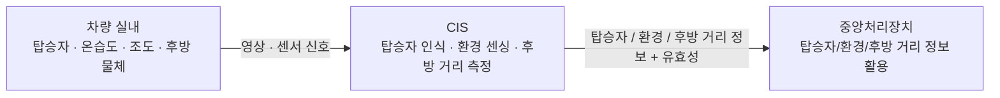

# CIS System Requirement (SR) — Functional Baseline Draft

> 상태: DRAFT / 기능 범위 검토용  
> 작성 원칙: 고객·상위 시스템 관점의 **What**을 기술한다.  
> 개별 요구사항 ID는 부여하지 않는다.  
> 기존(구) Repository 참고 자료의 번호 체계는 승계하지 않는다.

---

## 1. 목적

본 문서는 차량 실내의 탑승자 상태와 환경, 그리고 후방 근접 거리를 감지하여
차량의 다른 기능이 활용할 수 있는 형태로 제공하는
CIS(Cabin Interior Sensing)의 상위 요구사항을 정의한다.

CIS는 실내 탑승자 존재 여부·인원수, 실내 온도·습도·조도, 후방 물체와의 거리를 측정하며,
측정 결과는 중앙처리장치가 필요로 하는 형태로 제공되어야 한다.

---

## 2. 기능 범위

CIS는 다음 기능을 제공해야 한다.

- 실내 탑승자 존재 여부 판정
- 실내 탑승자 인원수 판정
- 실내 온도 측정
- 실내 습도 측정
- 조도 측정
- 후방 물체와의 거리 측정
- 위 판정·측정 결과의 유효성 판단
- 판정·측정 결과를 중앙처리장치로 제공

### 2.1 CIS 상위 시스템 컨텍스트

> 본 SR의 컨텍스트 다이어그램은 기능 경계만 표현한다.  
> 처리 보드, 센서 모델, 통신 프로토콜 및 메시지 구조는 SysRS 이후 단계에서 구체화한다.

---

## 3. 기능 경계

- CIS는 도어 잠금, 파워윈도우 등 차량 액추에이터를 직접 제어하지 않는다.
- CIS는 확정된 판정 결과와 측정값을 중앙처리장치가 활용할 수 있도록 제공해야 한다.
- CIS는 후방 물체와의 거리 및 그 유효성만 제공하며, 해당 거리를 위험 수준으로 분류하는 것은 CIS의 역할이 아니다.

---

## 4. 탑승자 인식 요구사항

- 시스템은 실내 영상을 이용하여 탑승자 존재 여부를 판정해야 한다.
- 시스템은 실내 영상을 이용하여 탑승자 인원수를 판정해야 한다.
- 시스템은 탑승자 판정 결과의 유효 여부를 구분해야 한다.
- 시스템은 비전 정보를 신뢰할 수 있기 전에는 해당 정보에 기반한 판정 결과를 확정하지 않아야 한다.
- 시스템은 비전 오류의 복구 조건이 충족되기 전에는 탑승자 상태를 정상으로 확정하지 않아야 한다.
- 시스템은 실내 영상을 탑승자 인식 목적 범위를 벗어나 저장하거나 외부로 전송하지 않아야 한다.

---

## 5. 실내 환경 센싱 요구사항

- 시스템은 실내 온도를 측정해야 한다.
- 시스템은 실내 습도를 측정해야 한다.
- 시스템은 조도를 측정해야 한다.
- 시스템은 측정 정보의 유효 여부를 구분해야 한다.
- 시스템은 센서 정보를 신뢰할 수 있기 전에는 해당 정보에 기반한 값을 확정하지 않아야 한다.
- 시스템은 센서 오류의 복구 조건이 충족되기 전에는 측정값을 정상으로 확정하지 않아야 한다.

---

## 6. 후방 근접 감지 요구사항

- 시스템은 후방 물체와의 거리를 측정해야 한다.
- 시스템은 유효한 차량 전원 허용 상태에서 후방 거리 측정을 상시 활성화하여 중앙처리장치에 제공해야 한다.
- 시스템은 거리 측정 정보의 유효 여부를 구분해야 한다.
- 시스템은 측정한 거리와 그 유효 여부를 중앙처리장치로 제공해야 한다.
- 시스템은 거리 측정 정보를 신뢰할 수 있기 전에는 해당 값을 정상 정보로 확정하지 않아야 한다.

> 거리를 근접 위험 수준(주의/긴급/해제 등)으로 분류하는 판단 및 후진 기어(R단) 연계 여부는 중앙처리장치의 책임이다. CIS는 전원 허용 시 상시 측정하여 필요한 거리값과 유효성만 제공한다.

---

## 7. 데이터 유효성 및 오류 요구사항

- 시스템은 센서 입력이 유효 범위를 벗어난 경우 해당 정보를 정상 정보로 사용하지 않아야 한다.
- 시스템은 실내 영상 품질이 인식 기준을 만족하지 못하는 경우 해당 판정 결과를 정상 정보로 사용하지 않아야 한다.
- 시스템은 특정 센서 또는 비전 기능에 오류가 발생하더라도, 오류와 무관한 다른 판정·측정 기능을 불필요하게 중단하지 않아야 한다.
- 시스템은 통신 오류 동안 마지막 정상 값을 현재 정상 값으로 표시하지 않아야 한다.

---

## 8. 중앙처리장치 연계 요구사항

- 시스템은 유효한 탑승자 판정 결과, 환경 측정값 및 후방 거리 측정값을 중앙처리장치로 전송해야 한다.
- 시스템은 판정 결과 및 측정값을 정의된 주기로 갱신하여 제공해야 한다.
- 시스템은 판정 결과 및 측정값과 함께 해당 값의 유효 여부를 함께 제공해야 한다.
- 시스템은 통신 오류가 발생한 경우 해당 오류 상태를 상위 시스템이 식별할 수 있도록 제공해야 한다.
- 시스템은 통신 오류가 해제되고 새로운 유효 값이 확인된 경우에만 정상 전송을 재개해야 한다.

---

## 9. 기능 제외 범위

본 CIS 범위에는 다음 기능을 포함하지 않는다.

- 도어 잠금, 파워윈도우 등 차량 액추에이터 제어
- 후방 물체와의 거리를 위험 수준(주의/긴급/해제 등)으로 분류하는 판단
- 후방 거리 측정값을 중앙처리장치 외의 대상에 직접 제공하는 것

CIS의 핵심 기능은 **실내 탑승자·환경 상태 판정과 후방 물체 거리 측정, 그리고 그 유효성 제공**으로 한정한다.

---

## 10. 상위 시스템 연계 원칙

- CIS는 센서 원시 데이터 및 영상을 직접 외부로 노출하지 않아야 한다.
- CIS의 세부 인식·센싱 처리 방법은 상위 차량 기능이 직접 제어하지 않아야 한다.
- CIS의 상태 및 오류는 상위 차량 시스템에서 활용 가능해야 한다.

---

## 11. 범위 요약

> **CIS는 차량 실내의 탑승자 상태와 환경을 판정하고,
> 후방 물체와의 거리를 유효성과 함께 측정하여,
> 중앙처리장치가 필요로 하는 형태로 제공하는 실내 센싱 기능이다.**
