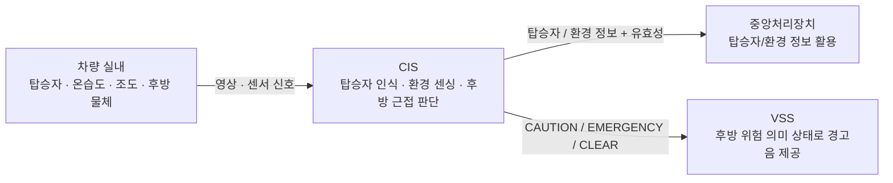

# CIS System Requirement (SR) — Functional Baseline Draft

> 상태: DRAFT / 기능 범위 검토용  
> 작성 원칙: 고객·상위 시스템 관점의 **What**을 기술한다.  
> 개별 요구사항 ID는 부여하지 않는다.  
> 기존(구) Repository 참고 자료의 번호 체계는 승계하지 않는다.

---

## 1. 목적

본 문서는 차량 실내의 탑승자 상태와 환경, 그리고 후방 근접 위험을 감지하여
차량의 다른 기능이 활용할 수 있는 형태로 제공하는
CIS(Cabin Interior Sensing)의 상위 요구사항을 정의한다.

CIS는 실내 탑승자 존재 여부·인원수, 실내 온도·습도·조도, 후방 물체와의 근접 위험 상태를 판정하며,
판정 결과는 중앙처리장치와 VSS(Vehicle Sound System)가 각각 필요로 하는 형태로 제공되어야 한다.

---

## 2. 기능 범위

CIS는 다음 기능을 제공해야 한다.

- 실내 탑승자 존재 여부 판정
- 실내 탑승자 인원수 판정
- 실내 온도 측정
- 실내 습도 측정
- 조도 측정
- 후방 물체와의 거리 측정 및 근접 위험 상태 판단
- 위 판정·측정 결과의 유효성 판단
- 판정·측정 결과를 중앙처리장치 및 VSS로 제공

### 2.1 CIS 상위 시스템 컨텍스트

> 본 SR의 컨텍스트 다이어그램은 기능 경계만 표현한다.  
> 처리 보드, 센서 모델, 통신 프로토콜 및 메시지 구조는 SysRS 이후 단계에서 구체화한다.

---

## 3. 기능 경계

- CIS는 엔진룸 대상 동물의 진입 여부를 판정하지 않는다.
- CIS는 후방 위험 상태에 대응하는 음향을 직접 재생하지 않는다.
- CIS는 도어 잠금, 파워윈도우 등 차량 액추에이터를 직접 제어하지 않는다.
- CIS는 확정된 판정 결과와 측정값을 중앙처리장치 및 VSS가 활용할 수 있도록 제공해야 한다.

---

## 4. 탑승자 인식 요구사항

- 시스템은 실내 영상을 이용하여 탑승자 존재 여부를 판정해야 한다.
- 시스템은 실내 영상을 이용하여 탑승자 인원수를 판정해야 한다.
- 시스템은 탑승자 판정 결과의 유효 여부를 구분해야 한다.
- 시스템은 비전 정보를 신뢰할 수 있기 전에는 해당 정보에 기반한 판정 결과를 확정하지 않아야 한다.
- 시스템은 비전 오류의 복구 조건이 충족되기 전에는 탑승자 상태를 정상으로 확정하지 않아야 한다.
- 시스템은 실내 영상을 탑승자 인식 목적 범위를 벗어나 저장하거나 외부로 전송하지 않아야 한다.

---

## 5. 실내 환경 센싱 요구사항

- 시스템은 실내 온도를 측정해야 한다.
- 시스템은 실내 습도를 측정해야 한다.
- 시스템은 조도를 측정해야 한다.
- 시스템은 측정 정보의 유효 여부를 구분해야 한다.
- 시스템은 센서 정보를 신뢰할 수 있기 전에는 해당 정보에 기반한 값을 확정하지 않아야 한다.
- 시스템은 센서 오류의 복구 조건이 충족되기 전에는 측정값을 정상으로 확정하지 않아야 한다.

---

## 6. 후방 근접 감지 요구사항

- 시스템은 후방 물체와의 거리를 측정해야 한다.
- 시스템은 거리 측정 정보의 유효 여부를 구분해야 한다.
- 시스템은 물체와의 거리가 정의된 기준 이내인 경우 근접 위험 상태를 판단해야 한다.
- 시스템은 근접 위험 수준이 높아지는 경우 이를 구분되는 상태로 제공해야 한다.
- 시스템은 물체가 정의된 기준 거리 밖으로 벗어난 경우 근접 위험 상태를 해제해야 한다.
- 시스템은 거리 측정 정보를 신뢰할 수 있기 전에는 근접 위험 상태를 확정하지 않아야 한다.

---

## 7. 데이터 유효성 및 오류 요구사항

- 시스템은 센서 입력이 유효 범위를 벗어난 경우 해당 정보를 정상 정보로 사용하지 않아야 한다.
- 시스템은 실내 영상 품질이 인식 기준을 만족하지 못하는 경우 해당 판정 결과를 정상 정보로 사용하지 않아야 한다.
- 시스템은 특정 센서 또는 비전 기능에 오류가 발생하더라도, 오류와 무관한 다른 판정·측정 기능을 불필요하게 중단하지 않아야 한다.
- 시스템은 통신 오류 동안 마지막 정상 값을 현재 정상 값으로 표시하지 않아야 한다.

---

## 8. 중앙처리장치 및 VSS 연계 요구사항

- 시스템은 유효한 탑승자 판정 결과 및 환경 측정값을 중앙처리장치로 전송해야 한다.
- 시스템은 판정 결과 및 측정값을 정의된 주기로 갱신하여 제공해야 한다.
- 시스템은 판정 결과 및 측정값과 함께 해당 값의 유효 여부를 함께 제공해야 한다.
- 시스템은 통신 오류가 발생한 경우 해당 오류 상태를 상위 시스템이 식별할 수 있도록 제공해야 한다.
- 시스템은 통신 오류가 해제되고 새로운 유효 값이 확인된 경우에만 정상 전송을 재개해야 한다.
- 시스템은 근접 위험 상태를 VSS가 활용 가능한 의미 상태(주의 / 긴급 / 해제)로 제공해야 한다.

---

## 9. 기능 제외 범위

본 CIS 범위에는 다음 기능을 포함하지 않는다.

- 엔진룸 카메라 기반 대상 동물 진입 판정
- 후방 위험 상태에 대응하는 음향 출력 및 재생 (VSS 담당)
- 도어 잠금, 파워윈도우 등 차량 액추에이터 제어
- 후방 장애물의 실제 거리값 및 임계값을 VSS 등 외부에 직접 노출하는 것 (의미 상태로만 제공)

CIS의 핵심 기능은 **실내 탑승자·환경 상태 판정과 후방 근접 위험의 의미 상태화**로 한정한다.

---

## 10. 상위 시스템 연계 원칙

- CIS는 센서 원시 데이터 및 영상을 직접 외부로 노출하지 않아야 한다.
- CIS의 후방 위험 의미 상태는 VSS가 정의한 의미 이벤트 체계와 일치해야 한다.
- CIS의 세부 인식·센싱 처리 방법은 상위 차량 기능이 직접 제어하지 않아야 한다.
- CIS의 상태 및 오류는 상위 차량 시스템에서 활용 가능해야 한다.

---

## 11. 범위 요약

> **CIS는 차량 실내의 탑승자 상태와 환경을 판정하고,
> 후방 물체와의 근접 위험을 의미 상태(주의/긴급/해제)로 확정하여,
> 중앙처리장치와 VSS가 각각 필요로 하는 형태로 제공하는 실내 센싱 기능이다.**
