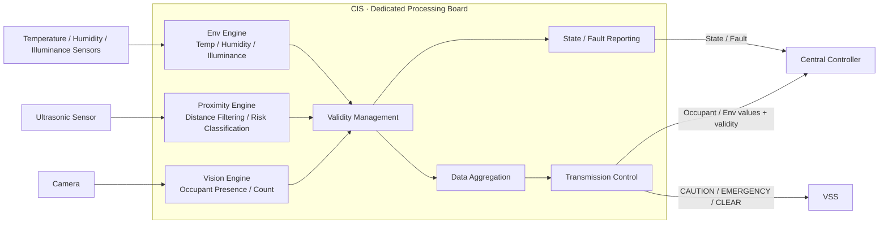
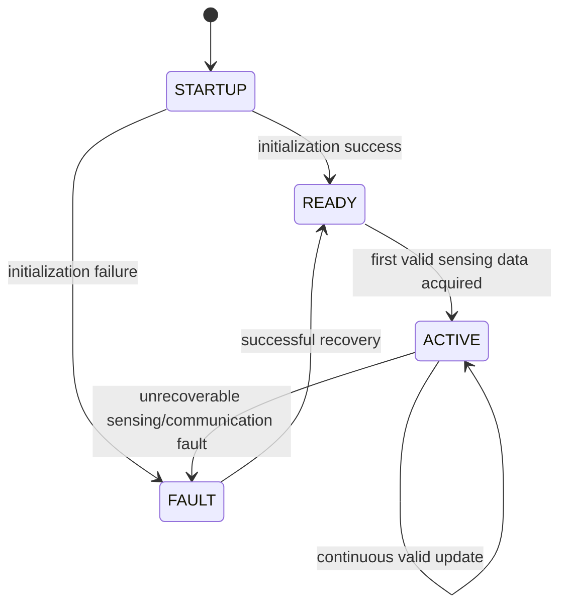
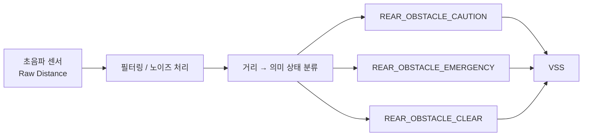

# CIS System Requirement Specification (SysRS)
## Dedicated Processing Board — Functional Baseline Draft

> 상태: DRAFT / 기능·성능 기준 검토용  
> 대상 시스템: **CIS 전용 처리 보드 1대**  
> 신규 SysRS ID 체계를 사용하며 이전 번호를 승계하지 않는다.  
> `[CANDIDATE]`는 초기 개발 및 벤치 검증을 위한 임시값이다.  
> 통신 프로토콜, 메시지 ID, 신호 배치, 송신 주기 및 버스 파라미터는 본 단계에서 확정하지 않는다.

---

# 1. 대상 시스템과 책임

본 SysRS의 대상은 독립된 물리 처리 보드 1대로 구성되는 CIS 모듈이다.

CIS의 책임은 다음과 같다.

- 실내 영상 기반 탑승자 존재 여부·인원수 판정
- 실내 온도·습도·조도 측정
- 후방 물체와의 거리 측정 및 근접 위험 의미 상태(`CAUTION`/`EMERGENCY`/`CLEAR`) 판단
- 판정·측정 결과의 유효성 확인
- 중앙처리장치 및 VSS로의 정보 제공
- 자체 오류 검출 및 상태 제공

CIS의 책임이 아닌 항목은 다음과 같다.

- 엔진룸 대상 동물 진입 판정
- 후방 위험 상태에 대응하는 음향 재생 및 우선순위 처리 (VSS 책임)
- 도어 잠금, 파워윈도우, 공조 등 차량 액추에이터 제어
- 차량 전체 상태 판단
- 실제 차량 통신 프로토콜 및 메시지 설계

---

# 2. 논리 시스템 구조

후방 근접 기능의 경우 거리 측정과 위험도 판정은 CIS 내부에서 수행하고,
VSS에는 `CAUTION`, `EMERGENCY`, `CLEAR`처럼 의미가 확정된 상태만 전달한다.

이 구조에서 물리 통신 방식과 메시지 표현은 후속 전체 인터페이스/네트워크 설계에서 결정한다.

---

# 3. 시스템 상태

CIS는 최소 다음의 논리 상태를 제공해야 한다.

- `STARTUP`: 초기화 진행 중
- `READY`: 초기화 완료, 유효 센싱 데이터 확보 대기
- `ACTIVE`: 유효한 판정·측정 결과를 정상 제공 중
- `FAULT`: 정상적인 판정·측정·전송을 보장할 수 없음

기본 상태 전이는 다음과 같다.

---

# 4. Functional Requirements

| ID | Requirement |
|---|---|
| CIS-SYS-FUN-001 | CIS는 전원 인가 후 자체 초기화를 수행하고 정상적인 경우 `READY` 상태로 전이해야 한다. |
| CIS-SYS-FUN-002 | CIS는 `READY` 상태에서 최초 유효 센싱 데이터가 확보되면 `ACTIVE` 상태로 전이해야 한다. |
| CIS-SYS-FUN-003 | CIS는 실내 영상을 이용하여 탑승자 존재 여부를 판정해야 한다. |
| CIS-SYS-FUN-004 | CIS는 실내 영상을 이용하여 탑승자 인원수를 판정해야 한다. |
| CIS-SYS-FUN-005 | CIS는 탑승자 판정 결과의 유효 여부를 구분해야 한다. |
| CIS-SYS-FUN-006 | CIS는 비전 정보를 신뢰할 수 있기 전에는 해당 정보에 기반한 판정 결과를 확정하지 않아야 한다. |
| CIS-SYS-FUN-007 | CIS는 비전 오류의 복구 조건이 충족되기 전에는 탑승자 상태를 정상으로 확정하지 않아야 한다. |
| CIS-SYS-FUN-008 | CIS는 실내 온도를 측정해야 한다. |
| CIS-SYS-FUN-009 | CIS는 실내 습도를 측정해야 한다. |
| CIS-SYS-FUN-010 | CIS는 조도를 측정해야 한다. |
| CIS-SYS-FUN-011 | CIS는 환경 측정 정보의 유효 여부를 구분해야 한다. |
| CIS-SYS-FUN-012 | CIS는 센서 정보를 신뢰할 수 있기 전에는 해당 정보에 기반한 값을 확정하지 않아야 한다. |
| CIS-SYS-FUN-013 | CIS는 센서 오류의 복구 조건이 충족되기 전에는 측정값을 정상으로 확정하지 않아야 한다. |
| CIS-SYS-FUN-014 | CIS는 후방 물체와의 거리를 측정해야 한다. |
| CIS-SYS-FUN-015 | CIS는 거리 측정 정보의 유효 여부를 구분해야 한다. |
| CIS-SYS-FUN-016 | CIS는 물체와의 거리가 정의된 주의 임계값 이내인 경우 `CAUTION` 상태를 판단해야 한다. |
| CIS-SYS-FUN-017 | CIS는 물체와의 거리가 정의된 긴급 임계값 이내인 경우 `EMERGENCY` 상태를 판단해야 한다. |
| CIS-SYS-FUN-018 | CIS는 물체가 정의된 기준 거리 밖으로 벗어난 경우 `CLEAR` 상태로 전이해야 한다. |
| CIS-SYS-FUN-019 | CIS는 거리 측정 정보를 신뢰할 수 있기 전에는 `CAUTION`/`EMERGENCY` 상태를 확정하지 않아야 한다. |
| CIS-SYS-FUN-020 | CIS는 특정 센서 또는 비전 기능에 오류가 발생하더라도, 오류와 무관한 다른 판정·측정 기능을 불필요하게 중단하지 않아야 한다. |
| CIS-SYS-FUN-021 | CIS는 통신 오류 동안 마지막 정상 값을 현재 정상 값으로 표시하지 않아야 한다. |
| CIS-SYS-FUN-022 | CIS는 유효한 탑승자 판정 결과 및 환경 측정값을 정의된 주기로 중앙처리장치에 전송해야 한다. |
| CIS-SYS-FUN-023 | CIS는 전송하는 각 값에 대해 유효 여부 플래그를 함께 제공해야 한다. |
| CIS-SYS-FUN-024 | CIS는 통신 오류가 발생한 경우 해당 오류 상태를 상위 시스템이 식별할 수 있도록 제공해야 한다. |
| CIS-SYS-FUN-025 | CIS는 통신 오류가 해제되고 새로운 유효 값이 확인된 경우에만 정상 전송을 재개해야 한다. |
| CIS-SYS-FUN-026 | CIS는 `CAUTION`/`EMERGENCY`/`CLEAR` 상태를 VSS가 정의한 의미 이벤트 이름과 일치시켜 제공해야 한다. |
| CIS-SYS-FUN-027 | CIS는 실내 영상을 탑승자 인식 목적 범위를 벗어나 저장하거나 외부로 전송하지 않아야 한다. |
| CIS-SYS-FUN-028 | CIS는 엔진룸 대상 동물의 진입 여부를 판정하지 않아야 한다. |

---

# 5. Semantic Event / Output Definitions

본 단계에서는 실제 통신 신호나 숫자 Event ID를 정의하지 않는다.
CIS가 외부로 제공해야 하는 **의미 정보의 종류**만 정의한다.

## 5.1 CIS → VSS (후방 근접 위험 의미 이벤트)

VSS SysRS(`../VSS/02_VSS_SYSRS_FUNCTIONAL_BASELINE_DRAFT.md` §5)에 정의된 `REAR_OBSTACLE_*` 의미 이벤트를
CIS가 발행하는 것으로 정의한다. VSS 측 Source Owner는 본 문서로 확정한다.

| Semantic Event | Meaning | Trigger |
|---|---|---|
| `REAR_OBSTACLE_CAUTION` | 후방 물체 주의 거리 진입 | 거리 ≤ 주의 임계값, EMERGENCY 미해당 |
| `REAR_OBSTACLE_EMERGENCY` | 후방 물체 긴급 거리 진입 | 거리 ≤ 긴급 임계값 |
| `REAR_OBSTACLE_CLEAR` | 후방 위험 해제 | 물체가 감지 범위 밖이거나 임계값 밖으로 이탈 |

## 5.2 CIS → Central Controller

| Semantic Value | Meaning | Class |
|---|---|---|
| `OCCUPANT_PRESENCE` | 탑승자 존재 여부 | Occupant |
| `OCCUPANT_COUNT` | 탑승자 인원수 | Occupant |
| `CABIN_TEMPERATURE` | 실내 온도 | Environment |
| `CABIN_HUMIDITY` | 실내 습도 | Environment |
| `CABIN_ILLUMINANCE` | 조도 | Environment |
| `REAR_DISTANCE` | 후방 물체 거리 | Proximity (내부 참고용, 5.1 의미 상태가 1차 정보) |
| `<value>_VALID` | 각 값의 유효 여부 | Validity |
| `CIS_STATE` | CIS 상태(`READY`/`ACTIVE`/`FAULT`) | Diagnostic |

> 실제 신호명, 숫자 값, 메시지 배치 및 전송 방식은 후속 인터페이스 설계에서 확정한다.

## 5.3 후방 근접 위험 상태의 CIS 내부 처리 개념

> 이 다이어그램은 위험 상태의 **의미 흐름**을 표현한다.  
> 실제 초음파 센서 모델, 필터링 알고리즘 및 통신 신호 정의는 포함하지 않는다.

---

# 6. Candidate Proximity Thresholds

다음 값은 기능 검증을 위한 임시 기준이다. 측정 범위 및 3단계 구간은 균등 분할한 임시값이며,
VSS가 필요로 하는 `CAUTION`/`EMERGENCY`/`CLEAR` 3상태로 매핑한다.

| 구간 | 거리 범위 | 내부 분류 | 외부 발행 상태 |
|---|---:|---|---|
| 1 | 10 ~ 40 cm | 최근접 | `REAR_OBSTACLE_EMERGENCY` |
| 2 | 40 ~ 70 cm | 근접 | `REAR_OBSTACLE_CAUTION` |
| 3 | 70 ~ 100 cm | 감시(내부 전용, 경고 미발행) | `REAR_OBSTACLE_CLEAR` |
| - | 100 cm 초과 또는 미감지 | 해당 없음 | `REAR_OBSTACLE_CLEAR` |

| Item | Candidate |
|---|---:|
| 측정 범위 | `10 cm ~ 100 cm` |
| 거리 전송 단위 | `cm` |
| 주의 임계값 (`REAR_OBSTACLE_CAUTION`) | `[CANDIDATE] ≤ 70 cm` |
| 긴급 임계값 (`REAR_OBSTACLE_EMERGENCY`) | `[CANDIDATE] ≤ 40 cm` |
| 3구간 분할 방식 | `[CANDIDATE] 균등 3등분` |

> 위 값은 실제 채택할 초음파 센서 모델의 정확도·노이즈 특성에 따라 재조정이 필요한 임시값이다.  
> 3구간 분할은 CIS 내부 정밀도를 위한 것이며, VSS에는 `CAUTION`/`EMERGENCY`/`CLEAR` 3상태만 노출된다.

---

# 7. Performance Requirements

| ID | Requirement | Candidate |
|---|---|---:|
| CIS-SYS-PER-001 | 전원 인가 후 CIS는 `READY` 또는 `FAULT` 상태를 확정해야 한다. | `[CANDIDATE] ≤ 3000 ms` |
| CIS-SYS-PER-002 | CIS는 탑승자/환경/근접 데이터를 정의된 주기로 갱신하여 제공해야 한다. | `[CANDIDATE] 200 ms` |
| CIS-SYS-PER-003 | 근접 위험 `EMERGENCY` 상태가 CIS 내부에서 확정된 시점부터 외부 제공까지의 지연은 제한되어야 한다. | `[CANDIDATE] ≤ 100 ms` |
| CIS-SYS-PER-004 | CIS는 정의된 연속 누락 횟수를 초과하는 통신 실패를 통신 오류로 판단해야 한다. | `[CANDIDATE] 연속 3주기 (≈ 600 ms)` |
| CIS-SYS-PER-005 | 통신 오류 해제 후 CIS가 정상 전송을 재개하기까지의 지연은 제한되어야 한다. | `[CANDIDATE] ≤ 500 ms` |

> 위 시간은 **CIS 내부 확정 시점부터의 시스템 성능**이다.  
> 차량 네트워크 전송 지연 및 메시지 주기는 아직 포함하지 않는다.

---

# 8. External Logical Interface Requirements

본 절은 통신 프로토콜을 정의하지 않는다.
후속 인터페이스 설계에서 필요한 정보 항목을 누락하지 않기 위한 논리 계약만 정의한다.

## 8.1 CIS가 외부에서 필요로 하는 정보

| ID | Requirement |
|---|---|
| CIS-SYS-INT-001 | CIS는 후방 근접 감지 활성 조건 판단을 위해 차량 전원 상태를 제공받아야 한다. |
| CIS-SYS-INT-002 | CIS는 후방 근접 감지 활성 조건 판단을 위해 차량 후진 기어 상태를 제공받을 수 있어야 한다. |

## 8.2 CIS가 외부에 제공해야 하는 정보

| ID | Requirement |
|---|---|
| CIS-SYS-INT-003 | CIS는 탑승자 존재 여부 및 인원수를 중앙처리장치가 확인할 수 있도록 제공해야 한다. |
| CIS-SYS-INT-004 | CIS는 실내 온도·습도·조도 측정값을 중앙처리장치가 확인할 수 있도록 제공해야 한다. |
| CIS-SYS-INT-005 | CIS는 후방 근접 위험 의미 상태(`CAUTION`/`EMERGENCY`/`CLEAR`)를 VSS가 확인할 수 있도록 제공해야 한다. |
| CIS-SYS-INT-006 | CIS는 각 제공 정보의 유효 여부를 함께 제공해야 한다. |
| CIS-SYS-INT-007 | CIS는 정상/오류 상태를 외부 시스템이 확인할 수 있도록 해야 한다. |
| CIS-SYS-INT-008 | CIS가 오류에서 복구된 경우 외부 시스템이 정상 복귀 여부를 확인할 수 있도록 해야 한다. |

## 8.3 본 단계에서 결정하지 않는 항목

- CAN / UART 등 실제 물리·데이터링크 프로토콜
- Message ID / Signal ID
- Payload Byte Layout / DLC / Frame Length
- Endianness
- 송신 주기 / Timeout
- Alive Counter / Rolling Counter / CRC / E2E
- Bit Rate / Data Rate
- Bus Load
- 후방 근접 주의/긴급 거리 임계값 최종값
- 초음파 센서 샘플링 주기
- 센서 필터링 방식
- 중앙처리장치와의 통신 링크에서 사용할 물리 포트(LPUART0/LPUART2 등) 배정

---

# 9. Safety Requirements

| ID | Requirement |
|---|---|
| CIS-SYS-SAF-001 | CIS의 오류는 파워윈도우, 공조, 도어 등 다른 차량 기능의 제어 상태를 직접 변경해서는 안 된다. |
| CIS-SYS-SAF-002 | CIS는 신뢰할 수 없는 근접 감지 정보를 근거로 `EMERGENCY` 상태를 확정해서는 안 된다. |
| CIS-SYS-SAF-003 | CIS는 정상적인 탑승자/환경/근접 정보를 제공할 수 없는 경우 해당 상태가 외부 시스템에서 식별 가능해야 한다. |
| CIS-SYS-SAF-004 | CIS는 실내 영상 원본을 어떠한 외부 인터페이스로도 노출해서는 안 된다. |

---

# 10. Diagnostic Requirements

## 10.1 Logical Fault Categories

- `VISION_FAULT`
- `ENV_SENSOR_FAULT`
- `PROXIMITY_SENSOR_FAULT`
- `COMMUNICATION_FAULT`
- `INITIALIZATION_FAILURE`

실제 DTC 번호 및 네트워크 진단 포맷은 본 단계에서 정의하지 않는다.

## 10.2 Requirements

| ID | Requirement |
|---|---|
| CIS-SYS-DIA-001 | CIS는 정상 판정·측정을 방해하는 오류를 검출할 수 있어야 한다. |
| CIS-SYS-DIA-002 | CIS는 최근 발생한 주요 오류 원인을 식별 가능하게 유지해야 한다. |
| CIS-SYS-DIA-003 | 초기화 실패 시 CIS는 `FAULT` 상태로 전이해야 한다. |
| CIS-SYS-DIA-004 | 복구 가능한 오류의 경우 CIS는 전체 재시작 없이 정상 상태로 복귀할 수 있어야 한다. |
| CIS-SYS-DIA-005 | 복구에 실패한 경우 CIS는 `FAULT` 상태를 유지하고 오류 상태를 외부에 제공할 수 있어야 한다. |
| CIS-SYS-DIA-006 | 비전/환경/근접 기능 중 하나에 결함이 발생한 경우 CIS는 해당 결함 영역을 식별 가능하게 구분해야 한다. |

---

# 11. Non-Functional Requirements

## 11.1 Robustness

| ID | Requirement |
|---|---|
| CIS-SYS-NFR-001 | 유효하지 않은 센서/영상 입력이 CIS 전체의 비정상 종료를 유발해서는 안 된다. |
| CIS-SYS-NFR-002 | CIS는 정상적인 처리 과정에서 무한 대기 상태에 진입하지 않아야 한다. |
| CIS-SYS-NFR-003 | CIS 관련 오류는 다른 차량 기능과 기능적으로 격리되어야 한다. |

## 11.2 Predictability

| ID | Requirement |
|---|---|
| CIS-SYS-NFR-004 | 동일한 입력 조건에서는 동일한 판정 결과가 산출되어야 한다. |
| CIS-SYS-NFR-005 | 근접 위험 상태는 정의된 임계값 정책에 따라 일관되게 결정되어야 한다. |

## 11.3 Maintainability

| ID | Requirement |
|---|---|
| CIS-SYS-NFR-006 | 근접 위험 임계값은 전체 판정 로직에 분산되지 않고 일관되게 관리 가능해야 한다. |
| CIS-SYS-NFR-007 | 실제 통신 프로토콜 변경이 CIS의 판정 로직 자체를 불필요하게 변경시키지 않도록 논리 인터페이스와 통신 구현이 분리 가능해야 한다. |

## 11.4 Testability

| ID | Requirement |
|---|---|
| CIS-SYS-NFR-008 | CIS는 실제 카메라·센서를 직접 연결하지 않고 대체 입력만으로 핵심 판정 로직을 시험할 수 있어야 한다. |
| CIS-SYS-NFR-009 | CIS는 각 근접 위험 임계값 구간에 대해 상태 전이를 독립적으로 검증할 수 있어야 한다. |

---

# 12. Candidate Acceptance Criteria

| Test | Candidate Acceptance |
|---|---|
| Power-on readiness | 전원 인가 후 `≤ 3000 ms` 이내 `READY` 또는 `FAULT` 확정 |
| Occupant detection | 유효 영상 입력 시 존재 여부·인원수 판정 결과 제공 |
| Env measurement | 온도·습도·조도 값 및 유효성 제공 |
| Proximity caution | 거리 `≤ 70 cm` 진입 시 `REAR_OBSTACLE_CAUTION` 발행 |
| Proximity emergency | 거리 `≤ 40 cm` 진입 시 `REAR_OBSTACLE_EMERGENCY` 발행 |
| Proximity clear | 거리 `> 100 cm` 또는 미감지 시 `REAR_OBSTACLE_CLEAR` 발행 |
| Invalid sensor input | 유효 범위 밖 입력 시 정상 정보로 사용하지 않음 |
| Communication loss | 연속 누락 시 통신 오류 상태 식별 가능 |
| Recovery | 오류 해제 및 새 유효값 확인 후에만 정상 전송 재개 |
| Isolation | 특정 센서/비전 오류가 다른 기능을 불필요하게 중단시키지 않음 |
| Raw video exposure | 실내 영상 원본이 어떤 외부 인터페이스로도 노출되지 않음 |

---

# 13. Candidate Parameter Summary

| Category | Parameter | Candidate |
|---|---|---:|
| Architecture | CIS controller | Dedicated processing board |
| Timing | Startup | ≤ 3000 ms |
| Timing | Data update period | 200 ms |
| Timing | Emergency internal-to-external delay | ≤ 100 ms |
| Timing | Communication fault detection | 연속 3주기 (≈ 600 ms) |
| Timing | Communication recovery | ≤ 500 ms |
| Proximity | 측정 범위 | 10 ~ 100 cm |
| Proximity | 거리 전송 단위 | cm |
| Proximity | Caution threshold | ≤ 70 cm |
| Proximity | Emergency threshold | ≤ 40 cm |

---

# 14. TBD / 후속 단계 결정 항목

## 14.1 CIS 자체에서 결정

- 채택할 초음파 센서 모델 및 그에 따른 임계값 재조정
- 거리값 필터링 방식
- 조도 측정 단위(lux 등)
- 탑승자 인원수 카운팅 정확도 기준
- 후진/차량 상태와의 활성 조건 필요 여부 (8.1절)

## 14.2 전체 기능 취합 후 Interface / Network 단계에서 결정

- CIS와 중앙처리장치·VSS 간 물리 통신 경로 (Open Item: LPUART0/LPUART2 중 배정)
- 실제 통신 프로토콜, 메시지/신호 이름, 메시지 ID
- 데이터 길이 및 비트 배치
- 송신 방식 및 주기, Timeout/Freshness
- Alive Counter/CRC/E2E, 통신 장애 복구 정책
- 네트워크 우선순위 및 Bus Load

## 14.3 Element / SW / HW 설계 단계에서 결정

- 실제 처리 보드/카메라/센서 부품 사양
- 비전 인식 모델 및 파이프라인
- 내부 Queue/Buffer 구조, Task 주기
- Watchdog 주기
- CPU/RAM 세부 Budget

---

# 15. Baseline Scope

> **CIS는 실내 영상과 환경 센서로부터 탑승자 상태·환경 정보·후방 근접 위험을 판정하고,
> 유효성이 확인된 정보만 중앙처리장치와 VSS로 제공하며,
> 자신의 상태와 오류를 관리하는 실내 센싱 모듈이다.**

후방 근접 기능에서는 CIS가 초음파 거리값을 직접 판정하여
VSS가 필요로 하는 **주의 / 긴급 / 해제 상태로 변환해 제공**한다.

실제 차량 통신 프로토콜과 메시지 설계는 전체 시스템 기능 및 인터페이스가 취합된 이후 수행한다.
