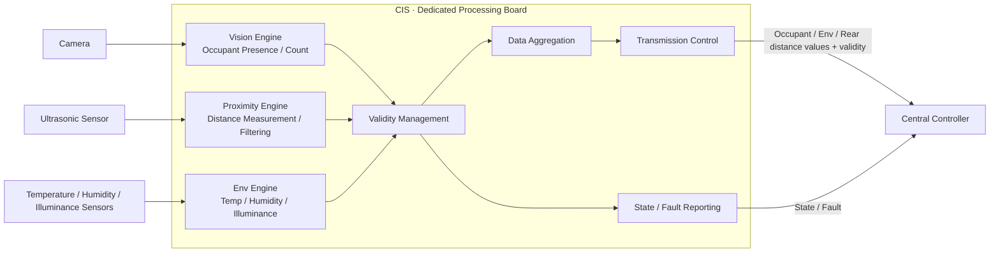
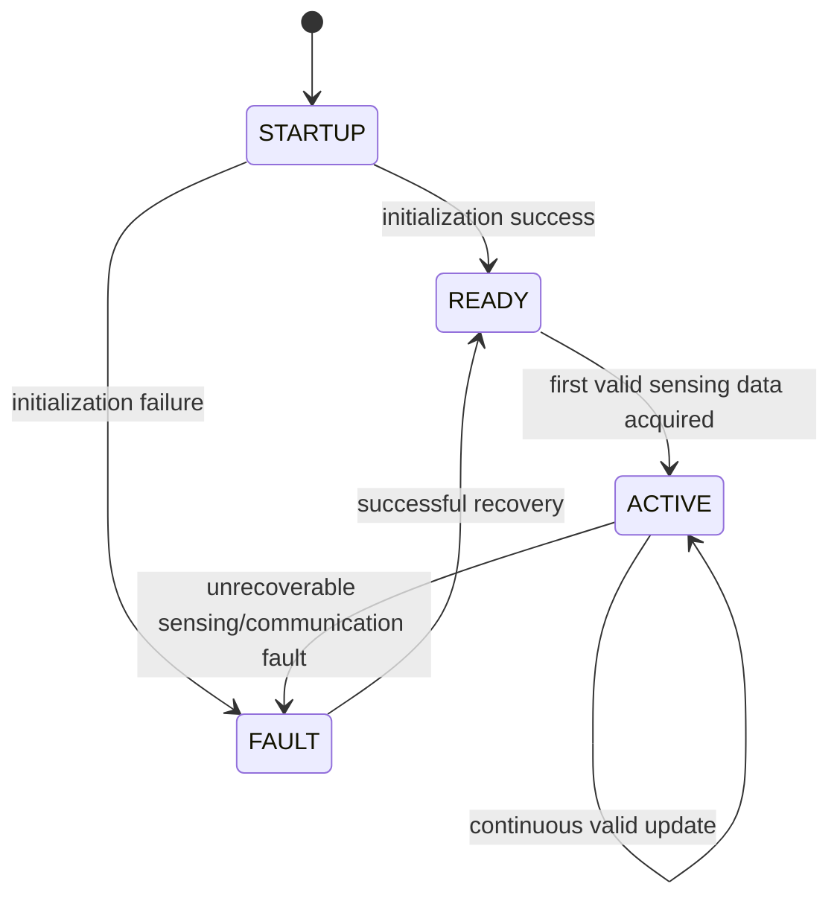

# CIS System Requirement Specification (SysRS)
## Dedicated Processing Board — Functional Baseline Draft

> 상태: DRAFT / 기능·성능 기준 검토용  
> 대상 시스템: **CIS 전용 처리 보드 1대**  
> 신규 SysRS ID 체계를 사용하며 이전 번호를 승계하지 않는다.  
> `[CANDIDATE]`는 초기 개발 및 벤치 검증을 위한 임시값이다.  
> 통신 프로토콜, 메시지 ID, 신호 배치, 송신 주기 및 버스 파라미터는 본 단계에서 확정하지 않는다.

---

# 1. 대상 시스템과 책임

본 SysRS의 대상은 독립된 물리 처리 보드 1대로 구성되는 CIS 모듈이다.

CIS의 책임은 다음과 같다.

- 실내 영상 기반 탑승자 존재 여부·인원수 판정
- 실내 온도·습도·조도 측정
- 후방 물체와의 거리 측정
- 판정·측정 결과의 유효성 확인
- 중앙처리장치로의 정보 제공
- 자체 오류 검출 및 상태 제공

CIS의 책임이 아닌 항목은 다음과 같다.

- 후방 물체 거리를 위험 수준(주의/긴급/해제 등)으로 분류하는 판단 — 중앙처리장치의 책임
- 후방 위험 상태에 대응하는 음향 재생 및 우선순위 처리
- 도어 잠금, 파워윈도우, 공조 등 차량 액추에이터 제어
- 차량 전체 상태 판단
- 실제 차량 통신 프로토콜 및 메시지 설계

---

# 2. 논리 시스템 구조

후방 근접 기능의 경우 CIS는 거리 측정과 필터링까지만 수행하고, 위험 수준 판단(주의/긴급/해제 등)은
중앙처리장치가 CIS가 제공한 거리값과 유효성을 이용해 수행한다.

이 구조에서 물리 통신 방식과 메시지 표현은 후속 전체 인터페이스/네트워크 설계에서 결정한다.

---

# 3. 시스템 상태

CIS는 최소 다음의 논리 상태를 제공해야 한다.

- `STARTUP`: 초기화 진행 중
- `READY`: 초기화 완료, 유효 센싱 데이터 확보 대기
- `ACTIVE`: 유효한 판정·측정 결과를 정상 제공 중
- `FAULT`: 정상적인 판정·측정·전송을 보장할 수 없음

기본 상태 전이는 다음과 같다.

---

# 4. Functional Requirements

| ID | Requirement |
|---|---|
| CIS-SYS-FUN-001 | CIS는 전원 인가 후 자체 초기화를 수행하고 정상적인 경우 `READY` 상태로 전이해야 한다. |
| CIS-SYS-FUN-002 | CIS는 `READY` 상태에서 최초 유효 센싱 데이터가 확보되면 `ACTIVE` 상태로 전이해야 한다. |
| CIS-SYS-FUN-003 | CIS는 실내 영상을 이용하여 탑승자 존재 여부를 판정해야 한다. |
| CIS-SYS-FUN-004 | CIS는 실내 영상을 이용하여 탑승자 인원수를 판정해야 하며, 판정 가능한 인원수 범위는 `0 ~ 5명`으로 한다. |
| CIS-SYS-FUN-005 | CIS는 탑승자 판정 결과의 유효 여부를 구분해야 한다. |
| CIS-SYS-FUN-006 | CIS는 탑승자 존재 여부와 인원수 판정 결과가 동일한 판정 회차의 일관성을 갖도록 제공해야 하며, 부재(`ABSENT`) 상태와 1명 이상의 인원수를 같은 판정 회차의 정상 결과로 동시에 제공하지 않아야 한다. |
| CIS-SYS-FUN-007 | CIS는 비전 정보를 신뢰할 수 있기 전에는 해당 정보에 기반한 판정 결과를 확정하지 않아야 하며, 비전 오류나 인식 불가를 탑승자 부재로 대체하지 않아야 한다. |
| CIS-SYS-FUN-008 | CIS는 비전 오류의 복구 조건이 충족되기 전에는 탑승자 상태를 정상으로 확정하지 않아야 한다. |
| CIS-SYS-FUN-009 | CIS는 실내 온도를 측정해야 한다. |
| CIS-SYS-FUN-010 | CIS는 실내 습도를 측정해야 한다. |
| CIS-SYS-FUN-011 | CIS는 조도를 측정해야 한다. |
| CIS-SYS-FUN-012 | CIS는 환경 측정 정보의 유효 여부를 구분해야 한다. |
| CIS-SYS-FUN-013 | CIS는 센서 정보를 신뢰할 수 있기 전에는 해당 정보에 기반한 값을 확정하지 않아야 한다. |
| CIS-SYS-FUN-014 | CIS는 센서 오류의 복구 조건이 충족되기 전에는 측정값을 정상으로 확정하지 않아야 한다. |
| CIS-SYS-FUN-015 | CIS는 초음파 센서(HC-SR04, 물리 측정 범위 `2 ~ 500 cm`)를 이용하여 후방 물체와의 거리를 `cm` 단위로 측정해야 한다. |
| CIS-SYS-FUN-016 | CIS는 후방 물체 거리의 유효 측정 범위(`[TBD 후보: 10 ≤ d ≤ 100 cm]`, HW 특성 검토 후 확정)를 정의하고, 범위 초과/미달 시 이를 유효하지 않음으로 구분해야 한다. |
| CIS-SYS-FUN-017 | CIS는 정상 측정 결과 감지 범위 내에 장애물이 없는 상태(`NO_OBJECT`)와 센서 미응답·고장·차폐 등 측정 불가/실패(`UNAVAILABLE`)를 명확히 구분하여 제공해야 하며, 측정 실패를 정상 무장애로 대체하지 않아야 한다. |
| CIS-SYS-FUN-018 | CIS는 측정한 거리와 그 유효 여부를 중앙처리장치에 제공해야 한다. |
| CIS-SYS-FUN-019 | CIS는 거리 측정 정보를 신뢰할 수 있기 전에는 해당 값을 정상 정보로 확정하지 않아야 한다. |
| CIS-SYS-FUN-020 | CIS는 특정 센서 또는 비전 기능에 오류가 발생하더라도, 오류와 무관한 다른 판정·측정 기능을 불필요하게 중단하지 않아야 한다. |
| CIS-SYS-FUN-021 | CIS는 통신 오류 동안 마지막 정상 값을 현재 정상 값으로 표시하지 않아야 한다. |
| CIS-SYS-FUN-022 | CIS는 유효한 탑승자 판정 결과, 환경 측정값 및 후방 거리 측정값을 정의된 주기로 중앙처리장치에 전송해야 한다. |
| CIS-SYS-FUN-023 | CIS는 전송하는 각 관측값에 대해 유효 여부(`VALIDITY`)와, 유효하지 않은 경우 그 사유(`QUALITY_REASON`)를 함께 제공해야 한다. |
| CIS-SYS-FUN-024 | CIS는 각 관측값의 원본 생성 시점 또는 경과 시간(`SOURCE_TIMESTAMP`/`AGE`)과 갱신 식별자(`UPDATE_SEQUENCE`)를 함께 제공하여 새 결과와 과거 데이터의 재전달을 구분할 수 있도록 해야 한다. |
| CIS-SYS-FUN-025 | CIS는 전체 ECU 상태(`CIS_STATE`) 외에도 기능별 상태(`FUNCTION_STATUS`) 및 제공 경로 상태(`INTERFACE_STATUS`)를 제공해야 한다. |
| CIS-SYS-FUN-026 | CIS는 통신 오류가 발생한 경우 해당 오류 상태를 상위 시스템이 식별할 수 있도록 제공해야 한다. |
| CIS-SYS-FUN-027 | CIS는 통신 오류가 해제되고 새로운 유효 값이 확인된 경우에만 정상 전송을 재개해야 한다. |
| CIS-SYS-FUN-028 | CIS는 실내 영상을 탑승자 인식 목적 범위를 벗어나 저장하거나 외부로 전송하지 않아야 한다. |

---

# 5. Semantic Output Definitions

본 단계에서는 실제 통신 신호나 숫자 Event ID를 정의하지 않는다.
CIS가 중앙처리장치로 제공해야 하는 **의미 정보의 종류**만 정의한다. 중앙처리장치는 이 값들(특히 후방 거리와
그 유효성)을 이용해 후방 근접 위험 수준을 자체적으로 판단한다.

## 5.1 CIS → Central Controller

| Semantic Value | Meaning | Type / Values | Class |
|---|---|---|---|
| `OCCUPANT_PRESENCE` | 탑승자 존재 여부 | `PRESENT` / `ABSENT` / `UNKNOWN` | Occupant |
| `OCCUPANT_COUNT` | 탑승자 인원수 | `0 ~ 5명` | Occupant |
| `CABIN_TEMPERATURE` | 실내 온도 | `°C` (물리 측정값) | Environment |
| `CABIN_HUMIDITY` | 실내 습도 | `%` (물리 측정값) | Environment |
| `CABIN_ILLUMINANCE` | 실내 조도 | `lx` (물리 측정값) | Environment |
| `REAR_DISTANCE` | 후방 물체 거리 | `cm` (HC-SR04 기반 raw/filtered) | Proximity |
| `PROXIMITY_STATUS` | 후방 감지 상태 | `VALID_DISTANCE` / `NO_OBJECT` / `UNAVAILABLE` / `INACTIVE` / `FAULT` | Proximity |
| `VALIDITY` | 각 관측값의 유효 여부 | `VALID` / `INVALID` | Validity |
| `QUALITY_REASON` | 유효하지 않거나 특수 상태의 사유 | `NOT_READY`, `OUT_OF_RANGE`, `SENSOR_FAULT`, `VISION_FAULT`, `STALE`, `NO_DATA` | Validity |
| `SOURCE_TIMESTAMP` / `AGE` | 관측값 원본 생성 시점 또는 경과 시간 | ms / 시간 단위 | Timing |
| `UPDATE_SEQUENCE` | 판정/측정 회차 식별자 | 순차 카운터 / Sequence ID | Timing |
| `CIS_STATE` | 전체 모듈 상태 | `STARTUP` / `READY` / `ACTIVE` / `FAULT` | State |
| `FUNCTION_STATUS` | 기능별 준비·오류·복구 상태 | `READY` / `VALID` / `UNAVAILABLE` / `FAULT` / `RECOVERING` | State |
| `INTERFACE_STATUS` | 제공 경로 가용성 상태 | `AVAILABLE` / `DEGRADED` / `UNAVAILABLE` | State |
| `FAULT_STATUS` / `LAST_FAULT` | 현재 오류 및 최근 주요 오류 식별 | 오류 식별자 | Diagnostic |

> - `REAR_DISTANCE`와 그 유효성은 중앙처리장치가 후방 근접 위험 수준을 판단하는 데 사용하는 입력이다. CIS는 이 값을 이용해 스스로 위험 수준을 분류하지 않는다.  
> - `NO_OBJECT`는 센서가 정상 동작하여 범위 내 장애물이 없음을 확인한 것이며, 센서 미응답·고장인 `UNAVAILABLE`과 구분된다.  
> - `OCCUPANT_PRESENCE`와 `OCCUPANT_COUNT`는 동일한 `UPDATE_SEQUENCE`를 공유하여 판정 일관성을 보장한다.  
> - 실제 신호명, 숫자 값, 메시지 배치 및 전송 방식은 후속 인터페이스 설계에서 확정한다.

---

# 6. Performance Requirements

| ID | Requirement | Candidate |
|---|---|---:|
| CIS-SYS-PER-001 | 전원 인가 후 CIS는 `READY` 또는 `FAULT` 상태를 확정해야 한다. | `[CANDIDATE] ≤ 3000 ms` |
| CIS-SYS-PER-002 | CIS는 탑승자/환경/후방 거리 데이터를 정의된 주기로 갱신하여 제공해야 한다. | `[CANDIDATE] 200 ms` |
| CIS-SYS-PER-003 | 후방 거리 측정값이 유효로 확정된 시점부터 중앙처리장치 제공까지의 지연은 제한되어야 한다. | `[CANDIDATE] ≤ 100 ms` |
| CIS-SYS-PER-004 | CIS는 정의된 연속 누락 횟수를 초과하는 통신 실패를 통신 오류로 판단해야 한다. | `[CANDIDATE] 연속 3주기 (≈ 600 ms)` |
| CIS-SYS-PER-005 | 통신 오류 해제 후 CIS가 정상 전송을 재개하기까지의 지연은 제한되어야 한다. | `[CANDIDATE] ≤ 500 ms` |

> 위 시간은 **CIS 내부 확정 시점부터의 시스템 성능**이다.  
> 차량 네트워크 전송 지연 및 메시지 주기는 아직 포함하지 않는다.

---

# 7. External Logical Interface Requirements

본 절은 통신 프로토콜을 정의하지 않는다.
후속 인터페이스 설계에서 필요한 정보 항목을 누락하지 않기 위한 논리 계약만 정의한다.

## 7.1 CIS가 외부에서 필요로 하는 정보

| ID | Requirement |
|---|---|
| CIS-SYS-INT-001 | CIS는 후방 근접 감지 활성 조건 판단을 위해 차량 전원 상태를 제공받아야 한다. |
| CIS-SYS-INT-002 | CIS는 후방 근접 감지 활성 조건 판단을 위해 차량 후진 기어 상태를 제공받을 수 있어야 한다. |

## 7.2 CIS가 외부에 제공해야 하는 정보

| ID | Requirement |
|---|---|
| CIS-SYS-INT-003 | CIS는 탑승자 존재 여부 및 인원수(`0 ~ 5명`)를 중앙처리장치가 확인할 수 있도록 동일한 판정 회차 일관성(`UPDATE_SEQUENCE`)과 함께 제공해야 한다. |
| CIS-SYS-INT-004 | CIS는 실내 온도·습도·조도 측정값을 독립적인 유효성과 함께 중앙처리장치가 확인할 수 있도록 제공해야 한다. |
| CIS-SYS-INT-005 | CIS는 후방 물체 거리(`cm` 단위)와 감지 상태(`VALID_DISTANCE` / `NO_OBJECT` / `UNAVAILABLE`) 및 유효성을, 중앙처리장치가 근접 위험 수준을 판단하는 데 사용할 수 있도록 제공해야 한다. |
| CIS-SYS-INT-006 | CIS는 각 관측 정보에 대해 유효 여부(`VALIDITY`), 사유 집합(`QUALITY_REASON`), 원본 시점/경과 시간(`SOURCE_TIMESTAMP`/`AGE`), 갱신 식별자(`UPDATE_SEQUENCE`)를 함께 제공해야 한다. |
| CIS-SYS-INT-007 | CIS는 전체 ECU 상태(`CIS_STATE`), 기능별 상태(`FUNCTION_STATUS`), 제공 경로 상태(`INTERFACE_STATUS`)를 외부 시스템이 확인할 수 있도록 제공해야 한다. |
| CIS-SYS-INT-008 | CIS는 모듈 또는 개별 기능/제공 경로가 오류에서 복구된 경우, 새 유효 관측값 취득 및 갱신 시퀀스와 함께 정상 복귀 여부를 외부 시스템이 확인할 수 있도록 제공해야 한다. |

## 7.3 본 단계에서 결정하지 않는 항목

- CAN / UART 등 실제 물리·데이터링크 프로토콜
- Message ID / Signal ID
- Payload Byte Layout / DLC / Frame Length
- Endianness
- 송신 주기 / Timeout
- Alive Counter / Rolling Counter / CRC / E2E
- Bit Rate / Data Rate
- Bus Load
- 후방 근접 위험 임계값(주의/긴급 등) — 중앙처리장치가 정의
- 초음파 센서 샘플링 주기
- 센서 필터링 방식
- 중앙처리장치와의 통신 링크에서 사용할 물리 포트(LPUART0/LPUART2 등) 배정

---

# 8. Safety Requirements

| ID | Requirement |
|---|---|
| CIS-SYS-SAF-001 | CIS의 오류는 파워윈도우, 공조, 도어 등 다른 차량 기능의 제어 상태를 직접 변경해서는 안 된다. |
| CIS-SYS-SAF-002 | CIS는 신뢰할 수 없는 거리 측정값을 유효한 값으로 표시해서는 안 된다. |
| CIS-SYS-SAF-003 | CIS는 정상적인 탑승자/환경/후방 거리 정보를 제공할 수 없는 경우 해당 상태가 외부 시스템에서 식별 가능해야 한다. |
| CIS-SYS-SAF-004 | CIS는 실내 영상 원본을 어떠한 외부 인터페이스로도 노출해서는 안 된다. |

---

# 9. Diagnostic Requirements

## 9.1 Logical Fault Categories

- `VISION_FAULT`
- `ENV_SENSOR_FAULT`
- `PROXIMITY_SENSOR_FAULT`
- `COMMUNICATION_FAULT`
- `INITIALIZATION_FAILURE`

실제 DTC 번호 및 네트워크 진단 포맷은 본 단계에서 정의하지 않는다.

## 9.2 Requirements

| ID | Requirement |
|---|---|
| CIS-SYS-DIA-001 | CIS는 정상 판정·측정을 방해하는 오류를 검출할 수 있어야 한다. |
| CIS-SYS-DIA-002 | CIS는 최근 발생한 주요 오류 원인을 식별 가능하게 유지해야 한다. |
| CIS-SYS-DIA-003 | 초기화 실패 시 CIS는 `FAULT` 상태로 전이해야 한다. |
| CIS-SYS-DIA-004 | 복구 가능한 오류의 경우 CIS는 전체 재시작 없이 정상 상태로 복귀할 수 있어야 한다. |
| CIS-SYS-DIA-005 | 복구에 실패한 경우 CIS는 `FAULT` 상태를 유지하고 오류 상태를 외부에 제공할 수 있어야 한다. |
| CIS-SYS-DIA-006 | 비전/환경/후방 거리 기능 중 하나에 결함이 발생한 경우 CIS는 해당 결함 영역을 식별 가능하게 구분해야 한다. |

---

# 10. Non-Functional Requirements

## 10.1 Robustness

| ID | Requirement |
|---|---|
| CIS-SYS-NFR-001 | 유효하지 않은 센서/영상 입력이 CIS 전체의 비정상 종료를 유발해서는 안 된다. |
| CIS-SYS-NFR-002 | CIS는 정상적인 처리 과정에서 무한 대기 상태에 진입하지 않아야 한다. |
| CIS-SYS-NFR-003 | CIS 관련 오류는 다른 차량 기능과 기능적으로 격리되어야 한다. |

## 10.2 Predictability

| ID | Requirement |
|---|---|
| CIS-SYS-NFR-004 | 동일한 입력 조건에서는 동일한 판정 결과가 산출되어야 한다. |

## 10.3 Maintainability

| ID | Requirement |
|---|---|
| CIS-SYS-NFR-005 | 실제 통신 프로토콜 변경이 CIS의 판정 로직 자체를 불필요하게 변경시키지 않도록 논리 인터페이스와 통신 구현이 분리 가능해야 한다. |

## 10.4 Testability

| ID | Requirement |
|---|---|
| CIS-SYS-NFR-006 | CIS는 실제 카메라·센서를 직접 연결하지 않고 대체 입력만으로 핵심 판정 로직을 시험할 수 있어야 한다. |

---

# 11. Candidate Acceptance Criteria

| Test | Candidate Acceptance |
|---|---|
| Power-on readiness | 전원 인가 후 `≤ 3000 ms` 이내 `READY` 또는 `FAULT` 확정 |
| Occupant detection | 유효 영상 입력 시 존재 여부·인원수 판정 결과 제공 |
| Env measurement | 온도·습도·조도 값 및 유효성 제공 |
| Proximity measurement | 유효 범위(10~100cm) 내 물체 감지 시 거리값과 유효성을 중앙처리장치에 제공 |
| Invalid sensor input | 유효 범위 밖 입력 시 정상 정보로 사용하지 않음 |
| Communication loss | 연속 누락 시 통신 오류 상태 식별 가능 |
| Recovery | 오류 해제 및 새 유효값 확인 후에만 정상 전송 재개 |
| Isolation | 특정 센서/비전 오류가 다른 기능을 불필요하게 중단시키지 않음 |
| Raw video exposure | 실내 영상 원본이 어떤 외부 인터페이스로도 노출되지 않음 |

---

# 12. Candidate Parameter Summary

| Category | Parameter | Candidate |
|---|---|---:|
| Architecture | CIS controller | Dedicated processing board |
| Timing | Startup | ≤ 3000 ms |
| Timing | Data update period | 200 ms |
| Timing | Rear distance internal-to-external delay | ≤ 100 ms |
| Timing | Communication fault detection | 연속 3주기 (≈ 600 ms) |
| Timing | Communication recovery | ≤ 500 ms |
| Proximity | 측정 범위 | 10 ~ 100 cm |
| Proximity | 거리 전송 단위 | cm |

---

# 13. TBD / 후속 단계 결정 항목

## 13.1 CIS 자체에서 결정

- 채택할 초음파 센서 모델 확정 (정확도·노이즈 특성)
- 거리값 필터링 방식
- 조도 측정 단위(lux 등)
- 탑승자 인원수 카운팅 정확도 기준
- 후진/차량 상태와의 활성 조건 필요 여부 (7.1절)

## 13.2 전체 기능 취합 후 Interface / Network 단계에서 결정

- CIS와 중앙처리장치 간 물리 통신 경로 (Open Item: LPUART0/LPUART2 중 배정)
- 실제 통신 프로토콜, 메시지/신호 이름, 메시지 ID
- 데이터 길이 및 비트 배치
- 송신 방식 및 주기, Timeout/Freshness
- Alive Counter/CRC/E2E, 통신 장애 복구 정책
- 네트워크 우선순위 및 Bus Load

## 13.3 Element / SW / HW 설계 단계에서 결정

- 실제 처리 보드/카메라/센서 부품 사양
- 비전 인식 모델 및 파이프라인
- 내부 Queue/Buffer 구조, Task 주기
- Watchdog 주기
- CPU/RAM 세부 Budget

---

# 14. Baseline Scope

> **CIS는 실내 영상과 환경 센서로부터 탑승자 상태·환경 정보를 판정하고 후방 물체와의 거리를 측정하여,
> 유효성이 확인된 정보만 중앙처리장치로 제공하며,
> 자신의 상태와 오류를 관리하는 실내 센싱 모듈이다.**

후방 근접 기능에서는 CIS가 거리 측정과 유효성 확인까지만 수행하며, 그 값을 위험 수준(주의/긴급/해제 등)으로
분류하는 판단은 중앙처리장치가 수행한다.

실제 차량 통신 프로토콜과 메시지 설계는 전체 시스템 기능 및 인터페이스가 취합된 이후 수행한다.
