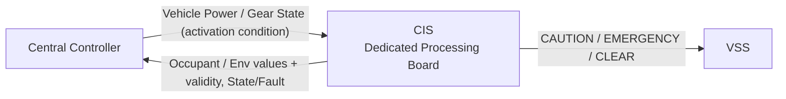
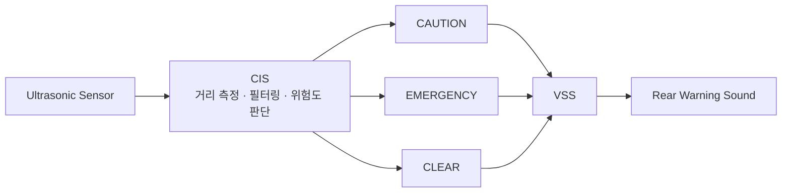

# CIS Logical Interface Needs — Pre-Network Draft

> 목적: 통신 설계를 선행하지 않고, CIS SysRS에서 필요한 **정보 교환 항목만 보존**한다.  
> 이 문서는 CAN Matrix 또는 Protocol Specification이 아니다.

---

## 1. Logical Interface Overview

> 현재 단계에서는 정보의 **의미와 방향**만 정의한다.  
> 실제 프로토콜, 메시지 ID, 주기 및 Payload는 전체 기능 취합 후 결정한다.

## 2. CIS → External

| Information Need | Purpose | Consumer | Protocol |
|---|---|---|---|
| 탑승자 존재 여부 | 실내 상태 파악 | Central Controller | Deferred |
| 탑승자 인원수 | 실내 상태 파악 | Central Controller | Deferred |
| 실내 온도 | 공조 등 상위 기능 활용 | Central Controller | Deferred |
| 실내 습도 | 공조 등 상위 기능 활용 | Central Controller | Deferred |
| 조도 | 조명 등 상위 기능 활용 | Central Controller | Deferred |
| 후방 물체 주의 상태 | 후방 주의 경고 시작 | VSS | Deferred |
| 후방 물체 긴급 상태 | 후방 긴급 경고로 전환 | VSS | Deferred |
| 후방 위험 해제 상태 | 후방 경고 종료 | VSS | Deferred |
| 각 정보의 유효 여부 | 신뢰도 판단 | Central Controller / VSS | Deferred |
| CIS 상태(`READY`/`ACTIVE`/`FAULT`) | 상위 진단 | Central Controller | Deferred |

### 후방 근접 정보 경계

- 초음파 거리 Raw Data를 VSS가 직접 판정하는 구조를 기본으로 하지 않는다.
- 거리 임계값 및 위험도 판정은 CIS에서 정의한다.
- VSS는 `주의 / 긴급 / 해제` 의미 상태만 필요로 한다 (VSS Logical Interface Needs §2 참조).

---

## 3. External → CIS

| Information Need | Purpose | Source | Protocol |
|---|---|---|---|
| 차량 전원 상태 | 센싱 기능 활성/비활성 조건 판단 | Central Controller | Deferred |
| 차량 후진 기어 상태 | 후방 근접 감지 활성 조건 판단 (필요 여부 TBD) | Central Controller | Deferred |

---

## 4. 인터페이스 설계 원칙

- 센서 Raw Data보다 의미가 확정된 상태를 우선 전달한다.
- 상대 시스템이 CIS 내부 비전 모델·필터링 로직을 알 필요가 없도록 한다.
- CIS는 후방 근접 위험 의미 상태를 VSS가 정의한 이벤트 이름과 동일하게 유지한다.
- 실내 영상 원본은 어떤 외부 인터페이스로도 노출하지 않는다.
- 같은 의미의 상태를 여러 메시지로 중복 정의하지 않는다.
- 실제 주기 및 Timeout은 기능별 필요 반응시간과 전체 Bus Load를 보고 결정한다.

---

## 5. 아직 만들지 않는 것

| Item | Current Status |
|---|---|
| CAN ID / Signal ID | NOT DEFINED |
| DLC / Bit Position | NOT DEFINED |
| Period / Timeout | NOT DEFINED |
| Alive Counter / CRC / E2E | NOT DEFINED |
| Bit Rate | NOT DEFINED |
| 중앙처리장치 연결 물리 포트 (LPUART0/LPUART2 등) 배정 | NOT DEFINED |
| Rear caution distance (최종값) | NOT DEFINED |
| Rear emergency distance (최종값) | NOT DEFINED |
| 초음파 센서 모델 | NOT DEFINED |
