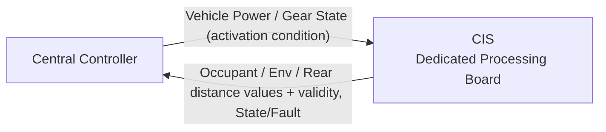
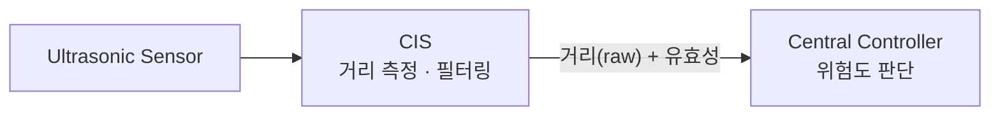

# CIS Logical Interface Needs — Pre-Network Draft

> 목적: 통신 설계를 선행하지 않고, CIS SysRS에서 필요한 **정보 교환 항목만 보존**한다.  
> 이 문서는 CAN Matrix 또는 Protocol Specification이 아니다.

---

## 1. Logical Interface Overview

> 현재 단계에서는 정보의 **의미와 방향**만 정의한다.  
> 실제 프로토콜, 메시지 ID, 주기 및 Payload는 전체 기능 취합 후 결정한다.  
> CIS의 인터페이스 대상은 중앙처리장치 하나뿐이다. 후방 근접 위험 상태를 VSS 등 다른 기능이 필요로 하는 경우,
> 그 전달은 중앙처리장치가 담당하며 본 문서의 범위 밖이다.

## 2. CIS → External

| Information Need | Purpose | Consumer | Protocol |
|---|---|---|---|
| 탑승자 존재 여부 | 실내 상태 파악 | Central Controller | Deferred |
| 탑승자 인원수 | 실내 상태 파악 | Central Controller | Deferred |
| 실내 온도 | 공조 등 상위 기능 활용 | Central Controller | Deferred |
| 실내 습도 | 공조 등 상위 기능 활용 | Central Controller | Deferred |
| 조도 | 조명 등 상위 기능 활용 | Central Controller | Deferred |
| 후방 물체 거리 (raw) | 중앙처리장치의 근접 위험 수준 판단에 사용 | Central Controller | Deferred |
| 각 정보의 유효 여부 | 중앙처리장치의 신뢰도 판단에 사용 | Central Controller | Deferred |
| CIS 상태(`READY`/`ACTIVE`/`FAULT`) | 상위 진단 | Central Controller | Deferred |

### 후방 근접 정보 경계

- CIS는 거리를 측정하고 필터링하여 raw 값과 유효성만 제공한다.
- 거리 임계값 및 위험도 판단(주의/긴급/해제 등)은 중앙처리장치가 수행한다.
- 판단된 위험 상태를 VSS 등 다른 기능에 전달하는 것은 중앙처리장치의 역할이며, CIS의 인터페이스 범위 밖이다.

---

## 3. External → CIS

| Information Need | Purpose | Source | Protocol | Status |
|---|---|---|---|---|
| 차량 전원 상태 (`VEHICLE_POWER_PERMISSION`) | 후방 감지 및 센싱 기능 활성/비활성 판단 (단일 활성 조건) | Central Controller | Deferred | `BASELINE` |
| 차량 후진 기어 상태 (`REVERSE_GEAR_STATE`) | CIS 입력으로 사용하지 않음 (Central 전담 판단) | - | - | `EXCLUDED` |
| 별도 활성 명령 (`REAR_SENSING_ENABLE`) | CIS 입력으로 사용하지 않음 (전원 허용 시 상시 센싱) | - | - | `NOT REQUIRED` |

> CIS는 유효한 차량 전원 허용 상태에서 후방 감지를 상시 수행하여 Central Controller에 제공한다.  
> 차량 기어(R단 여부)에 따른 후방 경고 활용 및 VSS 전달 여부는 Central Controller가 전담하여 판단한다.

---

## 4. 인터페이스 설계 원칙

- 센서 Raw Data라도 그 값을 실제로 필요로 하는 소비자(중앙처리장치)가 있는 경우에는 유효성과 함께 전달한다.
- 상대 시스템이 CIS 내부 비전 모델·필터링 로직을 알 필요가 없도록 한다.
- 실내 영상 원본은 어떤 외부 인터페이스로도 노출하지 않는다.
- 같은 의미의 상태를 여러 메시지로 중복 정의하지 않는다.
- 실제 주기 및 Timeout은 기능별 필요 반응시간과 전체 Bus Load를 보고 결정한다.

---

## 5. 아직 만들지 않는 것

| Item | Current Status |
|---|---|
| CAN ID / Signal ID | NOT DEFINED |
| DLC / Bit Position | NOT DEFINED |
| Period / Timeout | NOT DEFINED |
| Alive Counter / CRC / E2E | NOT DEFINED |
| Bit Rate | NOT DEFINED |
| 중앙처리장치 연결 물리 포트 (LPUART0/LPUART2 등) 배정 | NOT DEFINED |
| 초음파 센서 모델 | NOT DEFINED |

> 후방 근접 위험 임계값(주의/긴급 거리 등)은 중앙처리장치가 정의할 항목이며, 본 CIS 문서의 범위 밖이다.
