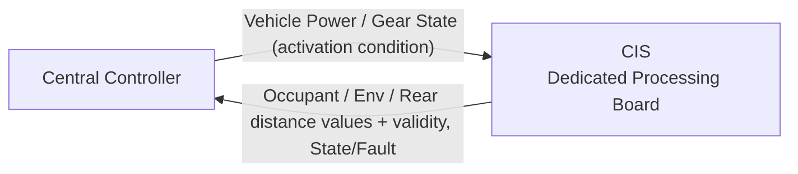
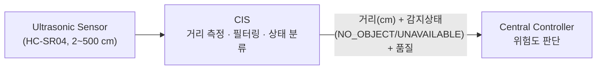

# CIS Logical Interface Needs — Pre-Network Draft

> 목적: 통신 설계를 선행하지 않고, CIS SysRS에서 필요한 **정보 교환 항목만 보존**한다.  
> 이 문서는 CAN Matrix 또는 Protocol Specification이 아니다.

---

## 1. Logical Interface Overview

> 현재 단계에서는 정보의 **의미와 방향**만 정의한다.  
> 실제 프로토콜, 메시지 ID, 주기 및 Payload는 전체 기능 취합 후 결정한다.  
> CIS의 인터페이스 대상은 중앙처리장치 하나뿐이다. 후방 근접 위험 상태를 VSS 등 다른 기능이 필요로 하는 경우,
> 그 전달은 중앙처리장치가 담당하며 본 문서의 범위 밖이다.

## 2. CIS → External

| Information Need | Semantic Value | Details / Value Range | Purpose | Consumer | Protocol |
|---|---|---|---|---|---|
| 탑승자 존재 여부 | `OCCUPANT_PRESENCE` | `PRESENT` / `ABSENT` / `UNKNOWN` | 실내 상태 파악 | Central Controller | Deferred |
| 탑승자 인원수 | `OCCUPANT_COUNT` | `0 ~ 5명` (존재 여부와 동일 시퀀스 연계) | 실내 상태 파악 | Central Controller | Deferred |
| 실내 온도 | `CABIN_TEMPERATURE` | 물리 측정값 (°C) | 공조 등 상위 기능 활용 | Central Controller | Deferred |
| 실내 습도 | `CABIN_HUMIDITY` | 물리 측정값 (%) | 공조 등 상위 기능 활용 | Central Controller | Deferred |
| 조도 | `CABIN_ILLUMINANCE` | 물리 측정값 (lx) | 조명 등 상위 기능 활용 | Central Controller | Deferred |
| 후방 물체 거리 | `REAR_DISTANCE` | cm 단위 (HC-SR04 기반, 후보: 10~100 cm) | 근접 위험 수준 판단용 | Central Controller | Deferred |
| 후방 감지 상태 | `PROXIMITY_STATUS` | `VALID_DISTANCE` / `NO_OBJECT` / `UNAVAILABLE` / `INACTIVE` / `FAULT` | 정상 무장애와 측정 실패 구분 | Central Controller | Deferred |
| 정보 유효 여부 | `VALIDITY` | `VALID` / `INVALID` (항목별 제공) | 신뢰도 판단에 사용 | Central Controller | Deferred |
| 품질 사유 | `QUALITY_REASON` | `NOT_READY`, `OUT_OF_RANGE`, `SENSOR_FAULT`, `VISION_FAULT`, `STALE`, `NO_DATA` | 유효하지 않은 원인 파악 | Central Controller | Deferred |
| 원본 시점 / 경과 시간 | `SOURCE_TIMESTAMP` / `AGE` | 시점 타임스탬프 또는 경과 시간 (ms) | 최신성 및 신규 데이터 판별 | Central Controller | Deferred |
| 갱신 식별자 | `UPDATE_SEQUENCE` | 순차 카운터 / Sequence ID | 판정 회차 일관성 및 재전달 판별 | Central Controller | Deferred |
| 모듈 전체 상태 | `CIS_STATE` | `STARTUP` / `READY` / `ACTIVE` / `FAULT` | 상위 진단 및 전원/초기화 확인 | Central Controller | Deferred |
| 기능별 상태 | `FUNCTION_STATUS` | 영역별 `READY` / `VALID` / `UNAVAILABLE` / `FAULT` / `RECOVERING` | 개별 센서/비전 고장 파악 | Central Controller | Deferred |
| 제공 경로 상태 | `INTERFACE_STATUS` | `AVAILABLE` / `DEGRADED` / `UNAVAILABLE` | 통신 연결 가용성 확인 | Central Controller | Deferred |

### 후방 근접 정보 경계

- CIS는 거리를 측정하고 필터링하여 raw/filtered 값과 유효성, 그리고 정상 무장애(`NO_OBJECT`)와 센서 실패(`UNAVAILABLE`) 구분을 제공한다.
- 거리 임계값 및 위험도 판단(주의/긴급/해제 등)은 중앙처리장치가 수행한다.
- 판단된 위험 상태를 VSS 등 다른 기능에 전달하는 것은 중앙처리장치의 역할이며, CIS의 인터페이스 범위 밖이다.

---

## 3. External → CIS

| Information Need | Purpose | Source | Protocol |
|---|---|---|---|
| 차량 전원 상태 | 센싱 기능 활성/비활성 조건 판단 | Central Controller | Deferred |
| 차량 후진 기어 상태 | 후방 근접 감지 활성 조건 판단 (선택 구성) | Central Controller | Deferred |

---

## 4. 인터페이스 설계 원칙

- 센서 Raw Data라도 그 값을 실제로 필요로 하는 소비자(중앙처리장치)가 있는 경우에는 유효성과 함께 전달한다.
- 상대 시스템이 CIS 내부 비전 모델·필터링 로직을 알 필요가 없도록 한다.
- 실내 영상 원본은 어떤 외부 인터페이스로도 노출하지 않는다.
- 같은 의미의 상태를 여러 메시지로 중복 정의하지 않는다.
- 실제 주기 및 Timeout은 기능별 필요 반응시간과 전체 Bus Load를 보고 결정한다.

---

## 5. 아직 만들지 않는 것

| Item | Current Status |
|---|---|
| CAN ID / Signal ID | NOT DEFINED |
| DLC / Bit Position | NOT DEFINED |
| Period / Timeout | NOT DEFINED |
| Alive Counter / CRC / E2E | NOT DEFINED |
| Bit Rate | NOT DEFINED |
| 중앙처리장치 연결 물리 포트 (LPUART0/LPUART2 등) 배정 | NOT DEFINED |
| 초음파 센서 모델 | **DEFINED (HC-SR04, 물리 범위 2~500 cm)** |
| 후방 유효 관측 범위 및 센서 필터 파라미터 | TBD (후보: 10~100 cm, 벤치 검증 후 확정) |

> 후방 근접 위험 임계값(주의/긴급 거리 등)은 중앙처리장치가 정의할 항목이며, 본 CIS 문서의 범위 밖이다.
