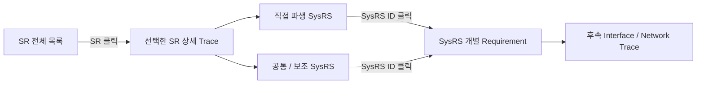

# CIS SR → SysRS Traceability — Navigation Draft

> 목적: **SR 전체 확인 → 특정 SR 선택 → 해당 SR에서 파생된 SysRS 확인** 흐름으로 추적한다.  
> `TR-SR-xxx`는 추적 문서 내부의 탐색용 Reference이며 **SR 원문에 부여하는 공식 요구사항 ID가 아니다.**  
> 상단 SR 문구는 SR Baseline의 표현을 그대로 사용한다.

## Trace Navigation Overview

## 1. SR 전체 목록

특정 항목을 클릭하면 아래의 해당 **SR → SysRS 상세 추적** 위치로 이동한다.

- 추적 Reference: **40개**
- Functional SR: **28개**
- Boundary: **8개**
- Scope: **4개**

### 3. 기능 경계

- [`BOUNDARY` TR-SR-001](#tr-sr-001) — CIS는 엔진룸 대상 동물의 진입 여부를 판정하지 않는다.
- [`BOUNDARY` TR-SR-002](#tr-sr-002) — CIS는 후방 위험 상태에 대응하는 음향을 직접 재생하지 않는다.
- [`BOUNDARY` TR-SR-003](#tr-sr-003) — CIS는 도어 잠금, 파워윈도우 등 차량 액추에이터를 직접 제어하지 않는다.
- [`BOUNDARY` TR-SR-004](#tr-sr-004) — CIS는 확정된 판정 결과와 측정값을 중앙처리장치 및 VSS가 활용할 수 있도록 제공해야 한다.

### 4. 탑승자 인식 요구사항

- [`FUNCTIONAL` TR-SR-005](#tr-sr-005) — 시스템은 실내 영상을 이용하여 탑승자 존재 여부를 판정해야 한다.
- [`FUNCTIONAL` TR-SR-006](#tr-sr-006) — 시스템은 실내 영상을 이용하여 탑승자 인원수를 판정해야 한다.
- [`FUNCTIONAL` TR-SR-007](#tr-sr-007) — 시스템은 탑승자 판정 결과의 유효 여부를 구분해야 한다.
- [`FUNCTIONAL` TR-SR-008](#tr-sr-008) — 시스템은 비전 정보를 신뢰할 수 있기 전에는 해당 정보에 기반한 판정 결과를 확정하지 않아야 한다.
- [`FUNCTIONAL` TR-SR-009](#tr-sr-009) — 시스템은 비전 오류의 복구 조건이 충족되기 전에는 탑승자 상태를 정상으로 확정하지 않아야 한다.
- [`FUNCTIONAL` TR-SR-010](#tr-sr-010) — 시스템은 실내 영상을 탑승자 인식 목적 범위를 벗어나 저장하거나 외부로 전송하지 않아야 한다.

### 5. 실내 환경 센싱 요구사항

- [`FUNCTIONAL` TR-SR-011](#tr-sr-011) — 시스템은 실내 온도를 측정해야 한다.
- [`FUNCTIONAL` TR-SR-012](#tr-sr-012) — 시스템은 실내 습도를 측정해야 한다.
- [`FUNCTIONAL` TR-SR-013](#tr-sr-013) — 시스템은 조도를 측정해야 한다.
- [`FUNCTIONAL` TR-SR-014](#tr-sr-014) — 시스템은 측정 정보의 유효 여부를 구분해야 한다.
- [`FUNCTIONAL` TR-SR-015](#tr-sr-015) — 시스템은 센서 정보를 신뢰할 수 있기 전에는 해당 정보에 기반한 값을 확정하지 않아야 한다.
- [`FUNCTIONAL` TR-SR-016](#tr-sr-016) — 시스템은 센서 오류의 복구 조건이 충족되기 전에는 측정값을 정상으로 확정하지 않아야 한다.

### 6. 후방 근접 감지 요구사항

- [`FUNCTIONAL` TR-SR-017](#tr-sr-017) — 시스템은 후방 물체와의 거리를 측정해야 한다.
- [`FUNCTIONAL` TR-SR-018](#tr-sr-018) — 시스템은 거리 측정 정보의 유효 여부를 구분해야 한다.
- [`FUNCTIONAL` TR-SR-019](#tr-sr-019) — 시스템은 물체와의 거리가 정의된 기준 이내인 경우 근접 위험 상태를 판단해야 한다.
- [`FUNCTIONAL` TR-SR-020](#tr-sr-020) — 시스템은 근접 위험 수준이 높아지는 경우 이를 구분되는 상태로 제공해야 한다.
- [`FUNCTIONAL` TR-SR-021](#tr-sr-021) — 시스템은 물체가 정의된 기준 거리 밖으로 벗어난 경우 근접 위험 상태를 해제해야 한다.
- [`FUNCTIONAL` TR-SR-022](#tr-sr-022) — 시스템은 거리 측정 정보를 신뢰할 수 있기 전에는 근접 위험 상태를 확정하지 않아야 한다.

### 7. 데이터 유효성 및 오류 요구사항

- [`FUNCTIONAL` TR-SR-023](#tr-sr-023) — 시스템은 센서 입력이 유효 범위를 벗어난 경우 해당 정보를 정상 정보로 사용하지 않아야 한다.
- [`FUNCTIONAL` TR-SR-024](#tr-sr-024) — 시스템은 실내 영상 품질이 인식 기준을 만족하지 못하는 경우 해당 판정 결과를 정상 정보로 사용하지 않아야 한다.
- [`FUNCTIONAL` TR-SR-025](#tr-sr-025) — 시스템은 특정 센서 또는 비전 기능에 오류가 발생하더라도, 오류와 무관한 다른 판정·측정 기능을 불필요하게 중단하지 않아야 한다.
- [`FUNCTIONAL` TR-SR-026](#tr-sr-026) — 시스템은 통신 오류 동안 마지막 정상 값을 현재 정상 값으로 표시하지 않아야 한다.

### 8. 중앙처리장치 및 VSS 연계 요구사항

- [`FUNCTIONAL` TR-SR-027](#tr-sr-027) — 시스템은 유효한 탑승자 판정 결과 및 환경 측정값을 중앙처리장치로 전송해야 한다.
- [`FUNCTIONAL` TR-SR-028](#tr-sr-028) — 시스템은 판정 결과 및 측정값을 정의된 주기로 갱신하여 제공해야 한다.
- [`FUNCTIONAL` TR-SR-029](#tr-sr-029) — 시스템은 판정 결과 및 측정값과 함께 해당 값의 유효 여부를 함께 제공해야 한다.
- [`FUNCTIONAL` TR-SR-030](#tr-sr-030) — 시스템은 통신 오류가 발생한 경우 해당 오류 상태를 상위 시스템이 식별할 수 있도록 제공해야 한다.
- [`FUNCTIONAL` TR-SR-031](#tr-sr-031) — 시스템은 통신 오류가 해제되고 새로운 유효 값이 확인된 경우에만 정상 전송을 재개해야 한다.
- [`FUNCTIONAL` TR-SR-032](#tr-sr-032) — 시스템은 근접 위험 상태를 VSS가 활용 가능한 의미 상태(주의 / 긴급 / 해제)로 제공해야 한다.

### 9. 기능 제외 범위

- [`SCOPE` TR-SR-033](#tr-sr-033) — 엔진룸 카메라 기반 대상 동물 진입 판정
- [`SCOPE` TR-SR-034](#tr-sr-034) — 후방 위험 상태에 대응하는 음향 출력 및 재생 (VSS 담당)
- [`SCOPE` TR-SR-035](#tr-sr-035) — 도어 잠금, 파워윈도우 등 차량 액추에이터 제어
- [`SCOPE` TR-SR-036](#tr-sr-036) — 후방 장애물의 실제 거리값 및 임계값을 VSS 등 외부에 직접 노출하는 것

### 10. 상위 시스템 연계 원칙

- [`BOUNDARY` TR-SR-037](#tr-sr-037) — CIS는 센서 원시 데이터 및 영상을 직접 외부로 노출하지 않아야 한다.
- [`BOUNDARY` TR-SR-038](#tr-sr-038) — CIS의 후방 위험 의미 상태는 VSS가 정의한 의미 이벤트 체계와 일치해야 한다.
- [`BOUNDARY` TR-SR-039](#tr-sr-039) — CIS의 세부 인식·센싱 처리 방법은 상위 차량 기능이 직접 제어하지 않아야 한다.
- [`BOUNDARY` TR-SR-040](#tr-sr-040) — CIS의 상태 및 오류는 상위 차량 시스템에서 활용 가능해야 한다.

---

## 2. SR 상세 Trace

### TR-SR-001 · 3. 기능 경계

**분류:** `BOUNDARY`  
**Trace 상태:** `COVERED`

**SR 원문**

> CIS는 엔진룸 대상 동물의 진입 여부를 판정하지 않는다.

**직접 파생 SysRS**

- [CIS-SYS-FUN-028](./02_CIS_SYSRS_FUNCTIONAL_BASELINE_DRAFT.md#cis-sys-fun-028) — CIS는 엔진룸 대상 동물의 진입 여부를 판정하지 않아야 한다.

[↑ SR 전체 목록으로](#sr-index)

---

### TR-SR-002 · 3. 기능 경계

**분류:** `BOUNDARY`  
**Trace 상태:** `COVERED`

**SR 원문**

> CIS는 후방 위험 상태에 대응하는 음향을 직접 재생하지 않는다.

**직접 파생 SysRS**

- [CIS-SYS-INT-005](./02_CIS_SYSRS_FUNCTIONAL_BASELINE_DRAFT.md#cis-sys-int-005) — CIS는 후방 근접 위험 의미 상태(`CAUTION`/`EMERGENCY`/`CLEAR`)를 VSS가 확인할 수 있도록 제공해야 한다.

**공통 / 보조 SysRS**

- [CIS-SYS-FUN-026](./02_CIS_SYSRS_FUNCTIONAL_BASELINE_DRAFT.md#cis-sys-fun-026) — CIS는 `CAUTION`/`EMERGENCY`/`CLEAR` 상태를 VSS가 정의한 의미 이벤트 이름과 일치시켜 제공해야 한다.

[↑ SR 전체 목록으로](#sr-index)

---

### TR-SR-003 · 3. 기능 경계

**분류:** `BOUNDARY`  
**Trace 상태:** `COVERED`

**SR 원문**

> CIS는 도어 잠금, 파워윈도우 등 차량 액추에이터를 직접 제어하지 않는다.

**직접 파생 SysRS**

- [CIS-SYS-SAF-001](./02_CIS_SYSRS_FUNCTIONAL_BASELINE_DRAFT.md#cis-sys-saf-001) — CIS의 오류는 파워윈도우, 공조, 도어 등 다른 차량 기능의 제어 상태를 직접 변경해서는 안 된다.

[↑ SR 전체 목록으로](#sr-index)

---

### TR-SR-004 · 3. 기능 경계

**분류:** `BOUNDARY`  
**Trace 상태:** `COVERED`

**SR 원문**

> CIS는 확정된 판정 결과와 측정값을 중앙처리장치 및 VSS가 활용할 수 있도록 제공해야 한다.

**직접 파생 SysRS**

- [CIS-SYS-INT-003](./02_CIS_SYSRS_FUNCTIONAL_BASELINE_DRAFT.md#cis-sys-int-003) — CIS는 탑승자 존재 여부 및 인원수를 중앙처리장치가 확인할 수 있도록 제공해야 한다.
- [CIS-SYS-INT-004](./02_CIS_SYSRS_FUNCTIONAL_BASELINE_DRAFT.md#cis-sys-int-004) — CIS는 실내 온도·습도·조도 측정값을 중앙처리장치가 확인할 수 있도록 제공해야 한다.
- [CIS-SYS-INT-005](./02_CIS_SYSRS_FUNCTIONAL_BASELINE_DRAFT.md#cis-sys-int-005) — CIS는 후방 근접 위험 의미 상태를 VSS가 확인할 수 있도록 제공해야 한다.

**공통 / 보조 SysRS**

- [CIS-SYS-FUN-022](./02_CIS_SYSRS_FUNCTIONAL_BASELINE_DRAFT.md#cis-sys-fun-022) — CIS는 유효한 탑승자 판정 결과 및 환경 측정값을 정의된 주기로 중앙처리장치에 전송해야 한다.

[↑ SR 전체 목록으로](#sr-index)

---

### TR-SR-005 · 4. 탑승자 인식 요구사항

**분류:** `FUNCTIONAL`  
**Trace 상태:** `COVERED`

**SR 원문**

> 시스템은 실내 영상을 이용하여 탑승자 존재 여부를 판정해야 한다.

**직접 파생 SysRS**

- [CIS-SYS-FUN-003](./02_CIS_SYSRS_FUNCTIONAL_BASELINE_DRAFT.md#cis-sys-fun-003) — CIS는 실내 영상을 이용하여 탑승자 존재 여부를 판정해야 한다.

[↑ SR 전체 목록으로](#sr-index)

---

### TR-SR-006 · 4. 탑승자 인식 요구사항

**분류:** `FUNCTIONAL`  
**Trace 상태:** `COVERED`

**SR 원문**

> 시스템은 실내 영상을 이용하여 탑승자 인원수를 판정해야 한다.

**직접 파생 SysRS**

- [CIS-SYS-FUN-004](./02_CIS_SYSRS_FUNCTIONAL_BASELINE_DRAFT.md#cis-sys-fun-004) — CIS는 실내 영상을 이용하여 탑승자 인원수를 판정해야 한다.

[↑ SR 전체 목록으로](#sr-index)

---

### TR-SR-007 · 4. 탑승자 인식 요구사항

**분류:** `FUNCTIONAL`  
**Trace 상태:** `COVERED`

**SR 원문**

> 시스템은 탑승자 판정 결과의 유효 여부를 구분해야 한다.

**직접 파생 SysRS**

- [CIS-SYS-FUN-005](./02_CIS_SYSRS_FUNCTIONAL_BASELINE_DRAFT.md#cis-sys-fun-005) — CIS는 탑승자 판정 결과의 유효 여부를 구분해야 한다.

[↑ SR 전체 목록으로](#sr-index)

---

### TR-SR-008 · 4. 탑승자 인식 요구사항

**분류:** `FUNCTIONAL`  
**Trace 상태:** `COVERED`

**SR 원문**

> 시스템은 비전 정보를 신뢰할 수 있기 전에는 해당 정보에 기반한 판정 결과를 확정하지 않아야 한다.

**직접 파생 SysRS**

- [CIS-SYS-FUN-006](./02_CIS_SYSRS_FUNCTIONAL_BASELINE_DRAFT.md#cis-sys-fun-006) — CIS는 비전 정보를 신뢰할 수 있기 전에는 해당 정보에 기반한 판정 결과를 확정하지 않아야 한다.

[↑ SR 전체 목록으로](#sr-index)

---

### TR-SR-009 · 4. 탑승자 인식 요구사항

**분류:** `FUNCTIONAL`  
**Trace 상태:** `COVERED`

**SR 원문**

> 시스템은 비전 오류의 복구 조건이 충족되기 전에는 탑승자 상태를 정상으로 확정하지 않아야 한다.

**직접 파생 SysRS**

- [CIS-SYS-FUN-007](./02_CIS_SYSRS_FUNCTIONAL_BASELINE_DRAFT.md#cis-sys-fun-007) — CIS는 비전 오류의 복구 조건이 충족되기 전에는 탑승자 상태를 정상으로 확정하지 않아야 한다.

[↑ SR 전체 목록으로](#sr-index)

---

### TR-SR-010 · 4. 탑승자 인식 요구사항

**분류:** `FUNCTIONAL`  
**Trace 상태:** `COVERED`

**SR 원문**

> 시스템은 실내 영상을 탑승자 인식 목적 범위를 벗어나 저장하거나 외부로 전송하지 않아야 한다.

**직접 파생 SysRS**

- [CIS-SYS-FUN-027](./02_CIS_SYSRS_FUNCTIONAL_BASELINE_DRAFT.md#cis-sys-fun-027) — CIS는 실내 영상을 탑승자 인식 목적 범위를 벗어나 저장하거나 외부로 전송하지 않아야 한다.

**공통 / 보조 SysRS**

- [CIS-SYS-SAF-004](./02_CIS_SYSRS_FUNCTIONAL_BASELINE_DRAFT.md#cis-sys-saf-004) — CIS는 실내 영상 원본을 어떠한 외부 인터페이스로도 노출해서는 안 된다.

[↑ SR 전체 목록으로](#sr-index)

---

### TR-SR-011 · 5. 실내 환경 센싱 요구사항

**분류:** `FUNCTIONAL`  
**Trace 상태:** `COVERED`

**SR 원문**

> 시스템은 실내 온도를 측정해야 한다.

**직접 파생 SysRS**

- [CIS-SYS-FUN-008](./02_CIS_SYSRS_FUNCTIONAL_BASELINE_DRAFT.md#cis-sys-fun-008) — CIS는 실내 온도를 측정해야 한다.

[↑ SR 전체 목록으로](#sr-index)

---

### TR-SR-012 · 5. 실내 환경 센싱 요구사항

**분류:** `FUNCTIONAL`  
**Trace 상태:** `COVERED`

**SR 원문**

> 시스템은 실내 습도를 측정해야 한다.

**직접 파생 SysRS**

- [CIS-SYS-FUN-009](./02_CIS_SYSRS_FUNCTIONAL_BASELINE_DRAFT.md#cis-sys-fun-009) — CIS는 실내 습도를 측정해야 한다.

[↑ SR 전체 목록으로](#sr-index)

---

### TR-SR-013 · 5. 실내 환경 센싱 요구사항

**분류:** `FUNCTIONAL`  
**Trace 상태:** `COVERED`

**SR 원문**

> 시스템은 조도를 측정해야 한다.

**직접 파생 SysRS**

- [CIS-SYS-FUN-010](./02_CIS_SYSRS_FUNCTIONAL_BASELINE_DRAFT.md#cis-sys-fun-010) — CIS는 조도를 측정해야 한다.

[↑ SR 전체 목록으로](#sr-index)

---

### TR-SR-014 · 5. 실내 환경 센싱 요구사항

**분류:** `FUNCTIONAL`  
**Trace 상태:** `COVERED`

**SR 원문**

> 시스템은 측정 정보의 유효 여부를 구분해야 한다.

**직접 파생 SysRS**

- [CIS-SYS-FUN-011](./02_CIS_SYSRS_FUNCTIONAL_BASELINE_DRAFT.md#cis-sys-fun-011) — CIS는 환경 측정 정보의 유효 여부를 구분해야 한다.

[↑ SR 전체 목록으로](#sr-index)

---

### TR-SR-015 · 5. 실내 환경 센싱 요구사항

**분류:** `FUNCTIONAL`  
**Trace 상태:** `COVERED`

**SR 원문**

> 시스템은 센서 정보를 신뢰할 수 있기 전에는 해당 정보에 기반한 값을 확정하지 않아야 한다.

**직접 파생 SysRS**

- [CIS-SYS-FUN-012](./02_CIS_SYSRS_FUNCTIONAL_BASELINE_DRAFT.md#cis-sys-fun-012) — CIS는 센서 정보를 신뢰할 수 있기 전에는 해당 정보에 기반한 값을 확정하지 않아야 한다.

[↑ SR 전체 목록으로](#sr-index)

---

### TR-SR-016 · 5. 실내 환경 센싱 요구사항

**분류:** `FUNCTIONAL`  
**Trace 상태:** `COVERED`

**SR 원문**

> 시스템은 센서 오류의 복구 조건이 충족되기 전에는 측정값을 정상으로 확정하지 않아야 한다.

**직접 파생 SysRS**

- [CIS-SYS-FUN-013](./02_CIS_SYSRS_FUNCTIONAL_BASELINE_DRAFT.md#cis-sys-fun-013) — CIS는 센서 오류의 복구 조건이 충족되기 전에는 측정값을 정상으로 확정하지 않아야 한다.

[↑ SR 전체 목록으로](#sr-index)

---

### TR-SR-017 · 6. 후방 근접 감지 요구사항

**분류:** `FUNCTIONAL`  
**Trace 상태:** `COVERED`

**SR 원문**

> 시스템은 후방 물체와의 거리를 측정해야 한다.

**직접 파생 SysRS**

- [CIS-SYS-FUN-014](./02_CIS_SYSRS_FUNCTIONAL_BASELINE_DRAFT.md#cis-sys-fun-014) — CIS는 후방 물체와의 거리를 측정해야 한다.

[↑ SR 전체 목록으로](#sr-index)

---

### TR-SR-018 · 6. 후방 근접 감지 요구사항

**분류:** `FUNCTIONAL`  
**Trace 상태:** `COVERED`

**SR 원문**

> 시스템은 거리 측정 정보의 유효 여부를 구분해야 한다.

**직접 파생 SysRS**

- [CIS-SYS-FUN-015](./02_CIS_SYSRS_FUNCTIONAL_BASELINE_DRAFT.md#cis-sys-fun-015) — CIS는 거리 측정 정보의 유효 여부를 구분해야 한다.

[↑ SR 전체 목록으로](#sr-index)

---

### TR-SR-019 · 6. 후방 근접 감지 요구사항

**분류:** `FUNCTIONAL`  
**Trace 상태:** `COVERED`

**SR 원문**

> 시스템은 물체와의 거리가 정의된 기준 이내인 경우 근접 위험 상태를 판단해야 한다.

**직접 파생 SysRS**

- [CIS-SYS-FUN-016](./02_CIS_SYSRS_FUNCTIONAL_BASELINE_DRAFT.md#cis-sys-fun-016) — CIS는 물체와의 거리가 정의된 주의 임계값 이내인 경우 `CAUTION` 상태를 판단해야 한다.
- [CIS-SYS-FUN-017](./02_CIS_SYSRS_FUNCTIONAL_BASELINE_DRAFT.md#cis-sys-fun-017) — CIS는 물체와의 거리가 정의된 긴급 임계값 이내인 경우 `EMERGENCY` 상태를 판단해야 한다.

[↑ SR 전체 목록으로](#sr-index)

---

### TR-SR-020 · 6. 후방 근접 감지 요구사항

**분류:** `FUNCTIONAL`  
**Trace 상태:** `COVERED`

**SR 원문**

> 시스템은 근접 위험 수준이 높아지는 경우 이를 구분되는 상태로 제공해야 한다.

**직접 파생 SysRS**

- [CIS-SYS-FUN-017](./02_CIS_SYSRS_FUNCTIONAL_BASELINE_DRAFT.md#cis-sys-fun-017) — CIS는 물체와의 거리가 정의된 긴급 임계값 이내인 경우 `EMERGENCY` 상태를 판단해야 한다.

**공통 / 보조 SysRS**

- [CIS-SYS-FUN-016](./02_CIS_SYSRS_FUNCTIONAL_BASELINE_DRAFT.md#cis-sys-fun-016) — CIS는 물체와의 거리가 정의된 주의 임계값 이내인 경우 `CAUTION` 상태를 판단해야 한다.
- [CIS-SYS-SAF-003](./02_CIS_SYSRS_FUNCTIONAL_BASELINE_DRAFT.md#cis-sys-saf-003) — CIS는 정상적인 탑승자/환경/근접 정보를 제공할 수 없는 경우 해당 상태가 외부 시스템에서 식별 가능해야 한다.

[↑ SR 전체 목록으로](#sr-index)

---

### TR-SR-021 · 6. 후방 근접 감지 요구사항

**분류:** `FUNCTIONAL`  
**Trace 상태:** `COVERED`

**SR 원문**

> 시스템은 물체가 정의된 기준 거리 밖으로 벗어난 경우 근접 위험 상태를 해제해야 한다.

**직접 파생 SysRS**

- [CIS-SYS-FUN-018](./02_CIS_SYSRS_FUNCTIONAL_BASELINE_DRAFT.md#cis-sys-fun-018) — CIS는 물체가 정의된 기준 거리 밖으로 벗어난 경우 `CLEAR` 상태로 전이해야 한다.

[↑ SR 전체 목록으로](#sr-index)

---

### TR-SR-022 · 6. 후방 근접 감지 요구사항

**분류:** `FUNCTIONAL`  
**Trace 상태:** `COVERED`

**SR 원문**

> 시스템은 거리 측정 정보를 신뢰할 수 있기 전에는 근접 위험 상태를 확정하지 않아야 한다.

**직접 파생 SysRS**

- [CIS-SYS-FUN-019](./02_CIS_SYSRS_FUNCTIONAL_BASELINE_DRAFT.md#cis-sys-fun-019) — CIS는 거리 측정 정보를 신뢰할 수 있기 전에는 `CAUTION`/`EMERGENCY` 상태를 확정하지 않아야 한다.

**공통 / 보조 SysRS**

- [CIS-SYS-SAF-002](./02_CIS_SYSRS_FUNCTIONAL_BASELINE_DRAFT.md#cis-sys-saf-002) — CIS는 신뢰할 수 없는 근접 감지 정보를 근거로 `EMERGENCY` 상태를 확정해서는 안 된다.

[↑ SR 전체 목록으로](#sr-index)

---

### TR-SR-023 · 7. 데이터 유효성 및 오류 요구사항

**분류:** `FUNCTIONAL`  
**Trace 상태:** `COVERED`

**SR 원문**

> 시스템은 센서 입력이 유효 범위를 벗어난 경우 해당 정보를 정상 정보로 사용하지 않아야 한다.

**직접 파생 SysRS**

- [CIS-SYS-FUN-012](./02_CIS_SYSRS_FUNCTIONAL_BASELINE_DRAFT.md#cis-sys-fun-012) — CIS는 센서 정보를 신뢰할 수 있기 전에는 해당 정보에 기반한 값을 확정하지 않아야 한다.
- [CIS-SYS-FUN-019](./02_CIS_SYSRS_FUNCTIONAL_BASELINE_DRAFT.md#cis-sys-fun-019) — CIS는 거리 측정 정보를 신뢰할 수 있기 전에는 `CAUTION`/`EMERGENCY` 상태를 확정하지 않아야 한다.

[↑ SR 전체 목록으로](#sr-index)

---

### TR-SR-024 · 7. 데이터 유효성 및 오류 요구사항

**분류:** `FUNCTIONAL`  
**Trace 상태:** `COVERED`

**SR 원문**

> 시스템은 실내 영상 품질이 인식 기준을 만족하지 못하는 경우 해당 판정 결과를 정상 정보로 사용하지 않아야 한다.

**직접 파생 SysRS**

- [CIS-SYS-FUN-006](./02_CIS_SYSRS_FUNCTIONAL_BASELINE_DRAFT.md#cis-sys-fun-006) — CIS는 비전 정보를 신뢰할 수 있기 전에는 해당 정보에 기반한 판정 결과를 확정하지 않아야 한다.

**공통 / 보조 SysRS**

- [CIS-SYS-DIA-001](./02_CIS_SYSRS_FUNCTIONAL_BASELINE_DRAFT.md#cis-sys-dia-001) — CIS는 정상 판정·측정을 방해하는 오류를 검출할 수 있어야 한다.

[↑ SR 전체 목록으로](#sr-index)

---

### TR-SR-025 · 7. 데이터 유효성 및 오류 요구사항

**분류:** `FUNCTIONAL`  
**Trace 상태:** `COVERED`

**SR 원문**

> 시스템은 특정 센서 또는 비전 기능에 오류가 발생하더라도, 오류와 무관한 다른 판정·측정 기능을 불필요하게 중단하지 않아야 한다.

**직접 파생 SysRS**

- [CIS-SYS-FUN-020](./02_CIS_SYSRS_FUNCTIONAL_BASELINE_DRAFT.md#cis-sys-fun-020) — CIS는 특정 센서 또는 비전 기능에 오류가 발생하더라도, 오류와 무관한 다른 판정·측정 기능을 불필요하게 중단하지 않아야 한다.

**공통 / 보조 SysRS**

- [CIS-SYS-NFR-003](./02_CIS_SYSRS_FUNCTIONAL_BASELINE_DRAFT.md#cis-sys-nfr-003) — CIS 관련 오류는 다른 차량 기능과 기능적으로 격리되어야 한다.

[↑ SR 전체 목록으로](#sr-index)

---

### TR-SR-026 · 7. 데이터 유효성 및 오류 요구사항

**분류:** `FUNCTIONAL`  
**Trace 상태:** `COVERED`

**SR 원문**

> 시스템은 통신 오류 동안 마지막 정상 값을 현재 정상 값으로 표시하지 않아야 한다.

**직접 파생 SysRS**

- [CIS-SYS-FUN-021](./02_CIS_SYSRS_FUNCTIONAL_BASELINE_DRAFT.md#cis-sys-fun-021) — CIS는 통신 오류 동안 마지막 정상 값을 현재 정상 값으로 표시하지 않아야 한다.

[↑ SR 전체 목록으로](#sr-index)

---

### TR-SR-027 · 8. 중앙처리장치 및 VSS 연계 요구사항

**분류:** `FUNCTIONAL`  
**Trace 상태:** `COVERED`

**SR 원문**

> 시스템은 유효한 탑승자 판정 결과 및 환경 측정값을 중앙처리장치로 전송해야 한다.

**직접 파생 SysRS**

- [CIS-SYS-FUN-022](./02_CIS_SYSRS_FUNCTIONAL_BASELINE_DRAFT.md#cis-sys-fun-022) — CIS는 유효한 탑승자 판정 결과 및 환경 측정값을 정의된 주기로 중앙처리장치에 전송해야 한다.

[↑ SR 전체 목록으로](#sr-index)

---

### TR-SR-028 · 8. 중앙처리장치 및 VSS 연계 요구사항

**분류:** `FUNCTIONAL`  
**Trace 상태:** `COVERED`

**SR 원문**

> 시스템은 판정 결과 및 측정값을 정의된 주기로 갱신하여 제공해야 한다.

**직접 파생 SysRS**

- [CIS-SYS-PER-002](./02_CIS_SYSRS_FUNCTIONAL_BASELINE_DRAFT.md#cis-sys-per-002) — CIS는 탑승자/환경/근접 데이터를 정의된 주기로 갱신하여 제공해야 한다.

**공통 / 보조 SysRS**

- [CIS-SYS-FUN-022](./02_CIS_SYSRS_FUNCTIONAL_BASELINE_DRAFT.md#cis-sys-fun-022) — CIS는 유효한 탑승자 판정 결과 및 환경 측정값을 정의된 주기로 중앙처리장치에 전송해야 한다.

[↑ SR 전체 목록으로](#sr-index)

---

### TR-SR-029 · 8. 중앙처리장치 및 VSS 연계 요구사항

**분류:** `FUNCTIONAL`  
**Trace 상태:** `COVERED`

**SR 원문**

> 시스템은 판정 결과 및 측정값과 함께 해당 값의 유효 여부를 함께 제공해야 한다.

**직접 파생 SysRS**

- [CIS-SYS-FUN-023](./02_CIS_SYSRS_FUNCTIONAL_BASELINE_DRAFT.md#cis-sys-fun-023) — CIS는 전송하는 각 값에 대해 유효 여부 플래그를 함께 제공해야 한다.

**공통 / 보조 SysRS**

- [CIS-SYS-INT-006](./02_CIS_SYSRS_FUNCTIONAL_BASELINE_DRAFT.md#cis-sys-int-006) — CIS는 각 제공 정보의 유효 여부를 함께 제공해야 한다.

[↑ SR 전체 목록으로](#sr-index)

---

### TR-SR-030 · 8. 중앙처리장치 및 VSS 연계 요구사항

**분류:** `FUNCTIONAL`  
**Trace 상태:** `COVERED`

**SR 원문**

> 시스템은 통신 오류가 발생한 경우 해당 오류 상태를 상위 시스템이 식별할 수 있도록 제공해야 한다.

**직접 파생 SysRS**

- [CIS-SYS-FUN-024](./02_CIS_SYSRS_FUNCTIONAL_BASELINE_DRAFT.md#cis-sys-fun-024) — CIS는 통신 오류가 발생한 경우 해당 오류 상태를 상위 시스템이 식별할 수 있도록 제공해야 한다.

**공통 / 보조 SysRS**

- [CIS-SYS-INT-007](./02_CIS_SYSRS_FUNCTIONAL_BASELINE_DRAFT.md#cis-sys-int-007) — CIS는 정상/오류 상태를 외부 시스템이 확인할 수 있도록 해야 한다.
- [CIS-SYS-PER-004](./02_CIS_SYSRS_FUNCTIONAL_BASELINE_DRAFT.md#cis-sys-per-004) — CIS는 정의된 연속 누락 횟수를 초과하는 통신 실패를 통신 오류로 판단해야 한다.

[↑ SR 전체 목록으로](#sr-index)

---

### TR-SR-031 · 8. 중앙처리장치 및 VSS 연계 요구사항

**분류:** `FUNCTIONAL`  
**Trace 상태:** `COVERED`

**SR 원문**

> 시스템은 통신 오류가 해제되고 새로운 유효 값이 확인된 경우에만 정상 전송을 재개해야 한다.

**직접 파생 SysRS**

- [CIS-SYS-FUN-025](./02_CIS_SYSRS_FUNCTIONAL_BASELINE_DRAFT.md#cis-sys-fun-025) — CIS는 통신 오류가 해제되고 새로운 유효 값이 확인된 경우에만 정상 전송을 재개해야 한다.

**공통 / 보조 SysRS**

- [CIS-SYS-INT-008](./02_CIS_SYSRS_FUNCTIONAL_BASELINE_DRAFT.md#cis-sys-int-008) — CIS가 오류에서 복구된 경우 외부 시스템이 정상 복귀 여부를 확인할 수 있도록 해야 한다.
- [CIS-SYS-PER-005](./02_CIS_SYSRS_FUNCTIONAL_BASELINE_DRAFT.md#cis-sys-per-005) — 통신 오류 해제 후 CIS가 정상 전송을 재개하기까지의 지연은 제한되어야 한다.

[↑ SR 전체 목록으로](#sr-index)

---

### TR-SR-032 · 8. 중앙처리장치 및 VSS 연계 요구사항

**분류:** `FUNCTIONAL`  
**Trace 상태:** `COVERED`

**SR 원문**

> 시스템은 근접 위험 상태를 VSS가 활용 가능한 의미 상태(주의 / 긴급 / 해제)로 제공해야 한다.

**직접 파생 SysRS**

- [CIS-SYS-FUN-026](./02_CIS_SYSRS_FUNCTIONAL_BASELINE_DRAFT.md#cis-sys-fun-026) — CIS는 `CAUTION`/`EMERGENCY`/`CLEAR` 상태를 VSS가 정의한 의미 이벤트 이름과 일치시켜 제공해야 한다.

**공통 / 보조 SysRS**

- [CIS-SYS-INT-005](./02_CIS_SYSRS_FUNCTIONAL_BASELINE_DRAFT.md#cis-sys-int-005) — CIS는 후방 근접 위험 의미 상태를 VSS가 확인할 수 있도록 제공해야 한다.

[↑ SR 전체 목록으로](#sr-index)

---

### TR-SR-033 · 9. 기능 제외 범위

**분류:** `SCOPE`  
**Trace 상태:** `COVERED`

**SR 원문**

> 엔진룸 카메라 기반 대상 동물 진입 판정

**직접 파생 SysRS**

- [CIS-SYS-FUN-028](./02_CIS_SYSRS_FUNCTIONAL_BASELINE_DRAFT.md#cis-sys-fun-028) — CIS는 엔진룸 대상 동물의 진입 여부를 판정하지 않아야 한다.

[↑ SR 전체 목록으로](#sr-index)

---

### TR-SR-034 · 9. 기능 제외 범위

**분류:** `SCOPE`  
**Trace 상태:** `COVERED`

**SR 원문**

> 후방 위험 상태에 대응하는 음향 출력 및 재생 (VSS 담당)

**직접 파생 SysRS**

- [CIS-SYS-INT-005](./02_CIS_SYSRS_FUNCTIONAL_BASELINE_DRAFT.md#cis-sys-int-005) — CIS는 후방 근접 위험 의미 상태를 VSS가 확인할 수 있도록 제공해야 한다.

[↑ SR 전체 목록으로](#sr-index)

---

### TR-SR-035 · 9. 기능 제외 범위

**분류:** `SCOPE`  
**Trace 상태:** `COVERED`

**SR 원문**

> 도어 잠금, 파워윈도우 등 차량 액추에이터 제어

**직접 파생 SysRS**

- [CIS-SYS-SAF-001](./02_CIS_SYSRS_FUNCTIONAL_BASELINE_DRAFT.md#cis-sys-saf-001) — CIS의 오류는 파워윈도우, 공조, 도어 등 다른 차량 기능의 제어 상태를 직접 변경해서는 안 된다.

[↑ SR 전체 목록으로](#sr-index)

---

### TR-SR-036 · 9. 기능 제외 범위

**분류:** `SCOPE`  
**Trace 상태:** `COVERED`

**SR 원문**

> 후방 장애물의 실제 거리값 및 임계값을 VSS 등 외부에 직접 노출하는 것

**직접 파생 SysRS**

- [CIS-SYS-FUN-026](./02_CIS_SYSRS_FUNCTIONAL_BASELINE_DRAFT.md#cis-sys-fun-026) — CIS는 `CAUTION`/`EMERGENCY`/`CLEAR` 상태를 VSS가 정의한 의미 이벤트 이름과 일치시켜 제공해야 한다.

**참고**

02문서 §6 Candidate Proximity Thresholds — VSS에는 거리 Raw Data가 아닌 3상태(`CAUTION`/`EMERGENCY`/`CLEAR`)만 노출된다.

[↑ SR 전체 목록으로](#sr-index)

---

### TR-SR-037 · 10. 상위 시스템 연계 원칙

**분류:** `BOUNDARY`  
**Trace 상태:** `COVERED`

**SR 원문**

> CIS는 센서 원시 데이터 및 영상을 직접 외부로 노출하지 않아야 한다.

**직접 파생 SysRS**

- [CIS-SYS-SAF-004](./02_CIS_SYSRS_FUNCTIONAL_BASELINE_DRAFT.md#cis-sys-saf-004) — CIS는 실내 영상 원본을 어떠한 외부 인터페이스로도 노출해서는 안 된다.

**공통 / 보조 SysRS**

- [CIS-SYS-FUN-027](./02_CIS_SYSRS_FUNCTIONAL_BASELINE_DRAFT.md#cis-sys-fun-027) — CIS는 실내 영상을 탑승자 인식 목적 범위를 벗어나 저장하거나 외부로 전송하지 않아야 한다.

[↑ SR 전체 목록으로](#sr-index)

---

### TR-SR-038 · 10. 상위 시스템 연계 원칙

**분류:** `BOUNDARY`  
**Trace 상태:** `COVERED`

**SR 원문**

> CIS의 후방 위험 의미 상태는 VSS가 정의한 의미 이벤트 체계와 일치해야 한다.

**직접 파생 SysRS**

- [CIS-SYS-FUN-026](./02_CIS_SYSRS_FUNCTIONAL_BASELINE_DRAFT.md#cis-sys-fun-026) — CIS는 `CAUTION`/`EMERGENCY`/`CLEAR` 상태를 VSS가 정의한 의미 이벤트 이름과 일치시켜 제공해야 한다.

[↑ SR 전체 목록으로](#sr-index)

---

### TR-SR-039 · 10. 상위 시스템 연계 원칙

**분류:** `BOUNDARY`  
**Trace 상태:** `COVERED`

**SR 원문**

> CIS의 세부 인식·센싱 처리 방법은 상위 차량 기능이 직접 제어하지 않아야 한다.

**직접 파생 SysRS**

- [CIS-SYS-NFR-007](./02_CIS_SYSRS_FUNCTIONAL_BASELINE_DRAFT.md#cis-sys-nfr-007) — 실제 통신 프로토콜 변경이 CIS의 판정 로직 자체를 불필요하게 변경시키지 않도록 논리 인터페이스와 통신 구현이 분리 가능해야 한다.

**공통 / 보조 SysRS**

- [CIS-SYS-NFR-006](./02_CIS_SYSRS_FUNCTIONAL_BASELINE_DRAFT.md#cis-sys-nfr-006) — 근접 위험 임계값은 전체 판정 로직에 분산되지 않고 일관되게 관리 가능해야 한다.

[↑ SR 전체 목록으로](#sr-index)

---

### TR-SR-040 · 10. 상위 시스템 연계 원칙

**분류:** `BOUNDARY`  
**Trace 상태:** `COVERED`

**SR 원문**

> CIS의 상태 및 오류는 상위 차량 시스템에서 활용 가능해야 한다.

**직접 파생 SysRS**

- [CIS-SYS-INT-007](./02_CIS_SYSRS_FUNCTIONAL_BASELINE_DRAFT.md#cis-sys-int-007) — CIS는 정상/오류 상태를 외부 시스템이 확인할 수 있도록 해야 한다.
- [CIS-SYS-INT-008](./02_CIS_SYSRS_FUNCTIONAL_BASELINE_DRAFT.md#cis-sys-int-008) — CIS가 오류에서 복구된 경우 외부 시스템이 정상 복귀 여부를 확인할 수 있도록 해야 한다.

[↑ SR 전체 목록으로](#sr-index)

---
