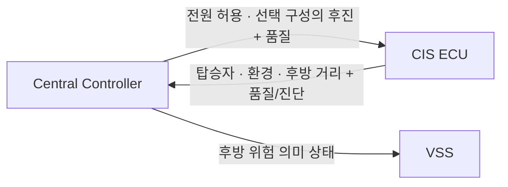
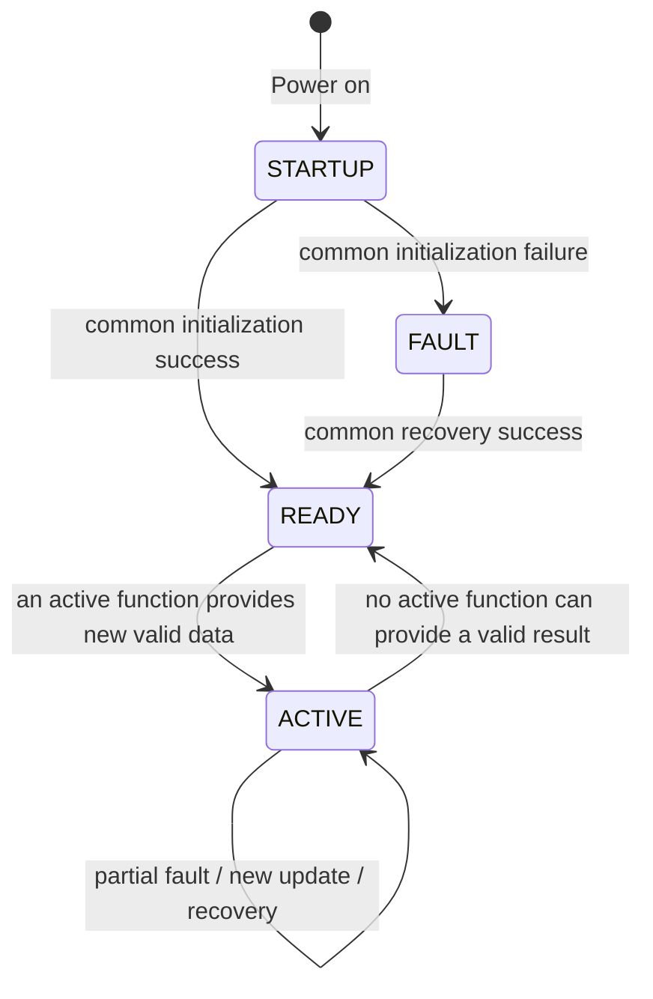
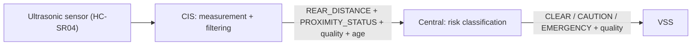

# CIS ECU Interface 정보 정리 — Stage 04 Review Candidate

> 상태: **REVIEW DRAFT / Central·Network Cross-check 전**
> 요구사항 기준: `02_CIS_SYSRS_FUNCTIONAL_BASELINE_DRAFT.md`, 통합 `docs/requirements/sysRS.md` §5
> 논리 인터페이스 기준: `03_CIS_LOGICAL_INTERFACE_NEEDS_DRAFT.md`
> 목적: CIS ECU가 중앙 제어에 제공하는 관측 결과와 품질, 중앙 제어에서 받는 활성 조건, CIS 내부의 오류·복구 경계를 검토 가능한 논리 계약으로 정리한다.
> 주의: 본 문서는 CAN Matrix, Protocol Specification 또는 실제 `*_Interface.h`의 wire structure가 아니다.

---

## 0. 표기와 결정 범위

| 표기 | 의미 |
|---|---|
| `BASELINE` | SR/SysRS에서 직접 요구되는 의미 |
| `CANDIDATE` | 초기 개발·벤치 검증용 임시값 |
| `PROVISIONAL` | 인터페이스 구체화를 위한 권장 표현이며 팀 합의 전 확정 아님 |
| `TBD` | Central, Network, HW와 cross-check 후 결정 |
| `NOT REQUIRED` | 현재 CIS 기능 범위에서 요구되지 않음 |
| `EXCLUDED` | 현재 CIS가 제공하거나 처리하지 않는 항목 |

### 0.1 본 문서에서 확정하지 않는 것

- CAN/UART 등 실제 물리 경로, Message ID, DLC, bit layout, byte order
- 송신 주기, Timeout, freshness 한계의 최종값
- Alive counter, CRC, E2E, bus-off 복구 방식
- 초음파 센서는 `HC-SR04`(물리 측정 범위 2~500 cm)로 확정되었으나, 거리 필터 파라미터 및 최종 유효 관측 범위(`TBD 후보: 10 ≤ d ≤ 100 cm`)
- 후방 위험 임계값과 `CLEAR / CAUTION / EMERGENCY` 판단 (Central 책임)
- 실제 오류 코드, DTC, retry 횟수와 time budget

### 0.2 주요 SysRS 근거

| Interface 영역 | 주요 근거 |
|---|---|
| 전체/기능별 상태와 부분 고장 | CIS §5.3, `CIS-SYS-FUN-001~002`, `CIS-SYS-INT-007~008` |
| 값·유효성·원본 시점·갱신 | CIS §5.4, `CIS-SYS-FUN-005`, `011`, `015`, `019` |
| 거리와 위험 판단 경계 | CIS §5.5~5.6, `CIS-SYS-INT-005` |
| 활성 조건 | `CIS-SYS-INT-001~002` |
| 통신 이상과 복구 | CIS §5.7, `CIS-SYS-FUN-017`, `020~021` |
| 진단과 기능별 복구 | CIS §5.10, `CIS-SYS-DIA-001~006` |

---

# CIS ECU

## 1. 책임과 경계

### 1.1 CIS가 제공하는 기능

- 실내 영상 기반 탑승자 존재 여부와 인원수 판정 `[BASELINE]`
- 실내 온도·습도·조도 측정 `[BASELINE]`
- 후방 물체 거리 측정·필터링 `[BASELINE]`
- 각 결과의 유효성, 원본 시점/경과 시간, 갱신 여부 및 확인 불가 사유 제공 `[BASELINE]`
- 전체 상태, 기능별 오류, 제공 경로 상태 및 복구 확인 제공 `[BASELINE]`
- 중앙 제어가 활용할 수 있도록 위 정보를 한 곳으로 제공 `[BASELINE]`

### 1.2 CIS 책임이 아닌 항목

| 항목 | 책임 | 상태 |
|---|---|---|
| 후방 위험 `CLEAR / CAUTION / EMERGENCY` 판단 | Central Controller | `EXCLUDED` |
| 후방 경고 음향의 재생·우선순위 | VSS / Central Controller | `EXCLUDED` |
| 도어, 창문, 공조, 조명 액추에이터 제어 | 각 실행 ECU | `EXCLUDED` |
| CIS 내부 비전 모델·필터의 원격 제어 | CIS local implementation | `NOT REQUIRED` |
| 실내 영상 원본·센서 전기 raw 신호 외부 제공 | 제공하지 않음 | `EXCLUDED` |

### 1.3 외부 관계



> CIS의 차량 외부 logical interface 대상은 중앙 제어 하나다. VSS에 원시 거리나 CIS가 판단한 위험 상태를 직접 전송하지 않는다.

---

## 2. State와 Availability

### 2.1 전체 ECU 상태

| State | 의미 | 주의 |
|---|---|---|
| `STARTUP` | 공통 처리·제공 기반 또는 기능별 초기화 진행 | 통지 경로가 시작되기 전 미수신을 정상으로 해석하지 않음 |
| `READY` | 공통 기반은 정상이나 활성 기능의 새 유효 결과를 아직 제공하지 못함 | 모든 기능 오류를 뜻하지 않음 |
| `ACTIVE` | 활성 기능 중 하나 이상이 새 유효 결과를 사용 가능한 경로로 제공 가능 | 모든 기능이 정상이라는 의미가 아님 |
| `FAULT` | 공통 처리·제공 기반 오류로 정상적인 제공을 보장할 수 없음 | 가능한 진단은 계속 제공 |



### 2.2 기능별 상태가 전체 상태보다 우선하는 경우

전체 `ACTIVE`만으로 특정 값이 정상이라는 뜻이 되지 않는다. 소비자는 값별 품질을 함께 확인해야 한다.

| 기능 영역 | 권장 상태 정보 | 독립성 |
|---|---|---|
| Occupant | `READY / VALID / UNAVAILABLE / FAULT / RECOVERING` | 비전 오류가 환경·거리 값을 무효화하지 않음 |
| Environment | 온도·습도·조도 각각의 `VALID / INVALID / FAULT / RECOVERING` | 한 센서 오류가 다른 환경 값을 무효화하지 않음 |
| Proximity | `INACTIVE / VALID_DISTANCE / NO_OBJECT / UNAVAILABLE / FAULT / RECOVERING` | 거리 오류가 탑승자·환경 기능을 중단시키지 않음 |
| Interface | `AVAILABLE / DEGRADED / UNAVAILABLE` | 수신 최신성과 센서 값의 유효성을 혼동하지 않음 |

실제 enum과 wire encoding은 `TBD`다. `NO_OBJECT`는 센서가 정상 동작하여 물체가 없음을 확인한 결과이고, `UNAVAILABLE` 또는 `NO_DATA`와 동일하지 않다.

---

## 3. External → CIS: 입력과 활성 조건

### 3.1 입력 정보

| Logical input | Producer | CIS 사용 목적 | 계약 상태 |
|---|---|---|---|
| `VEHICLE_POWER_PERMISSION` | Central Controller | 후방 감지 활성 판단 (단일 활성 조건) | `BASELINE` |
| `VEHICLE_POWER_PERMISSION_QUALITY` | Central Controller | 허용·불허·확인 불가 구분 | `BASELINE` |
| `REVERSE_GEAR_STATE` | Central Controller | CIS 입력으로 사용하지 않음 (Central 전담) | `EXCLUDED` |

### 3.2 활성 규칙

- **단일 활성 조건**: 유효한 `VEHICLE_POWER_PERMISSION`이 허용(`ALLOW`)일 때 후방 감지를 상시 활성화하여 측정·필터링된 결과를 Central Controller에 계속 제공한다. `[BASELINE]`
- **비활성 및 확인 불가 처리**: 전원 불허(`DENIED`) 또는 전원 확인 불가(품질 불량, 미수신, 만료) 시 후방 감지는 비활성(`INACTIVE`)으로 처리하며, 가짜 숫자 거리나 정상 미감지로 대체하지 않는다. `[BASELINE]`
- **후진 기어 연계 책임 분리**: `REVERSE_GEAR_STATE`는 CIS가 수신하지 않는다. CIS는 전원 허용 시 상시 측정하여 제공하고, Central Controller가 차량 기어(R단 여부)를 직접 확인하여 후방 경고 로직(`CAUTION / EMERGENCY`) 실행 여부를 전담 판단한다. `[BASELINE]`
- **재활성 시 신규 측정 보장**: 전원 복구 또는 비활성(`INACTIVE`)에서 활성(`ACTIVE`)으로 재전이될 때, 이전의 마지막 측정값을 재사용하지 않으며 반드시 새 유효 측정(필터 안정화 포함)이 확정된 이후에 정상 제공을 개시한다. `[BASELINE]`
- **보드 전원과 차량 전원의 분리**: CIS 보드에 물리적 전원이 인가된 사실만으로 차량 전원 허용 상태를 임의로 추정하거나 생성해서는 안 된다. `[BASELINE]`

### 3.3 CIS가 받지 않는 외부 Product Command

| Command | 판단 | 이유 |
|---|---|---|
| `REAR_SENSING_ENABLE` | `NOT REQUIRED` | 별도의 On/Off 명령을 두지 않으며, 전원 허용 시 상시 센싱하여 중앙으로 제공 |
| `SET_OCCUPANT_RESULT` | `NOT REQUIRED` | 상위 ECU가 CIS 판정 결과를 지정하지 않음 |
| `SET_REAR_RISK_LEVEL` | `NOT REQUIRED` | 위험 수준은 Central의 결과이며 CIS 입력이 아님 |
| `START_WARNING_SOUND` | `NOT REQUIRED` | CIS는 음향을 재생하지 않음 |
| `SET_VISION_MODEL_PARAMETER` | `NOT BASELINE` | 내부 모델 제어는 외부 제품 인터페이스가 아님 |

시험·진단용 입력 주입, fault injection, 대체 센서 입력은 Product Interface와 분리하며 실제 진단 경로는 `TBD`다.

---

## 4. CIS → Central: Data 계약

### 4.1 데이터 묶음

| Data | 의미 | Consumer | 상태 |
|---|---|---|---|
| `OCCUPANT_PRESENCE` | 탑승자 존재 여부 (`PRESENT` / `ABSENT` / `UNKNOWN`) | Central | `BASELINE` |
| `OCCUPANT_COUNT` | 탑승자 인원수 (`0 ~ 5명`) | Central | `BASELINE` |
| `CABIN_TEMPERATURE` | 실내 온도 (°C) | Central | `BASELINE` |
| `CABIN_HUMIDITY` | 실내 습도 (%) | Central | `BASELINE` |
| `CABIN_ILLUMINANCE` | 실내 조도 (lx) | Central | `BASELINE` |
| `REAR_DISTANCE` | 후방 물체 거리 (cm 단위, raw/filtered) | Central | `BASELINE` |
| `PROXIMITY_STATUS` | 후방 감지 상태 (`VALID_DISTANCE` / `NO_OBJECT` / `UNAVAILABLE` / `INACTIVE` / `FAULT`) | Central | `BASELINE` |
| `CIS_STATE` | 전체 ECU 상태 (`STARTUP` / `READY` / `ACTIVE` / `FAULT`) | Central | `BASELINE` |
| `FUNCTION_STATUS` | 기능별 준비·오류·복구 상태 (`READY` / `VALID` / `UNAVAILABLE` / `FAULT` / `RECOVERING`) | Central | `BASELINE` |
| `INTERFACE_STATUS` | 제공 경로 가용성·통신 상태 (`AVAILABLE` / `DEGRADED` / `UNAVAILABLE`) | Central | `BASELINE` |
| `FAULT_STATUS` / `LAST_FAULT` | 현재 오류와 최근 주요 오류 | Central | `BASELINE` |

### 4.2 모든 값에 연결하는 품질 정보

각 값은 값 자체만 전송해서는 안 된다. 최소 아래의 logical metadata를 같은 semantic update로 연결한다.

| Metadata | 의미 |
|---|---|
| `VALIDITY` | 현재 값이 CIS가 신뢰 가능한 정상 값으로 확정되었는지 (`VALID` / `INVALID`) |
| `QUALITY_REASON` | `NOT_READY`, `OUT_OF_RANGE`, `SENSOR_FAULT`, `VISION_FAULT`, `STALE`, `NO_DATA` 등의 확인 불가 사유 |
| `SOURCE_TIMESTAMP` 또는 `AGE` | 센서/비전 결과가 처음 생성된 때 또는 그 시점부터의 경과 시간 |
| `UPDATE_SEQUENCE` | 새 결과와 과거 메시지의 중복·재전달을 구분하는 갱신 식별자 |
| `FUNCTION_STATUS` | 값을 만든 기능의 현재 상태 |

`VALID`은 메시지가 수신되었다는 뜻이 아니다. 통신이 새로 수신되었어도 센서 오류를 정상적으로 보고한 값은 `VALID`이 될 수 없다. 반대로 과거 유효 값이 재전달되었다고 새 관측이 되지는 않는다.

### 4.3 탑승자 결과 일관성

- `OCCUPANT_COUNT`의 유효 판정 범위는 `0 ~ 5명`이다. `[BASELINE]`
- `OCCUPANT_PRESENCE=ABSENT`와 양수 `OCCUPANT_COUNT`를 같은 판정 회차의 정상 결과로 동시에 제공하지 않는다. `[BASELINE]`
- 존재 여부와 인원수는 같은 판정 회차인지 식별할 수 있도록 동일한 `UPDATE_SEQUENCE`를 공유해야 한다. `[BASELINE]`
- 신뢰할 수 없는 영상, 비전 복구 확인 전 상태, 값의 freshness 만료는 탑승자 없음으로 바꾸지 않는다. `[BASELINE]`

### 4.4 환경 값 독립성

온도·습도·조도는 값별로 유효성, 원본 시점 및 오류를 가진다. 예를 들어 습도 센서 오류가 온도와 조도의 마지막 값 또는 현재 유효성을 바꾸지 않는다.

### 4.5 후방 거리 경계



- 센서는 `HC-SR04`를 사용하며 물리적 측정 범위는 `2 ~ 500 cm`이다. 단위는 `cm`를 사용한다. `[BASELINE]`
- 유효 측정 및 감지 범위는 `TBD [후보: 10 ≤ d ≤ 100 cm]`로 두며, 벤치 검증을 통해 최종 확정한다. `[PROVISIONAL]`
- CIS는 중앙에 `REAR_DISTANCE`, `PROXIMITY_STATUS` 및 품질 메타데이터만 제공한다. `[BASELINE]`
- 거리 임계값, 위험 상태 전이, clear 조건, 음향 시작과 종료는 중앙/VSS의 책임이다. `[EXCLUDED]`
- `NO_OBJECT`는 센서가 정상 동작하여 탐지 범위 내에 장애물이 없음을 확인한 상태다. 측정 불가·차폐·범위 밖·무응답인 `UNAVAILABLE`과 엄격히 구분해야 하며, 측정 실패를 `NO_OBJECT`나 안전 상태로 바꾸면 안 된다. `[BASELINE]`

---

## 5. Update, Freshness, 통신 이상

### 5.1 시간 계약

| 항목 | Candidate | 범위 |
|---|---:|---|
| 공통 초기화 결과 확정 | ≤ 3000 ms | Power-on → `READY` 또는 전체 `FAULT` |
| 논리 제공 경계의 내부 갱신 평가 | 200 ms | 실제 network cycle과 구분 |
| 유효 거리 확정 → 논리 제공 경계 준비 | ≤ 100 ms | sensing 이전·network·central 판단·VSS 재생 제외 |
| 통신 누락 판단 | 연속 3회 | 실제 network period와 예정 수신 기한 기준 |
| 복구 후 새 유효 결과 준비 | ≤ 500 ms | 센서 복구 전체 시간을 보장하지 않음 |

위 수치는 `CANDIDATE`다. Network mapping에서 실제 주기와 end-to-end 예산을 함께 확정한다.

### 5.2 통신과 센서 품질의 분리

| 상태 | 수신 측 해석 |
|---|---|
| 새 메시지 + `VALID` | 새 정상 관측 결과일 수 있음. sequence와 age 확인 |
| 새 메시지 + `INVALID/SENSOR_FAULT` | 통신은 살아 있으나 해당 기능 결과는 정상값이 아님 |
| 과거 메시지 재전달 | 통신 갱신 여부와 별도로 새 관측으로 세지 않음 |
| 예정 기한 내 새 갱신 없음 | `NOT_RECEIVED`/통신 이상 후보. 마지막 정상값을 현재 정상으로 유지하지 않음 |
| 경로 복구 + 새 메시지 | 기능별 sensor/vision 복구와 새 유효 입력도 확인해야 `VALID` 재개 가능 |

### 5.3 복구 순서

1. 제공 경로 복구 여부를 확인한다.
2. 해당 기능의 오류 해소·복구 조건을 확인한다.
3. 새 센서/비전 결과를 취득하고 유효성을 검증한다.
4. 새 sequence와 quality를 포함해 정상 결과를 제공한다.

통신 재연결, 전체 `ACTIVE`, 과거 값 재전달 중 어느 하나만으로 모든 기능의 정상 복귀를 선언하지 않는다.

---

## 6. Fault와 진단

### 6.1 Fault 분류

| Fault / Condition | 영향 범위 | 전체 `FAULT`인가? |
|---|---|---|
| `INITIALIZATION_FAILURE` | 공통 처리·제공 기반 | 예 |
| `VISION_FAULT` | 탑승자 존재/인원수 | 원칙적으로 아니오 |
| `TEMPERATURE_SENSOR_FAULT` | 온도 | 원칙적으로 아니오 |
| `HUMIDITY_SENSOR_FAULT` | 습도 | 원칙적으로 아니오 |
| `ILLUMINANCE_SENSOR_FAULT` | 조도 | 원칙적으로 아니오 |
| `PROXIMITY_SENSOR_FAULT` | 후방 거리 | 원칙적으로 아니오 |
| `COMMUNICATION_FAULT` | 영향 받는 제공 경로 | 경로 상태에 따라 `TBD` |
| `DATA_INVALID` / `OUT_OF_RANGE` | 해당 값 | 아니오 |

실제 severity, fault bitmask, DTC 번호와 latch 정책은 `TBD`다.

### 6.2 Active fault와 이력

| Information | 의미 |
|---|---|
| `ACTIVE_FAULT` | 현재 제공 또는 판정을 방해하는 오류 |
| `RECOVERING` | 복구 시도 중이며 아직 새 유효 결과를 확인하지 못함 |
| `LAST_FAULT` | 최근 주요 오류 이력 |
| `AFFECTED_FUNCTION` | 오류가 영향을 주는 값/기능/제공 경로 |

과거 이력만으로 현재 오류를 표시하지 않으며, 기능별 정상 복귀가 확인되면 해당 기능의 active fault를 해소한다.

### 6.3 Fail-safe 원칙

- 유효하지 않거나 오래된 값을 현재 정상값으로 표시하지 않는다.
- 한 기능의 오류로 무관한 정상 기능을 중단하지 않는다.
- 완전히 단절된 통신 경로에서 CIS가 오류 통지를 보장한다고 주장하지 않는다. 소비자는 수신 감시로 단절을 판단한다.
- CIS 오류가 도어·창문·공조 등 다른 ECU의 제어 상태를 직접 바꾸지 않는다.
- 영상 원본과 센서 전기 raw 신호는 외부 interface에 노출하지 않는다.

---

## 7. Interface Freeze 전 확인 항목

| Open item | Owner 후보 | 결정 필요 사항 |
|---|---|---|
| 차량 전원 허용의 실제 source/quality | Central | source, freshness, power-off semantics |
| 후진 연계 채택 여부 | Central + CIS | 기본 비활성 유지 또는 선택 구성 적용 |
| distance 단위·범위·normal no-object | CIS + HW | 센서 능력, 범위 밖, 무응답 구분 |
| 탑승자 count의 범위·일관성 표현 | CIS | 최대 인원, confidence/quality 표현 |
| value age와 sequence encoding | CIS + Network + Central | timestamp/age, rollover, duplicate 처리 |
| network cycle·timeout·E2E | Network | bus, period, deadline, counter/CRC |
| partial fault의 availability mapping | CIS + Central | status enum과 consumer fallback |
| recovery retry/time budget | CIS + HW | 종료 기한, retry 상한, acceptance test |

## 8. 다음 단계

```text
CIS semantic interface review
    ↓
Central / CIS / Network / HW cross-check
    ↓
Value quality · activation · partial fault contract freeze
    ↓
Network mapping (message / signal / cycle / timeout / E2E)
    ↓
HW-SW interface and integration test design
```

현재 문서는 의미와 책임 경계를 보존한다. 물리 메시지나 수치값을 확정하려면 위 open item의 합의와 관련 SR/SysRS trace 갱신이 필요하다.
