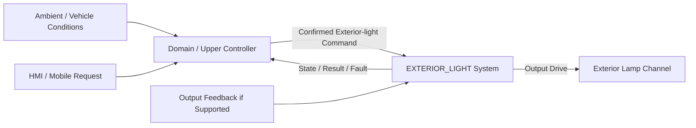

# EXTERIOR_LIGHT System Requirement (SR) — Functional Baseline Draft

> 상태: DRAFT / 기능 범위 검토용 
> 작성 원칙: 고객·상위 시스템 관점의 **What**을 기술한다. 
> 개별 요구사항 ID는 부여하지 않는다. 
> 기존 문서의 번호 체계는 승계하지 않는다.

---

## 1. 목적

EXTERIOR_LIGHT 시스템은 차량 외부 조명에 대해 상위 시스템이 확정한 점등 요청을 안전하고 예측 가능한 출력으로 변환하고, 실제 판단한 조명 상태와 고장 상태를 제공해야 한다.

본 기준은 저전압 데모 환경의 대표 외부 조명 1채널을 우선 대상으로 한다. 양산 차량의 전조등, 차폭등, 미등 등 최종 채널 구성과 법규 적용 범위는 후속 단계에서 확정한다.

---

## 2. 기능 범위

### 2.1 포함 범위

- 상위 시스템이 확정한 외부 조명 켜짐, 꺼짐 및 허용된 출력 수준 요청 수신
- 수동 또는 자동 결정 결과에 따른 대표 조명 채널 제어
- 조명 출력 상태와 명령 결과 제공
- 전원 상태에 따른 출력 허용과 안전한 초기화
- 통신, 출력 구동 및 피드백 이상에 대한 진단과 안전 상태 전환
- 지원되는 하드웨어 범위에서 출력 피드백 감시

### 2.2 범위 밖

- 외부 조도 센서의 직접 측정과 필터링
- 자동 점등 임계값, 히스테리시스 및 차량 전체 자동 조명 정책 판단
- HMI 또는 모바일 사용자 인증과 권한 판단
- 주행 상황 전체에 대한 법규 우선순위 및 조명 조합 판단
- CAN ID, 신호 비트 배치, 전송 주기와 같은 네트워크 상세
- 램프, LED 드라이버, 전류 센서 및 전원 소자의 부품 선정
- 양산 차량 법규 적합성 승인

---

## 3. 시스템 컨텍스트와 책임 경계

상위 시스템은 조도, 운전 상태, 사용자 요청, 법규 및 차량 정책을 종합하여 최종 조명 명령을 확정해야 한다. EXTERIOR_LIGHT 시스템은 원시 조도값으로 차량 전체 자동 점등 결정을 중복 수행하지 않아야 한다.

EXTERIOR_LIGHT 시스템은 수신한 의미 기반 명령의 유효성을 확인하고 실제 출력으로 실행하며, 출력 상태와 고장을 상위 시스템에 제공해야 한다.

---

## 4. 입력과 출력의 의미

### 4.1 입력

- 대상 조명 채널
- 켜짐, 꺼짐 또는 허용된 출력 수준 명령
- 수동, 자동, 안전 또는 임시 기능 등 명령 문맥
- 요청 출처, 순서, 유효성 및 필요 시 만료 정보
- 시스템 전원과 출력 허용 상태
- 상위 시스템이 확정한 안전 우선 명령

### 4.2 출력

- 실제 판단한 조명 상태: 꺼짐, 켜짐, 전환 중, 저하, 고장 또는 알 수 없음
- 적용 중인 출력 수준과 유효성
- 명령 처리 결과와 거부·중단 사유
- 통신, 출력 구동, 피드백 및 초기화 고장 정보

Request/Command, State, Event, Fault, Data는 서로 다른 의미로 제공해야 하며 하나의 신호에 혼합하지 않아야 한다.

---

## 5. 조명 제어 요구

### 5.1 명령 수용과 실행

- 시스템은 정의된 채널과 명령만 수용해야 한다.
- 유효하지 않거나 만료된 명령은 실행하지 않고 거부 사유를 제공해야 한다.
- 동일 명령의 중복 수신으로 출력이 불필요하게 재시작되거나 깜빡여서는 안 된다.
- 유효한 명령을 수용한 경우 목표 출력으로 전환하고 처리 결과를 제공해야 한다.
- 서로 충돌하는 명령을 동시에 적용해서는 안 된다.

### 5.2 수동·자동 문맥

- 시스템은 상위 시스템이 수동 또는 자동 정책으로 확정한 최종 조명 명령을 동일한 실행 인터페이스로 처리할 수 있어야 한다.
- 자동 점등 정책이 비활성화되거나 입력 근거가 유효하지 않으면 상위 시스템이 결정한 안전 명령을 실행해야 한다.
- 자동 결정에서 수동 결정으로 전환되어도 불필요한 출력 펄스나 순간 점멸이 발생해서는 안 된다.
- 웰컴·굿바이와 같은 임시 점등은 상위 정책에서 허용된 경우에만 실행해야 하며, 안전·법규 우선 명령보다 앞서서는 안 된다.

### 5.3 상태 피드백

- 시스템은 마지막 요청값만 반복하지 않고 실제 적용 판단에 근거한 상태를 제공해야 한다.
- 출력 피드백 하드웨어가 없는 경우 명령 적용 상태와 물리 램프 점등 확인 상태를 구분해야 한다.
- 각 명령에 대해 수용, 진행, 완료, 거부, 취소 또는 실패 결과를 구분할 수 있어야 한다.

---

## 6. 전원·통신·고장 상태 요구

- 초기화 중 출력은 프로젝트가 승인한 안전 기본 상태를 유지해야 한다.
- 출력 허용 전원 상태가 아니면 새 점등을 시작하지 않아야 한다.
- 통신 상실 시 적용할 출력은 조명 기능별 안전 및 법규 분석으로 정한 정책을 따라야 한다.
- 통신 복구만으로 만료된 조명 명령을 자동 재실행해서는 안 된다.
- 출력 드라이버 보호가 필요한 상태에서는 상위 명령보다 로컬 전기적 보호가 우선해야 한다.
- 출력 구동 또는 피드백 고장을 감지한 경우 상태와 고장을 구분하여 제공해야 한다.
- 고장 해제 후 재동작 조건은 명시적이고 시험 가능해야 한다.

---

## 7. 안전 및 우선순위 원칙

- 차량 전체의 조명 조합과 법규 우선순위는 상위 시스템에서 단일하게 결정해야 한다.
- EXTERIOR_LIGHT 시스템은 상위 시스템이 확정한 안전 우선 명령을 일반 명령보다 우선 적용해야 한다.
- 단락, 과전류 또는 과열과 같은 로컬 보호 조건이 확인되면 위험 출력의 차단이 명령 실행보다 우선해야 한다.
- 신뢰할 수 없는 상태를 정상 점등 또는 정상 소등으로 보고해서는 안 된다.
- 고장 중 출력 정책은 채널별 위험 분석과 법규 검토 결과로 확정해야 한다.

---

## 8. 비기능 요구

### 8.1 예측 가능성

- 동일한 상태와 동일한 유효 명령에는 동일한 출력 결과를 제공해야 한다.
- 명령 거부, 대체 또는 중단의 원인을 외부에서 식별할 수 있어야 한다.

### 8.2 강건성

- 누락, 범위 초과, 순서 오류, 중복 또는 만료된 입력으로 의도하지 않은 점등이 발생해서는 안 된다.
- 통신 복구나 전원 변동으로 오래된 출력이 자동 복원되어서는 안 된다.

### 8.3 시험 가능성

- 켜짐, 꺼짐, 출력 수준, 모드 문맥 전환, 통신 상실 및 출력 고장 동작을 독립적으로 검증할 수 있어야 한다.
- 명령, 상태, 고장 및 결과를 관찰할 수 있어야 한다.

### 8.4 유지보수성

- 출력 전환 시간, 진단 필터, 기본 상태 및 출력 매핑은 기능 로직과 분리해 관리할 수 있어야 한다.
- 채널 확장 시 동일한 명령·상태·진단 의미를 재사용할 수 있어야 한다.

---

## 9. 프로젝트 경계와 미확정 사항

- 현재 저장소의 BCM 기준은 실내 Ambient Lighting을 포함하고 Window를 제외한다. Exterior Light의 실제 ECU 배치는 기존 BCM 범위와 별도로 승인해야 한다.
- 대표 1채널 데모에서 사용할 램프 종류, 전압, 드라이버 및 피드백 방식은 미확정이다.
- 자동 점등에 사용할 외부 조도 데이터의 제공 ECU, 품질 상태, 임계값 및 히스테리시스는 상위 시스템과 인터페이스 기준에서 확정해야 한다.
- 양산 기능의 채널 목록, 법규 우선순위, 고장 시 점등 정책과 성능 수치는 안전·법규 검토가 필요하다.

---

## 10. 기능 기준 요약

EXTERIOR_LIGHT 기능 기준은 다음을 만족할 때 성립한다.

- 상위 시스템이 확정한 의미 기반 조명 명령을 안전하게 실행한다.
- 실제 적용 상태와 명령 결과를 제공한다.
- 통신 및 출력 이상 시 미확정 상태를 정상값처럼 사용하지 않는다.
- 차량 전체 자동 점등 판단과 법규 우선순위는 상위 시스템에 유지한다.
- 통신·하드웨어 상세와 생산 차량 법규 수치는 후속 인터페이스 및 설계 단계에 남긴다.
