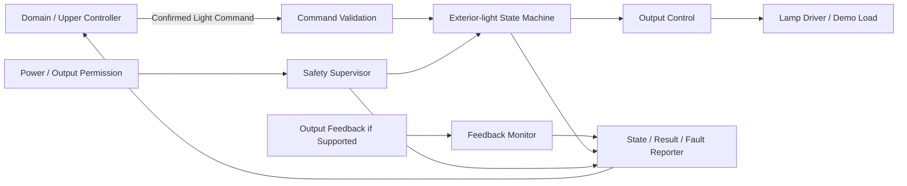
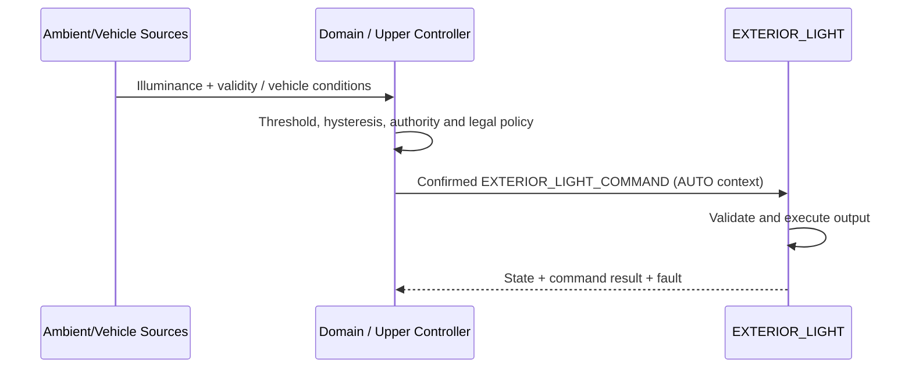

# EXTERIOR_LIGHT System Requirement Specification (SysRS)

## S32K144 Exterior-light Functional Element — Allocation Candidate / Functional Baseline Draft

> 상태: DRAFT / 기능·성능 기준 검토용 
> 대상 시스템: 저전압 데모의 대표 외부 조명 1채널 실행 기능 
> 물리 배치: 별도 Function ECU 또는 BCM 확장 후보이며 아키텍처 검토 후 확정 
> 신규 SysRS ID 체계를 사용하며 이전 번호를 승계하지 않는다. 
> `[CANDIDATE]`는 검증 전 후보값 또는 후보 동작을 의미한다. 
> `*(파생)*`은 상위 SR에서 직접 확정되지 않고 안전성·시험성·정합성을 위해 도출한 요구사항이다. 
> 통신 프로토콜, CAN ID, 비트 배치, 전송 주기 및 정확한 타임아웃은 본 문서에서 확정하지 않는다.

---

## 1. 대상과 책임

### 1.1 대상 시스템

본 SysRS는 Domain 또는 상위 Controller가 확정한 의미 기반 외부 조명 명령을 받아 대표 조명 채널을 구동하고, 실제 적용 상태·명령 결과·고장을 제공하는 실행 기능을 대상으로 한다.

현재 기준은 저전압 데모 1채널이다. 양산 차량의 전조등, 차폭등, 미등 등 채널별 기능과 법규 요구는 본 기준을 그대로 확장하지 않고 별도 안전·법규 검토를 거쳐야 한다.

### 1.2 EXTERIOR_LIGHT 실행 기능 책임

- 의미 기반 조명 명령의 유효성·순서·중복 검증
- 켜짐, 꺼짐 및 허용된 출력 수준 실행
- 전환 중 상반되거나 미정의된 출력 방지
- 출력 상태와 명령 처리 결과 제공
- 지원되는 하드웨어 범위의 출력 피드백 감시
- 전원·통신·출력 구동 이상 시 채널별 안전 정책 적용
- 상태와 진단 정보 제공

### 1.3 책임 밖

- 원시 외부 조도값의 측정, 필터링 및 유효성 판단
- 자동 점등 임계값, 히스테리시스와 차량 전체 정책 결정
- HMI/모바일 사용자 인증과 요청 권한 판단
- 차량 전체 법규·안전 명령의 중재
- 네트워크 프레임과 물리 신호 배치
- 램프, 드라이버, 전원 소자와 피드백 회로 선정
- 생산 차량의 법규 적합성 승인

---

## 2. 논리 구조

원시 조도, HMI, 모바일 요청의 해석과 차량 전체 명령 중재는 Domain에 유지한다. 실행 기능에는 최종적으로 확정된 명령만 전달한다.

---

## 3. 시스템 상태

### 3.1 기능 상태

| 상태 | 의미 | 출력 원칙 |
|---|---|---|
| `INIT` | 초기화와 출력 안전 확인 중 | 승인된 초기 기본값 |
| `READY` | 정상 명령 수용 가능 | 명령에 따라 제어 |
| `DEGRADED` | 피드백 또는 일부 진단 기능 제한 | 승인된 제한 정책 적용 |
| `FAULT` | 안전한 출력 제어를 보장할 수 없음 | 채널별 안전 기본값 |

### 3.2 조명 채널 상태

| 상태 | 의미 |
|---|---|
| `OFF` | 출력 비활성으로 판단됨 |
| `ON` | 요청된 활성 출력이 적용된 것으로 판단됨 |
| `TRANSITION` | 출력 전환 또는 안정화 중 |
| `UNKNOWN` | 물리 또는 논리 상태를 신뢰할 수 없음 |

`MANUAL`, `AUTO`, `SAFETY`, `TEMPORARY`는 출력 상태가 아니라 명령 문맥이다.

### 3.3 명령 결과 상태

`ACCEPTED`, `IN_PROGRESS`, `DONE`, `REJECTED`, `CANCELLED`, `FAILED`를 구분한다. 결과는 원 요청 식별자와 사유를 함께 제공할 수 있어야 한다.

### 3.4 데이터 유효성

명령, 출력 수준 및 피드백의 유효성은 최소 `OK`, `STALE`, `INVALID`, `NO_DATA`를 구분한다.

---

## 4. Functional Requirements

### 4.1 초기화와 기능 허용

| ID | 요구사항 | 근거/비고 |
|---|---|---|
| `ELS-SYS-FUN-001` | 기능은 리셋 후 조명 출력을 채널별로 승인된 초기 기본값으로 설정해야 한다. | 안전, 기본값 TBD |
| `ELS-SYS-FUN-002` | 기능은 필수 내부 상태와 출력 제어 경로의 초기화가 완료된 후에만 `READY`로 전환해야 한다. | 안전 |
| `ELS-SYS-FUN-003` | 기능은 출력 허용 전원 상태가 아니면 새 활성 출력을 시작하지 않아야 한다. | 상위 SR |
| `ELS-SYS-FUN-004` | 초기화 실패 시 기능은 `FAULT` 또는 정의된 `DEGRADED` 상태로 전환하고 채널별 안전 기본값을 적용해야 한다. | 안전 |

### 4.2 명령 검증과 처리

| ID | 요구사항 | 근거/비고 |
|---|---|---|
| `ELS-SYS-CMD-001` | 기능은 정의된 대상 채널에 대한 `SET_OFF`, `SET_ON`, `SET_LEVEL` 명령만 해석해야 한다. | 의미 기반 인터페이스 |
| `ELS-SYS-CMD-002` | 기능은 대상 채널, 명령 종류, 순서 식별자, 유효성 및 필요한 출력 수준을 검증한 후 수용 여부를 결정해야 한다. | 상위 SR |
| `ELS-SYS-CMD-003` | 기능은 만료, 범위 초과, 미정의 또는 불완전 명령을 실행하지 않고 `REJECTED`와 사유를 제공해야 한다. | 상위 SR |
| `ELS-SYS-CMD-004` | 기능은 이미 처리한 동일 순서 식별자의 명령을 재수신해도 출력을 다시 시작하거나 불필요하게 전환하지 않아야 한다. | 중복 내성 |
| `ELS-SYS-CMD-005` | 기능은 새로운 유효 명령이 이전 명령을 대체할 때 이전 명령 결과를 일관되게 종결해야 한다. | 시험성 |
| `ELS-SYS-CMD-006` | 기능은 `MANUAL`, `AUTO`, `SAFETY`, `TEMPORARY` 문맥을 진단·추적 정보로 보존할 수 있어야 한다. | *(파생)* |
| `ELS-SYS-CMD-007` | 기능은 원시 조도값을 근거로 `AUTO` 점등 여부를 자체 결정하지 않아야 한다. | 책임 경계 |

### 4.3 출력 제어

| ID | 요구사항 | 근거/비고 |
|---|---|---|
| `ELS-SYS-OUT-001` | 기능은 수용한 `SET_OFF`에 대해 대상 채널의 활성 출력을 비활성화해야 한다. | 상위 SR |
| `ELS-SYS-OUT-002` | 기능은 수용한 `SET_ON`에 대해 대상 채널에 구성된 정상 활성 출력을 적용해야 한다. | 상위 SR |
| `ELS-SYS-OUT-003` | `SET_LEVEL`을 지원하는 구성에서 기능은 승인된 범위의 출력 수준만 적용해야 한다. | `[CANDIDATE]` |
| `ELS-SYS-OUT-004` | 기능은 한 채널에 서로 충돌하는 두 출력 목표를 동시에 적용해서는 안 된다. | 안전 |
| `ELS-SYS-OUT-005` | 기능은 명령 중복, 문맥 변경 또는 상태 보고 갱신으로 인해 육안상 불필요한 순간 점멸을 발생시켜서는 안 된다. | 상위 SR |
| `ELS-SYS-OUT-006` | 기능은 출력 매핑, 전환 시간 및 진단 필터를 기능 상태 기계와 분리된 조정값으로 관리해야 한다. | 유지보수성 |
| `ELS-SYS-OUT-007` | 임시 점등을 지원하는 경우 기능은 명령에 포함된 종료 조건 또는 상위 취소 명령에 따라 출력을 종료해야 한다. | `[CANDIDATE]` |

### 4.4 상태와 결과 제공

| ID | 요구사항 | 근거/비고 |
|---|---|---|
| `ELS-SYS-STA-001` | 기능은 실제 적용 판단에 따라 `OFF`, `ON`, `TRANSITION`, `UNKNOWN` 상태를 제공해야 한다. | 상위 SR |
| `ELS-SYS-STA-002` | 기능은 적용 중인 출력 수준과 그 유효성을 제공해야 한다. | 상위 SR |
| `ELS-SYS-STA-003` | 기능은 각 명령의 처리 결과와 사유를 원 요청 식별자에 연결해 제공해야 한다. | 추적성 |
| `ELS-SYS-STA-004` | 출력 피드백 하드웨어가 없는 구성은 `명령 적용 상태`를 `물리 램프 점등 확인`으로 보고해서는 안 된다. | 진단 한계 |
| `ELS-SYS-STA-005` | 피드백이 신뢰 불가인 경우 기능은 이전 정상 상태를 현재 물리 상태처럼 유지 보고하지 않아야 한다. | 강건성 |

---

## 5. Semantic Input / Event Requirements

### 5.1 입력 의미

| 구분 | 의미 | 최소 데이터 |
|---|---|---|
| `EXTERIOR_LIGHT_COMMAND` | Domain이 확정한 조명 명령 | channel, action, level(선택), context, sequence, validity/expiry |
| `POWER_OUTPUT_PERMISSION` | ECU 및 조명 출력 허용 정보 | output allowed, power state, validity |
| `EXTERIOR_LIGHT_OUTPUT_FEEDBACK` | 지원되는 물리 출력 피드백 | channel, measured/applied state, validity |
| `LOCAL_PROTECTION_STATE` | 드라이버 또는 전원 보호 상태 | protection type, active, validity |

### 5.2 제공 의미

| 구분 | 의미 | 최소 데이터 |
|---|---|---|
| `EXTERIOR_LIGHT_STATE` | 채널별 실제 판단 상태 | channel, state, validity, timestamp/age basis |
| `EXTERIOR_LIGHT_LEVEL` | 적용 출력 수준 | channel, level, validity |
| `EXTERIOR_LIGHT_COMMAND_RESULT` | 명령 처리 결과 | request sequence, result, reason |
| `EXTERIOR_LIGHT_FAULT` | 고장 정보 | category, code, channel, active/recovered, validity |

### 5.3 의미 분리 요구

| ID | 요구사항 | 근거/비고 |
|---|---|---|
| `ELS-SYS-SEM-001` | 기능은 `EXTERIOR_LIGHT_COMMAND`와 `EXTERIOR_LIGHT_STATE`를 서로 다른 데이터 의미로 취급해야 한다. | Request/State 분리 |
| `ELS-SYS-SEM-002` | 기능은 출력 상태와 고장 상태를 하나의 열거값으로 혼합하지 않아야 한다. | State/Fault 분리 |
| `ELS-SYS-SEM-003` | 기능은 명령 문맥과 출력 목표를 구분해 처리해야 한다. | AUTO는 상태가 아님 |

---

## 6. Candidate Execution Behavior

### 6.1 기본 명령 실행

1. 기능이 `READY`이고 출력 허용 조건이 성립한다.
2. 입력 검증기가 대상, 동작, 수준, 순서와 유효성을 확인한다.
3. 로컬 보호 상태를 확인한다.
4. 상태 기계가 목표 출력과 필요한 전환을 결정한다.
5. 출력 제어가 승인된 매핑을 적용한다.
6. 지원되는 경우 피드백을 확인한다.
7. 상태, 수준, 결과와 고장을 갱신한다.

### 6.2 자동 점등 연계

자동 점등 임계값(`LUX_ON`, `LUX_OFF`), 히스테리시스 및 유지 시간은 Domain 또는 상위 자동 조명 기능의 요구사항으로 관리한다. 데모에서 동일 MCU에 배치되더라도 논리 책임은 분리한다.

### 6.3 후보 우선순위

1. 로컬 전기적 보호
2. Domain이 확정한 안전·법규 우선 명령
3. Domain이 확정한 일반 명령

수동, 자동, 임시 기능 간 차량 수준 우선순위는 Domain에서 확정한 뒤 단일 최종 명령으로 전달한다.

---

## 7. Performance Requirements

아래 수치는 초기 저전압 통합 시험용 후보이며 실제 램프·드라이버·법규 요구로 검증해야 한다.

| ID | 요구사항 | 후보값/근거 |
|---|---|---|
| `ELS-SYS-PER-001` | 기능은 정상 전원 인가 후 명령 수용 가능 상태에 도달해야 한다. | `[CANDIDATE]` 1,000 ms 이내, 타 ECU 초기화 기준 정합 |
| `ELS-SYS-PER-002` | 기능은 유효한 일반 조명 명령 수용 후 목표 출력 전환을 시작해야 한다. | `[CANDIDATE]` 100 ms 이내, 기존 조명 기능 응답 기준 정합 |
| `ELS-SYS-PER-003` | 기능은 내부 출력 상태 변화 후 외부 제공 상태를 갱신해야 한다. | `[CANDIDATE]` 100 ms 이내 |
| `ELS-SYS-PER-004` | 기능은 로컬 보호 조건 성립 후 위험 출력의 비활성화를 시작해야 한다. | `[CANDIDATE]` 50 ms 이내, 드라이버 검증 필요 |
| `ELS-SYS-PER-005` | 기능은 통신 데이터가 합의된 허용 age 또는 누락 횟수를 초과하면 `STALE`로 판정해야 한다. | 시간값은 네트워크 설계에서 확정 |
| `ELS-SYS-PER-006` | 지원되는 피드백은 명령 출력과 실제 상태 불일치를 채널별 진단 시간 내 검출해야 한다. | `[CANDIDATE]` 시간값 TBD |

---

## 8. External Logical Interface Requirements

### 8.1 필요한 입력

| ID | 요구사항 | 비고 |
|---|---|---|
| `ELS-SYS-INT-001` | Domain은 실행 기능에 원시 HMI·모바일 이벤트나 원시 조도값이 아니라 확정된 `EXTERIOR_LIGHT_COMMAND`를 제공해야 한다. | 책임 경계 |
| `ELS-SYS-INT-002` | `EXTERIOR_LIGHT_COMMAND`는 최소 대상 채널, 동작, 순서, 유효성을 포함해야 한다. | 수준/문맥은 필요 시 포함 |
| `ELS-SYS-INT-003` | 출력 허용 정보는 전원 상태와 동작 허용 여부를 모호하지 않게 제공해야 한다. | 안전 |
| `ELS-SYS-INT-004` | 출력 피드백을 사용하는 구성은 측정값과 품질 상태를 함께 제공해야 한다. | 진단 |

### 8.2 제공해야 하는 출력

| ID | 요구사항 | 비고 |
|---|---|---|
| `ELS-SYS-INT-005` | 기능은 `EXTERIOR_LIGHT_STATE`와 `EXTERIOR_LIGHT_LEVEL`을 채널별로 제공해야 한다. | State/Data 분리 |
| `ELS-SYS-INT-006` | 기능은 `EXTERIOR_LIGHT_COMMAND_RESULT`를 원 요청 순서와 연결해 제공해야 한다. | 추적성 |
| `ELS-SYS-INT-007` | 기능은 `EXTERIOR_LIGHT_FAULT`에 최소 범주, 채널, 활성 상태 및 복구 상태를 제공해야 한다. | 진단 |
| `ELS-SYS-INT-008` | 기능은 물리 피드백 확인 가능 여부를 상태 유효성 또는 capability 정보로 구분할 수 있어야 한다. | *(파생)* |

### 8.3 본 문서에서 결정하지 않는 항목

- CAN/LIN/Ethernet 등 전송 매체
- Message ID, Signal ID, byte/bit layout, endianness
- 송신 주기, event-trigger 정책, E2E 보호 방식
- 실제 데이터 타입, scaling, offset, invalid raw value
- 네트워크 수준 timeout과 재전송 횟수
- 램프 드라이버의 전기적 출력 규격

---

## 9. Safety / Priority Requirements

| ID | 요구사항 | 근거/비고 |
|---|---|---|
| `ELS-SYS-SAF-001` | 단락, 과전류, 과열 등 확인된 로컬 보호는 일반 조명 명령보다 우선해야 한다. | 전기적 안전 |
| `ELS-SYS-SAF-002` | 기능은 상위에서 확정된 안전·법규 우선 명령을 일반 명령보다 우선 적용해야 한다. | 상위 SR |
| `ELS-SYS-SAF-003` | 기능은 통신 상실 시 임의로 OFF 또는 ON을 선택하지 않고 채널별로 승인된 fallback을 적용해야 한다. | 법규/안전 정책 필요 |
| `ELS-SYS-SAF-004` | 통신 복구만으로 만료된 조명 명령을 자동 재실행해서는 안 된다. | 재개 방지 |
| `ELS-SYS-SAF-005` | 기능은 신뢰할 수 없는 물리 출력 상태를 정상 `ON` 또는 `OFF`로 보고해서는 안 된다. | 강건성 |
| `ELS-SYS-SAF-006` | 기능은 `FAULT`에서 채널별 안전 기본값을 적용하고 해당 적용 상태를 보고해야 한다. | 안전 기본값 TBD |

---

## 10. Diagnostics

### 10.1 고장 범주

| 범주 | 예시 |
|---|---|
| `OUTPUT_DRIVER` | 드라이버 보호, 구동 명령 실패 |
| `OUTPUT_FEEDBACK` | 명령-피드백 불일치, 피드백 범위/유효성 오류 |
| `COMMUNICATION` | 상위 명령 stale/invalid/no-data |
| `INITIALIZATION` | 필수 초기화 또는 자체 점검 실패 |
| `FUNCTION` | 상태 전이 불일치, 출력 전환 시간 초과 |

### 10.2 진단 요구사항

| ID | 요구사항 | 근거/비고 |
|---|---|---|
| `ELS-SYS-DIA-001` | 기능은 활성 고장과 복구된 고장을 구분할 수 있어야 한다. | 진단성 |
| `ELS-SYS-DIA-002` | 기능은 고장 범주, 세부 코드 및 대상 채널을 제공해야 한다. | 정비성 |
| `ELS-SYS-DIA-003` | 기능은 고장 발생 시 진행 중 명령의 결과를 일관되게 종결해야 한다. | 추적성 |
| `ELS-SYS-DIA-004` | 기능은 고장 복구만으로 만료된 출력을 재적용하지 않고 새 유효 명령 또는 승인된 복구 절차를 요구해야 한다. | 안전 |
| `ELS-SYS-DIA-005` | 피드백 회로가 없는 구성은 물리 램프 단선·점등 실패를 검출했다고 보고해서는 안 된다. | 진단 한계 |
| `ELS-SYS-DIA-006` | 출력 피드백을 지원하는 구성은 명령과 피드백 불일치를 필터 시간 후 고장으로 판정해야 한다. | `[CANDIDATE]`, 시간 TBD |

### 10.3 복구 원칙

- 일시 통신 고장: 새 유효 명령 확인 후 승인된 출력 적용
- 출력 피드백 고장: `UNKNOWN` 또는 `DEGRADED`로 보고하고 채널별 정책 적용
- 드라이버 보호 고장: 위험 출력 차단, 보호 해제와 재허용 조건 확인
- 초기화 고장: 안전 기본값 유지, 명시적 재초기화 또는 복구 필요

---

## 11. Non-functional Requirements

| ID | 요구사항 | 특성 |
|---|---|---|
| `ELS-SYS-NFR-001` | 기능은 동일 상태와 동일 유효 입력에 대해 결정적인 출력 결과를 제공해야 한다. | Predictability |
| `ELS-SYS-NFR-002` | 기능은 입력 누락, 중복, 범위 초과 및 순서 오류를 안전하게 처리해야 한다. | Robustness |
| `ELS-SYS-NFR-003` | 출력 매핑, 시간, 기본값과 진단 필터는 기능 로직과 분리하여 관리해야 한다. | Maintainability |
| `ELS-SYS-NFR-004` | 시험 환경에서 명령, 상태, 수준, 결과와 고장을 관찰할 수 있어야 한다. | Testability |
| `ELS-SYS-NFR-005` | 명령 검증과 상태 전이 로직은 실제 램프 하드웨어 없이도 단위 시험할 수 있어야 한다. | Testability, *(파생)* |
| `ELS-SYS-NFR-006` | 채널 확장 시 채널별 상태, 결과와 고장 데이터가 혼동되지 않아야 한다. | Scalability, *(파생)* |

---

## 12. Candidate Acceptance Criteria

| 시나리오 | 사전 조건 | 자극 | 기대 결과 |
|---|---|---|---|
| 정상 점등 | `READY`, 출력 허용 | 유효 `SET_ON` | 후보 시간 내 출력 적용 시작, `ON`, 결과 `DONE` |
| 정상 소등 | `READY`, 채널 ON | 유효 `SET_OFF` | 후보 시간 내 출력 비활성, `OFF`, 결과 `DONE` |
| 출력 수준 | 레벨 제어 지원 | 범위 내 `SET_LEVEL` | 승인 매핑 적용, 수준과 유효성 보고 |
| 범위 오류 | `READY` | 범위 밖 level | 출력 변경 없음, `REJECTED`와 사유 |
| 중복 명령 | 명령 처리 완료 | 동일 sequence 재수신 | 추가 출력 펄스나 순간 점멸 없음 |
| AUTO 연계 | Domain 자동 정책 활성 | `AUTO` 문맥의 확정 명령 | 원시 조도 계산 없이 동일 실행 경로로 처리 |
| 통신 상실 | 채널 동작 중 | 허용 age 초과 | 채널별 승인 fallback, 통신 고장, 복구 후 오래된 명령 미재생 |
| 드라이버 보호 | 채널 활성 중 | 유효 보호 입력 | 후보 시간 내 위험 출력 차단, 고장과 결과 보고 |
| 피드백 불일치 | 피드백 지원 | 명령과 물리 피드백 불일치 | 필터 후 고장, 상태 정상값 미보고 |
| 피드백 미지원 | 피드백 없음 | `SET_ON` 완료 | 명령 적용은 보고하되 물리 점등 확인으로 표현하지 않음 |

---

## 13. Candidate Parameter Summary

| 파라미터 | 후보값 | 근거 | 확정에 필요한 검증 |
|---|---:|---|---|
| `T_ELS_INIT_MAX` | 1,000 ms | 타 ECU 기준 정합 | 부팅·초기화 측정 |
| `T_ELS_CMD_RESPONSE_MAX` | 100 ms | 기존 조명 기능 응답 기준 정합 | HIL/실기 출력 측정 |
| `T_ELS_STATE_UPDATE_MAX` | 100 ms | 상위 상태 동기화 후보 | 통합 통신 시험 |
| `T_ELS_PROTECTION_OFF_MAX` | 50 ms | 저전압 데모 보호 후보 | 드라이버 보호 시험 |
| `ELS_DEMO_INIT_OUTPUT` | OFF | 저전압 데모 안전 후보 | 시스템 안전 검토 |
| `ELS_LEVEL_MIN/MAX` | TBD | 램프/드라이버 미선정 | HW 설계와 UX/법규 검토 |
| `T_ELS_FEEDBACK_DIAG` | TBD | 피드백 회로 미선정 | 회로 노이즈/고장 주입 시험 |
| `ELS_COMM_MAX_AGE` | TBD | 네트워크 주기 미확정 | Logical Interface 합의 |
| `ELS_COMM_FAIL_POLICY` | 채널별 TBD | 양산 법규/안전 영향 | Domain·안전·법규 합의 |

`ELS_DEMO_INIT_OUTPUT = OFF`는 저전압 대표 부하 데모에만 적용하는 후보이며 생산 차량 외부 조명의 fail-safe 결론이 아니다. PWM 주파수, duty 매핑, 전류 제한, 램프 진단 임계값은 드라이버와 램프 선정 후 Element/SW/HW 요구사항에서 확정한다.

---

## 14. TBD

### 14.1 상위/Domain 결정 필요

- 수동·자동·임시·법규 기능 간 차량 수준 우선순위
- 자동 조명에 사용할 외부 조도 데이터 제공자와 품질 기준
- `LUX_ON`, `LUX_OFF`, 히스테리시스와 유지 시간
- 전원/운전 상태별 조명 허용 정책
- 채널별 통신 상실 및 고장 fallback
- 웰컴·굿바이 등 임시 점등 기능 포함 여부

### 14.2 Interface/Network 결정 필요

- 조명 명령·상태·결과·고장 데이터 계약
- 전송 매체, 메시지/신호 ID, scaling과 invalid 값
- 주기, 최대 age, timeout, alive counter와 E2E 보호
- 명령 sequence와 중복 제거 규칙
- 출력 capability 및 물리 피드백 가능 여부 표현

### 14.3 Element/SW/HW 결정 필요

- Exterior Light 기능의 실제 ECU 배치
- 대표 및 최종 조명 채널 목록
- 램프·드라이버·전원·피드백 회로 사양
- 출력 주파수, 수준 매핑, slew/ramp와 진단 임계값
- 단락, 과전류, 과열, 단선 진단과 복구 절차
- 생산 차량 법규 성능과 fail-safe 정책

---

## 15. Baseline Scope

본 Functional Baseline은 다음을 고정한다.

- EXTERIOR_LIGHT 실행 기능은 Domain이 확정한 의미 기반 명령을 실행한다.
- 원시 조도와 자동 점등 임계값·히스테리시스 판단은 상위 기능에 유지한다.
- 대표 1채널에 대해 OFF, ON 및 선택적 LEVEL 실행 기준을 정의한다.
- Request/Command, State, Fault, Data 및 Command Result를 분리한다.
- 피드백이 없는 구성에서는 명령 적용과 물리 점등 확인을 구분한다.
- 실제 ECU 배치, 네트워크 상세, 채널 구성, 전기 수치 및 양산 법규 기준은 후속 단계에서 확정한다.
