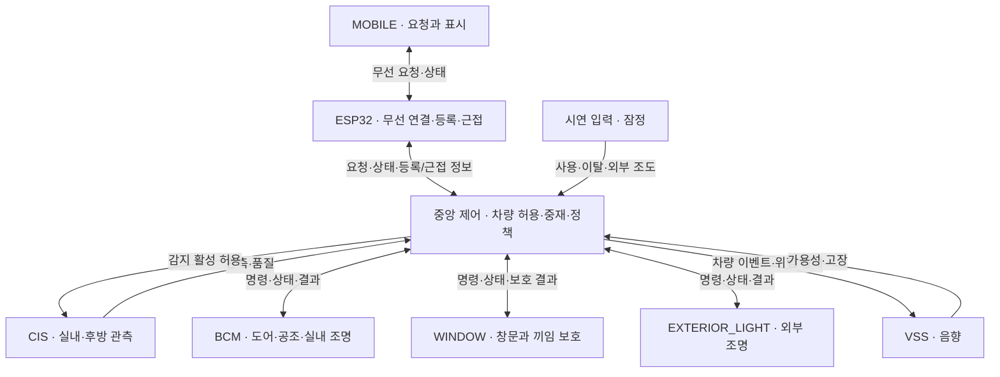
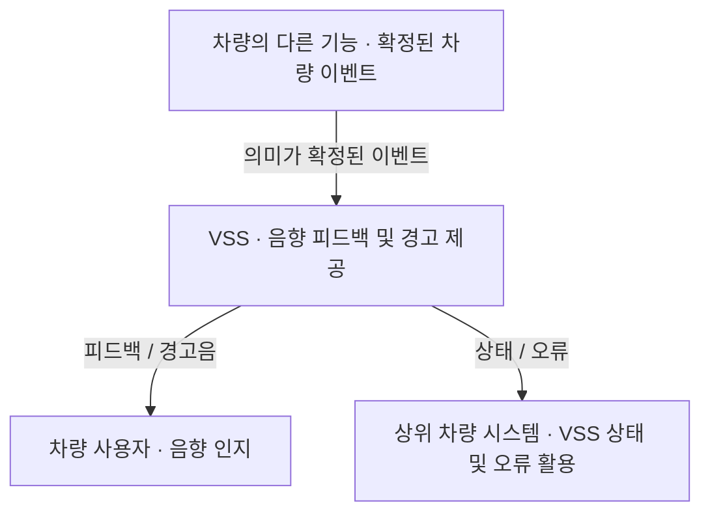
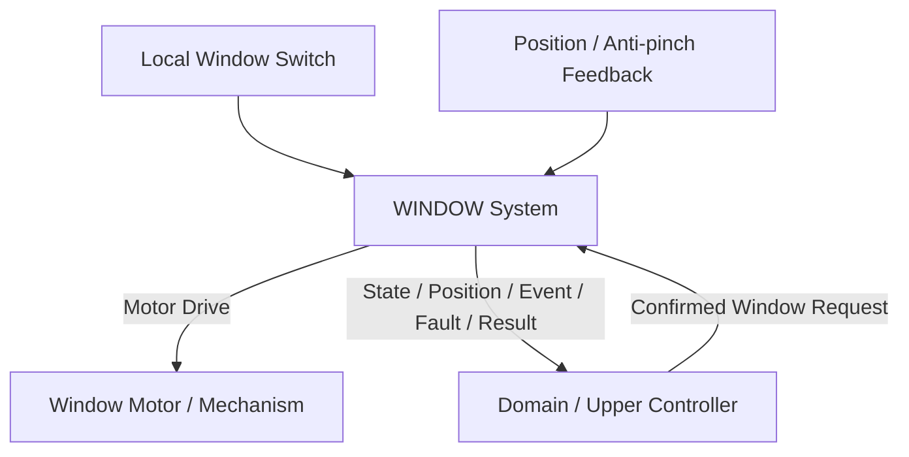
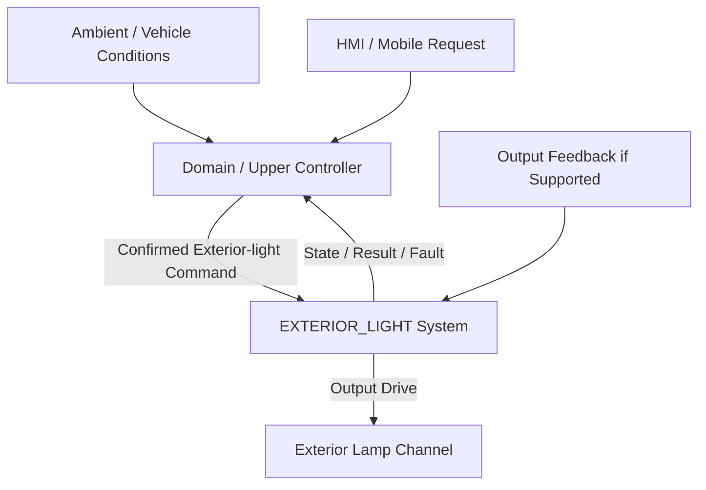

# 통합 차량 제어 시스템 요구사항 (SR)

## 0. 문서 안내

버전: v0.46 · 상태: 공유용 초안 · 수정일: 2026-09-18

이 문서는 사용자와 상위 시스템 관점에서 제공해야 할 기능, 책임, 정상·예외 동작을 정의한다. 상세 상태·입출력·성능 조건은 [시스템 요구사항 명세](sysRS.md)에 정의한다.

**표시 규칙:** 
    `[잠정]`은 초안에 적용한 임시 선택, 
    `[후보]`·`CANDIDATE`는 검증 전 값, 
    `[검토 필요]`·`TBD`는 결정이 남은 내용이다. 
    표시는 해당 요구와 함께 읽으며 구현·검증 완료를 뜻하지 않는다.

| 내용 | 위치 |
|---|---|
| 목적·범위·책임 | [개요](#sr-overview) · [범위](#sr-scope) · [용어](#sr-responsibility) |
| 도어·공조·실내 조명 | [BCM](#sr-bcm) |
| 실내·후방 센싱 | [CIS](#sr-cis) |
| 모바일 제어·표시 | [MOBILE](#sr-mobile) |
| 차량 음향 | [VSS](#sr-vss) |
| 창문 | [WINDOW](#sr-window) |
| 외부 조명 | [EXTERIOR_LIGHT](#sr-exterior-light) |
| 공통 요구·품질 | [영역 간 연계](#sr-integration) · [품질](#sr-quality) |

## 1. 목적

본 시스템은 사용자 요청과 차량 상태에 따라 도어 잠금, 실내 공조, 창문, 실내·외 조명을 제어하고 상태·오류·경고를 모바일 화면과 음향으로 제공한다. 실내 센싱과 후방 근접 감지는 각 기능이 사용하는 관측 결과와 유효성을 제공한다.

적용 대상은 프로젝트의 저전압 시연 시스템이다. 실제 차량의 양산 적합성이나 법규 충족을 보장하는 문서는 아니다.

## 2. 구성과 책임

| 영역 | 담당 기능 |
|---|---|
| 중앙 제어 | ESP32가 제공한 단말 등록·현재 연결 확인 결과를 사용한 차량 수준의 허용·중재, 확정 설정, 자동 기능과 후방을 포함한 차량 경고 판단 |
| BCM | 도어·실내 공조·실내 조명 실행, 결과 확인과 자체 보호 |
| CIS | 실내 탑승자·환경 관측, 후방 거리 측정과 유효성 제공 |
| MOBILE | 사용자 요청 생성, 차량 상태·결과·경고 표시 |
| ESP32 | 차량 측 무선 게이트웨이, 등록된 단말·현재 연결 확인, 디지털 키 근접 정보 제공 |
| VSS | 확정된 이벤트·위험 상태를 우선순위에 따라 음향으로 제공 |
| WINDOW | 창문 요청 실행, 위치·상태 제공과 끼임 즉시 보호 |
| EXTERIOR_LIGHT | 확정된 외부 조명 명령 실행, 출력 상태와 자체 보호 |

이 구분은 논리적 책임이다. 실제 보드 수·물리 배치·통신 경로는 별도로 정한다. 후방 근접 위험은 중앙 제어가 CIS의 거리값과 유효성을 받아 판단하며, 실행 노드의 자체 보호는 중앙 제어와 독립적으로 동작한다.

그림의 연결은 논리 정보 흐름이다. 시연 입력은 실물 입력이 준비되기 전의 모의 공급원이며, 실제 보드 배치·직접 통신 경로는 별도로 정한다.

## 3. 기능 범위

| 구분 | 기능·조건 |
|---|---|
| 기본 기능 | 도어 잠금/해제, 공기 순환·냉각/가열, 실내 조명 실행 |
| 기본 기능 | 목표 온도·자동 공조 설정, 조명 사용·밝기·색상 요청 |
| 기본 기능 | 탑승자 존재/인원수, 온도·습도·실내 조도, 후방 근접 위험과 품질 제공 |
| 지원 구성에 따라 제공 | 단일 창문 채널의 수동·상위 요청, 원터치·위치 이동, 끼임 보호 |
| [잠정] 자동 기능 | 자동 환기는 [§11.4](#sr-auto-profile)의 기본안 적용. 실제 허용·피드백 확인 필요 |
| [잠정] 경고 조건 | 잔류 탑승자·끼임·이탈 후 열린 도어 경고는 [§11.3](#sr-warning-rules)의 조건 적용 |
| [잠정] 외부 조명 구성 | 대표 1채널 ON/OFF·임시 점등 지원, 밝기 수준 조절·실제 점등 여부를 확인하는 피드백은 기본 구성에서 미지원 |
| 기본 모바일 범위 | 활성 화면의 인증된 연결에서 제어·즉시 경고 제공. **[잠정]** 디지털 키도 같은 활성 범위. 창문은 상태 표시 대상 |
| 선택 기능 | 모바일 백그라운드 연결·즉시 알림, 후방 감지의 후진 기어 연계 |
| [잠정] 시연 입력 | 차량 사용·사용자 이탈·외부 조도는 별도 시연 입력으로 연결 가능. 실제 센서 구성과 외부 자동 점등 조건은 확인 필요 |
| 현재 제어 범위 밖 | 모바일의 창문·외부 조명 원격 제어 |
| 영역별 제외 | CIS의 액추에이터 구동·음향 재생, EXTERIOR_LIGHT의 외부 조도 직접 측정·자동 정책 판단 |
| VSS 제외 | 자동 음량 조절, 일반 음악, 음원 파일 전송·스트리밍·믹싱 등 [음향 제외 범위](#sr-vss-s09) |

**[검토 필요]** 입력·정책 확인이 필요한 기능은 현재 요구에 포함되어 있으나 제공 조건이 완성되지 않았다. 이를 정상 사용 가능으로 표시하지 않으며, 관련 없는 정상 기능은 유지한다. 영역별 제외를 시스템 전체 기능의 삭제로 확대하지 않는다.

창문이 완전히 열린 위치나 닫힌 위치에 도달하거나 그 위치를 벗어난 변화를 구분해 알려야 한다. 이 정보를 사용할 기능과 전달 형식은 아직 정하지 않았다. VSS 보안 확장은 현재 기능 범위에 포함하지 않는 후속 후보이다.

## 4. 용어와 해석

| 용어 | 의미 |
|---|---|
| 중앙 제어 | ESP32의 등록·현재 연결 확인 결과를 사용하여 차량 수준의 허용·중재·자동 정책을 담당하는 논리 기능. 상위 시스템·중앙처리장치·Domain은 이 기능의 별칭 |
| 확정 명령 | 중앙 제어가 실행 대상으로 선택한 명령. 전체 설계 승인과는 별개 |
| 요청 / 결과 / 상태 / 이벤트 | 수행 의도 / 해당 요청의 처리 결과 / 현재 상태 / 발생한 사실 |
| 잠금 상태 / 개폐 상태 | 잠김·잠금 해제 여부 / 문이 실제로 닫히거나 열린 상태 |
| 설정 / 적용 / 물리 확인 | 사용자가 선택한 값 / 장치에 적용한 값 / 센서로 확인한 실제 결과 |
| 품질 / 최신성 / 단말 인증 | 정보의 사용 가능성 / 정보가 얼마나 오래되었는지 / 등록된 출처의 신뢰 |
| 존재 / 위험 | 관측한 탑승자 존재 / 차량 조건을 함께 판단한 위험 상태 |
| 자체 보호 | 실행 노드가 직접 확인한 조건에 따른 안전 정지·출력 제한 |
| 공조 | 실내 공기 순환·냉각·가열 |
| VSS | 차량 음향 시스템을 가리키는 약어 |
| BCM / CIS / MOBILE | 도어·실내 공조·실내 조명 실행 / 실내·후방 센싱 / 모바일 애플리케이션 |
| ESP32 | MOBILE과 중앙 제어 사이의 차량 측 무선 게이트웨이. 등록된 단말·현재 연결 확인과 디지털 키 근접 정보를 중앙 제어에 제공 |
| WINDOW / EXTERIOR_LIGHT | 창문 제어 / 외부 조명 실행 |
| 팬(Fan) / 끼임 보호(Anti-Pinch) | 공기 순환·열 제거 장치 / 끼임 감지에 따른 창문 정지·반전 보호 |

§5~10의 ‘시스템’은 각 절의 담당 영역을 뜻한다. 후보 수치와 미정 조건은 구현 전에 확인하며, 문서의 동작 설명만으로 시험 완료를 판단하지 않는다.

단말 인증은 등록된 기기와 해당 연결을 확인하는 뜻이다. 사용자별 권한 등급은 두지 않는다. 실행 허용·안전 보호·자원 중재는 단말 등록 여부와 별도로 적용한다.

## 5. BCM 기능 요구

### 5.1 목적

본 절은 확정된 실내 기능의 동작을 실제로 수행하고, 그 결과를 확인하여 되돌려 주는 BCM(Body Control Module)의 상위 요구사항을 정의한다.

BCM이 수행할 동작과 목표는 중앙 제어가 결정한다. BCM은 확정된 명령을 실행하고 그 결과를 확인하여 제공한다. BCM은 자체 보호 조건에 따라 실행을 거부하거나 중단할 수 있다.

### 5.2 기능 범위

BCM은 다음 기능을 실행한다. 도어·공조는 정의된 피드백을 확인하고, 실내 조명은 출력 지시의 적용 상태를 확인한다.

- 도어 잠금
- 실내 공기 순환 및 실내 온도 조절
- 실내 조명

각 기능은 서로 독립적으로 동작하며, 한 기능의 오류가 다른 기능의 수행을 중단시키지 않아야 한다.

#### 5.2.1 정보의 흐름

실내 온도나 주변 밝기와 같은 측정값은 BCM에 직접 제공되지 않는다. 측정값과 사용자 요청은 중앙 제어에서 종합되어 동작이 확정되며, BCM은 확정된 동작을 수행한다.

본 문서에서 **확정된**은 중앙 제어가 이미 정하여 내려보냈다는 뜻이다.

BCM은 확정된 동작을 수행하고 기능별 확인 범위에 따른 상태·결과를 중앙 제어에 제공한다.

BCM은 다른 기능 사이의 정보를 중계하지 않는다.

> 본 SR은 기능 경계만 정의한다.  
> MCU, 통신 프로토콜, 메시지 구조 및 액추에이터 하드웨어는 SysRS 이후 단계에서 구체화한다.

### 5.3 도어 잠금 실행 요구사항

#### 5.3.1 잠금 및 잠금 해제

- 시스템은 허용된 도어 잠금 요청이 확인되면 도어를 잠가야 한다.
- 시스템은 허용된 도어 잠금 해제 요청이 확인되면 도어의 잠금을 해제해야 한다.
- 시스템은 허용되지 않은 요청으로 도어 잠금 상태가 변경되지 않도록 해야 한다.
- 시스템은 현재 잠금 상태와 같은 상태를 요구하는 요청이 반복되더라도 도어 액추에이터를 불필요하게 반복 구동하지 않아야 한다.
- 시스템은 도어 잠금 동작이 정해진 시간을 넘겨 계속되지 않도록 해야 한다.

#### 5.3.2 잠금 상태와 개폐 상태

- 시스템은 도어가 잠겨 있는지와 열려 있는지를 서로 구분하여 관리해야 한다.
- 시스템은 중앙 제어가 도어의 잠금 여부와 개폐 여부를 각각 확인할 수 있도록 해야 한다.
- 시스템은 도어 상태를 신뢰할 수 없으면 이를 정상 상태로 단정하여 제공해서는 안 된다.
- 시스템은 도어가 잠겨 있으면서 동시에 열려 있는 등 실제로 성립할 수 없는 상태가 확인되면 이를 정상으로 처리해서는 안 된다.
- 시스템은 실제로 성립할 수 없는 상태를 임의의 정상 상태로 바꾸어 제공해서는 안 된다.

#### 5.3.3 요청 결과

- 시스템은 요청한 목표 잠금 상태가 확인된 경우에만 해당 요청을 정상 완료로 처리해야 한다. 목표 잠금 상태는 잠금 또는 잠금 해제 상태를 뜻한다.
- 시스템은 목표 잠금 상태가 확인되지 않으면 해당 요청의 결과와 이유를 제공해야 한다.

요청한 상태의 확인에 따른 음향은 [§8.4.2](#sr-vss-door-feedback)를 따른다. 도어 상태의 사용자 표시는 [§7.4.1](#sr-mobile-door-display)을 따른다.

**[검토 필요] 상태 확인 방법과 전달 시간**

- 잠금 여부와 닫힘 여부를 각각 별도의 스위치 입력으로 확인하는 안이다. 사용할 센서와 상태 판정 방법은 실제 장치에 맞춰 정해야 한다.
- 도어 동작 후 결과를 확인하는 시간과, 확인된 완료 사실을 VSS에 전달하는 시간을 시험해야 한다.
- 상세 확인 항목은 [SysRS 도어 확인 항목](sysRS.md#door-verification-items)에 연결한다.

### 5.4 실내 환경 실행 요구사항

> **[검토 필요]** 팬이 실제로 회전하는지, 냉각·가열 중 열을 충분히 배출하는지를 확인할 센서와 시험 방법이 필요하다. 센서 구성은 [SysRS §3.5](sysRS.md#demo-capabilities)의 임시안을 따른다.

- 자동 온도 조절·수동 공기 순환이 겹칠 때는 하나의 공조 동작을 선택해야 하며, 대체·정지된 기능이 이전 설정만으로 다시 시작되지 않아야 한다.

#### 5.4.1 실내 공기 순환

**공기 순환 실행·확인**

- 시스템은 확정된 세기로 실내 공기를 순환시켜야 한다.
- 시스템은 실내 공기가 실제로 순환되고 있는지 확인할 수 있어야 한다.

**확인 불가·지시 불일치**

- 시스템은 공기 순환 여부를 확인할 수 없는 경우 이를 정상 동작으로 처리하지 않아야 한다.
- 시스템은 확정된 세기와 실제 순환 상태가 일치하지 않는 경우 오류 상태로 처리해야 한다.

#### 5.4.2 실내 온도 조절

**냉각·가열 실행**

- 시스템은 확정된 방향에 따라 실내 공기를 식히거나 데워야 한다.
- 시스템은 확정된 세기로 냉각 또는 가열을 수행해야 한다.

**방열 확인·보호·방향 전환**

- 시스템은 냉각 또는 가열을 허용할 수 있도록 팬 동작과 방열부 상태를 확인할 수 있어야 한다.
- 확인할 수 없는 방열 상태를 정상으로 간주하지 않아야 한다.
- 시스템은 열이 배출되지 않거나 과열이 확인된 경우 냉각 또는 가열을 중단해야 한다.
- 시스템은 냉각과 가열이 전환될 때 장치에 손상이 발생하지 않도록 해야 한다.

**현재 동작 제공**

- 시스템은 현재 냉각 중인지 가열 중인지와 그 세기를 중앙 제어에서 확인할 수 있도록 해야 한다.

관련 SysRS: [Fan 지시·측정](sysRS.md#bcm-sys-cl-003) · [온도 허용](sysRS.md#bcm-sys-cl-007) · [방향 전환](sysRS.md#bcm-sys-cl-006) · [과열 복구](sysRS.md#bcm-sys-saf-010)

### 5.5 실내 조명 실행 요구사항

> 실내 조명은 일반·종료·경고·고장 알림으로 구분한다. 색상은 [SysRS 색상표](sysRS.md#bcm-light-colors)를 따른다. **[검토 필요]** 각 알림을 깜빡이게 할지, 어떤 간격으로 얼마나 오래 표시할지는 아직 정하지 않았다. 설정한 밝기가 실제 LED에서 어떻게 보이는지도 확인해야 한다.

**확정 알림의 실행**

- 시스템은 확정된 알림 종류에 따라 실내 조명을 켜야 한다.
- 시스템은 확정되지 않은 조명 요청을 정상적인 알림으로 실행하지 않아야 한다.

**적용 상태와 실제 점등 확인**

- 시스템은 현재 적용한 조명 알림 종류·밝기·색상과 적용 결과를 중앙 제어에서 확인할 수 있도록 해야 한다.
- 실제 점등 확인 여부는 별도로 구분해야 한다.

**적용 실패·오류 제공**

- 시스템은 조명 지시 적용에 실패한 경우 이를 정상 적용으로 처리하지 않아야 한다.
- 현재 구성은 실제 점등 여부 확인을 제공하지 않으며, 적용 성공만으로 실제 점등을 확인했다고 알려서는 안 된다.
- 시스템은 조명 관련 오류를 조명 이외의 방법으로 알려야 한다.

관련 SysRS: [조명 실행](sysRS.md#bcm-sys-al-001) · [적용·오류 처리](sysRS.md#bcm-lighting) · [물리 확인 가능 여부](sysRS.md#bcm-sys-int-013)

### 5.6 자체 안전 요구사항

본 절의 판단은 BCM이 직접 측정하는 정보에 근거하며, 차량의 다른 부분과 연결이 끊긴 상태에서도 수행되어야 한다.

**직접 확인에 따른 보호**

- 시스템은 도어가 닫혀 있는 것이 확인되지 않은 경우 도어를 잠그지 않아야 한다.
- 시스템은 발생한 열이 배출되는지 확인할 수 없거나 과열이 확인된 경우 냉각 또는 가열을 중단해야 한다.

**소프트웨어 정지 중 차단**

- 시스템은 동작이 정해진 시간을 넘겨 계속되는 경우 소프트웨어가 멈춘 상태에서도 해당 동작을 멈출 수 있어야 한다.

**기동 상태**

- 시스템은 전원이 켜질 때 모든 동작을 멈춘 상태에서 시작해야 한다.
- 시스템은 전원이 켜질 때 이전에 하던 동작을 다시 시작하지 않아야 한다.

**안전 거부 사유 제공**

- 시스템은 안전을 위해 요청을 수행하지 않은 경우 그 이유를 중앙 제어에 제공해야 한다.

**BCM은 자체 안전 판단에 따라 전달받은 명령의 실행을 거부할 수 있다.** 도어가 닫혀 있는지와 발생한 열이 배출되고 있는지는 BCM이 직접 확인하며, 동작이 전달되는 사이에 해당 상태가 바뀔 수 있다.

관련 SysRS: [로컬 보호](sysRS.md#sys-bcm-s09) · [오류별 복구](sysRS.md#bcm-recovery)

### 5.7 상태 및 오류 요구사항

**기능별 상태·오류·신뢰성**

- 시스템은 각 기능의 동작 상태를 서로 구분하여 중앙 제어에서 확인할 수 있도록 해야 한다.
- 시스템은 실제 동작 상태를 확인하지 못해 발생한 오류, 정보가 전달되지 않아 발생한 오류 및 동작 자체가 실패하여 발생한 오류를 서로 구분하여 제공해야 한다.
- 시스템은 신뢰할 수 없는 상태 정보를 현재 정상 상태로 제공하지 않아야 한다.

**새 요청의 유효성과 기존 동작**

- 시스템은 전달받은 동작 내용을 믿을 수 없는 경우 그 동작을 수행하지 않아야 한다.
- 시스템은 무관한 새 요청을 믿을 수 없다는 이유만으로 기존의 유효한 동작을 멈추지 않아야 한다.
- 기존 동작 자체의 허용 상실이나 안전 차단은 별도로 적용해야 한다.

**통신·오류 복구 후 재개**

- 시스템은 통신이 끊겼다가 복구된 뒤 마지막으로 받아 둔 내용만 보고 새로운 동작을 시작하지 않아야 한다.
- 시스템은 오류의 복구 조건이 충족되기 전에는 정상 동작을 재개하지 않아야 한다.
- 시스템은 복구 조건이 충족된 경우 새로 전달받은 내용에 의해서만 동작을 다시 시작해야 한다.

**고장 영향의 격리·미확정 동작**

- 시스템은 하나의 기능에서 발생한 오류를 이유로 독립적으로 수행 가능한 다른 기능을 중단시키지 않아야 한다.
- 시스템은 동작 중 오류가 발생한 경우 확정되지 않은 동작이 계속되지 않도록 해야 한다.

관련 SysRS: [새 명령 오류와 현재 동작](sysRS.md#bcm-sys-diag-004) · [오류별 복구](sysRS.md#bcm-recovery)

### 5.8 동작 품질 및 비기능 요구사항

**동작 시작·조명 전환의 응답성**

- 사용자의 요청에 대한 동작은 사용자가 조작 실패로 오인하지 않을 시간 안에 시작되어야 한다.
- 조명 알림의 전환은 사용자가 지연으로 인지하지 않을 시간 안에 수행되어야 한다.

**요청 결과의 일관성**

- 동일한 요청은 정상 동작 상태에서 일관된 결과를 제공해야 한다.

**실제 평가 조건의 확정**

- 실제 동작 값과 평가 조건은 적용 장치 및 시험 환경이 확정된 후 정의되어야 한다.

관련 SysRS: [기동 기한](sysRS.md#bcm-sys-perf-001) · [조명 전환 기한](sysRS.md#bcm-sys-perf-004) · [예측 가능성](sysRS.md#bcm-sys-nfr-004) · [시험 가능성](sysRS.md#bcm-sys-nfr-009)

### 5.9 중앙 제어 연계 원칙

**확정 명령과 실행 방법의 경계**

- BCM에는 이미 결정된 동작이 제공되어야 하며, 그 결정에 사용된 정보가 함께 제공될 필요는 없다.
- 동작 수준과 방향은 BCM이 해석 가능한 형태로 제공되어야 한다.
- BCM의 세부 동작 수행 방법은 상위 차량 기능이 직접 제어하지 않아야 한다.

**상태·결과·안전 거부**

- BCM이 제공하는 상태, 동작 결과 및 오류는 중앙 제어에서 활용 가능해야 한다.
- BCM의 자체 안전 판단에 의한 명령 거부는 정상 응답으로 처리되어야 한다.

관련 SysRS: [명령 수용](sysRS.md#sys-bcm-s04) · [명령 의미](sysRS.md#sys-bcm-s05) · [제공 정보](sysRS.md#if-bcm-s03)

### 5.10 범위 요약

> **BCM은 확정된 실내 기능의 동작을 받아
> 도어 잠금, 실내 공기 순환 및 온도, 실내 조명을 실제로 동작시키고,
> 그 결과와 오류를 되돌려 주는 실행 시스템이다.**

BCM의 자동 기능·목표 판단은 중앙 제어가 담당한다. 이를 위한 외부 환경 측정값은 BCM에 직접 제공하지 않으며, BCM은 자체 보호와 결과 확인에 필요한 도어·팬·방열 정보를 직접 확인한다.

BCM은 **직접 확인한 정보에 따른 자체 안전 판단**을 수행하며, 그 판단에 따라 전달받은 명령의 실행을 거부할 수 있다.

## 6. CIS 기능 요구

### 6.1 목적

본 절은 탑승자 존재 여부·인원수, 실내 온도·습도·조도와 후방 물체까지의 거리를 확인하는 CIS(Cabin Interior Sensing)의 상위 요구사항을 정의한다.

CIS는 측정·판정 결과와 각 결과의 유효성을 중앙 제어에 제공한다. 중앙 제어는 후방 거리값을 이용해 주의·긴급·해제 상태를 판단하고, VSS는 전달받은 상태에 따라 경고음을 제공한다.

### 6.2 기능 범위

CIS는 다음 기능을 제공해야 한다.

- 실내 탑승자 존재 여부 판정
- 실내 탑승자 인원수 판정
- 실내 온도 측정
- 실내 습도 측정
- 조도 측정
- 초음파 센서를 이용한 후방 물체와의 거리 측정·필터링
- 위 판정·측정 결과의 유효성 판단
- 판정·측정 결과를 중앙 제어로 제공

#### 6.2.1 정보의 흐름

| 담당 | 수행할 일 | 다음 전달 대상 |
|---|---|---|
| CIS | 탑승자·환경 관측, 초음파 거리 측정·필터링, 값의 유효성 확인 | 중앙 제어에 측정값·유효성·측정 시점 제공 |
| 중앙 제어 | 유효한 후방 거리로 주의·긴급·해제 판단, 필요한 기능에 판단 결과 전달 | VSS에 후방 위험 상태·품질 제공 |
| VSS | 받은 위험 상태와 다른 경고의 우선순위에 따라 음향 제공 | 중앙 제어에 동작 상태·오류 제공 |

실제 처리 보드, 센서 모델, 물리 통신 경로와 메시지 형식은 별도 설계에서 정한다.

### 6.3 기능 경계

> **[검토 필요]** 경고가 발생하고 해제되는 조건과 시험용 입력은 [§11.3](#sr-warning-rules)에 정리했다. 실제 장치가 필요한 상태를 구분해 감지할 수 있는지, 그 결과를 얼마나 빨리 전달하는지는 시험해야 한다.

- CIS는 후방 위험 상태에 대응하는 음향을 직접 재생하지 않는다.
- CIS는 도어 잠금, 파워윈도우 등 차량 액추에이터를 직접 제어하지 않는다.
- CIS는 판정 결과와 측정값을 중앙 제어에 제공해야 한다. 후방 위험 수준은 중앙 제어가 판단하며, CIS가 VSS에 거리나 위험 상태를 직접 제공하지 않는다.

### 6.4 탑승자 인식 요구사항

> **[검토 필요]** 차 안에 사람이 있다는 관측만으로 잔류 위험을 판단하지 않는다. [§11.3](#sr-warning-rules)의 차량 사용 종료·사용자 이탈 조건도 함께 확인한다. 실제 센서와 차량 입력으로 이 조건들을 구분할 수 있는지 시험해야 한다.

**탑승자 존재·인원수 판정**

- 시스템은 실내 영상을 이용하여 탑승자 존재 여부를 판정해야 한다.
- 시스템은 실내 영상을 이용하여 탑승자 인원수를 판정해야 한다.

**판정 유효성·비전 복구**

- 시스템은 탑승자 판정 결과의 유효 여부를 구분해야 한다.
- 시스템은 비전 정보를 신뢰할 수 있기 전에는 해당 정보에 기반한 판정 결과를 확정하지 않아야 한다.
- 시스템은 비전 오류의 복구 조건이 충족되기 전에는 탑승자 상태를 정상으로 확정하지 않아야 한다.

**실내 영상의 사용 범위**

- 시스템은 실내 영상을 탑승자 인식 목적 범위를 벗어나 저장하거나 외부로 전송하지 않아야 한다.

관련 SysRS: [존재·인원수 일관성](sysRS.md#cis-sys-fun-005) · [비전 복구](sysRS.md#cis-sys-fun-007) · [영상 사용 범위](sysRS.md#cis-sys-fun-027)

### 6.5 실내 환경 센싱 요구사항

> **[검토 필요]** 온도·습도·실내 조도 센서의 측정 범위와 정확도를 확인해야 한다. 실내 조도와 외부 자동 점등에 사용하는 외부 조도는 서로 다른 입력이다.

**실내 환경 측정**

- 시스템은 실내 온도를 측정해야 한다.
- 시스템은 실내 습도를 측정해야 한다.
- 시스템은 조도를 측정해야 한다.

**측정 유효성·센서 복구**

- 시스템은 측정 정보의 유효 여부를 구분해야 한다.
- 시스템은 센서 정보를 신뢰할 수 있기 전에는 해당 정보에 기반한 값을 확정하지 않아야 한다.
- 시스템은 센서 오류의 복구 조건이 충족되기 전에는 측정값을 정상으로 확정하지 않아야 한다.

관련 SysRS: [환경값별 품질](sysRS.md#cis-sys-fun-011) · [센서 복구](sysRS.md#cis-sys-fun-013)

### 6.6 후방 근접 감지 요구사항

**후방 감지의 검토 사항**

> **[검토 필요]** 실제 초음파 센서로 물체가 없는 경우와 측정에 실패한 경우를 구분할 수 있는지 확인해야 한다.
>
> - 측정 가능한 거리 범위·정확도, 차량에서 감지를 허용하는 입력, 측정부터 전달까지 걸리는 시간도 시험해야 한다.
> - 주의·긴급을 나누는 거리 기준은 중앙 제어가 관리한다.

**거리 측정·유효성·중앙 제공**

- 시스템은 후방 물체와의 거리를 측정해야 한다.
- 시스템은 거리 측정 정보의 유효 여부를 구분해야 한다.
- CIS는 측정한 거리와 유효성, 측정 시점과 새 측정 여부를 중앙 제어에 함께 제공해야 한다.
- CIS는 정상적으로 물체가 없음을 확인한 경우와 센서 무응답·범위 밖·측정 실패를 구분해야 한다.
- 실패한 측정에 임의의 거리값을 넣어 정상 정보로 제공해서는 안 된다.

**기본 활성과 후진 연계 경계**

- CIS는 유효한 차량 전원 허용 상태에서 후방 감지를 상시 제공해야 한다.
- 차량 후진(R단) 여부에 따른 후방 위험 판단 및 경고음 재생 여부는 중앙 제어가 전담하며, CIS는 차량 전원 허용 시 상시 측정하여 중앙 제어에 제공한다.
- 감지 비활성 및 활성 조건 확인 불가를 정상 위험 해제와 구분해야 하며, 재활성 시 과거 측정값을 재사용하지 않고 새 측정을 제공해야 한다.

### 6.7 데이터 유효성 및 오류 요구사항

**입력 유효성 확인**

- 시스템은 센서 입력이 유효 범위를 벗어난 경우 해당 정보를 정상 정보로 사용하지 않아야 한다.
- 시스템은 실내 영상 품질이 인식 기준을 만족하지 못하는 경우 해당 판정 결과를 정상 정보로 사용하지 않아야 한다.

**고장 영향의 격리·과거 값 구분**

- 시스템은 특정 센서 또는 비전 기능에 오류가 발생하더라도, 오류와 무관한 다른 판정·측정 기능을 불필요하게 중단하지 않아야 한다.
- 시스템은 통신 오류 동안 마지막 정상 값을 현재 정상 값으로 표시하지 않아야 한다.

**관측 결과의 일관성·기능별 복구**

- 같은 시점의 탑승자 존재 여부와 인원수가 서로 모순되면 정상 판정으로 제공해서는 안 된다.
- 확인할 수 있는 독립 정보는 유지되어야 한다.
- 오류 복구는 영향 받은 기능의 새로운 정상 정보로 확인해야 하며, 한 기능 또는 통신의 복구만으로 모든 센싱 기능이 정상으로 돌아왔다고 표시해서는 안 된다.

관련 SysRS: [전체 상태](sysRS.md#sys-cis-s03) · [값별 품질](sysRS.md#cis-quality-contract) · [기능별 복구](sysRS.md#cis-recovery-contract)

### 6.8 중앙 제어 연계 요구사항

> **[검토 필요]** 상태를 보내는 간격과 생성 후 사용할 수 있는 시간은 [SysRS §2.5](sysRS.md#common-freshness-profile)의 임시값을 따른다. 실제 통신으로 이 조건을 지킬 수 있는지 시험해야 한다.

**관측 결과·유효성·오류·복구의 제공**

- 시스템은 유효한 탑승자 판정 결과, 환경 측정값과 후방 거리 측정값을 중앙 제어로 전송해야 한다.
- 시스템은 판정 결과 및 측정값을 정의된 주기로 갱신하여 제공해야 한다.
- 시스템은 판정 결과와 측정값을 제공할 때 각 값의 유효 여부도 제공해야 한다.
- 시스템은 통신 오류가 발생한 경우 해당 오류 상태를 중앙 제어가 식별할 수 있도록 제공해야 한다.
- 시스템은 통신 오류가 해제되고 새로운 유효 값이 확인된 경우에만 정상 전송을 재개해야 한다.
- 같은 측정값을 다시 보내더라도 측정 시점을 새로 바꾸어서는 안 된다.
- 중앙 제어는 측정값이 오래됐는지와 새로 측정한 값인지를 구분할 수 있어야 한다.

### 6.9 기능 제외 범위

> **[검토 필요]** 후방 센서의 정상 미감지·측정 실패 구분, 범위·정확도·활성 입력·전달 시간과 중앙 거리 기준의 검토 사항은 [§6.6](#sr-cis-s06)을 따른다.

본 CIS 범위에는 다음 기능을 포함하지 않는다.

- 후방 위험 상태에 대응하는 음향 출력 및 재생 (VSS 담당)
- 도어 잠금, 파워윈도우 등 차량 액추에이터 제어
- 후방 거리로 주의·긴급·해제를 판단하는 기능 (중앙 제어 담당)
- 후방 거리값을 중앙 제어 이외의 노드에 직접 제공하는 기능

CIS는 **탑승자·환경 관측 결과와 후방 거리값을 유효성과 함께 중앙 제어에 제공하는 기능**을 담당한다.

### 6.10 중앙 제어 연계 원칙

**측정 결과의 전달과 처리 책임**

- CIS는 영상 원본이나 초음파 수신 파형처럼 가공 전의 센서 자료를 외부로 보내지 않아야 한다.
- 계산·필터링한 거리값과 탑승자·환경 결과는 중앙 제어에 제공해야 한다.
- 중앙 제어는 CIS가 제공한 거리의 단위·유효성·측정 시점을 확인한 뒤 후방 위험 판단에 사용해야 한다.
- CIS의 세부 인식·센싱 처리 방법은 상위 차량 기능이 직접 제어하지 않아야 한다.
- CIS의 상태 및 오류는 중앙 제어에서 활용 가능해야 한다.

### 6.11 범위 요약

> **CIS는 탑승자·실내 환경을 관측하고 후방 거리를 측정하여, 각 결과와 유효성을 중앙 제어에 제공한다. 후방 위험 판단은 중앙 제어가, 음향 출력은 VSS가 담당한다.**

## 7. MOBILE 기능 요구

### 7.1 목적

본 절은 사용자가 차량에서 떨어진 위치에서 차량 상태를 확인하고 허용된 기능을 제어할 수 있도록 하는 모바일 인터페이스의 상위 요구사항을 정의한다.

모바일 인터페이스는 사용자 제어 요청을 생성하고, 차량이 확정한 상태와 처리 결과를 사용자가 오해 없이 인지할 수 있도록 제공한다.

### 7.2 기능 범위

모바일 인터페이스는 다음을 제공한다.

- 허용된 차량 기능에 대한 사용자 제어 요청 생성
- 제어 요청의 처리 결과 및 사유 제공
- 차량 상태 및 오류 정보 제공
- 안전 관련 경고 및 중요 상태 변화 알림
- 차량 연결 가능 상태 제공

**차량의 수행 결정**

- 모바일 인터페이스는 차량 기능을 직접 수행하지 않는다.
- 요청을 생성할 뿐이며, 실제 수행 여부는 각 기능의 허용 조건과 안전 정책에 따라 차량이 결정한다.

#### 7.2.1 정보의 흐름

**요청 전달과 차량 결정**

- 모바일 인터페이스는 사용자 입력으로부터 제어 요청을 생성하여 차량에 전달한다.
- 요청의 허용 여부와 실제 수행은 차량이 결정하며, 모바일 인터페이스는 그 결과를 받아 표시한다.

**차량이 확정한 상태 제공**

- 차량 상태는 차량이 확정한 형태로 제공받으며, 모바일 인터페이스가 자체적으로 상태를 추정하거나 보정하지 않는다.

> 본 SR은 기능 경계만 정의한다.  
> 차량 측 무선 게이트웨이는 ESP32를 사용한다. 무선 방식, 데이터 형식, 메시지 구조 및 ESP32와 중앙 제어 사이의 세부 인터페이스는 SysRS와 후속 상세 설계에서 구체화한다.

### 7.3 사용자 제어 요청 요구사항

**요청 생성·처리 결과**

- 사용자는 허용된 차량 기능에 대한 제어 요청을 생성할 수 있어야 한다.
- 시스템은 제어 요청의 접수, 진행, 완료, 거부, 중단 및 실패 결과를 사용자에게 제공해야 한다.
- 시스템은 제어 요청이 거부되거나 실패한 경우 그 사유를 사용자에게 제공해야 한다.

**전송·수행 완료와 결과 이력**

- 시스템은 요청 전송이 완료된 상태와 차량에서 실제 수행이 완료된 상태를 구분하여 사용자에게 제공해야 한다.
- 최근 제어 요청 5건의 수행 결과를 사용자가 확인할 수 있어야 한다.

**자동 재전달 방지**

- 차량 연결이 종료된 경우 이전 사용자 요청이 자동으로 다시 전달되어서는 안 된다.

**요청 설정·반영 설정·현재 동작의 구분**

- 요청한 설정과 차량이 반영한 설정, 현재 차량 동작은 구분되어 제공되어야 한다.
- 설정 반영 완료를 실제 동작 목표 달성으로 표시해서는 안 된다.

관련 SysRS: [전송·수행 구분](sysRS.md#mb-sys-req-003) · [결과 미확인](sysRS.md#mb-sys-req-004) · [최근 요청 이력](sysRS.md#mb-sys-req-010) · [사용자 재요청](sysRS.md#mb-sys-req-011)

#### 7.3.1 제어 대상

모바일 인터페이스가 제어 요청을 생성할 수 있는 대상은 다음과 같다.

- 도어 잠금 및 잠금 해제
- 목표 온도 설정 및 자동 공조 사용 여부
- 실내 공기 순환 세기 선택
- 실내 조명 사용 여부, 밝기 및 색상
- 근접에 의한 자동 잠금 해제 사용 여부

관련 SysRS: [허용된 제어 대상](sysRS.md#mb-sys-req-001) · [요청 대상·값](sysRS.md#mb-sys-int-014) · [중복·순서 식별](sysRS.md#mb-sys-int-015)

### 7.4 차량 상태 표시 요구사항

#### 7.4.1 표시 대상

각 기능이 제공하는 상태 정보, 요청 처리 결과 및 오류 상태가 사용자에게 제공되어야 한다. 표시 대상은 다음과 같다.

**도어**

- 잠금 상태: 도어가 잠겨 있는지 여부
- 개폐 상태: 도어가 열려 있는지 여부
- 도어 상태의 이상 여부
- 도어 관련 오류

관련 SysRS: [잠금·개폐 구분](sysRS.md#mb-sys-dsp-006) · [이상 조합](sysRS.md#mb-sys-dsp-007) · [도어 상태 수신](sysRS.md#mb-sys-int-001) · [도어 이상 수신](sysRS.md#mb-sys-int-002)

**실내 환경**

- 자동 공조 사용 여부
- 현재 실내 온도와 설정한 목표 온도
- 설정한 공기 순환 세기와 실제로 순환되고 있는 세기
- 현재 냉각 중인지 가열 중인지와 그 세기
- 실내 환경 관련 오류

관련 SysRS: [요청·설정·현재 상태](sysRS.md#mb-sys-dsp-008) · [안전 정책 미적용 사유](sysRS.md#mb-sys-dsp-009) · [현재·목표 온도](sysRS.md#mb-sys-int-003) · [순환 설정·적용·측정](sysRS.md#mb-sys-int-004) · [온도 장치 출력·상태](sysRS.md#mb-sys-int-005)

**실내 조명**

- 조명 사용 설정과 현재 적용 밝기. 실제 점등 여부 확인이 지원되지 않으면 그 사실도 구분
- 현재 적용한 조명 알림 종류
- 조명 관련 오류

관련 SysRS: [설정 반영과 물리 확인 구분](sysRS.md#mb-sys-dsp-008) · [조명 설정·적용·확인](sysRS.md#mb-sys-int-007)

**기타 차량 기능**

- 창문의 동작 상태와 요청 처리 결과
- 차량이 확정한 실내 환경 정보와 탑승자 유무
- 음향 기능의 오류

관련 SysRS: [화면·제공 정보](sysRS.md#sys-mobile-s06) · [WINDOW 상태·결과](sysRS.md#mb-sys-int-018) · [CIS 정보·품질](sysRS.md#mb-sys-int-019) · [VSS 고장·가용성·이력](sysRS.md#mb-sys-int-020)

#### 7.4.2 정보 신뢰성 표시 원칙

**최신성 표시와 과거 정상값의 사용 제한**

- 차량 상태 정보가 최신이 아닌 경우 최신 상태가 아님이 사용자에게 표시되어야 한다.
- 상태 정보를 신뢰할 수 없는 경우 마지막 정상 값이 현재 정상 상태로 표시되어서는 안 된다.

**오류 종류와 확인 불가의 구분**

- 차량이 상태를 확인하지 못해 발생한 오류, 정보가 전달되지 않아 발생한 오류 및 동작 자체가 실패하여 발생한 오류는 사용자가 구분할 수 있도록 표시되어야 한다.
- 상태를 확인할 수 없는 경우 확인 불가 상태임이 표시되어야 하며, 임의의 값으로 대체되어서는 안 된다.

**안전 정책에 의한 미적용 사유**

- 사용자 설정이 안전 정책에 의해 적용되지 않는 경우 그 사유가 제공되어야 한다.

관련 SysRS: [신뢰성별 표시](sysRS.md#mb-sys-dsp-002) · [확인 불가·미수신](sysRS.md#mb-sys-dsp-003) · [STALE 수신 시점](sysRS.md#mb-sys-dsp-004) · [표시 시점 품질 갱신](sysRS.md#mb-sys-sem-008) · [오류 구분](sysRS.md#mb-sys-sem-006) · [오류 분류 수신](sysRS.md#mb-sys-int-012)

안전·진단 관련 SysRS: [안전 상태 단정 금지](sysRS.md#mb-sys-saf-002) · [분류별 표시](sysRS.md#mb-sys-diag-001) · [연결·차량 오류 구분](sysRS.md#mb-sys-diag-002) · [대응 행동](sysRS.md#mb-sys-diag-003) · [오류 해제 근거](sysRS.md#mb-sys-diag-004)

### 7.5 경고 및 알림 요구사항

> **[검토 필요]** 경고가 발생하고 해제되는 조건은 [§11.3](#sr-warning-rules)에 정리했다. 시연에서는 일부 상태를 시험용 입력으로 대신한다. 실제 센서로 이 상태를 구분할 수 있는지와 경고가 화면에 전달되는 시간을 확인해야 한다.

**기본 데모의 제공 범위**

- 기본 데모의 제어·즉시 경고 제공은 앱 화면이 활성화되고 인증된 연결이 유지되는 범위로 한다.
- 백그라운드 연결·즉시 알림은 선택 기능이며, 기본 구성에서는 재진입 후 현재 경고와 보관된 미확인 이력을 확인할 수 있어야 한다.

**경고 우선순위와 식별**

- 안전 보호 동작 또는 위험 경고는 일반 상태 정보보다 우선하여 사용자가 식별할 수 있도록 제공되어야 한다.
- 안전 관련 경고 및 중요 상태 변화는 일반 상태 정보와 구분되어 제공되어야 한다.

**미확인 경고의 존재**

- 사용자가 확인하지 않은 중요 경고가 존재하는 경우 해당 경고 상태를 확인할 수 있어야 한다.

**이탈 후 열린 도어 상태**

- 사용자 이탈이 확인된 상태에서 도어가 열린 상태로 유지되는 경우 해당 상태가 사용자에게 제공되어야 한다.

**사용자 확인과 경고 유지**

- 사용자가 경고를 확인한 이후에도 해당 상태가 유효한 동안에는 상태 자체가 유지되어 표시되어야 한다.

**실제 감지·모의 경고·백그라운드 지원의 구분**

- 위 경고의 즉시 제공 범위는 기본 데모의 활성 화면·연결 조건을 따른다.
- 모의 경고는 시연임을 표시하며 실제 감지와 구분한다.
- 실제 감지 장치가 없는 기능의 감지 지원은 미완료이며, 백그라운드 미지원과 구분한다.

관련 SysRS: [경고 우선 표시](sysRS.md#mb-sys-alt-001) · [발생·확인 구분](sysRS.md#mb-sys-alt-004) · [확인 후 경고 유지](sysRS.md#mb-sys-alt-005) · [기본·선택 알림 범위](sysRS.md#mb-sys-alt-006) · [재진입 후 조회](sysRS.md#mb-sys-alt-007) · [경고·품질·이력 수신](sysRS.md#mb-sys-int-011) · [안전 경고 우선 전달](sysRS.md#mb-sys-int-013)

안전 관련 SysRS: [경고 가림 방지](sysRS.md#mb-sys-saf-001) · [확인에 의한 해제 금지](sysRS.md#mb-sys-saf-005)

### 7.6 단말 등록 및 통신 안전 요구사항

**등록·출처 확인과 중복 수행 방지**

- 차량에 등록된 단말에서만 원격 차량 제어 기능이 제공되어야 한다.
- 차량에서 온 정보임을 확인할 수 없는 경우 새로운 차량 제어 요청이 생성되어서는 안 된다.
- 같은 제어 요청이 두 번 전달되거나 늦게 전달되더라도 차량에서 반복 수행되지 않아야 한다.

**등록 정보와 승인·확인**

- 단말 등록에 사용하는 내부 정보는 사용자가 직접 열람하거나 입력하지 않아야 한다.
- 기기 등록의 승인·확인 조작은 제공할 수 있어야 한다.

**등록 해제**

- 단말에서 차량 등록을 해제하면 해당 등록 정보를 삭제하고 연결 및 새 요청을 중단해야 한다.

관련 SysRS: [등록·현재 연결 확인](sysRS.md#mb-sys-req-009) · [중복 실행 방지](sysRS.md#com-sys-req-002) · [등록 키·승인](sysRS.md#mb-sys-sec-001) · [등록 해제](sysRS.md#mb-sys-sec-005) · [등록 계약](sysRS.md#device-registration-contract) · [등록·연결 확인 응답](sysRS.md#mb-sys-int-016)

#### 7.6.1 디지털 키 요구사항

**등록된 단말과 차량 측 판단**

- 차량에 등록된 단말은 해당 차량의 디지털 키로 사용될 수 있어야 한다.
- 자동 잠금 해제 사용이 설정되고 등록된 단말의 유효한 접근이 차량에서 확인된 경우, 차량의 실행 허용 조건에 따라 도어 잠금이 해제되어야 한다.
- 단말의 근접 여부는 차량 측 ESP32가 판단하고, 자동 잠금 해제 명령 생성 여부는 중앙 제어가 등록·현재 연결·근접 정보와 차량 실행 허용 조건을 확인하여 판단해야 한다.

**사용 설정과 실제 잠금 해제의 구분**

- 사용자는 근접에 의한 자동 잠금 해제의 사용 여부를 설정하고 차량에 반영된 설정을 확인할 수 있어야 한다.
- 근접에 의한 잠금 해제가 실제로 수행된 경우 그 사실이 사용자 요청에 의한 잠금 해제와 구분되어 제공되어야 한다.

**등록 해제**

- 차량 등록이 해제된 단말은 디지털 키로 사용되지 않아야 한다.

**기본 시연·초기 설정·동일 접근의 제한**

- **[잠정]** 기본 시연은 앱 화면이 활성화되고 등록된 연결이 확인된 동안 제공해야 한다.
- 화면 비활성·앱 종료 시의 디지털 키 동작은 기본 제공 범위에 포함하지 않아야 한다.
- **[잠정]** 자동 잠금 해제는 초기에는 사용하지 않는 상태여야 한다.
- 단말이 가까이 머무르는 동안 사용자가 다시 잠근 도어를 같은 접근으로 자동 해제하지 않아야 한다.

관련 SysRS: [응답 유지](sysRS.md#mb-sys-dk-001) · [근접 판정 책임](sysRS.md#mb-sys-dk-002) · [설정 전달](sysRS.md#mb-sys-dk-003) · [반영 설정 확인](sysRS.md#mb-sys-dk-004) · [실제 해제 구분](sysRS.md#mb-sys-dk-005) · [응답 유지 중단](sysRS.md#mb-sys-dk-006) · [새 접근·수동 잠금](sysRS.md#com-sys-dk-003)

### 7.7 연결 상태 요구사항

**연결 상태·요청 가능 여부**

- 사용자가 현재 차량과의 연결 가능 상태를 확인할 수 있어야 한다.
- 연결이 불가능한 상태에서는 제어 요청이 생성되지 않아야 하며 그 사유가 제공되어야 한다.

**복구 후 최신 상태와 이전 요청**

- 연결이 복구된 경우 차량에서 확정한 최신 상태로 표시가 갱신되어야 한다.
- 연결 복구만을 근거로 이전 요청이 재수행되어서는 안 된다.

**제한된 자동 재연결**

- **[잠정]** 활성 화면의 예기치 않은 단절에는 횟수·시간이 제한된 자동 재연결을 제공해야 한다.
- 한도에 도달하면 사유를 표시하고 사용자 조작을 기다려야 하며, 사용자의 연결 해제나 인증 실패를 자동 재시도로 우회하지 않아야 한다.

관련 SysRS: [연결 상태](sysRS.md#mb-sys-con-001) · [자동 재연결 조건](sysRS.md#mb-sys-con-002) · [복구 후 조회](sysRS.md#mb-sys-con-004) · [기본 연결 동작](sysRS.md#mobile-behavior)

### 7.8 동작 품질 및 비기능 요구사항

**구분 가능한 표시와 결과 제공 시간**

- 서로 다른 의미를 가진 상태와 경고는 사용자가 구분할 수 있어야 한다.
- 제어 요청에 대한 결과는 사용자가 조작 실패로 오인하지 않을 시간 안에 제공되어야 한다.

**동일 조건에서의 일관성**

- 동일한 요청과 관련 차량 상태·설정·허용 조건이 같을 때 일관된 결과를 제공해야 한다.

**현재 상태 구분과 평가 조건**

- 상태 표시는 사용자가 현재 차량 상태와 과거 정보를 혼동하지 않도록 제공되어야 한다.
- 실제 표시 형식과 평가 조건은 적용 단말 및 시험 환경이 확정된 후 정의되어야 한다.

관련 SysRS: [상태 갱신 기한](sysRS.md#mb-sys-perf-001) · [전송 상태 표시 기한](sysRS.md#mb-sys-perf-002) · [결과 대기](sysRS.md#mb-sys-perf-003) · [경고 표시 기한](sysRS.md#mb-sys-perf-004) · [표시 일관성](sysRS.md#mb-sys-nfr-004) · [검증 기준 후보](sysRS.md#sys-mobile-s12) · [설계값 후보](sysRS.md#sys-mobile-s13)

### 7.9 중앙 제어 연계 원칙

**차량이 제공하는 정보**

- 모바일 인터페이스에는 각 기능이 확정한 상태가 유효성과 함께 제공되어야 한다.
- 모바일 인터페이스에는 제어 요청의 처리 결과와 거부 또는 실패 사유가 제공되어야 한다.
- 모바일 인터페이스에는 안전 관련 경고가 일반 상태와 구분 가능한 형태로 제공되어야 한다.
- 모바일 인터페이스에는 상태 정보의 최신 여부를 판단할 수 있는 근거가 함께 제공되어야 한다.

**차량 측 허용·등록 확인 책임**

- 모바일 인터페이스의 요청은 차량 기능의 허용 조건을 우회하지 않아야 한다.
- 등록된 단말인지와 해당 연결을 사용할 수 있는지에 대한 최종 확인은 차량 측에서 수행되어야 한다.

관련 SysRS: [차량 측 요청 수용·실행 허용 판단](sysRS.md#com-sys-aut-001) · [개별 품질과 요청 제한](sysRS.md#mb-sys-req-012) · [등록 확인 결과 반영](sysRS.md#mb-sys-sec-006) · [상태·신뢰성 결합](sysRS.md#mb-sys-sem-001) · [최신성 근거](sysRS.md#mb-sys-sem-002) · [경고·위험 등급](sysRS.md#mb-sys-sem-005) · [상태 품질 수신](sysRS.md#mb-sys-int-008) · [최신성 근거 수신](sysRS.md#mb-sys-int-009) · [원 요청 결과·현재 순서](sysRS.md#mb-sys-int-010)

안전 관련 SysRS: [앱 오류의 영향 분리](sysRS.md#mb-sys-saf-004) · [차량 판단 대체 금지](sysRS.md#mb-sys-saf-006)

### 7.10 범위 요약

> **모바일 인터페이스는 사용자의 제어 요청을 생성하여 차량에 전달하고,
> 차량이 확정한 상태·처리 결과·경고를 사용자에게 제공하고 각 정보의 신뢰성을 구분해 표시하는
> 원격 사용자 인터페이스이다.**

**요청 생성과 실제 수행의 구분**

- 모바일 인터페이스는 요청을 생성할 뿐이며 **차량 기능의 실제 수행 여부를 보장하지 않는다.**

**완료·신뢰성 표시의 원칙**

- 상태 표시에서는 **전송 완료와 수행 완료를 구분**하고, **신뢰할 수 없는 정보를 정상 상태로 표시하지 않는다.**

관련 SysRS: [미확인 결과의 성공 표시 금지](sysRS.md#mb-sys-saf-003) · [MOBILE 기능 범위](sysRS.md#sys-mobile-s15)

## 8. VSS 기능 요구

### 8.1 목적

본 절은 차량의 상태 및 안전 관련 이벤트를 사용자가 음향으로 인지할 수 있도록 하는
차량 음향 시스템(VSS)의 상위 요구사항을 정의한다.

VSS는 차량의 다른 기능에서 확정된 상태 또는 이벤트를 음향으로 표현하며,
안전 관련 경고가 일반 피드백보다 우선적으로 인지될 수 있도록 해야 한다.

관련 SysRS: [확정 의미 입력 수용](sysRS.md#vss-sys-fun-002) · [동일 의미의 음향 일관성](sysRS.md#vss-sys-fun-004)

### 8.2 기능 범위

VSS는 다음 차량 이벤트에 대한 음향 출력을 제공해야 한다.

- 차량 사용 시작 및 종료
- 도어 잠금 및 잠금 해제
- 도어 잠금 이상
- 파워윈도우 안티핀치
- 잔류 탑승자 위험
- 후방 장애물 접근 및 충돌 위험
- VSS 상태 및 오류 정보 제공

#### 8.2.1 VSS 중앙 제어 컨텍스트

> 본 SR의 컨텍스트 다이어그램은 기능 경계만 표현한다.  
> MCU, 통신 프로토콜, 메시지 구조 및 오디오 하드웨어는 SysRS 이후 단계에서 구체화한다.

### 8.3 기능 경계

VSS는 차량 이벤트를 직접 감지하거나 해당 이벤트의 발생 조건을 판단하는 기능을 담당하지 않는다.

다음과 같은 상태 판단은 해당 기능을 담당하는 차량 시스템에서 수행되어야 한다.

- 도어 잠금 성공 또는 실패 판단
- 파워윈도우 끼임 위험 판단
- 잔류 탑승자 존재 및 위험 상태 판단
- 후방 장애물까지의 거리 측정(CIS) 및 위험 수준 판단(중앙 제어)
- 차량 전원 또는 운행 상태 판단

VSS는 확정된 이벤트에 대응하는 음향을 제공해야 한다.

관련 SysRS: [후방 위험 자체 판단 금지](sysRS.md#vss-sys-fun-018) · [VSS 책임 범위](sysRS.md#sys-vss-s01) · [중앙의 후방 위험·유효성 제공](sysRS.md#vss-sys-int-004) · [확정 의미 입력](sysRS.md#vss-sys-int-005)

### 8.4 일반 피드백 음향 요구사항

> **[검토 필요]** 도어 상태를 확인할 센서·판정 방법과 결과 확인 시간은 [§5.3](#sr-bcm-s03)의 확인 사항을 따른다. 확인된 완료 사실을 VSS에 전달하는 시간도 시험해야 한다.

#### 8.4.1 차량 사용 시작 및 종료

- 차량 사용 시작 상태가 확정된 경우 사용자가 인지할 수 있는 웰컴 음향이 제공되어야 한다.
- 차량 사용 종료 상태가 확정된 경우 사용자가 인지할 수 있는 굿바이 음향이 제공되어야 한다.
- 차량 사용 시작 및 종료 음향은 안전 관련 경고보다 우선해서는 안 된다.

관련 SysRS: [사용 시작](sysRS.md#vss-sys-fun-028) · [사용 종료](sysRS.md#vss-sys-fun-029) · [기동·깨움 중 전달](sysRS.md#vss-sys-int-010) · [만료 이벤트 재전달 금지](sysRS.md#vss-sys-int-012)

#### 8.4.2 도어 잠금 및 잠금 해제

**잠금 확인음**

- 유효한 잠금 요청의 목표 상태가 정상적으로 확인되면 잠금 확인음을 제공해야 한다.
- 요청 시점에 이미 정상적으로 잠겨 있던 경우에도 잠금 상태가 확인되면 잠금 확인음을 제공해야 한다.

**잠금 해제 확인음**

- 유효한 잠금 해제 요청의 목표 상태가 정상적으로 확인되면 잠금 확인음과 구분되는 잠금 해제 확인음을 제공해야 한다.
- 요청 시점에 이미 정상적으로 잠금 해제되어 있던 경우에도 잠금 해제 상태가 확인되면 잠금 해제 확인음을 제공해야 한다.

**잠금 실패 경고**

- 수용된 잠금 요청을 실제로 실행한 뒤 목표 잠금 상태를 확인하지 못한 경우, 정상 잠금 확인음과 구분되는 경고를 제공해야 한다.
- 실행 전 거부 또는 결과 확인 불가만으로 잠금 실패 경고를 발생시켜서는 안 된다.

관련 SysRS: [잠금 확인음](sysRS.md#vss-sys-fun-030) · [잠금 해제 확인음](sysRS.md#vss-sys-fun-031) · [잠금 실패 경고](sysRS.md#vss-sys-fun-032)

### 8.5 안전 및 주의 경고 요구사항

> **[검토 필요]** 끼임 경고는 [§11.3](#sr-warning-rules)에 따라 창문 정지와 보호 처리 종료를 확인하고, 현장에서 끼임 원인이 제거됐다는 새 확인 입력을 받은 뒤 경고를 해제한다. 현장 확인을 받을 버튼 등의 입력 장치는 아직 정하지 않았다. 창문이 반대 방향으로 움직인 뒤 멈췄거나 STOP을 눌렀다는 이유만으로 경고를 해제하지 않는다.

#### 8.5.1 파워윈도우 안티핀치

- 파워윈도우 끼임 위험이 확인된 경우 일반 피드백과 명확히 구분 가능한 긴급 경고음이 제공되어야 한다.
- 안티핀치 경고는 일반 피드백 및 주의 수준의 경고보다 우선적으로 인지되어야 한다.
- 끼임 위험 상태가 해제된 경우 해당 지속 경고음은 종료되어야 한다.

관련 SysRS: [끼임 경고의 후보·재생·종료](sysRS.md#vss-sys-fun-033)

#### 8.5.2 잔류 탑승자

- 차량 내부의 위험 상태에서 잔류 탑승자가 확인된 경우 사용자가 인지할 수 있는 긴급 경고음이 제공되어야 한다.
- 잔류 탑승자 위험 상태가 해제된 경우 해당 지속 경고음은 종료되어야 한다.

관련 SysRS: [잔류 탑승자 경고의 후보·재생·종료](sysRS.md#vss-sys-fun-034)

#### 8.5.3 후방 장애물 접근 및 충돌 위험 경고

VSS는 중앙 제어가 판단한 후방 위험 상태와 그 유효성을 사용해야 한다. 거리 측정과 위험 판단의 책임은 [§11.6](#sr-rear-control)을 따른다.

- 차량 후방의 장애물이 주의가 필요한 거리 범위에 접근한 것으로 확인된 경우 사용자가 이를 인지할 수 있는 주의 경고음이 제공되어야 한다.
- 차량 후방의 장애물이 충돌 위험이 높은 거리 범위에 접근한 것으로 확인된 경우 주의 경고음보다 명확히 구분되는 긴급 경고음이 제공되어야 한다.
- 후방 장애물의 충돌 위험 수준이 높아질수록 사용자가 위험 증가를 구분할 수 있는 음향이 제공되어야 한다.
- 후방 장애물이 경고 대상 범위를 벗어난 경우 해당 경고음은 종료되어야 한다.

관련 SysRS: [후방 주의](sysRS.md#vss-sys-fun-014) · [후방 긴급](sysRS.md#vss-sys-fun-015) · [주의→긴급](sysRS.md#vss-sys-fun-016) · [후방 해제](sysRS.md#vss-sys-fun-017) · [긴급→주의](sysRS.md#vss-sys-fun-042) · [최신 후방 상태](sysRS.md#vss-sys-fun-043)

### 8.6 음향 우선순위 요구사항

§8.4~8.5의 음향 제공에는 다음의 동시 발생·유효기간 규칙을 함께 적용한다.

> **[검토 필요]** 요청 후 결과를 기다리는 시간은 SysRS §2.3.1의 임시값을 따른다. 실제 동작과 결과 전달에 걸리는 시간, 경고가 전달되어 사용자가 알아차리기까지의 시간은 시험해야 한다.

**긴급·주의·일반 피드백의 우선순위**

- 안전과 직접 관련된 긴급 경고는 주의 경고 및 일반 피드백보다 우선되어야 한다.
- 주의 경고는 일반 피드백보다 우선되어야 한다.

**동시 출력과 경고 인지**

- 서로 다른 의미의 음향이 동시에 출력되어 사용자가 상황을 구분하기 어렵게 되어서는 안 된다.
- 높은 우선순위의 경고가 발생한 경우 낮은 우선순위 음향은 해당 경고의 인지를 방해하지 않아야 한다.

**유효기간·중단·다시 선택되는 조건**

- 안전 경고가 종료된 후 이미 유효 시점을 지난 일반 피드백이 불필요하게 다시 출력되어서는 안 된다.
- 여러 음향 조건이 겹치면 정해진 우선순위에 따라 하나를 제공해야 한다.
- 기다리는 지속 경고는 위험 정보가 유효한 동안 다시 선택될 수 있어야 하며, 일회성 음향은 유효 시점을 지났거나 재생 중 중단된 경우 뒤늦게 다시 제공하지 않아야 한다.

관련 SysRS: [등급 구분](sysRS.md#vss-sys-fun-006) · [단일 활성 세션](sysRS.md#vss-sys-fun-005) · [낮은 순위 요청](sysRS.md#vss-sys-fun-009) · [단발성 자동 재개 금지](sysRS.md#vss-sys-fun-010) · [단발성 유효기간](sysRS.md#vss-sys-fun-011) · [지속형 후보](sysRS.md#vss-sys-fun-012) · [개별 경고 해제](sysRS.md#vss-sys-fun-013) · [지속형 재선택](sysRS.md#vss-sys-fun-037) · [미시작 대기·만료](sysRS.md#vss-sys-fun-040) · [반복 상태 수신](sysRS.md#vss-sys-fun-044)

관련 SysRS (인터페이스·안전): [등급별 우선순위·안전](sysRS.md#sys-vss-s09)

관련 SysRS (중재 일관성): [같은 등급·같은 의미의 순서](sysRS.md#vss-sys-nfr-015) · [수신 순서와 중재 결과](sysRS.md#vss-sys-nfr-016)

### 8.7 상태 및 오류 요구사항

> **[검토 필요]** 주고받을 정보의 의미는 정리했지만 실제 메시지의 필드·코드와 일부 정보를 생성해 전달할 장치·기능은 아직 정하지 않았다.

**정상 서비스·오류 상태 확인**

- VSS가 정상적으로 음향을 제공할 수 있는 상태인지 중앙 제어에서 확인할 수 있어야 한다.
- VSS가 정상적으로 음향을 제공할 수 없는 오류가 발생한 경우 해당 오류 상태를 중앙 제어에서 확인할 수 있어야 한다.

**잘못된 음향·다른 기능에 대한 영향**

- 지원되지 않거나 유효하지 않은 음향 요청으로 인해 잘못된 의미의 음향이 출력되어서는 안 된다.
- VSS의 오류가 다른 차량 기능의 동작을 불필요하게 중단시켜서는 안 된다.

**오류 복구·위험 미확인 상태의 구분**

- VSS가 오류 상태에서 정상 상태로 복구된 경우 중앙 제어에서 복구 여부를 확인할 수 있어야 한다.
- 위험 정보를 확인할 수 없어 경고음을 제한적으로 유지하거나 중단한 경우에는 정상적인 위험 해제와 구분할 수 있어야 한다.

관련 SysRS: [무효 입력 처리](sysRS.md#vss-sys-fun-019) · [음원 임의 대체 금지](sysRS.md#vss-sys-fun-020) · [동작·가용성·오류 제공](sysRS.md#vss-sys-fun-021) · [의미·품질·가용성·적용 상태](sysRS.md#vss-sys-fun-035) · [신뢰성 상실·Hold·복구](sysRS.md#vss-input-loss)

관련 SysRS (인터페이스·안전): [현재 입력 수용 가능 여부](sysRS.md#vss-sys-int-006) · [품질 이상과 CLEAR 구분](sysRS.md#vss-sys-int-015) · [다른 기능의 제어 상태 보호](sysRS.md#vss-sys-saf-005) · [음향 출력 불능 식별](sysRS.md#vss-sys-saf-006)

관련 SysRS (진단·복구): [입력·내부 고장 구분](sysRS.md#vss-sys-dia-012) · [공통 출력 불능](sysRS.md#vss-sys-dia-009) · [복구 후 재평가](sysRS.md#vss-sys-dia-011) · [현재·최근 고장](sysRS.md#vss-sys-dia-014) · [부분 제한](sysRS.md#vss-sys-dia-016)

### 8.8 음향 품질 및 비기능 요구사항

**음향 의미의 구분**

- 서로 다른 의미를 가진 주요 피드백 및 경고음은 사용자가 구분할 수 있어야 한다.
- 안전 관련 경고음은 일반 피드백음과 혼동하기 어렵도록 구분되어야 한다.

**동일 이벤트의 일관성**

- 동일한 차량 이벤트는 정상 동작 상태에서 일관된 음향으로 표현되어야 한다.

**사용 준비·인지 시점·평가 조건**

- VSS는 차량 사용에 필요한 시간 안에 음향 출력이 가능한 상태로 진입해야 한다.
- 안전 관련 이벤트에 대한 음향은 사용자가 적절한 시점에 인지할 수 있도록 제공되어야 한다.
- 실제 출력 수준과 평가 조건은 적용 오디오 하드웨어 및 시험 환경이 확정된 후 정의되어야 한다.

관련 SysRS: [초기화·READY](sysRS.md#vss-sys-fun-001) · [정상 상태의 음향 일관성](sysRS.md#vss-sys-fun-004) · [성능 측정과 후보값](sysRS.md#sys-vss-s07)

관련 SysRS (품질·시험): [음향 의미 구분](sysRS.md#vss-sys-nfr-014) · [동일 조건의 일관성](sysRS.md#vss-sys-nfr-005) · [의미 입력으로 시험](sysRS.md#vss-sys-nfr-011) · [출력·패턴 후보값](sysRS.md#sys-vss-s13)

### 8.9 기능 제외 범위

> **[검토 필요]** 경고가 발생하고 해제되는 조건과 시험용 입력은 [§11.3](#sr-warning-rules)에 정리했다. 실제 장치가 필요한 상태를 구분해 감지할 수 있는지, 그 결과를 얼마나 빨리 전달하는지는 시험해야 한다.

본 VSS 범위에는 다음 기능을 포함하지 않는다.

**자동 음량 변경**

- 조도 센서 값에 따른 자동 음량 변경
- 시간대 또는 주야간 상태에 따른 자동 음량 변경

**외부 음원 전달·일반 미디어 기능**

- 외부 장치에서 전달되는 오디오 스트리밍
- 차량 네트워크를 통한 음원 파일 전송 및 스트리밍 재생
- 일반 음악 재생
- 플레이리스트 관리
- 곡 선택, 탐색 또는 재생 위치 이동

**동시 출력·음향 연출**

- 다수 음원의 동시 믹싱
- 일반 미디어 음향의 Ducking
- Fade-in 또는 Fade-out 연출
- 이퀄라이저 및 음장 효과

VSS의 핵심 기능은 **차량 이벤트에 대응하는 저장 음향 기반의 피드백 및 경고 제공**으로 한정한다.

관련 SysRS: [조도 기반 음량](sysRS.md#vss-sys-fun-022) · [시간 기반 음량](sysRS.md#vss-sys-fun-023) · [저장 음향의 독립 제공](sysRS.md#vss-sys-fun-024) · [동시 Mixing](sysRS.md#vss-sys-fun-025) · [Ducking](sysRS.md#vss-sys-fun-026) · [Fade 연출](sysRS.md#vss-sys-fun-027)

### 8.10 중앙 제어 연계 원칙

**의미가 확정된 입력**

- VSS는 센서 원시 데이터를 직접 해석하지 않아야 한다.
- VSS에는 음향 출력에 필요한 의미가 확정된 차량 이벤트가 제공되어야 한다.

**음향 제어의 책임·상태 활용**

- VSS의 세부 음향 재생 방법은 상위 차량 기능이 직접 제어하지 않아야 한다.
- VSS의 상태 및 오류는 중앙 제어에서 활용 가능해야 한다.

관련 SysRS: [의미·음원·재생 규칙 대응](sysRS.md#vss-sys-fun-003) · [후방 판단 책임](sysRS.md#vss-sys-fun-018) · [논리 입출력 계약](sysRS.md#sys-vss-s08) · [제품 명령·시험 입력](sysRS.md#if-vss-s06)

### 8.11 범위 요약

> **VSS는 다른 차량 기능에서 확정한 차량 이벤트를 받아,
> 해당 이벤트에 대응하는 저장 음향을 제공하고,
> 안전 경고의 우선순위와 자신의 상태 및 오류를 관리하는 음향 시스템이다.**

관련 SysRS (범위·검증): [기능 범위 요약](sysRS.md#sys-vss-s15) · [검증 기준 후보](sysRS.md#sys-vss-s12) · [미정 항목](sysRS.md#sys-vss-s14)

## 9. WINDOW 기능 요구

### 9.1 목적

WINDOW 시스템은 탑승자의 창문 조작 의도를 안전하고 예측 가능한 유리 이동으로 변환하고, 창문 위치·동작 상태·끼임 방지 이벤트·고장 상태를 중앙 제어에 제공해야 한다.

본 절은 단일 창문 채널을 기능 기준으로 정의한다. 다중 도어 적용 시 동일 기능을 채널별로 확장하되, 채널 수와 실제 차량 배치는 후속 설계에서 확정한다.

### 9.2 기능 범위

#### 9.2.1 포함 범위

- 로컬 스위치 및 중앙 제어의 확정된 창문 명령 수신
- 열림, 닫힘, 정지 및 목표 위치 이동
- 수동 이동과 원터치 이동
- 창문 위치 및 완전 열림·완전 닫힘 상태 제공
- 닫힘 중 끼임 감지 시 즉시 정지 및 안전 방향 반전
- 모터 구동 상태와 명령 결과 제공
- 센서, 모터 구동, 통신 이상에 대한 안전 상태 전환과 진단 제공
- 전원 상태에 따른 동작 허용과 안전 정지

#### 9.2.2 범위 밖

- 모바일/HMI 화면 및 단말 등록 확인
- 차량 전체 수준의 원격 제어 권한 판단
- 차량 전체 수준의 자동 환기 조건 판단
- CAN ID, 신호 비트 배치, 전송 주기와 같은 네트워크 상세
- 모터, 드라이버, 위치 센서 및 끼임 센서의 부품 선정
- 생산 차량의 기구 강도 및 법규 적합성 승인

### 9.3 시스템 컨텍스트와 책임 경계

> **[검토 필요]** 누르는 동안만 움직이는 수동 조작과 한 번 눌러 자동으로 움직이는 원터치 조작을 구분한다. 자동 환기와 입력 구분은 [§11.4](#sr-auto-profile)의 임시안을 따른다. 사용할 스위치, 창문 위치를 맞추는 보정 방법, 끼임 후 얼마나 열고 언제 멈출지는 아직 정하지 않았다.

**중앙 제어의 요청 확정과 모바일 범위**

- 중앙 제어는 현재 지원하는 창문 요청의 권한과 우선순위를 판단하여 확정된 요청을 WINDOW 시스템에 전달해야 한다.
- 모바일의 창문 기능은 상태·결과 표시로 한정한다.

**WINDOW의 실행·피드백과 통신 상실**

- WINDOW 시스템은 로컬 입력 처리, 모터 구동, 이동 한계 처리, 끼임 방지의 즉시 반응과 실제 상태 피드백을 담당해야 한다.
- 중앙 제어 연결이 끊겨도 위험한 이동을 계속해서는 안 된다.

### 9.4 입력과 출력의 의미

#### 9.4.1 입력

- 로컬 열림, 닫힘, 정지 의도
- 중앙 제어의 열림, 닫힘, 정지, 환기 위치 또는 목표 위치 요청
- 요청 출처, 순서, 유효성 및 필요 시 만료 정보
- 창문 위치와 완전 열림·완전 닫힘 정보
- 끼임 감지 정보
- 시스템 전원 및 운전 허용 상태

#### 9.4.2 출력

- 창문 동작 상태: 정지, 열림 이동, 닫힘 이동, 끼임 방지 반전, 고장
- 창문 위치와 위치 유효성
- 완전 열림·완전 닫힘 상태
- 끼임 방지 이벤트
- 명령 처리 결과와 거부·중단 사유
- 모터, 위치 센서, 끼임 센서, 통신 및 초기화 고장 정보

Request/Command, State, Event, Fault, Data는 서로 다른 의미로 제공해야 하며 하나의 신호에 혼합하지 않아야 한다.

### 9.5 창문 제어 요구

> **[검토 필요]** 누르는 동안만 움직이는 수동 조작과 한 번 눌러 자동으로 움직이는 원터치 조작을 구분한다. 자동 환기와 입력 구분은 [§11.4](#sr-auto-profile)의 임시안을 따른다. 사용할 스위치, 창문 위치를 맞추는 보정 방법, 끼임 후 얼마나 열고 언제 멈출지는 아직 정하지 않았다.

#### 9.5.1 명령 수용과 검증

**수용 범위·거부·중복 처리**

- 시스템은 정의된 열림, 닫힘, 정지 및 목표 위치 요청만 수용해야 한다.
- 시스템은 유효하지 않거나 만료된 요청을 실행하지 않고 거부 사유를 제공해야 한다.
- 시스템은 동일 요청의 중복 수신으로 동작을 반복 시작하거나 방향을 불필요하게 변경해서는 안 된다.

**충돌 처리와 정지 우선**

- 새 요청이 현재 동작과 충돌하면 안전 우선순위에 따라 수용, 중단 또는 거부해야 한다.
- 정지 요청은 이동 요청보다 우선해야 한다.

관련 SysRS: [요청 검증](sysRS.md#win-sys-cmd-001) · [STOP 우선 처리](sysRS.md#win-sys-cmd-005) · [수용 기한·유지 허용](sysRS.md#common-command-lifetime)

#### 9.5.2 수동 및 원터치 동작

**수동 유지와 원터치**

- 로컬 스위치를 유지하는 동안 선택한 방향으로 이동하는 수동 동작을 제공해야 한다.
- 원터치 동작이 허용된 구성에서는 수동 유지와 원터치 입력을 구분하고, 원터치는 입력 해제 후에도 목표까지 이동하되 정지·대체·보호 조건에서 종료해야 한다.

**방향 전환과 끝단 정지**

- 이동 중 반대 방향 요청 또는 정지 요청이 수신되면 현재 구동을 안전하게 해제한 후 후속 동작을 수행해야 한다.
- 완전 열림 또는 완전 닫힘 위치에 도달하면 해당 방향 구동을 중지해야 한다.

**목표 위치 이동의 전제**

- 목표 위치 이동은 유효한 위치 정보가 있을 때만 수행해야 한다.

관련 SysRS: [스위치·모터 제어](sysRS.md#win-sys-mot-001) · [조작 방식·우선순위](sysRS.md#sys-window-s06)

#### 9.5.3 상태 피드백

- 시스템은 의도나 마지막 명령이 아니라 실제 판단한 동작 상태를 제공해야 한다.
- 위치를 제공할 수 없을 때는 이전 위치를 정상값처럼 사용하지 않고 유효성 상태를 함께 제공해야 한다.
- 각 명령에 대해 수용, 진행, 완료, 거부, 취소 또는 실패 결과를 구분할 수 있어야 한다.

관련 SysRS: [위치 기준](sysRS.md#win-sys-pos-001) · [위치값·유효성](sysRS.md#win-sys-pos-002) · [이동·ECU 상태](sysRS.md#win-sys-sta-001)

### 9.6 끼임 방지와 안전 동작

> **[검토 필요]** 끼임 경고는 [§11.3](#sr-warning-rules)에 따라 창문 정지와 보호 처리 종료를 확인하고, 현장에서 끼임 원인이 제거됐다는 새 확인 입력을 받은 뒤 경고를 해제한다. 현장 확인을 받을 버튼 등의 입력 장치는 아직 정하지 않았다. 창문이 반대 방향으로 움직인 뒤 멈췄거나 STOP을 눌렀다는 이유만으로 경고를 해제하지 않는다.

**로컬 정지·제한 반전·보호 우선**

- 닫힘 이동 중 끼임이 감지되면 중앙 제어의 후속 명령을 기다리지 않고 로컬에서 즉시 모터를 정지해야 한다.
- 끼임 감지 후 구동 조건이 유효하면 안전 방향으로 제한 반전해야 한다.
- 정지 요청이나 고장·필수 정보 상실이 발생하면 반전을 멈추고 미완료 사유를 제공해야 한다.
- 끼임 방지 동작 중에는 일반 닫힘 요청보다 안전 동작이 우선해야 한다.

**발생·결과 제공과 입력 신뢰성**

- 시스템은 끼임 발생을 이벤트로 제공하고 관련 명령 결과를 중단 또는 실패로 갱신해야 한다.
- 끼임 정보가 신뢰할 수 없으면 자동 닫힘을, 위치 정보가 신뢰할 수 없으면 위치에 의존하는 원터치·목표 이동·반전을 제한해야 한다.

**상반 출력 방지와 방향 전환**

- 상반된 방향의 모터 출력이 동시에 활성화되어서는 안 된다.
- 방향 전환 시 모터와 드라이버를 보호할 수 있는 안전한 전환 절차를 적용해야 한다.

관련 SysRS: [끼임 보호](sysRS.md#win-sys-ap-001) · [입력 신뢰성](sysRS.md#win-sys-saf-005) · [보호·현장 확인 정보](sysRS.md#win-sys-int-006)

### 9.7 전원·통신·고장 상태 요구

> **[검토 필요]** 상태 정보가 오래되었는지, 중앙이 지시한 동작을 계속해도 되는지를 확인하는 시간은 SysRS §2.5~2.6의 임시값을 따른다. 실제 입력과 통신으로 이 조건을 확인하고 필요할 때 정지·차단할 수 있는지 시험해야 한다. 해당 절에 없는 정보의 전달·복구 조건은 별도로 정해야 한다.

**초기화와 전원·운전 허용**

- 초기화가 완료되기 전에는 창문이 의도하지 않게 움직여서는 안 된다.
- 전원/운전 허용이 없거나 확인되지 않으면 새 이동을 시작하지 않고 진행 중 이동과 반전도 정지해야 한다.

**상위 이동의 종료와 통신 복구**

- 진행 중 상위 명령이 만료·철회되거나 유효성을 잃으면 해당 이동을 정지해야 한다.
- 통신 상실 시에도 같은 원칙을 적용하고 독립 로컬 보호는 유지해야 한다.
- 통신 복구만으로 이전 이동을 자동 재개해서는 안 된다.

**구동·위치 고장과 재동작**

- 모터 또는 드라이버 고장 시 구동 출력을 해제하고 새 이동 요청을 거부해야 한다.
- 위치 센서 고장 시 위치 기반 원터치와 목표 위치 동작을 제한하되, 허용되는 제한 수동 동작의 여부는 안전 분석으로 확정해야 한다.
- 고장 해제 후 재동작 조건은 명시적이고 시험 가능해야 한다.

관련 SysRS: [초기화·기능 허용](sysRS.md#win-sys-fun-001) · [상위 이동 정지](sysRS.md#win-sys-saf-003) · [고장·복구](sysRS.md#sys-window-s10)

### 9.8 비기능 요구

#### 9.8.1 예측 가능성

- 동일한 상태와 동일한 유효 입력에는 동일한 동작 결과를 제공해야 한다.
- 명령 거부 또는 중단의 원인을 외부에서 식별할 수 있어야 한다.

#### 9.8.2 강건성

- 누락, 범위 초과, 순서 오류, 중복 또는 만료된 입력으로 인해 의도하지 않은 구동이 발생해서는 안 된다.
- 일시적인 통신 복구나 전원 변동으로 동작이 자동 재개되어서는 안 된다.

#### 9.8.3 시험 가능성

- 열림, 닫힘, 정지, 목표 위치, 끝단 정지, 끼임 방지, 통신 상실 및 센서 고장 동작을 독립적으로 검증할 수 있어야 한다.
- 명령, 상태, 이벤트, 고장 및 결과를 관찰할 수 있어야 한다.

#### 9.8.4 유지보수성

- 시간, 위치, 반전 거리, 입력 필터와 같은 조정 값은 기능 로직과 분리해 관리할 수 있어야 한다.
- 다중 창문 채널 확장 시 기능 의미와 진단 체계가 일관되어야 한다.

관련 SysRS: [예측 가능성](sysRS.md#win-sys-nfr-001) · [강건성](sysRS.md#win-sys-nfr-002) · [파라미터 관리](sysRS.md#win-sys-nfr-003) · [시험 관찰](sysRS.md#win-sys-nfr-004) · [다중 채널 확장](sysRS.md#win-sys-nfr-006)

### 9.9 중앙 제어 연계 원칙

> **[검토 필요]** 끼임 경고는 [§11.3](#sr-warning-rules)에 따라 창문 정지와 보호 처리 종료를 확인하고, 현장에서 끼임 원인이 제거됐다는 새 확인 입력을 받은 뒤 경고를 해제한다. 현장 확인을 받을 버튼 등의 입력 장치는 아직 정하지 않았다. 창문이 반대 방향으로 움직인 뒤 멈췄거나 STOP을 눌렀다는 이유만으로 경고를 해제하지 않는다.

**중앙의 권한·환기 목표 결정**

- HMI와 모바일은 WINDOW 시스템을 직접 구동하지 않고 중앙 제어를 통해 권한이 확인된 요청을 전달해야 한다.
- 자동 환기는 중앙 제어가 차량 상태와 정책을 판단하고, WINDOW 시스템에는 최종 목표 위치 요청을 전달해야 한다.

**끼임 이벤트·보호 처리·경고 해제**

- VSS가 끼임 경고를 사용자에게 표시할 수 있도록 WINDOW 시스템은 `WINDOW_ANTIPINCH` 의미의 이벤트를 제공해야 한다.
- 시스템은 끼임 보호의 진행·완료·중단을 구분해 제공해야 한다.
- 반전 완료나 사용자 정지만으로 위험 경고를 해제해서는 안 된다.

**표시와 차량 상태 갱신**

- 중앙 제어는 WINDOW 상태와 위치 유효성을 확인해 UI와 차량 기능 상태를 갱신해야 한다.

관련 SysRS: [끼임 발생 이벤트](sysRS.md#win-sys-ap-005) · [현장 확인 수용](sysRS.md#sys-window-s06) · [중앙 경고 해제](sysRS.md#central-warning-rules)

### 9.10 기능 기준 요약

WINDOW 기능 기준은 다음을 만족할 때 성립한다.

- 확정된 상위 요청과 로컬 입력을 안전하게 실행한다.
- 실제 이동 상태와 위치, 명령 결과를 제공한다.
- 닫힘 중 끼임에 로컬에서 즉시 대응한다.
- 고장과 통신 상실 시 의도하지 않은 이동을 방지한다.
- 통신·하드웨어 상세와 차량 전체 정책은 후속 인터페이스 및 설계 단계에 남긴다.

## 10. EXTERIOR_LIGHT 기능 요구

### 10.1 목적

EXTERIOR_LIGHT 시스템은 차량 외부 조명에 대해 중앙 제어가 확정한 점등 요청을 안전하고 예측 가능한 출력으로 변환하고, 실제 판단한 조명 상태와 고장 상태를 제공해야 한다.

본 기준은 저전압 데모 환경의 대표 외부 조명 1채널을 우선 대상으로 한다. 양산 차량의 전조등, 차폭등, 미등 등 최종 채널 구성과 법규 적용 범위는 후속 단계에서 확정한다.

### 10.2 기능 범위

#### 10.2.1 포함 범위

- 중앙 제어가 확정한 외부 조명 켜짐, 꺼짐 및 허용된 출력 수준 요청 수신
- 수동 또는 자동 결정 결과에 따른 대표 조명 채널 제어
- 조명 출력 상태와 명령 결과 제공
- 전원 상태에 따른 출력 허용과 안전한 초기화
- 통신, 출력 구동 및 피드백 이상에 대한 진단과 안전 상태 전환
- 지원되는 하드웨어 범위에서 출력 피드백 감시

#### 10.2.2 범위 밖

- 외부 조도 센서의 직접 측정과 필터링
- 자동 점등 임계값, 히스테리시스 및 차량 전체 자동 조명 정책 판단
- HMI 또는 모바일 단말 등록 확인과 요청 허용 판단
- 주행 상황 전체에 대한 법규 우선순위 및 조명 조합 판단
- CAN ID, 신호 비트 배치, 전송 주기와 같은 네트워크 상세
- 램프, LED 드라이버, 전류 센서 및 전원 소자의 부품 선정
- 양산 차량 법규 적합성 승인

### 10.3 시스템 컨텍스트와 책임 경계

> **[검토 필요]** 외부 조명의 자동 켜짐·꺼짐과 10초 임시 점등은 [§11.4](#sr-auto-profile)의 임시안을 따른다. 사용할 밝기 센서와 조명 부품, 보호 회로, 설치 위치는 실제 구성에 맞춰 정하고 시험해야 한다.

**중앙의 최종 명령 결정**

- 중앙 제어는 조도, 운전 상태, 사용자 요청, 법규 및 차량 정책을 종합하여 최종 조명 명령을 확정해야 한다.
- EXTERIOR_LIGHT 시스템은 원시 조도값으로 차량 전체 자동 점등 결정을 중복 수행하지 않아야 한다.

**실행 기능의 검증·출력·피드백**

- EXTERIOR_LIGHT 시스템은 수신한 의미 기반 명령의 유효성을 확인하고 실제 출력으로 실행하며, 출력 상태와 고장을 중앙 제어에 제공해야 한다.

### 10.4 입력과 출력의 의미

#### 10.4.1 입력

- 대상 조명 채널
- 켜짐, 꺼짐 또는 허용된 출력 수준 명령
- 수동, 자동, 안전 또는 임시 기능 등 명령 문맥
- 요청 출처, 순서, 유효성 및 필요 시 만료 정보
- 시스템 전원과 출력 허용 상태
- 중앙 제어가 확정한 안전 우선 명령

#### 10.4.2 출력

**적용 상태·수준**

- 실제 판단한 채널 상태: 꺼짐, 켜짐, 전환 중 또는 알 수 없음. 기능의 준비·저하·고장 상태는 별도로 제공
- 적용 중인 출력 수준과 유효성

**처리 결과·고장**

- 명령 처리 결과와 거부·중단 사유
- 통신, 출력 구동, 피드백 및 초기화 고장 정보

Request/Command, State, Event, Fault, Data는 서로 다른 의미로 제공해야 하며 하나의 신호에 혼합하지 않아야 한다.

관련 SysRS: [출력·고장 의미 분리](sysRS.md#els-sys-sem-002) · [채널별 상태·수준](sysRS.md#els-sys-int-005) · [고장 정보](sysRS.md#els-sys-int-007)

### 10.5 조명 제어 요구

> **[검토 필요]** 현재 잠정 설계에는 외부 조명의 실제 점등 여부를 측정하는 센서를 포함하지 않는다. 제어 출력에 켜짐·꺼짐 지시가 반영됐는지 확인할 방법과 시간, 보호 회로는 정하고 시험해야 한다.

#### 10.5.1 명령 수용과 실행

**수용 범위·유효성·중복**

- 시스템은 정의된 채널과 명령만 수용해야 한다.
- 유효하지 않거나 만료된 명령은 실행하지 않고 거부 사유를 제공해야 한다.
- 동일 명령의 중복 수신으로 출력이 불필요하게 재시작되거나 깜빡여서는 안 된다.

**목표 출력 실행과 충돌 방지**

- 유효한 명령을 수용한 경우 목표 출력으로 전환하고 처리 결과를 제공해야 한다.
- 서로 충돌하는 명령을 동시에 적용해서는 안 된다.

관련 SysRS: [명령 검증](sysRS.md#els-sys-cmd-001) · [중복 처리](sysRS.md#els-sys-cmd-004) · [적용 완료 기준](sysRS.md#els-behavior)

#### 10.5.2 수동·자동 문맥

**수동·자동 목표와 전환**

- 시스템은 중앙 제어가 수동 또는 자동 정책으로 확정한 최종 조명 명령을 동일한 실행 인터페이스로 처리할 수 있어야 한다.
- 자동 점등 정책이 비활성화되거나 입력 근거가 유효하지 않으면 중앙 제어가 결정한 안전 명령을 실행해야 한다.
- 자동 결정에서 수동 결정으로 전환되어도 불필요한 출력 펄스나 순간 점멸이 발생해서는 안 된다.

**임시 점등의 허용·종료**

- 웰컴·굿바이와 같은 임시 점등은 상위 정책에서 허용된 경우에만 실행해야 하며, 안전·법규 우선 명령보다 앞서서는 안 된다.
- 지원되는 임시 점등이 끝나거나 취소되면 현재 상위 목표에 따라 전환해야 한다.
- 새 목표가 없으면 현재 데모는 소등하며, 과거 점등 상태를 자동 복원하지 않아야 한다.

관련 SysRS: [우선순위](sysRS.md#els-priority) · [자동 점등](sysRS.md#els-auto-policy) · [임시 점등](sysRS.md#els-temporary)

#### 10.5.3 상태 피드백

**상태의 판단 근거와 확인 범위**

- 시스템은 마지막 요청값만 반복하지 않고 실제 적용 판단에 근거한 상태를 제공해야 한다.
- 출력 피드백 하드웨어가 없는 경우 명령 적용 상태와 물리 램프 점등 확인 상태를 구분해야 한다.

**명령 처리 결과**

- 각 명령에 대해 수용, 진행, 완료, 거부, 취소 또는 실패 결과를 구분할 수 있어야 한다.

관련 SysRS: [명령 결과·임시 작업](sysRS.md#els-sys-sta-003) · [적용과 물리 점등 확인](sysRS.md#els-sys-sta-004) · [적용 판단 상태](sysRS.md#els-sys-sta-001) · [신뢰 불가 피드백](sysRS.md#els-sys-sta-005)

### 10.6 전원·통신·고장 상태 요구

> **[검토 필요]** 상태 정보가 오래되었는지, 중앙이 지시한 동작을 계속해도 되는지를 확인하는 시간은 SysRS §2.5~2.6의 임시값을 따른다. 실제 입력과 통신으로 이 조건을 확인하고 필요할 때 정지·차단할 수 있는지 시험해야 한다. 해당 절에 없는 정보의 전달·복구 조건은 별도로 정해야 한다.

**초기화·출력 허용**

- 초기화 중 출력은 프로젝트가 승인한 안전 기본 상태를 유지해야 한다.
- 출력 허용 전원 상태가 아니거나 허용 여부를 확인할 수 없으면 새 점등을 시작하지 않고 진행 중 점등도 중단해야 한다.

**통신 상실·복구**

- 현재 저전압 대표 조명 데모는 통신 상실 시 소등해야 한다.
- 다른 차량 채널의 출력 정책은 해당 기능의 안전·법규 분석으로 별도 결정해야 한다.
- 통신 복구만으로 만료된 조명 명령을 자동 재실행해서는 안 된다.

**로컬 보호·고장 정보**

- 출력 드라이버 보호가 필요한 상태에서는 상위 명령보다 로컬 전기적 보호가 우선해야 한다.
- 출력 구동 또는 피드백 고장을 감지한 경우 상태와 고장을 구분하여 제공해야 한다.

**재동작 조건**

- 고장 해제 후 재동작 조건은 명시적이고 시험 가능해야 한다.
- 고장이나 통신 상실 뒤에는 정상 조건과 새로운 유효 요청을 확인한 뒤에만 점등을 재개해야 한다.

관련 SysRS: [차단·복구 기준](sysRS.md#els-behavior) · [통신 상실](sysRS.md#els-sys-saf-003) · [통신 복구](sysRS.md#els-sys-saf-004) · [고장 복구](sysRS.md#els-sys-dia-004)

### 10.7 안전 및 우선순위 원칙

> **[검토 필요]** 외부 조명의 자동 켜짐·꺼짐과 10초 임시 점등은 [§11.4](#sr-auto-profile)의 임시안을 따른다. 사용할 밝기 센서와 조명 부품, 보호 회로, 설치 위치는 실제 구성에 맞춰 정하고 시험해야 한다.

**중앙의 단일 결정과 안전 요구**

- 차량 전체의 조명 조합과 법규 우선순위는 중앙 제어에서 단일하게 결정해야 한다.
- EXTERIOR_LIGHT 시스템은 중앙 제어가 확정한 안전 우선 명령을 일반 명령보다 우선 적용해야 한다.

**로컬 보호 우선**

- 단락, 과전류 또는 과열과 같은 로컬 보호 조건이 확인되면 위험 출력의 차단이 명령 실행보다 우선해야 한다.

**상태 확인과 데모의 고장 정책**

- 신뢰할 수 없는 상태를 정상 점등 또는 정상 소등으로 보고해서는 안 된다.
- 현재 저전압 대표 조명 데모는 고장 시 소등을 시도하고, 확인하지 못한 소등을 정상 상태로 제공하지 않아야 한다.
- 다른 차량 채널의 고장 정책은 별도로 결정해야 한다.

관련 SysRS: [로컬 보호](sysRS.md#els-sys-saf-001) · [중앙 안전 목표](sysRS.md#els-sys-saf-002)

### 10.8 비기능 요구

#### 10.8.1 예측 가능성

- 동일한 상태와 동일한 유효 명령에는 동일한 출력 결과를 제공해야 한다.
- 명령 거부, 대체 또는 중단의 원인을 외부에서 식별할 수 있어야 한다.

관련 SysRS: [결정적인 출력](sysRS.md#els-sys-nfr-001) · [실패·대체·완료 결과](sysRS.md#els-sys-dia-003)

#### 10.8.2 강건성

- 누락, 범위 초과, 순서 오류, 중복 또는 만료된 입력으로 의도하지 않은 점등이 발생해서는 안 된다.
- 통신 복구나 전원 변동으로 오래된 출력이 자동 복원되어서는 안 된다.

관련 SysRS: [입력 오류 처리](sysRS.md#els-sys-nfr-002) · [복구 후 재개](sysRS.md#els-sys-dia-004)

#### 10.8.3 시험 가능성

- 켜짐, 꺼짐, 출력 수준, 모드 문맥 전환, 통신 상실 및 출력 고장 동작을 독립적으로 검증할 수 있어야 한다.
- 명령, 상태, 고장 및 결과를 관찰할 수 있어야 한다.

관련 SysRS: [상태·결과 관찰](sysRS.md#els-sys-nfr-004) · [하드웨어 없는 단위 시험](sysRS.md#els-sys-nfr-005)

#### 10.8.4 유지보수성

- 출력 전환 시간, 진단 필터, 기본 상태 및 출력 매핑은 기능 로직과 분리해 관리할 수 있어야 한다.
- 채널 확장 시 동일한 명령·상태·진단 의미를 재사용할 수 있어야 한다.

관련 SysRS: [조정값 분리](sysRS.md#els-sys-nfr-003) · [채널별 데이터 구분](sysRS.md#els-sys-nfr-006)

### 10.9 프로젝트 경계와 미확정 사항

> **[검토 필요]** 외부 조명의 자동 켜짐·꺼짐과 10초 임시 점등은 [§11.4](#sr-auto-profile)의 임시안을 따른다. 사용할 밝기 센서와 조명 부품, 보호 회로, 설치 위치는 실제 구성에 맞춰 정하고 시험해야 한다.

- BCM은 실내 조명을 담당하며 창문은 별도 영역으로 관리한다. 외부 조명의 실제 ECU 배치는 BCM의 기능 범위와 구분해 승인해야 한다.
- **[잠정]** 대표 1채널은 실제 점등 여부를 확인하는 피드백 없이 지시 적용을 확인한다. 실제 램프·전압·드라이버·보호 회로는 미확정이다.
- 자동 점등에 사용할 외부 조도 데이터의 제공 ECU, 품질 상태, 임계값 및 히스테리시스는 중앙 제어와 인터페이스 기준에서 확정해야 한다.
- 양산 기능의 채널 목록, 법규 우선순위, 고장 시 점등 정책과 성능 수치는 안전·법규 검토가 필요하다.

### 10.10 기능 기준 요약

EXTERIOR_LIGHT 기능 기준은 다음을 만족할 때 성립한다.

- 중앙 제어가 확정한 의미 기반 조명 명령을 안전하게 실행한다.
- 실제 적용 상태와 명령 결과를 제공한다.
- 통신 및 출력 이상 시 미확정 상태를 정상값처럼 사용하지 않는다.
- 차량 전체 자동 점등 판단과 법규 우선순위는 중앙 제어에 유지한다.
- 통신·하드웨어 상세와 생산 차량 법규 수치는 후속 인터페이스 및 설계 단계에 남긴다.

## 11. 영역 간 연계

이 절은 요청·판단·실행·결과를 연결하는 공통 요구를 정의한다.

### 11.1 공통 요청·결과·품질 요구

**요청 처리와 결과 제공**

- 사용자는 요청의 전달, 처리 중, 목표 달성, 거부, 정상 중단, 실패 및 결과 확인 불가를 구분할 수 있어야 한다.
- 같은 요청이 중복되거나 늦게 도착하더라도 차량 동작이나 완료 알림이 새로 반복되어서는 안 된다.
- 결과를 모른다는 이유로 요청을 자동으로 다시 수행해서는 안 된다.
- 결과를 확인할 수 없던 요청은 이후 확인된 결과를 제공할 수 있어야 한다. 과거 응답 때문에 이미 확인된 결과가 처리 중으로 되돌아가서는 안 된다.

**등록된 단말의 제어와 기능별 허용**

- 차량 측 ESP32는 무선 계층에서 등록된 단말과 현재 연결을 확인하여 중앙 제어에 제공해야 한다. 중앙 제어는 이 확인 결과와 기능별 실행 허용 조건을 사용해 차량 수준의 요청 수용·실행 허용을 판단해야 한다.
- 원격 제어는 대상 차량에 등록된 단말의 유효한 연결에서 제공되어야 한다.
- 별도 사용자 계정이나 사용자별·기능별 권한 관리 체계는 두지 않아야 한다. 차량의 기능별 실행 허용 조건은 적용해야 한다.
- 차량 출처 확인 실패와 개별 센서의 품질 저하를 구분해야 한다. 관련 없는 품질 저하 때문에 사용 가능한 모든 제어가 차단되어서는 안 된다.
- 기능에 필요한 정보와 로컬 보호 조건은 유지되어야 한다.

**이미 목표 상태인 도어 요청**

- 이미 목표 잠금 상태인 정상 도어는 추가 구동 없이 요청을 완료해야 한다.
- 새로운 유효 요청에 대해 목표 상태가 정상적으로 확인되면 해당 잠금 또는 잠금 해제 확인음을 제공해야 한다.
- 같은 요청의 재전달이나 결과 조회로 확인음을 반복해서는 안 된다.

**정보 최신성과 위험 표시**

- 새로운 정보가 도착하지 않아도 과거 정보임을 인지할 수 있어야 한다.
- 경고를 받지 못했다는 사실이나 사용자가 경고를 확인했다는 사실만으로 위험 해제를 표시해서는 안 된다.

**공조 설정·요청 결과·작업 상태의 구분**

- 공조 설정의 반영, 동작 시작·정지 요청 결과, 장시간 공조 작업의 진행·종료는 구분되어 제공되어야 한다.

논리 책임과 요청 상태·결과의 상세 조건은 [SysRS 공통 요구](sysRS.md#common-request-contract)에 정의한다.

### 11.2 기능 연결과 제공 가능 범위

**요청 설정·확정 설정·실제 동작**

- 사용자가 요청한 설정, 차량이 받아들인 설정, 실제 동작 상태는 구분되어야 한다.
- 다른 알림이나 보호로 출력이 일시 변경되어도 사용자가 선택한 설정 자체가 변경된 것처럼 제공되어서는 안 된다.

**공유 장치 중재와 자체 보호**

- 여러 기능이 같은 장치를 사용하면 차량은 하나의 일관된 동작을 선택해야 한다.
- 차량 수준 판단 때문에 장치의 자체 보호가 지연되거나 해제되어서는 안 된다.

**관측·위험 판단·경고 해제**

- 관측한 사실과 차량의 위험 판단, 경고 출력·확인·위험 해제는 구분되어야 한다.
- 필요한 정보를 확인할 수 없으면 정상 또는 위험 해제로 표시해서는 안 된다.

**정상 대기와 통신·동작 오류**

- 사용자가 아무 명령을 내리지 않는 정상 대기를 통신 고장으로 판단해서는 안 된다.
- 정보 전달 상태와 실제 동작 실패는 각각의 근거로 구분되어야 한다.

**현재 구성의 제공 가능 범위**

- 현재 구성에서 사용할 수 없거나 연결이 완성되지 않은 기능은 그 사실을 알 수 있어야 한다.
- 지원 여부를 알 수 없는 기능을 임의로 사용 가능하게 표시해서는 안 되며, 관련 없는 정상 기능은 유지되어야 한다.

기능별 담당과 제공 조건은 [SysRS 기능 연결](sysRS.md#central-flow-matrix)을 따른다.

### 11.3 경고 조건과 시연 입력

**시연 입력과 차량 사용 알림**

- **[잠정]** 차량 사용·사용자 이탈·외부 조도의 실물 입력이 준비되지 않은 시연에서는 별도 시험 입력을 사용할 수 있어야 한다. 모의 입력과 그 경고는 시연임을 식별할 수 있어야 하며, 실제 감지가 제공된 것으로 표시해서는 안 된다.
- **[잠정]** 차량 사용 시작·종료는 명시적인 사용 상태 전이로 판단해야 한다. 전원 인가·앱 연결·첫 상태 수신만으로 새 사용 시작·종료 알림을 생성해서는 안 된다.

**경고별 발생·해제 조건**

| 경고 | 발생 조건 | 해제 조건 |
|---|---|---|
| **[잠정]** 잔류 탑승자 | 차량 사용 종료·사용자 이탈·탑승자 존재가 모두 유효하게 확인됨 | 세 입력이 모두 유효한 상태에서 사용 재개·사용자 복귀·탑승자 없음 중 하나가 확인됨 |
| **[잠정]** 끼임 | WINDOW가 유효한 끼임 발생을 확인함 | 해당 발생 이후 창문 정지·보호 처리 종료와 현장의 끼임 원인 제거 확인이 함께 확인됨. 새 끼임은 다시 경고 |
| **[잠정]** 이탈 후 열린 도어 | 사용자 이탈과 도어 열림이 모두 유효하게 확인됨 | 두 입력이 모두 유효한 상태에서 사용자 복귀 또는 도어 닫힘이 확인됨 |

**잔류 탑승자 경고의 범위**

- 잔류 탑승자 경고는 사용 종료 후 남은 탑승자를 알리는 시연 기준이다.
- 온도에 따른 신체 위험 수준을 판정하는 기준은 아니다.

**끼임 현장 확인과 입력 신뢰성**

- 끼임의 현장 해제 확인은 대상 창문을 직접 점검한 뒤 제공하는 별도 입력이며 앱의 경고 읽음과 구분해야 한다.
- 경고 해제만으로 창문을 다시 움직이거나 고장을 해제해서는 안 된다.
- 입력을 신뢰할 수 없으면 마지막 경고와 현재 확인 불가를 구분하고, 이를 정상 해제로 바꾸어서는 안 된다.

### 11.4 자동 기능과 지원 구성

**자동 환기**

**[잠정]** 현장에서 사용을 허용한 상태에서 차량 사용 종료·탑승자 없음·공조 정지와 유효 온도 30°C 이상이 확인되면 창문을 20% 열어야 한다.

- 이미 더 열려 있으면 닫지 않아야 한다.
- 28°C 이하 또는 시작 후 5분에 종료하고, 종료·중단 때 자동으로 닫지 않아야 한다.

**원터치**

**[잠정]** 수동 유지와 별도의 원터치 입력으로 열림·닫힘을 구분해야 한다.

- 위치·끝단 확인이 가능하고, 닫힘에는 끼임 보호가 유효한 구성에서 제공해야 한다.

**외부 임시 점등**

**[잠정]** 대표 1채널의 ON/OFF와 사용 시작·종료에 따른 10초 임시 점등을 제공한다.

- 밝기 수준 조절과 실제 점등 여부를 확인하는 피드백은 기본 구성에서 지원하지 않으며, 지원 한계를 표시해야 한다.

**외부 자동 점등**

**[잠정]** 차량 사용 중이고 자동 점등이 허용되면 외부 조도 100 lux 이하가 1초 지속될 때 켜고, 200 lux 이상이 3초 지속될 때 꺼야 한다.

- 중간 구간은 현재 자동 목표를 유지하며, 초기 목표는 꺼짐이다.
- 수동·임시 점등과 보호의 우선순위를 따라야 한다.

**자동 기능의 실행·종료·결과 확인**

- 자동 기능은 실제 구동 허용과 기능별 피드백·로컬 보호 조건이 확인된 경우에만 실행해야 한다.
- 사용자 수동 조작·정지·허용 상실 시 해당 자동 작업을 끝내고 이전 작업을 임의 재개해서는 안 된다.
- 명령을 적용했다는 응답만으로 목표 온도 도달·창문 위치 도달·실제 점등까지 확인됐다고 판단해서는 안 된다.

**자동 환기의 재사용 조건과 범위**

- 자동 환기는 현장에서 새로 사용을 허용할 때마다 한 번만 시작하며 모바일에 환기 제어 기능을 추가하지 않는다.
- 입력 구성과 세부 종료 조건은 [SysRS 자동 기능](sysRS.md#central-ventilation), [지원 구성](sysRS.md#demo-capabilities)을 따른다.

### 11.5 정보 최신성과 응답 대기

**요청 응답과 최종 결과 대기**

**[잠정]** 모바일은 요청을 보낸 뒤 최초 차량 응답을 3초까지 기다려야 한다.

- 그 안에 수용·진행 또는 최종 결과를 확인하지 못하면 결과 확인 불가로 표시하고 자동 재실행하지 않아야 한다.
- 단순 전송 확인은 차량 응답을 대신하지 않아야 한다.
- 수용 이후 최종 결과 대기는 설정 반영 2초, 도어 3초, 공조 실행·정지 5초를 잠정 적용하며, 기한 경과만으로 실제 실패·정지를 단정해서는 안 된다.

**정보 최신성과 현재 확인 불가 표시**

- 정보의 유효 시간이 지나거나 입력을 신뢰할 수 없으면 현재 확인 불가를 표시해야 한다.
- 경고음의 제한 유지가 끝나도 위험이 해제된 것으로 표시해서는 안 된다.
- 상태별 시간과 경고음 유지 기준은 [SysRS 정보 최신성](sysRS.md#common-freshness-profile), [신뢰할 수 없는 입력 처리](sysRS.md#vss-input-loss)를 따른다.

**늦은 요청과 실행 중 유지 허용**

**[잠정]** 늦게 도착해 수용 기한을 지난 새 요청은 실행하지 않아야 한다.

- 중앙이 지시한 동작을 실행하는 동안에는 그 동작을 계속해도 된다는 허용이 유효한지 확인해야 한다.
- 허용이 사라지면 해당 기능의 정지·소등 규칙을 적용해야 한다.
- 오래된 요청이나 유지 허용의 재전달만으로 동작을 연장하거나 재개해서는 안 된다.
- 적용 시간과 로컬 보호의 구분은 [SysRS 명령 수명](sysRS.md#common-command-lifetime)을 따른다.

**음향 시작·종료와 위험 해제의 구분**

**[잠정]** 단발성 음향은 원 발생 후 2초 미만일 때만 새 재생을 시작해야 한다.

- 경고 해제나 해당 기능이 비활성화됐다는 유효한 정보를 받으면, 수용 시점부터 100ms 이내에 해당 음향 출력을 종료해야 한다.
- 입력을 신뢰할 수 없어 기존 경고를 잠시 유지한 경우에는 그 유지 시간이 끝난 때부터 100ms 이내에 해당 출력을 종료해야 한다.
- 음향 종료와 위험 해제는 구분해야 한다.

### 11.6 후방 거리와 경고의 역할 분담

**측정·판단·음향의 책임**

- 중앙 제어는 CIS가 보낸 후방 거리·유효성·측정 시점과 감지 활성 상태를 확인하고 후방 위험을 판단해야 한다.
- CIS는 거리 측정·필터링을, VSS는 음향 제공을 담당한다.

**위험 판단·해제·확인 불가**

- 중앙 제어는 물체와의 거리가 정의된 기준 이내인 경우 근접 위험 상태를 판단해야 한다.
- 중앙 제어는 근접 위험 수준이 높아지는 경우 이를 구분되는 상태로 제공해야 한다.
- 중앙 제어는 후방 감지가 활성인 동안 유효한 거리 정보로 위험 기준 밖임이 확인되거나 정상적인 미감지가 확인된 경우 근접 위험 상태를 해제해야 한다.
- 센서 무응답이나 감지 비활성화를 위험 해제로 처리해서는 안 된다.
- 중앙 제어는 후방 정보의 신뢰성이나 활성 조건을 확인할 수 없으면 위험 수준과 위험 해제를 확정하지 않아야 하며, 확인 불가 상태를 구분하여 제공해야 한다.

**현재 상태의 제공과 통신 복구**

- 중앙 제어는 판단한 현재 위험 상태와 유효성을 VSS에 제공해야 한다.
- 새 측정 없이 같은 값을 다시 받았다는 이유로 정보가 최신이라고 판단해서는 안 된다.
- 통신이 복구되면 새 유효 측정을 근거로 현재 위험 상태를 다시 제공해야 한다.
- 누락된 과거 위험 상태를 순서대로 재생해서는 안 된다.

거리 구간과 상태·품질 전달 기준은 [SysRS 중앙 후방 판단](sysRS.md#central-rear-control)을 따른다. 실제 노드 배치·통신 경로는 별도 설계에서 정한다.

## 12. 품질과 검증 범위

기능별 품질 요구는 각 영역 본문을 유지한다. 공통 품질 요약으로 기능별 예외를 덮어쓰지 않는다. 검증에서는 요청·현재 상태·결과·품질을 관찰하고, 정상·거부·고장·복구 사례를 구분한다. 이 문서 자체가 해당 시험을 통과했다는 근거는 아니다.

| 품질 관점 | 본문 위치 | 후속 구체화 |
|---|---|---|
| 사용자 인지와 상태 구분 | BCM §5.8, MOBILE §7.8, VSS §8.8 | 장치·표시·음향 환경과 평가 조건 |
| 최신성·유효성·이상 구분 | CIS §6.7~6.8, MOBILE §7.4·7.6~7.7 | 최신성 기준·원본 정보 경과 시간·인증 책임 |
| 예측 가능성·강건성 | WINDOW §9.8, EXTERIOR_LIGHT §10.8 | 동일 상태/유효 입력, 누락·중복·만료의 시험 |
| 로컬 보호·독립성 | BCM §5.6~5.7, WINDOW §9.6~9.7, EXTERIOR_LIGHT §10.6~10.7 | 조건·동작·복구와 기능 간 영향 |
| 요청·경고의 적시성 | 영역별 품질 요구 | 요청·경고의 발생부터 결과 확인·사용자 전달까지 각 시간 기준을 구분해 대조 |
