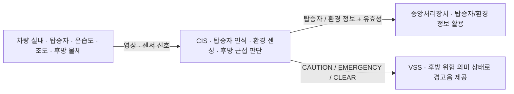
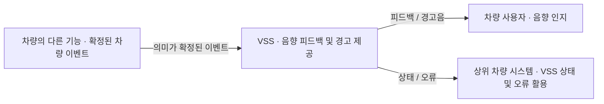
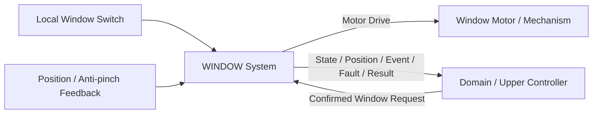
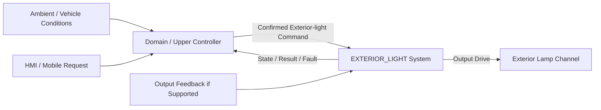

# 통합 차량 제어 시스템 요구사항 (SR)

## 0. 문서 상태와 읽는 방법

- 버전: v0.2 / 2026-09-16 / 5C 대조 완료 · 미결 포함 통합 검토 초안
- 원본 기준: `1b1c4b834e4ac692f8e3eaf3e2680e4a530a2072`
- 상태: 기능별 원문 통합 및 편집 검토 완료, 정책·범위 충돌 미결
- 적용 범위: BCM, CIS, MOBILE, VSS, WINDOW, EXTERIOR_LIGHT
- 공식 SR ID는 새로 부여하지 않는다. 아래 절 번호와 앵커는 탐색용이다.

이 문서는 프로젝트가 제공할 기능과 책임을 정리한다. 각 영역의 원문 요구·조건·예외를 보존했고, 중앙 연결과 미결 사항을 앞뒤에 추가했다. 검토 주석과 미결 절은 승인된 새 기능 요구가 아니다. 기존 파일과 GitHub는 변경하지 않았다.

§5~10의 원문에서 ‘시스템’은 해당 절의 담당 영역을 뜻한다. ‘확정된 명령’은 상위 기능이 선택해 내려보낸 명령이며, 모든 설계와 후보 수치가 승인됐다는 뜻이 아니다. 각 영역의 원문 작성 상태는 그대로 남겼다.

[통합 sysRS.md](sysRS.md)가 함께 제공된다. 각 영역 절의 관련 SysRS 링크로 현재 추적표와 요구 정의를 확인할 수 있다. 정책 충돌과 하위 파생 근거 공백은 여전히 미결로 표시한다.

| 찾아보기 | 내용 |
|---|---|
| [개요](#sr-overview) | 목적·범위 |
| [책임 경계](#sr-context) | 영역별 역할과 연결 |
| [BCM](#sr-bcm) | §5 기능 요구 |
| [CIS](#sr-cis) | §6 기능 요구 |
| [MOBILE](#sr-mobile) | §7 기능 요구 |
| [VSS](#sr-vss) | §8 기능 요구 |
| [WINDOW](#sr-window) | §9 기능 요구 |
| [EXTERIOR_LIGHT](#sr-exterior-light) | §10 기능 요구 |
| [영역 간 연계](#sr-integration) | 중앙과 실행·센싱·표시의 연결 |
| [미결 사항](#sr-open) | 충돌·결정 필요 항목 |
| [출처·변경](#sr-provenance) | 원문과 편집 이력 |

## 1. 프로젝트 개요와 목적

본 프로젝트는 사용자 요청과 차량 상태를 바탕으로 도어 잠금, 실내 환경, 창문, 실내·외 조명 기능을 수행하고, 상태·오류와 경고를 모바일 화면 및 음향으로 제공하는 통합 차량 제어 시스템을 구성한다. 실내 센싱과 후방 근접 감지는 다른 기능이 활용할 수 있는 의미 정보와 유효성을 제공한다.

이 개요는 6개 영역 SR의 기능을 요약한다. 저전압 데모와 기능 검토를 위한 문서이며 양산 적합성·법규 승인·실차 안전 검증 완료를 선언하지 않는다. 구체적인 MCU·통신 프로토콜·메시지 배치·부품·함수와 수치는 각 원문의 확정 수준에 따라 SysRS 및 후속 설계에서 다룬다.

## 2. 시스템 컨텍스트

아래 표는 논리 책임과 정보 흐름을 요약한다. 실제 버스·직접 연결·ECU 수·배치를 확정하는 표가 아니다. 특히 외부 조명 배치는 미정이며 중앙의 기능별 허용·중재 정책도 남아 있다.

| 영역 | 역할 | 주고받는 정보 |
|---|---|---|
| 중앙/상위 차량 기능 | 차량 수준 허용·중재·자동 기능 정책; 세부 조건은 미결 | 사용자 요청·차량 관측 → 확정 명령 / 상태·결과·경고 연결 |
| BCM | 도어·실내 공조·실내 조명 실행과 자체 안전 | 확정 동작 → 실제 판단 상태·결과·오류 |
| CIS | 탑승자·실내 환경·후방 근접 정보 | 영상·센서 → 판정/측정·유효성·후방 위험 의미 |
| MOBILE | 사용자 요청 생성과 상태·경고 표시 | 사용자 입력 → 차량 요청 / 차량 정보 → 표시 |
| VSS | 확정된 차량 상태·발생에 대응하는 음향 | 의미 정보 → 우선순위에 따른 음향·서비스 상태 |
| WINDOW | 로컬·상위 창문 요청 실행 및 끼임 즉시 대응 | 요청·위치·끼임 → 이동·결과·상태·이벤트 |
| EXTERIOR_LIGHT | 상위 확정 점등 실행과 로컬 보호 | 조명 명령·허용 조건 → 적용 상태·결과·고장 |

CIS의 후방 위험 의미 판단은 해당 원문에서 정의되지만 다른 인터페이스 문서와 소유권 확정 상태가 달라 [X11](#open-x11)에서 대조한다. 센싱 정보를 활용하는 중앙 정책과 실행 노드의 로컬 안전은 서로 대체하지 않는다.

## 3. 범위·제외·선택 기능

- 기능별 전체 포함·제외 목록은 §5~10을 기준으로 읽는다. 이 절의 요약이 상세 범위를 축소하지 않는다.
- MOBILE은 현재 창문 상태·결과를 표시하지만 창문 원격 제어는 제어 대상 목록에 없다. WINDOW의 상위 요청 지원만으로 모바일 기능을 추가하지 않는다.
- CIS는 엔진룸 동물 감지를 제외하지만 MOBILE에는 해당 경고 요구가 남아 있다. 두 요구를 보존하고 [X17](#open-x17)에 미결로 연결한다.
- WINDOW는 단일 창문 채널을 기준으로 한다. 원터치는 허용된 구성에 적용되며 다중 채널 배치는 후속 결정이다.
- EXTERIOR_LIGHT는 저전압 대표 1채널을 우선 대상으로 한다. ECU 배치·외부 조도·임시 점등·고장 출력 정책의 미확정 상태를 유지한다.
- VSS의 자동 음량·미디어·스트리밍 등 전체 제외 목록은 [§8.9](#sr-vss-s09)에 보존한다. SysRS의 후속 보안 후보는 현재 기능 의무에 추가하지 않는다.

## 4. 책임 경계와 용어

중앙은 차량 수준의 요청 허용·중재·자동 동작 판단을 담당하는 경계로 정리한다. 실행 노드는 확정된 의미 명령을 받아 실행하고 자신의 로컬 안전 조건을 적용한다. 관측 정보를 위험 상태로 바꾸는 조건은 기능별로 정하며, 존재 감지나 명령 접수만으로 위험 발생·동작 완료를 추정하지 않는다. 구체적인 신규 중앙 요구는 본 문서에서 확정하지 않는다.

| 구분 | 읽는 기준 |
|---|---|
| 잠금 / 개폐 | UNLOCKED와 물리 OPEN은 다르다. |
| 요청 / 결과 / 상태 / 이벤트 / 고장 | 수행 의도, 특정 요청의 처리 결과, 현재 상태, 발생 사실, 이상 원인을 구분한다. |
| 설정 / 적용 / 물리 확인 | 저장 의도와 실제 적용, 센서로 확인 가능한 결과를 구분한다. |
| 유효성 / 최신성 / 출처 인증 | 값의 사용 가능 여부, 원본·수신 나이, 출처·권한의 신뢰를 구분한다. |
| 존재 / 위험 | CIS의 존재 판정과 차량 조건을 포함한 잔류 위험 판단을 구분한다. |
| 원문 유지 / 수정 제안 | 원문 보존은 승인 완료를 뜻하지 않으며 제안은 확정 동작이 아니다. |

원문에서는 VSS를 CIS 절에서 Vehicle Sound System, VSS 절에서 Virtual Sound System으로 풀어 쓴다. 이번 초안의 추가 설명은 약어 VSS를 사용하고 원문 표기는 보존한다. 이는 [용어 확인 사항](#open-vss-name)이며 기능 책임의 차이를 뜻하지 않는다.

## 5. BCM 기능 요구

원문: [BCM/01_BCM_SR_FUNCTIONAL_BASELINE_DRAFT.md](https://github.com/vehicle-domain-control-system/integrated-vehicle-control/blob/1b1c4b834e4ac692f8e3eaf3e2680e4a530a2072/docs/requirements/BCM/01_BCM_SR_FUNCTIONAL_BASELINE_DRAFT.md) · 아래 원문 기반 요구와 통합 검토 주석을 구분한다.

> 상태: DRAFT / 기능 범위 검토용  
> 작성 원칙: 고객·상위 시스템 관점의 **What**을 기술한다.  
> 개별 요구사항 ID는 부여하지 않는다.  
> 기존 문서의 번호 체계는 승계하지 않는다.

---

> **관련 SysRS 탐색:** [영역 SysRS](sysRS.md#sys-bcm) · [절 보존/추적 설명](sysRS.md#trace-reverse-current)

### 5.1. 목적

출처: [원문 §1](https://github.com/vehicle-domain-control-system/integrated-vehicle-control/blob/1b1c4b834e4ac692f8e3eaf3e2680e4a530a2072/docs/requirements/BCM/01_BCM_SR_FUNCTIONAL_BASELINE_DRAFT.md#L10-L17)

본 문서는 확정된 실내 기능의 동작을 실제로 수행하고, 그 결과를 확인하여 되돌려 주는 BCM(Body Control Module)의 상위 요구사항을 정의한다.

BCM은 동작 여부를 스스로 결정하지 않는다. 확정된 동작을 받아 수행하고, 그 결과를 확인하여 제공한다.

---

> **관련 SysRS 탐색:** [BCM/TR-SR-001](sysRS.md#current-bcm-tr-sr-001) · [BCM/TR-SR-002](sysRS.md#current-bcm-tr-sr-002) · [BCM/TR-SR-003](sysRS.md#current-bcm-tr-sr-003)

### 5.2. 기능 범위

출처: [원문 §2](https://github.com/vehicle-domain-control-system/integrated-vehicle-control/blob/1b1c4b834e4ac692f8e3eaf3e2680e4a530a2072/docs/requirements/BCM/01_BCM_SR_FUNCTIONAL_BASELINE_DRAFT.md#L18-L42)

BCM은 다음 기능의 실제 동작과 결과 확인을 담당한다.

- 도어 잠금
- 실내 공기 순환 및 실내 온도 조절
- 실내 조명

각 기능은 서로 독립적으로 동작하며, 한 기능의 오류가 다른 기능의 수행을 중단시키지 않아야 한다.

#### 5.2.1 정보의 흐름

실내 온도나 주변 밝기와 같은 측정값은 BCM에 직접 제공되지 않는다. 측정값과 사용자 요청은 상위 차량 시스템에서 종합되어 동작이 확정되며, BCM은 확정된 동작을 수행한다.

본 문서에서 **확정된**은 상위 차량 시스템이 이미 정하여 내려보냈다는 뜻이다.

BCM은 확정된 동작을 실제로 수행하고, 실제 동작 상태를 확인하여 상위 차량 시스템에 제공한다.

BCM은 다른 기능 사이의 정보를 중계하지 않는다.

> 본 SR은 기능 경계만 정의한다.  
> MCU, 통신 프로토콜, 메시지 구조 및 액추에이터 하드웨어는 SysRS 이후 단계에서 구체화한다.

---

> **관련 SysRS 탐색:** [BCM/TR-SR-004](sysRS.md#current-bcm-tr-sr-004) · [BCM/TR-SR-005](sysRS.md#current-bcm-tr-sr-005) · [BCM/TR-SR-006](sysRS.md#current-bcm-tr-sr-006) · [BCM/TR-SR-007](sysRS.md#current-bcm-tr-sr-007) · [BCM/TR-SR-008](sysRS.md#current-bcm-tr-sr-008) · [BCM/TR-SR-009](sysRS.md#current-bcm-tr-sr-009) · [BCM/TR-SR-010](sysRS.md#current-bcm-tr-sr-010) · [BCM/TR-SR-011](sysRS.md#current-bcm-tr-sr-011) · [BCM/TR-SR-012](sysRS.md#current-bcm-tr-sr-012) · [BCM/TR-SR-013](sysRS.md#current-bcm-tr-sr-013) · [BCM/TR-SR-014](sysRS.md#current-bcm-tr-sr-014) · [BCM/TR-SR-015](sysRS.md#current-bcm-tr-sr-015)

### 5.3. 도어 잠금 실행 요구사항

출처: [원문 §3](https://github.com/vehicle-domain-control-system/integrated-vehicle-control/blob/1b1c4b834e4ac692f8e3eaf3e2680e4a530a2072/docs/requirements/BCM/01_BCM_SR_FUNCTIONAL_BASELINE_DRAFT.md#L43-L67)

> **통합 검토 · [X02](#open-x02):** 잠금 상태와 물리 개폐 상태를 구분하도록 결과 확인의 두 문장을 편집했다(A01). 같은 목표 요청의 정상 완료가 새 음향 발생을 뜻하는지는 미결이다.

#### 5.3.1 명령 실행

- 시스템은 허용된 도어 잠금 요청이 확인된 경우 도어를 잠가야 한다.
- 시스템은 허용된 도어 잠금 해제 요청이 확인된 경우 도어의 잠금을 해제해야 한다.
- 시스템은 허용되지 않은 요청에 의해 도어 잠금 상태가 변경되지 않도록 해야 한다.
- 시스템은 현재 잠금 상태와 동일한 목표의 요청이 반복되더라도 반복 동작이 발생하지 않도록 해야 한다.
- 시스템은 도어 잠금 동작이 정해진 시간을 넘겨 계속되지 않도록 해야 한다.

#### 5.3.2 도어 상태 관리

- 시스템은 도어가 잠겨 있는지와 열려 있는지를 서로 구분하여 관리해야 한다.
- 시스템은 도어가 잠겨 있는지와 열려 있는지를 상위 차량 시스템에서 확인할 수 있도록 해야 한다.
- 시스템은 도어 상태를 믿을 수 없는 경우 이를 정상 상태로 단정하여 제공하지 않아야 한다.
- 시스템은 잠겨 있으면서 동시에 열려 있는 것처럼 실제로 있을 수 없는 상태가 확인된 경우 이를 정상으로 취급하지 않아야 한다.
- 시스템은 있을 수 없는 상태가 확인된 경우 이를 그럴듯한 정상 상태로 바꾸어 제공하지 않아야 한다.

#### 5.3.3 동작 결과 확인

- 시스템은 목표 잠금 상태(잠금 또는 잠금 해제)에 도달했음이 확인된 경우에만 해당 요청을 정상 완료로 처리해야 한다.
- 시스템은 목표 잠금 상태(잠금 또는 잠금 해제)에 도달했음이 확인되지 않은 경우 그 결과와 이유를 제공해야 한다.

---

> **관련 SysRS 탐색:** [BCM/TR-SR-016](sysRS.md#current-bcm-tr-sr-016) · [BCM/TR-SR-017](sysRS.md#current-bcm-tr-sr-017) · [BCM/TR-SR-018](sysRS.md#current-bcm-tr-sr-018) · [BCM/TR-SR-019](sysRS.md#current-bcm-tr-sr-019) · [BCM/TR-SR-020](sysRS.md#current-bcm-tr-sr-020) · [BCM/TR-SR-021](sysRS.md#current-bcm-tr-sr-021) · [BCM/TR-SR-022](sysRS.md#current-bcm-tr-sr-022) · [BCM/TR-SR-023](sysRS.md#current-bcm-tr-sr-023) · [BCM/TR-SR-024](sysRS.md#current-bcm-tr-sr-024) · [BCM/TR-SR-025](sysRS.md#current-bcm-tr-sr-025)

### 5.4. 실내 환경 실행 요구사항

출처: [원문 §4](https://github.com/vehicle-domain-control-system/integrated-vehicle-control/blob/1b1c4b834e4ac692f8e3eaf3e2680e4a530a2072/docs/requirements/BCM/01_BCM_SR_FUNCTIONAL_BASELINE_DRAFT.md#L68-L87)

> **통합 검토 · [X04](#open-x04):** 자동·수동·선행 공조의 우선순위와 시작·종료 조건은 중앙 정책의 미결 사항이다. 방열 확인과 고장 복구 조건은 X05도 참조한다.

#### 5.4.1 실내 공기 순환

- 시스템은 확정된 세기로 실내 공기를 순환시켜야 한다.
- 시스템은 실내 공기가 실제로 순환되고 있는지 확인할 수 있어야 한다.
- 시스템은 공기 순환 여부를 확인할 수 없는 경우 이를 정상 동작으로 처리하지 않아야 한다.
- 시스템은 확정된 세기와 실제 순환 상태가 일치하지 않는 경우 오류 상태로 처리해야 한다.

#### 5.4.2 실내 온도 조절

- 시스템은 확정된 방향에 따라 실내 공기를 식히거나 데워야 한다.
- 시스템은 확정된 세기로 냉각 또는 가열을 수행해야 한다.
- 시스템은 냉각 또는 가열 과정에서 발생한 열이 배출되고 있는지 확인할 수 있어야 한다.
- 시스템은 열이 배출되지 않거나 과열이 확인된 경우 냉각 또는 가열을 중단해야 한다.
- 시스템은 냉각과 가열이 전환될 때 장치에 손상이 발생하지 않도록 해야 한다.
- 시스템은 현재 냉각 중인지 가열 중인지와 그 세기를 상위 차량 시스템에서 확인할 수 있도록 해야 한다.

---

> **관련 SysRS 탐색:** [BCM/TR-SR-026](sysRS.md#current-bcm-tr-sr-026) · [BCM/TR-SR-027](sysRS.md#current-bcm-tr-sr-027) · [BCM/TR-SR-028](sysRS.md#current-bcm-tr-sr-028) · [BCM/TR-SR-029](sysRS.md#current-bcm-tr-sr-029) · [BCM/TR-SR-030](sysRS.md#current-bcm-tr-sr-030)

### 5.5. 실내 조명 실행 요구사항

출처: [원문 §5](https://github.com/vehicle-domain-control-system/integrated-vehicle-control/blob/1b1c4b834e4ac692f8e3eaf3e2680e4a530a2072/docs/requirements/BCM/01_BCM_SR_FUNCTIONAL_BASELINE_DRAFT.md#L88-L97)

> **통합 검토 · [X07](#open-x07):** 실제 점등 보장 요구와 하위 문서의 지시 적용 확인 범위가 다르다. 이 절의 요구를 축소하지 않았다. 색상·사용자 설정 경로는 X06도 참조한다.

- 시스템은 확정된 알림 종류에 따라 실내 조명을 켜야 한다.
- 시스템은 확정되지 않은 조명 요청을 정상적인 알림으로 실행하지 않아야 한다.
- 시스템은 현재 켜져 있는 알림 종류와 밝기를 상위 차량 시스템에서 확인할 수 있도록 해야 한다.
- 시스템은 조명이 확정된 대로 켜지지 않은 경우 이를 정상 동작으로 처리하지 않아야 한다.
- 시스템은 조명 관련 오류를 조명 이외의 방법으로 알려야 한다.

---

> **관련 SysRS 탐색:** [BCM/TR-SR-031](sysRS.md#current-bcm-tr-sr-031) · [BCM/TR-SR-032](sysRS.md#current-bcm-tr-sr-032) · [BCM/TR-SR-033](sysRS.md#current-bcm-tr-sr-033) · [BCM/TR-SR-034](sysRS.md#current-bcm-tr-sr-034) · [BCM/TR-SR-035](sysRS.md#current-bcm-tr-sr-035) · [BCM/TR-SR-036](sysRS.md#current-bcm-tr-sr-036) · [BCM/TR-SR-037](sysRS.md#current-bcm-tr-sr-037) · [BCM/TR-SR-038](sysRS.md#current-bcm-tr-sr-038)

### 5.6. 자체 안전 요구사항

출처: [원문 §6](https://github.com/vehicle-domain-control-system/integrated-vehicle-control/blob/1b1c4b834e4ac692f8e3eaf3e2680e4a530a2072/docs/requirements/BCM/01_BCM_SR_FUNCTIONAL_BASELINE_DRAFT.md#L98-L112)

> **통합 검토 · [X05](#open-x05):** 상위 정책과 별도로 직접 확인하는 로컬 안전 책임을 유지한다. 보호 해제와 재동작 조건의 상세는 미결이다.

본 절의 판단은 BCM이 직접 측정하는 정보에 근거하며, 차량의 다른 부분과 연결이 끊긴 상태에서도 수행되어야 한다.

- 시스템은 도어가 닫혀 있는 것이 확인되지 않은 경우 도어를 잠그지 않아야 한다.
- 시스템은 발생한 열이 배출되는지 확인할 수 없거나 과열이 확인된 경우 냉각 또는 가열을 중단해야 한다.
- 시스템은 동작이 정해진 시간을 넘겨 계속되는 경우 소프트웨어가 멈춘 상태에서도 해당 동작을 멈출 수 있어야 한다.
- 시스템은 전원이 켜질 때 모든 동작을 멈춘 상태에서 시작해야 한다.
- 시스템은 전원이 켜질 때 이전에 하던 동작을 다시 시작하지 않아야 한다.
- 시스템은 안전을 위해 요청을 수행하지 않은 경우 그 이유를 상위 차량 시스템에 제공해야 한다.

**자체 안전 판단은 전달받은 동작을 수행하지 않을 수 있다.** 도어가 닫혀 있는지와 발생한 열이 배출되고 있는지는 BCM이 직접 확인하며, 동작이 전달되는 사이에 해당 상태가 바뀔 수 있다.

---

> **관련 SysRS 탐색:** [BCM/TR-SR-039](sysRS.md#current-bcm-tr-sr-039) · [BCM/TR-SR-040](sysRS.md#current-bcm-tr-sr-040) · [BCM/TR-SR-041](sysRS.md#current-bcm-tr-sr-041) · [BCM/TR-SR-042](sysRS.md#current-bcm-tr-sr-042) · [BCM/TR-SR-043](sysRS.md#current-bcm-tr-sr-043) · [BCM/TR-SR-044](sysRS.md#current-bcm-tr-sr-044) · [BCM/TR-SR-045](sysRS.md#current-bcm-tr-sr-045) · [BCM/TR-SR-046](sysRS.md#current-bcm-tr-sr-046) · [BCM/TR-SR-047](sysRS.md#current-bcm-tr-sr-047) · [BCM/TR-SR-048](sysRS.md#current-bcm-tr-sr-048)

### 5.7. 상태 및 오류 요구사항

출처: [원문 §7](https://github.com/vehicle-domain-control-system/integrated-vehicle-control/blob/1b1c4b834e4ac692f8e3eaf3e2680e4a530a2072/docs/requirements/BCM/01_BCM_SR_FUNCTIONAL_BASELINE_DRAFT.md#L113-L127)

> **통합 검토 · [X15](#open-x15):** 통신 불신 시 기존 동작 유지 원칙은 로컬 안전·오류 차단 조건을 무효화하지 않는다. WINDOW의 정지 정책으로 일괄 통일하지 않는다.

- 시스템은 각 기능의 동작 상태를 서로 구분하여 상위 차량 시스템에서 확인할 수 있도록 해야 한다.
- 시스템은 실제 동작 상태를 확인하지 못해 발생한 오류, 정보가 전달되지 않아 발생한 오류 및 동작 자체가 실패하여 발생한 오류를 서로 구분하여 제공해야 한다.
- 시스템은 신뢰할 수 없는 상태 정보를 현재 정상 상태로 제공하지 않아야 한다.
- 시스템은 전달받은 동작 내용을 믿을 수 없는 경우 그 동작을 수행하지 않아야 한다.
- 시스템은 전달받은 동작 내용을 믿을 수 없다는 이유만으로 이미 하고 있던 동작을 멈추지 않아야 한다.
- 시스템은 통신이 끊겼다가 복구된 뒤 마지막으로 받아 둔 내용만 보고 새로운 동작을 시작하지 않아야 한다.
- 시스템은 오류의 복구 조건이 충족되기 전에는 동작을 다시 시작하지 않아야 한다.
- 시스템은 복구 조건이 충족된 경우 새로 전달받은 내용에 의해서만 동작을 다시 시작해야 한다.
- 시스템은 하나의 기능에서 발생한 오류를 이유로 독립적으로 수행 가능한 다른 기능을 중단시키지 않아야 한다.
- 시스템은 동작 중 오류가 발생한 경우 확정되지 않은 동작이 계속되지 않도록 해야 한다.

---

> **관련 SysRS 탐색:** [BCM/TR-SR-049](sysRS.md#current-bcm-tr-sr-049) · [BCM/TR-SR-050](sysRS.md#current-bcm-tr-sr-050) · [BCM/TR-SR-051](sysRS.md#current-bcm-tr-sr-051) · [BCM/TR-SR-052](sysRS.md#current-bcm-tr-sr-052)

### 5.8. 동작 품질 및 비기능 요구사항

출처: [원문 §8](https://github.com/vehicle-domain-control-system/integrated-vehicle-control/blob/1b1c4b834e4ac692f8e3eaf3e2680e4a530a2072/docs/requirements/BCM/01_BCM_SR_FUNCTIONAL_BASELINE_DRAFT.md#L128-L136)

- 사용자의 요청에 대한 동작은 사용자가 조작 실패로 오인하지 않을 시간 안에 시작되어야 한다.
- 조명 알림의 전환은 사용자가 지연으로 인지하지 않을 시간 안에 수행되어야 한다.
- 동일한 요청은 정상 동작 상태에서 일관된 결과를 제공해야 한다.
- 실제 동작 값과 평가 조건은 적용 장치 및 시험 환경이 확정된 후 정의되어야 한다.

---

> **관련 SysRS 탐색:** [BCM/TR-SR-053](sysRS.md#current-bcm-tr-sr-053) · [BCM/TR-SR-054](sysRS.md#current-bcm-tr-sr-054) · [BCM/TR-SR-055](sysRS.md#current-bcm-tr-sr-055) · [BCM/TR-SR-056](sysRS.md#current-bcm-tr-sr-056) · [BCM/TR-SR-057](sysRS.md#current-bcm-tr-sr-057)

### 5.9. 상위 시스템 연계 원칙

출처: [원문 §9](https://github.com/vehicle-domain-control-system/integrated-vehicle-control/blob/1b1c4b834e4ac692f8e3eaf3e2680e4a530a2072/docs/requirements/BCM/01_BCM_SR_FUNCTIONAL_BASELINE_DRAFT.md#L137-L146)

- BCM에는 이미 결정된 동작이 제공되어야 하며, 그 결정에 사용된 정보가 함께 제공될 필요는 없다.
- 동작 수준과 방향은 BCM이 해석 가능한 형태로 제공되어야 한다.
- BCM의 세부 동작 수행 방법은 상위 차량 기능이 직접 제어하지 않아야 한다.
- BCM이 제공하는 상태, 동작 결과 및 오류는 상위 차량 시스템에서 활용 가능해야 한다.
- BCM의 자체 안전 판단에 의한 명령 거부는 정상 응답으로 처리되어야 한다.

---

> **관련 SysRS 탐색:** [영역 SysRS](sysRS.md#sys-bcm) · [절 보존/추적 설명](sysRS.md#trace-reverse-current)

### 5.10. 범위 요약

출처: [원문 §10](https://github.com/vehicle-domain-control-system/integrated-vehicle-control/blob/1b1c4b834e4ac692f8e3eaf3e2680e4a530a2072/docs/requirements/BCM/01_BCM_SR_FUNCTIONAL_BASELINE_DRAFT.md#L147-L155)

> **BCM은 확정된 실내 기능의 동작을 받아
> 도어 잠금, 실내 공기 순환 및 온도, 실내 조명을 실제로 동작시키고,
> 그 결과와 오류를 되돌려 주는 실행 시스템이다.**

BCM은 **동작 여부를 스스로 결정하지 않는다.** 측정값은 BCM에 제공되지 않으며, 판단은 상위 차량 시스템에서 수행된다.

다만 **자신이 직접 확인하는 정보에 근거한 안전 판단**은 BCM이 수행하며, 이 판단은 전달받은 동작을 수행하지 않을 수 있다.

## 6. CIS 기능 요구

원문: [CIS/01_CIS_SR_FUNCTIONAL_BASELINE_DRAFT.md](https://github.com/vehicle-domain-control-system/integrated-vehicle-control/blob/1b1c4b834e4ac692f8e3eaf3e2680e4a530a2072/docs/requirements/CIS/01_CIS_SR_FUNCTIONAL_BASELINE_DRAFT.md) · 아래 원문 기반 요구와 통합 검토 주석을 구분한다.

> 상태: DRAFT / 기능 범위 검토용  
> 작성 원칙: 고객·상위 시스템 관점의 **What**을 기술한다.  
> 개별 요구사항 ID는 부여하지 않는다.  
> 기존(구) Repository 참고 자료의 번호 체계는 승계하지 않는다.

---

> **관련 SysRS 탐색:** [영역 SysRS](sysRS.md#sys-cis) · [절 보존/추적 설명](sysRS.md#trace-reverse-current)

### 6.1. 목적

출처: [원문 §1](https://github.com/vehicle-domain-control-system/integrated-vehicle-control/blob/1b1c4b834e4ac692f8e3eaf3e2680e4a530a2072/docs/requirements/CIS/01_CIS_SR_FUNCTIONAL_BASELINE_DRAFT.md#L10-L20)

본 문서는 차량 실내의 탑승자 상태와 환경, 그리고 후방 근접 위험을 감지하여
차량의 다른 기능이 활용할 수 있는 형태로 제공하는
CIS(Cabin Interior Sensing)의 상위 요구사항을 정의한다.

CIS는 실내 탑승자 존재 여부·인원수, 실내 온도·습도·조도, 후방 물체와의 근접 위험 상태를 판정하며,
판정 결과는 중앙처리장치와 VSS(Vehicle Sound System)가 각각 필요로 하는 형태로 제공되어야 한다.

---

> **관련 SysRS 탐색:** [영역 SysRS](sysRS.md#sys-cis) · [절 보존/추적 설명](sysRS.md#trace-reverse-current)

### 6.2. 기능 범위

출처: [원문 §2](https://github.com/vehicle-domain-control-system/integrated-vehicle-control/blob/1b1c4b834e4ac692f8e3eaf3e2680e4a530a2072/docs/requirements/CIS/01_CIS_SR_FUNCTIONAL_BASELINE_DRAFT.md#L21-L52)

CIS는 다음 기능을 제공해야 한다.

- 실내 탑승자 존재 여부 판정
- 실내 탑승자 인원수 판정
- 실내 온도 측정
- 실내 습도 측정
- 조도 측정
- 후방 물체와의 거리 측정 및 근접 위험 상태 판단
- 위 판정·측정 결과의 유효성 판단
- 판정·측정 결과를 중앙처리장치 및 VSS로 제공

#### 6.2.1 CIS 상위 시스템 컨텍스트

> 본 SR의 컨텍스트 다이어그램은 기능 경계만 표현한다.  
> 처리 보드, 센서 모델, 통신 프로토콜 및 메시지 구조는 SysRS 이후 단계에서 구체화한다.

---

> **관련 SysRS 탐색:** [CIS/TR-SR-001](sysRS.md#current-cis-tr-sr-001) · [CIS/TR-SR-002](sysRS.md#current-cis-tr-sr-002) · [CIS/TR-SR-003](sysRS.md#current-cis-tr-sr-003) · [CIS/TR-SR-004](sysRS.md#current-cis-tr-sr-004)

### 6.3. 기능 경계

출처: [원문 §3](https://github.com/vehicle-domain-control-system/integrated-vehicle-control/blob/1b1c4b834e4ac692f8e3eaf3e2680e4a530a2072/docs/requirements/CIS/01_CIS_SR_FUNCTIONAL_BASELINE_DRAFT.md#L53-L61)

> **통합 검토 · [X17](#open-x17):** CIS의 엔진룸 동물 감지 제외와 MOBILE의 해당 경고 요구가 함께 존재한다. 둘 다 원문대로 남겼다.

- CIS는 엔진룸 대상 동물의 진입 여부를 판정하지 않는다.
- CIS는 후방 위험 상태에 대응하는 음향을 직접 재생하지 않는다.
- CIS는 도어 잠금, 파워윈도우 등 차량 액추에이터를 직접 제어하지 않는다.
- CIS는 확정된 판정 결과와 측정값을 중앙처리장치 및 VSS가 활용할 수 있도록 제공해야 한다.

---

> **관련 SysRS 탐색:** [CIS/TR-SR-005](sysRS.md#current-cis-tr-sr-005) · [CIS/TR-SR-006](sysRS.md#current-cis-tr-sr-006) · [CIS/TR-SR-007](sysRS.md#current-cis-tr-sr-007) · [CIS/TR-SR-008](sysRS.md#current-cis-tr-sr-008) · [CIS/TR-SR-009](sysRS.md#current-cis-tr-sr-009) · [CIS/TR-SR-010](sysRS.md#current-cis-tr-sr-010)

### 6.4. 탑승자 인식 요구사항

출처: [원문 §4](https://github.com/vehicle-domain-control-system/integrated-vehicle-control/blob/1b1c4b834e4ac692f8e3eaf3e2680e4a530a2072/docs/requirements/CIS/01_CIS_SR_FUNCTIONAL_BASELINE_DRAFT.md#L62-L72)

> **통합 검토 · [X10](#open-x10):** 탑승자 존재·인원수 관측과 잔류 탑승자 위험 판단은 구분한다. 위험 발생·해제 조건은 확정되지 않았다.

- 시스템은 실내 영상을 이용하여 탑승자 존재 여부를 판정해야 한다.
- 시스템은 실내 영상을 이용하여 탑승자 인원수를 판정해야 한다.
- 시스템은 탑승자 판정 결과의 유효 여부를 구분해야 한다.
- 시스템은 비전 정보를 신뢰할 수 있기 전에는 해당 정보에 기반한 판정 결과를 확정하지 않아야 한다.
- 시스템은 비전 오류의 복구 조건이 충족되기 전에는 탑승자 상태를 정상으로 확정하지 않아야 한다.
- 시스템은 실내 영상을 탑승자 인식 목적 범위를 벗어나 저장하거나 외부로 전송하지 않아야 한다.

---

> **관련 SysRS 탐색:** [CIS/TR-SR-011](sysRS.md#current-cis-tr-sr-011) · [CIS/TR-SR-012](sysRS.md#current-cis-tr-sr-012) · [CIS/TR-SR-013](sysRS.md#current-cis-tr-sr-013) · [CIS/TR-SR-014](sysRS.md#current-cis-tr-sr-014) · [CIS/TR-SR-015](sysRS.md#current-cis-tr-sr-015) · [CIS/TR-SR-016](sysRS.md#current-cis-tr-sr-016)

### 6.5. 실내 환경 센싱 요구사항

출처: [원문 §5](https://github.com/vehicle-domain-control-system/integrated-vehicle-control/blob/1b1c4b834e4ac692f8e3eaf3e2680e4a530a2072/docs/requirements/CIS/01_CIS_SR_FUNCTIONAL_BASELINE_DRAFT.md#L73-L83)

> **통합 검토 · [X12](#open-x12):** 이 절의 실내 조도를 외부 자동 점등의 입력으로 자동 대체하지 않는다. 외부 조도 제공자는 미정이다.

- 시스템은 실내 온도를 측정해야 한다.
- 시스템은 실내 습도를 측정해야 한다.
- 시스템은 조도를 측정해야 한다.
- 시스템은 측정 정보의 유효 여부를 구분해야 한다.
- 시스템은 센서 정보를 신뢰할 수 있기 전에는 해당 정보에 기반한 값을 확정하지 않아야 한다.
- 시스템은 센서 오류의 복구 조건이 충족되기 전에는 측정값을 정상으로 확정하지 않아야 한다.

---

> **관련 SysRS 탐색:** [CIS/TR-SR-017](sysRS.md#current-cis-tr-sr-017) · [CIS/TR-SR-018](sysRS.md#current-cis-tr-sr-018) · [CIS/TR-SR-019](sysRS.md#current-cis-tr-sr-019) · [CIS/TR-SR-020](sysRS.md#current-cis-tr-sr-020) · [CIS/TR-SR-021](sysRS.md#current-cis-tr-sr-021) · [CIS/TR-SR-022](sysRS.md#current-cis-tr-sr-022)

### 6.6. 후방 근접 감지 요구사항

출처: [원문 §6](https://github.com/vehicle-domain-control-system/integrated-vehicle-control/blob/1b1c4b834e4ac692f8e3eaf3e2680e4a530a2072/docs/requirements/CIS/01_CIS_SR_FUNCTIONAL_BASELINE_DRAFT.md#L84-L94)

> **통합 검토 · [X11](#open-x11):** 경계값·유효한 해제·측정 불가의 구분과 위험 상태 소유권의 문서 간 차이를 미결로 유지한다.

- 시스템은 후방 물체와의 거리를 측정해야 한다.
- 시스템은 거리 측정 정보의 유효 여부를 구분해야 한다.
- 시스템은 물체와의 거리가 정의된 기준 이내인 경우 근접 위험 상태를 판단해야 한다.
- 시스템은 근접 위험 수준이 높아지는 경우 이를 구분되는 상태로 제공해야 한다.
- 시스템은 물체가 정의된 기준 거리 밖으로 벗어난 경우 근접 위험 상태를 해제해야 한다.
- 시스템은 거리 측정 정보를 신뢰할 수 있기 전에는 근접 위험 상태를 확정하지 않아야 한다.

---

> **관련 SysRS 탐색:** [CIS/TR-SR-023](sysRS.md#current-cis-tr-sr-023) · [CIS/TR-SR-024](sysRS.md#current-cis-tr-sr-024) · [CIS/TR-SR-025](sysRS.md#current-cis-tr-sr-025) · [CIS/TR-SR-026](sysRS.md#current-cis-tr-sr-026)

### 6.7. 데이터 유효성 및 오류 요구사항

출처: [원문 §7](https://github.com/vehicle-domain-control-system/integrated-vehicle-control/blob/1b1c4b834e4ac692f8e3eaf3e2680e4a530a2072/docs/requirements/CIS/01_CIS_SR_FUNCTIONAL_BASELINE_DRAFT.md#L95-L103)

- 시스템은 센서 입력이 유효 범위를 벗어난 경우 해당 정보를 정상 정보로 사용하지 않아야 한다.
- 시스템은 실내 영상 품질이 인식 기준을 만족하지 못하는 경우 해당 판정 결과를 정상 정보로 사용하지 않아야 한다.
- 시스템은 특정 센서 또는 비전 기능에 오류가 발생하더라도, 오류와 무관한 다른 판정·측정 기능을 불필요하게 중단하지 않아야 한다.
- 시스템은 통신 오류 동안 마지막 정상 값을 현재 정상 값으로 표시하지 않아야 한다.

---

> **관련 SysRS 탐색:** [CIS/TR-SR-027](sysRS.md#current-cis-tr-sr-027) · [CIS/TR-SR-028](sysRS.md#current-cis-tr-sr-028) · [CIS/TR-SR-029](sysRS.md#current-cis-tr-sr-029) · [CIS/TR-SR-030](sysRS.md#current-cis-tr-sr-030) · [CIS/TR-SR-031](sysRS.md#current-cis-tr-sr-031) · [CIS/TR-SR-032](sysRS.md#current-cis-tr-sr-032)

### 6.8. 중앙처리장치 및 VSS 연계 요구사항

출처: [원문 §8](https://github.com/vehicle-domain-control-system/integrated-vehicle-control/blob/1b1c4b834e4ac692f8e3eaf3e2680e4a530a2072/docs/requirements/CIS/01_CIS_SR_FUNCTIONAL_BASELINE_DRAFT.md#L104-L114)

> **통합 검토 · [X14](#open-x14):** 정보를 다시 중계받았다는 이유만으로 원본 측정값을 최신으로 간주하지 않는다. 논리 소비자를 표시한 것이 직접 통신 경로 확정은 아니다.

- 시스템은 유효한 탑승자 판정 결과 및 환경 측정값을 중앙처리장치로 전송해야 한다.
- 시스템은 판정 결과 및 측정값을 정의된 주기로 갱신하여 제공해야 한다.
- 시스템은 판정 결과 및 측정값과 함께 해당 값의 유효 여부를 함께 제공해야 한다.
- 시스템은 통신 오류가 발생한 경우 해당 오류 상태를 상위 시스템이 식별할 수 있도록 제공해야 한다.
- 시스템은 통신 오류가 해제되고 새로운 유효 값이 확인된 경우에만 정상 전송을 재개해야 한다.
- 시스템은 근접 위험 상태를 VSS가 활용 가능한 의미 상태(주의 / 긴급 / 해제)로 제공해야 한다.

---

> **관련 SysRS 탐색:** [CIS/TR-SR-033](sysRS.md#current-cis-tr-sr-033) · [CIS/TR-SR-034](sysRS.md#current-cis-tr-sr-034) · [CIS/TR-SR-035](sysRS.md#current-cis-tr-sr-035) · [CIS/TR-SR-036](sysRS.md#current-cis-tr-sr-036)

### 6.9. 기능 제외 범위

출처: [원문 §9](https://github.com/vehicle-domain-control-system/integrated-vehicle-control/blob/1b1c4b834e4ac692f8e3eaf3e2680e4a530a2072/docs/requirements/CIS/01_CIS_SR_FUNCTIONAL_BASELINE_DRAFT.md#L115-L127)

> **통합 검토 · [X11](#open-x11):** 외부 거리값 노출 제외와 하위 문서의 중앙 REAR_DISTANCE 제공이 충돌한다. 이 제외 문장을 삭제하지 않았다.

본 CIS 범위에는 다음 기능을 포함하지 않는다.

- 엔진룸 카메라 기반 대상 동물 진입 판정
- 후방 위험 상태에 대응하는 음향 출력 및 재생 (VSS 담당)
- 도어 잠금, 파워윈도우 등 차량 액추에이터 제어
- 후방 장애물의 실제 거리값 및 임계값을 VSS 등 외부에 직접 노출하는 것 (의미 상태로만 제공)

CIS의 핵심 기능은 **실내 탑승자·환경 상태 판정과 후방 근접 위험의 의미 상태화**로 한정한다.

---

> **관련 SysRS 탐색:** [CIS/TR-SR-037](sysRS.md#current-cis-tr-sr-037) · [CIS/TR-SR-038](sysRS.md#current-cis-tr-sr-038) · [CIS/TR-SR-039](sysRS.md#current-cis-tr-sr-039) · [CIS/TR-SR-040](sysRS.md#current-cis-tr-sr-040)

### 6.10. 상위 시스템 연계 원칙

출처: [원문 §10](https://github.com/vehicle-domain-control-system/integrated-vehicle-control/blob/1b1c4b834e4ac692f8e3eaf3e2680e4a530a2072/docs/requirements/CIS/01_CIS_SR_FUNCTIONAL_BASELINE_DRAFT.md#L128-L136)

- CIS는 센서 원시 데이터 및 영상을 직접 외부로 노출하지 않아야 한다.
- CIS의 후방 위험 의미 상태는 VSS가 정의한 의미 이벤트 체계와 일치해야 한다.
- CIS의 세부 인식·센싱 처리 방법은 상위 차량 기능이 직접 제어하지 않아야 한다.
- CIS의 상태 및 오류는 상위 차량 시스템에서 활용 가능해야 한다.

---

> **관련 SysRS 탐색:** [영역 SysRS](sysRS.md#sys-cis) · [절 보존/추적 설명](sysRS.md#trace-reverse-current)

### 6.11. 범위 요약

출처: [원문 §11](https://github.com/vehicle-domain-control-system/integrated-vehicle-control/blob/1b1c4b834e4ac692f8e3eaf3e2680e4a530a2072/docs/requirements/CIS/01_CIS_SR_FUNCTIONAL_BASELINE_DRAFT.md#L137-L141)

> **CIS는 차량 실내의 탑승자 상태와 환경을 판정하고,
> 후방 물체와의 근접 위험을 의미 상태(주의/긴급/해제)로 확정하여,
> 중앙처리장치와 VSS가 각각 필요로 하는 형태로 제공하는 실내 센싱 기능이다.**

## 7. MOBILE 기능 요구

원문: [MOBILE/01_MOBILE_SR_FUNCTIONAL_BASELINE_DRAFT.md](https://github.com/vehicle-domain-control-system/integrated-vehicle-control/blob/1b1c4b834e4ac692f8e3eaf3e2680e4a530a2072/docs/requirements/MOBILE/01_MOBILE_SR_FUNCTIONAL_BASELINE_DRAFT.md) · 아래 원문 기반 요구와 통합 검토 주석을 구분한다.

> 상태: DRAFT / 기능 범위 검토용  
> 작성 원칙: 고객·상위 시스템 관점의 **What**을 기술한다.  
> 개별 요구사항 ID는 부여하지 않는다.  
> 기존 문서의 번호 체계는 승계하지 않는다.

---

> **관련 SysRS 탐색:** [영역 SysRS](sysRS.md#sys-mobile) · [절 보존/추적 설명](sysRS.md#trace-reverse-current)

### 7.1. 목적

출처: [원문 §1](https://github.com/vehicle-domain-control-system/integrated-vehicle-control/blob/1b1c4b834e4ac692f8e3eaf3e2680e4a530a2072/docs/requirements/MOBILE/01_MOBILE_SR_FUNCTIONAL_BASELINE_DRAFT.md#L10-L17)

본 문서는 사용자가 차량에서 떨어진 위치에서 차량 상태를 확인하고 허용된 기능을 제어할 수 있도록 하는 모바일 인터페이스의 상위 요구사항을 정의한다.

모바일 인터페이스는 사용자 제어 요청을 생성하고, 차량이 확정한 상태와 처리 결과를 사용자가 오해 없이 인지할 수 있도록 제공한다.

---

> **관련 SysRS 탐색:** [MOBILE/TR-SR-001](sysRS.md#current-mobile-tr-sr-001) · [MOBILE/TR-SR-002](sysRS.md#current-mobile-tr-sr-002) · [MOBILE/TR-SR-003](sysRS.md#current-mobile-tr-sr-003)

### 7.2. 기능 범위

출처: [원문 §2](https://github.com/vehicle-domain-control-system/integrated-vehicle-control/blob/1b1c4b834e4ac692f8e3eaf3e2680e4a530a2072/docs/requirements/MOBILE/01_MOBILE_SR_FUNCTIONAL_BASELINE_DRAFT.md#L18-L40)

모바일 인터페이스는 다음을 제공한다.

- 허용된 차량 기능에 대한 사용자 제어 요청 생성
- 제어 요청의 처리 결과 및 사유 제공
- 차량 상태 및 오류 정보 제공
- 안전 관련 경고 및 중요 상태 변화 알림
- 차량 연결 가능 상태 제공

모바일 인터페이스는 차량 기능을 직접 수행하지 않는다. 요청을 생성할 뿐이며, 실제 수행 여부는 각 기능의 허용 조건과 안전 정책에 따라 차량이 결정한다.

#### 7.2.1 정보의 흐름

모바일 인터페이스는 사용자 입력으로부터 제어 요청을 생성하여 차량에 전달한다. 요청의 허용 여부와 실제 수행은 차량이 결정하며, 모바일 인터페이스는 그 결과를 받아 표시한다.

차량 상태는 차량이 확정한 형태로 제공받으며, 모바일 인터페이스가 자체적으로 상태를 추정하거나 보정하지 않는다.

> 본 SR은 기능 경계만 정의한다.  
> 무선 방식, 데이터 형식, 메시지 구조 및 게이트웨이 하드웨어는 SysRS 이후 단계에서 구체화한다.

---

> **관련 SysRS 탐색:** [MOBILE/TR-SR-004](sysRS.md#current-mobile-tr-sr-004) · [MOBILE/TR-SR-005](sysRS.md#current-mobile-tr-sr-005) · [MOBILE/TR-SR-006](sysRS.md#current-mobile-tr-sr-006) · [MOBILE/TR-SR-007](sysRS.md#current-mobile-tr-sr-007) · [MOBILE/TR-SR-008](sysRS.md#current-mobile-tr-sr-008) · [MOBILE/TR-SR-009](sysRS.md#current-mobile-tr-sr-009) · [MOBILE/TR-SR-010](sysRS.md#current-mobile-tr-sr-010)

### 7.3. 사용자 제어 요청 요구사항

출처: [원문 §3](https://github.com/vehicle-domain-control-system/integrated-vehicle-control/blob/1b1c4b834e4ac692f8e3eaf3e2680e4a530a2072/docs/requirements/MOBILE/01_MOBILE_SR_FUNCTIONAL_BASELINE_DRAFT.md#L41-L62)

> **통합 검토 · [X04](#open-x04):** 요청 접수·설정 저장·작업 수행 완료의 구분과 선행 공조 상태 계약이 필요하다. 이 목록에 없는 모바일 창문·외부 조명 제어를 추가하지 않았다.

- 사용자는 허용된 차량 기능에 대한 제어 요청을 생성할 수 있어야 한다.
- 제어 요청의 접수, 진행, 완료, 거부, 중단 및 실패 결과가 사용자에게 제공되어야 한다.
- 제어 요청이 거부되거나 실패한 경우 그 사유가 사용자에게 제공되어야 한다.
- 요청 전송이 완료된 상태와 차량에서 실제로 수행이 완료된 상태는 서로 구분되어 제공되어야 한다.
- 최근 제어 요청의 수행 결과를 사용자가 확인할 수 있어야 한다.
- 차량 연결이 종료된 경우 이전 사용자 요청이 자동으로 다시 전달되어서는 안 된다.

#### 7.3.1 제어 대상

모바일 인터페이스가 제어 요청을 생성할 수 있는 대상은 다음과 같다.

- 도어 잠금 및 잠금 해제
- 목표 온도 설정 및 자동 공조 사용 여부
- 실내 공기 순환 세기 선택
- 탑승 예정 시각 설정 및 선행 공조 사용 여부
- 수행 중인 선행 공조의 정지
- 실내 조명 사용 여부, 밝기 및 색상

---

> **관련 SysRS 탐색:** [MOBILE/TR-SR-011](sysRS.md#current-mobile-tr-sr-011) · [MOBILE/TR-SR-012](sysRS.md#current-mobile-tr-sr-012) · [MOBILE/TR-SR-013](sysRS.md#current-mobile-tr-sr-013) · [MOBILE/TR-SR-014](sysRS.md#current-mobile-tr-sr-014) · [MOBILE/TR-SR-015](sysRS.md#current-mobile-tr-sr-015) · [MOBILE/TR-SR-016](sysRS.md#current-mobile-tr-sr-016) · [MOBILE/TR-SR-017](sysRS.md#current-mobile-tr-sr-017) · [MOBILE/TR-SR-018](sysRS.md#current-mobile-tr-sr-018) · [MOBILE/TR-SR-019](sysRS.md#current-mobile-tr-sr-019)

### 7.4. 차량 상태 표시 요구사항

출처: [원문 §4](https://github.com/vehicle-domain-control-system/integrated-vehicle-control/blob/1b1c4b834e4ac692f8e3eaf3e2680e4a530a2072/docs/requirements/MOBILE/01_MOBILE_SR_FUNCTIONAL_BASELINE_DRAFT.md#L63-L106)

> **통합 검토 · [X13](#open-x13):** 사용자 설정, 현재 적용, 물리 확인과 품질 상태를 구분한다. 창문은 현행 MOBILE SR에서 표시 대상으로 정의되어 있다(X08).

#### 7.4.1 표시 대상

각 기능이 제공하는 상태 정보, 요청 처리 결과 및 오류 상태가 사용자에게 제공되어야 한다. 표시 대상은 다음과 같다.

**도어**

- 도어가 잠겨 있는지 여부
- 도어가 열려 있는지 여부
- 도어 상태의 이상 여부
- 도어 관련 오류

**실내 환경**

- 자동 공조 사용 여부
- 현재 실내 온도와 설정한 목표 온도
- 설정한 공기 순환 세기와 실제로 순환되고 있는 세기
- 현재 냉각 중인지 가열 중인지와 그 세기
- 선행 공조의 수행 상태
- 실내 환경 관련 오류

**실내 조명**

- 조명 사용 여부와 현재 밝기
- 현재 켜져 있는 알림 종류
- 조명 관련 오류

**기타 차량 기능**

- 창문의 동작 상태와 요청 처리 결과
- 차량이 확정한 실내 환경 정보와 탑승자 유무
- 음향 기능의 오류

#### 7.4.2 정보 신뢰성 표시 원칙

- 차량 상태 정보가 최신이 아닌 경우 최신 상태가 아님이 사용자에게 표시되어야 한다.
- 상태 정보를 신뢰할 수 없는 경우 마지막 정상 값이 현재 정상 상태로 표시되어서는 안 된다.
- 차량이 상태를 확인하지 못해 발생한 오류, 정보가 전달되지 않아 발생한 오류 및 동작 자체가 실패하여 발생한 오류는 사용자가 구분할 수 있도록 표시되어야 한다.
- 상태를 확인할 수 없는 경우 확인 불가 상태임이 표시되어야 하며, 임의의 값으로 대체되어서는 안 된다.
- 사용자 설정이 안전 정책에 의해 적용되지 않는 경우 그 사유가 제공되어야 한다.

---

> **관련 SysRS 탐색:** [MOBILE/TR-SR-020](sysRS.md#current-mobile-tr-sr-020) · [MOBILE/TR-SR-021](sysRS.md#current-mobile-tr-sr-021) · [MOBILE/TR-SR-022](sysRS.md#current-mobile-tr-sr-022) · [MOBILE/TR-SR-023](sysRS.md#current-mobile-tr-sr-023) · [MOBILE/TR-SR-024](sysRS.md#current-mobile-tr-sr-024) · [MOBILE/TR-SR-025](sysRS.md#current-mobile-tr-sr-025)

### 7.5. 경고 및 알림 요구사항

출처: [원문 §5](https://github.com/vehicle-domain-control-system/integrated-vehicle-control/blob/1b1c4b834e4ac692f8e3eaf3e2680e4a530a2072/docs/requirements/MOBILE/01_MOBILE_SR_FUNCTIONAL_BASELINE_DRAFT.md#L107-L117)

> **통합 검토 · [X17](#open-x17):** 사용자 이탈 판단 조건과 엔진룸 감지 정보 제공자가 미정이다. 경고 확인과 위험 해제도 구분한다.

- 안전 보호 동작 또는 위험 경고는 일반 상태 정보보다 우선하여 사용자가 식별할 수 있도록 제공되어야 한다.
- 안전 관련 경고 및 중요 상태 변화는 일반 상태 정보와 구분되어 제공되어야 한다.
- 사용자가 확인하지 않은 중요 경고가 존재하는 경우 해당 경고 상태를 확인할 수 있어야 한다.
- 사용자 이탈이 확인된 상태에서 도어가 열린 상태로 유지되는 경우 해당 상태가 사용자에게 제공되어야 한다.
- 엔진룸에 동물이 들어온 것이 확인된 경우 권한이 있는 사용자에게 즉시 제공되어야 한다.
- 사용자가 경고를 확인한 이후에도 해당 상태가 유효한 동안에는 상태 자체가 유지되어 표시되어야 한다.

---

> **관련 SysRS 탐색:** [MOBILE/TR-SR-026](sysRS.md#current-mobile-tr-sr-026) · [MOBILE/TR-SR-027](sysRS.md#current-mobile-tr-sr-027) · [MOBILE/TR-SR-028](sysRS.md#current-mobile-tr-sr-028) · [MOBILE/TR-SR-029](sysRS.md#current-mobile-tr-sr-029)

### 7.6. 인증 및 통신 안전 요구사항

출처: [원문 §6](https://github.com/vehicle-domain-control-system/integrated-vehicle-control/blob/1b1c4b834e4ac692f8e3eaf3e2680e4a530a2072/docs/requirements/MOBILE/01_MOBILE_SR_FUNCTIONAL_BASELINE_DRAFT.md#L118-L126)

> **통합 검토 · [X03](#open-x03):** 차량별 권한·중복 실행 방지의 차량 측 책임과 정보 출처 인증 조건을 구체화해야 한다. VSS 후속 ECU 보안과 같은 범위로 취급하지 않는다.

- 인증 및 차량별 권한 확인이 완료된 사용자에게만 원격 차량 제어 기능이 제공되어야 한다.
- 차량에서 온 정보임을 확인할 수 없는 경우 새로운 차량 제어 요청이 생성되어서는 안 된다.
- 같은 제어 요청이 두 번 전달되거나 늦게 전달되더라도 차량에서 반복 수행되지 않아야 한다.
- 인증 정보는 사용자가 직접 열람하거나 입력하지 않아야 한다.

---

> **관련 SysRS 탐색:** [MOBILE/TR-SR-030](sysRS.md#current-mobile-tr-sr-030) · [MOBILE/TR-SR-031](sysRS.md#current-mobile-tr-sr-031) · [MOBILE/TR-SR-032](sysRS.md#current-mobile-tr-sr-032) · [MOBILE/TR-SR-033](sysRS.md#current-mobile-tr-sr-033)

### 7.7. 연결 상태 요구사항

출처: [원문 §7](https://github.com/vehicle-domain-control-system/integrated-vehicle-control/blob/1b1c4b834e4ac692f8e3eaf3e2680e4a530a2072/docs/requirements/MOBILE/01_MOBILE_SR_FUNCTIONAL_BASELINE_DRAFT.md#L127-L135)

- 사용자가 현재 차량과의 연결 가능 상태를 확인할 수 있어야 한다.
- 연결이 불가능한 상태에서는 제어 요청이 생성되지 않아야 하며 그 사유가 제공되어야 한다.
- 연결이 복구된 경우 차량에서 확정한 최신 상태로 표시가 갱신되어야 한다.
- 연결 복구만을 근거로 이전 요청이 재수행되어서는 안 된다.

---

> **관련 SysRS 탐색:** [MOBILE/TR-SR-034](sysRS.md#current-mobile-tr-sr-034) · [MOBILE/TR-SR-035](sysRS.md#current-mobile-tr-sr-035) · [MOBILE/TR-SR-036](sysRS.md#current-mobile-tr-sr-036) · [MOBILE/TR-SR-037](sysRS.md#current-mobile-tr-sr-037) · [MOBILE/TR-SR-038](sysRS.md#current-mobile-tr-sr-038)

### 7.8. 동작 품질 및 비기능 요구사항

출처: [원문 §8](https://github.com/vehicle-domain-control-system/integrated-vehicle-control/blob/1b1c4b834e4ac692f8e3eaf3e2680e4a530a2072/docs/requirements/MOBILE/01_MOBILE_SR_FUNCTIONAL_BASELINE_DRAFT.md#L136-L145)

> **통합 검토 · [X16](#open-x16):** 요청 종류별 결과 제공 시점과 장시간 작업의 상태 갱신을 구분해야 한다. 모든 기능에 하나의 완료 시간을 새로 부여하지 않았다.

- 서로 다른 의미를 가진 상태와 경고는 사용자가 구분할 수 있어야 한다.
- 제어 요청에 대한 결과는 사용자가 조작 실패로 오인하지 않을 시간 안에 제공되어야 한다.
- 동일한 요청은 정상 동작 상태에서 일관된 결과를 제공해야 한다.
- 상태 표시는 사용자가 현재 차량 상태와 과거 정보를 혼동하지 않도록 제공되어야 한다.
- 실제 표시 형식과 평가 조건은 적용 단말 및 시험 환경이 확정된 후 정의되어야 한다.

---

> **관련 SysRS 탐색:** [MOBILE/TR-SR-039](sysRS.md#current-mobile-tr-sr-039) · [MOBILE/TR-SR-040](sysRS.md#current-mobile-tr-sr-040) · [MOBILE/TR-SR-041](sysRS.md#current-mobile-tr-sr-041) · [MOBILE/TR-SR-042](sysRS.md#current-mobile-tr-sr-042) · [MOBILE/TR-SR-043](sysRS.md#current-mobile-tr-sr-043) · [MOBILE/TR-SR-044](sysRS.md#current-mobile-tr-sr-044)

### 7.9. 상위 시스템 연계 원칙

출처: [원문 §9](https://github.com/vehicle-domain-control-system/integrated-vehicle-control/blob/1b1c4b834e4ac692f8e3eaf3e2680e4a530a2072/docs/requirements/MOBILE/01_MOBILE_SR_FUNCTIONAL_BASELINE_DRAFT.md#L146-L156)

- 모바일 인터페이스에는 각 기능이 확정한 상태가 유효성과 함께 제공되어야 한다.
- 모바일 인터페이스에는 제어 요청의 처리 결과와 거부 또는 실패 사유가 제공되어야 한다.
- 모바일 인터페이스에는 안전 관련 경고가 일반 상태와 구분 가능한 형태로 제공되어야 한다.
- 모바일 인터페이스에는 상태 정보의 최신 여부를 판단할 수 있는 근거가 함께 제공되어야 한다.
- 모바일 인터페이스의 요청은 차량 기능의 허용 조건을 우회하지 않아야 한다.
- 사용자 인증의 판단은 차량 측에서 수행되어야 한다.

---

> **관련 SysRS 탐색:** [영역 SysRS](sysRS.md#sys-mobile) · [절 보존/추적 설명](sysRS.md#trace-reverse-current)

### 7.10. 범위 요약

출처: [원문 §10](https://github.com/vehicle-domain-control-system/integrated-vehicle-control/blob/1b1c4b834e4ac692f8e3eaf3e2680e4a530a2072/docs/requirements/MOBILE/01_MOBILE_SR_FUNCTIONAL_BASELINE_DRAFT.md#L157-L165)

> **모바일 인터페이스는 사용자의 제어 요청을 생성하여 차량에 전달하고,
> 차량이 확정한 상태·처리 결과·경고를 신뢰성이 구분된 형태로 사용자에게 제공하는
> 원격 사용자 인터페이스이다.**

모바일 인터페이스는 요청을 생성할 뿐이며 **차량 기능의 실제 수행 여부를 보장하지 않는다.**

상태 표시에서는 **전송 완료와 수행 완료를 구분**하고, **신뢰할 수 없는 정보를 정상 상태로 표시하지 않는다.**

## 8. VSS 기능 요구

원문: [VSS/01_VSS_SR_FUNCTIONAL_BASELINE_DRAFT.md](https://github.com/vehicle-domain-control-system/integrated-vehicle-control/blob/1b1c4b834e4ac692f8e3eaf3e2680e4a530a2072/docs/requirements/VSS/01_VSS_SR_FUNCTIONAL_BASELINE_DRAFT.md) · 아래 원문 기반 요구와 통합 검토 주석을 구분한다.

> 상태: DRAFT / 기능 범위 검토용  
> 작성 원칙: 고객·상위 시스템 관점의 **What**을 기술한다.  
> 개별 요구사항 ID는 부여하지 않는다.  
> 기존 VSS 문서의 번호 체계는 승계하지 않는다.

---

> **관련 SysRS 탐색:** [영역 SysRS](sysRS.md#sys-vss) · [절 보존/추적 설명](sysRS.md#trace-reverse-current)

### 8.1. 목적

출처: [원문 §1](https://github.com/vehicle-domain-control-system/integrated-vehicle-control/blob/1b1c4b834e4ac692f8e3eaf3e2680e4a530a2072/docs/requirements/VSS/01_VSS_SR_FUNCTIONAL_BASELINE_DRAFT.md#L10-L19)

본 문서는 차량의 상태 및 안전 관련 이벤트를 사용자가 음향으로 인지할 수 있도록 하는
VSS(Virtual Sound System)의 상위 요구사항을 정의한다.

VSS는 차량의 다른 기능에서 확정된 상태 또는 이벤트를 음향으로 표현하며,
안전 관련 경고가 일반 피드백보다 우선적으로 인지될 수 있도록 해야 한다.

---

> **관련 SysRS 탐색:** [영역 SysRS](sysRS.md#sys-vss) · [절 보존/추적 설명](sysRS.md#trace-reverse-current)

### 8.2. 기능 범위

출처: [원문 §2](https://github.com/vehicle-domain-control-system/integrated-vehicle-control/blob/1b1c4b834e4ac692f8e3eaf3e2680e4a530a2072/docs/requirements/VSS/01_VSS_SR_FUNCTIONAL_BASELINE_DRAFT.md#L20-L50)

VSS는 다음 차량 이벤트에 대한 음향 출력을 제공해야 한다.

- 차량 사용 시작 및 종료
- 도어 잠금 및 잠금 해제
- 도어 잠금 이상
- 파워윈도우 안티핀치
- 잔류 탑승자 위험
- 후방 장애물 접근 및 충돌 위험
- VSS 상태 및 오류 정보 제공

#### 8.2.1 VSS 상위 시스템 컨텍스트

> 본 SR의 컨텍스트 다이어그램은 기능 경계만 표현한다.  
> MCU, 통신 프로토콜, 메시지 구조 및 오디오 하드웨어는 SysRS 이후 단계에서 구체화한다.

---

> **관련 SysRS 탐색:** [VSS/TR-SR-001](sysRS.md#current-vss-tr-sr-001) · [VSS/TR-SR-002](sysRS.md#current-vss-tr-sr-002)

### 8.3. 기능 경계

출처: [원문 §3](https://github.com/vehicle-domain-control-system/integrated-vehicle-control/blob/1b1c4b834e4ac692f8e3eaf3e2680e4a530a2072/docs/requirements/VSS/01_VSS_SR_FUNCTIONAL_BASELINE_DRAFT.md#L51-L66)

VSS는 차량 이벤트를 직접 감지하거나 해당 이벤트의 발생 조건을 판단하는 기능을 담당하지 않는다.

다음과 같은 상태 판단은 해당 기능을 담당하는 차량 시스템에서 수행되어야 한다.

- 도어 잠금 성공 또는 실패 판단
- 파워윈도우 끼임 위험 판단
- 잔류 탑승자 존재 및 위험 상태 판단
- 후방 장애물의 접근 거리 및 충돌 위험 수준 판단
- 차량 전원 또는 운행 상태 판단

VSS는 확정된 이벤트에 대응하는 음향을 제공해야 한다.

---

> **관련 SysRS 탐색:** [VSS/TR-SR-003](sysRS.md#current-vss-tr-sr-003) · [VSS/TR-SR-004](sysRS.md#current-vss-tr-sr-004) · [VSS/TR-SR-005](sysRS.md#current-vss-tr-sr-005) · [VSS/TR-SR-006](sysRS.md#current-vss-tr-sr-006) · [VSS/TR-SR-007](sysRS.md#current-vss-tr-sr-007) · [VSS/TR-SR-008](sysRS.md#current-vss-tr-sr-008)

### 8.4. 일반 피드백 음향 요구사항

출처: [원문 §4](https://github.com/vehicle-domain-control-system/integrated-vehicle-control/blob/1b1c4b834e4ac692f8e3eaf3e2680e4a530a2072/docs/requirements/VSS/01_VSS_SR_FUNCTIONAL_BASELINE_DRAFT.md#L67-L82)

> **통합 검토 · [X02](#open-x02):** 무구동 동일 목표 완료와 실제 잠금 전이의 음향 발생 기준이 미결이다. 차량 사용 시작/종료 전달·전원 유지 조건은 X16을 참조한다.

#### 8.4.1 차량 사용 시작 및 종료

- 차량 사용 시작 상태가 확정된 경우 사용자가 인지할 수 있는 웰컴 음향이 제공되어야 한다.
- 차량 사용 종료 상태가 확정된 경우 사용자가 인지할 수 있는 굿바이 음향이 제공되어야 한다.
- 차량 사용 시작 및 종료 음향은 안전 관련 경고보다 우선해서는 안 된다.

#### 8.4.2 도어 잠금 및 잠금 해제

- 도어 잠금이 정상적으로 완료된 경우 잠금 완료를 인지할 수 있는 음향이 제공되어야 한다.
- 도어 잠금 해제가 정상적으로 완료된 경우 잠금 완료 음향과 구분 가능한 음향이 제공되어야 한다.
- 도어가 정상적으로 잠기지 않은 상태가 확인된 경우 정상 잠금 완료 음향과 구분 가능한 경고가 제공되어야 한다.

---

> **관련 SysRS 탐색:** [VSS/TR-SR-009](sysRS.md#current-vss-tr-sr-009) · [VSS/TR-SR-010](sysRS.md#current-vss-tr-sr-010) · [VSS/TR-SR-011](sysRS.md#current-vss-tr-sr-011) · [VSS/TR-SR-012](sysRS.md#current-vss-tr-sr-012) · [VSS/TR-SR-013](sysRS.md#current-vss-tr-sr-013) · [VSS/TR-SR-014](sysRS.md#current-vss-tr-sr-014) · [VSS/TR-SR-015](sysRS.md#current-vss-tr-sr-015) · [VSS/TR-SR-016](sysRS.md#current-vss-tr-sr-016) · [VSS/TR-SR-017](sysRS.md#current-vss-tr-sr-017)

### 8.5. 안전 및 주의 경고 요구사항

출처: [원문 §5](https://github.com/vehicle-domain-control-system/integrated-vehicle-control/blob/1b1c4b834e4ac692f8e3eaf3e2680e4a530a2072/docs/requirements/VSS/01_VSS_SR_FUNCTIONAL_BASELINE_DRAFT.md#L83-L104)

> **통합 검토 · [X09](#open-x09):** WINDOW의 발생 이벤트만으로 지속 경고의 해제 조건을 확정하지 않는다. 잔류 위험은 X10, 후방 위험은 X11을 함께 참조한다.

#### 8.5.1 파워윈도우 안티핀치

- 파워윈도우 끼임 위험이 확인된 경우 일반 피드백과 명확히 구분 가능한 긴급 경고음이 제공되어야 한다.
- 안티핀치 경고는 일반 피드백 및 주의 수준의 경고보다 우선적으로 인지되어야 한다.
- 끼임 위험 상태가 해제된 경우 해당 지속 경고음은 종료되어야 한다.

#### 8.5.2 잔류 탑승자

- 차량 내부의 위험 상태에서 잔류 탑승자가 확인된 경우 사용자가 인지할 수 있는 긴급 경고음이 제공되어야 한다.
- 잔류 탑승자 위험 상태가 해제된 경우 해당 지속 경고음은 종료되어야 한다.

#### 8.5.3 후방 장애물 접근 및 충돌 위험 경고

- 차량 후방의 장애물이 주의가 필요한 거리 범위에 접근한 것으로 확인된 경우 사용자가 이를 인지할 수 있는 주의 경고음이 제공되어야 한다.
- 차량 후방의 장애물이 충돌 위험이 높은 거리 범위에 접근한 것으로 확인된 경우 주의 경고음보다 명확히 구분되는 긴급 경고음이 제공되어야 한다.
- 후방 장애물의 충돌 위험 수준이 높아질수록 사용자가 위험 증가를 구분할 수 있는 음향이 제공되어야 한다.
- 후방 장애물이 경고 대상 범위를 벗어난 경우 해당 경고음은 종료되어야 한다.

---

> **관련 SysRS 탐색:** [VSS/TR-SR-018](sysRS.md#current-vss-tr-sr-018) · [VSS/TR-SR-019](sysRS.md#current-vss-tr-sr-019) · [VSS/TR-SR-020](sysRS.md#current-vss-tr-sr-020) · [VSS/TR-SR-021](sysRS.md#current-vss-tr-sr-021) · [VSS/TR-SR-022](sysRS.md#current-vss-tr-sr-022)

### 8.6. 음향 우선순위 요구사항

출처: [원문 §6](https://github.com/vehicle-domain-control-system/integrated-vehicle-control/blob/1b1c4b834e4ac692f8e3eaf3e2680e4a530a2072/docs/requirements/VSS/01_VSS_SR_FUNCTIONAL_BASELINE_DRAFT.md#L105-L114)

> **통합 검토 · [X16](#open-x16):** 같은 우선순위 음향의 중재와 유효 시점·복귀 규칙은 SysRS 단계에서 대조한다. 기존 우선순위 원칙은 유지한다.

- 안전과 직접 관련된 긴급 경고는 주의 경고 및 일반 피드백보다 우선되어야 한다.
- 주의 경고는 일반 피드백보다 우선되어야 한다.
- 서로 다른 의미의 음향이 동시에 출력되어 사용자가 상황을 구분하기 어렵게 되어서는 안 된다.
- 높은 우선순위의 경고가 발생한 경우 낮은 우선순위 음향은 해당 경고의 인지를 방해하지 않아야 한다.
- 안전 경고가 종료된 후 이미 유효 시점을 지난 일반 피드백이 불필요하게 다시 출력되어서는 안 된다.

---

> **관련 SysRS 탐색:** [VSS/TR-SR-023](sysRS.md#current-vss-tr-sr-023) · [VSS/TR-SR-024](sysRS.md#current-vss-tr-sr-024) · [VSS/TR-SR-025](sysRS.md#current-vss-tr-sr-025) · [VSS/TR-SR-026](sysRS.md#current-vss-tr-sr-026) · [VSS/TR-SR-027](sysRS.md#current-vss-tr-sr-027)

### 8.7. 상태 및 오류 요구사항

출처: [원문 §7](https://github.com/vehicle-domain-control-system/integrated-vehicle-control/blob/1b1c4b834e4ac692f8e3eaf3e2680e4a530a2072/docs/requirements/VSS/01_VSS_SR_FUNCTIONAL_BASELINE_DRAFT.md#L115-L124)

> **통합 검토 · [X13](#open-x13):** 입력 불신·내부 음향 고장·서비스 가능 상태·고장 이력을 구분한다.

- VSS가 정상적으로 음향을 제공할 수 있는 상태인지 상위 차량 시스템에서 확인할 수 있어야 한다.
- VSS가 정상적으로 음향을 제공할 수 없는 오류가 발생한 경우 해당 오류 상태를 상위 차량 시스템에서 확인할 수 있어야 한다.
- 지원되지 않거나 유효하지 않은 음향 요청으로 인해 잘못된 의미의 음향이 출력되어서는 안 된다.
- VSS의 오류가 다른 차량 기능의 동작을 불필요하게 중단시켜서는 안 된다.
- VSS가 오류 상태에서 정상 상태로 복구된 경우 상위 차량 시스템에서 복구 여부를 확인할 수 있어야 한다.

---

> **관련 SysRS 탐색:** [VSS/TR-SR-028](sysRS.md#current-vss-tr-sr-028) · [VSS/TR-SR-029](sysRS.md#current-vss-tr-sr-029) · [VSS/TR-SR-030](sysRS.md#current-vss-tr-sr-030) · [VSS/TR-SR-031](sysRS.md#current-vss-tr-sr-031) · [VSS/TR-SR-032](sysRS.md#current-vss-tr-sr-032) · [VSS/TR-SR-033](sysRS.md#current-vss-tr-sr-033)

### 8.8. 음향 품질 및 비기능 요구사항

출처: [원문 §8](https://github.com/vehicle-domain-control-system/integrated-vehicle-control/blob/1b1c4b834e4ac692f8e3eaf3e2680e4a530a2072/docs/requirements/VSS/01_VSS_SR_FUNCTIONAL_BASELINE_DRAFT.md#L125-L135)

- 서로 다른 의미를 가진 주요 피드백 및 경고음은 사용자가 구분할 수 있어야 한다.
- 안전 관련 경고음은 일반 피드백음과 혼동하기 어렵도록 구분되어야 한다.
- 동일한 차량 이벤트는 정상 동작 상태에서 일관된 음향으로 표현되어야 한다.
- VSS는 차량 사용에 필요한 시간 안에 음향 출력이 가능한 상태로 진입해야 한다.
- 안전 관련 이벤트에 대한 음향은 사용자가 적절한 시점에 인지할 수 있도록 제공되어야 한다.
- 실제 출력 수준과 평가 조건은 적용 오디오 하드웨어 및 시험 환경이 확정된 후 정의되어야 한다.

---

> **관련 SysRS 탐색:** [VSS/TR-SR-034](sysRS.md#current-vss-tr-sr-034) · [VSS/TR-SR-035](sysRS.md#current-vss-tr-sr-035) · [VSS/TR-SR-036](sysRS.md#current-vss-tr-sr-036) · [VSS/TR-SR-037](sysRS.md#current-vss-tr-sr-037) · [VSS/TR-SR-038](sysRS.md#current-vss-tr-sr-038) · [VSS/TR-SR-039](sysRS.md#current-vss-tr-sr-039) · [VSS/TR-SR-040](sysRS.md#current-vss-tr-sr-040) · [VSS/TR-SR-041](sysRS.md#current-vss-tr-sr-041) · [VSS/TR-SR-042](sysRS.md#current-vss-tr-sr-042) · [VSS/TR-SR-043](sysRS.md#current-vss-tr-sr-043) · [VSS/TR-SR-044](sysRS.md#current-vss-tr-sr-044) · [VSS/TR-SR-045](sysRS.md#current-vss-tr-sr-045)

### 8.9. 기능 제외 범위

출처: [원문 §9](https://github.com/vehicle-domain-control-system/integrated-vehicle-control/blob/1b1c4b834e4ac692f8e3eaf3e2680e4a530a2072/docs/requirements/VSS/01_VSS_SR_FUNCTIONAL_BASELINE_DRAFT.md#L136-L155)

> **통합 검토 · [X17](#open-x17):** 원문 제외 범위를 그대로 유지한다. 별도 SysRS의 SEC-FUTURE 6개는 현재 구현 의무가 아닌 후속 후보다.

본 VSS 범위에는 다음 기능을 포함하지 않는다.

- 조도 센서 값에 따른 자동 음량 변경
- 시간대 또는 주야간 상태에 따른 자동 음량 변경
- 외부 장치에서 전달되는 오디오 스트리밍
- 차량 네트워크를 통한 음원 파일 전송 및 스트리밍 재생
- 일반 음악 재생
- 플레이리스트 관리
- 곡 선택, 탐색 또는 재생 위치 이동
- 다수 음원의 동시 믹싱
- 일반 미디어 음향의 Ducking
- Fade-in 또는 Fade-out 연출
- 이퀄라이저 및 음장 효과

VSS의 핵심 기능은 **차량 이벤트에 대응하는 저장 음향 기반의 피드백 및 경고 제공**으로 한정한다.

---

> **관련 SysRS 탐색:** [VSS/TR-SR-046](sysRS.md#current-vss-tr-sr-046) · [VSS/TR-SR-047](sysRS.md#current-vss-tr-sr-047) · [VSS/TR-SR-048](sysRS.md#current-vss-tr-sr-048) · [VSS/TR-SR-049](sysRS.md#current-vss-tr-sr-049)

### 8.10. 상위 시스템 연계 원칙

출처: [원문 §10](https://github.com/vehicle-domain-control-system/integrated-vehicle-control/blob/1b1c4b834e4ac692f8e3eaf3e2680e4a530a2072/docs/requirements/VSS/01_VSS_SR_FUNCTIONAL_BASELINE_DRAFT.md#L156-L164)

- VSS는 센서 원시 데이터를 직접 해석하지 않아야 한다.
- VSS에는 음향 출력에 필요한 의미가 확정된 차량 이벤트가 제공되어야 한다.
- VSS의 세부 음향 재생 방법은 상위 차량 기능이 직접 제어하지 않아야 한다.
- VSS의 상태 및 오류는 상위 차량 시스템에서 활용 가능해야 한다.

---

> **관련 SysRS 탐색:** [영역 SysRS](sysRS.md#sys-vss) · [절 보존/추적 설명](sysRS.md#trace-reverse-current)

### 8.11. 범위 요약

출처: [원문 §11](https://github.com/vehicle-domain-control-system/integrated-vehicle-control/blob/1b1c4b834e4ac692f8e3eaf3e2680e4a530a2072/docs/requirements/VSS/01_VSS_SR_FUNCTIONAL_BASELINE_DRAFT.md#L165-L169)

> **VSS는 다른 차량 기능에서 확정한 차량 이벤트를 받아,
> 해당 이벤트에 대응하는 저장 음향을 제공하고,
> 안전 경고의 우선순위와 자신의 상태 및 오류를 관리하는 음향 시스템이다.**

## 9. WINDOW 기능 요구

원문: [WINDOW/01_WINDOW_SR_FUNCTIONAL_BASELINE_DRAFT.md](https://github.com/vehicle-domain-control-system/integrated-vehicle-control/blob/1b1c4b834e4ac692f8e3eaf3e2680e4a530a2072/docs/requirements/WINDOW/01_WINDOW_SR_FUNCTIONAL_BASELINE_DRAFT.md) · 아래 원문 기반 요구와 통합 검토 주석을 구분한다.

> 상태: DRAFT / 기능 범위 검토용 
> 작성 원칙: 고객·상위 시스템 관점의 **What**을 기술한다. 
> 개별 요구사항 ID는 부여하지 않는다. 
> 기존 문서의 번호 체계는 승계하지 않는다.

---

> **관련 SysRS 탐색:** [영역 SysRS](sysRS.md#sys-window) · [절 보존/추적 설명](sysRS.md#trace-reverse-current)

### 9.1. 목적

출처: [원문 §1](https://github.com/vehicle-domain-control-system/integrated-vehicle-control/blob/1b1c4b834e4ac692f8e3eaf3e2680e4a530a2072/docs/requirements/WINDOW/01_WINDOW_SR_FUNCTIONAL_BASELINE_DRAFT.md#L10-L17)

WINDOW 시스템은 탑승자의 창문 조작 의도를 안전하고 예측 가능한 유리 이동으로 변환하고, 창문 위치·동작 상태·끼임 방지 이벤트·고장 상태를 상위 시스템에 제공해야 한다.

본 문서는 단일 창문 채널을 기능 기준으로 정의한다. 다중 도어 적용 시 동일 기능을 채널별로 확장하되, 채널 수와 실제 차량 배치는 후속 설계에서 확정한다.

---

> **관련 SysRS 탐색:** [영역 SysRS](sysRS.md#sys-window) · [절 보존/추적 설명](sysRS.md#trace-reverse-current)

### 9.2. 기능 범위

출처: [원문 §2](https://github.com/vehicle-domain-control-system/integrated-vehicle-control/blob/1b1c4b834e4ac692f8e3eaf3e2680e4a530a2072/docs/requirements/WINDOW/01_WINDOW_SR_FUNCTIONAL_BASELINE_DRAFT.md#L18-L41)

#### 9.2.1 포함 범위

- 로컬 스위치 및 상위 시스템의 확정된 창문 명령 수신
- 열림, 닫힘, 정지 및 목표 위치 이동
- 수동 이동과 원터치 이동
- 창문 위치 및 완전 열림·완전 닫힘 상태 제공
- 닫힘 중 끼임 감지 시 즉시 정지 및 안전 방향 반전
- 모터 구동 상태와 명령 결과 제공
- 센서, 모터 구동, 통신 이상에 대한 안전 상태 전환과 진단 제공
- 전원 상태에 따른 동작 허용과 안전 정지

#### 9.2.2 범위 밖

- 모바일/HMI 화면 및 사용자 인증
- 차량 전체 수준의 원격 제어 권한 판단
- 차량 전체 수준의 자동 환기 조건 판단
- CAN ID, 신호 비트 배치, 전송 주기와 같은 네트워크 상세
- 모터, 드라이버, 위치 센서 및 끼임 센서의 부품 선정
- 생산 차량의 기구 강도 및 법규 적합성 승인

---

> **관련 SysRS 탐색:** [영역 SysRS](sysRS.md#sys-window) · [절 보존/추적 설명](sysRS.md#trace-reverse-current)

### 9.3. 시스템 컨텍스트와 책임 경계

출처: [원문 §3](https://github.com/vehicle-domain-control-system/integrated-vehicle-control/blob/1b1c4b834e4ac692f8e3eaf3e2680e4a530a2072/docs/requirements/WINDOW/01_WINDOW_SR_FUNCTIONAL_BASELINE_DRAFT.md#L42-L58)

> **통합 검토 · [X08](#open-x08):** 원문의 HMI·모바일은 상위 요청 경계를 설명한다. 현행 MOBILE 제어 대상에 창문 제어가 추가됐다는 뜻은 아니다.

상위 시스템은 HMI, 모바일, 자동 환기 등 차량 전체 기능의 권한과 우선순위를 판단한 후 확정된 의미 기반 요청을 WINDOW 시스템에 전달해야 한다.

WINDOW 시스템은 로컬 입력 처리, 모터 구동, 이동 한계 처리, 끼임 방지의 즉시 반응과 실제 상태 피드백을 담당해야 한다. 상위 시스템 연결이 끊겨도 위험한 이동을 계속해서는 안 된다.

---

> **관련 SysRS 탐색:** [영역 SysRS](sysRS.md#sys-window) · [절 보존/추적 설명](sysRS.md#trace-reverse-current)

### 9.4. 입력과 출력의 의미

출처: [원문 §4](https://github.com/vehicle-domain-control-system/integrated-vehicle-control/blob/1b1c4b834e4ac692f8e3eaf3e2680e4a530a2072/docs/requirements/WINDOW/01_WINDOW_SR_FUNCTIONAL_BASELINE_DRAFT.md#L59-L82)

#### 9.4.1 입력

- 로컬 열림, 닫힘, 정지 의도
- 상위 시스템의 열림, 닫힘, 정지, 환기 위치 또는 목표 위치 요청
- 요청 출처, 순서, 유효성 및 필요 시 만료 정보
- 창문 위치와 완전 열림·완전 닫힘 정보
- 끼임 감지 정보
- 시스템 전원 및 운전 허용 상태

#### 9.4.2 출력

- 창문 동작 상태: 정지, 열림 이동, 닫힘 이동, 끼임 방지 반전, 고장
- 창문 위치와 위치 유효성
- 완전 열림·완전 닫힘 상태
- 끼임 방지 이벤트
- 명령 처리 결과와 거부·중단 사유
- 모터, 위치 센서, 끼임 센서, 통신 및 초기화 고장 정보

Request/Command, State, Event, Fault, Data는 서로 다른 의미로 제공해야 하며 하나의 신호에 혼합하지 않아야 한다.

---

> **관련 SysRS 탐색:** [WIN-R001](sysRS.md#current-win-r001) · [WIN-R002](sysRS.md#current-win-r002) · [WIN-R003](sysRS.md#current-win-r003) · [WIN-R004](sysRS.md#current-win-r004) · [WIN-R005](sysRS.md#current-win-r005) · [WIN-R006](sysRS.md#current-win-r006) · [WIN-R007](sysRS.md#current-win-r007) · [WIN-R008](sysRS.md#current-win-r008) · [WIN-R009](sysRS.md#current-win-r009) · [WIN-R010](sysRS.md#current-win-r010) · [WIN-R011](sysRS.md#current-win-r011) · [WIN-R012](sysRS.md#current-win-r012) · [WIN-R013](sysRS.md#current-win-r013)

### 9.5. 창문 제어 요구

출처: [원문 §5](https://github.com/vehicle-domain-control-system/integrated-vehicle-control/blob/1b1c4b834e4ac692f8e3eaf3e2680e4a530a2072/docs/requirements/WINDOW/01_WINDOW_SR_FUNCTIONAL_BASELINE_DRAFT.md#L83-L108)

> **통합 검토 · [X08](#open-x08):** 원터치 입력과 유지 조건, 로컬·상위 요청 중재 및 결과 구분의 하위 요구 보완이 필요하다. 반전 중 STOP 처리는 X09 미결 사항이다.

#### 9.5.1 명령 수용과 검증

- 시스템은 정의된 열림, 닫힘, 정지 및 목표 위치 요청만 수용해야 한다.
- 시스템은 유효하지 않거나 만료된 요청을 실행하지 않고 거부 사유를 제공해야 한다.
- 시스템은 동일 요청의 중복 수신으로 동작을 반복 시작하거나 방향을 불필요하게 변경해서는 안 된다.
- 새 요청이 현재 동작과 충돌하면 안전 우선순위에 따라 수용, 중단 또는 거부해야 한다.
- 정지 요청은 이동 요청보다 우선해야 한다.

#### 9.5.2 수동 및 원터치 동작

- 로컬 스위치를 유지하는 동안 선택한 방향으로 이동하는 수동 동작을 제공해야 한다.
- 원터치 동작이 허용된 구성에서는 사용자 입력 해제 후에도 목표 끝단 또는 목표 위치까지 이동할 수 있어야 한다.
- 이동 중 반대 방향 요청 또는 정지 요청이 수신되면 현재 구동을 안전하게 해제한 후 후속 동작을 수행해야 한다.
- 완전 열림 또는 완전 닫힘 위치에 도달하면 해당 방향 구동을 중지해야 한다.
- 목표 위치 이동은 유효한 위치 정보가 있을 때만 수행해야 한다.

#### 9.5.3 상태 피드백

- 시스템은 의도나 마지막 명령이 아니라 실제 판단한 동작 상태를 제공해야 한다.
- 위치를 제공할 수 없을 때는 이전 위치를 정상값처럼 사용하지 않고 유효성 상태를 함께 제공해야 한다.
- 각 명령에 대해 수용, 진행, 완료, 거부, 취소 또는 실패 결과를 구분할 수 있어야 한다.

---

> **관련 SysRS 탐색:** [WIN-R014](sysRS.md#current-win-r014) · [WIN-R015](sysRS.md#current-win-r015) · [WIN-R016](sysRS.md#current-win-r016) · [WIN-R017](sysRS.md#current-win-r017) · [WIN-R018](sysRS.md#current-win-r018) · [WIN-R019](sysRS.md#current-win-r019) · [WIN-R020](sysRS.md#current-win-r020)

### 9.6. 끼임 방지와 안전 동작

출처: [원문 §6](https://github.com/vehicle-domain-control-system/integrated-vehicle-control/blob/1b1c4b834e4ac692f8e3eaf3e2680e4a530a2072/docs/requirements/WINDOW/01_WINDOW_SR_FUNCTIONAL_BASELINE_DRAFT.md#L109-L120)

> **통합 검토 · [X09](#open-x09):** 끼임 직후 닫힘 차단, 후속 반전, 반전 중 STOP·위치 불신 처리와 위험 해제는 별도 조건이다. 이벤트와 지속 상태를 연결할 책임이 미정이다.

- 닫힘 이동 중 끼임이 감지되면 상위 시스템의 후속 명령을 기다리지 않고 로컬에서 즉시 모터를 정지해야 한다.
- 끼임 감지 후 창문은 안전 방향으로 제한 반전하거나 프로젝트에서 승인된 안전 위치까지 이동해야 한다.
- 끼임 방지 동작 중에는 일반 닫힘 요청보다 안전 동작이 우선해야 한다.
- 시스템은 끼임 발생을 이벤트로 제공하고 관련 명령 결과를 중단 또는 실패로 갱신해야 한다.
- 끼임 센서 또는 위치 정보가 신뢰할 수 없으면 자동 닫힘과 위치 기반 동작을 제한해야 한다.
- 상반된 방향의 모터 출력이 동시에 활성화되어서는 안 된다.
- 방향 전환 시 모터와 드라이버를 보호할 수 있는 안전한 전환 절차를 적용해야 한다.

---

> **관련 SysRS 탐색:** [WIN-R021](sysRS.md#current-win-r021) · [WIN-R022](sysRS.md#current-win-r022) · [WIN-R023](sysRS.md#current-win-r023) · [WIN-R024](sysRS.md#current-win-r024) · [WIN-R025](sysRS.md#current-win-r025) · [WIN-R026](sysRS.md#current-win-r026) · [WIN-R027](sysRS.md#current-win-r027)

### 9.7. 전원·통신·고장 상태 요구

출처: [원문 §7](https://github.com/vehicle-domain-control-system/integrated-vehicle-control/blob/1b1c4b834e4ac692f8e3eaf3e2680e4a530a2072/docs/requirements/WINDOW/01_WINDOW_SR_FUNCTIONAL_BASELINE_DRAFT.md#L121-L132)

> **통합 검토 · [X15](#open-x15):** 원문의 안전 정지·복구 금지와 새 이동 거부를 유지한다. 전원 허용 상실·만료 조건·제한 수동 동작의 상세를 임의로 확정하지 않았다.

- 초기화가 완료되기 전에는 창문이 의도하지 않게 움직여서는 안 된다.
- 운전 허용 전원 상태가 아니면 새 이동을 시작하지 않아야 한다.
- 이동 중 상위 명령이 유효하지 않게 되거나 통신이 상실되면 안전 정책에 따라 정지해야 한다.
- 통신 복구만으로 이전 이동을 자동 재개해서는 안 된다.
- 모터 또는 드라이버 고장 시 구동 출력을 해제하고 새 이동 요청을 거부해야 한다.
- 위치 센서 고장 시 위치 기반 원터치와 목표 위치 동작을 제한하되, 허용되는 제한 수동 동작의 여부는 안전 분석으로 확정해야 한다.
- 고장 해제 후 재동작 조건은 명시적이고 시험 가능해야 한다.

---

> **관련 SysRS 탐색:** [WIN-R028](sysRS.md#current-win-r028) · [WIN-R029](sysRS.md#current-win-r029) · [WIN-R030](sysRS.md#current-win-r030) · [WIN-R031](sysRS.md#current-win-r031) · [WIN-R032](sysRS.md#current-win-r032) · [WIN-R033](sysRS.md#current-win-r033) · [WIN-R034](sysRS.md#current-win-r034) · [WIN-R035](sysRS.md#current-win-r035)

### 9.8. 비기능 요구

출처: [원문 §8](https://github.com/vehicle-domain-control-system/integrated-vehicle-control/blob/1b1c4b834e4ac692f8e3eaf3e2680e4a530a2072/docs/requirements/WINDOW/01_WINDOW_SR_FUNCTIONAL_BASELINE_DRAFT.md#L133-L156)

#### 9.8.1 예측 가능성

- 동일한 상태와 동일한 유효 입력에는 동일한 동작 결과를 제공해야 한다.
- 명령 거부 또는 중단의 원인을 외부에서 식별할 수 있어야 한다.

#### 9.8.2 강건성

- 누락, 범위 초과, 순서 오류, 중복 또는 만료된 입력으로 인해 의도하지 않은 구동이 발생해서는 안 된다.
- 일시적인 통신 복구나 전원 변동으로 동작이 자동 재개되어서는 안 된다.

#### 9.8.3 시험 가능성

- 열림, 닫힘, 정지, 목표 위치, 끝단 정지, 끼임 방지, 통신 상실 및 센서 고장 동작을 독립적으로 검증할 수 있어야 한다.
- 명령, 상태, 이벤트, 고장 및 결과를 관찰할 수 있어야 한다.

#### 9.8.4 유지보수성

- 시간, 위치, 반전 거리, 입력 필터와 같은 조정 값은 기능 로직과 분리해 관리할 수 있어야 한다.
- 다중 창문 채널 확장 시 기능 의미와 진단 체계가 일관되어야 한다.

---

> **관련 SysRS 탐색:** [WIN-R036](sysRS.md#current-win-r036) · [WIN-R037](sysRS.md#current-win-r037) · [WIN-R038](sysRS.md#current-win-r038) · [WIN-R039](sysRS.md#current-win-r039)

### 9.9. 상위 시스템 연계 원칙

출처: [원문 §9](https://github.com/vehicle-domain-control-system/integrated-vehicle-control/blob/1b1c4b834e4ac692f8e3eaf3e2680e4a530a2072/docs/requirements/WINDOW/01_WINDOW_SR_FUNCTIONAL_BASELINE_DRAFT.md#L157-L165)

> **통합 검토 · [X09](#open-x09):** WINDOW_ANTIPINCH 발생 이벤트와 VSS가 소비하는 ACTIVE/CLEAR 상태의 연결 계약은 아직 미결이다.

- HMI와 모바일은 WINDOW 시스템을 직접 구동하지 않고 상위 시스템을 통해 권한이 확인된 요청을 전달해야 한다.
- 자동 환기는 상위 시스템이 차량 상태와 정책을 판단하고, WINDOW 시스템에는 최종 목표 위치 요청을 전달해야 한다.
- VSS가 끼임 경고를 사용자에게 표시할 수 있도록 WINDOW 시스템은 `WINDOW_ANTIPINCH` 의미의 이벤트를 제공해야 한다.
- 상위 시스템은 WINDOW 상태와 위치 유효성을 확인해 UI와 차량 기능 상태를 갱신해야 한다.

---

> **관련 SysRS 탐색:** [영역 SysRS](sysRS.md#sys-window) · [절 보존/추적 설명](sysRS.md#trace-reverse-current)

### 9.10. 기능 기준 요약

출처: [원문 §10](https://github.com/vehicle-domain-control-system/integrated-vehicle-control/blob/1b1c4b834e4ac692f8e3eaf3e2680e4a530a2072/docs/requirements/WINDOW/01_WINDOW_SR_FUNCTIONAL_BASELINE_DRAFT.md#L166-L174)

WINDOW 기능 기준은 다음을 만족할 때 성립한다.

- 확정된 상위 요청과 로컬 입력을 안전하게 실행한다.
- 실제 이동 상태와 위치, 명령 결과를 제공한다.
- 닫힘 중 끼임에 로컬에서 즉시 대응한다.
- 고장과 통신 상실 시 의도하지 않은 이동을 방지한다.
- 통신·하드웨어 상세와 차량 전체 정책은 후속 인터페이스 및 설계 단계에 남긴다.

## 10. EXTERIOR_LIGHT 기능 요구

원문: [EXTERIOR_LIGHT/01_EXTERIOR_LIGHT_SR_FUNCTIONAL_BASELINE_DRAFT.md](https://github.com/vehicle-domain-control-system/integrated-vehicle-control/blob/1b1c4b834e4ac692f8e3eaf3e2680e4a530a2072/docs/requirements/EXTERIOR_LIGHT/01_EXTERIOR_LIGHT_SR_FUNCTIONAL_BASELINE_DRAFT.md) · 아래 원문 기반 요구와 통합 검토 주석을 구분한다.

> 상태: DRAFT / 기능 범위 검토용 
> 작성 원칙: 고객·상위 시스템 관점의 **What**을 기술한다. 
> 개별 요구사항 ID는 부여하지 않는다. 
> 기존 문서의 번호 체계는 승계하지 않는다.

---

> **관련 SysRS 탐색:** [영역 SysRS](sysRS.md#sys-exterior-light) · [절 보존/추적 설명](sysRS.md#trace-reverse-current)

### 10.1. 목적

출처: [원문 §1](https://github.com/vehicle-domain-control-system/integrated-vehicle-control/blob/1b1c4b834e4ac692f8e3eaf3e2680e4a530a2072/docs/requirements/EXTERIOR_LIGHT/01_EXTERIOR_LIGHT_SR_FUNCTIONAL_BASELINE_DRAFT.md#L10-L17)

EXTERIOR_LIGHT 시스템은 차량 외부 조명에 대해 상위 시스템이 확정한 점등 요청을 안전하고 예측 가능한 출력으로 변환하고, 실제 판단한 조명 상태와 고장 상태를 제공해야 한다.

본 기준은 저전압 데모 환경의 대표 외부 조명 1채널을 우선 대상으로 한다. 양산 차량의 전조등, 차폭등, 미등 등 최종 채널 구성과 법규 적용 범위는 후속 단계에서 확정한다.

---

> **관련 SysRS 탐색:** [영역 SysRS](sysRS.md#sys-exterior-light) · [절 보존/추적 설명](sysRS.md#trace-reverse-current)

### 10.2. 기능 범위

출처: [원문 §2](https://github.com/vehicle-domain-control-system/integrated-vehicle-control/blob/1b1c4b834e4ac692f8e3eaf3e2680e4a530a2072/docs/requirements/EXTERIOR_LIGHT/01_EXTERIOR_LIGHT_SR_FUNCTIONAL_BASELINE_DRAFT.md#L18-L40)

#### 10.2.1 포함 범위

- 상위 시스템이 확정한 외부 조명 켜짐, 꺼짐 및 허용된 출력 수준 요청 수신
- 수동 또는 자동 결정 결과에 따른 대표 조명 채널 제어
- 조명 출력 상태와 명령 결과 제공
- 전원 상태에 따른 출력 허용과 안전한 초기화
- 통신, 출력 구동 및 피드백 이상에 대한 진단과 안전 상태 전환
- 지원되는 하드웨어 범위에서 출력 피드백 감시

#### 10.2.2 범위 밖

- 외부 조도 센서의 직접 측정과 필터링
- 자동 점등 임계값, 히스테리시스 및 차량 전체 자동 조명 정책 판단
- HMI 또는 모바일 사용자 인증과 권한 판단
- 주행 상황 전체에 대한 법규 우선순위 및 조명 조합 판단
- CAN ID, 신호 비트 배치, 전송 주기와 같은 네트워크 상세
- 램프, LED 드라이버, 전류 센서 및 전원 소자의 부품 선정
- 양산 차량 법규 적합성 승인

---

> **관련 SysRS 탐색:** [영역 SysRS](sysRS.md#sys-exterior-light) · [절 보존/추적 설명](sysRS.md#trace-reverse-current)

### 10.3. 시스템 컨텍스트와 책임 경계

출처: [원문 §3](https://github.com/vehicle-domain-control-system/integrated-vehicle-control/blob/1b1c4b834e4ac692f8e3eaf3e2680e4a530a2072/docs/requirements/EXTERIOR_LIGHT/01_EXTERIOR_LIGHT_SR_FUNCTIONAL_BASELINE_DRAFT.md#L41-L58)

> **통합 검토 · [X12](#open-x12):** 그림의 HMI/Mobile Request는 가능한 입력 경계다. MOBILE 현행 제어 기능을 확대하거나 외부 조도 제공자·법규 적합성을 확정하지 않는다.

상위 시스템은 조도, 운전 상태, 사용자 요청, 법규 및 차량 정책을 종합하여 최종 조명 명령을 확정해야 한다. EXTERIOR_LIGHT 시스템은 원시 조도값으로 차량 전체 자동 점등 결정을 중복 수행하지 않아야 한다.

EXTERIOR_LIGHT 시스템은 수신한 의미 기반 명령의 유효성을 확인하고 실제 출력으로 실행하며, 출력 상태와 고장을 상위 시스템에 제공해야 한다.

---

> **관련 SysRS 탐색:** [영역 SysRS](sysRS.md#sys-exterior-light) · [절 보존/추적 설명](sysRS.md#trace-reverse-current)

### 10.4. 입력과 출력의 의미

출처: [원문 §4](https://github.com/vehicle-domain-control-system/integrated-vehicle-control/blob/1b1c4b834e4ac692f8e3eaf3e2680e4a530a2072/docs/requirements/EXTERIOR_LIGHT/01_EXTERIOR_LIGHT_SR_FUNCTIONAL_BASELINE_DRAFT.md#L59-L80)

#### 10.4.1 입력

- 대상 조명 채널
- 켜짐, 꺼짐 또는 허용된 출력 수준 명령
- 수동, 자동, 안전 또는 임시 기능 등 명령 문맥
- 요청 출처, 순서, 유효성 및 필요 시 만료 정보
- 시스템 전원과 출력 허용 상태
- 상위 시스템이 확정한 안전 우선 명령

#### 10.4.2 출력

- 실제 판단한 조명 상태: 꺼짐, 켜짐, 전환 중, 저하, 고장 또는 알 수 없음
- 적용 중인 출력 수준과 유효성
- 명령 처리 결과와 거부·중단 사유
- 통신, 출력 구동, 피드백 및 초기화 고장 정보

Request/Command, State, Event, Fault, Data는 서로 다른 의미로 제공해야 하며 하나의 신호에 혼합하지 않아야 한다.

---

> **관련 SysRS 탐색:** [ELS-R001](sysRS.md#current-els-r001) · [ELS-R002](sysRS.md#current-els-r002) · [ELS-R003](sysRS.md#current-els-r003) · [ELS-R004](sysRS.md#current-els-r004) · [ELS-R005](sysRS.md#current-els-r005) · [ELS-R006](sysRS.md#current-els-r006) · [ELS-R007](sysRS.md#current-els-r007) · [ELS-R008](sysRS.md#current-els-r008) · [ELS-R009](sysRS.md#current-els-r009) · [ELS-R010](sysRS.md#current-els-r010) · [ELS-R011](sysRS.md#current-els-r011) · [ELS-R012](sysRS.md#current-els-r012)

### 10.5. 조명 제어 요구

출처: [원문 §5](https://github.com/vehicle-domain-control-system/integrated-vehicle-control/blob/1b1c4b834e4ac692f8e3eaf3e2680e4a530a2072/docs/requirements/EXTERIOR_LIGHT/01_EXTERIOR_LIGHT_SR_FUNCTIONAL_BASELINE_DRAFT.md#L81-L105)

> **통합 검토 · [X07](#open-x07):** 명령 적용과 물리 점등 확인의 차이를 유지한다. 임시 점등 지원·취소·복귀 조건은 X12에 남긴다.

#### 10.5.1 명령 수용과 실행

- 시스템은 정의된 채널과 명령만 수용해야 한다.
- 유효하지 않거나 만료된 명령은 실행하지 않고 거부 사유를 제공해야 한다.
- 동일 명령의 중복 수신으로 출력이 불필요하게 재시작되거나 깜빡여서는 안 된다.
- 유효한 명령을 수용한 경우 목표 출력으로 전환하고 처리 결과를 제공해야 한다.
- 서로 충돌하는 명령을 동시에 적용해서는 안 된다.

#### 10.5.2 수동·자동 문맥

- 시스템은 상위 시스템이 수동 또는 자동 정책으로 확정한 최종 조명 명령을 동일한 실행 인터페이스로 처리할 수 있어야 한다.
- 자동 점등 정책이 비활성화되거나 입력 근거가 유효하지 않으면 상위 시스템이 결정한 안전 명령을 실행해야 한다.
- 자동 결정에서 수동 결정으로 전환되어도 불필요한 출력 펄스나 순간 점멸이 발생해서는 안 된다.
- 웰컴·굿바이와 같은 임시 점등은 상위 정책에서 허용된 경우에만 실행해야 하며, 안전·법규 우선 명령보다 앞서서는 안 된다.

#### 10.5.3 상태 피드백

- 시스템은 마지막 요청값만 반복하지 않고 실제 적용 판단에 근거한 상태를 제공해야 한다.
- 출력 피드백 하드웨어가 없는 경우 명령 적용 상태와 물리 램프 점등 확인 상태를 구분해야 한다.
- 각 명령에 대해 수용, 진행, 완료, 거부, 취소 또는 실패 결과를 구분할 수 있어야 한다.

---

> **관련 SysRS 탐색:** [ELS-R013](sysRS.md#current-els-r013) · [ELS-R014](sysRS.md#current-els-r014) · [ELS-R015](sysRS.md#current-els-r015) · [ELS-R016](sysRS.md#current-els-r016) · [ELS-R017](sysRS.md#current-els-r017) · [ELS-R018](sysRS.md#current-els-r018) · [ELS-R019](sysRS.md#current-els-r019)

### 10.6. 전원·통신·고장 상태 요구

출처: [원문 §6](https://github.com/vehicle-domain-control-system/integrated-vehicle-control/blob/1b1c4b834e4ac692f8e3eaf3e2680e4a530a2072/docs/requirements/EXTERIOR_LIGHT/01_EXTERIOR_LIGHT_SR_FUNCTIONAL_BASELINE_DRAFT.md#L106-L117)

> **통합 검토 · [X15](#open-x15):** 초기 기본 상태와 통신 상실 시 출력을 같은 값으로 단정하지 않는다. 채널별 정책은 미결이다.

- 초기화 중 출력은 프로젝트가 승인한 안전 기본 상태를 유지해야 한다.
- 출력 허용 전원 상태가 아니면 새 점등을 시작하지 않아야 한다.
- 통신 상실 시 적용할 출력은 조명 기능별 안전 및 법규 분석으로 정한 정책을 따라야 한다.
- 통신 복구만으로 만료된 조명 명령을 자동 재실행해서는 안 된다.
- 출력 드라이버 보호가 필요한 상태에서는 상위 명령보다 로컬 전기적 보호가 우선해야 한다.
- 출력 구동 또는 피드백 고장을 감지한 경우 상태와 고장을 구분하여 제공해야 한다.
- 고장 해제 후 재동작 조건은 명시적이고 시험 가능해야 한다.

---

> **관련 SysRS 탐색:** [ELS-R020](sysRS.md#current-els-r020) · [ELS-R021](sysRS.md#current-els-r021) · [ELS-R022](sysRS.md#current-els-r022) · [ELS-R023](sysRS.md#current-els-r023) · [ELS-R024](sysRS.md#current-els-r024)

### 10.7. 안전 및 우선순위 원칙

출처: [원문 §7](https://github.com/vehicle-domain-control-system/integrated-vehicle-control/blob/1b1c4b834e4ac692f8e3eaf3e2680e4a530a2072/docs/requirements/EXTERIOR_LIGHT/01_EXTERIOR_LIGHT_SR_FUNCTIONAL_BASELINE_DRAFT.md#L118-L127)

> **통합 검토 · [X12](#open-x12):** 로컬 전기적 보호 우선 원칙은 유지한다. 구체적인 법규·수치·안전 인증을 이번 통합에서 새로 정하지 않았다.

- 차량 전체의 조명 조합과 법규 우선순위는 상위 시스템에서 단일하게 결정해야 한다.
- EXTERIOR_LIGHT 시스템은 상위 시스템이 확정한 안전 우선 명령을 일반 명령보다 우선 적용해야 한다.
- 단락, 과전류 또는 과열과 같은 로컬 보호 조건이 확인되면 위험 출력의 차단이 명령 실행보다 우선해야 한다.
- 신뢰할 수 없는 상태를 정상 점등 또는 정상 소등으로 보고해서는 안 된다.
- 고장 중 출력 정책은 채널별 위험 분석과 법규 검토 결과로 확정해야 한다.

---

> **관련 SysRS 탐색:** [ELS-R025](sysRS.md#current-els-r025) · [ELS-R026](sysRS.md#current-els-r026) · [ELS-R027](sysRS.md#current-els-r027) · [ELS-R028](sysRS.md#current-els-r028) · [ELS-R029](sysRS.md#current-els-r029) · [ELS-R030](sysRS.md#current-els-r030) · [ELS-R031](sysRS.md#current-els-r031) · [ELS-R032](sysRS.md#current-els-r032)

### 10.8. 비기능 요구

출처: [원문 §8](https://github.com/vehicle-domain-control-system/integrated-vehicle-control/blob/1b1c4b834e4ac692f8e3eaf3e2680e4a530a2072/docs/requirements/EXTERIOR_LIGHT/01_EXTERIOR_LIGHT_SR_FUNCTIONAL_BASELINE_DRAFT.md#L128-L151)

#### 10.8.1 예측 가능성

- 동일한 상태와 동일한 유효 명령에는 동일한 출력 결과를 제공해야 한다.
- 명령 거부, 대체 또는 중단의 원인을 외부에서 식별할 수 있어야 한다.

#### 10.8.2 강건성

- 누락, 범위 초과, 순서 오류, 중복 또는 만료된 입력으로 의도하지 않은 점등이 발생해서는 안 된다.
- 통신 복구나 전원 변동으로 오래된 출력이 자동 복원되어서는 안 된다.

#### 10.8.3 시험 가능성

- 켜짐, 꺼짐, 출력 수준, 모드 문맥 전환, 통신 상실 및 출력 고장 동작을 독립적으로 검증할 수 있어야 한다.
- 명령, 상태, 고장 및 결과를 관찰할 수 있어야 한다.

#### 10.8.4 유지보수성

- 출력 전환 시간, 진단 필터, 기본 상태 및 출력 매핑은 기능 로직과 분리해 관리할 수 있어야 한다.
- 채널 확장 시 동일한 명령·상태·진단 의미를 재사용할 수 있어야 한다.

---

> **관련 SysRS 탐색:** [ELS-R033](sysRS.md#current-els-r033) · [ELS-R034](sysRS.md#current-els-r034) · [ELS-R035](sysRS.md#current-els-r035) · [ELS-R036](sysRS.md#current-els-r036)

### 10.9. 프로젝트 경계와 미확정 사항

출처: [원문 §9](https://github.com/vehicle-domain-control-system/integrated-vehicle-control/blob/1b1c4b834e4ac692f8e3eaf3e2680e4a530a2072/docs/requirements/EXTERIOR_LIGHT/01_EXTERIOR_LIGHT_SR_FUNCTIONAL_BASELINE_DRAFT.md#L152-L160)

> **통합 검토 · [X12](#open-x12):** 대표 1채널 데모, 배치 승인 필요, 하드웨어·외부 조도·고장 정책의 미확정 상태를 그대로 유지한다.

- 현재 저장소의 BCM 기준은 실내 Ambient Lighting을 포함하고 Window를 제외한다. Exterior Light의 실제 ECU 배치는 기존 BCM 범위와 별도로 승인해야 한다.
- 대표 1채널 데모에서 사용할 램프 종류, 전압, 드라이버 및 피드백 방식은 미확정이다.
- 자동 점등에 사용할 외부 조도 데이터의 제공 ECU, 품질 상태, 임계값 및 히스테리시스는 상위 시스템과 인터페이스 기준에서 확정해야 한다.
- 양산 기능의 채널 목록, 법규 우선순위, 고장 시 점등 정책과 성능 수치는 안전·법규 검토가 필요하다.

---

> **관련 SysRS 탐색:** [영역 SysRS](sysRS.md#sys-exterior-light) · [절 보존/추적 설명](sysRS.md#trace-reverse-current)

### 10.10. 기능 기준 요약

출처: [원문 §10](https://github.com/vehicle-domain-control-system/integrated-vehicle-control/blob/1b1c4b834e4ac692f8e3eaf3e2680e4a530a2072/docs/requirements/EXTERIOR_LIGHT/01_EXTERIOR_LIGHT_SR_FUNCTIONAL_BASELINE_DRAFT.md#L161-L169)

EXTERIOR_LIGHT 기능 기준은 다음을 만족할 때 성립한다.

- 상위 시스템이 확정한 의미 기반 조명 명령을 안전하게 실행한다.
- 실제 적용 상태와 명령 결과를 제공한다.
- 통신 및 출력 이상 시 미확정 상태를 정상값처럼 사용하지 않는다.
- 차량 전체 자동 점등 판단과 법규 우선순위는 상위 시스템에 유지한다.
- 통신·하드웨어 상세와 생산 차량 법규 수치는 후속 인터페이스 및 설계 단계에 남긴다.

## 11. 영역 간 연계

이 절은 여러 영역에 나뉜 책임을 함께 읽기 위한 요약이다. 새로운 정책 우선순위나 수치를 부여하지 않는다. 아래 흐름의 연결 공백은 §13에서 관리한다.

| 기능 흐름 | 함께 확인할 영역 | 남은 연결 |
|---|---|---|
| 사용자 도어 요청 → 허용 → 실행 → 결과·음향 | MOBILE·중앙·BCM·VSS | 동일 목표 완료의 음향 발생, 거부와 고장 구분: [X02](#open-x02) |
| 환경·설정 → 공조 판단 → 실제 실행·보호 → 표시 | CIS·MOBILE·중앙·BCM | 자동/수동/선행 중재, 방열 복구: [X04](#open-x04), [X05](#open-x05) |
| 사용자 설정·알림·실내 조도 → 조명 적용 | MOBILE·CIS·중앙·BCM | 설정 소유·색상·물리 확인: [X06](#open-x06), [X07](#open-x07) |
| 창문 입력 → 로컬 이동·끼임 대응 → 경고 | WINDOW·중앙·VSS | 로컬 중재와 위험 ACTIVE/CLEAR: [X08](#open-x08), [X09](#open-x09) |
| 탑승자·환경 관측 → 위험 판단 → 경고 | CIS·중앙 후보·VSS | 위험 발생·해제·품질 조건: [X10](#open-x10) |
| 후방 거리 관측 → 위험 의미 → 경고 | CIS·VSS | 소유권·경계·미감지와 해제: [X11](#open-x11) |
| 외부 환경·차량 정책 → 확정 점등 | 제공자 미정·중앙·EXTERIOR_LIGHT | 외부 조도·배치·임시·실패 정책: [X12](#open-x12) |

## 12. 품질과 검증 범위

기능별 품질 요구는 각 영역 본문을 유지한다. 공통 품질 요약으로 기능별 예외를 덮어쓰지 않는다. 검증에서는 요청·현재 상태·결과·품질을 관찰하고, 정상·거부·고장·복구 사례를 구분한다. 이 문서 자체가 해당 시험을 통과했다는 근거는 아니다.

| 품질 관점 | 본문 위치 | 후속 구체화 |
|---|---|---|
| 사용자 인지와 상태 구분 | BCM §5.8, MOBILE §7.8, VSS §8.8 | 장치·표시·음향 환경과 평가 조건 |
| 최신성·유효성·이상 구분 | CIS §6.7~6.8, MOBILE §7.4·7.6~7.7 | 신선도 기준·원본 나이·인증 책임 |
| 예측 가능성·강건성 | WINDOW §9.8, EXTERIOR_LIGHT §10.8 | 동일 상태/유효 입력, 누락·중복·만료의 시험 |
| 로컬 보호·독립성 | BCM §5.6~5.7, WINDOW §9.6~9.7, EXTERIOR_LIGHT §10.6~10.7 | 조건·동작·복구와 기능 간 영향 |
| 요청·경고의 적시성 | 영역별 품질 요구 | 시작/끝 시점을 구분한 SysRS 후보 수치와 종단 대조 |

## 13. 미결·충돌 사항

다음 목록은 검토 결과다. 원문을 대체하는 확정 요구가 아니다. 개별 상태·수치·안전 동작의 상세 충돌은 2A~2C 검토 기록과 후속 통합 SysRS에서 연결한다. 18개 묶음은 독립 충돌 건수 또는 해소 건수가 아니다.

### 13.1. X01 — 중앙 정책의 책임과 현재 근거 수준

**현재 차이:** 중앙 담당 범위 문서는 요청·차량 상태·중재·명령 생성 역할을 정의하지만 기능별 허용/종료 조건을 정한 SR/SysRS는 아니다. requirements 최상위 SR도 시작 틀이다.

**검토 방향:** 통합 SR에 중앙 책임을 한곳에 모으고 각 기능 정책의 기존 근거와 미정 조건을 구분한다. BCM 03의 제안 정책은 중앙 후보 정책으로 옮길 수 있으나 승인값으로 바꾸지 않는다.

**결정 필요:** 중앙의 기능별 최소 정책: 도어 허용, 공조 모드 중재, 잔류 위험, 자동 환기, 조명, 인증 결과의 소유권.

### 13.2. X02 — 도어 완료·거부·음향의 발생 의미

**현재 차이:** BCM의 같은 목표 DONE과 실제 잠금 전이는 다르다. 모든 DONE을 새 DOOR_LOCK_COMPLETE로 바꾸면 반복 사용자 요청마다 음향이 발생할 수 있다. REJECTED도 모두 잠금 고장 이벤트는 아니다.

**검토 방향:** 잠금 상태/물리 개폐, 요청 결과, 실제 발생 이벤트를 분리한다. ALREADY_AT_TARGET은 무구동 완료 사유로 정리하되 음향 발생 여부는 별도 정책으로 둔다.

**결정 필요:** 음향은 물리 잠금 전이에만 발생할지, 새 사용자 요청의 정상 완료도 포함할지. 안전 거부와 실제 구동 실패의 VSS 이벤트 매핑.

### 13.3. X03 — 사용자 인증·차량별 권한·종단 중복 방지

**현재 차이:** 요청 ID 제공만으로 중앙에서 변환된 명령의 재실행 방지를 보장하지 않는다. 사용자 인증과 차량별 권한, 요청별 상태 품질의 판단은 다른 조건이다.

**검토 방향:** 사용자 요청 ID와 중앙 명령 ID의 연계를 유지하는 논리 계약을 둔다. 차량 측 최종 권한 판단과 실행 노드 유효성·로컬 안전을 분리한다. 비트 폭·암호 방식은 결정하지 않는다.

**결정 필요:** 차량/세션 범위, 만료·순서·리셋 시 식별자 수명, 요청별 필요한 신뢰성 조건.

### 13.4. X04 — 자동·수동·선행 공조의 단일 중재

**현재 차이:** 선행 공조 설정·시작·정지와 자동 공조·수동 Fan이 같은 액추에이터를 사용한다. 현재 중앙 정책은 제안과 TBD이며 예약 접수와 장시간 작업 완료 의미도 다르다.

**검토 방향:** 중앙에서 활성 공조 기능 하나를 선택하고 최종 Fan/온도 명령을 생성한다. 설정 저장 결과와 액추에이터 결과, 선행 작업 상태를 구분한다.

**결정 필요:** 모드 우선순위, 시각 기준, 시작·취소·종료 조건, 센서 불신 시 처리, Fan/온도 명령의 일관된 적용 단위.

### 13.5. X05 — 공조 로컬 보호와 복구 책임

**현재 차이:** 실내 환경 센서와 BCM 자체 방열 센서는 다른 정보다. 중앙 새 명령이 도착했다고 로컬 보호 조건이 해소되는 것도 아니다.

**검토 방향:** 실내 목표 판단은 중앙, 실제 Fan·방열 보호는 BCM으로 유지한다. 복구 조건 충족과 새 유효 명령을 모두 요구하는 구조를 보존한다.

**결정 필요:** 고장별 복구 비교값·확인 시간·재시도 조건, 중앙이 보호 상태를 어떻게 표시/요청 처리에 반영할지.

### 13.6. X06 — 실내 조명 사용자 설정·알림 적용·색상

**현재 차이:** MOBILE 03은 조명 사용 설정 출처를 BCM으로 적지만 BCM은 선택된 알림/수준 실행자다. 사용자 OFF여도 안전 알림은 켜질 수 있다. 색상 요청의 실행 경로도 없다.

**검토 방향:** 설정 소유자는 중앙 후보, 현재 적용 상태 소유자는 BCM으로 분리한다. 색상은 사용자 선택값 전달인지 로컬 알림 매핑인지 미결로 보존한다.

**결정 필요:** 사용자 밝기와 조도 기반 밝기의 우선순위, 색상 지원 범위, 안전 알림 중 사용자 설정 처리.

### 13.7. X07 — 실제 점등 보장 수준의 기능별 차이

**현재 차이:** BCM SR의 실제 점등 요구와 검출 범위가 다르며 ELS는 피드백 지원 여부를 명확히 구분한다. 같은 ON/DONE을 물리 점등 확인으로 합치면 안 된다.

**검토 방향:** 통합 상태 계약에 적용 상태와 물리 확인 가능 범위를 구분한다. BCM의 SR 보장 축소 또는 피드백 추가는 결정사항으로 남긴다.

**결정 필요:** BCM 물리 피드백 추가 여부, 피드백 지원 구성의 DONE 시점, 표시 문구/품질 근거.

### 13.8. X08 — 창문 요청·로컬 중재·모바일 범위

**현재 차이:** WINDOW는 원격 요청 경계를 기술하지만 MOBILE 제어 대상에는 창문이 없고 표시 대상에만 있다. 중앙의 차량 수준 권한 판단은 로컬 안전 중재를 대체하지 않는다.

**검토 방향:** 현재 통합안에서 MOBILE 창문 표시는 보존하고 원격 창문 제어를 자동 추가하지 않는다. WINDOW의 로컬 입력·STOP·끼임 처리는 독립 책임으로 둔다.

**결정 필요:** 원터치 입력, STOP과 반전 관계, 로컬/상위 충돌, 자동 환기 목표·취소, 제한 수동 동작.

### 13.9. X09 — 끼임 발생 이벤트와 위험 해제 상태

**현재 차이:** 일회성 WINDOW_ANTIPINCH와 VSS ACTIVE/CLEAR는 다른 계약이다. 로컬 반전 완료가 위험 해제를 뜻하는지는 원문에서 결정되지 않았다.

**검토 방향:** 발생 이벤트와 지속 위험 상태를 별도로 보존한다. 위험 상태 생산자와 CLEAR 조건을 확정하기 전 이벤트 수신 후 고정 시간 경고 종료를 임의 도입하지 않는다.

**결정 필요:** ACTIVE/CLEAR 판단 주체, 해제 근거, 반전 실패/센서 불신/단절 시 경고 처리.

### 13.10. X10 — 탑승자 존재와 잔류 위험의 구분

**현재 차이:** CIS가 사람이 있다고 판단한 것만으로 위험이라고 할 수 없다. 위험 시작·해제에 필요한 차량 상태·환경 조건과 생산 주체가 비어 있다.

**검토 방향:** CIS는 관측 정보와 유효성을 제공하고 중앙이 위험 의미를 확정하는 방향을 제안한다. 위험 정책은 신규 도출 후보로 표시한다.

**결정 필요:** 차량 사용 종료/이탈 근거, 환경 조건, 활성·해제·센서 불신 시 행동, MOBILE 경고 대상.

### 13.11. X11 — 후방 위험 소유권·단일 현재 상태

**현재 차이:** CIS는 판단 주체 확정, VSS는 TBD다. SR의 거리 외부 노출 제외와 중앙 거리 출력도 충돌한다. CLEAR와 미감지를 묶으면 센서 고장으로 경고를 해제할 수 있다.

**검토 방향:** CIS가 위험 의미를 판단하는 안을 우선 제안하고 실제 전달 경로는 별도 미정으로 둔다. 거리 외부 노출은 결정 전 내부/시험 후보로 분리한다.

**결정 필요:** 40/70 경계·미감지/범위 밖 처리, 전원/후진 활성 조건, 의미 소유권 및 상태 신선도.

### 13.12. X12 — 외부 자동 조명·배치·임시 출력

**현재 차이:** CIS 실내 조도를 외부 자동 점등에 사용하는 근거가 없다. BCM 실내 조명과 ELS 물리 배치는 별도다. MOBILE의 실내 조명 제어가 외부 조명 제어도 포함하는 것은 아니다.

**검토 방향:** 외부 조도 제공자·ELS 배치·LEVEL/임시 지원을 미정으로 유지한다. 중앙 자동 판단과 ELS 실행을 구분하고 로컬 전기 보호를 최우선으로 명료화한다.

**결정 필요:** 외부 조도 출처, ECU 배치, 임시 종료/취소, 안전 우선 식별·해제, 채널별 fallback.

### 13.13. X13 — 진단 범주·상태·표시 결과의 변환

**현재 차이:** MOBILE SENSOR/COMM/FUNCTION과 VSS 자산/출력·입력 진단, WINDOW/ELS 드라이버/초기화 분류는 1:1이 아니다. READY의 의미도 노드마다 다르다.

**검토 방향:** 원본 고장 코드·출처·활성/해소·수신 품질을 보존하고 사용자용 분류를 별도 파생한다. 모든 ECU 상태 enum을 하나로 강제 통일하지 않는다.

**결정 필요:** 표시 변환 담당, 초기화/자산 고장의 사용자 분류, 현재 고장과 이력의 구분, 부분 사용 가능 표시.

### 13.14. X14 — 신선도·인증·의미 불가의 분리

**현재 차이:** CIS 유효 플래그, VSS VALID/STALE/INVALID 및 SNA, MOBILE OK/STALE/INVALID/NO_DATA는 서로 다른 축이다. 중계 수신 시각만 갱신하면 오래된 원본값을 새 값으로 오인할 수 있다.

**검토 방향:** 원본 품질과 측정/확정 나이, 구간 수신 품질을 보존할 논리 근거를 정의한다. SNA는 정상 CLEAR가 아니며 인증 실패도 센서 STALE과 구분한다.

**결정 필요:** 시각/나이 표현 및 책임, 항목별 freshness, 앱의 요청별 필수 정보, 원본 갱신과 중계 반복의 구분.

### 13.15. X15 — 통신 상실·전원·복구 행동은 기능별 유지

**현재 차이:** BCM 기존 구동 유지, WINDOW 상위 이동 정지, ELS 채널 정책, VSS 미정 fail-safe는 차이를 보존해야 한다. 하나의 공통 “단절 시 OFF”로 합칠 수 없다.

**검토 방향:** 공통 규칙은 오래된 값을 정상으로 오인하지 않음과 복구만으로 금지된 동작을 재개하지 않음으로 한정한다. 출력 행동은 기능별 표로 둔다.

**결정 필요:** VSS Hold/중단, ELS fallback, WINDOW 제한 수동/반전, 전원 허용 상실 및 BCM 복구 조건.

### 13.16. X16 — 요청·이벤트 수명과 종단 응답 시간

**현재 차이:** 앱 3초와 장시간 선행 공조 완료는 같지 않다. VSS 수용 시점부터 Max Age를 새로 세면 Producer 대기가 사라진다. 내부 100+50ms만으로 감지→음향 150ms를 보장할 수 없다.

**검토 방향:** 요청 접수/작업 완료/상태 감시를 구분하고 이벤트 발생 나이를 전달 과정에서 보존한다. VSS 시간은 중재 대상 선정 조건과 함께 정의한다.

**결정 필요:** 종단 구간별 예산, Max Age, Wake/Goodbye 전원 유지, 같은 등급 순위, 대기/만료/늦은 결과 처리.

### 13.17. X17 — 범위가 어긋난 경고와 후속 확장

**현재 차이:** MOBILE 엔진룸 경고의 감지 생산자가 없고 CIS는 명시 제외다. 이탈+도어 열림 경고도 이탈 판단 근거가 없다. MOBILE 현재 인증과 VSS 후속 보안은 같은 범위가 아니다.

**검토 방향:** 원문 엔진룸 요구를 조용히 삭제하거나 CIS에 추가하지 않는다. 통합 초안에서 범위 충돌로 표시한다. 현재 사용자 인증은 유지하고 VSS 후속 보안은 분리한다.

**결정 필요:** 엔진룸 요구 제거/보류 또는 별도 생산자 추가, 이탈 판단 근거. 현재 저장소 기준 결정을 기록해야 함.

### 13.18. X18 — 통합 추적·후보값·검토 상태 관리

**현재 차이:** 검토 Ref 중복, 후보값 확정됨, 링크 COVERED와 의미 충족의 혼동은 통합 시 재발할 수 있다.

**검토 방향:** 원본 SysRS ID와 출처를 보존하고 공식 SR ID는 신설하지 않는다. 탐색 앵커는 영역별 이름을 붙인다. 후보·승인·검증 상태를 구분한다.

**결정 필요:** 최종 목차/중복 이동 규칙 및 새 중앙 요구의 후보 표기 방법은 4단계에서 구체화.

### 13.19. VSS 영문 명칭 확인

CIS SR은 Vehicle Sound System, VSS SR은 Virtual Sound System을 사용한다. 추가 설명에서는 VSS 약어만 사용했다. 최종 영문 명칭을 정하면 원문 출처를 기록하고 일괄 편집한다. 이번 통합에서 기능 의미를 바꾸지 않았다.

## 부록 A. 출처와 변경 이력

원본은 고정 커밋에서 수집한 파일이며 이번 작업으로 수정하지 않았다. 아래 링크는 develop의 이후 변경과 무관하게 동일 기준을 가리킨다.

| 출처 | 반영 위치 |
|---|---|
| [BCM/01_BCM_SR_FUNCTIONAL_BASELINE_DRAFT.md](https://github.com/vehicle-domain-control-system/integrated-vehicle-control/blob/1b1c4b834e4ac692f8e3eaf3e2680e4a530a2072/docs/requirements/BCM/01_BCM_SR_FUNCTIONAL_BASELINE_DRAFT.md) | [§5](#sr-bcm) |
| [CIS/01_CIS_SR_FUNCTIONAL_BASELINE_DRAFT.md](https://github.com/vehicle-domain-control-system/integrated-vehicle-control/blob/1b1c4b834e4ac692f8e3eaf3e2680e4a530a2072/docs/requirements/CIS/01_CIS_SR_FUNCTIONAL_BASELINE_DRAFT.md) | [§6](#sr-cis) |
| [MOBILE/01_MOBILE_SR_FUNCTIONAL_BASELINE_DRAFT.md](https://github.com/vehicle-domain-control-system/integrated-vehicle-control/blob/1b1c4b834e4ac692f8e3eaf3e2680e4a530a2072/docs/requirements/MOBILE/01_MOBILE_SR_FUNCTIONAL_BASELINE_DRAFT.md) | [§7](#sr-mobile) |
| [VSS/01_VSS_SR_FUNCTIONAL_BASELINE_DRAFT.md](https://github.com/vehicle-domain-control-system/integrated-vehicle-control/blob/1b1c4b834e4ac692f8e3eaf3e2680e4a530a2072/docs/requirements/VSS/01_VSS_SR_FUNCTIONAL_BASELINE_DRAFT.md) | [§8](#sr-vss) |
| [WINDOW/01_WINDOW_SR_FUNCTIONAL_BASELINE_DRAFT.md](https://github.com/vehicle-domain-control-system/integrated-vehicle-control/blob/1b1c4b834e4ac692f8e3eaf3e2680e4a530a2072/docs/requirements/WINDOW/01_WINDOW_SR_FUNCTIONAL_BASELINE_DRAFT.md) | [§9](#sr-window) |
| [EXTERIOR_LIGHT/01_EXTERIOR_LIGHT_SR_FUNCTIONAL_BASELINE_DRAFT.md](https://github.com/vehicle-domain-control-system/integrated-vehicle-control/blob/1b1c4b834e4ac692f8e3eaf3e2680e4a530a2072/docs/requirements/EXTERIOR_LIGHT/01_EXTERIOR_LIGHT_SR_FUNCTIONAL_BASELINE_DRAFT.md) | [§10](#sr-exterior-light) |
| [최상위 SR 작성 원칙](https://github.com/vehicle-domain-control-system/integrated-vehicle-control/blob/1b1c4b834e4ac692f8e3eaf3e2680e4a530a2072/docs/requirements/SR.md) | §0~4와 아래 변경 관리 원칙 |

요구사항 추가·수정·삭제를 저장소에 적용할 때는 원본 최상위 SR의 원칙에 따라 Issue에 이유와 영향 범위를 남긴다. 과거 프로젝트 자료나 다른 브랜치의 요구를 이번 기준에 자동 추가하지 않는다. 이번 결과는 검토용 별도 파일이며 Issue·커밋·PR을 만들지 않았다.

| 버전 | 반영 | 상태 |
|---|---|---|
| v0.1 | 6개 영역 SR 전체를 §5~10에 통합, 제목 계층·도식 줄바꿈 정리 | 원문 조건·예외·제외 유지 |
| v0.1 | BCM §3.3 두 문장의 ‘잠기거나 열린’ 표현을 목표 잠금 상태 도달로 편집 | A01, 개폐 상태는 별도 유지 |
| v0.1 | 개요·책임·연계·품질 찾아보기 및 미결 주석 추가 | 기존 내용 요약과 검토 제안; 새 정책 승인 아님 |
| v0.1 | VSS 영문 명칭 차이 기록 | 용어 확인 필요 |

5A 편집 이력은 이전 `15_STAGE5A_SR_COVERAGE_REVIEW.md`에 보존한다. 이번 5C의 전체 반영·링크·추적 대조 결과는 [17_STAGE5C_FINAL_REVIEW.md](17_STAGE5C_FINAL_REVIEW.md)를 참조한다. 원본 관리·범위 메모는 [SysRS 부록 F](sysRS.md#source-metadata)에 보존했다.

**v0.2 변경:** 현재 통합 추적 265항목과 SR 절별 탐색 및 원본 관리 메모를 연결했다. 5C 대조를 완료했으며 정책·파생 근거 미결은 유지한다.
