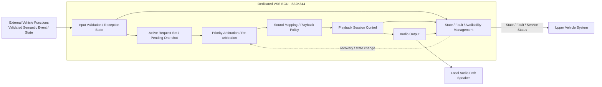
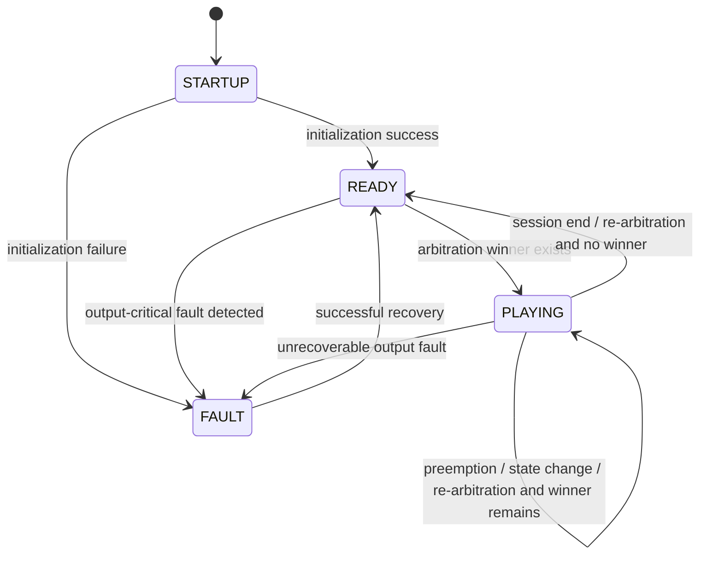
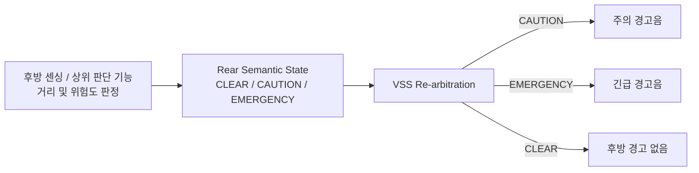

# VSS System Requirement Specification (SysRS)
## Dedicated S32K344 ECU — Functional Baseline Draft (Revised Review Candidate)

> 상태: **REVIEW DRAFT / ECU Cross-check 전**  
> 대상 시스템: **VSS 전용 S32K344 ECU 1대**  
> 기존 SysRS ID는 유지하고, 필요한 신규 요구사항만 후속 ID로 추가한다.  
> `[CANDIDATE]`는 초기 개발·벤치 검증을 위한 임시값이며 승인 전 Baseline 값으로 보지 않는다.  
> 실제 CAN ID, Signal bit width, DLC, Start Bit, Endianness, 최종 Cycle/Timeout, CRC/E2E는 본 SysRS에서 확정하지 않는다.

---

# 1. 대상 시스템과 책임

본 SysRS의 대상은 독립된 물리 S32K344 보드 1대로 구성되는 VSS ECU이다.

VSS ECU의 책임은 다음과 같다.

- 외부 차량 시스템에서 의미가 확정된 VSS 관련 **One-shot Event와 Stateful Information** 수용
- 입력 의미와 유효성 확인
- 상태 유지형 입력의 현재 유효 상태 관리
- 현재 유효 요청의 우선순위 중재 및 재중재
- 의미 요청과 로컬 음향 자산/재생 정책의 대응
- 재생 시작, 선점, 종료 및 재생 상태 관리
- 자체 음향 출력 오류 검출과 복구 상태 관리
- 외부 차량 시스템이 활용할 수 있는 VSS 동작 상태 및 오류 정보 제공

VSS ECU의 책임이 아닌 항목은 다음과 같다.

- 센서 Raw Data 처리
- 파워윈도우 끼임 자체 판정
- 잔류 탑승자 자체 판정
- 후방 장애물 거리 측정
- 후방 장애물 충돌 위험 수준 자체 판정
- 차량 전체 상태 판단
- 조도 또는 시간 기반 음량 계산
- 외부 오디오 스트림 수신 및 재생
- 실제 CAN Message ID, Signal bit layout 등 차량 네트워크 매핑 결정

---

# 2. 논리 시스템 구조

후방 장애물 기능의 경우 거리 측정과 위험도 판정은 VSS 외부에서 수행한다. VSS는 `주의`, `긴급`, `해제`처럼 의미가 확정된 상태를 받아 음향으로 표현한다.

본 구조는 **논리 책임과 정보 흐름**을 정의한다. 물리 통신 방식, 메시지 배치, ECU 간 실제 Network Producer/Consumer는 후속 Interface/Network 단계에서 확정한다.

---

# 3. 시스템 상태

VSS ECU는 최소 다음의 논리 상태를 제공해야 한다.

| State | 의미 |
|---|---|
| `STARTUP` | 전원 인가 후 초기화가 완료되지 않은 상태 |
| `READY` | 초기화가 완료되었고 현재 활성 Playback Session이 없는 상태 |
| `PLAYING` | 하나의 Playback Session이 활성화된 상태 |
| `FAULT` | 정상적인 VSS 음향 출력 능력을 보장할 수 없는 상태 |

`PLAYING`은 실제 오디오 파형이 발생하는 순간만을 의미하지 않는다. 하나의 Playback Session에 정의된 cue 간 무음, 반복 간격 등도 해당 Session이 유지되는 동안 `PLAYING`에 포함된다.

`READY`와 `PLAYING`은 모두 유효한 Semantic Event/State를 수용하고 중재할 수 있다. 따라서 **현재 재생 중인지**와 **새 입력을 수용 가능한지**를 동일 개념으로 취급하지 않는다.

## 3.1 기본 상태 전이

## 3.2 상태 전이 해석 규칙

- `STARTUP -> READY` 후에도 유효 Stateful Request 또는 아직 의미 유효기간 안에 있는 One-shot Request가 있으면 재중재 후 `PLAYING`으로 전이할 수 있다.
- Stateful Request의 `CLEAR` 하나만으로 무조건 `PLAYING -> READY`로 전이하지 않는다. 다른 유효 요청이 남아 있으면 재중재 후 `PLAYING`을 유지한다.
- 높은 우선순위 Session에 선점된 Stateful Request는 유효 상태 자체를 잃지 않으며, 이후 다시 Winner가 되면 Playback Session을 재활성화할 수 있다.
- 재생이 시작된 One-shot이 높은 우선순위 Session에 선점된 경우 자동 Resume하지 않는다.
- `READY` 상태에서도 Output-critical Fault가 검출될 수 있으므로 `READY -> FAULT` 전이를 허용한다.
- Fault 복구 성공 시 우선 `READY`로 복귀한 뒤 현재 유효 요청을 다시 평가한다.
- `SLEEP` 또는 Wake 전원 상태를 top-level `VSS_STATE`에 추가할지는 Power Architecture 확정 후 결정한다.

## 3.3 서비스 Availability 개념

VSS의 동작 State와 실제 서비스 제공 범위는 분리해 해석한다.

- **FULL**: 정의된 VSS 기능을 정상 제공 가능
- **DEGRADED**: 일부 Event/Asset/경로에 제한이 있으나 VSS 전체가 출력 불능은 아님
- **UNAVAILABLE**: 정상적인 VSS 음향 출력을 보장할 수 없음

다음 원칙을 사용한다.

- `UNAVAILABLE`은 정상 출력 능력을 보장할 수 없는 상태이므로 `FAULT`와 연계되어야 한다.
- `FULL` 또는 `DEGRADED` 상태에서는 `READY` 또는 `PLAYING`이 가능하다.
- `STARTUP` 동안 서비스 Availability는 아직 확정되지 않은 것으로 취급하며, 초기화 중이라는 이유만으로 `FAULT`로 간주하지 않는다.
- 실제 외부 Signal 이름, enum 숫자값 및 encoding은 Logical Interface/Network 단계에서 결정한다.

---

# 4. Functional Requirements

| ID | Requirement |
|---|---|
| VSS-SYS-FUN-001 | VSS ECU는 전원 인가 후 자체 초기화를 수행하고 정상적인 경우 `READY` 상태로 전이해야 한다. |
| VSS-SYS-FUN-002 | VSS ECU는 외부 차량 시스템에서 제공된 유효한 VSS 의미 Event/State를 수용할 수 있어야 한다. |
| VSS-SYS-FUN-003 | VSS ECU는 수용한 의미 Event/State를 사전에 정의된 로컬 음향 자산 및 재생 정책과 대응시켜야 한다. |
| VSS-SYS-FUN-004 | VSS ECU는 동일한 의미 Event/State에 대해 정상 상태에서 일관된 음향 정책을 적용해야 한다. |
| VSS-SYS-FUN-005 | VSS ECU는 한 시점에 하나의 Playback Session만 활성 출력 대상으로 선택해야 한다. |
| VSS-SYS-FUN-006 | VSS ECU는 일반 피드백, 주의 경고, 긴급 경고의 세 우선순위 등급을 구분해야 한다. |
| VSS-SYS-FUN-007 | 긴급 경고는 현재 출력 중인 주의 경고 및 일반 피드백보다 우선해야 한다. |
| VSS-SYS-FUN-008 | 주의 경고는 현재 출력 중인 일반 피드백보다 우선해야 한다. |
| VSS-SYS-FUN-009 | 현재 Session보다 낮은 우선순위의 신규 요청은 현재 Session을 중단시키지 않아야 한다. |
| VSS-SYS-FUN-010 | 높은 우선순위 Playback Session에 의해 재생 도중 선점된 One-shot 일반 피드백은 선점 원인이 종료된 후 자동으로 재개되지 않아야 한다. |
| VSS-SYS-FUN-011 | VSS ECU는 One-shot 피드백 Event를 정의된 재생 정책에 따라 출력하고 종료할 수 있어야 한다. |
| VSS-SYS-FUN-012 | VSS ECU는 상태 유지형 경고의 현재 Effective State가 활성인 동안 해당 경고에 정의된 반복 또는 지속 Playback 정책을 적용해야 한다. |
| VSS-SYS-FUN-013 | 상태 유지형 경고의 유효한 해제 정보가 수용된 경우 해당 요청을 Active Request Set에서 제거하고 재중재해야 하며, 해당 경고음은 정의된 종료 시간 안에 종료되어야 한다. |
| VSS-SYS-FUN-014 | VSS ECU는 후방 장애물 주의 상태가 유효하게 제공된 경우 주의 경고음을 출력해야 한다. |
| VSS-SYS-FUN-015 | VSS ECU는 후방 장애물 긴급 상태가 유효하게 제공된 경우 주의 경고음과 구분되는 긴급 경고음을 출력해야 한다. |
| VSS-SYS-FUN-016 | 후방 장애물 상태가 주의에서 긴급으로 변경된 경우 VSS ECU는 현재 요청을 재중재하고 긴급 경고를 우선 출력해야 한다. |
| VSS-SYS-FUN-017 | 후방 장애물 위험 해제 상태가 유효하게 제공된 경우 VSS ECU는 해당 장애물 요청을 Active Request Set에서 제거하고 재중재해야 한다. |
| VSS-SYS-FUN-018 | VSS ECU는 후방 장애물의 실제 거리값을 이용하여 위험 수준을 직접 판정하지 않아야 한다. |
| VSS-SYS-FUN-019 | VSS ECU는 지원하지 않거나 유효하지 않은 의미 입력을 수용한 경우 임의의 음향을 출력하지 않아야 한다. |
| VSS-SYS-FUN-020 | VSS ECU는 필요한 로컬 음향 자산을 사용할 수 없는 경우 다른 의미의 음향으로 임의 대체하지 않아야 한다. |
| VSS-SYS-FUN-021 | VSS ECU는 현재 동작 상태와 정상 음향 서비스 제공 가능 수준 및 오류 존재 여부를 외부 차량 시스템이 확인할 수 있도록 해야 한다. |
| VSS-SYS-FUN-022 | VSS ECU는 조도 변화만을 근거로 음량을 자동 변경하지 않아야 한다. |
| VSS-SYS-FUN-023 | VSS ECU는 시간대 또는 주야간 정보만을 근거로 음량을 자동 변경하지 않아야 한다. |
| VSS-SYS-FUN-024 | VSS ECU는 외부에서 전달되는 오디오 스트림에 의존하지 않고 본 SysRS의 핵심 음향을 제공할 수 있어야 한다. |
| VSS-SYS-FUN-025 | VSS ECU는 다수 음원의 동시 Mixing을 수행하지 않아야 한다. |
| VSS-SYS-FUN-026 | VSS ECU는 일반 미디어 Ducking을 핵심 기능으로 포함하지 않아야 한다. |
| VSS-SYS-FUN-027 | VSS ECU는 Fade-in/Fade-out 연출을 핵심 기능으로 포함하지 않아야 한다. |

## 4.1 Event-specific Functional Requirements

| ID | Requirement |
|---|---|
| VSS-SYS-FUN-028 | `VEHICLE_WELCOME` 의미 Event가 유효하게 수용된 경우 VSS ECU는 차량 사용 시작을 나타내는 일반 피드백 음향을 출력해야 한다. |
| VSS-SYS-FUN-029 | `VEHICLE_GOODBYE` 의미 Event가 유효하게 수용된 경우 VSS ECU는 차량 사용 종료를 나타내는 일반 피드백 음향을 출력해야 한다. |
| VSS-SYS-FUN-030 | `DOOR_LOCK_COMPLETE` 의미 Event가 유효하게 수용된 경우 VSS ECU는 도어 잠금 완료를 나타내는 일반 피드백 음향을 출력해야 한다. |
| VSS-SYS-FUN-031 | `DOOR_UNLOCK_COMPLETE` 의미 Event가 유효하게 수용된 경우 VSS ECU는 도어 잠금 완료 음향과 구분 가능한 음향 또는 재생 패턴을 출력해야 한다. |
| VSS-SYS-FUN-032 | `DOOR_LOCK_ERROR` 의미 Event가 유효하게 수용된 경우 VSS ECU는 정상 잠금 완료 음향과 구분 가능한 주의 경고음을 출력해야 한다. |
| VSS-SYS-FUN-033 | 파워윈도우 안티핀치 위험 상태가 유효하게 `ACTIVE`인 동안 VSS ECU는 정의된 긴급 경고 Playback 정책을 유지해야 하며, 유효한 해제 상태가 수용되면 VSS-SYS-PER-006을 만족하도록 해당 경고를 종료해야 한다. |
| VSS-SYS-FUN-034 | 잔류 탑승자 위험 상태가 유효하게 `ACTIVE`인 동안 VSS ECU는 정의된 긴급 경고 Playback 정책을 유지해야 하며, 유효한 해제 상태가 수용되면 VSS-SYS-PER-006을 만족하도록 해당 경고를 종료해야 한다. |

## 4.2 Stateful / Re-arbitration Functional Requirements

| ID | Requirement |
|---|---|
| VSS-SYS-FUN-035 | VSS ECU는 각 상태 유지형 입력의 최신 정상 의미 상태와 현재 수신 품질을 기능별로 독립적으로 관리하고, 정의된 Fail-safe 정책을 적용한 현재 Effective State를 중재 입력으로 사용해야 한다. |
| VSS-SYS-FUN-036 | Stateful 입력의 활성·해제·등급 변경, 현재 Playback Session의 종료, 선점 조건 변경 또는 오류 복구가 발생한 경우 VSS ECU는 현재 유효 요청 집합을 다시 중재해야 한다. |
| VSS-SYS-FUN-037 | 높은 우선순위 Playback Session에 의해 선점된 Stateful Warning/Emergency의 Effective State가 계속 활성인 경우, 재중재 결과 해당 요청이 다시 Winner가 되면 VSS ECU는 해당 Playback Session을 다시 활성화해야 한다. |
| VSS-SYS-FUN-038 | `PLAYING` 상태는 하나의 Playback Session이 활성화된 전체 기간을 의미해야 하며 해당 Session에 정의된 cue 간 무음 및 반복 간격을 포함해야 한다. |
| VSS-SYS-FUN-039 | VSS ECU는 One-shot Event가 최초로 유효 수용된 시점부터 정의된 의미 유효 수명(Max Age)을 적용해야 한다. |
| VSS-SYS-FUN-040 | 더 높은 Priority Session 또는 STARTUP 상태로 인해 One-shot Event가 즉시 재생되지 못한 경우, 해당 Event가 정의된 Max Age를 초과하면 VSS ECU는 이를 폐기하고 이후 자동 재생하지 않아야 한다. |
| VSS-SYS-FUN-041 | 이미 재생이 시작된 One-shot Event가 선점된 경우에는 VSS-SYS-FUN-010을 적용하고, 아직 재생을 시작하지 못한 One-shot Event에는 VSS-SYS-FUN-039 및 VSS-SYS-FUN-040을 적용해야 한다. |
| VSS-SYS-FUN-042 | 후방 장애물 Effective State가 `EMERGENCY`에서 `CAUTION`으로 유효하게 변경된 경우 VSS ECU는 Emergency Session을 종료하고 현재 유효 요청을 재중재하여 Caution Session을 적용해야 한다. |
| VSS-SYS-FUN-043 | VSS ECU는 후방 장애물의 최신 유효 의미 상태(`CLEAR`, `CAUTION`, `EMERGENCY`)를 상태형 정보로 관리하고 상태 변경 시 해당 값을 중재 입력에 반영해야 한다. |
| VSS-SYS-FUN-044 | 상태 유지형 입력의 동일한 활성 값이 주기적으로 반복 수신되는 경우 VSS ECU는 이를 새로운 경고 발생으로 해석하여 Playback Session을 매 수신마다 재시작해서는 안 된다. |

---

# 5. Semantic Input Requirements

본 단계에서는 실제 CAN Signal Name, 숫자 Event ID, bit width를 정의하지 않는다. VSS가 필요로 하는 **의미 정보의 종류와 동작 의미**만 정의한다.

## 5.1 One-shot Semantic Event

| Semantic Event | Meaning | Default Class | Baseline Behavior |
|---|---|---|---|
| `VEHICLE_WELCOME` | 차량 사용 시작 | Feedback | One-shot feedback |
| `VEHICLE_GOODBYE` | 차량 사용 종료 | Feedback | One-shot feedback |
| `DOOR_LOCK_COMPLETE` | 도어 잠금 정상 완료 | Feedback | One-shot feedback |
| `DOOR_UNLOCK_COMPLETE` | 도어 잠금 해제 정상 완료 | Feedback | Lock feedback과 구분 가능한 feedback |
| `DOOR_LOCK_ERROR` | 도어 잠금 이상 | Warning | Lock 완료와 구분 가능한 warning |

> `DOOR_UNLOCK_COMPLETE`의 **2 cues / 150–300 ms**는 Baseline 요구가 아니라 §6의 Candidate Playback 값이다.

## 5.2 Stateful Semantic Information

| Semantic Information | Required Meaning | Default Class | Baseline Behavior |
|---|---|---|---|
| Power Window Anti-Pinch | `CLEAR / ACTIVE` 의미 구분 | Emergency when ACTIVE | ACTIVE 동안 경고 유지, CLEAR 시 종료 |
| Occupant Hazard | `CLEAR / ACTIVE` 의미 구분 | Emergency when ACTIVE | ACTIVE 동안 경고 유지, CLEAR 시 종료 |
| Rear Obstacle | `CLEAR / CAUTION / EMERGENCY` 의미 구분 | Warning / Emergency | 위험 단계 변경에 따라 재중재, CLEAR 시 종료 |

`SNA (Signal Not Available)`는 Producer가 현재 정상 Semantic State를 제공할 수 없음을 나타내는 의미 상태이다. `NOT_AVAILABLE/SNA`, `NOT_RECEIVED`, `STALE`, `INVALID`는 정상 차량 의미 상태와 동일한 값이 아니다. 정상 `CLEAR`와 통신/수신 품질 이상을 구분해야 하며, 실제 wire encoding은 후속 단계에서 결정한다.

## 5.3 후방 장애물 위험 상태의 VSS 처리 개념

후방 장애물 실제 거리값, 거리 임계값, 센서 필터링 및 위험도 판단은 VSS SysRS의 책임 범위가 아니다.

---

# 6. Candidate Playback Behavior

다음 값은 기능 검증을 위한 임시 기준이며, Baseline 기능 의미와 구분한다.

| Item | Candidate |
|---|---:|
| Active audio channels / active playback winner | `1` |
| Priority levels | `3` |
| Feedback output setpoint | `60 %` |
| Warning output setpoint | `80 %` |
| Emergency output setpoint | `100 %` |
| General one-shot sound duration | `≤ 2.0 s` |
| Lock feedback recognition cues | `1` |
| Unlock feedback recognition cues | `2` |
| Unlock cue-to-cue interval | `150–300 ms` |
| Rear obstacle caution repeat interval | `500 ms` |
| Rear obstacle emergency repeat interval | `200 ms or continuous asset` |
| Duplicate one-shot suppression window | `150 ms` |
| Rear emergency→caution transition | `≤ 100 ms` |
| One-shot maximum semantic age | `TBD` |
| Equal-class arbitration detail | `TBD — fixed deterministic policy required` |

> `60/80/100%`는 VSS 내부 출력 제어 기준을 잡기 위한 상대 Setpoint이며 실제 음압(dBA) 요구사항이 아니다. 외부 `SET_VOLUME` Command 요구를 의미하지 않는다.  
> `Duplicate one-shot suppression window`는 동일 발생 Event의 중복 전달을 막기 위한 보조 Candidate이다. 실제 발생 식별 방식과 Counter 폭은 후속 Interface/Network 단계에서 결정한다.

다음 v0.6.2 작업안의 값은 아직 System 승인 근거가 부족하므로 본 SysRS Candidate 표에 승격하지 않는다.

- Door Lock Error `3 cues / 250 ms`
- Anti-Pinch `250 ms repeat`
- Occupant Hazard `1000 ms repeat`

위 값은 후속 System 리뷰에서 별도 승인/수정한다.

---

# 7. Performance Requirements

| ID | Requirement | Candidate |
|---|---|---:|
| VSS-SYS-PER-001 | 전원 인가 후 VSS ECU는 `READY` 또는 `FAULT` 상태를 확정해야 한다. | `≤ 1000 ms` |
| VSS-SYS-PER-002 | 일반 피드백 Event가 VSS 내부에서 유효하게 수용된 시점부터 음향 출력이 시작될 때까지의 지연은 제한되어야 한다. | `≤ 200 ms` |
| VSS-SYS-PER-003 | 주의 경고 요청이 VSS 내부에서 유효하게 수용된 시점부터 음향 출력이 시작될 때까지의 지연은 제한되어야 한다. | `≤ 100 ms` |
| VSS-SYS-PER-004 | 긴급 경고 요청이 VSS 내부에서 유효하게 수용된 시점부터 음향 출력이 시작될 때까지의 지연은 제한되어야 한다. | `≤ 50 ms` |
| VSS-SYS-PER-005 | 긴급 경고가 낮은 우선순위 음향을 선점하는 내부 처리 시간은 제한되어야 한다. | `≤ 50 ms` |
| VSS-SYS-PER-006 | 상태 유지형 경고의 유효한 해제 정보가 VSS 내부에서 수용된 후 해당 경고 출력이 종료될 때까지의 지연은 제한되어야 한다. | `≤ 100 ms` |
| VSS-SYS-PER-007 | 후방 장애물 상태가 주의에서 긴급으로 변경된 후 긴급 경고 출력으로 전환되는 시간은 제한되어야 한다. | `[CANDIDATE] ≤ 50 ms` |
| VSS-SYS-PER-008 | VSS의 내부 상태가 변경된 후 외부에 제공할 상태 정보가 갱신 가능한 상태가 되기까지의 시간은 제한되어야 한다. | `≤ 100 ms` |
| VSS-SYS-PER-009 | 복구 가능한 VSS 음향 출력 오류는 제한된 시간 안에 정상 상태 또는 명확한 실패 상태로 결정되어야 한다. | `[CANDIDATE] ≤ 2000 ms` |
| VSS-SYS-PER-010 | 후방 장애물 Effective State가 `EMERGENCY`에서 `CAUTION`으로 유효하게 변경된 후 Caution Playback Session이 적용되기까지의 시간은 제한되어야 한다. | `[CANDIDATE] ≤ 100 ms` |

위 시간은 VSS ECU가 해당 정보를 **유효하게 수용한 시점부터의 내부 시스템 성능**이다. 차량 네트워크 전송 지연 및 송신 주기는 포함하지 않는다.

---

# 8. External Logical Interface Requirements

본 절은 실제 통신 프로토콜을 정의하지 않는다. 후속 Interface 설계에서 필요한 **의미 계약**을 누락하지 않기 위한 논리 요구사항이다.

## 8.1 VSS가 외부에서 필요로 하는 정보

| ID | Requirement |
|---|---|
| VSS-SYS-INT-001 | VSS ECU는 어떤 One-shot 차량 Event가 발생했는지 식별 가능한 정보를 제공받아야 한다. |
| VSS-SYS-INT-002 | 상태 유지형 입력의 경우 VSS ECU는 해당 의미 상태의 활성 및 해제를 구분 가능한 형태로 제공받아야 한다. |
| VSS-SYS-INT-003 | 후방 장애물 경고 기능을 위해 VSS ECU는 최소한 `주의`, `긴급`, `해제`의 의미 상태를 구분 가능한 형태로 제공받아야 한다. |
| VSS-SYS-INT-004 | VSS ECU에 제공되는 후방 장애물 정보는 거리 Raw Data가 아니라 위험 수준이 판단된 의미 상태를 기본으로 해야 한다. |
| VSS-SYS-INT-005 | VSS에 제공되는 Event/State 정보는 VSS가 센서 Raw Data를 직접 판정하지 않아도 될 정도로 의미가 확정된 형태여야 한다. |

## 8.2 VSS가 외부에 제공해야 하는 정보

| ID | Requirement |
|---|---|
| VSS-SYS-INT-006 | VSS ECU는 `READY`뿐 아니라 입력 수용 가능한 `PLAYING` 상태를 포함하여 현재 Semantic Event/State를 수용 가능한지 외부 시스템이 확인할 수 있도록 해야 한다. |
| VSS-SYS-INT-007 | VSS ECU는 정상/오류 상태와 정상 음향 서비스 제공 가능 수준을 외부 시스템이 확인할 수 있도록 해야 한다. |
| VSS-SYS-INT-008 | VSS ECU는 필요한 경우 현재 Playback Session 활성 여부 또는 현재 음향 출력 상태를 외부 시스템이 확인할 수 있도록 해야 한다. |
| VSS-SYS-INT-009 | VSS ECU가 오류에서 복구된 경우 외부 시스템이 정상 복귀 여부를 확인할 수 있도록 해야 한다. |

## 8.3 Startup / Wake / Input Quality 계약

| ID | Requirement |
|---|---|
| VSS-SYS-INT-010 | VSS ECU가 STARTUP 또는 Wake 전환으로 아직 정상 Event 처리가 불가능한 구간에 One-shot Event가 발생할 수 있는 경우, VSS Logical Interface는 해당 Event가 의미 유효기간 안에서 유실되지 않도록 하는 Delivery Contract를 제공해야 한다. |
| VSS-SYS-INT-011 | Startup/Wake Event Delivery 방식은 VSS 선행 Wake, VSS 수용 가능 상태 확인 후 송신, Startup Event Latch 또는 동등한 방식 중 하나로 프로젝트 Power/Interface 설계에서 확정되어야 하며, 선택된 방식은 VSS-SYS-INT-010의 Event 유실 방지 요구를 만족해야 한다. |
| VSS-SYS-INT-012 | Startup/Wake 또는 통신 복구 이전에 발생한 One-shot Event가 정의된 Max Age를 초과한 경우 해당 Event를 신규 유효 Event처럼 재생 또는 재전달해서는 안 된다. |
| VSS-SYS-INT-013 | 상태 유지형 입력이 `NOT_AVAILABLE/SNA` 의미를 지원하는 경우, 해당 상태는 정상 의미 상태와 구분 가능한 형태로 제공되어야 한다. |
| VSS-SYS-INT-014 | VSS ECU는 상태 유지형 입력별로 최소 `NOT_RECEIVED`, `VALID`, `STALE`, `INVALID`의 수신 품질 상태를 내부적으로 구분해야 한다. |
| VSS-SYS-INT-015 | 상태 유지형 입력의 `NOT_RECEIVED`, `STALE`, `INVALID` 또는 `NOT_AVAILABLE/SNA` 상태가 정상 안전 상태인 `CLEAR`로 자동 해석되어서는 안 된다. |
| VSS-SYS-INT-016 | 통합 검증에서 상태 유지형 입력의 수신 품질과 적용된 Fail-safe 상태를 확인할 수 있는 진단 또는 시험 관측 경로가 제공되어야 한다. |
| VSS-SYS-INT-017 | One-shot Event 전달 계약은 동일 발생의 반복 전달과 별개의 새로운 발생을 구분하여 중복 전달이 중복 재생을 유발하지 않도록 해야 한다. |

## 8.4 본 단계에서 결정하지 않는 항목

- CAN / LIN / UART 등 실제 물리·데이터링크 프로토콜
- Message ID / Signal ID / 실제 Signal Name
- Payload Byte Layout / DLC / Start Bit / Endianness
- 최종 송신 주기 / Timeout / Freshness 수치
- Event occurrence 식별 방식의 실제 Counter bit 폭
- Alive/Rolling Counter
- CRC / E2E
- Bus-Off 정책 및 실제 Network Recovery 절차
- Bit Rate / Data Rate
- Arbitration 우선순위 / Bus Load
- Startup/Wake의 실제 전원·네트워크 구현
- 후방 장애물 주의/긴급 거리 임계값
- 초음파 센서 샘플링 주기 및 필터링 방식

---

# 9. Safety / Priority Requirements

| ID | Requirement |
|---|---|
| VSS-SYS-SAF-001 | 긴급 경고는 주의 경고 및 일반 피드백보다 높은 우선순위로 처리되어야 한다. |
| VSS-SYS-SAF-002 | 주의 경고는 일반 피드백보다 높은 우선순위로 처리되어야 한다. |
| VSS-SYS-SAF-003 | 후방 장애물 긴급 상태는 후방 장애물 주의 상태보다 높은 우선순위로 처리되어야 한다. |
| VSS-SYS-SAF-004 | 유효하지 않은 의미 입력 또는 사용할 수 없는 음향 자산으로 인해 잘못된 의미의 음향이 출력되어서는 안 된다. |
| VSS-SYS-SAF-005 | VSS ECU의 오류가 파워윈도우, 공조, 조명, 센싱 등 다른 차량 기능의 제어 상태를 직접 변경해서는 안 된다. |
| VSS-SYS-SAF-006 | VSS ECU가 정상적인 음향 출력을 보장할 수 없는 경우 해당 상태가 외부 시스템에서 식별 가능해야 한다. |

---

# 10. Diagnostic Requirements

## 10.1 Internal VSS Output Fault Categories

다음은 VSS 자체의 음향 서비스/출력 능력에 영향을 주는 Internal Fault Category이다.

- `SOUND_ASSET_UNAVAILABLE`
- `PLAYBACK_START_FAILURE`
- `AUDIO_OUTPUT_FAILURE`
- `PLAYBACK_STATE_FAILURE`
- `INITIALIZATION_FAILURE`

실제 DTC 번호, Fault bitmask, Severity encoding 및 네트워크 진단 포맷은 본 단계에서 정의하지 않는다.

## 10.2 Input / Interface Diagnostic Conditions

다음은 외부 입력 또는 통신/수신 품질과 관련된 진단 조건이며, Internal VSS Output Fault와 분리한다.

- `INVALID_EVENT`
- `INPUT_NOT_RECEIVED`
- `INPUT_STALE`
- `INPUT_INVALID`

CRC/E2E/Alive Counter/Bus-Off 관련 세부 진단 항목은 실제 Network 설계 이후 필요한 수준으로 확장한다.

## 10.3 Fault / Availability Requirements

| ID | Requirement |
|---|---|
| VSS-SYS-DIA-001 | VSS ECU는 정상 음향 출력을 방해하는 Internal Output Fault를 검출할 수 있어야 한다. |
| VSS-SYS-DIA-002 | VSS ECU는 최근 발생한 주요 Internal Output Fault 원인을 식별 가능하게 유지해야 한다. |
| VSS-SYS-DIA-003 | 초기화 실패 시 VSS ECU는 `FAULT` 상태로 전이해야 한다. |
| VSS-SYS-DIA-004 | 복구 가능한 음향 출력 오류의 경우 VSS ECU는 전체 차량 시스템 재시작 없이 정상 상태로 복귀할 수 있어야 한다. |
| VSS-SYS-DIA-005 | 복구에 실패하여 정상 음향 출력을 보장할 수 없는 경우 VSS ECU는 `FAULT` 상태를 유지하고 오류 상태를 외부에 제공할 수 있어야 한다. |
| VSS-SYS-DIA-006 | 유효하지 않은 의미 입력이 수용된 경우 VSS ECU는 잘못된 음향을 출력하지 않고 해당 이상을 Input Diagnostic으로 처리할 수 있어야 한다. |
| VSS-SYS-DIA-007 | 필요한 로컬 음향 자산을 사용할 수 없는 경우 해당 Event/State에 대해 잘못된 대체 음향을 출력하지 않아야 한다. |
| VSS-SYS-DIA-008 | VSS ECU가 `READY` 상태에서 정상 음향 출력을 보장할 수 없게 하는 Output-critical Fault를 검출한 경우 `FAULT` 상태로 전이해야 한다. |
| VSS-SYS-DIA-009 | VSS ECU가 `PLAYING` 상태에서 정상 음향 출력을 보장할 수 없게 하는 복구 불가능 Output Fault를 검출한 경우 `FAULT` 상태로 전이해야 한다. |
| VSS-SYS-DIA-010 | 복구 가능한 오류에 대해 VSS ECU는 복구 절차 수행 중 정상적인 신규 일반 피드백을 출력 가능한 상태로 외부에 잘못 보고해서는 안 된다. |
| VSS-SYS-DIA-011 | 복구 성공 후 VSS ECU는 `READY`로 복귀한 뒤 현재 유효한 Stateful Request와 Max Age 이내 One-shot Request를 다시 평가해야 한다. |
| VSS-SYS-DIA-012 | VSS ECU는 외부 입력의 유효성/수신 품질 이상과 VSS 내부 음향 출력 Fault를 서로 구분 가능한 진단 상태로 관리해야 한다. |
| VSS-SYS-DIA-013 | `INVALID_EVENT`, `INPUT_NOT_RECEIVED`, `INPUT_STALE`, `INPUT_INVALID`와 같은 입력 진단 조건만으로 VSS 내부 Output Fault가 존재하는 것으로 보고해서는 안 된다. |
| VSS-SYS-DIA-014 | VSS ECU는 현재 활성 Internal Output Fault 존재 여부와 최근 발생한 주요 Internal Output Fault 원인을 서로 구분 가능한 형태로 관리해야 한다. |
| VSS-SYS-DIA-015 | Internal Output Fault가 복구된 경우 해당 Active Fault 상태는 해제되어야 하며, 최근 주요 Fault 정보는 정의된 Diagnostic Clear 정책이 적용될 때까지 식별 가능해야 한다. |
| VSS-SYS-DIA-016 | VSS ECU는 Internal Output Fault가 일부 음향 기능에만 영향을 주는 경우와 전체 정상 음향 출력을 보장할 수 없는 경우를 구분 가능한 서비스 Availability 상태로 관리해야 한다. |
| VSS-SYS-DIA-017 | 복구 가능한 Internal Output Fault와 복구 불가능한 Internal Output Fault의 분류 및 각 Fault별 Recovery Action은 정의된 진단 정책에 따라 결정되어야 한다. |
| VSS-SYS-DIA-018 | 둘 이상의 Internal Output Fault가 동시에 존재할 수 있는 경우 VSS ECU는 각 Active Fault 상태를 내부적으로 손실 없이 관리해야 한다. |

### Service Availability 해석 원칙

- 일부 Asset 또는 일부 기능만 제한되고 다른 주요 음향 기능은 계속 제공 가능한 경우 `DEGRADED`로 관리할 수 있다.
- 공통 Audio Output Path 실패 또는 초기화 실패처럼 정상 음향 출력을 보장할 수 없는 경우 `UNAVAILABLE`로 관리하고 `FAULT` 상태와 연계해야 한다.
- `STARTUP`은 초기화 진행 상태이며, 서비스 Availability가 아직 확정되지 않았다는 이유만으로 Internal Fault로 처리하지 않는다.
- 실제 Availability Signal 이름과 wire encoding은 후속 Interface 단계에서 결정한다.

---

# 11. Non-Functional Requirements

## 11.1 Robustness

| ID | Requirement |
|---|---|
| VSS-SYS-NFR-001 | 유효하지 않은 의미 입력이 VSS ECU 전체의 비정상 종료를 유발해서는 안 된다. |
| VSS-SYS-NFR-002 | 반복되는 동일 Event/State 입력으로 인해 재생 상태가 비정상적으로 누적되거나 교착되어서는 안 된다. |
| VSS-SYS-NFR-003 | VSS ECU는 정상적인 Event/State 처리 과정에서 무한 대기 상태에 진입하지 않아야 한다. |
| VSS-SYS-NFR-004 | VSS 관련 오류는 다른 차량 기능과 기능적으로 격리되어야 한다. |
| VSS-SYS-NFR-018 | 입력 상태의 `NOT_RECEIVED`, `STALE`, `INVALID`, `NOT_AVAILABLE/SNA`는 별도로 정의된 Fail-safe 정책 없이 정상 `CLEAR` 상태로 치환되어서는 안 된다. |
| VSS-SYS-NFR-019 | 입력 품질 이상 상태가 발생하더라도 VSS ECU는 마지막 정상 입력값, 현재 수신 품질 및 적용된 Effective State를 논리적으로 구분 가능하게 관리해야 한다. |

## 11.2 Predictability

| ID | Requirement |
|---|---|
| VSS-SYS-NFR-005 | 동일한 초기 상태와 동일한 유효 요청 집합에서는 동일한 우선순위 및 재생 정책이 적용되어야 한다. |
| VSS-SYS-NFR-006 | 동시에 여러 요청이 유효한 경우 결과 Playback Session은 명시된 우선순위 정책에 따라 결정되어야 한다. |
| VSS-SYS-NFR-007 | 한 시점의 활성 Playback Winner는 1개를 초과하지 않아야 한다. |
| VSS-SYS-NFR-015 | 동일 Priority Class에 둘 이상의 유효 요청이 동시에 존재하는 경우 VSS ECU는 사전에 정의된 Event-level Sub-priority 또는 동등한 결정 규칙에 따라 하나의 Winner를 결정해야 한다. |
| VSS-SYS-NFR-016 | 동일한 초기 상태와 동일한 유효 요청 집합에서는 요청의 수신 순서와 무관하게 동일한 Arbitration 결과가 결정되어야 한다. |
| VSS-SYS-NFR-017 | 동일 Class 중재 규칙과 Event-level Sub-priority는 재생 로직에 분산되지 않고 일관된 관리 단위에서 변경 가능해야 한다. |

> 동일 Class의 실제 Sub-priority 값은 아직 `TBD`이다. `First Accepted`처럼 수신 순서에 따라 결과가 바뀔 수 있는 규칙만으로 NFR-016을 만족한다고 간주하지 않는다.

## 11.3 Maintainability

| ID | Requirement |
|---|---|
| VSS-SYS-NFR-008 | 의미 Event/State와 음향 자산의 대응 관계는 일관된 관리 단위로 변경 가능해야 한다. |
| VSS-SYS-NFR-009 | 음향 우선순위 정책은 전체 기능 로직에 분산되지 않고 일관되게 관리 가능해야 한다. |
| VSS-SYS-NFR-010 | 실제 통신 프로토콜 변경이 VSS의 음향 정책 자체를 불필요하게 변경시키지 않도록 논리 인터페이스와 통신 구현이 분리 가능해야 한다. |

## 11.4 Testability

| ID | Requirement |
|---|---|
| VSS-SYS-NFR-011 | VSS ECU는 실제 파워윈도우 또는 초음파 센서를 직접 연결하지 않고 의미 Event/State 입력만으로 핵심 음향 기능을 시험할 수 있어야 한다. |
| VSS-SYS-NFR-012 | VSS ECU는 각 의미 Event/State에 대해 대응 음향과 우선순위 정책을 독립적으로 검증할 수 있어야 한다. |
| VSS-SYS-NFR-013 | VSS ECU는 음향 자산 미사용 가능, 유효하지 않은 입력 및 출력 실패 조건을 시험할 수 있어야 한다. |
| VSS-SYS-NFR-014 | 서로 다른 의미를 가진 주요 피드백 및 경고 음향은 사용자가 의미 차이를 구분할 수 있도록 서로 구분 가능한 재생 특성을 가져야 한다. |

---

# 12. Candidate Acceptance Criteria

| Test | Candidate Acceptance |
|---|---|
| Power-on readiness | 전원 인가 후 `≤ 1000 ms` 이내 READY 또는 FAULT 확정 |
| Feedback response | 내부 유효 수용 후 `≤ 200 ms` 이내 출력 시작 |
| Warning response | 내부 유효 수용 후 `≤ 100 ms` 이내 출력 시작 |
| Emergency response | 내부 유효 수용 후 `≤ 50 ms` 이내 출력 시작 |
| Emergency preemption | 낮은 우선순위 Session 중 `≤ 50 ms` 이내 긴급 Session으로 전환 |
| Anti-Pinch active/clear | Anti-Pinch ACTIVE 시 Emergency Session 시작, 유효 CLEAR 후 PER-006 이내 해당 경고 종료 |
| Occupant active/clear | Occupant Hazard ACTIVE 시 Emergency Session 시작, 유효 CLEAR 후 PER-006 이내 해당 경고 종료 |
| Rear obstacle caution | CAUTION 상태 수용 후 `≤ 100 ms` 이내 주의 경고 시작 |
| Rear obstacle escalation | `CAUTION -> EMERGENCY` 수용 후 `≤ 50 ms` 이내 긴급 경고 전환 |
| Rear obstacle downgrade | `EMERGENCY -> CAUTION` 수용 후 PER-010 이내 Caution Session 적용 |
| Rear obstacle clear | CLEAR 상태 수용 후 `≤ 100 ms` 이내 해당 Rear 경고 종료 |
| Stateful re-arbitration | Rear=CAUTION 중 Anti-Pinch=ACTIVE, 이후 Anti-Pinch=CLEAR이고 Rear가 계속 CAUTION이면 Rear Caution Session이 다시 활성화됨 |
| Stateful update while preempted | 높은 우선순위 Session 중 다른 Stateful 입력이 변경되어도 해당 최신 Effective State가 보존되고 이후 재중재에 사용됨 |
| Playback session silence | 반복 cue 사이의 의도된 무음 구간에도 `VSS_STATE=PLAYING` 유지 |
| Equal-class deterministic | 동일 유효 요청 집합을 입력 순서만 바꾸어 적용해도 정의된 동일 Winner 선택 |
| Blocked one-shot expiry | 높은 Priority/STARTUP 때문에 대기한 One-shot이 Max Age를 넘으면 이후 재생되지 않음 |
| Preempted one-shot | 재생 중인 Feedback One-shot이 높은 Priority에 선점되면 종료 후 자동 재개되지 않음 |
| Repeated state input | 동일 ACTIVE 상태가 주기적으로 반복 수신되어도 Playback Session이 매 프레임마다 처음부터 재시작되지 않음 |
| Startup event delivery | STARTUP/Wake 구간 One-shot이 Max Age 이내이면 선택된 Delivery Contract에 따라 유실 없이 처리됨 |
| Startup stale one-shot | STARTUP/Wake 중 발생한 One-shot이 Max Age를 넘으면 READY 이후 신규 Event처럼 재생되지 않음 |
| Invalid event isolation | Invalid/unsupported 입력 시 잘못된 음향이 출력되지 않고 Input Diagnostic만으로 Internal Output Fault로 보고되지 않음 |
| SNA handling | 정상 수신된 SNA/NOT_AVAILABLE이 CLEAR로 오인되지 않음 |
| Stale handling | Stateful 입력이 STALE이 된 경우 사전에 정의된 Stale Fail-safe를 적용하고 임의 CLEAR로 즉시 치환하지 않음 |
| Recovery resynchronization | Input 품질 정상 복귀 후 최신 유효 상태로 재동기화하여 재중재됨 |
| Idle fault transition | READY 중 Output-critical Fault 발생 시 FAULT 전이 |
| Degraded fault | 일부 기능만 제한된 Internal Fault에서 영향받지 않는 기능이 계속 가능하면 DEGRADED 상태로 구분 가능 |
| Unavailable fault | 전체 Audio Output을 보장할 수 없는 Fault에서 UNAVAILABLE/FAULT가 식별 가능 |
| Fault recovery | Recoverable Fault 복구 성공 후 Active Fault가 해제되고 최근 주요 Fault 원인은 Diagnostic Clear 정책 전까지 확인 가능 |
| Multiple faults | 둘 이상의 Internal Fault 동시 발생 시 각 Active Fault 상태를 내부적으로 손실 없이 유지 |
| State report timing | 내부 상태 변경 후 PER-008 이내 외부 제공 상태 갱신 가능 |
| Lock/Unlock distinction | Lock 및 Unlock 의미 Event에 대해 사용자가 서로 구분 가능한 피드백 제공 |
| Input quality observability | Integration test에서 Stateful Input의 NOT_RECEIVED/VALID/STALE/INVALID와 적용된 Fail-safe 상태를 관측 가능 |
| Illumination variation | 조도 변화만으로 출력 Setpoint 변경 없음 |
| Time variation | 시간/주야간 변화만으로 출력 Setpoint 변경 없음 |
| Streaming dependency | 외부 오디오 스트림 없이 모든 핵심 이벤트 재생 가능 |

---

# 13. Candidate Parameter Summary

| Category | Parameter | Candidate |
|---|---|---:|
| Architecture | VSS controller | Dedicated S32K344 ECU |
| Playback | Active winner | 1 |
| Playback | Priority levels | 3 |
| Output | Feedback setpoint | 60 % |
| Output | Warning setpoint | 80 % |
| Output | Emergency setpoint | 100 % |
| Timing | Startup | ≤ 1000 ms |
| Timing | Feedback start | ≤ 200 ms |
| Timing | Warning start | ≤ 100 ms |
| Timing | Emergency start | ≤ 50 ms |
| Timing | Emergency preemption | ≤ 50 ms |
| Timing | Rear caution→emergency transition | ≤ 50 ms |
| Timing | Rear emergency→caution transition | ≤ 100 ms |
| Timing | Stateful warning clear | ≤ 100 ms |
| Timing | Local recoverable fault recovery | ≤ 2000 ms |
| Behavior | One-shot duration | ≤ 2.0 s |
| Behavior | Lock feedback cues | 1 |
| Behavior | Unlock feedback cues | 2 |
| Behavior | Unlock cue interval | 150–300 ms |
| Behavior | Rear obstacle caution repeat | 500 ms |
| Behavior | Rear obstacle emergency repeat | 200 ms or continuous |
| Behavior | Duplicate suppression window | 150 ms |
| Behavior | One-shot maximum semantic age | TBD |
| Arbitration | Equal-class Sub-priority / tie-break | TBD |
| Robustness | Sequential event test | 1000 events |

---

# 14. TBD / 후속 단계 결정 항목

## 14.1 후방 센싱/상위 판단 기능에서 결정

- 초음파 센서 구성 및 장착 위치
- 후방 장애물 거리 측정 방식
- 주의 거리 임계값
- 긴급 거리 임계값
- 거리값 필터링
- 센서 고장 및 비정상값 판단
- 후진/차량 상태와의 활성 조건
- `CLEAR / CAUTION / EMERGENCY` 상태 결정 로직
- Rear Semantic Owner가 Sensing인지 Central인지 최종 확정

## 14.2 전체 기능 취합 후 Interface / Network 단계에서 결정

- VSS와 상대 ECU 간 물리 통신 경로 및 실제 Protocol
- 각 의미 정보의 Source/Network Producer/Consumer
- One-shot Event의 최종 Max Age
- 동일 Priority Class 내부 실제 Sub-priority 및 deterministic tie-break rule
- Startup/Wake Event Delivery 방식
- Event occurrence 식별 방식 및 Sequence/Counter 사용 여부
- Source ECU reset / Event counter wrap-around / VSS duplicate history reset 계약
- Bus-off/통신 복구 시 오래된 One-shot 폐기 기준
- Stateful 입력별 SNA 조건
- Stateful 입력별 Timeout/Freshness 및 Stale Hold 시간
- Stale Hold 만료 후 각 기능별 최종 Fail-safe Action
- Message/Signal 이름, CAN ID, DLC, Start Bit, Endianness
- Alive/Rolling Counter / CRC / E2E
- Network Arbitration 우선순위 / Bus Load
- E2E latency budget

## 14.3 Fault / Diagnostic / Availability 단계에서 결정

- Internal Fault별 실제 Severity 및 Availability 영향
- Fault별 Local Retry/Re-init 횟수와 승격 조건
- `SOUND_ASSET_UNAVAILABLE`의 영향 Scope 판정 기준
- 최근 Fault 정보의 Diagnostic Clear 조건
- Fault History의 NVM 유지 여부
- Input Validity를 Production Network에 노출할지 Debug/Test 전용으로 둘지
- Service Availability 정보를 실제 Consumer가 사용하는지 여부
- Recovery 진행 상태를 별도 외부 정보로 제공할 필요가 있는지 여부

## 14.4 Element / SW / HW 설계 단계에서 결정

- 실제 Audio Codec / DAC / Amplifier / Speaker
- 로컬 음향 저장 매체
- MP3 / WAV / PCM 등 실제 저장 포맷
- Sample Rate / Bit Depth
- 내부 Active Request Set 표현
- One-shot Pending storage 용량 및 overflow 정책
- Playback Session 내부 상태 구조
- Arbitration table 구현 방식
- Task 주기 및 RTOS 적용 여부
- Watchdog 주기
- DMA 사용 여부
- 내부 Buffer/Queue/Pool 구조
- CPU / RAM 세부 Budget
- Fault injection / test hook 구현 방식

## 14.5 System Scope / Validation에서 결정

- Door Lock Error의 실제 반복 패턴
- Anti-Pinch / Occupant Hazard의 실제 반복 패턴
- 외부 Mute 기능을 명시적으로 제외할지 향후 요구로 둘지
- 현재 프로젝트 VSS의 적용/비적용 음향 규제 범위
- Speaker 위치 / Target listening position / Audibility 평가 위치

---

# 15. Baseline Scope

> **VSS 전용 S32K344 ECU는 외부 차량 시스템에서 의미가 확정된 One-shot Event와 Stateful Information을 받아, 현재 유효 요청을 결정적으로 중재하고 로컬 음향을 단일 활성 Playback Session으로 제공하며, 자신의 서비스 상태·오류·복구 상태를 관리한다.**

후방 장애물 기능에서는 VSS가 초음파 거리값을 직접 판정하지 않고 외부에서 확정된 **CLEAR / CAUTION / EMERGENCY 의미 상태**를 음향으로 표현한다.

지속형 위험 정보는 정상 `CLEAR`와 통신 미수신/STALE/INVALID/SNA를 구분해야 한다. 높은 우선순위에 선점된 Stateful Warning은 의미 상태가 계속 유효하면 재중재 후 다시 활성화될 수 있으나, 선점된 One-shot은 자동 Resume하지 않는다.

실제 차량 통신 프로토콜, Signal Encoding 및 Message Mapping은 전체 시스템 Interface Cross-check 이후 수행한다.
---

# 16. Deferred / Future Security Extension

> 본 절은 **현재 SysRS Baseline의 정식 요구사항이 아니다.** 아래 `SEC-FUTURE-*` 항목은 VSS 및 기본 차량 네트워크 기능이 안정화되고 일정·자원 여유가 확보된 이후 별도 Security Requirement로 승격할 수 있는 후속 확장 후보이다. 따라서 현재 SR ↔ SysRS Trace 114개 요구사항 집계에는 포함하지 않는다.

| Future ID | Deferred Security Candidate | Status |
|---|---|---|
| SEC-FUTURE-001 | VSS와 Central/Domain Controller 간 상호 신뢰 확인을 위해 공개키 기반 ECU 인증 구조를 검토한다. | `DEFERRED` |
| SEC-FUTURE-002 | 인증 이후 통신 보호에 사용할 세션 키를 설정하기 위해 비대칭키 기반 Key Establishment / Key Exchange 구조를 검토한다. | `DEFERRED` |
| SEC-FUTURE-003 | 확립된 세션 키를 이용해 필요한 VSS 관련 메시지의 기밀성, 무결성 및 송신자 인증을 보호하는 구조를 검토한다. | `DEFERRED` |
| SEC-FUTURE-004 | 보안 적용 시 Replay Protection, Security Counter/Nonce 및 관련 메타데이터의 수명주기와 동기화 정책을 검토한다. | `DEFERRED` |
| SEC-FUTURE-005 | 인증 실패, Key Establishment 실패, 메시지 검증 실패 및 복호화/무결성 검증 실패 시 기능 영향과 오류 처리 정책을 정의한다. | `DEFERRED` |
| SEC-FUTURE-006 | 학습·데모 목적상 필요하면 제한된 범위에서 비대칭키 암호화/복호화 동작 자체를 검증할 수 있다. 실제 차량 메시지 보호 방식과 동일하다고 간주하지 않는다. | `DEFERRED` |

## 16.1 승격 조건

아래 조건이 충족되기 전에는 `SEC-FUTURE-*`를 현재 구현 의무로 취급하지 않는다.

1. VSS 핵심 Playback/Arbitration/Fault 기능이 안정적으로 동작할 것
2. VSS ↔ Central/Domain 기본 Interface 의미가 Freeze될 것
3. CAN/통신 경로, Cycle, Timeout, Bus Load 및 Recovery 정책이 안정화될 것
4. CPU/RAM/Flash 및 Timing Budget에 보안 처리 여유가 있을 것
5. 프로젝트 일정상 구현·시험 공수를 확보할 수 있을 것

## 16.2 적용 시 추가로 필요한 작업

Security Extension을 실제 범위로 승격하는 경우 다음 항목을 별도 단계에서 정의한다.

- Security Requirement ID 및 SR/SysRS Trace
- Key Provisioning / Key Storage / Key Update 정책
- 인증 및 Key Establishment 절차
- Session Key 수명주기
- 보호 대상 Message/Signal 범위
- Encryption / Authentication / Integrity 알고리즘 및 파라미터
- Replay Protection / Counter / Nonce 정책
- Security Failure 진단 및 Fail-safe/Degraded 동작
- 추가 Payload/Timing/Bus Load 영향
- Security Test / Fault Injection / Negative Test

현재 단계에서는 실제 CAN Payload에 Public Key, Session Key, Authentication Tag 등의 보안 필드를 예약하지 않는다.

