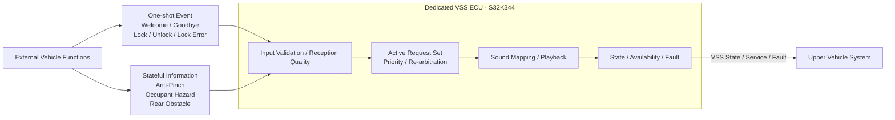
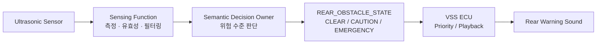
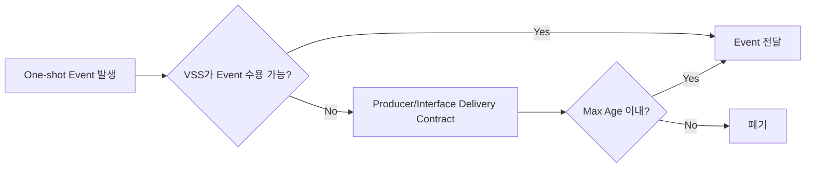

# VSS Logical Interface Needs — Pre-Network Draft (Revised Review Candidate)

> 상태: **REVIEW DRAFT / ECU Cross-check 전**  
> 상위 기준: `02_VSS_SYSRS_FUNCTIONAL_BASELINE_DRAFT.md`  
> 목적: 실제 CAN/UART 설계를 선행하지 않고, VSS와 외부 ECU 사이에서 **무슨 의미의 정보를 어떤 방향으로 교환해야 하는지**를 정의한다.  
> 이 문서는 CAN Matrix, Protocol Specification, `*_Interface.h` 또는 Wire Encoding 명세가 아니다.

---

## 0. 문서 상태와 표기 규칙

| 표기 | 의미 |
|---|---|
| `BASELINE` | SR/SysRS에서 의미 요구가 직접 확인되는 항목 |
| `PROVISIONAL` | Logical Interface를 구체화하기 위한 권장 표현. 팀 합의 전 Signal 확정 금지 |
| `OPTIONAL` | 통합 진단/시험 요구가 있을 때만 추가할 후보 |
| `TBD` | 상대 ECU 또는 Network/Power/Fault 정책과의 Cross-check 후 결정 |
| `DEFERRED` | 본 문서보다 후속 Network/Element 단계에서 결정 |

### 0.1 본 문서에서 지키는 경계

본 문서에서는 다음을 정의한다.

- 정보의 의미
- 정보의 방향
- One-shot Event와 Stateful Information의 구분
- VSS가 외부에서 반드시 알아야 하는 상태 의미
- VSS가 외부에 제공해야 하는 상태/오류 의미
- Startup/Wake, Freshness, Invalid 입력에서 필요한 **논리 계약**

본 문서에서는 다음을 확정하지 않는다.

- 실제 CAN/LIN/UART 경로
- CAN Message ID / Signal ID
- Start Bit / Length / DLC / Byte Order
- 실제 enum 숫자값 및 reserved code
- 최종 송신 주기 및 Timeout 값
- EVENT sequence bit width
- CRC / E2E / Alive Counter
- Bus-Off 상세 복구 정책
- ECU별 최종 Network Producer / Consumer

---

# 1. Logical Interface Overview

VSS 입력은 성격에 따라 **One-shot Event**와 **Stateful Information**으로 나눈다.



### 1.1 One-shot Event

순간적인 **발생 사실**이 중요하며, 발생 후 값이 지속되는 상태로 해석하지 않는다.

예:

- 차량 사용 시작 확정
- 차량 사용 종료 확정
- 도어 잠금 완료
- 도어 잠금 해제 완료
- 도어 잠금 이상 발생

One-shot Event는 동일 발생의 재전달과 별개의 새로운 발생을 구분할 수 있는 Delivery Contract가 필요하다. `[BASELINE need / encoding TBD]`

### 1.2 Stateful Information

현재 의미 상태가 일정 시간 유지되며, 상태가 변경될 때까지 VSS 중재 입력으로 사용된다.

예:

- Anti-Pinch: `CLEAR / ACTIVE`
- Occupant Hazard: `CLEAR / ACTIVE`
- Rear Obstacle: `CLEAR / CAUTION / EMERGENCY`

Stateful Information은 정상 의미값과 **수신 품질 이상**을 분리해서 다뤄야 한다. `SNA (Signal Not Available)`는 Producer가 현재 정상 Semantic State를 제공할 수 없음을 나타내는 의미 상태이다. `STALE`, `INVALID`, `NOT_RECEIVED`, `NOT_AVAILABLE/SNA`를 정상 `CLEAR`로 자동 해석하지 않는다. `[BASELINE]`

---

# 2. External → VSS

## 2.1 One-shot Semantic Event

| Logical Information | 의미 | Class | Semantic Owner 후보 | Network Producer | Delivery 의미 | 상태 |
|---|---|---|---|---|---|---|
| `VEHICLE_WELCOME` | 차량 사용 시작이 확정됨 | Feedback | `TBD` | `TBD` | 발생 단위 식별 필요 | `BASELINE meaning / PROVISIONAL name` |
| `VEHICLE_GOODBYE` | 차량 사용 종료가 확정됨 | Feedback | `TBD` | `TBD` | 발생 단위 식별 필요 | `BASELINE meaning / PROVISIONAL name` |
| `DOOR_LOCK_COMPLETE` | 도어 잠금이 정상 완료됨 | Feedback | Door/Access 후보, `TBD` | `TBD` | 발생 단위 식별 필요 | `BASELINE meaning / PROVISIONAL name` |
| `DOOR_UNLOCK_COMPLETE` | 도어 잠금 해제가 정상 완료됨 | Feedback | Door/Access 후보, `TBD` | `TBD` | 발생 단위 식별 필요 | `BASELINE meaning / PROVISIONAL name` |
| `DOOR_LOCK_ERROR` | 도어 잠금 이상이 확정됨 | Warning | Door/Access 후보, `TBD` | `TBD` | 발생 단위 식별 필요 | `BASELINE meaning / PROVISIONAL name` |

### 2.1.1 One-shot Event 계약

One-shot Event의 Logical Interface는 다음 의미를 만족해야 한다.

- 하나의 실제 Event occurrence가 통신 신뢰성 확보를 위해 반복 전달되더라도 VSS가 여러 번 재생하지 않아야 한다. `[BASELINE]`
- 동일 종류 Event가 나중에 다시 실제로 발생한 경우에는 새로운 occurrence로 구분 가능해야 한다. `[BASELINE]`
- Startup/Wake 중 VSS가 아직 Event를 정상 수용할 수 없는 경우에도 의미 유효기간 안의 Event가 무조건 유실되는 구조여서는 안 된다. `[BASELINE]`
- Startup/Wake 또는 통신 복구 이전에 발생한 Event가 이미 의미 유효기간을 초과했다면 신규 Event처럼 뒤늦게 재생되어서는 안 된다. `[BASELINE]`

발생 단위 식별 방식은 다음 중 하나 또는 동등한 방식으로 후속 단계에서 확정한다.

- Event occurrence sequence
- Event occurrence counter
- Toggle/edge identity
- Producer-side latch + acknowledged consumption
- 동등한 중복 억제 가능한 전달 방식

> `EVENT_CODE + EVENT_SEQ`는 현재 유력한 후보이지만, **bit width와 wire encoding은 본 단계에서 확정하지 않는다.** `[PROVISIONAL]`

## 2.2 Stateful Semantic Information

| Logical Information | 정상 의미 상태 | VSS 사용 목적 | Semantic Owner 후보 | Network Producer | 상태 |
|---|---|---|---|---|---|
| `WINDOW_ANTIPINCH_STATE` | `CLEAR / ACTIVE` | Anti-Pinch 긴급 경고의 시작/유지/종료 | Power Window 후보, `TBD` | `TBD` | `PROVISIONAL - recommended` |
| `OCCUPANT_HAZARD_STATE` | `CLEAR / ACTIVE` | 잔류 탑승자 위험 긴급 경고의 시작/유지/종료 | Sensing/Central 후보, `TBD` | `TBD` | `PROVISIONAL - recommended` |
| `REAR_OBSTACLE_STATE` | `CLEAR / CAUTION / EMERGENCY` | 후방 경고 단계 선택, 승격/강등/해제 | Sensing/Central 후보, `TBD` | `TBD` | `PROVISIONAL - recommended` |

### 2.2.1 Power Window Anti-Pinch

```text
Logical Information : WINDOW_ANTIPINCH_STATE
Normal Meaning       : CLEAR / ACTIVE
```

- `ACTIVE`: VSS가 Anti-Pinch Emergency 요청을 현재 유효 요청 집합에 포함해야 함
- `CLEAR`: 정상적으로 끼임 위험이 해제되었음을 의미함
- `STALE/INVALID/NOT_RECEIVED/SNA`: `CLEAR`와 동일 의미가 아님

`[PROVISIONAL logical representation]`

### 2.2.2 Occupant Hazard

```text
Logical Information : OCCUPANT_HAZARD_STATE
Normal Meaning       : CLEAR / ACTIVE
```

- `ACTIVE`: 잔류 탑승자 위험이 외부 기능에서 확정되어 VSS 경고가 요구되는 상태
- `CLEAR`: 정상적으로 해당 위험이 해제된 상태
- 탑승자 존재 Raw Detection과 `OCCUPANT_HAZARD_STATE`는 동일 개념으로 취급하지 않는다.

`[PROVISIONAL logical representation]`

### 2.2.3 Rear Obstacle

```text
Logical Information : REAR_OBSTACLE_STATE
Normal Meaning       : CLEAR / CAUTION / EMERGENCY
```

- `CLEAR`: 현재 후방 경고 대상 범위가 아님
- `CAUTION`: 주의 수준 경고 필요
- `EMERGENCY`: 긴급 수준 경고 필요

`CAUTION -> EMERGENCY`, `EMERGENCY -> CAUTION`, `* -> CLEAR`는 모두 **상태 변경**이며 VSS 재중재의 입력이 된다.

`[PROVISIONAL logical representation]`

---

# 3. Semantic State와 Reception Quality 분리

Stateful Information은 **차량 의미 상태(Semantic State)**와 **통신/수신 품질(Reception Quality)**을 분리해서 관리한다.

## 3.1 Reception Quality 최소 논리 상태

VSS 내부에서는 상태 유지형 입력별로 최소 다음 수신 품질을 구분할 수 있어야 한다.

```text
NOT_RECEIVED
VALID
STALE
INVALID
```

| Reception Quality | 의미 |
|---|---|
| `NOT_RECEIVED` | Startup/Wake 이후 아직 정상 정보를 한 번도 수용하지 못함 |
| `VALID` | 현재 Freshness/Validation 조건을 만족하는 정상 입력 |
| `STALE` | 과거 정상 입력은 있으나 현재 Freshness를 만족하지 못함 |
| `INVALID` | 수신은 되었으나 값/포맷/무결성 검증을 만족하지 못함 |

`NOT_AVAILABLE/SNA`는 Producer가 의미적으로 "현재 정상 상태를 제공할 수 없음"을 전달하는 **Semantic-side 상태** 후보이며, `STALE`과 같은 Reception Quality와 동일 개념이 아니다.

## 3.2 Last Valid State와 Effective State

VSS는 필요 시 다음 세 개념을 논리적으로 분리한다.

```text
Last Valid Semantic State
Reception Quality
Effective State used for Arbitration
```

예:

```text
Last Valid State  = ACTIVE
Reception Quality = STALE
Effective State   = TBD by Fail-safe Policy
```

이 경우 `STALE`을 자동으로 `CLEAR`로 바꾸지 않는다.

### 3.2.1 Fail-safe 결정 경계

Stateful Input가 `STALE / INVALID / NOT_RECEIVED / SNA`가 되었을 때 VSS가 적용할 Effective State는 **기능별 공동 결정**이 필요하다.

- 즉시 비활성화
- 제한 시간 Hold 후 비활성화
- 별도 degraded behavior
- 상위 시스템 판단을 기다림

본 문서는 이 중 하나를 임의 확정하지 않는다. `[TBD - Safety/Source/Network joint decision]`

---

# 4. 후방 장애물 정보 경계



- 초음파 Raw Distance를 VSS 입력으로 요구하지 않는다. `[BASELINE]`
- 거리 필터링 및 주의/긴급 임계값 판정은 VSS 외부에서 수행한다. `[BASELINE]`
- VSS는 최종적으로 의미가 확정된 `CLEAR / CAUTION / EMERGENCY` 상태를 필요로 한다. `[BASELINE]`
- Sensing ECU와 Central/Domain 중 누가 최종 Semantic Decision Owner 및 Network Producer가 될지는 상대 ECU Interface Cross-check 후 확정한다. `[TBD]`

---

# 5. VSS → External

VSS 출력은 **현재 동작 상태**, **입력 수용 가능 여부**, **서비스 제공 가능 수준**, **Internal Output Fault**를 외부 시스템이 구분할 수 있도록 구성하는 것을 기본 방향으로 한다.

## 5.1 Core Logical Output 후보

| Logical Information | Logical Meaning | Consumer | 상태 |
|---|---|---|---|
| `VSS_STATE` | `STARTUP / READY / PLAYING / FAULT` | `TBD` | `BASELINE meaning / PROVISIONAL name` |
| `VSS_ACCEPTING_EVENTS` | 현재 Semantic Event/State의 수용·검증·중재 가능 여부 | `TBD` | `PROVISIONAL - recommended` |
| `VSS_AVAILABILITY` | 현재 VSS 음향 서비스 제공 가능 범위 | `TBD` | `PROVISIONAL` |
| `VSS_FAULT_ACTIVE` | 현재 활성 Internal Output Fault 존재 여부 | `TBD` | `PROVISIONAL - recommended` |
| `VSS_LAST_FAULT` | 최근 주요 Internal Output Fault 원인 | `TBD` | `BASELINE need / PROVISIONAL encoding` |

### 5.1.1 VSS State

```text
VSS_STATE
- STARTUP
- READY
- PLAYING
- FAULT
```

- `READY`: 현재 Playback Session 없음
- `PLAYING`: Playback Session 활성
- `PLAYING` 중에도 새로운 입력을 수용/중재할 수 있음
- `FAULT`: 정상 음향 출력 능력을 보장할 수 없음

따라서 `VSS_STATE == READY`만으로 "Event 수용 가능"을 판단하지 않는다.

### 5.1.2 VSS Accepting Events

```text
VSS_ACCEPTING_EVENTS
- FALSE
- TRUE
```

`TRUE`의 의미는 다음으로 제한한다.

> VSS가 현재 Semantic Event/State를 수용하고 유효성 검사 및 중재 대상으로 처리할 수 있다.

`TRUE`가 **모든 Sound Asset이 반드시 출력 가능함**을 의미하지 않는다. 해당 정보는 Service Availability/Fault와 분리한다.

실제 Network Signal로 둘지, State/Availability에서 파생하는 상위 계약으로 둘지는 Consumer 확인 후 확정한다. `[TBD]`

### 5.1.3 VSS Service Availability

논리적 서비스 수준은 다음 의미를 사용한다.

```text
FULL
DEGRADED
UNAVAILABLE
```

| Availability | 의미 |
|---|---|
| `FULL` | Baseline VSS 기능을 정상 제공 가능 |
| `DEGRADED` | 일부 Event/Asset/출력 기능에 제한이 있으나 VSS 전체가 출력 불능은 아님 |
| `UNAVAILABLE` | 정상적인 VSS 음향 출력을 보장할 수 없음 |

- `UNAVAILABLE`은 `VSS_STATE == FAULT`와 연계되어야 한다.
- `FULL/DEGRADED`는 `READY` 또는 `PLAYING`에서 가능하다.
- `STARTUP`에서는 Availability 판단이 아직 완료되지 않았을 수 있다.
- 따라서 실제 Wire Encoding 단계에서는 `STARTUP` 중 Availability 표현 방법을 별도 확정해야 한다. 예: 별도 `NOT_EVALUATED` 표현 또는 `VSS_STATE`와 조합 해석. `[TBD]`

### 5.1.4 Fault Active / Last Fault

`VSS_FAULT_ACTIVE`와 `VSS_LAST_FAULT`는 역할이 다르다.

```text
VSS_FAULT_ACTIVE
= 현재 Internal Output Fault가 활성인가

VSS_LAST_FAULT
= 최근 주요 Internal Output Fault 원인은 무엇인가
```

- Input `STALE/INVALID/NOT_RECEIVED` 자체를 Internal Output Fault로 보고하지 않는다.
- Internal Output Fault가 복구되면 `FAULT_ACTIVE`는 해제되어야 한다.
- `LAST_FAULT`는 Diagnostic Clear 정책이 적용될 때까지 유지 가능해야 한다.

## 5.2 Optional Diagnostic / Test Information

다음은 Core Vehicle Interface에 바로 넣지 않고 통합 검증 요구가 있을 때 추가한다.

| Information | 사용 목적 | 상태 |
|---|---|---|
| `VSS_CURRENT_REQUEST` | 현재 Playback Winner 의미 확인 | `OPTIONAL` |
| `VSS_RECOVERY_STATUS` | 복구 진행/성공/실패 관측 | `OPTIONAL` |
| Input Reception Quality | Stateful 입력별 `VALID/STALE/...` 관측 | `OPTIONAL / Testability need` |
| Applied Effective State | Stale/SNA 이후 실제 중재 입력 확인 | `OPTIONAL / Testability need` |
| Class/Semantic Capability | DEGRADED 상태의 세부 사용 가능 범위가 Consumer에 필요할 때 | `OPTIONAL` |

### 5.2.1 기본적으로 중복 Signal을 만들지 않는 정보

- `VSS_READY_BOOL`: `VSS_STATE`와 의미 중복 가능성이 높아 기본 생성하지 않음
- `VSS_PLAYBACK_ACTIVE`: 기본적으로 `VSS_STATE == PLAYING`에서 파생 가능
- `VSS_RECOVERED_EVENT`: `FAULT/Availability` 상태 변화로 충분한지 먼저 검토

Consumer가 독립 Signal을 명시적으로 요구할 때만 추가한다.

---

# 6. Request / Command 경계

현재 VSS Baseline은 외부 ECU가 VSS의 음향 Asset 또는 Playback Sequence를 직접 제어하는 구조를 요구하지 않는다.

따라서 다음과 같은 범용 Command는 기본 Logical Interface에 두지 않는다.

| Command | 기본 판단 | 상태 |
|---|---|---|
| `PLAY_SOUND_xxx` | 상위가 VSS 내부 Sound Asset을 직접 지정하지 않음 | `NOT REQUIRED` |
| `STOP_SOUND` | 상태형 경고는 해당 Semantic State의 해제/변경으로 종료 | `NOT REQUIRED` |
| `SET_PRIORITY` | Priority는 VSS Local Policy | `NOT REQUIRED` |
| `SET_VOLUME` | 현재 Functional Baseline의 외부 Product Command로 요구하지 않음 | `NOT BASELINE` |

시험/진단 목적의 강제 재생 명령이 필요하면 제품 기능 Interface와 분리된 Test/Diagnostic Interface로 정의한다. `[DEFERRED]`

---

# 7. Startup / Wake / Communication Recovery 계약

## 7.1 Startup / Wake One-shot Event

One-shot Event가 VSS가 아직 정상 수용할 수 없는 시점에 발생할 가능성이 있으므로 다음 논리 계약이 필요하다.



실제 방법은 다음 중 하나 또는 동등한 방식으로 확정한다.

- VSS 선행 Wake
- VSS 수용 가능 상태 확인 후 Event 송신
- Producer-side Startup Event Latch
- Event queue/acknowledge 기반 전달

`[TBD - Power/Source/Interface joint decision]`

## 7.2 Stateful Information Startup

Stateful Information은 Event History를 재생하는 것이 아니라 **현재 상태를 재동기화**해야 한다.

예:

```text
Wake 후 현재 REAR_OBSTACLE_STATE = CLEAR
-> 과거 EMERGENCY를 재생하지 않음
-> 현재 CLEAR로 동기화
```

## 7.3 Communication Recovery

통신 복구 시:

- Stateful Information은 현재 의미 상태를 다시 수용해 재동기화한다.
- 오래된 One-shot Event를 신규 발생처럼 재생하지 않는다.
- Last Valid State와 Reception Quality를 구분해 갱신한다.
- 실제 Timeout/Freshness 숫자는 Network 단계에서 확정한다.

---

# 8. Interface Fail-safe 논리 경계

## 8.1 Invalid / Unsupported One-shot Event

```text
Invalid / Unsupported Event
 -> Reject
 -> 임의의 Sound 출력 금지
 -> Input Diagnostic 기록 가능
 -> VSS Internal Output Fault로 자동 승격하지 않음
```

## 8.2 Stateful STALE / INVALID / NOT_RECEIVED / SNA

```text
Stateful Input Quality 이상
 -> 정상 CLEAR로 자동 치환 금지
 -> 기능별 Fail-safe Policy 적용
 -> 필요 시 Bounded Hold / Disable / Degraded 적용
 -> 진단/시험 시 Reception Quality와 Effective State 관측 가능해야 함
```

정확한 Hold 시간 및 Safe Effective State는 Source ECU와 Safety/Network 정책을 함께 보고 정한다. `[TBD]`

## 8.3 VSS Internal Fault와 Upstream Communication 이상 분리

다음은 서로 다른 진단 축이다.

```text
AUDIO_OUTPUT_FAILURE
= VSS 내부 출력 기능 고장

REAR_OBSTACLE_STATE STALE
= 외부 입력 수신 품질 이상
```

두 상태를 동일 Fault Code로 합치지 않는다.

---

# 9. Source / Consumer Ownership 현황

본 문서는 **정보 의미를 먼저 확정**하고, 실제 Source/Consumer 소유권은 상대 ECU Interface Cross-check 후 확정한다.

## 9.1 External → VSS

| Logical Information | Semantic Owner | Network Producer | 현재 상태 |
|---|---|---|---|
| Vehicle Welcome | `TBD` | `TBD` | Cross-check 필요 |
| Vehicle Goodbye | `TBD` | `TBD` | Cross-check 필요 |
| Door Lock Complete | Door/Access 후보 | `TBD` | Cross-check 필요 |
| Door Unlock Complete | Door/Access 후보 | `TBD` | Cross-check 필요 |
| Door Lock Error | Door/Access 후보 | `TBD` | Cross-check 필요 |
| Anti-Pinch State | Power Window 후보 | `TBD` | Cross-check 필요 |
| Occupant Hazard State | Sensing/Central 후보 | `TBD` | Cross-check 필요 |
| Rear Obstacle State | Sensing/Central 후보 | `TBD` | Cross-check 필요 |

> `Semantic Owner`와 `Network Producer`는 반드시 동일 ECU일 필요가 없다. Central이 의미를 최종 확정하고 다른 ECU가 전달하거나, 반대로 하위 ECU가 최종 의미를 직접 Publish하는 구조도 가능하므로 전체 아키텍처 확인 전 고정하지 않는다.

## 9.2 VSS → External

| Logical Information | Producer | Consumer | 현재 상태 |
|---|---|---|---|
| VSS State | VSS | `TBD` | Consumer 확인 필요 |
| Accepting Events | VSS | `TBD` | Signal 필요 여부 확인 |
| Service Availability | VSS | `TBD` | Consumer 사용 여부 확인 |
| Fault Active | VSS | `TBD` | Consumer 확인 필요 |
| Last Fault | VSS | `TBD` | 진단 Consumer 확인 필요 |
| Optional Diagnostic | VSS | Test/Integration `TBD` | 필요 시만 추가 |

---

# 10. SysRS → Logical Interface Trace

| Logical Interface Need | 주요 SysRS 근거 |
|---|---|
| One-shot Event 식별 | `VSS-SYS-INT-001`, `017`, `VSS-SYS-FUN-039~041` |
| Stateful Active/Clear | `VSS-SYS-INT-002`, `013~016`, `VSS-SYS-FUN-035~037` |
| Rear CLEAR/CAUTION/EMERGENCY | `VSS-SYS-INT-003~005`, `VSS-SYS-FUN-014~018`, `042~043` |
| Input Reception Quality | `VSS-SYS-INT-013~016`, `VSS-SYS-NFR-018~019` |
| Event 수용 가능 정보 | `VSS-SYS-INT-006` |
| VSS State / Availability | `VSS-SYS-INT-007`, `VSS-SYS-DIA-016` |
| Playback 확인 | `VSS-SYS-INT-008` |
| Recovery 확인 | `VSS-SYS-INT-009`, `VSS-SYS-DIA-004~005`, `011` |
| Startup/Wake Delivery | `VSS-SYS-INT-010~012` |
| Internal Fault와 Input Diagnostic 분리 | `VSS-SYS-DIA-012~018` |
| Same-Class deterministic arbitration | `VSS-SYS-NFR-015~017` |

> 본 표의 SysRS ID는 Stage 02 `02_VSS_SYSRS_FUNCTIONAL_BASELINE_DRAFT.md` Review Candidate 기준이다.

---

# 11. Pre-Network Decision Summary

| No. | 결정/권장 사항 | 상태 |
|---|---|---|
| LI-01 | 순간 발생 정보와 지속 상태 정보를 One-shot Event / Stateful Information으로 분리 | `PROVISIONAL - recommend accept` |
| LI-02 | Welcome/Goodbye/Lock/Unlock/Lock Error는 One-shot Event로 취급 | `PROVISIONAL - recommend accept` |
| LI-03 | Anti-Pinch는 `CLEAR/ACTIVE` 상태 의미로 취급 | `PROVISIONAL - recommend accept` |
| LI-04 | Occupant Hazard는 `CLEAR/ACTIVE` 상태 의미로 취급 | `PROVISIONAL - recommend accept` |
| LI-05 | Rear Obstacle는 `CLEAR/CAUTION/EMERGENCY` 하나의 상태 정보로 취급 | `PROVISIONAL - recommend accept` |
| LI-06 | Rear Raw Distance는 VSS Logical Interface에 포함하지 않음 | `BASELINE` |
| LI-07 | Stateful Semantic State와 Reception Quality를 분리 | `BASELINE need / recommend accept` |
| LI-08 | `STALE/INVALID/NOT_RECEIVED/SNA`를 `CLEAR`로 자동 해석하지 않음 | `BASELINE` |
| LI-09 | One-shot 전달은 동일 발생 재전달과 신규 발생을 구분할 수 있어야 함 | `BASELINE need` |
| LI-10 | VSS 출력 기본 축은 State + Event 수용 가능 여부 + Availability + Fault 정보로 검토 | `PROVISIONAL` |
| LI-11 | Playback/Recovery/Input Quality 세부 정보는 Core보다 Optional Diagnostic 우선 | `PROVISIONAL` |
| LI-12 | Source/Consumer ECU와 Network Producer는 Cross-check 전 확정하지 않음 | `TBD 유지` |
| LI-13 | 실제 Signal bit width/Message ID/Cycle/Timeout은 본 단계에서 확정하지 않음 | `DEFERRED` |

---

# 12. Open Issues / Cross-check 필요 항목

## P0 — Interface 의미 Freeze 전

1. One-shot Event별 최종 Semantic Owner 확정
2. Door Lock Complete가 개별 Door 기준인지 차량 전체 Lock Completion 기준인지 확정
3. Anti-Pinch `ACTIVE/CLEAR`의 Producer 판정 조건 확정
4. Occupant Detection과 `OCCUPANT_HAZARD`의 의미 경계 확정
5. Rear Obstacle의 최종 위험도 판단 Owner 확정
6. Stateful 입력별 `SNA` 의미와 Producer 동작 확정
7. Stateful 입력이 STALE/INVALID일 때 Effective State 정책 확정
8. Same-Class Arbitration의 고정 tie-break/sub-priority 정책 확정

## P1 — Startup / Wake / Event Delivery

9. VSS Wake 순서와 Event Producer Wake 순서 확인
10. One-shot Event의 Startup/Wake Delivery 방식 확정
11. Event Max Age 기준 확정
12. 동일 occurrence 식별 방식 확정
13. Event occurrence 식별자의 reset/wrap 수명 규칙 확정
14. 통신 복구 후 오래된 One-shot Event 폐기 기준 확정

## P2 — VSS Output Consumer

15. `VSS_ACCEPTING_EVENTS`를 실제 Consumer가 필요로 하는지 확인
16. `VSS_AVAILABILITY`를 실제 Consumer가 사용하는지 확인
17. STARTUP 중 Availability wire 표현 방식 확정
18. `VSS_FAULT_ACTIVE` / `VSS_LAST_FAULT` Consumer 확정
19. `VSS_CURRENT_REQUEST`, `RECOVERY_STATUS` 등 Optional Diagnostic 필요 여부 확인

## P3 — Network 단계로 이관

20. Physical protocol
21. Message grouping
22. Event/State transmission method
23. Cycle / Timeout / Freshness 숫자
24. EVENT occurrence identity bit width
25. CRC / E2E / Alive Counter
26. Bus-Off / Communication Recovery 상세
27. CAN ID / DLC / Start Bit / Byte Order

---

# 13. 아직 만들지 않는 것

| Item | Current Status |
|---|---|
| Physical protocol | `NOT DEFINED` |
| CAN Message ID | `NOT DEFINED` |
| Signal numeric ID | `NOT DEFINED` |
| Signal bit width | `NOT DEFINED` |
| DLC / Frame Length | `NOT DEFINED` |
| Bit Position | `NOT DEFINED` |
| Byte Order | `NOT DEFINED` |
| Final Cycle Time | `NOT DEFINED` |
| Final Timeout / Freshness | `NOT DEFINED` |
| EVENT occurrence identity width | `NOT DEFINED` |
| Alive / Rolling Counter | `NOT DEFINED` |
| CRC / E2E | `NOT DEFINED` |
| Bit Rate / Data Rate | `NOT DEFINED` |
| Rear caution distance | `NOT DEFINED` |
| Rear emergency distance | `NOT DEFINED` |
| Sensor filtering | `NOT DEFINED` |
| `*_Interface.h` wire structure | `NOT DEFINED` |

---


# 14. Deferred Security Interface Extension

VSS ↔ Central/Domain 통신 보안은 현재 Logical Interface Baseline에 포함하지 않는다. 현재 문서는 **기능 의미(Semantic Event/State/Fault/Availability)**를 우선 확정하며, 보안 적용은 기본 Interface/Network 안정화 이후 후속 확장으로 검토한다.

향후 Security Extension을 적용하는 경우 기능 Semantic Signal과 별도로 다음 통신 보안 메타데이터가 필요할 수 있다.

- Authentication / Security Context Identifier
- Session / Key Identifier
- Message Authentication / Integrity Tag
- Replay Protection Counter / Nonce
- Security Validation Result / Error Information

위 항목의 실제 Message 배치, bit width, 주기, Counter 및 Crypto 방식은 현재 단계에서 정의하지 않는다. 기능 Semantic Interface와 Security Transport/Protection 정보는 가능한 한 별도 책임으로 관리한다.

**Status:** `DEFERRED / FUTURE EXTENSION`

---

# 15. 현재 단계 결론

현재 단계에서는 다음을 Logical Interface 기준으로 충분히 정의할 수 있다.

- One-shot Event와 Stateful Information의 구분
- VSS가 필요로 하는 Event/State 의미
- Anti-Pinch / Occupant / Rear 상태 표현 방향
- Raw Sensor Data와 Semantic State의 책임 경계
- 정상 Semantic State와 Reception Quality의 분리
- VSS State / Availability / Fault 출력 의미
- Startup/Wake/Event Delivery에서 필요한 논리 계약
- Communication Recovery 시 Stateful 재동기화와 오래된 Event 폐기 원칙

반면 다음은 상대 ECU 또는 Network 설계 없이 확정하지 않는다.

- 최종 Source/Consumer 및 Network Producer
- 실제 Signal 이름 확정 여부와 wire enum 숫자값
- CAN/UART 경로
- Message ID / DLC / Bit Layout
- Cycle / Timeout / Freshness 수치
- EVENT occurrence identity의 실제 bit 폭
- CRC / E2E / Alive Counter
- Stateful STALE 시 기능별 최종 Fail-safe 동작

따라서 다음 단계는 `05_VSS_ECU_INTERFACE_INFO_DRAFT.md`를 기준으로 **Power Window / Door / Central / Sensing 담당자와 Cross-check**를 수행하고, Semantic Owner / CLEAR / SNA / Startup-Wake Delivery 계약을 확정한 뒤 **Interface Freeze Candidate**로 전환하는 것이다.
