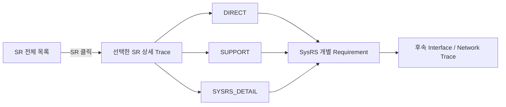

# VSS SR → SysRS Traceability — Navigation Draft

> 상태: **REBUILT REVIEW DRAFT / Stage 3 역추적 Audit 완료**  
> 기준 SR: `01_VSS_SR_FUNCTIONAL_BASELINE_DRAFT.md`  
> 기준 SysRS: `02_VSS_SYSRS_FUNCTIONAL_BASELINE_DRAFT.md`  
> 목적: **SR 전체 확인 → 특정 SR 선택 → 파생 SysRS 확인 → 모든 SysRS의 상위 근거 역추적** 흐름을 제공한다.  
> `TR-SR-xxx`는 본 Trace 문서 내부 탐색용 Reference이며 **SR 원문에 부여하는 공식 요구사항 ID가 아니다.**  
> SysRS 요구사항 원문은 SysRS 문서에서만 관리하고, 본 Trace에는 `ID + 짧은 역할 설명`만 둔다.

---

## 0. Trace 작성 규칙

### 0.1 관계 유형

| 관계 | 의미 |
|---|---|
| `DIRECT` | SR 문장을 시스템 수준의 검증 가능한 요구사항으로 직접 분해한 SysRS |
| `SUPPORT` | 해당 SR을 만족하기 위해 공통 적용되는 Priority / Timing / Interface / Diagnostic / Testability 요구사항 |
| `SYSRS_DETAIL` | SR 의도를 구현·검증 가능하게 만들기 위해 SysRS 단계에서 추가한 상세 규칙. SR에 같은 문장이 직접 없어도 상위 근거를 역추적할 수 있도록 연결 |

### 0.2 Trace 상태

| 상태 | 의미 |
|---|---|
| `COVERED` | 하나 이상의 SysRS 요구사항으로 시스템 요구가 파생되어 있음 |
| `SCOPE_ONLY` | SR에서 제외 범위를 확정하며 별도 하위 요구를 만들지 않는 것이 적절함 |
| `DEFERRED` | SR 자체가 HW/시험 조건 등 후속 결정 뒤 정량화하도록 유보함 |

### 0.3 링크 원칙

```md
[VSS-SYS-FUN-028](./02_VSS_SYSRS_FUNCTIONAL_BASELINE_DRAFT.md#vss-sys-fun-028)
```

- 파일: `02_VSS_SYSRS_FUNCTIONAL_BASELINE_DRAFT.md`
- Anchor: `#vss-sys-fun-028`
- 구버전 SysRS 파일명은 사용하지 않고 현재 Baseline 파일명만 사용한다.
- 요구사항 문구가 바뀌더라도 Trace에서 SysRS 원문을 중복 관리하지 않는다.

### 0.4 Navigation 구조



---
<a id="sr-index"></a>
## 1. SR 전체 목록

특정 항목을 클릭하면 아래의 해당 **SR → SysRS 상세 추적** 위치로 이동한다.

- 추적 Reference: **49개**
- Functional SR: **25개**
- Non-functional SR: **5개**
- Boundary: **6개**
- Scope: **12개**
- Deferred: **1개**

### 3. 기능 경계

- [`BOUNDARY` TR-SR-001](#tr-sr-001) — VSS는 차량 이벤트를 직접 감지하거나 해당 이벤트의 발생 조건을 판단하는 기능을 담당하지 않는다.
- [`BOUNDARY` TR-SR-002](#tr-sr-002) — VSS는 확정된 이벤트에 대응하는 음향을 제공해야 한다.

### 4.1 차량 사용 시작 및 종료

- [`FUNCTIONAL` TR-SR-003](#tr-sr-003) — 차량 사용 시작 상태가 확정된 경우 사용자가 인지할 수 있는 웰컴 음향이 제공되어야 한다.
- [`FUNCTIONAL` TR-SR-004](#tr-sr-004) — 차량 사용 종료 상태가 확정된 경우 사용자가 인지할 수 있는 굿바이 음향이 제공되어야 한다.
- [`FUNCTIONAL` TR-SR-005](#tr-sr-005) — 차량 사용 시작 및 종료 음향은 안전 관련 경고보다 우선해서는 안 된다.

### 4.2 도어 잠금 및 잠금 해제

- [`FUNCTIONAL` TR-SR-006](#tr-sr-006) — 도어 잠금이 정상적으로 완료된 경우 잠금 완료를 인지할 수 있는 음향이 제공되어야 한다.
- [`FUNCTIONAL` TR-SR-007](#tr-sr-007) — 도어 잠금 해제가 정상적으로 완료된 경우 잠금 완료 음향과 구분 가능한 음향이 제공되어야 한다.
- [`FUNCTIONAL` TR-SR-008](#tr-sr-008) — 도어가 정상적으로 잠기지 않은 상태가 확인된 경우 정상 잠금 완료 음향과 구분 가능한 경고가 제공되어야 한다.

### 5.1 파워윈도우 안티핀치

- [`FUNCTIONAL` TR-SR-009](#tr-sr-009) — 파워윈도우 끼임 위험이 확인된 경우 일반 피드백과 명확히 구분 가능한 긴급 경고음이 제공되어야 한다.
- [`FUNCTIONAL` TR-SR-010](#tr-sr-010) — 안티핀치 경고는 일반 피드백 및 주의 수준의 경고보다 우선적으로 인지되어야 한다.
- [`FUNCTIONAL` TR-SR-011](#tr-sr-011) — 끼임 위험 상태가 해제된 경우 해당 지속 경고음은 종료되어야 한다.

### 5.2 잔류 탑승자

- [`FUNCTIONAL` TR-SR-012](#tr-sr-012) — 차량 내부의 위험 상태에서 잔류 탑승자가 확인된 경우 사용자가 인지할 수 있는 긴급 경고음이 제공되어야 한다.
- [`FUNCTIONAL` TR-SR-013](#tr-sr-013) — 잔류 탑승자 위험 상태가 해제된 경우 해당 지속 경고음은 종료되어야 한다.

### 5.3 후방 장애물 접근 및 충돌 위험 경고

- [`FUNCTIONAL` TR-SR-014](#tr-sr-014) — 차량 후방의 장애물이 주의가 필요한 거리 범위에 접근한 것으로 확인된 경우 사용자가 이를 인지할 수 있는 주의 경고음이 제공되어야 한다.
- [`FUNCTIONAL` TR-SR-015](#tr-sr-015) — 차량 후방의 장애물이 충돌 위험이 높은 거리 범위에 접근한 것으로 확인된 경우 주의 경고음보다 명확히 구분되는 긴급 경고음이 제공되어야 한다.
- [`FUNCTIONAL` TR-SR-016](#tr-sr-016) — 후방 장애물의 충돌 위험 수준이 높아질수록 사용자가 위험 증가를 구분할 수 있는 음향이 제공되어야 한다.
- [`FUNCTIONAL` TR-SR-017](#tr-sr-017) — 후방 장애물이 경고 대상 범위를 벗어난 경우 해당 경고음은 종료되어야 한다.

### 6. 음향 우선순위 요구사항

- [`FUNCTIONAL` TR-SR-018](#tr-sr-018) — 안전과 직접 관련된 긴급 경고는 주의 경고 및 일반 피드백보다 우선되어야 한다.
- [`FUNCTIONAL` TR-SR-019](#tr-sr-019) — 주의 경고는 일반 피드백보다 우선되어야 한다.
- [`FUNCTIONAL` TR-SR-020](#tr-sr-020) — 서로 다른 의미의 음향이 동시에 출력되어 사용자가 상황을 구분하기 어렵게 되어서는 안 된다.
- [`FUNCTIONAL` TR-SR-021](#tr-sr-021) — 높은 우선순위의 경고가 발생한 경우 낮은 우선순위 음향은 해당 경고의 인지를 방해하지 않아야 한다.
- [`FUNCTIONAL` TR-SR-022](#tr-sr-022) — 안전 경고가 종료된 후 이미 유효 시점을 지난 일반 피드백이 불필요하게 다시 출력되어서는 안 된다.

### 7. 상태 및 오류 요구사항

- [`FUNCTIONAL` TR-SR-023](#tr-sr-023) — VSS가 정상적으로 음향을 제공할 수 있는 상태인지 상위 차량 시스템에서 확인할 수 있어야 한다.
- [`FUNCTIONAL` TR-SR-024](#tr-sr-024) — VSS가 정상적으로 음향을 제공할 수 없는 오류가 발생한 경우 해당 오류 상태를 상위 차량 시스템에서 확인할 수 있어야 한다.
- [`FUNCTIONAL` TR-SR-025](#tr-sr-025) — 지원되지 않거나 유효하지 않은 음향 요청으로 인해 잘못된 의미의 음향이 출력되어서는 안 된다.
- [`FUNCTIONAL` TR-SR-026](#tr-sr-026) — VSS의 오류가 다른 차량 기능의 동작을 불필요하게 중단시켜서는 안 된다.
- [`FUNCTIONAL` TR-SR-027](#tr-sr-027) — VSS가 오류 상태에서 정상 상태로 복구된 경우 상위 차량 시스템에서 복구 여부를 확인할 수 있어야 한다.

### 8. 음향 품질 및 비기능 요구사항

- [`NON_FUNCTIONAL` TR-SR-028](#tr-sr-028) — 서로 다른 의미를 가진 주요 피드백 및 경고음은 사용자가 구분할 수 있어야 한다.
- [`NON_FUNCTIONAL` TR-SR-029](#tr-sr-029) — 안전 관련 경고음은 일반 피드백음과 혼동하기 어렵도록 구분되어야 한다.
- [`NON_FUNCTIONAL` TR-SR-030](#tr-sr-030) — 동일한 차량 이벤트는 정상 동작 상태에서 일관된 음향으로 표현되어야 한다.
- [`NON_FUNCTIONAL` TR-SR-031](#tr-sr-031) — VSS는 차량 사용에 필요한 시간 안에 음향 출력이 가능한 상태로 진입해야 한다.
- [`NON_FUNCTIONAL` TR-SR-032](#tr-sr-032) — 안전 관련 이벤트에 대한 음향은 사용자가 적절한 시점에 인지할 수 있도록 제공되어야 한다.
- [`DEFERRED` TR-SR-033](#tr-sr-033) — 실제 출력 수준과 평가 조건은 적용 오디오 하드웨어 및 시험 환경이 확정된 후 정의되어야 한다.

### 9. 기능 제외 범위

- [`SCOPE` TR-SR-034](#tr-sr-034) — 조도 센서 값에 따른 자동 음량 변경
- [`SCOPE` TR-SR-035](#tr-sr-035) — 시간대 또는 주야간 상태에 따른 자동 음량 변경
- [`SCOPE` TR-SR-036](#tr-sr-036) — 외부 장치에서 전달되는 오디오 스트리밍
- [`SCOPE` TR-SR-037](#tr-sr-037) — 차량 네트워크를 통한 음원 파일 전송 및 스트리밍 재생
- [`SCOPE` TR-SR-038](#tr-sr-038) — 일반 음악 재생
- [`SCOPE` TR-SR-039](#tr-sr-039) — 플레이리스트 관리
- [`SCOPE` TR-SR-040](#tr-sr-040) — 곡 선택, 탐색 또는 재생 위치 이동
- [`SCOPE` TR-SR-041](#tr-sr-041) — 다수 음원의 동시 믹싱
- [`SCOPE` TR-SR-042](#tr-sr-042) — 일반 미디어 음향의 Ducking
- [`SCOPE` TR-SR-043](#tr-sr-043) — Fade-in 또는 Fade-out 연출
- [`SCOPE` TR-SR-044](#tr-sr-044) — 이퀄라이저 및 음장 효과
- [`SCOPE` TR-SR-045](#tr-sr-045) — VSS의 핵심 기능은 **차량 이벤트에 대응하는 저장 음향 기반의 피드백 및 경고 제공**으로 한정한다.

### 10. 상위 시스템 연계 원칙

- [`BOUNDARY` TR-SR-046](#tr-sr-046) — VSS는 센서 원시 데이터를 직접 해석하지 않아야 한다.
- [`BOUNDARY` TR-SR-047](#tr-sr-047) — VSS에는 음향 출력에 필요한 의미가 확정된 차량 이벤트가 제공되어야 한다.
- [`BOUNDARY` TR-SR-048](#tr-sr-048) — VSS의 세부 음향 재생 방법은 상위 차량 기능이 직접 제어하지 않아야 한다.
- [`BOUNDARY` TR-SR-049](#tr-sr-049) — VSS의 상태 및 오류는 상위 차량 시스템에서 활용 가능해야 한다.

---

## 2. SR → SysRS 상세 추적

<a id="tr-sr-001"></a>
### TR-SR-001 · 3. 기능 경계

**분류:** `BOUNDARY`  
**Trace 상태:** `COVERED`

**SR 원문**

> VSS는 차량 이벤트를 직접 감지하거나 해당 이벤트의 발생 조건을 판단하는 기능을 담당하지 않는다.

**DIRECT**

- [VSS-SYS-INT-005](./02_VSS_SYSRS_FUNCTIONAL_BASELINE_DRAFT.md#vss-sys-int-005) — VSS 입력은 센서 Raw Data 판정이 필요 없는 의미 확정 Event/State여야 함.

**SUPPORT**

- [VSS-SYS-FUN-018](./02_VSS_SYSRS_FUNCTIONAL_BASELINE_DRAFT.md#vss-sys-fun-018) — 후방 실제 거리값으로 VSS가 위험 수준을 직접 판정하지 않음.
- [VSS-SYS-INT-004](./02_VSS_SYSRS_FUNCTIONAL_BASELINE_DRAFT.md#vss-sys-int-004) — 후방 입력은 Raw Distance가 아니라 판단 완료된 위험 상태를 사용.
- [VSS-SYS-NFR-011](./02_VSS_SYSRS_FUNCTIONAL_BASELINE_DRAFT.md#vss-sys-nfr-011) — 실제 센서 없이 의미 Event/State만으로 VSS 기능 시험 가능.

[↑ SR 전체 목록으로](#sr-index)

---

<a id="tr-sr-002"></a>
### TR-SR-002 · 3. 기능 경계

**분류:** `BOUNDARY`  
**Trace 상태:** `COVERED`

**SR 원문**

> VSS는 확정된 이벤트에 대응하는 음향을 제공해야 한다.

**DIRECT**

- [VSS-SYS-FUN-002](./02_VSS_SYSRS_FUNCTIONAL_BASELINE_DRAFT.md#vss-sys-fun-002) — 외부에서 제공된 유효한 의미 Event/State 수용.
- [VSS-SYS-FUN-003](./02_VSS_SYSRS_FUNCTIONAL_BASELINE_DRAFT.md#vss-sys-fun-003) — 의미 Event/State를 로컬 음향 자산 및 Playback 정책에 Mapping.

**SUPPORT**

- [VSS-SYS-INT-001](./02_VSS_SYSRS_FUNCTIONAL_BASELINE_DRAFT.md#vss-sys-int-001) — One-shot Event 식별 정보 입력 필요.
- [VSS-SYS-NFR-008](./02_VSS_SYSRS_FUNCTIONAL_BASELINE_DRAFT.md#vss-sys-nfr-008) — Event/State ↔ Sound Mapping을 일관된 관리 단위로 유지.

[↑ SR 전체 목록으로](#sr-index)

---

<a id="tr-sr-003"></a>
### TR-SR-003 · 4.1 차량 사용 시작 — Welcome

**분류:** `FUNCTIONAL`  
**Trace 상태:** `COVERED`

**SR 원문**

> 차량 사용 시작 상태가 확정된 경우 사용자가 인지할 수 있는 웰컴 음향이 제공되어야 한다.

**DIRECT**

- [VSS-SYS-FUN-028](./02_VSS_SYSRS_FUNCTIONAL_BASELINE_DRAFT.md#vss-sys-fun-028) — `VEHICLE_WELCOME`에 대한 일반 피드백 음향 출력.

**SUPPORT**

- [VSS-SYS-FUN-011](./02_VSS_SYSRS_FUNCTIONAL_BASELINE_DRAFT.md#vss-sys-fun-011) — One-shot Event의 재생·종료 공통 동작.
- [VSS-SYS-PER-002](./02_VSS_SYSRS_FUNCTIONAL_BASELINE_DRAFT.md#vss-sys-per-002) — 일반 피드백 출력 시작 지연 제한.

**SYSRS_DETAIL**

- [VSS-SYS-INT-010](./02_VSS_SYSRS_FUNCTIONAL_BASELINE_DRAFT.md#vss-sys-int-010) — STARTUP/Wake 중 발생 가능한 One-shot Event의 유실 방지 계약.
- [VSS-SYS-INT-011](./02_VSS_SYSRS_FUNCTIONAL_BASELINE_DRAFT.md#vss-sys-int-011) — 실제 Startup/Wake Delivery 방법을 후속 Power/Interface 설계에서 확정.

[↑ SR 전체 목록으로](#sr-index)

---

<a id="tr-sr-004"></a>
### TR-SR-004 · 4.1 차량 사용 종료 — Goodbye

**분류:** `FUNCTIONAL`  
**Trace 상태:** `COVERED`

**SR 원문**

> 차량 사용 종료 상태가 확정된 경우 사용자가 인지할 수 있는 굿바이 음향이 제공되어야 한다.

**DIRECT**

- [VSS-SYS-FUN-029](./02_VSS_SYSRS_FUNCTIONAL_BASELINE_DRAFT.md#vss-sys-fun-029) — `VEHICLE_GOODBYE`에 대한 일반 피드백 음향 출력.

**SUPPORT**

- [VSS-SYS-FUN-011](./02_VSS_SYSRS_FUNCTIONAL_BASELINE_DRAFT.md#vss-sys-fun-011) — One-shot Event의 재생·종료 공통 동작.
- [VSS-SYS-PER-002](./02_VSS_SYSRS_FUNCTIONAL_BASELINE_DRAFT.md#vss-sys-per-002) — 일반 피드백 출력 시작 지연 제한.

[↑ SR 전체 목록으로](#sr-index)

---

<a id="tr-sr-005"></a>
### TR-SR-005 · 4.1 Welcome / Goodbye의 우선순위 제한

**분류:** `FUNCTIONAL`  
**Trace 상태:** `COVERED`

**SR 원문**

> 차량 사용 시작 및 종료 음향은 안전 관련 경고보다 우선해서는 안 된다.

**DIRECT**

- [VSS-SYS-SAF-001](./02_VSS_SYSRS_FUNCTIONAL_BASELINE_DRAFT.md#vss-sys-saf-001) — Emergency > Warning / Feedback.
- [VSS-SYS-SAF-002](./02_VSS_SYSRS_FUNCTIONAL_BASELINE_DRAFT.md#vss-sys-saf-002) — Warning > Feedback.

**SUPPORT**

- [VSS-SYS-FUN-006](./02_VSS_SYSRS_FUNCTIONAL_BASELINE_DRAFT.md#vss-sys-fun-006) — Feedback / Warning / Emergency 3개 Priority Class 정의.
- [VSS-SYS-FUN-007](./02_VSS_SYSRS_FUNCTIONAL_BASELINE_DRAFT.md#vss-sys-fun-007) — Emergency의 선점 우선권.
- [VSS-SYS-FUN-008](./02_VSS_SYSRS_FUNCTIONAL_BASELINE_DRAFT.md#vss-sys-fun-008) — Warning의 Feedback 대비 우선권.

[↑ SR 전체 목록으로](#sr-index)

---

<a id="tr-sr-006"></a>
### TR-SR-006 · 4.2 도어 잠금 완료

**분류:** `FUNCTIONAL`  
**Trace 상태:** `COVERED`

**SR 원문**

> 도어 잠금이 정상적으로 완료된 경우 잠금 완료를 인지할 수 있는 음향이 제공되어야 한다.

**DIRECT**

- [VSS-SYS-FUN-030](./02_VSS_SYSRS_FUNCTIONAL_BASELINE_DRAFT.md#vss-sys-fun-030) — `DOOR_LOCK_COMPLETE`에 대한 일반 피드백 음향 출력.

**SUPPORT**

- [VSS-SYS-FUN-011](./02_VSS_SYSRS_FUNCTIONAL_BASELINE_DRAFT.md#vss-sys-fun-011) — One-shot 재생 정책.
- [VSS-SYS-PER-002](./02_VSS_SYSRS_FUNCTIONAL_BASELINE_DRAFT.md#vss-sys-per-002) — Feedback 출력 시작 지연 제한.

**SYSRS_DETAIL**

- [VSS-SYS-INT-017](./02_VSS_SYSRS_FUNCTIONAL_BASELINE_DRAFT.md#vss-sys-int-017) — 같은 발생의 반복 전달과 새로운 발생을 구분하여 중복 재생 방지.

[↑ SR 전체 목록으로](#sr-index)

---

<a id="tr-sr-007"></a>
### TR-SR-007 · 4.2 도어 잠금 해제

**분류:** `FUNCTIONAL`  
**Trace 상태:** `COVERED`

**SR 원문**

> 도어 잠금 해제가 정상적으로 완료된 경우 잠금 완료 음향과 구분 가능한 음향이 제공되어야 한다.

**DIRECT**

- [VSS-SYS-FUN-031](./02_VSS_SYSRS_FUNCTIONAL_BASELINE_DRAFT.md#vss-sys-fun-031) — `DOOR_UNLOCK_COMPLETE`를 Lock 완료와 구분 가능한 음향/패턴으로 출력.

**SUPPORT**

- [VSS-SYS-FUN-011](./02_VSS_SYSRS_FUNCTIONAL_BASELINE_DRAFT.md#vss-sys-fun-011) — One-shot 재생 정책.
- [VSS-SYS-PER-002](./02_VSS_SYSRS_FUNCTIONAL_BASELINE_DRAFT.md#vss-sys-per-002) — Feedback 출력 시작 지연 제한.
- [VSS-SYS-NFR-014](./02_VSS_SYSRS_FUNCTIONAL_BASELINE_DRAFT.md#vss-sys-nfr-014) — 서로 다른 의미 음향의 구분 가능성.

**SYSRS_DETAIL**

- [VSS-SYS-INT-017](./02_VSS_SYSRS_FUNCTIONAL_BASELINE_DRAFT.md#vss-sys-int-017) — One-shot occurrence 구분 및 중복 재생 방지.

[↑ SR 전체 목록으로](#sr-index)

---

<a id="tr-sr-008"></a>
### TR-SR-008 · 4.2 도어 잠금 이상

**분류:** `FUNCTIONAL`  
**Trace 상태:** `COVERED`

**SR 원문**

> 도어가 정상적으로 잠기지 않은 상태가 확인된 경우 정상 잠금 완료 음향과 구분 가능한 경고가 제공되어야 한다.

**DIRECT**

- [VSS-SYS-FUN-032](./02_VSS_SYSRS_FUNCTIONAL_BASELINE_DRAFT.md#vss-sys-fun-032) — `DOOR_LOCK_ERROR`를 Lock 완료와 구분되는 Warning으로 출력.

**SUPPORT**

- [VSS-SYS-SAF-002](./02_VSS_SYSRS_FUNCTIONAL_BASELINE_DRAFT.md#vss-sys-saf-002) — Warning > Feedback.
- [VSS-SYS-PER-003](./02_VSS_SYSRS_FUNCTIONAL_BASELINE_DRAFT.md#vss-sys-per-003) — Warning 출력 시작 지연 제한.
- [VSS-SYS-NFR-014](./02_VSS_SYSRS_FUNCTIONAL_BASELINE_DRAFT.md#vss-sys-nfr-014) — Lock 완료와 Error 경고의 의미 구분 가능성.

**SYSRS_DETAIL**

- [VSS-SYS-INT-017](./02_VSS_SYSRS_FUNCTIONAL_BASELINE_DRAFT.md#vss-sys-int-017) — One-shot occurrence 구분 및 중복 재생 방지.

[↑ SR 전체 목록으로](#sr-index)

---

<a id="tr-sr-009"></a>
### TR-SR-009 · 5.1 안티핀치 긴급 경고

**분류:** `FUNCTIONAL`  
**Trace 상태:** `COVERED`

**SR 원문**

> 파워윈도우 끼임 위험이 확인된 경우 일반 피드백과 명확히 구분 가능한 긴급 경고음이 제공되어야 한다.

**DIRECT**

- [VSS-SYS-FUN-033](./02_VSS_SYSRS_FUNCTIONAL_BASELINE_DRAFT.md#vss-sys-fun-033) — Anti-Pinch `ACTIVE` 동안 Emergency Playback 정책 유지.

**SUPPORT**

- [VSS-SYS-FUN-012](./02_VSS_SYSRS_FUNCTIONAL_BASELINE_DRAFT.md#vss-sys-fun-012) — Stateful Warning의 Effective State가 활성인 동안 반복/지속 정책 적용.
- [VSS-SYS-SAF-001](./02_VSS_SYSRS_FUNCTIONAL_BASELINE_DRAFT.md#vss-sys-saf-001) — Emergency 우선순위.
- [VSS-SYS-PER-004](./02_VSS_SYSRS_FUNCTIONAL_BASELINE_DRAFT.md#vss-sys-per-004) — Emergency 출력 시작 지연 제한.
- [VSS-SYS-NFR-014](./02_VSS_SYSRS_FUNCTIONAL_BASELINE_DRAFT.md#vss-sys-nfr-014) — Feedback/Warning과 구분 가능한 재생 특성.
- [VSS-SYS-INT-002](./02_VSS_SYSRS_FUNCTIONAL_BASELINE_DRAFT.md#vss-sys-int-002) — Stateful 입력의 Active/Clear 의미 구분.

**SYSRS_DETAIL**

- [VSS-SYS-FUN-035](./02_VSS_SYSRS_FUNCTIONAL_BASELINE_DRAFT.md#vss-sys-fun-035) — 상태 유지형 입력의 최신 정상 상태·수신 품질·Effective State 관리.
- [VSS-SYS-FUN-044](./02_VSS_SYSRS_FUNCTIONAL_BASELINE_DRAFT.md#vss-sys-fun-044) — 주기적 동일 `ACTIVE` 재수신을 새로운 발생으로 보아 Playback을 매번 재시작하지 않음.

[↑ SR 전체 목록으로](#sr-index)

---

<a id="tr-sr-010"></a>
### TR-SR-010 · 5.1 안티핀치 Priority

**분류:** `FUNCTIONAL`  
**Trace 상태:** `COVERED`

**SR 원문**

> 안티핀치 경고는 일반 피드백 및 주의 수준의 경고보다 우선적으로 인지되어야 한다.

**DIRECT**

- [VSS-SYS-SAF-001](./02_VSS_SYSRS_FUNCTIONAL_BASELINE_DRAFT.md#vss-sys-saf-001) — Emergency > Warning / Feedback.

**SUPPORT**

- [VSS-SYS-FUN-007](./02_VSS_SYSRS_FUNCTIONAL_BASELINE_DRAFT.md#vss-sys-fun-007) — 현재 Warning/Feedback을 Emergency가 우선.
- [VSS-SYS-PER-005](./02_VSS_SYSRS_FUNCTIONAL_BASELINE_DRAFT.md#vss-sys-per-005) — Emergency Preemption 내부 처리 시간 제한.

[↑ SR 전체 목록으로](#sr-index)

---

<a id="tr-sr-011"></a>
### TR-SR-011 · 5.1 안티핀치 위험 해제

**분류:** `FUNCTIONAL`  
**Trace 상태:** `COVERED`

**SR 원문**

> 끼임 위험 상태가 해제된 경우 해당 지속 경고음은 종료되어야 한다.

**DIRECT**

- [VSS-SYS-FUN-013](./02_VSS_SYSRS_FUNCTIONAL_BASELINE_DRAFT.md#vss-sys-fun-013) — Clear 수용 시 Active Request Set에서 제거·재중재 후 정해진 시간 내 종료.

**SUPPORT**

- [VSS-SYS-PER-006](./02_VSS_SYSRS_FUNCTIONAL_BASELINE_DRAFT.md#vss-sys-per-006) — Stateful Warning Clear 후 종료 지연 제한.
- [VSS-SYS-INT-002](./02_VSS_SYSRS_FUNCTIONAL_BASELINE_DRAFT.md#vss-sys-int-002) — Active와 Clear를 구분 가능한 상태로 제공받음.

**SYSRS_DETAIL**

- [VSS-SYS-FUN-036](./02_VSS_SYSRS_FUNCTIONAL_BASELINE_DRAFT.md#vss-sys-fun-036) — Clear 포함 Stateful 상태 변경 시 전체 유효 요청 재중재.
- [VSS-SYS-INT-013](./02_VSS_SYSRS_FUNCTIONAL_BASELINE_DRAFT.md#vss-sys-int-013) — 정상 상태와 `NOT_AVAILABLE/SNA`를 구분 가능하게 함.
- [VSS-SYS-INT-014](./02_VSS_SYSRS_FUNCTIONAL_BASELINE_DRAFT.md#vss-sys-int-014) — `NOT_RECEIVED/VALID/STALE/INVALID` 수신 품질 관리.
- [VSS-SYS-INT-015](./02_VSS_SYSRS_FUNCTIONAL_BASELINE_DRAFT.md#vss-sys-int-015) — SNA/STALE/INVALID 등을 `CLEAR`로 자동 해석하지 않음.
- [VSS-SYS-NFR-018](./02_VSS_SYSRS_FUNCTIONAL_BASELINE_DRAFT.md#vss-sys-nfr-018) — 입력 품질 이상을 무조건 정상 Clear로 치환하지 않는 Fail-safe 제약.
- [VSS-SYS-NFR-019](./02_VSS_SYSRS_FUNCTIONAL_BASELINE_DRAFT.md#vss-sys-nfr-019) — Last Valid / Rx Quality / Effective State를 논리적으로 분리 관리.

[↑ SR 전체 목록으로](#sr-index)

---

<a id="tr-sr-012"></a>
### TR-SR-012 · 5.2 잔류 탑승자 긴급 경고

**분류:** `FUNCTIONAL`  
**Trace 상태:** `COVERED`

**SR 원문**

> 차량 내부의 위험 상태에서 잔류 탑승자가 확인된 경우 사용자가 인지할 수 있는 긴급 경고음이 제공되어야 한다.

**DIRECT**

- [VSS-SYS-FUN-034](./02_VSS_SYSRS_FUNCTIONAL_BASELINE_DRAFT.md#vss-sys-fun-034) — Occupant Hazard `ACTIVE` 동안 Emergency Playback 정책 유지.

**SUPPORT**

- [VSS-SYS-FUN-012](./02_VSS_SYSRS_FUNCTIONAL_BASELINE_DRAFT.md#vss-sys-fun-012) — Stateful Warning 지속 정책.
- [VSS-SYS-SAF-001](./02_VSS_SYSRS_FUNCTIONAL_BASELINE_DRAFT.md#vss-sys-saf-001) — Emergency Priority.
- [VSS-SYS-PER-004](./02_VSS_SYSRS_FUNCTIONAL_BASELINE_DRAFT.md#vss-sys-per-004) — Emergency 출력 시작 지연 제한.

**SYSRS_DETAIL**

- [VSS-SYS-FUN-035](./02_VSS_SYSRS_FUNCTIONAL_BASELINE_DRAFT.md#vss-sys-fun-035) — 최신 정상 상태·수신 품질·Effective State 관리.
- [VSS-SYS-FUN-044](./02_VSS_SYSRS_FUNCTIONAL_BASELINE_DRAFT.md#vss-sys-fun-044) — 동일 `ACTIVE` 반복 수신 시 Playback 재시작 방지.

[↑ SR 전체 목록으로](#sr-index)

---

<a id="tr-sr-013"></a>
### TR-SR-013 · 5.2 잔류 탑승자 위험 해제

**분류:** `FUNCTIONAL`  
**Trace 상태:** `COVERED`

**SR 원문**

> 잔류 탑승자 위험 상태가 해제된 경우 해당 지속 경고음은 종료되어야 한다.

**DIRECT**

- [VSS-SYS-FUN-013](./02_VSS_SYSRS_FUNCTIONAL_BASELINE_DRAFT.md#vss-sys-fun-013) — Clear 수용 시 Active Request Set 제거·재중재 및 제한 시간 내 종료.

**SUPPORT**

- [VSS-SYS-PER-006](./02_VSS_SYSRS_FUNCTIONAL_BASELINE_DRAFT.md#vss-sys-per-006) — Clear 후 종료 지연 제한.
- [VSS-SYS-INT-002](./02_VSS_SYSRS_FUNCTIONAL_BASELINE_DRAFT.md#vss-sys-int-002) — Active/Clear 의미 구분.

**SYSRS_DETAIL**

- [VSS-SYS-FUN-036](./02_VSS_SYSRS_FUNCTIONAL_BASELINE_DRAFT.md#vss-sys-fun-036) — Stateful 상태 변경 시 Re-arbitration.
- [VSS-SYS-INT-013](./02_VSS_SYSRS_FUNCTIONAL_BASELINE_DRAFT.md#vss-sys-int-013) — SNA 표현 지원.
- [VSS-SYS-INT-014](./02_VSS_SYSRS_FUNCTIONAL_BASELINE_DRAFT.md#vss-sys-int-014) — 입력 수신 품질 상태 관리.
- [VSS-SYS-INT-015](./02_VSS_SYSRS_FUNCTIONAL_BASELINE_DRAFT.md#vss-sys-int-015) — SNA/STALE/INVALID를 Clear로 자동 해석하지 않음.
- [VSS-SYS-NFR-018](./02_VSS_SYSRS_FUNCTIONAL_BASELINE_DRAFT.md#vss-sys-nfr-018) — Fail-safe 정책 없는 Clear 치환 금지.
- [VSS-SYS-NFR-019](./02_VSS_SYSRS_FUNCTIONAL_BASELINE_DRAFT.md#vss-sys-nfr-019) — Last Valid / Quality / Effective State 분리 관리.

[↑ SR 전체 목록으로](#sr-index)

---

<a id="tr-sr-014"></a>
### TR-SR-014 · 5.3 후방 장애물 Caution

**분류:** `FUNCTIONAL`  
**Trace 상태:** `COVERED`

**SR 원문**

> 차량 후방의 장애물이 주의가 필요한 거리 범위에 접근한 것으로 확인된 경우 사용자가 이를 인지할 수 있는 주의 경고음이 제공되어야 한다.

**DIRECT**

- [VSS-SYS-FUN-014](./02_VSS_SYSRS_FUNCTIONAL_BASELINE_DRAFT.md#vss-sys-fun-014) — Rear `CAUTION`에 대한 Warning 출력.

**SUPPORT**

- [VSS-SYS-PER-003](./02_VSS_SYSRS_FUNCTIONAL_BASELINE_DRAFT.md#vss-sys-per-003) — Warning 출력 시작 지연 제한.
- [VSS-SYS-INT-003](./02_VSS_SYSRS_FUNCTIONAL_BASELINE_DRAFT.md#vss-sys-int-003) — Rear `CAUTION/EMERGENCY/CLEAR` 상태 식별.
- [VSS-SYS-INT-004](./02_VSS_SYSRS_FUNCTIONAL_BASELINE_DRAFT.md#vss-sys-int-004) — Raw Distance가 아니라 판단 완료된 위험 상태 입력.

**SYSRS_DETAIL**

- [VSS-SYS-FUN-043](./02_VSS_SYSRS_FUNCTIONAL_BASELINE_DRAFT.md#vss-sys-fun-043) — Rear 최신 의미 상태를 상태형 정보로 유지하고 Arbitration 입력에 반영.
- [VSS-SYS-FUN-044](./02_VSS_SYSRS_FUNCTIONAL_BASELINE_DRAFT.md#vss-sys-fun-044) — 동일 상태 주기 수신에 따른 Playback Restart 방지.

[↑ SR 전체 목록으로](#sr-index)

---

<a id="tr-sr-015"></a>
### TR-SR-015 · 5.3 후방 장애물 Emergency

**분류:** `FUNCTIONAL`  
**Trace 상태:** `COVERED`

**SR 원문**

> 차량 후방의 장애물이 충돌 위험이 높은 거리 범위에 접근한 것으로 확인된 경우 주의 경고음보다 명확히 구분되는 긴급 경고음이 제공되어야 한다.

**DIRECT**

- [VSS-SYS-FUN-015](./02_VSS_SYSRS_FUNCTIONAL_BASELINE_DRAFT.md#vss-sys-fun-015) — Rear `EMERGENCY`에 대해 Caution과 구분되는 Emergency 출력.

**SUPPORT**

- [VSS-SYS-PER-004](./02_VSS_SYSRS_FUNCTIONAL_BASELINE_DRAFT.md#vss-sys-per-004) — Emergency 출력 시작 지연 제한.
- [VSS-SYS-INT-003](./02_VSS_SYSRS_FUNCTIONAL_BASELINE_DRAFT.md#vss-sys-int-003) — Rear 3단계 의미 상태 입력.
- [VSS-SYS-SAF-003](./02_VSS_SYSRS_FUNCTIONAL_BASELINE_DRAFT.md#vss-sys-saf-003) — Rear Emergency > Rear Caution.
- [VSS-SYS-NFR-014](./02_VSS_SYSRS_FUNCTIONAL_BASELINE_DRAFT.md#vss-sys-nfr-014) — Caution과 Emergency를 구분 가능한 재생 특성.

**SYSRS_DETAIL**

- [VSS-SYS-FUN-043](./02_VSS_SYSRS_FUNCTIONAL_BASELINE_DRAFT.md#vss-sys-fun-043) — Rear State를 상태형 Arbitration 입력으로 관리.

[↑ SR 전체 목록으로](#sr-index)

---

<a id="tr-sr-016"></a>
### TR-SR-016 · 5.3 후방 위험 수준 변화

**분류:** `FUNCTIONAL`  
**Trace 상태:** `COVERED`

**SR 원문**

> 후방 장애물의 충돌 위험 수준이 높아질수록 사용자가 위험 증가를 구분할 수 있는 음향이 제공되어야 한다.

**DIRECT**

- [VSS-SYS-FUN-016](./02_VSS_SYSRS_FUNCTIONAL_BASELINE_DRAFT.md#vss-sys-fun-016) — `CAUTION → EMERGENCY` 변경 시 재중재 후 Emergency 우선 출력.
- [VSS-SYS-SAF-003](./02_VSS_SYSRS_FUNCTIONAL_BASELINE_DRAFT.md#vss-sys-saf-003) — Rear Emergency를 Rear Caution보다 높은 우선순위로 처리.

**SUPPORT**

- [VSS-SYS-PER-007](./02_VSS_SYSRS_FUNCTIONAL_BASELINE_DRAFT.md#vss-sys-per-007) — `CAUTION → EMERGENCY` 전환 시간 제한.
- [VSS-SYS-NFR-014](./02_VSS_SYSRS_FUNCTIONAL_BASELINE_DRAFT.md#vss-sys-nfr-014) — 위험 단계별 음향 구분 가능성.
- [VSS-SYS-FUN-043](./02_VSS_SYSRS_FUNCTIONAL_BASELINE_DRAFT.md#vss-sys-fun-043) — Rear State 변경을 Arbitration 입력에 반영.

**SYSRS_DETAIL**

- [VSS-SYS-FUN-042](./02_VSS_SYSRS_FUNCTIONAL_BASELINE_DRAFT.md#vss-sys-fun-042) — 반대 방향인 `EMERGENCY → CAUTION` 하향 변경도 명시적으로 재중재.
- [VSS-SYS-PER-010](./02_VSS_SYSRS_FUNCTIONAL_BASELINE_DRAFT.md#vss-sys-per-010) — `EMERGENCY → CAUTION` 하향 전환 시간 제한.

> 해석 메모: SR은 “위험 수준 증가를 구분”하도록 요구하며, SysRS Baseline은 현재 Rear 상태를 `CLEAR / CAUTION / EMERGENCY` 3상태로 구체화한다. 거리 단계의 추가 세분화는 현재 Baseline에 포함하지 않는다.

[↑ SR 전체 목록으로](#sr-index)

---

<a id="tr-sr-017"></a>
### TR-SR-017 · 5.3 후방 위험 해제

**분류:** `FUNCTIONAL`  
**Trace 상태:** `COVERED`

**SR 원문**

> 후방 장애물이 경고 대상 범위를 벗어난 경우 해당 경고음은 종료되어야 한다.

**DIRECT**

- [VSS-SYS-FUN-017](./02_VSS_SYSRS_FUNCTIONAL_BASELINE_DRAFT.md#vss-sys-fun-017) — Rear `CLEAR` 수용 시 Active Request Set에서 제거 후 재중재.

**SUPPORT**

- [VSS-SYS-PER-006](./02_VSS_SYSRS_FUNCTIONAL_BASELINE_DRAFT.md#vss-sys-per-006) — Clear 후 경고 종료 지연 제한.
- [VSS-SYS-INT-003](./02_VSS_SYSRS_FUNCTIONAL_BASELINE_DRAFT.md#vss-sys-int-003) — Rear Clear 상태 식별.
- [VSS-SYS-FUN-043](./02_VSS_SYSRS_FUNCTIONAL_BASELINE_DRAFT.md#vss-sys-fun-043) — Rear 최신 상태 유지 및 변경 반영.

**SYSRS_DETAIL**

- [VSS-SYS-INT-013](./02_VSS_SYSRS_FUNCTIONAL_BASELINE_DRAFT.md#vss-sys-int-013) — Rear 등 Stateful 입력의 SNA 표현 지원.
- [VSS-SYS-INT-014](./02_VSS_SYSRS_FUNCTIONAL_BASELINE_DRAFT.md#vss-sys-int-014) — 수신 품질 상태 구분.
- [VSS-SYS-INT-015](./02_VSS_SYSRS_FUNCTIONAL_BASELINE_DRAFT.md#vss-sys-int-015) — Stale/Invalid/SNA를 Clear로 자동 간주하지 않음.
- [VSS-SYS-NFR-018](./02_VSS_SYSRS_FUNCTIONAL_BASELINE_DRAFT.md#vss-sys-nfr-018) — Fail-safe 정의 없이 Clear 치환 금지.
- [VSS-SYS-NFR-019](./02_VSS_SYSRS_FUNCTIONAL_BASELINE_DRAFT.md#vss-sys-nfr-019) — Last Valid / Quality / Effective State 분리.

[↑ SR 전체 목록으로](#sr-index)

---

<a id="tr-sr-018"></a>
### TR-SR-018 · 6. Emergency Priority

**분류:** `FUNCTIONAL`  
**Trace 상태:** `COVERED`

**SR 원문**

> 안전과 직접 관련된 긴급 경고는 주의 경고 및 일반 피드백보다 우선되어야 한다.

**DIRECT**

- [VSS-SYS-SAF-001](./02_VSS_SYSRS_FUNCTIONAL_BASELINE_DRAFT.md#vss-sys-saf-001) — Emergency > Warning / Feedback.

**SUPPORT**

- [VSS-SYS-FUN-006](./02_VSS_SYSRS_FUNCTIONAL_BASELINE_DRAFT.md#vss-sys-fun-006) — 3개 Priority Class 구분.
- [VSS-SYS-FUN-007](./02_VSS_SYSRS_FUNCTIONAL_BASELINE_DRAFT.md#vss-sys-fun-007) — Emergency가 현재 Warning/Feedback보다 우선.
- [VSS-SYS-NFR-006](./02_VSS_SYSRS_FUNCTIONAL_BASELINE_DRAFT.md#vss-sys-nfr-006) — 동시 요청을 명시된 Priority 정책으로 결정.

[↑ SR 전체 목록으로](#sr-index)

---

<a id="tr-sr-019"></a>
### TR-SR-019 · 6. Warning Priority

**분류:** `FUNCTIONAL`  
**Trace 상태:** `COVERED`

**SR 원문**

> 주의 경고는 일반 피드백보다 우선되어야 한다.

**DIRECT**

- [VSS-SYS-SAF-002](./02_VSS_SYSRS_FUNCTIONAL_BASELINE_DRAFT.md#vss-sys-saf-002) — Warning > Feedback.

**SUPPORT**

- [VSS-SYS-FUN-006](./02_VSS_SYSRS_FUNCTIONAL_BASELINE_DRAFT.md#vss-sys-fun-006) — Priority Class 정의.
- [VSS-SYS-FUN-008](./02_VSS_SYSRS_FUNCTIONAL_BASELINE_DRAFT.md#vss-sys-fun-008) — Warning이 현재 Feedback보다 우선.
- [VSS-SYS-NFR-006](./02_VSS_SYSRS_FUNCTIONAL_BASELINE_DRAFT.md#vss-sys-nfr-006) — 동시 요청 결정의 Priority 정책.

[↑ SR 전체 목록으로](#sr-index)

---

<a id="tr-sr-020"></a>
### TR-SR-020 · 6. 동시에 여러 의미의 음향 출력 금지

**분류:** `FUNCTIONAL`  
**Trace 상태:** `COVERED`

**SR 원문**

> 서로 다른 의미의 음향이 동시에 출력되어 사용자가 상황을 구분하기 어렵게 되어서는 안 된다.

**DIRECT**

- [VSS-SYS-FUN-005](./02_VSS_SYSRS_FUNCTIONAL_BASELINE_DRAFT.md#vss-sys-fun-005) — 한 시점에 하나의 Playback Session만 Winner로 선택.

**SUPPORT**

- [VSS-SYS-NFR-007](./02_VSS_SYSRS_FUNCTIONAL_BASELINE_DRAFT.md#vss-sys-nfr-007) — 활성 Playback Winner는 1개 이하.
- [VSS-SYS-NFR-014](./02_VSS_SYSRS_FUNCTIONAL_BASELINE_DRAFT.md#vss-sys-nfr-014) — 서로 다른 의미 음향의 구분 가능한 재생 특성.
- [VSS-SYS-NFR-006](./02_VSS_SYSRS_FUNCTIONAL_BASELINE_DRAFT.md#vss-sys-nfr-006) — 여러 요청이 동시에 유효할 때 Priority 정책에 따라 Winner 결정.

**SYSRS_DETAIL**

- [VSS-SYS-NFR-015](./02_VSS_SYSRS_FUNCTIONAL_BASELINE_DRAFT.md#vss-sys-nfr-015) — 동일 Priority Class 내부에서도 하나의 Winner를 결정하는 Sub-priority/동등 규칙 필요.
- [VSS-SYS-NFR-016](./02_VSS_SYSRS_FUNCTIONAL_BASELINE_DRAFT.md#vss-sys-nfr-016) — 동일 요청 집합에서는 수신 순서와 무관한 결정적 Arbitration 결과 요구.
- [VSS-SYS-NFR-017](./02_VSS_SYSRS_FUNCTIONAL_BASELINE_DRAFT.md#vss-sys-nfr-017) — Same-Class Arbitration 규칙을 일관된 관리 단위에서 유지.
- [VSS-SYS-FUN-038](./02_VSS_SYSRS_FUNCTIONAL_BASELINE_DRAFT.md#vss-sys-fun-038) — cue 사이 무음까지 포함한 Playback Session 전체를 하나의 활성 세션으로 취급.

[↑ SR 전체 목록으로](#sr-index)

---

<a id="tr-sr-021"></a>
### TR-SR-021 · 6. 높은 Priority 경고의 인지 방해 금지

**분류:** `FUNCTIONAL`  
**Trace 상태:** `COVERED`

**SR 원문**

> 높은 우선순위의 경고가 발생한 경우 낮은 우선순위 음향은 해당 경고의 인지를 방해하지 않아야 한다.

**DIRECT**

- [VSS-SYS-FUN-007](./02_VSS_SYSRS_FUNCTIONAL_BASELINE_DRAFT.md#vss-sys-fun-007) — Emergency가 Warning/Feedback보다 우선.
- [VSS-SYS-FUN-008](./02_VSS_SYSRS_FUNCTIONAL_BASELINE_DRAFT.md#vss-sys-fun-008) — Warning이 Feedback보다 우선.

**SUPPORT**

- [VSS-SYS-FUN-009](./02_VSS_SYSRS_FUNCTIONAL_BASELINE_DRAFT.md#vss-sys-fun-009) — 낮은 Priority 신규 요청은 현재 높은 Priority Session을 중단하지 않음.
- [VSS-SYS-SAF-001](./02_VSS_SYSRS_FUNCTIONAL_BASELINE_DRAFT.md#vss-sys-saf-001) — Emergency Priority 규칙.
- [VSS-SYS-SAF-002](./02_VSS_SYSRS_FUNCTIONAL_BASELINE_DRAFT.md#vss-sys-saf-002) — Warning Priority 규칙.
- [VSS-SYS-PER-005](./02_VSS_SYSRS_FUNCTIONAL_BASELINE_DRAFT.md#vss-sys-per-005) — Emergency Preemption 처리 시간 제한.
- [VSS-SYS-NFR-006](./02_VSS_SYSRS_FUNCTIONAL_BASELINE_DRAFT.md#vss-sys-nfr-006) — 동시 요청 Arbitration.

**SYSRS_DETAIL**

- [VSS-SYS-FUN-036](./02_VSS_SYSRS_FUNCTIONAL_BASELINE_DRAFT.md#vss-sys-fun-036) — 상태 변경·Session 종료·선점 조건 변경 시 Re-arbitration.
- [VSS-SYS-FUN-037](./02_VSS_SYSRS_FUNCTIONAL_BASELINE_DRAFT.md#vss-sys-fun-037) — 선점된 Stateful Warning/Emergency가 여전히 유효하면 재중재 결과에 따라 재활성화.

[↑ SR 전체 목록으로](#sr-index)

---

<a id="tr-sr-022"></a>
### TR-SR-022 · 6. 유효 시점이 지난 일반 피드백의 재생 금지

**분류:** `FUNCTIONAL`  
**Trace 상태:** `COVERED`

**SR 원문**

> 안전 경고가 종료된 후 이미 유효 시점을 지난 일반 피드백이 불필요하게 다시 출력되어서는 안 된다.

**DIRECT**

- [VSS-SYS-FUN-010](./02_VSS_SYSRS_FUNCTIONAL_BASELINE_DRAFT.md#vss-sys-fun-010) — 이미 재생 중이었다가 선점된 One-shot Feedback은 자동 Resume하지 않음.
- [VSS-SYS-FUN-040](./02_VSS_SYSRS_FUNCTIONAL_BASELINE_DRAFT.md#vss-sys-fun-040) — 재생 시작 전 대기하던 One-shot이 Max Age를 넘으면 폐기하고 이후 자동 재생 금지.

**SUPPORT**

- [VSS-SYS-FUN-039](./02_VSS_SYSRS_FUNCTIONAL_BASELINE_DRAFT.md#vss-sys-fun-039) — One-shot Event의 의미 유효 수명(Max Age) 관리.
- [VSS-SYS-FUN-041](./02_VSS_SYSRS_FUNCTIONAL_BASELINE_DRAFT.md#vss-sys-fun-041) — “재생 시작 전 대기”와 “재생 후 선점”의 처리 규칙을 분리.
- [VSS-SYS-INT-012](./02_VSS_SYSRS_FUNCTIONAL_BASELINE_DRAFT.md#vss-sys-int-012) — Startup/Wake/통신 복구 뒤 Max Age 초과 One-shot의 신규 재생/재전달 금지.

> 이 항목은 기존 Trace보다 범위를 넓혔다. 현재 SysRS는 “이미 재생 중 선점된 One-shot”뿐 아니라 “아직 시작하지 못한 채 대기하다 유효기간을 넘긴 One-shot”도 명시적으로 처리한다.

[↑ SR 전체 목록으로](#sr-index)

---

---

<a id="tr-sr-023"></a>
### TR-SR-023 · 7. 정상 음향 제공 상태 확인

**분류:** `FUNCTIONAL`  
**Trace 상태:** `COVERED`

**SR 원문**

> VSS가 정상적으로 음향을 제공할 수 있는 상태인지 상위 차량 시스템에서 확인할 수 있어야 한다.

**DIRECT**

- [VSS-SYS-FUN-021](./02_VSS_SYSRS_FUNCTIONAL_BASELINE_DRAFT.md#vss-sys-fun-021) — 현재 동작 상태, 서비스 제공 가능 수준 및 오류 존재 여부를 외부가 확인 가능하도록 함.
- [VSS-SYS-INT-006](./02_VSS_SYSRS_FUNCTIONAL_BASELINE_DRAFT.md#vss-sys-int-006) — `READY`뿐 아니라 입력 수용 가능한 `PLAYING`을 포함하여 Event/State 수용 가능 여부를 외부가 확인 가능하도록 함.
- [VSS-SYS-INT-007](./02_VSS_SYSRS_FUNCTIONAL_BASELINE_DRAFT.md#vss-sys-int-007) — 정상/오류 상태와 정상 음향 서비스 제공 가능 수준을 외부가 확인 가능하도록 함.

**SUPPORT**

- [VSS-SYS-PER-008](./02_VSS_SYSRS_FUNCTIONAL_BASELINE_DRAFT.md#vss-sys-per-008) — 내부 상태 변경 후 외부 제공 상태 정보가 갱신 가능해질 때까지의 지연 제한.

**SYSRS_DETAIL**

- [VSS-SYS-DIA-016](./02_VSS_SYSRS_FUNCTIONAL_BASELINE_DRAFT.md#vss-sys-dia-016) — 일부 기능 제한과 전체 출력 불능을 서비스 Availability로 구분.

[↑ SR 전체 목록으로](#sr-index)

---

<a id="tr-sr-024"></a>
### TR-SR-024 · 7. 출력 불능 오류 상태 확인

**분류:** `FUNCTIONAL`  
**Trace 상태:** `COVERED`

**SR 원문**

> VSS가 정상적으로 음향을 제공할 수 없는 오류가 발생한 경우 해당 오류 상태를 상위 차량 시스템에서 확인할 수 있어야 한다.

**DIRECT**

- [VSS-SYS-SAF-006](./02_VSS_SYSRS_FUNCTIONAL_BASELINE_DRAFT.md#vss-sys-saf-006) — 정상 음향 출력을 보장할 수 없는 상태를 외부에서 식별 가능하게 함.
- [VSS-SYS-INT-007](./02_VSS_SYSRS_FUNCTIONAL_BASELINE_DRAFT.md#vss-sys-int-007) — 오류 상태와 서비스 제공 가능 수준을 외부가 확인 가능하도록 함.
- [VSS-SYS-FUN-021](./02_VSS_SYSRS_FUNCTIONAL_BASELINE_DRAFT.md#vss-sys-fun-021) — 동작 상태·서비스 수준·오류 존재 여부를 외부 제공 정보로 관리.

**SUPPORT**

- [VSS-SYS-DIA-001](./02_VSS_SYSRS_FUNCTIONAL_BASELINE_DRAFT.md#vss-sys-dia-001) — 정상 음향 출력을 방해하는 Internal Output Fault 검출.
- [VSS-SYS-DIA-005](./02_VSS_SYSRS_FUNCTIONAL_BASELINE_DRAFT.md#vss-sys-dia-005) — 복구 실패 시 `FAULT` 유지 및 오류 상태 외부 제공.
- [VSS-SYS-DIA-014](./02_VSS_SYSRS_FUNCTIONAL_BASELINE_DRAFT.md#vss-sys-dia-014) — 현재 Active Fault와 최근 주요 Fault 원인을 구분 관리.
- [VSS-SYS-DIA-016](./02_VSS_SYSRS_FUNCTIONAL_BASELINE_DRAFT.md#vss-sys-dia-016) — `DEGRADED`와 `UNAVAILABLE`을 구분하는 Availability 모델.
- [VSS-SYS-PER-008](./02_VSS_SYSRS_FUNCTIONAL_BASELINE_DRAFT.md#vss-sys-per-008) — 상태 변경 후 외부 제공 상태 갱신 지연 제한.

**SYSRS_DETAIL**

- [VSS-SYS-DIA-012](./02_VSS_SYSRS_FUNCTIONAL_BASELINE_DRAFT.md#vss-sys-dia-012) — 외부 입력 이상과 VSS 내부 Output Fault를 서로 다른 진단 상태로 관리.
- [VSS-SYS-DIA-013](./02_VSS_SYSRS_FUNCTIONAL_BASELINE_DRAFT.md#vss-sys-dia-013) — 입력 품질 이상만으로 내부 Output Fault라고 잘못 보고하지 않음.

**추가 역추적 보강**

- [VSS-SYS-DIA-002](./02_VSS_SYSRS_FUNCTIONAL_BASELINE_DRAFT.md#vss-sys-dia-002) — 최근 주요 Internal Output Fault 원인을 식별 가능하게 유지하여 상위 오류 상태 해석의 근거를 보존. `SUPPORT`
- [VSS-SYS-DIA-008](./02_VSS_SYSRS_FUNCTIONAL_BASELINE_DRAFT.md#vss-sys-dia-008) — `READY` 중 Output-critical Fault 검출 시 `FAULT` 전이. `SYSRS_DETAIL`
- [VSS-SYS-DIA-009](./02_VSS_SYSRS_FUNCTIONAL_BASELINE_DRAFT.md#vss-sys-dia-009) — `PLAYING` 중 복구 불가능 Output Fault 검출 시 `FAULT` 전이. `SYSRS_DETAIL`
- [VSS-SYS-DIA-018](./02_VSS_SYSRS_FUNCTIONAL_BASELINE_DRAFT.md#vss-sys-dia-018) — 다중 Internal Output Fault가 존재할 때 각 Active Fault를 내부적으로 손실 없이 유지. `SYSRS_DETAIL`

[↑ SR 전체 목록으로](#sr-index)

---

<a id="tr-sr-025"></a>
### TR-SR-025 · 7. 유효하지 않은 요청의 잘못된 음향 방지

**분류:** `FUNCTIONAL`  
**Trace 상태:** `COVERED`

**SR 원문**

> 지원되지 않거나 유효하지 않은 음향 요청으로 인해 잘못된 의미의 음향이 출력되어서는 안 된다.

**DIRECT**

- [VSS-SYS-FUN-019](./02_VSS_SYSRS_FUNCTIONAL_BASELINE_DRAFT.md#vss-sys-fun-019) — 지원하지 않거나 유효하지 않은 의미 입력에 대해 임의 음향을 출력하지 않음.
- [VSS-SYS-SAF-004](./02_VSS_SYSRS_FUNCTIONAL_BASELINE_DRAFT.md#vss-sys-saf-004) — 유효하지 않은 의미 입력으로 잘못된 의미의 음향이 출력되는 것을 금지.
- [VSS-SYS-DIA-006](./02_VSS_SYSRS_FUNCTIONAL_BASELINE_DRAFT.md#vss-sys-dia-006) — 유효하지 않은 의미 입력을 잘못된 음향 출력 없이 Input Diagnostic으로 처리.

**SUPPORT**

- [VSS-SYS-NFR-001](./02_VSS_SYSRS_FUNCTIONAL_BASELINE_DRAFT.md#vss-sys-nfr-001) — Invalid 입력이 VSS ECU 전체 비정상 종료를 유발하지 않도록 함.
- [VSS-SYS-NFR-013](./02_VSS_SYSRS_FUNCTIONAL_BASELINE_DRAFT.md#vss-sys-nfr-013) — Invalid 입력 조건을 시험 가능하게 함.

**SYSRS_DETAIL**

- [VSS-SYS-DIA-012](./02_VSS_SYSRS_FUNCTIONAL_BASELINE_DRAFT.md#vss-sys-dia-012) — Invalid Input Diagnostic과 Internal Output Fault를 분리.
- [VSS-SYS-DIA-013](./02_VSS_SYSRS_FUNCTIONAL_BASELINE_DRAFT.md#vss-sys-dia-013) — `INVALID_EVENT`만으로 내부 Fault가 존재한다고 보고하지 않음.

> `SOUND_ASSET_UNAVAILABLE`은 "유효하지 않은 요청"과 원인이 다르므로 본 Trace의 직접 파생으로 섞지 않는다. Asset 사용 불가 시 잘못된 대체 음향 금지는 별도 SysRS Fault 정책으로 관리한다.

[↑ SR 전체 목록으로](#sr-index)

---

<a id="tr-sr-026"></a>
### TR-SR-026 · 7. 다른 차량 기능과의 오류 격리

**분류:** `FUNCTIONAL`  
**Trace 상태:** `COVERED`

**SR 원문**

> VSS의 오류가 다른 차량 기능의 동작을 불필요하게 중단시켜서는 안 된다.

**DIRECT**

- [VSS-SYS-SAF-005](./02_VSS_SYSRS_FUNCTIONAL_BASELINE_DRAFT.md#vss-sys-saf-005) — VSS 오류가 파워윈도우·공조·조명·센싱 등 다른 기능의 제어 상태를 직접 변경하지 않음.
- [VSS-SYS-NFR-004](./02_VSS_SYSRS_FUNCTIONAL_BASELINE_DRAFT.md#vss-sys-nfr-004) — VSS 관련 오류를 다른 차량 기능과 기능적으로 격리.

[↑ SR 전체 목록으로](#sr-index)

---

<a id="tr-sr-027"></a>
### TR-SR-027 · 7. 오류 복구 여부 확인

**분류:** `FUNCTIONAL`  
**Trace 상태:** `COVERED`

**SR 원문**

> VSS가 오류 상태에서 정상 상태로 복구된 경우 상위 차량 시스템에서 복구 여부를 확인할 수 있어야 한다.

**DIRECT**

- [VSS-SYS-INT-009](./02_VSS_SYSRS_FUNCTIONAL_BASELINE_DRAFT.md#vss-sys-int-009) — 오류 복구 후 외부 시스템이 정상 복귀 여부를 확인 가능하도록 함.
- [VSS-SYS-DIA-004](./02_VSS_SYSRS_FUNCTIONAL_BASELINE_DRAFT.md#vss-sys-dia-004) — 복구 가능한 출력 오류에서 전체 차량 재시작 없이 정상 상태 복귀 가능.

**SUPPORT**

- [VSS-SYS-DIA-005](./02_VSS_SYSRS_FUNCTIONAL_BASELINE_DRAFT.md#vss-sys-dia-005) — 복구 실패 시 `FAULT`와 오류 상태 유지.
- [VSS-SYS-DIA-011](./02_VSS_SYSRS_FUNCTIONAL_BASELINE_DRAFT.md#vss-sys-dia-011) — 복구 성공 후 `READY` 복귀 및 현재 유효 요청 재평가.
- [VSS-SYS-DIA-015](./02_VSS_SYSRS_FUNCTIONAL_BASELINE_DRAFT.md#vss-sys-dia-015) — 복구 시 Active Fault 해제와 최근 Fault 이력 유지 규칙.
- [VSS-SYS-PER-009](./02_VSS_SYSRS_FUNCTIONAL_BASELINE_DRAFT.md#vss-sys-per-009) — 복구 가능한 오류를 제한 시간 내 정상 또는 명확한 실패 상태로 결정.
- [VSS-SYS-PER-008](./02_VSS_SYSRS_FUNCTIONAL_BASELINE_DRAFT.md#vss-sys-per-008) — 외부 제공 상태 갱신 지연 제한.

**SYSRS_DETAIL**

- [VSS-SYS-DIA-010](./02_VSS_SYSRS_FUNCTIONAL_BASELINE_DRAFT.md#vss-sys-dia-010) — 복구 중인데 신규 일반 피드백을 정상 출력 가능한 상태로 외부에 잘못 보고하지 않음.

**추가 역추적 보강**

- [VSS-SYS-DIA-017](./02_VSS_SYSRS_FUNCTIONAL_BASELINE_DRAFT.md#vss-sys-dia-017) — Fault별 Recoverable/Unrecoverable 분류와 Recovery Action을 정의하여 복구 가능 여부를 결정. `SYSRS_DETAIL`

[↑ SR 전체 목록으로](#sr-index)

---

<a id="tr-sr-028"></a>
### TR-SR-028 · 8. 주요 음향의 의미 구분 가능성

**분류:** `NON_FUNCTIONAL`  
**Trace 상태:** `COVERED`

**SR 원문**

> 서로 다른 의미를 가진 주요 피드백 및 경고음은 사용자가 구분할 수 있어야 한다.

**DIRECT**

- [VSS-SYS-NFR-014](./02_VSS_SYSRS_FUNCTIONAL_BASELINE_DRAFT.md#vss-sys-nfr-014) — 서로 다른 의미의 주요 피드백/경고에 구분 가능한 재생 특성을 요구.

**SUPPORT**

- [VSS-SYS-FUN-003](./02_VSS_SYSRS_FUNCTIONAL_BASELINE_DRAFT.md#vss-sys-fun-003) — 의미 Event/State별 로컬 Sound/Playback Policy Mapping.
- [VSS-SYS-FUN-004](./02_VSS_SYSRS_FUNCTIONAL_BASELINE_DRAFT.md#vss-sys-fun-004) — 동일 의미에는 일관된 음향 정책 적용.
- [VSS-SYS-NFR-008](./02_VSS_SYSRS_FUNCTIONAL_BASELINE_DRAFT.md#vss-sys-nfr-008) — Event/State ↔ Sound Asset 관계를 일관된 관리 단위로 유지.
- [VSS-SYS-NFR-012](./02_VSS_SYSRS_FUNCTIONAL_BASELINE_DRAFT.md#vss-sys-nfr-012) — 의미 Event/State별 대응 음향과 Priority를 독립 검증 가능하게 함.

[↑ SR 전체 목록으로](#sr-index)

---

<a id="tr-sr-029"></a>
### TR-SR-029 · 8. 안전 경고와 일반 피드백의 음향 구분

**분류:** `NON_FUNCTIONAL`  
**Trace 상태:** `COVERED`

**SR 원문**

> 안전 관련 경고음은 일반 피드백음과 혼동하기 어렵도록 구분되어야 한다.

**DIRECT**

- [VSS-SYS-NFR-014](./02_VSS_SYSRS_FUNCTIONAL_BASELINE_DRAFT.md#vss-sys-nfr-014) — 주요 피드백/경고에 사용자 구분 가능한 재생 특성을 요구.

**SUPPORT**

- [VSS-SYS-FUN-006](./02_VSS_SYSRS_FUNCTIONAL_BASELINE_DRAFT.md#vss-sys-fun-006) — Feedback / Warning / Emergency Priority Class 구분.
- [VSS-SYS-SAF-001](./02_VSS_SYSRS_FUNCTIONAL_BASELINE_DRAFT.md#vss-sys-saf-001) — Emergency를 Warning/Feedback보다 우선 처리.
- [VSS-SYS-SAF-002](./02_VSS_SYSRS_FUNCTIONAL_BASELINE_DRAFT.md#vss-sys-saf-002) — Warning을 Feedback보다 우선 처리.
- [VSS-SYS-NFR-012](./02_VSS_SYSRS_FUNCTIONAL_BASELINE_DRAFT.md#vss-sys-nfr-012) — 음향·Priority 정책을 의미별 독립 검증 가능하게 함.

> Priority 구분 자체가 곧 음색/패턴 구분을 의미하는 것은 아니다. 사용자가 실제 의미 차이를 구분해야 한다는 직접 근거는 NFR-014가 담당한다.

[↑ SR 전체 목록으로](#sr-index)

---

<a id="tr-sr-030"></a>
### TR-SR-030 · 8. 동일 Event의 일관된 음향 표현

**분류:** `NON_FUNCTIONAL`  
**Trace 상태:** `COVERED`

**SR 원문**

> 동일한 차량 이벤트는 정상 동작 상태에서 일관된 음향으로 표현되어야 한다.

**DIRECT**

- [VSS-SYS-FUN-004](./02_VSS_SYSRS_FUNCTIONAL_BASELINE_DRAFT.md#vss-sys-fun-004) — 동일 의미 Event/State에 정상 상태에서 동일 음향 정책 적용.

**SUPPORT**

- [VSS-SYS-NFR-005](./02_VSS_SYSRS_FUNCTIONAL_BASELINE_DRAFT.md#vss-sys-nfr-005) — 동일 초기 상태와 동일 유효 요청 집합에서 동일 Priority/Playback Policy 적용.
- [VSS-SYS-NFR-008](./02_VSS_SYSRS_FUNCTIONAL_BASELINE_DRAFT.md#vss-sys-nfr-008) — Sound Mapping을 일관된 관리 단위로 유지.

**SYSRS_DETAIL**

- [VSS-SYS-FUN-020](./02_VSS_SYSRS_FUNCTIONAL_BASELINE_DRAFT.md#vss-sys-fun-020) — 필요한 Asset이 없을 때 다른 의미의 음향으로 임의 대체하지 않아 Event 의미 일관성을 보존.
- [VSS-SYS-DIA-007](./02_VSS_SYSRS_FUNCTIONAL_BASELINE_DRAFT.md#vss-sys-dia-007) — Sound Asset unavailable 상태에서도 잘못된 대체 음향 출력을 금지.
- [VSS-SYS-NFR-002](./02_VSS_SYSRS_FUNCTIONAL_BASELINE_DRAFT.md#vss-sys-nfr-002) — 반복되는 동일 Event/State 입력이 재생 상태 누적·교착을 유발하지 않도록 하여 동일 Event의 표현을 안정적으로 유지.

[↑ SR 전체 목록으로](#sr-index)

---

<a id="tr-sr-031"></a>
### TR-SR-031 · 8. 차량 사용에 필요한 시간 내 기동

**분류:** `NON_FUNCTIONAL`  
**Trace 상태:** `COVERED`

**SR 원문**

> VSS는 차량 사용에 필요한 시간 안에 음향 출력이 가능한 상태로 진입해야 한다.

**DIRECT**

- [VSS-SYS-PER-001](./02_VSS_SYSRS_FUNCTIONAL_BASELINE_DRAFT.md#vss-sys-per-001) — 전원 인가 후 `READY` 또는 `FAULT` 확정 시간 제한.
- [VSS-SYS-FUN-001](./02_VSS_SYSRS_FUNCTIONAL_BASELINE_DRAFT.md#vss-sys-fun-001) — 정상 초기화 후 `READY` 전이.

**SUPPORT**

- [VSS-SYS-DIA-003](./02_VSS_SYSRS_FUNCTIONAL_BASELINE_DRAFT.md#vss-sys-dia-003) — 초기화 실패 시 `FAULT` 전이.
- [VSS-SYS-NFR-003](./02_VSS_SYSRS_FUNCTIONAL_BASELINE_DRAFT.md#vss-sys-nfr-003) — 정상 처리 과정에서 무한 대기 금지.

**SYSRS_DETAIL**

- [VSS-SYS-INT-010](./02_VSS_SYSRS_FUNCTIONAL_BASELINE_DRAFT.md#vss-sys-int-010) — STARTUP/Wake 구간 One-shot Event가 의미 유효기간 내 유실되지 않도록 Delivery Contract 요구.
- [VSS-SYS-INT-011](./02_VSS_SYSRS_FUNCTIONAL_BASELINE_DRAFT.md#vss-sys-int-011) — 실제 Startup/Wake Delivery 방법을 Power/Interface 단계에서 확정.

> INT-010/011은 기동 시간 자체의 직접 요구가 아니라, 기동 구간과 Event 발생이 겹칠 때 SR 기능을 잃지 않기 위해 SysRS 단계에서 추가된 상세 계약이다.

[↑ SR 전체 목록으로](#sr-index)

---

<a id="tr-sr-032"></a>
### TR-SR-032 · 8. 안전 관련 음향의 적시 제공

**분류:** `NON_FUNCTIONAL`  
**Trace 상태:** `COVERED`

**SR 원문**

> 안전 관련 이벤트에 대한 음향은 사용자가 적절한 시점에 인지할 수 있도록 제공되어야 한다.

**DIRECT**

- [VSS-SYS-PER-003](./02_VSS_SYSRS_FUNCTIONAL_BASELINE_DRAFT.md#vss-sys-per-003) — Warning 요청 수용 후 출력 시작 지연 제한.
- [VSS-SYS-PER-004](./02_VSS_SYSRS_FUNCTIONAL_BASELINE_DRAFT.md#vss-sys-per-004) — Emergency 요청 수용 후 출력 시작 지연 제한.
- [VSS-SYS-PER-005](./02_VSS_SYSRS_FUNCTIONAL_BASELINE_DRAFT.md#vss-sys-per-005) — Emergency가 낮은 Priority Session을 선점하는 내부 처리 시간 제한.
- [VSS-SYS-PER-007](./02_VSS_SYSRS_FUNCTIONAL_BASELINE_DRAFT.md#vss-sys-per-007) — Rear `CAUTION -> EMERGENCY` 전환 시간 제한.

**SUPPORT**

- [VSS-SYS-NFR-003](./02_VSS_SYSRS_FUNCTIONAL_BASELINE_DRAFT.md#vss-sys-nfr-003) — 정상 Event/State 처리 중 무한 대기 금지.
- [VSS-SYS-PER-010](./02_VSS_SYSRS_FUNCTIONAL_BASELINE_DRAFT.md#vss-sys-per-010) — Rear `EMERGENCY -> CAUTION` 하향 전환 시간 제한.

> 현재 PER 요구사항은 **VSS 내부에서 의미 정보가 유효하게 수용된 이후**의 시간이다. Sensor/Domain/Network를 포함한 E2E latency는 후속 System/Network 단계의 별도 예산으로 남는다.

[↑ SR 전체 목록으로](#sr-index)

---

<a id="tr-sr-033"></a>
### TR-SR-033 · 8. 실제 출력 수준 및 평가 조건

**분류:** `DEFERRED`  
**Trace 상태:** `DEFERRED`

**SR 원문**

> 실제 출력 수준과 평가 조건은 적용 오디오 하드웨어 및 시험 환경이 확정된 후 정의되어야 한다.

**DIRECT**

- 현재 공식 SysRS ID 없음 — 실제 Audio Codec / Amplifier / Speaker, 장착 위치, Target listening position 및 시험 환경 확정 후 정량 요구사항으로 파생한다.

**현재 SysRS에서의 관련 Candidate**

- Feedback / Warning / Emergency 상대 Setpoint `60 / 80 / 100 %`는 내부 벤치 검증용 Candidate이며 실제 음압(dBA) 요구사항이 아니다.
- 따라서 위 Candidate를 본 SR의 완료 근거로 간주하지 않는다.

[↑ SR 전체 목록으로](#sr-index)

---

<a id="tr-sr-034"></a>
### TR-SR-034 · 9. 조도 기반 자동 음량 변경 제외

**분류:** `SCOPE`  
**Trace 상태:** `COVERED`

**SR 원문**

> 조도 센서 값에 따른 자동 음량 변경

**DIRECT**

- [VSS-SYS-FUN-022](./02_VSS_SYSRS_FUNCTIONAL_BASELINE_DRAFT.md#vss-sys-fun-022) — 조도 변화만으로 자동 음량을 변경하지 않음.

[↑ SR 전체 목록으로](#sr-index)

---

<a id="tr-sr-035"></a>
### TR-SR-035 · 9. 시간대/주야간 자동 음량 변경 제외

**분류:** `SCOPE`  
**Trace 상태:** `COVERED`

**SR 원문**

> 시간대 또는 주야간 상태에 따른 자동 음량 변경

**DIRECT**

- [VSS-SYS-FUN-023](./02_VSS_SYSRS_FUNCTIONAL_BASELINE_DRAFT.md#vss-sys-fun-023) — 시간대 또는 주야간 정보만으로 자동 음량을 변경하지 않음.

[↑ SR 전체 목록으로](#sr-index)

---

<a id="tr-sr-036"></a>
### TR-SR-036 · 9. 외부 오디오 스트리밍 제외

**분류:** `SCOPE`  
**Trace 상태:** `COVERED`

**SR 원문**

> 외부 장치에서 전달되는 오디오 스트리밍

**DIRECT**

- [VSS-SYS-FUN-024](./02_VSS_SYSRS_FUNCTIONAL_BASELINE_DRAFT.md#vss-sys-fun-024) — 외부 오디오 스트림에 의존하지 않고 핵심 VSS 음향을 제공.

[↑ SR 전체 목록으로](#sr-index)

---

<a id="tr-sr-037"></a>
### TR-SR-037 · 9. 차량 네트워크 음원 파일 전송/스트리밍 제외

**분류:** `SCOPE`  
**Trace 상태:** `COVERED`

**SR 원문**

> 차량 네트워크를 통한 음원 파일 전송 및 스트리밍 재생

**DIRECT**

- [VSS-SYS-FUN-024](./02_VSS_SYSRS_FUNCTIONAL_BASELINE_DRAFT.md#vss-sys-fun-024) — 외부 스트림 의존 없이 로컬 저장 음향으로 핵심 기능 제공.

> 현재 SysRS는 "네트워크를 통한 파일 전송"을 별도 기능 ID로 세분화하지 않고 스트리밍 비의존성 요구로 묶어 관리한다. SR의 Scope 제외 의미에는 충분하지만, 향후 파일 업데이트 기능이 범위에 들어오면 별도 요구로 분리해야 한다.

[↑ SR 전체 목록으로](#sr-index)

---

<a id="tr-sr-038"></a>
### TR-SR-038 · 9. 일반 음악 재생 제외

**분류:** `SCOPE`  
**Trace 상태:** `SCOPE_ONLY`

**SR 원문**

> 일반 음악 재생

**DIRECT**

- 없음 — SR에서 구현 제외 범위를 확정하는 것으로 종결한다.

[↑ SR 전체 목록으로](#sr-index)

---

<a id="tr-sr-039"></a>
### TR-SR-039 · 9. 플레이리스트 관리 제외

**분류:** `SCOPE`  
**Trace 상태:** `SCOPE_ONLY`

**SR 원문**

> 플레이리스트 관리

**DIRECT**

- 없음 — SR에서 구현 제외 범위를 확정하는 것으로 종결한다.

[↑ SR 전체 목록으로](#sr-index)

---

<a id="tr-sr-040"></a>
### TR-SR-040 · 9. 곡 선택/탐색/재생 위치 이동 제외

**분류:** `SCOPE`  
**Trace 상태:** `SCOPE_ONLY`

**SR 원문**

> 곡 선택, 탐색 또는 재생 위치 이동

**DIRECT**

- 없음 — SR에서 구현 제외 범위를 확정하는 것으로 종결한다.

[↑ SR 전체 목록으로](#sr-index)

---

<a id="tr-sr-041"></a>
### TR-SR-041 · 9. 다수 음원 동시 Mixing 제외

**분류:** `SCOPE`  
**Trace 상태:** `COVERED`

**SR 원문**

> 다수 음원의 동시 믹싱

**DIRECT**

- [VSS-SYS-FUN-025](./02_VSS_SYSRS_FUNCTIONAL_BASELINE_DRAFT.md#vss-sys-fun-025) — 다수 음원의 동시 Mixing을 수행하지 않음.

**SUPPORT**

- [VSS-SYS-FUN-005](./02_VSS_SYSRS_FUNCTIONAL_BASELINE_DRAFT.md#vss-sys-fun-005) — 한 시점에 하나의 Playback Session만 활성 출력 Winner로 선택.
- [VSS-SYS-NFR-007](./02_VSS_SYSRS_FUNCTIONAL_BASELINE_DRAFT.md#vss-sys-nfr-007) — 활성 Playback Winner는 1개를 초과하지 않음.

[↑ SR 전체 목록으로](#sr-index)

---

<a id="tr-sr-042"></a>
### TR-SR-042 · 9. 일반 미디어 Ducking 제외

**분류:** `SCOPE`  
**Trace 상태:** `COVERED`

**SR 원문**

> 일반 미디어 음향의 Ducking

**DIRECT**

- [VSS-SYS-FUN-026](./02_VSS_SYSRS_FUNCTIONAL_BASELINE_DRAFT.md#vss-sys-fun-026) — 일반 미디어 Ducking을 핵심 기능에 포함하지 않음.

[↑ SR 전체 목록으로](#sr-index)

---

<a id="tr-sr-043"></a>
### TR-SR-043 · 9. Fade-in/Fade-out 연출 제외

**분류:** `SCOPE`  
**Trace 상태:** `COVERED`

**SR 원문**

> Fade-in 또는 Fade-out 연출

**DIRECT**

- [VSS-SYS-FUN-027](./02_VSS_SYSRS_FUNCTIONAL_BASELINE_DRAFT.md#vss-sys-fun-027) — Fade-in/Fade-out 연출을 핵심 기능에 포함하지 않음.

[↑ SR 전체 목록으로](#sr-index)

---

<a id="tr-sr-044"></a>
### TR-SR-044 · 9. EQ/음장 효과 제외

**분류:** `SCOPE`  
**Trace 상태:** `SCOPE_ONLY`

**SR 원문**

> 이퀄라이저 및 음장 효과

**DIRECT**

- 없음 — SR에서 구현 제외 범위를 확정하는 것으로 종결한다.

[↑ SR 전체 목록으로](#sr-index)

---

<a id="tr-sr-045"></a>
### TR-SR-045 · 9. 저장 음향 기반 핵심 범위

**분류:** `SCOPE`  
**Trace 상태:** `COVERED`

**SR 원문**

> VSS의 핵심 기능은 **차량 이벤트에 대응하는 저장 음향 기반의 피드백 및 경고 제공**으로 한정한다.

**DIRECT**

- [VSS-SYS-FUN-003](./02_VSS_SYSRS_FUNCTIONAL_BASELINE_DRAFT.md#vss-sys-fun-003) — 의미 Event/State를 사전 정의된 로컬 음향 자산 및 재생 정책과 Mapping.
- [VSS-SYS-FUN-024](./02_VSS_SYSRS_FUNCTIONAL_BASELINE_DRAFT.md#vss-sys-fun-024) — 외부 스트림에 의존하지 않고 핵심 음향을 제공.

**SUPPORT**

- [VSS-SYS-NFR-008](./02_VSS_SYSRS_FUNCTIONAL_BASELINE_DRAFT.md#vss-sys-nfr-008) — Event/State ↔ Sound Asset Mapping을 관리 가능한 구조로 유지.

[↑ SR 전체 목록으로](#sr-index)

---

<a id="tr-sr-046"></a>
### TR-SR-046 · 10. Sensor Raw Data 해석 금지

**분류:** `BOUNDARY`  
**Trace 상태:** `COVERED`

**SR 원문**

> VSS는 센서 원시 데이터를 직접 해석하지 않아야 한다.

**DIRECT**

- [VSS-SYS-INT-005](./02_VSS_SYSRS_FUNCTIONAL_BASELINE_DRAFT.md#vss-sys-int-005) — VSS가 Raw Data 판정 없이 사용할 수 있을 정도로 의미 확정된 Event/State를 입력받도록 함.
- [VSS-SYS-FUN-018](./02_VSS_SYSRS_FUNCTIONAL_BASELINE_DRAFT.md#vss-sys-fun-018) — Rear 실제 거리값으로 VSS가 위험 수준을 직접 판정하지 않음.

**SUPPORT**

- [VSS-SYS-INT-004](./02_VSS_SYSRS_FUNCTIONAL_BASELINE_DRAFT.md#vss-sys-int-004) — Rear 입력은 거리 Raw Data가 아니라 판정된 위험 상태를 기본으로 함.
- [VSS-SYS-NFR-011](./02_VSS_SYSRS_FUNCTIONAL_BASELINE_DRAFT.md#vss-sys-nfr-011) — 실제 Sensor 없이 의미 Event/State만으로 VSS 핵심 기능 시험 가능.

[↑ SR 전체 목록으로](#sr-index)

---

<a id="tr-sr-047"></a>
### TR-SR-047 · 10. 의미 확정 차량 Event/State 제공

**분류:** `BOUNDARY`  
**Trace 상태:** `COVERED`

**SR 원문**

> VSS에는 음향 출력에 필요한 의미가 확정된 차량 이벤트가 제공되어야 한다.

**DIRECT**

- [VSS-SYS-FUN-002](./02_VSS_SYSRS_FUNCTIONAL_BASELINE_DRAFT.md#vss-sys-fun-002) — 외부 차량 시스템의 유효한 VSS 의미 Event/State 수용.
- [VSS-SYS-INT-001](./02_VSS_SYSRS_FUNCTIONAL_BASELINE_DRAFT.md#vss-sys-int-001) — One-shot Event 종류를 식별 가능한 정보 제공.
- [VSS-SYS-INT-002](./02_VSS_SYSRS_FUNCTIONAL_BASELINE_DRAFT.md#vss-sys-int-002) — Stateful 입력의 활성/해제 의미를 구분 가능하게 제공.
- [VSS-SYS-INT-005](./02_VSS_SYSRS_FUNCTIONAL_BASELINE_DRAFT.md#vss-sys-int-005) — Sensor Raw 판정 없이 사용할 수 있는 Semantic 정보 형태 요구.

**SUPPORT**

- [VSS-SYS-INT-003](./02_VSS_SYSRS_FUNCTIONAL_BASELINE_DRAFT.md#vss-sys-int-003) — Rear `주의/긴급/해제` 의미 상태 구분.

**SYSRS_DETAIL**

- [VSS-SYS-INT-013](./02_VSS_SYSRS_FUNCTIONAL_BASELINE_DRAFT.md#vss-sys-int-013) — 정상 Semantic State와 SNA/NOT_AVAILABLE을 구분 가능하게 함.
- [VSS-SYS-INT-014](./02_VSS_SYSRS_FUNCTIONAL_BASELINE_DRAFT.md#vss-sys-int-014) — Stateful 입력 수신 품질을 NOT_RECEIVED/VALID/STALE/INVALID로 구분.
- [VSS-SYS-INT-015](./02_VSS_SYSRS_FUNCTIONAL_BASELINE_DRAFT.md#vss-sys-int-015) — 수신 이상/SNA를 정상 `CLEAR`로 자동 해석하지 않음.
- [VSS-SYS-INT-017](./02_VSS_SYSRS_FUNCTIONAL_BASELINE_DRAFT.md#vss-sys-int-017) — One-shot 반복 전달과 새로운 발생을 구분하여 중복 재생 방지.

[↑ SR 전체 목록으로](#sr-index)

---

<a id="tr-sr-048"></a>
### TR-SR-048 · 10. 세부 Playback 제어의 VSS 로컬 소유

**분류:** `BOUNDARY`  
**Trace 상태:** `COVERED`

**SR 원문**

> VSS의 세부 음향 재생 방법은 상위 차량 기능이 직접 제어하지 않아야 한다.

**DIRECT**

- [VSS-SYS-FUN-003](./02_VSS_SYSRS_FUNCTIONAL_BASELINE_DRAFT.md#vss-sys-fun-003) — 의미 Event/State를 VSS 내부의 로컬 Sound Asset 및 Playback Policy와 Mapping.

**SUPPORT**

- [VSS-SYS-NFR-008](./02_VSS_SYSRS_FUNCTIONAL_BASELINE_DRAFT.md#vss-sys-nfr-008) — Sound Mapping을 일관된 VSS 관리 단위에서 변경 가능하게 함.
- [VSS-SYS-NFR-009](./02_VSS_SYSRS_FUNCTIONAL_BASELINE_DRAFT.md#vss-sys-nfr-009) — Priority Policy를 VSS 내부 일관된 관리 단위로 유지.
- [VSS-SYS-NFR-010](./02_VSS_SYSRS_FUNCTIONAL_BASELINE_DRAFT.md#vss-sys-nfr-010) — Logical Interface와 실제 통신 구현을 분리하여 통신 변경이 Sound Policy로 누수되지 않도록 함.

**SYSRS_DETAIL**

- [VSS-SYS-INT-001](./02_VSS_SYSRS_FUNCTIONAL_BASELINE_DRAFT.md#vss-sys-int-001) — 상위는 One-shot의 의미를 제공하고 VSS 내부 Asset 이름을 직접 지정하지 않는 Interface 방향을 지원.
- [VSS-SYS-INT-002](./02_VSS_SYSRS_FUNCTIONAL_BASELINE_DRAFT.md#vss-sys-int-002) — 상위는 Stateful 의미 상태를 제공하고 세부 재생 방법은 VSS가 결정하도록 함.

[↑ SR 전체 목록으로](#sr-index)

---

<a id="tr-sr-049"></a>
### TR-SR-049 · 10. VSS 상태/오류의 상위 시스템 활용

**분류:** `BOUNDARY`  
**Trace 상태:** `COVERED`

**SR 원문**

> VSS의 상태 및 오류는 상위 차량 시스템에서 활용 가능해야 한다.

**DIRECT**

- [VSS-SYS-FUN-021](./02_VSS_SYSRS_FUNCTIONAL_BASELINE_DRAFT.md#vss-sys-fun-021) — VSS 동작 상태·서비스 제공 수준·오류 존재 여부를 외부가 확인 가능하게 함.
- [VSS-SYS-INT-006](./02_VSS_SYSRS_FUNCTIONAL_BASELINE_DRAFT.md#vss-sys-int-006) — 현재 Semantic Event/State 수용 가능 여부 제공.
- [VSS-SYS-INT-007](./02_VSS_SYSRS_FUNCTIONAL_BASELINE_DRAFT.md#vss-sys-int-007) — 정상/오류 및 서비스 Availability 제공.
- [VSS-SYS-INT-009](./02_VSS_SYSRS_FUNCTIONAL_BASELINE_DRAFT.md#vss-sys-int-009) — 오류 복구 후 정상 복귀 여부 제공.

**SUPPORT**

- [VSS-SYS-INT-008](./02_VSS_SYSRS_FUNCTIONAL_BASELINE_DRAFT.md#vss-sys-int-008) — 필요 시 Playback Session/현재 출력 상태 확인.
- [VSS-SYS-SAF-006](./02_VSS_SYSRS_FUNCTIONAL_BASELINE_DRAFT.md#vss-sys-saf-006) — 정상 출력을 보장할 수 없는 상태를 외부에서 식별 가능하게 함.
- [VSS-SYS-PER-008](./02_VSS_SYSRS_FUNCTIONAL_BASELINE_DRAFT.md#vss-sys-per-008) — 외부 제공 상태 갱신 지연 제한.

**SYSRS_DETAIL**

- [VSS-SYS-DIA-014](./02_VSS_SYSRS_FUNCTIONAL_BASELINE_DRAFT.md#vss-sys-dia-014) — 현재 Active Fault와 최근 주요 Fault를 구분 관리.
- [VSS-SYS-DIA-015](./02_VSS_SYSRS_FUNCTIONAL_BASELINE_DRAFT.md#vss-sys-dia-015) — 복구 후 Active Fault 해제와 최근 Fault 정보 유지.
- [VSS-SYS-DIA-016](./02_VSS_SYSRS_FUNCTIONAL_BASELINE_DRAFT.md#vss-sys-dia-016) — `DEGRADED / UNAVAILABLE` Availability 구분.

**추가 역추적 보강**

- [VSS-SYS-INT-016](./02_VSS_SYSRS_FUNCTIONAL_BASELINE_DRAFT.md#vss-sys-int-016) — 통합 검증에서 Stateful 입력 수신 품질 및 적용된 Fail-safe 상태를 확인할 수 있는 진단/시험 관측 경로 제공. `SYSRS_DETAIL`

[↑ SR 전체 목록으로](#sr-index)

---
---

## 3. Stage 3 전체 SysRS 역추적 Audit

### 3.1 요구사항 수

| Category | Count |
|---|---:|
| `FUN` | 44 |
| `INT` | 17 |
| `SAF` | 6 |
| `DIA` | 18 |
| `NFR` | 19 |
| `PER` | 10 |
| **Total** | **114** |

### 3.2 역추적 결과

- SysRS 전체: **114개**
- 하나 이상의 SR Trace 근거를 가진 SysRS: **114개**
- 미연결 SysRS: **0개**
- Trace 내 SysRS Link 사용 횟수: **235회**
- 관계 사용 횟수: `DIRECT` **69**, `SUPPORT` **104**, `SYSRS_DETAIL` **62**

> 하나의 SysRS가 여러 SR을 동시에 지원할 수 있으므로 Link 사용 횟수는 SysRS 총수보다 클 수 있다. 이는 중복 요구사항 수가 아니라 **다대다 Trace 관계 수**다.

### 3.3 SysRS → SR 역추적 목록

| SysRS | 상위 Trace 근거 |
|---|---|
| `VSS-SYS-FUN-001` | [DIRECT TR-SR-031](#tr-sr-031) |
| `VSS-SYS-FUN-002` | [DIRECT TR-SR-002](#tr-sr-002)<br>[DIRECT TR-SR-047](#tr-sr-047) |
| `VSS-SYS-FUN-003` | [DIRECT TR-SR-002](#tr-sr-002)<br>[SUPPORT TR-SR-028](#tr-sr-028)<br>[DIRECT TR-SR-045](#tr-sr-045)<br>[DIRECT TR-SR-048](#tr-sr-048) |
| `VSS-SYS-FUN-004` | [SUPPORT TR-SR-028](#tr-sr-028)<br>[DIRECT TR-SR-030](#tr-sr-030) |
| `VSS-SYS-FUN-005` | [DIRECT TR-SR-020](#tr-sr-020)<br>[SUPPORT TR-SR-041](#tr-sr-041) |
| `VSS-SYS-FUN-006` | [SUPPORT TR-SR-005](#tr-sr-005)<br>[SUPPORT TR-SR-018](#tr-sr-018)<br>[SUPPORT TR-SR-019](#tr-sr-019)<br>[SUPPORT TR-SR-029](#tr-sr-029) |
| `VSS-SYS-FUN-007` | [SUPPORT TR-SR-005](#tr-sr-005)<br>[SUPPORT TR-SR-010](#tr-sr-010)<br>[SUPPORT TR-SR-018](#tr-sr-018)<br>[DIRECT TR-SR-021](#tr-sr-021) |
| `VSS-SYS-FUN-008` | [SUPPORT TR-SR-005](#tr-sr-005)<br>[SUPPORT TR-SR-019](#tr-sr-019)<br>[DIRECT TR-SR-021](#tr-sr-021) |
| `VSS-SYS-FUN-009` | [SUPPORT TR-SR-021](#tr-sr-021) |
| `VSS-SYS-FUN-010` | [DIRECT TR-SR-022](#tr-sr-022) |
| `VSS-SYS-FUN-011` | [SUPPORT TR-SR-003](#tr-sr-003)<br>[SUPPORT TR-SR-004](#tr-sr-004)<br>[SUPPORT TR-SR-006](#tr-sr-006)<br>[SUPPORT TR-SR-007](#tr-sr-007) |
| `VSS-SYS-FUN-012` | [SUPPORT TR-SR-009](#tr-sr-009)<br>[SUPPORT TR-SR-012](#tr-sr-012) |
| `VSS-SYS-FUN-013` | [DIRECT TR-SR-011](#tr-sr-011)<br>[DIRECT TR-SR-013](#tr-sr-013) |
| `VSS-SYS-FUN-014` | [DIRECT TR-SR-014](#tr-sr-014) |
| `VSS-SYS-FUN-015` | [DIRECT TR-SR-015](#tr-sr-015) |
| `VSS-SYS-FUN-016` | [DIRECT TR-SR-016](#tr-sr-016) |
| `VSS-SYS-FUN-017` | [DIRECT TR-SR-017](#tr-sr-017) |
| `VSS-SYS-FUN-018` | [SUPPORT TR-SR-001](#tr-sr-001)<br>[DIRECT TR-SR-046](#tr-sr-046) |
| `VSS-SYS-FUN-019` | [DIRECT TR-SR-025](#tr-sr-025) |
| `VSS-SYS-FUN-020` | [SYSRS_DETAIL TR-SR-030](#tr-sr-030) |
| `VSS-SYS-FUN-021` | [DIRECT TR-SR-023](#tr-sr-023)<br>[DIRECT TR-SR-024](#tr-sr-024)<br>[DIRECT TR-SR-049](#tr-sr-049) |
| `VSS-SYS-FUN-022` | [DIRECT TR-SR-034](#tr-sr-034) |
| `VSS-SYS-FUN-023` | [DIRECT TR-SR-035](#tr-sr-035) |
| `VSS-SYS-FUN-024` | [DIRECT TR-SR-036](#tr-sr-036)<br>[DIRECT TR-SR-037](#tr-sr-037)<br>[DIRECT TR-SR-045](#tr-sr-045) |
| `VSS-SYS-FUN-025` | [DIRECT TR-SR-041](#tr-sr-041) |
| `VSS-SYS-FUN-026` | [DIRECT TR-SR-042](#tr-sr-042) |
| `VSS-SYS-FUN-027` | [DIRECT TR-SR-043](#tr-sr-043) |
| `VSS-SYS-FUN-028` | [DIRECT TR-SR-003](#tr-sr-003) |
| `VSS-SYS-FUN-029` | [DIRECT TR-SR-004](#tr-sr-004) |
| `VSS-SYS-FUN-030` | [DIRECT TR-SR-006](#tr-sr-006) |
| `VSS-SYS-FUN-031` | [DIRECT TR-SR-007](#tr-sr-007) |
| `VSS-SYS-FUN-032` | [DIRECT TR-SR-008](#tr-sr-008) |
| `VSS-SYS-FUN-033` | [DIRECT TR-SR-009](#tr-sr-009) |
| `VSS-SYS-FUN-034` | [DIRECT TR-SR-012](#tr-sr-012) |
| `VSS-SYS-FUN-035` | [SYSRS_DETAIL TR-SR-009](#tr-sr-009)<br>[SYSRS_DETAIL TR-SR-012](#tr-sr-012) |
| `VSS-SYS-FUN-036` | [SYSRS_DETAIL TR-SR-011](#tr-sr-011)<br>[SYSRS_DETAIL TR-SR-013](#tr-sr-013)<br>[SYSRS_DETAIL TR-SR-021](#tr-sr-021) |
| `VSS-SYS-FUN-037` | [SYSRS_DETAIL TR-SR-021](#tr-sr-021) |
| `VSS-SYS-FUN-038` | [SYSRS_DETAIL TR-SR-020](#tr-sr-020) |
| `VSS-SYS-FUN-039` | [SUPPORT TR-SR-022](#tr-sr-022) |
| `VSS-SYS-FUN-040` | [DIRECT TR-SR-022](#tr-sr-022) |
| `VSS-SYS-FUN-041` | [SUPPORT TR-SR-022](#tr-sr-022) |
| `VSS-SYS-FUN-042` | [SYSRS_DETAIL TR-SR-016](#tr-sr-016) |
| `VSS-SYS-FUN-043` | [SYSRS_DETAIL TR-SR-014](#tr-sr-014)<br>[SYSRS_DETAIL TR-SR-015](#tr-sr-015)<br>[SUPPORT TR-SR-016](#tr-sr-016)<br>[SUPPORT TR-SR-017](#tr-sr-017) |
| `VSS-SYS-FUN-044` | [SYSRS_DETAIL TR-SR-009](#tr-sr-009)<br>[SYSRS_DETAIL TR-SR-012](#tr-sr-012)<br>[SYSRS_DETAIL TR-SR-014](#tr-sr-014) |
| `VSS-SYS-PER-001` | [DIRECT TR-SR-031](#tr-sr-031) |
| `VSS-SYS-PER-002` | [SUPPORT TR-SR-003](#tr-sr-003)<br>[SUPPORT TR-SR-004](#tr-sr-004)<br>[SUPPORT TR-SR-006](#tr-sr-006)<br>[SUPPORT TR-SR-007](#tr-sr-007) |
| `VSS-SYS-PER-003` | [SUPPORT TR-SR-008](#tr-sr-008)<br>[SUPPORT TR-SR-014](#tr-sr-014)<br>[DIRECT TR-SR-032](#tr-sr-032) |
| `VSS-SYS-PER-004` | [SUPPORT TR-SR-009](#tr-sr-009)<br>[SUPPORT TR-SR-012](#tr-sr-012)<br>[SUPPORT TR-SR-015](#tr-sr-015)<br>[DIRECT TR-SR-032](#tr-sr-032) |
| `VSS-SYS-PER-005` | [SUPPORT TR-SR-010](#tr-sr-010)<br>[SUPPORT TR-SR-021](#tr-sr-021)<br>[DIRECT TR-SR-032](#tr-sr-032) |
| `VSS-SYS-PER-006` | [SUPPORT TR-SR-011](#tr-sr-011)<br>[SUPPORT TR-SR-013](#tr-sr-013)<br>[SUPPORT TR-SR-017](#tr-sr-017) |
| `VSS-SYS-PER-007` | [SUPPORT TR-SR-016](#tr-sr-016)<br>[DIRECT TR-SR-032](#tr-sr-032) |
| `VSS-SYS-PER-008` | [SUPPORT TR-SR-023](#tr-sr-023)<br>[SUPPORT TR-SR-024](#tr-sr-024)<br>[SUPPORT TR-SR-027](#tr-sr-027)<br>[SUPPORT TR-SR-049](#tr-sr-049) |
| `VSS-SYS-PER-009` | [SUPPORT TR-SR-027](#tr-sr-027) |
| `VSS-SYS-PER-010` | [SYSRS_DETAIL TR-SR-016](#tr-sr-016)<br>[SUPPORT TR-SR-032](#tr-sr-032) |
| `VSS-SYS-INT-001` | [SUPPORT TR-SR-002](#tr-sr-002)<br>[DIRECT TR-SR-047](#tr-sr-047)<br>[SYSRS_DETAIL TR-SR-048](#tr-sr-048) |
| `VSS-SYS-INT-002` | [SUPPORT TR-SR-009](#tr-sr-009)<br>[SUPPORT TR-SR-011](#tr-sr-011)<br>[SUPPORT TR-SR-013](#tr-sr-013)<br>[DIRECT TR-SR-047](#tr-sr-047)<br>[SYSRS_DETAIL TR-SR-048](#tr-sr-048) |
| `VSS-SYS-INT-003` | [SUPPORT TR-SR-014](#tr-sr-014)<br>[SUPPORT TR-SR-015](#tr-sr-015)<br>[SUPPORT TR-SR-017](#tr-sr-017)<br>[SUPPORT TR-SR-047](#tr-sr-047) |
| `VSS-SYS-INT-004` | [SUPPORT TR-SR-001](#tr-sr-001)<br>[SUPPORT TR-SR-014](#tr-sr-014)<br>[SUPPORT TR-SR-046](#tr-sr-046) |
| `VSS-SYS-INT-005` | [DIRECT TR-SR-001](#tr-sr-001)<br>[DIRECT TR-SR-046](#tr-sr-046)<br>[DIRECT TR-SR-047](#tr-sr-047) |
| `VSS-SYS-INT-006` | [DIRECT TR-SR-023](#tr-sr-023)<br>[DIRECT TR-SR-049](#tr-sr-049) |
| `VSS-SYS-INT-007` | [DIRECT TR-SR-023](#tr-sr-023)<br>[DIRECT TR-SR-024](#tr-sr-024)<br>[DIRECT TR-SR-049](#tr-sr-049) |
| `VSS-SYS-INT-008` | [SUPPORT TR-SR-049](#tr-sr-049) |
| `VSS-SYS-INT-009` | [DIRECT TR-SR-027](#tr-sr-027)<br>[DIRECT TR-SR-049](#tr-sr-049) |
| `VSS-SYS-INT-010` | [SYSRS_DETAIL TR-SR-003](#tr-sr-003)<br>[SYSRS_DETAIL TR-SR-031](#tr-sr-031) |
| `VSS-SYS-INT-011` | [SYSRS_DETAIL TR-SR-003](#tr-sr-003)<br>[SYSRS_DETAIL TR-SR-031](#tr-sr-031) |
| `VSS-SYS-INT-012` | [SUPPORT TR-SR-022](#tr-sr-022) |
| `VSS-SYS-INT-013` | [SYSRS_DETAIL TR-SR-011](#tr-sr-011)<br>[SYSRS_DETAIL TR-SR-013](#tr-sr-013)<br>[SYSRS_DETAIL TR-SR-017](#tr-sr-017)<br>[SYSRS_DETAIL TR-SR-047](#tr-sr-047) |
| `VSS-SYS-INT-014` | [SYSRS_DETAIL TR-SR-011](#tr-sr-011)<br>[SYSRS_DETAIL TR-SR-013](#tr-sr-013)<br>[SYSRS_DETAIL TR-SR-017](#tr-sr-017)<br>[SYSRS_DETAIL TR-SR-047](#tr-sr-047) |
| `VSS-SYS-INT-015` | [SYSRS_DETAIL TR-SR-011](#tr-sr-011)<br>[SYSRS_DETAIL TR-SR-013](#tr-sr-013)<br>[SYSRS_DETAIL TR-SR-017](#tr-sr-017)<br>[SYSRS_DETAIL TR-SR-047](#tr-sr-047) |
| `VSS-SYS-INT-016` | [SYSRS_DETAIL TR-SR-049](#tr-sr-049) |
| `VSS-SYS-INT-017` | [SYSRS_DETAIL TR-SR-006](#tr-sr-006)<br>[SYSRS_DETAIL TR-SR-007](#tr-sr-007)<br>[SYSRS_DETAIL TR-SR-008](#tr-sr-008)<br>[SYSRS_DETAIL TR-SR-047](#tr-sr-047) |
| `VSS-SYS-SAF-001` | [DIRECT TR-SR-005](#tr-sr-005)<br>[SUPPORT TR-SR-009](#tr-sr-009)<br>[DIRECT TR-SR-010](#tr-sr-010)<br>[SUPPORT TR-SR-012](#tr-sr-012)<br>[DIRECT TR-SR-018](#tr-sr-018)<br>[SUPPORT TR-SR-021](#tr-sr-021)<br>[SUPPORT TR-SR-029](#tr-sr-029) |
| `VSS-SYS-SAF-002` | [DIRECT TR-SR-005](#tr-sr-005)<br>[SUPPORT TR-SR-008](#tr-sr-008)<br>[DIRECT TR-SR-019](#tr-sr-019)<br>[SUPPORT TR-SR-021](#tr-sr-021)<br>[SUPPORT TR-SR-029](#tr-sr-029) |
| `VSS-SYS-SAF-003` | [SUPPORT TR-SR-015](#tr-sr-015)<br>[DIRECT TR-SR-016](#tr-sr-016) |
| `VSS-SYS-SAF-004` | [DIRECT TR-SR-025](#tr-sr-025) |
| `VSS-SYS-SAF-005` | [DIRECT TR-SR-026](#tr-sr-026) |
| `VSS-SYS-SAF-006` | [DIRECT TR-SR-024](#tr-sr-024)<br>[SUPPORT TR-SR-049](#tr-sr-049) |
| `VSS-SYS-DIA-001` | [SUPPORT TR-SR-024](#tr-sr-024) |
| `VSS-SYS-DIA-002` | [SUPPORT TR-SR-024](#tr-sr-024) |
| `VSS-SYS-DIA-003` | [SUPPORT TR-SR-031](#tr-sr-031) |
| `VSS-SYS-DIA-004` | [DIRECT TR-SR-027](#tr-sr-027) |
| `VSS-SYS-DIA-005` | [SUPPORT TR-SR-024](#tr-sr-024)<br>[SUPPORT TR-SR-027](#tr-sr-027) |
| `VSS-SYS-DIA-006` | [DIRECT TR-SR-025](#tr-sr-025) |
| `VSS-SYS-DIA-007` | [SYSRS_DETAIL TR-SR-030](#tr-sr-030) |
| `VSS-SYS-DIA-008` | [SYSRS_DETAIL TR-SR-024](#tr-sr-024) |
| `VSS-SYS-DIA-009` | [SYSRS_DETAIL TR-SR-024](#tr-sr-024) |
| `VSS-SYS-DIA-010` | [SYSRS_DETAIL TR-SR-027](#tr-sr-027) |
| `VSS-SYS-DIA-011` | [SUPPORT TR-SR-027](#tr-sr-027) |
| `VSS-SYS-DIA-012` | [SYSRS_DETAIL TR-SR-024](#tr-sr-024)<br>[SYSRS_DETAIL TR-SR-025](#tr-sr-025) |
| `VSS-SYS-DIA-013` | [SYSRS_DETAIL TR-SR-024](#tr-sr-024)<br>[SYSRS_DETAIL TR-SR-025](#tr-sr-025) |
| `VSS-SYS-DIA-014` | [SUPPORT TR-SR-024](#tr-sr-024)<br>[SYSRS_DETAIL TR-SR-049](#tr-sr-049) |
| `VSS-SYS-DIA-015` | [SUPPORT TR-SR-027](#tr-sr-027)<br>[SYSRS_DETAIL TR-SR-049](#tr-sr-049) |
| `VSS-SYS-DIA-016` | [SYSRS_DETAIL TR-SR-023](#tr-sr-023)<br>[SUPPORT TR-SR-024](#tr-sr-024)<br>[SYSRS_DETAIL TR-SR-049](#tr-sr-049) |
| `VSS-SYS-DIA-017` | [SYSRS_DETAIL TR-SR-027](#tr-sr-027) |
| `VSS-SYS-DIA-018` | [SYSRS_DETAIL TR-SR-024](#tr-sr-024) |
| `VSS-SYS-NFR-001` | [SUPPORT TR-SR-025](#tr-sr-025) |
| `VSS-SYS-NFR-002` | [SYSRS_DETAIL TR-SR-030](#tr-sr-030) |
| `VSS-SYS-NFR-003` | [SUPPORT TR-SR-031](#tr-sr-031)<br>[SUPPORT TR-SR-032](#tr-sr-032) |
| `VSS-SYS-NFR-004` | [DIRECT TR-SR-026](#tr-sr-026) |
| `VSS-SYS-NFR-018` | [SYSRS_DETAIL TR-SR-011](#tr-sr-011)<br>[SYSRS_DETAIL TR-SR-013](#tr-sr-013)<br>[SYSRS_DETAIL TR-SR-017](#tr-sr-017) |
| `VSS-SYS-NFR-019` | [SYSRS_DETAIL TR-SR-011](#tr-sr-011)<br>[SYSRS_DETAIL TR-SR-013](#tr-sr-013)<br>[SYSRS_DETAIL TR-SR-017](#tr-sr-017) |
| `VSS-SYS-NFR-005` | [SUPPORT TR-SR-030](#tr-sr-030) |
| `VSS-SYS-NFR-006` | [SUPPORT TR-SR-018](#tr-sr-018)<br>[SUPPORT TR-SR-019](#tr-sr-019)<br>[SUPPORT TR-SR-020](#tr-sr-020)<br>[SUPPORT TR-SR-021](#tr-sr-021) |
| `VSS-SYS-NFR-007` | [SUPPORT TR-SR-020](#tr-sr-020)<br>[SUPPORT TR-SR-041](#tr-sr-041) |
| `VSS-SYS-NFR-015` | [SYSRS_DETAIL TR-SR-020](#tr-sr-020) |
| `VSS-SYS-NFR-016` | [SYSRS_DETAIL TR-SR-020](#tr-sr-020) |
| `VSS-SYS-NFR-017` | [SYSRS_DETAIL TR-SR-020](#tr-sr-020) |
| `VSS-SYS-NFR-008` | [SUPPORT TR-SR-002](#tr-sr-002)<br>[SUPPORT TR-SR-028](#tr-sr-028)<br>[SUPPORT TR-SR-030](#tr-sr-030)<br>[SUPPORT TR-SR-045](#tr-sr-045)<br>[SUPPORT TR-SR-048](#tr-sr-048) |
| `VSS-SYS-NFR-009` | [SUPPORT TR-SR-048](#tr-sr-048) |
| `VSS-SYS-NFR-010` | [SUPPORT TR-SR-048](#tr-sr-048) |
| `VSS-SYS-NFR-011` | [SUPPORT TR-SR-001](#tr-sr-001)<br>[SUPPORT TR-SR-046](#tr-sr-046) |
| `VSS-SYS-NFR-012` | [SUPPORT TR-SR-028](#tr-sr-028)<br>[SUPPORT TR-SR-029](#tr-sr-029) |
| `VSS-SYS-NFR-013` | [SUPPORT TR-SR-025](#tr-sr-025) |
| `VSS-SYS-NFR-014` | [SUPPORT TR-SR-007](#tr-sr-007)<br>[SUPPORT TR-SR-008](#tr-sr-008)<br>[SUPPORT TR-SR-009](#tr-sr-009)<br>[SUPPORT TR-SR-015](#tr-sr-015)<br>[SUPPORT TR-SR-016](#tr-sr-016)<br>[SUPPORT TR-SR-020](#tr-sr-020)<br>[DIRECT TR-SR-028](#tr-sr-028)<br>[DIRECT TR-SR-029](#tr-sr-029) |

### 3.4 Stage 3에서 추가 연결한 9개 요구사항

Stage 1 + Stage 2 병합 시 아직 상위 Trace가 없던 9개 SysRS를 다음과 같이 보강했다.

| SysRS | 연결 근거 | 이유 |
|---|---|---|
| `VSS-SYS-FUN-020` | `TR-SR-030` | Asset 미사용 시 다른 의미 음향으로 대체하지 않아 동일 Event의 의미 일관성 유지 |
| `VSS-SYS-INT-016` | `TR-SR-049` | 입력 품질/Fail-safe를 통합 검증에서 관측할 수 있는 경로는 상태·오류 활용성의 검증 상세 |
| `VSS-SYS-DIA-002` | `TR-SR-024` | 최근 주요 Output Fault 원인을 식별 가능하게 유지하여 오류 상태의 의미 보존 |
| `VSS-SYS-DIA-007` | `TR-SR-030` | Asset unavailable 시 잘못된 대체 음향 금지로 Event 의미 일관성 유지 |
| `VSS-SYS-DIA-008` | `TR-SR-024` | READY 중 Output-critical Fault를 FAULT 상태로 반영 |
| `VSS-SYS-DIA-009` | `TR-SR-024` | PLAYING 중 복구 불가능 Output Fault를 FAULT 상태로 반영 |
| `VSS-SYS-DIA-017` | `TR-SR-027` | Fault별 Recovery Action 정의가 정상 복귀 판정의 상세 근거 |
| `VSS-SYS-DIA-018` | `TR-SR-024` | 다중 Fault를 손실 없이 유지하여 오류 상태를 정확히 관리 |
| `VSS-SYS-NFR-002` | `TR-SR-030` | 반복 동일 입력이 재생 상태 누적/교착을 만들지 않도록 하여 일관된 이벤트 표현 보장 |

### 3.5 Audit 해석

- **미연결 0개**는 모든 SysRS가 최소 하나의 상위 SR Trace 근거를 가진다는 뜻이다.
- `SYSRS_DETAIL`은 상위 SR과 동일 문장을 반복한 것이 아니라, SR 의도를 구현·검증 가능하게 만들기 위해 SysRS에서 구체화한 요구사항이다.
- 기능 제외 범위(`SCOPE_ONLY`)와 출력 수준 유보 항목(`DEFERRED`)은 별도 SysRS를 억지로 생성하지 않는다.
- 본 Trace는 **의미 추적 문서**이며 CAN ID, DLC, Start Bit, Cycle, CRC/E2E 등 Network Mapping을 정의하지 않는다.
