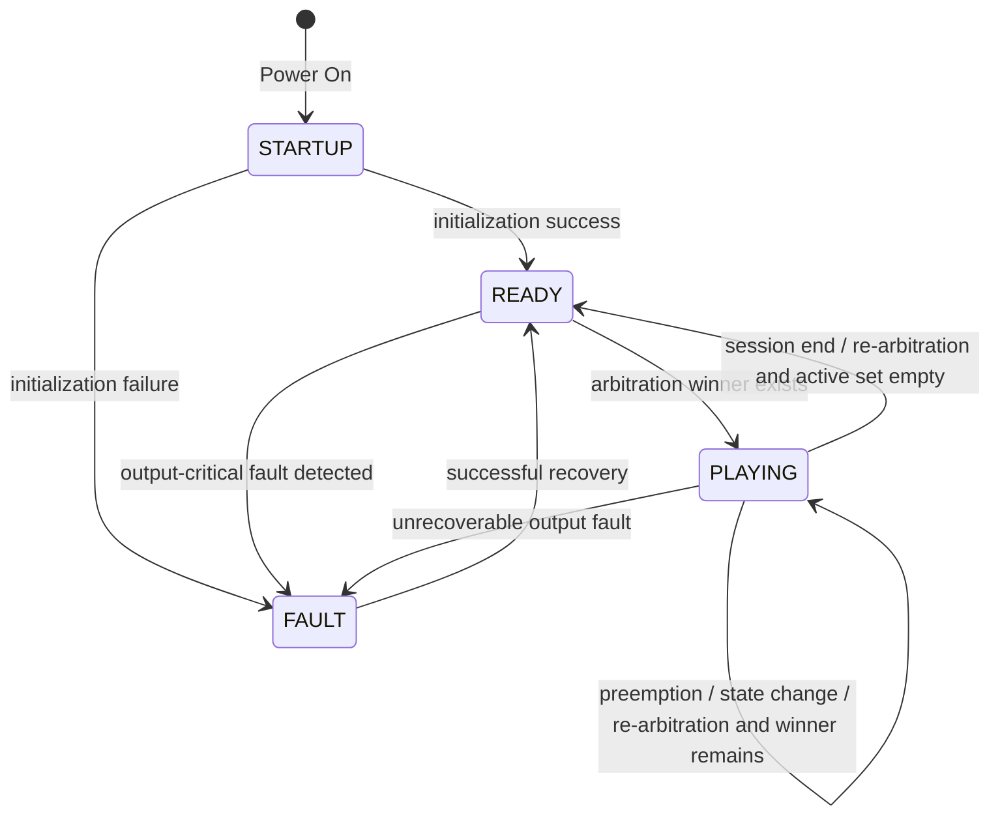

# VSS ECU Interface 정보 정리 — Stage 04 Review Candidate

> 상태: **REVIEW DRAFT / Domain·Network Cross-check 전**  
> 작성 형식 기준: `ECU_Interface_정보요청_가이드.md`  
> 요구사항 기준: `02_VSS_SYSRS_FUNCTIONAL_BASELINE_DRAFT.md`  
> 논리 인터페이스 기준: `03_VSS_LOGICAL_INTERFACE_NEEDS_DRAFT.md`  
> 목적: VSS ECU가 외부에서 **수용해야 하는 정보**, 외부에 **제공해야 하는 정보**, VSS 내부에서 **자체 처리해야 하는 로직과 Fail-safe 경계**를 Domain/Network 담당자가 검토할 수 있는 형태로 정리한다.  
> 주의: 본 문서는 CAN Matrix, Protocol Specification 또는 `*_Interface.h`의 최종 Wire Structure가 아니다.

---

## 0. 표기 규칙

| 표기 | 의미 |
|---|---|
| `BASELINE` | SR/SysRS에서 의미 요구가 직접 확인되는 항목 |
| `CANDIDATE` | 초기 개발·벤치 검증을 위한 임시값 |
| `PROVISIONAL` | Interface 구체화를 위한 권장 표현. 팀 합의 전 Signal 확정 금지 |
| `OPTIONAL` | 통합 진단/시험 요구가 있을 때만 추가할 후보 |
| `TBD` | 상대 ECU, Domain, Network, Power 또는 Fault 정책과 Cross-check 후 결정 |
| `EXCLUDED` | 현재 VSS 기능 범위에서 명시적으로 제외 |

> **SNA (Signal Not Available)**: Producer가 현재 정상 Semantic State를 제공할 수 없음을 나타내는 의미 상태. `STALE`, `INVALID`, `NOT_RECEIVED` 같은 Reception Quality와는 구분한다.

### 0.1 본 문서에서 확정하지 않는 것

- 실제 CAN/LIN/UART 물리 경로
- CAN Message ID / Signal ID
- Start Bit / Length / DLC / Byte Order
- 실제 enum 숫자값과 reserved code
- 최종 송신 주기 / Timeout / Freshness 수치
- One-shot occurrence identifier의 실제 bit width
- Alive/Rolling Counter / CRC / E2E
- Bus-Off 상세 복구 절차
- ECU별 최종 Network Producer / Consumer
- `*_Interface.h` 실제 packing 구조

### 0.2 주요 SysRS 근거

| Interface 영역 | 주요 SysRS 근거 |
|---|---|
| State / Event 수용 가능 / Availability | `VSS-SYS-INT-006`, `007`, `VSS-SYS-DIA-016` |
| One-shot Delivery / Max Age | `VSS-SYS-INT-010~012`, `017`, `VSS-SYS-FUN-039~041` |
| Stateful Semantic / Reception Quality | `VSS-SYS-INT-013~016`, `VSS-SYS-NFR-018~019` |
| Arbitration / Re-arbitration | `VSS-SYS-FUN-035~044`, `VSS-SYS-NFR-015~017` |
| Fault / Input Diagnostic 분리 | `VSS-SYS-DIA-012~018` |

> 위 표는 유지보수 편의를 위한 Section-level 근거 요약이며, 상세 SR↔SysRS 추적은 `04_VSS_SR_SYSRS_TRACE_NAVIGATION_DRAFT.md`를 기준으로 한다.

---

# VSS ECU

## 1. 주요 기능

### 1.1 핵심 기능

- 외부 차량 시스템에서 의미가 확정된 **One-shot Event**와 **Stateful Information**을 수용한다. `[BASELINE]`
- 입력의 의미, 지원 여부 및 수신 품질을 확인한다. `[BASELINE]`
- Stateful 입력의 최신 유효 의미 상태와 Reception Quality를 구분하여 관리한다. `[BASELINE]`
- 현재 유효한 Stateful Request와 대기 중인 One-shot을 중재 대상으로 관리한다. `[BASELINE]`
- `Emergency > Warning > Feedback` 우선순위를 적용한다. `[BASELINE]`
- 동일 Priority Class 내 복수 요청은 고정된 결정 규칙으로 하나의 Winner를 선택해야 한다. `[BASELINE / actual tie-break TBD]`
- 의미 Event/State를 로컬 Sound Asset 및 Playback Policy와 매핑한다. `[BASELINE]`
- 한 시점에 하나의 Playback Winner만 활성화한다. `[BASELINE]`
- One-shot과 Stateful Warning의 선점·종료·재중재 동작을 구분한다. `[BASELINE]`
- VSS의 상태, 서비스 제공 가능 수준 및 Internal Output Fault 정보를 외부 차량 시스템이 확인할 수 있도록 한다. `[BASELINE need]`
- 복구 가능한 Internal Output Fault에 대해 차량 전체 재시작 없이 로컬 복구할 수 있어야 한다. `[BASELINE]`

### 1.2 지원 기능 범위

- 차량 사용 시작 Welcome 음향 `[BASELINE]`
- 차량 사용 종료 Goodbye 음향 `[BASELINE]`
- 도어 잠금 완료 피드백 `[BASELINE]`
- 도어 잠금 해제 피드백 `[BASELINE]`
- 도어 잠금 이상 경고 `[BASELINE]`
- 파워윈도우 Anti-Pinch 긴급 경고 `[BASELINE]`
- 잔류 탑승자 위험 긴급 경고 `[BASELINE]`
- 후방 장애물 `CAUTION / EMERGENCY / CLEAR` 상태에 따른 경고 `[BASELINE]`

### 1.3 VSS 책임이 아닌 항목

- 센서 Raw Data 처리 `[BASELINE]`
- 파워윈도우 끼임 자체 판정 `[BASELINE]`
- 잔류 탑승자 존재/위험 자체 판정 `[BASELINE]`
- 후방 장애물 거리 측정 및 거리 임계값 판정 `[BASELINE]`
- 차량 전체 상태 판단 `[BASELINE]`
- 조도/시간대에 따른 자동 음량 변경 `[EXCLUDED]`
- 외부 오디오 스트리밍 및 차량 네트워크를 통한 음원 파일 전송 `[EXCLUDED]`
- 일반 음악 재생 / 플레이리스트 / 탐색 `[EXCLUDED]`
- 다중 음원 Mixing / Media Ducking / Fade / EQ `[EXCLUDED]`

---

## 2. State

### 2.1 VSS ECU System State

| State | 의미 | 상태 |
|---|---|---|
| `STARTUP` | 전원 인가 후 초기화가 완료되지 않은 상태 | `BASELINE` |
| `READY` | 초기화 완료 후 현재 활성 Playback Session이 없는 상태 | `BASELINE` |
| `PLAYING` | 하나의 Playback Session이 활성화된 상태. 반복 cue 사이의 의도된 무음 구간도 Session에 포함 | `BASELINE` |
| `FAULT` | 정상적인 VSS 음향 출력 능력을 보장할 수 없는 상태 | `BASELINE` |

> `READY`만이 입력 수용 가능 상태를 의미하지 않는다. `PLAYING` 중에도 새로운 Semantic Event/State를 수용하고 중재할 수 있다.

### 2.2 기본 상태 전이



### 2.3 상태 해석 규칙

- `PLAYING`은 단순히 스피커 파형이 출력되는 순간이 아니라 **Playback Session 전체**를 의미한다. `[BASELINE]`
- 높은 우선순위에 의해 Stateful Warning이 선점되어도 해당 Effective State가 계속 유효하면 Active Request Set에 유지한다. `[BASELINE]`
- 선점 원인이 사라진 후 재중재 결과 해당 Stateful Request가 다시 Winner가 되면 Playback Session을 다시 활성화한다. `[BASELINE]`
- 이미 재생이 시작된 One-shot이 선점된 경우 자동 Resume하지 않는다. `[BASELINE]`
- 아직 재생이 시작되지 않은 One-shot은 Max Age 이내에서만 Pending 가능하다. `[BASELINE / Max Age TBD]`
- 복구 성공 후 `READY`로 복귀하고 현재 유효 Stateful Request와 Max Age 이내 Pending One-shot을 다시 평가한다. `[BASELINE]`

### 2.4 Service 상태 보조 정보

System State와 별도로 다음 논리 정보가 필요할 수 있다.

| Logical Information | 의미 | 상태 |
|---|---|---|
| `VSS_ACCEPTING_EVENTS` | 현재 Semantic Event/State를 수용·검증·중재할 수 있는지 | `PROVISIONAL - recommended` |
| `VSS_AVAILABILITY` | 현재 VSS 음향 서비스 제공 가능 범위 | `PROVISIONAL` |

`VSS_AVAILABILITY`의 논리 의미 후보:

```text
FULL
DEGRADED
UNAVAILABLE
```

- `FULL`: Baseline VSS 기능을 정상 제공 가능
- `DEGRADED`: 일부 Event/Asset/출력 기능에 제한이 있으나 전체 출력 불능은 아님
- `UNAVAILABLE`: 정상적인 VSS 음향 출력을 보장할 수 없음
- `STARTUP` 동안 Availability가 아직 평가되지 않은 상태의 실제 Wire 표현은 `TBD`이다.

---

## 3. Request / Command

### 3.1 외부 Product Command 정책

현재 VSS Baseline은 Domain/상위 ECU가 VSS 내부 Sound Asset이나 Playback Sequence를 직접 제어하는 구조를 요구하지 않는다.

따라서 VSS가 받는 핵심 입력은 일반적인 `PLAY_SOUND_xxx` Command가 아니라 **의미가 확정된 차량 Event/State**이다.

| Command | 현재 판단 | 상태 |
|---|---|---|
| `PLAY_SOUND_xxx` | 상위가 VSS 내부 Asset을 직접 지정하지 않음 | `NOT REQUIRED` |
| `STOP_SOUND` | Stateful Warning은 해당 Semantic State의 정상 해제/변경으로 종료 | `NOT REQUIRED` |
| `SET_PRIORITY` | Priority 및 Same-Class 결정 규칙은 VSS Local Policy | `NOT REQUIRED` |
| `SET_VOLUME` | 현재 Functional Baseline의 외부 Product Command로 확인되지 않음 | `NOT BASELINE` |

### 3.2 시험/진단 Command

다음 기능은 통합 시험에서 필요할 수 있으나 Product Interface와 분리한다.

- Fault injection
- Asset unavailable simulation
- Audio Output failure simulation
- 특정 Semantic Input 강제 주입

실제 Debug UART / Test Hook / Production Diagnostic Command 여부는 `TBD`이다.

---

## 4. Event

> 가이드의 일반 예시는 ECU가 Domain에 Event를 제공하는 방향을 보여주지만, 현재 VSS Baseline은 **외부 차량 기능이 확정한 Semantic Event를 VSS가 소비하는 구조**이다. 따라서 본 절은 방향을 명시해 `External → VSS`와 `VSS → External`을 구분한다.

### 4.1 External → VSS One-shot Semantic Event

| Event | 의미 | Priority Class | 기본 동작 | Semantic Owner 후보 | Network Producer |
|---|---|---|---|---|---|
| `VEHICLE_WELCOME` | 차량 사용 시작 확정 | Feedback | One-shot feedback | `TBD` | `TBD` |
| `VEHICLE_GOODBYE` | 차량 사용 종료 확정 | Feedback | One-shot feedback | `TBD` | `TBD` |
| `DOOR_LOCK_COMPLETE` | 도어 잠금 정상 완료 | Feedback | One-shot feedback | Door/Access 후보, `TBD` | `TBD` |
| `DOOR_UNLOCK_COMPLETE` | 도어 잠금 해제 정상 완료 | Feedback | Lock과 구분 가능한 feedback | Door/Access 후보, `TBD` | `TBD` |
| `DOOR_LOCK_ERROR` | 도어 잠금 이상 확정 | Warning | Lock 완료와 구분 가능한 warning | Door/Access 후보, `TBD` | `TBD` |

> `DOOR_UNLOCK_COMPLETE`의 **2 cues / 150–300 ms**는 Interface Baseline이 아니라 초기 검증용 `CANDIDATE`이다.

### 4.2 One-shot Event Delivery 계약

One-shot Event는 다음 의미를 만족해야 한다.

- 같은 실제 발생을 신뢰성 확보 목적으로 반복 전달해도 중복 재생되어서는 안 된다. `[BASELINE]`
- 동일 종류 Event가 나중에 실제로 다시 발생하면 새로운 occurrence로 식별 가능해야 한다. `[BASELINE]`
- VSS가 STARTUP/Wake로 아직 입력을 정상 수용할 수 없을 때 발생한 Event는 의미 유효기간 안에서 무조건 유실되는 구조여서는 안 된다. `[BASELINE]`
- STARTUP/Wake/통신 복구 중 Event가 Max Age를 초과했다면 READY 이후 신규 Event처럼 뒤늦게 재생되어서는 안 된다. `[BASELINE]`

Occurrence 식별 방식 후보:

- Event sequence/counter
- Toggle/edge identity
- Producer-side latch + consumption 확인
- 동등한 중복 억제 가능한 방식

실제 방식과 bit width는 `TBD`이다.

### 4.3 VSS → External One-shot Event

현재 Baseline은 VSS가 외부로 별도의 순간 Event를 반드시 송신하도록 요구하지 않는다.

- 정상/오류/복구는 기본적으로 `State / Availability / Fault Data`를 통해 확인한다.
- `VSS_RECOVERED` 같은 별도 Event는 현재 `OPTIONAL / NOT BASELINE`이다.

---

## 5. Fault

VSS Fault는 **VSS 자체 출력 기능의 Internal Fault**와 **외부 입력/통신 품질 Diagnostic**을 분리한다.

### 5.1 Internal VSS Output Fault

| Fault | 의미 | 기본 영향 |
|---|---|---|
| `SOUND_ASSET_UNAVAILABLE` | 필요한 로컬 음향 자산 사용 불가 | 영향 범위에 따라 `DEGRADED` 가능 |
| `PLAYBACK_START_FAILURE` | Playback Session 시작 실패 | Local recovery 후보 / 반복 실패 시 승격 가능 |
| `AUDIO_OUTPUT_FAILURE` | Codec/DAC/Amplifier 등 실제 출력 경로 오류 | Output-critical이면 `UNAVAILABLE / FAULT` |
| `PLAYBACK_STATE_FAILURE` | 내부 Playback 상태 불일치/비정상 | Local recovery 후보 / 실패 시 승격 가능 |
| `INITIALIZATION_FAILURE` | 초기화 실패 | `FAULT` 전이 |

실제 Fault별 Severity, retry/re-init 횟수, DTC, bitmask는 `TBD`이다.

### 5.2 Input / Interface Diagnostic Condition

| Condition | 의미 | Internal Output Fault인가? |
|---|---|---|
| `INVALID_EVENT` | 지원되지 않거나 유효하지 않은 One-shot 의미 입력 | 아니오 |
| `INPUT_NOT_RECEIVED` | Startup/Wake 이후 정상 Stateful 입력을 아직 한 번도 수용하지 못함 | 아니오 |
| `INPUT_STALE` | 마지막 정상 입력 이후 Freshness를 만족하지 못함 | 아니오 |
| `INPUT_INVALID` | 값/포맷/무결성 검증을 만족하지 못함 | 아니오 |

CRC/E2E/Alive Counter/Bus-Off 세부 진단은 Network 설계 이후 확장한다.

### 5.3 Active Fault와 Last Fault

```text
VSS_FAULT_ACTIVE
= 현재 Internal Output Fault가 활성인지

VSS_LAST_FAULT
= 최근 주요 Internal Output Fault 원인이 무엇인지
```

- Input Diagnostic만으로 `VSS_FAULT_ACTIVE`를 TRUE로 보고하지 않는다.
- Internal Output Fault가 복구되면 Active Fault 상태는 해제한다.
- `VSS_LAST_FAULT`는 정의된 Diagnostic Clear 정책이 적용될 때까지 유지 가능해야 한다.
- 둘 이상의 Internal Fault가 동시에 존재할 경우 각 Active Fault는 내부적으로 손실 없이 관리해야 한다.

---

## 6. Data

> 아래 Type/Range는 **논리 자료형**이다. 실제 wire bit width와 encoding은 확정하지 않는다.

### Data 1 — VSS System State

```text
Name        : VSS_STATE
Direction   : VSS -> External
Type        : enum
Range       : STARTUP / READY / PLAYING / FAULT
Unit        : -
Description : VSS ECU의 현재 top-level 동작 상태
Status      : BASELINE meaning / PROVISIONAL signal name
```

### Data 2 — VSS Accepting Events

```text
Name        : VSS_ACCEPTING_EVENTS
Direction   : VSS -> External
Type        : bool / logical status
Range       : FALSE / TRUE
Unit        : -
Description : 현재 Semantic Event/State를 수용·검증·중재 대상으로 처리할 수 있는지
Status      : PROVISIONAL
```

`TRUE`가 모든 Sound Asset의 출력 성공을 보장한다는 의미는 아니다.

### Data 3 — VSS Service Availability

```text
Name        : VSS_AVAILABILITY
Direction   : VSS -> External
Type        : enum
Range       : FULL / DEGRADED / UNAVAILABLE
Unit        : -
Description : 현재 VSS 음향 서비스 제공 가능 범위
Status      : PROVISIONAL
```

- STARTUP 중 Availability가 아직 평가되지 않은 상태의 표현 방법은 `TBD`이다.
- 실제 Consumer가 필요로 하는지 확인 후 Production Signal 여부를 결정한다.

### Data 4 — VSS Fault Active

```text
Name        : VSS_FAULT_ACTIVE
Direction   : VSS -> External
Type        : bool / logical status
Range       : FALSE / TRUE
Unit        : -
Description : 현재 Internal Output Fault 존재 여부
Status      : PROVISIONAL - recommended
```

### Data 5 — VSS Last Fault

```text
Name        : VSS_LAST_FAULT
Direction   : VSS -> External
Type        : enum
Range       :
  NONE
  SOUND_ASSET_UNAVAILABLE
  PLAYBACK_START_FAILURE
  AUDIO_OUTPUT_FAILURE
  PLAYBACK_STATE_FAILURE
  INITIALIZATION_FAILURE
Unit        : -
Description : 최근 발생한 주요 Internal Output Fault 원인
Status      : BASELINE need / PROVISIONAL encoding
```

### Data 6 — Power Window Anti-Pinch State

```text
Name        : WINDOW_ANTIPINCH_STATE
Direction   : External -> VSS
Type        : enum / semantic state
Range       : CLEAR / ACTIVE
Unit        : -
Description : Power Window 기능에서 판정이 완료된 끼임 위험 의미 상태
Source      : Power Window candidate / final Network Producer TBD
Invalid     : STALE / INVALID / NOT_RECEIVED / SNA는 CLEAR가 아님
Status      : PROVISIONAL - recommended logical representation
```

### Data 7 — Occupant Hazard State

```text
Name        : OCCUPANT_HAZARD_STATE
Direction   : External -> VSS
Type        : enum / semantic state
Range       : CLEAR / ACTIVE
Unit        : -
Description : 외부 판단 기능에서 확정된 잔류 탑승자 위험 의미 상태
Source      : Sensing/Central candidate / final Network Producer TBD
Invalid     : STALE / INVALID / NOT_RECEIVED / SNA는 CLEAR가 아님
Status      : PROVISIONAL - recommended logical representation
```

> 단순한 `Occupant Detected` Raw/Intermediate 결과와 `OCCUPANT_HAZARD_STATE`는 동일 정보로 간주하지 않는다.

### Data 8 — Rear Obstacle State

```text
Name        : REAR_OBSTACLE_STATE
Direction   : External -> VSS
Type        : enum / semantic state
Range       : CLEAR / CAUTION / EMERGENCY
Unit        : -
Description : 외부 기능이 거리·유효성·위험도를 판정한 최종 후방 위험 상태
Source      : Sensing/Central candidate / final Network Producer TBD
Invalid     : STALE / INVALID / NOT_RECEIVED / SNA는 CLEAR가 아님
Status      : PROVISIONAL - recommended logical representation
```

후방 `distance_cm`은 VSS Interface Data로 요구하지 않는다. `[BASELINE]`

### Data 9 — Stateful Input Reception Quality

```text
Name        : INPUT_RECEPTION_QUALITY
Direction   : VSS internal / Optional diagnostic outward
Type        : enum per Stateful input
Range       : NOT_RECEIVED / VALID / STALE / INVALID
Unit        : -
Description : 각 Stateful 정보의 현재 수신 품질
Status      : BASELINE internal need / OPTIONAL external observability
```

`NOT_AVAILABLE/SNA`는 Producer가 의미적으로 "현재 정상 상태를 제공할 수 없음"을 나타내는 Semantic-side 상태 후보이며 `STALE`과 동일 개념이 아니다.

### Data 10 — One-shot Event Occurrence Identity

```text
Name        : EVENT_OCCURRENCE_IDENTITY
Direction   : External -> VSS
Type        : sequence / counter / toggle / equivalent
Range       : TBD
Unit        : -
Description : 같은 Event의 재전달과 별개의 새로운 발생을 구분
Status      : BASELINE need / encoding TBD
```

- 실제 bit width는 정의하지 않는다.
- Source ECU reset / wrap-around / VSS duplicate history reset 규칙은 `TBD`이다.

### Optional Diagnostic Data

| Information | 목적 | 상태 |
|---|---|---|
| `VSS_CURRENT_REQUEST` | 현재 Playback Winner 의미 확인 | `OPTIONAL` |
| `VSS_RECOVERY_STATUS` | 복구 진행/성공/실패 관측 | `OPTIONAL` |
| Applied Effective State | STALE/SNA 이후 실제 Arbitration 입력 확인 | `OPTIONAL / Test` |
| Class/Semantic Capability | `DEGRADED` 세부 사용 가능 범위를 Consumer가 필요로 할 때 | `OPTIONAL` |

---

## 7. Local Logic

### 7.1 Input Validation

- 지원되는 One-shot Event인지 확인한다. `[BASELINE]`
- Stateful Input의 의미 상태와 Reception Quality를 구분한다. `[BASELINE]`
- 유효하지 않은 Event는 임의 Sound를 출력하지 않고 Input Diagnostic으로 처리한다. `[BASELINE]`
- `STALE / INVALID / NOT_RECEIVED / SNA`를 정상 `CLEAR`로 자동 치환하지 않는다. `[BASELINE]`

### 7.2 Active Request 관리

VSS는 논리적으로 다음 정보를 구분해 관리한다.

```text
Stateful Input:
  Last Valid Semantic State
  Reception Quality
  Effective State used for Arbitration

One-shot Input:
  occurrence identity
  accepted time / age
  pending / started / discarded 상태
```

- Stateful 입력의 동일 ACTIVE 값이 주기적으로 반복 수신되어도 새로운 경고 발생으로 해석해 Playback Session을 매번 재시작하지 않는다. `[BASELINE]`
- 통신 복구 시 Stateful은 현재 의미 상태를 다시 수용하여 재동기화한다. `[BASELINE]`

### 7.3 Priority Arbitration / Re-arbitration

기본 Priority Class:

```text
Emergency > Warning > Feedback
```

- Emergency는 Warning/Feedback보다 우선한다. `[BASELINE]`
- Warning은 Feedback보다 우선한다. `[BASELINE]`
- 낮은 Priority의 신규 요청은 높은 Priority의 현재 Session을 중단시키지 않는다. `[BASELINE]`
- 한 시점의 Playback Winner는 1개만 허용한다. `[BASELINE]`
- 입력 상태 변경, Session 종료, 선점 해제, Fault 복구 후에는 현재 유효 요청 집합을 재중재한다. `[BASELINE]`
- Same-Class 복수 요청은 **수신 순서에 의존하지 않는 고정된 Sub-priority/Tie-break 규칙**으로 결정해야 한다. `[BASELINE requirement / actual values TBD]`
- `First Accepted`만으로 Same-Class를 결정하는 정책은 현재 요구사항을 만족하는 최종 규칙으로 사용하지 않는다.

### 7.4 One-shot Playback

- One-shot은 정상 수용 후 지정된 재생 정책에 따라 출력하고 종료한다. `[BASELINE]`
- 이미 시작된 One-shot이 높은 Priority에 선점되면 자동 Resume하지 않는다. `[BASELINE]`
- 아직 시작되지 않은 One-shot이 대기하는 경우 Max Age를 초과하면 폐기한다. `[BASELINE / actual Max Age TBD]`
- 같은 occurrence의 반복 전달은 중복 재생하지 않는다. `[BASELINE]`

Candidate:

| 항목 | Candidate |
|---|---:|
| General one-shot duration | `≤ 2.0 s` |
| Lock feedback cues | `1` |
| Unlock feedback cues | `2` |
| Unlock cue interval | `150–300 ms` |
| Duplicate suppression helper window | `150 ms` |

> Unlock `2 cues`는 Baseline이 아니라 Candidate이다.

### 7.5 Stateful Warning

- `WINDOW_ANTIPINCH_STATE == ACTIVE`이면 Anti-Pinch Emergency 요청을 Active Request Set에 포함한다. `[PROVISIONAL representation / BASELINE meaning]`
- `OCCUPANT_HAZARD_STATE == ACTIVE`이면 Occupant Hazard Emergency 요청을 포함한다. `[PROVISIONAL representation / BASELINE meaning]`
- `REAR_OBSTACLE_STATE == CAUTION`이면 Rear Warning 요청을 포함한다. `[PROVISIONAL representation / BASELINE meaning]`
- `REAR_OBSTACLE_STATE == EMERGENCY`이면 Rear Emergency 요청을 포함한다. `[PROVISIONAL representation / BASELINE meaning]`
- 유효 `CLEAR` 수용 시 해당 Stateful 요청을 Active Request Set에서 제거하고 즉시 재중재한다. `[BASELINE]`
- 높은 Priority에 선점된 Stateful 요청도 Effective State가 계속 활성이라면 이후 다시 Winner가 될 수 있다. `[BASELINE]`

### 7.6 Sound Mapping / Playback Policy

- 의미 Event/State와 Sound Asset 대응 관계는 일관된 관리 단위에서 변경 가능해야 한다. `[BASELINE]`
- 동일 의미 입력은 정상 상태에서 일관된 Sound를 선택한다. `[BASELINE]`
- 필요한 Asset이 없으면 다른 의미의 Sound로 임의 대체하지 않는다. `[BASELINE]`
- Class별 상대 Output Setpoint `60/80/100%`는 초기 검증 `CANDIDATE`이며 외부 `SET_VOLUME` Command를 의미하지 않는다.

### 7.7 Fault / Availability Management

- Input Diagnostic과 Internal Output Fault를 분리한다. `[BASELINE]`
- 일부 기능만 제한되는 경우와 전체 Audio Output을 보장할 수 없는 경우를 구분한다. `[BASELINE]`
- Output-critical Fault는 `UNAVAILABLE / FAULT`와 연계한다. `[BASELINE]`
- 최근 주요 Fault 원인은 Diagnostic Clear 전까지 식별 가능하게 유지한다. `[BASELINE]`
- 복구 가능한 Fault의 실제 retry/re-init 횟수는 `TBD`이다.

### 7.8 Performance Candidate

| 항목 | Candidate |
|---|---:|
| Power-on → READY/FAULT | `≤ 1000 ms` |
| Feedback output start | `≤ 200 ms` |
| Warning output start | `≤ 100 ms` |
| Emergency output start | `≤ 50 ms` |
| Emergency preemption | `≤ 50 ms` |
| Stateful warning clear | `≤ 100 ms` |
| Rear CAUTION → EMERGENCY | `≤ 50 ms` |
| Rear EMERGENCY → CAUTION | `≤ 100 ms` |
| VSS 내부 상태 변경 → 외부 제공 상태 갱신 가능 | `≤ 100 ms` |
| Recoverable Output Fault 결정/복구 | `≤ 2000 ms` |

위 시간은 VSS 내부에서 정보를 **유효하게 수용한 이후**의 처리 시간이며 Network 전달 지연은 포함하지 않는다.

---

## 8. Fail-safe

### 8.1 Invalid / Unsupported One-shot Event

```text
Invalid / Unsupported Event
 -> Reject
 -> 잘못된 Sound 출력 금지
 -> Input Diagnostic 기록 가능
 -> VSS Internal Output Fault로 자동 승격하지 않음
```

### 8.2 Stateful Input Quality 이상

```text
STALE / INVALID / NOT_RECEIVED / SNA
 -> 정상 CLEAR로 자동 치환 금지
 -> Last Valid State / Reception Quality / Effective State 분리
 -> 기능별 Fail-safe Policy 적용
```

실제 기능별 처리 후보:

- 제한 시간 Hold 후 비활성화
- 즉시 비활성화
- Degraded behavior
- 상위 판단 결과 대기

어느 정책을 사용할지는 Source ECU + Safety/Network Cross-check 후 확정한다. `[TBD]`

### 8.3 Missing Sound Asset

```text
Required Asset unavailable
 -> 다른 의미 Sound로 대체 금지
 -> 해당 의미 출력 불가 또는 제한 처리
 -> 영향 범위에 따라 DEGRADED 또는 Fault 정책 적용
```

### 8.4 Initialization Failure

```text
Initialization failure
 -> VSS_STATE = FAULT
 -> Availability = UNAVAILABLE 의미
 -> 외부에서 오류 상태 확인 가능
```

### 8.5 Recoverable Internal Output Fault

```text
Recoverable Output Fault
 -> 오류 검출
 -> Local Recovery 수행
 -> 성공: Active Fault 해제 -> READY -> 현재 유효 요청 재평가
 -> 실패: FAULT / UNAVAILABLE 유지
```

복구 수행 중 외부에 정상적인 신규 Feedback을 출력 가능한 상태로 잘못 보고해서는 안 된다.

### 8.6 Unrecoverable Output Fault

```text
Unrecoverable / Recovery failed
 -> FAULT 유지
 -> UNAVAILABLE 상태 제공
 -> 오류 원인 유지
 -> 다른 차량 기능의 제어 상태를 VSS가 직접 변경하지 않음
```

### 8.7 Startup / Wake One-shot Event

STARTUP/Wake 구간에 발생한 One-shot은 다음 원칙을 적용한다.

```text
Event 발생
 -> VSS가 수용 가능한가?
    Yes: 전달
    No : Delivery Contract에 따라 보존
 -> Max Age 이내: 전달 가능
 -> Max Age 초과: 폐기
```

실제 Wake 순서와 Delivery 방식은 `TBD`이다.

### 8.8 Communication Recovery / Resynchronization

- Stateful Information은 통신 복구 후 **현재 상태**를 다시 수용해 재동기화한다.
- 과거 Stateful History를 순서대로 재생하지 않는다.
- Max Age를 초과한 과거 One-shot Event를 신규 발생처럼 재생하지 않는다.
- Source ECU reset / occurrence counter wrap / duplicate history reset 규칙은 `TBD`이다.

### 8.9 Sensor / Actuator Fault 경계

- VSS는 원시 Sensor나 Power Window Actuator를 직접 소유하지 않으므로 해당 Fault 자체의 판정은 VSS 책임이 아니다.
- Upstream Sensor/Actuator Fault 때문에 Semantic State가 더 이상 유효하지 않은 경우 Source는 `SNA/NOT_AVAILABLE` 또는 합의된 상태를 제공해야 한다. `[TBD]`
- 해당 이상을 VSS 자체 `AUDIO_OUTPUT_FAILURE` 같은 Internal Fault로 변환하지 않는다.

---

# 9. Domain/Network 공유용 Interface Summary

## 9.1 External → VSS

| Information | Type | 의미 | Semantic Owner 후보 | Network Producer | 현재 상태 |
|---|---|---|---|---|---|
| Vehicle Welcome | One-shot Event | 차량 사용 시작 확정 | `TBD` | `TBD` | Cross-check 필요 |
| Vehicle Goodbye | One-shot Event | 차량 사용 종료 확정 | `TBD` | `TBD` | Cross-check 필요 |
| Door Lock Complete | One-shot Event | 차량 전체/대상 Door 잠금 완료 의미 | Door/Access 후보 | `TBD` | 의미 범위 Cross-check 필요 |
| Door Unlock Complete | One-shot Event | 잠금 해제 완료 의미 | Door/Access 후보 | `TBD` | Cross-check 필요 |
| Door Lock Error | One-shot Event | 잠금 이상 확정 | Door/Access 후보 | `TBD` | Cross-check 필요 |
| `WINDOW_ANTIPINCH_STATE` | Stateful | `CLEAR / ACTIVE` | Power Window 후보 | `TBD` | Cross-check 필요 |
| `OCCUPANT_HAZARD_STATE` | Stateful | `CLEAR / ACTIVE` | Sensing/Central 후보 | `TBD` | 의미 경계 Cross-check 필요 |
| `REAR_OBSTACLE_STATE` | Stateful | `CLEAR / CAUTION / EMERGENCY` | Sensing/Central 후보 | `TBD` | 최종 판단 Owner Cross-check 필요 |
| Event Occurrence Identity | Delivery metadata | 재전달 vs 신규 발생 구분 | 각 Event Producer | `TBD` | 방식/수명 규칙 TBD |

## 9.2 VSS → External

| Information | 의미 | Producer | Consumer | 현재 상태 |
|---|---|---|---|---|
| `VSS_STATE` | STARTUP/READY/PLAYING/FAULT | VSS | `TBD` | 의미 Baseline |
| `VSS_ACCEPTING_EVENTS` | 현재 입력 수용 가능 여부 | VSS | `TBD` | Signal 필요 여부 확인 |
| `VSS_AVAILABILITY` | FULL/DEGRADED/UNAVAILABLE | VSS | `TBD` | Consumer 사용 여부 확인 |
| `VSS_FAULT_ACTIVE` | 현재 Internal Output Fault 존재 | VSS | `TBD` | Consumer 확인 필요 |
| `VSS_LAST_FAULT` | 최근 주요 Internal Output Fault | VSS | Diagnostic Consumer `TBD` | Clear 정책 TBD |
| Optional Diagnostic | Current Request / Recovery / Input Quality 등 | VSS | Test/Integration `TBD` | 필요 시만 추가 |

## 9.3 Interface Freeze 전 필수 Cross-check

1. Vehicle Welcome / Goodbye의 최종 Semantic Owner
2. Door Lock Complete가 개별 Door 완료인지 차량 전체 Lock Completion인지
3. Anti-Pinch `ACTIVE/CLEAR`의 정확한 Producer 판정 조건
4. Occupant Detection과 `OCCUPANT_HAZARD`의 의미 경계
5. Rear `CLEAR/CAUTION/EMERGENCY` 최종 판단 Owner
6. Stateful 입력별 `SNA/NOT_AVAILABLE` 의미
7. Stateful `STALE/INVALID` 시 실제 Effective State / Bounded Hold 정책
8. Same-Class 고정 Sub-priority / deterministic tie-break 정책
9. One-shot Event Max Age와 occurrence identity의 reset/wrap 규칙
10. STARTUP/Wake Event Delivery 방식
11. `VSS_ACCEPTING_EVENTS` / `VSS_AVAILABILITY` 실제 Consumer 필요 여부
12. STARTUP 중 Availability의 실제 wire 표현

## 9.4 Network 단계로 넘길 항목

다음은 Interface 의미 Freeze 후 통신 담당이 결정한다.

- Physical protocol
- Message grouping
- Event-triggered / Periodic / Change-triggered 송신 방식
- Cycle / Timeout / Freshness 수치
- CAN ID / DLC / Start Bit / Byte Order
- occurrence identifier bit width
- Alive/Rolling Counter
- CRC / E2E
- Bus-Off / Communication Recovery 상세
- Bus Load / Arbitration Priority

---


## 9.5 Deferred Security Extension

VSS ↔ Central/Domain Controller 간 통신 보안은 **현재 ECU Interface Functional Baseline에 포함하지 않는다.** 현재는 기능 Event/State/Fault/Diagnostic 의미와 기본 Network 동작을 우선 안정화한다.

향후 기본 VSS/Network가 안정화되고 일정·자원 여유가 확보되면 다음을 후속 확장으로 검토한다.

```text
Public-key based ECU Authentication
        ↓
Asymmetric-key based Key Establishment / Exchange
        ↓
Session Key
        ↓
Message Confidentiality / Integrity / Authentication
        ↓
Replay Protection / Security Diagnostics
```

필요 시 학습·데모 목적의 비대칭키 암호화/복호화 자체도 제한된 범위에서 검증할 수 있으나, 실제 차량 메시지 보호 구조와 동일한 것으로 간주하지 않는다.

Security Extension 적용 시 Network Interface에 다음 정보가 추가될 수 있다.

- Security Context / Authentication Identifier
- Session / Key Identifier
- Authentication / Integrity Tag
- Replay Protection Counter / Nonce
- Security Validation Result / Error Information

현재 단계에서는 위 필드의 CAN Message, DLC, bit layout, Cycle, Counter 폭 및 Crypto 알고리즘을 예약하거나 확정하지 않는다.

**Status:** `DEFERRED / FUTURE EXTENSION`

**승격 조건:**

1. VSS 핵심 기능과 기본 통신 안정화
2. Central/Domain ↔ VSS Interface Freeze
3. Network Timing/Bus Load/Recovery 정책 안정화
4. CPU/RAM/Flash/Timing Budget 확인
5. 프로젝트 일정상 구현·시험 공수 확보

# 10. 현재 단계 결론

현재 VSS 담당자가 Domain/Network 담당자에게 공유할 수 있는 정보는 다음 수준까지 정리되었다.

- VSS 자체 State와 상태 전이 의미
- 일반 Product Command가 필요하지 않다는 경계
- One-shot Event 목록과 Delivery 계약 필요성
- Stateful Semantic Information의 최소 의미 상태
- Internal Output Fault와 Input Diagnostic 분리
- VSS가 외부에 제공해야 할 Core 상태/오류 정보 후보
- VSS 내부 Arbitration / Re-arbitration / Playback / Fault 처리 책임
- Fail-safe에서 임의로 `CLEAR` 또는 잘못된 Sound로 대체하면 안 된다는 원칙

반면 다음은 VSS 단독으로 확정하지 않는다.

- Source/Consumer/Network Producer 최종 소유권
- Same-Class 실제 Sub-priority 값
- Stateful Stale/SNA의 최종 Fail-safe 동작
- One-shot Max Age와 occurrence identity wire 규칙
- Startup/Wake Power/Delivery 절차
- 실제 CAN/UART Signal/Message Mapping

따라서 본 문서는 **ECU Interface 정보 요청 가이드에 대한 VSS 담당자 제출 초안**으로 사용하고, 상대 ECU Cross-check 결과를 반영한 뒤 Interface 의미를 Freeze하는 것이 적절하다.
