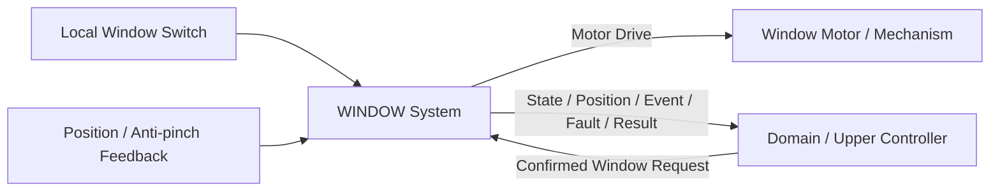

# WINDOW System Requirement (SR) — Functional Baseline Draft

> 상태: DRAFT / 기능 범위 검토용 
> 작성 원칙: 고객·상위 시스템 관점의 **What**을 기술한다. 
> 개별 요구사항 ID는 부여하지 않는다. 
> 기존 문서의 번호 체계는 승계하지 않는다.

---

## 1. 목적

WINDOW 시스템은 탑승자의 창문 조작 의도를 안전하고 예측 가능한 유리 이동으로 변환하고, 창문 위치·동작 상태·끼임 방지 이벤트·고장 상태를 상위 시스템에 제공해야 한다.

본 문서는 단일 창문 채널을 기능 기준으로 정의한다. 다중 도어 적용 시 동일 기능을 채널별로 확장하되, 채널 수와 실제 차량 배치는 후속 설계에서 확정한다.

---

## 2. 기능 범위

### 2.1 포함 범위

- 로컬 스위치 및 상위 시스템의 확정된 창문 명령 수신
- 열림, 닫힘, 정지 및 목표 위치 이동
- 수동 이동과 원터치 이동
- 창문 위치 및 완전 열림·완전 닫힘 상태 제공
- 닫힘 중 끼임 감지 시 즉시 정지 및 안전 방향 반전
- 모터 구동 상태와 명령 결과 제공
- 센서, 모터 구동, 통신 이상에 대한 안전 상태 전환과 진단 제공
- 전원 상태에 따른 동작 허용과 안전 정지

### 2.2 범위 밖

- 모바일/HMI 화면 및 사용자 인증
- 차량 전체 수준의 원격 제어 권한 판단
- 차량 전체 수준의 자동 환기 조건 판단
- CAN ID, 신호 비트 배치, 전송 주기와 같은 네트워크 상세
- 모터, 드라이버, 위치 센서 및 끼임 센서의 부품 선정
- 생산 차량의 기구 강도 및 법규 적합성 승인

---

## 3. 시스템 컨텍스트와 책임 경계

상위 시스템은 HMI, 모바일, 자동 환기 등 차량 전체 기능의 권한과 우선순위를 판단한 후 확정된 의미 기반 요청을 WINDOW 시스템에 전달해야 한다.

WINDOW 시스템은 로컬 입력 처리, 모터 구동, 이동 한계 처리, 끼임 방지의 즉시 반응과 실제 상태 피드백을 담당해야 한다. 상위 시스템 연결이 끊겨도 위험한 이동을 계속해서는 안 된다.

---

## 4. 입력과 출력의 의미

### 4.1 입력

- 로컬 열림, 닫힘, 정지 의도
- 상위 시스템의 열림, 닫힘, 정지, 환기 위치 또는 목표 위치 요청
- 요청 출처, 순서, 유효성 및 필요 시 만료 정보
- 창문 위치와 완전 열림·완전 닫힘 정보
- 끼임 감지 정보
- 시스템 전원 및 운전 허용 상태

### 4.2 출력

- 창문 동작 상태: 정지, 열림 이동, 닫힘 이동, 끼임 방지 반전, 고장
- 창문 위치와 위치 유효성
- 완전 열림·완전 닫힘 상태
- 끼임 방지 이벤트
- 명령 처리 결과와 거부·중단 사유
- 모터, 위치 센서, 끼임 센서, 통신 및 초기화 고장 정보

Request/Command, State, Event, Fault, Data는 서로 다른 의미로 제공해야 하며 하나의 신호에 혼합하지 않아야 한다.

---

## 5. 창문 제어 요구

### 5.1 명령 수용과 검증

- 시스템은 정의된 열림, 닫힘, 정지 및 목표 위치 요청만 수용해야 한다.
- 시스템은 유효하지 않거나 만료된 요청을 실행하지 않고 거부 사유를 제공해야 한다.
- 시스템은 동일 요청의 중복 수신으로 동작을 반복 시작하거나 방향을 불필요하게 변경해서는 안 된다.
- 새 요청이 현재 동작과 충돌하면 안전 우선순위에 따라 수용, 중단 또는 거부해야 한다.
- 정지 요청은 이동 요청보다 우선해야 한다.

### 5.2 수동 및 원터치 동작

- 로컬 스위치를 유지하는 동안 선택한 방향으로 이동하는 수동 동작을 제공해야 한다.
- 원터치 동작이 허용된 구성에서는 사용자 입력 해제 후에도 목표 끝단 또는 목표 위치까지 이동할 수 있어야 한다.
- 이동 중 반대 방향 요청 또는 정지 요청이 수신되면 현재 구동을 안전하게 해제한 후 후속 동작을 수행해야 한다.
- 완전 열림 또는 완전 닫힘 위치에 도달하면 해당 방향 구동을 중지해야 한다.
- 목표 위치 이동은 유효한 위치 정보가 있을 때만 수행해야 한다.

### 5.3 상태 피드백

- 시스템은 의도나 마지막 명령이 아니라 실제 판단한 동작 상태를 제공해야 한다.
- 위치를 제공할 수 없을 때는 이전 위치를 정상값처럼 사용하지 않고 유효성 상태를 함께 제공해야 한다.
- 각 명령에 대해 수용, 진행, 완료, 거부, 취소 또는 실패 결과를 구분할 수 있어야 한다.

---

## 6. 끼임 방지와 안전 동작

- 닫힘 이동 중 끼임이 감지되면 상위 시스템의 후속 명령을 기다리지 않고 로컬에서 즉시 모터를 정지해야 한다.
- 끼임 감지 후 창문은 안전 방향으로 제한 반전하거나 프로젝트에서 승인된 안전 위치까지 이동해야 한다.
- 끼임 방지 동작 중에는 일반 닫힘 요청보다 안전 동작이 우선해야 한다.
- 시스템은 끼임 발생을 이벤트로 제공하고 관련 명령 결과를 중단 또는 실패로 갱신해야 한다.
- 끼임 센서 또는 위치 정보가 신뢰할 수 없으면 자동 닫힘과 위치 기반 동작을 제한해야 한다.
- 상반된 방향의 모터 출력이 동시에 활성화되어서는 안 된다.
- 방향 전환 시 모터와 드라이버를 보호할 수 있는 안전한 전환 절차를 적용해야 한다.

---

## 7. 전원·통신·고장 상태 요구

- 초기화가 완료되기 전에는 창문이 의도하지 않게 움직여서는 안 된다.
- 운전 허용 전원 상태가 아니면 새 이동을 시작하지 않아야 한다.
- 이동 중 상위 명령이 유효하지 않게 되거나 통신이 상실되면 안전 정책에 따라 정지해야 한다.
- 통신 복구만으로 이전 이동을 자동 재개해서는 안 된다.
- 모터 또는 드라이버 고장 시 구동 출력을 해제하고 새 이동 요청을 거부해야 한다.
- 위치 센서 고장 시 위치 기반 원터치와 목표 위치 동작을 제한하되, 허용되는 제한 수동 동작의 여부는 안전 분석으로 확정해야 한다.
- 고장 해제 후 재동작 조건은 명시적이고 시험 가능해야 한다.

---

## 8. 비기능 요구

### 8.1 예측 가능성

- 동일한 상태와 동일한 유효 입력에는 동일한 동작 결과를 제공해야 한다.
- 명령 거부 또는 중단의 원인을 외부에서 식별할 수 있어야 한다.

### 8.2 강건성

- 누락, 범위 초과, 순서 오류, 중복 또는 만료된 입력으로 인해 의도하지 않은 구동이 발생해서는 안 된다.
- 일시적인 통신 복구나 전원 변동으로 동작이 자동 재개되어서는 안 된다.

### 8.3 시험 가능성

- 열림, 닫힘, 정지, 목표 위치, 끝단 정지, 끼임 방지, 통신 상실 및 센서 고장 동작을 독립적으로 검증할 수 있어야 한다.
- 명령, 상태, 이벤트, 고장 및 결과를 관찰할 수 있어야 한다.

### 8.4 유지보수성

- 시간, 위치, 반전 거리, 입력 필터와 같은 조정 값은 기능 로직과 분리해 관리할 수 있어야 한다.
- 다중 창문 채널 확장 시 기능 의미와 진단 체계가 일관되어야 한다.

---

## 9. 상위 시스템 연계 원칙

- HMI와 모바일은 WINDOW 시스템을 직접 구동하지 않고 상위 시스템을 통해 권한이 확인된 요청을 전달해야 한다.
- 자동 환기는 상위 시스템이 차량 상태와 정책을 판단하고, WINDOW 시스템에는 최종 목표 위치 요청을 전달해야 한다.
- VSS가 끼임 경고를 사용자에게 표시할 수 있도록 WINDOW 시스템은 `WINDOW_ANTIPINCH` 의미의 이벤트를 제공해야 한다.
- 상위 시스템은 WINDOW 상태와 위치 유효성을 확인해 UI와 차량 기능 상태를 갱신해야 한다.

---

## 10. 기능 기준 요약

WINDOW 기능 기준은 다음을 만족할 때 성립한다.

- 확정된 상위 요청과 로컬 입력을 안전하게 실행한다.
- 실제 이동 상태와 위치, 명령 결과를 제공한다.
- 닫힘 중 끼임에 로컬에서 즉시 대응한다.
- 고장과 통신 상실 시 의도하지 않은 이동을 방지한다.
- 통신·하드웨어 상세와 차량 전체 정책은 후속 인터페이스 및 설계 단계에 남긴다.
