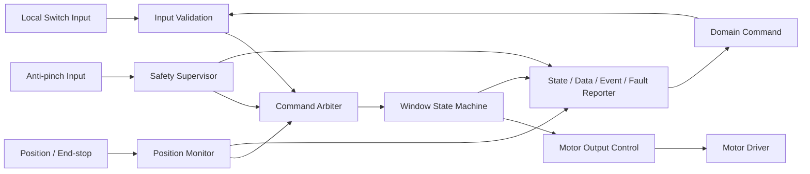
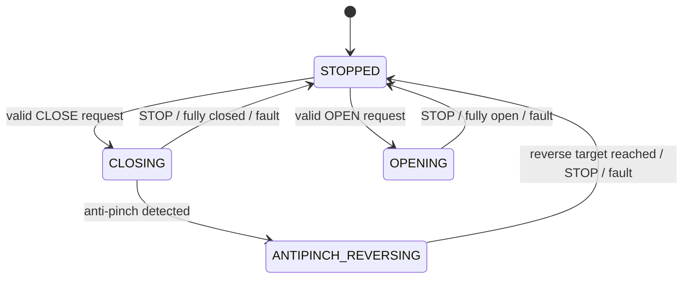

# WINDOW System Requirement Specification (SysRS)

## Dedicated S32K144 Window ECU — Functional Baseline Draft

> 상태: DRAFT / 기능·성능 기준 검토용 
> 대상 시스템: 단일 창문 채널을 제어하는 S32K144 기반 Window ECU 
> 신규 SysRS ID 체계를 사용하며 이전 번호를 승계하지 않는다. 
> `[CANDIDATE]`는 검증 전 후보값 또는 후보 동작을 의미한다. 
> `*(파생)*`은 상위 SR에서 직접 확정되지 않고 안전성·시험성·정합성을 위해 도출한 요구사항이다. 
> 통신 프로토콜, CAN ID, 비트 배치, 전송 주기 및 정확한 타임아웃은 본 문서에서 확정하지 않는다.

---

## 1. 대상과 책임

### 1.1 대상 시스템

본 SysRS는 로컬 창문 스위치와 상위 Domain의 확정 명령을 받아 모터를 제어하고, 위치·상태·이벤트·고장을 제공하는 Window ECU를 대상으로 한다.

단일 채널을 기준으로 정의하며 다중 도어 확장 시 채널별 인스턴스로 적용한다.

### 1.2 Window ECU 책임

- 로컬 스위치 입력의 샘플링과 안정화
- 의미 기반 상위 명령의 유효성·순서·중복 검증
- 열림, 닫힘, 정지 및 목표 위치 이동 실행
- 모터 방향과 구동 출력의 상호 배타 제어
- 위치, 끝단 및 끼임 정보 처리
- 끼임 감지 시 로컬 즉시 정지와 안전 반전
- 상태, 위치, 명령 결과, 이벤트 및 고장 제공
- 통신 상실과 내부 고장 시 안전 상태 전환

### 1.3 책임 밖

- 모바일/HMI 구현과 사용자 인증
- 차량 전체 요청 출처의 권한 및 우선순위 판단
- 자동 환기 조건과 목표 위치 결정
- 네트워크 프레임과 물리 신호 배치
- 모터·기구·센서·드라이버 부품 선정
- 생산 차량의 법규·기구 안전 승인

---

## 2. 논리 구조

Safety Supervisor의 끼임 정지 경로는 상위 Domain 응답에 의존하지 않아야 한다.

---

## 3. 시스템 상태

### 3.1 ECU 상태

| 상태 | 의미 | 모터 출력 원칙 |
|---|---|---|
| `INIT` | 초기화와 입출력 안전 확인 중 | OFF |
| `READY` | 정상 명령 수용 가능 | 명령에 따라 제어 |
| `DEGRADED` | 일부 센서 또는 통신 기능 제한 | 허용된 제한 동작만 수행 |
| `FAULT` | 안전한 이동을 보장할 수 없음 | OFF |

### 3.2 창문 동작 상태

| 상태 | 의미 |
|---|---|
| `STOPPED` | 모터 출력이 해제된 정지 상태 |
| `OPENING` | 열림 방향 이동 중 |
| `CLOSING` | 닫힘 방향 이동 중 |
| `ANTIPINCH_REVERSING` | 끼임 대응 안전 반전 중 |
| `UNKNOWN` | 신뢰할 수 있는 동작 상태를 확정할 수 없음 |

### 3.3 명령 결과 상태

`ACCEPTED`, `IN_PROGRESS`, `DONE`, `REJECTED`, `CANCELLED`, `FAILED`를 구분한다. 각 결과는 원 요청 식별자와 거부·중단·실패 사유를 함께 제공할 수 있어야 한다.

### 3.4 데이터 유효성

위치와 외부 입력의 유효성은 최소 `OK`, `STALE`, `INVALID`, `NO_DATA`를 구분한다.

---

## 4. Functional Requirements

### 4.1 초기화와 기능 허용

| ID | 요구사항 | 근거/비고 |
|---|---|---|
| `WIN-SYS-FUN-001` | ECU는 리셋 후 모든 모터 구동 출력을 비활성 상태로 초기화해야 한다. | 안전 |
| `WIN-SYS-FUN-002` | ECU는 필수 입출력과 내부 상태 초기화가 완료된 후에만 `READY`로 전환해야 한다. | 안전 |
| `WIN-SYS-FUN-003` | ECU는 운전 허용 전원 상태가 아니면 새 이동 명령을 실행하지 않아야 한다. | 상위 SR |
| `WIN-SYS-FUN-004` | ECU는 초기화 실패 시 `FAULT` 또는 정의된 `DEGRADED` 상태로 전환하고 모터 출력을 비활성화해야 한다. | 안전 |

### 4.2 명령 검증과 중재

| ID | 요구사항 | 근거/비고 |
|---|---|---|
| `WIN-SYS-CMD-001` | ECU는 `OPEN`, `CLOSE`, `STOP`, `VENT`, `MOVE_TO_POSITION`으로 정의된 요청만 해석해야 한다. | 의미 기반 인터페이스 |
| `WIN-SYS-CMD-002` | ECU는 요청 종류, 대상 채널, 순서 식별자, 유효성 및 필요한 파라미터를 검증한 후 수용 여부를 결정해야 한다. | 상위 SR |
| `WIN-SYS-CMD-003` | ECU는 만료, 범위 초과, 미정의 또는 불완전 요청을 실행하지 않고 `REJECTED`와 사유를 제공해야 한다. | 상위 SR |
| `WIN-SYS-CMD-004` | ECU는 이미 처리한 동일 순서 식별자의 요청을 재수신해도 이동을 다시 시작하지 않아야 한다. | 중복 내성 |
| `WIN-SYS-CMD-005` | ECU는 `STOP` 요청을 일반 열림·닫힘·목표 위치 요청보다 우선 처리해야 한다. | 상위 SR |
| `WIN-SYS-CMD-006` | ECU는 서로 충돌하는 이동 요청을 동시에 모터 출력으로 적용하지 않아야 한다. | 안전 |
| `WIN-SYS-CMD-007` | ECU는 상위 요청 출처의 차량 수준 권한을 다시 판단하지 않고, Domain이 확정한 요청으로 취급해야 한다. | 책임 경계 |
| `WIN-SYS-CMD-008` | ECU는 새 요청이 현재 동작을 대체할 때 기존 요청 결과를 `CANCELLED` 또는 `FAILED`로 종결하고 사유를 제공해야 한다. | 시험성 |

### 4.3 로컬 스위치와 모터 제어

| ID | 요구사항 | 근거/비고 |
|---|---|---|
| `WIN-SYS-MOT-001` | ECU는 로컬 열림·닫힘·정지 입력을 안정화한 후 명령 중재기에 제공해야 한다. | 상위 SR |
| `WIN-SYS-MOT-002` | ECU는 로컬 스위치 유지 동작에서 스위치 해제 시 모터를 정지해야 한다. | 수동 동작 |
| `WIN-SYS-MOT-003` | ECU는 열림 방향 출력과 닫힘 방향 출력을 동시에 활성화해서는 안 된다. | 안전 |
| `WIN-SYS-MOT-004` | ECU는 방향을 전환하기 전에 현재 방향 출력을 해제하고 구성된 무출력 시간을 적용해야 한다. | 드라이버 보호 |
| `WIN-SYS-MOT-005` | ECU는 완전 열림 상태에서 추가 열림 출력을, 완전 닫힘 상태에서 추가 닫힘 출력을 활성화하지 않아야 한다. | 기구 보호 |
| `WIN-SYS-MOT-006` | ECU는 정지 조건 성립 시 모터 출력 명령을 안전한 비활성 값으로 전환해야 한다. | 상위 SR |
| `WIN-SYS-MOT-007` | ECU는 모터 구동 시작 시 프로젝트가 승인한 출력 프로파일을 사용해야 하며 조정값을 기능 로직과 분리해야 한다. | 유지보수성 |

### 4.4 위치와 목표 이동

| ID | 요구사항 | 근거/비고 |
|---|---|---|
| `WIN-SYS-POS-001` | ECU는 창문 위치를 `0 % = 완전 열림`, `100 % = 완전 닫힘` 기준으로 표현해야 한다. | Domain 인터페이스 가이드 |
| `WIN-SYS-POS-002` | ECU는 위치값과 위치 유효성을 함께 관리하고 제공해야 한다. | 상위 SR |
| `WIN-SYS-POS-003` | ECU는 유효한 위치 정보가 있을 때만 `VENT` 또는 `MOVE_TO_POSITION` 요청을 실행해야 한다. | 안전 |
| `WIN-SYS-POS-004` | ECU는 목표 허용 오차 범위에 도달하면 모터를 정지하고 해당 요청을 `DONE`으로 종결해야 한다. | 시험성 |
| `WIN-SYS-POS-005` | ECU는 위치가 `STALE`, `INVALID` 또는 `NO_DATA`가 되면 위치 기반 자동 이동을 중단해야 한다. | 상위 SR |
| `WIN-SYS-POS-006` | ECU는 위치 센서 고장 중 이전 위치를 현재 정상 위치처럼 보고해서는 안 된다. | 강건성 |

### 4.5 끼임 방지

| ID | 요구사항 | 근거/비고 |
|---|---|---|
| `WIN-SYS-AP-001` | ECU는 닫힘 이동 중 끼임 판단 입력을 주기적으로 감시해야 한다. | 상위 SR |
| `WIN-SYS-AP-002` | ECU는 닫힘 중 유효한 끼임을 감지하면 Domain 명령을 기다리지 않고 닫힘 출력을 해제해야 한다. | 핵심 안전 |
| `WIN-SYS-AP-003` | ECU는 끼임 정지 후 승인된 반전 거리 또는 안전 위치까지 열림 방향으로 이동해야 한다. | `[CANDIDATE]`, 값 TBD |
| `WIN-SYS-AP-004` | ECU는 끼임 처리 중 일반 닫힘 요청을 실행하지 않아야 한다. | 안전 우선순위 |
| `WIN-SYS-AP-005` | ECU는 끼임 발생 시 `WINDOW_ANTIPINCH` 이벤트를 한 번 생성하고 원 닫힘 요청을 `FAILED` 또는 `CANCELLED`로 종결해야 한다. | VSS 의미 정합 |
| `WIN-SYS-AP-006` | ECU는 끼임 센서가 신뢰 불가 상태이면 자동 닫힘과 원터치 닫힘을 금지해야 한다. | 안전 |
| `WIN-SYS-AP-007` | ECU는 끼임 해제 또는 재동작 조건이 확인되기 전까지 닫힘 자동 재개를 금지해야 한다. | 재개 방지 |

### 4.6 상태와 결과 제공

| ID | 요구사항 | 근거/비고 |
|---|---|---|
| `WIN-SYS-STA-001` | ECU는 실제 구동 판단에 따라 `STOPPED`, `OPENING`, `CLOSING`, `ANTIPINCH_REVERSING`, `UNKNOWN` 상태를 제공해야 한다. | 상위 SR |
| `WIN-SYS-STA-002` | ECU는 완전 열림과 완전 닫힘 상태를 위치값과 구분 가능한 상태 데이터로 제공해야 한다. | Domain 가이드 |
| `WIN-SYS-STA-003` | ECU는 각 상위 명령에 대해 처리 결과와 사유를 원 요청 식별자에 연결해 제공해야 한다. | 추적성 |
| `WIN-SYS-STA-004` | ECU는 물리 위치를 확인할 수 없는 경우 명령 완료만으로 목표 위치 도달을 보고해서는 안 된다. | 강건성 |

---

## 5. Semantic Input / Event Requirements

### 5.1 입력 의미

| 구분 | 의미 | 최소 데이터 |
|---|---|---|
| `WINDOW_COMMAND` | Domain이 확정한 창문 요청 | channel, action, target position(선택), source context, sequence, validity/expiry |
| `LOCAL_WINDOW_SWITCH` | 직접 연결된 사용자 조작 | open/close/stop, press state, validity |
| `WINDOW_POSITION_FEEDBACK` | 위치 또는 끝단 정보 | position, fully-open, fully-closed, validity |
| `WINDOW_ANTIPINCH_INPUT` | 끼임 판단 입력 | detected, validity |
| `POWER_OPERATION_STATE` | ECU/액추에이터 동작 허용 정보 | operation allowed, validity |

### 5.2 제공 의미

| 구분 | 의미 | 최소 데이터 |
|---|---|---|
| `WINDOW_STATE` | 실제 판단한 이동 상태 | state, channel, validity, timestamp/age basis |
| `WINDOW_POSITION` | 창문 위치 | 0…100 %, validity |
| `WINDOW_ANTIPINCH` | 끼임 발생 이벤트 | channel, event sequence, occurrence information |
| `WINDOW_COMMAND_RESULT` | 명령 처리 결과 | request sequence, result, reason |
| `WINDOW_FAULT` | 고장 정보 | category, code, active/recovered, validity |

### 5.3 이벤트 처리 요구

| ID | 요구사항 | 근거/비고 |
|---|---|---|
| `WIN-SYS-EVT-001` | ECU는 완전 열림 전이를 `FULLY_OPENED`, 완전 닫힘 전이를 `FULLY_CLOSED`로 식별할 수 있어야 한다. | Domain 가이드 |
| `WIN-SYS-EVT-002` | ECU는 이벤트 재전송이 필요한 경우 동일 이벤트 식별자를 유지해 상위 시스템의 중복 제거를 가능하게 해야 한다. | *(파생)* |
| `WIN-SYS-EVT-003` | ECU는 현재 상태와 일회성 이벤트를 동일 데이터 항목으로 대체해서는 안 된다. | 의미 분리 |

---

## 6. Candidate Execution Behavior

### 6.1 기본 이동

1. ECU가 `READY`이고 이동 허용 조건이 성립한다.
2. 입력 검증기가 요청의 종류, 순서, 유효성과 파라미터를 확인한다.
3. 중재기가 정지·끼임·로컬 입력·상위 요청의 우선순위를 적용한다.
4. 상태 기계가 목표 방향을 결정한다.
5. 반대 방향 출력이 해제되었음을 확인하고 필요한 무출력 시간을 적용한다.
6. 모터 출력을 활성화하고 상태를 갱신한다.
7. 목표, 끝단, 정지, 끼임 또는 고장 조건에서 출력을 해제한다.
8. 명령 결과와 상태·위치·이벤트·고장을 갱신한다.

### 6.2 후보 우선순위

1. 로컬 전기적 보호와 끼임 방지
2. `STOP`
3. 로컬 유지 스위치 입력
4. Domain이 확정한 이동 명령

차량 전체의 HMI·모바일·자동 환기 간 우선순위는 Domain에서 이미 결정된 것으로 본다.

### 6.3 끼임 대응 상태 전이

---

## 7. Performance Requirements

아래 수치는 초기 통합 시험용 후보이며 기구·센서·드라이버 시험과 안전 분석으로 확정해야 한다.

| ID | 요구사항 | 후보값/근거 |
|---|---|---|
| `WIN-SYS-PER-001` | ECU는 정상 전원 인가 후 명령 수용 가능 상태에 도달해야 한다. | `[CANDIDATE]` 1,000 ms 이내, 타 ECU 초기화 기준 정합 |
| `WIN-SYS-PER-002` | ECU는 로컬 스위치 입력을 충분히 빠르게 샘플링해야 한다. | `[CANDIDATE]` 샘플 주기 10 ms 이하 |
| `WIN-SYS-PER-003` | ECU는 로컬 스위치 채터링을 제거해야 한다. | `[CANDIDATE]` 안정화 30 ms |
| `WIN-SYS-PER-004` | ECU는 수용한 일반 이동 명령 후 모터 출력 시작 여부를 결정해야 한다. | `[CANDIDATE]` 200 ms 이내 |
| `WIN-SYS-PER-005` | ECU는 `STOP` 조건 성립 후 모터 출력을 비활성화해야 한다. | `[CANDIDATE]` 100 ms 이내 |
| `WIN-SYS-PER-006` | ECU는 내부에서 유효한 끼임을 판단한 시점부터 닫힘 출력을 비활성화해야 한다. | `[CANDIDATE]` 50 ms 이내, 안전 검증 필요 |
| `WIN-SYS-PER-007` | ECU는 반대 방향 구동 전 무출력 시간을 보장해야 한다. | `[CANDIDATE]` 100 ms 이상, 드라이버 검증 필요 |
| `WIN-SYS-PER-008` | ECU는 내부 상태 변화 후 외부 제공 상태를 갱신해야 한다. | `[CANDIDATE]` 100 ms 이내 |
| `WIN-SYS-PER-009` | ECU는 통신 데이터가 합의된 허용 age 또는 누락 횟수를 초과하면 `STALE`로 판정해야 한다. | 시간값은 네트워크 설계에서 확정 |

---

## 8. External Logical Interface Requirements

### 8.1 필요한 입력

| ID | 요구사항 | 비고 |
|---|---|---|
| `WIN-SYS-INT-001` | Domain은 Window ECU에 원시 HMI 이벤트가 아니라 권한과 차량 정책이 반영된 `WINDOW_COMMAND`를 제공해야 한다. | 책임 경계 |
| `WIN-SYS-INT-002` | `WINDOW_COMMAND`는 최소 대상 채널, 동작, 순서, 유효성을 포함해야 한다. | 목표 위치는 해당 명령에만 필요 |
| `WIN-SYS-INT-003` | 위치 및 끼임 입력은 값과 품질 상태를 함께 제공해야 한다. | 안전 |
| `WIN-SYS-INT-004` | 전원/운전 상태 입력은 이동 허용 여부를 모호하지 않게 제공해야 한다. | 상위 연계 |

### 8.2 제공해야 하는 출력

| ID | 요구사항 | 비고 |
|---|---|---|
| `WIN-SYS-INT-005` | ECU는 `WINDOW_STATE`와 `WINDOW_POSITION`을 독립적으로 제공해야 한다. | State/Data 분리 |
| `WIN-SYS-INT-006` | ECU는 `WINDOW_ANTIPINCH`를 현재 상태와 분리된 이벤트로 제공해야 한다. | VSS 연계 |
| `WIN-SYS-INT-007` | ECU는 `WINDOW_COMMAND_RESULT`를 원 요청 순서와 연결해 제공해야 한다. | 추적성 |
| `WIN-SYS-INT-008` | ECU는 `WINDOW_FAULT`에 최소 고장 범주, 활성 상태 및 복구 상태를 제공해야 한다. | 진단 |

### 8.3 본 문서에서 결정하지 않는 항목

- CAN/LIN/Ethernet 등 전송 매체
- Message ID, Signal ID, byte/bit layout, endianness
- 송신 주기, event-trigger 정책, E2E 보호 방식
- 실제 데이터 타입, scaling, offset, invalid raw value
- 네트워크 수준 timeout과 재전송 횟수

---

## 9. Safety / Priority Requirements

| ID | 요구사항 | 근거/비고 |
|---|---|---|
| `WIN-SYS-SAF-001` | 끼임 방지와 로컬 전기적 보호는 모든 일반 이동 요청보다 우선해야 한다. | 핵심 안전 |
| `WIN-SYS-SAF-002` | ECU는 `FAULT`에서 열림·닫힘 출력을 모두 비활성화해야 한다. | 안전 |
| `WIN-SYS-SAF-003` | 통신 상실로 상위 요청의 유효성을 보장할 수 없으면 진행 중인 상위 이동을 정지해야 한다. | 상위 SR |
| `WIN-SYS-SAF-004` | 통신 또는 전원이 복구되어도 이전 이동 명령을 자동 재개해서는 안 된다. | 재개 방지 |
| `WIN-SYS-SAF-005` | ECU는 위치 또는 끼임 데이터가 신뢰 불가일 때 이를 정상값으로 대체해 자동 닫힘을 계속해서는 안 된다. | 강건성 |
| `WIN-SYS-SAF-006` | 제한 수동 동작을 허용하는 고장 상태와 방향은 안전 분석 결과로 명시적으로 구성해야 한다. | `[CANDIDATE]` 정책 TBD |

---

## 10. Diagnostics

### 10.1 고장 범주

| 범주 | 예시 |
|---|---|
| `MOTOR_DRIVER` | 상반 출력, 드라이버 보호, 구동 실패 |
| `POSITION_SENSOR` | 범위 초과, 변화 없음, 유효성 상실 |
| `ANTIPINCH_SENSOR` | 입력 고정, 범위 오류, 유효성 상실 |
| `COMMUNICATION` | 상위 명령 stale/invalid/no-data |
| `INITIALIZATION` | 필수 초기화 또는 자체 점검 실패 |
| `FUNCTION` | 상태 전이 불일치, 목표 시간 초과 |

### 10.2 진단 요구사항

| ID | 요구사항 | 근거/비고 |
|---|---|---|
| `WIN-SYS-DIA-001` | ECU는 활성 고장과 복구된 고장을 구분할 수 있어야 한다. | 진단성 |
| `WIN-SYS-DIA-002` | ECU는 고장 범주와 세부 코드를 제공해야 한다. | 정비성 |
| `WIN-SYS-DIA-003` | ECU는 고장 발생 시 진행 중 명령의 결과를 일관되게 종결해야 한다. | 추적성 |
| `WIN-SYS-DIA-004` | ECU는 고장 복구만으로 이전 이동을 재개하지 않고 새 유효 요청을 요구해야 한다. | 안전 |
| `WIN-SYS-DIA-005` | ECU는 물리 피드백이 제공되지 않는 구성에서 검출할 수 없는 고장을 검출된 것으로 보고해서는 안 된다. | 진단 한계 명시 |

### 10.3 복구 원칙

- 일시 통신 고장: 새 유효 요청 확인 후 기능 복귀
- 위치 센서 고장: 위치 기반 자동 동작 금지, 제한 수동 동작은 안전 분석 결과에 따름
- 끼임 센서 고장: 자동 닫힘 금지, 복구 조건 확인 필요
- 모터/드라이버 고장: 출력 OFF 유지, 명시적 복구 또는 재초기화 필요

---

## 11. Non-functional Requirements

| ID | 요구사항 | 특성 |
|---|---|---|
| `WIN-SYS-NFR-001` | ECU는 동일 상태와 동일 유효 입력에 대해 결정적인 중재 결과를 제공해야 한다. | Predictability |
| `WIN-SYS-NFR-002` | ECU는 입력 누락, 중복, 범위 초과 및 순서 오류를 안전하게 처리해야 한다. | Robustness |
| `WIN-SYS-NFR-003` | 조정 가능한 시간·위치·출력 파라미터는 소스 로직과 분리하여 관리해야 한다. | Maintainability |
| `WIN-SYS-NFR-004` | 시험 환경에서 명령, 상태, 위치, 이벤트, 고장 및 결과를 관찰할 수 있어야 한다. | Testability |
| `WIN-SYS-NFR-005` | 상태 전이와 명령 중재 로직은 모터 하드웨어 없이도 단위 시험할 수 있어야 한다. | Testability, *(파생)* |
| `WIN-SYS-NFR-006` | 다중 채널 확장 시 채널 간 상태와 고장 데이터가 혼동되지 않아야 한다. | Scalability, *(파생)* |

---

## 12. Candidate Acceptance Criteria

| 시나리오 | 사전 조건 | 자극 | 기대 결과 |
|---|---|---|---|
| 정상 열림 | `READY`, 중간 위치 | 유효 `OPEN` | `OPENING`, 열림 출력, 완전 열림에서 정지 및 `DONE` |
| 정상 닫힘 | `READY`, 중간 위치, 끼임 정상 | 유효 `CLOSE` | `CLOSING`, 닫힘 출력, 완전 닫힘에서 정지 및 `DONE` |
| 정지 우선 | 이동 중 | `STOP` | 후보 시간 내 출력 OFF, `STOPPED`, 기존 명령 종결 |
| 방향 전환 | `OPENING` | 유효 `CLOSE` | 열림 출력 OFF, 무출력 시간 후 닫힘 출력 |
| 끼임 방지 | `CLOSING` | 유효 끼임 입력 | 후보 시간 내 닫힘 OFF, 안전 반전, `WINDOW_ANTIPINCH` 1회 |
| 위치 불신 | 목표 위치 이동 중 | 위치 `INVALID` | 이동 중단, 결과 실패/취소, 위치 정상값 미보고 |
| 중복 명령 | 명령 처리 중 | 동일 sequence 재수신 | 추가 이동 시작이나 출력 펄스 없음 |
| 통신 상실 | 상위 명령으로 이동 중 | 허용 age 초과 | 이동 정지, 통신 고장, 복구 후 자동 재개 없음 |
| 초기화 실패 | 부팅 중 | 필수 초기화 실패 | 출력 OFF, `FAULT` 또는 정의된 `DEGRADED` |

---

## 13. Candidate Parameter Summary

| 파라미터 | 후보값 | 근거 | 확정에 필요한 검증 |
|---|---:|---|---|
| `T_WIN_INIT_MAX` | 1,000 ms | 타 ECU 기준 정합 | 부팅·초기화 측정 |
| `T_WIN_SWITCH_SAMPLE_MAX` | 10 ms | 사용자 입력 응답성 | 스위치/태스크 부하 시험 |
| `T_WIN_SWITCH_DEBOUNCE` | 30 ms | 일반 기계식 스위치 후보 | 실제 스위치 파형 측정 |
| `T_WIN_CMD_START_MAX` | 200 ms | 사용자 인지 응답 후보 | HIL/실기 응답 측정 |
| `T_WIN_STOP_MAX` | 100 ms | 안전 정지 후보 | 드라이버 출력 측정 |
| `T_WIN_AP_OUTPUT_OFF_MAX` | 50 ms | 끼임 대응 후보 | 센서·기구 포함 안전 시험 |
| `T_WIN_DIRECTION_DEADTIME_MIN` | 100 ms | 드라이버 보호 후보 | 모터/드라이버 검증 |
| `T_WIN_STATE_UPDATE_MAX` | 100 ms | 상위 상태 동기화 후보 | 통합 통신 시험 |
| `D_WIN_START` | 40 % | 기존 저전압 데모 제안값 | 모터 기동 시험 |
| `POS_OPEN` | 0 % | Domain 인터페이스 정의 | 인터페이스 합의 |
| `POS_CLOSED` | 100 % | Domain 인터페이스 정의 | 인터페이스 합의 |
| `POS_VENT` | TBD | 자동 환기 정책 필요 | Domain/UX 합의 |
| `AP_REVERSE_TARGET` | TBD | 기구·법규·안전 분석 필요 | 실기 안전 검증 |
| `WIN_COMM_MAX_AGE` | TBD | 네트워크 주기 미확정 | Logical Interface 합의 |

모터 PWM 주파수, 최대 duty, 전류 제한 및 위치 허용 오차는 드라이버·모터·기구 선정 후 Element/SW/HW 요구사항에서 확정한다.

---

## 14. TBD

### 14.1 상위/Domain 결정 필요

- HMI·모바일·자동 환기 간 차량 수준 우선순위
- 원격 창문 제어 권한, 인증 및 차량 조건
- 자동 환기 목표 위치와 취소 조건
- 전원 상태별 창문 허용 정책
- 끼임 이후 사용자 재시도 정책

### 14.2 Interface/Network 결정 필요

- Window 명령·상태·이벤트·고장 데이터 계약
- 전송 매체, 메시지/신호 ID, scaling과 invalid 값
- 주기, 최대 age, timeout, alive counter와 E2E 보호
- 명령 sequence와 이벤트 중복 제거 규칙

### 14.3 Element/SW/HW 결정 필요

- 위치 센서와 끼임 센서 방식 및 진단 범위
- 모터와 H-bridge 사양, PWM, 전류·온도 보호
- 끝단 검출, soft-stop 및 캘리브레이션 절차
- 끼임 임계값, 정지 시간, 반전 거리와 허용 반복 횟수
- 고장 상태에서 제한 수동 이동 허용 여부
- 다중 도어 채널 수와 ECU 물리 배치

---

## 15. Baseline Scope

본 Functional Baseline은 다음을 고정한다.

- Window ECU는 로컬 스위치와 확정된 Domain 명령을 실행한다.
- 모터 방향 상호 배타, 끝단 정지 및 끼임 로컬 대응을 제공한다.
- 위치는 `0 % = 완전 열림`, `100 % = 완전 닫힘` 의미를 사용한다.
- Request/Command, State, Event, Fault, Data 및 Command Result를 분리한다.
- `WINDOW_ANTIPINCH` 이벤트를 VSS/Domain 연계 의미로 제공한다.
- 네트워크 상세, 기구·부품 수치와 양산 안전 수치는 후속 기준에서 확정한다.
