# 통합 차량 제어 시스템 요구사항 명세 (SysRS)

<a id="sys-status"></a>
## 0. 상태와 읽는 방법

버전 v0.2 · 2026-09-16 · 5C 대조 완료 · 미결 포함 통합 검토 초안 · 기준 커밋 `1b1c4b834e4ac692f8e3eaf3e2680e4a530a2072`

이 문서는 6개 영역의 SysRS, 논리 인터페이스, VSS ECU 인터페이스와 추적 자료를 하나로 모은 검토 초안이다. 원본 요구 정의 487개를 유지했다. 동작·수치·책임의 충돌은 원문과 검토 제안을 함께 표시했으며, 통합 자체가 정책 승인이나 구현 검증을 뜻하지 않는다.

**읽기 순서:** §1~3의 경계를 확인한 뒤 담당 영역 §4~9를 읽는다. 본문의 통합 검토 링크는 §11의 근거·수정 방향으로 이동한다. 부록 B/C는 인터페이스 상세, D는 원본 추적과 재검토, E는 후속 보안 후보이다.

5C에서 원문 29개 반영, 기존 정의 보존, 현재 추적과 두 문서의 링크를 대조했다. 추적의 부분 대응·불일치·조건과 파생 근거 공백은 미결로 남아 있으며 모든 요구 충족을 선언하지 않는다. 함께 읽을 문서: [통합 SR](SR.md). 원본과 GitHub는 변경하지 않았다.

| 찾아보기 | 내용 |
|---|---|
| [대상·할당](#sys-allocation) | 논리 책임과 물리 배치 |
| [용어·품질](#sys-semantics) | 공통 의미와 기능별 차이 |
| [중앙 책임](#sys-central) | 기존 근거와 미정 정책 |
| [BCM](#sys-bcm) | §4 · 기존 ID 유지 |
| [CIS](#sys-cis) | §5 · 기존 ID 유지 |
| [MOBILE](#sys-mobile) | §6 · 기존 ID 유지 |
| [VSS](#sys-vss) | §7 · 기존 ID 유지 |
| [WINDOW](#sys-window) | §8 · 기존 ID 유지 |
| [EXTERIOR_LIGHT](#sys-exterior-light) | §9 · 기존 ID 유지 |
| [계약 요약](#sys-contracts) | 24개 논리 연결 |
| [미결·수정 제안](#sys-open) | X01~X18 및 A/B/C 상세 60건 |
| [출처](#sys-provenance) | 반영 위치와 편집 범위 |
| [논리 인터페이스](#appendix-b) | 원문 03 문서 4개 |
| [ECU 인터페이스](#appendix-c) | VSS 원문 05 |
| [추적](#trace-current) | 현재 265항목·487개 역방향 탐색·원본 이력 |
| [원문 관리 메모](#source-metadata) | README 7개·최상위 SR 시작 틀 |
| [후속 확장](#appendix-e) | SEC-FUTURE 6개 |

<a id="sys-allocation"></a>
## 1. 대상과 할당

아래는 원문에 적힌 대상의 요약이다. 하드웨어 구성과 물리 통신 경로의 확정 수준은 영역 원문과 미결 사항을 따른다. 중앙과 VSS가 같은 보드인지 별도 보드인지 이 표만으로 결정하지 않는다.

| 영역 | 원문 대상 | 기존 요구 정의 |
|---|---|---:|
| BCM | 전용 S32K144 ECU | 87 |
| CIS | 전용 처리 보드 | 60 |
| MOBILE | Android 애플리케이션 | 95 |
| VSS | 전용 S32K344 ECU | 114 |
| WINDOW | 전용 S32K144 Window ECU | 73 |
| EXTERIOR_LIGHT | S32K144 기능 요소 후보, 실제 배치 미정 | 58 |
| 합계 | 후속 보안 후보 제외 | 487 |

<a id="sys-semantics"></a>
## 2. 용어·결과·품질 정보

Request/Command, State, Event, Fault, Data는 서로 다른 의미다. 공통 요약은 각 노드의 enum을 하나로 바꾸거나 동일 이름의 상태에 같은 전이를 강제하지 않는다. `확정된 명령`은 상위가 선택한 실행 의도이며 문서 전체가 승인됐다는 뜻이 아니다.

| 구분 | 해석 |
|---|---|
| 결과 / 상태 / 발생 | 특정 요청 결과, 현재 관측·서비스 상태, 한 번의 발생을 구분 |
| DONE | 요청별로 정의한 목표 충족; 설정 저장·무구동 목표 충족·물리 확인은 같은 기준이 아님 |
| UNKNOWN / FAILED | 소비자가 결과를 모름 / 실행 실패 판단을 구분 |
| 유효성 / 신선도 / 인증 | 의미 사용 가능, 원본·수신 나이, 출처·권한을 구분 |
| 원문 CANDIDATE / 확정됨 | 원문 상태를 보존하되 상충 표기는 확인 필요; 이번 통합에서 승인하지 않음 |
| COVERED | 기존 추적표에서 연결이 존재한다는 판정; 시험 통과나 종단 충족이 아님 |
| DEFERRED | 현재 구현 의무에 포함하지 않는 후속 후보 |

통신 상실 시 BCM 유지, WINDOW 상위 이동 정지, 조명 채널별 fallback, VSS 불신 입력 정책은 기능별로 보존한다. 하나의 공통 OFF 규칙으로 대체하지 않는다. VSS 영문 명칭은 원문별 차이가 있어 추가 설명에는 약어를 사용한다.

<a id="sys-central"></a>
## 3. 중앙 책임과 연결 후보

중앙은 차량 수준 요청·상태·허용 조건·중재를 바탕으로 실행 명령을 만드는 경계로 정리한다. 이 설명은 기존 문서들의 책임을 연결한 것이며 신규 중앙 요구의 승인본이 아니다. BCM의 로컬 보호, WINDOW의 끼임 즉시 반응, CIS의 관측·의미 판단, VSS의 음향 중재를 중앙 정책으로 덮어쓰지 않는다.

| 연결 과제 | 현행 근거/위치 | 미정 사항 |
|---|---|---|
| 도어·인증 | MOBILE 요청/권한, BCM 실행 | 권한 판정·명령 식별 수명·도어 음향 발생: X02·X03 |
| 공조 | MOBILE 설정과 BCM 03 제안 정책 | 자동·수동·선행 중재·시간·종료: X04 |
| 조명 | BCM 실행과 MOBILE 설정, 외부 조명 정책 경계 | 설정 소유·색상·외부 조도·배치: X06·X12 |
| 위험 경고 | CIS 관측·WINDOW 발생과 VSS 지속 상태 | 잔류/끼임 ACTIVE·CLEAR 판단: X09·X10 |

기존 원문 없는 중앙 명령·시간·우선순위를 신규 정식 ID로 생성하지 않았다. 아래 원문 제안 정책은 후보 상태를 유지한다. X01~X18과 상세 검토의 수정 방향을 팀 결정 후 구체화한다.


<a id="sys-bcm"></a>
## 4. BCM SysRS

출처: [BCM/02_BCM_SYSRS_FUNCTIONAL_BASELINE_DRAFT.md](https://github.com/vehicle-domain-control-system/integrated-vehicle-control/blob/1b1c4b834e4ac692f8e3eaf3e2680e4a530a2072/docs/requirements/BCM/02_BCM_SYSRS_FUNCTIONAL_BASELINE_DRAFT.md)

관련 SR: [영역 본문](SR.md#sr-bcm) · 기존 정의 ID 87개. 아래 원문 요구와 검토 주석을 구분한다.


<a id="sys-bcm-header"></a>
> 원문 구간: [BCM/02_BCM_SYSRS_FUNCTIONAL_BASELINE_DRAFT.md L1–12](https://github.com/vehicle-domain-control-system/integrated-vehicle-control/blob/1b1c4b834e4ac692f8e3eaf3e2680e4a530a2072/docs/requirements/BCM/02_BCM_SYSRS_FUNCTIONAL_BASELINE_DRAFT.md#L1-L12)

> 원문 제목: BCM System Requirement Specification (SysRS)
#### Dedicated S32K144 ECU — Functional Baseline Draft

> 상태: DRAFT / 기능·성능 기준 검토용  
> 대상 시스템: **BCM 전용 S32K144 ECU 1대**  
> 신규 SysRS ID 체계를 사용하며 이전 번호를 승계하지 않는다.  
> `[CANDIDATE]`는 초기 개발 및 벤치 검증을 위한 임시값이다.  
> 통신 프로토콜, 메시지 ID, 신호 배치, 송신 주기 및 버스 파라미터는 본 단계에서 확정하지 않는다.  
> *(파생)* 은 상위 SR이 명시하지 않았으나 SR을 만족시키기 위해 필요하여 신설한 요구사항이다.

---


<a id="sys-bcm-s01"></a>
> 원문 구간: [BCM/02_BCM_SYSRS_FUNCTIONAL_BASELINE_DRAFT.md L13–39](https://github.com/vehicle-domain-control-system/integrated-vehicle-control/blob/1b1c4b834e4ac692f8e3eaf3e2680e4a530a2072/docs/requirements/BCM/02_BCM_SYSRS_FUNCTIONAL_BASELINE_DRAFT.md#L13-L39)

### 4.1 대상 시스템과 책임

본 SysRS의 대상은 독립된 물리 S32K144 보드 1대로 구성되는 BCM ECU이다.

BCM ECU의 책임은 다음과 같다.

- 확정된 동작 명령의 수용 및 유효성 확인
- 명령에 대응하는 액추에이터 구동
- 액추에이터 실제 동작 상태의 측정
- 지시 동작과 실제 동작의 대조
- 직접 측정하는 정보에 근거한 자체 안전 차단
- 구동 결과, 기능별 상태 및 오류 제공

BCM ECU의 책임이 아닌 항목은 다음과 같다.

- 동작 수준 및 알림 종류의 결정
- 자동 기능의 시작 및 종료 판단
- 공조 자원 사용 권한의 중재
- 윈도우 구동
- 사용자 화면 표시 및 사용자 입력 수집

BCM ECU는 센싱 값을 수신하지 않는다. 센싱 값의 측정, 유효성 판정 및 그에 근거한 동작 결정은 모두 상위 판단 기능의 범위이다.

상위 기능이 동작을 결정할 때 적용해야 할 판단 기준은 `03_BCM_LOGICAL_INTERFACE_NEEDS_DRAFT` 에 정의한다.

---


<a id="sys-bcm-s02"></a>
> 원문 구간: [BCM/02_BCM_SYSRS_FUNCTIONAL_BASELINE_DRAFT.md L40–56](https://github.com/vehicle-domain-control-system/integrated-vehicle-control/blob/1b1c4b834e4ac692f8e3eaf3e2680e4a530a2072/docs/requirements/BCM/02_BCM_SYSRS_FUNCTIONAL_BASELINE_DRAFT.md#L40-L56)

### 4.2 논리 시스템 구조

BCM ECU의 내부 처리는 다음 순서로 구성된다.

```
명령 수용  →  유효성 평가  →  액추에이터 구동  →  실제 동작 측정  →  지시-실제 대조  →  결과 제공
                                    ▲
                              자체 안전 차단
                        (직접 측정 정보 · 소프트웨어 독립)
```

세 기능은 서로 독립된 상태와 오류를 가지며, 하나의 기능 처리가 다른 기능의 주기 처리를 차단하지 않아야 한다.

자체 안전 차단 경로는 명령 처리 경로와 분리되며, 소프트웨어 동작 상태와 무관하게 액추에이터 출력을 차단할 수 있어야 한다.

---


<a id="sys-bcm-s03"></a>
> 원문 구간: [BCM/02_BCM_SYSRS_FUNCTIONAL_BASELINE_DRAFT.md L57–77](https://github.com/vehicle-domain-control-system/integrated-vehicle-control/blob/1b1c4b834e4ac692f8e3eaf3e2680e4a530a2072/docs/requirements/BCM/02_BCM_SYSRS_FUNCTIONAL_BASELINE_DRAFT.md#L57-L77)

### 4.3 시스템 상태

| 상태 구분 | 값 |
|---|---|
| ECU 동작 상태 | `INIT` / `READY` / `DEGRADED` / `FAULT` |
| 도어 잠금 상태 | `LOCKED` / `UNLOCKED` / `UNKNOWN` |
| 도어 개폐 상태 | `CLOSED` / `OPEN` / `UNKNOWN` |
| 도어 종합 상태 | `NORMAL` / `INCONSISTENT` / `UNTRUSTED` |
| 명령 처리 결과 | `ACCEPTED` / `IN_PROGRESS` / `DONE` / `REJECTED` / `FAILED` |
| Fan 출력 수준 | `OFF` / `LOW` / `MEDIUM` / `HIGH` |
| 온도 장치 방향 | `COOL` / `HEAT` / `IDLE` |
| 조명 알림 종류 | `NORMAL` / `GOODBYE` / `ACCESS` / `WARNING` / `FAULT` / `EMERGENCY` |
| 명령 유효 상태 | `OK` / `STALE` / `INVALID` / `NO_DATA` |
| 오류 분류 | `SENSOR` / `COMM` / `FUNCTION` |

`DEGRADED`는 일부 기능이 정지하였으나 나머지 기능이 안전하게 수행 가능한 상태를 의미한다.

Fan 출력 수준, 온도 장치 방향 및 조명 알림 종류는 **수신한 명령을 보관하기 위한 상태**이며, BCM이 산출하는 값이 아니다.

---


<a id="sys-bcm-s04"></a>
> 원문 구간: [BCM/02_BCM_SYSRS_FUNCTIONAL_BASELINE_DRAFT.md L78–132](https://github.com/vehicle-domain-control-system/integrated-vehicle-control/blob/1b1c4b834e4ac692f8e3eaf3e2680e4a530a2072/docs/requirements/BCM/02_BCM_SYSRS_FUNCTIONAL_BASELINE_DRAFT.md#L78-L132)

> **통합 검토:** [A01](#review-a01), [A02](#review-a02), [A03](#review-a03), [A19](#review-a19) — 원문과 제안을 함께 읽는다. 정책·수치·안전 동작을 자동 확정하지 않았다.

### 4.4 Functional Requirements

#### 4.4.1 명령 수용 및 해석

| ID | Requirement |
|---|---|
| <a id="bcm-sys-cmd-001"></a>BCM-SYS-CMD-001 | BCM ECU는 정의된 명령 집합에 속하는 명령만 수용해야 한다. |
| <a id="bcm-sys-cmd-002"></a>BCM-SYS-CMD-002 | 정의되지 않은 값 또는 범위를 벗어난 값을 포함한 명령을 실행하지 않아야 한다. |
| <a id="bcm-sys-cmd-003"></a>BCM-SYS-CMD-003 | 중복 수신되거나 역순으로 수신된 명령을 재실행하지 않아야 한다. *(파생)* |
| <a id="bcm-sys-cmd-004"></a>BCM-SYS-CMD-004 | 명령의 유효 상태가 `OK`가 아닌 경우 해당 명령을 실행하지 않아야 한다. |
| <a id="bcm-sys-cmd-005"></a>BCM-SYS-CMD-005 | 명령을 수용한 경우와 거부한 경우를 구분하여 결과와 사유를 제공해야 한다. |
| <a id="bcm-sys-cmd-006"></a>BCM-SYS-CMD-006 | 수신한 명령의 수준 및 방향을 액추에이터 구동량으로 변환해야 한다. *(파생)* |

#### 4.4.2 도어 잠금 실행

| ID | Requirement |
|---|---|
| <a id="bcm-sys-dl-001"></a>BCM-SYS-DL-001 | 수용된 도어 제어 명령만 액추에이터에 반영해야 한다. |
| <a id="bcm-sys-dl-002"></a>BCM-SYS-DL-002 | 도어 종합 상태가 `NORMAL`이고 목표 잠금 상태가 현재 잠금 상태와 동일한 경우 액추에이터를 구동하지 않고 완료로 처리해야 한다. |
| <a id="bcm-sys-dl-003"></a>BCM-SYS-DL-003 | 도어 잠금 상태와 개폐 상태는 각각 독립된 입력으로부터 취득되어야 한다. |
| <a id="bcm-sys-dl-004"></a>BCM-SYS-DL-004 | 접점 입력의 상태 변화는 정의된 안정화 시간 동안 유지된 경우에만 확정되어야 한다. *(파생)* |
| <a id="bcm-sys-dl-005"></a>BCM-SYS-DL-005 | 잠금 상태와 개폐 상태의 조합이 정의된 정상 조합에 속하지 않는 경우 `INCONSISTENT`로 관리해야 한다. |
| <a id="bcm-sys-dl-006"></a>BCM-SYS-DL-006 | `INCONSISTENT` 또는 `UNTRUSTED` 상태를 임의의 정상 상태로 치환하여 제공하지 않아야 한다. |
| <a id="bcm-sys-dl-007"></a>BCM-SYS-DL-007 | 도어 구동 후 정의된 확인 제한시간 이내에 목표 상태 도달을 측정으로 확인한 경우에만 정상 완료로 처리해야 한다. |
| <a id="bcm-sys-dl-008"></a>BCM-SYS-DL-008 | 목표 상태 도달이 확인되지 않은 경우 정의된 횟수만큼 재시도한 후 실패 결과와 사유를 제공해야 한다. |
| <a id="bcm-sys-dl-009"></a>BCM-SYS-DL-009 | 도어 잠금 상태, 개폐 상태 및 종합 상태를 유효 상태와 함께 제공해야 한다. |

#### 4.4.3 실내 환경 실행

| ID | Requirement |
|---|---|
| <a id="bcm-sys-cl-001"></a>BCM-SYS-CL-001 | 수용된 Fan 출력 수준을 실제 구동에 반영해야 한다. |
| <a id="bcm-sys-cl-002"></a>BCM-SYS-CL-002 | 실제 Fan 동작 상태를 물리적 측정으로 취득하고 정의된 수준으로 분류해야 한다. |
| <a id="bcm-sys-cl-003"></a>BCM-SYS-CL-003 | 지시 수준과 측정 상태의 불일치가 정의된 허용 시간을 초과하는 경우 오류로 처리해야 한다. |
| <a id="bcm-sys-cl-004"></a>BCM-SYS-CL-004 | 측정값을 정의된 시간 이상 취득할 수 없는 경우 해당 동작 상태를 `UNKNOWN`으로 관리해야 한다. |
| <a id="bcm-sys-cl-005"></a>BCM-SYS-CL-005 | 수용된 온도 장치의 동작 방향과 출력 수준을 실제 구동에 반영해야 한다. |
| <a id="bcm-sys-cl-006"></a>BCM-SYS-CL-006 | 온도 장치의 동작 방향 전환 시 출력을 정지한 후 반대 방향 구동을 시작해야 한다. |
| <a id="bcm-sys-cl-007"></a>BCM-SYS-CL-007 | 온도 장치의 열 제거 수단 온도를 측정하고 유효 상태와 함께 관리해야 한다. |
| <a id="bcm-sys-cl-008"></a>BCM-SYS-CL-008 | Fan 지시 출력 수준, 측정 수준, 온도 장치 방향 및 출력 수준을 제공해야 한다. |

#### 4.4.4 실내 조명 실행

조명 출력 오류의 검출 범위는 **출력 지시의 적용 실패로 한정**한다. 조명 소자의 단선 및 단락 등 물리적 이상은 출력 전류 측정 수단이 없으므로 검출 대상에서 제외한다.

| ID | Requirement |
|---|---|
| <a id="bcm-sys-al-001"></a>BCM-SYS-AL-001 | 수용된 조명 알림 지시를 실제 출력에 반영해야 한다. |
| <a id="bcm-sys-al-002"></a>BCM-SYS-AL-002 | 조명 출력은 지시된 알림 종류와 출력 수준을 모두 반영해야 한다. |
| <a id="bcm-sys-al-003"></a>BCM-SYS-AL-003 | 정의되지 않은 알림 종류를 수신한 경우 직전 출력을 유지하고 오류로 처리해야 한다. *(파생)* |
| <a id="bcm-sys-al-004"></a>BCM-SYS-AL-004 | 현재 적용 중인 알림 종류와 출력 수준을 제공해야 한다. |
| <a id="bcm-sys-al-005"></a>BCM-SYS-AL-005 | 조명 출력 지시가 지시된 대로 적용되지 않은 경우 해당 출력을 정상 동작 상태로 처리하지 않아야 한다. |
| <a id="bcm-sys-al-006"></a>BCM-SYS-AL-006 | 조명 관련 오류는 조명 출력 이외의 경로로 제공해야 한다. |

---


<a id="sys-bcm-s05"></a>
> 원문 구간: [BCM/02_BCM_SYSRS_FUNCTIONAL_BASELINE_DRAFT.md L133–153](https://github.com/vehicle-domain-control-system/integrated-vehicle-control/blob/1b1c4b834e4ac692f8e3eaf3e2680e4a530a2072/docs/requirements/BCM/02_BCM_SYSRS_FUNCTIONAL_BASELINE_DRAFT.md#L133-L153)

### 4.5 Semantic Input Requirements

BCM ECU는 이미 결정된 명령을 받아 실행하며 판단에 필요한 원시 정보를 받지 않는다.

| ID | Requirement |
|---|---|
| <a id="bcm-sys-sem-001"></a>BCM-SYS-SEM-001 | 동작 명령은 BCM이 추가 판단 없이 구동으로 변환할 수 있는 형태로 제공받아야 한다. |
| <a id="bcm-sys-sem-002"></a>BCM-SYS-SEM-002 | 명령에는 중복 및 순서를 식별할 수 있는 값이 포함되어야 한다. *(파생)* |
| <a id="bcm-sys-sem-003"></a>BCM-SYS-SEM-003 | 명령의 값과 유효 상태를 분리하지 않고 함께 관리해야 한다. |
| <a id="bcm-sys-sem-004"></a>BCM-SYS-SEM-004 | 유효 상태는 사용 시점에 평가해야 하며 수신 시점의 평가 결과를 그대로 사용하지 않아야 한다. |
| <a id="bcm-sys-sem-005"></a>BCM-SYS-SEM-005 | 수신한 명령 및 상태 정보를 다른 기능으로 전달하는 중계 기능을 수행하지 않아야 한다. *(파생)* |
| <a id="bcm-sys-sem-006"></a>BCM-SYS-SEM-006 | 외부에서 액추에이터의 구동량 또는 구동 시간을 직접 지정하는 명령을 수용하지 않아야 한다. *(파생)* |

#### 4.5.1 유효 상태의 평가 시점

명령의 유효 상태는 **명령을 실행하는 시점에 평가**되어야 한다.

수신 시점에 판정한 결과를 저장하여 사용하면 신호의 나이가 갱신되지 않으므로 `STALE`을 검출할 수 없다.

---


<a id="sys-bcm-s06"></a>
> 원문 구간: [BCM/02_BCM_SYSRS_FUNCTIONAL_BASELINE_DRAFT.md L154–222](https://github.com/vehicle-domain-control-system/integrated-vehicle-control/blob/1b1c4b834e4ac692f8e3eaf3e2680e4a530a2072/docs/requirements/BCM/02_BCM_SYSRS_FUNCTIONAL_BASELINE_DRAFT.md#L154-L222)

> **통합 검토:** [A02](#review-a02) — 원문과 제안을 함께 읽는다. 정책·수치·안전 동작을 자동 확정하지 않았다.

### 4.6 Candidate Execution Behavior

#### 4.6.1 도어 상태 조합

| 잠금 \ 개폐 | `CLOSED` | `OPEN` | `UNKNOWN` |
|---|---|---|---|
| `LOCKED` | 정상 | **`INCONSISTENT`** | `UNTRUSTED` |
| `UNLOCKED` | 정상 | 정상 | `UNTRUSTED` |
| `UNKNOWN` | `UNTRUSTED` | `UNTRUSTED` | `UNTRUSTED` |

`LOCKED`와 `OPEN`의 동시 확인은 물리적으로 성립하지 않는다.

#### 4.6.2 도어 제어 시퀀스

```
IDLE
 │ 명령 수용
 ▼
VALIDATE    명령 유효성 미확보         →  거부
            개폐 != CLOSED (잠금 시)   →  거부   ※ 자체 안전 · 최우선
            종합 상태 == NORMAL 이고
              목표 == 현재            →  구동 없이 완료
 │
 ▼
DRIVING     방향 구동 · 안전 차단 타이머 기동
 │
 ▼
CONFIRM     접점 확인 (확인 제한시간)
            도달   →  정상 완료
            미도달  →  재시도  →  실패 + 사유
```

거부 사유 후보: `DOOR_OPEN` / `STATE_UNTRUSTED` / `CMD_INVALID` / `ALREADY_AT_TARGET`

실패 사유 후보: `NO_FEEDBACK` / `DRIVE_LIMIT_EXCEEDED`

#### 4.6.3 Fan 동작 측정 및 대조

수신한 지시 수준과 측정으로 분류한 실제 수준을 대조한다. 기동 및 감속 과도 구간을 포함하기 위해 허용 시간을 둔다.

```
지시 수준  ──▶ 구동
                │
실제 회전수 ──▶ 수준 분류 ──▶ 대조 ──▶ 허용 시간 초과 불일치 시 오류
```

#### 4.6.4 온도 장치 방향 전환

```
COOL 구동 중 ── HEAT 지시 수신 ──▶ 출력 0 % ──▶ 전환 지연 ──▶ HEAT 구동
```

방향을 즉시 반전시키면 구동 회로와 소자에 과도 응력이 발생한다.

#### 4.6.5 과열 보호

```
정상 ── 열 제거 수단 온도 > 차단 임계값 ──▶ 차단
                                            │
                          온도 <= 복귀 임계값 │
                          그리고 새로운 명령 수신 │
                                            ▼
                                          정상
```

차단 상태에서는 온도 장치 출력을 정지하고 `FUNCTION` 오류를 제공한다. **복귀는 온도 조건만으로 이루어지지 않으며, 새로운 동작 명령을 수신한 경우에만 구동을 재개한다.**

---


<a id="sys-bcm-s07"></a>
> 원문 구간: [BCM/02_BCM_SYSRS_FUNCTIONAL_BASELINE_DRAFT.md L223–235](https://github.com/vehicle-domain-control-system/integrated-vehicle-control/blob/1b1c4b834e4ac692f8e3eaf3e2680e4a530a2072/docs/requirements/BCM/02_BCM_SYSRS_FUNCTIONAL_BASELINE_DRAFT.md#L223-L235)

> **통합 검토:** [A06](#review-a06) — 원문과 제안을 함께 읽는다. 정책·수치·안전 동작을 자동 확정하지 않았다.

### 4.7 Performance Requirements

| ID | Requirement |
|---|---|
| <a id="bcm-sys-perf-001"></a>BCM-SYS-PERF-001 | 전원 인가 후 정의된 시간 이내에 `READY` 또는 `FAULT`가 확정되어야 한다. |
| <a id="bcm-sys-perf-002"></a>BCM-SYS-PERF-002 | 명령 수용 후 정의된 시간 이내에 구동이 시작되어야 한다. |
| <a id="bcm-sys-perf-003"></a>BCM-SYS-PERF-003 | 도어 구동 종료 후 정의된 확인 제한시간 이내에 결과가 확정되어야 한다. |
| <a id="bcm-sys-perf-004"></a>BCM-SYS-PERF-004 | 조명 알림 지시 수용 후 정의된 시간 이내에 출력이 전환되어야 한다. |
| <a id="bcm-sys-perf-005"></a>BCM-SYS-PERF-005 | 열 제거 수단의 온도 감시 주기는 온도 장치 제어 주기보다 짧아야 한다. |
| <a id="bcm-sys-perf-006"></a>BCM-SYS-PERF-006 | 정의된 연속 미수신 허용 횟수를 초과하여 동작 명령을 수신하지 못한 경우 `COMM` 오류로 판단해야 한다. *(파생)* |

---


<a id="sys-bcm-s08"></a>
> 원문 구간: [BCM/02_BCM_SYSRS_FUNCTIONAL_BASELINE_DRAFT.md L236–291](https://github.com/vehicle-domain-control-system/integrated-vehicle-control/blob/1b1c4b834e4ac692f8e3eaf3e2680e4a530a2072/docs/requirements/BCM/02_BCM_SYSRS_FUNCTIONAL_BASELINE_DRAFT.md#L236-L291)

### 4.8 External Logical Interface Requirements

본 절은 통신 프로토콜을 정의하지 않는다.
후속 인터페이스 설계에서 필요한 정보 항목을 누락하지 않기 위한 논리 계약만 정의한다.

정보의 의미와 판단 기준은 `03_BCM_LOGICAL_INTERFACE_NEEDS_DRAFT` 에서 정의한다.

#### 4.8.1 BCM이 외부에서 필요로 하는 정보

| ID | Requirement |
|---|---|
| <a id="bcm-sys-int-001"></a>BCM-SYS-INT-001 | 도어 제어 명령을 목표 잠금 상태가 구분 가능한 형태로 제공받아야 한다. |
| <a id="bcm-sys-int-002"></a>BCM-SYS-INT-002 | Fan 지시 출력 수준을 정의된 수준 집합으로 제공받아야 한다. |
| <a id="bcm-sys-int-003"></a>BCM-SYS-INT-003 | 온도 장치 지시를 동작 방향과 출력 수준이 구분 가능한 형태로 제공받아야 한다. |
| <a id="bcm-sys-int-004"></a>BCM-SYS-INT-004 | 조명 알림 지시를 알림 종류와 출력 수준이 구분 가능한 형태로 제공받아야 한다. |
| <a id="bcm-sys-int-005"></a>BCM-SYS-INT-005 | 모든 명령에 중복 및 순서를 식별할 수 있는 값을 포함하여 제공받아야 한다. |
| <a id="bcm-sys-int-006"></a>BCM-SYS-INT-006 | 명령의 유효 상태를 판단할 수 있는 근거를 함께 제공받아야 한다. |
| <a id="bcm-sys-int-007"></a>BCM-SYS-INT-007 | 즉시성이 요구되는 조명 알림 지시는 주기 전송을 기다리지 않고 제공받을 수 있어야 한다. |

#### 4.8.2 BCM이 외부에 제공해야 하는 정보

| ID | Requirement |
|---|---|
| <a id="bcm-sys-int-008"></a>BCM-SYS-INT-008 | 도어 잠금 상태와 개폐 상태를 각각 구분 가능한 형태로 제공해야 한다. |
| <a id="bcm-sys-int-009"></a>BCM-SYS-INT-009 | 도어 종합 상태의 비정상 여부를 제공해야 한다. |
| <a id="bcm-sys-int-010"></a>BCM-SYS-INT-010 | 명령 처리 결과와 거부 또는 실패 사유를 제공해야 한다. |
| <a id="bcm-sys-int-011"></a>BCM-SYS-INT-011 | Fan의 지시 수준과 측정 수준을 각각 구분 가능한 형태로 제공해야 한다. |
| <a id="bcm-sys-int-012"></a>BCM-SYS-INT-012 | 온도 장치의 동작 방향, 출력 수준 및 열 제거 수단 상태를 제공해야 한다. |
| <a id="bcm-sys-int-013"></a>BCM-SYS-INT-013 | 현재 적용 중인 조명 알림 종류와 출력 수준을 제공해야 한다. |
| <a id="bcm-sys-int-014"></a>BCM-SYS-INT-014 | 오류를 센서 오류, 통신 오류 및 기능 오류로 구분하여 제공해야 한다. |
| <a id="bcm-sys-int-015"></a>BCM-SYS-INT-015 | 자체 안전 판단에 의한 명령 거부를 사유와 함께 제공해야 하며, 해당 거부를 BCM 오류로 분류하지 않아야 한다. |
| <a id="bcm-sys-int-016"></a>BCM-SYS-INT-016 | 자신의 동작 상태와 오류 복구 여부를 제공해야 한다. |
| <a id="bcm-sys-int-017"></a>BCM-SYS-INT-017 | 상태 정보는 변화 시점과 주기 양쪽에서 제공되어야 한다. |

#### 4.8.3 본 단계에서 결정하지 않는 항목

- CAN / LIN / UART 등 실제 물리·데이터링크 프로토콜
- Message ID
- Signal ID
- Payload Byte Layout
- DLC / Frame Length
- Endianness
- 송신 주기
- Timeout
- Alive Counter
- Rolling Counter
- CRC / E2E
- Bus-Off 정책
- Bit Rate / Data Rate
- Arbitration 우선순위
- Bus Load
- 액추에이터 구동 회로 방식
- GPIO / 핀맵 / 배선

---


<a id="sys-bcm-s09"></a>
> 원문 구간: [BCM/02_BCM_SYSRS_FUNCTIONAL_BASELINE_DRAFT.md L292–313](https://github.com/vehicle-domain-control-system/integrated-vehicle-control/blob/1b1c4b834e4ac692f8e3eaf3e2680e4a530a2072/docs/requirements/BCM/02_BCM_SYSRS_FUNCTIONAL_BASELINE_DRAFT.md#L292-L313)

> **통합 검토:** [A04](#review-a04), [A21](#review-a21) — 원문과 제안을 함께 읽는다. 정책·수치·안전 동작을 자동 확정하지 않았다.

### 4.9 Safety / Priority Requirements

본 절의 판단은 BCM이 직접 측정하는 정보에 근거하며, 통신 상태 및 수신한 명령과 무관하게 수행되어야 한다.

| ID | Requirement |
|---|---|
| <a id="bcm-sys-saf-001"></a>BCM-SYS-SAF-001 | 액추에이터 안전 차단은 소프트웨어 동작 상태와 무관하게 수행될 수 있어야 한다. |
| <a id="bcm-sys-saf-002"></a>BCM-SYS-SAF-002 | 도어 액추에이터 통전은 정의된 상한 시간을 초과하여 지속되지 않아야 한다. |
| <a id="bcm-sys-saf-003"></a>BCM-SYS-SAF-003 | 도어 개폐 상태가 `CLOSED`로 확인되지 않은 경우 잠금 명령을 거부해야 한다. |
| <a id="bcm-sys-saf-004"></a>BCM-SYS-SAF-004 | 열 제거 수단의 온도를 측정할 수 없는 경우 온도 장치 출력을 정지해야 하며, 측정이 불가능한 동안 출력을 재개하지 않아야 한다. |
| <a id="bcm-sys-saf-005"></a>BCM-SYS-SAF-005 | 열 제거 수단의 온도가 차단 임계값을 초과한 경우 온도 장치 출력을 정지하고 오류를 제공해야 하며, 차단 상태인 동안 출력을 재개하지 않아야 한다. |
| <a id="bcm-sys-saf-006"></a>BCM-SYS-SAF-006 | Fan 구동 중 오류를 검출한 경우 해당 출력을 정의된 안전 수준으로 전이시켜야 한다. |
| <a id="bcm-sys-saf-007"></a>BCM-SYS-SAF-007 | 하나의 기능에서 발생한 오류가 독립적으로 수행 가능한 다른 기능의 주기 처리를 차단하지 않아야 한다. |
| <a id="bcm-sys-saf-008"></a>BCM-SYS-SAF-008 | 기동 시 모든 액추에이터 출력을 정의된 안전 상태로 초기화한 후 기능 처리를 시작해야 한다. |
| <a id="bcm-sys-saf-009"></a>BCM-SYS-SAF-009 | 기동 시 이전 동작 상태를 복원하지 않아야 한다. |
| <a id="bcm-sys-saf-010"></a>BCM-SYS-SAF-010 | 차단된 온도 장치 출력은 열 제거 수단의 온도가 복귀 임계값 이하로 내려간 후에만 재개할 수 있어야 한다. *(파생)* |
| <a id="bcm-sys-saf-011"></a>BCM-SYS-SAF-011 | Fan 오류를 검출한 경우 온도 장치 출력을 정지해야 한다. *(파생)* |

**자체 안전 판단은 수신한 명령보다 우선한다.** 명령을 결정하는 기능은 도어 접점 및 열 제거 수단의 온도를 직접 관측하지 않으며, 명령이 전달되는 사이에 해당 조건이 변할 수 있다.

---


<a id="sys-bcm-s10"></a>
> 원문 구간: [BCM/02_BCM_SYSRS_FUNCTIONAL_BASELINE_DRAFT.md L314–349](https://github.com/vehicle-domain-control-system/integrated-vehicle-control/blob/1b1c4b834e4ac692f8e3eaf3e2680e4a530a2072/docs/requirements/BCM/02_BCM_SYSRS_FUNCTIONAL_BASELINE_DRAFT.md#L314-L349)

> **통합 검토:** [A05](#review-a05), [A21](#review-a21) — 원문과 제안을 함께 읽는다. 정책·수치·안전 동작을 자동 확정하지 않았다.

### 4.10 Diagnostic Requirements

#### 4.10.1 Logical Fault Categories

| 분류 | 의미 | 예 |
|---|---|---|
| `SENSOR` | 자신이 측정하는 값을 취득할 수 없거나 신뢰할 수 없음 | Fan 측정 불가, 열 제거 수단 온도 측정 불가, 도어 접점 이상 |
| `COMM` | 명령을 신뢰할 수 없음 | 명령 `STALE`, 명령 미수신, 순서 이상 |
| `FUNCTION` | 지시한 동작이 실제로 이루어지지 않음 | 지시-측정 불일치, 목표 상태 미도달, 과열 차단 |

#### 4.10.2 Requirements

| ID | Requirement |
|---|---|
| <a id="bcm-sys-diag-001"></a>BCM-SYS-DIAG-001 | 오류는 세 분류로 구분되어 관리되고 제공되어야 한다. |
| <a id="bcm-sys-diag-002"></a>BCM-SYS-DIAG-002 | 신뢰할 수 없는 상태 정보를 정상 상태로 제공하지 않아야 한다. |
| <a id="bcm-sys-diag-003"></a>BCM-SYS-DIAG-003 | 명령을 신뢰할 수 없는 경우 해당 명령을 실행하지 않아야 한다. |
| <a id="bcm-sys-diag-004"></a>BCM-SYS-DIAG-004 | 명령을 신뢰할 수 없다는 이유만으로 이미 수행 중인 구동을 중단하지 않아야 한다. |
| <a id="bcm-sys-diag-005"></a>BCM-SYS-DIAG-005 | 마지막으로 수신한 명령 또는 오류 복구 사실만을 근거로 새로운 구동을 시작하지 않아야 한다. |
| <a id="bcm-sys-diag-006"></a>BCM-SYS-DIAG-006 | 각 오류는 정의된 복구 조건이 충족된 경우에만 해소된 것으로 처리해야 한다. |
| <a id="bcm-sys-diag-007"></a>BCM-SYS-DIAG-007 | 복구 조건이 충족된 후의 구동 재개는 새로운 동작 명령의 수신에 의해서만 이루어져야 한다. |

#### 4.10.3 분류별 복구 조건

오류의 발생 조건이 사라진 것만으로는 복구로 처리하지 않는다. 아래 조건이 충족되어야 해소로 처리한다.

| 분류 | 복구 조건 |
|---|---|
| `SENSOR` | 해당 측정값을 유효 범위 안에서 복구 확인 시간 이상 연속 취득한 경우 |
| `COMM` | 유효 상태가 `OK`인 명령을 새로 수신한 경우 |
| `FUNCTION` | 지시와 측정의 일치를 복구 확인 시간 이상 유지한 경우. 과열 차단은 열 제거 수단의 온도가 복귀 임계값 이하로 내려간 경우 |

과열 차단의 복구 조건은 `BCM-SYS-SAF-010` 이 정의하며, 복귀 임계값은 13.4절에 둔다.

---


<a id="sys-bcm-s11"></a>
> 원문 구간: [BCM/02_BCM_SYSRS_FUNCTIONAL_BASELINE_DRAFT.md L350–384](https://github.com/vehicle-domain-control-system/integrated-vehicle-control/blob/1b1c4b834e4ac692f8e3eaf3e2680e4a530a2072/docs/requirements/BCM/02_BCM_SYSRS_FUNCTIONAL_BASELINE_DRAFT.md#L350-L384)

> **통합 검토:** [A19](#review-a19) — 원문과 제안을 함께 읽는다. 정책·수치·안전 동작을 자동 확정하지 않았다.

### 4.11 Non-Functional Requirements

#### 4.11.1 Robustness

| ID | Requirement |
|---|---|
| <a id="bcm-sys-nfr-001"></a>BCM-SYS-NFR-001 | 기능별로 독립된 상태와 오류 저장을 유지해야 한다. |
| <a id="bcm-sys-nfr-002"></a>BCM-SYS-NFR-002 | 반복되는 동일 명령에 대해 교착이 발생하지 않아야 한다. |
| <a id="bcm-sys-nfr-003"></a>BCM-SYS-NFR-003 | 명령 유효 상태가 반복적으로 변동하는 경우에도 출력이 진동하지 않아야 한다. |

#### 4.11.2 Predictability

| ID | Requirement |
|---|---|
| <a id="bcm-sys-nfr-004"></a>BCM-SYS-NFR-004 | 동일한 명령에 대해 동일한 구동을 산출해야 한다. |
| <a id="bcm-sys-nfr-005"></a>BCM-SYS-NFR-005 | 구동 처리 주기는 고정 주기로 수행되어야 한다. |

#### 4.11.3 Maintainability

| ID | Requirement |
|---|---|
| <a id="bcm-sys-nfr-006"></a>BCM-SYS-NFR-006 | 명령 해석 계층과 액추에이터 구동 계층을 분리해야 한다. |
| <a id="bcm-sys-nfr-007"></a>BCM-SYS-NFR-007 | 액추에이터 구동 방식 변경이 명령 해석 계층에 영향을 주지 않아야 한다. |
| <a id="bcm-sys-nfr-008"></a>BCM-SYS-NFR-008 | 상태 정의와 임계값은 코드 내 분산되지 않고 한 곳에서 관리되어야 한다. |

#### 4.11.4 Testability

| ID | Requirement |
|---|---|
| <a id="bcm-sys-nfr-009"></a>BCM-SYS-NFR-009 | 액추에이터 없이 명령 해석을 검증할 수 있어야 한다. |
| <a id="bcm-sys-nfr-010"></a>BCM-SYS-NFR-010 | 명령 유효 상태를 강제로 주입하여 오류 동작을 검증할 수 있어야 한다. |
| <a id="bcm-sys-nfr-011"></a>BCM-SYS-NFR-011 | 지시 수준과 측정 수준을 각각 관측할 수 있어야 한다. |

---


<a id="sys-bcm-s12"></a>
> 원문 구간: [BCM/02_BCM_SYSRS_FUNCTIONAL_BASELINE_DRAFT.md L385–419](https://github.com/vehicle-domain-control-system/integrated-vehicle-control/blob/1b1c4b834e4ac692f8e3eaf3e2680e4a530a2072/docs/requirements/BCM/02_BCM_SYSRS_FUNCTIONAL_BASELINE_DRAFT.md#L385-L419)

### 4.12 Candidate Acceptance Criteria

| Test | Candidate Acceptance |
|---|---|
| Power-on readiness | 전원 인가 후 `≤ 1000 ms` 이내 `READY` 또는 `FAULT` 확정 |
| Command validation | 정의되지 않은 값 포함 명령 수신 시 구동 없음, 사유 제공 |
| Command duplicate | 동일 식별자 명령 재수신 시 재실행 없음 |
| Command stale | 명령 유효 상태 미확보 시 구동 없음, 진행 중 구동 유지 |
| Command loss detection | 연속 미수신 허용 횟수 초과 시 `COMM` 오류 제공, 단발 손실은 오류로 판단하지 않음 |
| Door drive start | 명령 수용 후 `≤ 200 ms` 이내 구동 시작 |
| Door result | 구동 종료 후 확인 제한시간 이내 결과 확정 |
| Door idempotency | 동일 목표 명령 반복 시 액추에이터 구동 없음 |
| Door interlock | 개폐 `OPEN` 상태에서 잠금 명령 수신 시 구동 없음, 사유 제공 |
| Door drive limit | 통전 시간 구동 상한 이내 하드웨어 차단 |
| Inconsistent state | `LOCKED` + `OPEN` 입력 시 정상 상태로 제공하지 않음 |
| Airflow mismatch | 지시-측정 불일치 허용 시간 초과 시 오류 제공 |
| Airflow measurement loss | 측정 신호 타임아웃 시 `UNKNOWN` 제공 |
| Direction reversal | 방향 전환 시 출력 정지 구간 존재 |
| Thermal cutoff | 차단 임계값 초과 시 온도 장치 출력 정지 |
| Thermal no-auto-resume | 온도 복귀만으로 재개되지 않고 새 명령 수신 시에만 재개 |
| Thermal hysteresis | 복귀 임계값을 초과한 상태에서는 새 명령을 수신해도 재개 없음 |
| Error recovery condition | 오류 조건 소멸 직후가 아니라 복구 확인 시간 경과 후에 해소로 처리됨 |
| Lighting unknown kind | 정의되지 않은 알림 종류 수신 시 직전 출력 유지, 오류 제공 |
| Lighting apply failure | 출력 지시가 적용되지 않은 경우 정상 상태로 제공하지 않음 |
| Airflow error stop | Fan 오류 검출 시 출력이 안전 수준으로 전이 |
| Fan error thermal stop | Fan 오류 검출 시 온도 장치 출력도 정지 |
| Function isolation | 한 기능 오류 주입 시 다른 기능 주기 처리 유지 |
| Reset state | 리셋 후 모든 액추에이터 출력 안전 상태 |
| Repeated command | 1000회 순차 명령 후 교착 없음 |
| No relay | 수신한 명령·상태를 다른 기능으로 전달하는 출력이 존재하지 않음 |
| Drive parameter reject | 구동량 또는 구동 시간을 직접 지정한 명령 수신 시 수용하지 않고 사유 제공 |
| Safety reject not fault | 자체 안전 거부 발생 시 `FUNCTION` 오류로 분류되지 않고 거부 사유로 제공 |

---


<a id="sys-bcm-s13"></a>
> 원문 구간: [BCM/02_BCM_SYSRS_FUNCTIONAL_BASELINE_DRAFT.md L420–514](https://github.com/vehicle-domain-control-system/integrated-vehicle-control/blob/1b1c4b834e4ac692f8e3eaf3e2680e4a530a2072/docs/requirements/BCM/02_BCM_SYSRS_FUNCTIONAL_BASELINE_DRAFT.md#L420-L514)

> **통합 검토:** [A05](#review-a05), [A06](#review-a06), [A09](#review-a09) — 원문과 제안을 함께 읽는다. 정책·수치·안전 동작을 자동 확정하지 않았다.

### 4.13 Candidate Parameter Summary

모든 `[CANDIDATE]` 값은 근거와 함께 제시한다. 벤치 측정 전이라도 알려진 부품 규격, 물리 관계 및 통상 설계값으로부터 예상치를 산출하여 설계 근거로 사용하고, 측정 결과로 갱신한다.

| 근거 유형 | 의미 |
|---|---|
| `SR` | 상위 SR이 직접 정의 |
| `물리` | 소자 특성 또는 물리 관계에서 산출 |
| `부품` | 사용 부품의 공개 규격에서 산출 |
| `통상` | 동종 기능의 일반적 설계값 |
| `인지` | 사용자 인지 한계에서 산출 |
| `정합` | 타 노드 문서와 동일 기준 채택 |

판단에 사용되는 임계값은 본 문서의 범위가 아니며 `03_BCM_LOGICAL_INTERFACE_NEEDS_DRAFT` 에 정의한다.

#### 4.13.1 Architecture

| Parameter | Candidate | Basis | 확정 |
|---|---:|---|---|
| Function controller | Dedicated S32K144 ECU | `SR` | 확정됨 |
| 제어 액추에이터 | 도어락 1 · Fan 1 · 온도 장치 1 · 조명 3 ch | `SR` | 확정됨 |
| Fan 출력 단계 | 4 | `SR` | 확정됨 |
| 조명 알림 종류 | 6 | `SR` | 확정됨 |

#### 4.13.2 온도 측정

| Parameter | Candidate | Basis | 확정 |
|---|---:|---|---|
| 온도 센서 | NTC 10 kΩ · B 3950 · 1 % | `부품` | 확정됨 |
| 분압 저항 | 10 kΩ | `부품` | 확정됨 |
| ADC 분해능 | 12 bit | `부품` S32K144 | 확정됨 |
| 측정 감도 | 36.7 mV/°C | `물리` 25 °C 기준 산출 | 확정됨 |
| 측정 분해능 | 0.022 °C | `물리` LSB 0.806 mV ÷ 감도 | 확정됨 |
| 센서 공차에 의한 오차 | ± 0.23 °C | `물리` 저항 1 % → 온도 환산 | 확정됨 |

#### 4.13.3 액추에이터 구동

| Parameter | Candidate | Basis | 확정 |
|---|---:|---|---|
| 도어 구동 시간 | 400 ms | `통상` 자동차용 중앙잠금 액추에이터 동작 시간 범위 | 스트로크 실측 |
| 도어 구동 상한 시간 | 600 ms | `물리` 구동 시간 + 50 % 여유 | 구동 시간 확정 후 |
| 도어 확인 제한시간 | 800 ms | `물리` 구동 상한 + 접점 안정화 + 여유 | 구동 시간 확정 후 |
| 도어 접점 안정화 시간 | 30 ms | `부품` 기계 접점 바운스 통상 범위 상회 | 접점 파형 확인 |
| 도어 재시도 횟수 | 1 | `통상` 반복 구동에 의한 모터 손상 방지 | 사용성 검토 |
| 온도 장치 방향 전환 지연 | 500 ms | `통상` 구동 회로 보호를 위한 정지 구간 | 구동 회로 확정 후 |
| 온도 장치 최대 출력 | 100 % | `물리` 아래 설명 | 방열부 온도 실측 |
| 지시-측정 불일치 허용 시간 | 2 s | `부품` 팬 기동 과도 구간 | 기동 시간 실측 |
| 측정 신호 타임아웃 | 500 ms | `부품` 최저 회전수 주기 75 ms 의 약 6 배 | 확정됨 |
| Fan 오류 시 안전 수준 | OFF | `물리` 방열 상실 상태에서는 온도 장치 정지가 우선 | 확정됨 |
| 기동 시 액추에이터 안전 상태 | 전 출력 OFF | `통상` 초기화 상태는 무출력 | 확정됨 |
| 오류 복구 확인 시간 | 1 s | `물리` 측정 신호 타임아웃 500 ms 의 2 배 — 간헐 복구를 복구로 오판하지 않는 최소 구간 | 실측 후 조정 |

**최대 출력의 근거** — 최대 듀티에서 방열부가 처리해야 하는 총 발열을 100 W 로 보고, 차단 임계값 80 °C 및 실온 25 °C 조건에서 방열 열저항별 허용 듀티를 산출하면 다음과 같다.

| 방열 열저항 | 허용 전력 | 허용 듀티 | 해당 구성 |
|---:|---:|---:|---|
| 0.4 °C/W | 138 W | **100 %** | 일반 CPU 쿨러 |
| 0.6 °C/W | 92 W | 92 % | 저가 쿨러 |
| 1.0 °C/W | 55 W | 55 % | 대형 알루미늄 방열판 + 팬 |
| 1.5 °C/W | 37 W | 37 % | 40 × 40 방열판 + 팬 |
| 6.0 °C/W | 9 W | 9 % | 40 × 40 방열판, 팬 없음 |

**CPU 쿨러급 방열(0.4 °C/W)을 전제로 최대 출력을 100 % 로 둔다.** 방열 구성이 1.0 °C/W 를 넘는 경우 위 표에 따라 최대 출력을 제한해야 한다.

#### 4.13.4 자체 안전

| Parameter | Candidate | Basis | 확정 |
|---|---:|---|---|
| 과열 차단 임계값 | 80 °C | `물리` 아래 설명 | 방열 실측 |
| 과열 복귀 임계값 | 60 °C | `물리` 아래 설명 | 방열 실측 |
| 안전 감시 주기 | 10 ms | `물리` 구동 상한 600 ms 를 60 회 분할 | 태스크 설계 후 |

**과열 임계값의 근거** — 온도 장치의 양면 온도차에는 상한이 있다. 차가운 면을 20 °C 로 유지하려 할 때 방열부 온도에 따라 필요한 온도차가 상한에서 차지하는 비율은 다음과 같다.

| 방열부 온도 | 필요한 온도차 | 상한 대비 |
|---|---:|---:|
| 40 °C | 20 °C | 29 % |
| 60 °C | 40 °C | 59 % |
| **80 °C** | 60 °C | **88 %** |
| 100 °C | 80 °C | 118 % (불가) |

**80 °C 에서는 냉각이 사실상 무의미해지므로 차단 임계값으로 삼는다.** 소자 손상 한계보다 훨씬 낮으나 성능이 먼저 소실되는 지점이다. 60 °C 는 냉각 여력이 남아 있어 복귀 임계값으로 삼는다.

#### 4.13.5 Timing

| Parameter | Candidate | Basis | 확정 |
|---|---:|---|---|
| 기동 확정 | ≤ 1000 ms | `정합` VSS 문서와 동일 기준 | 확정됨 |
| 명령 수용 후 구동 시작 | ≤ 200 ms | `인지` 조작 반응 인지 한계 | 확정됨 |
| 조명 알림 전환 | ≤ 100 ms | `인지` 즉시성 인지 한계 | 확정됨 |
| 순차 명령 시험 | 1000 commands | `정합` VSS 문서와 동일 기준 | 확정됨 |
| 명령 연속 미수신 허용 횟수 | 3 회 | `통상` 단발 손실을 오류로 오판하지 않는 최소 횟수 | 수신 주기 확정 후 시간으로 환산 |

---


<a id="sys-bcm-s14"></a>
> 원문 구간: [BCM/02_BCM_SYSRS_FUNCTIONAL_BASELINE_DRAFT.md L515–549](https://github.com/vehicle-domain-control-system/integrated-vehicle-control/blob/1b1c4b834e4ac692f8e3eaf3e2680e4a530a2072/docs/requirements/BCM/02_BCM_SYSRS_FUNCTIONAL_BASELINE_DRAFT.md#L515-L549)

> **통합 검토:** [A06](#review-a06) — 원문과 제안을 함께 읽는다. 정책·수치·안전 동작을 자동 확정하지 않았다.

### 4.14 TBD / 후속 단계 결정 항목

#### 4.14.1 상위 판단 기능에서 결정

- Fan 출력 수준 및 온도 장치 지시의 산출 기준
- 조명 알림 종류의 선택 및 우선순위 기준
- 조명 출력 수준의 산출 기준
- 자동 기능의 시작 및 종료 조건
- 공조 기능 간 자원 사용 권한의 중재 규칙
- 도어 제어 명령의 허용 조건

위 항목의 제안 기준은 `03_BCM_LOGICAL_INTERFACE_NEEDS_DRAFT` 에서 제공한다.

#### 4.14.2 전체 기능 취합 후 Interface / Network 단계에서 결정

- 통신 프로토콜 및 물리 계층
- Message ID 및 Signal 배치
- 송신 주기, Timeout 및 Alive Counter
- 명령 유효 상태 열거값의 수치 정의
- 오류 분류 열거값의 수치 정의
- 명령 결과 및 사유 코드 체계
- 버스 종단 및 우선순위 배정

#### 4.14.3 Element / SW / HW 설계 단계에서 결정

- 도어 잠금 상태 및 개폐 상태의 검출 방식
- Fan 실제 수준의 측정 방식
- 열 제거 수단 온도의 측정 방식
- 온도 장치의 구동 회로 및 방향 전환 방식
- 조명 출력의 계조 및 지각 보정 방식
- 액추에이터 안전 차단의 하드웨어 구현
- 13절 `[CANDIDATE]` 값의 벤치 확정

---


<a id="sys-bcm-s15"></a>
> 원문 구간: [BCM/02_BCM_SYSRS_FUNCTIONAL_BASELINE_DRAFT.md L550–561](https://github.com/vehicle-domain-control-system/integrated-vehicle-control/blob/1b1c4b834e4ac692f8e3eaf3e2680e4a530a2072/docs/requirements/BCM/02_BCM_SYSRS_FUNCTIONAL_BASELINE_DRAFT.md#L550-L561)

### 4.15 Baseline Scope

> **BCM 전용 S32K144 ECU는 외부에서 확정된 동작 명령을 받아
> 도어 잠금·공조·실내 조명 액추에이터를 구동하고,
> 실제 동작을 측정하여 지시와 대조하며,
> 구동 결과·상태·오류를 제공하는 실행 시스템이다.**

BCM ECU는 **동작 수준과 종류를 스스로 산출하지 않는다.** 센싱 값은 제공받지 않으며, 판단 기준은 상위 판단 기능이 적용한다.

다만 **자신이 직접 측정하는 정보에 근거한 안전 차단**은 BCM이 수행하며, 이 차단은 수신한 명령보다 우선한다.

실제 차량 통신 프로토콜과 메시지 설계는 전체 시스템 기능 및 인터페이스가 취합된 이후 수행한다.


<a id="sys-cis"></a>
## 5. CIS SysRS

출처: [CIS/02_CIS_SYSRS_FUNCTIONAL_BASELINE_DRAFT.md](https://github.com/vehicle-domain-control-system/integrated-vehicle-control/blob/1b1c4b834e4ac692f8e3eaf3e2680e4a530a2072/docs/requirements/CIS/02_CIS_SYSRS_FUNCTIONAL_BASELINE_DRAFT.md)

관련 SR: [영역 본문](SR.md#sr-cis) · 기존 정의 ID 60개. 아래 원문 요구와 검토 주석을 구분한다.


<a id="sys-cis-header"></a>
> 원문 구간: [CIS/02_CIS_SYSRS_FUNCTIONAL_BASELINE_DRAFT.md L1–11](https://github.com/vehicle-domain-control-system/integrated-vehicle-control/blob/1b1c4b834e4ac692f8e3eaf3e2680e4a530a2072/docs/requirements/CIS/02_CIS_SYSRS_FUNCTIONAL_BASELINE_DRAFT.md#L1-L11)

> 원문 제목: CIS System Requirement Specification (SysRS)
#### Dedicated Processing Board — Functional Baseline Draft

> 상태: DRAFT / 기능·성능 기준 검토용  
> 대상 시스템: **CIS 전용 처리 보드 1대**  
> 신규 SysRS ID 체계를 사용하며 이전 번호를 승계하지 않는다.  
> `[CANDIDATE]`는 초기 개발 및 벤치 검증을 위한 임시값이다.  
> 통신 프로토콜, 메시지 ID, 신호 배치, 송신 주기 및 버스 파라미터는 본 단계에서 확정하지 않는다.

---


<a id="sys-cis-s01"></a>
> 원문 구간: [CIS/02_CIS_SYSRS_FUNCTIONAL_BASELINE_DRAFT.md L12–34](https://github.com/vehicle-domain-control-system/integrated-vehicle-control/blob/1b1c4b834e4ac692f8e3eaf3e2680e4a530a2072/docs/requirements/CIS/02_CIS_SYSRS_FUNCTIONAL_BASELINE_DRAFT.md#L12-L34)

### 5.1 대상 시스템과 책임

본 SysRS의 대상은 독립된 물리 처리 보드 1대로 구성되는 CIS 모듈이다.

CIS의 책임은 다음과 같다.

- 실내 영상 기반 탑승자 존재 여부·인원수 판정
- 실내 온도·습도·조도 측정
- 후방 물체와의 거리 측정 및 근접 위험 의미 상태(`CAUTION`/`EMERGENCY`/`CLEAR`) 판단
- 판정·측정 결과의 유효성 확인
- 중앙처리장치 및 VSS로의 정보 제공
- 자체 오류 검출 및 상태 제공

CIS의 책임이 아닌 항목은 다음과 같다.

- 엔진룸 대상 동물 진입 판정
- 후방 위험 상태에 대응하는 음향 재생 및 우선순위 처리 (VSS 책임)
- 도어 잠금, 파워윈도우, 공조 등 차량 액추에이터 제어
- 차량 전체 상태 판단
- 실제 차량 통신 프로토콜 및 메시지 설계

---


<a id="sys-cis-s02"></a>
> 원문 구간: [CIS/02_CIS_SYSRS_FUNCTIONAL_BASELINE_DRAFT.md L35–76](https://github.com/vehicle-domain-control-system/integrated-vehicle-control/blob/1b1c4b834e4ac692f8e3eaf3e2680e4a530a2072/docs/requirements/CIS/02_CIS_SYSRS_FUNCTIONAL_BASELINE_DRAFT.md#L35-L76)

### 5.2 논리 시스템 구조

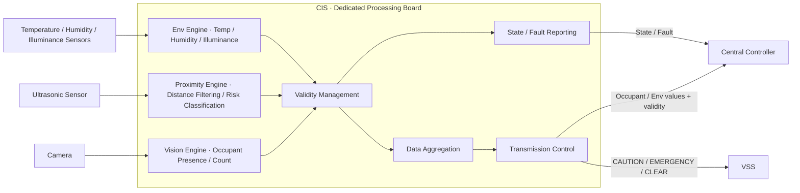

후방 근접 기능의 경우 거리 측정과 위험도 판정은 CIS 내부에서 수행하고,
VSS에는 `CAUTION`, `EMERGENCY`, `CLEAR`처럼 의미가 확정된 상태만 전달한다.

이 구조에서 물리 통신 방식과 메시지 표현은 후속 전체 인터페이스/네트워크 설계에서 결정한다.

---


<a id="sys-cis-s03"></a>
> 원문 구간: [CIS/02_CIS_SYSRS_FUNCTIONAL_BASELINE_DRAFT.md L77–104](https://github.com/vehicle-domain-control-system/integrated-vehicle-control/blob/1b1c4b834e4ac692f8e3eaf3e2680e4a530a2072/docs/requirements/CIS/02_CIS_SYSRS_FUNCTIONAL_BASELINE_DRAFT.md#L77-L104)

### 5.3 시스템 상태

CIS는 최소 다음의 논리 상태를 제공해야 한다.

- `STARTUP`: 초기화 진행 중
- `READY`: 초기화 완료, 유효 센싱 데이터 확보 대기
- `ACTIVE`: 유효한 판정·측정 결과를 정상 제공 중
- `FAULT`: 정상적인 판정·측정·전송을 보장할 수 없음

기본 상태 전이는 다음과 같다.

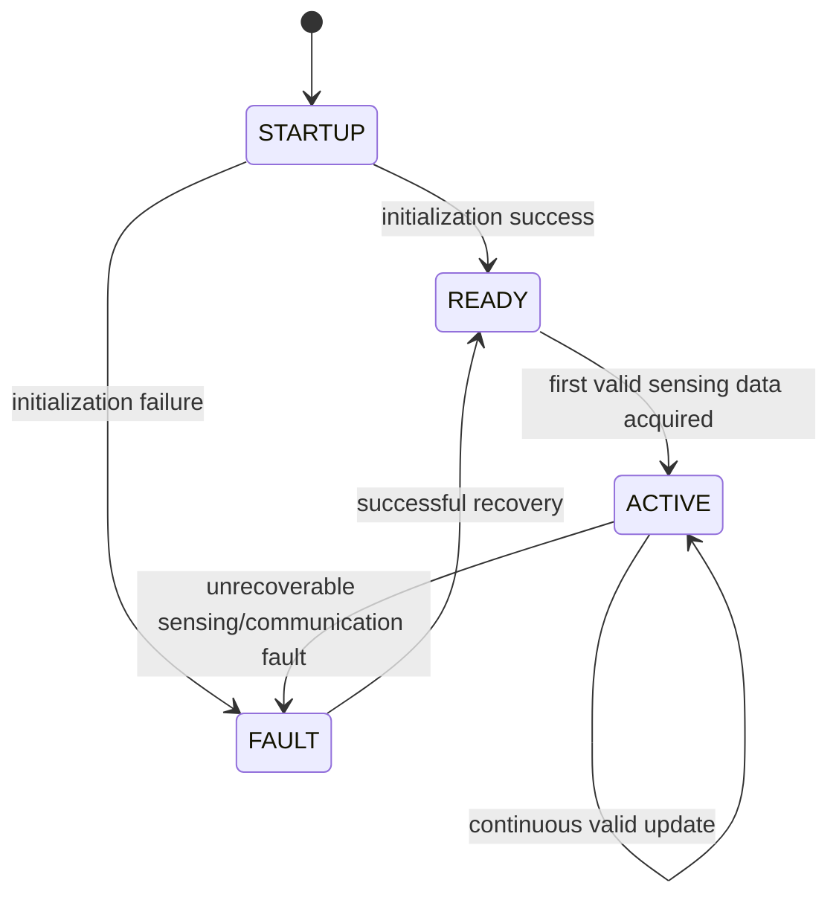

---


<a id="sys-cis-s04"></a>
> 원문 구간: [CIS/02_CIS_SYSRS_FUNCTIONAL_BASELINE_DRAFT.md L105–139](https://github.com/vehicle-domain-control-system/integrated-vehicle-control/blob/1b1c4b834e4ac692f8e3eaf3e2680e4a530a2072/docs/requirements/CIS/02_CIS_SYSRS_FUNCTIONAL_BASELINE_DRAFT.md#L105-L139)

> **통합 검토:** [B02](#review-b02), [B03](#review-b03), [B05](#review-b05), [B06](#review-b06), [B07](#review-b07) — 원문과 제안을 함께 읽는다. 정책·수치·안전 동작을 자동 확정하지 않았다.

### 5.4 Functional Requirements

| ID | Requirement |
|---|---|
| <a id="cis-sys-fun-001"></a>CIS-SYS-FUN-001 | CIS는 전원 인가 후 자체 초기화를 수행하고 정상적인 경우 `READY` 상태로 전이해야 한다. |
| <a id="cis-sys-fun-002"></a>CIS-SYS-FUN-002 | CIS는 `READY` 상태에서 최초 유효 센싱 데이터가 확보되면 `ACTIVE` 상태로 전이해야 한다. |
| <a id="cis-sys-fun-003"></a>CIS-SYS-FUN-003 | CIS는 실내 영상을 이용하여 탑승자 존재 여부를 판정해야 한다. |
| <a id="cis-sys-fun-004"></a>CIS-SYS-FUN-004 | CIS는 실내 영상을 이용하여 탑승자 인원수를 판정해야 한다. |
| <a id="cis-sys-fun-005"></a>CIS-SYS-FUN-005 | CIS는 탑승자 판정 결과의 유효 여부를 구분해야 한다. |
| <a id="cis-sys-fun-006"></a>CIS-SYS-FUN-006 | CIS는 비전 정보를 신뢰할 수 있기 전에는 해당 정보에 기반한 판정 결과를 확정하지 않아야 한다. |
| <a id="cis-sys-fun-007"></a>CIS-SYS-FUN-007 | CIS는 비전 오류의 복구 조건이 충족되기 전에는 탑승자 상태를 정상으로 확정하지 않아야 한다. |
| <a id="cis-sys-fun-008"></a>CIS-SYS-FUN-008 | CIS는 실내 온도를 측정해야 한다. |
| <a id="cis-sys-fun-009"></a>CIS-SYS-FUN-009 | CIS는 실내 습도를 측정해야 한다. |
| <a id="cis-sys-fun-010"></a>CIS-SYS-FUN-010 | CIS는 조도를 측정해야 한다. |
| <a id="cis-sys-fun-011"></a>CIS-SYS-FUN-011 | CIS는 환경 측정 정보의 유효 여부를 구분해야 한다. |
| <a id="cis-sys-fun-012"></a>CIS-SYS-FUN-012 | CIS는 센서 정보를 신뢰할 수 있기 전에는 해당 정보에 기반한 값을 확정하지 않아야 한다. |
| <a id="cis-sys-fun-013"></a>CIS-SYS-FUN-013 | CIS는 센서 오류의 복구 조건이 충족되기 전에는 측정값을 정상으로 확정하지 않아야 한다. |
| <a id="cis-sys-fun-014"></a>CIS-SYS-FUN-014 | CIS는 후방 물체와의 거리를 측정해야 한다. |
| <a id="cis-sys-fun-015"></a>CIS-SYS-FUN-015 | CIS는 거리 측정 정보의 유효 여부를 구분해야 한다. |
| <a id="cis-sys-fun-016"></a>CIS-SYS-FUN-016 | CIS는 물체와의 거리가 정의된 주의 임계값 이내인 경우 `CAUTION` 상태를 판단해야 한다. |
| <a id="cis-sys-fun-017"></a>CIS-SYS-FUN-017 | CIS는 물체와의 거리가 정의된 긴급 임계값 이내인 경우 `EMERGENCY` 상태를 판단해야 한다. |
| <a id="cis-sys-fun-018"></a>CIS-SYS-FUN-018 | CIS는 물체가 정의된 기준 거리 밖으로 벗어난 경우 `CLEAR` 상태로 전이해야 한다. |
| <a id="cis-sys-fun-019"></a>CIS-SYS-FUN-019 | CIS는 거리 측정 정보를 신뢰할 수 있기 전에는 `CAUTION`/`EMERGENCY` 상태를 확정하지 않아야 한다. |
| <a id="cis-sys-fun-020"></a>CIS-SYS-FUN-020 | CIS는 특정 센서 또는 비전 기능에 오류가 발생하더라도, 오류와 무관한 다른 판정·측정 기능을 불필요하게 중단하지 않아야 한다. |
| <a id="cis-sys-fun-021"></a>CIS-SYS-FUN-021 | CIS는 통신 오류 동안 마지막 정상 값을 현재 정상 값으로 표시하지 않아야 한다. |
| <a id="cis-sys-fun-022"></a>CIS-SYS-FUN-022 | CIS는 유효한 탑승자 판정 결과 및 환경 측정값을 정의된 주기로 중앙처리장치에 전송해야 한다. |
| <a id="cis-sys-fun-023"></a>CIS-SYS-FUN-023 | CIS는 전송하는 각 값에 대해 유효 여부 플래그를 함께 제공해야 한다. |
| <a id="cis-sys-fun-024"></a>CIS-SYS-FUN-024 | CIS는 통신 오류가 발생한 경우 해당 오류 상태를 상위 시스템이 식별할 수 있도록 제공해야 한다. |
| <a id="cis-sys-fun-025"></a>CIS-SYS-FUN-025 | CIS는 통신 오류가 해제되고 새로운 유효 값이 확인된 경우에만 정상 전송을 재개해야 한다. |
| <a id="cis-sys-fun-026"></a>CIS-SYS-FUN-026 | CIS는 `CAUTION`/`EMERGENCY`/`CLEAR` 상태를 VSS가 정의한 의미 이벤트 이름과 일치시켜 제공해야 한다. |
| <a id="cis-sys-fun-027"></a>CIS-SYS-FUN-027 | CIS는 실내 영상을 탑승자 인식 목적 범위를 벗어나 저장하거나 외부로 전송하지 않아야 한다. |
| <a id="cis-sys-fun-028"></a>CIS-SYS-FUN-028 | CIS는 엔진룸 대상 동물의 진입 여부를 판정하지 않아야 한다. |

---


<a id="sys-cis-s05"></a>
> 원문 구간: [CIS/02_CIS_SYSRS_FUNCTIONAL_BASELINE_DRAFT.md L140–193](https://github.com/vehicle-domain-control-system/integrated-vehicle-control/blob/1b1c4b834e4ac692f8e3eaf3e2680e4a530a2072/docs/requirements/CIS/02_CIS_SYSRS_FUNCTIONAL_BASELINE_DRAFT.md#L140-L193)

> **통합 검토:** [B01](#review-b01), [B04](#review-b04), [B05](#review-b05) — 원문과 제안을 함께 읽는다. 정책·수치·안전 동작을 자동 확정하지 않았다.

### 5.5 Semantic Event / Output Definitions

본 단계에서는 실제 통신 신호나 숫자 Event ID를 정의하지 않는다.
CIS가 외부로 제공해야 하는 **의미 정보의 종류**만 정의한다.

#### 5.5.1 CIS → VSS (후방 근접 위험 의미 이벤트)

VSS SysRS(`../VSS/02_VSS_SYSRS_FUNCTIONAL_BASELINE_DRAFT.md` §5)에 정의된 `REAR_OBSTACLE_*` 의미 이벤트를
CIS가 발행하는 것으로 정의한다. VSS 측 Source Owner는 본 문서로 확정한다.

| Semantic Event | Meaning | Trigger |
|---|---|---|
| `REAR_OBSTACLE_CAUTION` | 후방 물체 주의 거리 진입 | 거리 ≤ 주의 임계값, EMERGENCY 미해당 |
| `REAR_OBSTACLE_EMERGENCY` | 후방 물체 긴급 거리 진입 | 거리 ≤ 긴급 임계값 |
| `REAR_OBSTACLE_CLEAR` | 후방 위험 해제 | 물체가 감지 범위 밖이거나 임계값 밖으로 이탈 |

#### 5.5.2 CIS → Central Controller

| Semantic Value | Meaning | Class |
|---|---|---|
| `OCCUPANT_PRESENCE` | 탑승자 존재 여부 | Occupant |
| `OCCUPANT_COUNT` | 탑승자 인원수 | Occupant |
| `CABIN_TEMPERATURE` | 실내 온도 | Environment |
| `CABIN_HUMIDITY` | 실내 습도 | Environment |
| `CABIN_ILLUMINANCE` | 조도 | Environment |
| `REAR_DISTANCE` | 후방 물체 거리 | Proximity (내부 참고용, 5.1 의미 상태가 1차 정보) |
| `<value>_VALID` | 각 값의 유효 여부 | Validity |
| `CIS_STATE` | CIS 상태(`READY`/`ACTIVE`/`FAULT`) | Diagnostic |

> 실제 신호명, 숫자 값, 메시지 배치 및 전송 방식은 후속 인터페이스 설계에서 확정한다.

#### 5.5.3 후방 근접 위험 상태의 CIS 내부 처리 개념

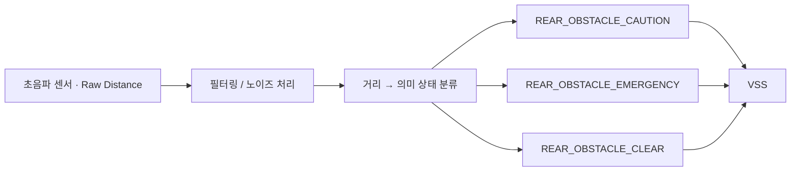

> 이 다이어그램은 위험 상태의 **의미 흐름**을 표현한다.  
> 실제 초음파 센서 모델, 필터링 알고리즘 및 통신 신호 정의는 포함하지 않는다.

---


<a id="sys-cis-s06"></a>
> 원문 구간: [CIS/02_CIS_SYSRS_FUNCTIONAL_BASELINE_DRAFT.md L194–218](https://github.com/vehicle-domain-control-system/integrated-vehicle-control/blob/1b1c4b834e4ac692f8e3eaf3e2680e4a530a2072/docs/requirements/CIS/02_CIS_SYSRS_FUNCTIONAL_BASELINE_DRAFT.md#L194-L218)

> **통합 검토:** [B02](#review-b02), [B03](#review-b03) — 원문과 제안을 함께 읽는다. 정책·수치·안전 동작을 자동 확정하지 않았다.

### 5.6 Candidate Proximity Thresholds

다음 값은 기능 검증을 위한 임시 기준이다. 측정 범위 및 3단계 구간은 균등 분할한 임시값이며,
VSS가 필요로 하는 `CAUTION`/`EMERGENCY`/`CLEAR` 3상태로 매핑한다.

| 구간 | 거리 범위 | 내부 분류 | 외부 발행 상태 |
|---|---:|---|---|
| 1 | 10 ~ 40 cm | 최근접 | `REAR_OBSTACLE_EMERGENCY` |
| 2 | 40 ~ 70 cm | 근접 | `REAR_OBSTACLE_CAUTION` |
| 3 | 70 ~ 100 cm | 감시(내부 전용, 경고 미발행) | `REAR_OBSTACLE_CLEAR` |
| - | 100 cm 초과 또는 미감지 | 해당 없음 | `REAR_OBSTACLE_CLEAR` |

| Item | Candidate |
|---|---:|
| 측정 범위 | `10 cm ~ 100 cm` |
| 거리 전송 단위 | `cm` |
| 주의 임계값 (`REAR_OBSTACLE_CAUTION`) | `[CANDIDATE] ≤ 70 cm` |
| 긴급 임계값 (`REAR_OBSTACLE_EMERGENCY`) | `[CANDIDATE] ≤ 40 cm` |
| 3구간 분할 방식 | `[CANDIDATE] 균등 3등분` |

> 위 값은 실제 채택할 초음파 센서 모델의 정확도·노이즈 특성에 따라 재조정이 필요한 임시값이다.  
> 3구간 분할은 CIS 내부 정밀도를 위한 것이며, VSS에는 `CAUTION`/`EMERGENCY`/`CLEAR` 3상태만 노출된다.

---


<a id="sys-cis-s07"></a>
> 원문 구간: [CIS/02_CIS_SYSRS_FUNCTIONAL_BASELINE_DRAFT.md L219–233](https://github.com/vehicle-domain-control-system/integrated-vehicle-control/blob/1b1c4b834e4ac692f8e3eaf3e2680e4a530a2072/docs/requirements/CIS/02_CIS_SYSRS_FUNCTIONAL_BASELINE_DRAFT.md#L219-L233)

> **통합 검토:** [B07](#review-b07), [B08](#review-b08), [B20](#review-b20) — 원문과 제안을 함께 읽는다. 정책·수치·안전 동작을 자동 확정하지 않았다.

### 5.7 Performance Requirements

| ID | Requirement | Candidate |
|---|---|---:|
| <a id="cis-sys-per-001"></a>CIS-SYS-PER-001 | 전원 인가 후 CIS는 `READY` 또는 `FAULT` 상태를 확정해야 한다. | `[CANDIDATE] ≤ 3000 ms` |
| <a id="cis-sys-per-002"></a>CIS-SYS-PER-002 | CIS는 탑승자/환경/근접 데이터를 정의된 주기로 갱신하여 제공해야 한다. | `[CANDIDATE] 200 ms` |
| <a id="cis-sys-per-003"></a>CIS-SYS-PER-003 | 근접 위험 `EMERGENCY` 상태가 CIS 내부에서 확정된 시점부터 외부 제공까지의 지연은 제한되어야 한다. | `[CANDIDATE] ≤ 100 ms` |
| <a id="cis-sys-per-004"></a>CIS-SYS-PER-004 | CIS는 정의된 연속 누락 횟수를 초과하는 통신 실패를 통신 오류로 판단해야 한다. | `[CANDIDATE] 연속 3주기 (≈ 600 ms)` |
| <a id="cis-sys-per-005"></a>CIS-SYS-PER-005 | 통신 오류 해제 후 CIS가 정상 전송을 재개하기까지의 지연은 제한되어야 한다. | `[CANDIDATE] ≤ 500 ms` |

> 위 시간은 **CIS 내부 확정 시점부터의 시스템 성능**이다.  
> 차량 네트워크 전송 지연 및 메시지 주기는 아직 포함하지 않는다.

---


<a id="sys-cis-s08"></a>
> 원문 구간: [CIS/02_CIS_SYSRS_FUNCTIONAL_BASELINE_DRAFT.md L234–273](https://github.com/vehicle-domain-control-system/integrated-vehicle-control/blob/1b1c4b834e4ac692f8e3eaf3e2680e4a530a2072/docs/requirements/CIS/02_CIS_SYSRS_FUNCTIONAL_BASELINE_DRAFT.md#L234-L273)

> **통합 검토:** [B09](#review-b09) — 원문과 제안을 함께 읽는다. 정책·수치·안전 동작을 자동 확정하지 않았다.

### 5.8 External Logical Interface Requirements

본 절은 통신 프로토콜을 정의하지 않는다.
후속 인터페이스 설계에서 필요한 정보 항목을 누락하지 않기 위한 논리 계약만 정의한다.

#### 5.8.1 CIS가 외부에서 필요로 하는 정보

| ID | Requirement |
|---|---|
| <a id="cis-sys-int-001"></a>CIS-SYS-INT-001 | CIS는 후방 근접 감지 활성 조건 판단을 위해 차량 전원 상태를 제공받아야 한다. |
| <a id="cis-sys-int-002"></a>CIS-SYS-INT-002 | CIS는 후방 근접 감지 활성 조건 판단을 위해 차량 후진 기어 상태를 제공받을 수 있어야 한다. |

#### 5.8.2 CIS가 외부에 제공해야 하는 정보

| ID | Requirement |
|---|---|
| <a id="cis-sys-int-003"></a>CIS-SYS-INT-003 | CIS는 탑승자 존재 여부 및 인원수를 중앙처리장치가 확인할 수 있도록 제공해야 한다. |
| <a id="cis-sys-int-004"></a>CIS-SYS-INT-004 | CIS는 실내 온도·습도·조도 측정값을 중앙처리장치가 확인할 수 있도록 제공해야 한다. |
| <a id="cis-sys-int-005"></a>CIS-SYS-INT-005 | CIS는 후방 근접 위험 의미 상태(`CAUTION`/`EMERGENCY`/`CLEAR`)를 VSS가 확인할 수 있도록 제공해야 한다. |
| <a id="cis-sys-int-006"></a>CIS-SYS-INT-006 | CIS는 각 제공 정보의 유효 여부를 함께 제공해야 한다. |
| <a id="cis-sys-int-007"></a>CIS-SYS-INT-007 | CIS는 정상/오류 상태를 외부 시스템이 확인할 수 있도록 해야 한다. |
| <a id="cis-sys-int-008"></a>CIS-SYS-INT-008 | CIS가 오류에서 복구된 경우 외부 시스템이 정상 복귀 여부를 확인할 수 있도록 해야 한다. |

#### 5.8.3 본 단계에서 결정하지 않는 항목

- CAN / UART 등 실제 물리·데이터링크 프로토콜
- Message ID / Signal ID
- Payload Byte Layout / DLC / Frame Length
- Endianness
- 송신 주기 / Timeout
- Alive Counter / Rolling Counter / CRC / E2E
- Bit Rate / Data Rate
- Bus Load
- 후방 근접 주의/긴급 거리 임계값 최종값
- 초음파 센서 샘플링 주기
- 센서 필터링 방식
- 중앙처리장치와의 통신 링크에서 사용할 물리 포트(LPUART0/LPUART2 등) 배정

---


<a id="sys-cis-s09"></a>
> 원문 구간: [CIS/02_CIS_SYSRS_FUNCTIONAL_BASELINE_DRAFT.md L274–284](https://github.com/vehicle-domain-control-system/integrated-vehicle-control/blob/1b1c4b834e4ac692f8e3eaf3e2680e4a530a2072/docs/requirements/CIS/02_CIS_SYSRS_FUNCTIONAL_BASELINE_DRAFT.md#L274-L284)

### 5.9 Safety Requirements

| ID | Requirement |
|---|---|
| <a id="cis-sys-saf-001"></a>CIS-SYS-SAF-001 | CIS의 오류는 파워윈도우, 공조, 도어 등 다른 차량 기능의 제어 상태를 직접 변경해서는 안 된다. |
| <a id="cis-sys-saf-002"></a>CIS-SYS-SAF-002 | CIS는 신뢰할 수 없는 근접 감지 정보를 근거로 `EMERGENCY` 상태를 확정해서는 안 된다. |
| <a id="cis-sys-saf-003"></a>CIS-SYS-SAF-003 | CIS는 정상적인 탑승자/환경/근접 정보를 제공할 수 없는 경우 해당 상태가 외부 시스템에서 식별 가능해야 한다. |
| <a id="cis-sys-saf-004"></a>CIS-SYS-SAF-004 | CIS는 실내 영상 원본을 어떠한 외부 인터페이스로도 노출해서는 안 된다. |

---


<a id="sys-cis-s10"></a>
> 원문 구간: [CIS/02_CIS_SYSRS_FUNCTIONAL_BASELINE_DRAFT.md L285–309](https://github.com/vehicle-domain-control-system/integrated-vehicle-control/blob/1b1c4b834e4ac692f8e3eaf3e2680e4a530a2072/docs/requirements/CIS/02_CIS_SYSRS_FUNCTIONAL_BASELINE_DRAFT.md#L285-L309)

### 5.10 Diagnostic Requirements

#### 5.10.1 Logical Fault Categories

- `VISION_FAULT`
- `ENV_SENSOR_FAULT`
- `PROXIMITY_SENSOR_FAULT`
- `COMMUNICATION_FAULT`
- `INITIALIZATION_FAILURE`

실제 DTC 번호 및 네트워크 진단 포맷은 본 단계에서 정의하지 않는다.

#### 5.10.2 Requirements

| ID | Requirement |
|---|---|
| <a id="cis-sys-dia-001"></a>CIS-SYS-DIA-001 | CIS는 정상 판정·측정을 방해하는 오류를 검출할 수 있어야 한다. |
| <a id="cis-sys-dia-002"></a>CIS-SYS-DIA-002 | CIS는 최근 발생한 주요 오류 원인을 식별 가능하게 유지해야 한다. |
| <a id="cis-sys-dia-003"></a>CIS-SYS-DIA-003 | 초기화 실패 시 CIS는 `FAULT` 상태로 전이해야 한다. |
| <a id="cis-sys-dia-004"></a>CIS-SYS-DIA-004 | 복구 가능한 오류의 경우 CIS는 전체 재시작 없이 정상 상태로 복귀할 수 있어야 한다. |
| <a id="cis-sys-dia-005"></a>CIS-SYS-DIA-005 | 복구에 실패한 경우 CIS는 `FAULT` 상태를 유지하고 오류 상태를 외부에 제공할 수 있어야 한다. |
| <a id="cis-sys-dia-006"></a>CIS-SYS-DIA-006 | 비전/환경/근접 기능 중 하나에 결함이 발생한 경우 CIS는 해당 결함 영역을 식별 가능하게 구분해야 한다. |

---


<a id="sys-cis-s11"></a>
> 원문 구간: [CIS/02_CIS_SYSRS_FUNCTIONAL_BASELINE_DRAFT.md L310–342](https://github.com/vehicle-domain-control-system/integrated-vehicle-control/blob/1b1c4b834e4ac692f8e3eaf3e2680e4a530a2072/docs/requirements/CIS/02_CIS_SYSRS_FUNCTIONAL_BASELINE_DRAFT.md#L310-L342)

### 5.11 Non-Functional Requirements

#### 5.11.1 Robustness

| ID | Requirement |
|---|---|
| <a id="cis-sys-nfr-001"></a>CIS-SYS-NFR-001 | 유효하지 않은 센서/영상 입력이 CIS 전체의 비정상 종료를 유발해서는 안 된다. |
| <a id="cis-sys-nfr-002"></a>CIS-SYS-NFR-002 | CIS는 정상적인 처리 과정에서 무한 대기 상태에 진입하지 않아야 한다. |
| <a id="cis-sys-nfr-003"></a>CIS-SYS-NFR-003 | CIS 관련 오류는 다른 차량 기능과 기능적으로 격리되어야 한다. |

#### 5.11.2 Predictability

| ID | Requirement |
|---|---|
| <a id="cis-sys-nfr-004"></a>CIS-SYS-NFR-004 | 동일한 입력 조건에서는 동일한 판정 결과가 산출되어야 한다. |
| <a id="cis-sys-nfr-005"></a>CIS-SYS-NFR-005 | 근접 위험 상태는 정의된 임계값 정책에 따라 일관되게 결정되어야 한다. |

#### 5.11.3 Maintainability

| ID | Requirement |
|---|---|
| <a id="cis-sys-nfr-006"></a>CIS-SYS-NFR-006 | 근접 위험 임계값은 전체 판정 로직에 분산되지 않고 일관되게 관리 가능해야 한다. |
| <a id="cis-sys-nfr-007"></a>CIS-SYS-NFR-007 | 실제 통신 프로토콜 변경이 CIS의 판정 로직 자체를 불필요하게 변경시키지 않도록 논리 인터페이스와 통신 구현이 분리 가능해야 한다. |

#### 5.11.4 Testability

| ID | Requirement |
|---|---|
| <a id="cis-sys-nfr-008"></a>CIS-SYS-NFR-008 | CIS는 실제 카메라·센서를 직접 연결하지 않고 대체 입력만으로 핵심 판정 로직을 시험할 수 있어야 한다. |
| <a id="cis-sys-nfr-009"></a>CIS-SYS-NFR-009 | CIS는 각 근접 위험 임계값 구간에 대해 상태 전이를 독립적으로 검증할 수 있어야 한다. |

---


<a id="sys-cis-s12"></a>
> 원문 구간: [CIS/02_CIS_SYSRS_FUNCTIONAL_BASELINE_DRAFT.md L343–360](https://github.com/vehicle-domain-control-system/integrated-vehicle-control/blob/1b1c4b834e4ac692f8e3eaf3e2680e4a530a2072/docs/requirements/CIS/02_CIS_SYSRS_FUNCTIONAL_BASELINE_DRAFT.md#L343-L360)

> **통합 검토:** [B02](#review-b02) — 원문과 제안을 함께 읽는다. 정책·수치·안전 동작을 자동 확정하지 않았다.

### 5.12 Candidate Acceptance Criteria

| Test | Candidate Acceptance |
|---|---|
| Power-on readiness | 전원 인가 후 `≤ 3000 ms` 이내 `READY` 또는 `FAULT` 확정 |
| Occupant detection | 유효 영상 입력 시 존재 여부·인원수 판정 결과 제공 |
| Env measurement | 온도·습도·조도 값 및 유효성 제공 |
| Proximity caution | 거리 `≤ 70 cm` 진입 시 `REAR_OBSTACLE_CAUTION` 발행 |
| Proximity emergency | 거리 `≤ 40 cm` 진입 시 `REAR_OBSTACLE_EMERGENCY` 발행 |
| Proximity clear | 거리 `> 100 cm` 또는 미감지 시 `REAR_OBSTACLE_CLEAR` 발행 |
| Invalid sensor input | 유효 범위 밖 입력 시 정상 정보로 사용하지 않음 |
| Communication loss | 연속 누락 시 통신 오류 상태 식별 가능 |
| Recovery | 오류 해제 및 새 유효값 확인 후에만 정상 전송 재개 |
| Isolation | 특정 센서/비전 오류가 다른 기능을 불필요하게 중단시키지 않음 |
| Raw video exposure | 실내 영상 원본이 어떤 외부 인터페이스로도 노출되지 않음 |

---


<a id="sys-cis-s13"></a>
> 원문 구간: [CIS/02_CIS_SYSRS_FUNCTIONAL_BASELINE_DRAFT.md L361–377](https://github.com/vehicle-domain-control-system/integrated-vehicle-control/blob/1b1c4b834e4ac692f8e3eaf3e2680e4a530a2072/docs/requirements/CIS/02_CIS_SYSRS_FUNCTIONAL_BASELINE_DRAFT.md#L361-L377)

### 5.13 Candidate Parameter Summary

| Category | Parameter | Candidate |
|---|---|---:|
| Architecture | CIS controller | Dedicated processing board |
| Timing | Startup | ≤ 3000 ms |
| Timing | Data update period | 200 ms |
| Timing | Emergency internal-to-external delay | ≤ 100 ms |
| Timing | Communication fault detection | 연속 3주기 (≈ 600 ms) |
| Timing | Communication recovery | ≤ 500 ms |
| Proximity | 측정 범위 | 10 ~ 100 cm |
| Proximity | 거리 전송 단위 | cm |
| Proximity | Caution threshold | ≤ 70 cm |
| Proximity | Emergency threshold | ≤ 40 cm |

---


<a id="sys-cis-s14"></a>
> 원문 구간: [CIS/02_CIS_SYSRS_FUNCTIONAL_BASELINE_DRAFT.md L378–406](https://github.com/vehicle-domain-control-system/integrated-vehicle-control/blob/1b1c4b834e4ac692f8e3eaf3e2680e4a530a2072/docs/requirements/CIS/02_CIS_SYSRS_FUNCTIONAL_BASELINE_DRAFT.md#L378-L406)

> **통합 검토:** [B06](#review-b06), [B09](#review-b09) — 원문과 제안을 함께 읽는다. 정책·수치·안전 동작을 자동 확정하지 않았다.

### 5.14 TBD / 후속 단계 결정 항목

#### 5.14.1 CIS 자체에서 결정

- 채택할 초음파 센서 모델 및 그에 따른 임계값 재조정
- 거리값 필터링 방식
- 조도 측정 단위(lux 등)
- 탑승자 인원수 카운팅 정확도 기준
- 후진/차량 상태와의 활성 조건 필요 여부 (8.1절)

#### 5.14.2 전체 기능 취합 후 Interface / Network 단계에서 결정

- CIS와 중앙처리장치·VSS 간 물리 통신 경로 (Open Item: LPUART0/LPUART2 중 배정)
- 실제 통신 프로토콜, 메시지/신호 이름, 메시지 ID
- 데이터 길이 및 비트 배치
- 송신 방식 및 주기, Timeout/Freshness
- Alive Counter/CRC/E2E, 통신 장애 복구 정책
- 네트워크 우선순위 및 Bus Load

#### 5.14.3 Element / SW / HW 설계 단계에서 결정

- 실제 처리 보드/카메라/센서 부품 사양
- 비전 인식 모델 및 파이프라인
- 내부 Queue/Buffer 구조, Task 주기
- Watchdog 주기
- CPU/RAM 세부 Budget

---


<a id="sys-cis-s15"></a>
> 원문 구간: [CIS/02_CIS_SYSRS_FUNCTIONAL_BASELINE_DRAFT.md L407–416](https://github.com/vehicle-domain-control-system/integrated-vehicle-control/blob/1b1c4b834e4ac692f8e3eaf3e2680e4a530a2072/docs/requirements/CIS/02_CIS_SYSRS_FUNCTIONAL_BASELINE_DRAFT.md#L407-L416)

### 5.15 Baseline Scope

> **CIS는 실내 영상과 환경 센서로부터 탑승자 상태·환경 정보·후방 근접 위험을 판정하고,
> 유효성이 확인된 정보만 중앙처리장치와 VSS로 제공하며,
> 자신의 상태와 오류를 관리하는 실내 센싱 모듈이다.**

후방 근접 기능에서는 CIS가 초음파 거리값을 직접 판정하여
VSS가 필요로 하는 **주의 / 긴급 / 해제 상태로 변환해 제공**한다.

실제 차량 통신 프로토콜과 메시지 설계는 전체 시스템 기능 및 인터페이스가 취합된 이후 수행한다.


<a id="sys-mobile"></a>
## 6. MOBILE SysRS

출처: [MOBILE/02_MOBILE_SYSRS_FUNCTIONAL_BASELINE_DRAFT.md](https://github.com/vehicle-domain-control-system/integrated-vehicle-control/blob/1b1c4b834e4ac692f8e3eaf3e2680e4a530a2072/docs/requirements/MOBILE/02_MOBILE_SYSRS_FUNCTIONAL_BASELINE_DRAFT.md)

관련 SR: [영역 본문](SR.md#sr-mobile) · 기존 정의 ID 95개. 아래 원문 요구와 검토 주석을 구분한다.


<a id="sys-mobile-header"></a>
> 원문 구간: [MOBILE/02_MOBILE_SYSRS_FUNCTIONAL_BASELINE_DRAFT.md L1–11](https://github.com/vehicle-domain-control-system/integrated-vehicle-control/blob/1b1c4b834e4ac692f8e3eaf3e2680e4a530a2072/docs/requirements/MOBILE/02_MOBILE_SYSRS_FUNCTIONAL_BASELINE_DRAFT.md#L1-L11)

> 원문 제목: Mobile Interface System Requirement Specification (SysRS)
#### Android Application — Functional Baseline Draft

> 상태: DRAFT / 기능·성능 기준 검토용  
> 대상 시스템: **사용자 단말 1대에서 동작하는 Android 애플리케이션**  
> 신규 SysRS ID 체계를 사용하며 이전 번호를 승계하지 않는다.  
> `[CANDIDATE]`는 초기 개발 및 검증을 위한 임시값이다.  
> 무선 방식, 데이터 형식, 메시지 구조 및 화면 레이아웃은 본 단계에서 확정하지 않는다.

---


<a id="sys-mobile-s01"></a>
> 원문 구간: [MOBILE/02_MOBILE_SYSRS_FUNCTIONAL_BASELINE_DRAFT.md L12–36](https://github.com/vehicle-domain-control-system/integrated-vehicle-control/blob/1b1c4b834e4ac692f8e3eaf3e2680e4a530a2072/docs/requirements/MOBILE/02_MOBILE_SYSRS_FUNCTIONAL_BASELINE_DRAFT.md#L12-L36)

### 6.1 대상 시스템과 책임

본 SysRS의 대상은 사용자 단말에서 동작하는 Android 애플리케이션이다. 차량과는 게이트웨이를 통해 무선으로 연결된다.

모바일 애플리케이션의 책임은 다음과 같다.

- 사용자 입력 수집 및 제어 요청 생성
- 제어 요청의 처리 결과 및 사유 표시
- 차량이 확정한 상태의 표시
- 상태 정보의 신뢰성 구분 표시
- 안전 관련 경고의 우선 표시 및 미확인 관리
- 차량 연결 가능 상태의 표시

모바일 애플리케이션의 책임이 아닌 항목은 다음과 같다.

- 차량 기능의 허용 여부 판단
- 차량 동작의 직접 수행
- 차량 상태의 확정 및 보정
- 사용자 인증의 최종 판단
- 차량 네트워크 프레임의 직접 해석

모바일 애플리케이션은 센싱 값을 수신하지 않는다. 차량이 확정한 상태만 수신하여 표시한다.

---


<a id="sys-mobile-s02"></a>
> 원문 구간: [MOBILE/02_MOBILE_SYSRS_FUNCTIONAL_BASELINE_DRAFT.md L37–54](https://github.com/vehicle-domain-control-system/integrated-vehicle-control/blob/1b1c4b834e4ac692f8e3eaf3e2680e4a530a2072/docs/requirements/MOBILE/02_MOBILE_SYSRS_FUNCTIONAL_BASELINE_DRAFT.md#L37-L54)

### 6.2 논리 시스템 구조

모바일 애플리케이션의 내부 처리는 다음 계층으로 구성된다.

```
화면 계층        표시 · 입력 수집
표시 상태 계층    수신 값과 신뢰성 결합 · 렌더링 규칙 적용
요청 계층        요청 생성 · 결과 추적
알림 계층        경고 우선순위 · 미확인 관리
연결 계층        세션 · 재연결 · 게이트웨이 연계
```

표시 상태 계층은 수신한 값과 신뢰성을 결합하여 보관하며, 화면 계층은 결합된 형태로만 값을 읽을 수 있어야 한다. 값과 신뢰성이 분리되면 화면에서 신뢰성 표시가 누락된다.

요청 계층은 요청의 전송 상태와 차량에서의 수행 결과를 각각 관리해야 한다. 두 상태를 하나로 합치면 결과를 확인하지 못한 요청을 성공으로 표시하게 된다.

---


<a id="sys-mobile-s03"></a>
> 원문 구간: [MOBILE/02_MOBILE_SYSRS_FUNCTIONAL_BASELINE_DRAFT.md L55–71](https://github.com/vehicle-domain-control-system/integrated-vehicle-control/blob/1b1c4b834e4ac692f8e3eaf3e2680e4a530a2072/docs/requirements/MOBILE/02_MOBILE_SYSRS_FUNCTIONAL_BASELINE_DRAFT.md#L55-L71)

### 6.3 시스템 상태

| 상태 구분 | 값 |
|---|---|
| 연결 상태 | `DISCONNECTED` / `CONNECTING` / `CONNECTED` / `AUTHENTICATED` |
| 요청 상태 | `SENT` / `ACCEPTED` / `IN_PROGRESS` / `DONE` / `REJECTED` / `FAILED` / `CANCELLED` / `UNKNOWN` |
| 표시 값 신뢰성 | `OK` / `STALE` / `INVALID` / `NO_DATA` |
| 경고 확인 상태 | `UNREAD` / `READ` |

`UNKNOWN`은 요청을 전송하였으나 처리 결과를 확인하지 못한 상태를 의미한다. 이 상태를 `DONE` 또는 `FAILED`로 임의 분류해서는 안 된다.

`CANCELLED`는 수행 중이던 동작이 완료 전에 멈춘 상태를 의미한다. 사용자의 정지 요청과 차량 측 사유에 의한 중단을 모두 포함하며, `FAILED`와 구분하여 관리한다.

`READ`는 사용자가 경고를 확인하였음을 의미하며, 해당 경고 상태가 해제되었음을 의미하지 않는다.

---


<a id="sys-mobile-s04"></a>
> 원문 구간: [MOBILE/02_MOBILE_SYSRS_FUNCTIONAL_BASELINE_DRAFT.md L72–141](https://github.com/vehicle-domain-control-system/integrated-vehicle-control/blob/1b1c4b834e4ac692f8e3eaf3e2680e4a530a2072/docs/requirements/MOBILE/02_MOBILE_SYSRS_FUNCTIONAL_BASELINE_DRAFT.md#L72-L141)

> **통합 검토:** [A11](#review-a11), [A12](#review-a12) — 원문과 제안을 함께 읽는다. 정책·수치·안전 동작을 자동 확정하지 않았다.

### 6.4 Functional Requirements

#### 6.4.1 제어 요청

| ID | Requirement |
|---|---|
| <a id="mb-sys-req-001"></a>MB-SYS-REQ-001 | 모바일 애플리케이션은 `01_MOBILE_SR` 3.1절에 정의된 제어 대상에 대해서만 요청을 생성해야 한다. |
| <a id="mb-sys-req-002"></a>MB-SYS-REQ-002 | 각 제어 요청에는 중복 및 순서를 식별할 수 있는 값이 포함되어야 한다. |
| <a id="mb-sys-req-003"></a>MB-SYS-REQ-003 | 요청 전송 완료 상태와 차량에서의 수행 완료 상태를 서로 다른 상태로 관리해야 한다. |
| <a id="mb-sys-req-004"></a>MB-SYS-REQ-004 | 요청 결과를 정의된 시간 내에 수신하지 못한 경우 해당 요청을 `UNKNOWN`으로 관리해야 한다. |
| <a id="mb-sys-req-005"></a>MB-SYS-REQ-005 | `UNKNOWN` 상태의 요청을 성공 또는 실패로 표시하지 않아야 한다. |
| <a id="mb-sys-req-006"></a>MB-SYS-REQ-006 | 거부, 실패 및 중단 결과는 사유와 함께 표시해야 한다. |
| <a id="mb-sys-req-007"></a>MB-SYS-REQ-007 | 연결이 종료된 경우 전송되지 않은 요청을 자동으로 재전송하지 않아야 한다. |
| <a id="mb-sys-req-008"></a>MB-SYS-REQ-008 | 연결이 복구된 경우 이전 요청을 자동으로 재수행하지 않아야 한다. |
| <a id="mb-sys-req-009"></a>MB-SYS-REQ-009 | 연결 상태가 `AUTHENTICATED`가 아닌 경우 제어 요청을 생성하지 않아야 하며 그 사유를 표시해야 한다. |
| <a id="mb-sys-req-010"></a>MB-SYS-REQ-010 | 최근 제어 요청의 결과를 정의된 건수만큼 보관하고 사용자가 확인할 수 있도록 해야 한다. |
| <a id="mb-sys-req-011"></a>MB-SYS-REQ-011 | `UNKNOWN` 상태의 요청을 자동으로 재전송하지 않아야 하며, 재요청은 사용자의 조작에 의해서만 이루어져야 한다. |
| <a id="mb-sys-req-012"></a>MB-SYS-REQ-012 | 수신 정보의 신뢰성이 `OK`가 아닌 경우 새로운 제어 요청을 생성하지 않아야 한다. |

#### 6.4.2 상태 표시

| ID | Requirement |
|---|---|
| <a id="mb-sys-dsp-001"></a>MB-SYS-DSP-001 | 표시 값은 수신한 값과 신뢰성이 결합된 형태로 관리되어야 한다. |
| <a id="mb-sys-dsp-002"></a>MB-SYS-DSP-002 | 신뢰성이 `OK`가 아닌 값은 정상 값과 구분되는 형태로 표시해야 한다. |
| <a id="mb-sys-dsp-003"></a>MB-SYS-DSP-003 | 신뢰성이 `INVALID` 또는 `NO_DATA`인 값은 수치를 표시하지 않아야 한다. |
| <a id="mb-sys-dsp-004"></a>MB-SYS-DSP-004 | 신뢰성이 `STALE`인 값은 마지막 수신 시점을 함께 표시해야 한다. |
| <a id="mb-sys-dsp-005"></a>MB-SYS-DSP-005 | 수신이 중단된 경우 마지막 값을 현재 정상 값으로 표시하지 않아야 한다. |
| <a id="mb-sys-dsp-006"></a>MB-SYS-DSP-006 | 도어 잠금 상태와 물리적 개폐 상태를 각각 분리하여 표시해야 한다. |
| <a id="mb-sys-dsp-007"></a>MB-SYS-DSP-007 | 도어 상태 조합이 비정상인 경우 정상 상태로 표시하지 않고 이상 상태로 표시해야 한다. |
| <a id="mb-sys-dsp-008"></a>MB-SYS-DSP-008 | 요구된 동작 수준과 실제 동작 상태를 각각 분리하여 표시해야 한다. |
| <a id="mb-sys-dsp-009"></a>MB-SYS-DSP-009 | 사용자 설정이 안전 정책에 의해 적용되지 않는 경우 그 사유를 표시해야 한다. |
| <a id="mb-sys-dsp-010"></a>MB-SYS-DSP-010 | 전체 화면에 공통으로 차량 연결 상태와 마지막 상태 수신 시점을 표시해야 한다. |

#### 6.4.3 경고 및 알림

| ID | Requirement |
|---|---|
| <a id="mb-sys-alt-001"></a>MB-SYS-ALT-001 | 안전 관련 경고를 일반 상태 정보보다 상위에 표시해야 한다. |
| <a id="mb-sys-alt-002"></a>MB-SYS-ALT-002 | 경고는 등급에 따라 구분되는 형태로 표시해야 한다. |
| <a id="mb-sys-alt-003"></a>MB-SYS-ALT-003 | 사용자가 확인하지 않은 경고의 존재를 모든 화면에서 인지할 수 있어야 한다. |
| <a id="mb-sys-alt-004"></a>MB-SYS-ALT-004 | 경고 확인 여부와 경고 상태의 유효 여부를 서로 다른 상태로 관리해야 한다. |
| <a id="mb-sys-alt-005"></a>MB-SYS-ALT-005 | 사용자가 확인한 이후에도 해당 경고 상태가 유효한 동안에는 상태 표시를 유지해야 한다. |
| <a id="mb-sys-alt-006"></a>MB-SYS-ALT-006 | 애플리케이션이 화면에 없는 상태에서 발생한 경고를 사용자가 인지할 수 있도록 해야 한다. |
| <a id="mb-sys-alt-007"></a>MB-SYS-ALT-007 | 경고 알림을 수신하지 못한 경우에도 애플리케이션 진입 시 미확인 경고를 확인할 수 있어야 한다. |

#### 6.4.4 연결

| ID | Requirement |
|---|---|
| <a id="mb-sys-con-001"></a>MB-SYS-CON-001 | 연결 상태를 정의된 상태 집합으로 관리하고 사용자에게 표시해야 한다. |
| <a id="mb-sys-con-002"></a>MB-SYS-CON-002 | 연결이 끊어진 경우 정의된 간격으로 재연결을 시도해야 한다. |
| <a id="mb-sys-con-003"></a>MB-SYS-CON-003 | 재연결 시도 간격은 반복 실패 시 점진적으로 증가해야 한다. |
| <a id="mb-sys-con-004"></a>MB-SYS-CON-004 | 연결이 복구된 경우 차량이 제공하는 최신 상태로 표시를 갱신해야 한다. |
| <a id="mb-sys-con-005"></a>MB-SYS-CON-005 | 연결 복구 시 복구 이전에 보관하던 값을 현재 정상 값으로 표시하지 않아야 한다. |
| <a id="mb-sys-con-006"></a>MB-SYS-CON-006 | 애플리케이션이 화면에 없는 상태에서도 연결을 유지할 수 있어야 한다. |

#### 6.4.5 인증 및 보안

| ID | Requirement |
|---|---|
| <a id="mb-sys-sec-001"></a>MB-SYS-SEC-001 | 인증 정보를 사용자가 열람하거나 직접 입력하지 않아야 한다. |
| <a id="mb-sys-sec-002"></a>MB-SYS-SEC-002 | 인증 정보는 단말의 보호된 저장 영역에 보관해야 한다. |
| <a id="mb-sys-sec-003"></a>MB-SYS-SEC-003 | 인증이 완료되지 않은 상태에서 제어 요청을 전송하지 않아야 한다. |
| <a id="mb-sys-sec-004"></a>MB-SYS-SEC-004 | 인증 실패 사유를 사용자에게 표시하되 인증 정보 자체를 노출하지 않아야 한다. |
| <a id="mb-sys-sec-005"></a>MB-SYS-SEC-005 | 차량 등록을 해제한 경우 보관 중인 인증 정보를 삭제해야 한다. |
| <a id="mb-sys-sec-006"></a>MB-SYS-SEC-006 | 사용자 인증의 성공 여부를 자체적으로 판정하지 않고 차량의 판정 결과를 반영해야 한다. |

---


<a id="sys-mobile-s05"></a>
> 원문 구간: [MOBILE/02_MOBILE_SYSRS_FUNCTIONAL_BASELINE_DRAFT.md L142–167](https://github.com/vehicle-domain-control-system/integrated-vehicle-control/blob/1b1c4b834e4ac692f8e3eaf3e2680e4a530a2072/docs/requirements/MOBILE/02_MOBILE_SYSRS_FUNCTIONAL_BASELINE_DRAFT.md#L142-L167)

> **통합 검토:** [A15](#review-a15) — 원문과 제안을 함께 읽는다. 정책·수치·안전 동작을 자동 확정하지 않았다.

### 6.5 Semantic Input Requirements

모바일 애플리케이션은 차량이 의미를 확정한 정보를 받아 표시하며 Raw Data를 직접 판정하지 않는다.

| ID | Requirement |
|---|---|
| <a id="mb-sys-sem-001"></a>MB-SYS-SEM-001 | 상태 값은 신뢰성 정보와 결합된 형태로 제공받아야 한다. |
| <a id="mb-sys-sem-002"></a>MB-SYS-SEM-002 | 상태 정보의 최신 여부를 판단할 수 있는 근거를 함께 제공받아야 한다. |
| <a id="mb-sys-sem-003"></a>MB-SYS-SEM-003 | 요청 처리 결과는 전송 접수와 수행 완료를 구분할 수 있는 형태로 제공받아야 한다. |
| <a id="mb-sys-sem-004"></a>MB-SYS-SEM-004 | 거부 및 실패 사유는 사용자에게 표시 가능한 의미 코드로 제공받아야 한다. |
| <a id="mb-sys-sem-005"></a>MB-SYS-SEM-005 | 경고는 등급이 구분된 의미 상태로 제공받아야 한다. |
| <a id="mb-sys-sem-006"></a>MB-SYS-SEM-006 | 오류는 센서 오류, 통신 오류 및 기능 오류로 구분된 형태로 제공받아야 한다. |

#### 6.5.1 신뢰성 판정의 위치

차량이 제공한 신뢰성은 **차량 내부 기준**이며, 애플리케이션은 여기에 **무선 구간의 신선도**를 추가로 판정해야 한다.

차량이 `OK`로 보낸 값이라도 무선 구간에서 지연되면 사용자에게는 최신이 아니다.

| ID | Requirement |
|---|---|
| <a id="mb-sys-sem-007"></a>MB-SYS-SEM-007 | 수신한 신뢰성과 무선 구간의 신선도를 함께 평가하여 최종 표시 신뢰성을 결정해야 한다. |
| <a id="mb-sys-sem-008"></a>MB-SYS-SEM-008 | 표시 신뢰성은 값을 화면에 표시하는 시점에 평가해야 한다. |

---


<a id="sys-mobile-s06"></a>
> 원문 구간: [MOBILE/02_MOBILE_SYSRS_FUNCTIONAL_BASELINE_DRAFT.md L168–220](https://github.com/vehicle-domain-control-system/integrated-vehicle-control/blob/1b1c4b834e4ac692f8e3eaf3e2680e4a530a2072/docs/requirements/MOBILE/02_MOBILE_SYSRS_FUNCTIONAL_BASELINE_DRAFT.md#L168-L220)

> **통합 검토:** [A14](#review-a14), [A16](#review-a16) — 원문과 제안을 함께 읽는다. 정책·수치·안전 동작을 자동 확정하지 않았다.

### 6.6 Candidate UI Behavior

#### 6.6.1 화면 구성

| 화면 | 표시 대상 | 제어 |
|---|---|---|
| 홈 | 미확인 경고 · 안전 경고 · 도어 · 실내 환경 · 조명 · 연결 상태 | — |
| 도어 | 잠금 상태 · 개폐 상태 · 상태 이상 · 오류 | 잠금 · 해제 |
| 실내 환경 | 현재/목표 온도 · 동작 방향 · Fan 요구/실측 · 선행 공조 상태 · 오류 | 목표 온도 · Fan 출력 수준 · 탑승 예정 시각 · 선행 공조 정지 |
| 조명 | 설정 상태 · 밝기 · 현재 표시 종류 · 오류 | 사용 설정 · 밝기 · 색상 |
| 알림 | 미확인 경고 · 최근 요청 결과 | 경고 확인 |

창문, 차량이 확정한 실내 환경 정보 및 음향 기능 오류는 해당 기능 담당 노드의 구성이 확정된 이후 화면을 추가한다. 해당 항목의 논리 계약은 8.3절에 정의한다.

#### 6.6.2 신뢰성별 표시 규칙

| 신뢰성 | 표시 |
|---|---|
| `OK` | 값을 정상 형태로 표시 |
| `STALE` | 값을 구분되는 형태로 표시하고 마지막 수신 시점을 함께 표시 |
| `INVALID` | 수치를 표시하지 않고 확인 불가임을 표시 |
| `NO_DATA` | 수치를 표시하지 않고 미수신임을 표시 |

`STALE` 값을 정상과 동일하게 표시하면 사용자가 과거 상태를 현재로 오인한다.

#### 6.6.3 요청 상태 전이

```
SENT ──▶ ACCEPTED ──▶ IN_PROGRESS ──▶ DONE
  │          │              │
  │          │              └──▶ CANCELLED (+사유)   완료 전 중단
  │          └──▶ REJECTED (+사유)
  │
  ├──▶ FAILED (+사유)
  │
  └──▶ UNKNOWN        결과 미수신 · 타임아웃
```

`UNKNOWN`은 사용자에게 **결과를 확인하지 못했음**으로 표시하며, 재요청 여부는 사용자가 결정한다. 자동 재전송하지 않는다.

#### 6.6.4 경고 표시 우선순위

| 순위 | 대상 |
|---|---|
| 1 | 안전 관련 경고 중 상위 등급 |
| 2 | 안전 관련 경고 중 하위 등급 |
| 3 | 기능 오류 |
| 4 | 일반 상태 정보 |

미확인 경고가 존재하는 경우 화면 종류와 무관하게 그 존재를 표시한다.

---


<a id="sys-mobile-s07"></a>
> 원문 구간: [MOBILE/02_MOBILE_SYSRS_FUNCTIONAL_BASELINE_DRAFT.md L221–232](https://github.com/vehicle-domain-control-system/integrated-vehicle-control/blob/1b1c4b834e4ac692f8e3eaf3e2680e4a530a2072/docs/requirements/MOBILE/02_MOBILE_SYSRS_FUNCTIONAL_BASELINE_DRAFT.md#L221-L232)

> **통합 검토:** [A15](#review-a15) — 원문과 제안을 함께 읽는다. 정책·수치·안전 동작을 자동 확정하지 않았다.

### 6.7 Performance Requirements

| ID | Requirement |
|---|---|
| <a id="mb-sys-perf-001"></a>MB-SYS-PERF-001 | 상태 수신 후 정의된 시간 이내에 화면 표시가 갱신되어야 한다. |
| <a id="mb-sys-perf-002"></a>MB-SYS-PERF-002 | 사용자 조작 후 정의된 시간 이내에 요청 전송 상태가 표시되어야 한다. |
| <a id="mb-sys-perf-003"></a>MB-SYS-PERF-003 | 요청 결과를 정의된 시간 이내에 수신하지 못한 경우 `UNKNOWN`으로 전이되어야 한다. |
| <a id="mb-sys-perf-004"></a>MB-SYS-PERF-004 | 안전 관련 경고는 수신 후 정의된 시간 이내에 표시되어야 한다. |
| <a id="mb-sys-perf-005"></a>MB-SYS-PERF-005 | 상태 수신 주기보다 짧은 간격으로 화면을 갱신하지 않아야 한다. |

---


<a id="sys-mobile-s08"></a>
> 원문 구간: [MOBILE/02_MOBILE_SYSRS_FUNCTIONAL_BASELINE_DRAFT.md L233–289](https://github.com/vehicle-domain-control-system/integrated-vehicle-control/blob/1b1c4b834e4ac692f8e3eaf3e2680e4a530a2072/docs/requirements/MOBILE/02_MOBILE_SYSRS_FUNCTIONAL_BASELINE_DRAFT.md#L233-L289)

> **통합 검토:** [A16](#review-a16), [A18](#review-a18) — 원문과 제안을 함께 읽는다. 정책·수치·안전 동작을 자동 확정하지 않았다.

### 6.8 External Logical Interface Requirements

본 절은 무선 방식 및 데이터 형식을 정의하지 않는다.
후속 인터페이스 설계에서 필요한 정보 항목을 누락하지 않기 위한 논리 계약만 정의한다.

#### 6.8.1 모바일 애플리케이션이 외부에서 필요로 하는 정보

| ID | Requirement |
|---|---|
| <a id="mb-sys-int-001"></a>MB-SYS-INT-001 | 도어 잠금 상태와 물리적 개폐 상태를 각각 구분 가능한 형태로 제공받아야 한다. |
| <a id="mb-sys-int-002"></a>MB-SYS-INT-002 | 도어 종합 상태의 비정상 여부를 제공받아야 한다. |
| <a id="mb-sys-int-003"></a>MB-SYS-INT-003 | 현재 실내 온도와 설정된 목표 온도를 제공받아야 한다. |
| <a id="mb-sys-int-004"></a>MB-SYS-INT-004 | 요구된 Fan 출력 수준과 실제 동작 상태를 각각 제공받아야 한다. |
| <a id="mb-sys-int-005"></a>MB-SYS-INT-005 | 온도 장치의 동작 방향과 동작 상태를 제공받아야 한다. |
| <a id="mb-sys-int-006"></a>MB-SYS-INT-006 | 선행 공조의 수행 상태와 설정된 탑승 예정 시각을 제공받아야 한다. |
| <a id="mb-sys-int-007"></a>MB-SYS-INT-007 | 조명 사용 설정 상태, 현재 밝기 수준 및 현재 적용 중인 알림 종류를 제공받아야 한다. |
| <a id="mb-sys-int-008"></a>MB-SYS-INT-008 | 각 상태 값에 대한 신뢰성 정보를 함께 제공받아야 한다. |
| <a id="mb-sys-int-009"></a>MB-SYS-INT-009 | 각 상태 값의 최신 여부를 판단할 수 있는 근거를 제공받아야 한다. |
| <a id="mb-sys-int-010"></a>MB-SYS-INT-010 | 제어 요청의 처리 결과와 거부 또는 실패 사유를 제공받아야 한다. |
| <a id="mb-sys-int-011"></a>MB-SYS-INT-011 | 안전 관련 경고를 등급이 구분된 형태로 제공받아야 한다. |
| <a id="mb-sys-int-012"></a>MB-SYS-INT-012 | 오류를 센서 오류, 통신 오류 및 기능 오류로 구분하여 제공받아야 한다. |
| <a id="mb-sys-int-013"></a>MB-SYS-INT-013 | 안전 관련 경고는 주기 전송을 기다리지 않고 발생 시점에 제공받을 수 있어야 한다. |

#### 6.8.2 모바일 애플리케이션이 외부에 제공해야 하는 정보

| ID | Requirement |
|---|---|
| <a id="mb-sys-int-014"></a>MB-SYS-INT-014 | 제어 요청의 대상 기능과 목표 값을 제공해야 한다. |
| <a id="mb-sys-int-015"></a>MB-SYS-INT-015 | 각 제어 요청에 중복 및 순서를 식별할 수 있는 값을 포함하여 제공해야 한다. |
| <a id="mb-sys-int-016"></a>MB-SYS-INT-016 | 인증 절차에 필요한 응답을 제공해야 한다. |
| <a id="mb-sys-int-017"></a>MB-SYS-INT-017 | 탑승 예정 시각을 차량이 해석 가능한 형태로 제공해야 한다. |

#### 6.8.3 담당 노드 확정 후 정의되는 정보

`01_MOBILE_SR` 4.1절이 표시 대상으로 정의하였으나 담당 노드의 구성이 확정되지 않아 형태를 정의할 수 없는 항목이다.

| ID | Requirement |
|---|---|
| <a id="mb-sys-int-018"></a>MB-SYS-INT-018 | 창문의 동작 상태와 요청 처리 결과를 제공받아야 한다. |
| <a id="mb-sys-int-019"></a>MB-SYS-INT-019 | 차량이 확정한 실내 환경 정보와 탑승자 유무를 제공받아야 한다. |
| <a id="mb-sys-int-020"></a>MB-SYS-INT-020 | 음향 기능의 오류를 제공받아야 한다. |

#### 6.8.4 본 단계에서 결정하지 않는 항목

- BLE / Wi-Fi 등 무선 방식
- 서비스 및 캐릭터리스틱 구조
- JSON / 바이너리 등 데이터 형식
- 필드 이름 및 자료형
- MTU 및 분할 전송 방식
- 상태 송신 주기
- 인증 프로토콜 및 키 관리 방식
- 알림 전달 방식
- 화면 레이아웃 및 시각 디자인
- 색상, 아이콘 및 문구

---


<a id="sys-mobile-s09"></a>
> 원문 구간: [MOBILE/02_MOBILE_SYSRS_FUNCTIONAL_BASELINE_DRAFT.md L290–302](https://github.com/vehicle-domain-control-system/integrated-vehicle-control/blob/1b1c4b834e4ac692f8e3eaf3e2680e4a530a2072/docs/requirements/MOBILE/02_MOBILE_SYSRS_FUNCTIONAL_BASELINE_DRAFT.md#L290-L302)

### 6.9 Safety / Priority Requirements

| ID | Requirement |
|---|---|
| <a id="mb-sys-saf-001"></a>MB-SYS-SAF-001 | 안전 관련 경고의 표시가 다른 화면 동작에 의해 가려지지 않아야 한다. |
| <a id="mb-sys-saf-002"></a>MB-SYS-SAF-002 | 신뢰할 수 없는 값을 근거로 사용자에게 안전 상태를 단정하여 표시하지 않아야 한다. |
| <a id="mb-sys-saf-003"></a>MB-SYS-SAF-003 | 요청 결과가 확인되지 않은 상태를 성공으로 표시하지 않아야 한다. |
| <a id="mb-sys-saf-004"></a>MB-SYS-SAF-004 | 애플리케이션의 오류가 차량 기능의 동작에 영향을 주지 않아야 한다. |
| <a id="mb-sys-saf-005"></a>MB-SYS-SAF-005 | 사용자 확인 조작이 경고 상태 자체를 해제하지 않아야 한다. |
| <a id="mb-sys-saf-006"></a>MB-SYS-SAF-006 | 제어 요청의 허용 여부를 자체적으로 판정하여 차량의 판정을 대체하지 않아야 한다. |

---


<a id="sys-mobile-s10"></a>
> 원문 구간: [MOBILE/02_MOBILE_SYSRS_FUNCTIONAL_BASELINE_DRAFT.md L303–324](https://github.com/vehicle-domain-control-system/integrated-vehicle-control/blob/1b1c4b834e4ac692f8e3eaf3e2680e4a530a2072/docs/requirements/MOBILE/02_MOBILE_SYSRS_FUNCTIONAL_BASELINE_DRAFT.md#L303-L324)

### 6.10 Diagnostic Requirements

#### 6.10.1 Logical Fault Categories

| 분류 | 의미 | 사용자에게 제시할 행동 |
|---|---|---|
| 연결 오류 | 차량과 연결할 수 없음 | 차량에 접근하거나 대기 |
| 통신 오류 | 연결은 되었으나 정보를 신뢰할 수 없음 | 대기 후 재확인 |
| 센서 오류 | 차량의 센서 정보를 사용할 수 없음 | 점검 필요 |
| 기능 오류 | 차량 기능이 의도한 결과를 만들지 못함 | 점검 필요 |

#### 6.10.2 Requirements

| ID | Requirement |
|---|---|
| <a id="mb-sys-diag-001"></a>MB-SYS-DIAG-001 | 오류를 분류별로 구분하여 표시해야 한다. |
| <a id="mb-sys-diag-002"></a>MB-SYS-DIAG-002 | 연결 오류와 차량 기능 오류를 동일한 형태로 표시하지 않아야 한다. |
| <a id="mb-sys-diag-003"></a>MB-SYS-DIAG-003 | 오류 표시에는 사용자가 취할 수 있는 행동이 포함되어야 한다. |
| <a id="mb-sys-diag-004"></a>MB-SYS-DIAG-004 | 오류가 해소되었음을 수신한 경우 표시를 해제해야 하며, 해당 정보의 수신 중단을 해소로 간주하지 않아야 한다. |

---


<a id="sys-mobile-s11"></a>
> 원문 구간: [MOBILE/02_MOBILE_SYSRS_FUNCTIONAL_BASELINE_DRAFT.md L325–359](https://github.com/vehicle-domain-control-system/integrated-vehicle-control/blob/1b1c4b834e4ac692f8e3eaf3e2680e4a530a2072/docs/requirements/MOBILE/02_MOBILE_SYSRS_FUNCTIONAL_BASELINE_DRAFT.md#L325-L359)

> **통합 검토:** [A19](#review-a19) — 원문과 제안을 함께 읽는다. 정책·수치·안전 동작을 자동 확정하지 않았다.

### 6.11 Non-Functional Requirements

#### 6.11.1 Robustness

| ID | Requirement |
|---|---|
| <a id="mb-sys-nfr-001"></a>MB-SYS-NFR-001 | 상태 수신이 간헐적으로 중단되어도 화면이 비정상 종료되지 않아야 한다. |
| <a id="mb-sys-nfr-002"></a>MB-SYS-NFR-002 | 예상하지 못한 값을 수신한 경우 해당 항목만 확인 불가로 표시하고 다른 항목의 표시를 유지해야 한다. |
| <a id="mb-sys-nfr-003"></a>MB-SYS-NFR-003 | 반복적인 연결과 해제에도 요청 상태 관리가 누적 오류를 일으키지 않아야 한다. |

#### 6.11.2 Predictability

| ID | Requirement |
|---|---|
| <a id="mb-sys-nfr-004"></a>MB-SYS-NFR-004 | 동일한 수신 값에 대해 동일한 표시를 산출해야 한다. |
| <a id="mb-sys-nfr-005"></a>MB-SYS-NFR-005 | 표시 신뢰성은 화면 종류와 무관하게 동일한 기준으로 판정되어야 한다. |

#### 6.11.3 Maintainability

| ID | Requirement |
|---|---|
| <a id="mb-sys-nfr-006"></a>MB-SYS-NFR-006 | 표시 상태 계층과 화면 계층을 분리해야 한다. |
| <a id="mb-sys-nfr-007"></a>MB-SYS-NFR-007 | 무선 방식 및 데이터 형식의 변경이 화면 계층에 영향을 주지 않아야 한다. |
| <a id="mb-sys-nfr-008"></a>MB-SYS-NFR-008 | 상태 값의 표현 방식은 한 곳에서 관리되어야 한다. |

#### 6.11.4 Testability

| ID | Requirement |
|---|---|
| <a id="mb-sys-nfr-009"></a>MB-SYS-NFR-009 | 차량 없이 수신 값을 주입하여 표시를 검증할 수 있어야 한다. |
| <a id="mb-sys-nfr-010"></a>MB-SYS-NFR-010 | 신뢰성 상태를 강제로 지정하여 표시 규칙을 검증할 수 있어야 한다. |
| <a id="mb-sys-nfr-011"></a>MB-SYS-NFR-011 | 요청 상태를 강제로 지정하여 결과 표시를 검증할 수 있어야 한다. |

---


<a id="sys-mobile-s12"></a>
> 원문 구간: [MOBILE/02_MOBILE_SYSRS_FUNCTIONAL_BASELINE_DRAFT.md L360–387](https://github.com/vehicle-domain-control-system/integrated-vehicle-control/blob/1b1c4b834e4ac692f8e3eaf3e2680e4a530a2072/docs/requirements/MOBILE/02_MOBILE_SYSRS_FUNCTIONAL_BASELINE_DRAFT.md#L360-L387)

### 6.12 Candidate Acceptance Criteria

| Test | Candidate Acceptance |
|---|---|
| Stale rendering | 상태 수신 중단 후 판정 시간 경과 시 값이 구분 형태로 전환되고 수신 시점이 표시됨 |
| Invalid rendering | `INVALID` 수신 시 수치가 표시되지 않음 |
| No stale-as-normal | 수신 중단 상태에서 마지막 값이 정상 형태로 유지되지 않음 |
| Request unknown | 결과 미수신 시 요청이 `UNKNOWN`으로 전이되고 성공으로 표시되지 않음 |
| Request reason | 거부 및 실패 시 사유가 함께 표시됨 |
| No auto retry | 연결 해제 후 복구 시 이전 요청이 자동 재전송되지 않음 |
| Unknown no auto retry | `UNKNOWN` 전이 후 자동 재전송 없음, 사용자 조작으로만 재요청 |
| Error clear source | 오류 정보의 수신 중단만으로는 오류 표시가 해제되지 않음 |
| Door two-axis | 잠금 상태와 개폐 상태가 각각 표시됨 |
| Door inconsistent | 비정상 조합 수신 시 정상 상태로 표시되지 않음 |
| Demand vs actual | 요구 수준과 실제 상태가 각각 표시됨 |
| Alert priority | 안전 경고가 일반 상태보다 상위에 표시됨 |
| Unread persistence | 알림 미수신 시에도 애플리케이션 진입 시 미확인 경고가 확인 가능 |
| Ack does not clear | 사용자 확인 후에도 경고 상태가 유효한 동안 표시가 유지됨 |
| Unauthenticated block | 인증 전 제어 요청이 생성되지 않고 사유가 표시됨 |
| Reconnect backoff | 반복 실패 시 재연결 간격이 증가함 |
| Reconnect refresh | 연결 복구 후 이전 보관 값이 정상 값으로 표시되지 않음 |
| Background alert | 화면에 없는 상태에서 발생한 경고를 사용자가 인지 가능 |
| Untrusted no request | 수신 신뢰성이 `OK`가 아닌 상태에서 제어 요청이 생성되지 않음 |
| No local permission | 차량이 거부한 요청을 앱이 자체 판정으로 성공 처리하지 않음 |
| No local auth | 차량 인증 응답 없이 인증 성공 상태로 전이되지 않음 |

---


<a id="sys-mobile-s13"></a>
> 원문 구간: [MOBILE/02_MOBILE_SYSRS_FUNCTIONAL_BASELINE_DRAFT.md L388–420](https://github.com/vehicle-domain-control-system/integrated-vehicle-control/blob/1b1c4b834e4ac692f8e3eaf3e2680e4a530a2072/docs/requirements/MOBILE/02_MOBILE_SYSRS_FUNCTIONAL_BASELINE_DRAFT.md#L388-L420)

> **통합 검토:** [A09](#review-a09), [A14](#review-a14) — 원문과 제안을 함께 읽는다. 정책·수치·안전 동작을 자동 확정하지 않았다.

### 6.13 Candidate Parameter Summary

모든 `[CANDIDATE]` 값은 근거와 함께 제시한다.

| 근거 유형 | 의미 |
|---|---|
| `물리` | 다른 값으로부터 계산 |
| `인지` | 사용자 인지 한계에서 산출 |
| `정합` | 차량 측 문서와 동일 기준 채택 |
| `플랫폼` | Android 플랫폼 요건 |
| `통상` | 동종 애플리케이션의 일반적 설계값 |

| Category | Parameter | Candidate | Basis | 확정 |
|---|---|---:|---|---|
| Display | `STALE` 판정 시간 | 2 s | `인지` 사용자가 현재 상태로 신뢰할 수 있는 한계 | 차량 송신 주기 확정 후 재산출 |
| Display | 화면 갱신 최소 간격 | 100 ms | `인지` 즉시성 인지 한계 | 확정됨 |
| Display | 수신 후 표시 갱신 | ≤ 200 ms | `인지` 조작 반응 인지 한계 | 확정됨 |
| Request | 전송 상태 표시 | ≤ 100 ms | `인지` 즉시성 인지 한계 | 확정됨 |
| Request | 결과 대기 타임아웃 | 3 s | `물리` 차량 확인 제한시간 800 ms + 무선 왕복 여유 | 무선 지연 실측 |
| Request | 결과 보관 건수 | 50 | `통상` 최근 수일간의 조작 이력에 해당 | 사용성 검토 |
| Alert | 경고 표시 지연 | ≤ 500 ms | `인지` 경고 인지 허용 지연 | 확정됨 |
| Connection | 초기 재연결 간격 | 1 s | `통상` 무선 재연결 일반값 | 연결 안정성 시험 |
| Connection | 최대 재연결 간격 | 30 s | `통상` 배터리 소모와 복구성의 절충 | 연결 안정성 시험 |
| Connection | 재연결 간격 증가 | 2 배 | `통상` 지수 백오프 | 연결 안정성 시험 |
| Platform | 대상 SDK | 36 | `플랫폼` 배포 요건 | 확정됨 |
| Platform | 최소 SDK | 31 | `플랫폼` 무선 권한 체계 변경 기준 | 단말 검토 |

`STALE` 판정 시간은 **차량 측 상태 송신 주기가 확정되면 그 값에 종속되도록 재산출해야 한다.** 송신 주기의 수 배 이내에서 판정하면 정상 동작 중에도 `STALE` 로 표시되고, 지나치게 크게 잡으면 과거 상태를 현재로 표시하게 된다.

차량 측 송신 주기는 현재 확정되지 않았으므로, 본 값은 사용자가 표시된 상태를 현재로 신뢰할 수 있는 시간 한계로부터 산출한 잠정값이다.

---


<a id="sys-mobile-s14"></a>
> 원문 구간: [MOBILE/02_MOBILE_SYSRS_FUNCTIONAL_BASELINE_DRAFT.md L421–451](https://github.com/vehicle-domain-control-system/integrated-vehicle-control/blob/1b1c4b834e4ac692f8e3eaf3e2680e4a530a2072/docs/requirements/MOBILE/02_MOBILE_SYSRS_FUNCTIONAL_BASELINE_DRAFT.md#L421-L451)

### 6.14 TBD / 후속 단계 결정 항목

#### 6.14.1 차량 및 게이트웨이 측에서 결정

- 상태 송신 주기 및 전송 트리거
- 신뢰성 정보의 표현 방식
- 상태 최신 여부 판단 근거의 제공 방식
- 요청 결과 및 사유 코드 체계
- 경고 등급의 정의
- 탑승 예정 시각의 표현 형식 및 시각 동기화 방식

#### 6.14.2 전체 기능 취합 후 Interface 단계에서 결정

- 무선 방식
- 데이터 형식 및 필드 정의
- 서비스 및 캐릭터리스틱 구조
- 인증 프로토콜 및 키 관리
- 분할 전송 방식
- 알림 전달 방식

#### 6.14.3 Application 설계 단계에서 결정

- 화면 레이아웃 및 이동 구조
- 색상, 아이콘 및 문구
- 신뢰성별 시각 표현 방식
- 로컬 보관 범위 및 보존 기간
- 백그라운드 연결 유지 방식
- 13절 `[CANDIDATE]` 값의 검증

---


<a id="sys-mobile-s15"></a>
> 원문 구간: [MOBILE/02_MOBILE_SYSRS_FUNCTIONAL_BASELINE_DRAFT.md L452–462](https://github.com/vehicle-domain-control-system/integrated-vehicle-control/blob/1b1c4b834e4ac692f8e3eaf3e2680e4a530a2072/docs/requirements/MOBILE/02_MOBILE_SYSRS_FUNCTIONAL_BASELINE_DRAFT.md#L452-L462)

### 6.15 Baseline Scope

> **모바일 애플리케이션은 사용자 입력으로부터 제어 요청을 생성하여 차량에 전달하고,
> 차량이 확정한 상태·결과·경고를 신뢰성이 구분된 형태로 표시하며,
> 요청 상태와 연결 상태를 관리한다.**

표시에서는 **전송 완료와 수행 완료를 구분**하고, **결과를 확인하지 못한 요청을 성공으로 표시하지 않는다.**

상태 표시에서는 차량이 제공한 신뢰성에 **무선 구간의 신선도를 더해** 최종 표시 신뢰성을 판정하며, **신뢰할 수 없는 값을 정상 값으로 표시하지 않는다.**

무선 방식, 데이터 형식 및 화면 설계는 전체 시스템 기능 및 인터페이스가 취합된 이후 수행한다.


<a id="sys-vss"></a>
## 7. VSS SysRS

출처: [VSS/02_VSS_SYSRS_FUNCTIONAL_BASELINE_DRAFT.md](https://github.com/vehicle-domain-control-system/integrated-vehicle-control/blob/1b1c4b834e4ac692f8e3eaf3e2680e4a530a2072/docs/requirements/VSS/02_VSS_SYSRS_FUNCTIONAL_BASELINE_DRAFT.md)

관련 SR: [영역 본문](SR.md#sr-vss) · 기존 정의 ID 114개. 아래 원문 요구와 검토 주석을 구분한다.


<a id="sys-vss-header"></a>
> 원문 구간: [VSS/02_VSS_SYSRS_FUNCTIONAL_BASELINE_DRAFT.md L1–11](https://github.com/vehicle-domain-control-system/integrated-vehicle-control/blob/1b1c4b834e4ac692f8e3eaf3e2680e4a530a2072/docs/requirements/VSS/02_VSS_SYSRS_FUNCTIONAL_BASELINE_DRAFT.md#L1-L11)

> 원문 제목: VSS System Requirement Specification (SysRS)
#### Dedicated S32K344 ECU — Functional Baseline Draft (Revised Review Candidate)

> 상태: **REVIEW DRAFT / ECU Cross-check 전**  
> 대상 시스템: **VSS 전용 S32K344 ECU 1대**  
> 기존 SysRS ID는 유지하고, 필요한 신규 요구사항만 후속 ID로 추가한다.  
> `[CANDIDATE]`는 초기 개발·벤치 검증을 위한 임시값이며 승인 전 Baseline 값으로 보지 않는다.  
> 실제 CAN ID, Signal bit width, DLC, Start Bit, Endianness, 최종 Cycle/Timeout, CRC/E2E는 본 SysRS에서 확정하지 않는다.

---


<a id="sys-vss-s01"></a>
> 원문 구간: [VSS/02_VSS_SYSRS_FUNCTIONAL_BASELINE_DRAFT.md L12–40](https://github.com/vehicle-domain-control-system/integrated-vehicle-control/blob/1b1c4b834e4ac692f8e3eaf3e2680e4a530a2072/docs/requirements/VSS/02_VSS_SYSRS_FUNCTIONAL_BASELINE_DRAFT.md#L12-L40)

### 7.1 대상 시스템과 책임

본 SysRS의 대상은 독립된 물리 S32K344 보드 1대로 구성되는 VSS ECU이다.

VSS ECU의 책임은 다음과 같다.

- 외부 차량 시스템에서 의미가 확정된 VSS 관련 **One-shot Event와 Stateful Information** 수용
- 입력 의미와 유효성 확인
- 상태 유지형 입력의 현재 유효 상태 관리
- 현재 유효 요청의 우선순위 중재 및 재중재
- 의미 요청과 로컬 음향 자산/재생 정책의 대응
- 재생 시작, 선점, 종료 및 재생 상태 관리
- 자체 음향 출력 오류 검출과 복구 상태 관리
- 외부 차량 시스템이 활용할 수 있는 VSS 동작 상태 및 오류 정보 제공

VSS ECU의 책임이 아닌 항목은 다음과 같다.

- 센서 Raw Data 처리
- 파워윈도우 끼임 자체 판정
- 잔류 탑승자 자체 판정
- 후방 장애물 거리 측정
- 후방 장애물 충돌 위험 수준 자체 판정
- 차량 전체 상태 판단
- 조도 또는 시간 기반 음량 계산
- 외부 오디오 스트림 수신 및 재생
- 실제 CAN Message ID, Signal bit layout 등 차량 네트워크 매핑 결정

---


<a id="sys-vss-s02"></a>
> 원문 구간: [VSS/02_VSS_SYSRS_FUNCTIONAL_BASELINE_DRAFT.md L41–76](https://github.com/vehicle-domain-control-system/integrated-vehicle-control/blob/1b1c4b834e4ac692f8e3eaf3e2680e4a530a2072/docs/requirements/VSS/02_VSS_SYSRS_FUNCTIONAL_BASELINE_DRAFT.md#L41-L76)

### 7.2 논리 시스템 구조

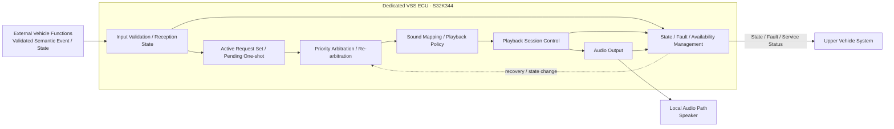

후방 장애물 기능의 경우 거리 측정과 위험도 판정은 VSS 외부에서 수행한다. VSS는 `주의`, `긴급`, `해제`처럼 의미가 확정된 상태를 받아 음향으로 표현한다.

본 구조는 **논리 책임과 정보 흐름**을 정의한다. 물리 통신 방식, 메시지 배치, ECU 간 실제 Network Producer/Consumer는 후속 Interface/Network 단계에서 확정한다.

---


<a id="sys-vss-s03"></a>
> 원문 구간: [VSS/02_VSS_SYSRS_FUNCTIONAL_BASELINE_DRAFT.md L77–137](https://github.com/vehicle-domain-control-system/integrated-vehicle-control/blob/1b1c4b834e4ac692f8e3eaf3e2680e4a530a2072/docs/requirements/VSS/02_VSS_SYSRS_FUNCTIONAL_BASELINE_DRAFT.md#L77-L137)

> **통합 검토:** [B16](#review-b16), [B17](#review-b17) — 원문과 제안을 함께 읽는다. 정책·수치·안전 동작을 자동 확정하지 않았다.

### 7.3 시스템 상태

VSS ECU는 최소 다음의 논리 상태를 제공해야 한다.

| State | 의미 |
|---|---|
| `STARTUP` | 전원 인가 후 초기화가 완료되지 않은 상태 |
| `READY` | 초기화가 완료되었고 현재 활성 Playback Session이 없는 상태 |
| `PLAYING` | 하나의 Playback Session이 활성화된 상태 |
| `FAULT` | 정상적인 VSS 음향 출력 능력을 보장할 수 없는 상태 |

`PLAYING`은 실제 오디오 파형이 발생하는 순간만을 의미하지 않는다. 하나의 Playback Session에 정의된 cue 간 무음, 반복 간격 등도 해당 Session이 유지되는 동안 `PLAYING`에 포함된다.

`READY`와 `PLAYING`은 모두 유효한 Semantic Event/State를 수용하고 중재할 수 있다. 따라서 **현재 재생 중인지**와 **새 입력을 수용 가능한지**를 동일 개념으로 취급하지 않는다.

#### 7.3.1 기본 상태 전이

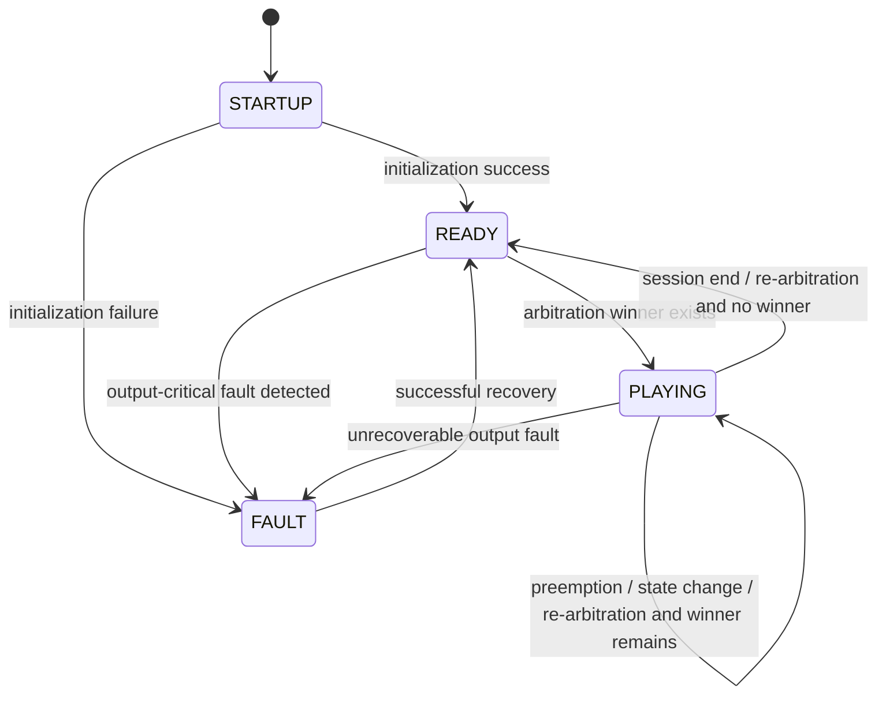

#### 7.3.2 상태 전이 해석 규칙

- `STARTUP -> READY` 후에도 유효 Stateful Request 또는 아직 의미 유효기간 안에 있는 One-shot Request가 있으면 재중재 후 `PLAYING`으로 전이할 수 있다.
- Stateful Request의 `CLEAR` 하나만으로 무조건 `PLAYING -> READY`로 전이하지 않는다. 다른 유효 요청이 남아 있으면 재중재 후 `PLAYING`을 유지한다.
- 높은 우선순위 Session에 선점된 Stateful Request는 유효 상태 자체를 잃지 않으며, 이후 다시 Winner가 되면 Playback Session을 재활성화할 수 있다.
- 재생이 시작된 One-shot이 높은 우선순위 Session에 선점된 경우 자동 Resume하지 않는다.
- `READY` 상태에서도 Output-critical Fault가 검출될 수 있으므로 `READY -> FAULT` 전이를 허용한다.
- Fault 복구 성공 시 우선 `READY`로 복귀한 뒤 현재 유효 요청을 다시 평가한다.
- `SLEEP` 또는 Wake 전원 상태를 top-level `VSS_STATE`에 추가할지는 Power Architecture 확정 후 결정한다.

#### 7.3.3 서비스 Availability 개념

VSS의 동작 State와 실제 서비스 제공 범위는 분리해 해석한다.

- **FULL**: 정의된 VSS 기능을 정상 제공 가능
- **DEGRADED**: 일부 Event/Asset/경로에 제한이 있으나 VSS 전체가 출력 불능은 아님
- **UNAVAILABLE**: 정상적인 VSS 음향 출력을 보장할 수 없음

다음 원칙을 사용한다.

- `UNAVAILABLE`은 정상 출력 능력을 보장할 수 없는 상태이므로 `FAULT`와 연계되어야 한다.
- `FULL` 또는 `DEGRADED` 상태에서는 `READY` 또는 `PLAYING`이 가능하다.
- `STARTUP` 동안 서비스 Availability는 아직 확정되지 않은 것으로 취급하며, 초기화 중이라는 이유만으로 `FAULT`로 간주하지 않는다.
- 실제 외부 Signal 이름, enum 숫자값 및 encoding은 Logical Interface/Network 단계에서 결정한다.

---


<a id="sys-vss-s04"></a>
> 원문 구간: [VSS/02_VSS_SYSRS_FUNCTIONAL_BASELINE_DRAFT.md L138–198](https://github.com/vehicle-domain-control-system/integrated-vehicle-control/blob/1b1c4b834e4ac692f8e3eaf3e2680e4a530a2072/docs/requirements/VSS/02_VSS_SYSRS_FUNCTIONAL_BASELINE_DRAFT.md#L138-L198)

> **통합 검토:** [B04](#review-b04), [B11](#review-b11), [B12](#review-b12), [B13](#review-b13), [B14](#review-b14), [B18](#review-b18) — 원문과 제안을 함께 읽는다. 정책·수치·안전 동작을 자동 확정하지 않았다.

### 7.4 Functional Requirements

| ID | Requirement |
|---|---|
| <a id="vss-sys-fun-001"></a>VSS-SYS-FUN-001 | VSS ECU는 전원 인가 후 자체 초기화를 수행하고 정상적인 경우 `READY` 상태로 전이해야 한다. |
| <a id="vss-sys-fun-002"></a>VSS-SYS-FUN-002 | VSS ECU는 외부 차량 시스템에서 제공된 유효한 VSS 의미 Event/State를 수용할 수 있어야 한다. |
| <a id="vss-sys-fun-003"></a>VSS-SYS-FUN-003 | VSS ECU는 수용한 의미 Event/State를 사전에 정의된 로컬 음향 자산 및 재생 정책과 대응시켜야 한다. |
| <a id="vss-sys-fun-004"></a>VSS-SYS-FUN-004 | VSS ECU는 동일한 의미 Event/State에 대해 정상 상태에서 일관된 음향 정책을 적용해야 한다. |
| <a id="vss-sys-fun-005"></a>VSS-SYS-FUN-005 | VSS ECU는 한 시점에 하나의 Playback Session만 활성 출력 대상으로 선택해야 한다. |
| <a id="vss-sys-fun-006"></a>VSS-SYS-FUN-006 | VSS ECU는 일반 피드백, 주의 경고, 긴급 경고의 세 우선순위 등급을 구분해야 한다. |
| <a id="vss-sys-fun-007"></a>VSS-SYS-FUN-007 | 긴급 경고는 현재 출력 중인 주의 경고 및 일반 피드백보다 우선해야 한다. |
| <a id="vss-sys-fun-008"></a>VSS-SYS-FUN-008 | 주의 경고는 현재 출력 중인 일반 피드백보다 우선해야 한다. |
| <a id="vss-sys-fun-009"></a>VSS-SYS-FUN-009 | 현재 Session보다 낮은 우선순위의 신규 요청은 현재 Session을 중단시키지 않아야 한다. |
| <a id="vss-sys-fun-010"></a>VSS-SYS-FUN-010 | 높은 우선순위 Playback Session에 의해 재생 도중 선점된 One-shot 일반 피드백은 선점 원인이 종료된 후 자동으로 재개되지 않아야 한다. |
| <a id="vss-sys-fun-011"></a>VSS-SYS-FUN-011 | VSS ECU는 One-shot 피드백 Event를 정의된 재생 정책에 따라 출력하고 종료할 수 있어야 한다. |
| <a id="vss-sys-fun-012"></a>VSS-SYS-FUN-012 | VSS ECU는 상태 유지형 경고의 현재 Effective State가 활성인 동안 해당 경고에 정의된 반복 또는 지속 Playback 정책을 적용해야 한다. |
| <a id="vss-sys-fun-013"></a>VSS-SYS-FUN-013 | 상태 유지형 경고의 유효한 해제 정보가 수용된 경우 해당 요청을 Active Request Set에서 제거하고 재중재해야 하며, 해당 경고음은 정의된 종료 시간 안에 종료되어야 한다. |
| <a id="vss-sys-fun-014"></a>VSS-SYS-FUN-014 | VSS ECU는 후방 장애물 주의 상태가 유효하게 제공된 경우 주의 경고음을 출력해야 한다. |
| <a id="vss-sys-fun-015"></a>VSS-SYS-FUN-015 | VSS ECU는 후방 장애물 긴급 상태가 유효하게 제공된 경우 주의 경고음과 구분되는 긴급 경고음을 출력해야 한다. |
| <a id="vss-sys-fun-016"></a>VSS-SYS-FUN-016 | 후방 장애물 상태가 주의에서 긴급으로 변경된 경우 VSS ECU는 현재 요청을 재중재하고 긴급 경고를 우선 출력해야 한다. |
| <a id="vss-sys-fun-017"></a>VSS-SYS-FUN-017 | 후방 장애물 위험 해제 상태가 유효하게 제공된 경우 VSS ECU는 해당 장애물 요청을 Active Request Set에서 제거하고 재중재해야 한다. |
| <a id="vss-sys-fun-018"></a>VSS-SYS-FUN-018 | VSS ECU는 후방 장애물의 실제 거리값을 이용하여 위험 수준을 직접 판정하지 않아야 한다. |
| <a id="vss-sys-fun-019"></a>VSS-SYS-FUN-019 | VSS ECU는 지원하지 않거나 유효하지 않은 의미 입력을 수용한 경우 임의의 음향을 출력하지 않아야 한다. |
| <a id="vss-sys-fun-020"></a>VSS-SYS-FUN-020 | VSS ECU는 필요한 로컬 음향 자산을 사용할 수 없는 경우 다른 의미의 음향으로 임의 대체하지 않아야 한다. |
| <a id="vss-sys-fun-021"></a>VSS-SYS-FUN-021 | VSS ECU는 현재 동작 상태와 정상 음향 서비스 제공 가능 수준 및 오류 존재 여부를 외부 차량 시스템이 확인할 수 있도록 해야 한다. |
| <a id="vss-sys-fun-022"></a>VSS-SYS-FUN-022 | VSS ECU는 조도 변화만을 근거로 음량을 자동 변경하지 않아야 한다. |
| <a id="vss-sys-fun-023"></a>VSS-SYS-FUN-023 | VSS ECU는 시간대 또는 주야간 정보만을 근거로 음량을 자동 변경하지 않아야 한다. |
| <a id="vss-sys-fun-024"></a>VSS-SYS-FUN-024 | VSS ECU는 외부에서 전달되는 오디오 스트림에 의존하지 않고 본 SysRS의 핵심 음향을 제공할 수 있어야 한다. |
| <a id="vss-sys-fun-025"></a>VSS-SYS-FUN-025 | VSS ECU는 다수 음원의 동시 Mixing을 수행하지 않아야 한다. |
| <a id="vss-sys-fun-026"></a>VSS-SYS-FUN-026 | VSS ECU는 일반 미디어 Ducking을 핵심 기능으로 포함하지 않아야 한다. |
| <a id="vss-sys-fun-027"></a>VSS-SYS-FUN-027 | VSS ECU는 Fade-in/Fade-out 연출을 핵심 기능으로 포함하지 않아야 한다. |

#### 7.4.1 Event-specific Functional Requirements

| ID | Requirement |
|---|---|
| <a id="vss-sys-fun-028"></a>VSS-SYS-FUN-028 | `VEHICLE_WELCOME` 의미 Event가 유효하게 수용된 경우 VSS ECU는 차량 사용 시작을 나타내는 일반 피드백 음향을 출력해야 한다. |
| <a id="vss-sys-fun-029"></a>VSS-SYS-FUN-029 | `VEHICLE_GOODBYE` 의미 Event가 유효하게 수용된 경우 VSS ECU는 차량 사용 종료를 나타내는 일반 피드백 음향을 출력해야 한다. |
| <a id="vss-sys-fun-030"></a>VSS-SYS-FUN-030 | `DOOR_LOCK_COMPLETE` 의미 Event가 유효하게 수용된 경우 VSS ECU는 도어 잠금 완료를 나타내는 일반 피드백 음향을 출력해야 한다. |
| <a id="vss-sys-fun-031"></a>VSS-SYS-FUN-031 | `DOOR_UNLOCK_COMPLETE` 의미 Event가 유효하게 수용된 경우 VSS ECU는 도어 잠금 완료 음향과 구분 가능한 음향 또는 재생 패턴을 출력해야 한다. |
| <a id="vss-sys-fun-032"></a>VSS-SYS-FUN-032 | `DOOR_LOCK_ERROR` 의미 Event가 유효하게 수용된 경우 VSS ECU는 정상 잠금 완료 음향과 구분 가능한 주의 경고음을 출력해야 한다. |
| <a id="vss-sys-fun-033"></a>VSS-SYS-FUN-033 | 파워윈도우 안티핀치 위험 상태가 유효하게 `ACTIVE`인 동안 VSS ECU는 정의된 긴급 경고 Playback 정책을 유지해야 하며, 유효한 해제 상태가 수용되면 VSS-SYS-PER-006을 만족하도록 해당 경고를 종료해야 한다. |
| <a id="vss-sys-fun-034"></a>VSS-SYS-FUN-034 | 잔류 탑승자 위험 상태가 유효하게 `ACTIVE`인 동안 VSS ECU는 정의된 긴급 경고 Playback 정책을 유지해야 하며, 유효한 해제 상태가 수용되면 VSS-SYS-PER-006을 만족하도록 해당 경고를 종료해야 한다. |

#### 7.4.2 Stateful / Re-arbitration Functional Requirements

| ID | Requirement |
|---|---|
| <a id="vss-sys-fun-035"></a>VSS-SYS-FUN-035 | VSS ECU는 각 상태 유지형 입력의 최신 정상 의미 상태와 현재 수신 품질을 기능별로 독립적으로 관리하고, 정의된 Fail-safe 정책을 적용한 현재 Effective State를 중재 입력으로 사용해야 한다. |
| <a id="vss-sys-fun-036"></a>VSS-SYS-FUN-036 | Stateful 입력의 활성·해제·등급 변경, 현재 Playback Session의 종료, 선점 조건 변경 또는 오류 복구가 발생한 경우 VSS ECU는 현재 유효 요청 집합을 다시 중재해야 한다. |
| <a id="vss-sys-fun-037"></a>VSS-SYS-FUN-037 | 높은 우선순위 Playback Session에 의해 선점된 Stateful Warning/Emergency의 Effective State가 계속 활성인 경우, 재중재 결과 해당 요청이 다시 Winner가 되면 VSS ECU는 해당 Playback Session을 다시 활성화해야 한다. |
| <a id="vss-sys-fun-038"></a>VSS-SYS-FUN-038 | `PLAYING` 상태는 하나의 Playback Session이 활성화된 전체 기간을 의미해야 하며 해당 Session에 정의된 cue 간 무음 및 반복 간격을 포함해야 한다. |
| <a id="vss-sys-fun-039"></a>VSS-SYS-FUN-039 | VSS ECU는 One-shot Event가 최초로 유효 수용된 시점부터 정의된 의미 유효 수명(Max Age)을 적용해야 한다. |
| <a id="vss-sys-fun-040"></a>VSS-SYS-FUN-040 | 더 높은 Priority Session 또는 STARTUP 상태로 인해 One-shot Event가 즉시 재생되지 못한 경우, 해당 Event가 정의된 Max Age를 초과하면 VSS ECU는 이를 폐기하고 이후 자동 재생하지 않아야 한다. |
| <a id="vss-sys-fun-041"></a>VSS-SYS-FUN-041 | 이미 재생이 시작된 One-shot Event가 선점된 경우에는 VSS-SYS-FUN-010을 적용하고, 아직 재생을 시작하지 못한 One-shot Event에는 VSS-SYS-FUN-039 및 VSS-SYS-FUN-040을 적용해야 한다. |
| <a id="vss-sys-fun-042"></a>VSS-SYS-FUN-042 | 후방 장애물 Effective State가 `EMERGENCY`에서 `CAUTION`으로 유효하게 변경된 경우 VSS ECU는 Emergency Session을 종료하고 현재 유효 요청을 재중재하여 Caution Session을 적용해야 한다. |
| <a id="vss-sys-fun-043"></a>VSS-SYS-FUN-043 | VSS ECU는 후방 장애물의 최신 유효 의미 상태(`CLEAR`, `CAUTION`, `EMERGENCY`)를 상태형 정보로 관리하고 상태 변경 시 해당 값을 중재 입력에 반영해야 한다. |
| <a id="vss-sys-fun-044"></a>VSS-SYS-FUN-044 | 상태 유지형 입력의 동일한 활성 값이 주기적으로 반복 수신되는 경우 VSS ECU는 이를 새로운 경고 발생으로 해석하여 Playback Session을 매 수신마다 재시작해서는 안 된다. |

---


<a id="sys-vss-s05"></a>
> 원문 구간: [VSS/02_VSS_SYSRS_FUNCTIONAL_BASELINE_DRAFT.md L199–245](https://github.com/vehicle-domain-control-system/integrated-vehicle-control/blob/1b1c4b834e4ac692f8e3eaf3e2680e4a530a2072/docs/requirements/VSS/02_VSS_SYSRS_FUNCTIONAL_BASELINE_DRAFT.md#L199-L245)

### 7.5 Semantic Input Requirements

본 단계에서는 실제 CAN Signal Name, 숫자 Event ID, bit width를 정의하지 않는다. VSS가 필요로 하는 **의미 정보의 종류와 동작 의미**만 정의한다.

#### 7.5.1 One-shot Semantic Event

| Semantic Event | Meaning | Default Class | Baseline Behavior |
|---|---|---|---|
| `VEHICLE_WELCOME` | 차량 사용 시작 | Feedback | One-shot feedback |
| `VEHICLE_GOODBYE` | 차량 사용 종료 | Feedback | One-shot feedback |
| `DOOR_LOCK_COMPLETE` | 도어 잠금 정상 완료 | Feedback | One-shot feedback |
| `DOOR_UNLOCK_COMPLETE` | 도어 잠금 해제 정상 완료 | Feedback | Lock feedback과 구분 가능한 feedback |
| `DOOR_LOCK_ERROR` | 도어 잠금 이상 | Warning | Lock 완료와 구분 가능한 warning |

> `DOOR_UNLOCK_COMPLETE`의 **2 cues / 150–300 ms**는 Baseline 요구가 아니라 §6의 Candidate Playback 값이다.

#### 7.5.2 Stateful Semantic Information

| Semantic Information | Required Meaning | Default Class | Baseline Behavior |
|---|---|---|---|
| Power Window Anti-Pinch | `CLEAR / ACTIVE` 의미 구분 | Emergency when ACTIVE | ACTIVE 동안 경고 유지, CLEAR 시 종료 |
| Occupant Hazard | `CLEAR / ACTIVE` 의미 구분 | Emergency when ACTIVE | ACTIVE 동안 경고 유지, CLEAR 시 종료 |
| Rear Obstacle | `CLEAR / CAUTION / EMERGENCY` 의미 구분 | Warning / Emergency | 위험 단계 변경에 따라 재중재, CLEAR 시 종료 |

`SNA (Signal Not Available)`는 Producer가 현재 정상 Semantic State를 제공할 수 없음을 나타내는 의미 상태이다. `NOT_AVAILABLE/SNA`, `NOT_RECEIVED`, `STALE`, `INVALID`는 정상 차량 의미 상태와 동일한 값이 아니다. 정상 `CLEAR`와 통신/수신 품질 이상을 구분해야 하며, 실제 wire encoding은 후속 단계에서 결정한다.

#### 7.5.3 후방 장애물 위험 상태의 VSS 처리 개념

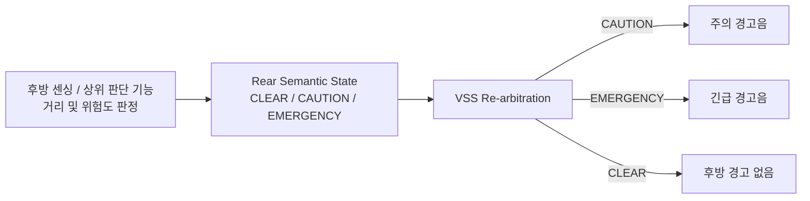

후방 장애물 실제 거리값, 거리 임계값, 센서 필터링 및 위험도 판단은 VSS SysRS의 책임 범위가 아니다.

---


<a id="sys-vss-s06"></a>
> 원문 구간: [VSS/02_VSS_SYSRS_FUNCTIONAL_BASELINE_DRAFT.md L246–280](https://github.com/vehicle-domain-control-system/integrated-vehicle-control/blob/1b1c4b834e4ac692f8e3eaf3e2680e4a530a2072/docs/requirements/VSS/02_VSS_SYSRS_FUNCTIONAL_BASELINE_DRAFT.md#L246-L280)

### 7.6 Candidate Playback Behavior

다음 값은 기능 검증을 위한 임시 기준이며, Baseline 기능 의미와 구분한다.

| Item | Candidate |
|---|---:|
| Active audio channels / active playback winner | `1` |
| Priority levels | `3` |
| Feedback output setpoint | `60 %` |
| Warning output setpoint | `80 %` |
| Emergency output setpoint | `100 %` |
| General one-shot sound duration | `≤ 2.0 s` |
| Lock feedback recognition cues | `1` |
| Unlock feedback recognition cues | `2` |
| Unlock cue-to-cue interval | `150–300 ms` |
| Rear obstacle caution repeat interval | `500 ms` |
| Rear obstacle emergency repeat interval | `200 ms or continuous asset` |
| Duplicate one-shot suppression window | `150 ms` |
| Rear emergency→caution transition | `≤ 100 ms` |
| One-shot maximum semantic age | `TBD` |
| Equal-class arbitration detail | `TBD — fixed deterministic policy required` |

> `60/80/100%`는 VSS 내부 출력 제어 기준을 잡기 위한 상대 Setpoint이며 실제 음압(dBA) 요구사항이 아니다. 외부 `SET_VOLUME` Command 요구를 의미하지 않는다.  
> `Duplicate one-shot suppression window`는 동일 발생 Event의 중복 전달을 막기 위한 보조 Candidate이다. 실제 발생 식별 방식과 Counter 폭은 후속 Interface/Network 단계에서 결정한다.

다음 v0.6.2 작업안의 값은 아직 System 승인 근거가 부족하므로 본 SysRS Candidate 표에 승격하지 않는다.

- Door Lock Error `3 cues / 250 ms`
- Anti-Pinch `250 ms repeat`
- Occupant Hazard `1000 ms repeat`

위 값은 후속 System 리뷰에서 별도 승인/수정한다.

---


<a id="sys-vss-s07"></a>
> 원문 구간: [VSS/02_VSS_SYSRS_FUNCTIONAL_BASELINE_DRAFT.md L281–299](https://github.com/vehicle-domain-control-system/integrated-vehicle-control/blob/1b1c4b834e4ac692f8e3eaf3e2680e4a530a2072/docs/requirements/VSS/02_VSS_SYSRS_FUNCTIONAL_BASELINE_DRAFT.md#L281-L299)

> **통합 검토:** [B11](#review-b11), [B12](#review-b12) — 원문과 제안을 함께 읽는다. 정책·수치·안전 동작을 자동 확정하지 않았다.

### 7.7 Performance Requirements

| ID | Requirement | Candidate |
|---|---|---:|
| <a id="vss-sys-per-001"></a>VSS-SYS-PER-001 | 전원 인가 후 VSS ECU는 `READY` 또는 `FAULT` 상태를 확정해야 한다. | `≤ 1000 ms` |
| <a id="vss-sys-per-002"></a>VSS-SYS-PER-002 | 일반 피드백 Event가 VSS 내부에서 유효하게 수용된 시점부터 음향 출력이 시작될 때까지의 지연은 제한되어야 한다. | `≤ 200 ms` |
| <a id="vss-sys-per-003"></a>VSS-SYS-PER-003 | 주의 경고 요청이 VSS 내부에서 유효하게 수용된 시점부터 음향 출력이 시작될 때까지의 지연은 제한되어야 한다. | `≤ 100 ms` |
| <a id="vss-sys-per-004"></a>VSS-SYS-PER-004 | 긴급 경고 요청이 VSS 내부에서 유효하게 수용된 시점부터 음향 출력이 시작될 때까지의 지연은 제한되어야 한다. | `≤ 50 ms` |
| <a id="vss-sys-per-005"></a>VSS-SYS-PER-005 | 긴급 경고가 낮은 우선순위 음향을 선점하는 내부 처리 시간은 제한되어야 한다. | `≤ 50 ms` |
| <a id="vss-sys-per-006"></a>VSS-SYS-PER-006 | 상태 유지형 경고의 유효한 해제 정보가 VSS 내부에서 수용된 후 해당 경고 출력이 종료될 때까지의 지연은 제한되어야 한다. | `≤ 100 ms` |
| <a id="vss-sys-per-007"></a>VSS-SYS-PER-007 | 후방 장애물 상태가 주의에서 긴급으로 변경된 후 긴급 경고 출력으로 전환되는 시간은 제한되어야 한다. | `[CANDIDATE] ≤ 50 ms` |
| <a id="vss-sys-per-008"></a>VSS-SYS-PER-008 | VSS의 내부 상태가 변경된 후 외부에 제공할 상태 정보가 갱신 가능한 상태가 되기까지의 시간은 제한되어야 한다. | `≤ 100 ms` |
| <a id="vss-sys-per-009"></a>VSS-SYS-PER-009 | 복구 가능한 VSS 음향 출력 오류는 제한된 시간 안에 정상 상태 또는 명확한 실패 상태로 결정되어야 한다. | `[CANDIDATE] ≤ 2000 ms` |
| <a id="vss-sys-per-010"></a>VSS-SYS-PER-010 | 후방 장애물 Effective State가 `EMERGENCY`에서 `CAUTION`으로 유효하게 변경된 후 Caution Playback Session이 적용되기까지의 시간은 제한되어야 한다. | `[CANDIDATE] ≤ 100 ms` |

위 시간은 VSS ECU가 해당 정보를 **유효하게 수용한 시점부터의 내부 시스템 성능**이다. 차량 네트워크 전송 지연 및 송신 주기는 포함하지 않는다.

---


<a id="sys-vss-s08"></a>
> 원문 구간: [VSS/02_VSS_SYSRS_FUNCTIONAL_BASELINE_DRAFT.md L300–353](https://github.com/vehicle-domain-control-system/integrated-vehicle-control/blob/1b1c4b834e4ac692f8e3eaf3e2680e4a530a2072/docs/requirements/VSS/02_VSS_SYSRS_FUNCTIONAL_BASELINE_DRAFT.md#L300-L353)

> **통합 검토:** [B03](#review-b03), [B13](#review-b13), [B19](#review-b19) — 원문과 제안을 함께 읽는다. 정책·수치·안전 동작을 자동 확정하지 않았다.

### 7.8 External Logical Interface Requirements

본 절은 실제 통신 프로토콜을 정의하지 않는다. 후속 Interface 설계에서 필요한 **의미 계약**을 누락하지 않기 위한 논리 요구사항이다.

#### 7.8.1 VSS가 외부에서 필요로 하는 정보

| ID | Requirement |
|---|---|
| <a id="vss-sys-int-001"></a>VSS-SYS-INT-001 | VSS ECU는 어떤 One-shot 차량 Event가 발생했는지 식별 가능한 정보를 제공받아야 한다. |
| <a id="vss-sys-int-002"></a>VSS-SYS-INT-002 | 상태 유지형 입력의 경우 VSS ECU는 해당 의미 상태의 활성 및 해제를 구분 가능한 형태로 제공받아야 한다. |
| <a id="vss-sys-int-003"></a>VSS-SYS-INT-003 | 후방 장애물 경고 기능을 위해 VSS ECU는 최소한 `주의`, `긴급`, `해제`의 의미 상태를 구분 가능한 형태로 제공받아야 한다. |
| <a id="vss-sys-int-004"></a>VSS-SYS-INT-004 | VSS ECU에 제공되는 후방 장애물 정보는 거리 Raw Data가 아니라 위험 수준이 판단된 의미 상태를 기본으로 해야 한다. |
| <a id="vss-sys-int-005"></a>VSS-SYS-INT-005 | VSS에 제공되는 Event/State 정보는 VSS가 센서 Raw Data를 직접 판정하지 않아도 될 정도로 의미가 확정된 형태여야 한다. |

#### 7.8.2 VSS가 외부에 제공해야 하는 정보

| ID | Requirement |
|---|---|
| <a id="vss-sys-int-006"></a>VSS-SYS-INT-006 | VSS ECU는 `READY`뿐 아니라 입력 수용 가능한 `PLAYING` 상태를 포함하여 현재 Semantic Event/State를 수용 가능한지 외부 시스템이 확인할 수 있도록 해야 한다. |
| <a id="vss-sys-int-007"></a>VSS-SYS-INT-007 | VSS ECU는 정상/오류 상태와 정상 음향 서비스 제공 가능 수준을 외부 시스템이 확인할 수 있도록 해야 한다. |
| <a id="vss-sys-int-008"></a>VSS-SYS-INT-008 | VSS ECU는 필요한 경우 현재 Playback Session 활성 여부 또는 현재 음향 출력 상태를 외부 시스템이 확인할 수 있도록 해야 한다. |
| <a id="vss-sys-int-009"></a>VSS-SYS-INT-009 | VSS ECU가 오류에서 복구된 경우 외부 시스템이 정상 복귀 여부를 확인할 수 있도록 해야 한다. |

#### 7.8.3 Startup / Wake / Input Quality 계약

| ID | Requirement |
|---|---|
| <a id="vss-sys-int-010"></a>VSS-SYS-INT-010 | VSS ECU가 STARTUP 또는 Wake 전환으로 아직 정상 Event 처리가 불가능한 구간에 One-shot Event가 발생할 수 있는 경우, VSS Logical Interface는 해당 Event가 의미 유효기간 안에서 유실되지 않도록 하는 Delivery Contract를 제공해야 한다. |
| <a id="vss-sys-int-011"></a>VSS-SYS-INT-011 | Startup/Wake Event Delivery 방식은 VSS 선행 Wake, VSS 수용 가능 상태 확인 후 송신, Startup Event Latch 또는 동등한 방식 중 하나로 프로젝트 Power/Interface 설계에서 확정되어야 하며, 선택된 방식은 VSS-SYS-INT-010의 Event 유실 방지 요구를 만족해야 한다. |
| <a id="vss-sys-int-012"></a>VSS-SYS-INT-012 | Startup/Wake 또는 통신 복구 이전에 발생한 One-shot Event가 정의된 Max Age를 초과한 경우 해당 Event를 신규 유효 Event처럼 재생 또는 재전달해서는 안 된다. |
| <a id="vss-sys-int-013"></a>VSS-SYS-INT-013 | 상태 유지형 입력이 `NOT_AVAILABLE/SNA` 의미를 지원하는 경우, 해당 상태는 정상 의미 상태와 구분 가능한 형태로 제공되어야 한다. |
| <a id="vss-sys-int-014"></a>VSS-SYS-INT-014 | VSS ECU는 상태 유지형 입력별로 최소 `NOT_RECEIVED`, `VALID`, `STALE`, `INVALID`의 수신 품질 상태를 내부적으로 구분해야 한다. |
| <a id="vss-sys-int-015"></a>VSS-SYS-INT-015 | 상태 유지형 입력의 `NOT_RECEIVED`, `STALE`, `INVALID` 또는 `NOT_AVAILABLE/SNA` 상태가 정상 안전 상태인 `CLEAR`로 자동 해석되어서는 안 된다. |
| <a id="vss-sys-int-016"></a>VSS-SYS-INT-016 | 통합 검증에서 상태 유지형 입력의 수신 품질과 적용된 Fail-safe 상태를 확인할 수 있는 진단 또는 시험 관측 경로가 제공되어야 한다. |
| <a id="vss-sys-int-017"></a>VSS-SYS-INT-017 | One-shot Event 전달 계약은 동일 발생의 반복 전달과 별개의 새로운 발생을 구분하여 중복 전달이 중복 재생을 유발하지 않도록 해야 한다. |

#### 7.8.4 본 단계에서 결정하지 않는 항목

- CAN / LIN / UART 등 실제 물리·데이터링크 프로토콜
- Message ID / Signal ID / 실제 Signal Name
- Payload Byte Layout / DLC / Start Bit / Endianness
- 최종 송신 주기 / Timeout / Freshness 수치
- Event occurrence 식별 방식의 실제 Counter bit 폭
- Alive/Rolling Counter
- CRC / E2E
- Bus-Off 정책 및 실제 Network Recovery 절차
- Bit Rate / Data Rate
- Arbitration 우선순위 / Bus Load
- Startup/Wake의 실제 전원·네트워크 구현
- 후방 장애물 주의/긴급 거리 임계값
- 초음파 센서 샘플링 주기 및 필터링 방식

---


<a id="sys-vss-s09"></a>
> 원문 구간: [VSS/02_VSS_SYSRS_FUNCTIONAL_BASELINE_DRAFT.md L354–366](https://github.com/vehicle-domain-control-system/integrated-vehicle-control/blob/1b1c4b834e4ac692f8e3eaf3e2680e4a530a2072/docs/requirements/VSS/02_VSS_SYSRS_FUNCTIONAL_BASELINE_DRAFT.md#L354-L366)

### 7.9 Safety / Priority Requirements

| ID | Requirement |
|---|---|
| <a id="vss-sys-saf-001"></a>VSS-SYS-SAF-001 | 긴급 경고는 주의 경고 및 일반 피드백보다 높은 우선순위로 처리되어야 한다. |
| <a id="vss-sys-saf-002"></a>VSS-SYS-SAF-002 | 주의 경고는 일반 피드백보다 높은 우선순위로 처리되어야 한다. |
| <a id="vss-sys-saf-003"></a>VSS-SYS-SAF-003 | 후방 장애물 긴급 상태는 후방 장애물 주의 상태보다 높은 우선순위로 처리되어야 한다. |
| <a id="vss-sys-saf-004"></a>VSS-SYS-SAF-004 | 유효하지 않은 의미 입력 또는 사용할 수 없는 음향 자산으로 인해 잘못된 의미의 음향이 출력되어서는 안 된다. |
| <a id="vss-sys-saf-005"></a>VSS-SYS-SAF-005 | VSS ECU의 오류가 파워윈도우, 공조, 조명, 센싱 등 다른 차량 기능의 제어 상태를 직접 변경해서는 안 된다. |
| <a id="vss-sys-saf-006"></a>VSS-SYS-SAF-006 | VSS ECU가 정상적인 음향 출력을 보장할 수 없는 경우 해당 상태가 외부 시스템에서 식별 가능해야 한다. |

---


<a id="sys-vss-s10"></a>
> 원문 구간: [VSS/02_VSS_SYSRS_FUNCTIONAL_BASELINE_DRAFT.md L367–423](https://github.com/vehicle-domain-control-system/integrated-vehicle-control/blob/1b1c4b834e4ac692f8e3eaf3e2680e4a530a2072/docs/requirements/VSS/02_VSS_SYSRS_FUNCTIONAL_BASELINE_DRAFT.md#L367-L423)

> **통합 검토:** [B16](#review-b16) — 원문과 제안을 함께 읽는다. 정책·수치·안전 동작을 자동 확정하지 않았다.

### 7.10 Diagnostic Requirements

#### 7.10.1 Internal VSS Output Fault Categories

다음은 VSS 자체의 음향 서비스/출력 능력에 영향을 주는 Internal Fault Category이다.

- `SOUND_ASSET_UNAVAILABLE`
- `PLAYBACK_START_FAILURE`
- `AUDIO_OUTPUT_FAILURE`
- `PLAYBACK_STATE_FAILURE`
- `INITIALIZATION_FAILURE`

실제 DTC 번호, Fault bitmask, Severity encoding 및 네트워크 진단 포맷은 본 단계에서 정의하지 않는다.

#### 7.10.2 Input / Interface Diagnostic Conditions

다음은 외부 입력 또는 통신/수신 품질과 관련된 진단 조건이며, Internal VSS Output Fault와 분리한다.

- `INVALID_EVENT`
- `INPUT_NOT_RECEIVED`
- `INPUT_STALE`
- `INPUT_INVALID`

CRC/E2E/Alive Counter/Bus-Off 관련 세부 진단 항목은 실제 Network 설계 이후 필요한 수준으로 확장한다.

#### 7.10.3 Fault / Availability Requirements

| ID | Requirement |
|---|---|
| <a id="vss-sys-dia-001"></a>VSS-SYS-DIA-001 | VSS ECU는 정상 음향 출력을 방해하는 Internal Output Fault를 검출할 수 있어야 한다. |
| <a id="vss-sys-dia-002"></a>VSS-SYS-DIA-002 | VSS ECU는 최근 발생한 주요 Internal Output Fault 원인을 식별 가능하게 유지해야 한다. |
| <a id="vss-sys-dia-003"></a>VSS-SYS-DIA-003 | 초기화 실패 시 VSS ECU는 `FAULT` 상태로 전이해야 한다. |
| <a id="vss-sys-dia-004"></a>VSS-SYS-DIA-004 | 복구 가능한 음향 출력 오류의 경우 VSS ECU는 전체 차량 시스템 재시작 없이 정상 상태로 복귀할 수 있어야 한다. |
| <a id="vss-sys-dia-005"></a>VSS-SYS-DIA-005 | 복구에 실패하여 정상 음향 출력을 보장할 수 없는 경우 VSS ECU는 `FAULT` 상태를 유지하고 오류 상태를 외부에 제공할 수 있어야 한다. |
| <a id="vss-sys-dia-006"></a>VSS-SYS-DIA-006 | 유효하지 않은 의미 입력이 수용된 경우 VSS ECU는 잘못된 음향을 출력하지 않고 해당 이상을 Input Diagnostic으로 처리할 수 있어야 한다. |
| <a id="vss-sys-dia-007"></a>VSS-SYS-DIA-007 | 필요한 로컬 음향 자산을 사용할 수 없는 경우 해당 Event/State에 대해 잘못된 대체 음향을 출력하지 않아야 한다. |
| <a id="vss-sys-dia-008"></a>VSS-SYS-DIA-008 | VSS ECU가 `READY` 상태에서 정상 음향 출력을 보장할 수 없게 하는 Output-critical Fault를 검출한 경우 `FAULT` 상태로 전이해야 한다. |
| <a id="vss-sys-dia-009"></a>VSS-SYS-DIA-009 | VSS ECU가 `PLAYING` 상태에서 정상 음향 출력을 보장할 수 없게 하는 복구 불가능 Output Fault를 검출한 경우 `FAULT` 상태로 전이해야 한다. |
| <a id="vss-sys-dia-010"></a>VSS-SYS-DIA-010 | 복구 가능한 오류에 대해 VSS ECU는 복구 절차 수행 중 정상적인 신규 일반 피드백을 출력 가능한 상태로 외부에 잘못 보고해서는 안 된다. |
| <a id="vss-sys-dia-011"></a>VSS-SYS-DIA-011 | 복구 성공 후 VSS ECU는 `READY`로 복귀한 뒤 현재 유효한 Stateful Request와 Max Age 이내 One-shot Request를 다시 평가해야 한다. |
| <a id="vss-sys-dia-012"></a>VSS-SYS-DIA-012 | VSS ECU는 외부 입력의 유효성/수신 품질 이상과 VSS 내부 음향 출력 Fault를 서로 구분 가능한 진단 상태로 관리해야 한다. |
| <a id="vss-sys-dia-013"></a>VSS-SYS-DIA-013 | `INVALID_EVENT`, `INPUT_NOT_RECEIVED`, `INPUT_STALE`, `INPUT_INVALID`와 같은 입력 진단 조건만으로 VSS 내부 Output Fault가 존재하는 것으로 보고해서는 안 된다. |
| <a id="vss-sys-dia-014"></a>VSS-SYS-DIA-014 | VSS ECU는 현재 활성 Internal Output Fault 존재 여부와 최근 발생한 주요 Internal Output Fault 원인을 서로 구분 가능한 형태로 관리해야 한다. |
| <a id="vss-sys-dia-015"></a>VSS-SYS-DIA-015 | Internal Output Fault가 복구된 경우 해당 Active Fault 상태는 해제되어야 하며, 최근 주요 Fault 정보는 정의된 Diagnostic Clear 정책이 적용될 때까지 식별 가능해야 한다. |
| <a id="vss-sys-dia-016"></a>VSS-SYS-DIA-016 | VSS ECU는 Internal Output Fault가 일부 음향 기능에만 영향을 주는 경우와 전체 정상 음향 출력을 보장할 수 없는 경우를 구분 가능한 서비스 Availability 상태로 관리해야 한다. |
| <a id="vss-sys-dia-017"></a>VSS-SYS-DIA-017 | 복구 가능한 Internal Output Fault와 복구 불가능한 Internal Output Fault의 분류 및 각 Fault별 Recovery Action은 정의된 진단 정책에 따라 결정되어야 한다. |
| <a id="vss-sys-dia-018"></a>VSS-SYS-DIA-018 | 둘 이상의 Internal Output Fault가 동시에 존재할 수 있는 경우 VSS ECU는 각 Active Fault 상태를 내부적으로 손실 없이 관리해야 한다. |

##### Service Availability 해석 원칙

- 일부 Asset 또는 일부 기능만 제한되고 다른 주요 음향 기능은 계속 제공 가능한 경우 `DEGRADED`로 관리할 수 있다.
- 공통 Audio Output Path 실패 또는 초기화 실패처럼 정상 음향 출력을 보장할 수 없는 경우 `UNAVAILABLE`로 관리하고 `FAULT` 상태와 연계해야 한다.
- `STARTUP`은 초기화 진행 상태이며, 서비스 Availability가 아직 확정되지 않았다는 이유만으로 Internal Fault로 처리하지 않는다.
- 실제 Availability Signal 이름과 wire encoding은 후속 Interface 단계에서 결정한다.

---


<a id="sys-vss-s11"></a>
> 원문 구간: [VSS/02_VSS_SYSRS_FUNCTIONAL_BASELINE_DRAFT.md L424–468](https://github.com/vehicle-domain-control-system/integrated-vehicle-control/blob/1b1c4b834e4ac692f8e3eaf3e2680e4a530a2072/docs/requirements/VSS/02_VSS_SYSRS_FUNCTIONAL_BASELINE_DRAFT.md#L424-L468)

> **통합 검토:** [B14](#review-b14), [B15](#review-b15) — 원문과 제안을 함께 읽는다. 정책·수치·안전 동작을 자동 확정하지 않았다.

### 7.11 Non-Functional Requirements

#### 7.11.1 Robustness

| ID | Requirement |
|---|---|
| <a id="vss-sys-nfr-001"></a>VSS-SYS-NFR-001 | 유효하지 않은 의미 입력이 VSS ECU 전체의 비정상 종료를 유발해서는 안 된다. |
| <a id="vss-sys-nfr-002"></a>VSS-SYS-NFR-002 | 반복되는 동일 Event/State 입력으로 인해 재생 상태가 비정상적으로 누적되거나 교착되어서는 안 된다. |
| <a id="vss-sys-nfr-003"></a>VSS-SYS-NFR-003 | VSS ECU는 정상적인 Event/State 처리 과정에서 무한 대기 상태에 진입하지 않아야 한다. |
| <a id="vss-sys-nfr-004"></a>VSS-SYS-NFR-004 | VSS 관련 오류는 다른 차량 기능과 기능적으로 격리되어야 한다. |
| <a id="vss-sys-nfr-018"></a>VSS-SYS-NFR-018 | 입력 상태의 `NOT_RECEIVED`, `STALE`, `INVALID`, `NOT_AVAILABLE/SNA`는 별도로 정의된 Fail-safe 정책 없이 정상 `CLEAR` 상태로 치환되어서는 안 된다. |
| <a id="vss-sys-nfr-019"></a>VSS-SYS-NFR-019 | 입력 품질 이상 상태가 발생하더라도 VSS ECU는 마지막 정상 입력값, 현재 수신 품질 및 적용된 Effective State를 논리적으로 구분 가능하게 관리해야 한다. |

#### 7.11.2 Predictability

| ID | Requirement |
|---|---|
| <a id="vss-sys-nfr-005"></a>VSS-SYS-NFR-005 | 동일한 초기 상태와 동일한 유효 요청 집합에서는 동일한 우선순위 및 재생 정책이 적용되어야 한다. |
| <a id="vss-sys-nfr-006"></a>VSS-SYS-NFR-006 | 동시에 여러 요청이 유효한 경우 결과 Playback Session은 명시된 우선순위 정책에 따라 결정되어야 한다. |
| <a id="vss-sys-nfr-007"></a>VSS-SYS-NFR-007 | 한 시점의 활성 Playback Winner는 1개를 초과하지 않아야 한다. |
| <a id="vss-sys-nfr-015"></a>VSS-SYS-NFR-015 | 동일 Priority Class에 둘 이상의 유효 요청이 동시에 존재하는 경우 VSS ECU는 사전에 정의된 Event-level Sub-priority 또는 동등한 결정 규칙에 따라 하나의 Winner를 결정해야 한다. |
| <a id="vss-sys-nfr-016"></a>VSS-SYS-NFR-016 | 동일한 초기 상태와 동일한 유효 요청 집합에서는 요청의 수신 순서와 무관하게 동일한 Arbitration 결과가 결정되어야 한다. |
| <a id="vss-sys-nfr-017"></a>VSS-SYS-NFR-017 | 동일 Class 중재 규칙과 Event-level Sub-priority는 재생 로직에 분산되지 않고 일관된 관리 단위에서 변경 가능해야 한다. |

> 동일 Class의 실제 Sub-priority 값은 아직 `TBD`이다. `First Accepted`처럼 수신 순서에 따라 결과가 바뀔 수 있는 규칙만으로 NFR-016을 만족한다고 간주하지 않는다.

#### 7.11.3 Maintainability

| ID | Requirement |
|---|---|
| <a id="vss-sys-nfr-008"></a>VSS-SYS-NFR-008 | 의미 Event/State와 음향 자산의 대응 관계는 일관된 관리 단위로 변경 가능해야 한다. |
| <a id="vss-sys-nfr-009"></a>VSS-SYS-NFR-009 | 음향 우선순위 정책은 전체 기능 로직에 분산되지 않고 일관되게 관리 가능해야 한다. |
| <a id="vss-sys-nfr-010"></a>VSS-SYS-NFR-010 | 실제 통신 프로토콜 변경이 VSS의 음향 정책 자체를 불필요하게 변경시키지 않도록 논리 인터페이스와 통신 구현이 분리 가능해야 한다. |

#### 7.11.4 Testability

| ID | Requirement |
|---|---|
| <a id="vss-sys-nfr-011"></a>VSS-SYS-NFR-011 | VSS ECU는 실제 파워윈도우 또는 초음파 센서를 직접 연결하지 않고 의미 Event/State 입력만으로 핵심 음향 기능을 시험할 수 있어야 한다. |
| <a id="vss-sys-nfr-012"></a>VSS-SYS-NFR-012 | VSS ECU는 각 의미 Event/State에 대해 대응 음향과 우선순위 정책을 독립적으로 검증할 수 있어야 한다. |
| <a id="vss-sys-nfr-013"></a>VSS-SYS-NFR-013 | VSS ECU는 음향 자산 미사용 가능, 유효하지 않은 입력 및 출력 실패 조건을 시험할 수 있어야 한다. |
| <a id="vss-sys-nfr-014"></a>VSS-SYS-NFR-014 | 서로 다른 의미를 가진 주요 피드백 및 경고 음향은 사용자가 의미 차이를 구분할 수 있도록 서로 구분 가능한 재생 특성을 가져야 한다. |

---


<a id="sys-vss-s12"></a>
> 원문 구간: [VSS/02_VSS_SYSRS_FUNCTIONAL_BASELINE_DRAFT.md L469–510](https://github.com/vehicle-domain-control-system/integrated-vehicle-control/blob/1b1c4b834e4ac692f8e3eaf3e2680e4a530a2072/docs/requirements/VSS/02_VSS_SYSRS_FUNCTIONAL_BASELINE_DRAFT.md#L469-L510)

### 7.12 Candidate Acceptance Criteria

| Test | Candidate Acceptance |
|---|---|
| Power-on readiness | 전원 인가 후 `≤ 1000 ms` 이내 READY 또는 FAULT 확정 |
| Feedback response | 내부 유효 수용 후 `≤ 200 ms` 이내 출력 시작 |
| Warning response | 내부 유효 수용 후 `≤ 100 ms` 이내 출력 시작 |
| Emergency response | 내부 유효 수용 후 `≤ 50 ms` 이내 출력 시작 |
| Emergency preemption | 낮은 우선순위 Session 중 `≤ 50 ms` 이내 긴급 Session으로 전환 |
| Anti-Pinch active/clear | Anti-Pinch ACTIVE 시 Emergency Session 시작, 유효 CLEAR 후 PER-006 이내 해당 경고 종료 |
| Occupant active/clear | Occupant Hazard ACTIVE 시 Emergency Session 시작, 유효 CLEAR 후 PER-006 이내 해당 경고 종료 |
| Rear obstacle caution | CAUTION 상태 수용 후 `≤ 100 ms` 이내 주의 경고 시작 |
| Rear obstacle escalation | `CAUTION -> EMERGENCY` 수용 후 `≤ 50 ms` 이내 긴급 경고 전환 |
| Rear obstacle downgrade | `EMERGENCY -> CAUTION` 수용 후 PER-010 이내 Caution Session 적용 |
| Rear obstacle clear | CLEAR 상태 수용 후 `≤ 100 ms` 이내 해당 Rear 경고 종료 |
| Stateful re-arbitration | Rear=CAUTION 중 Anti-Pinch=ACTIVE, 이후 Anti-Pinch=CLEAR이고 Rear가 계속 CAUTION이면 Rear Caution Session이 다시 활성화됨 |
| Stateful update while preempted | 높은 우선순위 Session 중 다른 Stateful 입력이 변경되어도 해당 최신 Effective State가 보존되고 이후 재중재에 사용됨 |
| Playback session silence | 반복 cue 사이의 의도된 무음 구간에도 `VSS_STATE=PLAYING` 유지 |
| Equal-class deterministic | 동일 유효 요청 집합을 입력 순서만 바꾸어 적용해도 정의된 동일 Winner 선택 |
| Blocked one-shot expiry | 높은 Priority/STARTUP 때문에 대기한 One-shot이 Max Age를 넘으면 이후 재생되지 않음 |
| Preempted one-shot | 재생 중인 Feedback One-shot이 높은 Priority에 선점되면 종료 후 자동 재개되지 않음 |
| Repeated state input | 동일 ACTIVE 상태가 주기적으로 반복 수신되어도 Playback Session이 매 프레임마다 처음부터 재시작되지 않음 |
| Startup event delivery | STARTUP/Wake 구간 One-shot이 Max Age 이내이면 선택된 Delivery Contract에 따라 유실 없이 처리됨 |
| Startup stale one-shot | STARTUP/Wake 중 발생한 One-shot이 Max Age를 넘으면 READY 이후 신규 Event처럼 재생되지 않음 |
| Invalid event isolation | Invalid/unsupported 입력 시 잘못된 음향이 출력되지 않고 Input Diagnostic만으로 Internal Output Fault로 보고되지 않음 |
| SNA handling | 정상 수신된 SNA/NOT_AVAILABLE이 CLEAR로 오인되지 않음 |
| Stale handling | Stateful 입력이 STALE이 된 경우 사전에 정의된 Stale Fail-safe를 적용하고 임의 CLEAR로 즉시 치환하지 않음 |
| Recovery resynchronization | Input 품질 정상 복귀 후 최신 유효 상태로 재동기화하여 재중재됨 |
| Idle fault transition | READY 중 Output-critical Fault 발생 시 FAULT 전이 |
| Degraded fault | 일부 기능만 제한된 Internal Fault에서 영향받지 않는 기능이 계속 가능하면 DEGRADED 상태로 구분 가능 |
| Unavailable fault | 전체 Audio Output을 보장할 수 없는 Fault에서 UNAVAILABLE/FAULT가 식별 가능 |
| Fault recovery | Recoverable Fault 복구 성공 후 Active Fault가 해제되고 최근 주요 Fault 원인은 Diagnostic Clear 정책 전까지 확인 가능 |
| Multiple faults | 둘 이상의 Internal Fault 동시 발생 시 각 Active Fault 상태를 내부적으로 손실 없이 유지 |
| State report timing | 내부 상태 변경 후 PER-008 이내 외부 제공 상태 갱신 가능 |
| Lock/Unlock distinction | Lock 및 Unlock 의미 Event에 대해 사용자가 서로 구분 가능한 피드백 제공 |
| Input quality observability | Integration test에서 Stateful Input의 NOT_RECEIVED/VALID/STALE/INVALID와 적용된 Fail-safe 상태를 관측 가능 |
| Illumination variation | 조도 변화만으로 출력 Setpoint 변경 없음 |
| Time variation | 시간/주야간 변화만으로 출력 Setpoint 변경 없음 |
| Streaming dependency | 외부 오디오 스트림 없이 모든 핵심 이벤트 재생 가능 |

---


<a id="sys-vss-s13"></a>
> 원문 구간: [VSS/02_VSS_SYSRS_FUNCTIONAL_BASELINE_DRAFT.md L511–542](https://github.com/vehicle-domain-control-system/integrated-vehicle-control/blob/1b1c4b834e4ac692f8e3eaf3e2680e4a530a2072/docs/requirements/VSS/02_VSS_SYSRS_FUNCTIONAL_BASELINE_DRAFT.md#L511-L542)

### 7.13 Candidate Parameter Summary

| Category | Parameter | Candidate |
|---|---|---:|
| Architecture | VSS controller | Dedicated S32K344 ECU |
| Playback | Active winner | 1 |
| Playback | Priority levels | 3 |
| Output | Feedback setpoint | 60 % |
| Output | Warning setpoint | 80 % |
| Output | Emergency setpoint | 100 % |
| Timing | Startup | ≤ 1000 ms |
| Timing | Feedback start | ≤ 200 ms |
| Timing | Warning start | ≤ 100 ms |
| Timing | Emergency start | ≤ 50 ms |
| Timing | Emergency preemption | ≤ 50 ms |
| Timing | Rear caution→emergency transition | ≤ 50 ms |
| Timing | Rear emergency→caution transition | ≤ 100 ms |
| Timing | Stateful warning clear | ≤ 100 ms |
| Timing | Local recoverable fault recovery | ≤ 2000 ms |
| Behavior | One-shot duration | ≤ 2.0 s |
| Behavior | Lock feedback cues | 1 |
| Behavior | Unlock feedback cues | 2 |
| Behavior | Unlock cue interval | 150–300 ms |
| Behavior | Rear obstacle caution repeat | 500 ms |
| Behavior | Rear obstacle emergency repeat | 200 ms or continuous |
| Behavior | Duplicate suppression window | 150 ms |
| Behavior | One-shot maximum semantic age | TBD |
| Arbitration | Equal-class Sub-priority / tie-break | TBD |
| Robustness | Sequential event test | 1000 events |

---


<a id="sys-vss-s14"></a>
> 원문 구간: [VSS/02_VSS_SYSRS_FUNCTIONAL_BASELINE_DRAFT.md L543–612](https://github.com/vehicle-domain-control-system/integrated-vehicle-control/blob/1b1c4b834e4ac692f8e3eaf3e2680e4a530a2072/docs/requirements/VSS/02_VSS_SYSRS_FUNCTIONAL_BASELINE_DRAFT.md#L543-L612)

> **통합 검토:** [B19](#review-b19), [B20](#review-b20) — 원문과 제안을 함께 읽는다. 정책·수치·안전 동작을 자동 확정하지 않았다.

### 7.14 TBD / 후속 단계 결정 항목

#### 7.14.1 후방 센싱/상위 판단 기능에서 결정

- 초음파 센서 구성 및 장착 위치
- 후방 장애물 거리 측정 방식
- 주의 거리 임계값
- 긴급 거리 임계값
- 거리값 필터링
- 센서 고장 및 비정상값 판단
- 후진/차량 상태와의 활성 조건
- `CLEAR / CAUTION / EMERGENCY` 상태 결정 로직
- Rear Semantic Owner가 Sensing인지 Central인지 최종 확정

#### 7.14.2 전체 기능 취합 후 Interface / Network 단계에서 결정

- VSS와 상대 ECU 간 물리 통신 경로 및 실제 Protocol
- 각 의미 정보의 Source/Network Producer/Consumer
- One-shot Event의 최종 Max Age
- 동일 Priority Class 내부 실제 Sub-priority 및 deterministic tie-break rule
- Startup/Wake Event Delivery 방식
- Event occurrence 식별 방식 및 Sequence/Counter 사용 여부
- Source ECU reset / Event counter wrap-around / VSS duplicate history reset 계약
- Bus-off/통신 복구 시 오래된 One-shot 폐기 기준
- Stateful 입력별 SNA 조건
- Stateful 입력별 Timeout/Freshness 및 Stale Hold 시간
- Stale Hold 만료 후 각 기능별 최종 Fail-safe Action
- Message/Signal 이름, CAN ID, DLC, Start Bit, Endianness
- Alive/Rolling Counter / CRC / E2E
- Network Arbitration 우선순위 / Bus Load
- E2E latency budget

#### 7.14.3 Fault / Diagnostic / Availability 단계에서 결정

- Internal Fault별 실제 Severity 및 Availability 영향
- Fault별 Local Retry/Re-init 횟수와 승격 조건
- `SOUND_ASSET_UNAVAILABLE`의 영향 Scope 판정 기준
- 최근 Fault 정보의 Diagnostic Clear 조건
- Fault History의 NVM 유지 여부
- Input Validity를 Production Network에 노출할지 Debug/Test 전용으로 둘지
- Service Availability 정보를 실제 Consumer가 사용하는지 여부
- Recovery 진행 상태를 별도 외부 정보로 제공할 필요가 있는지 여부

#### 7.14.4 Element / SW / HW 설계 단계에서 결정

- 실제 Audio Codec / DAC / Amplifier / Speaker
- 로컬 음향 저장 매체
- MP3 / WAV / PCM 등 실제 저장 포맷
- Sample Rate / Bit Depth
- 내부 Active Request Set 표현
- One-shot Pending storage 용량 및 overflow 정책
- Playback Session 내부 상태 구조
- Arbitration table 구현 방식
- Task 주기 및 RTOS 적용 여부
- Watchdog 주기
- DMA 사용 여부
- 내부 Buffer/Queue/Pool 구조
- CPU / RAM 세부 Budget
- Fault injection / test hook 구현 방식

#### 7.14.5 System Scope / Validation에서 결정

- Door Lock Error의 실제 반복 패턴
- Anti-Pinch / Occupant Hazard의 실제 반복 패턴
- 외부 Mute 기능을 명시적으로 제외할지 향후 요구로 둘지
- 현재 프로젝트 VSS의 적용/비적용 음향 규제 범위
- Speaker 위치 / Target listening position / Audibility 평가 위치

---


<a id="sys-vss-s15"></a>
> 원문 구간: [VSS/02_VSS_SYSRS_FUNCTIONAL_BASELINE_DRAFT.md L613–623](https://github.com/vehicle-domain-control-system/integrated-vehicle-control/blob/1b1c4b834e4ac692f8e3eaf3e2680e4a530a2072/docs/requirements/VSS/02_VSS_SYSRS_FUNCTIONAL_BASELINE_DRAFT.md#L613-L623)

### 7.15 Baseline Scope

> **VSS 전용 S32K344 ECU는 외부 차량 시스템에서 의미가 확정된 One-shot Event와 Stateful Information을 받아, 현재 유효 요청을 결정적으로 중재하고 로컬 음향을 단일 활성 Playback Session으로 제공하며, 자신의 서비스 상태·오류·복구 상태를 관리한다.**

후방 장애물 기능에서는 VSS가 초음파 거리값을 직접 판정하지 않고 외부에서 확정된 **CLEAR / CAUTION / EMERGENCY 의미 상태**를 음향으로 표현한다.

지속형 위험 정보는 정상 `CLEAR`와 통신 미수신/STALE/INVALID/SNA를 구분해야 한다. 높은 우선순위에 선점된 Stateful Warning은 의미 상태가 계속 유효하면 재중재 후 다시 활성화될 수 있으나, 선점된 One-shot은 자동 Resume하지 않는다.

실제 차량 통신 프로토콜, Signal Encoding 및 Message Mapping은 전체 시스템 Interface Cross-check 이후 수행한다.
---


<a id="sys-window"></a>
## 8. WINDOW SysRS

출처: [WINDOW/02_WINDOW_SYSRS_FUNCTIONAL_BASELINE_DRAFT.md](https://github.com/vehicle-domain-control-system/integrated-vehicle-control/blob/1b1c4b834e4ac692f8e3eaf3e2680e4a530a2072/docs/requirements/WINDOW/02_WINDOW_SYSRS_FUNCTIONAL_BASELINE_DRAFT.md)

관련 SR: [영역 본문](SR.md#sr-window) · 기존 정의 ID 73개. 아래 원문 요구와 검토 주석을 구분한다.


<a id="sys-window-header"></a>
> 원문 구간: [WINDOW/02_WINDOW_SYSRS_FUNCTIONAL_BASELINE_DRAFT.md L1–13](https://github.com/vehicle-domain-control-system/integrated-vehicle-control/blob/1b1c4b834e4ac692f8e3eaf3e2680e4a530a2072/docs/requirements/WINDOW/02_WINDOW_SYSRS_FUNCTIONAL_BASELINE_DRAFT.md#L1-L13)

> 원문 제목: WINDOW System Requirement Specification (SysRS)

#### Dedicated S32K144 Window ECU — Functional Baseline Draft

> 상태: DRAFT / 기능·성능 기준 검토용<br>
> 대상 시스템: 단일 창문 채널을 제어하는 S32K144 기반 Window ECU<br>
> 신규 SysRS ID 체계를 사용하며 이전 번호를 승계하지 않는다.<br>
> `[CANDIDATE]`는 검증 전 후보값 또는 후보 동작을 의미한다.<br>
> `*(파생)*`은 상위 SR에서 직접 확정되지 않고 안전성·시험성·정합성을 위해 도출한 요구사항이다.<br>
> 통신 프로토콜, CAN ID, 비트 배치, 전송 주기 및 정확한 타임아웃은 본 문서에서 확정하지 않는다.

---


<a id="sys-window-s01"></a>
> 원문 구간: [WINDOW/02_WINDOW_SYSRS_FUNCTIONAL_BASELINE_DRAFT.md L14–43](https://github.com/vehicle-domain-control-system/integrated-vehicle-control/blob/1b1c4b834e4ac692f8e3eaf3e2680e4a530a2072/docs/requirements/WINDOW/02_WINDOW_SYSRS_FUNCTIONAL_BASELINE_DRAFT.md#L14-L43)

### 8.1 대상과 책임

#### 8.1.1 대상 시스템

본 SysRS는 로컬 창문 스위치와 상위 Domain의 확정 명령을 받아 모터를 제어하고, 위치·상태·이벤트·고장을 제공하는 Window ECU를 대상으로 한다.

단일 채널을 기준으로 정의하며 다중 도어 확장 시 채널별 인스턴스로 적용한다.

#### 8.1.2 Window ECU 책임

- 로컬 스위치 입력의 샘플링과 안정화
- 의미 기반 상위 명령의 유효성·순서·중복 검증
- 열림, 닫힘, 정지 및 목표 위치 이동 실행
- 모터 방향과 구동 출력의 상호 배타 제어
- 위치, 끝단 및 끼임 정보 처리
- 끼임 감지 시 로컬 즉시 정지와 안전 반전
- 상태, 위치, 명령 결과, 이벤트 및 고장 제공
- 통신 상실과 내부 고장 시 안전 상태 전환

#### 8.1.3 책임 밖

- 모바일/HMI 구현과 사용자 인증
- 차량 전체 요청 출처의 권한 및 우선순위 판단
- 자동 환기 조건과 목표 위치 결정
- 네트워크 프레임과 물리 신호 배치
- 모터·기구·센서·드라이버 부품 선정
- 생산 차량의 법규·기구 안전 승인

---


<a id="sys-window-s02"></a>
> 원문 구간: [WINDOW/02_WINDOW_SYSRS_FUNCTIONAL_BASELINE_DRAFT.md L44–67](https://github.com/vehicle-domain-control-system/integrated-vehicle-control/blob/1b1c4b834e4ac692f8e3eaf3e2680e4a530a2072/docs/requirements/WINDOW/02_WINDOW_SYSRS_FUNCTIONAL_BASELINE_DRAFT.md#L44-L67)

### 8.2 논리 구조

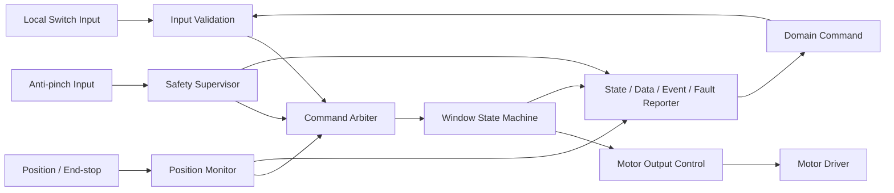

Safety Supervisor의 끼임 정지 경로는 상위 Domain 응답에 의존하지 않아야 한다.

---


<a id="sys-window-s03"></a>
> 원문 구간: [WINDOW/02_WINDOW_SYSRS_FUNCTIONAL_BASELINE_DRAFT.md L68–98](https://github.com/vehicle-domain-control-system/integrated-vehicle-control/blob/1b1c4b834e4ac692f8e3eaf3e2680e4a530a2072/docs/requirements/WINDOW/02_WINDOW_SYSRS_FUNCTIONAL_BASELINE_DRAFT.md#L68-L98)

> **통합 검토:** [C18](#review-c18) — 원문과 제안을 함께 읽는다. 정책·수치·안전 동작을 자동 확정하지 않았다.

### 8.3 시스템 상태

#### 8.3.1 ECU 상태

| 상태 | 의미 | 모터 출력 원칙 |
|---|---|---|
| `INIT` | 초기화와 입출력 안전 확인 중 | OFF |
| `READY` | 정상 명령 수용 가능 | 명령에 따라 제어 |
| `DEGRADED` | 일부 센서 또는 통신 기능 제한 | 허용된 제한 동작만 수행 |
| `FAULT` | 안전한 이동을 보장할 수 없음 | OFF |

#### 8.3.2 창문 동작 상태

| 상태 | 의미 |
|---|---|
| `STOPPED` | 모터 출력이 해제된 정지 상태 |
| `OPENING` | 열림 방향 이동 중 |
| `CLOSING` | 닫힘 방향 이동 중 |
| `ANTIPINCH_REVERSING` | 끼임 대응 안전 반전 중 |
| `UNKNOWN` | 신뢰할 수 있는 동작 상태를 확정할 수 없음 |

#### 8.3.3 명령 결과 상태

`ACCEPTED`, `IN_PROGRESS`, `DONE`, `REJECTED`, `CANCELLED`, `FAILED`를 구분한다. 각 결과는 원 요청 식별자와 거부·중단·실패 사유를 함께 제공할 수 있어야 한다.

#### 8.3.4 데이터 유효성

위치와 외부 입력의 유효성은 최소 `OK`, `STALE`, `INVALID`, `NO_DATA`를 구분한다.

---


<a id="sys-window-s04"></a>
> 원문 구간: [WINDOW/02_WINDOW_SYSRS_FUNCTIONAL_BASELINE_DRAFT.md L99–168](https://github.com/vehicle-domain-control-system/integrated-vehicle-control/blob/1b1c4b834e4ac692f8e3eaf3e2680e4a530a2072/docs/requirements/WINDOW/02_WINDOW_SYSRS_FUNCTIONAL_BASELINE_DRAFT.md#L99-L168)

> **통합 검토:** [C01](#review-c01), [C03](#review-c03), [C04](#review-c04), [C05](#review-c05), [C06](#review-c06), [C07](#review-c07), [C09](#review-c09) — 원문과 제안을 함께 읽는다. 정책·수치·안전 동작을 자동 확정하지 않았다.

### 8.4 Functional Requirements

#### 8.4.1 초기화와 기능 허용

| ID | 요구사항 | 근거/비고 |
|---|---|---|
| <a id="win-sys-fun-001"></a>`WIN-SYS-FUN-001` | ECU는 리셋 후 모든 모터 구동 출력을 비활성 상태로 초기화해야 한다. | 안전 |
| <a id="win-sys-fun-002"></a>`WIN-SYS-FUN-002` | ECU는 필수 입출력과 내부 상태 초기화가 완료된 후에만 `READY`로 전환해야 한다. | 안전 |
| <a id="win-sys-fun-003"></a>`WIN-SYS-FUN-003` | ECU는 운전 허용 전원 상태가 아니면 새 이동 명령을 실행하지 않아야 한다. | 상위 SR |
| <a id="win-sys-fun-004"></a>`WIN-SYS-FUN-004` | ECU는 초기화 실패 시 `FAULT` 또는 정의된 `DEGRADED` 상태로 전환하고 모터 출력을 비활성화해야 한다. | 안전 |

#### 8.4.2 명령 검증과 중재

| ID | 요구사항 | 근거/비고 |
|---|---|---|
| <a id="win-sys-cmd-001"></a>`WIN-SYS-CMD-001` | ECU는 `OPEN`, `CLOSE`, `STOP`, `VENT`, `MOVE_TO_POSITION`으로 정의된 요청만 해석해야 한다. | 의미 기반 인터페이스 |
| <a id="win-sys-cmd-002"></a>`WIN-SYS-CMD-002` | ECU는 요청 종류, 대상 채널, 순서 식별자, 유효성 및 필요한 파라미터를 검증한 후 수용 여부를 결정해야 한다. | 상위 SR |
| <a id="win-sys-cmd-003"></a>`WIN-SYS-CMD-003` | ECU는 만료, 범위 초과, 미정의 또는 불완전 요청을 실행하지 않고 `REJECTED`와 사유를 제공해야 한다. | 상위 SR |
| <a id="win-sys-cmd-004"></a>`WIN-SYS-CMD-004` | ECU는 이미 처리한 동일 순서 식별자의 요청을 재수신해도 이동을 다시 시작하지 않아야 한다. | 중복 내성 |
| <a id="win-sys-cmd-005"></a>`WIN-SYS-CMD-005` | ECU는 `STOP` 요청을 일반 열림·닫힘·목표 위치 요청보다 우선 처리해야 한다. | 상위 SR |
| <a id="win-sys-cmd-006"></a>`WIN-SYS-CMD-006` | ECU는 서로 충돌하는 이동 요청을 동시에 모터 출력으로 적용하지 않아야 한다. | 안전 |
| <a id="win-sys-cmd-007"></a>`WIN-SYS-CMD-007` | ECU는 상위 요청 출처의 차량 수준 권한을 다시 판단하지 않고, Domain이 확정한 요청으로 취급해야 한다. | 책임 경계 |
| <a id="win-sys-cmd-008"></a>`WIN-SYS-CMD-008` | ECU는 새 요청이 현재 동작을 대체할 때 기존 요청 결과를 `CANCELLED` 또는 `FAILED`로 종결하고 사유를 제공해야 한다. | 시험성 |

#### 8.4.3 로컬 스위치와 모터 제어

| ID | 요구사항 | 근거/비고 |
|---|---|---|
| <a id="win-sys-mot-001"></a>`WIN-SYS-MOT-001` | ECU는 로컬 열림·닫힘·정지 입력을 안정화한 후 명령 중재기에 제공해야 한다. | 상위 SR |
| <a id="win-sys-mot-002"></a>`WIN-SYS-MOT-002` | ECU는 로컬 스위치 유지 동작에서 스위치 해제 시 모터를 정지해야 한다. | 수동 동작 |
| <a id="win-sys-mot-003"></a>`WIN-SYS-MOT-003` | ECU는 열림 방향 출력과 닫힘 방향 출력을 동시에 활성화해서는 안 된다. | 안전 |
| <a id="win-sys-mot-004"></a>`WIN-SYS-MOT-004` | ECU는 방향을 전환하기 전에 현재 방향 출력을 해제하고 구성된 무출력 시간을 적용해야 한다. | 드라이버 보호 |
| <a id="win-sys-mot-005"></a>`WIN-SYS-MOT-005` | ECU는 완전 열림 상태에서 추가 열림 출력을, 완전 닫힘 상태에서 추가 닫힘 출력을 활성화하지 않아야 한다. | 기구 보호 |
| <a id="win-sys-mot-006"></a>`WIN-SYS-MOT-006` | ECU는 정지 조건 성립 시 모터 출력 명령을 안전한 비활성 값으로 전환해야 한다. | 상위 SR |
| <a id="win-sys-mot-007"></a>`WIN-SYS-MOT-007` | ECU는 모터 구동 시작 시 프로젝트가 승인한 출력 프로파일을 사용해야 하며 조정값을 기능 로직과 분리해야 한다. | 유지보수성 |

#### 8.4.4 위치와 목표 이동

| ID | 요구사항 | 근거/비고 |
|---|---|---|
| <a id="win-sys-pos-001"></a>`WIN-SYS-POS-001` | ECU는 창문 위치를 `0 % = 완전 열림`, `100 % = 완전 닫힘` 기준으로 표현해야 한다. | Domain 인터페이스 가이드 |
| <a id="win-sys-pos-002"></a>`WIN-SYS-POS-002` | ECU는 위치값과 위치 유효성을 함께 관리하고 제공해야 한다. | 상위 SR |
| <a id="win-sys-pos-003"></a>`WIN-SYS-POS-003` | ECU는 유효한 위치 정보가 있을 때만 `VENT` 또는 `MOVE_TO_POSITION` 요청을 실행해야 한다. | 안전 |
| <a id="win-sys-pos-004"></a>`WIN-SYS-POS-004` | ECU는 목표 허용 오차 범위에 도달하면 모터를 정지하고 해당 요청을 `DONE`으로 종결해야 한다. | 시험성 |
| <a id="win-sys-pos-005"></a>`WIN-SYS-POS-005` | ECU는 위치가 `STALE`, `INVALID` 또는 `NO_DATA`가 되면 위치 기반 자동 이동을 중단해야 한다. | 상위 SR |
| <a id="win-sys-pos-006"></a>`WIN-SYS-POS-006` | ECU는 위치 센서 고장 중 이전 위치를 현재 정상 위치처럼 보고해서는 안 된다. | 강건성 |

#### 8.4.5 끼임 방지

| ID | 요구사항 | 근거/비고 |
|---|---|---|
| <a id="win-sys-ap-001"></a>`WIN-SYS-AP-001` | ECU는 닫힘 이동 중 끼임 판단 입력을 주기적으로 감시해야 한다. | 상위 SR |
| <a id="win-sys-ap-002"></a>`WIN-SYS-AP-002` | ECU는 닫힘 중 유효한 끼임을 감지하면 Domain 명령을 기다리지 않고 닫힘 출력을 해제해야 한다. | 핵심 안전 |
| <a id="win-sys-ap-003"></a>`WIN-SYS-AP-003` | ECU는 끼임 정지 후 승인된 반전 거리 또는 안전 위치까지 열림 방향으로 이동해야 한다. | `[CANDIDATE]`, 값 TBD |
| <a id="win-sys-ap-004"></a>`WIN-SYS-AP-004` | ECU는 끼임 처리 중 일반 닫힘 요청을 실행하지 않아야 한다. | 안전 우선순위 |
| <a id="win-sys-ap-005"></a>`WIN-SYS-AP-005` | ECU는 끼임 발생 시 `WINDOW_ANTIPINCH` 이벤트를 한 번 생성하고 원 닫힘 요청을 `FAILED` 또는 `CANCELLED`로 종결해야 한다. | VSS 의미 정합 |
| <a id="win-sys-ap-006"></a>`WIN-SYS-AP-006` | ECU는 끼임 센서가 신뢰 불가 상태이면 자동 닫힘과 원터치 닫힘을 금지해야 한다. | 안전 |
| <a id="win-sys-ap-007"></a>`WIN-SYS-AP-007` | ECU는 끼임 해제 또는 재동작 조건이 확인되기 전까지 닫힘 자동 재개를 금지해야 한다. | 재개 방지 |

#### 8.4.6 상태와 결과 제공

| ID | 요구사항 | 근거/비고 |
|---|---|---|
| <a id="win-sys-sta-001"></a>`WIN-SYS-STA-001` | ECU는 실제 구동 판단에 따라 `STOPPED`, `OPENING`, `CLOSING`, `ANTIPINCH_REVERSING`, `UNKNOWN` 상태를 제공해야 한다. | 상위 SR |
| <a id="win-sys-sta-002"></a>`WIN-SYS-STA-002` | ECU는 완전 열림과 완전 닫힘 상태를 위치값과 구분 가능한 상태 데이터로 제공해야 한다. | Domain 가이드 |
| <a id="win-sys-sta-003"></a>`WIN-SYS-STA-003` | ECU는 각 상위 명령에 대해 처리 결과와 사유를 원 요청 식별자에 연결해 제공해야 한다. | 추적성 |
| <a id="win-sys-sta-004"></a>`WIN-SYS-STA-004` | ECU는 물리 위치를 확인할 수 없는 경우 명령 완료만으로 목표 위치 도달을 보고해서는 안 된다. | 강건성 |

---


<a id="sys-window-s05"></a>
> 원문 구간: [WINDOW/02_WINDOW_SYSRS_FUNCTIONAL_BASELINE_DRAFT.md L169–200](https://github.com/vehicle-domain-control-system/integrated-vehicle-control/blob/1b1c4b834e4ac692f8e3eaf3e2680e4a530a2072/docs/requirements/WINDOW/02_WINDOW_SYSRS_FUNCTIONAL_BASELINE_DRAFT.md#L169-L200)

> **통합 검토:** [C01](#review-c01) — 원문과 제안을 함께 읽는다. 정책·수치·안전 동작을 자동 확정하지 않았다.

### 8.5 Semantic Input / Event Requirements

#### 8.5.1 입력 의미

| 구분 | 의미 | 최소 데이터 |
|---|---|---|
| `WINDOW_COMMAND` | Domain이 확정한 창문 요청 | channel, action, target position(선택), source context, sequence, validity/expiry |
| `LOCAL_WINDOW_SWITCH` | 직접 연결된 사용자 조작 | open/close/stop, press state, validity |
| `WINDOW_POSITION_FEEDBACK` | 위치 또는 끝단 정보 | position, fully-open, fully-closed, validity |
| `WINDOW_ANTIPINCH_INPUT` | 끼임 판단 입력 | detected, validity |
| `POWER_OPERATION_STATE` | ECU/액추에이터 동작 허용 정보 | operation allowed, validity |

#### 8.5.2 제공 의미

| 구분 | 의미 | 최소 데이터 |
|---|---|---|
| `WINDOW_STATE` | 실제 판단한 이동 상태 | state, channel, validity, timestamp/age basis |
| `WINDOW_POSITION` | 창문 위치 | 0…100 %, validity |
| `WINDOW_ANTIPINCH` | 끼임 발생 이벤트 | channel, event sequence, occurrence information |
| `WINDOW_COMMAND_RESULT` | 명령 처리 결과 | request sequence, result, reason |
| `WINDOW_FAULT` | 고장 정보 | category, code, active/recovered, validity |

#### 8.5.3 이벤트 처리 요구

| ID | 요구사항 | 근거/비고 |
|---|---|---|
| <a id="win-sys-evt-001"></a>`WIN-SYS-EVT-001` | ECU는 완전 열림 전이를 `FULLY_OPENED`, 완전 닫힘 전이를 `FULLY_CLOSED`로 식별할 수 있어야 한다. | Domain 가이드 |
| <a id="win-sys-evt-002"></a>`WIN-SYS-EVT-002` | ECU는 이벤트 재전송이 필요한 경우 동일 이벤트 식별자를 유지해 상위 시스템의 중복 제거를 가능하게 해야 한다. | *(파생)* |
| <a id="win-sys-evt-003"></a>`WIN-SYS-EVT-003` | ECU는 현재 상태와 일회성 이벤트를 동일 데이터 항목으로 대체해서는 안 된다. | 의미 분리 |

---


<a id="sys-window-s06"></a>
> 원문 구간: [WINDOW/02_WINDOW_SYSRS_FUNCTIONAL_BASELINE_DRAFT.md L201–237](https://github.com/vehicle-domain-control-system/integrated-vehicle-control/blob/1b1c4b834e4ac692f8e3eaf3e2680e4a530a2072/docs/requirements/WINDOW/02_WINDOW_SYSRS_FUNCTIONAL_BASELINE_DRAFT.md#L201-L237)

> **통합 검토:** [C02](#review-c02) — 원문과 제안을 함께 읽는다. 정책·수치·안전 동작을 자동 확정하지 않았다.

### 8.6 Candidate Execution Behavior

#### 8.6.1 기본 이동

1. ECU가 `READY`이고 이동 허용 조건이 성립한다.
2. 입력 검증기가 요청의 종류, 순서, 유효성과 파라미터를 확인한다.
3. 중재기가 정지·끼임·로컬 입력·상위 요청의 우선순위를 적용한다.
4. 상태 기계가 목표 방향을 결정한다.
5. 반대 방향 출력이 해제되었음을 확인하고 필요한 무출력 시간을 적용한다.
6. 모터 출력을 활성화하고 상태를 갱신한다.
7. 목표, 끝단, 정지, 끼임 또는 고장 조건에서 출력을 해제한다.
8. 명령 결과와 상태·위치·이벤트·고장을 갱신한다.

#### 8.6.2 후보 우선순위

1. 로컬 전기적 보호와 끼임 방지
2. `STOP`
3. 로컬 유지 스위치 입력
4. Domain이 확정한 이동 명령

차량 전체의 HMI·모바일·자동 환기 간 우선순위는 Domain에서 이미 결정된 것으로 본다.

#### 8.6.3 끼임 대응 상태 전이

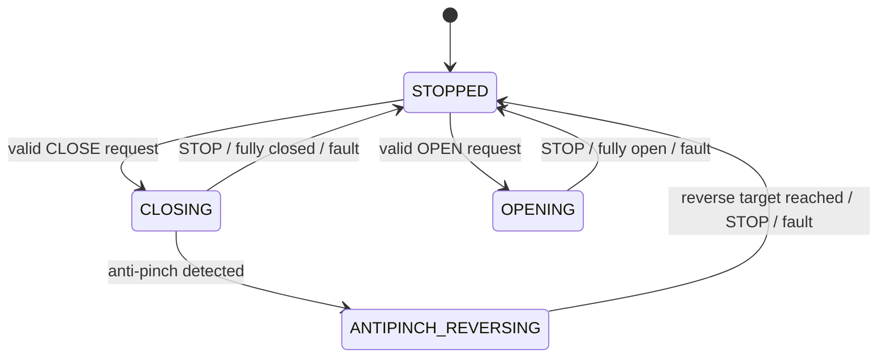

---


<a id="sys-window-s07"></a>
> 원문 구간: [WINDOW/02_WINDOW_SYSRS_FUNCTIONAL_BASELINE_DRAFT.md L238–255](https://github.com/vehicle-domain-control-system/integrated-vehicle-control/blob/1b1c4b834e4ac692f8e3eaf3e2680e4a530a2072/docs/requirements/WINDOW/02_WINDOW_SYSRS_FUNCTIONAL_BASELINE_DRAFT.md#L238-L255)

> **통합 검토:** [C10](#review-c10) — 원문과 제안을 함께 읽는다. 정책·수치·안전 동작을 자동 확정하지 않았다.

### 8.7 Performance Requirements

아래 수치는 초기 통합 시험용 후보이며 기구·센서·드라이버 시험과 안전 분석으로 확정해야 한다.

| ID | 요구사항 | 후보값/근거 |
|---|---|---|
| <a id="win-sys-per-001"></a>`WIN-SYS-PER-001` | ECU는 정상 전원 인가 후 명령 수용 가능 상태에 도달해야 한다. | `[CANDIDATE]` 1,000 ms 이내, 타 ECU 초기화 기준 정합 |
| <a id="win-sys-per-002"></a>`WIN-SYS-PER-002` | ECU는 로컬 스위치 입력을 충분히 빠르게 샘플링해야 한다. | `[CANDIDATE]` 샘플 주기 10 ms 이하 |
| <a id="win-sys-per-003"></a>`WIN-SYS-PER-003` | ECU는 로컬 스위치 채터링을 제거해야 한다. | `[CANDIDATE]` 안정화 30 ms |
| <a id="win-sys-per-004"></a>`WIN-SYS-PER-004` | ECU는 수용한 일반 이동 명령 후 모터 출력 시작 여부를 결정해야 한다. | `[CANDIDATE]` 200 ms 이내 |
| <a id="win-sys-per-005"></a>`WIN-SYS-PER-005` | ECU는 `STOP` 조건 성립 후 모터 출력을 비활성화해야 한다. | `[CANDIDATE]` 100 ms 이내 |
| <a id="win-sys-per-006"></a>`WIN-SYS-PER-006` | ECU는 내부에서 유효한 끼임을 판단한 시점부터 닫힘 출력을 비활성화해야 한다. | `[CANDIDATE]` 50 ms 이내, 안전 검증 필요 |
| <a id="win-sys-per-007"></a>`WIN-SYS-PER-007` | ECU는 반대 방향 구동 전 무출력 시간을 보장해야 한다. | `[CANDIDATE]` 100 ms 이상, 드라이버 검증 필요 |
| <a id="win-sys-per-008"></a>`WIN-SYS-PER-008` | ECU는 내부 상태 변화 후 외부 제공 상태를 갱신해야 한다. | `[CANDIDATE]` 100 ms 이내 |
| <a id="win-sys-per-009"></a>`WIN-SYS-PER-009` | ECU는 통신 데이터가 합의된 허용 age 또는 누락 횟수를 초과하면 `STALE`로 판정해야 한다. | 시간값은 네트워크 설계에서 확정 |

---


<a id="sys-window-s08"></a>
> 원문 구간: [WINDOW/02_WINDOW_SYSRS_FUNCTIONAL_BASELINE_DRAFT.md L256–285](https://github.com/vehicle-domain-control-system/integrated-vehicle-control/blob/1b1c4b834e4ac692f8e3eaf3e2680e4a530a2072/docs/requirements/WINDOW/02_WINDOW_SYSRS_FUNCTIONAL_BASELINE_DRAFT.md#L256-L285)

> **통합 검토:** [C06](#review-c06) — 원문과 제안을 함께 읽는다. 정책·수치·안전 동작을 자동 확정하지 않았다.

### 8.8 External Logical Interface Requirements

#### 8.8.1 필요한 입력

| ID | 요구사항 | 비고 |
|---|---|---|
| <a id="win-sys-int-001"></a>`WIN-SYS-INT-001` | Domain은 Window ECU에 원시 HMI 이벤트가 아니라 권한과 차량 정책이 반영된 `WINDOW_COMMAND`를 제공해야 한다. | 책임 경계 |
| <a id="win-sys-int-002"></a>`WIN-SYS-INT-002` | `WINDOW_COMMAND`는 최소 대상 채널, 동작, 순서, 유효성을 포함해야 한다. | 목표 위치는 해당 명령에만 필요 |
| <a id="win-sys-int-003"></a>`WIN-SYS-INT-003` | 위치 및 끼임 입력은 값과 품질 상태를 함께 제공해야 한다. | 안전 |
| <a id="win-sys-int-004"></a>`WIN-SYS-INT-004` | 전원/운전 상태 입력은 이동 허용 여부를 모호하지 않게 제공해야 한다. | 상위 연계 |

#### 8.8.2 제공해야 하는 출력

| ID | 요구사항 | 비고 |
|---|---|---|
| <a id="win-sys-int-005"></a>`WIN-SYS-INT-005` | ECU는 `WINDOW_STATE`와 `WINDOW_POSITION`을 독립적으로 제공해야 한다. | State/Data 분리 |
| <a id="win-sys-int-006"></a>`WIN-SYS-INT-006` | ECU는 `WINDOW_ANTIPINCH`를 현재 상태와 분리된 이벤트로 제공해야 한다. | VSS 연계 |
| <a id="win-sys-int-007"></a>`WIN-SYS-INT-007` | ECU는 `WINDOW_COMMAND_RESULT`를 원 요청 순서와 연결해 제공해야 한다. | 추적성 |
| <a id="win-sys-int-008"></a>`WIN-SYS-INT-008` | ECU는 `WINDOW_FAULT`에 최소 고장 범주, 활성 상태 및 복구 상태를 제공해야 한다. | 진단 |

#### 8.8.3 본 문서에서 결정하지 않는 항목

- CAN/LIN/Ethernet 등 전송 매체
- Message ID, Signal ID, byte/bit layout, endianness
- 송신 주기, event-trigger 정책, E2E 보호 방식
- 실제 데이터 타입, scaling, offset, invalid raw value
- 네트워크 수준 timeout과 재전송 횟수

---


<a id="sys-window-s09"></a>
> 원문 구간: [WINDOW/02_WINDOW_SYSRS_FUNCTIONAL_BASELINE_DRAFT.md L286–298](https://github.com/vehicle-domain-control-system/integrated-vehicle-control/blob/1b1c4b834e4ac692f8e3eaf3e2680e4a530a2072/docs/requirements/WINDOW/02_WINDOW_SYSRS_FUNCTIONAL_BASELINE_DRAFT.md#L286-L298)

> **통합 검토:** [C03](#review-c03), [C05](#review-c05), [C08](#review-c08) — 원문과 제안을 함께 읽는다. 정책·수치·안전 동작을 자동 확정하지 않았다.

### 8.9 Safety / Priority Requirements

| ID | 요구사항 | 근거/비고 |
|---|---|---|
| <a id="win-sys-saf-001"></a>`WIN-SYS-SAF-001` | 끼임 방지와 로컬 전기적 보호는 모든 일반 이동 요청보다 우선해야 한다. | 핵심 안전 |
| <a id="win-sys-saf-002"></a>`WIN-SYS-SAF-002` | ECU는 `FAULT`에서 열림·닫힘 출력을 모두 비활성화해야 한다. | 안전 |
| <a id="win-sys-saf-003"></a>`WIN-SYS-SAF-003` | 통신 상실로 상위 요청의 유효성을 보장할 수 없으면 진행 중인 상위 이동을 정지해야 한다. | 상위 SR |
| <a id="win-sys-saf-004"></a>`WIN-SYS-SAF-004` | 통신 또는 전원이 복구되어도 이전 이동 명령을 자동 재개해서는 안 된다. | 재개 방지 |
| <a id="win-sys-saf-005"></a>`WIN-SYS-SAF-005` | ECU는 위치 또는 끼임 데이터가 신뢰 불가일 때 이를 정상값으로 대체해 자동 닫힘을 계속해서는 안 된다. | 강건성 |
| <a id="win-sys-saf-006"></a>`WIN-SYS-SAF-006` | 제한 수동 동작을 허용하는 고장 상태와 방향은 안전 분석 결과로 명시적으로 구성해야 한다. | `[CANDIDATE]` 정책 TBD |

---


<a id="sys-window-s10"></a>
> 원문 구간: [WINDOW/02_WINDOW_SYSRS_FUNCTIONAL_BASELINE_DRAFT.md L299–330](https://github.com/vehicle-domain-control-system/integrated-vehicle-control/blob/1b1c4b834e4ac692f8e3eaf3e2680e4a530a2072/docs/requirements/WINDOW/02_WINDOW_SYSRS_FUNCTIONAL_BASELINE_DRAFT.md#L299-L330)

> **통합 검토:** [C08](#review-c08), [C09](#review-c09), [C10](#review-c10) — 원문과 제안을 함께 읽는다. 정책·수치·안전 동작을 자동 확정하지 않았다.

### 8.10 Diagnostics

#### 8.10.1 고장 범주

| 범주 | 예시 |
|---|---|
| `MOTOR_DRIVER` | 상반 출력, 드라이버 보호, 구동 실패 |
| `POSITION_SENSOR` | 범위 초과, 변화 없음, 유효성 상실 |
| `ANTIPINCH_SENSOR` | 입력 고정, 범위 오류, 유효성 상실 |
| `COMMUNICATION` | 상위 명령 stale/invalid/no-data |
| `INITIALIZATION` | 필수 초기화 또는 자체 점검 실패 |
| `FUNCTION` | 상태 전이 불일치, 목표 시간 초과 |

#### 8.10.2 진단 요구사항

| ID | 요구사항 | 근거/비고 |
|---|---|---|
| <a id="win-sys-dia-001"></a>`WIN-SYS-DIA-001` | ECU는 활성 고장과 복구된 고장을 구분할 수 있어야 한다. | 진단성 |
| <a id="win-sys-dia-002"></a>`WIN-SYS-DIA-002` | ECU는 고장 범주와 세부 코드를 제공해야 한다. | 정비성 |
| <a id="win-sys-dia-003"></a>`WIN-SYS-DIA-003` | ECU는 고장 발생 시 진행 중 명령의 결과를 일관되게 종결해야 한다. | 추적성 |
| <a id="win-sys-dia-004"></a>`WIN-SYS-DIA-004` | ECU는 고장 복구만으로 이전 이동을 재개하지 않고 새 유효 요청을 요구해야 한다. | 안전 |
| <a id="win-sys-dia-005"></a>`WIN-SYS-DIA-005` | ECU는 물리 피드백이 제공되지 않는 구성에서 검출할 수 없는 고장을 검출된 것으로 보고해서는 안 된다. | 진단 한계 명시 |

#### 8.10.3 복구 원칙

- 일시 통신 고장: 새 유효 요청 확인 후 기능 복귀
- 위치 센서 고장: 위치 기반 자동 동작 금지, 제한 수동 동작은 안전 분석 결과에 따름
- 끼임 센서 고장: 자동 닫힘 금지, 복구 조건 확인 필요
- 모터/드라이버 고장: 출력 OFF 유지, 명시적 복구 또는 재초기화 필요

---


<a id="sys-window-s11"></a>
> 원문 구간: [WINDOW/02_WINDOW_SYSRS_FUNCTIONAL_BASELINE_DRAFT.md L331–343](https://github.com/vehicle-domain-control-system/integrated-vehicle-control/blob/1b1c4b834e4ac692f8e3eaf3e2680e4a530a2072/docs/requirements/WINDOW/02_WINDOW_SYSRS_FUNCTIONAL_BASELINE_DRAFT.md#L331-L343)

### 8.11 Non-functional Requirements

| ID | 요구사항 | 특성 |
|---|---|---|
| <a id="win-sys-nfr-001"></a>`WIN-SYS-NFR-001` | ECU는 동일 상태와 동일 유효 입력에 대해 결정적인 중재 결과를 제공해야 한다. | Predictability |
| <a id="win-sys-nfr-002"></a>`WIN-SYS-NFR-002` | ECU는 입력 누락, 중복, 범위 초과 및 순서 오류를 안전하게 처리해야 한다. | Robustness |
| <a id="win-sys-nfr-003"></a>`WIN-SYS-NFR-003` | 조정 가능한 시간·위치·출력 파라미터는 소스 로직과 분리하여 관리해야 한다. | Maintainability |
| <a id="win-sys-nfr-004"></a>`WIN-SYS-NFR-004` | 시험 환경에서 명령, 상태, 위치, 이벤트, 고장 및 결과를 관찰할 수 있어야 한다. | Testability |
| <a id="win-sys-nfr-005"></a>`WIN-SYS-NFR-005` | 상태 전이와 명령 중재 로직은 모터 하드웨어 없이도 단위 시험할 수 있어야 한다. | Testability, *(파생)* |
| <a id="win-sys-nfr-006"></a>`WIN-SYS-NFR-006` | 다중 채널 확장 시 채널 간 상태와 고장 데이터가 혼동되지 않아야 한다. | Scalability, *(파생)* |

---


<a id="sys-window-s12"></a>
> 원문 구간: [WINDOW/02_WINDOW_SYSRS_FUNCTIONAL_BASELINE_DRAFT.md L344–359](https://github.com/vehicle-domain-control-system/integrated-vehicle-control/blob/1b1c4b834e4ac692f8e3eaf3e2680e4a530a2072/docs/requirements/WINDOW/02_WINDOW_SYSRS_FUNCTIONAL_BASELINE_DRAFT.md#L344-L359)

### 8.12 Candidate Acceptance Criteria

| 시나리오 | 사전 조건 | 자극 | 기대 결과 |
|---|---|---|---|
| 정상 열림 | `READY`, 중간 위치 | 유효 `OPEN` | `OPENING`, 열림 출력, 완전 열림에서 정지 및 `DONE` |
| 정상 닫힘 | `READY`, 중간 위치, 끼임 정상 | 유효 `CLOSE` | `CLOSING`, 닫힘 출력, 완전 닫힘에서 정지 및 `DONE` |
| 정지 우선 | 이동 중 | `STOP` | 후보 시간 내 출력 OFF, `STOPPED`, 기존 명령 종결 |
| 방향 전환 | `OPENING` | 유효 `CLOSE` | 열림 출력 OFF, 무출력 시간 후 닫힘 출력 |
| 끼임 방지 | `CLOSING` | 유효 끼임 입력 | 후보 시간 내 닫힘 OFF, 안전 반전, `WINDOW_ANTIPINCH` 1회 |
| 위치 불신 | 목표 위치 이동 중 | 위치 `INVALID` | 이동 중단, 결과 실패/취소, 위치 정상값 미보고 |
| 중복 명령 | 명령 처리 중 | 동일 sequence 재수신 | 추가 이동 시작이나 출력 펄스 없음 |
| 통신 상실 | 상위 명령으로 이동 중 | 허용 age 초과 | 이동 정지, 통신 고장, 복구 후 자동 재개 없음 |
| 초기화 실패 | 부팅 중 | 필수 초기화 실패 | 출력 OFF, `FAULT` 또는 정의된 `DEGRADED` |

---


<a id="sys-window-s13"></a>
> 원문 구간: [WINDOW/02_WINDOW_SYSRS_FUNCTIONAL_BASELINE_DRAFT.md L360–382](https://github.com/vehicle-domain-control-system/integrated-vehicle-control/blob/1b1c4b834e4ac692f8e3eaf3e2680e4a530a2072/docs/requirements/WINDOW/02_WINDOW_SYSRS_FUNCTIONAL_BASELINE_DRAFT.md#L360-L382)

### 8.13 Candidate Parameter Summary

| 파라미터 | 후보값 | 근거 | 확정에 필요한 검증 |
|---|---:|---|---|
| `T_WIN_INIT_MAX` | 1,000 ms | 타 ECU 기준 정합 | 부팅·초기화 측정 |
| `T_WIN_SWITCH_SAMPLE_MAX` | 10 ms | 사용자 입력 응답성 | 스위치/태스크 부하 시험 |
| `T_WIN_SWITCH_DEBOUNCE` | 30 ms | 일반 기계식 스위치 후보 | 실제 스위치 파형 측정 |
| `T_WIN_CMD_START_MAX` | 200 ms | 사용자 인지 응답 후보 | HIL/실기 응답 측정 |
| `T_WIN_STOP_MAX` | 100 ms | 안전 정지 후보 | 드라이버 출력 측정 |
| `T_WIN_AP_OUTPUT_OFF_MAX` | 50 ms | 끼임 대응 후보 | 센서·기구 포함 안전 시험 |
| `T_WIN_DIRECTION_DEADTIME_MIN` | 100 ms | 드라이버 보호 후보 | 모터/드라이버 검증 |
| `T_WIN_STATE_UPDATE_MAX` | 100 ms | 상위 상태 동기화 후보 | 통합 통신 시험 |
| `D_WIN_START` | 40 % | 기존 저전압 데모 제안값 | 모터 기동 시험 |
| `POS_OPEN` | 0 % | Domain 인터페이스 정의 | 인터페이스 합의 |
| `POS_CLOSED` | 100 % | Domain 인터페이스 정의 | 인터페이스 합의 |
| `POS_VENT` | TBD | 자동 환기 정책 필요 | Domain/UX 합의 |
| `AP_REVERSE_TARGET` | TBD | 기구·법규·안전 분석 필요 | 실기 안전 검증 |
| `WIN_COMM_MAX_AGE` | TBD | 네트워크 주기 미확정 | Logical Interface 합의 |

모터 PWM 주파수, 최대 duty, 전류 제한 및 위치 허용 오차는 드라이버·모터·기구 선정 후 Element/SW/HW 요구사항에서 확정한다.

---


<a id="sys-window-s14"></a>
> 원문 구간: [WINDOW/02_WINDOW_SYSRS_FUNCTIONAL_BASELINE_DRAFT.md L383–410](https://github.com/vehicle-domain-control-system/integrated-vehicle-control/blob/1b1c4b834e4ac692f8e3eaf3e2680e4a530a2072/docs/requirements/WINDOW/02_WINDOW_SYSRS_FUNCTIONAL_BASELINE_DRAFT.md#L383-L410)

### 8.14 TBD

#### 8.14.1 상위/Domain 결정 필요

- HMI·모바일·자동 환기 간 차량 수준 우선순위
- 원격 창문 제어 권한, 인증 및 차량 조건
- 자동 환기 목표 위치와 취소 조건
- 전원 상태별 창문 허용 정책
- 끼임 이후 사용자 재시도 정책

#### 8.14.2 Interface/Network 결정 필요

- Window 명령·상태·이벤트·고장 데이터 계약
- 전송 매체, 메시지/신호 ID, scaling과 invalid 값
- 주기, 최대 age, timeout, alive counter와 E2E 보호
- 명령 sequence와 이벤트 중복 제거 규칙

#### 8.14.3 Element/SW/HW 결정 필요

- 위치 센서와 끼임 센서 방식 및 진단 범위
- 모터와 H-bridge 사양, PWM, 전류·온도 보호
- 끝단 검출, soft-stop 및 캘리브레이션 절차
- 끼임 임계값, 정지 시간, 반전 거리와 허용 반복 횟수
- 고장 상태에서 제한 수동 이동 허용 여부
- 다중 도어 채널 수와 ECU 물리 배치

---


<a id="sys-window-s15"></a>
> 원문 구간: [WINDOW/02_WINDOW_SYSRS_FUNCTIONAL_BASELINE_DRAFT.md L411–420](https://github.com/vehicle-domain-control-system/integrated-vehicle-control/blob/1b1c4b834e4ac692f8e3eaf3e2680e4a530a2072/docs/requirements/WINDOW/02_WINDOW_SYSRS_FUNCTIONAL_BASELINE_DRAFT.md#L411-L420)

### 8.15 Baseline Scope

본 Functional Baseline은 다음을 고정한다.

- Window ECU는 로컬 스위치와 확정된 Domain 명령을 실행한다.
- 모터 방향 상호 배타, 끝단 정지 및 끼임 로컬 대응을 제공한다.
- 위치는 `0 % = 완전 열림`, `100 % = 완전 닫힘` 의미를 사용한다.
- Request/Command, State, Event, Fault, Data 및 Command Result를 분리한다.
- `WINDOW_ANTIPINCH` 이벤트를 VSS/Domain 연계 의미로 제공한다.
- 네트워크 상세, 기구·부품 수치와 양산 안전 수치는 후속 기준에서 확정한다.


<a id="sys-exterior-light"></a>
## 9. EXTERIOR_LIGHT SysRS

출처: [EXTERIOR_LIGHT/02_EXTERIOR_LIGHT_SYSRS_FUNCTIONAL_BASELINE_DRAFT.md](https://github.com/vehicle-domain-control-system/integrated-vehicle-control/blob/1b1c4b834e4ac692f8e3eaf3e2680e4a530a2072/docs/requirements/EXTERIOR_LIGHT/02_EXTERIOR_LIGHT_SYSRS_FUNCTIONAL_BASELINE_DRAFT.md)

관련 SR: [영역 본문](SR.md#sr-exterior-light) · 기존 정의 ID 58개. 아래 원문 요구와 검토 주석을 구분한다.


<a id="sys-exterior-light-header"></a>
> 원문 구간: [EXTERIOR_LIGHT/02_EXTERIOR_LIGHT_SYSRS_FUNCTIONAL_BASELINE_DRAFT.md L1–14](https://github.com/vehicle-domain-control-system/integrated-vehicle-control/blob/1b1c4b834e4ac692f8e3eaf3e2680e4a530a2072/docs/requirements/EXTERIOR_LIGHT/02_EXTERIOR_LIGHT_SYSRS_FUNCTIONAL_BASELINE_DRAFT.md#L1-L14)

> **통합 검토:** [C19](#review-c19) — 원문과 제안을 함께 읽는다. 정책·수치·안전 동작을 자동 확정하지 않았다.

> 원문 제목: EXTERIOR_LIGHT System Requirement Specification (SysRS)

#### S32K144 Exterior-light Functional Element — Allocation Candidate / Functional Baseline Draft

> 상태: DRAFT / 기능·성능 기준 검토용<br>
> 대상 시스템: 저전압 데모의 대표 외부 조명 1채널 실행 기능<br>
> 물리 배치: 별도 Function ECU 또는 BCM 확장 후보이며 아키텍처 검토 후 확정<br>
> 신규 SysRS ID 체계를 사용하며 이전 번호를 승계하지 않는다.<br>
> `[CANDIDATE]`는 검증 전 후보값 또는 후보 동작을 의미한다.<br>
> `*(파생)*`은 상위 SR에서 직접 확정되지 않고 안전성·시험성·정합성을 위해 도출한 요구사항이다.<br>
> 통신 프로토콜, CAN ID, 비트 배치, 전송 주기 및 정확한 타임아웃은 본 문서에서 확정하지 않는다.

---


<a id="sys-exterior-light-s01"></a>
> 원문 구간: [EXTERIOR_LIGHT/02_EXTERIOR_LIGHT_SYSRS_FUNCTIONAL_BASELINE_DRAFT.md L15–44](https://github.com/vehicle-domain-control-system/integrated-vehicle-control/blob/1b1c4b834e4ac692f8e3eaf3e2680e4a530a2072/docs/requirements/EXTERIOR_LIGHT/02_EXTERIOR_LIGHT_SYSRS_FUNCTIONAL_BASELINE_DRAFT.md#L15-L44)

### 9.1 대상과 책임

#### 9.1.1 대상 시스템

본 SysRS는 Domain 또는 상위 Controller가 확정한 의미 기반 외부 조명 명령을 받아 대표 조명 채널을 구동하고, 실제 적용 상태·명령 결과·고장을 제공하는 실행 기능을 대상으로 한다.

현재 기준은 저전압 데모 1채널이다. 양산 차량의 전조등, 차폭등, 미등 등 채널별 기능과 법규 요구는 본 기준을 그대로 확장하지 않고 별도 안전·법규 검토를 거쳐야 한다.

#### 9.1.2 EXTERIOR_LIGHT 실행 기능 책임

- 의미 기반 조명 명령의 유효성·순서·중복 검증
- 켜짐, 꺼짐 및 허용된 출력 수준 실행
- 전환 중 상반되거나 미정의된 출력 방지
- 출력 상태와 명령 처리 결과 제공
- 지원되는 하드웨어 범위의 출력 피드백 감시
- 전원·통신·출력 구동 이상 시 채널별 안전 정책 적용
- 상태와 진단 정보 제공

#### 9.1.3 책임 밖

- 원시 외부 조도값의 측정, 필터링 및 유효성 판단
- 자동 점등 임계값, 히스테리시스와 차량 전체 정책 결정
- HMI/모바일 사용자 인증과 요청 권한 판단
- 차량 전체 법규·안전 명령의 중재
- 네트워크 프레임과 물리 신호 배치
- 램프, 드라이버, 전원 소자와 피드백 회로 선정
- 생산 차량의 법규 적합성 승인

---


<a id="sys-exterior-light-s02"></a>
> 원문 구간: [EXTERIOR_LIGHT/02_EXTERIOR_LIGHT_SYSRS_FUNCTIONAL_BASELINE_DRAFT.md L45–65](https://github.com/vehicle-domain-control-system/integrated-vehicle-control/blob/1b1c4b834e4ac692f8e3eaf3e2680e4a530a2072/docs/requirements/EXTERIOR_LIGHT/02_EXTERIOR_LIGHT_SYSRS_FUNCTIONAL_BASELINE_DRAFT.md#L45-L65)

### 9.2 논리 구조

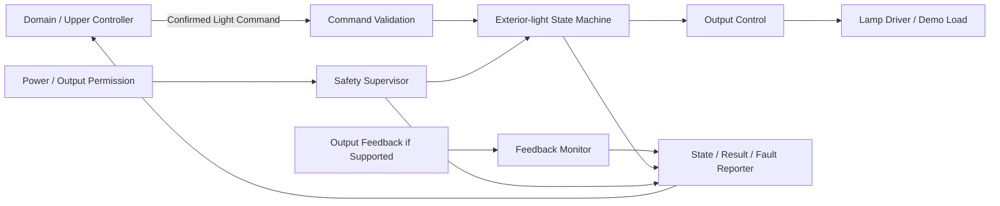

원시 조도, HMI, 모바일 요청의 해석과 차량 전체 명령 중재는 Domain에 유지한다. 실행 기능에는 최종적으로 확정된 명령만 전달한다.

---


<a id="sys-exterior-light-s03"></a>
> 원문 구간: [EXTERIOR_LIGHT/02_EXTERIOR_LIGHT_SYSRS_FUNCTIONAL_BASELINE_DRAFT.md L66–97](https://github.com/vehicle-domain-control-system/integrated-vehicle-control/blob/1b1c4b834e4ac692f8e3eaf3e2680e4a530a2072/docs/requirements/EXTERIOR_LIGHT/02_EXTERIOR_LIGHT_SYSRS_FUNCTIONAL_BASELINE_DRAFT.md#L66-L97)

### 9.3 시스템 상태

#### 9.3.1 기능 상태

| 상태 | 의미 | 출력 원칙 |
|---|---|---|
| `INIT` | 초기화와 출력 안전 확인 중 | 승인된 초기 기본값 |
| `READY` | 정상 명령 수용 가능 | 명령에 따라 제어 |
| `DEGRADED` | 피드백 또는 일부 진단 기능 제한 | 승인된 제한 정책 적용 |
| `FAULT` | 안전한 출력 제어를 보장할 수 없음 | 채널별 안전 기본값 |

#### 9.3.2 조명 채널 상태

| 상태 | 의미 |
|---|---|
| `OFF` | 출력 비활성으로 판단됨 |
| `ON` | 요청된 활성 출력이 적용된 것으로 판단됨 |
| `TRANSITION` | 출력 전환 또는 안정화 중 |
| `UNKNOWN` | 물리 또는 논리 상태를 신뢰할 수 없음 |

`MANUAL`, `AUTO`, `SAFETY`, `TEMPORARY`는 출력 상태가 아니라 명령 문맥이다.

#### 9.3.3 명령 결과 상태

`ACCEPTED`, `IN_PROGRESS`, `DONE`, `REJECTED`, `CANCELLED`, `FAILED`를 구분한다. 결과는 원 요청 식별자와 사유를 함께 제공할 수 있어야 한다.

#### 9.3.4 데이터 유효성

명령, 출력 수준 및 피드백의 유효성은 최소 `OK`, `STALE`, `INVALID`, `NO_DATA`를 구분한다.

---


<a id="sys-exterior-light-s04"></a>
> 원문 구간: [EXTERIOR_LIGHT/02_EXTERIOR_LIGHT_SYSRS_FUNCTIONAL_BASELINE_DRAFT.md L98–144](https://github.com/vehicle-domain-control-system/integrated-vehicle-control/blob/1b1c4b834e4ac692f8e3eaf3e2680e4a530a2072/docs/requirements/EXTERIOR_LIGHT/02_EXTERIOR_LIGHT_SYSRS_FUNCTIONAL_BASELINE_DRAFT.md#L98-L144)

> **통합 검토:** [C04](#review-c04), [C13](#review-c13), [C14](#review-c14), [C15](#review-c15) — 원문과 제안을 함께 읽는다. 정책·수치·안전 동작을 자동 확정하지 않았다.

### 9.4 Functional Requirements

#### 9.4.1 초기화와 기능 허용

| ID | 요구사항 | 근거/비고 |
|---|---|---|
| <a id="els-sys-fun-001"></a>`ELS-SYS-FUN-001` | 기능은 리셋 후 조명 출력을 채널별로 승인된 초기 기본값으로 설정해야 한다. | 안전, 기본값 TBD |
| <a id="els-sys-fun-002"></a>`ELS-SYS-FUN-002` | 기능은 필수 내부 상태와 출력 제어 경로의 초기화가 완료된 후에만 `READY`로 전환해야 한다. | 안전 |
| <a id="els-sys-fun-003"></a>`ELS-SYS-FUN-003` | 기능은 출력 허용 전원 상태가 아니면 새 활성 출력을 시작하지 않아야 한다. | 상위 SR |
| <a id="els-sys-fun-004"></a>`ELS-SYS-FUN-004` | 초기화 실패 시 기능은 `FAULT` 또는 정의된 `DEGRADED` 상태로 전환하고 채널별 안전 기본값을 적용해야 한다. | 안전 |

#### 9.4.2 명령 검증과 처리

| ID | 요구사항 | 근거/비고 |
|---|---|---|
| <a id="els-sys-cmd-001"></a>`ELS-SYS-CMD-001` | 기능은 정의된 대상 채널에 대한 `SET_OFF`, `SET_ON`, `SET_LEVEL` 명령만 해석해야 한다. | 의미 기반 인터페이스 |
| <a id="els-sys-cmd-002"></a>`ELS-SYS-CMD-002` | 기능은 대상 채널, 명령 종류, 순서 식별자, 유효성 및 필요한 출력 수준을 검증한 후 수용 여부를 결정해야 한다. | 상위 SR |
| <a id="els-sys-cmd-003"></a>`ELS-SYS-CMD-003` | 기능은 만료, 범위 초과, 미정의 또는 불완전 명령을 실행하지 않고 `REJECTED`와 사유를 제공해야 한다. | 상위 SR |
| <a id="els-sys-cmd-004"></a>`ELS-SYS-CMD-004` | 기능은 이미 처리한 동일 순서 식별자의 명령을 재수신해도 출력을 다시 시작하거나 불필요하게 전환하지 않아야 한다. | 중복 내성 |
| <a id="els-sys-cmd-005"></a>`ELS-SYS-CMD-005` | 기능은 새로운 유효 명령이 이전 명령을 대체할 때 이전 명령 결과를 일관되게 종결해야 한다. | 시험성 |
| <a id="els-sys-cmd-006"></a>`ELS-SYS-CMD-006` | 기능은 `MANUAL`, `AUTO`, `SAFETY`, `TEMPORARY` 문맥을 진단·추적 정보로 보존할 수 있어야 한다. | *(파생)* |
| <a id="els-sys-cmd-007"></a>`ELS-SYS-CMD-007` | 기능은 원시 조도값을 근거로 `AUTO` 점등 여부를 자체 결정하지 않아야 한다. | 책임 경계 |

#### 9.4.3 출력 제어

| ID | 요구사항 | 근거/비고 |
|---|---|---|
| <a id="els-sys-out-001"></a>`ELS-SYS-OUT-001` | 기능은 수용한 `SET_OFF`에 대해 대상 채널의 활성 출력을 비활성화해야 한다. | 상위 SR |
| <a id="els-sys-out-002"></a>`ELS-SYS-OUT-002` | 기능은 수용한 `SET_ON`에 대해 대상 채널에 구성된 정상 활성 출력을 적용해야 한다. | 상위 SR |
| <a id="els-sys-out-003"></a>`ELS-SYS-OUT-003` | `SET_LEVEL`을 지원하는 구성에서 기능은 승인된 범위의 출력 수준만 적용해야 한다. | `[CANDIDATE]` |
| <a id="els-sys-out-004"></a>`ELS-SYS-OUT-004` | 기능은 한 채널에 서로 충돌하는 두 출력 목표를 동시에 적용해서는 안 된다. | 안전 |
| <a id="els-sys-out-005"></a>`ELS-SYS-OUT-005` | 기능은 명령 중복, 문맥 변경 또는 상태 보고 갱신으로 인해 육안상 불필요한 순간 점멸을 발생시켜서는 안 된다. | 상위 SR |
| <a id="els-sys-out-006"></a>`ELS-SYS-OUT-006` | 기능은 출력 매핑, 전환 시간 및 진단 필터를 기능 상태 기계와 분리된 조정값으로 관리해야 한다. | 유지보수성 |
| <a id="els-sys-out-007"></a>`ELS-SYS-OUT-007` | 임시 점등을 지원하는 경우 기능은 명령에 포함된 종료 조건 또는 상위 취소 명령에 따라 출력을 종료해야 한다. | `[CANDIDATE]` |

#### 9.4.4 상태와 결과 제공

| ID | 요구사항 | 근거/비고 |
|---|---|---|
| <a id="els-sys-sta-001"></a>`ELS-SYS-STA-001` | 기능은 실제 적용 판단에 따라 `OFF`, `ON`, `TRANSITION`, `UNKNOWN` 상태를 제공해야 한다. | 상위 SR |
| <a id="els-sys-sta-002"></a>`ELS-SYS-STA-002` | 기능은 적용 중인 출력 수준과 그 유효성을 제공해야 한다. | 상위 SR |
| <a id="els-sys-sta-003"></a>`ELS-SYS-STA-003` | 기능은 각 명령의 처리 결과와 사유를 원 요청 식별자에 연결해 제공해야 한다. | 추적성 |
| <a id="els-sys-sta-004"></a>`ELS-SYS-STA-004` | 출력 피드백 하드웨어가 없는 구성은 `명령 적용 상태`를 `물리 램프 점등 확인`으로 보고해서는 안 된다. | 진단 한계 |
| <a id="els-sys-sta-005"></a>`ELS-SYS-STA-005` | 피드백이 신뢰 불가인 경우 기능은 이전 정상 상태를 현재 물리 상태처럼 유지 보고하지 않아야 한다. | 강건성 |

---


<a id="sys-exterior-light-s05"></a>
> 원문 구간: [EXTERIOR_LIGHT/02_EXTERIOR_LIGHT_SYSRS_FUNCTIONAL_BASELINE_DRAFT.md L145–174](https://github.com/vehicle-domain-control-system/integrated-vehicle-control/blob/1b1c4b834e4ac692f8e3eaf3e2680e4a530a2072/docs/requirements/EXTERIOR_LIGHT/02_EXTERIOR_LIGHT_SYSRS_FUNCTIONAL_BASELINE_DRAFT.md#L145-L174)

> **통합 검토:** [C14](#review-c14), [C18](#review-c18) — 원문과 제안을 함께 읽는다. 정책·수치·안전 동작을 자동 확정하지 않았다.

### 9.5 Semantic Input / Event Requirements

#### 9.5.1 입력 의미

| 구분 | 의미 | 최소 데이터 |
|---|---|---|
| `EXTERIOR_LIGHT_COMMAND` | Domain이 확정한 조명 명령 | channel, action, level(선택), context, sequence, validity/expiry |
| `POWER_OUTPUT_PERMISSION` | ECU 및 조명 출력 허용 정보 | output allowed, power state, validity |
| `EXTERIOR_LIGHT_OUTPUT_FEEDBACK` | 지원되는 물리 출력 피드백 | channel, measured/applied state, validity |
| `LOCAL_PROTECTION_STATE` | 드라이버 또는 전원 보호 상태 | protection type, active, validity |

#### 9.5.2 제공 의미

| 구분 | 의미 | 최소 데이터 |
|---|---|---|
| `EXTERIOR_LIGHT_STATE` | 채널별 실제 판단 상태 | channel, state, validity, timestamp/age basis |
| `EXTERIOR_LIGHT_LEVEL` | 적용 출력 수준 | channel, level, validity |
| `EXTERIOR_LIGHT_COMMAND_RESULT` | 명령 처리 결과 | request sequence, result, reason |
| `EXTERIOR_LIGHT_FAULT` | 고장 정보 | category, code, channel, active/recovered, validity |

#### 9.5.3 의미 분리 요구

| ID | 요구사항 | 근거/비고 |
|---|---|---|
| <a id="els-sys-sem-001"></a>`ELS-SYS-SEM-001` | 기능은 `EXTERIOR_LIGHT_COMMAND`와 `EXTERIOR_LIGHT_STATE`를 서로 다른 데이터 의미로 취급해야 한다. | Request/State 분리 |
| <a id="els-sys-sem-002"></a>`ELS-SYS-SEM-002` | 기능은 출력 상태와 고장 상태를 하나의 열거값으로 혼합하지 않아야 한다. | State/Fault 분리 |
| <a id="els-sys-sem-003"></a>`ELS-SYS-SEM-003` | 기능은 명령 문맥과 출력 목표를 구분해 처리해야 한다. | AUTO는 상태가 아님 |

---


<a id="sys-exterior-light-s06"></a>
> 원문 구간: [EXTERIOR_LIGHT/02_EXTERIOR_LIGHT_SYSRS_FUNCTIONAL_BASELINE_DRAFT.md L175–212](https://github.com/vehicle-domain-control-system/integrated-vehicle-control/blob/1b1c4b834e4ac692f8e3eaf3e2680e4a530a2072/docs/requirements/EXTERIOR_LIGHT/02_EXTERIOR_LIGHT_SYSRS_FUNCTIONAL_BASELINE_DRAFT.md#L175-L212)

> **통합 검토:** [C11](#review-c11) — 원문과 제안을 함께 읽는다. 정책·수치·안전 동작을 자동 확정하지 않았다.

### 9.6 Candidate Execution Behavior

#### 9.6.1 기본 명령 실행

1. 기능이 `READY`이고 출력 허용 조건이 성립한다.
2. 입력 검증기가 대상, 동작, 수준, 순서와 유효성을 확인한다.
3. 로컬 보호 상태를 확인한다.
4. 상태 기계가 목표 출력과 필요한 전환을 결정한다.
5. 출력 제어가 승인된 매핑을 적용한다.
6. 지원되는 경우 피드백을 확인한다.
7. 상태, 수준, 결과와 고장을 갱신한다.

#### 9.6.2 자동 점등 연계

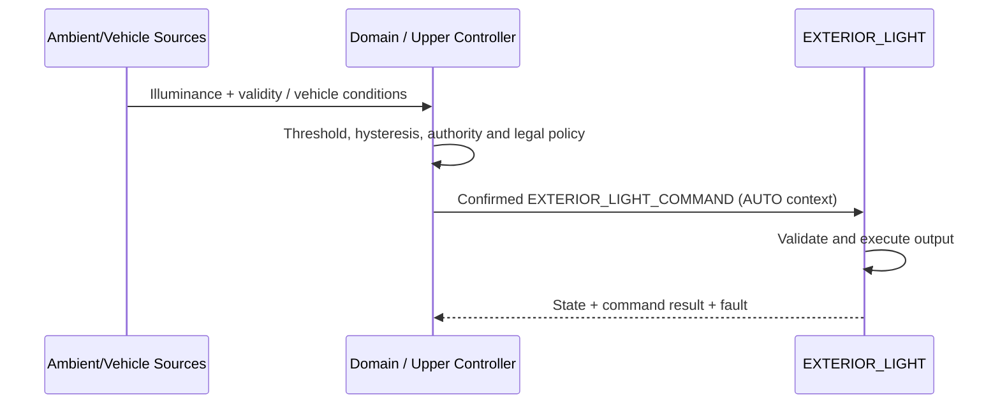

자동 점등 임계값(`LUX_ON`, `LUX_OFF`), 히스테리시스 및 유지 시간은 Domain 또는 상위 자동 조명 기능의 요구사항으로 관리한다. 데모에서 동일 MCU에 배치되더라도 논리 책임은 분리한다.

#### 9.6.3 후보 우선순위

1. 로컬 전기적 보호
2. Domain이 확정한 안전·법규 우선 명령
3. Domain이 확정한 일반 명령

수동, 자동, 임시 기능 간 차량 수준 우선순위는 Domain에서 확정한 뒤 단일 최종 명령으로 전달한다.

---


<a id="sys-exterior-light-s07"></a>
> 원문 구간: [EXTERIOR_LIGHT/02_EXTERIOR_LIGHT_SYSRS_FUNCTIONAL_BASELINE_DRAFT.md L213–227](https://github.com/vehicle-domain-control-system/integrated-vehicle-control/blob/1b1c4b834e4ac692f8e3eaf3e2680e4a530a2072/docs/requirements/EXTERIOR_LIGHT/02_EXTERIOR_LIGHT_SYSRS_FUNCTIONAL_BASELINE_DRAFT.md#L213-L227)

> **통합 검토:** [C12](#review-c12) — 원문과 제안을 함께 읽는다. 정책·수치·안전 동작을 자동 확정하지 않았다.

### 9.7 Performance Requirements

아래 수치는 초기 저전압 통합 시험용 후보이며 실제 램프·드라이버·법규 요구로 검증해야 한다.

| ID | 요구사항 | 후보값/근거 |
|---|---|---|
| <a id="els-sys-per-001"></a>`ELS-SYS-PER-001` | 기능은 정상 전원 인가 후 명령 수용 가능 상태에 도달해야 한다. | `[CANDIDATE]` 1,000 ms 이내, 타 ECU 초기화 기준 정합 |
| <a id="els-sys-per-002"></a>`ELS-SYS-PER-002` | 기능은 유효한 일반 조명 명령 수용 후 목표 출력 전환을 시작해야 한다. | `[CANDIDATE]` 100 ms 이내, 기존 조명 기능 응답 기준 정합 |
| <a id="els-sys-per-003"></a>`ELS-SYS-PER-003` | 기능은 내부 출력 상태 변화 후 외부 제공 상태를 갱신해야 한다. | `[CANDIDATE]` 100 ms 이내 |
| <a id="els-sys-per-004"></a>`ELS-SYS-PER-004` | 기능은 로컬 보호 조건 성립 후 위험 출력의 비활성화를 시작해야 한다. | `[CANDIDATE]` 50 ms 이내, 드라이버 검증 필요 |
| <a id="els-sys-per-005"></a>`ELS-SYS-PER-005` | 기능은 통신 데이터가 합의된 허용 age 또는 누락 횟수를 초과하면 `STALE`로 판정해야 한다. | 시간값은 네트워크 설계에서 확정 |
| <a id="els-sys-per-006"></a>`ELS-SYS-PER-006` | 지원되는 피드백은 명령 출력과 실제 상태 불일치를 채널별 진단 시간 내 검출해야 한다. | `[CANDIDATE]` 시간값 TBD |

---


<a id="sys-exterior-light-s08"></a>
> 원문 구간: [EXTERIOR_LIGHT/02_EXTERIOR_LIGHT_SYSRS_FUNCTIONAL_BASELINE_DRAFT.md L228–258](https://github.com/vehicle-domain-control-system/integrated-vehicle-control/blob/1b1c4b834e4ac692f8e3eaf3e2680e4a530a2072/docs/requirements/EXTERIOR_LIGHT/02_EXTERIOR_LIGHT_SYSRS_FUNCTIONAL_BASELINE_DRAFT.md#L228-L258)

> **통합 검토:** [C15](#review-c15) — 원문과 제안을 함께 읽는다. 정책·수치·안전 동작을 자동 확정하지 않았다.

### 9.8 External Logical Interface Requirements

#### 9.8.1 필요한 입력

| ID | 요구사항 | 비고 |
|---|---|---|
| <a id="els-sys-int-001"></a>`ELS-SYS-INT-001` | Domain은 실행 기능에 원시 HMI·모바일 이벤트나 원시 조도값이 아니라 확정된 `EXTERIOR_LIGHT_COMMAND`를 제공해야 한다. | 책임 경계 |
| <a id="els-sys-int-002"></a>`ELS-SYS-INT-002` | `EXTERIOR_LIGHT_COMMAND`는 최소 대상 채널, 동작, 순서, 유효성을 포함해야 한다. | 수준/문맥은 필요 시 포함 |
| <a id="els-sys-int-003"></a>`ELS-SYS-INT-003` | 출력 허용 정보는 전원 상태와 동작 허용 여부를 모호하지 않게 제공해야 한다. | 안전 |
| <a id="els-sys-int-004"></a>`ELS-SYS-INT-004` | 출력 피드백을 사용하는 구성은 측정값과 품질 상태를 함께 제공해야 한다. | 진단 |

#### 9.8.2 제공해야 하는 출력

| ID | 요구사항 | 비고 |
|---|---|---|
| <a id="els-sys-int-005"></a>`ELS-SYS-INT-005` | 기능은 `EXTERIOR_LIGHT_STATE`와 `EXTERIOR_LIGHT_LEVEL`을 채널별로 제공해야 한다. | State/Data 분리 |
| <a id="els-sys-int-006"></a>`ELS-SYS-INT-006` | 기능은 `EXTERIOR_LIGHT_COMMAND_RESULT`를 원 요청 순서와 연결해 제공해야 한다. | 추적성 |
| <a id="els-sys-int-007"></a>`ELS-SYS-INT-007` | 기능은 `EXTERIOR_LIGHT_FAULT`에 최소 범주, 채널, 활성 상태 및 복구 상태를 제공해야 한다. | 진단 |
| <a id="els-sys-int-008"></a>`ELS-SYS-INT-008` | 기능은 물리 피드백 확인 가능 여부를 상태 유효성 또는 capability 정보로 구분할 수 있어야 한다. | *(파생)* |

#### 9.8.3 본 문서에서 결정하지 않는 항목

- CAN/LIN/Ethernet 등 전송 매체
- Message ID, Signal ID, byte/bit layout, endianness
- 송신 주기, event-trigger 정책, E2E 보호 방식
- 실제 데이터 타입, scaling, offset, invalid raw value
- 네트워크 수준 timeout과 재전송 횟수
- 램프 드라이버의 전기적 출력 규격

---


<a id="sys-exterior-light-s09"></a>
> 원문 구간: [EXTERIOR_LIGHT/02_EXTERIOR_LIGHT_SYSRS_FUNCTIONAL_BASELINE_DRAFT.md L259–271](https://github.com/vehicle-domain-control-system/integrated-vehicle-control/blob/1b1c4b834e4ac692f8e3eaf3e2680e4a530a2072/docs/requirements/EXTERIOR_LIGHT/02_EXTERIOR_LIGHT_SYSRS_FUNCTIONAL_BASELINE_DRAFT.md#L259-L271)

> **통합 검토:** [C11](#review-c11), [C15](#review-c15), [C16](#review-c16), [C17](#review-c17) — 원문과 제안을 함께 읽는다. 정책·수치·안전 동작을 자동 확정하지 않았다.

### 9.9 Safety / Priority Requirements

| ID | 요구사항 | 근거/비고 |
|---|---|---|
| <a id="els-sys-saf-001"></a>`ELS-SYS-SAF-001` | 단락, 과전류, 과열 등 확인된 로컬 보호는 일반 조명 명령보다 우선해야 한다. | 전기적 안전 |
| <a id="els-sys-saf-002"></a>`ELS-SYS-SAF-002` | 기능은 상위에서 확정된 안전·법규 우선 명령을 일반 명령보다 우선 적용해야 한다. | 상위 SR |
| <a id="els-sys-saf-003"></a>`ELS-SYS-SAF-003` | 기능은 통신 상실 시 임의로 OFF 또는 ON을 선택하지 않고 채널별로 승인된 fallback을 적용해야 한다. | 법규/안전 정책 필요 |
| <a id="els-sys-saf-004"></a>`ELS-SYS-SAF-004` | 통신 복구만으로 만료된 조명 명령을 자동 재실행해서는 안 된다. | 재개 방지 |
| <a id="els-sys-saf-005"></a>`ELS-SYS-SAF-005` | 기능은 신뢰할 수 없는 물리 출력 상태를 정상 `ON` 또는 `OFF`로 보고해서는 안 된다. | 강건성 |
| <a id="els-sys-saf-006"></a>`ELS-SYS-SAF-006` | 기능은 `FAULT`에서 채널별 안전 기본값을 적용하고 해당 적용 상태를 보고해야 한다. | 안전 기본값 TBD |

---


<a id="sys-exterior-light-s10"></a>
> 원문 구간: [EXTERIOR_LIGHT/02_EXTERIOR_LIGHT_SYSRS_FUNCTIONAL_BASELINE_DRAFT.md L272–303](https://github.com/vehicle-domain-control-system/integrated-vehicle-control/blob/1b1c4b834e4ac692f8e3eaf3e2680e4a530a2072/docs/requirements/EXTERIOR_LIGHT/02_EXTERIOR_LIGHT_SYSRS_FUNCTIONAL_BASELINE_DRAFT.md#L272-L303)

> **통합 검토:** [C13](#review-c13), [C17](#review-c17) — 원문과 제안을 함께 읽는다. 정책·수치·안전 동작을 자동 확정하지 않았다.

### 9.10 Diagnostics

#### 9.10.1 고장 범주

| 범주 | 예시 |
|---|---|
| `OUTPUT_DRIVER` | 드라이버 보호, 구동 명령 실패 |
| `OUTPUT_FEEDBACK` | 명령-피드백 불일치, 피드백 범위/유효성 오류 |
| `COMMUNICATION` | 상위 명령 stale/invalid/no-data |
| `INITIALIZATION` | 필수 초기화 또는 자체 점검 실패 |
| `FUNCTION` | 상태 전이 불일치, 출력 전환 시간 초과 |

#### 9.10.2 진단 요구사항

| ID | 요구사항 | 근거/비고 |
|---|---|---|
| <a id="els-sys-dia-001"></a>`ELS-SYS-DIA-001` | 기능은 활성 고장과 복구된 고장을 구분할 수 있어야 한다. | 진단성 |
| <a id="els-sys-dia-002"></a>`ELS-SYS-DIA-002` | 기능은 고장 범주, 세부 코드 및 대상 채널을 제공해야 한다. | 정비성 |
| <a id="els-sys-dia-003"></a>`ELS-SYS-DIA-003` | 기능은 고장 발생 시 진행 중 명령의 결과를 일관되게 종결해야 한다. | 추적성 |
| <a id="els-sys-dia-004"></a>`ELS-SYS-DIA-004` | 기능은 고장 복구만으로 만료된 출력을 재적용하지 않고 새 유효 명령 또는 승인된 복구 절차를 요구해야 한다. | 안전 |
| <a id="els-sys-dia-005"></a>`ELS-SYS-DIA-005` | 피드백 회로가 없는 구성은 물리 램프 단선·점등 실패를 검출했다고 보고해서는 안 된다. | 진단 한계 |
| <a id="els-sys-dia-006"></a>`ELS-SYS-DIA-006` | 출력 피드백을 지원하는 구성은 명령과 피드백 불일치를 필터 시간 후 고장으로 판정해야 한다. | `[CANDIDATE]`, 시간 TBD |

#### 9.10.3 복구 원칙

- 일시 통신 고장: 새 유효 명령 확인 후 승인된 출력 적용
- 출력 피드백 고장: `UNKNOWN` 또는 `DEGRADED`로 보고하고 채널별 정책 적용
- 드라이버 보호 고장: 위험 출력 차단, 보호 해제와 재허용 조건 확인
- 초기화 고장: 안전 기본값 유지, 명시적 재초기화 또는 복구 필요

---


<a id="sys-exterior-light-s11"></a>
> 원문 구간: [EXTERIOR_LIGHT/02_EXTERIOR_LIGHT_SYSRS_FUNCTIONAL_BASELINE_DRAFT.md L304–316](https://github.com/vehicle-domain-control-system/integrated-vehicle-control/blob/1b1c4b834e4ac692f8e3eaf3e2680e4a530a2072/docs/requirements/EXTERIOR_LIGHT/02_EXTERIOR_LIGHT_SYSRS_FUNCTIONAL_BASELINE_DRAFT.md#L304-L316)

### 9.11 Non-functional Requirements

| ID | 요구사항 | 특성 |
|---|---|---|
| <a id="els-sys-nfr-001"></a>`ELS-SYS-NFR-001` | 기능은 동일 상태와 동일 유효 입력에 대해 결정적인 출력 결과를 제공해야 한다. | Predictability |
| <a id="els-sys-nfr-002"></a>`ELS-SYS-NFR-002` | 기능은 입력 누락, 중복, 범위 초과 및 순서 오류를 안전하게 처리해야 한다. | Robustness |
| <a id="els-sys-nfr-003"></a>`ELS-SYS-NFR-003` | 출력 매핑, 시간, 기본값과 진단 필터는 기능 로직과 분리하여 관리해야 한다. | Maintainability |
| <a id="els-sys-nfr-004"></a>`ELS-SYS-NFR-004` | 시험 환경에서 명령, 상태, 수준, 결과와 고장을 관찰할 수 있어야 한다. | Testability |
| <a id="els-sys-nfr-005"></a>`ELS-SYS-NFR-005` | 명령 검증과 상태 전이 로직은 실제 램프 하드웨어 없이도 단위 시험할 수 있어야 한다. | Testability, *(파생)* |
| <a id="els-sys-nfr-006"></a>`ELS-SYS-NFR-006` | 채널 확장 시 채널별 상태, 결과와 고장 데이터가 혼동되지 않아야 한다. | Scalability, *(파생)* |

---


<a id="sys-exterior-light-s12"></a>
> 원문 구간: [EXTERIOR_LIGHT/02_EXTERIOR_LIGHT_SYSRS_FUNCTIONAL_BASELINE_DRAFT.md L317–333](https://github.com/vehicle-domain-control-system/integrated-vehicle-control/blob/1b1c4b834e4ac692f8e3eaf3e2680e4a530a2072/docs/requirements/EXTERIOR_LIGHT/02_EXTERIOR_LIGHT_SYSRS_FUNCTIONAL_BASELINE_DRAFT.md#L317-L333)

> **통합 검토:** [C12](#review-c12), [C13](#review-c13) — 원문과 제안을 함께 읽는다. 정책·수치·안전 동작을 자동 확정하지 않았다.

### 9.12 Candidate Acceptance Criteria

| 시나리오 | 사전 조건 | 자극 | 기대 결과 |
|---|---|---|---|
| 정상 점등 | `READY`, 출력 허용 | 유효 `SET_ON` | 후보 시간 내 출력 적용 시작, `ON`, 결과 `DONE` |
| 정상 소등 | `READY`, 채널 ON | 유효 `SET_OFF` | 후보 시간 내 출력 비활성, `OFF`, 결과 `DONE` |
| 출력 수준 | 레벨 제어 지원 | 범위 내 `SET_LEVEL` | 승인 매핑 적용, 수준과 유효성 보고 |
| 범위 오류 | `READY` | 범위 밖 level | 출력 변경 없음, `REJECTED`와 사유 |
| 중복 명령 | 명령 처리 완료 | 동일 sequence 재수신 | 추가 출력 펄스나 순간 점멸 없음 |
| AUTO 연계 | Domain 자동 정책 활성 | `AUTO` 문맥의 확정 명령 | 원시 조도 계산 없이 동일 실행 경로로 처리 |
| 통신 상실 | 채널 동작 중 | 허용 age 초과 | 채널별 승인 fallback, 통신 고장, 복구 후 오래된 명령 미재생 |
| 드라이버 보호 | 채널 활성 중 | 유효 보호 입력 | 후보 시간 내 위험 출력 차단, 고장과 결과 보고 |
| 피드백 불일치 | 피드백 지원 | 명령과 물리 피드백 불일치 | 필터 후 고장, 상태 정상값 미보고 |
| 피드백 미지원 | 피드백 없음 | `SET_ON` 완료 | 명령 적용은 보고하되 물리 점등 확인으로 표현하지 않음 |

---


<a id="sys-exterior-light-s13"></a>
> 원문 구간: [EXTERIOR_LIGHT/02_EXTERIOR_LIGHT_SYSRS_FUNCTIONAL_BASELINE_DRAFT.md L334–351](https://github.com/vehicle-domain-control-system/integrated-vehicle-control/blob/1b1c4b834e4ac692f8e3eaf3e2680e4a530a2072/docs/requirements/EXTERIOR_LIGHT/02_EXTERIOR_LIGHT_SYSRS_FUNCTIONAL_BASELINE_DRAFT.md#L334-L351)

> **통합 검토:** [C12](#review-c12), [C16](#review-c16) — 원문과 제안을 함께 읽는다. 정책·수치·안전 동작을 자동 확정하지 않았다.

### 9.13 Candidate Parameter Summary

| 파라미터 | 후보값 | 근거 | 확정에 필요한 검증 |
|---|---:|---|---|
| `T_ELS_INIT_MAX` | 1,000 ms | 타 ECU 기준 정합 | 부팅·초기화 측정 |
| `T_ELS_CMD_RESPONSE_MAX` | 100 ms | 기존 조명 기능 응답 기준 정합 | HIL/실기 출력 측정 |
| `T_ELS_STATE_UPDATE_MAX` | 100 ms | 상위 상태 동기화 후보 | 통합 통신 시험 |
| `T_ELS_PROTECTION_OFF_MAX` | 50 ms | 저전압 데모 보호 후보 | 드라이버 보호 시험 |
| `ELS_DEMO_INIT_OUTPUT` | OFF | 저전압 데모 안전 후보 | 시스템 안전 검토 |
| `ELS_LEVEL_MIN/MAX` | TBD | 램프/드라이버 미선정 | HW 설계와 UX/법규 검토 |
| `T_ELS_FEEDBACK_DIAG` | TBD | 피드백 회로 미선정 | 회로 노이즈/고장 주입 시험 |
| `ELS_COMM_MAX_AGE` | TBD | 네트워크 주기 미확정 | Logical Interface 합의 |
| `ELS_COMM_FAIL_POLICY` | 채널별 TBD | 양산 법규/안전 영향 | Domain·안전·법규 합의 |

`ELS_DEMO_INIT_OUTPUT = OFF`는 저전압 대표 부하 데모에만 적용하는 후보이며 생산 차량 외부 조명의 fail-safe 결론이 아니다. PWM 주파수, duty 매핑, 전류 제한, 램프 진단 임계값은 드라이버와 램프 선정 후 Element/SW/HW 요구사항에서 확정한다.

---


<a id="sys-exterior-light-s14"></a>
> 원문 구간: [EXTERIOR_LIGHT/02_EXTERIOR_LIGHT_SYSRS_FUNCTIONAL_BASELINE_DRAFT.md L352–381](https://github.com/vehicle-domain-control-system/integrated-vehicle-control/blob/1b1c4b834e4ac692f8e3eaf3e2680e4a530a2072/docs/requirements/EXTERIOR_LIGHT/02_EXTERIOR_LIGHT_SYSRS_FUNCTIONAL_BASELINE_DRAFT.md#L352-L381)

### 9.14 TBD

#### 9.14.1 상위/Domain 결정 필요

- 수동·자동·임시·법규 기능 간 차량 수준 우선순위
- 자동 조명에 사용할 외부 조도 데이터 제공자와 품질 기준
- `LUX_ON`, `LUX_OFF`, 히스테리시스와 유지 시간
- 전원/운전 상태별 조명 허용 정책
- 채널별 통신 상실 및 고장 fallback
- 웰컴·굿바이 등 임시 점등 기능 포함 여부

#### 9.14.2 Interface/Network 결정 필요

- 조명 명령·상태·결과·고장 데이터 계약
- 전송 매체, 메시지/신호 ID, scaling과 invalid 값
- 주기, 최대 age, timeout, alive counter와 E2E 보호
- 명령 sequence와 중복 제거 규칙
- 출력 capability 및 물리 피드백 가능 여부 표현

#### 9.14.3 Element/SW/HW 결정 필요

- Exterior Light 기능의 실제 ECU 배치
- 대표 및 최종 조명 채널 목록
- 램프·드라이버·전원·피드백 회로 사양
- 출력 주파수, 수준 매핑, slew/ramp와 진단 임계값
- 단락, 과전류, 과열, 단선 진단과 복구 절차
- 생산 차량 법규 성능과 fail-safe 정책

---


<a id="sys-exterior-light-s15"></a>
> 원문 구간: [EXTERIOR_LIGHT/02_EXTERIOR_LIGHT_SYSRS_FUNCTIONAL_BASELINE_DRAFT.md L382–391](https://github.com/vehicle-domain-control-system/integrated-vehicle-control/blob/1b1c4b834e4ac692f8e3eaf3e2680e4a530a2072/docs/requirements/EXTERIOR_LIGHT/02_EXTERIOR_LIGHT_SYSRS_FUNCTIONAL_BASELINE_DRAFT.md#L382-L391)

> **통합 검토:** [C19](#review-c19) — 원문과 제안을 함께 읽는다. 정책·수치·안전 동작을 자동 확정하지 않았다.

### 9.15 Baseline Scope

본 Functional Baseline은 다음을 고정한다.

- EXTERIOR_LIGHT 실행 기능은 Domain이 확정한 의미 기반 명령을 실행한다.
- 원시 조도와 자동 점등 임계값·히스테리시스 판단은 상위 기능에 유지한다.
- 대표 1채널에 대해 OFF, ON 및 선택적 LEVEL 실행 기준을 정의한다.
- Request/Command, State, Fault, Data 및 Command Result를 분리한다.
- 피드백이 없는 구성에서는 명령 적용과 물리 점등 확인을 구분한다.
- 실제 ECU 배치, 네트워크 상세, 채널 구성, 전기 수치 및 양산 법규 기준은 후속 단계에서 확정한다.


<a id="sys-contracts"></a>
## 10. 영역 간 계약 요약

이 표는 3단계 검토안의 논리 정보 연결이다. 후보/TBD를 확정하지 않았고, 물리 경로·메시지·주기를 정의하지 않는다. 같은 문서의 부록 상세와 차이가 있으면 [미결 절](#sys-open)의 양쪽 근거를 확인한다.
기준: `1b1c4b834e4ac692f8e3eaf3e2680e4a530a2072` · 검토 후보

이 표는 정보의 의미상 생산자와 소비자를 나타낸다. 화살표나 소비자 표기는 실제 CAN/UART 직접 연결·패킷 경로 확정이 아니다. 중앙이 전달하더라도 원본 의미 소유자가 자동으로 중앙으로 바뀌지 않는다. 후보/TBD는 합의 완료가 아니다.

| 정보 | 생산/확정 책임 | 소비 책임 | 전달 의미 | 발생·종료·불신 조건 | 검토 | 근거 |
|---|---|---|---|---|---|---|
| 도어 잠금/개폐/종합 상태 | BCM | 중앙·MOBILE | 독립 상태 2축+종합 신뢰성 | 목표 변경/실측 갱신; 상태 불신 시 UNKNOWN/유효성 | X02 X14 | [BCM02 L103](https://github.com/vehicle-domain-control-system/integrated-vehicle-control/blob/1b1c4b834e4ac692f8e3eaf3e2680e4a530a2072/docs/requirements/BCM/02_BCM_SYSRS_FUNCTIONAL_BASELINE_DRAFT.md#L103) |
| 도어 처리 결과 | BCM, 중앙의 차량 요청 결과는 별도 | 중앙→MOBILE | 요청 식별·결과·사유 | 무구동 DONE, 거부, 실패 구분 | X02 X03 | [BCM02 L261](https://github.com/vehicle-domain-control-system/integrated-vehicle-control/blob/1b1c4b834e4ac692f8e3eaf3e2680e4a530a2072/docs/requirements/BCM/02_BCM_SYSRS_FUNCTIONAL_BASELINE_DRAFT.md#L261) |
| 도어 완료/이상 발생 | 중앙/Access 후보 | VSS | One-shot 발생 식별·나이 | 실제 전이/요청 완료/고장 중 어떤 발생인지 미정 | X02 X16 | [VSS02 L176](https://github.com/vehicle-domain-control-system/integrated-vehicle-control/blob/1b1c4b834e4ac692f8e3eaf3e2680e4a530a2072/docs/requirements/VSS/02_VSS_SYSRS_FUNCTIONAL_BASELINE_DRAFT.md#L176) |
| 실내 온도·습도·조도 | CIS | 중앙·MOBILE(전달 경로 별도) | 측정값+원본 유효성·나이 근거 | 원본 무갱신을 중계 수신으로 새 값 처리 금지 | X04 X06 X14 | [CIS02 L251](https://github.com/vehicle-domain-control-system/integrated-vehicle-control/blob/1b1c4b834e4ac692f8e3eaf3e2680e4a530a2072/docs/requirements/CIS/02_CIS_SYSRS_FUNCTIONAL_BASELINE_DRAFT.md#L251) |
| 목표 온도·자동 공조 설정 | MOBILE 요청, 확정 소유 중앙 후보 | 중앙·MOBILE | 요청 설정/확정 설정 | 수락/적용/정책 override 구분 | X04 | [MOBILE03 L70](https://github.com/vehicle-domain-control-system/integrated-vehicle-control/blob/1b1c4b834e4ac692f8e3eaf3e2680e4a530a2072/docs/requirements/MOBILE/03_MOBILE_LOGICAL_INTERFACE_NEEDS_DRAFT.md#L70) |
| Fan/냉난방 실행 명령 | 중앙 | BCM | 확정 수준·방향+유효성 | 공유 자원 중재; 보호는 BCM 우선 | X04 X05 | [BCM03 L159](https://github.com/vehicle-domain-control-system/integrated-vehicle-control/blob/1b1c4b834e4ac692f8e3eaf3e2680e4a530a2072/docs/requirements/BCM/03_BCM_LOGICAL_INTERFACE_NEEDS_DRAFT.md#L159) |
| 선행 공조 | 중앙 후보 | BCM 실행·MOBILE 표시 | 설정 시각·작업 상태·정지 결과 | 예약/시작/종료/취소/실패 미정 | X04 X16 | [MOBILE02 L247](https://github.com/vehicle-domain-control-system/integrated-vehicle-control/blob/1b1c4b834e4ac692f8e3eaf3e2680e4a530a2072/docs/requirements/MOBILE/02_MOBILE_SYSRS_FUNCTIONAL_BASELINE_DRAFT.md#L247) |
| 공조 실측/보호 상태 | BCM | 중앙·MOBILE | 지시·실측·방열 상태·고장 | 복구 조건+새 명령; 보호 해소만 재개 금지 | X05 X13 | [BCM02 L263](https://github.com/vehicle-domain-control-system/integrated-vehicle-control/blob/1b1c4b834e4ac692f8e3eaf3e2680e4a530a2072/docs/requirements/BCM/02_BCM_SYSRS_FUNCTIONAL_BASELINE_DRAFT.md#L263) |
| 실내 조명 설정 | 중앙 후보; 현 MOBILE03 BCM 표기 정리 대상 | BCM 명령 산출·MOBILE | 사용 여부/사용자 밝기/색상 | 사용 OFF와 안전 알림 ON 공존 가능 | X06 X07 | [MOBILE03 L49](https://github.com/vehicle-domain-control-system/integrated-vehicle-control/blob/1b1c4b834e4ac692f8e3eaf3e2680e4a530a2072/docs/requirements/MOBILE/03_MOBILE_LOGICAL_INTERFACE_NEEDS_DRAFT.md#L49) |
| 실내 조명 적용 | BCM | 중앙·MOBILE | 현재 알림·출력 수준·진단 한계 | 물리 점등 확인과 구분 | X06 X07 | [BCM02 L127](https://github.com/vehicle-domain-control-system/integrated-vehicle-control/blob/1b1c4b834e4ac692f8e3eaf3e2680e4a530a2072/docs/requirements/BCM/02_BCM_SYSRS_FUNCTIONAL_BASELINE_DRAFT.md#L127) |
| 창문 확정 요청 | 중앙 / 로컬은 WINDOW 입력 | WINDOW | 방향·STOP·목표·유효성·식별 | 상위 권한과 로컬 안전/중재 분리 | X08 X15 | [WINDOW02 L262](https://github.com/vehicle-domain-control-system/integrated-vehicle-control/blob/1b1c4b834e4ac692f8e3eaf3e2680e4a530a2072/docs/requirements/WINDOW/02_WINDOW_SYSRS_FUNCTIONAL_BASELINE_DRAFT.md#L262) |
| 창문 상태/위치/결과 | WINDOW | 중앙·MOBILE | 0%=열림,100%=닫힘; 유효성 | 앱 현행은 표시, 제어 자동 추가 금지 | X08 X13 | [WINDOW02 L139](https://github.com/vehicle-domain-control-system/integrated-vehicle-control/blob/1b1c4b834e4ac692f8e3eaf3e2680e4a530a2072/docs/requirements/WINDOW/02_WINDOW_SYSRS_FUNCTIONAL_BASELINE_DRAFT.md#L139) |
| 끼임 발생 | WINDOW | 중앙/VSS(전달 계약 미정) | 한 번의 occurrence, 재전달 동일 ID | 발생 이벤트는 해제 상태를 대신하지 않음 | X09 | [WINDOW02 L154](https://github.com/vehicle-domain-control-system/integrated-vehicle-control/blob/1b1c4b834e4ac692f8e3eaf3e2680e4a530a2072/docs/requirements/WINDOW/02_WINDOW_SYSRS_FUNCTIONAL_BASELINE_DRAFT.md#L154) |
| 끼임 위험 현재 상태 | WINDOW/중앙 공동 결정 필요 | VSS | ACTIVE/CLEAR+품질 | 해제 주체·조건·불신 동작 TBD | X09 X15 | [VSS02 L179](https://github.com/vehicle-domain-control-system/integrated-vehicle-control/blob/1b1c4b834e4ac692f8e3eaf3e2680e4a530a2072/docs/requirements/VSS/02_VSS_SYSRS_FUNCTIONAL_BASELINE_DRAFT.md#L179) |
| 탑승자 존재/인원수 | CIS | 중앙·MOBILE | 관측값+유효성 | 사람 존재와 위험을 동일시하지 않음 | X10 X14 | [CIS02 L250](https://github.com/vehicle-domain-control-system/integrated-vehicle-control/blob/1b1c4b834e4ac692f8e3eaf3e2680e4a530a2072/docs/requirements/CIS/02_CIS_SYSRS_FUNCTIONAL_BASELINE_DRAFT.md#L250) |
| 잔류 탑승자 위험 | 중앙 후보 | VSS·경고 표시 | ACTIVE/CLEAR+품질 | 사용 상태·환경·해제 조건 TBD | X10 | [VSS05 L378](https://github.com/vehicle-domain-control-system/integrated-vehicle-control/blob/1b1c4b834e4ac692f8e3eaf3e2680e4a530a2072/docs/requirements/VSS/05_VSS_ECU_INTERFACE_INFO_DRAFT.md#L378) |
| 후방 위험 현재 상태 | CIS 후보, 소유권 합의 전 | VSS | CLEAR/CAUTION/EMERGENCY+품질 | 감지 불가≠CLEAR, 현재 상태 재동기화 | X11 X14 | [CIS02 L148](https://github.com/vehicle-domain-control-system/integrated-vehicle-control/blob/1b1c4b834e4ac692f8e3eaf3e2680e4a530a2072/docs/requirements/CIS/02_CIS_SYSRS_FUNCTIONAL_BASELINE_DRAFT.md#L148) |
| 외부 조도와 자동 점등 | 센서 제공자 TBD / 정책 중앙 | 중앙→ELS | 외부 환경+유효성→확정 명령 | 실내 조도 자동 대용 금지 | X12 | [EXTERIOR_LIGHT02 L357](https://github.com/vehicle-domain-control-system/integrated-vehicle-control/blob/1b1c4b834e4ac692f8e3eaf3e2680e4a530a2072/docs/requirements/EXTERIOR_LIGHT/02_EXTERIOR_LIGHT_SYSRS_FUNCTIONAL_BASELINE_DRAFT.md#L357) |
| 외부 조명 출력/결과 | ELS (물리 배치 TBD) | 중앙/소비자 TBD | 적용 상태·피드백 가능 여부·결과 | 초기 OFF와 실패 fallback 분리 | X07 X12 X15 | [EXTERIOR_LIGHT02 L246](https://github.com/vehicle-domain-control-system/integrated-vehicle-control/blob/1b1c4b834e4ac692f8e3eaf3e2680e4a530a2072/docs/requirements/EXTERIOR_LIGHT/02_EXTERIOR_LIGHT_SYSRS_FUNCTIONAL_BASELINE_DRAFT.md#L246) |
| 차량 사용 시작/종료 | 중앙/차량 상태 소유자 TBD | VSS 및 선택 조명 기능 | 별개 One-shot/임시 명령 | Wake 전달/발생 나이/Goodbye 전원 유지 | X01 X16 | [VSS02 L327](https://github.com/vehicle-domain-control-system/integrated-vehicle-control/blob/1b1c4b834e4ac692f8e3eaf3e2680e4a530a2072/docs/requirements/VSS/02_VSS_SYSRS_FUNCTIONAL_BASELINE_DRAFT.md#L327) |
| VSS 서비스/고장 | VSS | 중앙·MOBILE 오류 표시 | State/Availability/ActiveFault/LastFault | 입력 불신≠내부 출력 고장 | X13 | [VSS02 L407](https://github.com/vehicle-domain-control-system/integrated-vehicle-control/blob/1b1c4b834e4ac692f8e3eaf3e2680e4a530a2072/docs/requirements/VSS/02_VSS_SYSRS_FUNCTIONAL_BASELINE_DRAFT.md#L407) |
| 사용자 이탈+열린 도어 경고 | 중앙 후보; 이탈 입력 제공자 TBD | MOBILE | 현재 경고·등급·확인 여부 | READ는 CLEAR가 아님; 발생·해제 근거 필요 | X17 | [MOBILE01 L112](https://github.com/vehicle-domain-control-system/integrated-vehicle-control/blob/1b1c4b834e4ac692f8e3eaf3e2680e4a530a2072/docs/requirements/MOBILE/01_MOBILE_SR_FUNCTIONAL_BASELINE_DRAFT.md#L112) |
| 엔진룸 동물 경고 | 미정; CIS는 제외 | MOBILE | 현재 원문에는 경고 의무 | 생산자 없으므로 종단 미충족 | X17 | [MOBILE01 L113](https://github.com/vehicle-domain-control-system/integrated-vehicle-control/blob/1b1c4b834e4ac692f8e3eaf3e2680e4a530a2072/docs/requirements/MOBILE/01_MOBILE_SR_FUNCTIONAL_BASELINE_DRAFT.md#L113) |
| 사용자 인증/권한 | 차량 측 최종 판단; 게이트웨이 책임 확정 필요 | MOBILE·중앙 요청 수용 | 인증 결과·차량별 권한·유효 범위 | VSS 후속 ECU 보안과 별개 | X03 X17 | [MOBILE02 L138](https://github.com/vehicle-domain-control-system/integrated-vehicle-control/blob/1b1c4b834e4ac692f8e3eaf3e2680e4a530a2072/docs/requirements/MOBILE/02_MOBILE_SYSRS_FUNCTIONAL_BASELINE_DRAFT.md#L138) |

### 명령 결과의 공통 의미 — 통합 제안

모든 노드가 동일 enum을 모두 구현해야 한다는 뜻은 아니다. 중앙에서 사용자 요청 결과로 변환할 때 적용할 의미를 정리한 안이다.

| 결과 | 의미 | 혼동 방지 |
|---|---|---|
| SENT | 앱/전달 측 전송 완료 | 차량 수용/실행 완료가 아님 |
| ACCEPTED | 해당 처리 주체가 요청을 수용 | 중앙 수용과 액추에이터 수용 구분 |
| IN_PROGRESS | 해당 작업이 진행 중 | 예약 보관과 실제 액추에이터 작동 구분 |
| DONE | 해당 요청의 정의된 목표 달성 | 무구동 목표 충족·설정 저장·물리 완료의 기준은 요청별 정의 |
| REJECTED | 요청 실행을 수용하지 않음 | 로컬 안전 거부를 곧 ECU 고장으로 분류하지 않음 |
| CANCELLED | 진행 작업의 정상 중단/대체 등 | 실제 고장 실패와 구분; 현재 BCM에는 이 결과가 없어 중앙 매핑 필요 |
| FAILED | 실행/완료 확인 실패 | 원인과 원 요청 연결 |
| UNKNOWN | 소비자가 결과를 확인하지 못함 | 송신 ECU가 FAILED였다는 뜻 아님; 자동 재시도 금지 원칙 유지 |

### 품질 정보의 변환

| 원본 의미 | 소비자 처리 방향 |
|---|---|
| CIS 유효 플래그 | 값의 원본 유효성 근거; 수신 신선도와 분리 |
| VSS VALID / 기타 노드 OK | 해당 단계 품질 정상 의미를 연결하되 동일 숫자 enum으로 가정하지 않음 |
| NOT_RECEIVED / NO_DATA | 미수신 또는 쓸 수 있는 값 없음의 범위를 계약별 정의 |
| STALE | 나이 기준 초과; 마지막 정상 의미값과 구분 |
| INVALID | 값/형식/품질 부적합; 고장 및 출처 인증과 구분 |
| SNA/NOT_AVAILABLE | 생산자가 정상 의미를 제공할 수 없음; 정상 수신일 수 있으나 CLEAR는 아님 |
| 재전송/중계 반복 | 원본 측정·발생 나이를 새로 시작하지 않음 |

### 통신 상실 시 행동 비교

| 영역 | 원문 방향 | 통합 처리 |
|---|---|
| BCM | 통신 불신만으로 기존 구동 중단하지 않음 | 로컬 안전·구동 종료 조건 우선; 기능별 유지 범위 명료화 |
| WINDOW | 상위 명령 이동 정지, 복구만으로 재개 금지 | 로컬 이동·안전 반전은 별도 정책 |
| EXTERIOR_LIGHT | 채널별 승인 fallback | 초기 OFF를 실패 OFF로 바꾸지 않음 |
| CIS | 과거값을 정상값으로 제공하지 않음 | 수신자 미수신 감시 및 새 유효값 복구 연결 |
| VSS | 불신 입력을 정상 CLEAR로 자동 치환하지 않음 | 기능별 Hold/중단 등은 TBD |
| MOBILE | 과거값 정상 표시 금지, 이전 요청 자동 재전송 금지 | UNKNOWN과 실제 실패 구분 |

<a id="sys-open"></a>
## 11. 미결·충돌과 수정 제안

원문 요구 487개는 의미를 바꾸지 않고 보존했다. 여기의 수정 방향은 그 요구를 대체하는 확정 동작이 아니다. 미결의 기준값·조건·책임·범위를 결정하면 관련 요구·동작 표·인터페이스·추적·확인 사례를 함께 수정해야 한다. 같은 쟁점이 PRE/A/B/C/X에 반복되므로 기록 수를 독립 충돌 수로 합산하지 않는다.

<a id="open-x01"></a>
### X01. 중앙 정책의 책임과 현재 근거 수준

**논리 흐름:** MOBILE/CIS/실행 노드 → 중앙 판단 → BCM/WINDOW/ELS/VSS

근거: [BCM02 L30](https://github.com/vehicle-domain-control-system/integrated-vehicle-control/blob/1b1c4b834e4ac692f8e3eaf3e2680e4a530a2072/docs/requirements/BCM/02_BCM_SYSRS_FUNCTIONAL_BASELINE_DRAFT.md#L30) · [WINDOW02 L262](https://github.com/vehicle-domain-control-system/integrated-vehicle-control/blob/1b1c4b834e4ac692f8e3eaf3e2680e4a530a2072/docs/requirements/WINDOW/02_WINDOW_SYSRS_FUNCTIONAL_BASELINE_DRAFT.md#L262) · [MOBILE03 L12](https://github.com/vehicle-domain-control-system/integrated-vehicle-control/blob/1b1c4b834e4ac692f8e3eaf3e2680e4a530a2072/docs/requirements/MOBILE/03_MOBILE_LOGICAL_INTERFACE_NEEDS_DRAFT.md#L12)

**현재 공백/차이:** 중앙 담당 범위 문서는 요청·차량 상태·중재·명령 생성 역할을 정의하지만 기능별 허용/종료 조건을 정한 SR/SysRS는 아니다. requirements 최상위 SR도 시작 틀이다.

**통합 수정 방향:** 통합 SR에 중앙 책임을 한곳에 모으고 각 기능 정책의 기존 근거와 미정 조건을 구분한다. BCM 03의 제안 정책은 중앙 후보 정책으로 옮길 수 있으나 승인값으로 바꾸지 않는다.

**남은 결정:** 중앙의 기능별 최소 정책: 도어 허용, 공조 모드 중재, 잔류 위험, 자동 환기, 조명, 인증 결과의 소유권.

**종단 확인 사례:** 서로 다른 기능의 요청이 동시에 들어왔을 때 중앙이 어떤 최종 명령을 보낼지 한 사례씩 확인.

<a id="open-x02"></a>
### X02. 도어 완료·거부·음향의 발생 의미

**논리 흐름:** MOBILE 요청 → 중앙 허용 → BCM 실행/무구동 완료 → 중앙 결과 및 VSS 발생 이벤트 → MOBILE 표시

근거: [BCM02 L96](https://github.com/vehicle-domain-control-system/integrated-vehicle-control/blob/1b1c4b834e4ac692f8e3eaf3e2680e4a530a2072/docs/requirements/BCM/02_BCM_SYSRS_FUNCTIONAL_BASELINE_DRAFT.md#L96) · [VSS02 L176](https://github.com/vehicle-domain-control-system/integrated-vehicle-control/blob/1b1c4b834e4ac692f8e3eaf3e2680e4a530a2072/docs/requirements/VSS/02_VSS_SYSRS_FUNCTIONAL_BASELINE_DRAFT.md#L176) · [MOBILE02 L80](https://github.com/vehicle-domain-control-system/integrated-vehicle-control/blob/1b1c4b834e4ac692f8e3eaf3e2680e4a530a2072/docs/requirements/MOBILE/02_MOBILE_SYSRS_FUNCTIONAL_BASELINE_DRAFT.md#L80)

**현재 공백/차이:** BCM의 같은 목표 DONE과 실제 잠금 전이는 다르다. 모든 DONE을 새 DOOR_LOCK_COMPLETE로 바꾸면 반복 사용자 요청마다 음향이 발생할 수 있다. REJECTED도 모두 잠금 고장 이벤트는 아니다.

**통합 수정 방향:** 잠금 상태/물리 개폐, 요청 결과, 실제 발생 이벤트를 분리한다. ALREADY_AT_TARGET은 무구동 완료 사유로 정리하되 음향 발생 여부는 별도 정책으로 둔다.

**남은 결정:** 음향은 물리 잠금 전이에만 발생할지, 새 사용자 요청의 정상 완료도 포함할지. 안전 거부와 실제 구동 실패의 VSS 이벤트 매핑.

**종단 확인 사례:** 이미 잠긴 도어에 새 LOCK, 같은 요청 재전송, OPEN 상태 LOCK 거부, 모터 미도달을 각각 비교.

<a id="open-x03"></a>
### X03. 사용자 인증·차량별 권한·종단 중복 방지

**논리 흐름:** MOBILE → 게이트웨이 → 차량 인증/중앙 → 실행 노드

근거: [MOBILE01 L120](https://github.com/vehicle-domain-control-system/integrated-vehicle-control/blob/1b1c4b834e4ac692f8e3eaf3e2680e4a530a2072/docs/requirements/MOBILE/01_MOBILE_SR_FUNCTIONAL_BASELINE_DRAFT.md#L120) · [MOBILE02 L79](https://github.com/vehicle-domain-control-system/integrated-vehicle-control/blob/1b1c4b834e4ac692f8e3eaf3e2680e4a530a2072/docs/requirements/MOBILE/02_MOBILE_SYSRS_FUNCTIONAL_BASELINE_DRAFT.md#L79) · [BCM02 L86](https://github.com/vehicle-domain-control-system/integrated-vehicle-control/blob/1b1c4b834e4ac692f8e3eaf3e2680e4a530a2072/docs/requirements/BCM/02_BCM_SYSRS_FUNCTIONAL_BASELINE_DRAFT.md#L86)

**현재 공백/차이:** 요청 ID 제공만으로 중앙에서 변환된 명령의 재실행 방지를 보장하지 않는다. 사용자 인증과 차량별 권한, 요청별 상태 품질의 판단은 다른 조건이다.

**통합 수정 방향:** 사용자 요청 ID와 중앙 명령 ID의 연계를 유지하는 논리 계약을 둔다. 차량 측 최종 권한 판단과 실행 노드 유효성·로컬 안전을 분리한다. 비트 폭·암호 방식은 결정하지 않는다.

**남은 결정:** 차량/세션 범위, 만료·순서·리셋 시 식별자 수명, 요청별 필요한 신뢰성 조건.

**종단 확인 사례:** 게이트웨이 재전달, 중앙 재기동, 앱 재연결, 차량 A 권한으로 B 요청, 늦은 명령을 확인.

<a id="open-x04"></a>
### X04. 자동·수동·선행 공조의 단일 중재

**논리 흐름:** CIS 온도 + MOBILE 설정/시각 → 중앙 공조 정책 → BCM Fan/온도 장치 → 중앙 작업 상태 → MOBILE

근거: [MOBILE01 L57](https://github.com/vehicle-domain-control-system/integrated-vehicle-control/blob/1b1c4b834e4ac692f8e3eaf3e2680e4a530a2072/docs/requirements/MOBILE/01_MOBILE_SR_FUNCTIONAL_BASELINE_DRAFT.md#L57) · [BCM03 L159](https://github.com/vehicle-domain-control-system/integrated-vehicle-control/blob/1b1c4b834e4ac692f8e3eaf3e2680e4a530a2072/docs/requirements/BCM/03_BCM_LOGICAL_INTERFACE_NEEDS_DRAFT.md#L159) · [BCM02 L113](https://github.com/vehicle-domain-control-system/integrated-vehicle-control/blob/1b1c4b834e4ac692f8e3eaf3e2680e4a530a2072/docs/requirements/BCM/02_BCM_SYSRS_FUNCTIONAL_BASELINE_DRAFT.md#L113)

**현재 공백/차이:** 선행 공조 설정·시작·정지와 자동 공조·수동 Fan이 같은 액추에이터를 사용한다. 현재 중앙 정책은 제안과 TBD이며 예약 접수와 장시간 작업 완료 의미도 다르다.

**통합 수정 방향:** 중앙에서 활성 공조 기능 하나를 선택하고 최종 Fan/온도 명령을 생성한다. 설정 저장 결과와 액추에이터 결과, 선행 작업 상태를 구분한다.

**남은 결정:** 모드 우선순위, 시각 기준, 시작·취소·종료 조건, 센서 불신 시 처리, Fan/온도 명령의 일관된 적용 단위.

**종단 확인 사례:** 선행 공조 중 수동 Fan, 목표 온도 변경, STOP, 온도 STALE, 두 명령 중 하나만 전달된 경우를 검토.

<a id="open-x05"></a>
### X05. 공조 로컬 보호와 복구 책임

**논리 흐름:** CIS 실내 온도 → 중앙 정책 / BCM 자체 Fan·방열 센서 → 로컬 차단 → 중앙/MOBILE

근거: [BCM02 L308](https://github.com/vehicle-domain-control-system/integrated-vehicle-control/blob/1b1c4b834e4ac692f8e3eaf3e2680e4a530a2072/docs/requirements/BCM/02_BCM_SYSRS_FUNCTIONAL_BASELINE_DRAFT.md#L308) · [BCM02 L334](https://github.com/vehicle-domain-control-system/integrated-vehicle-control/blob/1b1c4b834e4ac692f8e3eaf3e2680e4a530a2072/docs/requirements/BCM/02_BCM_SYSRS_FUNCTIONAL_BASELINE_DRAFT.md#L334) · [CIS02 L162](https://github.com/vehicle-domain-control-system/integrated-vehicle-control/blob/1b1c4b834e4ac692f8e3eaf3e2680e4a530a2072/docs/requirements/CIS/02_CIS_SYSRS_FUNCTIONAL_BASELINE_DRAFT.md#L162)

**현재 공백/차이:** 실내 환경 센서와 BCM 자체 방열 센서는 다른 정보다. 중앙 새 명령이 도착했다고 로컬 보호 조건이 해소되는 것도 아니다.

**통합 수정 방향:** 실내 목표 판단은 중앙, 실제 Fan·방열 보호는 BCM으로 유지한다. 복구 조건 충족과 새 유효 명령을 모두 요구하는 구조를 보존한다.

**남은 결정:** 고장별 복구 비교값·확인 시간·재시도 조건, 중앙이 보호 상태를 어떻게 표시/요청 처리에 반영할지.

**종단 확인 사례:** 과열 차단 뒤 온도만 회복, 새 명령만 수신, 두 조건 모두 충족, Fan 고장 OFF 후 복구를 구분.

<a id="open-x06"></a>
### X06. 실내 조명 사용자 설정·알림 적용·색상

**논리 흐름:** MOBILE 설정 + 차량 알림 + CIS 실내 조도 → 중앙 선택 → BCM 적용 → MOBILE

근거: [MOBILE03 L49](https://github.com/vehicle-domain-control-system/integrated-vehicle-control/blob/1b1c4b834e4ac692f8e3eaf3e2680e4a530a2072/docs/requirements/MOBILE/03_MOBILE_LOGICAL_INTERFACE_NEEDS_DRAFT.md#L49) · [BCM03 L125](https://github.com/vehicle-domain-control-system/integrated-vehicle-control/blob/1b1c4b834e4ac692f8e3eaf3e2680e4a530a2072/docs/requirements/BCM/03_BCM_LOGICAL_INTERFACE_NEEDS_DRAFT.md#L125) · [MOBILE01 L59](https://github.com/vehicle-domain-control-system/integrated-vehicle-control/blob/1b1c4b834e4ac692f8e3eaf3e2680e4a530a2072/docs/requirements/MOBILE/01_MOBILE_SR_FUNCTIONAL_BASELINE_DRAFT.md#L59)

**현재 공백/차이:** MOBILE 03은 조명 사용 설정 출처를 BCM으로 적지만 BCM은 선택된 알림/수준 실행자다. 사용자 OFF여도 안전 알림은 켜질 수 있다. 색상 요청의 실행 경로도 없다.

**통합 수정 방향:** 설정 소유자는 중앙 후보, 현재 적용 상태 소유자는 BCM으로 분리한다. 색상은 사용자 선택값 전달인지 로컬 알림 매핑인지 미결로 보존한다.

**남은 결정:** 사용자 밝기와 조도 기반 밝기의 우선순위, 색상 지원 범위, 안전 알림 중 사용자 설정 처리.

**종단 확인 사례:** 사용 OFF+긴급 알림, 일반 최대 밝기+경고, 사용자 색상 변경 중 안전 선점 후 복귀.

<a id="open-x07"></a>
### X07. 실제 점등 보장 수준의 기능별 차이

**논리 흐름:** BCM/ELS 적용·피드백 → 중앙 → MOBILE/소비자

근거: [BCM01 L93](https://github.com/vehicle-domain-control-system/integrated-vehicle-control/blob/1b1c4b834e4ac692f8e3eaf3e2680e4a530a2072/docs/requirements/BCM/01_BCM_SR_FUNCTIONAL_BASELINE_DRAFT.md#L93) · [BCM02 L120](https://github.com/vehicle-domain-control-system/integrated-vehicle-control/blob/1b1c4b834e4ac692f8e3eaf3e2680e4a530a2072/docs/requirements/BCM/02_BCM_SYSRS_FUNCTIONAL_BASELINE_DRAFT.md#L120) · [EXTERIOR_LIGHT02 L140](https://github.com/vehicle-domain-control-system/integrated-vehicle-control/blob/1b1c4b834e4ac692f8e3eaf3e2680e4a530a2072/docs/requirements/EXTERIOR_LIGHT/02_EXTERIOR_LIGHT_SYSRS_FUNCTIONAL_BASELINE_DRAFT.md#L140)

**현재 공백/차이:** BCM SR의 실제 점등 요구와 검출 범위가 다르며 ELS는 피드백 지원 여부를 명확히 구분한다. 같은 ON/DONE을 물리 점등 확인으로 합치면 안 된다.

**통합 수정 방향:** 통합 상태 계약에 적용 상태와 물리 확인 가능 범위를 구분한다. BCM의 SR 보장 축소 또는 피드백 추가는 결정사항으로 남긴다.

**남은 결정:** BCM 물리 피드백 추가 여부, 피드백 지원 구성의 DONE 시점, 표시 문구/품질 근거.

**종단 확인 사례:** 명령 적용 성공+광원 단선, 피드백 없음, 피드백 INVALID에서 정상 점등 표시 여부 확인.

<a id="open-x08"></a>
### X08. 창문 요청·로컬 중재·모바일 범위

**논리 흐름:** 로컬 스위치/중앙 확정 명령 → WINDOW → 상태·위치·결과 → 중앙/MOBILE

근거: [MOBILE01 L93](https://github.com/vehicle-domain-control-system/integrated-vehicle-control/blob/1b1c4b834e4ac692f8e3eaf3e2680e4a530a2072/docs/requirements/MOBILE/01_MOBILE_SR_FUNCTIONAL_BASELINE_DRAFT.md#L93) · [WINDOW02 L120](https://github.com/vehicle-domain-control-system/integrated-vehicle-control/blob/1b1c4b834e4ac692f8e3eaf3e2680e4a530a2072/docs/requirements/WINDOW/02_WINDOW_SYSRS_FUNCTIONAL_BASELINE_DRAFT.md#L120) · [WINDOW02 L214](https://github.com/vehicle-domain-control-system/integrated-vehicle-control/blob/1b1c4b834e4ac692f8e3eaf3e2680e4a530a2072/docs/requirements/WINDOW/02_WINDOW_SYSRS_FUNCTIONAL_BASELINE_DRAFT.md#L214)

**현재 공백/차이:** WINDOW는 원격 요청 경계를 기술하지만 MOBILE 제어 대상에는 창문이 없고 표시 대상에만 있다. 중앙의 차량 수준 권한 판단은 로컬 안전 중재를 대체하지 않는다.

**통합 수정 방향:** 현재 통합안에서 MOBILE 창문 표시는 보존하고 원격 창문 제어를 자동 추가하지 않는다. WINDOW의 로컬 입력·STOP·끼임 처리는 독립 책임으로 둔다.

**남은 결정:** 원터치 입력, STOP과 반전 관계, 로컬/상위 충돌, 자동 환기 목표·취소, 제한 수동 동작.

**종단 확인 사례:** 로컬 CLOSE 중 중앙 OPEN, 반전 중 STOP, 통신 상실 중 로컬 입력, 앱 표시만 수행하는 구성.

<a id="open-x09"></a>
### X09. 끼임 발생 이벤트와 위험 해제 상태

**논리 흐름:** WINDOW 감지/정지/반전 → 중앙 또는 WINDOW 위험 상태 → VSS 경고

근거: [WINDOW02 L154](https://github.com/vehicle-domain-control-system/integrated-vehicle-control/blob/1b1c4b834e4ac692f8e3eaf3e2680e4a530a2072/docs/requirements/WINDOW/02_WINDOW_SYSRS_FUNCTIONAL_BASELINE_DRAFT.md#L154) · [VSS02 L179](https://github.com/vehicle-domain-control-system/integrated-vehicle-control/blob/1b1c4b834e4ac692f8e3eaf3e2680e4a530a2072/docs/requirements/VSS/02_VSS_SYSRS_FUNCTIONAL_BASELINE_DRAFT.md#L179) · [VSS05 L353](https://github.com/vehicle-domain-control-system/integrated-vehicle-control/blob/1b1c4b834e4ac692f8e3eaf3e2680e4a530a2072/docs/requirements/VSS/05_VSS_ECU_INTERFACE_INFO_DRAFT.md#L353)

**현재 공백/차이:** 일회성 WINDOW_ANTIPINCH와 VSS ACTIVE/CLEAR는 다른 계약이다. 로컬 반전 완료가 위험 해제를 뜻하는지는 원문에서 결정되지 않았다.

**통합 수정 방향:** 발생 이벤트와 지속 위험 상태를 별도로 보존한다. 위험 상태 생산자와 CLEAR 조건을 확정하기 전 이벤트 수신 후 고정 시간 경고 종료를 임의 도입하지 않는다.

**남은 결정:** ACTIVE/CLEAR 판단 주체, 해제 근거, 반전 실패/센서 불신/단절 시 경고 처리.

**종단 확인 사례:** 발생 1회→ACTIVE 반복→정상 CLEAR, 반전 실패, 재연결 현재 상태, 중복 이벤트 시 음향 재시작 여부.

<a id="open-x10"></a>
### X10. 탑승자 존재와 잔류 위험의 구분

**논리 흐름:** CIS 존재/인원수·환경 + 차량 사용 상태 → 위험 판단 주체 → VSS/MOBILE

근거: [CIS02 L160](https://github.com/vehicle-domain-control-system/integrated-vehicle-control/blob/1b1c4b834e4ac692f8e3eaf3e2680e4a530a2072/docs/requirements/CIS/02_CIS_SYSRS_FUNCTIONAL_BASELINE_DRAFT.md#L160) · [VSS02 L180](https://github.com/vehicle-domain-control-system/integrated-vehicle-control/blob/1b1c4b834e4ac692f8e3eaf3e2680e4a530a2072/docs/requirements/VSS/02_VSS_SYSRS_FUNCTIONAL_BASELINE_DRAFT.md#L180) · [VSS05 L378](https://github.com/vehicle-domain-control-system/integrated-vehicle-control/blob/1b1c4b834e4ac692f8e3eaf3e2680e4a530a2072/docs/requirements/VSS/05_VSS_ECU_INTERFACE_INFO_DRAFT.md#L378)

**현재 공백/차이:** CIS가 사람이 있다고 판단한 것만으로 위험이라고 할 수 없다. 위험 시작·해제에 필요한 차량 상태·환경 조건과 생산 주체가 비어 있다.

**통합 수정 방향:** CIS는 관측 정보와 유효성을 제공하고 중앙이 위험 의미를 확정하는 방향을 제안한다. 위험 정책은 신규 도출 후보로 표시한다.

**남은 결정:** 차량 사용 종료/이탈 근거, 환경 조건, 활성·해제·센서 불신 시 행동, MOBILE 경고 대상.

**종단 확인 사례:** 탑승 중 사람 존재, 사용 종료 뒤 존재, 환경 위험 해소, 존재 정보 상실을 구분.

<a id="open-x11"></a>
### X11. 후방 위험 소유권·단일 현재 상태

**논리 흐름:** CIS 거리/유효성 → 의미 판단 → VSS 현재 Rear 상태

근거: [CIS02 L148](https://github.com/vehicle-domain-control-system/integrated-vehicle-control/blob/1b1c4b834e4ac692f8e3eaf3e2680e4a530a2072/docs/requirements/CIS/02_CIS_SYSRS_FUNCTIONAL_BASELINE_DRAFT.md#L148) · [VSS02 L555](https://github.com/vehicle-domain-control-system/integrated-vehicle-control/blob/1b1c4b834e4ac692f8e3eaf3e2680e4a530a2072/docs/requirements/VSS/02_VSS_SYSRS_FUNCTIONAL_BASELINE_DRAFT.md#L555) · [CIS02 L165](https://github.com/vehicle-domain-control-system/integrated-vehicle-control/blob/1b1c4b834e4ac692f8e3eaf3e2680e4a530a2072/docs/requirements/CIS/02_CIS_SYSRS_FUNCTIONAL_BASELINE_DRAFT.md#L165)

**현재 공백/차이:** CIS는 판단 주체 확정, VSS는 TBD다. SR의 거리 외부 노출 제외와 중앙 거리 출력도 충돌한다. CLEAR와 미감지를 묶으면 센서 고장으로 경고를 해제할 수 있다.

**통합 수정 방향:** CIS가 위험 의미를 판단하는 안을 우선 제안하고 실제 전달 경로는 별도 미정으로 둔다. 거리 외부 노출은 결정 전 내부/시험 후보로 분리한다.

**남은 결정:** 40/70 경계·미감지/범위 밖 처리, 전원/후진 활성 조건, 의미 소유권 및 상태 신선도.

**종단 확인 사례:** 40·70·100cm 경계, 10cm 미만, 센서 단절, EMERGENCY→CAUTION 중 다른 긴급 경고 존재.

<a id="open-x12"></a>
### X12. 외부 자동 조명·배치·임시 출력

**논리 흐름:** 외부 조도/차량 상태/사용자 요청 → 중앙 → ELS → 상태·결과

근거: [EXTERIOR_LIGHT01 L156](https://github.com/vehicle-domain-control-system/integrated-vehicle-control/blob/1b1c4b834e4ac692f8e3eaf3e2680e4a530a2072/docs/requirements/EXTERIOR_LIGHT/01_EXTERIOR_LIGHT_SR_FUNCTIONAL_BASELINE_DRAFT.md#L156) · [CIS02 L164](https://github.com/vehicle-domain-control-system/integrated-vehicle-control/blob/1b1c4b834e4ac692f8e3eaf3e2680e4a530a2072/docs/requirements/CIS/02_CIS_SYSRS_FUNCTIONAL_BASELINE_DRAFT.md#L164) · [EXTERIOR_LIGHT02 L7](https://github.com/vehicle-domain-control-system/integrated-vehicle-control/blob/1b1c4b834e4ac692f8e3eaf3e2680e4a530a2072/docs/requirements/EXTERIOR_LIGHT/02_EXTERIOR_LIGHT_SYSRS_FUNCTIONAL_BASELINE_DRAFT.md#L7)

**현재 공백/차이:** CIS 실내 조도를 외부 자동 점등에 사용하는 근거가 없다. BCM 실내 조명과 ELS 물리 배치는 별도다. MOBILE의 실내 조명 제어가 외부 조명 제어도 포함하는 것은 아니다.

**통합 수정 방향:** 외부 조도 제공자·ELS 배치·LEVEL/임시 지원을 미정으로 유지한다. 중앙 자동 판단과 ELS 실행을 구분하고 로컬 전기 보호를 최우선으로 명료화한다.

**남은 결정:** 외부 조도 출처, ECU 배치, 임시 종료/취소, 안전 우선 식별·해제, 채널별 fallback.

**종단 확인 사례:** 실내 밝음/외부 어두움, 임시 점등 중 SAFETY ON, 임시 종료 뒤 복귀 목표, 과전류 보호.

<a id="open-x13"></a>
### X13. 진단 범주·상태·표시 결과의 변환

**논리 흐름:** 각 노드 원본 상태/세부 고장 → 중앙 또는 표시 변환 → MOBILE

근거: [MOBILE02 L153](https://github.com/vehicle-domain-control-system/integrated-vehicle-control/blob/1b1c4b834e4ac692f8e3eaf3e2680e4a530a2072/docs/requirements/MOBILE/02_MOBILE_SYSRS_FUNCTIONAL_BASELINE_DRAFT.md#L153) · [VSS02 L407](https://github.com/vehicle-domain-control-system/integrated-vehicle-control/blob/1b1c4b834e4ac692f8e3eaf3e2680e4a530a2072/docs/requirements/VSS/02_VSS_SYSRS_FUNCTIONAL_BASELINE_DRAFT.md#L407) · [WINDOW02 L301](https://github.com/vehicle-domain-control-system/integrated-vehicle-control/blob/1b1c4b834e4ac692f8e3eaf3e2680e4a530a2072/docs/requirements/WINDOW/02_WINDOW_SYSRS_FUNCTIONAL_BASELINE_DRAFT.md#L301)

**현재 공백/차이:** MOBILE SENSOR/COMM/FUNCTION과 VSS 자산/출력·입력 진단, WINDOW/ELS 드라이버/초기화 분류는 1:1이 아니다. READY의 의미도 노드마다 다르다.

**통합 수정 방향:** 원본 고장 코드·출처·활성/해소·수신 품질을 보존하고 사용자용 분류를 별도 파생한다. 모든 ECU 상태 enum을 하나로 강제 통일하지 않는다.

**남은 결정:** 표시 변환 담당, 초기화/자산 고장의 사용자 분류, 현재 고장과 이력의 구분, 부분 사용 가능 표시.

**종단 확인 사례:** VSS 입력 STALE을 스피커 고장으로 표시하지 않음; 복구 후 LAST_FAULT만 남아도 현재 고장으로 오인하지 않음.

<a id="open-x14"></a>
### X14. 신선도·인증·의미 불가의 분리

**논리 흐름:** 원본 센서/노드 → 중앙/게이트웨이 전달 → 소비자 사용 시 평가

근거: [MOBILE02 L163](https://github.com/vehicle-domain-control-system/integrated-vehicle-control/blob/1b1c4b834e4ac692f8e3eaf3e2680e4a530a2072/docs/requirements/MOBILE/02_MOBILE_SYSRS_FUNCTIONAL_BASELINE_DRAFT.md#L163) · [VSS02 L331](https://github.com/vehicle-domain-control-system/integrated-vehicle-control/blob/1b1c4b834e4ac692f8e3eaf3e2680e4a530a2072/docs/requirements/VSS/02_VSS_SYSRS_FUNCTIONAL_BASELINE_DRAFT.md#L331) · [CIS02 L131](https://github.com/vehicle-domain-control-system/integrated-vehicle-control/blob/1b1c4b834e4ac692f8e3eaf3e2680e4a530a2072/docs/requirements/CIS/02_CIS_SYSRS_FUNCTIONAL_BASELINE_DRAFT.md#L131)

**현재 공백/차이:** CIS 유효 플래그, VSS VALID/STALE/INVALID 및 SNA, MOBILE OK/STALE/INVALID/NO_DATA는 서로 다른 축이다. 중계 수신 시각만 갱신하면 오래된 원본값을 새 값으로 오인할 수 있다.

**통합 수정 방향:** 원본 품질과 측정/확정 나이, 구간 수신 품질을 보존할 논리 근거를 정의한다. SNA는 정상 CLEAR가 아니며 인증 실패도 센서 STALE과 구분한다.

**남은 결정:** 시각/나이 표현 및 책임, 항목별 freshness, 앱의 요청별 필수 정보, 원본 갱신과 중계 반복의 구분.

**종단 확인 사례:** 중앙이 오래된 값을 반복 전송, 정상 수신 SNA, 원본 INVALID+링크 정상, 사용자 인증 만료.

<a id="open-x15"></a>
### X15. 통신 상실·전원·복구 행동은 기능별 유지

**논리 흐름:** 각 기능의 입력 불신/고장 → 기능별 보호·fallback → 복구/새 입력

근거: [BCM02 L331](https://github.com/vehicle-domain-control-system/integrated-vehicle-control/blob/1b1c4b834e4ac692f8e3eaf3e2680e4a530a2072/docs/requirements/BCM/02_BCM_SYSRS_FUNCTIONAL_BASELINE_DRAFT.md#L331) · [WINDOW02 L292](https://github.com/vehicle-domain-control-system/integrated-vehicle-control/blob/1b1c4b834e4ac692f8e3eaf3e2680e4a530a2072/docs/requirements/WINDOW/02_WINDOW_SYSRS_FUNCTIONAL_BASELINE_DRAFT.md#L292) · [EXTERIOR_LIGHT02 L265](https://github.com/vehicle-domain-control-system/integrated-vehicle-control/blob/1b1c4b834e4ac692f8e3eaf3e2680e4a530a2072/docs/requirements/EXTERIOR_LIGHT/02_EXTERIOR_LIGHT_SYSRS_FUNCTIONAL_BASELINE_DRAFT.md#L265) · [VSS02 L434](https://github.com/vehicle-domain-control-system/integrated-vehicle-control/blob/1b1c4b834e4ac692f8e3eaf3e2680e4a530a2072/docs/requirements/VSS/02_VSS_SYSRS_FUNCTIONAL_BASELINE_DRAFT.md#L434)

**현재 공백/차이:** BCM 기존 구동 유지, WINDOW 상위 이동 정지, ELS 채널 정책, VSS 미정 fail-safe는 차이를 보존해야 한다. 하나의 공통 “단절 시 OFF”로 합칠 수 없다.

**통합 수정 방향:** 공통 규칙은 오래된 값을 정상으로 오인하지 않음과 복구만으로 금지된 동작을 재개하지 않음으로 한정한다. 출력 행동은 기능별 표로 둔다.

**남은 결정:** VSS Hold/중단, ELS fallback, WINDOW 제한 수동/반전, 전원 허용 상실 및 BCM 복구 조건.

**종단 확인 사례:** 동일 단절을 각 기능에 주입하고 다른 정상 결과를 기대한다. 로컬 보호는 단절 중에도 우선.

<a id="open-x16"></a>
### X16. 요청·이벤트 수명과 종단 응답 시간

**논리 흐름:** 사용자/센서 발생 → 중앙 판단/대기 → 전달 → 실행/중재 → 결과/표시

근거: [MOBILE02 L406](https://github.com/vehicle-domain-control-system/integrated-vehicle-control/blob/1b1c4b834e4ac692f8e3eaf3e2680e4a530a2072/docs/requirements/MOBILE/02_MOBILE_SYSRS_FUNCTIONAL_BASELINE_DRAFT.md#L406) · [VSS02 L190](https://github.com/vehicle-domain-control-system/integrated-vehicle-control/blob/1b1c4b834e4ac692f8e3eaf3e2680e4a530a2072/docs/requirements/VSS/02_VSS_SYSRS_FUNCTIONAL_BASELINE_DRAFT.md#L190) · [VSS02 L329](https://github.com/vehicle-domain-control-system/integrated-vehicle-control/blob/1b1c4b834e4ac692f8e3eaf3e2680e4a530a2072/docs/requirements/VSS/02_VSS_SYSRS_FUNCTIONAL_BASELINE_DRAFT.md#L329) · [CIS02 L225](https://github.com/vehicle-domain-control-system/integrated-vehicle-control/blob/1b1c4b834e4ac692f8e3eaf3e2680e4a530a2072/docs/requirements/CIS/02_CIS_SYSRS_FUNCTIONAL_BASELINE_DRAFT.md#L225)

**현재 공백/차이:** 앱 3초와 장시간 선행 공조 완료는 같지 않다. VSS 수용 시점부터 Max Age를 새로 세면 Producer 대기가 사라진다. 내부 100+50ms만으로 감지→음향 150ms를 보장할 수 없다.

**통합 수정 방향:** 요청 접수/작업 완료/상태 감시를 구분하고 이벤트 발생 나이를 전달 과정에서 보존한다. VSS 시간은 중재 대상 선정 조건과 함께 정의한다.

**남은 결정:** 종단 구간별 예산, Max Age, Wake/Goodbye 전원 유지, 같은 등급 순위, 대기/만료/늦은 결과 처리.

**종단 확인 사례:** STARTUP 전 발생 후 늦게 전달, 긴급 중 Feedback 도착, 앱 UNKNOWN 뒤 DONE, 장시간 선행 공조.

<a id="open-x17"></a>
### X17. 범위가 어긋난 경고와 후속 확장

**논리 흐름:** 미정 감지/이탈 판단 → 중앙 경고 → MOBILE; VSS 보안은 후속

근거: [MOBILE01 L113](https://github.com/vehicle-domain-control-system/integrated-vehicle-control/blob/1b1c4b834e4ac692f8e3eaf3e2680e4a530a2072/docs/requirements/MOBILE/01_MOBILE_SR_FUNCTIONAL_BASELINE_DRAFT.md#L113) · [CIS01 L55](https://github.com/vehicle-domain-control-system/integrated-vehicle-control/blob/1b1c4b834e4ac692f8e3eaf3e2680e4a530a2072/docs/requirements/CIS/01_CIS_SR_FUNCTIONAL_BASELINE_DRAFT.md#L55) · [VSS02 L626](https://github.com/vehicle-domain-control-system/integrated-vehicle-control/blob/1b1c4b834e4ac692f8e3eaf3e2680e4a530a2072/docs/requirements/VSS/02_VSS_SYSRS_FUNCTIONAL_BASELINE_DRAFT.md#L626)

**현재 공백/차이:** MOBILE 엔진룸 경고의 감지 생산자가 없고 CIS는 명시 제외다. 이탈+도어 열림 경고도 이탈 판단 근거가 없다. MOBILE 현재 인증과 VSS 후속 보안은 같은 범위가 아니다.

**통합 수정 방향:** 원문 엔진룸 요구를 조용히 삭제하거나 CIS에 추가하지 않는다. 통합 초안에서 범위 충돌로 표시한다. 현재 사용자 인증은 유지하고 VSS 후속 보안은 분리한다.

**남은 결정:** 엔진룸 요구 제거/보류 또는 별도 생산자 추가, 이탈 판단 근거. 현재 저장소 기준 결정을 기록해야 함.

**종단 확인 사례:** 엔진룸 경고 입력 없이 일반 경고 처리만 구현된 상태를 충족으로 표시하지 않음.

<a id="open-x18"></a>
### X18. 통합 추적·후보값·검토 상태 관리

**논리 흐름:** 원문 파일/ID → 통합 절/기존 SysRS ID → 변경 사유/미결 항목

근거: [BCM02 L439](https://github.com/vehicle-domain-control-system/integrated-vehicle-control/blob/1b1c4b834e4ac692f8e3eaf3e2680e4a530a2072/docs/requirements/BCM/02_BCM_SYSRS_FUNCTIONAL_BASELINE_DRAFT.md#L439) · [MOBILE02 L412](https://github.com/vehicle-domain-control-system/integrated-vehicle-control/blob/1b1c4b834e4ac692f8e3eaf3e2680e4a530a2072/docs/requirements/MOBILE/02_MOBILE_SYSRS_FUNCTIONAL_BASELINE_DRAFT.md#L412)

**현재 공백/차이:** 검토 Ref 중복, 후보값 확정됨, 링크 COVERED와 의미 충족의 혼동은 통합 시 재발할 수 있다.

**통합 수정 방향:** 원본 SysRS ID와 출처를 보존하고 공식 SR ID는 신설하지 않는다. 탐색 앵커는 영역별 이름을 붙인다. 후보·승인·검증 상태를 구분한다.

**남은 결정:** 최종 목차/중복 이동 규칙 및 새 중앙 요구의 후보 표기 방법은 4단계에서 구체화.

**종단 확인 사례:** 모든 원문 ID 반영 위치 확인, 앵커 중복 없음, 미결 항목이 본문 확정 문장으로 섞이지 않음.

### 상세 검토와 후속 확인

A01은 5A SR의 표현 편집에 반영했고 A10은 본 문서 MOBILE 추적 요약의 평문 ID·대상 안내를 편집했다. 나머지 검토 제안은 자동 적용하지 않았다. 특히 안전·복구·우선순위 변경은 원문과 후보의 차이를 남긴다. 아래 사례는 검토용이며 시험 통과 기록이 아니다.

<a id="review-a01"></a>
#### A01. 잠금 해제와 물리 개방 혼용

근거: [BCM 01 L63](https://github.com/vehicle-domain-control-system/integrated-vehicle-control/blob/1b1c4b834e4ac692f8e3eaf3e2680e4a530a2072/docs/requirements/BCM/01_BCM_SR_FUNCTIONAL_BASELINE_DRAFT.md#L63) · [BCM 02 L101](https://github.com/vehicle-domain-control-system/integrated-vehicle-control/blob/1b1c4b834e4ac692f8e3eaf3e2680e4a530a2072/docs/requirements/BCM/02_BCM_SYSRS_FUNCTIONAL_BASELINE_DRAFT.md#L101)

**검토 결과:** 잠금 해제 완료에 도어 OPEN까지 요구하는 것으로 읽힐 수 있다.

**통합 수정안:** SR 문구를 “목표 잠금 상태(잠금 또는 잠금 해제)에 도달했음이 확인된 경우”로 수정한다. 도어 개폐 상태는 별도로 유지한다.

**후속 확인 사례:** UNLOCKED+CLOSED에서도 잠금 해제 완료 가능; OPEN 전환은 요구하지 않는다.


<a id="review-a02"></a>
#### A02. 동일 목표 명령의 완료/거부 분류 충돌

근거: [BCM 02 L96](https://github.com/vehicle-domain-control-system/integrated-vehicle-control/blob/1b1c4b834e4ac692f8e3eaf3e2680e4a530a2072/docs/requirements/BCM/02_BCM_SYSRS_FUNCTIONAL_BASELINE_DRAFT.md#L96) · [BCM 02 L186](https://github.com/vehicle-domain-control-system/integrated-vehicle-control/blob/1b1c4b834e4ac692f8e3eaf3e2680e4a530a2072/docs/requirements/BCM/02_BCM_SYSRS_FUNCTIONAL_BASELINE_DRAFT.md#L186) · [BCM 03 L154](https://github.com/vehicle-domain-control-system/integrated-vehicle-control/blob/1b1c4b834e4ac692f8e3eaf3e2680e4a530a2072/docs/requirements/BCM/03_BCM_LOGICAL_INTERFACE_NEEDS_DRAFT.md#L154)

**검토 결과:** ALREADY_AT_TARGET을 거부 사유로 보내면 동일 요청이 DONE과 REJECTED로 갈린다.

**통합 수정안:** 정상 상태 및 안전 조건 충족 시 DONE + ALREADY_AT_TARGET으로 통일하는 수정안. 거부 사유 목록에서 해당 코드를 이동한다.

**후속 확인 사례:** 정상·동일 목표는 무구동 DONE, 상태 불신 또는 잠금 인터록 위반은 별도 거부.


<a id="review-a03"></a>
#### A03. 실제 점등 확인 요구와 검출 제외

근거: [BCM 01 L93](https://github.com/vehicle-domain-control-system/integrated-vehicle-control/blob/1b1c4b834e4ac692f8e3eaf3e2680e4a530a2072/docs/requirements/BCM/01_BCM_SR_FUNCTIONAL_BASELINE_DRAFT.md#L93) · [BCM 02 L120](https://github.com/vehicle-domain-control-system/integrated-vehicle-control/blob/1b1c4b834e4ac692f8e3eaf3e2680e4a530a2072/docs/requirements/BCM/02_BCM_SYSRS_FUNCTIONAL_BASELINE_DRAFT.md#L120)

**검토 결과:** 상위 요구는 물리 점등 실패까지 포함할 수 있으나 하위는 단선·단락을 제외한다.

**통합 수정안:** 물리 피드백을 추가하거나 SR의 보장 범위를 지시 적용 확인으로 명시하는 두 선택지를 보존한다. 통합자가 임의로 SR을 축소하지 않는다.

**후속 확인 사례:** 출력 지시는 성공했으나 광원이 단선된 사례의 판정·표시 기대값을 결정한다.


<a id="review-a04"></a>
#### A04. 방열 확인의 판단 근거와 추적 부족

근거: [BCM 04 L83](https://github.com/vehicle-domain-control-system/integrated-vehicle-control/blob/1b1c4b834e4ac692f8e3eaf3e2680e4a530a2072/docs/requirements/BCM/04_BCM_SR_SYSRS_TRACE_NAVIGATION_DRAFT.md#L83) · [BCM 04 L84](https://github.com/vehicle-domain-control-system/integrated-vehicle-control/blob/1b1c4b834e4ac692f8e3eaf3e2680e4a530a2072/docs/requirements/BCM/04_BCM_SR_SYSRS_TRACE_NAVIGATION_DRAFT.md#L84) · [BCM 02 L308](https://github.com/vehicle-domain-control-system/integrated-vehicle-control/blob/1b1c4b834e4ac692f8e3eaf3e2680e4a530a2072/docs/requirements/BCM/02_BCM_SYSRS_FUNCTIONAL_BASELINE_DRAFT.md#L308)

**검토 결과:** 온도 측정만으로 열 배출 확인을 완전히 입증하지 못한다. Fan 고장 시 온도 장치 정지 요구가 있지만 해당 추적에 빠졌다.

**통합 수정안:** CL-007·SAF-004/005/011을 함께 연결하고 방열 정상 판정이 온도·Fan 상태 중 무엇으로 성립하는지 명시한다.

**후속 확인 사례:** Fan 피드백 상실·온도 센서 상실·과열을 각각 주입; 정지와 재개 조건 확인.


<a id="review-a05"></a>
#### A05. Fan 고장 후 복구 조건의 순환 가능성

근거: [BCM 02 L344](https://github.com/vehicle-domain-control-system/integrated-vehicle-control/blob/1b1c4b834e4ac692f8e3eaf3e2680e4a530a2072/docs/requirements/BCM/02_BCM_SYSRS_FUNCTIONAL_BASELINE_DRAFT.md#L344) · [BCM 02 L334](https://github.com/vehicle-domain-control-system/integrated-vehicle-control/blob/1b1c4b834e4ac692f8e3eaf3e2680e4a530a2072/docs/requirements/BCM/02_BCM_SYSRS_FUNCTIONAL_BASELINE_DRAFT.md#L334) · [BCM 02 L468](https://github.com/vehicle-domain-control-system/integrated-vehicle-control/blob/1b1c4b834e4ac692f8e3eaf3e2680e4a530a2072/docs/requirements/BCM/02_BCM_SYSRS_FUNCTIONAL_BASELINE_DRAFT.md#L468)

**검토 결과:** HIGH 지시 중 고장으로 OFF 전이하면 원래 HIGH와 측정 OFF가 일치하지 않는다. 복구 전 구동 금지와 결합하면 복구 불가능한 해석이 생긴다.

**통합 수정안:** 고장별 복구 표에 비교 기준(원래 목표/안전 출력), 무구동 진단 가능 여부, 새 명령 수용 시점과 재검증 절차를 정의한다. 자동 시험 구동은 승인 없이 추가하지 않는다.

**후속 확인 사례:** HIGH→고장→OFF→센서 회복→새 명령의 전체 경로가 교착 없이 정의돼 있는지 검토.


<a id="review-a06"></a>
#### A06. 미수신 횟수와 명령 전송 방식 미정

근거: [BCM 02 L232](https://github.com/vehicle-domain-control-system/integrated-vehicle-control/blob/1b1c4b834e4ac692f8e3eaf3e2680e4a530a2072/docs/requirements/BCM/02_BCM_SYSRS_FUNCTIONAL_BASELINE_DRAFT.md#L232) · [BCM 02 L511](https://github.com/vehicle-domain-control-system/integrated-vehicle-control/blob/1b1c4b834e4ac692f8e3eaf3e2680e4a530a2072/docs/requirements/BCM/02_BCM_SYSRS_FUNCTIONAL_BASELINE_DRAFT.md#L511) · [BCM 02 L532](https://github.com/vehicle-domain-control-system/integrated-vehicle-control/blob/1b1c4b834e4ac692f8e3eaf3e2680e4a530a2072/docs/requirements/BCM/02_BCM_SYSRS_FUNCTIONAL_BASELINE_DRAFT.md#L532)

**검토 결과:** 이벤트형 도어 명령은 사용자 조작이 없으면 수신되지 않는 것이 정상일 수 있다. 3회 기준을 모든 명령에 적용할 수 없다.

**통합 수정안:** 명령 종류별 주기/이벤트 계약, 감시 활성 조건, 3회 초과의 판정 시점을 분리 정의한다. 후속 네트워크 수치는 TBD로 둔다.

**후속 확인 사례:** 무조작 정상 상태와 기대 주기 메시지 손실을 구분해 COMM 발생 여부를 검증.


<a id="review-a07"></a>
#### A07. 온도 방향·출력 표의 경계 모순

근거: [BCM 03 L94](https://github.com/vehicle-domain-control-system/integrated-vehicle-control/blob/1b1c4b834e4ac692f8e3eaf3e2680e4a530a2072/docs/requirements/BCM/03_BCM_LOGICAL_INTERFACE_NEEDS_DRAFT.md#L94) · [BCM 03 L100](https://github.com/vehicle-domain-control-system/integrated-vehicle-control/blob/1b1c4b834e4ac692f8e3eaf3e2680e4a530a2072/docs/requirements/BCM/03_BCM_LOGICAL_INTERFACE_NEEDS_DRAFT.md#L100)

**검토 결과:** |ΔT|=0.5에서 방향 IDLE이지만 출력은 30%가 된다. 2.0과 4.0 경계도 구간 중첩 해석이 가능하다.

**통합 수정안:** IDLE이면 출력 0을 우선 적용하고 각 구간을 포함·미포함 부등식으로 바꾸는 안을 제시한다. 경계 선택은 정책 검토 대상이다.

**후속 확인 사례:** −0.5/+0.5/2.0/4.0과 각 경계 직전·직후 조합을 표로 검증.


<a id="review-a08"></a>
#### A08. Fan·조명 히스테리시스 초기/전이 정의 부족

근거: [BCM 03 L78](https://github.com/vehicle-domain-control-system/integrated-vehicle-control/blob/1b1c4b834e4ac692f8e3eaf3e2680e4a530a2072/docs/requirements/BCM/03_BCM_LOGICAL_INTERFACE_NEEDS_DRAFT.md#L78) · [BCM 03 L138](https://github.com/vehicle-domain-control-system/integrated-vehicle-control/blob/1b1c4b834e4ac692f8e3eaf3e2680e4a530a2072/docs/requirements/BCM/03_BCM_LOGICAL_INTERFACE_NEEDS_DRAFT.md#L138)

**검토 결과:** Fan 표는 현재 단계에서 이탈하는 임계인지 목표 단계 진입 임계인지 불분명하다. 조도 300 경계는 두 구간에 걸리고 초기 단계 선택 규칙도 없다.

**통합 수정안:** 현재 상태→다음 상태 표로 바꾸고 초기값·큰 입력 점프·유효성 상실·정확한 경계 포함 여부를 정의한다. 제안 임계값 자체는 보존한다.

**후속 확인 사례:** 초기 중간 온도차, LOW↔MEDIUM 반복, 조도 300 및 큰 폭 변화의 결정성을 확인.


<a id="review-a09"></a>
#### A09. 후보값의 확정 표시와 근거 범위

근거: [BCM 02 L439](https://github.com/vehicle-domain-control-system/integrated-vehicle-control/blob/1b1c4b834e4ac692f8e3eaf3e2680e4a530a2072/docs/requirements/BCM/02_BCM_SYSRS_FUNCTIONAL_BASELINE_DRAFT.md#L439) · [BCM 01 L39](https://github.com/vehicle-domain-control-system/integrated-vehicle-control/blob/1b1c4b834e4ac692f8e3eaf3e2680e4a530a2072/docs/requirements/BCM/01_BCM_SR_FUNCTIONAL_BASELINE_DRAFT.md#L39) · [MOBILE 02 L412](https://github.com/vehicle-domain-control-system/integrated-vehicle-control/blob/1b1c4b834e4ac692f8e3eaf3e2680e4a530a2072/docs/requirements/MOBILE/02_MOBILE_SYSRS_FUNCTIONAL_BASELINE_DRAFT.md#L412)

**검토 결과:** SR이 보드·센서 수치를 확정하지 않는데 SR 근거·확정됨으로 적힌 행이 있다. 후보 섹션의 확정됨은 검증 완료와 혼동될 수 있다.

**통합 수정안:** 수치 보존 후 상태를 제안/설계 선택/실측 검증/승인으로 구분하고 결정 기록을 연결한다. SDK 배포 요건·부품 규격·물리 산출의 외부 진위는 이번 문서 내부 검토에서 검증하지 않았다.

**후속 확인 사례:** 각 확정 행에 근거 문서·조건·결정자/결정 기록이 있는지 확인.


<a id="review-a10"></a>
#### A10. MOBILE 추적 요약의 잘못된 참조

근거: [MOBILE 04 L27](https://github.com/vehicle-domain-control-system/integrated-vehicle-control/blob/1b1c4b834e4ac692f8e3eaf3e2680e4a530a2072/docs/requirements/MOBILE/04_MOBILE_SR_SYSRS_TRACE_NAVIGATION_DRAFT.md#L27) · [MOBILE 04 L30](https://github.com/vehicle-domain-control-system/integrated-vehicle-control/blob/1b1c4b834e4ac692f8e3eaf3e2680e4a530a2072/docs/requirements/MOBILE/04_MOBILE_SR_SYSRS_TRACE_NAVIGATION_DRAFT.md#L30)

**검토 결과:** 본문과 다른 ID 및 묶음 대상 범위를 안내한다.

**통합 수정안:** SAF-007→SEC-006, 제어 목록→TR-SR-010, 표시 목록→TR-SR-011~014로 수정한다.

**후속 확인 사례:** 평문 ID와 요약 참조를 본문 정의·범위와 대조한다.


<a id="review-a11"></a>
#### A11. 정보 출처 인증과 상태 신뢰성 혼합

근거: [MOBILE 01 L121](https://github.com/vehicle-domain-control-system/integrated-vehicle-control/blob/1b1c4b834e4ac692f8e3eaf3e2680e4a530a2072/docs/requirements/MOBILE/01_MOBILE_SR_FUNCTIONAL_BASELINE_DRAFT.md#L121) · [MOBILE 02 L89](https://github.com/vehicle-domain-control-system/integrated-vehicle-control/blob/1b1c4b834e4ac692f8e3eaf3e2680e4a530a2072/docs/requirements/MOBILE/02_MOBILE_SYSRS_FUNCTIONAL_BASELINE_DRAFT.md#L89)

**검토 결과:** 차량 출처 확인 불가와 센서 한 항목 STALE은 다른 조건이다. 현재 문구는 무관한 센서 실패가 모든 제어를 막는 것으로 해석된다.

**통합 수정안:** 출처/세션 인증, 상태별 품질, 요청별 필수 입력을 분리한다. 전역 차단을 의도했다면 SR에 명시하고 정지 요청까지 차단되는지 결정한다.

**후속 확인 사례:** 유효 세션+무관 센서 INVALID, 세션 출처 미확인, 선행 공조 정지 요청을 구분한다.


<a id="review-a12"></a>
#### A12. 차량별 권한·중복 실행 방지의 종단 책임 누락

근거: [MOBILE 01 L120](https://github.com/vehicle-domain-control-system/integrated-vehicle-control/blob/1b1c4b834e4ac692f8e3eaf3e2680e4a530a2072/docs/requirements/MOBILE/01_MOBILE_SR_FUNCTIONAL_BASELINE_DRAFT.md#L120) · [MOBILE 02 L86](https://github.com/vehicle-domain-control-system/integrated-vehicle-control/blob/1b1c4b834e4ac692f8e3eaf3e2680e4a530a2072/docs/requirements/MOBILE/02_MOBILE_SYSRS_FUNCTIONAL_BASELINE_DRAFT.md#L86) · [MOBILE 04 L92](https://github.com/vehicle-domain-control-system/integrated-vehicle-control/blob/1b1c4b834e4ac692f8e3eaf3e2680e4a530a2072/docs/requirements/MOBILE/04_MOBILE_SR_SYSRS_TRACE_NAVIGATION_DRAFT.md#L92)

**검토 결과:** AUTHENTICATED만으로 차량별 권한 확인을 보장하지 않으며 식별자 생성만으로 차량의 재실행 방지를 보장하지 않는다.

**통합 수정안:** 차량 식별·권한 판정 결과의 유효 범위와 수신 측 중복/지연 제거 책임을 중앙 계약에 연결한다. MOBILE 책임은 식별자 제공·판정 반영으로 명시한다.

**후속 확인 사례:** 차량 A 권한으로 B 제어, 중복 전달, 오래된 요청, 재연결 세션 변경의 수신 측 동작 확인.


<a id="review-a13"></a>
#### A13. 구체 경고의 일반 경고 요구로만 추적

근거: [MOBILE 04 L82](https://github.com/vehicle-domain-control-system/integrated-vehicle-control/blob/1b1c4b834e4ac692f8e3eaf3e2680e4a530a2072/docs/requirements/MOBILE/04_MOBILE_SR_SYSRS_TRACE_NAVIGATION_DRAFT.md#L82) · [MOBILE 04 L83](https://github.com/vehicle-domain-control-system/integrated-vehicle-control/blob/1b1c4b834e4ac692f8e3eaf3e2680e4a530a2072/docs/requirements/MOBILE/04_MOBILE_SR_SYSRS_TRACE_NAVIGATION_DRAFT.md#L83)

**검토 결과:** 일반 경고 입력과 표시 속도만으로 이탈+도어 열림 조건, 엔진룸 동물 감지, 권한 있는 수신자를 보장하지 않는다.

**통합 수정안:** 두 경고의 생산 주체·발생/해제 조건·권한 대상·전달 경로를 별도 연결한다. 엔진룸 감지 범위는 PRE-01과 함께 후속 영역 간 검토에 남긴다.

**후속 확인 사례:** 감지→중앙 확정→권한 확인→앱 경고까지 연결되지 않으면 전체 COVERED로 판정하지 않는다.


<a id="review-a14"></a>
#### A14. 요청 상태 전이와 결과 시간 기준 부족

근거: [MOBILE 02 L193](https://github.com/vehicle-domain-control-system/integrated-vehicle-control/blob/1b1c4b834e4ac692f8e3eaf3e2680e4a530a2072/docs/requirements/MOBILE/02_MOBILE_SYSRS_FUNCTIONAL_BASELINE_DRAFT.md#L193) · [MOBILE 02 L406](https://github.com/vehicle-domain-control-system/integrated-vehicle-control/blob/1b1c4b834e4ac692f8e3eaf3e2680e4a530a2072/docs/requirements/MOBILE/02_MOBILE_SYSRS_FUNCTIONAL_BASELINE_DRAFT.md#L406)

**검토 결과:** 도식에는 IN_PROGRESS→FAILED/UNKNOWN, SENT→REJECTED, UNKNOWN 뒤 늦은 결과 반영이 없다. 3초를 최종 완료까지 적용하면 장시간 선행 공조와 맞지 않을 수 있다.

**통합 수정안:** 접수 대기/진행 상태 감시/최종 완료를 구분하고 요청 ID로 늦은 결과를 대조하는 전이를 명시한다. 선행 공조의 요청 완료 의미(시작 접수/작업 종료)를 결정한다.

**후속 확인 사례:** 진행 중 단절, 접수 전 거부, 늦은 DONE, 오래 걸리는 작업을 각각 검토.


<a id="review-a15"></a>
#### A15. 화면 갱신 제한과 즉시 표시·신선도 재평가

근거: [MOBILE 02 L229](https://github.com/vehicle-domain-control-system/integrated-vehicle-control/blob/1b1c4b834e4ac692f8e3eaf3e2680e4a530a2072/docs/requirements/MOBILE/02_MOBILE_SYSRS_FUNCTIONAL_BASELINE_DRAFT.md#L229) · [MOBILE 02 L164](https://github.com/vehicle-domain-control-system/integrated-vehicle-control/blob/1b1c4b834e4ac692f8e3eaf3e2680e4a530a2072/docs/requirements/MOBILE/02_MOBILE_SYSRS_FUNCTIONAL_BASELINE_DRAFT.md#L164) · [MOBILE 02 L228](https://github.com/vehicle-domain-control-system/integrated-vehicle-control/blob/1b1c4b834e4ac692f8e3eaf3e2680e4a530a2072/docs/requirements/MOBILE/02_MOBILE_SYSRS_FUNCTIONAL_BASELINE_DRAFT.md#L228)

**검토 결과:** 수신 주기보다 빠른 모든 갱신을 금지하면 수신 중단 시 STALE 전환이나 경고·요청 상태 갱신이 지연될 수 있다.

**통합 수정안:** PERF-005 적용 대상을 정기 상태값 렌더링 병합으로 제한하는 안. 신뢰성 만료·경고·연결·요청 결과는 별도 기한을 따르도록 한다.

**후속 확인 사례:** 주기 1초 중 2초 신선도 만료, 직전 화면 갱신 직후 경고 수신 시 각각 기한 준수.


<a id="review-a16"></a>
#### A16. 제어·표시 대상 목록의 하위 구체화 누락

근거: [MOBILE 01 L55](https://github.com/vehicle-domain-control-system/integrated-vehicle-control/blob/1b1c4b834e4ac692f8e3eaf3e2680e4a530a2072/docs/requirements/MOBILE/01_MOBILE_SR_FUNCTIONAL_BASELINE_DRAFT.md#L55) · [MOBILE 02 L176](https://github.com/vehicle-domain-control-system/integrated-vehicle-control/blob/1b1c4b834e4ac692f8e3eaf3e2680e4a530a2072/docs/requirements/MOBILE/02_MOBILE_SYSRS_FUNCTIONAL_BASELINE_DRAFT.md#L176) · [MOBILE 02 L244](https://github.com/vehicle-domain-control-system/integrated-vehicle-control/blob/1b1c4b834e4ac692f8e3eaf3e2680e4a530a2072/docs/requirements/MOBILE/02_MOBILE_SYSRS_FUNCTIONAL_BASELINE_DRAFT.md#L244)

**검토 결과:** 후보 UI의 제어 열에 자동 공조·선행 공조 사용 여부가 없다. 자동 공조 사용 상태는 03에 있으나 SysRS 입력 ID에는 명확하지 않다. 냉난방 세기도 INT-005에서 불명확하다.

**통합 수정안:** 6.1의 제어 열을 SR 3.1과 일치시키고 자동 공조 사용 상태 및 온도 장치 출력 수준을 입력 요구·추적표에 명시한다.

**후속 확인 사례:** SR 제어 6묶음과 표시 각 항목을 하나씩 요청/입력/표시/오류에 대조한다.


<a id="review-a17"></a>
#### A17. 실내 조명 설정과 적용 상태의 책임

근거: [MOBILE 03 L49](https://github.com/vehicle-domain-control-system/integrated-vehicle-control/blob/1b1c4b834e4ac692f8e3eaf3e2680e4a530a2072/docs/requirements/MOBILE/03_MOBILE_LOGICAL_INTERFACE_NEEDS_DRAFT.md#L49) · [BCM 03 L125](https://github.com/vehicle-domain-control-system/integrated-vehicle-control/blob/1b1c4b834e4ac692f8e3eaf3e2680e4a530a2072/docs/requirements/BCM/03_BCM_LOGICAL_INTERFACE_NEEDS_DRAFT.md#L125) · [MOBILE 01 L59](https://github.com/vehicle-domain-control-system/integrated-vehicle-control/blob/1b1c4b834e4ac692f8e3eaf3e2680e4a530a2072/docs/requirements/MOBILE/01_MOBILE_SR_FUNCTIONAL_BASELINE_DRAFT.md#L59)

**검토 결과:** 사용 설정 OFF여도 경고 점등 가능하다. 설정 출처를 BCM으로 둔 표는 중앙 정책 경계와 맞지 않으며 색상 명령·반영 경로가 불명확하다.

**통합 수정안:** 사용 설정과 실제 적용 알림/밝기를 별도 정보로 둔다. 설정 소유자는 중앙 판단 기능으로 제안하고 색상 전달 또는 알림→색상 매핑을 후속 계약에서 결정한다.

**후속 확인 사례:** 사용 OFF+안전 경고 ON, 사용자 색상 변경+경고 선점 시 설정·적용값을 구분한다.


<a id="review-a18"></a>
#### A18. 담당 노드 미정 설명의 최신성

근거: [MOBILE 02 L267](https://github.com/vehicle-domain-control-system/integrated-vehicle-control/blob/1b1c4b834e4ac692f8e3eaf3e2680e4a530a2072/docs/requirements/MOBILE/02_MOBILE_SYSRS_FUNCTIONAL_BASELINE_DRAFT.md#L267) · [MOBILE 03 L64](https://github.com/vehicle-domain-control-system/integrated-vehicle-control/blob/1b1c4b834e4ac692f8e3eaf3e2680e4a530a2072/docs/requirements/MOBILE/03_MOBILE_LOGICAL_INTERFACE_NEEDS_DRAFT.md#L64) · [MOBILE 03 L55](https://github.com/vehicle-domain-control-system/integrated-vehicle-control/blob/1b1c4b834e4ac692f8e3eaf3e2680e4a530a2072/docs/requirements/MOBILE/03_MOBILE_LOGICAL_INTERFACE_NEEDS_DRAFT.md#L55)

**검토 결과:** MOBILE 03은 CIS/VSS를 소유자로 적는데 02는 같은 항목을 담당 미정으로 설명한다. WINDOW 출처는 전체 검토에서 연결해야 한다.

**통합 수정안:** 02의 8.3을 상세 계약 후속 확정으로 고치고 소유자 결정 상태와 메시지 형식 미정을 분리한다. WINDOW는 2C/3단계에서 확인한다.

**후속 확인 사례:** 담당 노드 확정 여부와 프로토콜 미정 여부가 같은 칸으로 처리되지 않는지 확인.


<a id="review-a19"></a>
#### A19. 일관성 요구에서 상태·신뢰성 조건 누락

근거: [BCM 02 L364](https://github.com/vehicle-domain-control-system/integrated-vehicle-control/blob/1b1c4b834e4ac692f8e3eaf3e2680e4a530a2072/docs/requirements/BCM/02_BCM_SYSRS_FUNCTIONAL_BASELINE_DRAFT.md#L364) · [BCM 02 L96](https://github.com/vehicle-domain-control-system/integrated-vehicle-control/blob/1b1c4b834e4ac692f8e3eaf3e2680e4a530a2072/docs/requirements/BCM/02_BCM_SYSRS_FUNCTIONAL_BASELINE_DRAFT.md#L96) · [MOBILE 02 L339](https://github.com/vehicle-domain-control-system/integrated-vehicle-control/blob/1b1c4b834e4ac692f8e3eaf3e2680e4a530a2072/docs/requirements/MOBILE/02_MOBILE_SYSRS_FUNCTIONAL_BASELINE_DRAFT.md#L339)

**검토 결과:** 같은 명령도 현재 상태에 따라 무구동 완료 또는 구동이 된다. 같은 수신 값도 신뢰성과 나이가 다르면 표시가 달라져야 한다.

**통합 수정안:** “동일한 유효 입력과 동일한 관련 상태·설정·신뢰성 조건에서” 일관된 결과로 한정한다.

**후속 확인 사례:** 동일 목표/현재 상태 차이, 동일 값/신선도 차이는 허용된 차이로 검증한다.


<a id="review-a20"></a>
#### A20. 복합 SR을 한두 링크로만 충족 처리

근거: [BCM 04 L115](https://github.com/vehicle-domain-control-system/integrated-vehicle-control/blob/1b1c4b834e4ac692f8e3eaf3e2680e4a530a2072/docs/requirements/BCM/04_BCM_SR_SYSRS_TRACE_NAVIGATION_DRAFT.md#L115) · [BCM 04 L124](https://github.com/vehicle-domain-control-system/integrated-vehicle-control/blob/1b1c4b834e4ac692f8e3eaf3e2680e4a530a2072/docs/requirements/BCM/04_BCM_SR_SYSRS_TRACE_NAVIGATION_DRAFT.md#L124) · [MOBILE 04 L60](https://github.com/vehicle-domain-control-system/integrated-vehicle-control/blob/1b1c4b834e4ac692f8e3eaf3e2680e4a530a2072/docs/requirements/MOBILE/04_MOBILE_SR_SYSRS_TRACE_NAVIGATION_DRAFT.md#L60)

**검토 결과:** ECU 상태가 기능별 상태 전체는 아니며 Fan 차단이 모든 기능 오류 동작을 대표하지 않는다. MOBILE 표시 묶음의 오류 항목은 공통 오류 표시 요구 연결이 빠졌다.

**통합 수정안:** BCM 기능별 출력 ID를 추가하고 오류 중 동작 정책의 기능별 범위를 명시한다. MOBILE 묶음에는 INT-012·DIAG-001 등 오류 표시 연결을 추가한다.

**후속 확인 사례:** 복합 문장 하위 요소마다 근거가 존재하는지 확인; 누락을 일반 링크로 가리지 않는다.


<a id="review-a21"></a>
#### A21. 통신 불신 시 유지와 로컬 안전 차단

근거: [BCM 02 L331](https://github.com/vehicle-domain-control-system/integrated-vehicle-control/blob/1b1c4b834e4ac692f8e3eaf3e2680e4a530a2072/docs/requirements/BCM/02_BCM_SYSRS_FUNCTIONAL_BASELINE_DRAFT.md#L331) · [BCM 02 L310](https://github.com/vehicle-domain-control-system/integrated-vehicle-control/blob/1b1c4b834e4ac692f8e3eaf3e2680e4a530a2072/docs/requirements/BCM/02_BCM_SYSRS_FUNCTIONAL_BASELINE_DRAFT.md#L310)

**검토 결과:** 통신 불신 자체는 진행 구동 중단 사유가 아니지만 도어 통전 상한·과열 차단은 계속 우선한다. 모순으로 보고 어느 하나를 삭제하면 안 된다.

**통합 수정안:** DIAG-004에 로컬 안전 차단과 정상 종료 조건이 우선함을 명시하고 기능별 유지 범위는 보존한다.

**후속 확인 사례:** 통신 단절 중 통전 상한 도달·과열은 정상적으로 차단되어야 한다.


<a id="review-b01"></a>
#### B01. 후방 실제 거리의 외부 제공 범위

근거: [CIS01 L122](https://github.com/vehicle-domain-control-system/integrated-vehicle-control/blob/1b1c4b834e4ac692f8e3eaf3e2680e4a530a2072/docs/requirements/CIS/01_CIS_SR_FUNCTIONAL_BASELINE_DRAFT.md#L122) · [CIS02 L165](https://github.com/vehicle-domain-control-system/integrated-vehicle-control/blob/1b1c4b834e4ac692f8e3eaf3e2680e4a530a2072/docs/requirements/CIS/02_CIS_SYSRS_FUNCTIONAL_BASELINE_DRAFT.md#L165) · [CIS03 L24](https://github.com/vehicle-domain-control-system/integrated-vehicle-control/blob/1b1c4b834e4ac692f8e3eaf3e2680e4a530a2072/docs/requirements/CIS/03_CIS_LOGICAL_INTERFACE_NEEDS_DRAFT.md#L24)

**판단:** SR은 VSS 등 외부에 거리값 노출을 제외하지만 SysRS 5.2는 중앙 제공 값에 REAR_DISTANCE를 둔다. 내부 참고용이라는 설명만으로 외부 방향이 사라지지 않는다. 03 출력 목록에도 거리는 없다.

**수정 방향:** 거리값을 CIS 내부/시험 정보로 한정하는 안을 우선 제안한다. 중앙이 실제로 필요하면 SR 범위 변경과 소비 목적을 함께 명시해야 한다.

**확인 사례:** 중앙으로 거리값을 보내는지, 디버그 전용인지 팀 결정. PRE-03 상세화.


<a id="review-b02"></a>
#### B02. 거리 경계 및 시험 조건의 일치

근거: [CIS02 L201](https://github.com/vehicle-domain-control-system/integrated-vehicle-control/blob/1b1c4b834e4ac692f8e3eaf3e2680e4a530a2072/docs/requirements/CIS/02_CIS_SYSRS_FUNCTIONAL_BASELINE_DRAFT.md#L201) · [CIS02 L124](https://github.com/vehicle-domain-control-system/integrated-vehicle-control/blob/1b1c4b834e4ac692f8e3eaf3e2680e4a530a2072/docs/requirements/CIS/02_CIS_SYSRS_FUNCTIONAL_BASELINE_DRAFT.md#L124) · [CIS02 L352](https://github.com/vehicle-domain-control-system/integrated-vehicle-control/blob/1b1c4b834e4ac692f8e3eaf3e2680e4a530a2072/docs/requirements/CIS/02_CIS_SYSRS_FUNCTIONAL_BASELINE_DRAFT.md#L352)

**판단:** 구간 40·70cm는 겹쳐 읽히며 FUN-016/017만 읽으면 긴급 거리도 주의에 해당한다. 5.1에는 긴급 우선 제외 조건이 있다. 70~100cm CLEAR는 시험의 >100cm CLEAR와 모순이라기보다 시험 범위 누락이다.

**수정 방향:** 유효 거리 기준 d≤40은 EMERGENCY, 40<d≤70은 CAUTION, d>70은 CLEAR로 후보 표를 일치시킨다. 측정 범위 밖은 B03을 먼저 적용한다. FUN-016에 EMERGENCY 미해당 조건 추가.

**확인 사례:** 40/70/100cm 정확한 값 및 직전·직후 확인. 수치 자체는 기존 후보이며 승인하지 않는다. PRE-05 상세화.


<a id="review-b03"></a>
#### B03. 미감지·범위 밖·고장을 CLEAR로 묶는 위험

근거: [CIS02 L204](https://github.com/vehicle-domain-control-system/integrated-vehicle-control/blob/1b1c4b834e4ac692f8e3eaf3e2680e4a530a2072/docs/requirements/CIS/02_CIS_SYSRS_FUNCTIONAL_BASELINE_DRAFT.md#L204) · [CIS02 L127](https://github.com/vehicle-domain-control-system/integrated-vehicle-control/blob/1b1c4b834e4ac692f8e3eaf3e2680e4a530a2072/docs/requirements/CIS/02_CIS_SYSRS_FUNCTIONAL_BASELINE_DRAFT.md#L127) · [VSS02 L332](https://github.com/vehicle-domain-control-system/integrated-vehicle-control/blob/1b1c4b834e4ac692f8e3eaf3e2680e4a530a2072/docs/requirements/VSS/02_VSS_SYSRS_FUNCTIONAL_BASELINE_DRAFT.md#L332)

**판단:** 정상적으로 물체가 없음과 센서가 응답하지 않음은 다르다. 10cm 미만의 처리도 비어 있다. FUN-019는 CAUTION/EMERGENCY 확정만 막아 잘못된 CLEAR를 명시적으로 막지 못한다.

**수정 방향:** CLEAR는 유효하게 위험 해제가 확인된 경우에만 제공한다. 미응답·측정 불가·지원 범위 밖은 유효성 불가로 구분하고 이후 VSS 동작은 합의된 정책에 연결한다.

**확인 사례:** 센서 분리, 응답 없음, 정상 무물체, 9cm, 101cm를 구분한다. 장비가 구분 가능한지는 센서 선정 후 검증.


<a id="review-b04"></a>
#### B04. 후방 위험 의미의 소유권·상태 계약

근거: [CIS02 L148](https://github.com/vehicle-domain-control-system/integrated-vehicle-control/blob/1b1c4b834e4ac692f8e3eaf3e2680e4a530a2072/docs/requirements/CIS/02_CIS_SYSRS_FUNCTIONAL_BASELINE_DRAFT.md#L148) · [VSS03 L257](https://github.com/vehicle-domain-control-system/integrated-vehicle-control/blob/1b1c4b834e4ac692f8e3eaf3e2680e4a530a2072/docs/requirements/VSS/03_VSS_LOGICAL_INTERFACE_NEEDS_DRAFT.md#L257) · [VSS02 L194](https://github.com/vehicle-domain-control-system/integrated-vehicle-control/blob/1b1c4b834e4ac692f8e3eaf3e2680e4a530a2072/docs/requirements/VSS/02_VSS_SYSRS_FUNCTIONAL_BASELINE_DRAFT.md#L194)

**판단:** CIS는 자기 문서로 소유자를 확정하지만 VSS는 공동 확인 전 TBD다. CIS의 3개 이벤트 명칭만으로 VSS가 요구하는 최신 단일 상태·재동기화 계약이 완성되지는 않는다.

**수정 방향:** CIS를 의미 판단 주체 후보로 기록하고 중앙 및 실제 전달 주체와 합의한다. CLEAR/CAUTION/EMERGENCY는 상호 배타적인 현재 상태이며 반복 수신은 새 발생이 아님을 연결한다.

**확인 사례:** CAUTION→EMERGENCY→CAUTION→CLEAR, 중간 손실 후 현재 상태 재동기화. PRE-04 상세화; 물리 직결 여부는 확정하지 않음.


<a id="review-b05"></a>
#### B05. CIS 기능별 오류와 전체 상태 관계

근거: [CIS02 L110](https://github.com/vehicle-domain-control-system/integrated-vehicle-control/blob/1b1c4b834e4ac692f8e3eaf3e2680e4a530a2072/docs/requirements/CIS/02_CIS_SYSRS_FUNCTIONAL_BASELINE_DRAFT.md#L110) · [CIS02 L128](https://github.com/vehicle-domain-control-system/integrated-vehicle-control/blob/1b1c4b834e4ac692f8e3eaf3e2680e4a530a2072/docs/requirements/CIS/02_CIS_SYSRS_FUNCTIONAL_BASELINE_DRAFT.md#L128) · [CIS02 L167](https://github.com/vehicle-domain-control-system/integrated-vehicle-control/blob/1b1c4b834e4ac692f8e3eaf3e2680e4a530a2072/docs/requirements/CIS/02_CIS_SYSRS_FUNCTIONAL_BASELINE_DRAFT.md#L167)

**판단:** 첫 유효 데이터 하나로 ACTIVE인지 모든 필수 데이터가 필요한지 불명확하다. 한 기능 오류에도 다른 기능을 유지해야 하지만 전체 FAULT 의미는 넓다. 출력 상태 목록은 STARTUP을 생략한다.

**수정 방향:** 전체 상태와 기능별 유효성/오류의 조합을 간단한 표로 정의한다. 새 DEGRADED 상태를 반드시 추가할 필요는 없다. STARTUP 제공 여부도 명시한다.

**확인 사례:** 비전 고장+온도/근접 정상, 초기 온도만 준비됨, 통신만 고장난 경우의 상태 표 확인.


<a id="review-b06"></a>
#### B06. CIS 판정·복구의 최소 기준 미정

근거: [CIS02 L115](https://github.com/vehicle-domain-control-system/integrated-vehicle-control/blob/1b1c4b834e4ac692f8e3eaf3e2680e4a530a2072/docs/requirements/CIS/02_CIS_SYSRS_FUNCTIONAL_BASELINE_DRAFT.md#L115) · [CIS02 L121](https://github.com/vehicle-domain-control-system/integrated-vehicle-control/blob/1b1c4b834e4ac692f8e3eaf3e2680e4a530a2072/docs/requirements/CIS/02_CIS_SYSRS_FUNCTIONAL_BASELINE_DRAFT.md#L121) · [CIS02 L385](https://github.com/vehicle-domain-control-system/integrated-vehicle-control/blob/1b1c4b834e4ac692f8e3eaf3e2680e4a530a2072/docs/requirements/CIS/02_CIS_SYSRS_FUNCTIONAL_BASELINE_DRAFT.md#L385)

**판단:** 신뢰 가능 및 복구 조건을 반복하지만 구체 판정 기준은 부족하다. 존재 여부와 인원수가 불일치할 때의 처리도 없다. 이는 반드시 모순은 아니지만 시험 판정이 불가능한 부분이다.

**수정 방향:** 센서/비전별 유효 범위, 입력 품질 기준, 복구 확인 조건을 작은 표로 추가한다. 존재/인원수 관계와 미확인 표현을 명시하고 수치는 실측 후 결정한다.

**확인 사례:** 존재 없음+인원수 양수, 영상 품질 저하, 간헐 회복, 한 센서 오류 사례를 확인한다.


<a id="review-b07"></a>
#### B07. 통신 끊김의 외부 인지와 정상값 재개

근거: [CIS02 L132](https://github.com/vehicle-domain-control-system/integrated-vehicle-control/blob/1b1c4b834e4ac692f8e3eaf3e2680e4a530a2072/docs/requirements/CIS/02_CIS_SYSRS_FUNCTIONAL_BASELINE_DRAFT.md#L132) · [CIS02 L133](https://github.com/vehicle-domain-control-system/integrated-vehicle-control/blob/1b1c4b834e4ac692f8e3eaf3e2680e4a530a2072/docs/requirements/CIS/02_CIS_SYSRS_FUNCTIONAL_BASELINE_DRAFT.md#L133) · [CIS02 L227](https://github.com/vehicle-domain-control-system/integrated-vehicle-control/blob/1b1c4b834e4ac692f8e3eaf3e2680e4a530a2072/docs/requirements/CIS/02_CIS_SYSRS_FUNCTIONAL_BASELINE_DRAFT.md#L227)

**판단:** 끊어진 동일 경로로 오류를 즉시 알릴 수 있다고 보장할 수 없다. 통신 복구 후 500ms와 새 유효값 확보 후 재개의 조건도 분리돼야 한다.

**수정 방향:** 송신 가능한 동안 오류 제공, 완전 단절은 수신 측 미수신 감시, 복구 후 새 유효값 확보 시 정상 데이터 재개로 책임을 나눈다. 500ms 시작점을 두 조건 충족 시점으로 명료화하는 안.

**확인 사례:** 통신 복구됐지만 센서가 계속 고장인 경우 정상값을 보내지 않으며 오류 정보는 제공 가능한지 확인.


<a id="review-b08"></a>
#### B08. CIS 시간값의 시작점·주기 경계

근거: [CIS02 L226](https://github.com/vehicle-domain-control-system/integrated-vehicle-control/blob/1b1c4b834e4ac692f8e3eaf3e2680e4a530a2072/docs/requirements/CIS/02_CIS_SYSRS_FUNCTIONAL_BASELINE_DRAFT.md#L226) · [CIS02 L229](https://github.com/vehicle-domain-control-system/integrated-vehicle-control/blob/1b1c4b834e4ac692f8e3eaf3e2680e4a530a2072/docs/requirements/CIS/02_CIS_SYSRS_FUNCTIONAL_BASELINE_DRAFT.md#L229) · [CIS02 L224](https://github.com/vehicle-domain-control-system/integrated-vehicle-control/blob/1b1c4b834e4ac692f8e3eaf3e2680e4a530a2072/docs/requirements/CIS/02_CIS_SYSRS_FUNCTIONAL_BASELINE_DRAFT.md#L224)

**판단:** “3주기 초과”는 3회째인지 4회째인지 불명확하다. 200ms 갱신 주기로 통신 누락 600ms를 산출하면서 네트워크 주기는 미정이다. 모든 시간이 내부 확정 이후라는 주석은 기동 시간에는 맞지 않는다.

**수정 방향:** 요구별 시작/종료 시점과 내부 데이터 갱신·전송 준비·실제 송신을 구분한다. 누락 횟수는 3회 도달 또는 3회 초과 중 하나로 정하고 전송 주기 확정 전 600ms는 잠정 산출로 표시한다.

**확인 사례:** 3번째/4번째 누락, 전원 인가→READY, 위험 확정→전송 준비의 시각을 별도 측정.


<a id="review-b09"></a>
#### B09. 전원·후진 조건 도입 시 해제 의미

근거: [CIS02 L243](https://github.com/vehicle-domain-control-system/integrated-vehicle-control/blob/1b1c4b834e4ac692f8e3eaf3e2680e4a530a2072/docs/requirements/CIS/02_CIS_SYSRS_FUNCTIONAL_BASELINE_DRAFT.md#L243) · [CIS02 L386](https://github.com/vehicle-domain-control-system/integrated-vehicle-control/blob/1b1c4b834e4ac692f8e3eaf3e2680e4a530a2072/docs/requirements/CIS/02_CIS_SYSRS_FUNCTIONAL_BASELINE_DRAFT.md#L386)

**판단:** 전원 상태 입력은 필수로 적혀 있지만 활성 조건 필요 여부는 후속 결정이다. 비활성화 시 CLEAR인지 서비스 중단인지 정의되지 않았다.

**수정 방향:** 현재 데모가 항상 감지인지 전원/후진 조건부인지 먼저 결정한다. 비활성·입력 불신·정상 위험 해제를 구분하는 의미 계약만 추가한다.

**확인 사례:** EMERGENCY 중 후진 해제 또는 전원 정보 상실 시 CIS 출력과 VSS 종료 정책 연결.


<a id="review-b10"></a>
#### B10. CIS 경계 요구의 추적 근거 부족

근거: [CIS04 L145](https://github.com/vehicle-domain-control-system/integrated-vehicle-control/blob/1b1c4b834e4ac692f8e3eaf3e2680e4a530a2072/docs/requirements/CIS/04_CIS_SR_SYSRS_TRACE_NAVIGATION_DRAFT.md#L145) · [CIS04 L812](https://github.com/vehicle-domain-control-system/integrated-vehicle-control/blob/1b1c4b834e4ac692f8e3eaf3e2680e4a530a2072/docs/requirements/CIS/04_CIS_SR_SYSRS_TRACE_NAVIGATION_DRAFT.md#L812) · [CIS04 L852](https://github.com/vehicle-domain-control-system/integrated-vehicle-control/blob/1b1c4b834e4ac692f8e3eaf3e2680e4a530a2072/docs/requirements/CIS/04_CIS_SR_SYSRS_TRACE_NAVIGATION_DRAFT.md#L852)

**판단:** 오류가 다른 기능을 바꾸지 않는 요구는 평상시 직접 제어 금지 전체를 증명하지 않는다. 영상 금지는 센서 Raw Data 전체 금지가 아니고, 계층 분리는 상위가 내부 처리 방법을 지정하지 못함과 다르다.

**수정 방향:** SysRS 책임 범위 산문과 해당 인터페이스 경계를 직접 연결한다. 필요한 경우 경계 문장만 명시하고 ID를 무리하게 늘리지 않는다.

**확인 사례:** 음향 직접 재생 금지, 액추에이터 제어 금지, Raw Data 경계, 외부 설정 범위를 각각 확인.


<a id="review-b11"></a>
#### B11. VSS 모든 요청의 재생 기한과 단일 Winner

근거: [VSS02 L150](https://github.com/vehicle-domain-control-system/integrated-vehicle-control/blob/1b1c4b834e4ac692f8e3eaf3e2680e4a530a2072/docs/requirements/VSS/02_VSS_SYSRS_FUNCTIONAL_BASELINE_DRAFT.md#L150) · [VSS02 L286](https://github.com/vehicle-domain-control-system/integrated-vehicle-control/blob/1b1c4b834e4ac692f8e3eaf3e2680e4a530a2072/docs/requirements/VSS/02_VSS_SYSRS_FUNCTIONAL_BASELINE_DRAFT.md#L286) · [VSS02 L288](https://github.com/vehicle-domain-control-system/integrated-vehicle-control/blob/1b1c4b834e4ac692f8e3eaf3e2680e4a530a2072/docs/requirements/VSS/02_VSS_SYSRS_FUNCTIONAL_BASELINE_DRAFT.md#L288)

**판단:** 긴급 음향이 지속 중이면 새 Feedback을 200ms 안에 재생하면서 단일 Winner·우선순위를 모두 지킬 수 없다. 동일 등급 긴급 요청 두 개도 모든 요청의 50ms 재생을 보장할 수 없다.

**수정 방향:** 재생 시작 기한에 “중재 결과 출력 대상이며 출력 가능한 경우”를 붙이고 수용→중재와 출력 대상 선정→재생 기한을 구분한다. 대기·폐기 정책은 별도로 유지한다.

**확인 사례:** 긴급 경고 5초 중 Feedback 도착, 긴급 2개 동시 활성, STARTUP 중 Event를 시험 시나리오로 구분.


<a id="review-b12"></a>
#### B12. 후방 등급 하강 시 무조건 Caution 재생

근거: [VSS02 L193](https://github.com/vehicle-domain-control-system/integrated-vehicle-control/blob/1b1c4b834e4ac692f8e3eaf3e2680e4a530a2072/docs/requirements/VSS/02_VSS_SYSRS_FUNCTIONAL_BASELINE_DRAFT.md#L193) · [VSS02 L294](https://github.com/vehicle-domain-control-system/integrated-vehicle-control/blob/1b1c4b834e4ac692f8e3eaf3e2680e4a530a2072/docs/requirements/VSS/02_VSS_SYSRS_FUNCTIONAL_BASELINE_DRAFT.md#L294) · [VSS02 L188](https://github.com/vehicle-domain-control-system/integrated-vehicle-control/blob/1b1c4b834e4ac692f8e3eaf3e2680e4a530a2072/docs/requirements/VSS/02_VSS_SYSRS_FUNCTIONAL_BASELINE_DRAFT.md#L188)

**판단:** 후방이 EMERGENCY→CAUTION으로 내려가도 Anti-Pinch가 ACTIVE라면 Rear Caution이 Winner가 아닐 수 있다. FUN-042/PER-010의 무조건 적용 문구는 전역 중재와 충돌한다.

**수정 방향:** 후방 요청을 CAUTION으로 갱신하고 재중재한다. 후방 요청이 Winner일 때 Caution Session을 적용하며 다른 Winner가 있으면 후방 상태만 유지한다.

**확인 사례:** Anti-Pinch ACTIVE 중 Rear 등급 하강, 이후 Anti-Pinch CLEAR에서 Rear Caution 재활성화 확인.


<a id="review-b13"></a>
#### B13. One-shot Max Age의 시작점

근거: [VSS02 L190](https://github.com/vehicle-domain-control-system/integrated-vehicle-control/blob/1b1c4b834e4ac692f8e3eaf3e2680e4a530a2072/docs/requirements/VSS/02_VSS_SYSRS_FUNCTIONAL_BASELINE_DRAFT.md#L190) · [VSS02 L329](https://github.com/vehicle-domain-control-system/integrated-vehicle-control/blob/1b1c4b834e4ac692f8e3eaf3e2680e4a530a2072/docs/requirements/VSS/02_VSS_SYSRS_FUNCTIONAL_BASELINE_DRAFT.md#L329) · [VSS05 L211](https://github.com/vehicle-domain-control-system/integrated-vehicle-control/blob/1b1c4b834e4ac692f8e3eaf3e2680e4a530a2072/docs/requirements/VSS/05_VSS_ECU_INTERFACE_INFO_DRAFT.md#L211)

**판단:** FUN-039는 최초 유효 수용부터 나이를 재지만 INT-012는 수용 이전에 발생한 오래된 이벤트도 폐기해야 한다. Producer에서 오래 대기한 이벤트의 나이를 수용 시 0으로 만들면 요구를 위반한다.

**수정 방향:** 발생 이후 의미 나이와 VSS 내부 대기 시간을 구분한다. 최초 수용 시 잔여 유효기간을 이어받거나 전달자가 만료를 보장하는 계약을 정의한다. 동기 시계나 특정 필드를 지금 강제하지 않는다.

**확인 사례:** Producer에서 Max Age보다 오래 보관한 뒤 VSS에 최초 전달해도 신규 이벤트로 재생하지 않는지 확인.


<a id="review-b14"></a>
#### B14. 동일 등급 중재와 One-shot 선점 범위

근거: [VSS02 L444](https://github.com/vehicle-domain-control-system/integrated-vehicle-control/blob/1b1c4b834e4ac692f8e3eaf3e2680e4a530a2072/docs/requirements/VSS/02_VSS_SYSRS_FUNCTIONAL_BASELINE_DRAFT.md#L444) · [VSS02 L151](https://github.com/vehicle-domain-control-system/integrated-vehicle-control/blob/1b1c4b834e4ac692f8e3eaf3e2680e4a530a2072/docs/requirements/VSS/02_VSS_SYSRS_FUNCTIONAL_BASELINE_DRAFT.md#L151) · [VSS02 L192](https://github.com/vehicle-domain-control-system/integrated-vehicle-control/blob/1b1c4b834e4ac692f8e3eaf3e2680e4a530a2072/docs/requirements/VSS/02_VSS_SYSRS_FUNCTIONAL_BASELINE_DRAFT.md#L192)

**판단:** 고정 동일 등급 규칙은 요구돼 있으나 실제 순위는 TBD다. 동일 등급 내 더 높은 세부 순위가 재생 중 One-shot을 바꿀 때 FUN-010의 일반 피드백·높은 우선순위 조건이 어떻게 적용되는지도 명확하지 않다.

**수정 방향:** Class와 세부 순위를 포함하는 유효 우선순위를 정의하고 진행 중 같은 등급 교체 여부, Door Lock Error One-shot의 중단 후 처리까지 표로 정한다.

**확인 사례:** 동일 등급 두 요청 입력 순서 반전; 재생 전/중 선점 및 Warning One-shot 중단 사례 확인.


<a id="review-b15"></a>
#### B15. 입력 불신 시 행동은 아직 미정

근거: [VSS02 L434](https://github.com/vehicle-domain-control-system/integrated-vehicle-control/blob/1b1c4b834e4ac692f8e3eaf3e2680e4a530a2072/docs/requirements/VSS/02_VSS_SYSRS_FUNCTIONAL_BASELINE_DRAFT.md#L434) · [VSS03 L229](https://github.com/vehicle-domain-control-system/integrated-vehicle-control/blob/1b1c4b834e4ac692f8e3eaf3e2680e4a530a2072/docs/requirements/VSS/03_VSS_LOGICAL_INTERFACE_NEEDS_DRAFT.md#L229)

**판단:** CLEAR 자동 치환 금지는 명확하나 실제 Hold/중단 정책은 미정이다. 무기한 경고 유지로 자동 해석해서도 안 된다.

**수정 방향:** Anti-Pinch/Occupant/Rear별 미수신·STALE·INVALID·SNA 시 실제 행동을 한 표로 결정한다. 마지막 정상값, 수신 품질, 적용 상태 분리는 유지한다.

**확인 사례:** ACTIVE 이후 통신 끊김·SNA 수신·복구 CLEAR·첫 수신 전 상태를 구분. 현재 보고서는 새 안전 정책을 확정하지 않는다.


<a id="review-b16"></a>
#### B16. 복구 가능한 출력 치명 고장의 상태

근거: [VSS02 L404](https://github.com/vehicle-domain-control-system/integrated-vehicle-control/blob/1b1c4b834e4ac692f8e3eaf3e2680e4a530a2072/docs/requirements/VSS/02_VSS_SYSRS_FUNCTIONAL_BASELINE_DRAFT.md#L404) · [VSS02 L127](https://github.com/vehicle-domain-control-system/integrated-vehicle-control/blob/1b1c4b834e4ac692f8e3eaf3e2680e4a530a2072/docs/requirements/VSS/02_VSS_SYSRS_FUNCTIONAL_BASELINE_DRAFT.md#L127) · [VSS05 L519](https://github.com/vehicle-domain-control-system/integrated-vehicle-control/blob/1b1c4b834e4ac692f8e3eaf3e2680e4a530a2072/docs/requirements/VSS/05_VSS_ECU_INTERFACE_INFO_DRAFT.md#L519)

**판단:** PLAYING→FAULT는 복구 불가능 고장으로 제한돼 보이지만, 복구 가능해도 현재 전체 출력이 불가하면 UNAVAILABLE/FAULT 연계 원칙은 적용돼야 한다. 복구 가능성과 현재 사용 가능성은 다른 축이다.

**수정 방향:** 현재 출력 불가 여부로 FAULT/UNAVAILABLE을 판단하고 복구 가능 여부는 후속 복구 절차에 사용하도록 조건을 정리한다. 일부 자산 고장은 DEGRADED 가능성을 유지한다.

**확인 사례:** PLAYING 중 일시적인 전체 출력 경로 실패, 일부 Asset 실패, 복구 실패의 상태·Availability 조합 확인.


<a id="review-b17"></a>
#### B17. 재생 가능 요청이 없을 때 READY 조건

근거: [VSS02 L105](https://github.com/vehicle-domain-control-system/integrated-vehicle-control/blob/1b1c4b834e4ac692f8e3eaf3e2680e4a530a2072/docs/requirements/VSS/02_VSS_SYSRS_FUNCTIONAL_BASELINE_DRAFT.md#L105) · [VSS05 L121](https://github.com/vehicle-domain-control-system/integrated-vehicle-control/blob/1b1c4b834e4ac692f8e3eaf3e2680e4a530a2072/docs/requirements/VSS/05_VSS_ECU_INTERFACE_INFO_DRAFT.md#L121) · [VSS05 L575](https://github.com/vehicle-domain-control-system/integrated-vehicle-control/blob/1b1c4b834e4ac692f8e3eaf3e2680e4a530a2072/docs/requirements/VSS/05_VSS_ECU_INTERFACE_INFO_DRAFT.md#L575)

**판단:** 02는 Winner 없음이면 READY, 05는 Active Set 비어야 READY다. 일부 자산이 없는 DEGRADED 상황에서 요청은 남아 있지만 재생 가능한 Winner는 없을 수 있다.

**수정 방향:** 요청 존재와 출력 가능한 Winner 존재를 구분하고 두 상태도를 동일 조건으로 통일한다. 재생 불가 최상위 요청이 하위 정상 요청까지 막는지도 정책에 명시한다.

**확인 사례:** 유일한 요청의 자산 없음; 그 뒤 정상 자산의 다른 요청 도착 시 교착 없이 정의된 상태 유지.


<a id="review-b18"></a>
#### B18. 스트리밍 비의존과 기능 제외는 다른 의미

근거: [VSS01 L143](https://github.com/vehicle-domain-control-system/integrated-vehicle-control/blob/1b1c4b834e4ac692f8e3eaf3e2680e4a530a2072/docs/requirements/VSS/01_VSS_SR_FUNCTIONAL_BASELINE_DRAFT.md#L143) · [VSS02 L165](https://github.com/vehicle-domain-control-system/integrated-vehicle-control/blob/1b1c4b834e4ac692f8e3eaf3e2680e4a530a2072/docs/requirements/VSS/02_VSS_SYSRS_FUNCTIONAL_BASELINE_DRAFT.md#L165) · [VSS04 L1147](https://github.com/vehicle-domain-control-system/integrated-vehicle-control/blob/1b1c4b834e4ac692f8e3eaf3e2680e4a530a2072/docs/requirements/VSS/04_VSS_SR_SYSRS_TRACE_NAVIGATION_DRAFT.md#L1147)

**판단:** 외부 스트림 없이 동작 가능하다는 요구는 스트리밍·파일 전송 기능이 범위 밖이라는 사실까지 규정하지 않는다. 원문 추적 메모는 이를 충분하다고 설명한다.

**수정 방향:** SR 제외 목록 및 05 §1.3을 통합본 범위 절로 직접 연결한다. SCOPE_ONLY로 보존하면 되고 제외 기능마다 새 ID를 만들 필요는 없다.

**확인 사례:** 로컬 저장 포맷 MP3/WAV/PCM 후보와 외부 스트리밍 제외를 혼동하지 않는다. 포맷을 임의 삭제하지 않는다.


<a id="review-b19"></a>
#### B19. VSS 필수 의미와 선택적 신호 표현 구분

근거: [VSS02 L319](https://github.com/vehicle-domain-control-system/integrated-vehicle-control/blob/1b1c4b834e4ac692f8e3eaf3e2680e4a530a2072/docs/requirements/VSS/02_VSS_SYSRS_FUNCTIONAL_BASELINE_DRAFT.md#L319) · [VSS03 L271](https://github.com/vehicle-domain-control-system/integrated-vehicle-control/blob/1b1c4b834e4ac692f8e3eaf3e2680e4a530a2072/docs/requirements/VSS/03_VSS_LOGICAL_INTERFACE_NEEDS_DRAFT.md#L271) · [VSS02 L583](https://github.com/vehicle-domain-control-system/integrated-vehicle-control/blob/1b1c4b834e4ac692f8e3eaf3e2680e4a530a2072/docs/requirements/VSS/02_VSS_SYSRS_FUNCTIONAL_BASELINE_DRAFT.md#L583)

**판단:** 서비스 제공 가능 수준을 외부에서 확인하는 것은 SysRS 요구다. 독립 Signal 필요 여부만 미정인데 전체 의미 제공도 선택인 것처럼 읽힐 수 있다.

**수정 방향:** 필수 제공 의미와 선택적 독립 신호/인코딩을 분리한다. 입력 품질의 시험 관측 의무와 제품 네트워크 전송 선택도 같은 방식으로 구분한다.

**확인 사례:** 독립 Availability Signal을 만들지 않더라도 State/Fault 조합으로 소비자가 필수 의미를 확인 가능한지 검토.


<a id="review-b20"></a>
#### B20. 종단 경고 시간과 범위 확장 방지

근거: [VSS02 L573](https://github.com/vehicle-domain-control-system/integrated-vehicle-control/blob/1b1c4b834e4ac692f8e3eaf3e2680e4a530a2072/docs/requirements/VSS/02_VSS_SYSRS_FUNCTIONAL_BASELINE_DRAFT.md#L573) · [CIS02 L225](https://github.com/vehicle-domain-control-system/integrated-vehicle-control/blob/1b1c4b834e4ac692f8e3eaf3e2680e4a530a2072/docs/requirements/CIS/02_CIS_SYSRS_FUNCTIONAL_BASELINE_DRAFT.md#L225) · [VSS02 L626](https://github.com/vehicle-domain-control-system/integrated-vehicle-control/blob/1b1c4b834e4ac692f8e3eaf3e2680e4a530a2072/docs/requirements/VSS/02_VSS_SYSRS_FUNCTIONAL_BASELINE_DRAFT.md#L626)

**판단:** CIS 위험 확정→외부 준비 100ms와 VSS 수용→출력 50ms를 더해 실제 감지→음향이 150ms라고 주장할 수 없다. 센싱·전송·중재 대기가 빠져 있다. 보안 후보 6개도 현재 의무가 아니다.

**수정 방향:** 다음 영역 간 단계에서 감지/확정/전달/수용/중재/출력 구간을 연결한다. 현재 숫자는 후보로 보존한다. 보안·규제·Mute 등 후속 범위를 현재 구현 의무로 승격하지 않는다.

**확인 사례:** 현재 데모에 필요한 센서 입력→경고와 오류/복구 시나리오만 우선 검증한다. 양산 수준 규격이나 부품 사실 검증은 수행하지 않았다.


<a id="review-c01"></a>
#### C01. 원터치의 시작·유지 조건이 하위 요구에 없음

근거: [WINDOW/01 L96](https://github.com/vehicle-domain-control-system/integrated-vehicle-control/blob/1b1c4b834e4ac692f8e3eaf3e2680e4a530a2072/docs/requirements/WINDOW/01_WINDOW_SR_FUNCTIONAL_BASELINE_DRAFT.md#L96) · [WINDOW/02 L128](https://github.com/vehicle-domain-control-system/integrated-vehicle-control/blob/1b1c4b834e4ac692f8e3eaf3e2680e4a530a2072/docs/requirements/WINDOW/02_WINDOW_SYSRS_FUNCTIONAL_BASELINE_DRAFT.md#L128) · [WINDOW/02 L176](https://github.com/vehicle-domain-control-system/integrated-vehicle-control/blob/1b1c4b834e4ac692f8e3eaf3e2680e4a530a2072/docs/requirements/WINDOW/02_WINDOW_SYSRS_FUNCTIONAL_BASELINE_DRAFT.md#L176)

**판단:** 수동 스위치 해제 시 정지는 정의됐지만 원터치 선택 입력·허용 구성·입력 해제 후 유지가 명시되지 않았다. OPEN/CLOSE 명령의 끝단 이동 시험만으로 로컬 원터치 입력 의미까지 충족하지 않는다.

**수정 방향:** 수동/원터치 의도 구분과 원터치 허용 조건을 명시한다. 수동 해제 정지 규칙은 수동 모드에 한정하고 원터치는 끝단/목표/취소/안전 조건까지 유지한다.

**확인 사례:** 같은 방향의 수동 누름→해제와 원터치 입력→해제, 원터치 미지원 구성을 나누어 확인.


<a id="review-c02"></a>
#### C02. STOP과 끼임 반전의 우선순위

근거: [WINDOW/02 L214](https://github.com/vehicle-domain-control-system/integrated-vehicle-control/blob/1b1c4b834e4ac692f8e3eaf3e2680e4a530a2072/docs/requirements/WINDOW/02_WINDOW_SYSRS_FUNCTIONAL_BASELINE_DRAFT.md#L214) · [WINDOW/02 L231](https://github.com/vehicle-domain-control-system/integrated-vehicle-control/blob/1b1c4b834e4ac692f8e3eaf3e2680e4a530a2072/docs/requirements/WINDOW/02_WINDOW_SYSRS_FUNCTIONAL_BASELINE_DRAFT.md#L231)

**판단:** 표는 끼임 방지를 STOP보다 우선하지만 상태도는 STOP으로 반전을 종료한다. 끼임 감지 직후 닫힘 차단과 이후 열림 반전은 구분해야 한다.

**수정 방향:** 닫힘 차단은 항상 우선하고 반전 중 STOP의 허용 여부를 별도로 결정한다. 승인 전 어느 해석도 통합본의 확정 동작으로 선택하지 않는다.

**확인 사례:** 끼임 감지와 STOP 동시 입력, 무출력 대기 중 STOP, 반전 중 STOP 각각 기대 결과 결정.


<a id="review-c03"></a>
#### C03. 상위 명령 INVALID·만료 시 진행 이동 종료

근거: [WINDOW/01 L125](https://github.com/vehicle-domain-control-system/integrated-vehicle-control/blob/1b1c4b834e4ac692f8e3eaf3e2680e4a530a2072/docs/requirements/WINDOW/01_WINDOW_SR_FUNCTIONAL_BASELINE_DRAFT.md#L125) · [WINDOW/02 L292](https://github.com/vehicle-domain-control-system/integrated-vehicle-control/blob/1b1c4b834e4ac692f8e3eaf3e2680e4a530a2072/docs/requirements/WINDOW/02_WINDOW_SYSRS_FUNCTIONAL_BASELINE_DRAFT.md#L292) · [WINDOW/02 L116](https://github.com/vehicle-domain-control-system/integrated-vehicle-control/blob/1b1c4b834e4ac692f8e3eaf3e2680e4a530a2072/docs/requirements/WINDOW/02_WINDOW_SYSRS_FUNCTIONAL_BASELINE_DRAFT.md#L116)

**판단:** SAF-003은 통신 상실로 인한 유효성 상실을 다루고 CMD-003은 새 요청 거부를 다룬다. 연결은 살아 있지만 실행 중 명령이 만료/취소된 경우가 명시적으로 연결되지 않는다.

**수정 방향:** 진행 중 상위 이동의 권한/유효기간 종료 조건을 정의하고 정지·원 요청 결과 종결을 연결한다. 로컬 입력 이동을 같은 조건으로 일괄 차단하지 않는다.

**확인 사례:** 유효 통신 중 기존 명령 만료, 잘못된 신규 명령 수신, 실제 단절을 서로 구분.


<a id="review-c04"></a>
#### C04. 전원 허용 상실 중 기존 동작 처리

근거: [WINDOW/02 L107](https://github.com/vehicle-domain-control-system/integrated-vehicle-control/blob/1b1c4b834e4ac692f8e3eaf3e2680e4a530a2072/docs/requirements/WINDOW/02_WINDOW_SYSRS_FUNCTIONAL_BASELINE_DRAFT.md#L107) · [EXTERIOR_LIGHT/02 L106](https://github.com/vehicle-domain-control-system/integrated-vehicle-control/blob/1b1c4b834e4ac692f8e3eaf3e2680e4a530a2072/docs/requirements/EXTERIOR_LIGHT/02_EXTERIOR_LIGHT_SYSRS_FUNCTIONAL_BASELINE_DRAFT.md#L106)

**판단:** 두 요구는 새 동작 시작을 막지만 이미 진행 중인 이동/점등에서 허용이 해제되거나 허용 입력이 불신이 되는 경우는 구체화하지 않는다.

**수정 방향:** 두 기능별로 허용→불허 및 허용 정보 불신 시 기존 출력 처리와 결과를 정의한다. WINDOW 정지와 외부 조명 fallback을 같은 규칙으로 합치지 않는다.

**확인 사례:** 이동/점등 중 허용 해제, 허용 신호 STALE, 리셋 후 허용 입력 미수신 사례.


<a id="review-c05"></a>
#### C05. 끼임 반전 중 위치 불신·전기 고장

근거: [WINDOW/02 L152](https://github.com/vehicle-domain-control-system/integrated-vehicle-control/blob/1b1c4b834e4ac692f8e3eaf3e2680e4a530a2072/docs/requirements/WINDOW/02_WINDOW_SYSRS_FUNCTIONAL_BASELINE_DRAFT.md#L152) · [WINDOW/02 L143](https://github.com/vehicle-domain-control-system/integrated-vehicle-control/blob/1b1c4b834e4ac692f8e3eaf3e2680e4a530a2072/docs/requirements/WINDOW/02_WINDOW_SYSRS_FUNCTIONAL_BASELINE_DRAFT.md#L143) · [WINDOW/02 L291](https://github.com/vehicle-domain-control-system/integrated-vehicle-control/blob/1b1c4b834e4ac692f8e3eaf3e2680e4a530a2072/docs/requirements/WINDOW/02_WINDOW_SYSRS_FUNCTIONAL_BASELINE_DRAFT.md#L291)

**판단:** 반전은 승인 거리/위치까지 이동해야 하지만 위치 불신이면 위치 기반 이동을 중단한다. 드라이버 고장에서는 반전 구동도 불가능하다. 복합 조건의 행동이 필요하다.

**수정 방향:** 정지/전기 보호와 반전 허용 조건을 나누고 위치를 확인할 수 없을 때 반전 거리 보장을 주장하지 않는다. 시간 기반 대체 반전 등 새 방식은 임의 추가하지 않는다.

**확인 사례:** 끼임+위치 상실, 반전 중 드라이버 고장, 반전 목표 도달 불가에 대한 출력·결과·고장 표 작성.


<a id="review-c06"></a>
#### C06. 끼임 이벤트만으로 VSS 경고 종료를 정할 수 없음

근거: [WINDOW/02 L154](https://github.com/vehicle-domain-control-system/integrated-vehicle-control/blob/1b1c4b834e4ac692f8e3eaf3e2680e4a530a2072/docs/requirements/WINDOW/02_WINDOW_SYSRS_FUNCTIONAL_BASELINE_DRAFT.md#L154) · [WINDOW/02 L272](https://github.com/vehicle-domain-control-system/integrated-vehicle-control/blob/1b1c4b834e4ac692f8e3eaf3e2680e4a530a2072/docs/requirements/WINDOW/02_WINDOW_SYSRS_FUNCTIONAL_BASELINE_DRAFT.md#L272)

**판단:** WINDOW는 일회성 발생 이벤트를 제공한다. 앞 단계에서 확인한 VSS는 ACTIVE/CLEAR 상태를 소비한다. 이벤트를 한 번 보냈다는 사실만으로 지속 경고의 해제 시점이 정해지지 않는다.

**수정 방향:** 발생 이벤트를 보존하고 끼임 위험 상태 및 해제 책임을 WINDOW/중앙/VSS 간에 정한다. 반전 종료를 위험 해제로 자동 동일시하지 않는다.

**확인 사례:** 끼임 발생→반전→종료→VSS 경고 종료 경로 및 통신 단절·복구를 연결. PRE-02 이관.


<a id="review-c07"></a>
#### C07. 명령 결과의 의미와 로컬 조작 범위

근거: [WINDOW/01 L105](https://github.com/vehicle-domain-control-system/integrated-vehicle-control/blob/1b1c4b834e4ac692f8e3eaf3e2680e4a530a2072/docs/requirements/WINDOW/01_WINDOW_SR_FUNCTIONAL_BASELINE_DRAFT.md#L105) · [WINDOW/02 L164](https://github.com/vehicle-domain-control-system/integrated-vehicle-control/blob/1b1c4b834e4ac692f8e3eaf3e2680e4a530a2072/docs/requirements/WINDOW/02_WINDOW_SYSRS_FUNCTIONAL_BASELINE_DRAFT.md#L164) · [WINDOW/02 L121](https://github.com/vehicle-domain-control-system/integrated-vehicle-control/blob/1b1c4b834e4ac692f8e3eaf3e2680e4a530a2072/docs/requirements/WINDOW/02_WINDOW_SYSRS_FUNCTIONAL_BASELINE_DRAFT.md#L121)

**판단:** SR은 각 명령 결과를 요구하지만 SysRS STA-003은 상위 명령에 한정한다. 대체/끼임을 CANCELLED 또는 FAILED 중 무엇으로 보고할지도 미정이다. STOP 자신의 결과와 중단된 이동 결과도 구분해야 한다.

**수정 방향:** 외부 요청 결과와 로컬 동작 관측 범위를 명시하고 정상 중단·고장 실패·수용 전 거부의 최소 결과 표를 작성한다. 로컬 입력에 네트워크 ID를 반드시 만들 필요는 없다.

**확인 사례:** OPEN→STOP, CLOSE→끼임, 새 CLOSE로 OPEN 대체, 로컬 스위치 해제의 결과·사유 확인.


<a id="review-c08"></a>
#### C08. 모터/드라이버 고장 중 새 요청 거부

근거: [WINDOW/01 L127](https://github.com/vehicle-domain-control-system/integrated-vehicle-control/blob/1b1c4b834e4ac692f8e3eaf3e2680e4a530a2072/docs/requirements/WINDOW/01_WINDOW_SR_FUNCTIONAL_BASELINE_DRAFT.md#L127) · [WINDOW/02 L291](https://github.com/vehicle-domain-control-system/integrated-vehicle-control/blob/1b1c4b834e4ac692f8e3eaf3e2680e4a530a2072/docs/requirements/WINDOW/02_WINDOW_SYSRS_FUNCTIONAL_BASELINE_DRAFT.md#L291) · [WINDOW/02 L327](https://github.com/vehicle-domain-control-system/integrated-vehicle-control/blob/1b1c4b834e4ac692f8e3eaf3e2680e4a530a2072/docs/requirements/WINDOW/02_WINDOW_SYSRS_FUNCTIONAL_BASELINE_DRAFT.md#L327)

**판단:** FAULT 출력 OFF와 복구 필요는 있으나 모터/드라이버 고장을 FAULT로 연결하고 새 이동을 거부하는 조건이 한곳에 명시돼 있지 않다. DEGRADED의 허용 범위도 TBD다.

**수정 방향:** 해당 고장 활성 중에는 새 이동 거부·출력 OFF를 명시하고 제한 수동 예외는 별도 승인 조건으로 둔다. 복구 후에는 새 유효 요청이 필요하다.

**확인 사례:** 드라이버 고장 중 OPEN/CLOSE/목표 요청, 고장 해제만 발생, 새 요청 수신을 구분.


<a id="review-c09"></a>
#### C09. 끝단·목표 도달과 이동 실패의 판정

근거: [WINDOW/02 L142](https://github.com/vehicle-domain-control-system/integrated-vehicle-control/blob/1b1c4b834e4ac692f8e3eaf3e2680e4a530a2072/docs/requirements/WINDOW/02_WINDOW_SYSRS_FUNCTIONAL_BASELINE_DRAFT.md#L142) · [WINDOW/02 L310](https://github.com/vehicle-domain-control-system/integrated-vehicle-control/blob/1b1c4b834e4ac692f8e3eaf3e2680e4a530a2072/docs/requirements/WINDOW/02_WINDOW_SYSRS_FUNCTIONAL_BASELINE_DRAFT.md#L310) · [WINDOW/02 L165](https://github.com/vehicle-domain-control-system/integrated-vehicle-control/blob/1b1c4b834e4ac692f8e3eaf3e2680e4a530a2072/docs/requirements/WINDOW/02_WINDOW_SYSRS_FUNCTIONAL_BASELINE_DRAFT.md#L165)

**판단:** 목표 도달 허용오차는 TBD이며 목표 시간 초과는 고장 예시에만 있다. 끝단에 이미 있는 새 요청의 무구동 완료, 움직이지 않는 모터의 종료 조건도 상세하지 않다.

**수정 방향:** 이미 목표인 경우·정상 도달·목표 미도달·피드백 불신의 결과를 구분한다. 최대 이동 감시나 위치 변화 감시의 채택 여부와 값을 장비 조건에 맞춰 결정한다.

**확인 사례:** 완전 열림에서 새 OPEN, 목표값과 현재값 동일, 모터 구동 지시 후 위치 변화 없음, 양 끝단 동시 검출.


<a id="review-c10"></a>
#### C10. WINDOW 시간 기준과 복구값은 후보 유지

근거: [WINDOW/02 L249](https://github.com/vehicle-domain-control-system/integrated-vehicle-control/blob/1b1c4b834e4ac692f8e3eaf3e2680e4a530a2072/docs/requirements/WINDOW/02_WINDOW_SYSRS_FUNCTIONAL_BASELINE_DRAFT.md#L249) · [WINDOW/02 L250](https://github.com/vehicle-domain-control-system/integrated-vehicle-control/blob/1b1c4b834e4ac692f8e3eaf3e2680e4a530a2072/docs/requirements/WINDOW/02_WINDOW_SYSRS_FUNCTIONAL_BASELINE_DRAFT.md#L250) · [WINDOW/02 L319](https://github.com/vehicle-domain-control-system/integrated-vehicle-control/blob/1b1c4b834e4ac692f8e3eaf3e2680e4a530a2072/docs/requirements/WINDOW/02_WINDOW_SYSRS_FUNCTIONAL_BASELINE_DRAFT.md#L319)

**판단:** 50ms는 내부 끼임 판단→닫힘 출력 OFF다. 실제 접촉→유리 정지/반전의 종단 시간이 아니다. 100ms 무출력은 최소값이라 반전 시작의 최대 지연은 정의하지 않는다. 고장별 복구 확인 기준도 아직 필요하다.

**수정 방향:** 감지·출력 OFF·무출력 대기·반전 시작/종료를 구분한다. 후보 수치를 안전성 입증으로 표현하지 않고 복구 조건 표를 후속으로 둔다.

**확인 사례:** 센서 입력부터 실제 구동까지 관측할 항목을 정의. 실제 장비 시험은 이번 단계에서 수행하지 않음.


<a id="review-c11"></a>
#### C11. 외부 조명 로컬 보호가 안전 명령에도 우선하는지

근거: [EXTERIOR_LIGHT/01 L112](https://github.com/vehicle-domain-control-system/integrated-vehicle-control/blob/1b1c4b834e4ac692f8e3eaf3e2680e4a530a2072/docs/requirements/EXTERIOR_LIGHT/01_EXTERIOR_LIGHT_SR_FUNCTIONAL_BASELINE_DRAFT.md#L112) · [EXTERIOR_LIGHT/02 L263](https://github.com/vehicle-domain-control-system/integrated-vehicle-control/blob/1b1c4b834e4ac692f8e3eaf3e2680e4a530a2072/docs/requirements/EXTERIOR_LIGHT/02_EXTERIOR_LIGHT_SYSRS_FUNCTIONAL_BASELINE_DRAFT.md#L263) · [EXTERIOR_LIGHT/02 L203](https://github.com/vehicle-domain-control-system/integrated-vehicle-control/blob/1b1c4b834e4ac692f8e3eaf3e2680e4a530a2072/docs/requirements/EXTERIOR_LIGHT/02_EXTERIOR_LIGHT_SYSRS_FUNCTIONAL_BASELINE_DRAFT.md#L203)

**판단:** SR 및 후보 우선순위는 로컬 보호가 최우선이지만 SAF-001은 일반 명령보다 우선한다고만 적는다. 안전 명령과 보호가 충돌할 때 ID만 읽으면 의미가 부족하다.

**수정 방향:** SAF-001을 “안전 우선 명령을 포함한 모든 출력 명령보다 확인된 로컬 전기적 보호가 우선한다”로 정리한다.

**확인 사례:** SAFETY ON 수용 중 과전류·과열 보호가 활성화되면 위험 출력이 차단되는지 확인.


<a id="review-c12"></a>
#### C12. 보호 차단 시작과 완료의 시간 차이

근거: [EXTERIOR_LIGHT/02 L222](https://github.com/vehicle-domain-control-system/integrated-vehicle-control/blob/1b1c4b834e4ac692f8e3eaf3e2680e4a530a2072/docs/requirements/EXTERIOR_LIGHT/02_EXTERIOR_LIGHT_SYSRS_FUNCTIONAL_BASELINE_DRAFT.md#L222) · [EXTERIOR_LIGHT/02 L328](https://github.com/vehicle-domain-control-system/integrated-vehicle-control/blob/1b1c4b834e4ac692f8e3eaf3e2680e4a530a2072/docs/requirements/EXTERIOR_LIGHT/02_EXTERIOR_LIGHT_SYSRS_FUNCTIONAL_BASELINE_DRAFT.md#L328) · [EXTERIOR_LIGHT/02 L341](https://github.com/vehicle-domain-control-system/integrated-vehicle-control/blob/1b1c4b834e4ac692f8e3eaf3e2680e4a530a2072/docs/requirements/EXTERIOR_LIGHT/02_EXTERIOR_LIGHT_SYSRS_FUNCTIONAL_BASELINE_DRAFT.md#L341)

**판단:** PER-004는 50ms 안에 비활성화 시작을 요구하지만 시험은 후보 시간 내 차단, 파라미터명은 OFF_MAX다. 시작과 완료는 같은 시점이라고 보장할 수 없다.

**수정 방향:** 기한의 종료점을 출력 비활성 명령 적용 또는 실제 전기 출력 차단 중 하나로 정하고 세 위치를 일치시킨다. 하드웨어 관측이 가능한 범위만 보장한다.

**확인 사례:** 보호 입력 확정·차단 명령·실제 출력 차단을 각각 관측; 아직 50ms를 검증값으로 확정하지 않음.


<a id="review-c13"></a>
#### C13. 조명 DONE은 적용 완료인지 물리 확인인지

근거: [EXTERIOR_LIGHT/02 L140](https://github.com/vehicle-domain-control-system/integrated-vehicle-control/blob/1b1c4b834e4ac692f8e3eaf3e2680e4a530a2072/docs/requirements/EXTERIOR_LIGHT/02_EXTERIOR_LIGHT_SYSRS_FUNCTIONAL_BASELINE_DRAFT.md#L140) · [EXTERIOR_LIGHT/02 L321](https://github.com/vehicle-domain-control-system/integrated-vehicle-control/blob/1b1c4b834e4ac692f8e3eaf3e2680e4a530a2072/docs/requirements/EXTERIOR_LIGHT/02_EXTERIOR_LIGHT_SYSRS_FUNCTIONAL_BASELINE_DRAFT.md#L321) · [EXTERIOR_LIGHT/02 L293](https://github.com/vehicle-domain-control-system/integrated-vehicle-control/blob/1b1c4b834e4ac692f8e3eaf3e2680e4a530a2072/docs/requirements/EXTERIOR_LIGHT/02_EXTERIOR_LIGHT_SYSRS_FUNCTIONAL_BASELINE_DRAFT.md#L293)

**판단:** 명령 적용과 물리 점등을 구분하는 원칙은 좋다. 다만 DONE을 언제 확정하는지, 피드백 대기/불일치 진단 지연 중 결과가 무엇인지는 명시가 부족하다.

**수정 방향:** 피드백 미지원은 적용 완료와 확인 한계를 보고한다. 지원 구성은 적용/피드백 확인/진단 필터에 따른 결과 시점을 정한다. 이미 완료된 명령과 나중에 발생한 고장을 혼합하지 않는다.

**확인 사례:** 출력 지시 성공+램프 미점등, 진단 필터 중, 피드백 미지원에서 DONE과 상태 의미 확인.


<a id="review-c14"></a>
#### C14. 임시 점등 종료·취소와 이전 상태 복귀

근거: [EXTERIOR_LIGHT/02 L131](https://github.com/vehicle-domain-control-system/integrated-vehicle-control/blob/1b1c4b834e4ac692f8e3eaf3e2680e4a530a2072/docs/requirements/EXTERIOR_LIGHT/02_EXTERIOR_LIGHT_SYSRS_FUNCTIONAL_BASELINE_DRAFT.md#L131) · [EXTERIOR_LIGHT/02 L113](https://github.com/vehicle-domain-control-system/integrated-vehicle-control/blob/1b1c4b834e4ac692f8e3eaf3e2680e4a530a2072/docs/requirements/EXTERIOR_LIGHT/02_EXTERIOR_LIGHT_SYSRS_FUNCTIONAL_BASELINE_DRAFT.md#L113) · [EXTERIOR_LIGHT/02 L151](https://github.com/vehicle-domain-control-system/integrated-vehicle-control/blob/1b1c4b834e4ac692f8e3eaf3e2680e4a530a2072/docs/requirements/EXTERIOR_LIGHT/02_EXTERIOR_LIGHT_SYSRS_FUNCTIONAL_BASELINE_DRAFT.md#L151)

**판단:** 종료 조건 또는 상위 취소 명령을 언급하지만 명령 집합에는 CANCEL이 없고 최소 데이터에 종료 조건이 없다. 임시 점등 종료가 무조건 OFF인지 현재 중앙 최종 목표로 전환하는지도 미정이다.

**수정 방향:** 지원 여부를 먼저 결정하고 종료는 유효기간/명시 종료 조건/새 확정 명령 중 사용 방식을 정한다. 취소가 SET_OFF 또는 대체 명령인지 명확히 한다. 임의 CANCEL ID를 추가하지 않는다.

**확인 사례:** 기존 ON 위 임시 점등 종료, SAFETY ON 중 임시 종료, 통신 상실로 취소 미수신.


<a id="review-c15"></a>
#### C15. 안전 우선과 일반 명령을 구분할 근거

근거: [EXTERIOR_LIGHT/02 L264](https://github.com/vehicle-domain-control-system/integrated-vehicle-control/blob/1b1c4b834e4ac692f8e3eaf3e2680e4a530a2072/docs/requirements/EXTERIOR_LIGHT/02_EXTERIOR_LIGHT_SYSRS_FUNCTIONAL_BASELINE_DRAFT.md#L264) · [EXTERIOR_LIGHT/02 L235](https://github.com/vehicle-domain-control-system/integrated-vehicle-control/blob/1b1c4b834e4ac692f8e3eaf3e2680e4a530a2072/docs/requirements/EXTERIOR_LIGHT/02_EXTERIOR_LIGHT_SYSRS_FUNCTIONAL_BASELINE_DRAFT.md#L235) · [EXTERIOR_LIGHT/02 L118](https://github.com/vehicle-domain-control-system/integrated-vehicle-control/blob/1b1c4b834e4ac692f8e3eaf3e2680e4a530a2072/docs/requirements/EXTERIOR_LIGHT/02_EXTERIOR_LIGHT_SYSRS_FUNCTIONAL_BASELINE_DRAFT.md#L118)

**판단:** 안전 명령 우선 적용은 필수지만 문맥은 필요 시 포함이며 진단·추적용이다. 실행기가 무엇으로 안전 명령을 식별하고 그 우선권이 언제 끝나는지 명확하지 않다.

**수정 방향:** 중앙의 단일 최종 명령 전달 계약으로 충분한지, 실행 측 우선권 유지가 필요한지 결정한다. 후자라면 식별·유효기간·해제 근거를 필수 의미로 둔다.

**확인 사례:** SAFETY ON 이후 지연된 일반 OFF, 안전 해제 후 새 일반 OFF를 구분.


<a id="review-c16"></a>
#### C16. 통신·고장·초기 기본 출력을 하나로 합치면 안 됨

근거: [EXTERIOR_LIGHT/02 L265](https://github.com/vehicle-domain-control-system/integrated-vehicle-control/blob/1b1c4b834e4ac692f8e3eaf3e2680e4a530a2072/docs/requirements/EXTERIOR_LIGHT/02_EXTERIOR_LIGHT_SYSRS_FUNCTIONAL_BASELINE_DRAFT.md#L265) · [EXTERIOR_LIGHT/02 L268](https://github.com/vehicle-domain-control-system/integrated-vehicle-control/blob/1b1c4b834e4ac692f8e3eaf3e2680e4a530a2072/docs/requirements/EXTERIOR_LIGHT/02_EXTERIOR_LIGHT_SYSRS_FUNCTIONAL_BASELINE_DRAFT.md#L268) · [EXTERIOR_LIGHT/02 L348](https://github.com/vehicle-domain-control-system/integrated-vehicle-control/blob/1b1c4b834e4ac692f8e3eaf3e2680e4a530a2072/docs/requirements/EXTERIOR_LIGHT/02_EXTERIOR_LIGHT_SYSRS_FUNCTIONAL_BASELINE_DRAFT.md#L348)

**판단:** 초기 OFF는 데모 후보일 뿐 통신 손실·고장 시 OFF로 합의된 것이 아니다. 위험 출력 차단과 fallback이 ON인 경우 충돌 우선순위도 필요하다.

**수정 방향:** 초기화/통신 불신/피드백 고장/전기 보호별 출력 정책을 분리한다. 데모 정책만 필요한 수준으로 결정하고 양산 법규 결론으로 확대하지 않는다.

**확인 사례:** 통신만 상실, 피드백만 상실, 실제 전기 보호 발생의 세 경우를 서로 다른 시험으로 유지.


<a id="review-c17"></a>
#### C17. 오래된 출력 복원 금지와 복구 예외

근거: [EXTERIOR_LIGHT/01 L138](https://github.com/vehicle-domain-control-system/integrated-vehicle-control/blob/1b1c4b834e4ac692f8e3eaf3e2680e4a530a2072/docs/requirements/EXTERIOR_LIGHT/01_EXTERIOR_LIGHT_SR_FUNCTIONAL_BASELINE_DRAFT.md#L138) · [EXTERIOR_LIGHT/02 L266](https://github.com/vehicle-domain-control-system/integrated-vehicle-control/blob/1b1c4b834e4ac692f8e3eaf3e2680e4a530a2072/docs/requirements/EXTERIOR_LIGHT/02_EXTERIOR_LIGHT_SYSRS_FUNCTIONAL_BASELINE_DRAFT.md#L266) · [EXTERIOR_LIGHT/02 L291](https://github.com/vehicle-domain-control-system/integrated-vehicle-control/blob/1b1c4b834e4ac692f8e3eaf3e2680e4a530a2072/docs/requirements/EXTERIOR_LIGHT/02_EXTERIOR_LIGHT_SYSRS_FUNCTIONAL_BASELINE_DRAFT.md#L291)

**판단:** SR은 오래된 출력 자동 복원을 넓게 금지하지만 SysRS는 만료된 명령에 한정하고 승인된 복구 절차를 허용한다. 아직 만료되지 않은 과거 명령의 전원 복구 후 처리도 명료하지 않다.

**수정 방향:** 통신/전원/고장 복구별 새 명령 필요 여부와 승인된 복구 절차의 조건을 명시한다. 복구만으로 저장된 명령을 다시 실행할 수 있다고 임의 해석하지 않는다.

**확인 사례:** 리셋 전 ON의 유효기간이 남은 경우, 고장 복구만 된 경우, 새 ON 수신의 결과 확인.


<a id="review-c18"></a>
#### C18. 기능 상태·출력 상태·명령 문맥은 별도 축

근거: [WINDOW/01 L72](https://github.com/vehicle-domain-control-system/integrated-vehicle-control/blob/1b1c4b834e4ac692f8e3eaf3e2680e4a530a2072/docs/requirements/WINDOW/01_WINDOW_SR_FUNCTIONAL_BASELINE_DRAFT.md#L72) · [WINDOW/02 L70](https://github.com/vehicle-domain-control-system/integrated-vehicle-control/blob/1b1c4b834e4ac692f8e3eaf3e2680e4a530a2072/docs/requirements/WINDOW/02_WINDOW_SYSRS_FUNCTIONAL_BASELINE_DRAFT.md#L70) · [EXTERIOR_LIGHT/01 L72](https://github.com/vehicle-domain-control-system/integrated-vehicle-control/blob/1b1c4b834e4ac692f8e3eaf3e2680e4a530a2072/docs/requirements/EXTERIOR_LIGHT/01_EXTERIOR_LIGHT_SR_FUNCTIONAL_BASELINE_DRAFT.md#L72) · [EXTERIOR_LIGHT/02 L170](https://github.com/vehicle-domain-control-system/integrated-vehicle-control/blob/1b1c4b834e4ac692f8e3eaf3e2680e4a530a2072/docs/requirements/EXTERIOR_LIGHT/02_EXTERIOR_LIGHT_SYSRS_FUNCTIONAL_BASELINE_DRAFT.md#L170)

**판단:** SR 출력 목록은 고장/저하를 동작 상태와 나열하지만 SysRS는 기능 상태와 채널 상태를 분리한다. 서로 충돌하는 enum으로 병합할 필요는 없다.

**수정 방향:** 통합 SR에서는 제공할 의미를 유지하고 SysRS에서는 ECU/기능 상태, 실제 채널 상태, 고장, 문맥을 각각 둔다. 외부에서 INIT/DEGRADED/FAULT도 식별 가능한 계약인지 보완한다.

**확인 사례:** DEGRADED+ON, FAULT+STOPPED처럼 동시 표현을 확인하며 AUTO를 ON/OFF 상태에 섞지 않는다.


<a id="review-c19"></a>
#### C19. 선택 기능과 ECU 배치·외부 조도 출처

근거: [EXTERIOR_LIGHT/02 L388](https://github.com/vehicle-domain-control-system/integrated-vehicle-control/blob/1b1c4b834e4ac692f8e3eaf3e2680e4a530a2072/docs/requirements/EXTERIOR_LIGHT/02_EXTERIOR_LIGHT_SYSRS_FUNCTIONAL_BASELINE_DRAFT.md#L388) · [EXTERIOR_LIGHT/02 L7](https://github.com/vehicle-domain-control-system/integrated-vehicle-control/blob/1b1c4b834e4ac692f8e3eaf3e2680e4a530a2072/docs/requirements/EXTERIOR_LIGHT/02_EXTERIOR_LIGHT_SYSRS_FUNCTIONAL_BASELINE_DRAFT.md#L7) · [EXTERIOR_LIGHT/01 L156](https://github.com/vehicle-domain-control-system/integrated-vehicle-control/blob/1b1c4b834e4ac692f8e3eaf3e2680e4a530a2072/docs/requirements/EXTERIOR_LIGHT/01_EXTERIOR_LIGHT_SR_FUNCTIONAL_BASELINE_DRAFT.md#L156)

**판단:** SET_LEVEL·임시 점등과 ECU 배치는 선택/미정이다. 실내 조명 BCM에 외부 조명을 자동 편입하거나 CIS의 실내 조도를 외부 조도로 사용할 근거는 없다.

**수정 방향:** 필수 ON/OFF와 선택 LEVEL/임시 점등을 표시하고 미지원 요청의 거부를 명시한다. 배치·외부 조도 제공자·중앙 자동 정책은 영역 간 검토로 이관한다.

**확인 사례:** LEVEL 미지원에서 요청 수신, 중앙 자동 정책 비활성, 실제 배치 결정에 따른 BCM 범위 영향 확인.


<a id="sys-provenance"></a>
## 부록 A. 출처·반영·변경

모든 출처는 같은 커밋에 고정했다. 아래 15개 파일의 전체 줄 범위를 보존하며, VSS SysRS §16은 부록 E로 이동했다. 원본 SR 6개는 SR.md에 통합했고 README 7개와 최상위 SR의 안내·메타데이터는 부록 F에 전체 보존했다.

| 원문 | 통합 위치 |
|---|---|
| [BCM/02_BCM_SYSRS_FUNCTIONAL_BASELINE_DRAFT.md](https://github.com/vehicle-domain-control-system/integrated-vehicle-control/blob/1b1c4b834e4ac692f8e3eaf3e2680e4a530a2072/docs/requirements/BCM/02_BCM_SYSRS_FUNCTIONAL_BASELINE_DRAFT.md) | [sys-bcm](#sys-bcm) |
| [BCM/03_BCM_LOGICAL_INTERFACE_NEEDS_DRAFT.md](https://github.com/vehicle-domain-control-system/integrated-vehicle-control/blob/1b1c4b834e4ac692f8e3eaf3e2680e4a530a2072/docs/requirements/BCM/03_BCM_LOGICAL_INTERFACE_NEEDS_DRAFT.md) | [if-bcm](#if-bcm) |
| [BCM/04_BCM_SR_SYSRS_TRACE_NAVIGATION_DRAFT.md](https://github.com/vehicle-domain-control-system/integrated-vehicle-control/blob/1b1c4b834e4ac692f8e3eaf3e2680e4a530a2072/docs/requirements/BCM/04_BCM_SR_SYSRS_TRACE_NAVIGATION_DRAFT.md) | [trace-bcm](#trace-bcm) |
| [CIS/02_CIS_SYSRS_FUNCTIONAL_BASELINE_DRAFT.md](https://github.com/vehicle-domain-control-system/integrated-vehicle-control/blob/1b1c4b834e4ac692f8e3eaf3e2680e4a530a2072/docs/requirements/CIS/02_CIS_SYSRS_FUNCTIONAL_BASELINE_DRAFT.md) | [sys-cis](#sys-cis) |
| [CIS/03_CIS_LOGICAL_INTERFACE_NEEDS_DRAFT.md](https://github.com/vehicle-domain-control-system/integrated-vehicle-control/blob/1b1c4b834e4ac692f8e3eaf3e2680e4a530a2072/docs/requirements/CIS/03_CIS_LOGICAL_INTERFACE_NEEDS_DRAFT.md) | [if-cis](#if-cis) |
| [CIS/04_CIS_SR_SYSRS_TRACE_NAVIGATION_DRAFT.md](https://github.com/vehicle-domain-control-system/integrated-vehicle-control/blob/1b1c4b834e4ac692f8e3eaf3e2680e4a530a2072/docs/requirements/CIS/04_CIS_SR_SYSRS_TRACE_NAVIGATION_DRAFT.md) | [trace-cis](#trace-cis) |
| [EXTERIOR_LIGHT/02_EXTERIOR_LIGHT_SYSRS_FUNCTIONAL_BASELINE_DRAFT.md](https://github.com/vehicle-domain-control-system/integrated-vehicle-control/blob/1b1c4b834e4ac692f8e3eaf3e2680e4a530a2072/docs/requirements/EXTERIOR_LIGHT/02_EXTERIOR_LIGHT_SYSRS_FUNCTIONAL_BASELINE_DRAFT.md) | [sys-exterior-light](#sys-exterior-light) |
| [MOBILE/02_MOBILE_SYSRS_FUNCTIONAL_BASELINE_DRAFT.md](https://github.com/vehicle-domain-control-system/integrated-vehicle-control/blob/1b1c4b834e4ac692f8e3eaf3e2680e4a530a2072/docs/requirements/MOBILE/02_MOBILE_SYSRS_FUNCTIONAL_BASELINE_DRAFT.md) | [sys-mobile](#sys-mobile) |
| [MOBILE/03_MOBILE_LOGICAL_INTERFACE_NEEDS_DRAFT.md](https://github.com/vehicle-domain-control-system/integrated-vehicle-control/blob/1b1c4b834e4ac692f8e3eaf3e2680e4a530a2072/docs/requirements/MOBILE/03_MOBILE_LOGICAL_INTERFACE_NEEDS_DRAFT.md) | [if-mobile](#if-mobile) |
| [MOBILE/04_MOBILE_SR_SYSRS_TRACE_NAVIGATION_DRAFT.md](https://github.com/vehicle-domain-control-system/integrated-vehicle-control/blob/1b1c4b834e4ac692f8e3eaf3e2680e4a530a2072/docs/requirements/MOBILE/04_MOBILE_SR_SYSRS_TRACE_NAVIGATION_DRAFT.md) | [trace-mobile](#trace-mobile) |
| [VSS/02_VSS_SYSRS_FUNCTIONAL_BASELINE_DRAFT.md](https://github.com/vehicle-domain-control-system/integrated-vehicle-control/blob/1b1c4b834e4ac692f8e3eaf3e2680e4a530a2072/docs/requirements/VSS/02_VSS_SYSRS_FUNCTIONAL_BASELINE_DRAFT.md) | [sys-vss](#sys-vss) 및 [후속 보안](#future-vss-s16) |
| [VSS/03_VSS_LOGICAL_INTERFACE_NEEDS_DRAFT.md](https://github.com/vehicle-domain-control-system/integrated-vehicle-control/blob/1b1c4b834e4ac692f8e3eaf3e2680e4a530a2072/docs/requirements/VSS/03_VSS_LOGICAL_INTERFACE_NEEDS_DRAFT.md) | [if-vss](#if-vss) |
| [VSS/04_VSS_SR_SYSRS_TRACE_NAVIGATION_DRAFT.md](https://github.com/vehicle-domain-control-system/integrated-vehicle-control/blob/1b1c4b834e4ac692f8e3eaf3e2680e4a530a2072/docs/requirements/VSS/04_VSS_SR_SYSRS_TRACE_NAVIGATION_DRAFT.md) | [trace-vss](#trace-vss) |
| [VSS/05_VSS_ECU_INTERFACE_INFO_DRAFT.md](https://github.com/vehicle-domain-control-system/integrated-vehicle-control/blob/1b1c4b834e4ac692f8e3eaf3e2680e4a530a2072/docs/requirements/VSS/05_VSS_ECU_INTERFACE_INFO_DRAFT.md) | [ecu-vss](#ecu-vss) |
| [WINDOW/02_WINDOW_SYSRS_FUNCTIONAL_BASELINE_DRAFT.md](https://github.com/vehicle-domain-control-system/integrated-vehicle-control/blob/1b1c4b834e4ac692f8e3eaf3e2680e4a530a2072/docs/requirements/WINDOW/02_WINDOW_SYSRS_FUNCTIONAL_BASELINE_DRAFT.md) | [sys-window](#sys-window) |

편집 범위: 제목 계층·번호 정리, 명시적 앵커와 링크 재배치, 지역 추적 Ref에 영역명 부여, Mermaid HTML 줄바꿈 표시 정리, MOBILE 추적 요약 A10의 평문 참조 2행 수정. 원문의 ‘§4’ 등 평문 절 번호는 별도 표시가 없는 한 해당 원문 문서 내부 번호다. 숫자만 기계적으로 바꿔 잘못된 절을 가리키게 하지 않았다.

원본 상태도와 코드·텍스트 도식은 해석 차이를 피하기 위해 원문 자료로 보존했다. 다이어그램과 요구가 충돌하는 경우 해당 절 앞의 검토 링크를 읽는다. 후보 수치와 확정 표시의 충돌은 원문 표시를 지우지 않고 미결 설명으로 구분했다.

이전 추적에서 인용한 SR 문구는 통합 SR의 최신 표현과 다를 수 있다. 현재 통합 기준 표현·연결은 D.0에서 확인한다. 원문 추적 판정은 과거 기록으로 보존하며 현재 판정으로 사용하지 않는다.

<a id="appendix-b"></a>
## 부록 B. 영역별 논리 인터페이스

원문 03의 고유 설명·표·후보·미결을 보존했다. §10 요약으로 이 상세 내용을 대체하지 않는다. 여러 문서가 같은 정보를 다른 상태로 정의하면 한쪽을 몰래 삭제하지 않는다.

<a id="if-bcm"></a>
### 부록 B · BCM 논리 인터페이스

출처: [BCM/03_BCM_LOGICAL_INTERFACE_NEEDS_DRAFT.md](https://github.com/vehicle-domain-control-system/integrated-vehicle-control/blob/1b1c4b834e4ac692f8e3eaf3e2680e4a530a2072/docs/requirements/BCM/03_BCM_LOGICAL_INTERFACE_NEEDS_DRAFT.md)


<a id="if-bcm-header"></a>
> 원문 구간: [BCM/03_BCM_LOGICAL_INTERFACE_NEEDS_DRAFT.md L1–8](https://github.com/vehicle-domain-control-system/integrated-vehicle-control/blob/1b1c4b834e4ac692f8e3eaf3e2680e4a530a2072/docs/requirements/BCM/03_BCM_LOGICAL_INTERFACE_NEEDS_DRAFT.md#L1-L8)

> 원문 제목: BCM Logical Interface Needs — Pre-Network Draft

> 목적: 통신 설계를 선행하지 않고, BCM SysRS에서 필요한 **정보 교환 항목만 보존**한다.  
> 이 문서는 CAN Matrix 또는 Protocol Specification이 아니다.  
> 4절은 **상위 판단 기능이 적용해야 할 판단 기준을 제안**한다. 해당 기준은 BCM의 범위가 아니나, 액추에이터 특성을 근거로 산출되므로 본 문서에서 제공한다.

---


<a id="if-bcm-s01"></a>
> 원문 구간: [BCM/03_BCM_LOGICAL_INTERFACE_NEEDS_DRAFT.md L9–20](https://github.com/vehicle-domain-control-system/integrated-vehicle-control/blob/1b1c4b834e4ac692f8e3eaf3e2680e4a530a2072/docs/requirements/BCM/03_BCM_LOGICAL_INTERFACE_NEEDS_DRAFT.md#L9-L20)

#### B.BCM.1 Logical Interface Overview

```
상위 판단 기능  ──[ 확정된 동작 명령 ]──▶  BCM  ──▶  액추에이터
               ◀─[ 상태 · 결과 · 오류 ]──                       ◀──  실제 동작
```

현재 단계에서는 정보의 **의미와 방향**만 정의한다.
실제 프로토콜, 메시지 ID, 주기 및 Payload는 전체 기능 취합 후 결정한다.

---


<a id="if-bcm-s02"></a>
> 원문 구간: [BCM/03_BCM_LOGICAL_INTERFACE_NEEDS_DRAFT.md L21–47](https://github.com/vehicle-domain-control-system/integrated-vehicle-control/blob/1b1c4b834e4ac692f8e3eaf3e2680e4a530a2072/docs/requirements/BCM/03_BCM_LOGICAL_INTERFACE_NEEDS_DRAFT.md#L21-L47)

#### B.BCM.2 External → BCM

| Information Need | Purpose | Source Owner | Protocol |
|---|---|---|---|
| 도어 잠금 목표 상태 | 도어 액추에이터 구동 | TBD | Deferred |
| 도어 명령 식별자 | 중복·역순 실행 방지 | TBD | Deferred |
| Fan 지시 출력 수준 | Fan 구동 | TBD | Deferred |
| 온도 장치 동작 방향 | 온도 장치 구동 | TBD | Deferred |
| 온도 장치 출력 수준 | 온도 장치 구동 | TBD | Deferred |
| 조명 알림 종류 | 조명 출력 선택 | TBD | Deferred |
| 조명 출력 수준 | 조명 밝기 적용 | TBD | Deferred |
| 각 명령의 유효 상태 근거 | 명령 신뢰성 판정 | TBD | Deferred |

##### 명령 정보 경계

```
센싱 값  ──▶  상위 판단 기능  ──▶  확정된 명령  ──▶  BCM  ──▶  액추에이터
              실내 온도 · 조도 · 사용자 설정
              임계값 적용 · 우선순위 선택
```

- 실내 온도, 실내 조도 등 센싱 Raw Data를 BCM이 직접 수신하는 구조를 기본으로 하지 않는다.
- 임계값 적용, 우선순위 선택 및 자동 기능의 시작·종료 판단은 상위 판단 기능에서 수행한다.
- BCM은 **확정된 수준과 종류만 필요로 한다.**

---


<a id="if-bcm-s03"></a>
> 원문 구간: [BCM/03_BCM_LOGICAL_INTERFACE_NEEDS_DRAFT.md L48–67](https://github.com/vehicle-domain-control-system/integrated-vehicle-control/blob/1b1c4b834e4ac692f8e3eaf3e2680e4a530a2072/docs/requirements/BCM/03_BCM_LOGICAL_INTERFACE_NEEDS_DRAFT.md#L48-L67)

#### B.BCM.3 BCM → External

| Information Need | Purpose | Consumer | Protocol |
|---|---|---|---|
| 도어 잠금 상태 | 상태 표시 · 후속 판단 | TBD | Deferred |
| 도어 물리 개폐 상태 | 상태 표시 · 잠금 허용 판단 | TBD | Deferred |
| 도어 종합 상태 비정상 여부 | 이상 상태 표시 | TBD | Deferred |
| 명령 처리 결과 | 요청 결과 표시 | TBD | Deferred |
| 명령 거부·실패 사유 | 사유 표시 · 재시도 판단 | TBD | Deferred |
| Fan 지시 출력 수준 | 지시 반영 확인 | TBD | Deferred |
| Fan 측정 수준 | 실제 동작 확인 | TBD | Deferred |
| 온도 장치 방향·출력 수준 | 실제 동작 확인 | TBD | Deferred |
| 열 제거 수단 상태 | 과열 여부 확인 | TBD | Deferred |
| 현재 조명 알림 종류·출력 수준 | 실제 출력 확인 | TBD | Deferred |
| 오류 분류 | 센서·통신·기능 구분 표시 | TBD | Deferred |
| 자체 안전 차단 발생 및 사유 | 명령 거부 원인 확인 | TBD | Deferred |
| ECU 동작 상태 및 복구 여부 | 기능 사용 가능 확인 | TBD | Deferred |

---


<a id="if-bcm-s04"></a>
> 원문 구간: [BCM/03_BCM_LOGICAL_INTERFACE_NEEDS_DRAFT.md L68–168](https://github.com/vehicle-domain-control-system/integrated-vehicle-control/blob/1b1c4b834e4ac692f8e3eaf3e2680e4a530a2072/docs/requirements/BCM/03_BCM_LOGICAL_INTERFACE_NEEDS_DRAFT.md#L68-L168)

> **통합 검토:** [A02](#review-a02), [A07](#review-a07), [A08](#review-a08), [A17](#review-a17) — 원문과 제안을 함께 읽는다. 정책·수치·안전 동작을 자동 확정하지 않았다.

#### B.BCM.4 상위 판단 기능이 적용해야 할 판단 기준 (제안)

본 절의 기준은 BCM이 구동하는 액추에이터의 특성에서 산출되었다. 판단 자체는 상위 기능의 범위이나, **기준을 정하려면 액추에이터 특성을 알아야 하므로** BCM이 제공한다.

값은 모두 제안이며 벤치 측정 후 확정한다.

##### B.BCM.4.1 Fan 출력 수준 결정

온도차 `ΔT = |목표 온도 − 실내 온도|` 로부터 수준을 결정한다.

| 수준 | 상승 전환 | 하강 전환 |
|---|---|---|
| `OFF` | — | ΔT < 0.2 °C |
| `LOW` | ΔT ≥ 0.5 °C | ΔT < 1.7 °C |
| `MEDIUM` | ΔT ≥ 2.0 °C | ΔT < 3.7 °C |
| `HIGH` | ΔT ≥ 4.0 °C | — |

**히스테리시스 0.3 °C 를 적용해야 한다.** 온도 센서의 공차가 ± 0.23 °C 이므로, 그보다 작은 간격으로 수준을 전환하면 센서 잡음만으로 단계가 반복 전환된다.

##### B.BCM.4.2 온도 장치 방향 및 출력 결정

부호가 방향을, 절댓값이 출력을 결정한다. `ΔT = 실내 온도 − 목표 온도`

| 조건 | 방향 |
|---|---|
| ΔT > +0.5 °C | `COOL` |
| −0.5 ≤ ΔT ≤ +0.5 °C | `IDLE` |
| ΔT < −0.5 °C | `HEAT` |

| 온도차 절댓값 | 출력 수준 |
|---|---|
| < 0.5 °C | 0 % |
| 0.5 ~ 2.0 °C | 30 % |
| 2.0 ~ 4.0 °C | 50 % |
| 4.0 °C 이상 | 최대 출력 |

**목표 온도 부근에 ± 0.5 °C 의 불감대를 두어야 한다.** 불감대가 없으면 목표 온도 근처에서 냉각과 가열이 번갈아 지시되며, 방향 전환마다 출력 정지 구간이 발생하여 온도 제어가 성립하지 않는다.

**최대 출력은 방열 구성에 따라 제한해야 한다.** 방열 열저항이 1.0 °C/W 를 넘는 경우 출력 상한을 낮추어야 하며, 구체적인 값은 `02_BCM_SYSRS_FUNCTIONAL_BASELINE_DRAFT` 13.3절에 정리하였다.

##### B.BCM.4.3 조명 알림 우선순위

동시에 둘 이상의 표시 조건이 성립한 경우 우선순위가 높은 표시를 선택한다.

| 우선순위 | 알림 종류 | 유지 방식 |
|---|---|---|
| 5 | `EMERGENCY` | 상태 유효 동안 |
| 4 | `FAULT` | 상태 유효 동안 |
| 3 | `WARNING` | 상태 유효 동안 |
| 2 | `ACCESS` | 일시적 |
| 1 | `GOODBYE` | 일시적 |
| 0 | `NORMAL` | 조건 유지 |

**판정 주기마다 활성 요구 집합에서 최우선 항목을 새로 선택해야 한다.** 요구가 발생한 시점에만 비교하는 구조는 상위 표시가 종료된 후 하위 표시로 복귀하는 경로를 별도로 만들어야 하며, 그 과정에서 중단된 일시적 표시가 되살아나기 쉽다.

**선점되어 중단된 일시적 표시의 잔여 시간은 보존하지 않아야 한다.**

**사용자 설정에 의한 출력 차단은 `NORMAL` 에만 적용해야 한다.** 사용자가 조명을 끈 상태에서도 안전 관련 표시와 상황 연계 표시는 지시되어야 한다.

##### B.BCM.4.4 조명 출력 수준 결정

조명이 놓인 자리의 조도, 즉 실내 조도로부터 `NORMAL` 표시의 출력 수준을 결정한다.

| 조도 구간 | 출력 수준 |
|---|---|
| < 30 lux | 25 % |
| 30 ~ 300 lux | 50 % |
| 300 ~ 3000 lux | 75 % |
| > 3000 lux | 100 % |

각 경계에 임계값의 30 % 히스테리시스를 적용한다.

**안전 관련 표시의 출력 수준은 조도 기반 조절을 거치지 않아야 한다.** 또한 직전 `NORMAL` 출력과 구분되는 수준으로 지시되어야 한다. 밝은 조건에서 일반 조명이 최대로 올라가 있으면 경고 표시가 같은 밝기로 지시될 경우 식별되지 않는다.

**안전 관련 표시는 밝기 차이만으로 구분하지 않고 점멸 패턴을 함께 사용해야 한다.** 출력 소자의 광량이 작을수록 밝기 대비에 의한 구분이 어려워진다. 밝은 실내에서 소형 소자는 `NORMAL` 최대 출력과 안전 표시 출력의 차이가 육안으로 구분되지 않으며, 이 경우 밝기만을 근거로 한 표시 지시는 경고로 인지되지 않는다.

점멸 패턴을 함께 사용하는 경우 밝기 대비 요구는 완화할 수 있다.

##### B.BCM.4.5 도어 제어 명령의 허용 조건

BCM은 다음 조건에서 명령을 거부한다. **상위 판단 기능은 명령을 생성하기 전에 동일한 조건을 확인하는 것이 바람직하다.**

| 조건 | BCM 동작 |
|---|---|
| 물리 개폐 상태가 `CLOSED` 아님 (잠금 시) | 거부 · `DOOR_OPEN` |
| 도어 상태가 `UNTRUSTED` | 거부 · `STATE_UNTRUSTED` |
| 목표 상태가 현재 상태와 동일 | 구동 없이 완료 · `ALREADY_AT_TARGET` |
| 명령 값이 정의 범위 밖 | 거부 · `CMD_INVALID` |

**BCM의 거부는 상위 판단을 무효화하는 것이 아니라 최종 안전 게이트이다.** 명령이 전달되는 사이에 도어가 열릴 수 있으므로 구동 직전 확인이 필요하다.

##### B.BCM.4.6 공조 자원 사용 권한

Fan과 온도 장치는 물리적으로 하나씩만 존재한다. 여러 기능이 동시에 서로 다른 수준을 지시하면 마지막에 도착한 명령이 적용되며, 어느 기능의 의도인지 구분할 수 없다.

**상위 판단 기능은 임의 시점에 하나의 기능만 공조 지시를 생성하도록 중재해야 한다.**

**기능 전환 시 이전 기능의 출력을 자동으로 재개하지 않아야 한다.**

---


<a id="if-bcm-s05"></a>
> 원문 구간: [BCM/03_BCM_LOGICAL_INTERFACE_NEEDS_DRAFT.md L169–180](https://github.com/vehicle-domain-control-system/integrated-vehicle-control/blob/1b1c4b834e4ac692f8e3eaf3e2680e4a530a2072/docs/requirements/BCM/03_BCM_LOGICAL_INTERFACE_NEEDS_DRAFT.md#L169-L180)

#### B.BCM.5 인터페이스 설계 원칙

- 센서 Raw Data보다 의미가 확정된 수준과 종류를 우선 전달한다.
- 상대 기능이 BCM 내부의 PWM 듀티, 구동 시간 등 물리량을 알 필요가 없도록 한다.
- 상대 기능이 BCM 내부 구동 절차를 세세하게 제어하지 않도록 한다.
- BCM은 확정된 수준을 받아 구동 값으로 변환하고 안전 차단을 적용한다.
- 지시 값과 측정 값은 별도 정보로 전달한다. 하나로 합치면 불일치를 검출할 수 없다.
- 같은 의미의 상태를 여러 메시지로 중복 정의하지 않는다.
- 실제 주기 및 Timeout은 기능별 필요 반응시간과 전체 Bus Load를 보고 결정한다.

---


<a id="if-bcm-s06"></a>
> 원문 구간: [BCM/03_BCM_LOGICAL_INTERFACE_NEEDS_DRAFT.md L181–200](https://github.com/vehicle-domain-control-system/integrated-vehicle-control/blob/1b1c4b834e4ac692f8e3eaf3e2680e4a530a2072/docs/requirements/BCM/03_BCM_LOGICAL_INTERFACE_NEEDS_DRAFT.md#L181-L200)

#### B.BCM.6 아직 만들지 않는 것

| Item | Current Status |
|---|---|
| CAN ID | NOT DEFINED |
| Signal ID | NOT DEFINED |
| DLC | NOT DEFINED |
| Bit Position | NOT DEFINED |
| Period | NOT DEFINED |
| Timeout | NOT DEFINED |
| Alive Counter | NOT DEFINED |
| CRC / E2E | NOT DEFINED |
| Bit Rate | NOT DEFINED |
| 명령 식별자 폭 및 순환 방식 | NOT DEFINED |
| 거부·실패 사유 코드 값 | NOT DEFINED |
| 조명 알림 종류 열거값 | NOT DEFINED |
| 유효 상태 열거값 | NOT DEFINED |

---


<a id="if-bcm-s07"></a>
> 원문 구간: [BCM/03_BCM_LOGICAL_INTERFACE_NEEDS_DRAFT.md L201–215](https://github.com/vehicle-domain-control-system/integrated-vehicle-control/blob/1b1c4b834e4ac692f8e3eaf3e2680e4a530a2072/docs/requirements/BCM/03_BCM_LOGICAL_INTERFACE_NEEDS_DRAFT.md#L201-L215)

#### B.BCM.7 4절 기준의 확정 경로

| 기준 | 근거 | 확정 방법 |
|---|---|---|
| Fan 전환 임계값 | 제안값 | 실내 온도 응답 측정 후 조정 |
| Fan 출력 히스테리시스 0.3 °C | 온도 센서 공차 ± 0.23 °C | 센서 실측 후 확정 |
| 온도 장치 불감대 ± 0.5 °C | 온도 센서 공차의 약 2 배 | 센서 실측 후 확정 |
| 온도 장치 출력 단계 | 제안값 | 냉난방 능력 실측 후 조정 |
| 최대 출력 상한 | 방열 열저항 기반 산출 | 방열부 온도 실측 |
| 조명 알림 우선순위 | 상위 SR의 안전 우선 원칙 | 팀 검토 |
| 조도 구간 임계값 | 제안값 | 조도 센서 실측 후 조정 |
| 조도 히스테리시스 30 % | 통상 오토라이트 설계값 | 조도 임계값 확정 후 |
| 안전 알림 점멸 패턴 | 소형 출력 소자의 밝기 대비 한계 | 실물 소자 시인성 확인 후 |
| 도어 거부 조건 | BCM 자체 안전 요구사항 | 확정됨 |
| 공조 자원 중재 | 액추에이터 물리 구성 | 확정됨 |


<a id="if-cis"></a>
### 부록 B · CIS 논리 인터페이스

출처: [CIS/03_CIS_LOGICAL_INTERFACE_NEEDS_DRAFT.md](https://github.com/vehicle-domain-control-system/integrated-vehicle-control/blob/1b1c4b834e4ac692f8e3eaf3e2680e4a530a2072/docs/requirements/CIS/03_CIS_LOGICAL_INTERFACE_NEEDS_DRAFT.md)


<a id="if-cis-header"></a>
> 원문 구간: [CIS/03_CIS_LOGICAL_INTERFACE_NEEDS_DRAFT.md L1–7](https://github.com/vehicle-domain-control-system/integrated-vehicle-control/blob/1b1c4b834e4ac692f8e3eaf3e2680e4a530a2072/docs/requirements/CIS/03_CIS_LOGICAL_INTERFACE_NEEDS_DRAFT.md#L1-L7)

> 원문 제목: CIS Logical Interface Needs — Pre-Network Draft

> 목적: 통신 설계를 선행하지 않고, CIS SysRS에서 필요한 **정보 교환 항목만 보존**한다.  
> 이 문서는 CAN Matrix 또는 Protocol Specification이 아니다.

---


<a id="if-cis-s01"></a>
> 원문 구간: [CIS/03_CIS_LOGICAL_INTERFACE_NEEDS_DRAFT.md L8–23](https://github.com/vehicle-domain-control-system/integrated-vehicle-control/blob/1b1c4b834e4ac692f8e3eaf3e2680e4a530a2072/docs/requirements/CIS/03_CIS_LOGICAL_INTERFACE_NEEDS_DRAFT.md#L8-L23)

#### B.CIS.1 Logical Interface Overview

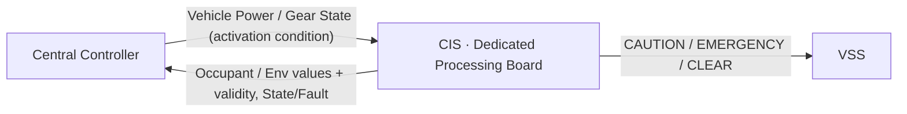

> 현재 단계에서는 정보의 **의미와 방향**만 정의한다.  
> 실제 프로토콜, 메시지 ID, 주기 및 Payload는 전체 기능 취합 후 결정한다.


<a id="if-cis-s02"></a>
> 원문 구간: [CIS/03_CIS_LOGICAL_INTERFACE_NEEDS_DRAFT.md L24–63](https://github.com/vehicle-domain-control-system/integrated-vehicle-control/blob/1b1c4b834e4ac692f8e3eaf3e2680e4a530a2072/docs/requirements/CIS/03_CIS_LOGICAL_INTERFACE_NEEDS_DRAFT.md#L24-L63)

> **통합 검토:** [B01](#review-b01) — 원문과 제안을 함께 읽는다. 정책·수치·안전 동작을 자동 확정하지 않았다.

#### B.CIS.2 CIS → External

| Information Need | Purpose | Consumer | Protocol |
|---|---|---|---|
| 탑승자 존재 여부 | 실내 상태 파악 | Central Controller | Deferred |
| 탑승자 인원수 | 실내 상태 파악 | Central Controller | Deferred |
| 실내 온도 | 공조 등 상위 기능 활용 | Central Controller | Deferred |
| 실내 습도 | 공조 등 상위 기능 활용 | Central Controller | Deferred |
| 조도 | 조명 등 상위 기능 활용 | Central Controller | Deferred |
| 후방 물체 주의 상태 | 후방 주의 경고 시작 | VSS | Deferred |
| 후방 물체 긴급 상태 | 후방 긴급 경고로 전환 | VSS | Deferred |
| 후방 위험 해제 상태 | 후방 경고 종료 | VSS | Deferred |
| 각 정보의 유효 여부 | 신뢰도 판단 | Central Controller / VSS | Deferred |
| CIS 상태(`READY`/`ACTIVE`/`FAULT`) | 상위 진단 | Central Controller | Deferred |

##### 후방 근접 정보 경계

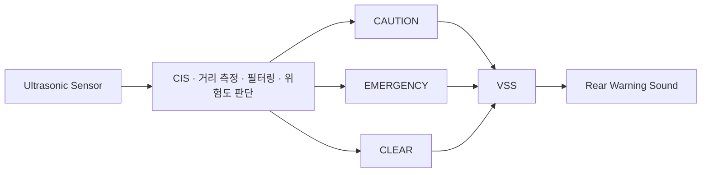

- 초음파 거리 Raw Data를 VSS가 직접 판정하는 구조를 기본으로 하지 않는다.
- 거리 임계값 및 위험도 판정은 CIS에서 정의한다.
- VSS는 `주의 / 긴급 / 해제` 의미 상태만 필요로 한다 (VSS Logical Interface Needs §2 참조).

---


<a id="if-cis-s03"></a>
> 원문 구간: [CIS/03_CIS_LOGICAL_INTERFACE_NEEDS_DRAFT.md L64–72](https://github.com/vehicle-domain-control-system/integrated-vehicle-control/blob/1b1c4b834e4ac692f8e3eaf3e2680e4a530a2072/docs/requirements/CIS/03_CIS_LOGICAL_INTERFACE_NEEDS_DRAFT.md#L64-L72)

#### B.CIS.3 External → CIS

| Information Need | Purpose | Source | Protocol |
|---|---|---|---|
| 차량 전원 상태 | 센싱 기능 활성/비활성 조건 판단 | Central Controller | Deferred |
| 차량 후진 기어 상태 | 후방 근접 감지 활성 조건 판단 (필요 여부 TBD) | Central Controller | Deferred |

---


<a id="if-cis-s04"></a>
> 원문 구간: [CIS/03_CIS_LOGICAL_INTERFACE_NEEDS_DRAFT.md L73–83](https://github.com/vehicle-domain-control-system/integrated-vehicle-control/blob/1b1c4b834e4ac692f8e3eaf3e2680e4a530a2072/docs/requirements/CIS/03_CIS_LOGICAL_INTERFACE_NEEDS_DRAFT.md#L73-L83)

#### B.CIS.4 인터페이스 설계 원칙

- 센서 Raw Data보다 의미가 확정된 상태를 우선 전달한다.
- 상대 시스템이 CIS 내부 비전 모델·필터링 로직을 알 필요가 없도록 한다.
- CIS는 후방 근접 위험 의미 상태를 VSS가 정의한 이벤트 이름과 동일하게 유지한다.
- 실내 영상 원본은 어떤 외부 인터페이스로도 노출하지 않는다.
- 같은 의미의 상태를 여러 메시지로 중복 정의하지 않는다.
- 실제 주기 및 Timeout은 기능별 필요 반응시간과 전체 Bus Load를 보고 결정한다.

---


<a id="if-cis-s05"></a>
> 원문 구간: [CIS/03_CIS_LOGICAL_INTERFACE_NEEDS_DRAFT.md L84–96](https://github.com/vehicle-domain-control-system/integrated-vehicle-control/blob/1b1c4b834e4ac692f8e3eaf3e2680e4a530a2072/docs/requirements/CIS/03_CIS_LOGICAL_INTERFACE_NEEDS_DRAFT.md#L84-L96)

#### B.CIS.5 아직 만들지 않는 것

| Item | Current Status |
|---|---|
| CAN ID / Signal ID | NOT DEFINED |
| DLC / Bit Position | NOT DEFINED |
| Period / Timeout | NOT DEFINED |
| Alive Counter / CRC / E2E | NOT DEFINED |
| Bit Rate | NOT DEFINED |
| 중앙처리장치 연결 물리 포트 (LPUART0/LPUART2 등) 배정 | NOT DEFINED |
| Rear caution distance (최종값) | NOT DEFINED |
| Rear emergency distance (최종값) | NOT DEFINED |
| 초음파 센서 모델 | NOT DEFINED |


<a id="if-mobile"></a>
### 부록 B · MOBILE 논리 인터페이스

출처: [MOBILE/03_MOBILE_LOGICAL_INTERFACE_NEEDS_DRAFT.md](https://github.com/vehicle-domain-control-system/integrated-vehicle-control/blob/1b1c4b834e4ac692f8e3eaf3e2680e4a530a2072/docs/requirements/MOBILE/03_MOBILE_LOGICAL_INTERFACE_NEEDS_DRAFT.md)


<a id="if-mobile-header"></a>
> 원문 구간: [MOBILE/03_MOBILE_LOGICAL_INTERFACE_NEEDS_DRAFT.md L1–8](https://github.com/vehicle-domain-control-system/integrated-vehicle-control/blob/1b1c4b834e4ac692f8e3eaf3e2680e4a530a2072/docs/requirements/MOBILE/03_MOBILE_LOGICAL_INTERFACE_NEEDS_DRAFT.md#L1-L8)

> 원문 제목: MOBILE Logical Interface Needs — Pre-Network Draft

> 목적: 통신 설계를 선행하지 않고, MOBILE SysRS에서 필요한 **정보 교환 항목만 보존**한다.
> 이 문서는 Protocol Specification 또는 API 명세가 아니다.
> `Source Owner` 열은 **해당 정보를 확정하여 제공하는 노드**를 가리킨다.

---


<a id="if-mobile-s01"></a>
> 원문 구간: [MOBILE/03_MOBILE_LOGICAL_INTERFACE_NEEDS_DRAFT.md L9–23](https://github.com/vehicle-domain-control-system/integrated-vehicle-control/blob/1b1c4b834e4ac692f8e3eaf3e2680e4a530a2072/docs/requirements/MOBILE/03_MOBILE_LOGICAL_INTERFACE_NEEDS_DRAFT.md#L9-L23)

#### B.MOBILE.1 Logical Interface Overview

```
사용자 ──▶ MOBILE ──[ 제어 요청 ]──▶ 게이트웨이 ──▶ 중앙 판단 기능 ──▶ 각 노드
                  ◀─[ 상태 · 결과 · 경고 ]──                        ◀── 각 노드
```

현재 단계에서는 정보의 **의미와 방향, 그리고 출처 노드**만 정의한다.
무선 방식, 데이터 형식, 메시지 구조 및 주기는 전체 기능 취합 후 결정한다.

게이트웨이의 구성과 담당은 본 문서의 범위가 아니며, MOBILE은 게이트웨이 너머의
개별 노드와 직접 통신하는 구조를 전제하지 않는다.

---


<a id="if-mobile-s02"></a>
> 원문 구간: [MOBILE/03_MOBILE_LOGICAL_INTERFACE_NEEDS_DRAFT.md L24–37](https://github.com/vehicle-domain-control-system/integrated-vehicle-control/blob/1b1c4b834e4ac692f8e3eaf3e2680e4a530a2072/docs/requirements/MOBILE/03_MOBILE_LOGICAL_INTERFACE_NEEDS_DRAFT.md#L24-L37)

#### B.MOBILE.2 MOBILE → External

| Information Need | Purpose | Consumer | Protocol |
|---|---|---|---|
| 제어 요청의 대상 기능과 목표 값 | 차량 기능 실행 요청 | 중앙 판단 기능 | Deferred |
| 제어 요청 식별자 | 중복·순서 판별 | 중앙 판단 기능 | Deferred |
| 인증 절차 응답 | 사용자 인증 | 중앙 판단 기능 | Deferred |
| 탑승 예정 시각 | 선행 공조 기동 시점 산출 | 중앙 판단 기능 | Deferred |

MOBILE은 요청을 생성할 뿐이며 **허용 여부와 실제 수행은 차량이 결정한다.**
MOBILE이 자체 판정으로 차량의 판정을 대체하지 않는다.

---


<a id="if-mobile-s03"></a>
> 원문 구간: [MOBILE/03_MOBILE_LOGICAL_INTERFACE_NEEDS_DRAFT.md L38–82](https://github.com/vehicle-domain-control-system/integrated-vehicle-control/blob/1b1c4b834e4ac692f8e3eaf3e2680e4a530a2072/docs/requirements/MOBILE/03_MOBILE_LOGICAL_INTERFACE_NEEDS_DRAFT.md#L38-L82)

> **통합 검토:** [A17](#review-a17), [A18](#review-a18) — 원문과 제안을 함께 읽는다. 정책·수치·안전 동작을 자동 확정하지 않았다.

#### B.MOBILE.3 External → MOBILE

##### B.MOBILE.3.1 실행 상태

| Information Need | Purpose | Source Owner | Protocol |
|---|---|---|---|
| 도어 잠금 상태 · 물리 개폐 상태 | 상태 표시 | BCM | Deferred |
| 도어 종합 상태 비정상 여부 | 이상 상태 표시 | BCM | Deferred |
| Fan 요구 수준 · 실제 동작 수준 | 지시 대비 실제 표시 | BCM | Deferred |
| 온도 장치 동작 방향 · 동작 상태 | 냉방·난방 표시 | BCM | Deferred |
| 현재 조명 알림 종류 · 밝기 수준 | 조명 상태 표시 | BCM | Deferred |
| 조명 사용 설정 상태 | 설정 표시 | BCM | Deferred |

##### B.MOBILE.3.2 센싱 및 환경

| Information Need | Purpose | Source Owner | Protocol |
|---|---|---|---|
| 현재 실내 온도 | 현재/목표 온도 표시 | CIS | Deferred |
| 차량이 확정한 실내 환경 정보 | 실내 상태 표시 | CIS | Deferred |
| 탑승자 유무 | 실내 상태 표시 | CIS | Deferred |

##### B.MOBILE.3.3 타 기능 상태

| Information Need | Purpose | Source Owner | Protocol |
|---|---|---|---|
| 창문 동작 상태 · 요청 처리 결과 | 상태 표시 | **TBD — 담당 노드 미정** | Deferred |
| 음향 기능의 오류 | 오류 표시 | VSS | Deferred |

##### B.MOBILE.3.4 판단 결과 및 공통 정보

| Information Need | Purpose | Source Owner | Protocol |
|---|---|---|---|
| 설정된 목표 온도 · 자동 공조 사용 여부 | 설정 표시 | 중앙 판단 기능 | Deferred |
| 선행 공조 수행 상태 · 설정된 탑승 예정 시각 | 선행 공조 표시 | 중앙 판단 기능 | Deferred |
| 제어 요청 처리 결과 · 거부·실패 사유 | 결과 표시 | 중앙 판단 기능 | Deferred |
| 안전 관련 경고 (등급 구분) | 경고 표시 | 중앙 판단 기능 | Deferred |
| 오류 분류 (센서 · 통신 · 기능) | 오류 구분 표시 | 각 노드 | Deferred |
| 각 상태 값의 신뢰성 정보 | 신뢰성 구분 표시 | 각 노드 | Deferred |
| 각 상태 값의 최신 여부 판단 근거 | `STALE` 판정 | 각 노드 | Deferred |

> `Source Owner` 가 **TBD** 인 항목은 담당 노드가 정해지지 않아 형태를 정의할 수 없다.
> 해당 항목의 논리 계약은 `02_MOBILE_SYSRS_FUNCTIONAL_BASELINE_DRAFT` 8.3절에 정의한다.

---


<a id="if-mobile-s04"></a>
> 원문 구간: [MOBILE/03_MOBILE_LOGICAL_INTERFACE_NEEDS_DRAFT.md L83–94](https://github.com/vehicle-domain-control-system/integrated-vehicle-control/blob/1b1c4b834e4ac692f8e3eaf3e2680e4a530a2072/docs/requirements/MOBILE/03_MOBILE_LOGICAL_INTERFACE_NEEDS_DRAFT.md#L83-L94)

#### B.MOBILE.4 인터페이스 설계 원칙

- 상태 값과 신뢰성 정보를 분리하지 않고 함께 전달한다. 분리하면 화면에서 신뢰성 표시가 누락된다.
- 전송 접수와 수행 완료를 구분 가능한 형태로 전달한다. 하나로 합치면 결과를 확인하지 못한 요청을 성공으로 표시하게 된다.
- 센서 원시 데이터가 아니라 차량이 확정한 상태를 전달한다.
- 안전 관련 경고는 주기 전송을 기다리지 않고 발생 시점에 전달한다.
- 같은 의미의 상태를 여러 경로로 중복 정의하지 않는다.
- 상태 최신 여부를 판단할 근거를 함께 전달한다. 근거가 없으면 무선 구간 지연을 검출할 수 없다.
- 실제 주기 및 Timeout 은 사용자 인지 한계와 단말 전력 소모를 함께 보고 결정한다.

---


<a id="if-mobile-s05"></a>
> 원문 구간: [MOBILE/03_MOBILE_LOGICAL_INTERFACE_NEEDS_DRAFT.md L95–113](https://github.com/vehicle-domain-control-system/integrated-vehicle-control/blob/1b1c4b834e4ac692f8e3eaf3e2680e4a530a2072/docs/requirements/MOBILE/03_MOBILE_LOGICAL_INTERFACE_NEEDS_DRAFT.md#L95-L113)

#### B.MOBILE.5 아직 만들지 않는 것

| Item | Current Status |
|---|---|
| BLE / Wi-Fi 등 무선 방식 | NOT DEFINED |
| 서비스 및 캐릭터리스틱 구조 | NOT DEFINED |
| JSON / 바이너리 등 데이터 형식 | NOT DEFINED |
| 필드 이름 및 자료형 | NOT DEFINED |
| MTU 및 분할 전송 방식 | NOT DEFINED |
| 상태 송신 주기 및 전송 트리거 | NOT DEFINED |
| Timeout 및 Freshness 표현 | NOT DEFINED |
| 인증 프로토콜 및 키 관리 방식 | NOT DEFINED |
| 알림 전달 방식 | NOT DEFINED |
| 게이트웨이 구성 및 담당 | NOT DEFINED |
| 창문 기능 담당 노드 | NOT DEFINED |
| 화면 레이아웃 및 시각 디자인 | NOT DEFINED |

---


<a id="if-mobile-s06"></a>
> 원문 구간: [MOBILE/03_MOBILE_LOGICAL_INTERFACE_NEEDS_DRAFT.md L114–121](https://github.com/vehicle-domain-control-system/integrated-vehicle-control/blob/1b1c4b834e4ac692f8e3eaf3e2680e4a530a2072/docs/requirements/MOBILE/03_MOBILE_LOGICAL_INTERFACE_NEEDS_DRAFT.md#L114-L121)

#### B.MOBILE.6 확인이 필요한 항목

| 항목 | 확인 대상 | 사유 |
|---|---|---|
| 창문 상태의 출처 | 팀 | 담당 노드가 정해지지 않아 `Source Owner` 미정 |
| 상태 송신 주기 | 차량 및 게이트웨이 | `STALE` 판정 시간이 이 값에 종속된다 (02 문서 13절) |
| 경고 등급 정의 | 중앙 판단 기능 | 등급 구분 없이는 우선 표시 규칙을 적용할 수 없다 |
| 오류 분류 열거값 | 전 노드 | 센서·통신·기능 구분 표시가 노드마다 달라지면 안 된다 |


<a id="if-vss"></a>
### 부록 B · VSS 논리 인터페이스

출처: [VSS/03_VSS_LOGICAL_INTERFACE_NEEDS_DRAFT.md](https://github.com/vehicle-domain-control-system/integrated-vehicle-control/blob/1b1c4b834e4ac692f8e3eaf3e2680e4a530a2072/docs/requirements/VSS/03_VSS_LOGICAL_INTERFACE_NEEDS_DRAFT.md)


<a id="if-vss-header"></a>
> 원문 구간: [VSS/03_VSS_LOGICAL_INTERFACE_NEEDS_DRAFT.md L1–9](https://github.com/vehicle-domain-control-system/integrated-vehicle-control/blob/1b1c4b834e4ac692f8e3eaf3e2680e4a530a2072/docs/requirements/VSS/03_VSS_LOGICAL_INTERFACE_NEEDS_DRAFT.md#L1-L9)

> 원문 제목: VSS Logical Interface Needs — Pre-Network Draft (Revised Review Candidate)

> 상태: **REVIEW DRAFT / ECU Cross-check 전**  
> 상위 기준: `02_VSS_SYSRS_FUNCTIONAL_BASELINE_DRAFT.md`  
> 목적: 실제 CAN/UART 설계를 선행하지 않고, VSS와 외부 ECU 사이에서 **무슨 의미의 정보를 어떤 방향으로 교환해야 하는지**를 정의한다.  
> 이 문서는 CAN Matrix, Protocol Specification, `*_Interface.h` 또는 Wire Encoding 명세가 아니다.

---


<a id="if-vss-s00"></a>
> 원문 구간: [VSS/03_VSS_LOGICAL_INTERFACE_NEEDS_DRAFT.md L10–44](https://github.com/vehicle-domain-control-system/integrated-vehicle-control/blob/1b1c4b834e4ac692f8e3eaf3e2680e4a530a2072/docs/requirements/VSS/03_VSS_LOGICAL_INTERFACE_NEEDS_DRAFT.md#L10-L44)

#### B.VSS.0 문서 상태와 표기 규칙

| 표기 | 의미 |
|---|---|
| `BASELINE` | SR/SysRS에서 의미 요구가 직접 확인되는 항목 |
| `PROVISIONAL` | Logical Interface를 구체화하기 위한 권장 표현. 팀 합의 전 Signal 확정 금지 |
| `OPTIONAL` | 통합 진단/시험 요구가 있을 때만 추가할 후보 |
| `TBD` | 상대 ECU 또는 Network/Power/Fault 정책과의 Cross-check 후 결정 |
| `DEFERRED` | 본 문서보다 후속 Network/Element 단계에서 결정 |

##### B.VSS.0.1 본 문서에서 지키는 경계

본 문서에서는 다음을 정의한다.

- 정보의 의미
- 정보의 방향
- One-shot Event와 Stateful Information의 구분
- VSS가 외부에서 반드시 알아야 하는 상태 의미
- VSS가 외부에 제공해야 하는 상태/오류 의미
- Startup/Wake, Freshness, Invalid 입력에서 필요한 **논리 계약**

본 문서에서는 다음을 확정하지 않는다.

- 실제 CAN/LIN/UART 경로
- CAN Message ID / Signal ID
- Start Bit / Length / DLC / Byte Order
- 실제 enum 숫자값 및 reserved code
- 최종 송신 주기 및 Timeout 값
- EVENT sequence bit width
- CRC / E2E / Alive Counter
- Bus-Off 상세 복구 정책
- ECU별 최종 Network Producer / Consumer

---


<a id="if-vss-s01"></a>
> 원문 구간: [VSS/03_VSS_LOGICAL_INTERFACE_NEEDS_DRAFT.md L45–100](https://github.com/vehicle-domain-control-system/integrated-vehicle-control/blob/1b1c4b834e4ac692f8e3eaf3e2680e4a530a2072/docs/requirements/VSS/03_VSS_LOGICAL_INTERFACE_NEEDS_DRAFT.md#L45-L100)

#### B.VSS.1 Logical Interface Overview

VSS 입력은 성격에 따라 **One-shot Event**와 **Stateful Information**으로 나눈다.

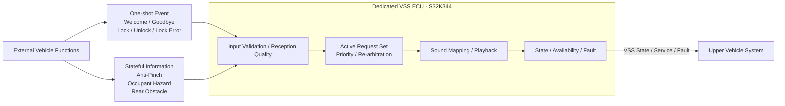

##### B.VSS.1.1 One-shot Event

순간적인 **발생 사실**이 중요하며, 발생 후 값이 지속되는 상태로 해석하지 않는다.

예:

- 차량 사용 시작 확정
- 차량 사용 종료 확정
- 도어 잠금 완료
- 도어 잠금 해제 완료
- 도어 잠금 이상 발생

One-shot Event는 동일 발생의 재전달과 별개의 새로운 발생을 구분할 수 있는 Delivery Contract가 필요하다. `[BASELINE need / encoding TBD]`

##### B.VSS.1.2 Stateful Information

현재 의미 상태가 일정 시간 유지되며, 상태가 변경될 때까지 VSS 중재 입력으로 사용된다.

예:

- Anti-Pinch: `CLEAR / ACTIVE`
- Occupant Hazard: `CLEAR / ACTIVE`
- Rear Obstacle: `CLEAR / CAUTION / EMERGENCY`

Stateful Information은 정상 의미값과 **수신 품질 이상**을 분리해서 다뤄야 한다. `SNA (Signal Not Available)`는 Producer가 현재 정상 Semantic State를 제공할 수 없음을 나타내는 의미 상태이다. `STALE`, `INVALID`, `NOT_RECEIVED`, `NOT_AVAILABLE/SNA`를 정상 `CLEAR`로 자동 해석하지 않는다. `[BASELINE]`

---


<a id="if-vss-s02"></a>
> 원문 구간: [VSS/03_VSS_LOGICAL_INTERFACE_NEEDS_DRAFT.md L101–182](https://github.com/vehicle-domain-control-system/integrated-vehicle-control/blob/1b1c4b834e4ac692f8e3eaf3e2680e4a530a2072/docs/requirements/VSS/03_VSS_LOGICAL_INTERFACE_NEEDS_DRAFT.md#L101-L182)

#### B.VSS.2 External → VSS

##### B.VSS.2.1 One-shot Semantic Event

| Logical Information | 의미 | Class | Semantic Owner 후보 | Network Producer | Delivery 의미 | 상태 |
|---|---|---|---|---|---|---|
| `VEHICLE_WELCOME` | 차량 사용 시작이 확정됨 | Feedback | `TBD` | `TBD` | 발생 단위 식별 필요 | `BASELINE meaning / PROVISIONAL name` |
| `VEHICLE_GOODBYE` | 차량 사용 종료가 확정됨 | Feedback | `TBD` | `TBD` | 발생 단위 식별 필요 | `BASELINE meaning / PROVISIONAL name` |
| `DOOR_LOCK_COMPLETE` | 도어 잠금이 정상 완료됨 | Feedback | Door/Access 후보, `TBD` | `TBD` | 발생 단위 식별 필요 | `BASELINE meaning / PROVISIONAL name` |
| `DOOR_UNLOCK_COMPLETE` | 도어 잠금 해제가 정상 완료됨 | Feedback | Door/Access 후보, `TBD` | `TBD` | 발생 단위 식별 필요 | `BASELINE meaning / PROVISIONAL name` |
| `DOOR_LOCK_ERROR` | 도어 잠금 이상이 확정됨 | Warning | Door/Access 후보, `TBD` | `TBD` | 발생 단위 식별 필요 | `BASELINE meaning / PROVISIONAL name` |

###### B.VSS.2.1.1 One-shot Event 계약

One-shot Event의 Logical Interface는 다음 의미를 만족해야 한다.

- 하나의 실제 Event occurrence가 통신 신뢰성 확보를 위해 반복 전달되더라도 VSS가 여러 번 재생하지 않아야 한다. `[BASELINE]`
- 동일 종류 Event가 나중에 다시 실제로 발생한 경우에는 새로운 occurrence로 구분 가능해야 한다. `[BASELINE]`
- Startup/Wake 중 VSS가 아직 Event를 정상 수용할 수 없는 경우에도 의미 유효기간 안의 Event가 무조건 유실되는 구조여서는 안 된다. `[BASELINE]`
- Startup/Wake 또는 통신 복구 이전에 발생한 Event가 이미 의미 유효기간을 초과했다면 신규 Event처럼 뒤늦게 재생되어서는 안 된다. `[BASELINE]`

발생 단위 식별 방식은 다음 중 하나 또는 동등한 방식으로 후속 단계에서 확정한다.

- Event occurrence sequence
- Event occurrence counter
- Toggle/edge identity
- Producer-side latch + acknowledged consumption
- 동등한 중복 억제 가능한 전달 방식

> `EVENT_CODE + EVENT_SEQ`는 현재 유력한 후보이지만, **bit width와 wire encoding은 본 단계에서 확정하지 않는다.** `[PROVISIONAL]`

##### B.VSS.2.2 Stateful Semantic Information

| Logical Information | 정상 의미 상태 | VSS 사용 목적 | Semantic Owner 후보 | Network Producer | 상태 |
|---|---|---|---|---|---|
| `WINDOW_ANTIPINCH_STATE` | `CLEAR / ACTIVE` | Anti-Pinch 긴급 경고의 시작/유지/종료 | Power Window 후보, `TBD` | `TBD` | `PROVISIONAL - recommended` |
| `OCCUPANT_HAZARD_STATE` | `CLEAR / ACTIVE` | 잔류 탑승자 위험 긴급 경고의 시작/유지/종료 | Sensing/Central 후보, `TBD` | `TBD` | `PROVISIONAL - recommended` |
| `REAR_OBSTACLE_STATE` | `CLEAR / CAUTION / EMERGENCY` | 후방 경고 단계 선택, 승격/강등/해제 | Sensing/Central 후보, `TBD` | `TBD` | `PROVISIONAL - recommended` |

###### B.VSS.2.2.1 Power Window Anti-Pinch

```text
Logical Information : WINDOW_ANTIPINCH_STATE
Normal Meaning       : CLEAR / ACTIVE
```

- `ACTIVE`: VSS가 Anti-Pinch Emergency 요청을 현재 유효 요청 집합에 포함해야 함
- `CLEAR`: 정상적으로 끼임 위험이 해제되었음을 의미함
- `STALE/INVALID/NOT_RECEIVED/SNA`: `CLEAR`와 동일 의미가 아님

`[PROVISIONAL logical representation]`

###### B.VSS.2.2.2 Occupant Hazard

```text
Logical Information : OCCUPANT_HAZARD_STATE
Normal Meaning       : CLEAR / ACTIVE
```

- `ACTIVE`: 잔류 탑승자 위험이 외부 기능에서 확정되어 VSS 경고가 요구되는 상태
- `CLEAR`: 정상적으로 해당 위험이 해제된 상태
- 탑승자 존재 Raw Detection과 `OCCUPANT_HAZARD_STATE`는 동일 개념으로 취급하지 않는다.

`[PROVISIONAL logical representation]`

###### B.VSS.2.2.3 Rear Obstacle

```text
Logical Information : REAR_OBSTACLE_STATE
Normal Meaning       : CLEAR / CAUTION / EMERGENCY
```

- `CLEAR`: 현재 후방 경고 대상 범위가 아님
- `CAUTION`: 주의 수준 경고 필요
- `EMERGENCY`: 긴급 수준 경고 필요

`CAUTION -> EMERGENCY`, `EMERGENCY -> CAUTION`, `* -> CLEAR`는 모두 **상태 변경**이며 VSS 재중재의 입력이 된다.

`[PROVISIONAL logical representation]`

---


<a id="if-vss-s03"></a>
> 원문 구간: [VSS/03_VSS_LOGICAL_INTERFACE_NEEDS_DRAFT.md L183–239](https://github.com/vehicle-domain-control-system/integrated-vehicle-control/blob/1b1c4b834e4ac692f8e3eaf3e2680e4a530a2072/docs/requirements/VSS/03_VSS_LOGICAL_INTERFACE_NEEDS_DRAFT.md#L183-L239)

> **통합 검토:** [B15](#review-b15) — 원문과 제안을 함께 읽는다. 정책·수치·안전 동작을 자동 확정하지 않았다.

#### B.VSS.3 Semantic State와 Reception Quality 분리

Stateful Information은 **차량 의미 상태(Semantic State)**와 **통신/수신 품질(Reception Quality)**을 분리해서 관리한다.

##### B.VSS.3.1 Reception Quality 최소 논리 상태

VSS 내부에서는 상태 유지형 입력별로 최소 다음 수신 품질을 구분할 수 있어야 한다.

```text
NOT_RECEIVED
VALID
STALE
INVALID
```

| Reception Quality | 의미 |
|---|---|
| `NOT_RECEIVED` | Startup/Wake 이후 아직 정상 정보를 한 번도 수용하지 못함 |
| `VALID` | 현재 Freshness/Validation 조건을 만족하는 정상 입력 |
| `STALE` | 과거 정상 입력은 있으나 현재 Freshness를 만족하지 못함 |
| `INVALID` | 수신은 되었으나 값/포맷/무결성 검증을 만족하지 못함 |

`NOT_AVAILABLE/SNA`는 Producer가 의미적으로 "현재 정상 상태를 제공할 수 없음"을 전달하는 **Semantic-side 상태** 후보이며, `STALE`과 같은 Reception Quality와 동일 개념이 아니다.

##### B.VSS.3.2 Last Valid State와 Effective State

VSS는 필요 시 다음 세 개념을 논리적으로 분리한다.

```text
Last Valid Semantic State
Reception Quality
Effective State used for Arbitration
```

예:

```text
Last Valid State  = ACTIVE
Reception Quality = STALE
Effective State   = TBD by Fail-safe Policy
```

이 경우 `STALE`을 자동으로 `CLEAR`로 바꾸지 않는다.

###### B.VSS.3.2.1 Fail-safe 결정 경계

Stateful Input가 `STALE / INVALID / NOT_RECEIVED / SNA`가 되었을 때 VSS가 적용할 Effective State는 **기능별 공동 결정**이 필요하다.

- 즉시 비활성화
- 제한 시간 Hold 후 비활성화
- 별도 degraded behavior
- 상위 시스템 판단을 기다림

본 문서는 이 중 하나를 임의 확정하지 않는다. `[TBD - Safety/Source/Network joint decision]`

---


<a id="if-vss-s04"></a>
> 원문 구간: [VSS/03_VSS_LOGICAL_INTERFACE_NEEDS_DRAFT.md L240–260](https://github.com/vehicle-domain-control-system/integrated-vehicle-control/blob/1b1c4b834e4ac692f8e3eaf3e2680e4a530a2072/docs/requirements/VSS/03_VSS_LOGICAL_INTERFACE_NEEDS_DRAFT.md#L240-L260)

> **통합 검토:** [B04](#review-b04) — 원문과 제안을 함께 읽는다. 정책·수치·안전 동작을 자동 확정하지 않았다.

#### B.VSS.4 후방 장애물 정보 경계

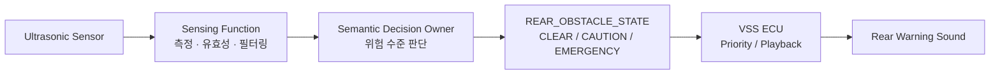

- 초음파 Raw Distance를 VSS 입력으로 요구하지 않는다. `[BASELINE]`
- 거리 필터링 및 주의/긴급 임계값 판정은 VSS 외부에서 수행한다. `[BASELINE]`
- VSS는 최종적으로 의미가 확정된 `CLEAR / CAUTION / EMERGENCY` 상태를 필요로 한다. `[BASELINE]`
- Sensing ECU와 Central/Domain 중 누가 최종 Semantic Decision Owner 및 Network Producer가 될지는 상대 ECU Interface Cross-check 후 확정한다. `[TBD]`

---


<a id="if-vss-s05"></a>
> 원문 구간: [VSS/03_VSS_LOGICAL_INTERFACE_NEEDS_DRAFT.md L261–366](https://github.com/vehicle-domain-control-system/integrated-vehicle-control/blob/1b1c4b834e4ac692f8e3eaf3e2680e4a530a2072/docs/requirements/VSS/03_VSS_LOGICAL_INTERFACE_NEEDS_DRAFT.md#L261-L366)

> **통합 검토:** [B19](#review-b19) — 원문과 제안을 함께 읽는다. 정책·수치·안전 동작을 자동 확정하지 않았다.

#### B.VSS.5 VSS → External

VSS 출력은 **현재 동작 상태**, **입력 수용 가능 여부**, **서비스 제공 가능 수준**, **Internal Output Fault**를 외부 시스템이 구분할 수 있도록 구성하는 것을 기본 방향으로 한다.

##### B.VSS.5.1 Core Logical Output 후보

| Logical Information | Logical Meaning | Consumer | 상태 |
|---|---|---|---|
| `VSS_STATE` | `STARTUP / READY / PLAYING / FAULT` | `TBD` | `BASELINE meaning / PROVISIONAL name` |
| `VSS_ACCEPTING_EVENTS` | 현재 Semantic Event/State의 수용·검증·중재 가능 여부 | `TBD` | `PROVISIONAL - recommended` |
| `VSS_AVAILABILITY` | 현재 VSS 음향 서비스 제공 가능 범위 | `TBD` | `PROVISIONAL` |
| `VSS_FAULT_ACTIVE` | 현재 활성 Internal Output Fault 존재 여부 | `TBD` | `PROVISIONAL - recommended` |
| `VSS_LAST_FAULT` | 최근 주요 Internal Output Fault 원인 | `TBD` | `BASELINE need / PROVISIONAL encoding` |

###### B.VSS.5.1.1 VSS State

```text
VSS_STATE
- STARTUP
- READY
- PLAYING
- FAULT
```

- `READY`: 현재 Playback Session 없음
- `PLAYING`: Playback Session 활성
- `PLAYING` 중에도 새로운 입력을 수용/중재할 수 있음
- `FAULT`: 정상 음향 출력 능력을 보장할 수 없음

따라서 `VSS_STATE == READY`만으로 "Event 수용 가능"을 판단하지 않는다.

###### B.VSS.5.1.2 VSS Accepting Events

```text
VSS_ACCEPTING_EVENTS
- FALSE
- TRUE
```

`TRUE`의 의미는 다음으로 제한한다.

> VSS가 현재 Semantic Event/State를 수용하고 유효성 검사 및 중재 대상으로 처리할 수 있다.

`TRUE`가 **모든 Sound Asset이 반드시 출력 가능함**을 의미하지 않는다. 해당 정보는 Service Availability/Fault와 분리한다.

실제 Network Signal로 둘지, State/Availability에서 파생하는 상위 계약으로 둘지는 Consumer 확인 후 확정한다. `[TBD]`

###### B.VSS.5.1.3 VSS Service Availability

논리적 서비스 수준은 다음 의미를 사용한다.

```text
FULL
DEGRADED
UNAVAILABLE
```

| Availability | 의미 |
|---|---|
| `FULL` | Baseline VSS 기능을 정상 제공 가능 |
| `DEGRADED` | 일부 Event/Asset/출력 기능에 제한이 있으나 VSS 전체가 출력 불능은 아님 |
| `UNAVAILABLE` | 정상적인 VSS 음향 출력을 보장할 수 없음 |

- `UNAVAILABLE`은 `VSS_STATE == FAULT`와 연계되어야 한다.
- `FULL/DEGRADED`는 `READY` 또는 `PLAYING`에서 가능하다.
- `STARTUP`에서는 Availability 판단이 아직 완료되지 않았을 수 있다.
- 따라서 실제 Wire Encoding 단계에서는 `STARTUP` 중 Availability 표현 방법을 별도 확정해야 한다. 예: 별도 `NOT_EVALUATED` 표현 또는 `VSS_STATE`와 조합 해석. `[TBD]`

###### B.VSS.5.1.4 Fault Active / Last Fault

`VSS_FAULT_ACTIVE`와 `VSS_LAST_FAULT`는 역할이 다르다.

```text
VSS_FAULT_ACTIVE
= 현재 Internal Output Fault가 활성인가

VSS_LAST_FAULT
= 최근 주요 Internal Output Fault 원인은 무엇인가
```

- Input `STALE/INVALID/NOT_RECEIVED` 자체를 Internal Output Fault로 보고하지 않는다.
- Internal Output Fault가 복구되면 `FAULT_ACTIVE`는 해제되어야 한다.
- `LAST_FAULT`는 Diagnostic Clear 정책이 적용될 때까지 유지 가능해야 한다.

##### B.VSS.5.2 Optional Diagnostic / Test Information

다음은 Core Vehicle Interface에 바로 넣지 않고 통합 검증 요구가 있을 때 추가한다.

| Information | 사용 목적 | 상태 |
|---|---|---|
| `VSS_CURRENT_REQUEST` | 현재 Playback Winner 의미 확인 | `OPTIONAL` |
| `VSS_RECOVERY_STATUS` | 복구 진행/성공/실패 관측 | `OPTIONAL` |
| Input Reception Quality | Stateful 입력별 `VALID/STALE/...` 관측 | `OPTIONAL / Testability need` |
| Applied Effective State | Stale/SNA 이후 실제 중재 입력 확인 | `OPTIONAL / Testability need` |
| Class/Semantic Capability | DEGRADED 상태의 세부 사용 가능 범위가 Consumer에 필요할 때 | `OPTIONAL` |

###### B.VSS.5.2.1 기본적으로 중복 Signal을 만들지 않는 정보

- `VSS_READY_BOOL`: `VSS_STATE`와 의미 중복 가능성이 높아 기본 생성하지 않음
- `VSS_PLAYBACK_ACTIVE`: 기본적으로 `VSS_STATE == PLAYING`에서 파생 가능
- `VSS_RECOVERED_EVENT`: `FAULT/Availability` 상태 변화로 충분한지 먼저 검토

Consumer가 독립 Signal을 명시적으로 요구할 때만 추가한다.

---


<a id="if-vss-s06"></a>
> 원문 구간: [VSS/03_VSS_LOGICAL_INTERFACE_NEEDS_DRAFT.md L367–383](https://github.com/vehicle-domain-control-system/integrated-vehicle-control/blob/1b1c4b834e4ac692f8e3eaf3e2680e4a530a2072/docs/requirements/VSS/03_VSS_LOGICAL_INTERFACE_NEEDS_DRAFT.md#L367-L383)

#### B.VSS.6 Request / Command 경계

현재 VSS Baseline은 외부 ECU가 VSS의 음향 Asset 또는 Playback Sequence를 직접 제어하는 구조를 요구하지 않는다.

따라서 다음과 같은 범용 Command는 기본 Logical Interface에 두지 않는다.

| Command | 기본 판단 | 상태 |
|---|---|---|
| `PLAY_SOUND_xxx` | 상위가 VSS 내부 Sound Asset을 직접 지정하지 않음 | `NOT REQUIRED` |
| `STOP_SOUND` | 상태형 경고는 해당 Semantic State의 해제/변경으로 종료 | `NOT REQUIRED` |
| `SET_PRIORITY` | Priority는 VSS Local Policy | `NOT REQUIRED` |
| `SET_VOLUME` | 현재 Functional Baseline의 외부 Product Command로 요구하지 않음 | `NOT BASELINE` |

시험/진단 목적의 강제 재생 명령이 필요하면 제품 기능 Interface와 분리된 Test/Diagnostic Interface로 정의한다. `[DEFERRED]`

---


<a id="if-vss-s07"></a>
> 원문 구간: [VSS/03_VSS_LOGICAL_INTERFACE_NEEDS_DRAFT.md L384–437](https://github.com/vehicle-domain-control-system/integrated-vehicle-control/blob/1b1c4b834e4ac692f8e3eaf3e2680e4a530a2072/docs/requirements/VSS/03_VSS_LOGICAL_INTERFACE_NEEDS_DRAFT.md#L384-L437)

#### B.VSS.7 Startup / Wake / Communication Recovery 계약

##### B.VSS.7.1 Startup / Wake One-shot Event

One-shot Event가 VSS가 아직 정상 수용할 수 없는 시점에 발생할 가능성이 있으므로 다음 논리 계약이 필요하다.

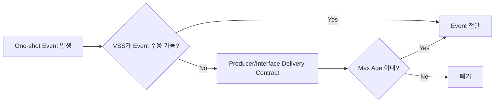

실제 방법은 다음 중 하나 또는 동등한 방식으로 확정한다.

- VSS 선행 Wake
- VSS 수용 가능 상태 확인 후 Event 송신
- Producer-side Startup Event Latch
- Event queue/acknowledge 기반 전달

`[TBD - Power/Source/Interface joint decision]`

##### B.VSS.7.2 Stateful Information Startup

Stateful Information은 Event History를 재생하는 것이 아니라 **현재 상태를 재동기화**해야 한다.

예:

```text
Wake 후 현재 REAR_OBSTACLE_STATE = CLEAR
-> 과거 EMERGENCY를 재생하지 않음
-> 현재 CLEAR로 동기화
```

##### B.VSS.7.3 Communication Recovery

통신 복구 시:

- Stateful Information은 현재 의미 상태를 다시 수용해 재동기화한다.
- 오래된 One-shot Event를 신규 발생처럼 재생하지 않는다.
- Last Valid State와 Reception Quality를 구분해 갱신한다.
- 실제 Timeout/Freshness 숫자는 Network 단계에서 확정한다.

---


<a id="if-vss-s08"></a>
> 원문 구간: [VSS/03_VSS_LOGICAL_INTERFACE_NEEDS_DRAFT.md L438–477](https://github.com/vehicle-domain-control-system/integrated-vehicle-control/blob/1b1c4b834e4ac692f8e3eaf3e2680e4a530a2072/docs/requirements/VSS/03_VSS_LOGICAL_INTERFACE_NEEDS_DRAFT.md#L438-L477)

#### B.VSS.8 Interface Fail-safe 논리 경계

##### B.VSS.8.1 Invalid / Unsupported One-shot Event

```text
Invalid / Unsupported Event
 -> Reject
 -> 임의의 Sound 출력 금지
 -> Input Diagnostic 기록 가능
 -> VSS Internal Output Fault로 자동 승격하지 않음
```

##### B.VSS.8.2 Stateful STALE / INVALID / NOT_RECEIVED / SNA

```text
Stateful Input Quality 이상
 -> 정상 CLEAR로 자동 치환 금지
 -> 기능별 Fail-safe Policy 적용
 -> 필요 시 Bounded Hold / Disable / Degraded 적용
 -> 진단/시험 시 Reception Quality와 Effective State 관측 가능해야 함
```

정확한 Hold 시간 및 Safe Effective State는 Source ECU와 Safety/Network 정책을 함께 보고 정한다. `[TBD]`

##### B.VSS.8.3 VSS Internal Fault와 Upstream Communication 이상 분리

다음은 서로 다른 진단 축이다.

```text
AUDIO_OUTPUT_FAILURE
= VSS 내부 출력 기능 고장

REAR_OBSTACLE_STATE STALE
= 외부 입력 수신 품질 이상
```

두 상태를 동일 Fault Code로 합치지 않는다.

---


<a id="if-vss-s09"></a>
> 원문 구간: [VSS/03_VSS_LOGICAL_INTERFACE_NEEDS_DRAFT.md L478–509](https://github.com/vehicle-domain-control-system/integrated-vehicle-control/blob/1b1c4b834e4ac692f8e3eaf3e2680e4a530a2072/docs/requirements/VSS/03_VSS_LOGICAL_INTERFACE_NEEDS_DRAFT.md#L478-L509)

#### B.VSS.9 Source / Consumer Ownership 현황

본 문서는 **정보 의미를 먼저 확정**하고, 실제 Source/Consumer 소유권은 상대 ECU Interface Cross-check 후 확정한다.

##### B.VSS.9.1 External → VSS

| Logical Information | Semantic Owner | Network Producer | 현재 상태 |
|---|---|---|---|
| Vehicle Welcome | `TBD` | `TBD` | Cross-check 필요 |
| Vehicle Goodbye | `TBD` | `TBD` | Cross-check 필요 |
| Door Lock Complete | Door/Access 후보 | `TBD` | Cross-check 필요 |
| Door Unlock Complete | Door/Access 후보 | `TBD` | Cross-check 필요 |
| Door Lock Error | Door/Access 후보 | `TBD` | Cross-check 필요 |
| Anti-Pinch State | Power Window 후보 | `TBD` | Cross-check 필요 |
| Occupant Hazard State | Sensing/Central 후보 | `TBD` | Cross-check 필요 |
| Rear Obstacle State | Sensing/Central 후보 | `TBD` | Cross-check 필요 |

> `Semantic Owner`와 `Network Producer`는 반드시 동일 ECU일 필요가 없다. Central이 의미를 최종 확정하고 다른 ECU가 전달하거나, 반대로 하위 ECU가 최종 의미를 직접 Publish하는 구조도 가능하므로 전체 아키텍처 확인 전 고정하지 않는다.

##### B.VSS.9.2 VSS → External

| Logical Information | Producer | Consumer | 현재 상태 |
|---|---|---|---|
| VSS State | VSS | `TBD` | Consumer 확인 필요 |
| Accepting Events | VSS | `TBD` | Signal 필요 여부 확인 |
| Service Availability | VSS | `TBD` | Consumer 사용 여부 확인 |
| Fault Active | VSS | `TBD` | Consumer 확인 필요 |
| Last Fault | VSS | `TBD` | 진단 Consumer 확인 필요 |
| Optional Diagnostic | VSS | Test/Integration `TBD` | 필요 시만 추가 |

---


<a id="if-vss-s10"></a>
> 원문 구간: [VSS/03_VSS_LOGICAL_INTERFACE_NEEDS_DRAFT.md L510–529](https://github.com/vehicle-domain-control-system/integrated-vehicle-control/blob/1b1c4b834e4ac692f8e3eaf3e2680e4a530a2072/docs/requirements/VSS/03_VSS_LOGICAL_INTERFACE_NEEDS_DRAFT.md#L510-L529)

#### B.VSS.10 SysRS → Logical Interface Trace

| Logical Interface Need | 주요 SysRS 근거 |
|---|---|
| One-shot Event 식별 | `VSS-SYS-INT-001`, `017`, `VSS-SYS-FUN-039~041` |
| Stateful Active/Clear | `VSS-SYS-INT-002`, `013~016`, `VSS-SYS-FUN-035~037` |
| Rear CLEAR/CAUTION/EMERGENCY | `VSS-SYS-INT-003~005`, `VSS-SYS-FUN-014~018`, `042~043` |
| Input Reception Quality | `VSS-SYS-INT-013~016`, `VSS-SYS-NFR-018~019` |
| Event 수용 가능 정보 | `VSS-SYS-INT-006` |
| VSS State / Availability | `VSS-SYS-INT-007`, `VSS-SYS-DIA-016` |
| Playback 확인 | `VSS-SYS-INT-008` |
| Recovery 확인 | `VSS-SYS-INT-009`, `VSS-SYS-DIA-004~005`, `011` |
| Startup/Wake Delivery | `VSS-SYS-INT-010~012` |
| Internal Fault와 Input Diagnostic 분리 | `VSS-SYS-DIA-012~018` |
| Same-Class deterministic arbitration | `VSS-SYS-NFR-015~017` |

> 본 표의 SysRS ID는 Stage 02 `02_VSS_SYSRS_FUNCTIONAL_BASELINE_DRAFT.md` Review Candidate 기준이다.

---


<a id="if-vss-s11"></a>
> 원문 구간: [VSS/03_VSS_LOGICAL_INTERFACE_NEEDS_DRAFT.md L530–549](https://github.com/vehicle-domain-control-system/integrated-vehicle-control/blob/1b1c4b834e4ac692f8e3eaf3e2680e4a530a2072/docs/requirements/VSS/03_VSS_LOGICAL_INTERFACE_NEEDS_DRAFT.md#L530-L549)

#### B.VSS.11 Pre-Network Decision Summary

| No. | 결정/권장 사항 | 상태 |
|---|---|---|
| LI-01 | 순간 발생 정보와 지속 상태 정보를 One-shot Event / Stateful Information으로 분리 | `PROVISIONAL - recommend accept` |
| LI-02 | Welcome/Goodbye/Lock/Unlock/Lock Error는 One-shot Event로 취급 | `PROVISIONAL - recommend accept` |
| LI-03 | Anti-Pinch는 `CLEAR/ACTIVE` 상태 의미로 취급 | `PROVISIONAL - recommend accept` |
| LI-04 | Occupant Hazard는 `CLEAR/ACTIVE` 상태 의미로 취급 | `PROVISIONAL - recommend accept` |
| LI-05 | Rear Obstacle는 `CLEAR/CAUTION/EMERGENCY` 하나의 상태 정보로 취급 | `PROVISIONAL - recommend accept` |
| LI-06 | Rear Raw Distance는 VSS Logical Interface에 포함하지 않음 | `BASELINE` |
| LI-07 | Stateful Semantic State와 Reception Quality를 분리 | `BASELINE need / recommend accept` |
| LI-08 | `STALE/INVALID/NOT_RECEIVED/SNA`를 `CLEAR`로 자동 해석하지 않음 | `BASELINE` |
| LI-09 | One-shot 전달은 동일 발생 재전달과 신규 발생을 구분할 수 있어야 함 | `BASELINE need` |
| LI-10 | VSS 출력 기본 축은 State + Event 수용 가능 여부 + Availability + Fault 정보로 검토 | `PROVISIONAL` |
| LI-11 | Playback/Recovery/Input Quality 세부 정보는 Core보다 Optional Diagnostic 우선 | `PROVISIONAL` |
| LI-12 | Source/Consumer ECU와 Network Producer는 Cross-check 전 확정하지 않음 | `TBD 유지` |
| LI-13 | 실제 Signal bit width/Message ID/Cycle/Timeout은 본 단계에서 확정하지 않음 | `DEFERRED` |

---


<a id="if-vss-s12"></a>
> 원문 구간: [VSS/03_VSS_LOGICAL_INTERFACE_NEEDS_DRAFT.md L550–592](https://github.com/vehicle-domain-control-system/integrated-vehicle-control/blob/1b1c4b834e4ac692f8e3eaf3e2680e4a530a2072/docs/requirements/VSS/03_VSS_LOGICAL_INTERFACE_NEEDS_DRAFT.md#L550-L592)

#### B.VSS.12 Open Issues / Cross-check 필요 항목

#### P0 — Interface 의미 Freeze 전

1. One-shot Event별 최종 Semantic Owner 확정
2. Door Lock Complete가 개별 Door 기준인지 차량 전체 Lock Completion 기준인지 확정
3. Anti-Pinch `ACTIVE/CLEAR`의 Producer 판정 조건 확정
4. Occupant Detection과 `OCCUPANT_HAZARD`의 의미 경계 확정
5. Rear Obstacle의 최종 위험도 판단 Owner 확정
6. Stateful 입력별 `SNA` 의미와 Producer 동작 확정
7. Stateful 입력이 STALE/INVALID일 때 Effective State 정책 확정
8. Same-Class Arbitration의 고정 tie-break/sub-priority 정책 확정

#### P1 — Startup / Wake / Event Delivery

9. VSS Wake 순서와 Event Producer Wake 순서 확인
10. One-shot Event의 Startup/Wake Delivery 방식 확정
11. Event Max Age 기준 확정
12. 동일 occurrence 식별 방식 확정
13. Event occurrence 식별자의 reset/wrap 수명 규칙 확정
14. 통신 복구 후 오래된 One-shot Event 폐기 기준 확정

#### P2 — VSS Output Consumer

15. `VSS_ACCEPTING_EVENTS`를 실제 Consumer가 필요로 하는지 확인
16. `VSS_AVAILABILITY`를 실제 Consumer가 사용하는지 확인
17. STARTUP 중 Availability wire 표현 방식 확정
18. `VSS_FAULT_ACTIVE` / `VSS_LAST_FAULT` Consumer 확정
19. `VSS_CURRENT_REQUEST`, `RECOVERY_STATUS` 등 Optional Diagnostic 필요 여부 확인

#### P3 — Network 단계로 이관

20. Physical protocol
21. Message grouping
22. Event/State transmission method
23. Cycle / Timeout / Freshness 숫자
24. EVENT occurrence identity bit width
25. CRC / E2E / Alive Counter
26. Bus-Off / Communication Recovery 상세
27. CAN ID / DLC / Start Bit / Byte Order

---


<a id="if-vss-s13"></a>
> 원문 구간: [VSS/03_VSS_LOGICAL_INTERFACE_NEEDS_DRAFT.md L593–617](https://github.com/vehicle-domain-control-system/integrated-vehicle-control/blob/1b1c4b834e4ac692f8e3eaf3e2680e4a530a2072/docs/requirements/VSS/03_VSS_LOGICAL_INTERFACE_NEEDS_DRAFT.md#L593-L617)

#### B.VSS.13 아직 만들지 않는 것

| Item | Current Status |
|---|---|
| Physical protocol | `NOT DEFINED` |
| CAN Message ID | `NOT DEFINED` |
| Signal numeric ID | `NOT DEFINED` |
| Signal bit width | `NOT DEFINED` |
| DLC / Frame Length | `NOT DEFINED` |
| Bit Position | `NOT DEFINED` |
| Byte Order | `NOT DEFINED` |
| Final Cycle Time | `NOT DEFINED` |
| Final Timeout / Freshness | `NOT DEFINED` |
| EVENT occurrence identity width | `NOT DEFINED` |
| Alive / Rolling Counter | `NOT DEFINED` |
| CRC / E2E | `NOT DEFINED` |
| Bit Rate / Data Rate | `NOT DEFINED` |
| Rear caution distance | `NOT DEFINED` |
| Rear emergency distance | `NOT DEFINED` |
| Sensor filtering | `NOT DEFINED` |
| `*_Interface.h` wire structure | `NOT DEFINED` |

---


<a id="if-vss-s14"></a>
> 원문 구간: [VSS/03_VSS_LOGICAL_INTERFACE_NEEDS_DRAFT.md L618–635](https://github.com/vehicle-domain-control-system/integrated-vehicle-control/blob/1b1c4b834e4ac692f8e3eaf3e2680e4a530a2072/docs/requirements/VSS/03_VSS_LOGICAL_INTERFACE_NEEDS_DRAFT.md#L618-L635)

#### B.VSS.14 Deferred Security Interface Extension

VSS ↔ Central/Domain 통신 보안은 현재 Logical Interface Baseline에 포함하지 않는다. 현재 문서는 **기능 의미(Semantic Event/State/Fault/Availability)**를 우선 확정하며, 보안 적용은 기본 Interface/Network 안정화 이후 후속 확장으로 검토한다.

향후 Security Extension을 적용하는 경우 기능 Semantic Signal과 별도로 다음 통신 보안 메타데이터가 필요할 수 있다.

- Authentication / Security Context Identifier
- Session / Key Identifier
- Message Authentication / Integrity Tag
- Replay Protection Counter / Nonce
- Security Validation Result / Error Information

위 항목의 실제 Message 배치, bit width, 주기, Counter 및 Crypto 방식은 현재 단계에서 정의하지 않는다. 기능 Semantic Interface와 Security Transport/Protection 정보는 가능한 한 별도 책임으로 관리한다.

**Status:** `DEFERRED / FUTURE EXTENSION`

---


<a id="if-vss-s15"></a>
> 원문 구간: [VSS/03_VSS_LOGICAL_INTERFACE_NEEDS_DRAFT.md L636–660](https://github.com/vehicle-domain-control-system/integrated-vehicle-control/blob/1b1c4b834e4ac692f8e3eaf3e2680e4a530a2072/docs/requirements/VSS/03_VSS_LOGICAL_INTERFACE_NEEDS_DRAFT.md#L636-L660)

#### B.VSS.15 현재 단계 결론

현재 단계에서는 다음을 Logical Interface 기준으로 충분히 정의할 수 있다.

- One-shot Event와 Stateful Information의 구분
- VSS가 필요로 하는 Event/State 의미
- Anti-Pinch / Occupant / Rear 상태 표현 방향
- Raw Sensor Data와 Semantic State의 책임 경계
- 정상 Semantic State와 Reception Quality의 분리
- VSS State / Availability / Fault 출력 의미
- Startup/Wake/Event Delivery에서 필요한 논리 계약
- Communication Recovery 시 Stateful 재동기화와 오래된 Event 폐기 원칙

반면 다음은 상대 ECU 또는 Network 설계 없이 확정하지 않는다.

- 최종 Source/Consumer 및 Network Producer
- 실제 Signal 이름 확정 여부와 wire enum 숫자값
- CAN/UART 경로
- Message ID / DLC / Bit Layout
- Cycle / Timeout / Freshness 수치
- EVENT occurrence identity의 실제 bit 폭
- CRC / E2E / Alive Counter
- Stateful STALE 시 기능별 최종 Fail-safe 동작

따라서 다음 단계는 `05_VSS_ECU_INTERFACE_INFO_DRAFT.md`를 기준으로 **Power Window / Door / Central / Sensing 담당자와 Cross-check**를 수행하고, Semantic Owner / CLEAR / SNA / Startup-Wake Delivery 계약을 확정한 뒤 **Interface Freeze Candidate**로 전환하는 것이다.


<a id="appendix-c"></a>
## 부록 C. VSS ECU 인터페이스 정보


<a id="ecu-vss"></a>
### 부록 C · VSS ECU 인터페이스

출처: [VSS/05_VSS_ECU_INTERFACE_INFO_DRAFT.md](https://github.com/vehicle-domain-control-system/integrated-vehicle-control/blob/1b1c4b834e4ac692f8e3eaf3e2680e4a530a2072/docs/requirements/VSS/05_VSS_ECU_INTERFACE_INFO_DRAFT.md)


<a id="ecu-vss-header"></a>
> 원문 구간: [VSS/05_VSS_ECU_INTERFACE_INFO_DRAFT.md L1–11](https://github.com/vehicle-domain-control-system/integrated-vehicle-control/blob/1b1c4b834e4ac692f8e3eaf3e2680e4a530a2072/docs/requirements/VSS/05_VSS_ECU_INTERFACE_INFO_DRAFT.md#L1-L11)

> 원문 제목: VSS ECU Interface 정보 정리 — Stage 04 Review Candidate

> 상태: **REVIEW DRAFT / Domain·Network Cross-check 전**  
> 작성 형식 기준: `ECU_Interface_정보요청_가이드.md`  
> 요구사항 기준: `02_VSS_SYSRS_FUNCTIONAL_BASELINE_DRAFT.md`  
> 논리 인터페이스 기준: `03_VSS_LOGICAL_INTERFACE_NEEDS_DRAFT.md`  
> 목적: VSS ECU가 외부에서 **수용해야 하는 정보**, 외부에 **제공해야 하는 정보**, VSS 내부에서 **자체 처리해야 하는 로직과 Fail-safe 경계**를 Domain/Network 담당자가 검토할 수 있는 형태로 정리한다.  
> 주의: 본 문서는 CAN Matrix, Protocol Specification 또는 `*_Interface.h`의 최종 Wire Structure가 아니다.

---


<a id="ecu-vss-s00"></a>
> 원문 구간: [VSS/05_VSS_ECU_INTERFACE_INFO_DRAFT.md L12–53](https://github.com/vehicle-domain-control-system/integrated-vehicle-control/blob/1b1c4b834e4ac692f8e3eaf3e2680e4a530a2072/docs/requirements/VSS/05_VSS_ECU_INTERFACE_INFO_DRAFT.md#L12-L53)

#### C.VSS.0 표기 규칙

| 표기 | 의미 |
|---|---|
| `BASELINE` | SR/SysRS에서 의미 요구가 직접 확인되는 항목 |
| `CANDIDATE` | 초기 개발·벤치 검증을 위한 임시값 |
| `PROVISIONAL` | Interface 구체화를 위한 권장 표현. 팀 합의 전 Signal 확정 금지 |
| `OPTIONAL` | 통합 진단/시험 요구가 있을 때만 추가할 후보 |
| `TBD` | 상대 ECU, Domain, Network, Power 또는 Fault 정책과 Cross-check 후 결정 |
| `EXCLUDED` | 현재 VSS 기능 범위에서 명시적으로 제외 |

> **SNA (Signal Not Available)**: Producer가 현재 정상 Semantic State를 제공할 수 없음을 나타내는 의미 상태. `STALE`, `INVALID`, `NOT_RECEIVED` 같은 Reception Quality와는 구분한다.

##### C.VSS.0.1 본 문서에서 확정하지 않는 것

- 실제 CAN/LIN/UART 물리 경로
- CAN Message ID / Signal ID
- Start Bit / Length / DLC / Byte Order
- 실제 enum 숫자값과 reserved code
- 최종 송신 주기 / Timeout / Freshness 수치
- One-shot occurrence identifier의 실제 bit width
- Alive/Rolling Counter / CRC / E2E
- Bus-Off 상세 복구 절차
- ECU별 최종 Network Producer / Consumer
- `*_Interface.h` 실제 packing 구조

##### C.VSS.0.2 주요 SysRS 근거

| Interface 영역 | 주요 SysRS 근거 |
|---|---|
| State / Event 수용 가능 / Availability | `VSS-SYS-INT-006`, `007`, `VSS-SYS-DIA-016` |
| One-shot Delivery / Max Age | `VSS-SYS-INT-010~012`, `017`, `VSS-SYS-FUN-039~041` |
| Stateful Semantic / Reception Quality | `VSS-SYS-INT-013~016`, `VSS-SYS-NFR-018~019` |
| Arbitration / Re-arbitration | `VSS-SYS-FUN-035~044`, `VSS-SYS-NFR-015~017` |
| Fault / Input Diagnostic 분리 | `VSS-SYS-DIA-012~018` |

> 위 표는 유지보수 편의를 위한 Section-level 근거 요약이며, 상세 SR↔SysRS 추적은 `04_VSS_SR_SYSRS_TRACE_NAVIGATION_DRAFT.md`를 기준으로 한다.

---

#### VSS ECU


<a id="ecu-vss-s01"></a>
> 원문 구간: [VSS/05_VSS_ECU_INTERFACE_INFO_DRAFT.md L54–94](https://github.com/vehicle-domain-control-system/integrated-vehicle-control/blob/1b1c4b834e4ac692f8e3eaf3e2680e4a530a2072/docs/requirements/VSS/05_VSS_ECU_INTERFACE_INFO_DRAFT.md#L54-L94)

#### C.VSS.1 주요 기능

##### C.VSS.1.1 핵심 기능

- 외부 차량 시스템에서 의미가 확정된 **One-shot Event**와 **Stateful Information**을 수용한다. `[BASELINE]`
- 입력의 의미, 지원 여부 및 수신 품질을 확인한다. `[BASELINE]`
- Stateful 입력의 최신 유효 의미 상태와 Reception Quality를 구분하여 관리한다. `[BASELINE]`
- 현재 유효한 Stateful Request와 대기 중인 One-shot을 중재 대상으로 관리한다. `[BASELINE]`
- `Emergency > Warning > Feedback` 우선순위를 적용한다. `[BASELINE]`
- 동일 Priority Class 내 복수 요청은 고정된 결정 규칙으로 하나의 Winner를 선택해야 한다. `[BASELINE / actual tie-break TBD]`
- 의미 Event/State를 로컬 Sound Asset 및 Playback Policy와 매핑한다. `[BASELINE]`
- 한 시점에 하나의 Playback Winner만 활성화한다. `[BASELINE]`
- One-shot과 Stateful Warning의 선점·종료·재중재 동작을 구분한다. `[BASELINE]`
- VSS의 상태, 서비스 제공 가능 수준 및 Internal Output Fault 정보를 외부 차량 시스템이 확인할 수 있도록 한다. `[BASELINE need]`
- 복구 가능한 Internal Output Fault에 대해 차량 전체 재시작 없이 로컬 복구할 수 있어야 한다. `[BASELINE]`

##### C.VSS.1.2 지원 기능 범위

- 차량 사용 시작 Welcome 음향 `[BASELINE]`
- 차량 사용 종료 Goodbye 음향 `[BASELINE]`
- 도어 잠금 완료 피드백 `[BASELINE]`
- 도어 잠금 해제 피드백 `[BASELINE]`
- 도어 잠금 이상 경고 `[BASELINE]`
- 파워윈도우 Anti-Pinch 긴급 경고 `[BASELINE]`
- 잔류 탑승자 위험 긴급 경고 `[BASELINE]`
- 후방 장애물 `CAUTION / EMERGENCY / CLEAR` 상태에 따른 경고 `[BASELINE]`

##### C.VSS.1.3 VSS 책임이 아닌 항목

- 센서 Raw Data 처리 `[BASELINE]`
- 파워윈도우 끼임 자체 판정 `[BASELINE]`
- 잔류 탑승자 존재/위험 자체 판정 `[BASELINE]`
- 후방 장애물 거리 측정 및 거리 임계값 판정 `[BASELINE]`
- 차량 전체 상태 판단 `[BASELINE]`
- 조도/시간대에 따른 자동 음량 변경 `[EXCLUDED]`
- 외부 오디오 스트리밍 및 차량 네트워크를 통한 음원 파일 전송 `[EXCLUDED]`
- 일반 음악 재생 / 플레이리스트 / 탐색 `[EXCLUDED]`
- 다중 음원 Mixing / Media Ducking / Fade / EQ `[EXCLUDED]`

---


<a id="ecu-vss-s02"></a>
> 원문 구간: [VSS/05_VSS_ECU_INTERFACE_INFO_DRAFT.md L95–159](https://github.com/vehicle-domain-control-system/integrated-vehicle-control/blob/1b1c4b834e4ac692f8e3eaf3e2680e4a530a2072/docs/requirements/VSS/05_VSS_ECU_INTERFACE_INFO_DRAFT.md#L95-L159)

> **통합 검토:** [B17](#review-b17) — 원문과 제안을 함께 읽는다. 정책·수치·안전 동작을 자동 확정하지 않았다.

#### C.VSS.2 State

##### C.VSS.2.1 VSS ECU System State

| State | 의미 | 상태 |
|---|---|---|
| `STARTUP` | 전원 인가 후 초기화가 완료되지 않은 상태 | `BASELINE` |
| `READY` | 초기화 완료 후 현재 활성 Playback Session이 없는 상태 | `BASELINE` |
| `PLAYING` | 하나의 Playback Session이 활성화된 상태. 반복 cue 사이의 의도된 무음 구간도 Session에 포함 | `BASELINE` |
| `FAULT` | 정상적인 VSS 음향 출력 능력을 보장할 수 없는 상태 | `BASELINE` |

> `READY`만이 입력 수용 가능 상태를 의미하지 않는다. `PLAYING` 중에도 새로운 Semantic Event/State를 수용하고 중재할 수 있다.

##### C.VSS.2.2 기본 상태 전이

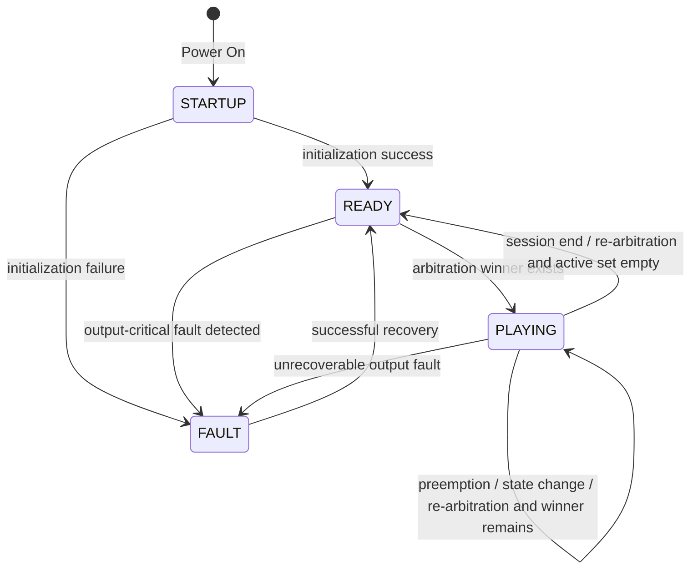

##### C.VSS.2.3 상태 해석 규칙

- `PLAYING`은 단순히 스피커 파형이 출력되는 순간이 아니라 **Playback Session 전체**를 의미한다. `[BASELINE]`
- 높은 우선순위에 의해 Stateful Warning이 선점되어도 해당 Effective State가 계속 유효하면 Active Request Set에 유지한다. `[BASELINE]`
- 선점 원인이 사라진 후 재중재 결과 해당 Stateful Request가 다시 Winner가 되면 Playback Session을 다시 활성화한다. `[BASELINE]`
- 이미 재생이 시작된 One-shot이 선점된 경우 자동 Resume하지 않는다. `[BASELINE]`
- 아직 재생이 시작되지 않은 One-shot은 Max Age 이내에서만 Pending 가능하다. `[BASELINE / Max Age TBD]`
- 복구 성공 후 `READY`로 복귀하고 현재 유효 Stateful Request와 Max Age 이내 Pending One-shot을 다시 평가한다. `[BASELINE]`

##### C.VSS.2.4 Service 상태 보조 정보

System State와 별도로 다음 논리 정보가 필요할 수 있다.

| Logical Information | 의미 | 상태 |
|---|---|---|
| `VSS_ACCEPTING_EVENTS` | 현재 Semantic Event/State를 수용·검증·중재할 수 있는지 | `PROVISIONAL - recommended` |
| `VSS_AVAILABILITY` | 현재 VSS 음향 서비스 제공 가능 범위 | `PROVISIONAL` |

`VSS_AVAILABILITY`의 논리 의미 후보:

```text
FULL
DEGRADED
UNAVAILABLE
```

- `FULL`: Baseline VSS 기능을 정상 제공 가능
- `DEGRADED`: 일부 Event/Asset/출력 기능에 제한이 있으나 전체 출력 불능은 아님
- `UNAVAILABLE`: 정상적인 VSS 음향 출력을 보장할 수 없음
- `STARTUP` 동안 Availability가 아직 평가되지 않은 상태의 실제 Wire 표현은 `TBD`이다.

---


<a id="ecu-vss-s03"></a>
> 원문 구간: [VSS/05_VSS_ECU_INTERFACE_INFO_DRAFT.md L160–187](https://github.com/vehicle-domain-control-system/integrated-vehicle-control/blob/1b1c4b834e4ac692f8e3eaf3e2680e4a530a2072/docs/requirements/VSS/05_VSS_ECU_INTERFACE_INFO_DRAFT.md#L160-L187)

#### C.VSS.3 Request / Command

##### C.VSS.3.1 외부 Product Command 정책

현재 VSS Baseline은 Domain/상위 ECU가 VSS 내부 Sound Asset이나 Playback Sequence를 직접 제어하는 구조를 요구하지 않는다.

따라서 VSS가 받는 핵심 입력은 일반적인 `PLAY_SOUND_xxx` Command가 아니라 **의미가 확정된 차량 Event/State**이다.

| Command | 현재 판단 | 상태 |
|---|---|---|
| `PLAY_SOUND_xxx` | 상위가 VSS 내부 Asset을 직접 지정하지 않음 | `NOT REQUIRED` |
| `STOP_SOUND` | Stateful Warning은 해당 Semantic State의 정상 해제/변경으로 종료 | `NOT REQUIRED` |
| `SET_PRIORITY` | Priority 및 Same-Class 결정 규칙은 VSS Local Policy | `NOT REQUIRED` |
| `SET_VOLUME` | 현재 Functional Baseline의 외부 Product Command로 확인되지 않음 | `NOT BASELINE` |

##### C.VSS.3.2 시험/진단 Command

다음 기능은 통합 시험에서 필요할 수 있으나 Product Interface와 분리한다.

- Fault injection
- Asset unavailable simulation
- Audio Output failure simulation
- 특정 Semantic Input 강제 주입

실제 Debug UART / Test Hook / Production Diagnostic Command 여부는 `TBD`이다.

---


<a id="ecu-vss-s04"></a>
> 원문 구간: [VSS/05_VSS_ECU_INTERFACE_INFO_DRAFT.md L188–230](https://github.com/vehicle-domain-control-system/integrated-vehicle-control/blob/1b1c4b834e4ac692f8e3eaf3e2680e4a530a2072/docs/requirements/VSS/05_VSS_ECU_INTERFACE_INFO_DRAFT.md#L188-L230)

> **통합 검토:** [B13](#review-b13) — 원문과 제안을 함께 읽는다. 정책·수치·안전 동작을 자동 확정하지 않았다.

#### C.VSS.4 Event

> 가이드의 일반 예시는 ECU가 Domain에 Event를 제공하는 방향을 보여주지만, 현재 VSS Baseline은 **외부 차량 기능이 확정한 Semantic Event를 VSS가 소비하는 구조**이다. 따라서 본 절은 방향을 명시해 `External → VSS`와 `VSS → External`을 구분한다.

##### C.VSS.4.1 External → VSS One-shot Semantic Event

| Event | 의미 | Priority Class | 기본 동작 | Semantic Owner 후보 | Network Producer |
|---|---|---|---|---|---|
| `VEHICLE_WELCOME` | 차량 사용 시작 확정 | Feedback | One-shot feedback | `TBD` | `TBD` |
| `VEHICLE_GOODBYE` | 차량 사용 종료 확정 | Feedback | One-shot feedback | `TBD` | `TBD` |
| `DOOR_LOCK_COMPLETE` | 도어 잠금 정상 완료 | Feedback | One-shot feedback | Door/Access 후보, `TBD` | `TBD` |
| `DOOR_UNLOCK_COMPLETE` | 도어 잠금 해제 정상 완료 | Feedback | Lock과 구분 가능한 feedback | Door/Access 후보, `TBD` | `TBD` |
| `DOOR_LOCK_ERROR` | 도어 잠금 이상 확정 | Warning | Lock 완료와 구분 가능한 warning | Door/Access 후보, `TBD` | `TBD` |

> `DOOR_UNLOCK_COMPLETE`의 **2 cues / 150–300 ms**는 Interface Baseline이 아니라 초기 검증용 `CANDIDATE`이다.

##### C.VSS.4.2 One-shot Event Delivery 계약

One-shot Event는 다음 의미를 만족해야 한다.

- 같은 실제 발생을 신뢰성 확보 목적으로 반복 전달해도 중복 재생되어서는 안 된다. `[BASELINE]`
- 동일 종류 Event가 나중에 실제로 다시 발생하면 새로운 occurrence로 식별 가능해야 한다. `[BASELINE]`
- VSS가 STARTUP/Wake로 아직 입력을 정상 수용할 수 없을 때 발생한 Event는 의미 유효기간 안에서 무조건 유실되는 구조여서는 안 된다. `[BASELINE]`
- STARTUP/Wake/통신 복구 중 Event가 Max Age를 초과했다면 READY 이후 신규 Event처럼 뒤늦게 재생되어서는 안 된다. `[BASELINE]`

Occurrence 식별 방식 후보:

- Event sequence/counter
- Toggle/edge identity
- Producer-side latch + consumption 확인
- 동등한 중복 억제 가능한 방식

실제 방식과 bit width는 `TBD`이다.

##### C.VSS.4.3 VSS → External One-shot Event

현재 Baseline은 VSS가 외부로 별도의 순간 Event를 반드시 송신하도록 요구하지 않는다.

- 정상/오류/복구는 기본적으로 `State / Availability / Fault Data`를 통해 확인한다.
- `VSS_RECOVERED` 같은 별도 Event는 현재 `OPTIONAL / NOT BASELINE`이다.

---


<a id="ecu-vss-s05"></a>
> 원문 구간: [VSS/05_VSS_ECU_INTERFACE_INFO_DRAFT.md L231–274](https://github.com/vehicle-domain-control-system/integrated-vehicle-control/blob/1b1c4b834e4ac692f8e3eaf3e2680e4a530a2072/docs/requirements/VSS/05_VSS_ECU_INTERFACE_INFO_DRAFT.md#L231-L274)

#### C.VSS.5 Fault

VSS Fault는 **VSS 자체 출력 기능의 Internal Fault**와 **외부 입력/통신 품질 Diagnostic**을 분리한다.

##### C.VSS.5.1 Internal VSS Output Fault

| Fault | 의미 | 기본 영향 |
|---|---|---|
| `SOUND_ASSET_UNAVAILABLE` | 필요한 로컬 음향 자산 사용 불가 | 영향 범위에 따라 `DEGRADED` 가능 |
| `PLAYBACK_START_FAILURE` | Playback Session 시작 실패 | Local recovery 후보 / 반복 실패 시 승격 가능 |
| `AUDIO_OUTPUT_FAILURE` | Codec/DAC/Amplifier 등 실제 출력 경로 오류 | Output-critical이면 `UNAVAILABLE / FAULT` |
| `PLAYBACK_STATE_FAILURE` | 내부 Playback 상태 불일치/비정상 | Local recovery 후보 / 실패 시 승격 가능 |
| `INITIALIZATION_FAILURE` | 초기화 실패 | `FAULT` 전이 |

실제 Fault별 Severity, retry/re-init 횟수, DTC, bitmask는 `TBD`이다.

##### C.VSS.5.2 Input / Interface Diagnostic Condition

| Condition | 의미 | Internal Output Fault인가? |
|---|---|---|
| `INVALID_EVENT` | 지원되지 않거나 유효하지 않은 One-shot 의미 입력 | 아니오 |
| `INPUT_NOT_RECEIVED` | Startup/Wake 이후 정상 Stateful 입력을 아직 한 번도 수용하지 못함 | 아니오 |
| `INPUT_STALE` | 마지막 정상 입력 이후 Freshness를 만족하지 못함 | 아니오 |
| `INPUT_INVALID` | 값/포맷/무결성 검증을 만족하지 못함 | 아니오 |

CRC/E2E/Alive Counter/Bus-Off 세부 진단은 Network 설계 이후 확장한다.

##### C.VSS.5.3 Active Fault와 Last Fault

```text
VSS_FAULT_ACTIVE
= 현재 Internal Output Fault가 활성인지

VSS_LAST_FAULT
= 최근 주요 Internal Output Fault 원인이 무엇인지
```

- Input Diagnostic만으로 `VSS_FAULT_ACTIVE`를 TRUE로 보고하지 않는다.
- Internal Output Fault가 복구되면 Active Fault 상태는 해제한다.
- `VSS_LAST_FAULT`는 정의된 Diagnostic Clear 정책이 적용될 때까지 유지 가능해야 한다.
- 둘 이상의 Internal Fault가 동시에 존재할 경우 각 Active Fault는 내부적으로 손실 없이 관리해야 한다.

---


<a id="ecu-vss-s06"></a>
> 원문 구간: [VSS/05_VSS_ECU_INTERFACE_INFO_DRAFT.md L275–435](https://github.com/vehicle-domain-control-system/integrated-vehicle-control/blob/1b1c4b834e4ac692f8e3eaf3e2680e4a530a2072/docs/requirements/VSS/05_VSS_ECU_INTERFACE_INFO_DRAFT.md#L275-L435)

#### C.VSS.6 Data

> 아래 Type/Range는 **논리 자료형**이다. 실제 wire bit width와 encoding은 확정하지 않는다.

##### Data 1 — VSS System State

```text
Name        : VSS_STATE
Direction   : VSS -> External
Type        : enum
Range       : STARTUP / READY / PLAYING / FAULT
Unit        : -
Description : VSS ECU의 현재 top-level 동작 상태
Status      : BASELINE meaning / PROVISIONAL signal name
```

##### Data 2 — VSS Accepting Events

```text
Name        : VSS_ACCEPTING_EVENTS
Direction   : VSS -> External
Type        : bool / logical status
Range       : FALSE / TRUE
Unit        : -
Description : 현재 Semantic Event/State를 수용·검증·중재 대상으로 처리할 수 있는지
Status      : PROVISIONAL
```

`TRUE`가 모든 Sound Asset의 출력 성공을 보장한다는 의미는 아니다.

##### Data 3 — VSS Service Availability

```text
Name        : VSS_AVAILABILITY
Direction   : VSS -> External
Type        : enum
Range       : FULL / DEGRADED / UNAVAILABLE
Unit        : -
Description : 현재 VSS 음향 서비스 제공 가능 범위
Status      : PROVISIONAL
```

- STARTUP 중 Availability가 아직 평가되지 않은 상태의 표현 방법은 `TBD`이다.
- 실제 Consumer가 필요로 하는지 확인 후 Production Signal 여부를 결정한다.

##### Data 4 — VSS Fault Active

```text
Name        : VSS_FAULT_ACTIVE
Direction   : VSS -> External
Type        : bool / logical status
Range       : FALSE / TRUE
Unit        : -
Description : 현재 Internal Output Fault 존재 여부
Status      : PROVISIONAL - recommended
```

##### Data 5 — VSS Last Fault

```text
Name        : VSS_LAST_FAULT
Direction   : VSS -> External
Type        : enum
Range       :
  NONE
  SOUND_ASSET_UNAVAILABLE
  PLAYBACK_START_FAILURE
  AUDIO_OUTPUT_FAILURE
  PLAYBACK_STATE_FAILURE
  INITIALIZATION_FAILURE
Unit        : -
Description : 최근 발생한 주요 Internal Output Fault 원인
Status      : BASELINE need / PROVISIONAL encoding
```

##### Data 6 — Power Window Anti-Pinch State

```text
Name        : WINDOW_ANTIPINCH_STATE
Direction   : External -> VSS
Type        : enum / semantic state
Range       : CLEAR / ACTIVE
Unit        : -
Description : Power Window 기능에서 판정이 완료된 끼임 위험 의미 상태
Source      : Power Window candidate / final Network Producer TBD
Invalid     : STALE / INVALID / NOT_RECEIVED / SNA는 CLEAR가 아님
Status      : PROVISIONAL - recommended logical representation
```

##### Data 7 — Occupant Hazard State

```text
Name        : OCCUPANT_HAZARD_STATE
Direction   : External -> VSS
Type        : enum / semantic state
Range       : CLEAR / ACTIVE
Unit        : -
Description : 외부 판단 기능에서 확정된 잔류 탑승자 위험 의미 상태
Source      : Sensing/Central candidate / final Network Producer TBD
Invalid     : STALE / INVALID / NOT_RECEIVED / SNA는 CLEAR가 아님
Status      : PROVISIONAL - recommended logical representation
```

> 단순한 `Occupant Detected` Raw/Intermediate 결과와 `OCCUPANT_HAZARD_STATE`는 동일 정보로 간주하지 않는다.

##### Data 8 — Rear Obstacle State

```text
Name        : REAR_OBSTACLE_STATE
Direction   : External -> VSS
Type        : enum / semantic state
Range       : CLEAR / CAUTION / EMERGENCY
Unit        : -
Description : 외부 기능이 거리·유효성·위험도를 판정한 최종 후방 위험 상태
Source      : Sensing/Central candidate / final Network Producer TBD
Invalid     : STALE / INVALID / NOT_RECEIVED / SNA는 CLEAR가 아님
Status      : PROVISIONAL - recommended logical representation
```

후방 `distance_cm`은 VSS Interface Data로 요구하지 않는다. `[BASELINE]`

##### Data 9 — Stateful Input Reception Quality

```text
Name        : INPUT_RECEPTION_QUALITY
Direction   : VSS internal / Optional diagnostic outward
Type        : enum per Stateful input
Range       : NOT_RECEIVED / VALID / STALE / INVALID
Unit        : -
Description : 각 Stateful 정보의 현재 수신 품질
Status      : BASELINE internal need / OPTIONAL external observability
```

`NOT_AVAILABLE/SNA`는 Producer가 의미적으로 "현재 정상 상태를 제공할 수 없음"을 나타내는 Semantic-side 상태 후보이며 `STALE`과 동일 개념이 아니다.

##### Data 10 — One-shot Event Occurrence Identity

```text
Name        : EVENT_OCCURRENCE_IDENTITY
Direction   : External -> VSS
Type        : sequence / counter / toggle / equivalent
Range       : TBD
Unit        : -
Description : 같은 Event의 재전달과 별개의 새로운 발생을 구분
Status      : BASELINE need / encoding TBD
```

- 실제 bit width는 정의하지 않는다.
- Source ECU reset / wrap-around / VSS duplicate history reset 규칙은 `TBD`이다.

##### Optional Diagnostic Data

| Information | 목적 | 상태 |
|---|---|---|
| `VSS_CURRENT_REQUEST` | 현재 Playback Winner 의미 확인 | `OPTIONAL` |
| `VSS_RECOVERY_STATUS` | 복구 진행/성공/실패 관측 | `OPTIONAL` |
| Applied Effective State | STALE/SNA 이후 실제 Arbitration 입력 확인 | `OPTIONAL / Test` |
| Class/Semantic Capability | `DEGRADED` 세부 사용 가능 범위를 Consumer가 필요로 할 때 | `OPTIONAL` |

---


<a id="ecu-vss-s07"></a>
> 원문 구간: [VSS/05_VSS_ECU_INTERFACE_INFO_DRAFT.md L436–541](https://github.com/vehicle-domain-control-system/integrated-vehicle-control/blob/1b1c4b834e4ac692f8e3eaf3e2680e4a530a2072/docs/requirements/VSS/05_VSS_ECU_INTERFACE_INFO_DRAFT.md#L436-L541)

> **통합 검토:** [B16](#review-b16) — 원문과 제안을 함께 읽는다. 정책·수치·안전 동작을 자동 확정하지 않았다.

#### C.VSS.7 Local Logic

##### C.VSS.7.1 Input Validation

- 지원되는 One-shot Event인지 확인한다. `[BASELINE]`
- Stateful Input의 의미 상태와 Reception Quality를 구분한다. `[BASELINE]`
- 유효하지 않은 Event는 임의 Sound를 출력하지 않고 Input Diagnostic으로 처리한다. `[BASELINE]`
- `STALE / INVALID / NOT_RECEIVED / SNA`를 정상 `CLEAR`로 자동 치환하지 않는다. `[BASELINE]`

##### C.VSS.7.2 Active Request 관리

VSS는 논리적으로 다음 정보를 구분해 관리한다.

```text
Stateful Input:
  Last Valid Semantic State
  Reception Quality
  Effective State used for Arbitration

One-shot Input:
  occurrence identity
  accepted time / age
  pending / started / discarded 상태
```

- Stateful 입력의 동일 ACTIVE 값이 주기적으로 반복 수신되어도 새로운 경고 발생으로 해석해 Playback Session을 매번 재시작하지 않는다. `[BASELINE]`
- 통신 복구 시 Stateful은 현재 의미 상태를 다시 수용하여 재동기화한다. `[BASELINE]`

##### C.VSS.7.3 Priority Arbitration / Re-arbitration

기본 Priority Class:

```text
Emergency > Warning > Feedback
```

- Emergency는 Warning/Feedback보다 우선한다. `[BASELINE]`
- Warning은 Feedback보다 우선한다. `[BASELINE]`
- 낮은 Priority의 신규 요청은 높은 Priority의 현재 Session을 중단시키지 않는다. `[BASELINE]`
- 한 시점의 Playback Winner는 1개만 허용한다. `[BASELINE]`
- 입력 상태 변경, Session 종료, 선점 해제, Fault 복구 후에는 현재 유효 요청 집합을 재중재한다. `[BASELINE]`
- Same-Class 복수 요청은 **수신 순서에 의존하지 않는 고정된 Sub-priority/Tie-break 규칙**으로 결정해야 한다. `[BASELINE requirement / actual values TBD]`
- `First Accepted`만으로 Same-Class를 결정하는 정책은 현재 요구사항을 만족하는 최종 규칙으로 사용하지 않는다.

##### C.VSS.7.4 One-shot Playback

- One-shot은 정상 수용 후 지정된 재생 정책에 따라 출력하고 종료한다. `[BASELINE]`
- 이미 시작된 One-shot이 높은 Priority에 선점되면 자동 Resume하지 않는다. `[BASELINE]`
- 아직 시작되지 않은 One-shot이 대기하는 경우 Max Age를 초과하면 폐기한다. `[BASELINE / actual Max Age TBD]`
- 같은 occurrence의 반복 전달은 중복 재생하지 않는다. `[BASELINE]`

Candidate:

| 항목 | Candidate |
|---|---:|
| General one-shot duration | `≤ 2.0 s` |
| Lock feedback cues | `1` |
| Unlock feedback cues | `2` |
| Unlock cue interval | `150–300 ms` |
| Duplicate suppression helper window | `150 ms` |

> Unlock `2 cues`는 Baseline이 아니라 Candidate이다.

##### C.VSS.7.5 Stateful Warning

- `WINDOW_ANTIPINCH_STATE == ACTIVE`이면 Anti-Pinch Emergency 요청을 Active Request Set에 포함한다. `[PROVISIONAL representation / BASELINE meaning]`
- `OCCUPANT_HAZARD_STATE == ACTIVE`이면 Occupant Hazard Emergency 요청을 포함한다. `[PROVISIONAL representation / BASELINE meaning]`
- `REAR_OBSTACLE_STATE == CAUTION`이면 Rear Warning 요청을 포함한다. `[PROVISIONAL representation / BASELINE meaning]`
- `REAR_OBSTACLE_STATE == EMERGENCY`이면 Rear Emergency 요청을 포함한다. `[PROVISIONAL representation / BASELINE meaning]`
- 유효 `CLEAR` 수용 시 해당 Stateful 요청을 Active Request Set에서 제거하고 즉시 재중재한다. `[BASELINE]`
- 높은 Priority에 선점된 Stateful 요청도 Effective State가 계속 활성이라면 이후 다시 Winner가 될 수 있다. `[BASELINE]`

##### C.VSS.7.6 Sound Mapping / Playback Policy

- 의미 Event/State와 Sound Asset 대응 관계는 일관된 관리 단위에서 변경 가능해야 한다. `[BASELINE]`
- 동일 의미 입력은 정상 상태에서 일관된 Sound를 선택한다. `[BASELINE]`
- 필요한 Asset이 없으면 다른 의미의 Sound로 임의 대체하지 않는다. `[BASELINE]`
- Class별 상대 Output Setpoint `60/80/100%`는 초기 검증 `CANDIDATE`이며 외부 `SET_VOLUME` Command를 의미하지 않는다.

##### C.VSS.7.7 Fault / Availability Management

- Input Diagnostic과 Internal Output Fault를 분리한다. `[BASELINE]`
- 일부 기능만 제한되는 경우와 전체 Audio Output을 보장할 수 없는 경우를 구분한다. `[BASELINE]`
- Output-critical Fault는 `UNAVAILABLE / FAULT`와 연계한다. `[BASELINE]`
- 최근 주요 Fault 원인은 Diagnostic Clear 전까지 식별 가능하게 유지한다. `[BASELINE]`
- 복구 가능한 Fault의 실제 retry/re-init 횟수는 `TBD`이다.

##### C.VSS.7.8 Performance Candidate

| 항목 | Candidate |
|---|---:|
| Power-on → READY/FAULT | `≤ 1000 ms` |
| Feedback output start | `≤ 200 ms` |
| Warning output start | `≤ 100 ms` |
| Emergency output start | `≤ 50 ms` |
| Emergency preemption | `≤ 50 ms` |
| Stateful warning clear | `≤ 100 ms` |
| Rear CAUTION → EMERGENCY | `≤ 50 ms` |
| Rear EMERGENCY → CAUTION | `≤ 100 ms` |
| VSS 내부 상태 변경 → 외부 제공 상태 갱신 가능 | `≤ 100 ms` |
| Recoverable Output Fault 결정/복구 | `≤ 2000 ms` |

위 시간은 VSS 내부에서 정보를 **유효하게 수용한 이후**의 처리 시간이며 Network 전달 지연은 포함하지 않는다.

---


<a id="ecu-vss-s08"></a>
> 원문 구간: [VSS/05_VSS_ECU_INTERFACE_INFO_DRAFT.md L542–641](https://github.com/vehicle-domain-control-system/integrated-vehicle-control/blob/1b1c4b834e4ac692f8e3eaf3e2680e4a530a2072/docs/requirements/VSS/05_VSS_ECU_INTERFACE_INFO_DRAFT.md#L542-L641)

> **통합 검토:** [B17](#review-b17) — 원문과 제안을 함께 읽는다. 정책·수치·안전 동작을 자동 확정하지 않았다.

#### C.VSS.8 Fail-safe

##### C.VSS.8.1 Invalid / Unsupported One-shot Event

```text
Invalid / Unsupported Event
 -> Reject
 -> 잘못된 Sound 출력 금지
 -> Input Diagnostic 기록 가능
 -> VSS Internal Output Fault로 자동 승격하지 않음
```

##### C.VSS.8.2 Stateful Input Quality 이상

```text
STALE / INVALID / NOT_RECEIVED / SNA
 -> 정상 CLEAR로 자동 치환 금지
 -> Last Valid State / Reception Quality / Effective State 분리
 -> 기능별 Fail-safe Policy 적용
```

실제 기능별 처리 후보:

- 제한 시간 Hold 후 비활성화
- 즉시 비활성화
- Degraded behavior
- 상위 판단 결과 대기

어느 정책을 사용할지는 Source ECU + Safety/Network Cross-check 후 확정한다. `[TBD]`

##### C.VSS.8.3 Missing Sound Asset

```text
Required Asset unavailable
 -> 다른 의미 Sound로 대체 금지
 -> 해당 의미 출력 불가 또는 제한 처리
 -> 영향 범위에 따라 DEGRADED 또는 Fault 정책 적용
```

##### C.VSS.8.4 Initialization Failure

```text
Initialization failure
 -> VSS_STATE = FAULT
 -> Availability = UNAVAILABLE 의미
 -> 외부에서 오류 상태 확인 가능
```

##### C.VSS.8.5 Recoverable Internal Output Fault

```text
Recoverable Output Fault
 -> 오류 검출
 -> Local Recovery 수행
 -> 성공: Active Fault 해제 -> READY -> 현재 유효 요청 재평가
 -> 실패: FAULT / UNAVAILABLE 유지
```

복구 수행 중 외부에 정상적인 신규 Feedback을 출력 가능한 상태로 잘못 보고해서는 안 된다.

##### C.VSS.8.6 Unrecoverable Output Fault

```text
Unrecoverable / Recovery failed
 -> FAULT 유지
 -> UNAVAILABLE 상태 제공
 -> 오류 원인 유지
 -> 다른 차량 기능의 제어 상태를 VSS가 직접 변경하지 않음
```

##### C.VSS.8.7 Startup / Wake One-shot Event

STARTUP/Wake 구간에 발생한 One-shot은 다음 원칙을 적용한다.

```text
Event 발생
 -> VSS가 수용 가능한가?
    Yes: 전달
    No : Delivery Contract에 따라 보존
 -> Max Age 이내: 전달 가능
 -> Max Age 초과: 폐기
```

실제 Wake 순서와 Delivery 방식은 `TBD`이다.

##### C.VSS.8.8 Communication Recovery / Resynchronization

- Stateful Information은 통신 복구 후 **현재 상태**를 다시 수용해 재동기화한다.
- 과거 Stateful History를 순서대로 재생하지 않는다.
- Max Age를 초과한 과거 One-shot Event를 신규 발생처럼 재생하지 않는다.
- Source ECU reset / occurrence counter wrap / duplicate history reset 규칙은 `TBD`이다.

##### C.VSS.8.9 Sensor / Actuator Fault 경계

- VSS는 원시 Sensor나 Power Window Actuator를 직접 소유하지 않으므로 해당 Fault 자체의 판정은 VSS 책임이 아니다.
- Upstream Sensor/Actuator Fault 때문에 Semantic State가 더 이상 유효하지 않은 경우 Source는 `SNA/NOT_AVAILABLE` 또는 합의된 상태를 제공해야 한다. `[TBD]`
- 해당 이상을 VSS 자체 `AUDIO_OUTPUT_FAILURE` 같은 Internal Fault로 변환하지 않는다.

---


<a id="ecu-vss-s09"></a>
> 원문 구간: [VSS/05_VSS_ECU_INTERFACE_INFO_DRAFT.md L642–741](https://github.com/vehicle-domain-control-system/integrated-vehicle-control/blob/1b1c4b834e4ac692f8e3eaf3e2680e4a530a2072/docs/requirements/VSS/05_VSS_ECU_INTERFACE_INFO_DRAFT.md#L642-L741)

#### C.VSS.9 Domain/Network 공유용 Interface Summary

##### C.VSS.9.1 External → VSS

| Information | Type | 의미 | Semantic Owner 후보 | Network Producer | 현재 상태 |
|---|---|---|---|---|---|
| Vehicle Welcome | One-shot Event | 차량 사용 시작 확정 | `TBD` | `TBD` | Cross-check 필요 |
| Vehicle Goodbye | One-shot Event | 차량 사용 종료 확정 | `TBD` | `TBD` | Cross-check 필요 |
| Door Lock Complete | One-shot Event | 차량 전체/대상 Door 잠금 완료 의미 | Door/Access 후보 | `TBD` | 의미 범위 Cross-check 필요 |
| Door Unlock Complete | One-shot Event | 잠금 해제 완료 의미 | Door/Access 후보 | `TBD` | Cross-check 필요 |
| Door Lock Error | One-shot Event | 잠금 이상 확정 | Door/Access 후보 | `TBD` | Cross-check 필요 |
| `WINDOW_ANTIPINCH_STATE` | Stateful | `CLEAR / ACTIVE` | Power Window 후보 | `TBD` | Cross-check 필요 |
| `OCCUPANT_HAZARD_STATE` | Stateful | `CLEAR / ACTIVE` | Sensing/Central 후보 | `TBD` | 의미 경계 Cross-check 필요 |
| `REAR_OBSTACLE_STATE` | Stateful | `CLEAR / CAUTION / EMERGENCY` | Sensing/Central 후보 | `TBD` | 최종 판단 Owner Cross-check 필요 |
| Event Occurrence Identity | Delivery metadata | 재전달 vs 신규 발생 구분 | 각 Event Producer | `TBD` | 방식/수명 규칙 TBD |

##### C.VSS.9.2 VSS → External

| Information | 의미 | Producer | Consumer | 현재 상태 |
|---|---|---|---|---|
| `VSS_STATE` | STARTUP/READY/PLAYING/FAULT | VSS | `TBD` | 의미 Baseline |
| `VSS_ACCEPTING_EVENTS` | 현재 입력 수용 가능 여부 | VSS | `TBD` | Signal 필요 여부 확인 |
| `VSS_AVAILABILITY` | FULL/DEGRADED/UNAVAILABLE | VSS | `TBD` | Consumer 사용 여부 확인 |
| `VSS_FAULT_ACTIVE` | 현재 Internal Output Fault 존재 | VSS | `TBD` | Consumer 확인 필요 |
| `VSS_LAST_FAULT` | 최근 주요 Internal Output Fault | VSS | Diagnostic Consumer `TBD` | Clear 정책 TBD |
| Optional Diagnostic | Current Request / Recovery / Input Quality 등 | VSS | Test/Integration `TBD` | 필요 시만 추가 |

##### C.VSS.9.3 Interface Freeze 전 필수 Cross-check

1. Vehicle Welcome / Goodbye의 최종 Semantic Owner
2. Door Lock Complete가 개별 Door 완료인지 차량 전체 Lock Completion인지
3. Anti-Pinch `ACTIVE/CLEAR`의 정확한 Producer 판정 조건
4. Occupant Detection과 `OCCUPANT_HAZARD`의 의미 경계
5. Rear `CLEAR/CAUTION/EMERGENCY` 최종 판단 Owner
6. Stateful 입력별 `SNA/NOT_AVAILABLE` 의미
7. Stateful `STALE/INVALID` 시 실제 Effective State / Bounded Hold 정책
8. Same-Class 고정 Sub-priority / deterministic tie-break 정책
9. One-shot Event Max Age와 occurrence identity의 reset/wrap 규칙
10. STARTUP/Wake Event Delivery 방식
11. `VSS_ACCEPTING_EVENTS` / `VSS_AVAILABILITY` 실제 Consumer 필요 여부
12. STARTUP 중 Availability의 실제 wire 표현

##### C.VSS.9.4 Network 단계로 넘길 항목

다음은 Interface 의미 Freeze 후 통신 담당이 결정한다.

- Physical protocol
- Message grouping
- Event-triggered / Periodic / Change-triggered 송신 방식
- Cycle / Timeout / Freshness 수치
- CAN ID / DLC / Start Bit / Byte Order
- occurrence identifier bit width
- Alive/Rolling Counter
- CRC / E2E
- Bus-Off / Communication Recovery 상세
- Bus Load / Arbitration Priority

---


##### C.VSS.9.5 Deferred Security Extension

VSS ↔ Central/Domain Controller 간 통신 보안은 **현재 ECU Interface Functional Baseline에 포함하지 않는다.** 현재는 기능 Event/State/Fault/Diagnostic 의미와 기본 Network 동작을 우선 안정화한다.

향후 기본 VSS/Network가 안정화되고 일정·자원 여유가 확보되면 다음을 후속 확장으로 검토한다.

```text
Public-key based ECU Authentication
        ↓
Asymmetric-key based Key Establishment / Exchange
        ↓
Session Key
        ↓
Message Confidentiality / Integrity / Authentication
        ↓
Replay Protection / Security Diagnostics
```

필요 시 학습·데모 목적의 비대칭키 암호화/복호화 자체도 제한된 범위에서 검증할 수 있으나, 실제 차량 메시지 보호 구조와 동일한 것으로 간주하지 않는다.

Security Extension 적용 시 Network Interface에 다음 정보가 추가될 수 있다.

- Security Context / Authentication Identifier
- Session / Key Identifier
- Authentication / Integrity Tag
- Replay Protection Counter / Nonce
- Security Validation Result / Error Information

현재 단계에서는 위 필드의 CAN Message, DLC, bit layout, Cycle, Counter 폭 및 Crypto 알고리즘을 예약하거나 확정하지 않는다.

**Status:** `DEFERRED / FUTURE EXTENSION`

**승격 조건:**

1. VSS 핵심 기능과 기본 통신 안정화
2. Central/Domain ↔ VSS Interface Freeze
3. Network Timing/Bus Load/Recovery 정책 안정화
4. CPU/RAM/Flash/Timing Budget 확인
5. 프로젝트 일정상 구현·시험 공수 확보


<a id="ecu-vss-s10"></a>
> 원문 구간: [VSS/05_VSS_ECU_INTERFACE_INFO_DRAFT.md L742–764](https://github.com/vehicle-domain-control-system/integrated-vehicle-control/blob/1b1c4b834e4ac692f8e3eaf3e2680e4a530a2072/docs/requirements/VSS/05_VSS_ECU_INTERFACE_INFO_DRAFT.md#L742-L764)

#### C.VSS.10 현재 단계 결론

현재 VSS 담당자가 Domain/Network 담당자에게 공유할 수 있는 정보는 다음 수준까지 정리되었다.

- VSS 자체 State와 상태 전이 의미
- 일반 Product Command가 필요하지 않다는 경계
- One-shot Event 목록과 Delivery 계약 필요성
- Stateful Semantic Information의 최소 의미 상태
- Internal Output Fault와 Input Diagnostic 분리
- VSS가 외부에 제공해야 할 Core 상태/오류 정보 후보
- VSS 내부 Arbitration / Re-arbitration / Playback / Fault 처리 책임
- Fail-safe에서 임의로 `CLEAR` 또는 잘못된 Sound로 대체하면 안 된다는 원칙

반면 다음은 VSS 단독으로 확정하지 않는다.

- Source/Consumer/Network Producer 최종 소유권
- Same-Class 실제 Sub-priority 값
- Stateful Stale/SNA의 최종 Fail-safe 동작
- One-shot Max Age와 occurrence identity wire 규칙
- Startup/Wake Power/Delivery 절차
- 실제 CAN/UART Signal/Message Mapping

따라서 본 문서는 **ECU Interface 정보 요청 가이드에 대한 VSS 담당자 제출 초안**으로 사용하고, 상대 ECU Cross-check 결과를 반영한 뒤 Interface 의미를 Freeze하는 것이 적절하다.


<a id="appendix-d"></a>
## 부록 D. SR→SysRS 추적

원본 추적 190항목과 재검토 190항목은 같은 관계의 다른 기록이다. 합쳐서 380개 요구로 세지 않는다. WINDOW/EXTERIOR_LIGHT 75개 주요 대응도 공식 SR 개수가 아니다. 원문 소유권·후보·제외 범위 및 다른 산문은 해당 본문에서 함께 보존한다.

<a id="trace-current"></a>
### D.0 현재 통합본 기준 추적

이 표는 기존 190항목과 신규 주요 대응 75항목의 현재 탐색 위치다. 공식 SR ID를 만든 것이 아니다. SR 링크는 원문 문장의 소속 절을 가리키며, 표 문구가 요약인 경우 원문 절을 함께 읽는다. 연결은 요구 충족이나 정책 승인을 뜻하지 않는다. A01의 표현 수정만 갱신했고 다른 재검토 판정은 미결 상태를 유지했다. 원본 추적표의 COVERED는 아래 재검토를 대체하지 않는다.

<a id="trace-current-bcm"></a>
#### BCM 현재 추적

| Ref·SR 위치 | SR 내용/기존 요약 | 관련 SysRS | 현재 검토 | 이유·남은 조치 |
|---|---|---|---|---|
| <a id="current-bcm-tr-sr-001"></a>[BCM/TR-SR-001](SR.md#sr-bcm-s02) | 각 기능은 서로 독립적으로 동작하며, 한 기능의 오류가 다른 기능의 수행을 중단시키지 않아야 한다 | [BCM-SYS-SAF-007](#bcm-sys-saf-007) · [BCM-SYS-NFR-001](#bcm-sys-nfr-001) | 보완 | SAF-007은 주기 처리 차단 금지이며 기능 수행 독립성의 전체 의미는 범위 문구와 함께 유지한다. A20 |
| <a id="current-bcm-tr-sr-002"></a>[BCM/TR-SR-002](SR.md#sr-bcm-s02) | 측정값은 BCM에 직접 제공되지 않으며, BCM은 확정된 동작을 수행한다 | [BCM-SYS-SEM-001](#bcm-sys-sem-001) | 보완 | SEM-001과 02 §1의 외부 센싱 입력 경계를 함께 연결한다. 자체 센서는 제외 금지가 아니다. |
| <a id="current-bcm-tr-sr-003"></a>[BCM/TR-SR-003](SR.md#sr-bcm-s02) | BCM은 다른 기능 사이의 정보를 중계하지 않는다 | [BCM-SYS-SEM-005](#bcm-sys-sem-005) | 대응 | 기존 연결과 원문 절의 의미 대응을 확인했다. |
| <a id="current-bcm-tr-sr-004"></a>[BCM/TR-SR-004](SR.md#sr-bcm-s03) | 허용된 도어 잠금 요청이 확인된 경우 도어를 잠가야 한다 | [BCM-SYS-DL-001](#bcm-sys-dl-001) · [BCM-SYS-CMD-001](#bcm-sys-cmd-001) | 대응 | 기존 연결과 원문 절의 의미 대응을 확인했다. |
| <a id="current-bcm-tr-sr-005"></a>[BCM/TR-SR-005](SR.md#sr-bcm-s03) | 허용된 도어 잠금 해제 요청이 확인된 경우 잠금을 해제해야 한다 | [BCM-SYS-DL-001](#bcm-sys-dl-001) · [BCM-SYS-CMD-001](#bcm-sys-cmd-001) | 대응 | 기존 연결과 원문 절의 의미 대응을 확인했다. |
| <a id="current-bcm-tr-sr-006"></a>[BCM/TR-SR-006](SR.md#sr-bcm-s03) | 허용되지 않은 요청에 의해 도어 잠금 상태가 변경되지 않도록 해야 한다 | [BCM-SYS-CMD-002](#bcm-sys-cmd-002) · [BCM-SYS-CMD-004](#bcm-sys-cmd-004) · [BCM-SYS-DL-001](#bcm-sys-dl-001) | 대응 | 기존 연결과 원문 절의 의미 대응을 확인했다. |
| <a id="current-bcm-tr-sr-007"></a>[BCM/TR-SR-007](SR.md#sr-bcm-s03) | 동일한 목표의 요청이 반복되더라도 반복 동작이 발생하지 않도록 해야 한다 | [BCM-SYS-DL-002](#bcm-sys-dl-002) · [BCM-SYS-CMD-003](#bcm-sys-cmd-003) | 보완 | 동일 목표와 동일 식별자의 중복은 구분한다. 결과 분류는 A02. |
| <a id="current-bcm-tr-sr-008"></a>[BCM/TR-SR-008](SR.md#sr-bcm-s03) | 도어 잠금 동작이 정해진 시간을 넘겨 계속되지 않도록 해야 한다 | [BCM-SYS-SAF-002](#bcm-sys-saf-002) | 대응 | 기존 연결과 원문 절의 의미 대응을 확인했다. |
| <a id="current-bcm-tr-sr-009"></a>[BCM/TR-SR-009](SR.md#sr-bcm-s03) | 도어가 잠겨 있는지와 열려 있는지를 서로 구분하여 관리해야 한다 | [BCM-SYS-DL-003](#bcm-sys-dl-003) | 대응 | 기존 연결과 원문 절의 의미 대응을 확인했다. |
| <a id="current-bcm-tr-sr-010"></a>[BCM/TR-SR-010](SR.md#sr-bcm-s03) | 잠금·개폐 상태를 상위 차량 시스템에서 확인할 수 있도록 해야 한다 | [BCM-SYS-DL-009](#bcm-sys-dl-009) · [BCM-SYS-INT-008](#bcm-sys-int-008) | 대응 | 기존 연결과 원문 절의 의미 대응을 확인했다. |
| <a id="current-bcm-tr-sr-011"></a>[BCM/TR-SR-011](SR.md#sr-bcm-s03) | 도어 상태를 믿을 수 없는 경우 정상 상태로 단정하여 제공하지 않아야 한다 | [BCM-SYS-DL-006](#bcm-sys-dl-006) · [BCM-SYS-DIAG-002](#bcm-sys-diag-002) | 대응 | 기존 연결과 원문 절의 의미 대응을 확인했다. |
| <a id="current-bcm-tr-sr-012"></a>[BCM/TR-SR-012](SR.md#sr-bcm-s03) | 실제로 있을 수 없는 상태가 확인된 경우 정상으로 취급하지 않아야 한다 | [BCM-SYS-DL-005](#bcm-sys-dl-005) | 대응 | 기존 연결과 원문 절의 의미 대응을 확인했다. |
| <a id="current-bcm-tr-sr-013"></a>[BCM/TR-SR-013](SR.md#sr-bcm-s03) | 있을 수 없는 상태를 그럴듯한 정상 상태로 바꾸어 제공하지 않아야 한다 | [BCM-SYS-DL-006](#bcm-sys-dl-006) | 대응 | 기존 연결과 원문 절의 의미 대응을 확인했다. |
| <a id="current-bcm-tr-sr-014"></a>[BCM/TR-SR-014](SR.md#sr-bcm-s03) | 시스템은 목표 잠금 상태(잠금 또는 잠금 해제)에 도달했음이 확인된 경우에만 해당 요청을 정상 완료로 처리해야 한다. | [BCM-SYS-DL-007](#bcm-sys-dl-007) | 표현 정리·조건 유지 | A01의 잠금/개폐 표현은 5A SR에서 수정했다. 완료 조건과 무구동 음향은 A02/X02 미결이며 구현 충족 판정은 아니다. |
| <a id="current-bcm-tr-sr-015"></a>[BCM/TR-SR-015](SR.md#sr-bcm-s03) | 시스템은 목표 잠금 상태(잠금 또는 잠금 해제)에 도달했음이 확인되지 않은 경우 그 결과와 이유를 제공해야 한다. | [BCM-SYS-DL-008](#bcm-sys-dl-008) · [BCM-SYS-INT-010](#bcm-sys-int-010) | 보완 | 정상 미도달 재시도 외에 안전 차단·신뢰성 상실 시 결과 정책을 구체화한다. |
| <a id="current-bcm-tr-sr-016"></a>[BCM/TR-SR-016](SR.md#sr-bcm-s04) | 확정된 세기로 실내 공기를 순환시켜야 한다 | [BCM-SYS-CL-001](#bcm-sys-cl-001) | 대응 | 기존 연결과 원문 절의 의미 대응을 확인했다. |
| <a id="current-bcm-tr-sr-017"></a>[BCM/TR-SR-017](SR.md#sr-bcm-s04) | 실내 공기가 실제로 순환되고 있는지 확인할 수 있어야 한다 | [BCM-SYS-CL-002](#bcm-sys-cl-002) | 대응 | 기존 연결과 원문 절의 의미 대응을 확인했다. |
| <a id="current-bcm-tr-sr-018"></a>[BCM/TR-SR-018](SR.md#sr-bcm-s04) | 공기 순환 여부를 확인할 수 없는 경우 정상 동작으로 처리하지 않아야 한다 | [BCM-SYS-CL-004](#bcm-sys-cl-004) | 대응 | 기존 연결과 원문 절의 의미 대응을 확인했다. |
| <a id="current-bcm-tr-sr-019"></a>[BCM/TR-SR-019](SR.md#sr-bcm-s04) | 확정된 세기와 실제 순환 상태가 일치하지 않는 경우 오류 상태로 처리해야 한다 | [BCM-SYS-CL-003](#bcm-sys-cl-003) | 대응 | 기존 연결과 원문 절의 의미 대응을 확인했다. |
| <a id="current-bcm-tr-sr-020"></a>[BCM/TR-SR-020](SR.md#sr-bcm-s04) | 확정된 방향에 따라 실내 공기를 식히거나 데워야 한다 | [BCM-SYS-CL-005](#bcm-sys-cl-005) | 대응 | 기존 연결과 원문 절의 의미 대응을 확인했다. |
| <a id="current-bcm-tr-sr-021"></a>[BCM/TR-SR-021](SR.md#sr-bcm-s04) | 확정된 세기로 냉각 또는 가열을 수행해야 한다 | [BCM-SYS-CL-005](#bcm-sys-cl-005) · [BCM-SYS-CMD-006](#bcm-sys-cmd-006) | 대응 | 기존 연결과 원문 절의 의미 대응을 확인했다. |
| <a id="current-bcm-tr-sr-022"></a>[BCM/TR-SR-022](SR.md#sr-bcm-s04) | 발생한 열이 배출되고 있는지 확인할 수 있어야 한다 | [BCM-SYS-CL-007](#bcm-sys-cl-007) | 부분 | 온도 측정만으로 방열 확인을 충분히 정의하지 못한다. A04 |
| <a id="current-bcm-tr-sr-023"></a>[BCM/TR-SR-023](SR.md#sr-bcm-s04) | 열이 배출되지 않거나 과열이 확인된 경우 냉각 또는 가열을 중단해야 한다 | [BCM-SYS-SAF-004](#bcm-sys-saf-004) · [BCM-SYS-SAF-005](#bcm-sys-saf-005) · [BCM-SYS-SAF-010](#bcm-sys-saf-010) | 부분 | SAF-011 Fan 고장 연계 및 방열 판단 근거 보완. A04 |
| <a id="current-bcm-tr-sr-024"></a>[BCM/TR-SR-024](SR.md#sr-bcm-s04) | 냉각과 가열이 전환될 때 장치에 손상이 발생하지 않도록 해야 한다 | [BCM-SYS-CL-006](#bcm-sys-cl-006) | 대응 | 기존 연결과 원문 절의 의미 대응을 확인했다. |
| <a id="current-bcm-tr-sr-025"></a>[BCM/TR-SR-025](SR.md#sr-bcm-s04) | 현재 냉각·가열 여부와 세기를 상위 차량 시스템에서 확인할 수 있도록 해야 한다 | [BCM-SYS-CL-008](#bcm-sys-cl-008) · [BCM-SYS-INT-012](#bcm-sys-int-012) | 대응 | 기존 연결과 원문 절의 의미 대응을 확인했다. |
| <a id="current-bcm-tr-sr-026"></a>[BCM/TR-SR-026](SR.md#sr-bcm-s05) | 확정된 알림 종류에 따라 실내 조명을 켜야 한다 | [BCM-SYS-AL-001](#bcm-sys-al-001) · [BCM-SYS-AL-002](#bcm-sys-al-002) | 대응 | 기존 연결과 원문 절의 의미 대응을 확인했다. |
| <a id="current-bcm-tr-sr-027"></a>[BCM/TR-SR-027](SR.md#sr-bcm-s05) | 확정되지 않은 조명 요청을 정상적인 알림으로 실행하지 않아야 한다 | [BCM-SYS-AL-003](#bcm-sys-al-003) | 보완 | 미정의 종류 외에 유효성 불신도 포함하도록 CMD-004/DIAG-003 연결. |
| <a id="current-bcm-tr-sr-028"></a>[BCM/TR-SR-028](SR.md#sr-bcm-s05) | 현재 켜져 있는 알림 종류와 밝기를 상위 차량 시스템에서 확인할 수 있도록 해야 한다 | [BCM-SYS-AL-004](#bcm-sys-al-004) · [BCM-SYS-INT-013](#bcm-sys-int-013) | 부분 | 현재 켜짐과 지시 적용 상태의 보장 차이. A03 |
| <a id="current-bcm-tr-sr-029"></a>[BCM/TR-SR-029](SR.md#sr-bcm-s05) | 조명이 확정된 대로 켜지지 않은 경우 정상 동작으로 처리하지 않아야 한다 | [BCM-SYS-AL-005](#bcm-sys-al-005) | 불일치 | 물리 점등 이상 제외와 SR 보장 범위 불일치. A03 |
| <a id="current-bcm-tr-sr-030"></a>[BCM/TR-SR-030](SR.md#sr-bcm-s05) | 조명 관련 오류를 조명 이외의 방법으로 알려야 한다 | [BCM-SYS-AL-006](#bcm-sys-al-006) | 대응 | 기존 연결과 원문 절의 의미 대응을 확인했다. |
| <a id="current-bcm-tr-sr-031"></a>[BCM/TR-SR-031](SR.md#sr-bcm-s06) | 본 절의 판단은 직접 측정하는 정보에 근거하며, 연결이 끊긴 상태에서도 수행되어야 한다 | [BCM-SYS-SAF-001](#bcm-sys-saf-001) | 보완 | SAF-001 외에 §9의 통신 독립 로컬 안전 문구를 연결. |
| <a id="current-bcm-tr-sr-032"></a>[BCM/TR-SR-032](SR.md#sr-bcm-s06) | 도어가 닫혀 있는 것이 확인되지 않은 경우 도어를 잠그지 않아야 한다 | [BCM-SYS-SAF-003](#bcm-sys-saf-003) | 대응 | 기존 연결과 원문 절의 의미 대응을 확인했다. |
| <a id="current-bcm-tr-sr-033"></a>[BCM/TR-SR-033](SR.md#sr-bcm-s06) | 열 배출을 확인할 수 없거나 과열이 확인된 경우 냉각 또는 가열을 중단해야 한다 | [BCM-SYS-SAF-004](#bcm-sys-saf-004) · [BCM-SYS-SAF-005](#bcm-sys-saf-005) | 부분 | 방열 판정 및 Fan 오류 경로를 추가. A04 |
| <a id="current-bcm-tr-sr-034"></a>[BCM/TR-SR-034](SR.md#sr-bcm-s06) | 정해진 시간을 넘긴 동작은 소프트웨어가 멈춘 상태에서도 멈출 수 있어야 한다 | [BCM-SYS-SAF-001](#bcm-sys-saf-001) · [BCM-SYS-SAF-002](#bcm-sys-saf-002) | 대응 | 기존 연결과 원문 절의 의미 대응을 확인했다. |
| <a id="current-bcm-tr-sr-035"></a>[BCM/TR-SR-035](SR.md#sr-bcm-s06) | 전원이 켜질 때 모든 동작을 멈춘 상태에서 시작해야 한다 | [BCM-SYS-SAF-008](#bcm-sys-saf-008) | 대응 | 기존 연결과 원문 절의 의미 대응을 확인했다. |
| <a id="current-bcm-tr-sr-036"></a>[BCM/TR-SR-036](SR.md#sr-bcm-s06) | 전원이 켜질 때 이전에 하던 동작을 다시 시작하지 않아야 한다 | [BCM-SYS-SAF-009](#bcm-sys-saf-009) | 대응 | 기존 연결과 원문 절의 의미 대응을 확인했다. |
| <a id="current-bcm-tr-sr-037"></a>[BCM/TR-SR-037](SR.md#sr-bcm-s06) | 안전을 위해 요청을 수행하지 않은 경우 그 이유를 제공해야 한다 | [BCM-SYS-INT-015](#bcm-sys-int-015) | 대응 | 기존 연결과 원문 절의 의미 대응을 확인했다. |
| <a id="current-bcm-tr-sr-038"></a>[BCM/TR-SR-038](SR.md#sr-bcm-s06) | 자체 안전 판단은 전달받은 동작을 수행하지 않을 수 있다 | [BCM-SYS-SAF-003](#bcm-sys-saf-003) · [BCM-SYS-INT-015](#bcm-sys-int-015) | 보완 | 도어뿐 아니라 열 보호 SAF-004/005/011에도 연결. |
| <a id="current-bcm-tr-sr-039"></a>[BCM/TR-SR-039](SR.md#sr-bcm-s07) | 각 기능의 동작 상태를 서로 구분하여 확인할 수 있도록 해야 한다 | [BCM-SYS-INT-016](#bcm-sys-int-016) · [BCM-SYS-NFR-001](#bcm-sys-nfr-001) | 부분 | ECU 상태와 기능별 상태를 구분하여 DL-009/CL-008/AL-004/INT-008~013 연결. A20 |
| <a id="current-bcm-tr-sr-040"></a>[BCM/TR-SR-040](SR.md#sr-bcm-s07) | 상태 확인 실패·정보 미전달·동작 실패로 인한 오류를 서로 구분하여 제공해야 한다 | [BCM-SYS-DIAG-001](#bcm-sys-diag-001) · [BCM-SYS-INT-014](#bcm-sys-int-014) | 대응 | 기존 연결과 원문 절의 의미 대응을 확인했다. |
| <a id="current-bcm-tr-sr-041"></a>[BCM/TR-SR-041](SR.md#sr-bcm-s07) | 신뢰할 수 없는 상태 정보를 현재 정상 상태로 제공하지 않아야 한다 | [BCM-SYS-DIAG-002](#bcm-sys-diag-002) | 대응 | 기존 연결과 원문 절의 의미 대응을 확인했다. |
| <a id="current-bcm-tr-sr-042"></a>[BCM/TR-SR-042](SR.md#sr-bcm-s07) | 전달받은 동작 내용을 믿을 수 없는 경우 그 동작을 수행하지 않아야 한다 | [BCM-SYS-DIAG-003](#bcm-sys-diag-003) · [BCM-SYS-CMD-004](#bcm-sys-cmd-004) | 대응 | 기존 연결과 원문 절의 의미 대응을 확인했다. |
| <a id="current-bcm-tr-sr-043"></a>[BCM/TR-SR-043](SR.md#sr-bcm-s07) | 믿을 수 없다는 이유만으로 이미 하고 있던 동작을 멈추지 않아야 한다 | [BCM-SYS-DIAG-004](#bcm-sys-diag-004) | 조건 | 진행 중 구동 유지에 로컬 안전·정상 종료 우선. A21 |
| <a id="current-bcm-tr-sr-044"></a>[BCM/TR-SR-044](SR.md#sr-bcm-s07) | 통신 복구 후 마지막으로 받아 둔 내용만 보고 새 동작을 시작하지 않아야 한다 | [BCM-SYS-DIAG-005](#bcm-sys-diag-005) | 대응 | 기존 연결과 원문 절의 의미 대응을 확인했다. |
| <a id="current-bcm-tr-sr-045"></a>[BCM/TR-SR-045](SR.md#sr-bcm-s07) | 오류의 복구 조건이 충족되기 전에는 동작을 다시 시작하지 않아야 한다 | [BCM-SYS-DIAG-006](#bcm-sys-diag-006) · [BCM-SYS-SAF-010](#bcm-sys-saf-010) | 조건 | 복구 전 금지는 대응하나 기능별 복구 가능 경로 미정. A05 |
| <a id="current-bcm-tr-sr-046"></a>[BCM/TR-SR-046](SR.md#sr-bcm-s07) | 복구 조건이 충족된 경우 새로 전달받은 내용에 의해서만 다시 시작해야 한다 | [BCM-SYS-DIAG-007](#bcm-sys-diag-007) | 조건 | 새 명령 조건과 복구 상태 전이를 함께 정리. A05 |
| <a id="current-bcm-tr-sr-047"></a>[BCM/TR-SR-047](SR.md#sr-bcm-s07) | 하나의 기능에서 발생한 오류를 이유로 다른 기능을 중단시키지 않아야 한다 | [BCM-SYS-SAF-007](#bcm-sys-saf-007) | 보완 | 다른 기능의 주기 유지와 기능 수행 유지 범위를 구분; Fan-온도는 종속 관계. |
| <a id="current-bcm-tr-sr-048"></a>[BCM/TR-SR-048](SR.md#sr-bcm-s07) | 동작 중 오류가 발생한 경우 확정되지 않은 동작이 계속되지 않도록 해야 한다 | [BCM-SYS-SAF-006](#bcm-sys-saf-006) · [BCM-SYS-SAF-011](#bcm-sys-saf-011) | 부분 | 연결은 Fan/온도에 한정. 도어·조명 오류 중 실행 정책 범위를 추가. A20 |
| <a id="current-bcm-tr-sr-049"></a>[BCM/TR-SR-049](SR.md#sr-bcm-s08) | 사용자 요청에 대한 동작은 조작 실패로 오인하지 않을 시간 안에 시작되어야 한다 | [BCM-SYS-PERF-002](#bcm-sys-perf-002) | 대응 | 기존 연결과 원문 절의 의미 대응을 확인했다. |
| <a id="current-bcm-tr-sr-050"></a>[BCM/TR-SR-050](SR.md#sr-bcm-s08) | 조명 알림의 전환은 지연으로 인지하지 않을 시간 안에 수행되어야 한다 | [BCM-SYS-PERF-004](#bcm-sys-perf-004) | 대응 | 기존 연결과 원문 절의 의미 대응을 확인했다. |
| <a id="current-bcm-tr-sr-051"></a>[BCM/TR-SR-051](SR.md#sr-bcm-s08) | 동일한 요청은 정상 동작 상태에서 일관된 결과를 제공해야 한다 | [BCM-SYS-NFR-004](#bcm-sys-nfr-004) · [BCM-SYS-NFR-005](#bcm-sys-nfr-005) | 보완 | 현재 상태가 다를 때 무구동/구동 차이를 허용하도록 조건 한정. A19 |
| <a id="current-bcm-tr-sr-052"></a>[BCM/TR-SR-052](SR.md#sr-bcm-s08) | 실제 동작 값과 평가 조건은 적용 장치 및 시험 환경이 확정된 후 정의되어야 한다 | 개별 ID 연결 없음; 원문 범위·상세 판정 참조 | 조건 | 후속 결정은 보존하되 확정됨 표기와 근거 재분류. A09 |
| <a id="current-bcm-tr-sr-053"></a>[BCM/TR-SR-053](SR.md#sr-bcm-s09) | 이미 결정된 동작이 제공되어야 하며, 그 결정에 사용된 정보가 함께 제공될 필요는 없다 | [BCM-SYS-SEM-001](#bcm-sys-sem-001) | 대응 | 기존 연결과 원문 절의 의미 대응을 확인했다. |
| <a id="current-bcm-tr-sr-054"></a>[BCM/TR-SR-054](SR.md#sr-bcm-s09) | 동작 수준과 방향은 BCM이 해석 가능한 형태로 제공되어야 한다 | [BCM-SYS-INT-001](#bcm-sys-int-001) · [BCM-SYS-INT-002](#bcm-sys-int-002) · [BCM-SYS-INT-003](#bcm-sys-int-003) · [BCM-SYS-INT-004](#bcm-sys-int-004) | 대응 | 기존 연결과 원문 절의 의미 대응을 확인했다. |
| <a id="current-bcm-tr-sr-055"></a>[BCM/TR-SR-055](SR.md#sr-bcm-s09) | BCM이 제공하는 상태·동작 결과·오류는 상위 차량 시스템에서 활용 가능해야 한다 | [BCM-SYS-INT-008](#bcm-sys-int-008) · [BCM-SYS-INT-017](#bcm-sys-int-017) | 대응 | 기존 연결과 원문 절의 의미 대응을 확인했다. |
| <a id="current-bcm-tr-sr-056"></a>[BCM/TR-SR-056](SR.md#sr-bcm-s09) | BCM의 세부 동작 수행 방법은 상위 차량 기능이 직접 제어하지 않아야 한다 | [BCM-SYS-SEM-006](#bcm-sys-sem-006) · [BCM-SYS-NFR-006](#bcm-sys-nfr-006) | 대응 | 기존 연결과 원문 절의 의미 대응을 확인했다. |
| <a id="current-bcm-tr-sr-057"></a>[BCM/TR-SR-057](SR.md#sr-bcm-s09) | 자체 안전 판단에 의한 명령 거부는 정상 응답으로 처리되어야 한다 | [BCM-SYS-INT-015](#bcm-sys-int-015) | 보완 | 안전 조건에 의한 명령 거부 자체와 과열 등 실제 고장은 구분한다. |

<a id="trace-current-cis"></a>
#### CIS 현재 추적

| Ref·SR 위치 | SR 내용/기존 요약 | 관련 SysRS | 현재 검토 | 이유·남은 조치 |
|---|---|---|---|---|
| <a id="current-cis-tr-sr-001"></a>[CIS/TR-SR-001](SR.md#sr-cis-s03) | CIS는 엔진룸 대상 동물의 진입 여부를 판정하지 않는다. | [CIS-SYS-FUN-028](#cis-sys-fun-028) | 대응 | 원문 의미와 대응 요구를 확인했다. |
| <a id="current-cis-tr-sr-002"></a>[CIS/TR-SR-002](SR.md#sr-cis-s03) | CIS는 후방 위험 상태에 대응하는 음향을 직접 재생하지 않는다. | [CIS-SYS-INT-005](#cis-sys-int-005) · [CIS-SYS-FUN-026](#cis-sys-fun-026) | 보완 | 음향 출력 금지는 SysRS §1 책임 제외에 직접 연결. INT-005는 상태 제공만 정의. B10 |
| <a id="current-cis-tr-sr-003"></a>[CIS/TR-SR-003](SR.md#sr-cis-s03) | CIS는 도어 잠금, 파워윈도우 등 차량 액추에이터를 직접 제어하지 않는다. | [CIS-SYS-SAF-001](#cis-sys-saf-001) | 부분 | 오류 영향 금지는 평상시 직접 제어 금지 전체와 다름. B10 |
| <a id="current-cis-tr-sr-004"></a>[CIS/TR-SR-004](SR.md#sr-cis-s03) | CIS는 확정된 판정 결과와 측정값을 중앙처리장치 및 VSS가 활용할 수 있도록 제공해야 한다. | [CIS-SYS-INT-003](#cis-sys-int-003) · [CIS-SYS-INT-004](#cis-sys-int-004) · [CIS-SYS-INT-005](#cis-sys-int-005) · [CIS-SYS-FUN-022](#cis-sys-fun-022) | 대응 | 원문 의미와 대응 요구를 확인했다. |
| <a id="current-cis-tr-sr-005"></a>[CIS/TR-SR-005](SR.md#sr-cis-s04) | 시스템은 실내 영상을 이용하여 탑승자 존재 여부를 판정해야 한다. | [CIS-SYS-FUN-003](#cis-sys-fun-003) | 대응 | 원문 의미와 대응 요구를 확인했다. |
| <a id="current-cis-tr-sr-006"></a>[CIS/TR-SR-006](SR.md#sr-cis-s04) | 시스템은 실내 영상을 이용하여 탑승자 인원수를 판정해야 한다. | [CIS-SYS-FUN-004](#cis-sys-fun-004) | 조건 | 인원수 정확도와 존재/인원수 일관성 기준 후속 확정. B06 |
| <a id="current-cis-tr-sr-007"></a>[CIS/TR-SR-007](SR.md#sr-cis-s04) | 시스템은 탑승자 판정 결과의 유효 여부를 구분해야 한다. | [CIS-SYS-FUN-005](#cis-sys-fun-005) | 대응 | 원문 의미와 대응 요구를 확인했다. |
| <a id="current-cis-tr-sr-008"></a>[CIS/TR-SR-008](SR.md#sr-cis-s04) | 시스템은 비전 정보를 신뢰할 수 있기 전에는 해당 정보에 기반한 판정 결과를 확정하지 않아야 한다. | [CIS-SYS-FUN-006](#cis-sys-fun-006) | 조건 | 비전 신뢰 가능 기준을 정의할 필요. B06 |
| <a id="current-cis-tr-sr-009"></a>[CIS/TR-SR-009](SR.md#sr-cis-s04) | 시스템은 비전 오류의 복구 조건이 충족되기 전에는 탑승자 상태를 정상으로 확정하지 않아야 한다. | [CIS-SYS-FUN-007](#cis-sys-fun-007) | 조건 | 복구 조건의 실제 판단 기준 미정. B06 |
| <a id="current-cis-tr-sr-010"></a>[CIS/TR-SR-010](SR.md#sr-cis-s04) | 시스템은 실내 영상을 탑승자 인식 목적 범위를 벗어나 저장하거나 외부로 전송하지 않아야 한다. | [CIS-SYS-FUN-027](#cis-sys-fun-027) · [CIS-SYS-SAF-004](#cis-sys-saf-004) | 보완 | 목적 외 저장 금지와 모든 외부 원본 노출 금지를 함께 유지. |
| <a id="current-cis-tr-sr-011"></a>[CIS/TR-SR-011](SR.md#sr-cis-s05) | 시스템은 실내 온도를 측정해야 한다. | [CIS-SYS-FUN-008](#cis-sys-fun-008) | 대응 | 원문 의미와 대응 요구를 확인했다. |
| <a id="current-cis-tr-sr-012"></a>[CIS/TR-SR-012](SR.md#sr-cis-s05) | 시스템은 실내 습도를 측정해야 한다. | [CIS-SYS-FUN-009](#cis-sys-fun-009) | 대응 | 원문 의미와 대응 요구를 확인했다. |
| <a id="current-cis-tr-sr-013"></a>[CIS/TR-SR-013](SR.md#sr-cis-s05) | 시스템은 조도를 측정해야 한다. | [CIS-SYS-FUN-010](#cis-sys-fun-010) | 대응 | 원문 의미와 대응 요구를 확인했다. |
| <a id="current-cis-tr-sr-014"></a>[CIS/TR-SR-014](SR.md#sr-cis-s05) | 시스템은 측정 정보의 유효 여부를 구분해야 한다. | [CIS-SYS-FUN-011](#cis-sys-fun-011) | 대응 | 원문 의미와 대응 요구를 확인했다. |
| <a id="current-cis-tr-sr-015"></a>[CIS/TR-SR-015](SR.md#sr-cis-s05) | 시스템은 센서 정보를 신뢰할 수 있기 전에는 해당 정보에 기반한 값을 확정하지 않아야 한다. | [CIS-SYS-FUN-012](#cis-sys-fun-012) | 조건 | 입력별 유효 범위/신뢰 기준 필요. B06 |
| <a id="current-cis-tr-sr-016"></a>[CIS/TR-SR-016](SR.md#sr-cis-s05) | 시스템은 센서 오류의 복구 조건이 충족되기 전에는 측정값을 정상으로 확정하지 않아야 한다. | [CIS-SYS-FUN-013](#cis-sys-fun-013) | 조건 | 센서별 복구 조건 필요. B06 |
| <a id="current-cis-tr-sr-017"></a>[CIS/TR-SR-017](SR.md#sr-cis-s06) | 시스템은 후방 물체와의 거리를 측정해야 한다. | [CIS-SYS-FUN-014](#cis-sys-fun-014) | 대응 | 원문 의미와 대응 요구를 확인했다. |
| <a id="current-cis-tr-sr-018"></a>[CIS/TR-SR-018](SR.md#sr-cis-s06) | 시스템은 거리 측정 정보의 유효 여부를 구분해야 한다. | [CIS-SYS-FUN-015](#cis-sys-fun-015) | 조건 | 정상 미감지와 측정 불가를 구분. B03 |
| <a id="current-cis-tr-sr-019"></a>[CIS/TR-SR-019](SR.md#sr-cis-s06) | 시스템은 물체와의 거리가 정의된 기준 이내인 경우 근접 위험 상태를 판단해야 한다. | [CIS-SYS-FUN-016](#cis-sys-fun-016) · [CIS-SYS-FUN-017](#cis-sys-fun-017) | 불일치 | 긴급 우선·구간 경계 문구를 일치시켜야 함. B02 |
| <a id="current-cis-tr-sr-020"></a>[CIS/TR-SR-020](SR.md#sr-cis-s06) | 시스템은 근접 위험 수준이 높아지는 경우 이를 구분되는 상태로 제공해야 한다. | [CIS-SYS-FUN-017](#cis-sys-fun-017) · [CIS-SYS-FUN-016](#cis-sys-fun-016) · [CIS-SYS-SAF-003](#cis-sys-saf-003) | 보완 | 구간의 배타성 및 유효성 전제 명시. B02/B03 |
| <a id="current-cis-tr-sr-021"></a>[CIS/TR-SR-021](SR.md#sr-cis-s06) | 시스템은 물체가 정의된 기준 거리 밖으로 벗어난 경우 근접 위험 상태를 해제해야 한다. | [CIS-SYS-FUN-018](#cis-sys-fun-018) | 부분 | 70~100 CLEAR 시험 누락 및 미감지 의미 분리. B02/B03 |
| <a id="current-cis-tr-sr-022"></a>[CIS/TR-SR-022](SR.md#sr-cis-s06) | 시스템은 거리 측정 정보를 신뢰할 수 있기 전에는 근접 위험 상태를 확정하지 않아야 한다. | [CIS-SYS-FUN-019](#cis-sys-fun-019) · [CIS-SYS-SAF-002](#cis-sys-saf-002) | 부분 | 하위는 CAUTION/EMERGENCY만 제한; 잘못된 CLEAR도 금지 필요. B03 |
| <a id="current-cis-tr-sr-023"></a>[CIS/TR-SR-023](SR.md#sr-cis-s07) | 시스템은 센서 입력이 유효 범위를 벗어난 경우 해당 정보를 정상 정보로 사용하지 않아야 한다. | [CIS-SYS-FUN-012](#cis-sys-fun-012) · [CIS-SYS-FUN-019](#cis-sys-fun-019) | 부분 | 유효 범위 밖을 정상 CLEAR로 처리하지 않도록 통일. B03 |
| <a id="current-cis-tr-sr-024"></a>[CIS/TR-SR-024](SR.md#sr-cis-s07) | 시스템은 실내 영상 품질이 인식 기준을 만족하지 못하는 경우 해당 판정 결과를 정상 정보로 사용하지 않아야 한다. | [CIS-SYS-FUN-006](#cis-sys-fun-006) · [CIS-SYS-DIA-001](#cis-sys-dia-001) | 조건 | 영상 품질 기준이 후속 미정. B06 |
| <a id="current-cis-tr-sr-025"></a>[CIS/TR-SR-025](SR.md#sr-cis-s07) | 시스템은 특정 센서 또는 비전 기능에 오류가 발생하더라도, 오류와 무관한 다른 판정·측정 기능을 불필요하게 중단하지 않아야 한다. | [CIS-SYS-FUN-020](#cis-sys-fun-020) · [CIS-SYS-NFR-003](#cis-sys-nfr-003) | 조건 | 전체 상태와 기능별 오류 관계 필요. B05 |
| <a id="current-cis-tr-sr-026"></a>[CIS/TR-SR-026](SR.md#sr-cis-s07) | 시스템은 통신 오류 동안 마지막 정상 값을 현재 정상 값으로 표시하지 않아야 한다. | [CIS-SYS-FUN-021](#cis-sys-fun-021) | 보완 | CIS의 제공 의무와 외부 수신 측 표시/미수신 감시 책임 분리. B07 |
| <a id="current-cis-tr-sr-027"></a>[CIS/TR-SR-027](SR.md#sr-cis-s08) | 시스템은 유효한 탑승자 판정 결과 및 환경 측정값을 중앙처리장치로 전송해야 한다. | [CIS-SYS-FUN-022](#cis-sys-fun-022) | 대응 | 원문 의미와 대응 요구를 확인했다. |
| <a id="current-cis-tr-sr-028"></a>[CIS/TR-SR-028](SR.md#sr-cis-s08) | 시스템은 판정 결과 및 측정값을 정의된 주기로 갱신하여 제공해야 한다. | [CIS-SYS-PER-002](#cis-sys-per-002) · [CIS-SYS-FUN-022](#cis-sys-fun-022) | 조건 | 내부 갱신과 실제 송신 주기 구분. B08 |
| <a id="current-cis-tr-sr-029"></a>[CIS/TR-SR-029](SR.md#sr-cis-s08) | 시스템은 판정 결과 및 측정값과 함께 해당 값의 유효 여부를 함께 제공해야 한다. | [CIS-SYS-FUN-023](#cis-sys-fun-023) · [CIS-SYS-INT-006](#cis-sys-int-006) | 대응 | 원문 의미와 대응 요구를 확인했다. |
| <a id="current-cis-tr-sr-030"></a>[CIS/TR-SR-030](SR.md#sr-cis-s08) | 시스템은 통신 오류가 발생한 경우 해당 오류 상태를 상위 시스템이 식별할 수 있도록 제공해야 한다. | [CIS-SYS-FUN-024](#cis-sys-fun-024) · [CIS-SYS-INT-007](#cis-sys-int-007) · [CIS-SYS-PER-004](#cis-sys-per-004) | 부분 | 완전 단절은 수신 측 감시 계약이 필요. B07/B08 |
| <a id="current-cis-tr-sr-031"></a>[CIS/TR-SR-031](SR.md#sr-cis-s08) | 시스템은 통신 오류가 해제되고 새로운 유효 값이 확인된 경우에만 정상 전송을 재개해야 한다. | [CIS-SYS-FUN-025](#cis-sys-fun-025) · [CIS-SYS-INT-008](#cis-sys-int-008) · [CIS-SYS-PER-005](#cis-sys-per-005) | 조건 | 복구·새 유효값 확보·500ms 기한 시작점 명시. B07 |
| <a id="current-cis-tr-sr-032"></a>[CIS/TR-SR-032](SR.md#sr-cis-s08) | 시스템은 근접 위험 상태를 VSS가 활용 가능한 의미 상태(주의 / 긴급 / 해제)로 제공해야 한다. | [CIS-SYS-FUN-026](#cis-sys-fun-026) · [CIS-SYS-INT-005](#cis-sys-int-005) | 조건 | 현재 상태 전달·신뢰성·소유권 연결. B04 |
| <a id="current-cis-tr-sr-033"></a>[CIS/TR-SR-033](SR.md#sr-cis-s09) | 엔진룸 카메라 기반 대상 동물 진입 판정 | [CIS-SYS-FUN-028](#cis-sys-fun-028) | 대응 | 원문 의미와 대응 요구를 확인했다. |
| <a id="current-cis-tr-sr-034"></a>[CIS/TR-SR-034](SR.md#sr-cis-s09) | 후방 위험 상태에 대응하는 음향 출력 및 재생 (VSS 담당) | [CIS-SYS-INT-005](#cis-sys-int-005) | 보완 | 상태 제공 링크만으로 직접 음향 출력 제외를 증명하지 않음. B10 |
| <a id="current-cis-tr-sr-035"></a>[CIS/TR-SR-035](SR.md#sr-cis-s09) | 도어 잠금, 파워윈도우 등 차량 액추에이터 제어 | [CIS-SYS-SAF-001](#cis-sys-saf-001) | 부분 | 오류 영향 금지와 제어 범위 제외 구분. B10 |
| <a id="current-cis-tr-sr-036"></a>[CIS/TR-SR-036](SR.md#sr-cis-s09) | 후방 장애물의 실제 거리값 및 임계값을 VSS 등 외부에 직접 노출하는 것 | [CIS-SYS-FUN-026](#cis-sys-fun-026) | 불일치 | 중앙 REAR_DISTANCE 제공 표와 SR 외부 노출 제외 충돌. B01 |
| <a id="current-cis-tr-sr-037"></a>[CIS/TR-SR-037](SR.md#sr-cis-s10) | CIS는 센서 원시 데이터 및 영상을 직접 외부로 노출하지 않아야 한다. | [CIS-SYS-SAF-004](#cis-sys-saf-004) · [CIS-SYS-FUN-027](#cis-sys-fun-027) | 부분 | 영상 금지와 전체 센서 Raw Data 경계 구분. B10 |
| <a id="current-cis-tr-sr-038"></a>[CIS/TR-SR-038](SR.md#sr-cis-s10) | CIS의 후방 위험 의미 상태는 VSS가 정의한 의미 이벤트 체계와 일치해야 한다. | [CIS-SYS-FUN-026](#cis-sys-fun-026) | 조건 | VSS의 현재 상태 계약으로 연결; 이벤트 이름만 일치해서 충분하지 않음. B04 |
| <a id="current-cis-tr-sr-039"></a>[CIS/TR-SR-039](SR.md#sr-cis-s10) | CIS의 세부 인식·센싱 처리 방법은 상위 차량 기능이 직접 제어하지 않아야 한다. | [CIS-SYS-NFR-007](#cis-sys-nfr-007) · [CIS-SYS-NFR-006](#cis-sys-nfr-006) | 부분 | 유지보수/계층 분리만으로 상위의 내부 처리 제어 금지 충족 안 됨. B10 |
| <a id="current-cis-tr-sr-040"></a>[CIS/TR-SR-040](SR.md#sr-cis-s10) | CIS의 상태 및 오류는 상위 차량 시스템에서 활용 가능해야 한다. | [CIS-SYS-INT-007](#cis-sys-int-007) · [CIS-SYS-INT-008](#cis-sys-int-008) | 조건 | STARTUP 포함 여부·부분 오류/전체 상태 정리. B05 |

<a id="trace-current-mobile"></a>
#### MOBILE 현재 추적

| Ref·SR 위치 | SR 내용/기존 요약 | 관련 SysRS | 현재 검토 | 이유·남은 조치 |
|---|---|---|---|---|
| <a id="current-mobile-tr-sr-001"></a>[MOBILE/TR-SR-001](SR.md#sr-mobile-s02) | 차량 기능을 직접 수행하지 않으며, 실제 수행 여부는 차량이 결정한다 | [MB-SYS-SAF-004](#mb-sys-saf-004) · [MB-SYS-SEM-003](#mb-sys-sem-003) | 보완 | SAF-004/SEM-003 외 SAF-006과 §1 책임 경계를 연결. |
| <a id="current-mobile-tr-sr-002"></a>[MOBILE/TR-SR-002](SR.md#sr-mobile-s02) | 요청의 허용 여부와 실제 수행은 차량이 결정하며, 그 결과를 받아 표시한다 | [MB-SYS-SEM-003](#mb-sys-sem-003) · [MB-SYS-REQ-003](#mb-sys-req-003) | 보완 | 차량 허용 판정 책임은 SAF-006에도 연결. |
| <a id="current-mobile-tr-sr-003"></a>[MOBILE/TR-SR-003](SR.md#sr-mobile-s02) | 차량 상태를 자체적으로 추정하거나 보정하지 않는다 | [MB-SYS-SEM-001](#mb-sys-sem-001) · [MB-SYS-DSP-001](#mb-sys-dsp-001) | 보완 | 값+신뢰성 결합만으로 비추정을 보장하지 않으므로 §1/§5 경계 문구도 연결. |
| <a id="current-mobile-tr-sr-004"></a>[MOBILE/TR-SR-004](SR.md#sr-mobile-s03) | 허용된 차량 기능에 대한 제어 요청을 생성할 수 있어야 한다 | [MB-SYS-REQ-001](#mb-sys-req-001) · [MB-SYS-INT-014](#mb-sys-int-014) | 대응 | 기존 연결과 원문 절의 의미 대응을 확인했다. |
| <a id="current-mobile-tr-sr-005"></a>[MOBILE/TR-SR-005](SR.md#sr-mobile-s03) | 접수·진행·완료·거부·중단·실패 결과가 제공되어야 한다 | [MB-SYS-REQ-006](#mb-sys-req-006) · [MB-SYS-SEM-003](#mb-sys-sem-003) | 부분 | 상태 집합은 있지만 모든 결과·단절·늦은 응답 전이가 부족. A14 |
| <a id="current-mobile-tr-sr-006"></a>[MOBILE/TR-SR-006](SR.md#sr-mobile-s03) | 거부되거나 실패한 경우 그 사유가 제공되어야 한다 | [MB-SYS-REQ-006](#mb-sys-req-006) · [MB-SYS-SEM-004](#mb-sys-sem-004) | 대응 | 기존 연결과 원문 절의 의미 대응을 확인했다. |
| <a id="current-mobile-tr-sr-007"></a>[MOBILE/TR-SR-007](SR.md#sr-mobile-s03) | 전송 완료 상태와 차량에서의 수행 완료 상태는 구분되어 제공되어야 한다 | [MB-SYS-REQ-003](#mb-sys-req-003) · [MB-SYS-SAF-003](#mb-sys-saf-003) | 대응 | 기존 연결과 원문 절의 의미 대응을 확인했다. |
| <a id="current-mobile-tr-sr-008"></a>[MOBILE/TR-SR-008](SR.md#sr-mobile-s03) | 최근 제어 요청의 수행 결과를 확인할 수 있어야 한다 | [MB-SYS-REQ-010](#mb-sys-req-010) | 대응 | 기존 연결과 원문 절의 의미 대응을 확인했다. |
| <a id="current-mobile-tr-sr-009"></a>[MOBILE/TR-SR-009](SR.md#sr-mobile-s03) | 연결이 종료된 경우 이전 요청이 자동으로 다시 전달되어서는 안 된다 | [MB-SYS-REQ-007](#mb-sys-req-007) · [MB-SYS-REQ-011](#mb-sys-req-011) | 보완 | 연결 복구시 이전 요청 재수행 금지 REQ-008도 연결. |
| <a id="current-mobile-tr-sr-010"></a>[MOBILE/TR-SR-010](SR.md#sr-mobile-s03) | 3.1절의 제어 대상(도어·목표 온도·공기 순환·선행 공조·조명)에 대해 요청을 생성한다 | [MB-SYS-REQ-001](#mb-sys-req-001) · [MB-SYS-INT-014](#mb-sys-int-014) · [MB-SYS-INT-017](#mb-sys-int-017) | 부분 | 제어 목록은 참조되나 자동 공조/선행 공조 사용 여부 UI와 색상 경로 구체화 필요. A16/A17 |
| <a id="current-mobile-tr-sr-011"></a>[MOBILE/TR-SR-011](SR.md#sr-mobile-s04) | 도어 — 잠금 여부·개폐 여부·상태 이상·오류 | [MB-SYS-DSP-006](#mb-sys-dsp-006) · [MB-SYS-DSP-007](#mb-sys-dsp-007) · [MB-SYS-INT-001](#mb-sys-int-001) · [MB-SYS-INT-002](#mb-sys-int-002) | 보완 | 도어 오류 표시는 INT-012/DIAG-001 추가. A20 |
| <a id="current-mobile-tr-sr-012"></a>[MOBILE/TR-SR-012](SR.md#sr-mobile-s04) | 실내 환경 — 자동 공조·현재/목표 온도·요구/실제 순환 세기·냉난방 방향·선행 공조·오류 | [MB-SYS-DSP-008](#mb-sys-dsp-008) · [MB-SYS-INT-003](#mb-sys-int-003) · [MB-SYS-INT-004](#mb-sys-int-004) · [MB-SYS-INT-005](#mb-sys-int-005) · [MB-SYS-INT-006](#mb-sys-int-006) | 부분 | 자동 공조 사용 여부·냉난방 세기 명시, 오류 표시 연결 보완. A16/A20 |
| <a id="current-mobile-tr-sr-013"></a>[MOBILE/TR-SR-013](SR.md#sr-mobile-s04) | 실내 조명 — 사용 여부·현재 밝기·현재 켜져 있는 알림 종류·오류 | [MB-SYS-INT-007](#mb-sys-int-007) | 부분 | 설정/실제 상태 분리 및 조명 오류 표시 연결. A17/A20 |
| <a id="current-mobile-tr-sr-014"></a>[MOBILE/TR-SR-014](SR.md#sr-mobile-s04) | 기타 차량 기능 — 창문·실내 환경 정보와 탑승자 유무·음향 오류 | [MB-SYS-INT-018](#mb-sys-int-018) · [MB-SYS-INT-019](#mb-sys-int-019) · [MB-SYS-INT-020](#mb-sys-int-020) | 조건 | 수신 요구는 존재하나 노드 미정 설명 갱신 및 표시 구체화 필요. A18 |
| <a id="current-mobile-tr-sr-015"></a>[MOBILE/TR-SR-015](SR.md#sr-mobile-s04) | 상태 정보가 최신이 아닌 경우 최신 상태가 아님이 표시되어야 한다 | [MB-SYS-DSP-004](#mb-sys-dsp-004) · [MB-SYS-SEM-002](#mb-sys-sem-002) · [MB-SYS-SEM-007](#mb-sys-sem-007) | 대응 | 기존 연결과 원문 절의 의미 대응을 확인했다. |
| <a id="current-mobile-tr-sr-016"></a>[MOBILE/TR-SR-016](SR.md#sr-mobile-s04) | 신뢰할 수 없는 경우 마지막 정상 값이 현재 정상 상태로 표시되어서는 안 된다 | [MB-SYS-DSP-005](#mb-sys-dsp-005) · [MB-SYS-CON-005](#mb-sys-con-005) · [MB-SYS-SAF-002](#mb-sys-saf-002) | 대응 | 기존 연결과 원문 절의 의미 대응을 확인했다. |
| <a id="current-mobile-tr-sr-017"></a>[MOBILE/TR-SR-017](SR.md#sr-mobile-s04) | 상태 확인 실패·정보 미전달·동작 실패 오류를 구분할 수 있도록 표시되어야 한다 | [MB-SYS-DIAG-001](#mb-sys-diag-001) · [MB-SYS-SEM-006](#mb-sys-sem-006) · [MB-SYS-INT-012](#mb-sys-int-012) | 대응 | 기존 연결과 원문 절의 의미 대응을 확인했다. |
| <a id="current-mobile-tr-sr-018"></a>[MOBILE/TR-SR-018](SR.md#sr-mobile-s04) | 확인할 수 없는 경우 확인 불가임이 표시되고 임의의 값으로 대체되어서는 안 된다 | [MB-SYS-DSP-003](#mb-sys-dsp-003) · [MB-SYS-NFR-002](#mb-sys-nfr-002) | 대응 | 기존 연결과 원문 절의 의미 대응을 확인했다. |
| <a id="current-mobile-tr-sr-019"></a>[MOBILE/TR-SR-019](SR.md#sr-mobile-s04) | 설정이 안전 정책에 의해 적용되지 않는 경우 그 사유가 제공되어야 한다 | [MB-SYS-DSP-009](#mb-sys-dsp-009) | 대응 | 기존 연결과 원문 절의 의미 대응을 확인했다. |
| <a id="current-mobile-tr-sr-020"></a>[MOBILE/TR-SR-020](SR.md#sr-mobile-s05) | 안전 보호 동작 또는 위험 경고는 일반 상태 정보보다 우선하여 식별되어야 한다 | [MB-SYS-ALT-001](#mb-sys-alt-001) · [MB-SYS-SAF-001](#mb-sys-saf-001) | 대응 | 기존 연결과 원문 절의 의미 대응을 확인했다. |
| <a id="current-mobile-tr-sr-021"></a>[MOBILE/TR-SR-021](SR.md#sr-mobile-s05) | 안전 경고 및 중요 상태 변화는 일반 상태 정보와 구분되어 제공되어야 한다 | [MB-SYS-ALT-002](#mb-sys-alt-002) · [MB-SYS-SEM-005](#mb-sys-sem-005) | 대응 | 기존 연결과 원문 절의 의미 대응을 확인했다. |
| <a id="current-mobile-tr-sr-022"></a>[MOBILE/TR-SR-022](SR.md#sr-mobile-s05) | 확인하지 않은 중요 경고가 있는 경우 해당 상태를 확인할 수 있어야 한다 | [MB-SYS-ALT-003](#mb-sys-alt-003) · [MB-SYS-ALT-007](#mb-sys-alt-007) | 대응 | 기존 연결과 원문 절의 의미 대응을 확인했다. |
| <a id="current-mobile-tr-sr-023"></a>[MOBILE/TR-SR-023](SR.md#sr-mobile-s05) | 사용자 이탈 상태에서 도어가 열린 채 유지되는 경우 해당 상태가 제공되어야 한다 | [MB-SYS-INT-011](#mb-sys-int-011) · [MB-SYS-ALT-001](#mb-sys-alt-001) | 부분 | 이탈·도어 열림 경고의 발생/해제 및 생산 주체 필요. A13 |
| <a id="current-mobile-tr-sr-024"></a>[MOBILE/TR-SR-024](SR.md#sr-mobile-s05) | 엔진룸에 동물이 들어온 경우 권한이 있는 사용자에게 즉시 제공되어야 한다 | [MB-SYS-INT-013](#mb-sys-int-013) · [MB-SYS-PERF-004](#mb-sys-perf-004) · [MB-SYS-ALT-006](#mb-sys-alt-006) | 부분 | 동물 경고·권한 대상·생산 경로는 일반 경고 ID만으로 충족 안 됨. A13 |
| <a id="current-mobile-tr-sr-025"></a>[MOBILE/TR-SR-025](SR.md#sr-mobile-s05) | 확인한 이후에도 상태가 유효한 동안에는 표시가 유지되어야 한다 | [MB-SYS-ALT-004](#mb-sys-alt-004) · [MB-SYS-ALT-005](#mb-sys-alt-005) · [MB-SYS-SAF-005](#mb-sys-saf-005) | 대응 | 기존 연결과 원문 절의 의미 대응을 확인했다. |
| <a id="current-mobile-tr-sr-026"></a>[MOBILE/TR-SR-026](SR.md#sr-mobile-s06) | 인증 및 권한 확인이 완료된 사용자에게만 원격 제어가 제공되어야 한다 | [MB-SYS-SEC-003](#mb-sys-sec-003) · [MB-SYS-REQ-009](#mb-sys-req-009) | 부분 | 인증 외 차량별 권한 확인 계약 명시 필요. A12 |
| <a id="current-mobile-tr-sr-027"></a>[MOBILE/TR-SR-027](SR.md#sr-mobile-s06) | 차량에서 온 정보임을 확인할 수 없는 경우 새 제어 요청이 생성되어서는 안 된다 | [MB-SYS-REQ-012](#mb-sys-req-012) | 불일치 | 정보 출처 인증 조건을 모든 상태값 OK로 확대한 의미 차이. A11 |
| <a id="current-mobile-tr-sr-028"></a>[MOBILE/TR-SR-028](SR.md#sr-mobile-s06) | 같은 요청이 두 번 또는 늦게 전달되더라도 차량에서 반복 수행되지 않아야 한다 | [MB-SYS-REQ-002](#mb-sys-req-002) · [MB-SYS-INT-015](#mb-sys-int-015) | 부분 | 식별자 생성은 차량 측 중복 실행 방지의 충분조건이 아님. A12 |
| <a id="current-mobile-tr-sr-029"></a>[MOBILE/TR-SR-029](SR.md#sr-mobile-s06) | 인증 정보는 사용자가 직접 열람하거나 입력하지 않아야 한다 | [MB-SYS-SEC-001](#mb-sys-sec-001) · [MB-SYS-SEC-002](#mb-sys-sec-002) | 대응 | 기존 연결과 원문 절의 의미 대응을 확인했다. |
| <a id="current-mobile-tr-sr-030"></a>[MOBILE/TR-SR-030](SR.md#sr-mobile-s07) | 현재 차량과의 연결 가능 상태를 확인할 수 있어야 한다 | [MB-SYS-CON-001](#mb-sys-con-001) · [MB-SYS-DSP-010](#mb-sys-dsp-010) | 대응 | 기존 연결과 원문 절의 의미 대응을 확인했다. |
| <a id="current-mobile-tr-sr-031"></a>[MOBILE/TR-SR-031](SR.md#sr-mobile-s07) | 연결 불가 상태에서는 요청이 생성되지 않아야 하며 그 사유가 제공되어야 한다 | [MB-SYS-REQ-009](#mb-sys-req-009) | 대응 | 기존 연결과 원문 절의 의미 대응을 확인했다. |
| <a id="current-mobile-tr-sr-032"></a>[MOBILE/TR-SR-032](SR.md#sr-mobile-s07) | 연결이 복구된 경우 차량이 확정한 최신 상태로 표시가 갱신되어야 한다 | [MB-SYS-CON-004](#mb-sys-con-004) · [MB-SYS-CON-005](#mb-sys-con-005) | 대응 | 기존 연결과 원문 절의 의미 대응을 확인했다. |
| <a id="current-mobile-tr-sr-033"></a>[MOBILE/TR-SR-033](SR.md#sr-mobile-s07) | 연결 복구만을 근거로 이전 요청이 재수행되어서는 안 된다 | [MB-SYS-REQ-008](#mb-sys-req-008) | 대응 | 기존 연결과 원문 절의 의미 대응을 확인했다. |
| <a id="current-mobile-tr-sr-034"></a>[MOBILE/TR-SR-034](SR.md#sr-mobile-s08) | 서로 다른 의미를 가진 상태와 경고는 사용자가 구분할 수 있어야 한다 | [MB-SYS-ALT-002](#mb-sys-alt-002) · [MB-SYS-DSP-002](#mb-sys-dsp-002) | 보완 | 신뢰성 구분 외 요청/진단/연결의 의미별 표시 근거도 연결. |
| <a id="current-mobile-tr-sr-035"></a>[MOBILE/TR-SR-035](SR.md#sr-mobile-s08) | 제어 요청 결과는 조작 실패로 오인하지 않을 시간 안에 제공되어야 한다 | [MB-SYS-PERF-002](#mb-sys-perf-002) · [MB-SYS-PERF-003](#mb-sys-perf-003) | 부분 | 전송 표시와 UNKNOWN은 실제 수행 결과 도착을 보장하지 않음; 접수/완료 시간 구분. A14 |
| <a id="current-mobile-tr-sr-036"></a>[MOBILE/TR-SR-036](SR.md#sr-mobile-s08) | 동일한 요청은 정상 동작 상태에서 일관된 결과를 제공해야 한다 | [MB-SYS-NFR-004](#mb-sys-nfr-004) · [MB-SYS-NFR-005](#mb-sys-nfr-005) | 부분 | 표시 일관성과 차량 수행 결과 일관성 책임을 구분. A19/A12 |
| <a id="current-mobile-tr-sr-037"></a>[MOBILE/TR-SR-037](SR.md#sr-mobile-s08) | 현재 차량 상태와 과거 정보를 혼동하지 않도록 제공되어야 한다 | [MB-SYS-DSP-004](#mb-sys-dsp-004) · [MB-SYS-DSP-010](#mb-sys-dsp-010) · [MB-SYS-SEM-008](#mb-sys-sem-008) | 대응 | 기존 연결과 원문 절의 의미 대응을 확인했다. |
| <a id="current-mobile-tr-sr-038"></a>[MOBILE/TR-SR-038](SR.md#sr-mobile-s08) | 실제 표시 형식과 평가 조건은 적용 단말 및 시험 환경이 확정된 후 정의되어야 한다 | 개별 ID 연결 없음; 원문 범위·상세 판정 참조 | 조건 | 후속 확정과 확정됨 메타데이터를 구분. A09 |
| <a id="current-mobile-tr-sr-039"></a>[MOBILE/TR-SR-039](SR.md#sr-mobile-s09) | 각 기능이 확정한 상태가 유효성과 함께 제공되어야 한다 | [MB-SYS-SEM-001](#mb-sys-sem-001) · [MB-SYS-INT-008](#mb-sys-int-008) | 대응 | 기존 연결과 원문 절의 의미 대응을 확인했다. |
| <a id="current-mobile-tr-sr-040"></a>[MOBILE/TR-SR-040](SR.md#sr-mobile-s09) | 처리 결과와 거부 또는 실패 사유가 제공되어야 한다 | [MB-SYS-SEM-004](#mb-sys-sem-004) · [MB-SYS-INT-010](#mb-sys-int-010) | 대응 | 기존 연결과 원문 절의 의미 대응을 확인했다. |
| <a id="current-mobile-tr-sr-041"></a>[MOBILE/TR-SR-041](SR.md#sr-mobile-s09) | 안전 경고가 일반 상태와 구분 가능한 형태로 제공되어야 한다 | [MB-SYS-SEM-005](#mb-sys-sem-005) · [MB-SYS-INT-011](#mb-sys-int-011) | 대응 | 기존 연결과 원문 절의 의미 대응을 확인했다. |
| <a id="current-mobile-tr-sr-042"></a>[MOBILE/TR-SR-042](SR.md#sr-mobile-s09) | 상태 정보의 최신 여부를 판단할 수 있는 근거가 함께 제공되어야 한다 | [MB-SYS-SEM-002](#mb-sys-sem-002) · [MB-SYS-INT-009](#mb-sys-int-009) | 대응 | 기존 연결과 원문 절의 의미 대응을 확인했다. |
| <a id="current-mobile-tr-sr-043"></a>[MOBILE/TR-SR-043](SR.md#sr-mobile-s09) | 모바일 인터페이스의 요청은 차량 기능의 허용 조건을 우회하지 않아야 한다 | [MB-SYS-SAF-006](#mb-sys-saf-006) | 대응 | 기존 연결과 원문 절의 의미 대응을 확인했다. |
| <a id="current-mobile-tr-sr-044"></a>[MOBILE/TR-SR-044](SR.md#sr-mobile-s09) | 사용자 인증의 판단은 차량 측에서 수행되어야 한다 | [MB-SYS-SEC-006](#mb-sys-sec-006) | 대응 | 기존 연결과 원문 절의 의미 대응을 확인했다. |

<a id="trace-current-vss"></a>
#### VSS 현재 추적

| Ref·SR 위치 | SR 내용/기존 요약 | 관련 SysRS | 현재 검토 | 이유·남은 조치 |
|---|---|---|---|---|
| <a id="current-vss-tr-sr-001"></a>[VSS/TR-SR-001](SR.md#sr-vss-s03) | VSS는 차량 이벤트를 직접 감지하거나 해당 이벤트의 발생 조건을 판단하는 기능을 담당하지 않는다. | [VSS-SYS-INT-005](#vss-sys-int-005) · [VSS-SYS-FUN-018](#vss-sys-fun-018) · [VSS-SYS-INT-004](#vss-sys-int-004) · [VSS-SYS-NFR-011](#vss-sys-nfr-011) | 대응 | 원문 의미와 대응 요구를 확인했다. |
| <a id="current-vss-tr-sr-002"></a>[VSS/TR-SR-002](SR.md#sr-vss-s03) | VSS는 확정된 이벤트에 대응하는 음향을 제공해야 한다. | [VSS-SYS-FUN-002](#vss-sys-fun-002) · [VSS-SYS-FUN-003](#vss-sys-fun-003) · [VSS-SYS-INT-001](#vss-sys-int-001) · [VSS-SYS-NFR-008](#vss-sys-nfr-008) | 대응 | 원문 의미와 대응 요구를 확인했다. |
| <a id="current-vss-tr-sr-003"></a>[VSS/TR-SR-003](SR.md#sr-vss-s04) | 차량 사용 시작 상태가 확정된 경우 사용자가 인지할 수 있는 웰컴 음향이 제공되어야 한다. | [VSS-SYS-FUN-028](#vss-sys-fun-028) · [VSS-SYS-FUN-011](#vss-sys-fun-011) · [VSS-SYS-PER-002](#vss-sys-per-002) · [VSS-SYS-INT-010](#vss-sys-int-010) · [VSS-SYS-INT-011](#vss-sys-int-011) | 조건 | Wake 전달·Max Age·중재 조건을 함께 적용. B11/B13 |
| <a id="current-vss-tr-sr-004"></a>[VSS/TR-SR-004](SR.md#sr-vss-s04) | 차량 사용 종료 상태가 확정된 경우 사용자가 인지할 수 있는 굿바이 음향이 제공되어야 한다. | [VSS-SYS-FUN-029](#vss-sys-fun-029) · [VSS-SYS-FUN-011](#vss-sys-fun-011) · [VSS-SYS-PER-002](#vss-sys-per-002) | 조건 | 사용 종료 뒤 전원 유지와 전달 계약·중재 전제 확인. B11/B13 |
| <a id="current-vss-tr-sr-005"></a>[VSS/TR-SR-005](SR.md#sr-vss-s04) | 차량 사용 시작 및 종료 음향은 안전 관련 경고보다 우선해서는 안 된다. | [VSS-SYS-SAF-001](#vss-sys-saf-001) · [VSS-SYS-SAF-002](#vss-sys-saf-002) · [VSS-SYS-FUN-006](#vss-sys-fun-006) · [VSS-SYS-FUN-007](#vss-sys-fun-007) · [VSS-SYS-FUN-008](#vss-sys-fun-008) | 대응 | 원문 의미와 대응 요구를 확인했다. |
| <a id="current-vss-tr-sr-006"></a>[VSS/TR-SR-006](SR.md#sr-vss-s04) | 도어 잠금이 정상적으로 완료된 경우 잠금 완료를 인지할 수 있는 음향이 제공되어야 한다. | [VSS-SYS-FUN-030](#vss-sys-fun-030) · [VSS-SYS-FUN-011](#vss-sys-fun-011) · [VSS-SYS-PER-002](#vss-sys-per-002) · [VSS-SYS-INT-017](#vss-sys-int-017) | 조건 | 중재 및 동일 발생 식별 계약 필요. B11 |
| <a id="current-vss-tr-sr-007"></a>[VSS/TR-SR-007](SR.md#sr-vss-s04) | 도어 잠금 해제가 정상적으로 완료된 경우 잠금 완료 음향과 구분 가능한 음향이 제공되어야 한다. | [VSS-SYS-FUN-031](#vss-sys-fun-031) · [VSS-SYS-FUN-011](#vss-sys-fun-011) · [VSS-SYS-PER-002](#vss-sys-per-002) · [VSS-SYS-NFR-014](#vss-sys-nfr-014) · [VSS-SYS-INT-017](#vss-sys-int-017) | 조건 | 중재 전제와 구분 가능한 음향 유지. B11 |
| <a id="current-vss-tr-sr-008"></a>[VSS/TR-SR-008](SR.md#sr-vss-s04) | 도어가 정상적으로 잠기지 않은 상태가 확인된 경우 정상 잠금 완료 음향과 구분 가능한 경고가 제공되어야 한다. | [VSS-SYS-FUN-032](#vss-sys-fun-032) · [VSS-SYS-SAF-002](#vss-sys-saf-002) · [VSS-SYS-PER-003](#vss-sys-per-003) · [VSS-SYS-NFR-014](#vss-sys-nfr-014) · [VSS-SYS-INT-017](#vss-sys-int-017) | 조건 | Warning One-shot의 선점·대기 처리 명시. B14 |
| <a id="current-vss-tr-sr-009"></a>[VSS/TR-SR-009](SR.md#sr-vss-s05) | 파워윈도우 끼임 위험이 확인된 경우 일반 피드백과 명확히 구분 가능한 긴급 경고음이 제공되어야 한다. | [VSS-SYS-FUN-033](#vss-sys-fun-033) · [VSS-SYS-FUN-012](#vss-sys-fun-012) · [VSS-SYS-SAF-001](#vss-sys-saf-001) · [VSS-SYS-PER-004](#vss-sys-per-004) · [VSS-SYS-NFR-014](#vss-sys-nfr-014) · [VSS-SYS-INT-002](#vss-sys-int-002) · [VSS-SYS-FUN-035](#vss-sys-fun-035) · [VSS-SYS-FUN-044](#vss-sys-fun-044) | 조건 | 다른 긴급 요청과 동시 활성 시 Winner 조건 필요. B11/B14 |
| <a id="current-vss-tr-sr-010"></a>[VSS/TR-SR-010](SR.md#sr-vss-s05) | 안티핀치 경고는 일반 피드백 및 주의 수준의 경고보다 우선적으로 인지되어야 한다. | [VSS-SYS-SAF-001](#vss-sys-saf-001) · [VSS-SYS-FUN-007](#vss-sys-fun-007) · [VSS-SYS-PER-005](#vss-sys-per-005) | 대응 | 원문 의미와 대응 요구를 확인했다. |
| <a id="current-vss-tr-sr-011"></a>[VSS/TR-SR-011](SR.md#sr-vss-s05) | 끼임 위험 상태가 해제된 경우 해당 지속 경고음은 종료되어야 한다. | [VSS-SYS-FUN-013](#vss-sys-fun-013) · [VSS-SYS-PER-006](#vss-sys-per-006) · [VSS-SYS-INT-002](#vss-sys-int-002) · [VSS-SYS-FUN-036](#vss-sys-fun-036) · [VSS-SYS-INT-013](#vss-sys-int-013) · [VSS-SYS-INT-014](#vss-sys-int-014) · [VSS-SYS-INT-015](#vss-sys-int-015) · [VSS-SYS-NFR-018](#vss-sys-nfr-018) · [VSS-SYS-NFR-019](#vss-sys-nfr-019) | 조건 | 유효 CLEAR와 수신 불신 처리 구분 유지. B15 |
| <a id="current-vss-tr-sr-012"></a>[VSS/TR-SR-012](SR.md#sr-vss-s05) | 차량 내부의 위험 상태에서 잔류 탑승자가 확인된 경우 사용자가 인지할 수 있는 긴급 경고음이 제공되어야 한다. | [VSS-SYS-FUN-034](#vss-sys-fun-034) · [VSS-SYS-FUN-012](#vss-sys-fun-012) · [VSS-SYS-SAF-001](#vss-sys-saf-001) · [VSS-SYS-PER-004](#vss-sys-per-004) · [VSS-SYS-FUN-035](#vss-sys-fun-035) · [VSS-SYS-FUN-044](#vss-sys-fun-044) | 조건 | 탑승자 존재 자체는 위험 상태가 아님; 동급 중재 조건 필요. B11/B14 |
| <a id="current-vss-tr-sr-013"></a>[VSS/TR-SR-013](SR.md#sr-vss-s05) | 잔류 탑승자 위험 상태가 해제된 경우 해당 지속 경고음은 종료되어야 한다. | [VSS-SYS-FUN-013](#vss-sys-fun-013) · [VSS-SYS-PER-006](#vss-sys-per-006) · [VSS-SYS-INT-002](#vss-sys-int-002) · [VSS-SYS-FUN-036](#vss-sys-fun-036) · [VSS-SYS-INT-013](#vss-sys-int-013) · [VSS-SYS-INT-014](#vss-sys-int-014) · [VSS-SYS-INT-015](#vss-sys-int-015) · [VSS-SYS-NFR-018](#vss-sys-nfr-018) · [VSS-SYS-NFR-019](#vss-sys-nfr-019) | 조건 | 유효 해제와 불신 상태 처리 구분 유지. B15 |
| <a id="current-vss-tr-sr-014"></a>[VSS/TR-SR-014](SR.md#sr-vss-s05) | 차량 후방의 장애물이 주의가 필요한 거리 범위에 접근한 것으로 확인된 경우 사용자가 이를 인지할 수 있는 주의 경고음이 제공되어야 한다. | [VSS-SYS-FUN-014](#vss-sys-fun-014) · [VSS-SYS-PER-003](#vss-sys-per-003) · [VSS-SYS-INT-003](#vss-sys-int-003) · [VSS-SYS-INT-004](#vss-sys-int-004) · [VSS-SYS-FUN-043](#vss-sys-fun-043) · [VSS-SYS-FUN-044](#vss-sys-fun-044) | 조건 | 상위 우선순위가 있을 때 무조건 출력하지 않음. B11 |
| <a id="current-vss-tr-sr-015"></a>[VSS/TR-SR-015](SR.md#sr-vss-s05) | 차량 후방의 장애물이 충돌 위험이 높은 거리 범위에 접근한 것으로 확인된 경우 주의 경고음보다 명확히 구분되는 긴급 경고음이 제공되어야 한다. | [VSS-SYS-FUN-015](#vss-sys-fun-015) · [VSS-SYS-PER-004](#vss-sys-per-004) · [VSS-SYS-INT-003](#vss-sys-int-003) · [VSS-SYS-SAF-003](#vss-sys-saf-003) · [VSS-SYS-NFR-014](#vss-sys-nfr-014) · [VSS-SYS-FUN-043](#vss-sys-fun-043) | 조건 | 동급 긴급 중재 조건 및 재생 기한 보완. B11/B14 |
| <a id="current-vss-tr-sr-016"></a>[VSS/TR-SR-016](SR.md#sr-vss-s05) | 후방 장애물의 충돌 위험 수준이 높아질수록 사용자가 위험 증가를 구분할 수 있는 음향이 제공되어야 한다. | [VSS-SYS-FUN-016](#vss-sys-fun-016) · [VSS-SYS-SAF-003](#vss-sys-saf-003) · [VSS-SYS-PER-007](#vss-sys-per-007) · [VSS-SYS-NFR-014](#vss-sys-nfr-014) · [VSS-SYS-FUN-043](#vss-sys-fun-043) · [VSS-SYS-FUN-042](#vss-sys-fun-042) · [VSS-SYS-PER-010](#vss-sys-per-010) | 부분 | 등급 하강 시 무조건 Caution 적용 대신 재중재 결과에 따름. B12 |
| <a id="current-vss-tr-sr-017"></a>[VSS/TR-SR-017](SR.md#sr-vss-s05) | 후방 장애물이 경고 대상 범위를 벗어난 경우 해당 경고음은 종료되어야 한다. | [VSS-SYS-FUN-017](#vss-sys-fun-017) · [VSS-SYS-PER-006](#vss-sys-per-006) · [VSS-SYS-INT-003](#vss-sys-int-003) · [VSS-SYS-FUN-043](#vss-sys-fun-043) · [VSS-SYS-INT-013](#vss-sys-int-013) · [VSS-SYS-INT-014](#vss-sys-int-014) · [VSS-SYS-INT-015](#vss-sys-int-015) · [VSS-SYS-NFR-018](#vss-sys-nfr-018) · [VSS-SYS-NFR-019](#vss-sys-nfr-019) | 조건 | 해당 Rear 경고 종료이며 전체 경고 정지가 아님. B15 |
| <a id="current-vss-tr-sr-018"></a>[VSS/TR-SR-018](SR.md#sr-vss-s06) | 안전과 직접 관련된 긴급 경고는 주의 경고 및 일반 피드백보다 우선되어야 한다. | [VSS-SYS-SAF-001](#vss-sys-saf-001) · [VSS-SYS-FUN-006](#vss-sys-fun-006) · [VSS-SYS-FUN-007](#vss-sys-fun-007) · [VSS-SYS-NFR-006](#vss-sys-nfr-006) | 대응 | 원문 의미와 대응 요구를 확인했다. |
| <a id="current-vss-tr-sr-019"></a>[VSS/TR-SR-019](SR.md#sr-vss-s06) | 주의 경고는 일반 피드백보다 우선되어야 한다. | [VSS-SYS-SAF-002](#vss-sys-saf-002) · [VSS-SYS-FUN-006](#vss-sys-fun-006) · [VSS-SYS-FUN-008](#vss-sys-fun-008) · [VSS-SYS-NFR-006](#vss-sys-nfr-006) | 대응 | 원문 의미와 대응 요구를 확인했다. |
| <a id="current-vss-tr-sr-020"></a>[VSS/TR-SR-020](SR.md#sr-vss-s06) | 서로 다른 의미의 음향이 동시에 출력되어 사용자가 상황을 구분하기 어렵게 되어서는 안 된다. | [VSS-SYS-FUN-005](#vss-sys-fun-005) · [VSS-SYS-NFR-007](#vss-sys-nfr-007) · [VSS-SYS-NFR-014](#vss-sys-nfr-014) · [VSS-SYS-NFR-006](#vss-sys-nfr-006) · [VSS-SYS-NFR-015](#vss-sys-nfr-015) · [VSS-SYS-NFR-016](#vss-sys-nfr-016) · [VSS-SYS-NFR-017](#vss-sys-nfr-017) · [VSS-SYS-FUN-038](#vss-sys-fun-038) | 조건 | 단일 Winner 대응은 명확하나 실제 같은 등급 순위 미정. B14 |
| <a id="current-vss-tr-sr-021"></a>[VSS/TR-SR-021](SR.md#sr-vss-s06) | 높은 우선순위의 경고가 발생한 경우 낮은 우선순위 음향은 해당 경고의 인지를 방해하지 않아야 한다. | [VSS-SYS-FUN-007](#vss-sys-fun-007) · [VSS-SYS-FUN-008](#vss-sys-fun-008) · [VSS-SYS-FUN-009](#vss-sys-fun-009) · [VSS-SYS-SAF-001](#vss-sys-saf-001) · [VSS-SYS-SAF-002](#vss-sys-saf-002) · [VSS-SYS-PER-005](#vss-sys-per-005) · [VSS-SYS-NFR-006](#vss-sys-nfr-006) · [VSS-SYS-FUN-036](#vss-sys-fun-036) · [VSS-SYS-FUN-037](#vss-sys-fun-037) | 대응 | 원문 의미와 대응 요구를 확인했다. |
| <a id="current-vss-tr-sr-022"></a>[VSS/TR-SR-022](SR.md#sr-vss-s06) | 안전 경고가 종료된 후 이미 유효 시점을 지난 일반 피드백이 불필요하게 다시 출력되어서는 안 된다. | [VSS-SYS-FUN-010](#vss-sys-fun-010) · [VSS-SYS-FUN-040](#vss-sys-fun-040) · [VSS-SYS-FUN-039](#vss-sys-fun-039) · [VSS-SYS-FUN-041](#vss-sys-fun-041) · [VSS-SYS-INT-012](#vss-sys-int-012) | 부분 | 수용 전 나이를 포함하는 만료 계약 필요. B13 |
| <a id="current-vss-tr-sr-023"></a>[VSS/TR-SR-023](SR.md#sr-vss-s07) | VSS가 정상적으로 음향을 제공할 수 있는 상태인지 상위 차량 시스템에서 확인할 수 있어야 한다. | [VSS-SYS-FUN-021](#vss-sys-fun-021) · [VSS-SYS-INT-006](#vss-sys-int-006) · [VSS-SYS-INT-007](#vss-sys-int-007) · [VSS-SYS-PER-008](#vss-sys-per-008) · [VSS-SYS-DIA-016](#vss-sys-dia-016) | 조건 | 필수 의미 제공과 독립 Signal 선택을 분리. B19 |
| <a id="current-vss-tr-sr-024"></a>[VSS/TR-SR-024](SR.md#sr-vss-s07) | VSS가 정상적으로 음향을 제공할 수 없는 오류가 발생한 경우 해당 오류 상태를 상위 차량 시스템에서 확인할 수 있어야 한다. | [VSS-SYS-SAF-006](#vss-sys-saf-006) · [VSS-SYS-INT-007](#vss-sys-int-007) · [VSS-SYS-FUN-021](#vss-sys-fun-021) · [VSS-SYS-DIA-001](#vss-sys-dia-001) · [VSS-SYS-DIA-005](#vss-sys-dia-005) · [VSS-SYS-DIA-014](#vss-sys-dia-014) · [VSS-SYS-DIA-016](#vss-sys-dia-016) · [VSS-SYS-PER-008](#vss-sys-per-008) · [VSS-SYS-DIA-012](#vss-sys-dia-012) · [VSS-SYS-DIA-013](#vss-sys-dia-013) · [VSS-SYS-DIA-002](#vss-sys-dia-002) · [VSS-SYS-DIA-008](#vss-sys-dia-008) · [VSS-SYS-DIA-009](#vss-sys-dia-009) · [VSS-SYS-DIA-018](#vss-sys-dia-018) | 부분 | 복구 가능한 전체 출력 불가 상태 전이도 정리. B16/B17 |
| <a id="current-vss-tr-sr-025"></a>[VSS/TR-SR-025](SR.md#sr-vss-s07) | 지원되지 않거나 유효하지 않은 음향 요청으로 인해 잘못된 의미의 음향이 출력되어서는 안 된다. | [VSS-SYS-FUN-019](#vss-sys-fun-019) · [VSS-SYS-SAF-004](#vss-sys-saf-004) · [VSS-SYS-DIA-006](#vss-sys-dia-006) · [VSS-SYS-NFR-001](#vss-sys-nfr-001) · [VSS-SYS-NFR-013](#vss-sys-nfr-013) · [VSS-SYS-DIA-012](#vss-sys-dia-012) · [VSS-SYS-DIA-013](#vss-sys-dia-013) | 대응 | 원문 의미와 대응 요구를 확인했다. |
| <a id="current-vss-tr-sr-026"></a>[VSS/TR-SR-026](SR.md#sr-vss-s07) | VSS의 오류가 다른 차량 기능의 동작을 불필요하게 중단시켜서는 안 된다. | [VSS-SYS-SAF-005](#vss-sys-saf-005) · [VSS-SYS-NFR-004](#vss-sys-nfr-004) | 대응 | 원문 의미와 대응 요구를 확인했다. |
| <a id="current-vss-tr-sr-027"></a>[VSS/TR-SR-027](SR.md#sr-vss-s07) | VSS가 오류 상태에서 정상 상태로 복구된 경우 상위 차량 시스템에서 복구 여부를 확인할 수 있어야 한다. | [VSS-SYS-INT-009](#vss-sys-int-009) · [VSS-SYS-DIA-004](#vss-sys-dia-004) · [VSS-SYS-DIA-005](#vss-sys-dia-005) · [VSS-SYS-DIA-011](#vss-sys-dia-011) · [VSS-SYS-DIA-015](#vss-sys-dia-015) · [VSS-SYS-PER-009](#vss-sys-per-009) · [VSS-SYS-PER-008](#vss-sys-per-008) · [VSS-SYS-DIA-010](#vss-sys-dia-010) · [VSS-SYS-DIA-017](#vss-sys-dia-017) | 조건 | 복구 중/성공 후 상태 및 재평가 대상 명료화. B16/B17 |
| <a id="current-vss-tr-sr-028"></a>[VSS/TR-SR-028](SR.md#sr-vss-s08) | 서로 다른 의미를 가진 주요 피드백 및 경고음은 사용자가 구분할 수 있어야 한다. | [VSS-SYS-NFR-014](#vss-sys-nfr-014) · [VSS-SYS-FUN-003](#vss-sys-fun-003) · [VSS-SYS-FUN-004](#vss-sys-fun-004) · [VSS-SYS-NFR-008](#vss-sys-nfr-008) · [VSS-SYS-NFR-012](#vss-sys-nfr-012) | 대응 | 원문 의미와 대응 요구를 확인했다. |
| <a id="current-vss-tr-sr-029"></a>[VSS/TR-SR-029](SR.md#sr-vss-s08) | 안전 관련 경고음은 일반 피드백음과 혼동하기 어렵도록 구분되어야 한다. | [VSS-SYS-NFR-014](#vss-sys-nfr-014) · [VSS-SYS-FUN-006](#vss-sys-fun-006) · [VSS-SYS-SAF-001](#vss-sys-saf-001) · [VSS-SYS-SAF-002](#vss-sys-saf-002) · [VSS-SYS-NFR-012](#vss-sys-nfr-012) | 대응 | 원문 의미와 대응 요구를 확인했다. |
| <a id="current-vss-tr-sr-030"></a>[VSS/TR-SR-030](SR.md#sr-vss-s08) | 동일한 차량 이벤트는 정상 동작 상태에서 일관된 음향으로 표현되어야 한다. | [VSS-SYS-FUN-004](#vss-sys-fun-004) · [VSS-SYS-NFR-005](#vss-sys-nfr-005) · [VSS-SYS-NFR-008](#vss-sys-nfr-008) · [VSS-SYS-FUN-020](#vss-sys-fun-020) · [VSS-SYS-DIA-007](#vss-sys-dia-007) · [VSS-SYS-NFR-002](#vss-sys-nfr-002) | 대응 | 원문 의미와 대응 요구를 확인했다. |
| <a id="current-vss-tr-sr-031"></a>[VSS/TR-SR-031](SR.md#sr-vss-s08) | VSS는 차량 사용에 필요한 시간 안에 음향 출력이 가능한 상태로 진입해야 한다. | [VSS-SYS-PER-001](#vss-sys-per-001) · [VSS-SYS-FUN-001](#vss-sys-fun-001) · [VSS-SYS-DIA-003](#vss-sys-dia-003) · [VSS-SYS-NFR-003](#vss-sys-nfr-003) · [VSS-SYS-INT-010](#vss-sys-int-010) · [VSS-SYS-INT-011](#vss-sys-int-011) | 조건 | 기동 시간과 초기 Event 전달/나이 보장 구분. B13 |
| <a id="current-vss-tr-sr-032"></a>[VSS/TR-SR-032](SR.md#sr-vss-s08) | 안전 관련 이벤트에 대한 음향은 사용자가 적절한 시점에 인지할 수 있도록 제공되어야 한다. | [VSS-SYS-PER-003](#vss-sys-per-003) · [VSS-SYS-PER-004](#vss-sys-per-004) · [VSS-SYS-PER-005](#vss-sys-per-005) · [VSS-SYS-PER-007](#vss-sys-per-007) · [VSS-SYS-NFR-003](#vss-sys-nfr-003) · [VSS-SYS-PER-010](#vss-sys-per-010) | 부분 | VSS 내부 지연만으로 종단 인지 기한 충족 안 됨; 중재 전제도 필요. B11/B20 |
| <a id="current-vss-tr-sr-033"></a>[VSS/TR-SR-033](SR.md#sr-vss-s08) | 실제 출력 수준과 평가 조건은 적용 오디오 하드웨어 및 시험 환경이 확정된 후 정의되어야 한다. | 개별 ID 연결 없음; 원문 범위·상세 판정 참조 | 보존 | 하드웨어 확정 후 출력 수준·평가 조건 정의. 후보 Setpoint는 dBA 아님. |
| <a id="current-vss-tr-sr-034"></a>[VSS/TR-SR-034](SR.md#sr-vss-s09) | 조도 센서 값에 따른 자동 음량 변경 | [VSS-SYS-FUN-022](#vss-sys-fun-022) | 대응 | 원문 의미와 대응 요구를 확인했다. |
| <a id="current-vss-tr-sr-035"></a>[VSS/TR-SR-035](SR.md#sr-vss-s09) | 시간대 또는 주야간 상태에 따른 자동 음량 변경 | [VSS-SYS-FUN-023](#vss-sys-fun-023) | 대응 | 원문 의미와 대응 요구를 확인했다. |
| <a id="current-vss-tr-sr-036"></a>[VSS/TR-SR-036](SR.md#sr-vss-s09) | 외부 장치에서 전달되는 오디오 스트리밍 | [VSS-SYS-FUN-024](#vss-sys-fun-024) | 보완 | 비의존성 대신 SR 범위 제외와 VSS05 §1.3 직접 연결. B18 |
| <a id="current-vss-tr-sr-037"></a>[VSS/TR-SR-037](SR.md#sr-vss-s09) | 차량 네트워크를 통한 음원 파일 전송 및 스트리밍 재생 | [VSS-SYS-FUN-024](#vss-sys-fun-024) | 부분 | 파일 전송 제외가 스트리밍 비의존만으로 보장되지는 않음. B18 |
| <a id="current-vss-tr-sr-038"></a>[VSS/TR-SR-038](SR.md#sr-vss-s09) | 일반 음악 재생 | 개별 ID 연결 없음; 원문 범위·상세 판정 참조 | 보존 | SCOPE_ONLY 제외를 유지; 새 SysRS ID 불필요. |
| <a id="current-vss-tr-sr-039"></a>[VSS/TR-SR-039](SR.md#sr-vss-s09) | 플레이리스트 관리 | 개별 ID 연결 없음; 원문 범위·상세 판정 참조 | 보존 | SCOPE_ONLY 제외를 유지; 새 SysRS ID 불필요. |
| <a id="current-vss-tr-sr-040"></a>[VSS/TR-SR-040](SR.md#sr-vss-s09) | 곡 선택, 탐색 또는 재생 위치 이동 | 개별 ID 연결 없음; 원문 범위·상세 판정 참조 | 보존 | SCOPE_ONLY 제외를 유지; 새 SysRS ID 불필요. |
| <a id="current-vss-tr-sr-041"></a>[VSS/TR-SR-041](SR.md#sr-vss-s09) | 다수 음원의 동시 믹싱 | [VSS-SYS-FUN-025](#vss-sys-fun-025) · [VSS-SYS-FUN-005](#vss-sys-fun-005) · [VSS-SYS-NFR-007](#vss-sys-nfr-007) | 대응 | 원문 의미와 대응 요구를 확인했다. |
| <a id="current-vss-tr-sr-042"></a>[VSS/TR-SR-042](SR.md#sr-vss-s09) | 일반 미디어 음향의 Ducking | [VSS-SYS-FUN-026](#vss-sys-fun-026) | 대응 | 원문 의미와 대응 요구를 확인했다. |
| <a id="current-vss-tr-sr-043"></a>[VSS/TR-SR-043](SR.md#sr-vss-s09) | Fade-in 또는 Fade-out 연출 | [VSS-SYS-FUN-027](#vss-sys-fun-027) | 대응 | 원문 의미와 대응 요구를 확인했다. |
| <a id="current-vss-tr-sr-044"></a>[VSS/TR-SR-044](SR.md#sr-vss-s09) | 이퀄라이저 및 음장 효과 | 개별 ID 연결 없음; 원문 범위·상세 판정 참조 | 보존 | SCOPE_ONLY 제외를 유지; 새 SysRS ID 불필요. |
| <a id="current-vss-tr-sr-045"></a>[VSS/TR-SR-045](SR.md#sr-vss-s09) | VSS의 핵심 기능은 **차량 이벤트에 대응하는 저장 음향 기반의 피드백 및 경고 제공**으로 한정한다. | [VSS-SYS-FUN-003](#vss-sys-fun-003) · [VSS-SYS-FUN-024](#vss-sys-fun-024) · [VSS-SYS-NFR-008](#vss-sys-nfr-008) | 대응 | 원문 의미와 대응 요구를 확인했다. |
| <a id="current-vss-tr-sr-046"></a>[VSS/TR-SR-046](SR.md#sr-vss-s10) | VSS는 센서 원시 데이터를 직접 해석하지 않아야 한다. | [VSS-SYS-INT-005](#vss-sys-int-005) · [VSS-SYS-FUN-018](#vss-sys-fun-018) · [VSS-SYS-INT-004](#vss-sys-int-004) · [VSS-SYS-NFR-011](#vss-sys-nfr-011) | 대응 | 원문 의미와 대응 요구를 확인했다. |
| <a id="current-vss-tr-sr-047"></a>[VSS/TR-SR-047](SR.md#sr-vss-s10) | VSS에는 음향 출력에 필요한 의미가 확정된 차량 이벤트가 제공되어야 한다. | [VSS-SYS-FUN-002](#vss-sys-fun-002) · [VSS-SYS-INT-001](#vss-sys-int-001) · [VSS-SYS-INT-002](#vss-sys-int-002) · [VSS-SYS-INT-005](#vss-sys-int-005) · [VSS-SYS-INT-003](#vss-sys-int-003) · [VSS-SYS-INT-013](#vss-sys-int-013) · [VSS-SYS-INT-014](#vss-sys-int-014) · [VSS-SYS-INT-015](#vss-sys-int-015) · [VSS-SYS-INT-017](#vss-sys-int-017) | 대응 | 원문 의미와 대응 요구를 확인했다. |
| <a id="current-vss-tr-sr-048"></a>[VSS/TR-SR-048](SR.md#sr-vss-s10) | VSS의 세부 음향 재생 방법은 상위 차량 기능이 직접 제어하지 않아야 한다. | [VSS-SYS-FUN-003](#vss-sys-fun-003) · [VSS-SYS-NFR-008](#vss-sys-nfr-008) · [VSS-SYS-NFR-009](#vss-sys-nfr-009) · [VSS-SYS-NFR-010](#vss-sys-nfr-010) · [VSS-SYS-INT-001](#vss-sys-int-001) · [VSS-SYS-INT-002](#vss-sys-int-002) | 보완 | VSS03 §6 및 VSS05 §3의 외부 Product Command 경계도 직접 연결. |
| <a id="current-vss-tr-sr-049"></a>[VSS/TR-SR-049](SR.md#sr-vss-s10) | VSS의 상태 및 오류는 상위 차량 시스템에서 활용 가능해야 한다. | [VSS-SYS-FUN-021](#vss-sys-fun-021) · [VSS-SYS-INT-006](#vss-sys-int-006) · [VSS-SYS-INT-007](#vss-sys-int-007) · [VSS-SYS-INT-009](#vss-sys-int-009) · [VSS-SYS-INT-008](#vss-sys-int-008) · [VSS-SYS-SAF-006](#vss-sys-saf-006) · [VSS-SYS-PER-008](#vss-sys-per-008) · [VSS-SYS-DIA-014](#vss-sys-dia-014) · [VSS-SYS-DIA-015](#vss-sys-dia-015) · [VSS-SYS-DIA-016](#vss-sys-dia-016) · [VSS-SYS-INT-016](#vss-sys-int-016) | 조건 | 시험 관측 경로는 필수, 독립 제품 신호 여부는 후속 선택. B19 |

<a id="trace-current-window"></a>
#### WINDOW 현재 추적

| Ref·SR 위치 | SR 내용/기존 요약 | 관련 SysRS | 현재 검토 | 이유·남은 조치 |
|---|---|---|---|---|
| <a id="current-win-r001"></a>[WIN-R001](SR.md#sr-window-s05) | 시스템은 정의된 열림, 닫힘, 정지 및 목표 위치 요청만 수용해야 한다. | [WIN-SYS-CMD-001](#win-sys-cmd-001) | 대응 | 상위 문장과 연결 요구의 의미 대응을 확인했다. |
| <a id="current-win-r002"></a>[WIN-R002](SR.md#sr-window-s05) | 시스템은 유효하지 않거나 만료된 요청을 실행하지 않고 거부 사유를 제공해야 한다. | [WIN-SYS-CMD-002](#win-sys-cmd-002) · [WIN-SYS-CMD-003](#win-sys-cmd-003) | 대응 | 상위 문장과 연결 요구의 의미 대응을 확인했다. |
| <a id="current-win-r003"></a>[WIN-R003](SR.md#sr-window-s05) | 시스템은 동일 요청의 중복 수신으로 동작을 반복 시작하거나 방향을 불필요하게 변경해서는 안 된다. | [WIN-SYS-CMD-004](#win-sys-cmd-004) | 대응 | 상위 문장과 연결 요구의 의미 대응을 확인했다. |
| <a id="current-win-r004"></a>[WIN-R004](SR.md#sr-window-s05) | 새 요청이 현재 동작과 충돌하면 안전 우선순위에 따라 수용, 중단 또는 거부해야 한다. | [WIN-SYS-CMD-006](#win-sys-cmd-006) · [WIN-SYS-CMD-008](#win-sys-cmd-008) · [WIN-SYS-NFR-001](#win-sys-nfr-001) | 조건 | 충돌 결과·로컬/상위 중재 상세 결정. C02/C07 |
| <a id="current-win-r005"></a>[WIN-R005](SR.md#sr-window-s05) | 정지 요청은 이동 요청보다 우선해야 한다. | [WIN-SYS-CMD-005](#win-sys-cmd-005) · [WIN-SYS-SAF-001](#win-sys-saf-001) | 불일치 | 끼임 반전 중 STOP 처리와 우선순위표 불일치. C02 |
| <a id="current-win-r006"></a>[WIN-R006](SR.md#sr-window-s05) | 로컬 스위치를 유지하는 동안 선택한 방향으로 이동하는 수동 동작을 제공해야 한다. | [WIN-SYS-MOT-001](#win-sys-mot-001) · [WIN-SYS-MOT-002](#win-sys-mot-002) | 보완 | 유지 중 이동 시작도 명료하게 연결. C01 |
| <a id="current-win-r007"></a>[WIN-R007](SR.md#sr-window-s05) | 원터치 동작이 허용된 구성에서는 사용자 입력 해제 후에도 목표 끝단 또는 목표 위치까지 이동할 수 있어야 한다. | [WIN-SYS-MOT-002](#win-sys-mot-002) · [WIN-SYS-POS-004](#win-sys-pos-004) · [WIN-SYS-AP-006](#win-sys-ap-006) | 부분 | 원터치 입력·유지 요구가 직접 명시되지 않음. C01 |
| <a id="current-win-r008"></a>[WIN-R008](SR.md#sr-window-s05) | 이동 중 반대 방향 요청 또는 정지 요청이 수신되면 현재 구동을 안전하게 해제한 후 후속 동작을 수행해야 한다. | [WIN-SYS-MOT-004](#win-sys-mot-004) · [WIN-SYS-CMD-005](#win-sys-cmd-005) · [WIN-SYS-MOT-006](#win-sys-mot-006) | 조건 | 끼임 안전 동작 중 STOP/반대 요청 처리 결정. C02 |
| <a id="current-win-r009"></a>[WIN-R009](SR.md#sr-window-s05) | 완전 열림 또는 완전 닫힘 위치에 도달하면 해당 방향 구동을 중지해야 한다. | [WIN-SYS-MOT-005](#win-sys-mot-005) · [WIN-SYS-MOT-006](#win-sys-mot-006) | 조건 | 끝단 검출 유효성·이미 끝단인 명령 결과 명시. C09 |
| <a id="current-win-r010"></a>[WIN-R010](SR.md#sr-window-s05) | 목표 위치 이동은 유효한 위치 정보가 있을 때만 수행해야 한다. | [WIN-SYS-POS-003](#win-sys-pos-003) · [WIN-SYS-POS-005](#win-sys-pos-005) | 대응 | 상위 문장과 연결 요구의 의미 대응을 확인했다. |
| <a id="current-win-r011"></a>[WIN-R011](SR.md#sr-window-s05) | 시스템은 의도나 마지막 명령이 아니라 실제 판단한 동작 상태를 제공해야 한다. | [WIN-SYS-STA-001](#win-sys-sta-001) · [WIN-SYS-STA-004](#win-sys-sta-004) | 대응 | 상위 문장과 연결 요구의 의미 대응을 확인했다. |
| <a id="current-win-r012"></a>[WIN-R012](SR.md#sr-window-s05) | 위치를 제공할 수 없을 때는 이전 위치를 정상값처럼 사용하지 않고 유효성 상태를 함께 제공해야 한다. | [WIN-SYS-POS-002](#win-sys-pos-002) · [WIN-SYS-POS-006](#win-sys-pos-006) | 대응 | 상위 문장과 연결 요구의 의미 대응을 확인했다. |
| <a id="current-win-r013"></a>[WIN-R013](SR.md#sr-window-s05) | 각 명령에 대해 수용, 진행, 완료, 거부, 취소 또는 실패 결과를 구분할 수 있어야 한다. | [WIN-SYS-STA-003](#win-sys-sta-003) · [WIN-SYS-INT-007](#win-sys-int-007) · [WIN-SYS-CMD-008](#win-sys-cmd-008) | 부분 | 상위/로컬 결과 범위와 종료 사유 구분. C07 |
| <a id="current-win-r014"></a>[WIN-R014](SR.md#sr-window-s06) | 닫힘 이동 중 끼임이 감지되면 상위 시스템의 후속 명령을 기다리지 않고 로컬에서 즉시 모터를 정지해야 한다. | [WIN-SYS-AP-001](#win-sys-ap-001) · [WIN-SYS-AP-002](#win-sys-ap-002) · [WIN-SYS-PER-006](#win-sys-per-006) | 조건 | 내부 판단→출력 OFF와 기구 정지는 다름. C10 |
| <a id="current-win-r015"></a>[WIN-R015](SR.md#sr-window-s06) | 끼임 감지 후 창문은 안전 방향으로 제한 반전하거나 프로젝트에서 승인된 안전 위치까지 이동해야 한다. | [WIN-SYS-AP-003](#win-sys-ap-003) | 조건 | 반전 목표·복합 고장 중 허용 조건 미정. C05 |
| <a id="current-win-r016"></a>[WIN-R016](SR.md#sr-window-s06) | 끼임 방지 동작 중에는 일반 닫힘 요청보다 안전 동작이 우선해야 한다. | [WIN-SYS-AP-004](#win-sys-ap-004) · [WIN-SYS-SAF-001](#win-sys-saf-001) | 대응 | 상위 문장과 연결 요구의 의미 대응을 확인했다. |
| <a id="current-win-r017"></a>[WIN-R017](SR.md#sr-window-s06) | 시스템은 끼임 발생을 이벤트로 제공하고 관련 명령 결과를 중단 또는 실패로 갱신해야 한다. | [WIN-SYS-AP-005](#win-sys-ap-005) · [WIN-SYS-INT-006](#win-sys-int-006) | 조건 | FAILED/CANCELLED 기준과 occurrence 정의. C06/C07 |
| <a id="current-win-r018"></a>[WIN-R018](SR.md#sr-window-s06) | 끼임 센서 또는 위치 정보가 신뢰할 수 없으면 자동 닫힘과 위치 기반 동작을 제한해야 한다. | [WIN-SYS-AP-006](#win-sys-ap-006) · [WIN-SYS-POS-003](#win-sys-pos-003) · [WIN-SYS-POS-005](#win-sys-pos-005) · [WIN-SYS-SAF-005](#win-sys-saf-005) | 부분 | AP 불신 시 위치 기반 열림 제한 범위도 명시 필요; SR 결합 조건과 하위 정책 대조. C05 |
| <a id="current-win-r019"></a>[WIN-R019](SR.md#sr-window-s06) | 상반된 방향의 모터 출력이 동시에 활성화되어서는 안 된다. | [WIN-SYS-MOT-003](#win-sys-mot-003) | 대응 | 상위 문장과 연결 요구의 의미 대응을 확인했다. |
| <a id="current-win-r020"></a>[WIN-R020](SR.md#sr-window-s06) | 방향 전환 시 모터와 드라이버를 보호할 수 있는 안전한 전환 절차를 적용해야 한다. | [WIN-SYS-MOT-004](#win-sys-mot-004) · [WIN-SYS-PER-007](#win-sys-per-007) | 대응 | 상위 문장과 연결 요구의 의미 대응을 확인했다. |
| <a id="current-win-r021"></a>[WIN-R021](SR.md#sr-window-s07) | 초기화가 완료되기 전에는 창문이 의도하지 않게 움직여서는 안 된다. | [WIN-SYS-FUN-001](#win-sys-fun-001) · [WIN-SYS-FUN-002](#win-sys-fun-002) · [WIN-SYS-FUN-004](#win-sys-fun-004) | 대응 | 상위 문장과 연결 요구의 의미 대응을 확인했다. |
| <a id="current-win-r022"></a>[WIN-R022](SR.md#sr-window-s07) | 운전 허용 전원 상태가 아니면 새 이동을 시작하지 않아야 한다. | [WIN-SYS-FUN-003](#win-sys-fun-003) · [WIN-SYS-INT-004](#win-sys-int-004) | 조건 | 현재 구동 중 허용 상실은 별도 정책. C04 |
| <a id="current-win-r023"></a>[WIN-R023](SR.md#sr-window-s07) | 이동 중 상위 명령이 유효하지 않게 되거나 통신이 상실되면 안전 정책에 따라 정지해야 한다. | [WIN-SYS-SAF-003](#win-sys-saf-003) · [WIN-SYS-PER-009](#win-sys-per-009) | 부분 | 통신 상실 외 유효성 상실·만료 중단 조건 명시. C03 |
| <a id="current-win-r024"></a>[WIN-R024](SR.md#sr-window-s07) | 통신 복구만으로 이전 이동을 자동 재개해서는 안 된다. | [WIN-SYS-SAF-004](#win-sys-saf-004) | 대응 | 상위 문장과 연결 요구의 의미 대응을 확인했다. |
| <a id="current-win-r025"></a>[WIN-R025](SR.md#sr-window-s07) | 모터 또는 드라이버 고장 시 구동 출력을 해제하고 새 이동 요청을 거부해야 한다. | [WIN-SYS-SAF-002](#win-sys-saf-002) · [WIN-SYS-DIA-004](#win-sys-dia-004) | 부분 | 고장 중 출력 OFF와 새 이동 거부 직접 연결. C08 |
| <a id="current-win-r026"></a>[WIN-R026](SR.md#sr-window-s07) | 위치 센서 고장 시 위치 기반 원터치와 목표 위치 동작을 제한하되, 허용되는 제한 수동 동작의 여부는 안전 분석으로 확정해야 한다. | [WIN-SYS-POS-005](#win-sys-pos-005) · [WIN-SYS-SAF-006](#win-sys-saf-006) | 조건 | 허용 제한 수동 방향·조건 미정. C05/C08 |
| <a id="current-win-r027"></a>[WIN-R027](SR.md#sr-window-s07) | 고장 해제 후 재동작 조건은 명시적이고 시험 가능해야 한다. | [WIN-SYS-DIA-004](#win-sys-dia-004) · [WIN-SYS-DIA-001](#win-sys-dia-001) | 조건 | 고장별 구체 복구 조건과 새 요청 기준 필요. C10 |
| <a id="current-win-r028"></a>[WIN-R028](SR.md#sr-window-s08) | 동일한 상태와 동일한 유효 입력에는 동일한 동작 결과를 제공해야 한다. | [WIN-SYS-NFR-001](#win-sys-nfr-001) | 대응 | 상위 문장과 연결 요구의 의미 대응을 확인했다. |
| <a id="current-win-r029"></a>[WIN-R029](SR.md#sr-window-s08) | 명령 거부 또는 중단의 원인을 외부에서 식별할 수 있어야 한다. | [WIN-SYS-STA-003](#win-sys-sta-003) · [WIN-SYS-CMD-003](#win-sys-cmd-003) · [WIN-SYS-CMD-008](#win-sys-cmd-008) | 대응 | 상위 문장과 연결 요구의 의미 대응을 확인했다. |
| <a id="current-win-r030"></a>[WIN-R030](SR.md#sr-window-s08) | 누락, 범위 초과, 순서 오류, 중복 또는 만료된 입력으로 인해 의도하지 않은 구동이 발생해서는 안 된다. | [WIN-SYS-NFR-002](#win-sys-nfr-002) · [WIN-SYS-CMD-002](#win-sys-cmd-002) · [WIN-SYS-CMD-003](#win-sys-cmd-003) · [WIN-SYS-CMD-004](#win-sys-cmd-004) | 대응 | 상위 문장과 연결 요구의 의미 대응을 확인했다. |
| <a id="current-win-r031"></a>[WIN-R031](SR.md#sr-window-s08) | 일시적인 통신 복구나 전원 변동으로 동작이 자동 재개되어서는 안 된다. | [WIN-SYS-SAF-004](#win-sys-saf-004) | 대응 | 상위 문장과 연결 요구의 의미 대응을 확인했다. |
| <a id="current-win-r032"></a>[WIN-R032](SR.md#sr-window-s08) | 열림, 닫힘, 정지, 목표 위치, 끝단 정지, 끼임 방지, 통신 상실 및 센서 고장 동작을 독립적으로 검증할 수 있어야 한다. | [WIN-SYS-NFR-005](#win-sys-nfr-005) · [WIN-SYS-NFR-004](#win-sys-nfr-004) | 보완 | 시험 목록에 원터치·복합 고장·복구를 추가. C01/C05 |
| <a id="current-win-r033"></a>[WIN-R033](SR.md#sr-window-s08) | 명령, 상태, 이벤트, 고장 및 결과를 관찰할 수 있어야 한다. | [WIN-SYS-NFR-004](#win-sys-nfr-004) | 대응 | 상위 문장과 연결 요구의 의미 대응을 확인했다. |
| <a id="current-win-r034"></a>[WIN-R034](SR.md#sr-window-s08) | 시간, 위치, 반전 거리, 입력 필터와 같은 조정 값은 기능 로직과 분리해 관리할 수 있어야 한다. | [WIN-SYS-NFR-003](#win-sys-nfr-003) · [WIN-SYS-MOT-007](#win-sys-mot-007) | 대응 | 상위 문장과 연결 요구의 의미 대응을 확인했다. |
| <a id="current-win-r035"></a>[WIN-R035](SR.md#sr-window-s08) | 다중 창문 채널 확장 시 기능 의미와 진단 체계가 일관되어야 한다. | [WIN-SYS-NFR-006](#win-sys-nfr-006) | 대응 | 상위 문장과 연결 요구의 의미 대응을 확인했다. |
| <a id="current-win-r036"></a>[WIN-R036](SR.md#sr-window-s09) | HMI와 모바일은 WINDOW 시스템을 직접 구동하지 않고 상위 시스템을 통해 권한이 확인된 요청을 전달해야 한다. | [WIN-SYS-INT-001](#win-sys-int-001) · [WIN-SYS-CMD-007](#win-sys-cmd-007) | 조건 | 실제 모바일 창문 제어 포함 여부는 MOBILE 범위와 교차 확인. |
| <a id="current-win-r037"></a>[WIN-R037](SR.md#sr-window-s09) | 자동 환기는 상위 시스템이 차량 상태와 정책을 판단하고, WINDOW 시스템에는 최종 목표 위치 요청을 전달해야 한다. | [WIN-SYS-POS-003](#win-sys-pos-003) · [WIN-SYS-INT-001](#win-sys-int-001) · [WIN-SYS-CMD-007](#win-sys-cmd-007) | 조건 | Domain 환기 목표·취소 조건 미정, 실행 측 독자 판단 금지 유지. |
| <a id="current-win-r038"></a>[WIN-R038](SR.md#sr-window-s09) | VSS가 끼임 경고를 사용자에게 표시할 수 있도록 WINDOW 시스템은 `WINDOW_ANTIPINCH` 의미의 이벤트를 제공해야 한다. | [WIN-SYS-AP-005](#win-sys-ap-005) · [WIN-SYS-INT-006](#win-sys-int-006) | 부분 | VSS ACTIVE/CLEAR 지속 경고 계약으로 추가 연결 필요. C06 |
| <a id="current-win-r039"></a>[WIN-R039](SR.md#sr-window-s09) | 상위 시스템은 WINDOW 상태와 위치 유효성을 확인해 UI와 차량 기능 상태를 갱신해야 한다. | [WIN-SYS-INT-005](#win-sys-int-005) · [WIN-SYS-POS-002](#win-sys-pos-002) · [WIN-SYS-STA-001](#win-sys-sta-001) | 부분 | WINDOW 제공 요구는 있으나 상위 UI 소비·갱신 책임은 Domain/MOBILE로 연결. |

<a id="trace-current-exterior-light"></a>
#### EXTERIOR_LIGHT 현재 추적

| Ref·SR 위치 | SR 내용/기존 요약 | 관련 SysRS | 현재 검토 | 이유·남은 조치 |
|---|---|---|---|---|
| <a id="current-els-r001"></a>[ELS-R001](SR.md#sr-exterior-light-s05) | 시스템은 정의된 채널과 명령만 수용해야 한다. | [ELS-SYS-CMD-001](#els-sys-cmd-001) · [ELS-SYS-CMD-002](#els-sys-cmd-002) | 조건 | 미지원 LEVEL 요청의 거부 조건 필요. C19 |
| <a id="current-els-r002"></a>[ELS-R002](SR.md#sr-exterior-light-s05) | 유효하지 않거나 만료된 명령은 실행하지 않고 거부 사유를 제공해야 한다. | [ELS-SYS-CMD-003](#els-sys-cmd-003) | 대응 | 상위 문장과 연결 요구의 의미 대응을 확인했다. |
| <a id="current-els-r003"></a>[ELS-R003](SR.md#sr-exterior-light-s05) | 동일 명령의 중복 수신으로 출력이 불필요하게 재시작되거나 깜빡여서는 안 된다. | [ELS-SYS-CMD-004](#els-sys-cmd-004) · [ELS-SYS-OUT-005](#els-sys-out-005) | 대응 | 상위 문장과 연결 요구의 의미 대응을 확인했다. |
| <a id="current-els-r004"></a>[ELS-R004](SR.md#sr-exterior-light-s05) | 유효한 명령을 수용한 경우 목표 출력으로 전환하고 처리 결과를 제공해야 한다. | [ELS-SYS-OUT-001](#els-sys-out-001) · [ELS-SYS-OUT-002](#els-sys-out-002) · [ELS-SYS-OUT-003](#els-sys-out-003) · [ELS-SYS-STA-003](#els-sys-sta-003) | 부분 | DONE 기준·지원 피드백 확인 시점 정리. C13 |
| <a id="current-els-r005"></a>[ELS-R005](SR.md#sr-exterior-light-s05) | 서로 충돌하는 명령을 동시에 적용해서는 안 된다. | [ELS-SYS-OUT-004](#els-sys-out-004) | 대응 | 상위 문장과 연결 요구의 의미 대응을 확인했다. |
| <a id="current-els-r006"></a>[ELS-R006](SR.md#sr-exterior-light-s05) | 시스템은 상위 시스템이 수동 또는 자동 정책으로 확정한 최종 조명 명령을 동일한 실행 인터페이스로 처리할 수 있어야 한다. | [ELS-SYS-INT-001](#els-sys-int-001) · [ELS-SYS-CMD-006](#els-sys-cmd-006) · [ELS-SYS-SEM-003](#els-sys-sem-003) | 보완 | 문맥 정보의 선택성 및 안전 우선 식별 구분. C15 |
| <a id="current-els-r007"></a>[ELS-R007](SR.md#sr-exterior-light-s05) | 자동 점등 정책이 비활성화되거나 입력 근거가 유효하지 않으면 상위 시스템이 결정한 안전 명령을 실행해야 한다. | [ELS-SYS-INT-001](#els-sys-int-001) · [ELS-SYS-SAF-002](#els-sys-saf-002) | 부분 | 상위 자동 정책 실패 처리와 실행 명령 사이 Domain 책임 연결. C19 |
| <a id="current-els-r008"></a>[ELS-R008](SR.md#sr-exterior-light-s05) | 자동 결정에서 수동 결정으로 전환되어도 불필요한 출력 펄스나 순간 점멸이 발생해서는 안 된다. | [ELS-SYS-OUT-005](#els-sys-out-005) | 대응 | 상위 문장과 연결 요구의 의미 대응을 확인했다. |
| <a id="current-els-r009"></a>[ELS-R009](SR.md#sr-exterior-light-s05) | 웰컴·굿바이와 같은 임시 점등은 상위 정책에서 허용된 경우에만 실행해야 하며, 안전·법규 우선 명령보다 앞서서는 안 된다. | [ELS-SYS-OUT-007](#els-sys-out-007) · [ELS-SYS-SAF-002](#els-sys-saf-002) | 조건 | 임시 기능 지원 여부와 종료/취소 계약 결정. C14 |
| <a id="current-els-r010"></a>[ELS-R010](SR.md#sr-exterior-light-s05) | 시스템은 마지막 요청값만 반복하지 않고 실제 적용 판단에 근거한 상태를 제공해야 한다. | [ELS-SYS-STA-001](#els-sys-sta-001) · [ELS-SYS-SEM-001](#els-sys-sem-001) | 대응 | 상위 문장과 연결 요구의 의미 대응을 확인했다. |
| <a id="current-els-r011"></a>[ELS-R011](SR.md#sr-exterior-light-s05) | 출력 피드백 하드웨어가 없는 경우 명령 적용 상태와 물리 램프 점등 확인 상태를 구분해야 한다. | [ELS-SYS-STA-004](#els-sys-sta-004) · [ELS-SYS-INT-008](#els-sys-int-008) · [ELS-SYS-DIA-005](#els-sys-dia-005) | 대응 | 상위 문장과 연결 요구의 의미 대응을 확인했다. |
| <a id="current-els-r012"></a>[ELS-R012](SR.md#sr-exterior-light-s05) | 각 명령에 대해 수용, 진행, 완료, 거부, 취소 또는 실패 결과를 구분할 수 있어야 한다. | [ELS-SYS-STA-003](#els-sys-sta-003) · [ELS-SYS-INT-006](#els-sys-int-006) · [ELS-SYS-CMD-005](#els-sys-cmd-005) | 조건 | DONE/취소/실패 및 이전 요청 종결 표 필요. C13 |
| <a id="current-els-r013"></a>[ELS-R013](SR.md#sr-exterior-light-s06) | 초기화 중 출력은 프로젝트가 승인한 안전 기본 상태를 유지해야 한다. | [ELS-SYS-FUN-001](#els-sys-fun-001) · [ELS-SYS-FUN-002](#els-sys-fun-002) · [ELS-SYS-FUN-004](#els-sys-fun-004) | 조건 | 초기 OFF는 데모 후보. C16 |
| <a id="current-els-r014"></a>[ELS-R014](SR.md#sr-exterior-light-s06) | 출력 허용 전원 상태가 아니면 새 점등을 시작하지 않아야 한다. | [ELS-SYS-FUN-003](#els-sys-fun-003) · [ELS-SYS-INT-003](#els-sys-int-003) | 조건 | 허용 상실 중 기존 출력과 입력 불신 정책 필요. C04 |
| <a id="current-els-r015"></a>[ELS-R015](SR.md#sr-exterior-light-s06) | 통신 상실 시 적용할 출력은 조명 기능별 안전 및 법규 분석으로 정한 정책을 따라야 한다. | [ELS-SYS-SAF-003](#els-sys-saf-003) | 조건 | fallback 미정; 초기값과 구분. C16 |
| <a id="current-els-r016"></a>[ELS-R016](SR.md#sr-exterior-light-s06) | 통신 복구만으로 만료된 조명 명령을 자동 재실행해서는 안 된다. | [ELS-SYS-SAF-004](#els-sys-saf-004) | 대응 | 상위 문장과 연결 요구의 의미 대응을 확인했다. |
| <a id="current-els-r017"></a>[ELS-R017](SR.md#sr-exterior-light-s06) | 출력 드라이버 보호가 필요한 상태에서는 상위 명령보다 로컬 전기적 보호가 우선해야 한다. | [ELS-SYS-SAF-001](#els-sys-saf-001) | 부분 | SAF-001 일반 명령 한정 문구를 모든 명령으로 명료화. C11 |
| <a id="current-els-r018"></a>[ELS-R018](SR.md#sr-exterior-light-s06) | 출력 구동 또는 피드백 고장을 감지한 경우 상태와 고장을 구분하여 제공해야 한다. | [ELS-SYS-SEM-002](#els-sys-sem-002) · [ELS-SYS-DIA-002](#els-sys-dia-002) · [ELS-SYS-INT-007](#els-sys-int-007) | 대응 | 상태/고장 및 피드백 한계 분리 유지. C18 |
| <a id="current-els-r019"></a>[ELS-R019](SR.md#sr-exterior-light-s06) | 고장 해제 후 재동작 조건은 명시적이고 시험 가능해야 한다. | [ELS-SYS-DIA-004](#els-sys-dia-004) · [ELS-SYS-DIA-001](#els-sys-dia-001) | 조건 | 승인된 복구 절차의 조건·새 명령 필요 여부 미정. C17 |
| <a id="current-els-r020"></a>[ELS-R020](SR.md#sr-exterior-light-s07) | 차량 전체의 조명 조합과 법규 우선순위는 상위 시스템에서 단일하게 결정해야 한다. | [ELS-SYS-INT-001](#els-sys-int-001) · [ELS-SYS-CMD-007](#els-sys-cmd-007) | 조건 | 중앙 결정과 실행측 우선권 계약 연결. C15 |
| <a id="current-els-r021"></a>[ELS-R021](SR.md#sr-exterior-light-s07) | EXTERIOR_LIGHT 시스템은 상위 시스템이 확정한 안전 우선 명령을 일반 명령보다 우선 적용해야 한다. | [ELS-SYS-SAF-002](#els-sys-saf-002) | 부분 | 안전 명령 식별·해제 정보가 필수 계약인지 명시. C15 |
| <a id="current-els-r022"></a>[ELS-R022](SR.md#sr-exterior-light-s07) | 단락, 과전류 또는 과열과 같은 로컬 보호 조건이 확인되면 위험 출력의 차단이 명령 실행보다 우선해야 한다. | [ELS-SYS-SAF-001](#els-sys-saf-001) · [ELS-SYS-PER-004](#els-sys-per-004) | 부분 | 모든 명령 대비 우선 및 차단 시작/완료 일치. C11/C12 |
| <a id="current-els-r023"></a>[ELS-R023](SR.md#sr-exterior-light-s07) | 신뢰할 수 없는 상태를 정상 점등 또는 정상 소등으로 보고해서는 안 된다. | [ELS-SYS-SAF-005](#els-sys-saf-005) · [ELS-SYS-STA-005](#els-sys-sta-005) | 대응 | 상위 문장과 연결 요구의 의미 대응을 확인했다. |
| <a id="current-els-r024"></a>[ELS-R024](SR.md#sr-exterior-light-s07) | 고장 중 출력 정책은 채널별 위험 분석과 법규 검토 결과로 확정해야 한다. | [ELS-SYS-SAF-006](#els-sys-saf-006) | 조건 | 채널별 고장 정책 미정. C16 |
| <a id="current-els-r025"></a>[ELS-R025](SR.md#sr-exterior-light-s08) | 동일한 상태와 동일한 유효 명령에는 동일한 출력 결과를 제공해야 한다. | [ELS-SYS-NFR-001](#els-sys-nfr-001) | 대응 | 상위 문장과 연결 요구의 의미 대응을 확인했다. |
| <a id="current-els-r026"></a>[ELS-R026](SR.md#sr-exterior-light-s08) | 명령 거부, 대체 또는 중단의 원인을 외부에서 식별할 수 있어야 한다. | [ELS-SYS-STA-003](#els-sys-sta-003) · [ELS-SYS-CMD-005](#els-sys-cmd-005) | 대응 | 상위 문장과 연결 요구의 의미 대응을 확인했다. |
| <a id="current-els-r027"></a>[ELS-R027](SR.md#sr-exterior-light-s08) | 누락, 범위 초과, 순서 오류, 중복 또는 만료된 입력으로 의도하지 않은 점등이 발생해서는 안 된다. | [ELS-SYS-NFR-002](#els-sys-nfr-002) · [ELS-SYS-CMD-002](#els-sys-cmd-002) · [ELS-SYS-CMD-003](#els-sys-cmd-003) · [ELS-SYS-CMD-004](#els-sys-cmd-004) | 대응 | 상위 문장과 연결 요구의 의미 대응을 확인했다. |
| <a id="current-els-r028"></a>[ELS-R028](SR.md#sr-exterior-light-s08) | 통신 복구나 전원 변동으로 오래된 출력이 자동 복원되어서는 안 된다. | [ELS-SYS-SAF-004](#els-sys-saf-004) · [ELS-SYS-DIA-004](#els-sys-dia-004) | 부분 | 전원 복구·미만료 과거 명령 처리 범위 명시. C17 |
| <a id="current-els-r029"></a>[ELS-R029](SR.md#sr-exterior-light-s08) | 켜짐, 꺼짐, 출력 수준, 모드 문맥 전환, 통신 상실 및 출력 고장 동작을 독립적으로 검증할 수 있어야 한다. | [ELS-SYS-NFR-005](#els-sys-nfr-005) · [ELS-SYS-NFR-004](#els-sys-nfr-004) | 보완 | 미지원 LEVEL·보호 동시 입력·임시 취소 사례 추가. C12/C14/C19 |
| <a id="current-els-r030"></a>[ELS-R030](SR.md#sr-exterior-light-s08) | 명령, 상태, 고장 및 결과를 관찰할 수 있어야 한다. | [ELS-SYS-NFR-004](#els-sys-nfr-004) | 대응 | 상위 문장과 연결 요구의 의미 대응을 확인했다. |
| <a id="current-els-r031"></a>[ELS-R031](SR.md#sr-exterior-light-s08) | 출력 전환 시간, 진단 필터, 기본 상태 및 출력 매핑은 기능 로직과 분리해 관리할 수 있어야 한다. | [ELS-SYS-NFR-003](#els-sys-nfr-003) · [ELS-SYS-OUT-006](#els-sys-out-006) | 대응 | 상위 문장과 연결 요구의 의미 대응을 확인했다. |
| <a id="current-els-r032"></a>[ELS-R032](SR.md#sr-exterior-light-s08) | 채널 확장 시 동일한 명령·상태·진단 의미를 재사용할 수 있어야 한다. | [ELS-SYS-NFR-006](#els-sys-nfr-006) | 대응 | 상위 문장과 연결 요구의 의미 대응을 확인했다. |
| <a id="current-els-r033"></a>[ELS-R033](SR.md#sr-exterior-light-s09) | 현재 저장소의 BCM 기준은 실내 Ambient Lighting을 포함하고 Window를 제외한다. Exterior Light의 실제 ECU 배치는 기존 BCM 범위와 별도로 승인해야 한다. | 개별 ID 연결 없음; 원문 범위·상세 판정 참조 | 보존 | SysRS 표제·§1 및 §14.3의 배치 후보로 직접 연결. C19 |
| <a id="current-els-r034"></a>[ELS-R034](SR.md#sr-exterior-light-s09) | 대표 1채널 데모에서 사용할 램프 종류, 전압, 드라이버 및 피드백 방식은 미확정이다. | 개별 ID 연결 없음; 원문 범위·상세 판정 참조 | 보존 | SysRS §14.3 HW 미정 유지. |
| <a id="current-els-r035"></a>[ELS-R035](SR.md#sr-exterior-light-s09) | 자동 점등에 사용할 외부 조도 데이터의 제공 ECU, 품질 상태, 임계값 및 히스테리시스는 상위 시스템과 인터페이스 기준에서 확정해야 한다. | 개별 ID 연결 없음; 원문 범위·상세 판정 참조 | 보존 | SysRS §6.2 및 §14.1 중앙 자동 정책 TBD 유지. C19 |
| <a id="current-els-r036"></a>[ELS-R036](SR.md#sr-exterior-light-s09) | 양산 기능의 채널 목록, 법규 우선순위, 고장 시 점등 정책과 성능 수치는 안전·법규 검토가 필요하다. | 개별 ID 연결 없음; 원문 범위·상세 판정 참조 | 보존 | SysRS §1.1·§14.3 후속 범위 유지; 현재 데모 구현 의무로 확대하지 않음. |

<a id="trace-reverse-current"></a>
### D.0-R 기존 SysRS 487개 역방향 탐색

주요 265항목의 명시적 ID 연결에서 399개 정의를 찾았고 88개는 개별 연결이 없다. 연결 없는 항목도 삭제하지 않았다. 기존 역추적 검토에서 확인된 보조 상세화·파생 근거 설명을 아래에 유지한다. 설명이 일반적이거나 근거 확정이 남은 경우 문서상 미결이다. 이 수치는 충족률이 아니다.

| SysRS | 주요 추적에서 연결된 Ref | 추가 근거·공백 |
|---|---|---|
| [BCM-SYS-CMD-001](#bcm-sys-cmd-001) | [BCM/TR-SR-004](#current-bcm-tr-sr-004) · [BCM/TR-SR-005](#current-bcm-tr-sr-005) | 개별 연결은 위 Ref 참조; 관련 미결 판정 유지. |
| [BCM-SYS-CMD-002](#bcm-sys-cmd-002) | [BCM/TR-SR-006](#current-bcm-tr-sr-006) | 개별 연결은 위 Ref 참조; 관련 미결 판정 유지. |
| [BCM-SYS-CMD-003](#bcm-sys-cmd-003) | [BCM/TR-SR-007](#current-bcm-tr-sr-007) | 개별 연결은 위 Ref 참조; 관련 미결 판정 유지. |
| [BCM-SYS-CMD-004](#bcm-sys-cmd-004) | [BCM/TR-SR-006](#current-bcm-tr-sr-006) · [BCM/TR-SR-042](#current-bcm-tr-sr-042) | 개별 연결은 위 Ref 참조; 관련 미결 판정 유지. |
| [BCM-SYS-CMD-005](#bcm-sys-cmd-005) | 주요 표의 개별 연결 없음 | 통합 추적표에서 개별 연결 또는 파생 근거 명시 |
| [BCM-SYS-CMD-006](#bcm-sys-cmd-006) | [BCM/TR-SR-021](#current-bcm-tr-sr-021) | 개별 연결은 위 Ref 참조; 관련 미결 판정 유지. |
| [BCM-SYS-DL-001](#bcm-sys-dl-001) | [BCM/TR-SR-004](#current-bcm-tr-sr-004) · [BCM/TR-SR-005](#current-bcm-tr-sr-005) · [BCM/TR-SR-006](#current-bcm-tr-sr-006) | 개별 연결은 위 Ref 참조; 관련 미결 판정 유지. |
| [BCM-SYS-DL-002](#bcm-sys-dl-002) | [BCM/TR-SR-007](#current-bcm-tr-sr-007) | 개별 연결은 위 Ref 참조; 관련 미결 판정 유지. |
| [BCM-SYS-DL-003](#bcm-sys-dl-003) | [BCM/TR-SR-009](#current-bcm-tr-sr-009) | 개별 연결은 위 Ref 참조; 관련 미결 판정 유지. |
| [BCM-SYS-DL-004](#bcm-sys-dl-004) | 주요 표의 개별 연결 없음 | 기존 원문 역추적·파생 설명은 보존했으나 개별 SR 근거 확정 필요. |
| [BCM-SYS-DL-005](#bcm-sys-dl-005) | [BCM/TR-SR-012](#current-bcm-tr-sr-012) | 개별 연결은 위 Ref 참조; 관련 미결 판정 유지. |
| [BCM-SYS-DL-006](#bcm-sys-dl-006) | [BCM/TR-SR-011](#current-bcm-tr-sr-011) · [BCM/TR-SR-013](#current-bcm-tr-sr-013) | 개별 연결은 위 Ref 참조; 관련 미결 판정 유지. |
| [BCM-SYS-DL-007](#bcm-sys-dl-007) | [BCM/TR-SR-014](#current-bcm-tr-sr-014) | 개별 연결은 위 Ref 참조; 관련 미결 판정 유지. |
| [BCM-SYS-DL-008](#bcm-sys-dl-008) | [BCM/TR-SR-015](#current-bcm-tr-sr-015) | 개별 연결은 위 Ref 참조; 관련 미결 판정 유지. |
| [BCM-SYS-DL-009](#bcm-sys-dl-009) | [BCM/TR-SR-010](#current-bcm-tr-sr-010) | 개별 연결은 위 Ref 참조; 관련 미결 판정 유지. |
| [BCM-SYS-CL-001](#bcm-sys-cl-001) | [BCM/TR-SR-016](#current-bcm-tr-sr-016) | 개별 연결은 위 Ref 참조; 관련 미결 판정 유지. |
| [BCM-SYS-CL-002](#bcm-sys-cl-002) | [BCM/TR-SR-017](#current-bcm-tr-sr-017) | 개별 연결은 위 Ref 참조; 관련 미결 판정 유지. |
| [BCM-SYS-CL-003](#bcm-sys-cl-003) | [BCM/TR-SR-019](#current-bcm-tr-sr-019) | 개별 연결은 위 Ref 참조; 관련 미결 판정 유지. |
| [BCM-SYS-CL-004](#bcm-sys-cl-004) | [BCM/TR-SR-018](#current-bcm-tr-sr-018) | 개별 연결은 위 Ref 참조; 관련 미결 판정 유지. |
| [BCM-SYS-CL-005](#bcm-sys-cl-005) | [BCM/TR-SR-020](#current-bcm-tr-sr-020) · [BCM/TR-SR-021](#current-bcm-tr-sr-021) | 개별 연결은 위 Ref 참조; 관련 미결 판정 유지. |
| [BCM-SYS-CL-006](#bcm-sys-cl-006) | [BCM/TR-SR-024](#current-bcm-tr-sr-024) | 개별 연결은 위 Ref 참조; 관련 미결 판정 유지. |
| [BCM-SYS-CL-007](#bcm-sys-cl-007) | [BCM/TR-SR-022](#current-bcm-tr-sr-022) | 개별 연결은 위 Ref 참조; 관련 미결 판정 유지. |
| [BCM-SYS-CL-008](#bcm-sys-cl-008) | [BCM/TR-SR-025](#current-bcm-tr-sr-025) | 개별 연결은 위 Ref 참조; 관련 미결 판정 유지. |
| [BCM-SYS-AL-001](#bcm-sys-al-001) | [BCM/TR-SR-026](#current-bcm-tr-sr-026) | 개별 연결은 위 Ref 참조; 관련 미결 판정 유지. |
| [BCM-SYS-AL-002](#bcm-sys-al-002) | [BCM/TR-SR-026](#current-bcm-tr-sr-026) | 개별 연결은 위 Ref 참조; 관련 미결 판정 유지. |
| [BCM-SYS-AL-003](#bcm-sys-al-003) | [BCM/TR-SR-027](#current-bcm-tr-sr-027) | 개별 연결은 위 Ref 참조; 관련 미결 판정 유지. |
| [BCM-SYS-AL-004](#bcm-sys-al-004) | [BCM/TR-SR-028](#current-bcm-tr-sr-028) | 개별 연결은 위 Ref 참조; 관련 미결 판정 유지. |
| [BCM-SYS-AL-005](#bcm-sys-al-005) | [BCM/TR-SR-029](#current-bcm-tr-sr-029) | 개별 연결은 위 Ref 참조; 관련 미결 판정 유지. |
| [BCM-SYS-AL-006](#bcm-sys-al-006) | [BCM/TR-SR-030](#current-bcm-tr-sr-030) | 개별 연결은 위 Ref 참조; 관련 미결 판정 유지. |
| [BCM-SYS-SEM-001](#bcm-sys-sem-001) | [BCM/TR-SR-002](#current-bcm-tr-sr-002) · [BCM/TR-SR-053](#current-bcm-tr-sr-053) | 개별 연결은 위 Ref 참조; 관련 미결 판정 유지. |
| [BCM-SYS-SEM-002](#bcm-sys-sem-002) | 주요 표의 개별 연결 없음 | 기존 원문 역추적·파생 설명은 보존했으나 개별 SR 근거 확정 필요. |
| [BCM-SYS-SEM-003](#bcm-sys-sem-003) | 주요 표의 개별 연결 없음 | 통합 추적표에서 개별 연결 또는 파생 근거 명시 |
| [BCM-SYS-SEM-004](#bcm-sys-sem-004) | 주요 표의 개별 연결 없음 | 통합 추적표에서 개별 연결 또는 파생 근거 명시 |
| [BCM-SYS-SEM-005](#bcm-sys-sem-005) | [BCM/TR-SR-003](#current-bcm-tr-sr-003) | 개별 연결은 위 Ref 참조; 관련 미결 판정 유지. |
| [BCM-SYS-SEM-006](#bcm-sys-sem-006) | [BCM/TR-SR-056](#current-bcm-tr-sr-056) | 개별 연결은 위 Ref 참조; 관련 미결 판정 유지. |
| [BCM-SYS-PERF-001](#bcm-sys-perf-001) | 주요 표의 개별 연결 없음 | 통합 추적표에서 개별 연결 또는 파생 근거 명시 |
| [BCM-SYS-PERF-002](#bcm-sys-perf-002) | [BCM/TR-SR-049](#current-bcm-tr-sr-049) | 개별 연결은 위 Ref 참조; 관련 미결 판정 유지. |
| [BCM-SYS-PERF-003](#bcm-sys-perf-003) | 주요 표의 개별 연결 없음 | 통합 추적표에서 개별 연결 또는 파생 근거 명시 |
| [BCM-SYS-PERF-004](#bcm-sys-perf-004) | [BCM/TR-SR-050](#current-bcm-tr-sr-050) | 개별 연결은 위 Ref 참조; 관련 미결 판정 유지. |
| [BCM-SYS-PERF-005](#bcm-sys-perf-005) | 주요 표의 개별 연결 없음 | 통합 추적표에서 개별 연결 또는 파생 근거 명시 |
| [BCM-SYS-PERF-006](#bcm-sys-perf-006) | 주요 표의 개별 연결 없음 | 기존 원문 역추적·파생 설명은 보존했으나 개별 SR 근거 확정 필요. |
| [BCM-SYS-INT-001](#bcm-sys-int-001) | [BCM/TR-SR-054](#current-bcm-tr-sr-054) | 개별 연결은 위 Ref 참조; 관련 미결 판정 유지. |
| [BCM-SYS-INT-002](#bcm-sys-int-002) | [BCM/TR-SR-054](#current-bcm-tr-sr-054) | 개별 연결은 위 Ref 참조; 관련 미결 판정 유지. |
| [BCM-SYS-INT-003](#bcm-sys-int-003) | [BCM/TR-SR-054](#current-bcm-tr-sr-054) | 개별 연결은 위 Ref 참조; 관련 미결 판정 유지. |
| [BCM-SYS-INT-004](#bcm-sys-int-004) | [BCM/TR-SR-054](#current-bcm-tr-sr-054) | 개별 연결은 위 Ref 참조; 관련 미결 판정 유지. |
| [BCM-SYS-INT-005](#bcm-sys-int-005) | 주요 표의 개별 연결 없음 | 통합 추적표에서 개별 연결 또는 파생 근거 명시 |
| [BCM-SYS-INT-006](#bcm-sys-int-006) | 주요 표의 개별 연결 없음 | 통합 추적표에서 개별 연결 또는 파생 근거 명시 |
| [BCM-SYS-INT-007](#bcm-sys-int-007) | 주요 표의 개별 연결 없음 | 통합 추적표에서 개별 연결 또는 파생 근거 명시 |
| [BCM-SYS-INT-008](#bcm-sys-int-008) | [BCM/TR-SR-010](#current-bcm-tr-sr-010) · [BCM/TR-SR-055](#current-bcm-tr-sr-055) | 개별 연결은 위 Ref 참조; 관련 미결 판정 유지. |
| [BCM-SYS-INT-009](#bcm-sys-int-009) | 주요 표의 개별 연결 없음 | 통합 추적표에서 개별 연결 또는 파생 근거 명시 |
| [BCM-SYS-INT-010](#bcm-sys-int-010) | [BCM/TR-SR-015](#current-bcm-tr-sr-015) | 개별 연결은 위 Ref 참조; 관련 미결 판정 유지. |
| [BCM-SYS-INT-011](#bcm-sys-int-011) | 주요 표의 개별 연결 없음 | 통합 추적표에서 개별 연결 또는 파생 근거 명시 |
| [BCM-SYS-INT-012](#bcm-sys-int-012) | [BCM/TR-SR-025](#current-bcm-tr-sr-025) | 개별 연결은 위 Ref 참조; 관련 미결 판정 유지. |
| [BCM-SYS-INT-013](#bcm-sys-int-013) | [BCM/TR-SR-028](#current-bcm-tr-sr-028) | 개별 연결은 위 Ref 참조; 관련 미결 판정 유지. |
| [BCM-SYS-INT-014](#bcm-sys-int-014) | [BCM/TR-SR-040](#current-bcm-tr-sr-040) | 개별 연결은 위 Ref 참조; 관련 미결 판정 유지. |
| [BCM-SYS-INT-015](#bcm-sys-int-015) | [BCM/TR-SR-037](#current-bcm-tr-sr-037) · [BCM/TR-SR-038](#current-bcm-tr-sr-038) · [BCM/TR-SR-057](#current-bcm-tr-sr-057) | 개별 연결은 위 Ref 참조; 관련 미결 판정 유지. |
| [BCM-SYS-INT-016](#bcm-sys-int-016) | [BCM/TR-SR-039](#current-bcm-tr-sr-039) | 개별 연결은 위 Ref 참조; 관련 미결 판정 유지. |
| [BCM-SYS-INT-017](#bcm-sys-int-017) | [BCM/TR-SR-055](#current-bcm-tr-sr-055) | 개별 연결은 위 Ref 참조; 관련 미결 판정 유지. |
| [BCM-SYS-SAF-001](#bcm-sys-saf-001) | [BCM/TR-SR-031](#current-bcm-tr-sr-031) · [BCM/TR-SR-034](#current-bcm-tr-sr-034) | 개별 연결은 위 Ref 참조; 관련 미결 판정 유지. |
| [BCM-SYS-SAF-002](#bcm-sys-saf-002) | [BCM/TR-SR-008](#current-bcm-tr-sr-008) · [BCM/TR-SR-034](#current-bcm-tr-sr-034) | 개별 연결은 위 Ref 참조; 관련 미결 판정 유지. |
| [BCM-SYS-SAF-003](#bcm-sys-saf-003) | [BCM/TR-SR-032](#current-bcm-tr-sr-032) · [BCM/TR-SR-038](#current-bcm-tr-sr-038) | 개별 연결은 위 Ref 참조; 관련 미결 판정 유지. |
| [BCM-SYS-SAF-004](#bcm-sys-saf-004) | [BCM/TR-SR-023](#current-bcm-tr-sr-023) · [BCM/TR-SR-033](#current-bcm-tr-sr-033) | 개별 연결은 위 Ref 참조; 관련 미결 판정 유지. |
| [BCM-SYS-SAF-005](#bcm-sys-saf-005) | [BCM/TR-SR-023](#current-bcm-tr-sr-023) · [BCM/TR-SR-033](#current-bcm-tr-sr-033) | 개별 연결은 위 Ref 참조; 관련 미결 판정 유지. |
| [BCM-SYS-SAF-006](#bcm-sys-saf-006) | [BCM/TR-SR-048](#current-bcm-tr-sr-048) | 개별 연결은 위 Ref 참조; 관련 미결 판정 유지. |
| [BCM-SYS-SAF-007](#bcm-sys-saf-007) | [BCM/TR-SR-001](#current-bcm-tr-sr-001) · [BCM/TR-SR-047](#current-bcm-tr-sr-047) | 개별 연결은 위 Ref 참조; 관련 미결 판정 유지. |
| [BCM-SYS-SAF-008](#bcm-sys-saf-008) | [BCM/TR-SR-035](#current-bcm-tr-sr-035) | 개별 연결은 위 Ref 참조; 관련 미결 판정 유지. |
| [BCM-SYS-SAF-009](#bcm-sys-saf-009) | [BCM/TR-SR-036](#current-bcm-tr-sr-036) | 개별 연결은 위 Ref 참조; 관련 미결 판정 유지. |
| [BCM-SYS-SAF-010](#bcm-sys-saf-010) | [BCM/TR-SR-023](#current-bcm-tr-sr-023) · [BCM/TR-SR-045](#current-bcm-tr-sr-045) | 개별 연결은 위 Ref 참조; 관련 미결 판정 유지. |
| [BCM-SYS-SAF-011](#bcm-sys-saf-011) | [BCM/TR-SR-048](#current-bcm-tr-sr-048) | 개별 연결은 위 Ref 참조; 관련 미결 판정 유지. |
| [BCM-SYS-DIAG-001](#bcm-sys-diag-001) | [BCM/TR-SR-040](#current-bcm-tr-sr-040) | 개별 연결은 위 Ref 참조; 관련 미결 판정 유지. |
| [BCM-SYS-DIAG-002](#bcm-sys-diag-002) | [BCM/TR-SR-011](#current-bcm-tr-sr-011) · [BCM/TR-SR-041](#current-bcm-tr-sr-041) | 개별 연결은 위 Ref 참조; 관련 미결 판정 유지. |
| [BCM-SYS-DIAG-003](#bcm-sys-diag-003) | [BCM/TR-SR-042](#current-bcm-tr-sr-042) | 개별 연결은 위 Ref 참조; 관련 미결 판정 유지. |
| [BCM-SYS-DIAG-004](#bcm-sys-diag-004) | [BCM/TR-SR-043](#current-bcm-tr-sr-043) | 개별 연결은 위 Ref 참조; 관련 미결 판정 유지. |
| [BCM-SYS-DIAG-005](#bcm-sys-diag-005) | [BCM/TR-SR-044](#current-bcm-tr-sr-044) | 개별 연결은 위 Ref 참조; 관련 미결 판정 유지. |
| [BCM-SYS-DIAG-006](#bcm-sys-diag-006) | [BCM/TR-SR-045](#current-bcm-tr-sr-045) | 개별 연결은 위 Ref 참조; 관련 미결 판정 유지. |
| [BCM-SYS-DIAG-007](#bcm-sys-diag-007) | [BCM/TR-SR-046](#current-bcm-tr-sr-046) | 개별 연결은 위 Ref 참조; 관련 미결 판정 유지. |
| [BCM-SYS-NFR-001](#bcm-sys-nfr-001) | [BCM/TR-SR-001](#current-bcm-tr-sr-001) · [BCM/TR-SR-039](#current-bcm-tr-sr-039) | 개별 연결은 위 Ref 참조; 관련 미결 판정 유지. |
| [BCM-SYS-NFR-002](#bcm-sys-nfr-002) | 주요 표의 개별 연결 없음 | 통합 추적표에서 개별 연결 또는 파생 근거 명시 |
| [BCM-SYS-NFR-003](#bcm-sys-nfr-003) | 주요 표의 개별 연결 없음 | 통합 추적표에서 개별 연결 또는 파생 근거 명시 |
| [BCM-SYS-NFR-004](#bcm-sys-nfr-004) | [BCM/TR-SR-051](#current-bcm-tr-sr-051) | 개별 연결은 위 Ref 참조; 관련 미결 판정 유지. |
| [BCM-SYS-NFR-005](#bcm-sys-nfr-005) | [BCM/TR-SR-051](#current-bcm-tr-sr-051) | 개별 연결은 위 Ref 참조; 관련 미결 판정 유지. |
| [BCM-SYS-NFR-006](#bcm-sys-nfr-006) | [BCM/TR-SR-056](#current-bcm-tr-sr-056) | 개별 연결은 위 Ref 참조; 관련 미결 판정 유지. |
| [BCM-SYS-NFR-007](#bcm-sys-nfr-007) | 주요 표의 개별 연결 없음 | 통합 추적표에서 개별 연결 또는 파생 근거 명시 |
| [BCM-SYS-NFR-008](#bcm-sys-nfr-008) | 주요 표의 개별 연결 없음 | 통합 추적표에서 개별 연결 또는 파생 근거 명시 |
| [BCM-SYS-NFR-009](#bcm-sys-nfr-009) | 주요 표의 개별 연결 없음 | 통합 추적표에서 개별 연결 또는 파생 근거 명시 |
| [BCM-SYS-NFR-010](#bcm-sys-nfr-010) | 주요 표의 개별 연결 없음 | 통합 추적표에서 개별 연결 또는 파생 근거 명시 |
| [BCM-SYS-NFR-011](#bcm-sys-nfr-011) | 주요 표의 개별 연결 없음 | 통합 추적표에서 개별 연결 또는 파생 근거 명시 |
| [CIS-SYS-FUN-001](#cis-sys-fun-001) | 주요 표의 개별 연결 없음 | 기존 원문 역추적·파생 설명은 보존했으나 개별 SR 근거 확정 필요. |
| [CIS-SYS-FUN-002](#cis-sys-fun-002) | 주요 표의 개별 연결 없음 | 기존 원문 역추적·파생 설명은 보존했으나 개별 SR 근거 확정 필요. |
| [CIS-SYS-FUN-003](#cis-sys-fun-003) | [CIS/TR-SR-005](#current-cis-tr-sr-005) | 개별 연결은 위 Ref 참조; 관련 미결 판정 유지. |
| [CIS-SYS-FUN-004](#cis-sys-fun-004) | [CIS/TR-SR-006](#current-cis-tr-sr-006) | 개별 연결은 위 Ref 참조; 관련 미결 판정 유지. |
| [CIS-SYS-FUN-005](#cis-sys-fun-005) | [CIS/TR-SR-007](#current-cis-tr-sr-007) | 개별 연결은 위 Ref 참조; 관련 미결 판정 유지. |
| [CIS-SYS-FUN-006](#cis-sys-fun-006) | [CIS/TR-SR-008](#current-cis-tr-sr-008) · [CIS/TR-SR-024](#current-cis-tr-sr-024) | 개별 연결은 위 Ref 참조; 관련 미결 판정 유지. |
| [CIS-SYS-FUN-007](#cis-sys-fun-007) | [CIS/TR-SR-009](#current-cis-tr-sr-009) | 개별 연결은 위 Ref 참조; 관련 미결 판정 유지. |
| [CIS-SYS-FUN-008](#cis-sys-fun-008) | [CIS/TR-SR-011](#current-cis-tr-sr-011) | 개별 연결은 위 Ref 참조; 관련 미결 판정 유지. |
| [CIS-SYS-FUN-009](#cis-sys-fun-009) | [CIS/TR-SR-012](#current-cis-tr-sr-012) | 개별 연결은 위 Ref 참조; 관련 미결 판정 유지. |
| [CIS-SYS-FUN-010](#cis-sys-fun-010) | [CIS/TR-SR-013](#current-cis-tr-sr-013) | 개별 연결은 위 Ref 참조; 관련 미결 판정 유지. |
| [CIS-SYS-FUN-011](#cis-sys-fun-011) | [CIS/TR-SR-014](#current-cis-tr-sr-014) | 개별 연결은 위 Ref 참조; 관련 미결 판정 유지. |
| [CIS-SYS-FUN-012](#cis-sys-fun-012) | [CIS/TR-SR-015](#current-cis-tr-sr-015) · [CIS/TR-SR-023](#current-cis-tr-sr-023) | 개별 연결은 위 Ref 참조; 관련 미결 판정 유지. |
| [CIS-SYS-FUN-013](#cis-sys-fun-013) | [CIS/TR-SR-016](#current-cis-tr-sr-016) | 개별 연결은 위 Ref 참조; 관련 미결 판정 유지. |
| [CIS-SYS-FUN-014](#cis-sys-fun-014) | [CIS/TR-SR-017](#current-cis-tr-sr-017) | 개별 연결은 위 Ref 참조; 관련 미결 판정 유지. |
| [CIS-SYS-FUN-015](#cis-sys-fun-015) | [CIS/TR-SR-018](#current-cis-tr-sr-018) | 개별 연결은 위 Ref 참조; 관련 미결 판정 유지. |
| [CIS-SYS-FUN-016](#cis-sys-fun-016) | [CIS/TR-SR-019](#current-cis-tr-sr-019) · [CIS/TR-SR-020](#current-cis-tr-sr-020) | 개별 연결은 위 Ref 참조; 관련 미결 판정 유지. |
| [CIS-SYS-FUN-017](#cis-sys-fun-017) | [CIS/TR-SR-019](#current-cis-tr-sr-019) · [CIS/TR-SR-020](#current-cis-tr-sr-020) | 개별 연결은 위 Ref 참조; 관련 미결 판정 유지. |
| [CIS-SYS-FUN-018](#cis-sys-fun-018) | [CIS/TR-SR-021](#current-cis-tr-sr-021) | 개별 연결은 위 Ref 참조; 관련 미결 판정 유지. |
| [CIS-SYS-FUN-019](#cis-sys-fun-019) | [CIS/TR-SR-022](#current-cis-tr-sr-022) · [CIS/TR-SR-023](#current-cis-tr-sr-023) | 개별 연결은 위 Ref 참조; 관련 미결 판정 유지. |
| [CIS-SYS-FUN-020](#cis-sys-fun-020) | [CIS/TR-SR-025](#current-cis-tr-sr-025) | 개별 연결은 위 Ref 참조; 관련 미결 판정 유지. |
| [CIS-SYS-FUN-021](#cis-sys-fun-021) | [CIS/TR-SR-026](#current-cis-tr-sr-026) | 개별 연결은 위 Ref 참조; 관련 미결 판정 유지. |
| [CIS-SYS-FUN-022](#cis-sys-fun-022) | [CIS/TR-SR-004](#current-cis-tr-sr-004) · [CIS/TR-SR-027](#current-cis-tr-sr-027) · [CIS/TR-SR-028](#current-cis-tr-sr-028) | 개별 연결은 위 Ref 참조; 관련 미결 판정 유지. |
| [CIS-SYS-FUN-023](#cis-sys-fun-023) | [CIS/TR-SR-029](#current-cis-tr-sr-029) | 개별 연결은 위 Ref 참조; 관련 미결 판정 유지. |
| [CIS-SYS-FUN-024](#cis-sys-fun-024) | [CIS/TR-SR-030](#current-cis-tr-sr-030) | 개별 연결은 위 Ref 참조; 관련 미결 판정 유지. |
| [CIS-SYS-FUN-025](#cis-sys-fun-025) | [CIS/TR-SR-031](#current-cis-tr-sr-031) | 개별 연결은 위 Ref 참조; 관련 미결 판정 유지. |
| [CIS-SYS-FUN-026](#cis-sys-fun-026) | [CIS/TR-SR-002](#current-cis-tr-sr-002) · [CIS/TR-SR-032](#current-cis-tr-sr-032) · [CIS/TR-SR-036](#current-cis-tr-sr-036) · [CIS/TR-SR-038](#current-cis-tr-sr-038) | 개별 연결은 위 Ref 참조; 관련 미결 판정 유지. |
| [CIS-SYS-FUN-027](#cis-sys-fun-027) | [CIS/TR-SR-010](#current-cis-tr-sr-010) · [CIS/TR-SR-037](#current-cis-tr-sr-037) | 개별 연결은 위 Ref 참조; 관련 미결 판정 유지. |
| [CIS-SYS-FUN-028](#cis-sys-fun-028) | [CIS/TR-SR-001](#current-cis-tr-sr-001) · [CIS/TR-SR-033](#current-cis-tr-sr-033) | 개별 연결은 위 Ref 참조; 관련 미결 판정 유지. |
| [CIS-SYS-PER-001](#cis-sys-per-001) | 주요 표의 개별 연결 없음 | 기존 원문 역추적·파생 설명은 보존했으나 개별 SR 근거 확정 필요. |
| [CIS-SYS-PER-002](#cis-sys-per-002) | [CIS/TR-SR-028](#current-cis-tr-sr-028) | 개별 연결은 위 Ref 참조; 관련 미결 판정 유지. |
| [CIS-SYS-PER-003](#cis-sys-per-003) | 주요 표의 개별 연결 없음 | 기존 원문 역추적·파생 설명은 보존했으나 개별 SR 근거 확정 필요. |
| [CIS-SYS-PER-004](#cis-sys-per-004) | [CIS/TR-SR-030](#current-cis-tr-sr-030) | 개별 연결은 위 Ref 참조; 관련 미결 판정 유지. |
| [CIS-SYS-PER-005](#cis-sys-per-005) | [CIS/TR-SR-031](#current-cis-tr-sr-031) | 개별 연결은 위 Ref 참조; 관련 미결 판정 유지. |
| [CIS-SYS-INT-001](#cis-sys-int-001) | 주요 표의 개별 연결 없음 | 기존 원문 역추적·파생 설명은 보존했으나 개별 SR 근거 확정 필요. |
| [CIS-SYS-INT-002](#cis-sys-int-002) | 주요 표의 개별 연결 없음 | 기존 원문 역추적·파생 설명은 보존했으나 개별 SR 근거 확정 필요. |
| [CIS-SYS-INT-003](#cis-sys-int-003) | [CIS/TR-SR-004](#current-cis-tr-sr-004) | 개별 연결은 위 Ref 참조; 관련 미결 판정 유지. |
| [CIS-SYS-INT-004](#cis-sys-int-004) | [CIS/TR-SR-004](#current-cis-tr-sr-004) | 개별 연결은 위 Ref 참조; 관련 미결 판정 유지. |
| [CIS-SYS-INT-005](#cis-sys-int-005) | [CIS/TR-SR-002](#current-cis-tr-sr-002) · [CIS/TR-SR-004](#current-cis-tr-sr-004) · [CIS/TR-SR-032](#current-cis-tr-sr-032) · [CIS/TR-SR-034](#current-cis-tr-sr-034) | 개별 연결은 위 Ref 참조; 관련 미결 판정 유지. |
| [CIS-SYS-INT-006](#cis-sys-int-006) | [CIS/TR-SR-029](#current-cis-tr-sr-029) | 개별 연결은 위 Ref 참조; 관련 미결 판정 유지. |
| [CIS-SYS-INT-007](#cis-sys-int-007) | [CIS/TR-SR-030](#current-cis-tr-sr-030) · [CIS/TR-SR-040](#current-cis-tr-sr-040) | 개별 연결은 위 Ref 참조; 관련 미결 판정 유지. |
| [CIS-SYS-INT-008](#cis-sys-int-008) | [CIS/TR-SR-031](#current-cis-tr-sr-031) · [CIS/TR-SR-040](#current-cis-tr-sr-040) | 개별 연결은 위 Ref 참조; 관련 미결 판정 유지. |
| [CIS-SYS-SAF-001](#cis-sys-saf-001) | [CIS/TR-SR-003](#current-cis-tr-sr-003) · [CIS/TR-SR-035](#current-cis-tr-sr-035) | 개별 연결은 위 Ref 참조; 관련 미결 판정 유지. |
| [CIS-SYS-SAF-002](#cis-sys-saf-002) | [CIS/TR-SR-022](#current-cis-tr-sr-022) | 개별 연결은 위 Ref 참조; 관련 미결 판정 유지. |
| [CIS-SYS-SAF-003](#cis-sys-saf-003) | [CIS/TR-SR-020](#current-cis-tr-sr-020) | 개별 연결은 위 Ref 참조; 관련 미결 판정 유지. |
| [CIS-SYS-SAF-004](#cis-sys-saf-004) | [CIS/TR-SR-010](#current-cis-tr-sr-010) · [CIS/TR-SR-037](#current-cis-tr-sr-037) | 개별 연결은 위 Ref 참조; 관련 미결 판정 유지. |
| [CIS-SYS-DIA-001](#cis-sys-dia-001) | [CIS/TR-SR-024](#current-cis-tr-sr-024) | 개별 연결은 위 Ref 참조; 관련 미결 판정 유지. |
| [CIS-SYS-DIA-002](#cis-sys-dia-002) | 주요 표의 개별 연결 없음 | 기존 원문 역추적·파생 설명은 보존했으나 개별 SR 근거 확정 필요. |
| [CIS-SYS-DIA-003](#cis-sys-dia-003) | 주요 표의 개별 연결 없음 | 기존 원문 역추적·파생 설명은 보존했으나 개별 SR 근거 확정 필요. |
| [CIS-SYS-DIA-004](#cis-sys-dia-004) | 주요 표의 개별 연결 없음 | 기존 원문 역추적·파생 설명은 보존했으나 개별 SR 근거 확정 필요. |
| [CIS-SYS-DIA-005](#cis-sys-dia-005) | 주요 표의 개별 연결 없음 | 기존 원문 역추적·파생 설명은 보존했으나 개별 SR 근거 확정 필요. |
| [CIS-SYS-DIA-006](#cis-sys-dia-006) | 주요 표의 개별 연결 없음 | 기존 원문 역추적·파생 설명은 보존했으나 개별 SR 근거 확정 필요. |
| [CIS-SYS-NFR-001](#cis-sys-nfr-001) | 주요 표의 개별 연결 없음 | 기존 원문 역추적·파생 설명은 보존했으나 개별 SR 근거 확정 필요. |
| [CIS-SYS-NFR-002](#cis-sys-nfr-002) | 주요 표의 개별 연결 없음 | 기존 원문 역추적·파생 설명은 보존했으나 개별 SR 근거 확정 필요. |
| [CIS-SYS-NFR-003](#cis-sys-nfr-003) | [CIS/TR-SR-025](#current-cis-tr-sr-025) | 개별 연결은 위 Ref 참조; 관련 미결 판정 유지. |
| [CIS-SYS-NFR-004](#cis-sys-nfr-004) | 주요 표의 개별 연결 없음 | 기존 원문 역추적·파생 설명은 보존했으나 개별 SR 근거 확정 필요. |
| [CIS-SYS-NFR-005](#cis-sys-nfr-005) | 주요 표의 개별 연결 없음 | 기존 원문 역추적·파생 설명은 보존했으나 개별 SR 근거 확정 필요. |
| [CIS-SYS-NFR-006](#cis-sys-nfr-006) | [CIS/TR-SR-039](#current-cis-tr-sr-039) | 개별 연결은 위 Ref 참조; 관련 미결 판정 유지. |
| [CIS-SYS-NFR-007](#cis-sys-nfr-007) | [CIS/TR-SR-039](#current-cis-tr-sr-039) | 개별 연결은 위 Ref 참조; 관련 미결 판정 유지. |
| [CIS-SYS-NFR-008](#cis-sys-nfr-008) | 주요 표의 개별 연결 없음 | 기존 원문 역추적·파생 설명은 보존했으나 개별 SR 근거 확정 필요. |
| [CIS-SYS-NFR-009](#cis-sys-nfr-009) | 주요 표의 개별 연결 없음 | 기존 원문 역추적·파생 설명은 보존했으나 개별 SR 근거 확정 필요. |
| [MB-SYS-REQ-001](#mb-sys-req-001) | [MOBILE/TR-SR-004](#current-mobile-tr-sr-004) · [MOBILE/TR-SR-010](#current-mobile-tr-sr-010) | 개별 연결은 위 Ref 참조; 관련 미결 판정 유지. |
| [MB-SYS-REQ-002](#mb-sys-req-002) | [MOBILE/TR-SR-028](#current-mobile-tr-sr-028) | 개별 연결은 위 Ref 참조; 관련 미결 판정 유지. |
| [MB-SYS-REQ-003](#mb-sys-req-003) | [MOBILE/TR-SR-002](#current-mobile-tr-sr-002) · [MOBILE/TR-SR-007](#current-mobile-tr-sr-007) | 개별 연결은 위 Ref 참조; 관련 미결 판정 유지. |
| [MB-SYS-REQ-004](#mb-sys-req-004) | 주요 표의 개별 연결 없음 | 통합 추적표에서 개별 연결 또는 파생 근거 명시 |
| [MB-SYS-REQ-005](#mb-sys-req-005) | 주요 표의 개별 연결 없음 | 통합 추적표에서 개별 연결 또는 파생 근거 명시 |
| [MB-SYS-REQ-006](#mb-sys-req-006) | [MOBILE/TR-SR-005](#current-mobile-tr-sr-005) · [MOBILE/TR-SR-006](#current-mobile-tr-sr-006) | 개별 연결은 위 Ref 참조; 관련 미결 판정 유지. |
| [MB-SYS-REQ-007](#mb-sys-req-007) | [MOBILE/TR-SR-009](#current-mobile-tr-sr-009) | 개별 연결은 위 Ref 참조; 관련 미결 판정 유지. |
| [MB-SYS-REQ-008](#mb-sys-req-008) | [MOBILE/TR-SR-033](#current-mobile-tr-sr-033) | 개별 연결은 위 Ref 참조; 관련 미결 판정 유지. |
| [MB-SYS-REQ-009](#mb-sys-req-009) | [MOBILE/TR-SR-026](#current-mobile-tr-sr-026) · [MOBILE/TR-SR-031](#current-mobile-tr-sr-031) | 개별 연결은 위 Ref 참조; 관련 미결 판정 유지. |
| [MB-SYS-REQ-010](#mb-sys-req-010) | [MOBILE/TR-SR-008](#current-mobile-tr-sr-008) | 개별 연결은 위 Ref 참조; 관련 미결 판정 유지. |
| [MB-SYS-REQ-011](#mb-sys-req-011) | [MOBILE/TR-SR-009](#current-mobile-tr-sr-009) | 개별 연결은 위 Ref 참조; 관련 미결 판정 유지. |
| [MB-SYS-REQ-012](#mb-sys-req-012) | [MOBILE/TR-SR-027](#current-mobile-tr-sr-027) | 개별 연결은 위 Ref 참조; 관련 미결 판정 유지. |
| [MB-SYS-DSP-001](#mb-sys-dsp-001) | [MOBILE/TR-SR-003](#current-mobile-tr-sr-003) | 개별 연결은 위 Ref 참조; 관련 미결 판정 유지. |
| [MB-SYS-DSP-002](#mb-sys-dsp-002) | [MOBILE/TR-SR-034](#current-mobile-tr-sr-034) | 개별 연결은 위 Ref 참조; 관련 미결 판정 유지. |
| [MB-SYS-DSP-003](#mb-sys-dsp-003) | [MOBILE/TR-SR-018](#current-mobile-tr-sr-018) | 개별 연결은 위 Ref 참조; 관련 미결 판정 유지. |
| [MB-SYS-DSP-004](#mb-sys-dsp-004) | [MOBILE/TR-SR-015](#current-mobile-tr-sr-015) · [MOBILE/TR-SR-037](#current-mobile-tr-sr-037) | 개별 연결은 위 Ref 참조; 관련 미결 판정 유지. |
| [MB-SYS-DSP-005](#mb-sys-dsp-005) | [MOBILE/TR-SR-016](#current-mobile-tr-sr-016) | 개별 연결은 위 Ref 참조; 관련 미결 판정 유지. |
| [MB-SYS-DSP-006](#mb-sys-dsp-006) | [MOBILE/TR-SR-011](#current-mobile-tr-sr-011) | 개별 연결은 위 Ref 참조; 관련 미결 판정 유지. |
| [MB-SYS-DSP-007](#mb-sys-dsp-007) | [MOBILE/TR-SR-011](#current-mobile-tr-sr-011) | 개별 연결은 위 Ref 참조; 관련 미결 판정 유지. |
| [MB-SYS-DSP-008](#mb-sys-dsp-008) | [MOBILE/TR-SR-012](#current-mobile-tr-sr-012) | 개별 연결은 위 Ref 참조; 관련 미결 판정 유지. |
| [MB-SYS-DSP-009](#mb-sys-dsp-009) | [MOBILE/TR-SR-019](#current-mobile-tr-sr-019) | 개별 연결은 위 Ref 참조; 관련 미결 판정 유지. |
| [MB-SYS-DSP-010](#mb-sys-dsp-010) | [MOBILE/TR-SR-030](#current-mobile-tr-sr-030) · [MOBILE/TR-SR-037](#current-mobile-tr-sr-037) | 개별 연결은 위 Ref 참조; 관련 미결 판정 유지. |
| [MB-SYS-ALT-001](#mb-sys-alt-001) | [MOBILE/TR-SR-020](#current-mobile-tr-sr-020) · [MOBILE/TR-SR-023](#current-mobile-tr-sr-023) | 개별 연결은 위 Ref 참조; 관련 미결 판정 유지. |
| [MB-SYS-ALT-002](#mb-sys-alt-002) | [MOBILE/TR-SR-021](#current-mobile-tr-sr-021) · [MOBILE/TR-SR-034](#current-mobile-tr-sr-034) | 개별 연결은 위 Ref 참조; 관련 미결 판정 유지. |
| [MB-SYS-ALT-003](#mb-sys-alt-003) | [MOBILE/TR-SR-022](#current-mobile-tr-sr-022) | 개별 연결은 위 Ref 참조; 관련 미결 판정 유지. |
| [MB-SYS-ALT-004](#mb-sys-alt-004) | [MOBILE/TR-SR-025](#current-mobile-tr-sr-025) | 개별 연결은 위 Ref 참조; 관련 미결 판정 유지. |
| [MB-SYS-ALT-005](#mb-sys-alt-005) | [MOBILE/TR-SR-025](#current-mobile-tr-sr-025) | 개별 연결은 위 Ref 참조; 관련 미결 판정 유지. |
| [MB-SYS-ALT-006](#mb-sys-alt-006) | [MOBILE/TR-SR-024](#current-mobile-tr-sr-024) | 개별 연결은 위 Ref 참조; 관련 미결 판정 유지. |
| [MB-SYS-ALT-007](#mb-sys-alt-007) | [MOBILE/TR-SR-022](#current-mobile-tr-sr-022) | 개별 연결은 위 Ref 참조; 관련 미결 판정 유지. |
| [MB-SYS-CON-001](#mb-sys-con-001) | [MOBILE/TR-SR-030](#current-mobile-tr-sr-030) | 개별 연결은 위 Ref 참조; 관련 미결 판정 유지. |
| [MB-SYS-CON-002](#mb-sys-con-002) | 주요 표의 개별 연결 없음 | 기존 원문 역추적·파생 설명은 보존했으나 개별 SR 근거 확정 필요. |
| [MB-SYS-CON-003](#mb-sys-con-003) | 주요 표의 개별 연결 없음 | 기존 원문 역추적·파생 설명은 보존했으나 개별 SR 근거 확정 필요. |
| [MB-SYS-CON-004](#mb-sys-con-004) | [MOBILE/TR-SR-032](#current-mobile-tr-sr-032) | 개별 연결은 위 Ref 참조; 관련 미결 판정 유지. |
| [MB-SYS-CON-005](#mb-sys-con-005) | [MOBILE/TR-SR-016](#current-mobile-tr-sr-016) · [MOBILE/TR-SR-032](#current-mobile-tr-sr-032) | 개별 연결은 위 Ref 참조; 관련 미결 판정 유지. |
| [MB-SYS-CON-006](#mb-sys-con-006) | 주요 표의 개별 연결 없음 | 기존 원문 역추적·파생 설명은 보존했으나 개별 SR 근거 확정 필요. |
| [MB-SYS-SEC-001](#mb-sys-sec-001) | [MOBILE/TR-SR-029](#current-mobile-tr-sr-029) | 개별 연결은 위 Ref 참조; 관련 미결 판정 유지. |
| [MB-SYS-SEC-002](#mb-sys-sec-002) | [MOBILE/TR-SR-029](#current-mobile-tr-sr-029) | 개별 연결은 위 Ref 참조; 관련 미결 판정 유지. |
| [MB-SYS-SEC-003](#mb-sys-sec-003) | [MOBILE/TR-SR-026](#current-mobile-tr-sr-026) | 개별 연결은 위 Ref 참조; 관련 미결 판정 유지. |
| [MB-SYS-SEC-004](#mb-sys-sec-004) | 주요 표의 개별 연결 없음 | 통합 추적표에서 개별 연결 또는 파생 근거 명시 |
| [MB-SYS-SEC-005](#mb-sys-sec-005) | 주요 표의 개별 연결 없음 | 기존 원문 역추적·파생 설명은 보존했으나 개별 SR 근거 확정 필요. |
| [MB-SYS-SEC-006](#mb-sys-sec-006) | [MOBILE/TR-SR-044](#current-mobile-tr-sr-044) | 개별 연결은 위 Ref 참조; 관련 미결 판정 유지. |
| [MB-SYS-SEM-001](#mb-sys-sem-001) | [MOBILE/TR-SR-003](#current-mobile-tr-sr-003) · [MOBILE/TR-SR-039](#current-mobile-tr-sr-039) | 개별 연결은 위 Ref 참조; 관련 미결 판정 유지. |
| [MB-SYS-SEM-002](#mb-sys-sem-002) | [MOBILE/TR-SR-015](#current-mobile-tr-sr-015) · [MOBILE/TR-SR-042](#current-mobile-tr-sr-042) | 개별 연결은 위 Ref 참조; 관련 미결 판정 유지. |
| [MB-SYS-SEM-003](#mb-sys-sem-003) | [MOBILE/TR-SR-001](#current-mobile-tr-sr-001) · [MOBILE/TR-SR-002](#current-mobile-tr-sr-002) · [MOBILE/TR-SR-005](#current-mobile-tr-sr-005) | 개별 연결은 위 Ref 참조; 관련 미결 판정 유지. |
| [MB-SYS-SEM-004](#mb-sys-sem-004) | [MOBILE/TR-SR-006](#current-mobile-tr-sr-006) · [MOBILE/TR-SR-040](#current-mobile-tr-sr-040) | 개별 연결은 위 Ref 참조; 관련 미결 판정 유지. |
| [MB-SYS-SEM-005](#mb-sys-sem-005) | [MOBILE/TR-SR-021](#current-mobile-tr-sr-021) · [MOBILE/TR-SR-041](#current-mobile-tr-sr-041) | 개별 연결은 위 Ref 참조; 관련 미결 판정 유지. |
| [MB-SYS-SEM-006](#mb-sys-sem-006) | [MOBILE/TR-SR-017](#current-mobile-tr-sr-017) | 개별 연결은 위 Ref 참조; 관련 미결 판정 유지. |
| [MB-SYS-SEM-007](#mb-sys-sem-007) | [MOBILE/TR-SR-015](#current-mobile-tr-sr-015) | 개별 연결은 위 Ref 참조; 관련 미결 판정 유지. |
| [MB-SYS-SEM-008](#mb-sys-sem-008) | [MOBILE/TR-SR-037](#current-mobile-tr-sr-037) | 개별 연결은 위 Ref 참조; 관련 미결 판정 유지. |
| [MB-SYS-PERF-001](#mb-sys-perf-001) | 주요 표의 개별 연결 없음 | 통합 추적표에서 개별 연결 또는 파생 근거 명시 |
| [MB-SYS-PERF-002](#mb-sys-perf-002) | [MOBILE/TR-SR-035](#current-mobile-tr-sr-035) | 개별 연결은 위 Ref 참조; 관련 미결 판정 유지. |
| [MB-SYS-PERF-003](#mb-sys-perf-003) | [MOBILE/TR-SR-035](#current-mobile-tr-sr-035) | 개별 연결은 위 Ref 참조; 관련 미결 판정 유지. |
| [MB-SYS-PERF-004](#mb-sys-perf-004) | [MOBILE/TR-SR-024](#current-mobile-tr-sr-024) | 개별 연결은 위 Ref 참조; 관련 미결 판정 유지. |
| [MB-SYS-PERF-005](#mb-sys-perf-005) | 주요 표의 개별 연결 없음 | 통합 추적표에서 개별 연결 또는 파생 근거 명시 |
| [MB-SYS-INT-001](#mb-sys-int-001) | [MOBILE/TR-SR-011](#current-mobile-tr-sr-011) | 개별 연결은 위 Ref 참조; 관련 미결 판정 유지. |
| [MB-SYS-INT-002](#mb-sys-int-002) | [MOBILE/TR-SR-011](#current-mobile-tr-sr-011) | 개별 연결은 위 Ref 참조; 관련 미결 판정 유지. |
| [MB-SYS-INT-003](#mb-sys-int-003) | [MOBILE/TR-SR-012](#current-mobile-tr-sr-012) | 개별 연결은 위 Ref 참조; 관련 미결 판정 유지. |
| [MB-SYS-INT-004](#mb-sys-int-004) | [MOBILE/TR-SR-012](#current-mobile-tr-sr-012) | 개별 연결은 위 Ref 참조; 관련 미결 판정 유지. |
| [MB-SYS-INT-005](#mb-sys-int-005) | [MOBILE/TR-SR-012](#current-mobile-tr-sr-012) | 개별 연결은 위 Ref 참조; 관련 미결 판정 유지. |
| [MB-SYS-INT-006](#mb-sys-int-006) | [MOBILE/TR-SR-012](#current-mobile-tr-sr-012) | 개별 연결은 위 Ref 참조; 관련 미결 판정 유지. |
| [MB-SYS-INT-007](#mb-sys-int-007) | [MOBILE/TR-SR-013](#current-mobile-tr-sr-013) | 개별 연결은 위 Ref 참조; 관련 미결 판정 유지. |
| [MB-SYS-INT-008](#mb-sys-int-008) | [MOBILE/TR-SR-039](#current-mobile-tr-sr-039) | 개별 연결은 위 Ref 참조; 관련 미결 판정 유지. |
| [MB-SYS-INT-009](#mb-sys-int-009) | [MOBILE/TR-SR-042](#current-mobile-tr-sr-042) | 개별 연결은 위 Ref 참조; 관련 미결 판정 유지. |
| [MB-SYS-INT-010](#mb-sys-int-010) | [MOBILE/TR-SR-040](#current-mobile-tr-sr-040) | 개별 연결은 위 Ref 참조; 관련 미결 판정 유지. |
| [MB-SYS-INT-011](#mb-sys-int-011) | [MOBILE/TR-SR-023](#current-mobile-tr-sr-023) · [MOBILE/TR-SR-041](#current-mobile-tr-sr-041) | 개별 연결은 위 Ref 참조; 관련 미결 판정 유지. |
| [MB-SYS-INT-012](#mb-sys-int-012) | [MOBILE/TR-SR-017](#current-mobile-tr-sr-017) | 개별 연결은 위 Ref 참조; 관련 미결 판정 유지. |
| [MB-SYS-INT-013](#mb-sys-int-013) | [MOBILE/TR-SR-024](#current-mobile-tr-sr-024) | 개별 연결은 위 Ref 참조; 관련 미결 판정 유지. |
| [MB-SYS-INT-014](#mb-sys-int-014) | [MOBILE/TR-SR-004](#current-mobile-tr-sr-004) · [MOBILE/TR-SR-010](#current-mobile-tr-sr-010) | 개별 연결은 위 Ref 참조; 관련 미결 판정 유지. |
| [MB-SYS-INT-015](#mb-sys-int-015) | [MOBILE/TR-SR-028](#current-mobile-tr-sr-028) | 개별 연결은 위 Ref 참조; 관련 미결 판정 유지. |
| [MB-SYS-INT-016](#mb-sys-int-016) | 주요 표의 개별 연결 없음 | 통합 추적표에서 개별 연결 또는 파생 근거 명시 |
| [MB-SYS-INT-017](#mb-sys-int-017) | [MOBILE/TR-SR-010](#current-mobile-tr-sr-010) | 개별 연결은 위 Ref 참조; 관련 미결 판정 유지. |
| [MB-SYS-INT-018](#mb-sys-int-018) | [MOBILE/TR-SR-014](#current-mobile-tr-sr-014) | 개별 연결은 위 Ref 참조; 관련 미결 판정 유지. |
| [MB-SYS-INT-019](#mb-sys-int-019) | [MOBILE/TR-SR-014](#current-mobile-tr-sr-014) | 개별 연결은 위 Ref 참조; 관련 미결 판정 유지. |
| [MB-SYS-INT-020](#mb-sys-int-020) | [MOBILE/TR-SR-014](#current-mobile-tr-sr-014) | 개별 연결은 위 Ref 참조; 관련 미결 판정 유지. |
| [MB-SYS-SAF-001](#mb-sys-saf-001) | [MOBILE/TR-SR-020](#current-mobile-tr-sr-020) | 개별 연결은 위 Ref 참조; 관련 미결 판정 유지. |
| [MB-SYS-SAF-002](#mb-sys-saf-002) | [MOBILE/TR-SR-016](#current-mobile-tr-sr-016) | 개별 연결은 위 Ref 참조; 관련 미결 판정 유지. |
| [MB-SYS-SAF-003](#mb-sys-saf-003) | [MOBILE/TR-SR-007](#current-mobile-tr-sr-007) | 개별 연결은 위 Ref 참조; 관련 미결 판정 유지. |
| [MB-SYS-SAF-004](#mb-sys-saf-004) | [MOBILE/TR-SR-001](#current-mobile-tr-sr-001) | 개별 연결은 위 Ref 참조; 관련 미결 판정 유지. |
| [MB-SYS-SAF-005](#mb-sys-saf-005) | [MOBILE/TR-SR-025](#current-mobile-tr-sr-025) | 개별 연결은 위 Ref 참조; 관련 미결 판정 유지. |
| [MB-SYS-SAF-006](#mb-sys-saf-006) | [MOBILE/TR-SR-043](#current-mobile-tr-sr-043) | 개별 연결은 위 Ref 참조; 관련 미결 판정 유지. |
| [MB-SYS-DIAG-001](#mb-sys-diag-001) | [MOBILE/TR-SR-017](#current-mobile-tr-sr-017) | 개별 연결은 위 Ref 참조; 관련 미결 판정 유지. |
| [MB-SYS-DIAG-002](#mb-sys-diag-002) | 주요 표의 개별 연결 없음 | 통합 추적표에서 개별 연결 또는 파생 근거 명시 |
| [MB-SYS-DIAG-003](#mb-sys-diag-003) | 주요 표의 개별 연결 없음 | 통합 추적표에서 개별 연결 또는 파생 근거 명시 |
| [MB-SYS-DIAG-004](#mb-sys-diag-004) | 주요 표의 개별 연결 없음 | 통합 추적표에서 개별 연결 또는 파생 근거 명시 |
| [MB-SYS-NFR-001](#mb-sys-nfr-001) | 주요 표의 개별 연결 없음 | 통합 추적표에서 개별 연결 또는 파생 근거 명시 |
| [MB-SYS-NFR-002](#mb-sys-nfr-002) | [MOBILE/TR-SR-018](#current-mobile-tr-sr-018) | 개별 연결은 위 Ref 참조; 관련 미결 판정 유지. |
| [MB-SYS-NFR-003](#mb-sys-nfr-003) | 주요 표의 개별 연결 없음 | 통합 추적표에서 개별 연결 또는 파생 근거 명시 |
| [MB-SYS-NFR-004](#mb-sys-nfr-004) | [MOBILE/TR-SR-036](#current-mobile-tr-sr-036) | 개별 연결은 위 Ref 참조; 관련 미결 판정 유지. |
| [MB-SYS-NFR-005](#mb-sys-nfr-005) | [MOBILE/TR-SR-036](#current-mobile-tr-sr-036) | 개별 연결은 위 Ref 참조; 관련 미결 판정 유지. |
| [MB-SYS-NFR-006](#mb-sys-nfr-006) | 주요 표의 개별 연결 없음 | 통합 추적표에서 개별 연결 또는 파생 근거 명시 |
| [MB-SYS-NFR-007](#mb-sys-nfr-007) | 주요 표의 개별 연결 없음 | 통합 추적표에서 개별 연결 또는 파생 근거 명시 |
| [MB-SYS-NFR-008](#mb-sys-nfr-008) | 주요 표의 개별 연결 없음 | 통합 추적표에서 개별 연결 또는 파생 근거 명시 |
| [MB-SYS-NFR-009](#mb-sys-nfr-009) | 주요 표의 개별 연결 없음 | 통합 추적표에서 개별 연결 또는 파생 근거 명시 |
| [MB-SYS-NFR-010](#mb-sys-nfr-010) | 주요 표의 개별 연결 없음 | 통합 추적표에서 개별 연결 또는 파생 근거 명시 |
| [MB-SYS-NFR-011](#mb-sys-nfr-011) | 주요 표의 개별 연결 없음 | 통합 추적표에서 개별 연결 또는 파생 근거 명시 |
| [VSS-SYS-FUN-001](#vss-sys-fun-001) | [VSS/TR-SR-031](#current-vss-tr-sr-031) | 개별 연결은 위 Ref 참조; 관련 미결 판정 유지. |
| [VSS-SYS-FUN-002](#vss-sys-fun-002) | [VSS/TR-SR-002](#current-vss-tr-sr-002) · [VSS/TR-SR-047](#current-vss-tr-sr-047) | 개별 연결은 위 Ref 참조; 관련 미결 판정 유지. |
| [VSS-SYS-FUN-003](#vss-sys-fun-003) | [VSS/TR-SR-002](#current-vss-tr-sr-002) · [VSS/TR-SR-028](#current-vss-tr-sr-028) · [VSS/TR-SR-045](#current-vss-tr-sr-045) · [VSS/TR-SR-048](#current-vss-tr-sr-048) | 개별 연결은 위 Ref 참조; 관련 미결 판정 유지. |
| [VSS-SYS-FUN-004](#vss-sys-fun-004) | [VSS/TR-SR-028](#current-vss-tr-sr-028) · [VSS/TR-SR-030](#current-vss-tr-sr-030) | 개별 연결은 위 Ref 참조; 관련 미결 판정 유지. |
| [VSS-SYS-FUN-005](#vss-sys-fun-005) | [VSS/TR-SR-020](#current-vss-tr-sr-020) · [VSS/TR-SR-041](#current-vss-tr-sr-041) | 개별 연결은 위 Ref 참조; 관련 미결 판정 유지. |
| [VSS-SYS-FUN-006](#vss-sys-fun-006) | [VSS/TR-SR-005](#current-vss-tr-sr-005) · [VSS/TR-SR-018](#current-vss-tr-sr-018) · [VSS/TR-SR-019](#current-vss-tr-sr-019) · [VSS/TR-SR-029](#current-vss-tr-sr-029) | 개별 연결은 위 Ref 참조; 관련 미결 판정 유지. |
| [VSS-SYS-FUN-007](#vss-sys-fun-007) | [VSS/TR-SR-005](#current-vss-tr-sr-005) · [VSS/TR-SR-010](#current-vss-tr-sr-010) · [VSS/TR-SR-018](#current-vss-tr-sr-018) · [VSS/TR-SR-021](#current-vss-tr-sr-021) | 개별 연결은 위 Ref 참조; 관련 미결 판정 유지. |
| [VSS-SYS-FUN-008](#vss-sys-fun-008) | [VSS/TR-SR-005](#current-vss-tr-sr-005) · [VSS/TR-SR-019](#current-vss-tr-sr-019) · [VSS/TR-SR-021](#current-vss-tr-sr-021) | 개별 연결은 위 Ref 참조; 관련 미결 판정 유지. |
| [VSS-SYS-FUN-009](#vss-sys-fun-009) | [VSS/TR-SR-021](#current-vss-tr-sr-021) | 개별 연결은 위 Ref 참조; 관련 미결 판정 유지. |
| [VSS-SYS-FUN-010](#vss-sys-fun-010) | [VSS/TR-SR-022](#current-vss-tr-sr-022) | 개별 연결은 위 Ref 참조; 관련 미결 판정 유지. |
| [VSS-SYS-FUN-011](#vss-sys-fun-011) | [VSS/TR-SR-003](#current-vss-tr-sr-003) · [VSS/TR-SR-004](#current-vss-tr-sr-004) · [VSS/TR-SR-006](#current-vss-tr-sr-006) · [VSS/TR-SR-007](#current-vss-tr-sr-007) | 개별 연결은 위 Ref 참조; 관련 미결 판정 유지. |
| [VSS-SYS-FUN-012](#vss-sys-fun-012) | [VSS/TR-SR-009](#current-vss-tr-sr-009) · [VSS/TR-SR-012](#current-vss-tr-sr-012) | 개별 연결은 위 Ref 참조; 관련 미결 판정 유지. |
| [VSS-SYS-FUN-013](#vss-sys-fun-013) | [VSS/TR-SR-011](#current-vss-tr-sr-011) · [VSS/TR-SR-013](#current-vss-tr-sr-013) | 개별 연결은 위 Ref 참조; 관련 미결 판정 유지. |
| [VSS-SYS-FUN-014](#vss-sys-fun-014) | [VSS/TR-SR-014](#current-vss-tr-sr-014) | 개별 연결은 위 Ref 참조; 관련 미결 판정 유지. |
| [VSS-SYS-FUN-015](#vss-sys-fun-015) | [VSS/TR-SR-015](#current-vss-tr-sr-015) | 개별 연결은 위 Ref 참조; 관련 미결 판정 유지. |
| [VSS-SYS-FUN-016](#vss-sys-fun-016) | [VSS/TR-SR-016](#current-vss-tr-sr-016) | 개별 연결은 위 Ref 참조; 관련 미결 판정 유지. |
| [VSS-SYS-FUN-017](#vss-sys-fun-017) | [VSS/TR-SR-017](#current-vss-tr-sr-017) | 개별 연결은 위 Ref 참조; 관련 미결 판정 유지. |
| [VSS-SYS-FUN-018](#vss-sys-fun-018) | [VSS/TR-SR-001](#current-vss-tr-sr-001) · [VSS/TR-SR-046](#current-vss-tr-sr-046) | 개별 연결은 위 Ref 참조; 관련 미결 판정 유지. |
| [VSS-SYS-FUN-019](#vss-sys-fun-019) | [VSS/TR-SR-025](#current-vss-tr-sr-025) | 개별 연결은 위 Ref 참조; 관련 미결 판정 유지. |
| [VSS-SYS-FUN-020](#vss-sys-fun-020) | [VSS/TR-SR-030](#current-vss-tr-sr-030) | 개별 연결은 위 Ref 참조; 관련 미결 판정 유지. |
| [VSS-SYS-FUN-021](#vss-sys-fun-021) | [VSS/TR-SR-023](#current-vss-tr-sr-023) · [VSS/TR-SR-024](#current-vss-tr-sr-024) · [VSS/TR-SR-049](#current-vss-tr-sr-049) | 개별 연결은 위 Ref 참조; 관련 미결 판정 유지. |
| [VSS-SYS-FUN-022](#vss-sys-fun-022) | [VSS/TR-SR-034](#current-vss-tr-sr-034) | 개별 연결은 위 Ref 참조; 관련 미결 판정 유지. |
| [VSS-SYS-FUN-023](#vss-sys-fun-023) | [VSS/TR-SR-035](#current-vss-tr-sr-035) | 개별 연결은 위 Ref 참조; 관련 미결 판정 유지. |
| [VSS-SYS-FUN-024](#vss-sys-fun-024) | [VSS/TR-SR-036](#current-vss-tr-sr-036) · [VSS/TR-SR-037](#current-vss-tr-sr-037) · [VSS/TR-SR-045](#current-vss-tr-sr-045) | 개별 연결은 위 Ref 참조; 관련 미결 판정 유지. |
| [VSS-SYS-FUN-025](#vss-sys-fun-025) | [VSS/TR-SR-041](#current-vss-tr-sr-041) | 개별 연결은 위 Ref 참조; 관련 미결 판정 유지. |
| [VSS-SYS-FUN-026](#vss-sys-fun-026) | [VSS/TR-SR-042](#current-vss-tr-sr-042) | 개별 연결은 위 Ref 참조; 관련 미결 판정 유지. |
| [VSS-SYS-FUN-027](#vss-sys-fun-027) | [VSS/TR-SR-043](#current-vss-tr-sr-043) | 개별 연결은 위 Ref 참조; 관련 미결 판정 유지. |
| [VSS-SYS-FUN-028](#vss-sys-fun-028) | [VSS/TR-SR-003](#current-vss-tr-sr-003) | 개별 연결은 위 Ref 참조; 관련 미결 판정 유지. |
| [VSS-SYS-FUN-029](#vss-sys-fun-029) | [VSS/TR-SR-004](#current-vss-tr-sr-004) | 개별 연결은 위 Ref 참조; 관련 미결 판정 유지. |
| [VSS-SYS-FUN-030](#vss-sys-fun-030) | [VSS/TR-SR-006](#current-vss-tr-sr-006) | 개별 연결은 위 Ref 참조; 관련 미결 판정 유지. |
| [VSS-SYS-FUN-031](#vss-sys-fun-031) | [VSS/TR-SR-007](#current-vss-tr-sr-007) | 개별 연결은 위 Ref 참조; 관련 미결 판정 유지. |
| [VSS-SYS-FUN-032](#vss-sys-fun-032) | [VSS/TR-SR-008](#current-vss-tr-sr-008) | 개별 연결은 위 Ref 참조; 관련 미결 판정 유지. |
| [VSS-SYS-FUN-033](#vss-sys-fun-033) | [VSS/TR-SR-009](#current-vss-tr-sr-009) | 개별 연결은 위 Ref 참조; 관련 미결 판정 유지. |
| [VSS-SYS-FUN-034](#vss-sys-fun-034) | [VSS/TR-SR-012](#current-vss-tr-sr-012) | 개별 연결은 위 Ref 참조; 관련 미결 판정 유지. |
| [VSS-SYS-FUN-035](#vss-sys-fun-035) | [VSS/TR-SR-009](#current-vss-tr-sr-009) · [VSS/TR-SR-012](#current-vss-tr-sr-012) | 개별 연결은 위 Ref 참조; 관련 미결 판정 유지. |
| [VSS-SYS-FUN-036](#vss-sys-fun-036) | [VSS/TR-SR-011](#current-vss-tr-sr-011) · [VSS/TR-SR-013](#current-vss-tr-sr-013) · [VSS/TR-SR-021](#current-vss-tr-sr-021) | 개별 연결은 위 Ref 참조; 관련 미결 판정 유지. |
| [VSS-SYS-FUN-037](#vss-sys-fun-037) | [VSS/TR-SR-021](#current-vss-tr-sr-021) | 개별 연결은 위 Ref 참조; 관련 미결 판정 유지. |
| [VSS-SYS-FUN-038](#vss-sys-fun-038) | [VSS/TR-SR-020](#current-vss-tr-sr-020) | 개별 연결은 위 Ref 참조; 관련 미결 판정 유지. |
| [VSS-SYS-FUN-039](#vss-sys-fun-039) | [VSS/TR-SR-022](#current-vss-tr-sr-022) | 개별 연결은 위 Ref 참조; 관련 미결 판정 유지. |
| [VSS-SYS-FUN-040](#vss-sys-fun-040) | [VSS/TR-SR-022](#current-vss-tr-sr-022) | 개별 연결은 위 Ref 참조; 관련 미결 판정 유지. |
| [VSS-SYS-FUN-041](#vss-sys-fun-041) | [VSS/TR-SR-022](#current-vss-tr-sr-022) | 개별 연결은 위 Ref 참조; 관련 미결 판정 유지. |
| [VSS-SYS-FUN-042](#vss-sys-fun-042) | [VSS/TR-SR-016](#current-vss-tr-sr-016) | 개별 연결은 위 Ref 참조; 관련 미결 판정 유지. |
| [VSS-SYS-FUN-043](#vss-sys-fun-043) | [VSS/TR-SR-014](#current-vss-tr-sr-014) · [VSS/TR-SR-015](#current-vss-tr-sr-015) · [VSS/TR-SR-016](#current-vss-tr-sr-016) · [VSS/TR-SR-017](#current-vss-tr-sr-017) | 개별 연결은 위 Ref 참조; 관련 미결 판정 유지. |
| [VSS-SYS-FUN-044](#vss-sys-fun-044) | [VSS/TR-SR-009](#current-vss-tr-sr-009) · [VSS/TR-SR-012](#current-vss-tr-sr-012) · [VSS/TR-SR-014](#current-vss-tr-sr-014) | 개별 연결은 위 Ref 참조; 관련 미결 판정 유지. |
| [VSS-SYS-PER-001](#vss-sys-per-001) | [VSS/TR-SR-031](#current-vss-tr-sr-031) | 개별 연결은 위 Ref 참조; 관련 미결 판정 유지. |
| [VSS-SYS-PER-002](#vss-sys-per-002) | [VSS/TR-SR-003](#current-vss-tr-sr-003) · [VSS/TR-SR-004](#current-vss-tr-sr-004) · [VSS/TR-SR-006](#current-vss-tr-sr-006) · [VSS/TR-SR-007](#current-vss-tr-sr-007) | 개별 연결은 위 Ref 참조; 관련 미결 판정 유지. |
| [VSS-SYS-PER-003](#vss-sys-per-003) | [VSS/TR-SR-008](#current-vss-tr-sr-008) · [VSS/TR-SR-014](#current-vss-tr-sr-014) · [VSS/TR-SR-032](#current-vss-tr-sr-032) | 개별 연결은 위 Ref 참조; 관련 미결 판정 유지. |
| [VSS-SYS-PER-004](#vss-sys-per-004) | [VSS/TR-SR-009](#current-vss-tr-sr-009) · [VSS/TR-SR-012](#current-vss-tr-sr-012) · [VSS/TR-SR-015](#current-vss-tr-sr-015) · [VSS/TR-SR-032](#current-vss-tr-sr-032) | 개별 연결은 위 Ref 참조; 관련 미결 판정 유지. |
| [VSS-SYS-PER-005](#vss-sys-per-005) | [VSS/TR-SR-010](#current-vss-tr-sr-010) · [VSS/TR-SR-021](#current-vss-tr-sr-021) · [VSS/TR-SR-032](#current-vss-tr-sr-032) | 개별 연결은 위 Ref 참조; 관련 미결 판정 유지. |
| [VSS-SYS-PER-006](#vss-sys-per-006) | [VSS/TR-SR-011](#current-vss-tr-sr-011) · [VSS/TR-SR-013](#current-vss-tr-sr-013) · [VSS/TR-SR-017](#current-vss-tr-sr-017) | 개별 연결은 위 Ref 참조; 관련 미결 판정 유지. |
| [VSS-SYS-PER-007](#vss-sys-per-007) | [VSS/TR-SR-016](#current-vss-tr-sr-016) · [VSS/TR-SR-032](#current-vss-tr-sr-032) | 개별 연결은 위 Ref 참조; 관련 미결 판정 유지. |
| [VSS-SYS-PER-008](#vss-sys-per-008) | [VSS/TR-SR-023](#current-vss-tr-sr-023) · [VSS/TR-SR-024](#current-vss-tr-sr-024) · [VSS/TR-SR-027](#current-vss-tr-sr-027) · [VSS/TR-SR-049](#current-vss-tr-sr-049) | 개별 연결은 위 Ref 참조; 관련 미결 판정 유지. |
| [VSS-SYS-PER-009](#vss-sys-per-009) | [VSS/TR-SR-027](#current-vss-tr-sr-027) | 개별 연결은 위 Ref 참조; 관련 미결 판정 유지. |
| [VSS-SYS-PER-010](#vss-sys-per-010) | [VSS/TR-SR-016](#current-vss-tr-sr-016) · [VSS/TR-SR-032](#current-vss-tr-sr-032) | 개별 연결은 위 Ref 참조; 관련 미결 판정 유지. |
| [VSS-SYS-INT-001](#vss-sys-int-001) | [VSS/TR-SR-002](#current-vss-tr-sr-002) · [VSS/TR-SR-047](#current-vss-tr-sr-047) · [VSS/TR-SR-048](#current-vss-tr-sr-048) | 개별 연결은 위 Ref 참조; 관련 미결 판정 유지. |
| [VSS-SYS-INT-002](#vss-sys-int-002) | [VSS/TR-SR-009](#current-vss-tr-sr-009) · [VSS/TR-SR-011](#current-vss-tr-sr-011) · [VSS/TR-SR-013](#current-vss-tr-sr-013) · [VSS/TR-SR-047](#current-vss-tr-sr-047) · [VSS/TR-SR-048](#current-vss-tr-sr-048) | 개별 연결은 위 Ref 참조; 관련 미결 판정 유지. |
| [VSS-SYS-INT-003](#vss-sys-int-003) | [VSS/TR-SR-014](#current-vss-tr-sr-014) · [VSS/TR-SR-015](#current-vss-tr-sr-015) · [VSS/TR-SR-017](#current-vss-tr-sr-017) · [VSS/TR-SR-047](#current-vss-tr-sr-047) | 개별 연결은 위 Ref 참조; 관련 미결 판정 유지. |
| [VSS-SYS-INT-004](#vss-sys-int-004) | [VSS/TR-SR-001](#current-vss-tr-sr-001) · [VSS/TR-SR-014](#current-vss-tr-sr-014) · [VSS/TR-SR-046](#current-vss-tr-sr-046) | 개별 연결은 위 Ref 참조; 관련 미결 판정 유지. |
| [VSS-SYS-INT-005](#vss-sys-int-005) | [VSS/TR-SR-001](#current-vss-tr-sr-001) · [VSS/TR-SR-046](#current-vss-tr-sr-046) · [VSS/TR-SR-047](#current-vss-tr-sr-047) | 개별 연결은 위 Ref 참조; 관련 미결 판정 유지. |
| [VSS-SYS-INT-006](#vss-sys-int-006) | [VSS/TR-SR-023](#current-vss-tr-sr-023) · [VSS/TR-SR-049](#current-vss-tr-sr-049) | 개별 연결은 위 Ref 참조; 관련 미결 판정 유지. |
| [VSS-SYS-INT-007](#vss-sys-int-007) | [VSS/TR-SR-023](#current-vss-tr-sr-023) · [VSS/TR-SR-024](#current-vss-tr-sr-024) · [VSS/TR-SR-049](#current-vss-tr-sr-049) | 개별 연결은 위 Ref 참조; 관련 미결 판정 유지. |
| [VSS-SYS-INT-008](#vss-sys-int-008) | [VSS/TR-SR-049](#current-vss-tr-sr-049) | 개별 연결은 위 Ref 참조; 관련 미결 판정 유지. |
| [VSS-SYS-INT-009](#vss-sys-int-009) | [VSS/TR-SR-027](#current-vss-tr-sr-027) · [VSS/TR-SR-049](#current-vss-tr-sr-049) | 개별 연결은 위 Ref 참조; 관련 미결 판정 유지. |
| [VSS-SYS-INT-010](#vss-sys-int-010) | [VSS/TR-SR-003](#current-vss-tr-sr-003) · [VSS/TR-SR-031](#current-vss-tr-sr-031) | 개별 연결은 위 Ref 참조; 관련 미결 판정 유지. |
| [VSS-SYS-INT-011](#vss-sys-int-011) | [VSS/TR-SR-003](#current-vss-tr-sr-003) · [VSS/TR-SR-031](#current-vss-tr-sr-031) | 개별 연결은 위 Ref 참조; 관련 미결 판정 유지. |
| [VSS-SYS-INT-012](#vss-sys-int-012) | [VSS/TR-SR-022](#current-vss-tr-sr-022) | 개별 연결은 위 Ref 참조; 관련 미결 판정 유지. |
| [VSS-SYS-INT-013](#vss-sys-int-013) | [VSS/TR-SR-011](#current-vss-tr-sr-011) · [VSS/TR-SR-013](#current-vss-tr-sr-013) · [VSS/TR-SR-017](#current-vss-tr-sr-017) · [VSS/TR-SR-047](#current-vss-tr-sr-047) | 개별 연결은 위 Ref 참조; 관련 미결 판정 유지. |
| [VSS-SYS-INT-014](#vss-sys-int-014) | [VSS/TR-SR-011](#current-vss-tr-sr-011) · [VSS/TR-SR-013](#current-vss-tr-sr-013) · [VSS/TR-SR-017](#current-vss-tr-sr-017) · [VSS/TR-SR-047](#current-vss-tr-sr-047) | 개별 연결은 위 Ref 참조; 관련 미결 판정 유지. |
| [VSS-SYS-INT-015](#vss-sys-int-015) | [VSS/TR-SR-011](#current-vss-tr-sr-011) · [VSS/TR-SR-013](#current-vss-tr-sr-013) · [VSS/TR-SR-017](#current-vss-tr-sr-017) · [VSS/TR-SR-047](#current-vss-tr-sr-047) | 개별 연결은 위 Ref 참조; 관련 미결 판정 유지. |
| [VSS-SYS-INT-016](#vss-sys-int-016) | [VSS/TR-SR-049](#current-vss-tr-sr-049) | 개별 연결은 위 Ref 참조; 관련 미결 판정 유지. |
| [VSS-SYS-INT-017](#vss-sys-int-017) | [VSS/TR-SR-006](#current-vss-tr-sr-006) · [VSS/TR-SR-007](#current-vss-tr-sr-007) · [VSS/TR-SR-008](#current-vss-tr-sr-008) · [VSS/TR-SR-047](#current-vss-tr-sr-047) | 개별 연결은 위 Ref 참조; 관련 미결 판정 유지. |
| [VSS-SYS-SAF-001](#vss-sys-saf-001) | [VSS/TR-SR-005](#current-vss-tr-sr-005) · [VSS/TR-SR-009](#current-vss-tr-sr-009) · [VSS/TR-SR-010](#current-vss-tr-sr-010) · [VSS/TR-SR-012](#current-vss-tr-sr-012) · [VSS/TR-SR-018](#current-vss-tr-sr-018) · [VSS/TR-SR-021](#current-vss-tr-sr-021) · [VSS/TR-SR-029](#current-vss-tr-sr-029) | 개별 연결은 위 Ref 참조; 관련 미결 판정 유지. |
| [VSS-SYS-SAF-002](#vss-sys-saf-002) | [VSS/TR-SR-005](#current-vss-tr-sr-005) · [VSS/TR-SR-008](#current-vss-tr-sr-008) · [VSS/TR-SR-019](#current-vss-tr-sr-019) · [VSS/TR-SR-021](#current-vss-tr-sr-021) · [VSS/TR-SR-029](#current-vss-tr-sr-029) | 개별 연결은 위 Ref 참조; 관련 미결 판정 유지. |
| [VSS-SYS-SAF-003](#vss-sys-saf-003) | [VSS/TR-SR-015](#current-vss-tr-sr-015) · [VSS/TR-SR-016](#current-vss-tr-sr-016) | 개별 연결은 위 Ref 참조; 관련 미결 판정 유지. |
| [VSS-SYS-SAF-004](#vss-sys-saf-004) | [VSS/TR-SR-025](#current-vss-tr-sr-025) | 개별 연결은 위 Ref 참조; 관련 미결 판정 유지. |
| [VSS-SYS-SAF-005](#vss-sys-saf-005) | [VSS/TR-SR-026](#current-vss-tr-sr-026) | 개별 연결은 위 Ref 참조; 관련 미결 판정 유지. |
| [VSS-SYS-SAF-006](#vss-sys-saf-006) | [VSS/TR-SR-024](#current-vss-tr-sr-024) · [VSS/TR-SR-049](#current-vss-tr-sr-049) | 개별 연결은 위 Ref 참조; 관련 미결 판정 유지. |
| [VSS-SYS-DIA-001](#vss-sys-dia-001) | [VSS/TR-SR-024](#current-vss-tr-sr-024) | 개별 연결은 위 Ref 참조; 관련 미결 판정 유지. |
| [VSS-SYS-DIA-002](#vss-sys-dia-002) | [VSS/TR-SR-024](#current-vss-tr-sr-024) | 개별 연결은 위 Ref 참조; 관련 미결 판정 유지. |
| [VSS-SYS-DIA-003](#vss-sys-dia-003) | [VSS/TR-SR-031](#current-vss-tr-sr-031) | 개별 연결은 위 Ref 참조; 관련 미결 판정 유지. |
| [VSS-SYS-DIA-004](#vss-sys-dia-004) | [VSS/TR-SR-027](#current-vss-tr-sr-027) | 개별 연결은 위 Ref 참조; 관련 미결 판정 유지. |
| [VSS-SYS-DIA-005](#vss-sys-dia-005) | [VSS/TR-SR-024](#current-vss-tr-sr-024) · [VSS/TR-SR-027](#current-vss-tr-sr-027) | 개별 연결은 위 Ref 참조; 관련 미결 판정 유지. |
| [VSS-SYS-DIA-006](#vss-sys-dia-006) | [VSS/TR-SR-025](#current-vss-tr-sr-025) | 개별 연결은 위 Ref 참조; 관련 미결 판정 유지. |
| [VSS-SYS-DIA-007](#vss-sys-dia-007) | [VSS/TR-SR-030](#current-vss-tr-sr-030) | 개별 연결은 위 Ref 참조; 관련 미결 판정 유지. |
| [VSS-SYS-DIA-008](#vss-sys-dia-008) | [VSS/TR-SR-024](#current-vss-tr-sr-024) | 개별 연결은 위 Ref 참조; 관련 미결 판정 유지. |
| [VSS-SYS-DIA-009](#vss-sys-dia-009) | [VSS/TR-SR-024](#current-vss-tr-sr-024) | 개별 연결은 위 Ref 참조; 관련 미결 판정 유지. |
| [VSS-SYS-DIA-010](#vss-sys-dia-010) | [VSS/TR-SR-027](#current-vss-tr-sr-027) | 개별 연결은 위 Ref 참조; 관련 미결 판정 유지. |
| [VSS-SYS-DIA-011](#vss-sys-dia-011) | [VSS/TR-SR-027](#current-vss-tr-sr-027) | 개별 연결은 위 Ref 참조; 관련 미결 판정 유지. |
| [VSS-SYS-DIA-012](#vss-sys-dia-012) | [VSS/TR-SR-024](#current-vss-tr-sr-024) · [VSS/TR-SR-025](#current-vss-tr-sr-025) | 개별 연결은 위 Ref 참조; 관련 미결 판정 유지. |
| [VSS-SYS-DIA-013](#vss-sys-dia-013) | [VSS/TR-SR-024](#current-vss-tr-sr-024) · [VSS/TR-SR-025](#current-vss-tr-sr-025) | 개별 연결은 위 Ref 참조; 관련 미결 판정 유지. |
| [VSS-SYS-DIA-014](#vss-sys-dia-014) | [VSS/TR-SR-024](#current-vss-tr-sr-024) · [VSS/TR-SR-049](#current-vss-tr-sr-049) | 개별 연결은 위 Ref 참조; 관련 미결 판정 유지. |
| [VSS-SYS-DIA-015](#vss-sys-dia-015) | [VSS/TR-SR-027](#current-vss-tr-sr-027) · [VSS/TR-SR-049](#current-vss-tr-sr-049) | 개별 연결은 위 Ref 참조; 관련 미결 판정 유지. |
| [VSS-SYS-DIA-016](#vss-sys-dia-016) | [VSS/TR-SR-023](#current-vss-tr-sr-023) · [VSS/TR-SR-024](#current-vss-tr-sr-024) · [VSS/TR-SR-049](#current-vss-tr-sr-049) | 개별 연결은 위 Ref 참조; 관련 미결 판정 유지. |
| [VSS-SYS-DIA-017](#vss-sys-dia-017) | [VSS/TR-SR-027](#current-vss-tr-sr-027) | 개별 연결은 위 Ref 참조; 관련 미결 판정 유지. |
| [VSS-SYS-DIA-018](#vss-sys-dia-018) | [VSS/TR-SR-024](#current-vss-tr-sr-024) | 개별 연결은 위 Ref 참조; 관련 미결 판정 유지. |
| [VSS-SYS-NFR-001](#vss-sys-nfr-001) | [VSS/TR-SR-025](#current-vss-tr-sr-025) | 개별 연결은 위 Ref 참조; 관련 미결 판정 유지. |
| [VSS-SYS-NFR-002](#vss-sys-nfr-002) | [VSS/TR-SR-030](#current-vss-tr-sr-030) | 개별 연결은 위 Ref 참조; 관련 미결 판정 유지. |
| [VSS-SYS-NFR-003](#vss-sys-nfr-003) | [VSS/TR-SR-031](#current-vss-tr-sr-031) · [VSS/TR-SR-032](#current-vss-tr-sr-032) | 개별 연결은 위 Ref 참조; 관련 미결 판정 유지. |
| [VSS-SYS-NFR-004](#vss-sys-nfr-004) | [VSS/TR-SR-026](#current-vss-tr-sr-026) | 개별 연결은 위 Ref 참조; 관련 미결 판정 유지. |
| [VSS-SYS-NFR-018](#vss-sys-nfr-018) | [VSS/TR-SR-011](#current-vss-tr-sr-011) · [VSS/TR-SR-013](#current-vss-tr-sr-013) · [VSS/TR-SR-017](#current-vss-tr-sr-017) | 개별 연결은 위 Ref 참조; 관련 미결 판정 유지. |
| [VSS-SYS-NFR-019](#vss-sys-nfr-019) | [VSS/TR-SR-011](#current-vss-tr-sr-011) · [VSS/TR-SR-013](#current-vss-tr-sr-013) · [VSS/TR-SR-017](#current-vss-tr-sr-017) | 개별 연결은 위 Ref 참조; 관련 미결 판정 유지. |
| [VSS-SYS-NFR-005](#vss-sys-nfr-005) | [VSS/TR-SR-030](#current-vss-tr-sr-030) | 개별 연결은 위 Ref 참조; 관련 미결 판정 유지. |
| [VSS-SYS-NFR-006](#vss-sys-nfr-006) | [VSS/TR-SR-018](#current-vss-tr-sr-018) · [VSS/TR-SR-019](#current-vss-tr-sr-019) · [VSS/TR-SR-020](#current-vss-tr-sr-020) · [VSS/TR-SR-021](#current-vss-tr-sr-021) | 개별 연결은 위 Ref 참조; 관련 미결 판정 유지. |
| [VSS-SYS-NFR-007](#vss-sys-nfr-007) | [VSS/TR-SR-020](#current-vss-tr-sr-020) · [VSS/TR-SR-041](#current-vss-tr-sr-041) | 개별 연결은 위 Ref 참조; 관련 미결 판정 유지. |
| [VSS-SYS-NFR-015](#vss-sys-nfr-015) | [VSS/TR-SR-020](#current-vss-tr-sr-020) | 개별 연결은 위 Ref 참조; 관련 미결 판정 유지. |
| [VSS-SYS-NFR-016](#vss-sys-nfr-016) | [VSS/TR-SR-020](#current-vss-tr-sr-020) | 개별 연결은 위 Ref 참조; 관련 미결 판정 유지. |
| [VSS-SYS-NFR-017](#vss-sys-nfr-017) | [VSS/TR-SR-020](#current-vss-tr-sr-020) | 개별 연결은 위 Ref 참조; 관련 미결 판정 유지. |
| [VSS-SYS-NFR-008](#vss-sys-nfr-008) | [VSS/TR-SR-002](#current-vss-tr-sr-002) · [VSS/TR-SR-028](#current-vss-tr-sr-028) · [VSS/TR-SR-030](#current-vss-tr-sr-030) · [VSS/TR-SR-045](#current-vss-tr-sr-045) · [VSS/TR-SR-048](#current-vss-tr-sr-048) | 개별 연결은 위 Ref 참조; 관련 미결 판정 유지. |
| [VSS-SYS-NFR-009](#vss-sys-nfr-009) | [VSS/TR-SR-048](#current-vss-tr-sr-048) | 개별 연결은 위 Ref 참조; 관련 미결 판정 유지. |
| [VSS-SYS-NFR-010](#vss-sys-nfr-010) | [VSS/TR-SR-048](#current-vss-tr-sr-048) | 개별 연결은 위 Ref 참조; 관련 미결 판정 유지. |
| [VSS-SYS-NFR-011](#vss-sys-nfr-011) | [VSS/TR-SR-001](#current-vss-tr-sr-001) · [VSS/TR-SR-046](#current-vss-tr-sr-046) | 개별 연결은 위 Ref 참조; 관련 미결 판정 유지. |
| [VSS-SYS-NFR-012](#vss-sys-nfr-012) | [VSS/TR-SR-028](#current-vss-tr-sr-028) · [VSS/TR-SR-029](#current-vss-tr-sr-029) | 개별 연결은 위 Ref 참조; 관련 미결 판정 유지. |
| [VSS-SYS-NFR-013](#vss-sys-nfr-013) | [VSS/TR-SR-025](#current-vss-tr-sr-025) | 개별 연결은 위 Ref 참조; 관련 미결 판정 유지. |
| [VSS-SYS-NFR-014](#vss-sys-nfr-014) | [VSS/TR-SR-007](#current-vss-tr-sr-007) · [VSS/TR-SR-008](#current-vss-tr-sr-008) · [VSS/TR-SR-009](#current-vss-tr-sr-009) · [VSS/TR-SR-015](#current-vss-tr-sr-015) · [VSS/TR-SR-016](#current-vss-tr-sr-016) · [VSS/TR-SR-020](#current-vss-tr-sr-020) · [VSS/TR-SR-028](#current-vss-tr-sr-028) · [VSS/TR-SR-029](#current-vss-tr-sr-029) | 개별 연결은 위 Ref 참조; 관련 미결 판정 유지. |
| [WIN-SYS-FUN-001](#win-sys-fun-001) | [WIN-R021](#current-win-r021) | 개별 연결은 위 Ref 참조; 관련 미결 판정 유지. |
| [WIN-SYS-FUN-002](#win-sys-fun-002) | [WIN-R021](#current-win-r021) | 개별 연결은 위 Ref 참조; 관련 미결 판정 유지. |
| [WIN-SYS-FUN-003](#win-sys-fun-003) | [WIN-R022](#current-win-r022) | 개별 연결은 위 Ref 참조; 관련 미결 판정 유지. |
| [WIN-SYS-FUN-004](#win-sys-fun-004) | [WIN-R021](#current-win-r021) | 개별 연결은 위 Ref 참조; 관련 미결 판정 유지. |
| [WIN-SYS-CMD-001](#win-sys-cmd-001) | [WIN-R001](#current-win-r001) | 개별 연결은 위 Ref 참조; 관련 미결 판정 유지. |
| [WIN-SYS-CMD-002](#win-sys-cmd-002) | [WIN-R002](#current-win-r002) · [WIN-R030](#current-win-r030) | 개별 연결은 위 Ref 참조; 관련 미결 판정 유지. |
| [WIN-SYS-CMD-003](#win-sys-cmd-003) | [WIN-R002](#current-win-r002) · [WIN-R029](#current-win-r029) · [WIN-R030](#current-win-r030) | 개별 연결은 위 Ref 참조; 관련 미결 판정 유지. |
| [WIN-SYS-CMD-004](#win-sys-cmd-004) | [WIN-R003](#current-win-r003) · [WIN-R030](#current-win-r030) | 개별 연결은 위 Ref 참조; 관련 미결 판정 유지. |
| [WIN-SYS-CMD-005](#win-sys-cmd-005) | [WIN-R005](#current-win-r005) · [WIN-R008](#current-win-r008) | 개별 연결은 위 Ref 참조; 관련 미결 판정 유지. |
| [WIN-SYS-CMD-006](#win-sys-cmd-006) | [WIN-R004](#current-win-r004) | 개별 연결은 위 Ref 참조; 관련 미결 판정 유지. |
| [WIN-SYS-CMD-007](#win-sys-cmd-007) | [WIN-R036](#current-win-r036) · [WIN-R037](#current-win-r037) | 개별 연결은 위 Ref 참조; 관련 미결 판정 유지. |
| [WIN-SYS-CMD-008](#win-sys-cmd-008) | [WIN-R004](#current-win-r004) · [WIN-R013](#current-win-r013) · [WIN-R029](#current-win-r029) | 개별 연결은 위 Ref 참조; 관련 미결 판정 유지. |
| [WIN-SYS-MOT-001](#win-sys-mot-001) | [WIN-R006](#current-win-r006) | 개별 연결은 위 Ref 참조; 관련 미결 판정 유지. |
| [WIN-SYS-MOT-002](#win-sys-mot-002) | [WIN-R006](#current-win-r006) · [WIN-R007](#current-win-r007) | 개별 연결은 위 Ref 참조; 관련 미결 판정 유지. |
| [WIN-SYS-MOT-003](#win-sys-mot-003) | [WIN-R019](#current-win-r019) | 개별 연결은 위 Ref 참조; 관련 미결 판정 유지. |
| [WIN-SYS-MOT-004](#win-sys-mot-004) | [WIN-R008](#current-win-r008) · [WIN-R020](#current-win-r020) | 개별 연결은 위 Ref 참조; 관련 미결 판정 유지. |
| [WIN-SYS-MOT-005](#win-sys-mot-005) | [WIN-R009](#current-win-r009) | 개별 연결은 위 Ref 참조; 관련 미결 판정 유지. |
| [WIN-SYS-MOT-006](#win-sys-mot-006) | [WIN-R008](#current-win-r008) · [WIN-R009](#current-win-r009) | 개별 연결은 위 Ref 참조; 관련 미결 판정 유지. |
| [WIN-SYS-MOT-007](#win-sys-mot-007) | [WIN-R034](#current-win-r034) | 개별 연결은 위 Ref 참조; 관련 미결 판정 유지. |
| [WIN-SYS-POS-001](#win-sys-pos-001) | 주요 표의 개별 연결 없음 | SR 기능·비기능 요구의 보조 상세화; 독립 파생 근거 확인 필요. |
| [WIN-SYS-POS-002](#win-sys-pos-002) | [WIN-R012](#current-win-r012) · [WIN-R039](#current-win-r039) | 개별 연결은 위 Ref 참조; 관련 미결 판정 유지. |
| [WIN-SYS-POS-003](#win-sys-pos-003) | [WIN-R010](#current-win-r010) · [WIN-R018](#current-win-r018) · [WIN-R037](#current-win-r037) | 개별 연결은 위 Ref 참조; 관련 미결 판정 유지. |
| [WIN-SYS-POS-004](#win-sys-pos-004) | [WIN-R007](#current-win-r007) | 개별 연결은 위 Ref 참조; 관련 미결 판정 유지. |
| [WIN-SYS-POS-005](#win-sys-pos-005) | [WIN-R010](#current-win-r010) · [WIN-R018](#current-win-r018) · [WIN-R026](#current-win-r026) | 개별 연결은 위 Ref 참조; 관련 미결 판정 유지. |
| [WIN-SYS-POS-006](#win-sys-pos-006) | [WIN-R012](#current-win-r012) | 개별 연결은 위 Ref 참조; 관련 미결 판정 유지. |
| [WIN-SYS-AP-001](#win-sys-ap-001) | [WIN-R014](#current-win-r014) | 개별 연결은 위 Ref 참조; 관련 미결 판정 유지. |
| [WIN-SYS-AP-002](#win-sys-ap-002) | [WIN-R014](#current-win-r014) | 개별 연결은 위 Ref 참조; 관련 미결 판정 유지. |
| [WIN-SYS-AP-003](#win-sys-ap-003) | [WIN-R015](#current-win-r015) | 개별 연결은 위 Ref 참조; 관련 미결 판정 유지. |
| [WIN-SYS-AP-004](#win-sys-ap-004) | [WIN-R016](#current-win-r016) | 개별 연결은 위 Ref 참조; 관련 미결 판정 유지. |
| [WIN-SYS-AP-005](#win-sys-ap-005) | [WIN-R017](#current-win-r017) · [WIN-R038](#current-win-r038) | 개별 연결은 위 Ref 참조; 관련 미결 판정 유지. |
| [WIN-SYS-AP-006](#win-sys-ap-006) | [WIN-R007](#current-win-r007) · [WIN-R018](#current-win-r018) | 개별 연결은 위 Ref 참조; 관련 미결 판정 유지. |
| [WIN-SYS-AP-007](#win-sys-ap-007) | 주요 표의 개별 연결 없음 | SR §6 끼임 안전 및 §7 복구 조건의 구체화. 재개 정책은 C05/C10. |
| [WIN-SYS-STA-001](#win-sys-sta-001) | [WIN-R011](#current-win-r011) · [WIN-R039](#current-win-r039) | 개별 연결은 위 Ref 참조; 관련 미결 판정 유지. |
| [WIN-SYS-STA-002](#win-sys-sta-002) | 주요 표의 개별 연결 없음 | SR §4.2 출력 목록과 §5.3 상태 피드백의 구체화. |
| [WIN-SYS-STA-003](#win-sys-sta-003) | [WIN-R013](#current-win-r013) · [WIN-R029](#current-win-r029) | 개별 연결은 위 Ref 참조; 관련 미결 판정 유지. |
| [WIN-SYS-STA-004](#win-sys-sta-004) | [WIN-R011](#current-win-r011) | 개별 연결은 위 Ref 참조; 관련 미결 판정 유지. |
| [WIN-SYS-EVT-001](#win-sys-evt-001) | 주요 표의 개별 연결 없음 | SR §4 상태/이벤트 분리 및 §8 강건성의 구체화. 끝단 전이·재전송 식별은 하위 상세 요구. |
| [WIN-SYS-EVT-002](#win-sys-evt-002) | 주요 표의 개별 연결 없음 | SR §4 상태/이벤트 분리 및 §8 강건성의 구체화. 끝단 전이·재전송 식별은 하위 상세 요구. |
| [WIN-SYS-EVT-003](#win-sys-evt-003) | 주요 표의 개별 연결 없음 | SR §4 상태/이벤트 분리 및 §8 강건성의 구체화. 끝단 전이·재전송 식별은 하위 상세 요구. |
| [WIN-SYS-PER-001](#win-sys-per-001) | 주요 표의 개별 연결 없음 | SR §8 시험성 및 §5~7 동작의 시간 구체화. 수치·측정점은 후보 유지. |
| [WIN-SYS-PER-002](#win-sys-per-002) | 주요 표의 개별 연결 없음 | SR §8 시험성 및 §5~7 동작의 시간 구체화. 수치·측정점은 후보 유지. |
| [WIN-SYS-PER-003](#win-sys-per-003) | 주요 표의 개별 연결 없음 | SR §8 시험성 및 §5~7 동작의 시간 구체화. 수치·측정점은 후보 유지. |
| [WIN-SYS-PER-004](#win-sys-per-004) | 주요 표의 개별 연결 없음 | SR §8 시험성 및 §5~7 동작의 시간 구체화. 수치·측정점은 후보 유지. |
| [WIN-SYS-PER-005](#win-sys-per-005) | 주요 표의 개별 연결 없음 | SR §8 시험성 및 §5~7 동작의 시간 구체화. 수치·측정점은 후보 유지. |
| [WIN-SYS-PER-006](#win-sys-per-006) | [WIN-R014](#current-win-r014) | 개별 연결은 위 Ref 참조; 관련 미결 판정 유지. |
| [WIN-SYS-PER-007](#win-sys-per-007) | [WIN-R020](#current-win-r020) | 개별 연결은 위 Ref 참조; 관련 미결 판정 유지. |
| [WIN-SYS-PER-008](#win-sys-per-008) | 주요 표의 개별 연결 없음 | SR §8 시험성 및 §5~7 동작의 시간 구체화. 수치·측정점은 후보 유지. |
| [WIN-SYS-PER-009](#win-sys-per-009) | [WIN-R023](#current-win-r023) | 개별 연결은 위 Ref 참조; 관련 미결 판정 유지. |
| [WIN-SYS-INT-001](#win-sys-int-001) | [WIN-R036](#current-win-r036) · [WIN-R037](#current-win-r037) | 개별 연결은 위 Ref 참조; 관련 미결 판정 유지. |
| [WIN-SYS-INT-002](#win-sys-int-002) | 주요 표의 개별 연결 없음 | SR §4 입출력 의미 및 §3/9 책임 경계의 인터페이스 구체화. |
| [WIN-SYS-INT-003](#win-sys-int-003) | 주요 표의 개별 연결 없음 | SR §4 입출력 의미 및 §3/9 책임 경계의 인터페이스 구체화. |
| [WIN-SYS-INT-004](#win-sys-int-004) | [WIN-R022](#current-win-r022) | 개별 연결은 위 Ref 참조; 관련 미결 판정 유지. |
| [WIN-SYS-INT-005](#win-sys-int-005) | [WIN-R039](#current-win-r039) | 개별 연결은 위 Ref 참조; 관련 미결 판정 유지. |
| [WIN-SYS-INT-006](#win-sys-int-006) | [WIN-R017](#current-win-r017) · [WIN-R038](#current-win-r038) | 개별 연결은 위 Ref 참조; 관련 미결 판정 유지. |
| [WIN-SYS-INT-007](#win-sys-int-007) | [WIN-R013](#current-win-r013) | 개별 연결은 위 Ref 참조; 관련 미결 판정 유지. |
| [WIN-SYS-INT-008](#win-sys-int-008) | 주요 표의 개별 연결 없음 | SR §4 입출력 의미 및 §3/9 책임 경계의 인터페이스 구체화. |
| [WIN-SYS-SAF-001](#win-sys-saf-001) | [WIN-R005](#current-win-r005) · [WIN-R016](#current-win-r016) | 개별 연결은 위 Ref 참조; 관련 미결 판정 유지. |
| [WIN-SYS-SAF-002](#win-sys-saf-002) | [WIN-R025](#current-win-r025) | 개별 연결은 위 Ref 참조; 관련 미결 판정 유지. |
| [WIN-SYS-SAF-003](#win-sys-saf-003) | [WIN-R023](#current-win-r023) | 개별 연결은 위 Ref 참조; 관련 미결 판정 유지. |
| [WIN-SYS-SAF-004](#win-sys-saf-004) | [WIN-R024](#current-win-r024) · [WIN-R031](#current-win-r031) | 개별 연결은 위 Ref 참조; 관련 미결 판정 유지. |
| [WIN-SYS-SAF-005](#win-sys-saf-005) | [WIN-R018](#current-win-r018) | 개별 연결은 위 Ref 참조; 관련 미결 판정 유지. |
| [WIN-SYS-SAF-006](#win-sys-saf-006) | [WIN-R026](#current-win-r026) | 개별 연결은 위 Ref 참조; 관련 미결 판정 유지. |
| [WIN-SYS-DIA-001](#win-sys-dia-001) | [WIN-R027](#current-win-r027) | 개별 연결은 위 Ref 참조; 관련 미결 판정 유지. |
| [WIN-SYS-DIA-002](#win-sys-dia-002) | 주요 표의 개별 연결 없음 | SR §6~8 고장 상태·진단·재동작 및 시험성의 상세화. |
| [WIN-SYS-DIA-003](#win-sys-dia-003) | 주요 표의 개별 연결 없음 | SR §6~8 고장 상태·진단·재동작 및 시험성의 상세화. |
| [WIN-SYS-DIA-004](#win-sys-dia-004) | [WIN-R025](#current-win-r025) · [WIN-R027](#current-win-r027) | 개별 연결은 위 Ref 참조; 관련 미결 판정 유지. |
| [WIN-SYS-DIA-005](#win-sys-dia-005) | 주요 표의 개별 연결 없음 | SR §6~8 고장 상태·진단·재동작 및 시험성의 상세화. |
| [WIN-SYS-NFR-001](#win-sys-nfr-001) | [WIN-R004](#current-win-r004) · [WIN-R028](#current-win-r028) | 개별 연결은 위 Ref 참조; 관련 미결 판정 유지. |
| [WIN-SYS-NFR-002](#win-sys-nfr-002) | [WIN-R030](#current-win-r030) | 개별 연결은 위 Ref 참조; 관련 미결 판정 유지. |
| [WIN-SYS-NFR-003](#win-sys-nfr-003) | [WIN-R034](#current-win-r034) | 개별 연결은 위 Ref 참조; 관련 미결 판정 유지. |
| [WIN-SYS-NFR-004](#win-sys-nfr-004) | [WIN-R032](#current-win-r032) · [WIN-R033](#current-win-r033) | 개별 연결은 위 Ref 참조; 관련 미결 판정 유지. |
| [WIN-SYS-NFR-005](#win-sys-nfr-005) | [WIN-R032](#current-win-r032) | 개별 연결은 위 Ref 참조; 관련 미결 판정 유지. |
| [WIN-SYS-NFR-006](#win-sys-nfr-006) | [WIN-R035](#current-win-r035) | 개별 연결은 위 Ref 참조; 관련 미결 판정 유지. |
| [ELS-SYS-FUN-001](#els-sys-fun-001) | [ELS-R013](#current-els-r013) | 개별 연결은 위 Ref 참조; 관련 미결 판정 유지. |
| [ELS-SYS-FUN-002](#els-sys-fun-002) | [ELS-R013](#current-els-r013) | 개별 연결은 위 Ref 참조; 관련 미결 판정 유지. |
| [ELS-SYS-FUN-003](#els-sys-fun-003) | [ELS-R014](#current-els-r014) | 개별 연결은 위 Ref 참조; 관련 미결 판정 유지. |
| [ELS-SYS-FUN-004](#els-sys-fun-004) | [ELS-R013](#current-els-r013) | 개별 연결은 위 Ref 참조; 관련 미결 판정 유지. |
| [ELS-SYS-CMD-001](#els-sys-cmd-001) | [ELS-R001](#current-els-r001) | 개별 연결은 위 Ref 참조; 관련 미결 판정 유지. |
| [ELS-SYS-CMD-002](#els-sys-cmd-002) | [ELS-R001](#current-els-r001) · [ELS-R027](#current-els-r027) | 개별 연결은 위 Ref 참조; 관련 미결 판정 유지. |
| [ELS-SYS-CMD-003](#els-sys-cmd-003) | [ELS-R002](#current-els-r002) · [ELS-R027](#current-els-r027) | 개별 연결은 위 Ref 참조; 관련 미결 판정 유지. |
| [ELS-SYS-CMD-004](#els-sys-cmd-004) | [ELS-R003](#current-els-r003) · [ELS-R027](#current-els-r027) | 개별 연결은 위 Ref 참조; 관련 미결 판정 유지. |
| [ELS-SYS-CMD-005](#els-sys-cmd-005) | [ELS-R012](#current-els-r012) · [ELS-R026](#current-els-r026) | 개별 연결은 위 Ref 참조; 관련 미결 판정 유지. |
| [ELS-SYS-CMD-006](#els-sys-cmd-006) | [ELS-R006](#current-els-r006) | 개별 연결은 위 Ref 참조; 관련 미결 판정 유지. |
| [ELS-SYS-CMD-007](#els-sys-cmd-007) | [ELS-R020](#current-els-r020) | 개별 연결은 위 Ref 참조; 관련 미결 판정 유지. |
| [ELS-SYS-OUT-001](#els-sys-out-001) | [ELS-R004](#current-els-r004) | 개별 연결은 위 Ref 참조; 관련 미결 판정 유지. |
| [ELS-SYS-OUT-002](#els-sys-out-002) | [ELS-R004](#current-els-r004) | 개별 연결은 위 Ref 참조; 관련 미결 판정 유지. |
| [ELS-SYS-OUT-003](#els-sys-out-003) | [ELS-R004](#current-els-r004) | 개별 연결은 위 Ref 참조; 관련 미결 판정 유지. |
| [ELS-SYS-OUT-004](#els-sys-out-004) | [ELS-R005](#current-els-r005) | 개별 연결은 위 Ref 참조; 관련 미결 판정 유지. |
| [ELS-SYS-OUT-005](#els-sys-out-005) | [ELS-R003](#current-els-r003) · [ELS-R008](#current-els-r008) | 개별 연결은 위 Ref 참조; 관련 미결 판정 유지. |
| [ELS-SYS-OUT-006](#els-sys-out-006) | [ELS-R031](#current-els-r031) | 개별 연결은 위 Ref 참조; 관련 미결 판정 유지. |
| [ELS-SYS-OUT-007](#els-sys-out-007) | [ELS-R009](#current-els-r009) | 개별 연결은 위 Ref 참조; 관련 미결 판정 유지. |
| [ELS-SYS-STA-001](#els-sys-sta-001) | [ELS-R010](#current-els-r010) | 개별 연결은 위 Ref 참조; 관련 미결 판정 유지. |
| [ELS-SYS-STA-002](#els-sys-sta-002) | 주요 표의 개별 연결 없음 | SR §4.2 출력 목록과 §5.3 상태 피드백의 구체화. |
| [ELS-SYS-STA-003](#els-sys-sta-003) | [ELS-R004](#current-els-r004) · [ELS-R012](#current-els-r012) · [ELS-R026](#current-els-r026) | 개별 연결은 위 Ref 참조; 관련 미결 판정 유지. |
| [ELS-SYS-STA-004](#els-sys-sta-004) | [ELS-R011](#current-els-r011) | 개별 연결은 위 Ref 참조; 관련 미결 판정 유지. |
| [ELS-SYS-STA-005](#els-sys-sta-005) | [ELS-R023](#current-els-r023) | 개별 연결은 위 Ref 참조; 관련 미결 판정 유지. |
| [ELS-SYS-SEM-001](#els-sys-sem-001) | [ELS-R010](#current-els-r010) | 개별 연결은 위 Ref 참조; 관련 미결 판정 유지. |
| [ELS-SYS-SEM-002](#els-sys-sem-002) | [ELS-R018](#current-els-r018) | 개별 연결은 위 Ref 참조; 관련 미결 판정 유지. |
| [ELS-SYS-SEM-003](#els-sys-sem-003) | [ELS-R006](#current-els-r006) | 개별 연결은 위 Ref 참조; 관련 미결 판정 유지. |
| [ELS-SYS-PER-001](#els-sys-per-001) | 주요 표의 개별 연결 없음 | SR §8 시험성 및 §5~7 동작의 시간 구체화. 수치·측정점은 후보 유지. |
| [ELS-SYS-PER-002](#els-sys-per-002) | 주요 표의 개별 연결 없음 | SR §8 시험성 및 §5~7 동작의 시간 구체화. 수치·측정점은 후보 유지. |
| [ELS-SYS-PER-003](#els-sys-per-003) | 주요 표의 개별 연결 없음 | SR §8 시험성 및 §5~7 동작의 시간 구체화. 수치·측정점은 후보 유지. |
| [ELS-SYS-PER-004](#els-sys-per-004) | [ELS-R022](#current-els-r022) | 개별 연결은 위 Ref 참조; 관련 미결 판정 유지. |
| [ELS-SYS-PER-005](#els-sys-per-005) | 주요 표의 개별 연결 없음 | SR §8 시험성 및 §5~7 동작의 시간 구체화. 수치·측정점은 후보 유지. |
| [ELS-SYS-PER-006](#els-sys-per-006) | 주요 표의 개별 연결 없음 | SR §8 시험성 및 §5~7 동작의 시간 구체화. 수치·측정점은 후보 유지. |
| [ELS-SYS-INT-001](#els-sys-int-001) | [ELS-R006](#current-els-r006) · [ELS-R007](#current-els-r007) · [ELS-R020](#current-els-r020) | 개별 연결은 위 Ref 참조; 관련 미결 판정 유지. |
| [ELS-SYS-INT-002](#els-sys-int-002) | 주요 표의 개별 연결 없음 | SR §4 입출력 의미 및 §3/9 책임 경계의 인터페이스 구체화. |
| [ELS-SYS-INT-003](#els-sys-int-003) | [ELS-R014](#current-els-r014) | 개별 연결은 위 Ref 참조; 관련 미결 판정 유지. |
| [ELS-SYS-INT-004](#els-sys-int-004) | 주요 표의 개별 연결 없음 | SR §4 입출력 의미 및 §3/9 책임 경계의 인터페이스 구체화. |
| [ELS-SYS-INT-005](#els-sys-int-005) | 주요 표의 개별 연결 없음 | SR §4 입출력 의미 및 §3/9 책임 경계의 인터페이스 구체화. |
| [ELS-SYS-INT-006](#els-sys-int-006) | [ELS-R012](#current-els-r012) | 개별 연결은 위 Ref 참조; 관련 미결 판정 유지. |
| [ELS-SYS-INT-007](#els-sys-int-007) | [ELS-R018](#current-els-r018) | 개별 연결은 위 Ref 참조; 관련 미결 판정 유지. |
| [ELS-SYS-INT-008](#els-sys-int-008) | [ELS-R011](#current-els-r011) | 개별 연결은 위 Ref 참조; 관련 미결 판정 유지. |
| [ELS-SYS-SAF-001](#els-sys-saf-001) | [ELS-R017](#current-els-r017) · [ELS-R022](#current-els-r022) | 개별 연결은 위 Ref 참조; 관련 미결 판정 유지. |
| [ELS-SYS-SAF-002](#els-sys-saf-002) | [ELS-R007](#current-els-r007) · [ELS-R009](#current-els-r009) · [ELS-R021](#current-els-r021) | 개별 연결은 위 Ref 참조; 관련 미결 판정 유지. |
| [ELS-SYS-SAF-003](#els-sys-saf-003) | [ELS-R015](#current-els-r015) | 개별 연결은 위 Ref 참조; 관련 미결 판정 유지. |
| [ELS-SYS-SAF-004](#els-sys-saf-004) | [ELS-R016](#current-els-r016) · [ELS-R028](#current-els-r028) | 개별 연결은 위 Ref 참조; 관련 미결 판정 유지. |
| [ELS-SYS-SAF-005](#els-sys-saf-005) | [ELS-R023](#current-els-r023) | 개별 연결은 위 Ref 참조; 관련 미결 판정 유지. |
| [ELS-SYS-SAF-006](#els-sys-saf-006) | [ELS-R024](#current-els-r024) | 개별 연결은 위 Ref 참조; 관련 미결 판정 유지. |
| [ELS-SYS-DIA-001](#els-sys-dia-001) | [ELS-R019](#current-els-r019) | 개별 연결은 위 Ref 참조; 관련 미결 판정 유지. |
| [ELS-SYS-DIA-002](#els-sys-dia-002) | [ELS-R018](#current-els-r018) | 개별 연결은 위 Ref 참조; 관련 미결 판정 유지. |
| [ELS-SYS-DIA-003](#els-sys-dia-003) | 주요 표의 개별 연결 없음 | SR §6~8 고장 상태·진단·재동작 및 시험성의 상세화. |
| [ELS-SYS-DIA-004](#els-sys-dia-004) | [ELS-R019](#current-els-r019) · [ELS-R028](#current-els-r028) | 개별 연결은 위 Ref 참조; 관련 미결 판정 유지. |
| [ELS-SYS-DIA-005](#els-sys-dia-005) | [ELS-R011](#current-els-r011) | 개별 연결은 위 Ref 참조; 관련 미결 판정 유지. |
| [ELS-SYS-DIA-006](#els-sys-dia-006) | 주요 표의 개별 연결 없음 | SR §6~8 고장 상태·진단·재동작 및 시험성의 상세화. |
| [ELS-SYS-NFR-001](#els-sys-nfr-001) | [ELS-R025](#current-els-r025) | 개별 연결은 위 Ref 참조; 관련 미결 판정 유지. |
| [ELS-SYS-NFR-002](#els-sys-nfr-002) | [ELS-R027](#current-els-r027) | 개별 연결은 위 Ref 참조; 관련 미결 판정 유지. |
| [ELS-SYS-NFR-003](#els-sys-nfr-003) | [ELS-R031](#current-els-r031) | 개별 연결은 위 Ref 참조; 관련 미결 판정 유지. |
| [ELS-SYS-NFR-004](#els-sys-nfr-004) | [ELS-R029](#current-els-r029) · [ELS-R030](#current-els-r030) | 개별 연결은 위 Ref 참조; 관련 미결 판정 유지. |
| [ELS-SYS-NFR-005](#els-sys-nfr-005) | [ELS-R029](#current-els-r029) | 개별 연결은 위 Ref 참조; 관련 미결 판정 유지. |
| [ELS-SYS-NFR-006](#els-sys-nfr-006) | [ELS-R032](#current-els-r032) | 개별 연결은 위 Ref 참조; 관련 미결 판정 유지. |

### D.0-S SR 절 단위 보존과 상세 연결

주요 추적표에 직접 행이 없는 목적·범위·요약·입출력·서술도 SR 본문에 남아 있다. 아래 표는 절 보존과 상세 탐색을 구분한다. 본문에 남겼다는 사실만으로 해당 절 전체가 하위 요구에 의해 충족됐다고 판정하지 않는다.

| SR 절 | 주요 추적 | 원문 보존/후속 해석 |
|---|---|---|
| [BCM 원문 1. 목적](SR.md#sr-bcm-s01) | 주요 표 별도 행 없음 | 목적·범위·컨텍스트·입출력·요약 원문 보존. 영역 본문·인터페이스와 함께 해석하며 개별 파생 충족 판정 없음. |
| [BCM 원문 2. 기능 범위](SR.md#sr-bcm-s02) | [BCM/TR-SR-001](#current-bcm-tr-sr-001) · [BCM/TR-SR-002](#current-bcm-tr-sr-002) · [BCM/TR-SR-003](#current-bcm-tr-sr-003) | 원문 전체 절 보존; 아래 Ref는 해당 절의 일부 또는 주요 항목 대응. |
| [BCM 원문 3. 도어 잠금 실행 요구사항](SR.md#sr-bcm-s03) | [BCM/TR-SR-004](#current-bcm-tr-sr-004) · [BCM/TR-SR-005](#current-bcm-tr-sr-005) · [BCM/TR-SR-006](#current-bcm-tr-sr-006) · [BCM/TR-SR-007](#current-bcm-tr-sr-007) · [BCM/TR-SR-008](#current-bcm-tr-sr-008) · [BCM/TR-SR-009](#current-bcm-tr-sr-009) · [BCM/TR-SR-010](#current-bcm-tr-sr-010) · [BCM/TR-SR-011](#current-bcm-tr-sr-011) · [BCM/TR-SR-012](#current-bcm-tr-sr-012) · [BCM/TR-SR-013](#current-bcm-tr-sr-013) · [BCM/TR-SR-014](#current-bcm-tr-sr-014) · [BCM/TR-SR-015](#current-bcm-tr-sr-015) | 원문 전체 절 보존; 아래 Ref는 해당 절의 일부 또는 주요 항목 대응. |
| [BCM 원문 4. 실내 환경 실행 요구사항](SR.md#sr-bcm-s04) | [BCM/TR-SR-016](#current-bcm-tr-sr-016) · [BCM/TR-SR-017](#current-bcm-tr-sr-017) · [BCM/TR-SR-018](#current-bcm-tr-sr-018) · [BCM/TR-SR-019](#current-bcm-tr-sr-019) · [BCM/TR-SR-020](#current-bcm-tr-sr-020) · [BCM/TR-SR-021](#current-bcm-tr-sr-021) · [BCM/TR-SR-022](#current-bcm-tr-sr-022) · [BCM/TR-SR-023](#current-bcm-tr-sr-023) · [BCM/TR-SR-024](#current-bcm-tr-sr-024) · [BCM/TR-SR-025](#current-bcm-tr-sr-025) | 원문 전체 절 보존; 아래 Ref는 해당 절의 일부 또는 주요 항목 대응. |
| [BCM 원문 5. 실내 조명 실행 요구사항](SR.md#sr-bcm-s05) | [BCM/TR-SR-026](#current-bcm-tr-sr-026) · [BCM/TR-SR-027](#current-bcm-tr-sr-027) · [BCM/TR-SR-028](#current-bcm-tr-sr-028) · [BCM/TR-SR-029](#current-bcm-tr-sr-029) · [BCM/TR-SR-030](#current-bcm-tr-sr-030) | 원문 전체 절 보존; 아래 Ref는 해당 절의 일부 또는 주요 항목 대응. |
| [BCM 원문 6. 자체 안전 요구사항](SR.md#sr-bcm-s06) | [BCM/TR-SR-031](#current-bcm-tr-sr-031) · [BCM/TR-SR-032](#current-bcm-tr-sr-032) · [BCM/TR-SR-033](#current-bcm-tr-sr-033) · [BCM/TR-SR-034](#current-bcm-tr-sr-034) · [BCM/TR-SR-035](#current-bcm-tr-sr-035) · [BCM/TR-SR-036](#current-bcm-tr-sr-036) · [BCM/TR-SR-037](#current-bcm-tr-sr-037) · [BCM/TR-SR-038](#current-bcm-tr-sr-038) | 원문 전체 절 보존; 아래 Ref는 해당 절의 일부 또는 주요 항목 대응. |
| [BCM 원문 7. 상태 및 오류 요구사항](SR.md#sr-bcm-s07) | [BCM/TR-SR-039](#current-bcm-tr-sr-039) · [BCM/TR-SR-040](#current-bcm-tr-sr-040) · [BCM/TR-SR-041](#current-bcm-tr-sr-041) · [BCM/TR-SR-042](#current-bcm-tr-sr-042) · [BCM/TR-SR-043](#current-bcm-tr-sr-043) · [BCM/TR-SR-044](#current-bcm-tr-sr-044) · [BCM/TR-SR-045](#current-bcm-tr-sr-045) · [BCM/TR-SR-046](#current-bcm-tr-sr-046) · [BCM/TR-SR-047](#current-bcm-tr-sr-047) · [BCM/TR-SR-048](#current-bcm-tr-sr-048) | 원문 전체 절 보존; 아래 Ref는 해당 절의 일부 또는 주요 항목 대응. |
| [BCM 원문 8. 동작 품질 및 비기능 요구사항](SR.md#sr-bcm-s08) | [BCM/TR-SR-049](#current-bcm-tr-sr-049) · [BCM/TR-SR-050](#current-bcm-tr-sr-050) · [BCM/TR-SR-051](#current-bcm-tr-sr-051) · [BCM/TR-SR-052](#current-bcm-tr-sr-052) | 원문 전체 절 보존; 아래 Ref는 해당 절의 일부 또는 주요 항목 대응. |
| [BCM 원문 9. 상위 시스템 연계 원칙](SR.md#sr-bcm-s09) | [BCM/TR-SR-053](#current-bcm-tr-sr-053) · [BCM/TR-SR-054](#current-bcm-tr-sr-054) · [BCM/TR-SR-055](#current-bcm-tr-sr-055) · [BCM/TR-SR-056](#current-bcm-tr-sr-056) · [BCM/TR-SR-057](#current-bcm-tr-sr-057) | 원문 전체 절 보존; 아래 Ref는 해당 절의 일부 또는 주요 항목 대응. |
| [BCM 원문 10. 범위 요약](SR.md#sr-bcm-s10) | 주요 표 별도 행 없음 | 목적·범위·컨텍스트·입출력·요약 원문 보존. 영역 본문·인터페이스와 함께 해석하며 개별 파생 충족 판정 없음. |
| [CIS 원문 1. 목적](SR.md#sr-cis-s01) | 주요 표 별도 행 없음 | 목적·범위·컨텍스트·입출력·요약 원문 보존. 영역 본문·인터페이스와 함께 해석하며 개별 파생 충족 판정 없음. |
| [CIS 원문 2. 기능 범위](SR.md#sr-cis-s02) | 주요 표 별도 행 없음 | 목적·범위·컨텍스트·입출력·요약 원문 보존. 영역 본문·인터페이스와 함께 해석하며 개별 파생 충족 판정 없음. |
| [CIS 원문 3. 기능 경계](SR.md#sr-cis-s03) | [CIS/TR-SR-001](#current-cis-tr-sr-001) · [CIS/TR-SR-002](#current-cis-tr-sr-002) · [CIS/TR-SR-003](#current-cis-tr-sr-003) · [CIS/TR-SR-004](#current-cis-tr-sr-004) | 원문 전체 절 보존; 아래 Ref는 해당 절의 일부 또는 주요 항목 대응. |
| [CIS 원문 4. 탑승자 인식 요구사항](SR.md#sr-cis-s04) | [CIS/TR-SR-005](#current-cis-tr-sr-005) · [CIS/TR-SR-006](#current-cis-tr-sr-006) · [CIS/TR-SR-007](#current-cis-tr-sr-007) · [CIS/TR-SR-008](#current-cis-tr-sr-008) · [CIS/TR-SR-009](#current-cis-tr-sr-009) · [CIS/TR-SR-010](#current-cis-tr-sr-010) | 원문 전체 절 보존; 아래 Ref는 해당 절의 일부 또는 주요 항목 대응. |
| [CIS 원문 5. 실내 환경 센싱 요구사항](SR.md#sr-cis-s05) | [CIS/TR-SR-011](#current-cis-tr-sr-011) · [CIS/TR-SR-012](#current-cis-tr-sr-012) · [CIS/TR-SR-013](#current-cis-tr-sr-013) · [CIS/TR-SR-014](#current-cis-tr-sr-014) · [CIS/TR-SR-015](#current-cis-tr-sr-015) · [CIS/TR-SR-016](#current-cis-tr-sr-016) | 원문 전체 절 보존; 아래 Ref는 해당 절의 일부 또는 주요 항목 대응. |
| [CIS 원문 6. 후방 근접 감지 요구사항](SR.md#sr-cis-s06) | [CIS/TR-SR-017](#current-cis-tr-sr-017) · [CIS/TR-SR-018](#current-cis-tr-sr-018) · [CIS/TR-SR-019](#current-cis-tr-sr-019) · [CIS/TR-SR-020](#current-cis-tr-sr-020) · [CIS/TR-SR-021](#current-cis-tr-sr-021) · [CIS/TR-SR-022](#current-cis-tr-sr-022) | 원문 전체 절 보존; 아래 Ref는 해당 절의 일부 또는 주요 항목 대응. |
| [CIS 원문 7. 데이터 유효성 및 오류 요구사항](SR.md#sr-cis-s07) | [CIS/TR-SR-023](#current-cis-tr-sr-023) · [CIS/TR-SR-024](#current-cis-tr-sr-024) · [CIS/TR-SR-025](#current-cis-tr-sr-025) · [CIS/TR-SR-026](#current-cis-tr-sr-026) | 원문 전체 절 보존; 아래 Ref는 해당 절의 일부 또는 주요 항목 대응. |
| [CIS 원문 8. 중앙처리장치 및 VSS 연계 요구사항](SR.md#sr-cis-s08) | [CIS/TR-SR-027](#current-cis-tr-sr-027) · [CIS/TR-SR-028](#current-cis-tr-sr-028) · [CIS/TR-SR-029](#current-cis-tr-sr-029) · [CIS/TR-SR-030](#current-cis-tr-sr-030) · [CIS/TR-SR-031](#current-cis-tr-sr-031) · [CIS/TR-SR-032](#current-cis-tr-sr-032) | 원문 전체 절 보존; 아래 Ref는 해당 절의 일부 또는 주요 항목 대응. |
| [CIS 원문 9. 기능 제외 범위](SR.md#sr-cis-s09) | [CIS/TR-SR-033](#current-cis-tr-sr-033) · [CIS/TR-SR-034](#current-cis-tr-sr-034) · [CIS/TR-SR-035](#current-cis-tr-sr-035) · [CIS/TR-SR-036](#current-cis-tr-sr-036) | 원문 전체 절 보존; 아래 Ref는 해당 절의 일부 또는 주요 항목 대응. |
| [CIS 원문 10. 상위 시스템 연계 원칙](SR.md#sr-cis-s10) | [CIS/TR-SR-037](#current-cis-tr-sr-037) · [CIS/TR-SR-038](#current-cis-tr-sr-038) · [CIS/TR-SR-039](#current-cis-tr-sr-039) · [CIS/TR-SR-040](#current-cis-tr-sr-040) | 원문 전체 절 보존; 아래 Ref는 해당 절의 일부 또는 주요 항목 대응. |
| [CIS 원문 11. 범위 요약](SR.md#sr-cis-s11) | 주요 표 별도 행 없음 | 목적·범위·컨텍스트·입출력·요약 원문 보존. 영역 본문·인터페이스와 함께 해석하며 개별 파생 충족 판정 없음. |
| [MOBILE 원문 1. 목적](SR.md#sr-mobile-s01) | 주요 표 별도 행 없음 | 목적·범위·컨텍스트·입출력·요약 원문 보존. 영역 본문·인터페이스와 함께 해석하며 개별 파생 충족 판정 없음. |
| [MOBILE 원문 2. 기능 범위](SR.md#sr-mobile-s02) | [MOBILE/TR-SR-001](#current-mobile-tr-sr-001) · [MOBILE/TR-SR-002](#current-mobile-tr-sr-002) · [MOBILE/TR-SR-003](#current-mobile-tr-sr-003) | 원문 전체 절 보존; 아래 Ref는 해당 절의 일부 또는 주요 항목 대응. |
| [MOBILE 원문 3. 사용자 제어 요청 요구사항](SR.md#sr-mobile-s03) | [MOBILE/TR-SR-004](#current-mobile-tr-sr-004) · [MOBILE/TR-SR-005](#current-mobile-tr-sr-005) · [MOBILE/TR-SR-006](#current-mobile-tr-sr-006) · [MOBILE/TR-SR-007](#current-mobile-tr-sr-007) · [MOBILE/TR-SR-008](#current-mobile-tr-sr-008) · [MOBILE/TR-SR-009](#current-mobile-tr-sr-009) · [MOBILE/TR-SR-010](#current-mobile-tr-sr-010) | 원문 전체 절 보존; 아래 Ref는 해당 절의 일부 또는 주요 항목 대응. |
| [MOBILE 원문 4. 차량 상태 표시 요구사항](SR.md#sr-mobile-s04) | [MOBILE/TR-SR-011](#current-mobile-tr-sr-011) · [MOBILE/TR-SR-012](#current-mobile-tr-sr-012) · [MOBILE/TR-SR-013](#current-mobile-tr-sr-013) · [MOBILE/TR-SR-014](#current-mobile-tr-sr-014) · [MOBILE/TR-SR-015](#current-mobile-tr-sr-015) · [MOBILE/TR-SR-016](#current-mobile-tr-sr-016) · [MOBILE/TR-SR-017](#current-mobile-tr-sr-017) · [MOBILE/TR-SR-018](#current-mobile-tr-sr-018) · [MOBILE/TR-SR-019](#current-mobile-tr-sr-019) | 원문 전체 절 보존; 아래 Ref는 해당 절의 일부 또는 주요 항목 대응. |
| [MOBILE 원문 5. 경고 및 알림 요구사항](SR.md#sr-mobile-s05) | [MOBILE/TR-SR-020](#current-mobile-tr-sr-020) · [MOBILE/TR-SR-021](#current-mobile-tr-sr-021) · [MOBILE/TR-SR-022](#current-mobile-tr-sr-022) · [MOBILE/TR-SR-023](#current-mobile-tr-sr-023) · [MOBILE/TR-SR-024](#current-mobile-tr-sr-024) · [MOBILE/TR-SR-025](#current-mobile-tr-sr-025) | 원문 전체 절 보존; 아래 Ref는 해당 절의 일부 또는 주요 항목 대응. |
| [MOBILE 원문 6. 인증 및 통신 안전 요구사항](SR.md#sr-mobile-s06) | [MOBILE/TR-SR-026](#current-mobile-tr-sr-026) · [MOBILE/TR-SR-027](#current-mobile-tr-sr-027) · [MOBILE/TR-SR-028](#current-mobile-tr-sr-028) · [MOBILE/TR-SR-029](#current-mobile-tr-sr-029) | 원문 전체 절 보존; 아래 Ref는 해당 절의 일부 또는 주요 항목 대응. |
| [MOBILE 원문 7. 연결 상태 요구사항](SR.md#sr-mobile-s07) | [MOBILE/TR-SR-030](#current-mobile-tr-sr-030) · [MOBILE/TR-SR-031](#current-mobile-tr-sr-031) · [MOBILE/TR-SR-032](#current-mobile-tr-sr-032) · [MOBILE/TR-SR-033](#current-mobile-tr-sr-033) | 원문 전체 절 보존; 아래 Ref는 해당 절의 일부 또는 주요 항목 대응. |
| [MOBILE 원문 8. 동작 품질 및 비기능 요구사항](SR.md#sr-mobile-s08) | [MOBILE/TR-SR-034](#current-mobile-tr-sr-034) · [MOBILE/TR-SR-035](#current-mobile-tr-sr-035) · [MOBILE/TR-SR-036](#current-mobile-tr-sr-036) · [MOBILE/TR-SR-037](#current-mobile-tr-sr-037) · [MOBILE/TR-SR-038](#current-mobile-tr-sr-038) | 원문 전체 절 보존; 아래 Ref는 해당 절의 일부 또는 주요 항목 대응. |
| [MOBILE 원문 9. 상위 시스템 연계 원칙](SR.md#sr-mobile-s09) | [MOBILE/TR-SR-039](#current-mobile-tr-sr-039) · [MOBILE/TR-SR-040](#current-mobile-tr-sr-040) · [MOBILE/TR-SR-041](#current-mobile-tr-sr-041) · [MOBILE/TR-SR-042](#current-mobile-tr-sr-042) · [MOBILE/TR-SR-043](#current-mobile-tr-sr-043) · [MOBILE/TR-SR-044](#current-mobile-tr-sr-044) | 원문 전체 절 보존; 아래 Ref는 해당 절의 일부 또는 주요 항목 대응. |
| [MOBILE 원문 10. 범위 요약](SR.md#sr-mobile-s10) | 주요 표 별도 행 없음 | 목적·범위·컨텍스트·입출력·요약 원문 보존. 영역 본문·인터페이스와 함께 해석하며 개별 파생 충족 판정 없음. |
| [VSS 원문 1. 목적](SR.md#sr-vss-s01) | 주요 표 별도 행 없음 | 목적·범위·컨텍스트·입출력·요약 원문 보존. 영역 본문·인터페이스와 함께 해석하며 개별 파생 충족 판정 없음. |
| [VSS 원문 2. 기능 범위](SR.md#sr-vss-s02) | 주요 표 별도 행 없음 | 목적·범위·컨텍스트·입출력·요약 원문 보존. 영역 본문·인터페이스와 함께 해석하며 개별 파생 충족 판정 없음. |
| [VSS 원문 3. 기능 경계](SR.md#sr-vss-s03) | [VSS/TR-SR-001](#current-vss-tr-sr-001) · [VSS/TR-SR-002](#current-vss-tr-sr-002) | 원문 전체 절 보존; 아래 Ref는 해당 절의 일부 또는 주요 항목 대응. |
| [VSS 원문 4. 일반 피드백 음향 요구사항](SR.md#sr-vss-s04) | [VSS/TR-SR-003](#current-vss-tr-sr-003) · [VSS/TR-SR-004](#current-vss-tr-sr-004) · [VSS/TR-SR-005](#current-vss-tr-sr-005) · [VSS/TR-SR-006](#current-vss-tr-sr-006) · [VSS/TR-SR-007](#current-vss-tr-sr-007) · [VSS/TR-SR-008](#current-vss-tr-sr-008) | 원문 전체 절 보존; 아래 Ref는 해당 절의 일부 또는 주요 항목 대응. |
| [VSS 원문 5. 안전 및 주의 경고 요구사항](SR.md#sr-vss-s05) | [VSS/TR-SR-009](#current-vss-tr-sr-009) · [VSS/TR-SR-010](#current-vss-tr-sr-010) · [VSS/TR-SR-011](#current-vss-tr-sr-011) · [VSS/TR-SR-012](#current-vss-tr-sr-012) · [VSS/TR-SR-013](#current-vss-tr-sr-013) · [VSS/TR-SR-014](#current-vss-tr-sr-014) · [VSS/TR-SR-015](#current-vss-tr-sr-015) · [VSS/TR-SR-016](#current-vss-tr-sr-016) · [VSS/TR-SR-017](#current-vss-tr-sr-017) | 원문 전체 절 보존; 아래 Ref는 해당 절의 일부 또는 주요 항목 대응. |
| [VSS 원문 6. 음향 우선순위 요구사항](SR.md#sr-vss-s06) | [VSS/TR-SR-018](#current-vss-tr-sr-018) · [VSS/TR-SR-019](#current-vss-tr-sr-019) · [VSS/TR-SR-020](#current-vss-tr-sr-020) · [VSS/TR-SR-021](#current-vss-tr-sr-021) · [VSS/TR-SR-022](#current-vss-tr-sr-022) | 원문 전체 절 보존; 아래 Ref는 해당 절의 일부 또는 주요 항목 대응. |
| [VSS 원문 7. 상태 및 오류 요구사항](SR.md#sr-vss-s07) | [VSS/TR-SR-023](#current-vss-tr-sr-023) · [VSS/TR-SR-024](#current-vss-tr-sr-024) · [VSS/TR-SR-025](#current-vss-tr-sr-025) · [VSS/TR-SR-026](#current-vss-tr-sr-026) · [VSS/TR-SR-027](#current-vss-tr-sr-027) | 원문 전체 절 보존; 아래 Ref는 해당 절의 일부 또는 주요 항목 대응. |
| [VSS 원문 8. 음향 품질 및 비기능 요구사항](SR.md#sr-vss-s08) | [VSS/TR-SR-028](#current-vss-tr-sr-028) · [VSS/TR-SR-029](#current-vss-tr-sr-029) · [VSS/TR-SR-030](#current-vss-tr-sr-030) · [VSS/TR-SR-031](#current-vss-tr-sr-031) · [VSS/TR-SR-032](#current-vss-tr-sr-032) · [VSS/TR-SR-033](#current-vss-tr-sr-033) | 원문 전체 절 보존; 아래 Ref는 해당 절의 일부 또는 주요 항목 대응. |
| [VSS 원문 9. 기능 제외 범위](SR.md#sr-vss-s09) | [VSS/TR-SR-034](#current-vss-tr-sr-034) · [VSS/TR-SR-035](#current-vss-tr-sr-035) · [VSS/TR-SR-036](#current-vss-tr-sr-036) · [VSS/TR-SR-037](#current-vss-tr-sr-037) · [VSS/TR-SR-038](#current-vss-tr-sr-038) · [VSS/TR-SR-039](#current-vss-tr-sr-039) · [VSS/TR-SR-040](#current-vss-tr-sr-040) · [VSS/TR-SR-041](#current-vss-tr-sr-041) · [VSS/TR-SR-042](#current-vss-tr-sr-042) · [VSS/TR-SR-043](#current-vss-tr-sr-043) · [VSS/TR-SR-044](#current-vss-tr-sr-044) · [VSS/TR-SR-045](#current-vss-tr-sr-045) | 원문 전체 절 보존; 아래 Ref는 해당 절의 일부 또는 주요 항목 대응. |
| [VSS 원문 10. 상위 시스템 연계 원칙](SR.md#sr-vss-s10) | [VSS/TR-SR-046](#current-vss-tr-sr-046) · [VSS/TR-SR-047](#current-vss-tr-sr-047) · [VSS/TR-SR-048](#current-vss-tr-sr-048) · [VSS/TR-SR-049](#current-vss-tr-sr-049) | 원문 전체 절 보존; 아래 Ref는 해당 절의 일부 또는 주요 항목 대응. |
| [VSS 원문 11. 범위 요약](SR.md#sr-vss-s11) | 주요 표 별도 행 없음 | 목적·범위·컨텍스트·입출력·요약 원문 보존. 영역 본문·인터페이스와 함께 해석하며 개별 파생 충족 판정 없음. |
| [WINDOW 원문 1. 목적](SR.md#sr-window-s01) | 주요 표 별도 행 없음 | 목적·범위·컨텍스트·입출력·요약 원문 보존. 영역 본문·인터페이스와 함께 해석하며 개별 파생 충족 판정 없음. |
| [WINDOW 원문 2. 기능 범위](SR.md#sr-window-s02) | 주요 표 별도 행 없음 | 목적·범위·컨텍스트·입출력·요약 원문 보존. 영역 본문·인터페이스와 함께 해석하며 개별 파생 충족 판정 없음. |
| [WINDOW 원문 3. 시스템 컨텍스트와 책임 경계](SR.md#sr-window-s03) | 주요 표 별도 행 없음 | 목적·범위·컨텍스트·입출력·요약 원문 보존. 영역 본문·인터페이스와 함께 해석하며 개별 파생 충족 판정 없음. |
| [WINDOW 원문 4. 입력과 출력의 의미](SR.md#sr-window-s04) | 주요 표 별도 행 없음 | 목적·범위·컨텍스트·입출력·요약 원문 보존. 영역 본문·인터페이스와 함께 해석하며 개별 파생 충족 판정 없음. |
| [WINDOW 원문 5. 창문 제어 요구](SR.md#sr-window-s05) | [WIN-R001](#current-win-r001) · [WIN-R002](#current-win-r002) · [WIN-R003](#current-win-r003) · [WIN-R004](#current-win-r004) · [WIN-R005](#current-win-r005) · [WIN-R006](#current-win-r006) · [WIN-R007](#current-win-r007) · [WIN-R008](#current-win-r008) · [WIN-R009](#current-win-r009) · [WIN-R010](#current-win-r010) · [WIN-R011](#current-win-r011) · [WIN-R012](#current-win-r012) · [WIN-R013](#current-win-r013) | 원문 전체 절 보존; 아래 Ref는 해당 절의 일부 또는 주요 항목 대응. |
| [WINDOW 원문 6. 끼임 방지와 안전 동작](SR.md#sr-window-s06) | [WIN-R014](#current-win-r014) · [WIN-R015](#current-win-r015) · [WIN-R016](#current-win-r016) · [WIN-R017](#current-win-r017) · [WIN-R018](#current-win-r018) · [WIN-R019](#current-win-r019) · [WIN-R020](#current-win-r020) | 원문 전체 절 보존; 아래 Ref는 해당 절의 일부 또는 주요 항목 대응. |
| [WINDOW 원문 7. 전원·통신·고장 상태 요구](SR.md#sr-window-s07) | [WIN-R021](#current-win-r021) · [WIN-R022](#current-win-r022) · [WIN-R023](#current-win-r023) · [WIN-R024](#current-win-r024) · [WIN-R025](#current-win-r025) · [WIN-R026](#current-win-r026) · [WIN-R027](#current-win-r027) | 원문 전체 절 보존; 아래 Ref는 해당 절의 일부 또는 주요 항목 대응. |
| [WINDOW 원문 8. 비기능 요구](SR.md#sr-window-s08) | [WIN-R028](#current-win-r028) · [WIN-R029](#current-win-r029) · [WIN-R030](#current-win-r030) · [WIN-R031](#current-win-r031) · [WIN-R032](#current-win-r032) · [WIN-R033](#current-win-r033) · [WIN-R034](#current-win-r034) · [WIN-R035](#current-win-r035) | 원문 전체 절 보존; 아래 Ref는 해당 절의 일부 또는 주요 항목 대응. |
| [WINDOW 원문 9. 상위 시스템 연계 원칙](SR.md#sr-window-s09) | [WIN-R036](#current-win-r036) · [WIN-R037](#current-win-r037) · [WIN-R038](#current-win-r038) · [WIN-R039](#current-win-r039) | 원문 전체 절 보존; 아래 Ref는 해당 절의 일부 또는 주요 항목 대응. |
| [WINDOW 원문 10. 기능 기준 요약](SR.md#sr-window-s10) | 주요 표 별도 행 없음 | 목적·범위·컨텍스트·입출력·요약 원문 보존. 영역 본문·인터페이스와 함께 해석하며 개별 파생 충족 판정 없음. |
| [EXTERIOR_LIGHT 원문 1. 목적](SR.md#sr-exterior-light-s01) | 주요 표 별도 행 없음 | 목적·범위·컨텍스트·입출력·요약 원문 보존. 영역 본문·인터페이스와 함께 해석하며 개별 파생 충족 판정 없음. |
| [EXTERIOR_LIGHT 원문 2. 기능 범위](SR.md#sr-exterior-light-s02) | 주요 표 별도 행 없음 | 목적·범위·컨텍스트·입출력·요약 원문 보존. 영역 본문·인터페이스와 함께 해석하며 개별 파생 충족 판정 없음. |
| [EXTERIOR_LIGHT 원문 3. 시스템 컨텍스트와 책임 경계](SR.md#sr-exterior-light-s03) | 주요 표 별도 행 없음 | 목적·범위·컨텍스트·입출력·요약 원문 보존. 영역 본문·인터페이스와 함께 해석하며 개별 파생 충족 판정 없음. |
| [EXTERIOR_LIGHT 원문 4. 입력과 출력의 의미](SR.md#sr-exterior-light-s04) | 주요 표 별도 행 없음 | 목적·범위·컨텍스트·입출력·요약 원문 보존. 영역 본문·인터페이스와 함께 해석하며 개별 파생 충족 판정 없음. |
| [EXTERIOR_LIGHT 원문 5. 조명 제어 요구](SR.md#sr-exterior-light-s05) | [ELS-R001](#current-els-r001) · [ELS-R002](#current-els-r002) · [ELS-R003](#current-els-r003) · [ELS-R004](#current-els-r004) · [ELS-R005](#current-els-r005) · [ELS-R006](#current-els-r006) · [ELS-R007](#current-els-r007) · [ELS-R008](#current-els-r008) · [ELS-R009](#current-els-r009) · [ELS-R010](#current-els-r010) · [ELS-R011](#current-els-r011) · [ELS-R012](#current-els-r012) | 원문 전체 절 보존; 아래 Ref는 해당 절의 일부 또는 주요 항목 대응. |
| [EXTERIOR_LIGHT 원문 6. 전원·통신·고장 상태 요구](SR.md#sr-exterior-light-s06) | [ELS-R013](#current-els-r013) · [ELS-R014](#current-els-r014) · [ELS-R015](#current-els-r015) · [ELS-R016](#current-els-r016) · [ELS-R017](#current-els-r017) · [ELS-R018](#current-els-r018) · [ELS-R019](#current-els-r019) | 원문 전체 절 보존; 아래 Ref는 해당 절의 일부 또는 주요 항목 대응. |
| [EXTERIOR_LIGHT 원문 7. 안전 및 우선순위 원칙](SR.md#sr-exterior-light-s07) | [ELS-R020](#current-els-r020) · [ELS-R021](#current-els-r021) · [ELS-R022](#current-els-r022) · [ELS-R023](#current-els-r023) · [ELS-R024](#current-els-r024) | 원문 전체 절 보존; 아래 Ref는 해당 절의 일부 또는 주요 항목 대응. |
| [EXTERIOR_LIGHT 원문 8. 비기능 요구](SR.md#sr-exterior-light-s08) | [ELS-R025](#current-els-r025) · [ELS-R026](#current-els-r026) · [ELS-R027](#current-els-r027) · [ELS-R028](#current-els-r028) · [ELS-R029](#current-els-r029) · [ELS-R030](#current-els-r030) · [ELS-R031](#current-els-r031) · [ELS-R032](#current-els-r032) | 원문 전체 절 보존; 아래 Ref는 해당 절의 일부 또는 주요 항목 대응. |
| [EXTERIOR_LIGHT 원문 9. 프로젝트 경계와 미확정 사항](SR.md#sr-exterior-light-s09) | [ELS-R033](#current-els-r033) · [ELS-R034](#current-els-r034) · [ELS-R035](#current-els-r035) · [ELS-R036](#current-els-r036) | 원문 전체 절 보존; 아래 Ref는 해당 절의 일부 또는 주요 항목 대응. |
| [EXTERIOR_LIGHT 원문 10. 기능 기준 요약](SR.md#sr-exterior-light-s10) | 주요 표 별도 행 없음 | 목적·범위·컨텍스트·입출력·요약 원문 보존. 영역 본문·인터페이스와 함께 해석하며 개별 파생 충족 판정 없음. |

<a id="trace-reassessment"></a>
### D.1 2A/2B 당시 190항목 재검토 기록

다음 판정은 2A/2B 검토 당시 결과이며 5A 표현 편집이나 5B 링크 이동만으로 ‘대응’으로 상향하지 않는다. 대응=추가 의미 공백 미발견, 보완=참조/설명 필요, 부분=일부 근거 부족, 불일치=의미 차이, 조건=후속 결정 필요, 보존=범위 유지. 구현·종단 시험 판정이 아니다.

| Ref | 원문 SR 요약 | 재검토 | 판단/후속 조치 |
|---|---|---|---|
| BCM/TR-SR-001 | 각 기능은 서로 독립적으로 동작하며, 한 기능의 오류가 다른 기능의 수행을 중단시키지 않아야 한다 | 보완 | SAF-007은 주기 처리 차단 금지이며 기능 수행 독립성의 전체 의미는 범위 문구와 함께 유지한다. A20 |
| BCM/TR-SR-002 | 측정값은 BCM에 직접 제공되지 않으며, BCM은 확정된 동작을 수행한다 | 보완 | SEM-001과 02 §1의 외부 센싱 입력 경계를 함께 연결한다. 자체 센서는 제외 금지가 아니다. |
| BCM/TR-SR-003 | BCM은 다른 기능 사이의 정보를 중계하지 않는다 | 대응 | 기존 연결과 원문 절의 의미 대응을 확인했다. |
| BCM/TR-SR-004 | 허용된 도어 잠금 요청이 확인된 경우 도어를 잠가야 한다 | 대응 | 기존 연결과 원문 절의 의미 대응을 확인했다. |
| BCM/TR-SR-005 | 허용된 도어 잠금 해제 요청이 확인된 경우 잠금을 해제해야 한다 | 대응 | 기존 연결과 원문 절의 의미 대응을 확인했다. |
| BCM/TR-SR-006 | 허용되지 않은 요청에 의해 도어 잠금 상태가 변경되지 않도록 해야 한다 | 대응 | 기존 연결과 원문 절의 의미 대응을 확인했다. |
| BCM/TR-SR-007 | 동일한 목표의 요청이 반복되더라도 반복 동작이 발생하지 않도록 해야 한다 | 보완 | 동일 목표와 동일 식별자의 중복은 구분한다. 결과 분류는 A02. |
| BCM/TR-SR-008 | 도어 잠금 동작이 정해진 시간을 넘겨 계속되지 않도록 해야 한다 | 대응 | 기존 연결과 원문 절의 의미 대응을 확인했다. |
| BCM/TR-SR-009 | 도어가 잠겨 있는지와 열려 있는지를 서로 구분하여 관리해야 한다 | 대응 | 기존 연결과 원문 절의 의미 대응을 확인했다. |
| BCM/TR-SR-010 | 잠금·개폐 상태를 상위 차량 시스템에서 확인할 수 있도록 해야 한다 | 대응 | 기존 연결과 원문 절의 의미 대응을 확인했다. |
| BCM/TR-SR-011 | 도어 상태를 믿을 수 없는 경우 정상 상태로 단정하여 제공하지 않아야 한다 | 대응 | 기존 연결과 원문 절의 의미 대응을 확인했다. |
| BCM/TR-SR-012 | 실제로 있을 수 없는 상태가 확인된 경우 정상으로 취급하지 않아야 한다 | 대응 | 기존 연결과 원문 절의 의미 대응을 확인했다. |
| BCM/TR-SR-013 | 있을 수 없는 상태를 그럴듯한 정상 상태로 바꾸어 제공하지 않아야 한다 | 대응 | 기존 연결과 원문 절의 의미 대응을 확인했다. |
| BCM/TR-SR-014 | 실제로 잠기거나 열린 것이 확인된 경우에만 정상 완료로 처리해야 한다 | 불일치 | 잠금 해제와 물리 개방을 구분해야 한다. A01 |
| BCM/TR-SR-015 | 확인되지 않은 경우 그 결과와 이유를 제공해야 한다 | 보완 | 정상 미도달 재시도 외에 안전 차단·신뢰성 상실 시 결과 정책을 구체화한다. |
| BCM/TR-SR-016 | 확정된 세기로 실내 공기를 순환시켜야 한다 | 대응 | 기존 연결과 원문 절의 의미 대응을 확인했다. |
| BCM/TR-SR-017 | 실내 공기가 실제로 순환되고 있는지 확인할 수 있어야 한다 | 대응 | 기존 연결과 원문 절의 의미 대응을 확인했다. |
| BCM/TR-SR-018 | 공기 순환 여부를 확인할 수 없는 경우 정상 동작으로 처리하지 않아야 한다 | 대응 | 기존 연결과 원문 절의 의미 대응을 확인했다. |
| BCM/TR-SR-019 | 확정된 세기와 실제 순환 상태가 일치하지 않는 경우 오류 상태로 처리해야 한다 | 대응 | 기존 연결과 원문 절의 의미 대응을 확인했다. |
| BCM/TR-SR-020 | 확정된 방향에 따라 실내 공기를 식히거나 데워야 한다 | 대응 | 기존 연결과 원문 절의 의미 대응을 확인했다. |
| BCM/TR-SR-021 | 확정된 세기로 냉각 또는 가열을 수행해야 한다 | 대응 | 기존 연결과 원문 절의 의미 대응을 확인했다. |
| BCM/TR-SR-022 | 발생한 열이 배출되고 있는지 확인할 수 있어야 한다 | 부분 | 온도 측정만으로 방열 확인을 충분히 정의하지 못한다. A04 |
| BCM/TR-SR-023 | 열이 배출되지 않거나 과열이 확인된 경우 냉각 또는 가열을 중단해야 한다 | 부분 | SAF-011 Fan 고장 연계 및 방열 판단 근거 보완. A04 |
| BCM/TR-SR-024 | 냉각과 가열이 전환될 때 장치에 손상이 발생하지 않도록 해야 한다 | 대응 | 기존 연결과 원문 절의 의미 대응을 확인했다. |
| BCM/TR-SR-025 | 현재 냉각·가열 여부와 세기를 상위 차량 시스템에서 확인할 수 있도록 해야 한다 | 대응 | 기존 연결과 원문 절의 의미 대응을 확인했다. |
| BCM/TR-SR-026 | 확정된 알림 종류에 따라 실내 조명을 켜야 한다 | 대응 | 기존 연결과 원문 절의 의미 대응을 확인했다. |
| BCM/TR-SR-027 | 확정되지 않은 조명 요청을 정상적인 알림으로 실행하지 않아야 한다 | 보완 | 미정의 종류 외에 유효성 불신도 포함하도록 CMD-004/DIAG-003 연결. |
| BCM/TR-SR-028 | 현재 켜져 있는 알림 종류와 밝기를 상위 차량 시스템에서 확인할 수 있도록 해야 한다 | 부분 | 현재 켜짐과 지시 적용 상태의 보장 차이. A03 |
| BCM/TR-SR-029 | 조명이 확정된 대로 켜지지 않은 경우 정상 동작으로 처리하지 않아야 한다 | 불일치 | 물리 점등 이상 제외와 SR 보장 범위 불일치. A03 |
| BCM/TR-SR-030 | 조명 관련 오류를 조명 이외의 방법으로 알려야 한다 | 대응 | 기존 연결과 원문 절의 의미 대응을 확인했다. |
| BCM/TR-SR-031 | 본 절의 판단은 직접 측정하는 정보에 근거하며, 연결이 끊긴 상태에서도 수행되어야 한다 | 보완 | SAF-001 외에 §9의 통신 독립 로컬 안전 문구를 연결. |
| BCM/TR-SR-032 | 도어가 닫혀 있는 것이 확인되지 않은 경우 도어를 잠그지 않아야 한다 | 대응 | 기존 연결과 원문 절의 의미 대응을 확인했다. |
| BCM/TR-SR-033 | 열 배출을 확인할 수 없거나 과열이 확인된 경우 냉각 또는 가열을 중단해야 한다 | 부분 | 방열 판정 및 Fan 오류 경로를 추가. A04 |
| BCM/TR-SR-034 | 정해진 시간을 넘긴 동작은 소프트웨어가 멈춘 상태에서도 멈출 수 있어야 한다 | 대응 | 기존 연결과 원문 절의 의미 대응을 확인했다. |
| BCM/TR-SR-035 | 전원이 켜질 때 모든 동작을 멈춘 상태에서 시작해야 한다 | 대응 | 기존 연결과 원문 절의 의미 대응을 확인했다. |
| BCM/TR-SR-036 | 전원이 켜질 때 이전에 하던 동작을 다시 시작하지 않아야 한다 | 대응 | 기존 연결과 원문 절의 의미 대응을 확인했다. |
| BCM/TR-SR-037 | 안전을 위해 요청을 수행하지 않은 경우 그 이유를 제공해야 한다 | 대응 | 기존 연결과 원문 절의 의미 대응을 확인했다. |
| BCM/TR-SR-038 | 자체 안전 판단은 전달받은 동작을 수행하지 않을 수 있다 | 보완 | 도어뿐 아니라 열 보호 SAF-004/005/011에도 연결. |
| BCM/TR-SR-039 | 각 기능의 동작 상태를 서로 구분하여 확인할 수 있도록 해야 한다 | 부분 | ECU 상태와 기능별 상태를 구분하여 DL-009/CL-008/AL-004/INT-008~013 연결. A20 |
| BCM/TR-SR-040 | 상태 확인 실패·정보 미전달·동작 실패로 인한 오류를 서로 구분하여 제공해야 한다 | 대응 | 기존 연결과 원문 절의 의미 대응을 확인했다. |
| BCM/TR-SR-041 | 신뢰할 수 없는 상태 정보를 현재 정상 상태로 제공하지 않아야 한다 | 대응 | 기존 연결과 원문 절의 의미 대응을 확인했다. |
| BCM/TR-SR-042 | 전달받은 동작 내용을 믿을 수 없는 경우 그 동작을 수행하지 않아야 한다 | 대응 | 기존 연결과 원문 절의 의미 대응을 확인했다. |
| BCM/TR-SR-043 | 믿을 수 없다는 이유만으로 이미 하고 있던 동작을 멈추지 않아야 한다 | 조건 | 진행 중 구동 유지에 로컬 안전·정상 종료 우선. A21 |
| BCM/TR-SR-044 | 통신 복구 후 마지막으로 받아 둔 내용만 보고 새 동작을 시작하지 않아야 한다 | 대응 | 기존 연결과 원문 절의 의미 대응을 확인했다. |
| BCM/TR-SR-045 | 오류의 복구 조건이 충족되기 전에는 동작을 다시 시작하지 않아야 한다 | 조건 | 복구 전 금지는 대응하나 기능별 복구 가능 경로 미정. A05 |
| BCM/TR-SR-046 | 복구 조건이 충족된 경우 새로 전달받은 내용에 의해서만 다시 시작해야 한다 | 조건 | 새 명령 조건과 복구 상태 전이를 함께 정리. A05 |
| BCM/TR-SR-047 | 하나의 기능에서 발생한 오류를 이유로 다른 기능을 중단시키지 않아야 한다 | 보완 | 다른 기능의 주기 유지와 기능 수행 유지 범위를 구분; Fan-온도는 종속 관계. |
| BCM/TR-SR-048 | 동작 중 오류가 발생한 경우 확정되지 않은 동작이 계속되지 않도록 해야 한다 | 부분 | 연결은 Fan/온도에 한정. 도어·조명 오류 중 실행 정책 범위를 추가. A20 |
| BCM/TR-SR-049 | 사용자 요청에 대한 동작은 조작 실패로 오인하지 않을 시간 안에 시작되어야 한다 | 대응 | 기존 연결과 원문 절의 의미 대응을 확인했다. |
| BCM/TR-SR-050 | 조명 알림의 전환은 지연으로 인지하지 않을 시간 안에 수행되어야 한다 | 대응 | 기존 연결과 원문 절의 의미 대응을 확인했다. |
| BCM/TR-SR-051 | 동일한 요청은 정상 동작 상태에서 일관된 결과를 제공해야 한다 | 보완 | 현재 상태가 다를 때 무구동/구동 차이를 허용하도록 조건 한정. A19 |
| BCM/TR-SR-052 | 실제 동작 값과 평가 조건은 적용 장치 및 시험 환경이 확정된 후 정의되어야 한다 | 조건 | 후속 결정은 보존하되 확정됨 표기와 근거 재분류. A09 |
| BCM/TR-SR-053 | 이미 결정된 동작이 제공되어야 하며, 그 결정에 사용된 정보가 함께 제공될 필요는 없다 | 대응 | 기존 연결과 원문 절의 의미 대응을 확인했다. |
| BCM/TR-SR-054 | 동작 수준과 방향은 BCM이 해석 가능한 형태로 제공되어야 한다 | 대응 | 기존 연결과 원문 절의 의미 대응을 확인했다. |
| BCM/TR-SR-055 | BCM이 제공하는 상태·동작 결과·오류는 상위 차량 시스템에서 활용 가능해야 한다 | 대응 | 기존 연결과 원문 절의 의미 대응을 확인했다. |
| BCM/TR-SR-056 | BCM의 세부 동작 수행 방법은 상위 차량 기능이 직접 제어하지 않아야 한다 | 대응 | 기존 연결과 원문 절의 의미 대응을 확인했다. |
| BCM/TR-SR-057 | 자체 안전 판단에 의한 명령 거부는 정상 응답으로 처리되어야 한다 | 보완 | 안전 조건에 의한 명령 거부 자체와 과열 등 실제 고장은 구분한다. |
| MOBILE/TR-SR-001 | 차량 기능을 직접 수행하지 않으며, 실제 수행 여부는 차량이 결정한다 | 보완 | SAF-004/SEM-003 외 SAF-006과 §1 책임 경계를 연결. |
| MOBILE/TR-SR-002 | 요청의 허용 여부와 실제 수행은 차량이 결정하며, 그 결과를 받아 표시한다 | 보완 | 차량 허용 판정 책임은 SAF-006에도 연결. |
| MOBILE/TR-SR-003 | 차량 상태를 자체적으로 추정하거나 보정하지 않는다 | 보완 | 값+신뢰성 결합만으로 비추정을 보장하지 않으므로 §1/§5 경계 문구도 연결. |
| MOBILE/TR-SR-004 | 허용된 차량 기능에 대한 제어 요청을 생성할 수 있어야 한다 | 대응 | 기존 연결과 원문 절의 의미 대응을 확인했다. |
| MOBILE/TR-SR-005 | 접수·진행·완료·거부·중단·실패 결과가 제공되어야 한다 | 부분 | 상태 집합은 있지만 모든 결과·단절·늦은 응답 전이가 부족. A14 |
| MOBILE/TR-SR-006 | 거부되거나 실패한 경우 그 사유가 제공되어야 한다 | 대응 | 기존 연결과 원문 절의 의미 대응을 확인했다. |
| MOBILE/TR-SR-007 | 전송 완료 상태와 차량에서의 수행 완료 상태는 구분되어 제공되어야 한다 | 대응 | 기존 연결과 원문 절의 의미 대응을 확인했다. |
| MOBILE/TR-SR-008 | 최근 제어 요청의 수행 결과를 확인할 수 있어야 한다 | 대응 | 기존 연결과 원문 절의 의미 대응을 확인했다. |
| MOBILE/TR-SR-009 | 연결이 종료된 경우 이전 요청이 자동으로 다시 전달되어서는 안 된다 | 보완 | 연결 복구시 이전 요청 재수행 금지 REQ-008도 연결. |
| MOBILE/TR-SR-010 | 3.1절의 제어 대상(도어·목표 온도·공기 순환·선행 공조·조명)에 대해 요청을 생성한다 | 부분 | 제어 목록은 참조되나 자동 공조/선행 공조 사용 여부 UI와 색상 경로 구체화 필요. A16/A17 |
| MOBILE/TR-SR-011 | 도어 — 잠금 여부·개폐 여부·상태 이상·오류 | 보완 | 도어 오류 표시는 INT-012/DIAG-001 추가. A20 |
| MOBILE/TR-SR-012 | 실내 환경 — 자동 공조·현재/목표 온도·요구/실제 순환 세기·냉난방 방향·선행 공조·오류 | 부분 | 자동 공조 사용 여부·냉난방 세기 명시, 오류 표시 연결 보완. A16/A20 |
| MOBILE/TR-SR-013 | 실내 조명 — 사용 여부·현재 밝기·현재 켜져 있는 알림 종류·오류 | 부분 | 설정/실제 상태 분리 및 조명 오류 표시 연결. A17/A20 |
| MOBILE/TR-SR-014 | 기타 차량 기능 — 창문·실내 환경 정보와 탑승자 유무·음향 오류 | 조건 | 수신 요구는 존재하나 노드 미정 설명 갱신 및 표시 구체화 필요. A18 |
| MOBILE/TR-SR-015 | 상태 정보가 최신이 아닌 경우 최신 상태가 아님이 표시되어야 한다 | 대응 | 기존 연결과 원문 절의 의미 대응을 확인했다. |
| MOBILE/TR-SR-016 | 신뢰할 수 없는 경우 마지막 정상 값이 현재 정상 상태로 표시되어서는 안 된다 | 대응 | 기존 연결과 원문 절의 의미 대응을 확인했다. |
| MOBILE/TR-SR-017 | 상태 확인 실패·정보 미전달·동작 실패 오류를 구분할 수 있도록 표시되어야 한다 | 대응 | 기존 연결과 원문 절의 의미 대응을 확인했다. |
| MOBILE/TR-SR-018 | 확인할 수 없는 경우 확인 불가임이 표시되고 임의의 값으로 대체되어서는 안 된다 | 대응 | 기존 연결과 원문 절의 의미 대응을 확인했다. |
| MOBILE/TR-SR-019 | 설정이 안전 정책에 의해 적용되지 않는 경우 그 사유가 제공되어야 한다 | 대응 | 기존 연결과 원문 절의 의미 대응을 확인했다. |
| MOBILE/TR-SR-020 | 안전 보호 동작 또는 위험 경고는 일반 상태 정보보다 우선하여 식별되어야 한다 | 대응 | 기존 연결과 원문 절의 의미 대응을 확인했다. |
| MOBILE/TR-SR-021 | 안전 경고 및 중요 상태 변화는 일반 상태 정보와 구분되어 제공되어야 한다 | 대응 | 기존 연결과 원문 절의 의미 대응을 확인했다. |
| MOBILE/TR-SR-022 | 확인하지 않은 중요 경고가 있는 경우 해당 상태를 확인할 수 있어야 한다 | 대응 | 기존 연결과 원문 절의 의미 대응을 확인했다. |
| MOBILE/TR-SR-023 | 사용자 이탈 상태에서 도어가 열린 채 유지되는 경우 해당 상태가 제공되어야 한다 | 부분 | 이탈·도어 열림 경고의 발생/해제 및 생산 주체 필요. A13 |
| MOBILE/TR-SR-024 | 엔진룸에 동물이 들어온 경우 권한이 있는 사용자에게 즉시 제공되어야 한다 | 부분 | 동물 경고·권한 대상·생산 경로는 일반 경고 ID만으로 충족 안 됨. A13 |
| MOBILE/TR-SR-025 | 확인한 이후에도 상태가 유효한 동안에는 표시가 유지되어야 한다 | 대응 | 기존 연결과 원문 절의 의미 대응을 확인했다. |
| MOBILE/TR-SR-026 | 인증 및 권한 확인이 완료된 사용자에게만 원격 제어가 제공되어야 한다 | 부분 | 인증 외 차량별 권한 확인 계약 명시 필요. A12 |
| MOBILE/TR-SR-027 | 차량에서 온 정보임을 확인할 수 없는 경우 새 제어 요청이 생성되어서는 안 된다 | 불일치 | 정보 출처 인증 조건을 모든 상태값 OK로 확대한 의미 차이. A11 |
| MOBILE/TR-SR-028 | 같은 요청이 두 번 또는 늦게 전달되더라도 차량에서 반복 수행되지 않아야 한다 | 부분 | 식별자 생성은 차량 측 중복 실행 방지의 충분조건이 아님. A12 |
| MOBILE/TR-SR-029 | 인증 정보는 사용자가 직접 열람하거나 입력하지 않아야 한다 | 대응 | 기존 연결과 원문 절의 의미 대응을 확인했다. |
| MOBILE/TR-SR-030 | 현재 차량과의 연결 가능 상태를 확인할 수 있어야 한다 | 대응 | 기존 연결과 원문 절의 의미 대응을 확인했다. |
| MOBILE/TR-SR-031 | 연결 불가 상태에서는 요청이 생성되지 않아야 하며 그 사유가 제공되어야 한다 | 대응 | 기존 연결과 원문 절의 의미 대응을 확인했다. |
| MOBILE/TR-SR-032 | 연결이 복구된 경우 차량이 확정한 최신 상태로 표시가 갱신되어야 한다 | 대응 | 기존 연결과 원문 절의 의미 대응을 확인했다. |
| MOBILE/TR-SR-033 | 연결 복구만을 근거로 이전 요청이 재수행되어서는 안 된다 | 대응 | 기존 연결과 원문 절의 의미 대응을 확인했다. |
| MOBILE/TR-SR-034 | 서로 다른 의미를 가진 상태와 경고는 사용자가 구분할 수 있어야 한다 | 보완 | 신뢰성 구분 외 요청/진단/연결의 의미별 표시 근거도 연결. |
| MOBILE/TR-SR-035 | 제어 요청 결과는 조작 실패로 오인하지 않을 시간 안에 제공되어야 한다 | 부분 | 전송 표시와 UNKNOWN은 실제 수행 결과 도착을 보장하지 않음; 접수/완료 시간 구분. A14 |
| MOBILE/TR-SR-036 | 동일한 요청은 정상 동작 상태에서 일관된 결과를 제공해야 한다 | 부분 | 표시 일관성과 차량 수행 결과 일관성 책임을 구분. A19/A12 |
| MOBILE/TR-SR-037 | 현재 차량 상태와 과거 정보를 혼동하지 않도록 제공되어야 한다 | 대응 | 기존 연결과 원문 절의 의미 대응을 확인했다. |
| MOBILE/TR-SR-038 | 실제 표시 형식과 평가 조건은 적용 단말 및 시험 환경이 확정된 후 정의되어야 한다 | 조건 | 후속 확정과 확정됨 메타데이터를 구분. A09 |
| MOBILE/TR-SR-039 | 각 기능이 확정한 상태가 유효성과 함께 제공되어야 한다 | 대응 | 기존 연결과 원문 절의 의미 대응을 확인했다. |
| MOBILE/TR-SR-040 | 처리 결과와 거부 또는 실패 사유가 제공되어야 한다 | 대응 | 기존 연결과 원문 절의 의미 대응을 확인했다. |
| MOBILE/TR-SR-041 | 안전 경고가 일반 상태와 구분 가능한 형태로 제공되어야 한다 | 대응 | 기존 연결과 원문 절의 의미 대응을 확인했다. |
| MOBILE/TR-SR-042 | 상태 정보의 최신 여부를 판단할 수 있는 근거가 함께 제공되어야 한다 | 대응 | 기존 연결과 원문 절의 의미 대응을 확인했다. |
| MOBILE/TR-SR-043 | 모바일 인터페이스의 요청은 차량 기능의 허용 조건을 우회하지 않아야 한다 | 대응 | 기존 연결과 원문 절의 의미 대응을 확인했다. |
| MOBILE/TR-SR-044 | 사용자 인증의 판단은 차량 측에서 수행되어야 한다 | 대응 | 기존 연결과 원문 절의 의미 대응을 확인했다. |

| Ref | 원문 SR 요약 | 연결 SysRS | 재검토 | 판단/후속 조치 |
|---|---|---|---|---|
| [CIS/TR-SR-001](https://github.com/vehicle-domain-control-system/integrated-vehicle-control/blob/1b1c4b834e4ac692f8e3eaf3e2680e4a530a2072/docs/requirements/CIS/04_CIS_SR_SYSRS_TRACE_NAVIGATION_DRAFT.md#tr-sr-001) | CIS는 엔진룸 대상 동물의 진입 여부를 판정하지 않는다. | CIS-SYS-FUN-028 | 대응 | 원문 의미와 대응 요구를 확인했다. |
| [CIS/TR-SR-002](https://github.com/vehicle-domain-control-system/integrated-vehicle-control/blob/1b1c4b834e4ac692f8e3eaf3e2680e4a530a2072/docs/requirements/CIS/04_CIS_SR_SYSRS_TRACE_NAVIGATION_DRAFT.md#tr-sr-002) | CIS는 후방 위험 상태에 대응하는 음향을 직접 재생하지 않는다. | CIS-SYS-INT-005, CIS-SYS-FUN-026 | 보완 | 음향 출력 금지는 SysRS §1 책임 제외에 직접 연결. INT-005는 상태 제공만 정의. B10 |
| [CIS/TR-SR-003](https://github.com/vehicle-domain-control-system/integrated-vehicle-control/blob/1b1c4b834e4ac692f8e3eaf3e2680e4a530a2072/docs/requirements/CIS/04_CIS_SR_SYSRS_TRACE_NAVIGATION_DRAFT.md#tr-sr-003) | CIS는 도어 잠금, 파워윈도우 등 차량 액추에이터를 직접 제어하지 않는다. | CIS-SYS-SAF-001 | 부분 | 오류 영향 금지는 평상시 직접 제어 금지 전체와 다름. B10 |
| [CIS/TR-SR-004](https://github.com/vehicle-domain-control-system/integrated-vehicle-control/blob/1b1c4b834e4ac692f8e3eaf3e2680e4a530a2072/docs/requirements/CIS/04_CIS_SR_SYSRS_TRACE_NAVIGATION_DRAFT.md#tr-sr-004) | CIS는 확정된 판정 결과와 측정값을 중앙처리장치 및 VSS가 활용할 수 있도록 제공해야 한다. | CIS-SYS-INT-003, CIS-SYS-INT-004, CIS-SYS-INT-005, CIS-SYS-FUN-022 | 대응 | 원문 의미와 대응 요구를 확인했다. |
| [CIS/TR-SR-005](https://github.com/vehicle-domain-control-system/integrated-vehicle-control/blob/1b1c4b834e4ac692f8e3eaf3e2680e4a530a2072/docs/requirements/CIS/04_CIS_SR_SYSRS_TRACE_NAVIGATION_DRAFT.md#tr-sr-005) | 시스템은 실내 영상을 이용하여 탑승자 존재 여부를 판정해야 한다. | CIS-SYS-FUN-003 | 대응 | 원문 의미와 대응 요구를 확인했다. |
| [CIS/TR-SR-006](https://github.com/vehicle-domain-control-system/integrated-vehicle-control/blob/1b1c4b834e4ac692f8e3eaf3e2680e4a530a2072/docs/requirements/CIS/04_CIS_SR_SYSRS_TRACE_NAVIGATION_DRAFT.md#tr-sr-006) | 시스템은 실내 영상을 이용하여 탑승자 인원수를 판정해야 한다. | CIS-SYS-FUN-004 | 조건 | 인원수 정확도와 존재/인원수 일관성 기준 후속 확정. B06 |
| [CIS/TR-SR-007](https://github.com/vehicle-domain-control-system/integrated-vehicle-control/blob/1b1c4b834e4ac692f8e3eaf3e2680e4a530a2072/docs/requirements/CIS/04_CIS_SR_SYSRS_TRACE_NAVIGATION_DRAFT.md#tr-sr-007) | 시스템은 탑승자 판정 결과의 유효 여부를 구분해야 한다. | CIS-SYS-FUN-005 | 대응 | 원문 의미와 대응 요구를 확인했다. |
| [CIS/TR-SR-008](https://github.com/vehicle-domain-control-system/integrated-vehicle-control/blob/1b1c4b834e4ac692f8e3eaf3e2680e4a530a2072/docs/requirements/CIS/04_CIS_SR_SYSRS_TRACE_NAVIGATION_DRAFT.md#tr-sr-008) | 시스템은 비전 정보를 신뢰할 수 있기 전에는 해당 정보에 기반한 판정 결과를 확정하지 않아야 한다. | CIS-SYS-FUN-006 | 조건 | 비전 신뢰 가능 기준을 정의할 필요. B06 |
| [CIS/TR-SR-009](https://github.com/vehicle-domain-control-system/integrated-vehicle-control/blob/1b1c4b834e4ac692f8e3eaf3e2680e4a530a2072/docs/requirements/CIS/04_CIS_SR_SYSRS_TRACE_NAVIGATION_DRAFT.md#tr-sr-009) | 시스템은 비전 오류의 복구 조건이 충족되기 전에는 탑승자 상태를 정상으로 확정하지 않아야 한다. | CIS-SYS-FUN-007 | 조건 | 복구 조건의 실제 판단 기준 미정. B06 |
| [CIS/TR-SR-010](https://github.com/vehicle-domain-control-system/integrated-vehicle-control/blob/1b1c4b834e4ac692f8e3eaf3e2680e4a530a2072/docs/requirements/CIS/04_CIS_SR_SYSRS_TRACE_NAVIGATION_DRAFT.md#tr-sr-010) | 시스템은 실내 영상을 탑승자 인식 목적 범위를 벗어나 저장하거나 외부로 전송하지 않아야 한다. | CIS-SYS-FUN-027, CIS-SYS-SAF-004 | 보완 | 목적 외 저장 금지와 모든 외부 원본 노출 금지를 함께 유지. |
| [CIS/TR-SR-011](https://github.com/vehicle-domain-control-system/integrated-vehicle-control/blob/1b1c4b834e4ac692f8e3eaf3e2680e4a530a2072/docs/requirements/CIS/04_CIS_SR_SYSRS_TRACE_NAVIGATION_DRAFT.md#tr-sr-011) | 시스템은 실내 온도를 측정해야 한다. | CIS-SYS-FUN-008 | 대응 | 원문 의미와 대응 요구를 확인했다. |
| [CIS/TR-SR-012](https://github.com/vehicle-domain-control-system/integrated-vehicle-control/blob/1b1c4b834e4ac692f8e3eaf3e2680e4a530a2072/docs/requirements/CIS/04_CIS_SR_SYSRS_TRACE_NAVIGATION_DRAFT.md#tr-sr-012) | 시스템은 실내 습도를 측정해야 한다. | CIS-SYS-FUN-009 | 대응 | 원문 의미와 대응 요구를 확인했다. |
| [CIS/TR-SR-013](https://github.com/vehicle-domain-control-system/integrated-vehicle-control/blob/1b1c4b834e4ac692f8e3eaf3e2680e4a530a2072/docs/requirements/CIS/04_CIS_SR_SYSRS_TRACE_NAVIGATION_DRAFT.md#tr-sr-013) | 시스템은 조도를 측정해야 한다. | CIS-SYS-FUN-010 | 대응 | 원문 의미와 대응 요구를 확인했다. |
| [CIS/TR-SR-014](https://github.com/vehicle-domain-control-system/integrated-vehicle-control/blob/1b1c4b834e4ac692f8e3eaf3e2680e4a530a2072/docs/requirements/CIS/04_CIS_SR_SYSRS_TRACE_NAVIGATION_DRAFT.md#tr-sr-014) | 시스템은 측정 정보의 유효 여부를 구분해야 한다. | CIS-SYS-FUN-011 | 대응 | 원문 의미와 대응 요구를 확인했다. |
| [CIS/TR-SR-015](https://github.com/vehicle-domain-control-system/integrated-vehicle-control/blob/1b1c4b834e4ac692f8e3eaf3e2680e4a530a2072/docs/requirements/CIS/04_CIS_SR_SYSRS_TRACE_NAVIGATION_DRAFT.md#tr-sr-015) | 시스템은 센서 정보를 신뢰할 수 있기 전에는 해당 정보에 기반한 값을 확정하지 않아야 한다. | CIS-SYS-FUN-012 | 조건 | 입력별 유효 범위/신뢰 기준 필요. B06 |
| [CIS/TR-SR-016](https://github.com/vehicle-domain-control-system/integrated-vehicle-control/blob/1b1c4b834e4ac692f8e3eaf3e2680e4a530a2072/docs/requirements/CIS/04_CIS_SR_SYSRS_TRACE_NAVIGATION_DRAFT.md#tr-sr-016) | 시스템은 센서 오류의 복구 조건이 충족되기 전에는 측정값을 정상으로 확정하지 않아야 한다. | CIS-SYS-FUN-013 | 조건 | 센서별 복구 조건 필요. B06 |
| [CIS/TR-SR-017](https://github.com/vehicle-domain-control-system/integrated-vehicle-control/blob/1b1c4b834e4ac692f8e3eaf3e2680e4a530a2072/docs/requirements/CIS/04_CIS_SR_SYSRS_TRACE_NAVIGATION_DRAFT.md#tr-sr-017) | 시스템은 후방 물체와의 거리를 측정해야 한다. | CIS-SYS-FUN-014 | 대응 | 원문 의미와 대응 요구를 확인했다. |
| [CIS/TR-SR-018](https://github.com/vehicle-domain-control-system/integrated-vehicle-control/blob/1b1c4b834e4ac692f8e3eaf3e2680e4a530a2072/docs/requirements/CIS/04_CIS_SR_SYSRS_TRACE_NAVIGATION_DRAFT.md#tr-sr-018) | 시스템은 거리 측정 정보의 유효 여부를 구분해야 한다. | CIS-SYS-FUN-015 | 조건 | 정상 미감지와 측정 불가를 구분. B03 |
| [CIS/TR-SR-019](https://github.com/vehicle-domain-control-system/integrated-vehicle-control/blob/1b1c4b834e4ac692f8e3eaf3e2680e4a530a2072/docs/requirements/CIS/04_CIS_SR_SYSRS_TRACE_NAVIGATION_DRAFT.md#tr-sr-019) | 시스템은 물체와의 거리가 정의된 기준 이내인 경우 근접 위험 상태를 판단해야 한다. | CIS-SYS-FUN-016, CIS-SYS-FUN-017 | 불일치 | 긴급 우선·구간 경계 문구를 일치시켜야 함. B02 |
| [CIS/TR-SR-020](https://github.com/vehicle-domain-control-system/integrated-vehicle-control/blob/1b1c4b834e4ac692f8e3eaf3e2680e4a530a2072/docs/requirements/CIS/04_CIS_SR_SYSRS_TRACE_NAVIGATION_DRAFT.md#tr-sr-020) | 시스템은 근접 위험 수준이 높아지는 경우 이를 구분되는 상태로 제공해야 한다. | CIS-SYS-FUN-017, CIS-SYS-FUN-016, CIS-SYS-SAF-003 | 보완 | 구간의 배타성 및 유효성 전제 명시. B02/B03 |
| [CIS/TR-SR-021](https://github.com/vehicle-domain-control-system/integrated-vehicle-control/blob/1b1c4b834e4ac692f8e3eaf3e2680e4a530a2072/docs/requirements/CIS/04_CIS_SR_SYSRS_TRACE_NAVIGATION_DRAFT.md#tr-sr-021) | 시스템은 물체가 정의된 기준 거리 밖으로 벗어난 경우 근접 위험 상태를 해제해야 한다. | CIS-SYS-FUN-018 | 부분 | 70~100 CLEAR 시험 누락 및 미감지 의미 분리. B02/B03 |
| [CIS/TR-SR-022](https://github.com/vehicle-domain-control-system/integrated-vehicle-control/blob/1b1c4b834e4ac692f8e3eaf3e2680e4a530a2072/docs/requirements/CIS/04_CIS_SR_SYSRS_TRACE_NAVIGATION_DRAFT.md#tr-sr-022) | 시스템은 거리 측정 정보를 신뢰할 수 있기 전에는 근접 위험 상태를 확정하지 않아야 한다. | CIS-SYS-FUN-019, CIS-SYS-SAF-002 | 부분 | 하위는 CAUTION/EMERGENCY만 제한; 잘못된 CLEAR도 금지 필요. B03 |
| [CIS/TR-SR-023](https://github.com/vehicle-domain-control-system/integrated-vehicle-control/blob/1b1c4b834e4ac692f8e3eaf3e2680e4a530a2072/docs/requirements/CIS/04_CIS_SR_SYSRS_TRACE_NAVIGATION_DRAFT.md#tr-sr-023) | 시스템은 센서 입력이 유효 범위를 벗어난 경우 해당 정보를 정상 정보로 사용하지 않아야 한다. | CIS-SYS-FUN-012, CIS-SYS-FUN-019 | 부분 | 유효 범위 밖을 정상 CLEAR로 처리하지 않도록 통일. B03 |
| [CIS/TR-SR-024](https://github.com/vehicle-domain-control-system/integrated-vehicle-control/blob/1b1c4b834e4ac692f8e3eaf3e2680e4a530a2072/docs/requirements/CIS/04_CIS_SR_SYSRS_TRACE_NAVIGATION_DRAFT.md#tr-sr-024) | 시스템은 실내 영상 품질이 인식 기준을 만족하지 못하는 경우 해당 판정 결과를 정상 정보로 사용하지 않아야 한다. | CIS-SYS-FUN-006, CIS-SYS-DIA-001 | 조건 | 영상 품질 기준이 후속 미정. B06 |
| [CIS/TR-SR-025](https://github.com/vehicle-domain-control-system/integrated-vehicle-control/blob/1b1c4b834e4ac692f8e3eaf3e2680e4a530a2072/docs/requirements/CIS/04_CIS_SR_SYSRS_TRACE_NAVIGATION_DRAFT.md#tr-sr-025) | 시스템은 특정 센서 또는 비전 기능에 오류가 발생하더라도, 오류와 무관한 다른 판정·측정 기능을 불필요하게 중단하지 않아야 한다. | CIS-SYS-FUN-020, CIS-SYS-NFR-003 | 조건 | 전체 상태와 기능별 오류 관계 필요. B05 |
| [CIS/TR-SR-026](https://github.com/vehicle-domain-control-system/integrated-vehicle-control/blob/1b1c4b834e4ac692f8e3eaf3e2680e4a530a2072/docs/requirements/CIS/04_CIS_SR_SYSRS_TRACE_NAVIGATION_DRAFT.md#tr-sr-026) | 시스템은 통신 오류 동안 마지막 정상 값을 현재 정상 값으로 표시하지 않아야 한다. | CIS-SYS-FUN-021 | 보완 | CIS의 제공 의무와 외부 수신 측 표시/미수신 감시 책임 분리. B07 |
| [CIS/TR-SR-027](https://github.com/vehicle-domain-control-system/integrated-vehicle-control/blob/1b1c4b834e4ac692f8e3eaf3e2680e4a530a2072/docs/requirements/CIS/04_CIS_SR_SYSRS_TRACE_NAVIGATION_DRAFT.md#tr-sr-027) | 시스템은 유효한 탑승자 판정 결과 및 환경 측정값을 중앙처리장치로 전송해야 한다. | CIS-SYS-FUN-022 | 대응 | 원문 의미와 대응 요구를 확인했다. |
| [CIS/TR-SR-028](https://github.com/vehicle-domain-control-system/integrated-vehicle-control/blob/1b1c4b834e4ac692f8e3eaf3e2680e4a530a2072/docs/requirements/CIS/04_CIS_SR_SYSRS_TRACE_NAVIGATION_DRAFT.md#tr-sr-028) | 시스템은 판정 결과 및 측정값을 정의된 주기로 갱신하여 제공해야 한다. | CIS-SYS-PER-002, CIS-SYS-FUN-022 | 조건 | 내부 갱신과 실제 송신 주기 구분. B08 |
| [CIS/TR-SR-029](https://github.com/vehicle-domain-control-system/integrated-vehicle-control/blob/1b1c4b834e4ac692f8e3eaf3e2680e4a530a2072/docs/requirements/CIS/04_CIS_SR_SYSRS_TRACE_NAVIGATION_DRAFT.md#tr-sr-029) | 시스템은 판정 결과 및 측정값과 함께 해당 값의 유효 여부를 함께 제공해야 한다. | CIS-SYS-FUN-023, CIS-SYS-INT-006 | 대응 | 원문 의미와 대응 요구를 확인했다. |
| [CIS/TR-SR-030](https://github.com/vehicle-domain-control-system/integrated-vehicle-control/blob/1b1c4b834e4ac692f8e3eaf3e2680e4a530a2072/docs/requirements/CIS/04_CIS_SR_SYSRS_TRACE_NAVIGATION_DRAFT.md#tr-sr-030) | 시스템은 통신 오류가 발생한 경우 해당 오류 상태를 상위 시스템이 식별할 수 있도록 제공해야 한다. | CIS-SYS-FUN-024, CIS-SYS-INT-007, CIS-SYS-PER-004 | 부분 | 완전 단절은 수신 측 감시 계약이 필요. B07/B08 |
| [CIS/TR-SR-031](https://github.com/vehicle-domain-control-system/integrated-vehicle-control/blob/1b1c4b834e4ac692f8e3eaf3e2680e4a530a2072/docs/requirements/CIS/04_CIS_SR_SYSRS_TRACE_NAVIGATION_DRAFT.md#tr-sr-031) | 시스템은 통신 오류가 해제되고 새로운 유효 값이 확인된 경우에만 정상 전송을 재개해야 한다. | CIS-SYS-FUN-025, CIS-SYS-INT-008, CIS-SYS-PER-005 | 조건 | 복구·새 유효값 확보·500ms 기한 시작점 명시. B07 |
| [CIS/TR-SR-032](https://github.com/vehicle-domain-control-system/integrated-vehicle-control/blob/1b1c4b834e4ac692f8e3eaf3e2680e4a530a2072/docs/requirements/CIS/04_CIS_SR_SYSRS_TRACE_NAVIGATION_DRAFT.md#tr-sr-032) | 시스템은 근접 위험 상태를 VSS가 활용 가능한 의미 상태(주의 / 긴급 / 해제)로 제공해야 한다. | CIS-SYS-FUN-026, CIS-SYS-INT-005 | 조건 | 현재 상태 전달·신뢰성·소유권 연결. B04 |
| [CIS/TR-SR-033](https://github.com/vehicle-domain-control-system/integrated-vehicle-control/blob/1b1c4b834e4ac692f8e3eaf3e2680e4a530a2072/docs/requirements/CIS/04_CIS_SR_SYSRS_TRACE_NAVIGATION_DRAFT.md#tr-sr-033) | 엔진룸 카메라 기반 대상 동물 진입 판정 | CIS-SYS-FUN-028 | 대응 | 원문 의미와 대응 요구를 확인했다. |
| [CIS/TR-SR-034](https://github.com/vehicle-domain-control-system/integrated-vehicle-control/blob/1b1c4b834e4ac692f8e3eaf3e2680e4a530a2072/docs/requirements/CIS/04_CIS_SR_SYSRS_TRACE_NAVIGATION_DRAFT.md#tr-sr-034) | 후방 위험 상태에 대응하는 음향 출력 및 재생 (VSS 담당) | CIS-SYS-INT-005 | 보완 | 상태 제공 링크만으로 직접 음향 출력 제외를 증명하지 않음. B10 |
| [CIS/TR-SR-035](https://github.com/vehicle-domain-control-system/integrated-vehicle-control/blob/1b1c4b834e4ac692f8e3eaf3e2680e4a530a2072/docs/requirements/CIS/04_CIS_SR_SYSRS_TRACE_NAVIGATION_DRAFT.md#tr-sr-035) | 도어 잠금, 파워윈도우 등 차량 액추에이터 제어 | CIS-SYS-SAF-001 | 부분 | 오류 영향 금지와 제어 범위 제외 구분. B10 |
| [CIS/TR-SR-036](https://github.com/vehicle-domain-control-system/integrated-vehicle-control/blob/1b1c4b834e4ac692f8e3eaf3e2680e4a530a2072/docs/requirements/CIS/04_CIS_SR_SYSRS_TRACE_NAVIGATION_DRAFT.md#tr-sr-036) | 후방 장애물의 실제 거리값 및 임계값을 VSS 등 외부에 직접 노출하는 것 | CIS-SYS-FUN-026 | 불일치 | 중앙 REAR_DISTANCE 제공 표와 SR 외부 노출 제외 충돌. B01 |
| [CIS/TR-SR-037](https://github.com/vehicle-domain-control-system/integrated-vehicle-control/blob/1b1c4b834e4ac692f8e3eaf3e2680e4a530a2072/docs/requirements/CIS/04_CIS_SR_SYSRS_TRACE_NAVIGATION_DRAFT.md#tr-sr-037) | CIS는 센서 원시 데이터 및 영상을 직접 외부로 노출하지 않아야 한다. | CIS-SYS-SAF-004, CIS-SYS-FUN-027 | 부분 | 영상 금지와 전체 센서 Raw Data 경계 구분. B10 |
| [CIS/TR-SR-038](https://github.com/vehicle-domain-control-system/integrated-vehicle-control/blob/1b1c4b834e4ac692f8e3eaf3e2680e4a530a2072/docs/requirements/CIS/04_CIS_SR_SYSRS_TRACE_NAVIGATION_DRAFT.md#tr-sr-038) | CIS의 후방 위험 의미 상태는 VSS가 정의한 의미 이벤트 체계와 일치해야 한다. | CIS-SYS-FUN-026 | 조건 | VSS의 현재 상태 계약으로 연결; 이벤트 이름만 일치해서 충분하지 않음. B04 |
| [CIS/TR-SR-039](https://github.com/vehicle-domain-control-system/integrated-vehicle-control/blob/1b1c4b834e4ac692f8e3eaf3e2680e4a530a2072/docs/requirements/CIS/04_CIS_SR_SYSRS_TRACE_NAVIGATION_DRAFT.md#tr-sr-039) | CIS의 세부 인식·센싱 처리 방법은 상위 차량 기능이 직접 제어하지 않아야 한다. | CIS-SYS-NFR-007, CIS-SYS-NFR-006 | 부분 | 유지보수/계층 분리만으로 상위의 내부 처리 제어 금지 충족 안 됨. B10 |
| [CIS/TR-SR-040](https://github.com/vehicle-domain-control-system/integrated-vehicle-control/blob/1b1c4b834e4ac692f8e3eaf3e2680e4a530a2072/docs/requirements/CIS/04_CIS_SR_SYSRS_TRACE_NAVIGATION_DRAFT.md#tr-sr-040) | CIS의 상태 및 오류는 상위 차량 시스템에서 활용 가능해야 한다. | CIS-SYS-INT-007, CIS-SYS-INT-008 | 조건 | STARTUP 포함 여부·부분 오류/전체 상태 정리. B05 |
| [VSS/TR-SR-001](https://github.com/vehicle-domain-control-system/integrated-vehicle-control/blob/1b1c4b834e4ac692f8e3eaf3e2680e4a530a2072/docs/requirements/VSS/04_VSS_SR_SYSRS_TRACE_NAVIGATION_DRAFT.md#tr-sr-001) | VSS는 차량 이벤트를 직접 감지하거나 해당 이벤트의 발생 조건을 판단하는 기능을 담당하지 않는다. | VSS-SYS-INT-005, VSS-SYS-FUN-018, VSS-SYS-INT-004, VSS-SYS-NFR-011 | 대응 | 원문 의미와 대응 요구를 확인했다. |
| [VSS/TR-SR-002](https://github.com/vehicle-domain-control-system/integrated-vehicle-control/blob/1b1c4b834e4ac692f8e3eaf3e2680e4a530a2072/docs/requirements/VSS/04_VSS_SR_SYSRS_TRACE_NAVIGATION_DRAFT.md#tr-sr-002) | VSS는 확정된 이벤트에 대응하는 음향을 제공해야 한다. | VSS-SYS-FUN-002, VSS-SYS-FUN-003, VSS-SYS-INT-001, VSS-SYS-NFR-008 | 대응 | 원문 의미와 대응 요구를 확인했다. |
| [VSS/TR-SR-003](https://github.com/vehicle-domain-control-system/integrated-vehicle-control/blob/1b1c4b834e4ac692f8e3eaf3e2680e4a530a2072/docs/requirements/VSS/04_VSS_SR_SYSRS_TRACE_NAVIGATION_DRAFT.md#tr-sr-003) | 차량 사용 시작 상태가 확정된 경우 사용자가 인지할 수 있는 웰컴 음향이 제공되어야 한다. | VSS-SYS-FUN-028, VSS-SYS-FUN-011, VSS-SYS-PER-002, VSS-SYS-INT-010, VSS-SYS-INT-011 | 조건 | Wake 전달·Max Age·중재 조건을 함께 적용. B11/B13 |
| [VSS/TR-SR-004](https://github.com/vehicle-domain-control-system/integrated-vehicle-control/blob/1b1c4b834e4ac692f8e3eaf3e2680e4a530a2072/docs/requirements/VSS/04_VSS_SR_SYSRS_TRACE_NAVIGATION_DRAFT.md#tr-sr-004) | 차량 사용 종료 상태가 확정된 경우 사용자가 인지할 수 있는 굿바이 음향이 제공되어야 한다. | VSS-SYS-FUN-029, VSS-SYS-FUN-011, VSS-SYS-PER-002 | 조건 | 사용 종료 뒤 전원 유지와 전달 계약·중재 전제 확인. B11/B13 |
| [VSS/TR-SR-005](https://github.com/vehicle-domain-control-system/integrated-vehicle-control/blob/1b1c4b834e4ac692f8e3eaf3e2680e4a530a2072/docs/requirements/VSS/04_VSS_SR_SYSRS_TRACE_NAVIGATION_DRAFT.md#tr-sr-005) | 차량 사용 시작 및 종료 음향은 안전 관련 경고보다 우선해서는 안 된다. | VSS-SYS-SAF-001, VSS-SYS-SAF-002, VSS-SYS-FUN-006, VSS-SYS-FUN-007, VSS-SYS-FUN-008 | 대응 | 원문 의미와 대응 요구를 확인했다. |
| [VSS/TR-SR-006](https://github.com/vehicle-domain-control-system/integrated-vehicle-control/blob/1b1c4b834e4ac692f8e3eaf3e2680e4a530a2072/docs/requirements/VSS/04_VSS_SR_SYSRS_TRACE_NAVIGATION_DRAFT.md#tr-sr-006) | 도어 잠금이 정상적으로 완료된 경우 잠금 완료를 인지할 수 있는 음향이 제공되어야 한다. | VSS-SYS-FUN-030, VSS-SYS-FUN-011, VSS-SYS-PER-002, VSS-SYS-INT-017 | 조건 | 중재 및 동일 발생 식별 계약 필요. B11 |
| [VSS/TR-SR-007](https://github.com/vehicle-domain-control-system/integrated-vehicle-control/blob/1b1c4b834e4ac692f8e3eaf3e2680e4a530a2072/docs/requirements/VSS/04_VSS_SR_SYSRS_TRACE_NAVIGATION_DRAFT.md#tr-sr-007) | 도어 잠금 해제가 정상적으로 완료된 경우 잠금 완료 음향과 구분 가능한 음향이 제공되어야 한다. | VSS-SYS-FUN-031, VSS-SYS-FUN-011, VSS-SYS-PER-002, VSS-SYS-NFR-014, VSS-SYS-INT-017 | 조건 | 중재 전제와 구분 가능한 음향 유지. B11 |
| [VSS/TR-SR-008](https://github.com/vehicle-domain-control-system/integrated-vehicle-control/blob/1b1c4b834e4ac692f8e3eaf3e2680e4a530a2072/docs/requirements/VSS/04_VSS_SR_SYSRS_TRACE_NAVIGATION_DRAFT.md#tr-sr-008) | 도어가 정상적으로 잠기지 않은 상태가 확인된 경우 정상 잠금 완료 음향과 구분 가능한 경고가 제공되어야 한다. | VSS-SYS-FUN-032, VSS-SYS-SAF-002, VSS-SYS-PER-003, VSS-SYS-NFR-014, VSS-SYS-INT-017 | 조건 | Warning One-shot의 선점·대기 처리 명시. B14 |
| [VSS/TR-SR-009](https://github.com/vehicle-domain-control-system/integrated-vehicle-control/blob/1b1c4b834e4ac692f8e3eaf3e2680e4a530a2072/docs/requirements/VSS/04_VSS_SR_SYSRS_TRACE_NAVIGATION_DRAFT.md#tr-sr-009) | 파워윈도우 끼임 위험이 확인된 경우 일반 피드백과 명확히 구분 가능한 긴급 경고음이 제공되어야 한다. | VSS-SYS-FUN-033, VSS-SYS-FUN-012, VSS-SYS-SAF-001, VSS-SYS-PER-004, VSS-SYS-NFR-014, VSS-SYS-INT-002, VSS-SYS-FUN-035, VSS-SYS-FUN-044 | 조건 | 다른 긴급 요청과 동시 활성 시 Winner 조건 필요. B11/B14 |
| [VSS/TR-SR-010](https://github.com/vehicle-domain-control-system/integrated-vehicle-control/blob/1b1c4b834e4ac692f8e3eaf3e2680e4a530a2072/docs/requirements/VSS/04_VSS_SR_SYSRS_TRACE_NAVIGATION_DRAFT.md#tr-sr-010) | 안티핀치 경고는 일반 피드백 및 주의 수준의 경고보다 우선적으로 인지되어야 한다. | VSS-SYS-SAF-001, VSS-SYS-FUN-007, VSS-SYS-PER-005 | 대응 | 원문 의미와 대응 요구를 확인했다. |
| [VSS/TR-SR-011](https://github.com/vehicle-domain-control-system/integrated-vehicle-control/blob/1b1c4b834e4ac692f8e3eaf3e2680e4a530a2072/docs/requirements/VSS/04_VSS_SR_SYSRS_TRACE_NAVIGATION_DRAFT.md#tr-sr-011) | 끼임 위험 상태가 해제된 경우 해당 지속 경고음은 종료되어야 한다. | VSS-SYS-FUN-013, VSS-SYS-PER-006, VSS-SYS-INT-002, VSS-SYS-FUN-036, VSS-SYS-INT-013, VSS-SYS-INT-014, VSS-SYS-INT-015, VSS-SYS-NFR-018, VSS-SYS-NFR-019 | 조건 | 유효 CLEAR와 수신 불신 처리 구분 유지. B15 |
| [VSS/TR-SR-012](https://github.com/vehicle-domain-control-system/integrated-vehicle-control/blob/1b1c4b834e4ac692f8e3eaf3e2680e4a530a2072/docs/requirements/VSS/04_VSS_SR_SYSRS_TRACE_NAVIGATION_DRAFT.md#tr-sr-012) | 차량 내부의 위험 상태에서 잔류 탑승자가 확인된 경우 사용자가 인지할 수 있는 긴급 경고음이 제공되어야 한다. | VSS-SYS-FUN-034, VSS-SYS-FUN-012, VSS-SYS-SAF-001, VSS-SYS-PER-004, VSS-SYS-FUN-035, VSS-SYS-FUN-044 | 조건 | 탑승자 존재 자체는 위험 상태가 아님; 동급 중재 조건 필요. B11/B14 |
| [VSS/TR-SR-013](https://github.com/vehicle-domain-control-system/integrated-vehicle-control/blob/1b1c4b834e4ac692f8e3eaf3e2680e4a530a2072/docs/requirements/VSS/04_VSS_SR_SYSRS_TRACE_NAVIGATION_DRAFT.md#tr-sr-013) | 잔류 탑승자 위험 상태가 해제된 경우 해당 지속 경고음은 종료되어야 한다. | VSS-SYS-FUN-013, VSS-SYS-PER-006, VSS-SYS-INT-002, VSS-SYS-FUN-036, VSS-SYS-INT-013, VSS-SYS-INT-014, VSS-SYS-INT-015, VSS-SYS-NFR-018, VSS-SYS-NFR-019 | 조건 | 유효 해제와 불신 상태 처리 구분 유지. B15 |
| [VSS/TR-SR-014](https://github.com/vehicle-domain-control-system/integrated-vehicle-control/blob/1b1c4b834e4ac692f8e3eaf3e2680e4a530a2072/docs/requirements/VSS/04_VSS_SR_SYSRS_TRACE_NAVIGATION_DRAFT.md#tr-sr-014) | 차량 후방의 장애물이 주의가 필요한 거리 범위에 접근한 것으로 확인된 경우 사용자가 이를 인지할 수 있는 주의 경고음이 제공되어야 한다. | VSS-SYS-FUN-014, VSS-SYS-PER-003, VSS-SYS-INT-003, VSS-SYS-INT-004, VSS-SYS-FUN-043, VSS-SYS-FUN-044 | 조건 | 상위 우선순위가 있을 때 무조건 출력하지 않음. B11 |
| [VSS/TR-SR-015](https://github.com/vehicle-domain-control-system/integrated-vehicle-control/blob/1b1c4b834e4ac692f8e3eaf3e2680e4a530a2072/docs/requirements/VSS/04_VSS_SR_SYSRS_TRACE_NAVIGATION_DRAFT.md#tr-sr-015) | 차량 후방의 장애물이 충돌 위험이 높은 거리 범위에 접근한 것으로 확인된 경우 주의 경고음보다 명확히 구분되는 긴급 경고음이 제공되어야 한다. | VSS-SYS-FUN-015, VSS-SYS-PER-004, VSS-SYS-INT-003, VSS-SYS-SAF-003, VSS-SYS-NFR-014, VSS-SYS-FUN-043 | 조건 | 동급 긴급 중재 조건 및 재생 기한 보완. B11/B14 |
| [VSS/TR-SR-016](https://github.com/vehicle-domain-control-system/integrated-vehicle-control/blob/1b1c4b834e4ac692f8e3eaf3e2680e4a530a2072/docs/requirements/VSS/04_VSS_SR_SYSRS_TRACE_NAVIGATION_DRAFT.md#tr-sr-016) | 후방 장애물의 충돌 위험 수준이 높아질수록 사용자가 위험 증가를 구분할 수 있는 음향이 제공되어야 한다. | VSS-SYS-FUN-016, VSS-SYS-SAF-003, VSS-SYS-PER-007, VSS-SYS-NFR-014, VSS-SYS-FUN-043, VSS-SYS-FUN-042, VSS-SYS-PER-010 | 부분 | 등급 하강 시 무조건 Caution 적용 대신 재중재 결과에 따름. B12 |
| [VSS/TR-SR-017](https://github.com/vehicle-domain-control-system/integrated-vehicle-control/blob/1b1c4b834e4ac692f8e3eaf3e2680e4a530a2072/docs/requirements/VSS/04_VSS_SR_SYSRS_TRACE_NAVIGATION_DRAFT.md#tr-sr-017) | 후방 장애물이 경고 대상 범위를 벗어난 경우 해당 경고음은 종료되어야 한다. | VSS-SYS-FUN-017, VSS-SYS-PER-006, VSS-SYS-INT-003, VSS-SYS-FUN-043, VSS-SYS-INT-013, VSS-SYS-INT-014, VSS-SYS-INT-015, VSS-SYS-NFR-018, VSS-SYS-NFR-019 | 조건 | 해당 Rear 경고 종료이며 전체 경고 정지가 아님. B15 |
| [VSS/TR-SR-018](https://github.com/vehicle-domain-control-system/integrated-vehicle-control/blob/1b1c4b834e4ac692f8e3eaf3e2680e4a530a2072/docs/requirements/VSS/04_VSS_SR_SYSRS_TRACE_NAVIGATION_DRAFT.md#tr-sr-018) | 안전과 직접 관련된 긴급 경고는 주의 경고 및 일반 피드백보다 우선되어야 한다. | VSS-SYS-SAF-001, VSS-SYS-FUN-006, VSS-SYS-FUN-007, VSS-SYS-NFR-006 | 대응 | 원문 의미와 대응 요구를 확인했다. |
| [VSS/TR-SR-019](https://github.com/vehicle-domain-control-system/integrated-vehicle-control/blob/1b1c4b834e4ac692f8e3eaf3e2680e4a530a2072/docs/requirements/VSS/04_VSS_SR_SYSRS_TRACE_NAVIGATION_DRAFT.md#tr-sr-019) | 주의 경고는 일반 피드백보다 우선되어야 한다. | VSS-SYS-SAF-002, VSS-SYS-FUN-006, VSS-SYS-FUN-008, VSS-SYS-NFR-006 | 대응 | 원문 의미와 대응 요구를 확인했다. |
| [VSS/TR-SR-020](https://github.com/vehicle-domain-control-system/integrated-vehicle-control/blob/1b1c4b834e4ac692f8e3eaf3e2680e4a530a2072/docs/requirements/VSS/04_VSS_SR_SYSRS_TRACE_NAVIGATION_DRAFT.md#tr-sr-020) | 서로 다른 의미의 음향이 동시에 출력되어 사용자가 상황을 구분하기 어렵게 되어서는 안 된다. | VSS-SYS-FUN-005, VSS-SYS-NFR-007, VSS-SYS-NFR-014, VSS-SYS-NFR-006, VSS-SYS-NFR-015, VSS-SYS-NFR-016, VSS-SYS-NFR-017, VSS-SYS-FUN-038 | 조건 | 단일 Winner 대응은 명확하나 실제 같은 등급 순위 미정. B14 |
| [VSS/TR-SR-021](https://github.com/vehicle-domain-control-system/integrated-vehicle-control/blob/1b1c4b834e4ac692f8e3eaf3e2680e4a530a2072/docs/requirements/VSS/04_VSS_SR_SYSRS_TRACE_NAVIGATION_DRAFT.md#tr-sr-021) | 높은 우선순위의 경고가 발생한 경우 낮은 우선순위 음향은 해당 경고의 인지를 방해하지 않아야 한다. | VSS-SYS-FUN-007, VSS-SYS-FUN-008, VSS-SYS-FUN-009, VSS-SYS-SAF-001, VSS-SYS-SAF-002, VSS-SYS-PER-005, VSS-SYS-NFR-006, VSS-SYS-FUN-036, VSS-SYS-FUN-037 | 대응 | 원문 의미와 대응 요구를 확인했다. |
| [VSS/TR-SR-022](https://github.com/vehicle-domain-control-system/integrated-vehicle-control/blob/1b1c4b834e4ac692f8e3eaf3e2680e4a530a2072/docs/requirements/VSS/04_VSS_SR_SYSRS_TRACE_NAVIGATION_DRAFT.md#tr-sr-022) | 안전 경고가 종료된 후 이미 유효 시점을 지난 일반 피드백이 불필요하게 다시 출력되어서는 안 된다. | VSS-SYS-FUN-010, VSS-SYS-FUN-040, VSS-SYS-FUN-039, VSS-SYS-FUN-041, VSS-SYS-INT-012 | 부분 | 수용 전 나이를 포함하는 만료 계약 필요. B13 |
| [VSS/TR-SR-023](https://github.com/vehicle-domain-control-system/integrated-vehicle-control/blob/1b1c4b834e4ac692f8e3eaf3e2680e4a530a2072/docs/requirements/VSS/04_VSS_SR_SYSRS_TRACE_NAVIGATION_DRAFT.md#tr-sr-023) | VSS가 정상적으로 음향을 제공할 수 있는 상태인지 상위 차량 시스템에서 확인할 수 있어야 한다. | VSS-SYS-FUN-021, VSS-SYS-INT-006, VSS-SYS-INT-007, VSS-SYS-PER-008, VSS-SYS-DIA-016 | 조건 | 필수 의미 제공과 독립 Signal 선택을 분리. B19 |
| [VSS/TR-SR-024](https://github.com/vehicle-domain-control-system/integrated-vehicle-control/blob/1b1c4b834e4ac692f8e3eaf3e2680e4a530a2072/docs/requirements/VSS/04_VSS_SR_SYSRS_TRACE_NAVIGATION_DRAFT.md#tr-sr-024) | VSS가 정상적으로 음향을 제공할 수 없는 오류가 발생한 경우 해당 오류 상태를 상위 차량 시스템에서 확인할 수 있어야 한다. | VSS-SYS-SAF-006, VSS-SYS-INT-007, VSS-SYS-FUN-021, VSS-SYS-DIA-001, VSS-SYS-DIA-005, VSS-SYS-DIA-014, VSS-SYS-DIA-016, VSS-SYS-PER-008, VSS-SYS-DIA-012, VSS-SYS-DIA-013, VSS-SYS-DIA-002, VSS-SYS-DIA-008, VSS-SYS-DIA-009, VSS-SYS-DIA-018 | 부분 | 복구 가능한 전체 출력 불가 상태 전이도 정리. B16/B17 |
| [VSS/TR-SR-025](https://github.com/vehicle-domain-control-system/integrated-vehicle-control/blob/1b1c4b834e4ac692f8e3eaf3e2680e4a530a2072/docs/requirements/VSS/04_VSS_SR_SYSRS_TRACE_NAVIGATION_DRAFT.md#tr-sr-025) | 지원되지 않거나 유효하지 않은 음향 요청으로 인해 잘못된 의미의 음향이 출력되어서는 안 된다. | VSS-SYS-FUN-019, VSS-SYS-SAF-004, VSS-SYS-DIA-006, VSS-SYS-NFR-001, VSS-SYS-NFR-013, VSS-SYS-DIA-012, VSS-SYS-DIA-013 | 대응 | 원문 의미와 대응 요구를 확인했다. |
| [VSS/TR-SR-026](https://github.com/vehicle-domain-control-system/integrated-vehicle-control/blob/1b1c4b834e4ac692f8e3eaf3e2680e4a530a2072/docs/requirements/VSS/04_VSS_SR_SYSRS_TRACE_NAVIGATION_DRAFT.md#tr-sr-026) | VSS의 오류가 다른 차량 기능의 동작을 불필요하게 중단시켜서는 안 된다. | VSS-SYS-SAF-005, VSS-SYS-NFR-004 | 대응 | 원문 의미와 대응 요구를 확인했다. |
| [VSS/TR-SR-027](https://github.com/vehicle-domain-control-system/integrated-vehicle-control/blob/1b1c4b834e4ac692f8e3eaf3e2680e4a530a2072/docs/requirements/VSS/04_VSS_SR_SYSRS_TRACE_NAVIGATION_DRAFT.md#tr-sr-027) | VSS가 오류 상태에서 정상 상태로 복구된 경우 상위 차량 시스템에서 복구 여부를 확인할 수 있어야 한다. | VSS-SYS-INT-009, VSS-SYS-DIA-004, VSS-SYS-DIA-005, VSS-SYS-DIA-011, VSS-SYS-DIA-015, VSS-SYS-PER-009, VSS-SYS-PER-008, VSS-SYS-DIA-010, VSS-SYS-DIA-017 | 조건 | 복구 중/성공 후 상태 및 재평가 대상 명료화. B16/B17 |
| [VSS/TR-SR-028](https://github.com/vehicle-domain-control-system/integrated-vehicle-control/blob/1b1c4b834e4ac692f8e3eaf3e2680e4a530a2072/docs/requirements/VSS/04_VSS_SR_SYSRS_TRACE_NAVIGATION_DRAFT.md#tr-sr-028) | 서로 다른 의미를 가진 주요 피드백 및 경고음은 사용자가 구분할 수 있어야 한다. | VSS-SYS-NFR-014, VSS-SYS-FUN-003, VSS-SYS-FUN-004, VSS-SYS-NFR-008, VSS-SYS-NFR-012 | 대응 | 원문 의미와 대응 요구를 확인했다. |
| [VSS/TR-SR-029](https://github.com/vehicle-domain-control-system/integrated-vehicle-control/blob/1b1c4b834e4ac692f8e3eaf3e2680e4a530a2072/docs/requirements/VSS/04_VSS_SR_SYSRS_TRACE_NAVIGATION_DRAFT.md#tr-sr-029) | 안전 관련 경고음은 일반 피드백음과 혼동하기 어렵도록 구분되어야 한다. | VSS-SYS-NFR-014, VSS-SYS-FUN-006, VSS-SYS-SAF-001, VSS-SYS-SAF-002, VSS-SYS-NFR-012 | 대응 | 원문 의미와 대응 요구를 확인했다. |
| [VSS/TR-SR-030](https://github.com/vehicle-domain-control-system/integrated-vehicle-control/blob/1b1c4b834e4ac692f8e3eaf3e2680e4a530a2072/docs/requirements/VSS/04_VSS_SR_SYSRS_TRACE_NAVIGATION_DRAFT.md#tr-sr-030) | 동일한 차량 이벤트는 정상 동작 상태에서 일관된 음향으로 표현되어야 한다. | VSS-SYS-FUN-004, VSS-SYS-NFR-005, VSS-SYS-NFR-008, VSS-SYS-FUN-020, VSS-SYS-DIA-007, VSS-SYS-NFR-002 | 대응 | 원문 의미와 대응 요구를 확인했다. |
| [VSS/TR-SR-031](https://github.com/vehicle-domain-control-system/integrated-vehicle-control/blob/1b1c4b834e4ac692f8e3eaf3e2680e4a530a2072/docs/requirements/VSS/04_VSS_SR_SYSRS_TRACE_NAVIGATION_DRAFT.md#tr-sr-031) | VSS는 차량 사용에 필요한 시간 안에 음향 출력이 가능한 상태로 진입해야 한다. | VSS-SYS-PER-001, VSS-SYS-FUN-001, VSS-SYS-DIA-003, VSS-SYS-NFR-003, VSS-SYS-INT-010, VSS-SYS-INT-011 | 조건 | 기동 시간과 초기 Event 전달/나이 보장 구분. B13 |
| [VSS/TR-SR-032](https://github.com/vehicle-domain-control-system/integrated-vehicle-control/blob/1b1c4b834e4ac692f8e3eaf3e2680e4a530a2072/docs/requirements/VSS/04_VSS_SR_SYSRS_TRACE_NAVIGATION_DRAFT.md#tr-sr-032) | 안전 관련 이벤트에 대한 음향은 사용자가 적절한 시점에 인지할 수 있도록 제공되어야 한다. | VSS-SYS-PER-003, VSS-SYS-PER-004, VSS-SYS-PER-005, VSS-SYS-PER-007, VSS-SYS-NFR-003, VSS-SYS-PER-010 | 부분 | VSS 내부 지연만으로 종단 인지 기한 충족 안 됨; 중재 전제도 필요. B11/B20 |
| [VSS/TR-SR-033](https://github.com/vehicle-domain-control-system/integrated-vehicle-control/blob/1b1c4b834e4ac692f8e3eaf3e2680e4a530a2072/docs/requirements/VSS/04_VSS_SR_SYSRS_TRACE_NAVIGATION_DRAFT.md#tr-sr-033) | 실제 출력 수준과 평가 조건은 적용 오디오 하드웨어 및 시험 환경이 확정된 후 정의되어야 한다. |  | 보존 | 하드웨어 확정 후 출력 수준·평가 조건 정의. 후보 Setpoint는 dBA 아님. |
| [VSS/TR-SR-034](https://github.com/vehicle-domain-control-system/integrated-vehicle-control/blob/1b1c4b834e4ac692f8e3eaf3e2680e4a530a2072/docs/requirements/VSS/04_VSS_SR_SYSRS_TRACE_NAVIGATION_DRAFT.md#tr-sr-034) | 조도 센서 값에 따른 자동 음량 변경 | VSS-SYS-FUN-022 | 대응 | 원문 의미와 대응 요구를 확인했다. |
| [VSS/TR-SR-035](https://github.com/vehicle-domain-control-system/integrated-vehicle-control/blob/1b1c4b834e4ac692f8e3eaf3e2680e4a530a2072/docs/requirements/VSS/04_VSS_SR_SYSRS_TRACE_NAVIGATION_DRAFT.md#tr-sr-035) | 시간대 또는 주야간 상태에 따른 자동 음량 변경 | VSS-SYS-FUN-023 | 대응 | 원문 의미와 대응 요구를 확인했다. |
| [VSS/TR-SR-036](https://github.com/vehicle-domain-control-system/integrated-vehicle-control/blob/1b1c4b834e4ac692f8e3eaf3e2680e4a530a2072/docs/requirements/VSS/04_VSS_SR_SYSRS_TRACE_NAVIGATION_DRAFT.md#tr-sr-036) | 외부 장치에서 전달되는 오디오 스트리밍 | VSS-SYS-FUN-024 | 보완 | 비의존성 대신 SR 범위 제외와 VSS05 §1.3 직접 연결. B18 |
| [VSS/TR-SR-037](https://github.com/vehicle-domain-control-system/integrated-vehicle-control/blob/1b1c4b834e4ac692f8e3eaf3e2680e4a530a2072/docs/requirements/VSS/04_VSS_SR_SYSRS_TRACE_NAVIGATION_DRAFT.md#tr-sr-037) | 차량 네트워크를 통한 음원 파일 전송 및 스트리밍 재생 | VSS-SYS-FUN-024 | 부분 | 파일 전송 제외가 스트리밍 비의존만으로 보장되지는 않음. B18 |
| [VSS/TR-SR-038](https://github.com/vehicle-domain-control-system/integrated-vehicle-control/blob/1b1c4b834e4ac692f8e3eaf3e2680e4a530a2072/docs/requirements/VSS/04_VSS_SR_SYSRS_TRACE_NAVIGATION_DRAFT.md#tr-sr-038) | 일반 음악 재생 |  | 보존 | SCOPE_ONLY 제외를 유지; 새 SysRS ID 불필요. |
| [VSS/TR-SR-039](https://github.com/vehicle-domain-control-system/integrated-vehicle-control/blob/1b1c4b834e4ac692f8e3eaf3e2680e4a530a2072/docs/requirements/VSS/04_VSS_SR_SYSRS_TRACE_NAVIGATION_DRAFT.md#tr-sr-039) | 플레이리스트 관리 |  | 보존 | SCOPE_ONLY 제외를 유지; 새 SysRS ID 불필요. |
| [VSS/TR-SR-040](https://github.com/vehicle-domain-control-system/integrated-vehicle-control/blob/1b1c4b834e4ac692f8e3eaf3e2680e4a530a2072/docs/requirements/VSS/04_VSS_SR_SYSRS_TRACE_NAVIGATION_DRAFT.md#tr-sr-040) | 곡 선택, 탐색 또는 재생 위치 이동 |  | 보존 | SCOPE_ONLY 제외를 유지; 새 SysRS ID 불필요. |
| [VSS/TR-SR-041](https://github.com/vehicle-domain-control-system/integrated-vehicle-control/blob/1b1c4b834e4ac692f8e3eaf3e2680e4a530a2072/docs/requirements/VSS/04_VSS_SR_SYSRS_TRACE_NAVIGATION_DRAFT.md#tr-sr-041) | 다수 음원의 동시 믹싱 | VSS-SYS-FUN-025, VSS-SYS-FUN-005, VSS-SYS-NFR-007 | 대응 | 원문 의미와 대응 요구를 확인했다. |
| [VSS/TR-SR-042](https://github.com/vehicle-domain-control-system/integrated-vehicle-control/blob/1b1c4b834e4ac692f8e3eaf3e2680e4a530a2072/docs/requirements/VSS/04_VSS_SR_SYSRS_TRACE_NAVIGATION_DRAFT.md#tr-sr-042) | 일반 미디어 음향의 Ducking | VSS-SYS-FUN-026 | 대응 | 원문 의미와 대응 요구를 확인했다. |
| [VSS/TR-SR-043](https://github.com/vehicle-domain-control-system/integrated-vehicle-control/blob/1b1c4b834e4ac692f8e3eaf3e2680e4a530a2072/docs/requirements/VSS/04_VSS_SR_SYSRS_TRACE_NAVIGATION_DRAFT.md#tr-sr-043) | Fade-in 또는 Fade-out 연출 | VSS-SYS-FUN-027 | 대응 | 원문 의미와 대응 요구를 확인했다. |
| [VSS/TR-SR-044](https://github.com/vehicle-domain-control-system/integrated-vehicle-control/blob/1b1c4b834e4ac692f8e3eaf3e2680e4a530a2072/docs/requirements/VSS/04_VSS_SR_SYSRS_TRACE_NAVIGATION_DRAFT.md#tr-sr-044) | 이퀄라이저 및 음장 효과 |  | 보존 | SCOPE_ONLY 제외를 유지; 새 SysRS ID 불필요. |
| [VSS/TR-SR-045](https://github.com/vehicle-domain-control-system/integrated-vehicle-control/blob/1b1c4b834e4ac692f8e3eaf3e2680e4a530a2072/docs/requirements/VSS/04_VSS_SR_SYSRS_TRACE_NAVIGATION_DRAFT.md#tr-sr-045) | VSS의 핵심 기능은 **차량 이벤트에 대응하는 저장 음향 기반의 피드백 및 경고 제공**으로 한정한다. | VSS-SYS-FUN-003, VSS-SYS-FUN-024, VSS-SYS-NFR-008 | 대응 | 원문 의미와 대응 요구를 확인했다. |
| [VSS/TR-SR-046](https://github.com/vehicle-domain-control-system/integrated-vehicle-control/blob/1b1c4b834e4ac692f8e3eaf3e2680e4a530a2072/docs/requirements/VSS/04_VSS_SR_SYSRS_TRACE_NAVIGATION_DRAFT.md#tr-sr-046) | VSS는 센서 원시 데이터를 직접 해석하지 않아야 한다. | VSS-SYS-INT-005, VSS-SYS-FUN-018, VSS-SYS-INT-004, VSS-SYS-NFR-011 | 대응 | 원문 의미와 대응 요구를 확인했다. |
| [VSS/TR-SR-047](https://github.com/vehicle-domain-control-system/integrated-vehicle-control/blob/1b1c4b834e4ac692f8e3eaf3e2680e4a530a2072/docs/requirements/VSS/04_VSS_SR_SYSRS_TRACE_NAVIGATION_DRAFT.md#tr-sr-047) | VSS에는 음향 출력에 필요한 의미가 확정된 차량 이벤트가 제공되어야 한다. | VSS-SYS-FUN-002, VSS-SYS-INT-001, VSS-SYS-INT-002, VSS-SYS-INT-005, VSS-SYS-INT-003, VSS-SYS-INT-013, VSS-SYS-INT-014, VSS-SYS-INT-015, VSS-SYS-INT-017 | 대응 | 원문 의미와 대응 요구를 확인했다. |
| [VSS/TR-SR-048](https://github.com/vehicle-domain-control-system/integrated-vehicle-control/blob/1b1c4b834e4ac692f8e3eaf3e2680e4a530a2072/docs/requirements/VSS/04_VSS_SR_SYSRS_TRACE_NAVIGATION_DRAFT.md#tr-sr-048) | VSS의 세부 음향 재생 방법은 상위 차량 기능이 직접 제어하지 않아야 한다. | VSS-SYS-FUN-003, VSS-SYS-NFR-008, VSS-SYS-NFR-009, VSS-SYS-NFR-010, VSS-SYS-INT-001, VSS-SYS-INT-002 | 보완 | VSS03 §6 및 VSS05 §3의 외부 Product Command 경계도 직접 연결. |
| [VSS/TR-SR-049](https://github.com/vehicle-domain-control-system/integrated-vehicle-control/blob/1b1c4b834e4ac692f8e3eaf3e2680e4a530a2072/docs/requirements/VSS/04_VSS_SR_SYSRS_TRACE_NAVIGATION_DRAFT.md#tr-sr-049) | VSS의 상태 및 오류는 상위 차량 시스템에서 활용 가능해야 한다. | VSS-SYS-FUN-021, VSS-SYS-INT-006, VSS-SYS-INT-007, VSS-SYS-INT-009, VSS-SYS-INT-008, VSS-SYS-SAF-006, VSS-SYS-PER-008, VSS-SYS-DIA-014, VSS-SYS-DIA-015, VSS-SYS-DIA-016, VSS-SYS-INT-016 | 조건 | 시험 관측 경로는 필수, 독립 제품 신호 여부는 후속 선택. B19 |

<a id="trace-bcm"></a>
### 부록 D · BCM 원본 추적

출처: [BCM/04_BCM_SR_SYSRS_TRACE_NAVIGATION_DRAFT.md](https://github.com/vehicle-domain-control-system/integrated-vehicle-control/blob/1b1c4b834e4ac692f8e3eaf3e2680e4a530a2072/docs/requirements/BCM/04_BCM_SR_SYSRS_TRACE_NAVIGATION_DRAFT.md)

> **원문 추적 기록:** 이 블록의 COVERED·PARTIAL 등은 원본 판정이다. 이번 통합의 충족 판정으로 승계하지 않는다. [190항목 재검토](#trace-reassessment)와 함께 읽는다. BCM 도어 결과의 SR 문구는 5A에서 편집했으며 여기에는 기존 추적 표현을 남겨 차이를 드러낸다.


<a id="trace-bcm-header"></a>
> 원문 구간: [BCM/04_BCM_SR_SYSRS_TRACE_NAVIGATION_DRAFT.md L1–9](https://github.com/vehicle-domain-control-system/integrated-vehicle-control/blob/1b1c4b834e4ac692f8e3eaf3e2680e4a530a2072/docs/requirements/BCM/04_BCM_SR_SYSRS_TRACE_NAVIGATION_DRAFT.md#L1-L9)

> 원문 제목: BCM SR → SysRS Traceability — Navigation Draft

> 목적: **SR 문장 하나가 어느 SysRS 요구사항으로 이어지는지**를 대조하여 누락을 검출한다.
> `TR-SR-xxx`는 추적 문서 내부의 탐색용 Reference이며 **SR 원문에 부여하는 공식 요구사항 ID가 아니다.**
> SR 문구는 `01_BCM_SR_FUNCTIONAL_BASELINE_DRAFT` 의 표현을 그대로 사용한다.
> SysRS ID는 `02_BCM_SYSRS_FUNCTIONAL_BASELINE_DRAFT` 를 가리킨다.

---


<a id="trace-bcm-s01"></a>
> 원문 구간: [BCM/04_BCM_SR_SYSRS_TRACE_NAVIGATION_DRAFT.md L10–30](https://github.com/vehicle-domain-control-system/integrated-vehicle-control/blob/1b1c4b834e4ac692f8e3eaf3e2680e4a530a2072/docs/requirements/BCM/04_BCM_SR_SYSRS_TRACE_NAVIGATION_DRAFT.md#L10-L30)

#### D.BCM.1 추적 요약

| 항목 | 수 |
|---|---:|
| 추적 Reference | **57** |
| `FUNCTIONAL` | 43 |
| `NON_FUNCTIONAL` | 3 |
| `BOUNDARY` | 10 |
| `DEFERRED` | 1 |

| Trace 상태 | 수 | 의미 |
|---|---:|---|
| `COVERED` | **57** | 대응하는 SysRS 요구사항이 존재한다 |
| `PARTIAL` | 0 | 일부만 대응한다 |
| `NOT COVERED` | 0 | 대응하는 SysRS 요구사항이 없다 |

> 최초 작성 시 `NOT COVERED` 2건(`BCM/TR-SR-003`, `BCM/TR-SR-056`), `PARTIAL` 1건(`BCM/TR-SR-057`)이 검출되어
> `BCM-SYS-SEM-005`, `BCM-SYS-SEM-006` 를 신설하고 `BCM-SYS-INT-015` 를 보완하였다.

---


<a id="trace-bcm-s02"></a>
> 원문 구간: [BCM/04_BCM_SR_SYSRS_TRACE_NAVIGATION_DRAFT.md L31–146](https://github.com/vehicle-domain-control-system/integrated-vehicle-control/blob/1b1c4b834e4ac692f8e3eaf3e2680e4a530a2072/docs/requirements/BCM/04_BCM_SR_SYSRS_TRACE_NAVIGATION_DRAFT.md#L31-L146)

> **통합 검토:** [A04](#review-a04), [A20](#review-a20) — 원문과 제안을 함께 읽는다. 정책·수치·안전 동작을 자동 확정하지 않았다.

#### D.BCM.2 SR → SysRS 대조

#### D.BCM.2 기능 범위

| Ref | 분류 | SR 원문 | 대응 SysRS | 상태 |
|---|---|---|---|---|
| BCM/TR-SR-001 | `BOUNDARY` | 각 기능은 서로 독립적으로 동작하며, 한 기능의 오류가 다른 기능의 수행을 중단시키지 않아야 한다 | [SAF-007](#bcm-sys-saf-007) · [NFR-001](#bcm-sys-nfr-001) | `COVERED` |
| BCM/TR-SR-002 | `BOUNDARY` | 측정값은 BCM에 직접 제공되지 않으며, BCM은 확정된 동작을 수행한다 | [SEM-001](#bcm-sys-sem-001) | `COVERED` |
| BCM/TR-SR-003 | `BOUNDARY` | BCM은 다른 기능 사이의 정보를 중계하지 않는다 | [SEM-005](#bcm-sys-sem-005) | `COVERED` |

##### D.BCM.3.1 명령 실행

| Ref | 분류 | SR 원문 | 대응 SysRS | 상태 |
|---|---|---|---|---|
| BCM/TR-SR-004 | `FUNCTIONAL` | 허용된 도어 잠금 요청이 확인된 경우 도어를 잠가야 한다 | [DL-001](#bcm-sys-dl-001) · [CMD-001](#bcm-sys-cmd-001) | `COVERED` |
| BCM/TR-SR-005 | `FUNCTIONAL` | 허용된 도어 잠금 해제 요청이 확인된 경우 잠금을 해제해야 한다 | [DL-001](#bcm-sys-dl-001) · [CMD-001](#bcm-sys-cmd-001) | `COVERED` |
| BCM/TR-SR-006 | `FUNCTIONAL` | 허용되지 않은 요청에 의해 도어 잠금 상태가 변경되지 않도록 해야 한다 | [CMD-002](#bcm-sys-cmd-002) · [CMD-004](#bcm-sys-cmd-004) · [DL-001](#bcm-sys-dl-001) | `COVERED` |
| BCM/TR-SR-007 | `FUNCTIONAL` | 동일한 목표의 요청이 반복되더라도 반복 동작이 발생하지 않도록 해야 한다 | [DL-002](#bcm-sys-dl-002) · [CMD-003](#bcm-sys-cmd-003) | `COVERED` |
| BCM/TR-SR-008 | `FUNCTIONAL` | 도어 잠금 동작이 정해진 시간을 넘겨 계속되지 않도록 해야 한다 | [SAF-002](#bcm-sys-saf-002) | `COVERED` |

##### D.BCM.3.2 도어 상태 관리

| Ref | 분류 | SR 원문 | 대응 SysRS | 상태 |
|---|---|---|---|---|
| BCM/TR-SR-009 | `FUNCTIONAL` | 도어가 잠겨 있는지와 열려 있는지를 서로 구분하여 관리해야 한다 | [DL-003](#bcm-sys-dl-003) | `COVERED` |
| BCM/TR-SR-010 | `FUNCTIONAL` | 잠금·개폐 상태를 상위 차량 시스템에서 확인할 수 있도록 해야 한다 | [DL-009](#bcm-sys-dl-009) · [INT-008](#bcm-sys-int-008) | `COVERED` |
| BCM/TR-SR-011 | `FUNCTIONAL` | 도어 상태를 믿을 수 없는 경우 정상 상태로 단정하여 제공하지 않아야 한다 | [DL-006](#bcm-sys-dl-006) · [DIAG-002](#bcm-sys-diag-002) | `COVERED` |
| BCM/TR-SR-012 | `FUNCTIONAL` | 실제로 있을 수 없는 상태가 확인된 경우 정상으로 취급하지 않아야 한다 | [DL-005](#bcm-sys-dl-005) | `COVERED` |
| BCM/TR-SR-013 | `FUNCTIONAL` | 있을 수 없는 상태를 그럴듯한 정상 상태로 바꾸어 제공하지 않아야 한다 | [DL-006](#bcm-sys-dl-006) | `COVERED` |

##### D.BCM.3.3 동작 결과 확인

| Ref | 분류 | SR 원문 | 대응 SysRS | 상태 |
|---|---|---|---|---|
| BCM/TR-SR-014 | `FUNCTIONAL` | 실제로 잠기거나 열린 것이 확인된 경우에만 정상 완료로 처리해야 한다 | [DL-007](#bcm-sys-dl-007) | `COVERED` |
| BCM/TR-SR-015 | `FUNCTIONAL` | 확인되지 않은 경우 그 결과와 이유를 제공해야 한다 | [DL-008](#bcm-sys-dl-008) · [INT-010](#bcm-sys-int-010) | `COVERED` |

##### D.BCM.4.1 실내 공기 순환

| Ref | 분류 | SR 원문 | 대응 SysRS | 상태 |
|---|---|---|---|---|
| BCM/TR-SR-016 | `FUNCTIONAL` | 확정된 세기로 실내 공기를 순환시켜야 한다 | [CL-001](#bcm-sys-cl-001) | `COVERED` |
| BCM/TR-SR-017 | `FUNCTIONAL` | 실내 공기가 실제로 순환되고 있는지 확인할 수 있어야 한다 | [CL-002](#bcm-sys-cl-002) | `COVERED` |
| BCM/TR-SR-018 | `FUNCTIONAL` | 공기 순환 여부를 확인할 수 없는 경우 정상 동작으로 처리하지 않아야 한다 | [CL-004](#bcm-sys-cl-004) | `COVERED` |
| BCM/TR-SR-019 | `FUNCTIONAL` | 확정된 세기와 실제 순환 상태가 일치하지 않는 경우 오류 상태로 처리해야 한다 | [CL-003](#bcm-sys-cl-003) | `COVERED` |

##### D.BCM.4.2 실내 온도 조절

| Ref | 분류 | SR 원문 | 대응 SysRS | 상태 |
|---|---|---|---|---|
| BCM/TR-SR-020 | `FUNCTIONAL` | 확정된 방향에 따라 실내 공기를 식히거나 데워야 한다 | [CL-005](#bcm-sys-cl-005) | `COVERED` |
| BCM/TR-SR-021 | `FUNCTIONAL` | 확정된 세기로 냉각 또는 가열을 수행해야 한다 | [CL-005](#bcm-sys-cl-005) · [CMD-006](#bcm-sys-cmd-006) | `COVERED` |
| BCM/TR-SR-022 | `FUNCTIONAL` | 발생한 열이 배출되고 있는지 확인할 수 있어야 한다 | [CL-007](#bcm-sys-cl-007) | `COVERED` |
| BCM/TR-SR-023 | `FUNCTIONAL` | 열이 배출되지 않거나 과열이 확인된 경우 냉각 또는 가열을 중단해야 한다 | [SAF-004](#bcm-sys-saf-004) · [SAF-005](#bcm-sys-saf-005) · [SAF-010](#bcm-sys-saf-010) | `COVERED` |
| BCM/TR-SR-024 | `FUNCTIONAL` | 냉각과 가열이 전환될 때 장치에 손상이 발생하지 않도록 해야 한다 | [CL-006](#bcm-sys-cl-006) | `COVERED` |
| BCM/TR-SR-025 | `FUNCTIONAL` | 현재 냉각·가열 여부와 세기를 상위 차량 시스템에서 확인할 수 있도록 해야 한다 | [CL-008](#bcm-sys-cl-008) · [INT-012](#bcm-sys-int-012) | `COVERED` |

#### D.BCM.5 실내 조명

| Ref | 분류 | SR 원문 | 대응 SysRS | 상태 |
|---|---|---|---|---|
| BCM/TR-SR-026 | `FUNCTIONAL` | 확정된 알림 종류에 따라 실내 조명을 켜야 한다 | [AL-001](#bcm-sys-al-001) · [AL-002](#bcm-sys-al-002) | `COVERED` |
| BCM/TR-SR-027 | `FUNCTIONAL` | 확정되지 않은 조명 요청을 정상적인 알림으로 실행하지 않아야 한다 | [AL-003](#bcm-sys-al-003) | `COVERED` |
| BCM/TR-SR-028 | `FUNCTIONAL` | 현재 켜져 있는 알림 종류와 밝기를 상위 차량 시스템에서 확인할 수 있도록 해야 한다 | [AL-004](#bcm-sys-al-004) · [INT-013](#bcm-sys-int-013) | `COVERED` |
| BCM/TR-SR-029 | `FUNCTIONAL` | 조명이 확정된 대로 켜지지 않은 경우 정상 동작으로 처리하지 않아야 한다 | [AL-005](#bcm-sys-al-005) | `COVERED` |
| BCM/TR-SR-030 | `FUNCTIONAL` | 조명 관련 오류를 조명 이외의 방법으로 알려야 한다 | [AL-006](#bcm-sys-al-006) | `COVERED` |

#### D.BCM.6 자체 안전

| Ref | 분류 | SR 원문 | 대응 SysRS | 상태 |
|---|---|---|---|---|
| BCM/TR-SR-031 | `BOUNDARY` | 본 절의 판단은 직접 측정하는 정보에 근거하며, 연결이 끊긴 상태에서도 수행되어야 한다 | [SAF-001](#bcm-sys-saf-001) | `COVERED` |
| BCM/TR-SR-032 | `FUNCTIONAL` | 도어가 닫혀 있는 것이 확인되지 않은 경우 도어를 잠그지 않아야 한다 | [SAF-003](#bcm-sys-saf-003) | `COVERED` |
| BCM/TR-SR-033 | `FUNCTIONAL` | 열 배출을 확인할 수 없거나 과열이 확인된 경우 냉각 또는 가열을 중단해야 한다 | [SAF-004](#bcm-sys-saf-004) · [SAF-005](#bcm-sys-saf-005) | `COVERED` |
| BCM/TR-SR-034 | `FUNCTIONAL` | 정해진 시간을 넘긴 동작은 소프트웨어가 멈춘 상태에서도 멈출 수 있어야 한다 | [SAF-001](#bcm-sys-saf-001) · [SAF-002](#bcm-sys-saf-002) | `COVERED` |
| BCM/TR-SR-035 | `FUNCTIONAL` | 전원이 켜질 때 모든 동작을 멈춘 상태에서 시작해야 한다 | [SAF-008](#bcm-sys-saf-008) | `COVERED` |
| BCM/TR-SR-036 | `FUNCTIONAL` | 전원이 켜질 때 이전에 하던 동작을 다시 시작하지 않아야 한다 | [SAF-009](#bcm-sys-saf-009) | `COVERED` |
| BCM/TR-SR-037 | `FUNCTIONAL` | 안전을 위해 요청을 수행하지 않은 경우 그 이유를 제공해야 한다 | [INT-015](#bcm-sys-int-015) | `COVERED` |
| BCM/TR-SR-038 | `BOUNDARY` | 자체 안전 판단은 전달받은 동작을 수행하지 않을 수 있다 | [SAF-003](#bcm-sys-saf-003) · [INT-015](#bcm-sys-int-015) | `COVERED` |

#### D.BCM.7 상태 및 오류

| Ref | 분류 | SR 원문 | 대응 SysRS | 상태 |
|---|---|---|---|---|
| BCM/TR-SR-039 | `FUNCTIONAL` | 각 기능의 동작 상태를 서로 구분하여 확인할 수 있도록 해야 한다 | [INT-016](#bcm-sys-int-016) · [NFR-001](#bcm-sys-nfr-001) | `COVERED` |
| BCM/TR-SR-040 | `FUNCTIONAL` | 상태 확인 실패·정보 미전달·동작 실패로 인한 오류를 서로 구분하여 제공해야 한다 | [DIAG-001](#bcm-sys-diag-001) · [INT-014](#bcm-sys-int-014) | `COVERED` |
| BCM/TR-SR-041 | `FUNCTIONAL` | 신뢰할 수 없는 상태 정보를 현재 정상 상태로 제공하지 않아야 한다 | [DIAG-002](#bcm-sys-diag-002) | `COVERED` |
| BCM/TR-SR-042 | `FUNCTIONAL` | 전달받은 동작 내용을 믿을 수 없는 경우 그 동작을 수행하지 않아야 한다 | [DIAG-003](#bcm-sys-diag-003) · [CMD-004](#bcm-sys-cmd-004) | `COVERED` |
| BCM/TR-SR-043 | `FUNCTIONAL` | 믿을 수 없다는 이유만으로 이미 하고 있던 동작을 멈추지 않아야 한다 | [DIAG-004](#bcm-sys-diag-004) | `COVERED` |
| BCM/TR-SR-044 | `FUNCTIONAL` | 통신 복구 후 마지막으로 받아 둔 내용만 보고 새 동작을 시작하지 않아야 한다 | [DIAG-005](#bcm-sys-diag-005) | `COVERED` |
| BCM/TR-SR-045 | `FUNCTIONAL` | 오류의 복구 조건이 충족되기 전에는 동작을 다시 시작하지 않아야 한다 | [DIAG-006](#bcm-sys-diag-006) · [SAF-010](#bcm-sys-saf-010) | `COVERED` |
| BCM/TR-SR-046 | `FUNCTIONAL` | 복구 조건이 충족된 경우 새로 전달받은 내용에 의해서만 다시 시작해야 한다 | [DIAG-007](#bcm-sys-diag-007) | `COVERED` |
| BCM/TR-SR-047 | `FUNCTIONAL` | 하나의 기능에서 발생한 오류를 이유로 다른 기능을 중단시키지 않아야 한다 | [SAF-007](#bcm-sys-saf-007) | `COVERED` |
| BCM/TR-SR-048 | `FUNCTIONAL` | 동작 중 오류가 발생한 경우 확정되지 않은 동작이 계속되지 않도록 해야 한다 | [SAF-006](#bcm-sys-saf-006) · [SAF-011](#bcm-sys-saf-011) | `COVERED` |

#### D.BCM.8 동작 품질 및 비기능

| Ref | 분류 | SR 원문 | 대응 SysRS | 상태 |
|---|---|---|---|---|
| BCM/TR-SR-049 | `NON_FUNCTIONAL` | 사용자 요청에 대한 동작은 조작 실패로 오인하지 않을 시간 안에 시작되어야 한다 | [PERF-002](#bcm-sys-perf-002) | `COVERED` |
| BCM/TR-SR-050 | `NON_FUNCTIONAL` | 조명 알림의 전환은 지연으로 인지하지 않을 시간 안에 수행되어야 한다 | [PERF-004](#bcm-sys-perf-004) | `COVERED` |
| BCM/TR-SR-051 | `NON_FUNCTIONAL` | 동일한 요청은 정상 동작 상태에서 일관된 결과를 제공해야 한다 | [NFR-004](#bcm-sys-nfr-004) · [NFR-005](#bcm-sys-nfr-005) | `COVERED` |
| BCM/TR-SR-052 | `DEFERRED` | 실제 동작 값과 평가 조건은 적용 장치 및 시험 환경이 확정된 후 정의되어야 한다 | 02 문서 13절 · 14.3절 | `COVERED` |

#### D.BCM.9 상위 시스템 연계 원칙

| Ref | 분류 | SR 원문 | 대응 SysRS | 상태 |
|---|---|---|---|---|
| BCM/TR-SR-053 | `BOUNDARY` | 이미 결정된 동작이 제공되어야 하며, 그 결정에 사용된 정보가 함께 제공될 필요는 없다 | [SEM-001](#bcm-sys-sem-001) | `COVERED` |
| BCM/TR-SR-054 | `BOUNDARY` | 동작 수준과 방향은 BCM이 해석 가능한 형태로 제공되어야 한다 | [INT-001](#bcm-sys-int-001) · [INT-002](#bcm-sys-int-002) · [INT-003](#bcm-sys-int-003) · [INT-004](#bcm-sys-int-004) | `COVERED` |
| BCM/TR-SR-055 | `BOUNDARY` | BCM이 제공하는 상태·동작 결과·오류는 상위 차량 시스템에서 활용 가능해야 한다 | [INT-008](#bcm-sys-int-008) ~ [INT-017](#bcm-sys-int-017) | `COVERED` |
| BCM/TR-SR-056 | `BOUNDARY` | BCM의 세부 동작 수행 방법은 상위 차량 기능이 직접 제어하지 않아야 한다 | [SEM-006](#bcm-sys-sem-006) · [NFR-006](#bcm-sys-nfr-006) | `COVERED` |
| BCM/TR-SR-057 | `BOUNDARY` | 자체 안전 판단에 의한 명령 거부는 정상 응답으로 처리되어야 한다 | [INT-015](#bcm-sys-int-015) | `COVERED` |

---


<a id="trace-bcm-s03"></a>
> 원문 구간: [BCM/04_BCM_SR_SYSRS_TRACE_NAVIGATION_DRAFT.md L147–166](https://github.com/vehicle-domain-control-system/integrated-vehicle-control/blob/1b1c4b834e4ac692f8e3eaf3e2680e4a530a2072/docs/requirements/BCM/04_BCM_SR_SYSRS_TRACE_NAVIGATION_DRAFT.md#L147-L166)

#### D.BCM.3 역방향 확인 — SR에서 파생되지 않은 SysRS

SR에 직접 대응하지 않고 SR을 만족시키기 위해 신설한 요구사항이다.
02 문서에서 `*(파생)*` 로 표기한다.

| SysRS | 신설 이유 |
|---|---|
| [CMD-003](#bcm-sys-cmd-003) | 중복·역순 명령의 재실행 방지 — BCM/TR-SR-007 을 통신 환경에서 성립시키기 위해 필요 |
| [CMD-006](#bcm-sys-cmd-006) | 수준·방향을 구동량으로 변환 — 실행 노드의 기본 동작 |
| [DL-004](#bcm-sys-dl-004) | 접점 바운스 제거 — BCM/TR-SR-009 의 상태 확정에 필요 |
| [AL-003](#bcm-sys-al-003) | 미정의 알림 종류 수신 시 직전 출력 유지 — BCM/TR-SR-027 의 구체화 |
| [SEM-002](#bcm-sys-sem-002) | 중복·순서 식별값 — CMD-003 의 전제 |
| [SEM-005](#bcm-sys-sem-005) | 중계 금지 — BCM/TR-SR-003 이 SysRS 에 없어 신설 |
| [SEM-006](#bcm-sys-sem-006) | 내부 구동 파라미터 직접 지정 금지 — BCM/TR-SR-056 이 SysRS 에 없어 신설 |
| [PERF-006](#bcm-sys-perf-006) | 연속 미수신의 `COMM` 오류 판정 기준 — 오류 분류의 발생 조건이 없어 신설 |
| [SAF-010](#bcm-sys-saf-010) | 과열 복귀 임계값 적용 — 재개 조건이 요구사항으로 없어 신설 |
| [SAF-011](#bcm-sys-saf-011) | Fan 오류 시 온도 장치 정지 — 방열 상실이 과열로 이어지는 경로가 비어 있어 신설 |

---


<a id="trace-bcm-s04"></a>
> 원문 구간: [BCM/04_BCM_SR_SYSRS_TRACE_NAVIGATION_DRAFT.md L167–172](https://github.com/vehicle-domain-control-system/integrated-vehicle-control/blob/1b1c4b834e4ac692f8e3eaf3e2680e4a530a2072/docs/requirements/BCM/04_BCM_SR_SYSRS_TRACE_NAVIGATION_DRAFT.md#L167-L172)

#### D.BCM.4 유지 규칙

- SR 문장을 추가·수정·삭제하면 본 문서의 해당 Ref 를 함께 갱신한다.
- `NOT COVERED` 또는 `PARTIAL` 이 남은 상태로 SR 을 확정하지 않는다.
- SysRS ID 를 변경하면 본 문서의 링크를 함께 갱신한다.
- 대응 SysRS 가 없는 SR 은 **요구사항 누락**이거나 **SR 이 과도하게 추상적**인 것이므로 둘 중 하나를 고친다.


<a id="trace-cis"></a>
### 부록 D · CIS 원본 추적

출처: [CIS/04_CIS_SR_SYSRS_TRACE_NAVIGATION_DRAFT.md](https://github.com/vehicle-domain-control-system/integrated-vehicle-control/blob/1b1c4b834e4ac692f8e3eaf3e2680e4a530a2072/docs/requirements/CIS/04_CIS_SR_SYSRS_TRACE_NAVIGATION_DRAFT.md)

> **원문 추적 기록:** 이 블록의 COVERED·PARTIAL 등은 원본 판정이다. 이번 통합의 충족 판정으로 승계하지 않는다. [190항목 재검토](#trace-reassessment)와 함께 읽는다. BCM 도어 결과의 SR 문구는 5A에서 편집했으며 여기에는 기존 추적 표현을 남겨 차이를 드러낸다.


<a id="trace-cis-header"></a>
> 원문 구간: [CIS/04_CIS_SR_SYSRS_TRACE_NAVIGATION_DRAFT.md L1–26](https://github.com/vehicle-domain-control-system/integrated-vehicle-control/blob/1b1c4b834e4ac692f8e3eaf3e2680e4a530a2072/docs/requirements/CIS/04_CIS_SR_SYSRS_TRACE_NAVIGATION_DRAFT.md#L1-L26)

> 원문 제목: CIS SR → SysRS Traceability — Navigation Draft

> 목적: **SR 전체 확인 → 특정 SR 선택 → 해당 SR에서 파생된 SysRS 확인** 흐름으로 추적한다.  
> `TR-SR-xxx`는 추적 문서 내부의 탐색용 Reference이며 **SR 원문에 부여하는 공식 요구사항 ID가 아니다.**  
> 상단 SR 문구는 SR Baseline의 표현을 그대로 사용한다.

#### Trace Navigation Overview

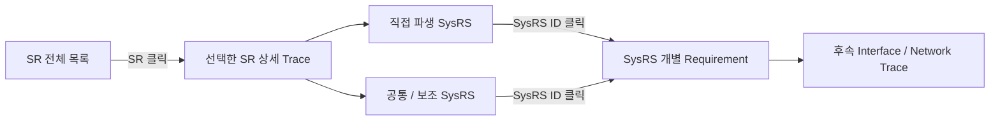

<a id="trace-cis-sr-index"></a>


<a id="trace-cis-s01"></a>
> 원문 구간: [CIS/04_CIS_SR_SYSRS_TRACE_NAVIGATION_DRAFT.md L27–101](https://github.com/vehicle-domain-control-system/integrated-vehicle-control/blob/1b1c4b834e4ac692f8e3eaf3e2680e4a530a2072/docs/requirements/CIS/04_CIS_SR_SYSRS_TRACE_NAVIGATION_DRAFT.md#L27-L101)

#### D.CIS.1 SR 전체 목록

특정 항목을 클릭하면 아래의 해당 **SR → SysRS 상세 추적** 위치로 이동한다.

- 추적 Reference: **40개**
- Functional SR: **28개**
- Boundary: **8개**
- Scope: **4개**

#### D.CIS.3 기능 경계

- [`BOUNDARY` CIS/TR-SR-001](#trace-cis-tr-sr-001) — CIS는 엔진룸 대상 동물의 진입 여부를 판정하지 않는다.
- [`BOUNDARY` CIS/TR-SR-002](#trace-cis-tr-sr-002) — CIS는 후방 위험 상태에 대응하는 음향을 직접 재생하지 않는다.
- [`BOUNDARY` CIS/TR-SR-003](#trace-cis-tr-sr-003) — CIS는 도어 잠금, 파워윈도우 등 차량 액추에이터를 직접 제어하지 않는다.
- [`BOUNDARY` CIS/TR-SR-004](#trace-cis-tr-sr-004) — CIS는 확정된 판정 결과와 측정값을 중앙처리장치 및 VSS가 활용할 수 있도록 제공해야 한다.

#### D.CIS.4 탑승자 인식 요구사항

- [`FUNCTIONAL` CIS/TR-SR-005](#trace-cis-tr-sr-005) — 시스템은 실내 영상을 이용하여 탑승자 존재 여부를 판정해야 한다.
- [`FUNCTIONAL` CIS/TR-SR-006](#trace-cis-tr-sr-006) — 시스템은 실내 영상을 이용하여 탑승자 인원수를 판정해야 한다.
- [`FUNCTIONAL` CIS/TR-SR-007](#trace-cis-tr-sr-007) — 시스템은 탑승자 판정 결과의 유효 여부를 구분해야 한다.
- [`FUNCTIONAL` CIS/TR-SR-008](#trace-cis-tr-sr-008) — 시스템은 비전 정보를 신뢰할 수 있기 전에는 해당 정보에 기반한 판정 결과를 확정하지 않아야 한다.
- [`FUNCTIONAL` CIS/TR-SR-009](#trace-cis-tr-sr-009) — 시스템은 비전 오류의 복구 조건이 충족되기 전에는 탑승자 상태를 정상으로 확정하지 않아야 한다.
- [`FUNCTIONAL` CIS/TR-SR-010](#trace-cis-tr-sr-010) — 시스템은 실내 영상을 탑승자 인식 목적 범위를 벗어나 저장하거나 외부로 전송하지 않아야 한다.

#### D.CIS.5 실내 환경 센싱 요구사항

- [`FUNCTIONAL` CIS/TR-SR-011](#trace-cis-tr-sr-011) — 시스템은 실내 온도를 측정해야 한다.
- [`FUNCTIONAL` CIS/TR-SR-012](#trace-cis-tr-sr-012) — 시스템은 실내 습도를 측정해야 한다.
- [`FUNCTIONAL` CIS/TR-SR-013](#trace-cis-tr-sr-013) — 시스템은 조도를 측정해야 한다.
- [`FUNCTIONAL` CIS/TR-SR-014](#trace-cis-tr-sr-014) — 시스템은 측정 정보의 유효 여부를 구분해야 한다.
- [`FUNCTIONAL` CIS/TR-SR-015](#trace-cis-tr-sr-015) — 시스템은 센서 정보를 신뢰할 수 있기 전에는 해당 정보에 기반한 값을 확정하지 않아야 한다.
- [`FUNCTIONAL` CIS/TR-SR-016](#trace-cis-tr-sr-016) — 시스템은 센서 오류의 복구 조건이 충족되기 전에는 측정값을 정상으로 확정하지 않아야 한다.

#### D.CIS.6 후방 근접 감지 요구사항

- [`FUNCTIONAL` CIS/TR-SR-017](#trace-cis-tr-sr-017) — 시스템은 후방 물체와의 거리를 측정해야 한다.
- [`FUNCTIONAL` CIS/TR-SR-018](#trace-cis-tr-sr-018) — 시스템은 거리 측정 정보의 유효 여부를 구분해야 한다.
- [`FUNCTIONAL` CIS/TR-SR-019](#trace-cis-tr-sr-019) — 시스템은 물체와의 거리가 정의된 기준 이내인 경우 근접 위험 상태를 판단해야 한다.
- [`FUNCTIONAL` CIS/TR-SR-020](#trace-cis-tr-sr-020) — 시스템은 근접 위험 수준이 높아지는 경우 이를 구분되는 상태로 제공해야 한다.
- [`FUNCTIONAL` CIS/TR-SR-021](#trace-cis-tr-sr-021) — 시스템은 물체가 정의된 기준 거리 밖으로 벗어난 경우 근접 위험 상태를 해제해야 한다.
- [`FUNCTIONAL` CIS/TR-SR-022](#trace-cis-tr-sr-022) — 시스템은 거리 측정 정보를 신뢰할 수 있기 전에는 근접 위험 상태를 확정하지 않아야 한다.

#### D.CIS.7 데이터 유효성 및 오류 요구사항

- [`FUNCTIONAL` CIS/TR-SR-023](#trace-cis-tr-sr-023) — 시스템은 센서 입력이 유효 범위를 벗어난 경우 해당 정보를 정상 정보로 사용하지 않아야 한다.
- [`FUNCTIONAL` CIS/TR-SR-024](#trace-cis-tr-sr-024) — 시스템은 실내 영상 품질이 인식 기준을 만족하지 못하는 경우 해당 판정 결과를 정상 정보로 사용하지 않아야 한다.
- [`FUNCTIONAL` CIS/TR-SR-025](#trace-cis-tr-sr-025) — 시스템은 특정 센서 또는 비전 기능에 오류가 발생하더라도, 오류와 무관한 다른 판정·측정 기능을 불필요하게 중단하지 않아야 한다.
- [`FUNCTIONAL` CIS/TR-SR-026](#trace-cis-tr-sr-026) — 시스템은 통신 오류 동안 마지막 정상 값을 현재 정상 값으로 표시하지 않아야 한다.

#### D.CIS.8 중앙처리장치 및 VSS 연계 요구사항

- [`FUNCTIONAL` CIS/TR-SR-027](#trace-cis-tr-sr-027) — 시스템은 유효한 탑승자 판정 결과 및 환경 측정값을 중앙처리장치로 전송해야 한다.
- [`FUNCTIONAL` CIS/TR-SR-028](#trace-cis-tr-sr-028) — 시스템은 판정 결과 및 측정값을 정의된 주기로 갱신하여 제공해야 한다.
- [`FUNCTIONAL` CIS/TR-SR-029](#trace-cis-tr-sr-029) — 시스템은 판정 결과 및 측정값과 함께 해당 값의 유효 여부를 함께 제공해야 한다.
- [`FUNCTIONAL` CIS/TR-SR-030](#trace-cis-tr-sr-030) — 시스템은 통신 오류가 발생한 경우 해당 오류 상태를 상위 시스템이 식별할 수 있도록 제공해야 한다.
- [`FUNCTIONAL` CIS/TR-SR-031](#trace-cis-tr-sr-031) — 시스템은 통신 오류가 해제되고 새로운 유효 값이 확인된 경우에만 정상 전송을 재개해야 한다.
- [`FUNCTIONAL` CIS/TR-SR-032](#trace-cis-tr-sr-032) — 시스템은 근접 위험 상태를 VSS가 활용 가능한 의미 상태(주의 / 긴급 / 해제)로 제공해야 한다.

#### D.CIS.9 기능 제외 범위

- [`SCOPE` CIS/TR-SR-033](#trace-cis-tr-sr-033) — 엔진룸 카메라 기반 대상 동물 진입 판정
- [`SCOPE` CIS/TR-SR-034](#trace-cis-tr-sr-034) — 후방 위험 상태에 대응하는 음향 출력 및 재생 (VSS 담당)
- [`SCOPE` CIS/TR-SR-035](#trace-cis-tr-sr-035) — 도어 잠금, 파워윈도우 등 차량 액추에이터 제어
- [`SCOPE` CIS/TR-SR-036](#trace-cis-tr-sr-036) — 후방 장애물의 실제 거리값 및 임계값을 VSS 등 외부에 직접 노출하는 것

#### D.CIS.10 상위 시스템 연계 원칙

- [`BOUNDARY` CIS/TR-SR-037](#trace-cis-tr-sr-037) — CIS는 센서 원시 데이터 및 영상을 직접 외부로 노출하지 않아야 한다.
- [`BOUNDARY` CIS/TR-SR-038](#trace-cis-tr-sr-038) — CIS의 후방 위험 의미 상태는 VSS가 정의한 의미 이벤트 체계와 일치해야 한다.
- [`BOUNDARY` CIS/TR-SR-039](#trace-cis-tr-sr-039) — CIS의 세부 인식·센싱 처리 방법은 상위 차량 기능이 직접 제어하지 않아야 한다.
- [`BOUNDARY` CIS/TR-SR-040](#trace-cis-tr-sr-040) — CIS의 상태 및 오류는 상위 차량 시스템에서 활용 가능해야 한다.

---


<a id="trace-cis-s02"></a>
> 원문 구간: [CIS/04_CIS_SR_SYSRS_TRACE_NAVIGATION_DRAFT.md L102–890](https://github.com/vehicle-domain-control-system/integrated-vehicle-control/blob/1b1c4b834e4ac692f8e3eaf3e2680e4a530a2072/docs/requirements/CIS/04_CIS_SR_SYSRS_TRACE_NAVIGATION_DRAFT.md#L102-L890)

> **통합 검토:** [B10](#review-b10) — 원문과 제안을 함께 읽는다. 정책·수치·안전 동작을 자동 확정하지 않았다.

#### D.CIS.2 SR 상세 Trace

<a id="trace-cis-tr-sr-001"></a>
##### CIS/TR-SR-001 · 3. 기능 경계

**분류:** `BOUNDARY`  
**Trace 상태:** `COVERED`

**SR 원문**

> CIS는 엔진룸 대상 동물의 진입 여부를 판정하지 않는다.

**직접 파생 SysRS**

- [CIS-SYS-FUN-028](#cis-sys-fun-028) — CIS는 엔진룸 대상 동물의 진입 여부를 판정하지 않아야 한다.

[↑ SR 전체 목록으로](#trace-cis-sr-index)

---

<a id="trace-cis-tr-sr-002"></a>
##### CIS/TR-SR-002 · 3. 기능 경계

**분류:** `BOUNDARY`  
**Trace 상태:** `COVERED`

**SR 원문**

> CIS는 후방 위험 상태에 대응하는 음향을 직접 재생하지 않는다.

**직접 파생 SysRS**

- [CIS-SYS-INT-005](#cis-sys-int-005) — CIS는 후방 근접 위험 의미 상태(`CAUTION`/`EMERGENCY`/`CLEAR`)를 VSS가 확인할 수 있도록 제공해야 한다.

**공통 / 보조 SysRS**

- [CIS-SYS-FUN-026](#cis-sys-fun-026) — CIS는 `CAUTION`/`EMERGENCY`/`CLEAR` 상태를 VSS가 정의한 의미 이벤트 이름과 일치시켜 제공해야 한다.

[↑ SR 전체 목록으로](#trace-cis-sr-index)

---

<a id="trace-cis-tr-sr-003"></a>
##### CIS/TR-SR-003 · 3. 기능 경계

**분류:** `BOUNDARY`  
**Trace 상태:** `COVERED`

**SR 원문**

> CIS는 도어 잠금, 파워윈도우 등 차량 액추에이터를 직접 제어하지 않는다.

**직접 파생 SysRS**

- [CIS-SYS-SAF-001](#cis-sys-saf-001) — CIS의 오류는 파워윈도우, 공조, 도어 등 다른 차량 기능의 제어 상태를 직접 변경해서는 안 된다.

[↑ SR 전체 목록으로](#trace-cis-sr-index)

---

<a id="trace-cis-tr-sr-004"></a>
##### CIS/TR-SR-004 · 3. 기능 경계

**분류:** `BOUNDARY`  
**Trace 상태:** `COVERED`

**SR 원문**

> CIS는 확정된 판정 결과와 측정값을 중앙처리장치 및 VSS가 활용할 수 있도록 제공해야 한다.

**직접 파생 SysRS**

- [CIS-SYS-INT-003](#cis-sys-int-003) — CIS는 탑승자 존재 여부 및 인원수를 중앙처리장치가 확인할 수 있도록 제공해야 한다.
- [CIS-SYS-INT-004](#cis-sys-int-004) — CIS는 실내 온도·습도·조도 측정값을 중앙처리장치가 확인할 수 있도록 제공해야 한다.
- [CIS-SYS-INT-005](#cis-sys-int-005) — CIS는 후방 근접 위험 의미 상태를 VSS가 확인할 수 있도록 제공해야 한다.

**공통 / 보조 SysRS**

- [CIS-SYS-FUN-022](#cis-sys-fun-022) — CIS는 유효한 탑승자 판정 결과 및 환경 측정값을 정의된 주기로 중앙처리장치에 전송해야 한다.

[↑ SR 전체 목록으로](#trace-cis-sr-index)

---

<a id="trace-cis-tr-sr-005"></a>
##### CIS/TR-SR-005 · 4. 탑승자 인식 요구사항

**분류:** `FUNCTIONAL`  
**Trace 상태:** `COVERED`

**SR 원문**

> 시스템은 실내 영상을 이용하여 탑승자 존재 여부를 판정해야 한다.

**직접 파생 SysRS**

- [CIS-SYS-FUN-003](#cis-sys-fun-003) — CIS는 실내 영상을 이용하여 탑승자 존재 여부를 판정해야 한다.

[↑ SR 전체 목록으로](#trace-cis-sr-index)

---

<a id="trace-cis-tr-sr-006"></a>
##### CIS/TR-SR-006 · 4. 탑승자 인식 요구사항

**분류:** `FUNCTIONAL`  
**Trace 상태:** `COVERED`

**SR 원문**

> 시스템은 실내 영상을 이용하여 탑승자 인원수를 판정해야 한다.

**직접 파생 SysRS**

- [CIS-SYS-FUN-004](#cis-sys-fun-004) — CIS는 실내 영상을 이용하여 탑승자 인원수를 판정해야 한다.

[↑ SR 전체 목록으로](#trace-cis-sr-index)

---

<a id="trace-cis-tr-sr-007"></a>
##### CIS/TR-SR-007 · 4. 탑승자 인식 요구사항

**분류:** `FUNCTIONAL`  
**Trace 상태:** `COVERED`

**SR 원문**

> 시스템은 탑승자 판정 결과의 유효 여부를 구분해야 한다.

**직접 파생 SysRS**

- [CIS-SYS-FUN-005](#cis-sys-fun-005) — CIS는 탑승자 판정 결과의 유효 여부를 구분해야 한다.

[↑ SR 전체 목록으로](#trace-cis-sr-index)

---

<a id="trace-cis-tr-sr-008"></a>
##### CIS/TR-SR-008 · 4. 탑승자 인식 요구사항

**분류:** `FUNCTIONAL`  
**Trace 상태:** `COVERED`

**SR 원문**

> 시스템은 비전 정보를 신뢰할 수 있기 전에는 해당 정보에 기반한 판정 결과를 확정하지 않아야 한다.

**직접 파생 SysRS**

- [CIS-SYS-FUN-006](#cis-sys-fun-006) — CIS는 비전 정보를 신뢰할 수 있기 전에는 해당 정보에 기반한 판정 결과를 확정하지 않아야 한다.

[↑ SR 전체 목록으로](#trace-cis-sr-index)

---

<a id="trace-cis-tr-sr-009"></a>
##### CIS/TR-SR-009 · 4. 탑승자 인식 요구사항

**분류:** `FUNCTIONAL`  
**Trace 상태:** `COVERED`

**SR 원문**

> 시스템은 비전 오류의 복구 조건이 충족되기 전에는 탑승자 상태를 정상으로 확정하지 않아야 한다.

**직접 파생 SysRS**

- [CIS-SYS-FUN-007](#cis-sys-fun-007) — CIS는 비전 오류의 복구 조건이 충족되기 전에는 탑승자 상태를 정상으로 확정하지 않아야 한다.

[↑ SR 전체 목록으로](#trace-cis-sr-index)

---

<a id="trace-cis-tr-sr-010"></a>
##### CIS/TR-SR-010 · 4. 탑승자 인식 요구사항

**분류:** `FUNCTIONAL`  
**Trace 상태:** `COVERED`

**SR 원문**

> 시스템은 실내 영상을 탑승자 인식 목적 범위를 벗어나 저장하거나 외부로 전송하지 않아야 한다.

**직접 파생 SysRS**

- [CIS-SYS-FUN-027](#cis-sys-fun-027) — CIS는 실내 영상을 탑승자 인식 목적 범위를 벗어나 저장하거나 외부로 전송하지 않아야 한다.

**공통 / 보조 SysRS**

- [CIS-SYS-SAF-004](#cis-sys-saf-004) — CIS는 실내 영상 원본을 어떠한 외부 인터페이스로도 노출해서는 안 된다.

[↑ SR 전체 목록으로](#trace-cis-sr-index)

---

<a id="trace-cis-tr-sr-011"></a>
##### CIS/TR-SR-011 · 5. 실내 환경 센싱 요구사항

**분류:** `FUNCTIONAL`  
**Trace 상태:** `COVERED`

**SR 원문**

> 시스템은 실내 온도를 측정해야 한다.

**직접 파생 SysRS**

- [CIS-SYS-FUN-008](#cis-sys-fun-008) — CIS는 실내 온도를 측정해야 한다.

[↑ SR 전체 목록으로](#trace-cis-sr-index)

---

<a id="trace-cis-tr-sr-012"></a>
##### CIS/TR-SR-012 · 5. 실내 환경 센싱 요구사항

**분류:** `FUNCTIONAL`  
**Trace 상태:** `COVERED`

**SR 원문**

> 시스템은 실내 습도를 측정해야 한다.

**직접 파생 SysRS**

- [CIS-SYS-FUN-009](#cis-sys-fun-009) — CIS는 실내 습도를 측정해야 한다.

[↑ SR 전체 목록으로](#trace-cis-sr-index)

---

<a id="trace-cis-tr-sr-013"></a>
##### CIS/TR-SR-013 · 5. 실내 환경 센싱 요구사항

**분류:** `FUNCTIONAL`  
**Trace 상태:** `COVERED`

**SR 원문**

> 시스템은 조도를 측정해야 한다.

**직접 파생 SysRS**

- [CIS-SYS-FUN-010](#cis-sys-fun-010) — CIS는 조도를 측정해야 한다.

[↑ SR 전체 목록으로](#trace-cis-sr-index)

---

<a id="trace-cis-tr-sr-014"></a>
##### CIS/TR-SR-014 · 5. 실내 환경 센싱 요구사항

**분류:** `FUNCTIONAL`  
**Trace 상태:** `COVERED`

**SR 원문**

> 시스템은 측정 정보의 유효 여부를 구분해야 한다.

**직접 파생 SysRS**

- [CIS-SYS-FUN-011](#cis-sys-fun-011) — CIS는 환경 측정 정보의 유효 여부를 구분해야 한다.

[↑ SR 전체 목록으로](#trace-cis-sr-index)

---

<a id="trace-cis-tr-sr-015"></a>
##### CIS/TR-SR-015 · 5. 실내 환경 센싱 요구사항

**분류:** `FUNCTIONAL`  
**Trace 상태:** `COVERED`

**SR 원문**

> 시스템은 센서 정보를 신뢰할 수 있기 전에는 해당 정보에 기반한 값을 확정하지 않아야 한다.

**직접 파생 SysRS**

- [CIS-SYS-FUN-012](#cis-sys-fun-012) — CIS는 센서 정보를 신뢰할 수 있기 전에는 해당 정보에 기반한 값을 확정하지 않아야 한다.

[↑ SR 전체 목록으로](#trace-cis-sr-index)

---

<a id="trace-cis-tr-sr-016"></a>
##### CIS/TR-SR-016 · 5. 실내 환경 센싱 요구사항

**분류:** `FUNCTIONAL`  
**Trace 상태:** `COVERED`

**SR 원문**

> 시스템은 센서 오류의 복구 조건이 충족되기 전에는 측정값을 정상으로 확정하지 않아야 한다.

**직접 파생 SysRS**

- [CIS-SYS-FUN-013](#cis-sys-fun-013) — CIS는 센서 오류의 복구 조건이 충족되기 전에는 측정값을 정상으로 확정하지 않아야 한다.

[↑ SR 전체 목록으로](#trace-cis-sr-index)

---

<a id="trace-cis-tr-sr-017"></a>
##### CIS/TR-SR-017 · 6. 후방 근접 감지 요구사항

**분류:** `FUNCTIONAL`  
**Trace 상태:** `COVERED`

**SR 원문**

> 시스템은 후방 물체와의 거리를 측정해야 한다.

**직접 파생 SysRS**

- [CIS-SYS-FUN-014](#cis-sys-fun-014) — CIS는 후방 물체와의 거리를 측정해야 한다.

[↑ SR 전체 목록으로](#trace-cis-sr-index)

---

<a id="trace-cis-tr-sr-018"></a>
##### CIS/TR-SR-018 · 6. 후방 근접 감지 요구사항

**분류:** `FUNCTIONAL`  
**Trace 상태:** `COVERED`

**SR 원문**

> 시스템은 거리 측정 정보의 유효 여부를 구분해야 한다.

**직접 파생 SysRS**

- [CIS-SYS-FUN-015](#cis-sys-fun-015) — CIS는 거리 측정 정보의 유효 여부를 구분해야 한다.

[↑ SR 전체 목록으로](#trace-cis-sr-index)

---

<a id="trace-cis-tr-sr-019"></a>
##### CIS/TR-SR-019 · 6. 후방 근접 감지 요구사항

**분류:** `FUNCTIONAL`  
**Trace 상태:** `COVERED`

**SR 원문**

> 시스템은 물체와의 거리가 정의된 기준 이내인 경우 근접 위험 상태를 판단해야 한다.

**직접 파생 SysRS**

- [CIS-SYS-FUN-016](#cis-sys-fun-016) — CIS는 물체와의 거리가 정의된 주의 임계값 이내인 경우 `CAUTION` 상태를 판단해야 한다.
- [CIS-SYS-FUN-017](#cis-sys-fun-017) — CIS는 물체와의 거리가 정의된 긴급 임계값 이내인 경우 `EMERGENCY` 상태를 판단해야 한다.

[↑ SR 전체 목록으로](#trace-cis-sr-index)

---

<a id="trace-cis-tr-sr-020"></a>
##### CIS/TR-SR-020 · 6. 후방 근접 감지 요구사항

**분류:** `FUNCTIONAL`  
**Trace 상태:** `COVERED`

**SR 원문**

> 시스템은 근접 위험 수준이 높아지는 경우 이를 구분되는 상태로 제공해야 한다.

**직접 파생 SysRS**

- [CIS-SYS-FUN-017](#cis-sys-fun-017) — CIS는 물체와의 거리가 정의된 긴급 임계값 이내인 경우 `EMERGENCY` 상태를 판단해야 한다.

**공통 / 보조 SysRS**

- [CIS-SYS-FUN-016](#cis-sys-fun-016) — CIS는 물체와의 거리가 정의된 주의 임계값 이내인 경우 `CAUTION` 상태를 판단해야 한다.
- [CIS-SYS-SAF-003](#cis-sys-saf-003) — CIS는 정상적인 탑승자/환경/근접 정보를 제공할 수 없는 경우 해당 상태가 외부 시스템에서 식별 가능해야 한다.

[↑ SR 전체 목록으로](#trace-cis-sr-index)

---

<a id="trace-cis-tr-sr-021"></a>
##### CIS/TR-SR-021 · 6. 후방 근접 감지 요구사항

**분류:** `FUNCTIONAL`  
**Trace 상태:** `COVERED`

**SR 원문**

> 시스템은 물체가 정의된 기준 거리 밖으로 벗어난 경우 근접 위험 상태를 해제해야 한다.

**직접 파생 SysRS**

- [CIS-SYS-FUN-018](#cis-sys-fun-018) — CIS는 물체가 정의된 기준 거리 밖으로 벗어난 경우 `CLEAR` 상태로 전이해야 한다.

[↑ SR 전체 목록으로](#trace-cis-sr-index)

---

<a id="trace-cis-tr-sr-022"></a>
##### CIS/TR-SR-022 · 6. 후방 근접 감지 요구사항

**분류:** `FUNCTIONAL`  
**Trace 상태:** `COVERED`

**SR 원문**

> 시스템은 거리 측정 정보를 신뢰할 수 있기 전에는 근접 위험 상태를 확정하지 않아야 한다.

**직접 파생 SysRS**

- [CIS-SYS-FUN-019](#cis-sys-fun-019) — CIS는 거리 측정 정보를 신뢰할 수 있기 전에는 `CAUTION`/`EMERGENCY` 상태를 확정하지 않아야 한다.

**공통 / 보조 SysRS**

- [CIS-SYS-SAF-002](#cis-sys-saf-002) — CIS는 신뢰할 수 없는 근접 감지 정보를 근거로 `EMERGENCY` 상태를 확정해서는 안 된다.

[↑ SR 전체 목록으로](#trace-cis-sr-index)

---

<a id="trace-cis-tr-sr-023"></a>
##### CIS/TR-SR-023 · 7. 데이터 유효성 및 오류 요구사항

**분류:** `FUNCTIONAL`  
**Trace 상태:** `COVERED`

**SR 원문**

> 시스템은 센서 입력이 유효 범위를 벗어난 경우 해당 정보를 정상 정보로 사용하지 않아야 한다.

**직접 파생 SysRS**

- [CIS-SYS-FUN-012](#cis-sys-fun-012) — CIS는 센서 정보를 신뢰할 수 있기 전에는 해당 정보에 기반한 값을 확정하지 않아야 한다.
- [CIS-SYS-FUN-019](#cis-sys-fun-019) — CIS는 거리 측정 정보를 신뢰할 수 있기 전에는 `CAUTION`/`EMERGENCY` 상태를 확정하지 않아야 한다.

[↑ SR 전체 목록으로](#trace-cis-sr-index)

---

<a id="trace-cis-tr-sr-024"></a>
##### CIS/TR-SR-024 · 7. 데이터 유효성 및 오류 요구사항

**분류:** `FUNCTIONAL`  
**Trace 상태:** `COVERED`

**SR 원문**

> 시스템은 실내 영상 품질이 인식 기준을 만족하지 못하는 경우 해당 판정 결과를 정상 정보로 사용하지 않아야 한다.

**직접 파생 SysRS**

- [CIS-SYS-FUN-006](#cis-sys-fun-006) — CIS는 비전 정보를 신뢰할 수 있기 전에는 해당 정보에 기반한 판정 결과를 확정하지 않아야 한다.

**공통 / 보조 SysRS**

- [CIS-SYS-DIA-001](#cis-sys-dia-001) — CIS는 정상 판정·측정을 방해하는 오류를 검출할 수 있어야 한다.

[↑ SR 전체 목록으로](#trace-cis-sr-index)

---

<a id="trace-cis-tr-sr-025"></a>
##### CIS/TR-SR-025 · 7. 데이터 유효성 및 오류 요구사항

**분류:** `FUNCTIONAL`  
**Trace 상태:** `COVERED`

**SR 원문**

> 시스템은 특정 센서 또는 비전 기능에 오류가 발생하더라도, 오류와 무관한 다른 판정·측정 기능을 불필요하게 중단하지 않아야 한다.

**직접 파생 SysRS**

- [CIS-SYS-FUN-020](#cis-sys-fun-020) — CIS는 특정 센서 또는 비전 기능에 오류가 발생하더라도, 오류와 무관한 다른 판정·측정 기능을 불필요하게 중단하지 않아야 한다.

**공통 / 보조 SysRS**

- [CIS-SYS-NFR-003](#cis-sys-nfr-003) — CIS 관련 오류는 다른 차량 기능과 기능적으로 격리되어야 한다.

[↑ SR 전체 목록으로](#trace-cis-sr-index)

---

<a id="trace-cis-tr-sr-026"></a>
##### CIS/TR-SR-026 · 7. 데이터 유효성 및 오류 요구사항

**분류:** `FUNCTIONAL`  
**Trace 상태:** `COVERED`

**SR 원문**

> 시스템은 통신 오류 동안 마지막 정상 값을 현재 정상 값으로 표시하지 않아야 한다.

**직접 파생 SysRS**

- [CIS-SYS-FUN-021](#cis-sys-fun-021) — CIS는 통신 오류 동안 마지막 정상 값을 현재 정상 값으로 표시하지 않아야 한다.

[↑ SR 전체 목록으로](#trace-cis-sr-index)

---

<a id="trace-cis-tr-sr-027"></a>
##### CIS/TR-SR-027 · 8. 중앙처리장치 및 VSS 연계 요구사항

**분류:** `FUNCTIONAL`  
**Trace 상태:** `COVERED`

**SR 원문**

> 시스템은 유효한 탑승자 판정 결과 및 환경 측정값을 중앙처리장치로 전송해야 한다.

**직접 파생 SysRS**

- [CIS-SYS-FUN-022](#cis-sys-fun-022) — CIS는 유효한 탑승자 판정 결과 및 환경 측정값을 정의된 주기로 중앙처리장치에 전송해야 한다.

[↑ SR 전체 목록으로](#trace-cis-sr-index)

---

<a id="trace-cis-tr-sr-028"></a>
##### CIS/TR-SR-028 · 8. 중앙처리장치 및 VSS 연계 요구사항

**분류:** `FUNCTIONAL`  
**Trace 상태:** `COVERED`

**SR 원문**

> 시스템은 판정 결과 및 측정값을 정의된 주기로 갱신하여 제공해야 한다.

**직접 파생 SysRS**

- [CIS-SYS-PER-002](#cis-sys-per-002) — CIS는 탑승자/환경/근접 데이터를 정의된 주기로 갱신하여 제공해야 한다.

**공통 / 보조 SysRS**

- [CIS-SYS-FUN-022](#cis-sys-fun-022) — CIS는 유효한 탑승자 판정 결과 및 환경 측정값을 정의된 주기로 중앙처리장치에 전송해야 한다.

[↑ SR 전체 목록으로](#trace-cis-sr-index)

---

<a id="trace-cis-tr-sr-029"></a>
##### CIS/TR-SR-029 · 8. 중앙처리장치 및 VSS 연계 요구사항

**분류:** `FUNCTIONAL`  
**Trace 상태:** `COVERED`

**SR 원문**

> 시스템은 판정 결과 및 측정값과 함께 해당 값의 유효 여부를 함께 제공해야 한다.

**직접 파생 SysRS**

- [CIS-SYS-FUN-023](#cis-sys-fun-023) — CIS는 전송하는 각 값에 대해 유효 여부 플래그를 함께 제공해야 한다.

**공통 / 보조 SysRS**

- [CIS-SYS-INT-006](#cis-sys-int-006) — CIS는 각 제공 정보의 유효 여부를 함께 제공해야 한다.

[↑ SR 전체 목록으로](#trace-cis-sr-index)

---

<a id="trace-cis-tr-sr-030"></a>
##### CIS/TR-SR-030 · 8. 중앙처리장치 및 VSS 연계 요구사항

**분류:** `FUNCTIONAL`  
**Trace 상태:** `COVERED`

**SR 원문**

> 시스템은 통신 오류가 발생한 경우 해당 오류 상태를 상위 시스템이 식별할 수 있도록 제공해야 한다.

**직접 파생 SysRS**

- [CIS-SYS-FUN-024](#cis-sys-fun-024) — CIS는 통신 오류가 발생한 경우 해당 오류 상태를 상위 시스템이 식별할 수 있도록 제공해야 한다.

**공통 / 보조 SysRS**

- [CIS-SYS-INT-007](#cis-sys-int-007) — CIS는 정상/오류 상태를 외부 시스템이 확인할 수 있도록 해야 한다.
- [CIS-SYS-PER-004](#cis-sys-per-004) — CIS는 정의된 연속 누락 횟수를 초과하는 통신 실패를 통신 오류로 판단해야 한다.

[↑ SR 전체 목록으로](#trace-cis-sr-index)

---

<a id="trace-cis-tr-sr-031"></a>
##### CIS/TR-SR-031 · 8. 중앙처리장치 및 VSS 연계 요구사항

**분류:** `FUNCTIONAL`  
**Trace 상태:** `COVERED`

**SR 원문**

> 시스템은 통신 오류가 해제되고 새로운 유효 값이 확인된 경우에만 정상 전송을 재개해야 한다.

**직접 파생 SysRS**

- [CIS-SYS-FUN-025](#cis-sys-fun-025) — CIS는 통신 오류가 해제되고 새로운 유효 값이 확인된 경우에만 정상 전송을 재개해야 한다.

**공통 / 보조 SysRS**

- [CIS-SYS-INT-008](#cis-sys-int-008) — CIS가 오류에서 복구된 경우 외부 시스템이 정상 복귀 여부를 확인할 수 있도록 해야 한다.
- [CIS-SYS-PER-005](#cis-sys-per-005) — 통신 오류 해제 후 CIS가 정상 전송을 재개하기까지의 지연은 제한되어야 한다.

[↑ SR 전체 목록으로](#trace-cis-sr-index)

---

<a id="trace-cis-tr-sr-032"></a>
##### CIS/TR-SR-032 · 8. 중앙처리장치 및 VSS 연계 요구사항

**분류:** `FUNCTIONAL`  
**Trace 상태:** `COVERED`

**SR 원문**

> 시스템은 근접 위험 상태를 VSS가 활용 가능한 의미 상태(주의 / 긴급 / 해제)로 제공해야 한다.

**직접 파생 SysRS**

- [CIS-SYS-FUN-026](#cis-sys-fun-026) — CIS는 `CAUTION`/`EMERGENCY`/`CLEAR` 상태를 VSS가 정의한 의미 이벤트 이름과 일치시켜 제공해야 한다.

**공통 / 보조 SysRS**

- [CIS-SYS-INT-005](#cis-sys-int-005) — CIS는 후방 근접 위험 의미 상태를 VSS가 확인할 수 있도록 제공해야 한다.

[↑ SR 전체 목록으로](#trace-cis-sr-index)

---

<a id="trace-cis-tr-sr-033"></a>
##### CIS/TR-SR-033 · 9. 기능 제외 범위

**분류:** `SCOPE`  
**Trace 상태:** `COVERED`

**SR 원문**

> 엔진룸 카메라 기반 대상 동물 진입 판정

**직접 파생 SysRS**

- [CIS-SYS-FUN-028](#cis-sys-fun-028) — CIS는 엔진룸 대상 동물의 진입 여부를 판정하지 않아야 한다.

[↑ SR 전체 목록으로](#trace-cis-sr-index)

---

<a id="trace-cis-tr-sr-034"></a>
##### CIS/TR-SR-034 · 9. 기능 제외 범위

**분류:** `SCOPE`  
**Trace 상태:** `COVERED`

**SR 원문**

> 후방 위험 상태에 대응하는 음향 출력 및 재생 (VSS 담당)

**직접 파생 SysRS**

- [CIS-SYS-INT-005](#cis-sys-int-005) — CIS는 후방 근접 위험 의미 상태를 VSS가 확인할 수 있도록 제공해야 한다.

[↑ SR 전체 목록으로](#trace-cis-sr-index)

---

<a id="trace-cis-tr-sr-035"></a>
##### CIS/TR-SR-035 · 9. 기능 제외 범위

**분류:** `SCOPE`  
**Trace 상태:** `COVERED`

**SR 원문**

> 도어 잠금, 파워윈도우 등 차량 액추에이터 제어

**직접 파생 SysRS**

- [CIS-SYS-SAF-001](#cis-sys-saf-001) — CIS의 오류는 파워윈도우, 공조, 도어 등 다른 차량 기능의 제어 상태를 직접 변경해서는 안 된다.

[↑ SR 전체 목록으로](#trace-cis-sr-index)

---

<a id="trace-cis-tr-sr-036"></a>
##### CIS/TR-SR-036 · 9. 기능 제외 범위

**분류:** `SCOPE`  
**Trace 상태:** `COVERED`

**SR 원문**

> 후방 장애물의 실제 거리값 및 임계값을 VSS 등 외부에 직접 노출하는 것

**직접 파생 SysRS**

- [CIS-SYS-FUN-026](#cis-sys-fun-026) — CIS는 `CAUTION`/`EMERGENCY`/`CLEAR` 상태를 VSS가 정의한 의미 이벤트 이름과 일치시켜 제공해야 한다.

**참고**

02문서 §6 Candidate Proximity Thresholds — VSS에는 거리 Raw Data가 아닌 3상태(`CAUTION`/`EMERGENCY`/`CLEAR`)만 노출된다.

[↑ SR 전체 목록으로](#trace-cis-sr-index)

---

<a id="trace-cis-tr-sr-037"></a>
##### CIS/TR-SR-037 · 10. 상위 시스템 연계 원칙

**분류:** `BOUNDARY`  
**Trace 상태:** `COVERED`

**SR 원문**

> CIS는 센서 원시 데이터 및 영상을 직접 외부로 노출하지 않아야 한다.

**직접 파생 SysRS**

- [CIS-SYS-SAF-004](#cis-sys-saf-004) — CIS는 실내 영상 원본을 어떠한 외부 인터페이스로도 노출해서는 안 된다.

**공통 / 보조 SysRS**

- [CIS-SYS-FUN-027](#cis-sys-fun-027) — CIS는 실내 영상을 탑승자 인식 목적 범위를 벗어나 저장하거나 외부로 전송하지 않아야 한다.

[↑ SR 전체 목록으로](#trace-cis-sr-index)

---

<a id="trace-cis-tr-sr-038"></a>
##### CIS/TR-SR-038 · 10. 상위 시스템 연계 원칙

**분류:** `BOUNDARY`  
**Trace 상태:** `COVERED`

**SR 원문**

> CIS의 후방 위험 의미 상태는 VSS가 정의한 의미 이벤트 체계와 일치해야 한다.

**직접 파생 SysRS**

- [CIS-SYS-FUN-026](#cis-sys-fun-026) — CIS는 `CAUTION`/`EMERGENCY`/`CLEAR` 상태를 VSS가 정의한 의미 이벤트 이름과 일치시켜 제공해야 한다.

[↑ SR 전체 목록으로](#trace-cis-sr-index)

---

<a id="trace-cis-tr-sr-039"></a>
##### CIS/TR-SR-039 · 10. 상위 시스템 연계 원칙

**분류:** `BOUNDARY`  
**Trace 상태:** `COVERED`

**SR 원문**

> CIS의 세부 인식·센싱 처리 방법은 상위 차량 기능이 직접 제어하지 않아야 한다.

**직접 파생 SysRS**

- [CIS-SYS-NFR-007](#cis-sys-nfr-007) — 실제 통신 프로토콜 변경이 CIS의 판정 로직 자체를 불필요하게 변경시키지 않도록 논리 인터페이스와 통신 구현이 분리 가능해야 한다.

**공통 / 보조 SysRS**

- [CIS-SYS-NFR-006](#cis-sys-nfr-006) — 근접 위험 임계값은 전체 판정 로직에 분산되지 않고 일관되게 관리 가능해야 한다.

[↑ SR 전체 목록으로](#trace-cis-sr-index)

---

<a id="trace-cis-tr-sr-040"></a>
##### CIS/TR-SR-040 · 10. 상위 시스템 연계 원칙

**분류:** `BOUNDARY`  
**Trace 상태:** `COVERED`

**SR 원문**

> CIS의 상태 및 오류는 상위 차량 시스템에서 활용 가능해야 한다.

**직접 파생 SysRS**

- [CIS-SYS-INT-007](#cis-sys-int-007) — CIS는 정상/오류 상태를 외부 시스템이 확인할 수 있도록 해야 한다.
- [CIS-SYS-INT-008](#cis-sys-int-008) — CIS가 오류에서 복구된 경우 외부 시스템이 정상 복귀 여부를 확인할 수 있도록 해야 한다.

[↑ SR 전체 목록으로](#trace-cis-sr-index)

---


<a id="trace-mobile"></a>
### 부록 D · MOBILE 원본 추적

출처: [MOBILE/04_MOBILE_SR_SYSRS_TRACE_NAVIGATION_DRAFT.md](https://github.com/vehicle-domain-control-system/integrated-vehicle-control/blob/1b1c4b834e4ac692f8e3eaf3e2680e4a530a2072/docs/requirements/MOBILE/04_MOBILE_SR_SYSRS_TRACE_NAVIGATION_DRAFT.md)

> **원문 추적 기록:** 이 블록의 COVERED·PARTIAL 등은 원본 판정이다. 이번 통합의 충족 판정으로 승계하지 않는다. [190항목 재검토](#trace-reassessment)와 함께 읽는다. BCM 도어 결과의 SR 문구는 5A에서 편집했으며 여기에는 기존 추적 표현을 남겨 차이를 드러낸다.


<a id="trace-mobile-header"></a>
> 원문 구간: [MOBILE/04_MOBILE_SR_SYSRS_TRACE_NAVIGATION_DRAFT.md L1–9](https://github.com/vehicle-domain-control-system/integrated-vehicle-control/blob/1b1c4b834e4ac692f8e3eaf3e2680e4a530a2072/docs/requirements/MOBILE/04_MOBILE_SR_SYSRS_TRACE_NAVIGATION_DRAFT.md#L1-L9)

> 원문 제목: MOBILE SR → SysRS Traceability — Navigation Draft

> 목적: **SR 문장 하나가 어느 SysRS 요구사항으로 이어지는지**를 대조하여 누락을 검출한다.
> `TR-SR-xxx`는 추적 문서 내부의 탐색용 Reference이며 **SR 원문에 부여하는 공식 요구사항 ID가 아니다.**
> SR 문구는 `01_MOBILE_SR_FUNCTIONAL_BASELINE_DRAFT` 의 표현을 그대로 사용한다.
> SysRS ID는 `02_MOBILE_SYSRS_FUNCTIONAL_BASELINE_DRAFT` 를 가리킨다.

---


<a id="trace-mobile-s01"></a>
> 원문 구간: [MOBILE/04_MOBILE_SR_SYSRS_TRACE_NAVIGATION_DRAFT.md L10–33](https://github.com/vehicle-domain-control-system/integrated-vehicle-control/blob/1b1c4b834e4ac692f8e3eaf3e2680e4a530a2072/docs/requirements/MOBILE/04_MOBILE_SR_SYSRS_TRACE_NAVIGATION_DRAFT.md#L10-L33)

> **통합 검토:** [A10](#review-a10) — 원문과 제안을 함께 읽는다. 정책·수치·안전 동작을 자동 확정하지 않았다.

#### D.MOBILE.1 추적 요약

| 항목 | 수 |
|---|---:|
| 추적 Reference | **44** |
| `FUNCTIONAL` | 30 |
| `NON_FUNCTIONAL` | 4 |
| `BOUNDARY` | 9 |
| `DEFERRED` | 1 |

| Trace 상태 | 수 | 의미 |
|---|---:|---|
| `COVERED` | **44** | 대응하는 SysRS 요구사항이 존재한다 |
| `PARTIAL` | 0 | 일부만 대응한다 |
| `NOT COVERED` | 0 | 대응하는 SysRS 요구사항이 없다 |

> 최초 작성 시 `NOT COVERED` 1건(`MOBILE/TR-SR-044`), `PARTIAL` 2건(`MOBILE/TR-SR-027`, `MOBILE/TR-SR-043`)이 검출되어
> `MB-SYS-REQ-012`, `MB-SYS-SAF-006`, `MB-SYS-SEC-006` 을 신설하였다.

> 제어 대상 목록(SR 3.1절)과 표시 대상 목록(SR 4.1절)은 개별 Ref 를 부여하지 않고
> `MOBILE/TR-SR-010` 및 `MOBILE/TR-SR-011`~`MOBILE/TR-SR-014`에서 각각 제어 대상과 표시 대상을 묶어 추적한다. 개별 목록 항목에는 별도 Ref를 부여하지 않았다. [편집 A10](#review-a10)

---


<a id="trace-mobile-s02"></a>
> 원문 구간: [MOBILE/04_MOBILE_SR_SYSRS_TRACE_NAVIGATION_DRAFT.md L34–126](https://github.com/vehicle-domain-control-system/integrated-vehicle-control/blob/1b1c4b834e4ac692f8e3eaf3e2680e4a530a2072/docs/requirements/MOBILE/04_MOBILE_SR_SYSRS_TRACE_NAVIGATION_DRAFT.md#L34-L126)

> **통합 검토:** [A12](#review-a12), [A13](#review-a13), [A20](#review-a20) — 원문과 제안을 함께 읽는다. 정책·수치·안전 동작을 자동 확정하지 않았다.

#### D.MOBILE.2 SR → SysRS 대조

#### D.MOBILE.2 기능 범위

| Ref | 분류 | SR 원문 | 대응 SysRS | 상태 |
|---|---|---|---|---|
| MOBILE/TR-SR-001 | `BOUNDARY` | 차량 기능을 직접 수행하지 않으며, 실제 수행 여부는 차량이 결정한다 | [SAF-004](#mb-sys-saf-004) · [SEM-003](#mb-sys-sem-003) | `COVERED` |
| MOBILE/TR-SR-002 | `BOUNDARY` | 요청의 허용 여부와 실제 수행은 차량이 결정하며, 그 결과를 받아 표시한다 | [SEM-003](#mb-sys-sem-003) · [REQ-003](#mb-sys-req-003) | `COVERED` |
| MOBILE/TR-SR-003 | `BOUNDARY` | 차량 상태를 자체적으로 추정하거나 보정하지 않는다 | [SEM-001](#mb-sys-sem-001) · [DSP-001](#mb-sys-dsp-001) | `COVERED` |

#### D.MOBILE.3 사용자 제어 요청

| Ref | 분류 | SR 원문 | 대응 SysRS | 상태 |
|---|---|---|---|---|
| MOBILE/TR-SR-004 | `FUNCTIONAL` | 허용된 차량 기능에 대한 제어 요청을 생성할 수 있어야 한다 | [REQ-001](#mb-sys-req-001) · [INT-014](#mb-sys-int-014) | `COVERED` |
| MOBILE/TR-SR-005 | `FUNCTIONAL` | 접수·진행·완료·거부·중단·실패 결과가 제공되어야 한다 | [REQ-006](#mb-sys-req-006) · [SEM-003](#mb-sys-sem-003) · 02 문서 3절 요청 상태 | `COVERED` |
| MOBILE/TR-SR-006 | `FUNCTIONAL` | 거부되거나 실패한 경우 그 사유가 제공되어야 한다 | [REQ-006](#mb-sys-req-006) · [SEM-004](#mb-sys-sem-004) | `COVERED` |
| MOBILE/TR-SR-007 | `FUNCTIONAL` | 전송 완료 상태와 차량에서의 수행 완료 상태는 구분되어 제공되어야 한다 | [REQ-003](#mb-sys-req-003) · [SAF-003](#mb-sys-saf-003) | `COVERED` |
| MOBILE/TR-SR-008 | `FUNCTIONAL` | 최근 제어 요청의 수행 결과를 확인할 수 있어야 한다 | [REQ-010](#mb-sys-req-010) | `COVERED` |
| MOBILE/TR-SR-009 | `FUNCTIONAL` | 연결이 종료된 경우 이전 요청이 자동으로 다시 전달되어서는 안 된다 | [REQ-007](#mb-sys-req-007) · [REQ-011](#mb-sys-req-011) | `COVERED` |
| MOBILE/TR-SR-010 | `FUNCTIONAL` | 3.1절의 제어 대상(도어·목표 온도·공기 순환·선행 공조·조명)에 대해 요청을 생성한다 | [REQ-001](#mb-sys-req-001) · [INT-014](#mb-sys-int-014) · [INT-017](#mb-sys-int-017) | `COVERED` |

##### D.MOBILE.4.1 표시 대상

| Ref | 분류 | SR 원문 | 대응 SysRS | 상태 |
|---|---|---|---|---|
| MOBILE/TR-SR-011 | `FUNCTIONAL` | 도어 — 잠금 여부·개폐 여부·상태 이상·오류 | [DSP-006](#mb-sys-dsp-006) · [DSP-007](#mb-sys-dsp-007) · [INT-001](#mb-sys-int-001) · [INT-002](#mb-sys-int-002) | `COVERED` |
| MOBILE/TR-SR-012 | `FUNCTIONAL` | 실내 환경 — 자동 공조·현재/목표 온도·요구/실제 순환 세기·냉난방 방향·선행 공조·오류 | [DSP-008](#mb-sys-dsp-008) · [INT-003](#mb-sys-int-003) · [INT-004](#mb-sys-int-004) · [INT-005](#mb-sys-int-005) · [INT-006](#mb-sys-int-006) | `COVERED` |
| MOBILE/TR-SR-013 | `FUNCTIONAL` | 실내 조명 — 사용 여부·현재 밝기·현재 켜져 있는 알림 종류·오류 | [INT-007](#mb-sys-int-007) | `COVERED` |
| MOBILE/TR-SR-014 | `FUNCTIONAL` | 기타 차량 기능 — 창문·실내 환경 정보와 탑승자 유무·음향 오류 | [INT-018](#mb-sys-int-018) · [INT-019](#mb-sys-int-019) · [INT-020](#mb-sys-int-020) | `COVERED` |

##### D.MOBILE.4.2 정보 신뢰성 표시 원칙

| Ref | 분류 | SR 원문 | 대응 SysRS | 상태 |
|---|---|---|---|---|
| MOBILE/TR-SR-015 | `FUNCTIONAL` | 상태 정보가 최신이 아닌 경우 최신 상태가 아님이 표시되어야 한다 | [DSP-004](#mb-sys-dsp-004) · [SEM-002](#mb-sys-sem-002) · [SEM-007](#mb-sys-sem-007) | `COVERED` |
| MOBILE/TR-SR-016 | `FUNCTIONAL` | 신뢰할 수 없는 경우 마지막 정상 값이 현재 정상 상태로 표시되어서는 안 된다 | [DSP-005](#mb-sys-dsp-005) · [CON-005](#mb-sys-con-005) · [SAF-002](#mb-sys-saf-002) | `COVERED` |
| MOBILE/TR-SR-017 | `FUNCTIONAL` | 상태 확인 실패·정보 미전달·동작 실패 오류를 구분할 수 있도록 표시되어야 한다 | [DIAG-001](#mb-sys-diag-001) · [SEM-006](#mb-sys-sem-006) · [INT-012](#mb-sys-int-012) | `COVERED` |
| MOBILE/TR-SR-018 | `FUNCTIONAL` | 확인할 수 없는 경우 확인 불가임이 표시되고 임의의 값으로 대체되어서는 안 된다 | [DSP-003](#mb-sys-dsp-003) · [NFR-002](#mb-sys-nfr-002) | `COVERED` |
| MOBILE/TR-SR-019 | `FUNCTIONAL` | 설정이 안전 정책에 의해 적용되지 않는 경우 그 사유가 제공되어야 한다 | [DSP-009](#mb-sys-dsp-009) | `COVERED` |

#### D.MOBILE.5 경고 및 알림

| Ref | 분류 | SR 원문 | 대응 SysRS | 상태 |
|---|---|---|---|---|
| MOBILE/TR-SR-020 | `FUNCTIONAL` | 안전 보호 동작 또는 위험 경고는 일반 상태 정보보다 우선하여 식별되어야 한다 | [ALT-001](#mb-sys-alt-001) · [SAF-001](#mb-sys-saf-001) | `COVERED` |
| MOBILE/TR-SR-021 | `FUNCTIONAL` | 안전 경고 및 중요 상태 변화는 일반 상태 정보와 구분되어 제공되어야 한다 | [ALT-002](#mb-sys-alt-002) · [SEM-005](#mb-sys-sem-005) | `COVERED` |
| MOBILE/TR-SR-022 | `FUNCTIONAL` | 확인하지 않은 중요 경고가 있는 경우 해당 상태를 확인할 수 있어야 한다 | [ALT-003](#mb-sys-alt-003) · [ALT-007](#mb-sys-alt-007) | `COVERED` |
| MOBILE/TR-SR-023 | `FUNCTIONAL` | 사용자 이탈 상태에서 도어가 열린 채 유지되는 경우 해당 상태가 제공되어야 한다 | [INT-011](#mb-sys-int-011) · [ALT-001](#mb-sys-alt-001) | `COVERED` |
| MOBILE/TR-SR-024 | `FUNCTIONAL` | 엔진룸에 동물이 들어온 경우 권한이 있는 사용자에게 즉시 제공되어야 한다 | [INT-013](#mb-sys-int-013) · [PERF-004](#mb-sys-perf-004) · [ALT-006](#mb-sys-alt-006) | `COVERED` |
| MOBILE/TR-SR-025 | `FUNCTIONAL` | 확인한 이후에도 상태가 유효한 동안에는 표시가 유지되어야 한다 | [ALT-004](#mb-sys-alt-004) · [ALT-005](#mb-sys-alt-005) · [SAF-005](#mb-sys-saf-005) | `COVERED` |

#### D.MOBILE.6 인증 및 통신 안전

| Ref | 분류 | SR 원문 | 대응 SysRS | 상태 |
|---|---|---|---|---|
| MOBILE/TR-SR-026 | `FUNCTIONAL` | 인증 및 권한 확인이 완료된 사용자에게만 원격 제어가 제공되어야 한다 | [SEC-003](#mb-sys-sec-003) · [REQ-009](#mb-sys-req-009) | `COVERED` |
| MOBILE/TR-SR-027 | `FUNCTIONAL` | 차량에서 온 정보임을 확인할 수 없는 경우 새 제어 요청이 생성되어서는 안 된다 | [REQ-012](#mb-sys-req-012) | `COVERED` |
| MOBILE/TR-SR-028 | `FUNCTIONAL` | 같은 요청이 두 번 또는 늦게 전달되더라도 차량에서 반복 수행되지 않아야 한다 | [REQ-002](#mb-sys-req-002) · [INT-015](#mb-sys-int-015) | `COVERED` |
| MOBILE/TR-SR-029 | `FUNCTIONAL` | 인증 정보는 사용자가 직접 열람하거나 입력하지 않아야 한다 | [SEC-001](#mb-sys-sec-001) · [SEC-002](#mb-sys-sec-002) | `COVERED` |

#### D.MOBILE.7 연결 상태

| Ref | 분류 | SR 원문 | 대응 SysRS | 상태 |
|---|---|---|---|---|
| MOBILE/TR-SR-030 | `FUNCTIONAL` | 현재 차량과의 연결 가능 상태를 확인할 수 있어야 한다 | [CON-001](#mb-sys-con-001) · [DSP-010](#mb-sys-dsp-010) | `COVERED` |
| MOBILE/TR-SR-031 | `FUNCTIONAL` | 연결 불가 상태에서는 요청이 생성되지 않아야 하며 그 사유가 제공되어야 한다 | [REQ-009](#mb-sys-req-009) | `COVERED` |
| MOBILE/TR-SR-032 | `FUNCTIONAL` | 연결이 복구된 경우 차량이 확정한 최신 상태로 표시가 갱신되어야 한다 | [CON-004](#mb-sys-con-004) · [CON-005](#mb-sys-con-005) | `COVERED` |
| MOBILE/TR-SR-033 | `FUNCTIONAL` | 연결 복구만을 근거로 이전 요청이 재수행되어서는 안 된다 | [REQ-008](#mb-sys-req-008) | `COVERED` |

#### D.MOBILE.8 동작 품질 및 비기능

| Ref | 분류 | SR 원문 | 대응 SysRS | 상태 |
|---|---|---|---|---|
| MOBILE/TR-SR-034 | `NON_FUNCTIONAL` | 서로 다른 의미를 가진 상태와 경고는 사용자가 구분할 수 있어야 한다 | [ALT-002](#mb-sys-alt-002) · [DSP-002](#mb-sys-dsp-002) | `COVERED` |
| MOBILE/TR-SR-035 | `NON_FUNCTIONAL` | 제어 요청 결과는 조작 실패로 오인하지 않을 시간 안에 제공되어야 한다 | [PERF-002](#mb-sys-perf-002) · [PERF-003](#mb-sys-perf-003) | `COVERED` |
| MOBILE/TR-SR-036 | `NON_FUNCTIONAL` | 동일한 요청은 정상 동작 상태에서 일관된 결과를 제공해야 한다 | [NFR-004](#mb-sys-nfr-004) · [NFR-005](#mb-sys-nfr-005) | `COVERED` |
| MOBILE/TR-SR-037 | `NON_FUNCTIONAL` | 현재 차량 상태와 과거 정보를 혼동하지 않도록 제공되어야 한다 | [DSP-004](#mb-sys-dsp-004) · [DSP-010](#mb-sys-dsp-010) · [SEM-008](#mb-sys-sem-008) | `COVERED` |
| MOBILE/TR-SR-038 | `DEFERRED` | 실제 표시 형식과 평가 조건은 적용 단말 및 시험 환경이 확정된 후 정의되어야 한다 | 02 문서 13절 · 14.3절 | `COVERED` |

#### D.MOBILE.9 상위 시스템 연계 원칙

| Ref | 분류 | SR 원문 | 대응 SysRS | 상태 |
|---|---|---|---|---|
| MOBILE/TR-SR-039 | `BOUNDARY` | 각 기능이 확정한 상태가 유효성과 함께 제공되어야 한다 | [SEM-001](#mb-sys-sem-001) · [INT-008](#mb-sys-int-008) | `COVERED` |
| MOBILE/TR-SR-040 | `BOUNDARY` | 처리 결과와 거부 또는 실패 사유가 제공되어야 한다 | [SEM-004](#mb-sys-sem-004) · [INT-010](#mb-sys-int-010) | `COVERED` |
| MOBILE/TR-SR-041 | `BOUNDARY` | 안전 경고가 일반 상태와 구분 가능한 형태로 제공되어야 한다 | [SEM-005](#mb-sys-sem-005) · [INT-011](#mb-sys-int-011) | `COVERED` |
| MOBILE/TR-SR-042 | `BOUNDARY` | 상태 정보의 최신 여부를 판단할 수 있는 근거가 함께 제공되어야 한다 | [SEM-002](#mb-sys-sem-002) · [INT-009](#mb-sys-int-009) | `COVERED` |
| MOBILE/TR-SR-043 | `BOUNDARY` | 모바일 인터페이스의 요청은 차량 기능의 허용 조건을 우회하지 않아야 한다 | [SAF-006](#mb-sys-saf-006) | `COVERED` |
| MOBILE/TR-SR-044 | `BOUNDARY` | 사용자 인증의 판단은 차량 측에서 수행되어야 한다 | [SEC-006](#mb-sys-sec-006) | `COVERED` |

---


<a id="trace-mobile-s03"></a>
> 원문 구간: [MOBILE/04_MOBILE_SR_SYSRS_TRACE_NAVIGATION_DRAFT.md L127–141](https://github.com/vehicle-domain-control-system/integrated-vehicle-control/blob/1b1c4b834e4ac692f8e3eaf3e2680e4a530a2072/docs/requirements/MOBILE/04_MOBILE_SR_SYSRS_TRACE_NAVIGATION_DRAFT.md#L127-L141)

#### D.MOBILE.3 역방향 확인 — SR에서 직접 파생되지 않은 SysRS

| SysRS | 신설 이유 |
|---|---|
| [SEM-007](#mb-sys-sem-007) · [SEM-008](#mb-sys-sem-008) | 무선 구간 신선도 평가 — 차량이 `OK` 로 보낸 값도 무선 지연 시 최신이 아니므로 필요 |
| [CON-002](#mb-sys-con-002) · [CON-003](#mb-sys-con-003) | 재연결 간격과 지수 백오프 — MOBILE/TR-SR-032 를 배터리 소모 없이 성립시키기 위해 필요 |
| [CON-006](#mb-sys-con-006) · [ALT-006](#mb-sys-alt-006) | 백그라운드 연결 및 경고 인지 — MOBILE/TR-SR-024 의 "즉시" 를 앱이 화면에 없을 때도 성립시키기 위해 필요 |
| [SEC-005](#mb-sys-sec-005) | 차량 등록 해제 시 인증 정보 삭제 — 단말 분실·양도 대응 |
| [REQ-011](#mb-sys-req-011) | `UNKNOWN` 요청의 자동 재전송 금지 — 6.3절 산문에만 있던 규칙을 요구사항으로 승격 |
| [REQ-012](#mb-sys-req-012) | 신뢰할 수 없는 정보 수신 시 요청 생성 금지 — MOBILE/TR-SR-027 이 SysRS 에 없어 신설 |
| [SAF-006](#mb-sys-saf-006) · [SEC-006](#mb-sys-sec-006) | 허용 판정 대체 금지 · 인증 판정 대체 금지 — MOBILE/TR-SR-043 · MOBILE/TR-SR-044 가 SysRS 에 없어 신설 |
| [INT-018](#mb-sys-int-018) ~ [INT-020](#mb-sys-int-020) | 창문·실내 환경·음향 정보 수신 — MOBILE/TR-SR-014 가 SysRS 에 없어 신설 |

---


<a id="trace-mobile-s04"></a>
> 원문 구간: [MOBILE/04_MOBILE_SR_SYSRS_TRACE_NAVIGATION_DRAFT.md L142–147](https://github.com/vehicle-domain-control-system/integrated-vehicle-control/blob/1b1c4b834e4ac692f8e3eaf3e2680e4a530a2072/docs/requirements/MOBILE/04_MOBILE_SR_SYSRS_TRACE_NAVIGATION_DRAFT.md#L142-L147)

#### D.MOBILE.4 유지 규칙

- SR 문장을 추가·수정·삭제하면 본 문서의 해당 Ref 를 함께 갱신한다.
- `NOT COVERED` 또는 `PARTIAL` 이 남은 상태로 SR 을 확정하지 않는다.
- SysRS ID 를 변경하면 본 문서의 링크를 함께 갱신한다.
- 대응 SysRS 가 없는 SR 은 **요구사항 누락**이거나 **SR 이 과도하게 추상적**인 것이므로 둘 중 하나를 고친다.


<a id="trace-vss"></a>
### 부록 D · VSS 원본 추적

출처: [VSS/04_VSS_SR_SYSRS_TRACE_NAVIGATION_DRAFT.md](https://github.com/vehicle-domain-control-system/integrated-vehicle-control/blob/1b1c4b834e4ac692f8e3eaf3e2680e4a530a2072/docs/requirements/VSS/04_VSS_SR_SYSRS_TRACE_NAVIGATION_DRAFT.md)

> **원문 추적 기록:** 이 블록의 COVERED·PARTIAL 등은 원본 판정이다. 이번 통합의 충족 판정으로 승계하지 않는다. [190항목 재검토](#trace-reassessment)와 함께 읽는다. BCM 도어 결과의 SR 문구는 5A에서 편집했으며 여기에는 기존 추적 표현을 남겨 차이를 드러낸다.


<a id="trace-vss-header"></a>
> 원문 구간: [VSS/04_VSS_SR_SYSRS_TRACE_NAVIGATION_DRAFT.md L1–11](https://github.com/vehicle-domain-control-system/integrated-vehicle-control/blob/1b1c4b834e4ac692f8e3eaf3e2680e4a530a2072/docs/requirements/VSS/04_VSS_SR_SYSRS_TRACE_NAVIGATION_DRAFT.md#L1-L11)

> 원문 제목: VSS SR → SysRS Traceability — Navigation Draft

> 상태: **REBUILT REVIEW DRAFT / Stage 3 역추적 Audit 완료**  
> 기준 SR: `01_VSS_SR_FUNCTIONAL_BASELINE_DRAFT.md`  
> 기준 SysRS: `02_VSS_SYSRS_FUNCTIONAL_BASELINE_DRAFT.md`  
> 목적: **SR 전체 확인 → 특정 SR 선택 → 파생 SysRS 확인 → 모든 SysRS의 상위 근거 역추적** 흐름을 제공한다.  
> `TR-SR-xxx`는 본 Trace 문서 내부 탐색용 Reference이며 **SR 원문에 부여하는 공식 요구사항 ID가 아니다.**  
> SysRS 요구사항 원문은 SysRS 문서에서만 관리하고, 본 Trace에는 `ID + 짧은 역할 설명`만 둔다.

---


<a id="trace-vss-s00"></a>
> 원문 구간: [VSS/04_VSS_SR_SYSRS_TRACE_NAVIGATION_DRAFT.md L12–61](https://github.com/vehicle-domain-control-system/integrated-vehicle-control/blob/1b1c4b834e4ac692f8e3eaf3e2680e4a530a2072/docs/requirements/VSS/04_VSS_SR_SYSRS_TRACE_NAVIGATION_DRAFT.md#L12-L61)

#### D.VSS.0 Trace 작성 규칙

##### D.VSS.0.1 관계 유형

| 관계 | 의미 |
|---|---|
| `DIRECT` | SR 문장을 시스템 수준의 검증 가능한 요구사항으로 직접 분해한 SysRS |
| `SUPPORT` | 해당 SR을 만족하기 위해 공통 적용되는 Priority / Timing / Interface / Diagnostic / Testability 요구사항 |
| `SYSRS_DETAIL` | SR 의도를 구현·검증 가능하게 만들기 위해 SysRS 단계에서 추가한 상세 규칙. SR에 같은 문장이 직접 없어도 상위 근거를 역추적할 수 있도록 연결 |

##### D.VSS.0.2 Trace 상태

| 상태 | 의미 |
|---|---|
| `COVERED` | 하나 이상의 SysRS 요구사항으로 시스템 요구가 파생되어 있음 |
| `SCOPE_ONLY` | SR에서 제외 범위를 확정하며 별도 하위 요구를 만들지 않는 것이 적절함 |
| `DEFERRED` | SR 자체가 HW/시험 조건 등 후속 결정 뒤 정량화하도록 유보함 |

##### D.VSS.0.3 링크 원칙

```md
[VSS-SYS-FUN-028](#vss-sys-fun-028)
```

- 파일: `02_VSS_SYSRS_FUNCTIONAL_BASELINE_DRAFT.md`
- Anchor: `#vss-sys-fun-028`
- 구버전 SysRS 파일명은 사용하지 않고 현재 Baseline 파일명만 사용한다.
- 요구사항 문구가 바뀌더라도 Trace에서 SysRS 원문을 중복 관리하지 않는다.

##### D.VSS.0.4 Navigation 구조

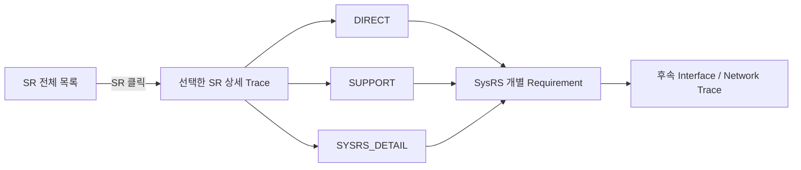

---
<a id="trace-vss-sr-index"></a>


<a id="trace-vss-s01"></a>
> 원문 구간: [VSS/04_VSS_SR_SYSRS_TRACE_NAVIGATION_DRAFT.md L62–156](https://github.com/vehicle-domain-control-system/integrated-vehicle-control/blob/1b1c4b834e4ac692f8e3eaf3e2680e4a530a2072/docs/requirements/VSS/04_VSS_SR_SYSRS_TRACE_NAVIGATION_DRAFT.md#L62-L156)

#### D.VSS.1 SR 전체 목록

특정 항목을 클릭하면 아래의 해당 **SR → SysRS 상세 추적** 위치로 이동한다.

- 추적 Reference: **49개**
- Functional SR: **25개**
- Non-functional SR: **5개**
- Boundary: **6개**
- Scope: **12개**
- Deferred: **1개**

#### D.VSS.3 기능 경계

- [`BOUNDARY` VSS/TR-SR-001](#trace-vss-tr-sr-001) — VSS는 차량 이벤트를 직접 감지하거나 해당 이벤트의 발생 조건을 판단하는 기능을 담당하지 않는다.
- [`BOUNDARY` VSS/TR-SR-002](#trace-vss-tr-sr-002) — VSS는 확정된 이벤트에 대응하는 음향을 제공해야 한다.

##### D.VSS.4.1 차량 사용 시작 및 종료

- [`FUNCTIONAL` VSS/TR-SR-003](#trace-vss-tr-sr-003) — 차량 사용 시작 상태가 확정된 경우 사용자가 인지할 수 있는 웰컴 음향이 제공되어야 한다.
- [`FUNCTIONAL` VSS/TR-SR-004](#trace-vss-tr-sr-004) — 차량 사용 종료 상태가 확정된 경우 사용자가 인지할 수 있는 굿바이 음향이 제공되어야 한다.
- [`FUNCTIONAL` VSS/TR-SR-005](#trace-vss-tr-sr-005) — 차량 사용 시작 및 종료 음향은 안전 관련 경고보다 우선해서는 안 된다.

##### D.VSS.4.2 도어 잠금 및 잠금 해제

- [`FUNCTIONAL` VSS/TR-SR-006](#trace-vss-tr-sr-006) — 도어 잠금이 정상적으로 완료된 경우 잠금 완료를 인지할 수 있는 음향이 제공되어야 한다.
- [`FUNCTIONAL` VSS/TR-SR-007](#trace-vss-tr-sr-007) — 도어 잠금 해제가 정상적으로 완료된 경우 잠금 완료 음향과 구분 가능한 음향이 제공되어야 한다.
- [`FUNCTIONAL` VSS/TR-SR-008](#trace-vss-tr-sr-008) — 도어가 정상적으로 잠기지 않은 상태가 확인된 경우 정상 잠금 완료 음향과 구분 가능한 경고가 제공되어야 한다.

##### D.VSS.5.1 파워윈도우 안티핀치

- [`FUNCTIONAL` VSS/TR-SR-009](#trace-vss-tr-sr-009) — 파워윈도우 끼임 위험이 확인된 경우 일반 피드백과 명확히 구분 가능한 긴급 경고음이 제공되어야 한다.
- [`FUNCTIONAL` VSS/TR-SR-010](#trace-vss-tr-sr-010) — 안티핀치 경고는 일반 피드백 및 주의 수준의 경고보다 우선적으로 인지되어야 한다.
- [`FUNCTIONAL` VSS/TR-SR-011](#trace-vss-tr-sr-011) — 끼임 위험 상태가 해제된 경우 해당 지속 경고음은 종료되어야 한다.

##### D.VSS.5.2 잔류 탑승자

- [`FUNCTIONAL` VSS/TR-SR-012](#trace-vss-tr-sr-012) — 차량 내부의 위험 상태에서 잔류 탑승자가 확인된 경우 사용자가 인지할 수 있는 긴급 경고음이 제공되어야 한다.
- [`FUNCTIONAL` VSS/TR-SR-013](#trace-vss-tr-sr-013) — 잔류 탑승자 위험 상태가 해제된 경우 해당 지속 경고음은 종료되어야 한다.

##### D.VSS.5.3 후방 장애물 접근 및 충돌 위험 경고

- [`FUNCTIONAL` VSS/TR-SR-014](#trace-vss-tr-sr-014) — 차량 후방의 장애물이 주의가 필요한 거리 범위에 접근한 것으로 확인된 경우 사용자가 이를 인지할 수 있는 주의 경고음이 제공되어야 한다.
- [`FUNCTIONAL` VSS/TR-SR-015](#trace-vss-tr-sr-015) — 차량 후방의 장애물이 충돌 위험이 높은 거리 범위에 접근한 것으로 확인된 경우 주의 경고음보다 명확히 구분되는 긴급 경고음이 제공되어야 한다.
- [`FUNCTIONAL` VSS/TR-SR-016](#trace-vss-tr-sr-016) — 후방 장애물의 충돌 위험 수준이 높아질수록 사용자가 위험 증가를 구분할 수 있는 음향이 제공되어야 한다.
- [`FUNCTIONAL` VSS/TR-SR-017](#trace-vss-tr-sr-017) — 후방 장애물이 경고 대상 범위를 벗어난 경우 해당 경고음은 종료되어야 한다.

#### D.VSS.6 음향 우선순위 요구사항

- [`FUNCTIONAL` VSS/TR-SR-018](#trace-vss-tr-sr-018) — 안전과 직접 관련된 긴급 경고는 주의 경고 및 일반 피드백보다 우선되어야 한다.
- [`FUNCTIONAL` VSS/TR-SR-019](#trace-vss-tr-sr-019) — 주의 경고는 일반 피드백보다 우선되어야 한다.
- [`FUNCTIONAL` VSS/TR-SR-020](#trace-vss-tr-sr-020) — 서로 다른 의미의 음향이 동시에 출력되어 사용자가 상황을 구분하기 어렵게 되어서는 안 된다.
- [`FUNCTIONAL` VSS/TR-SR-021](#trace-vss-tr-sr-021) — 높은 우선순위의 경고가 발생한 경우 낮은 우선순위 음향은 해당 경고의 인지를 방해하지 않아야 한다.
- [`FUNCTIONAL` VSS/TR-SR-022](#trace-vss-tr-sr-022) — 안전 경고가 종료된 후 이미 유효 시점을 지난 일반 피드백이 불필요하게 다시 출력되어서는 안 된다.

#### D.VSS.7 상태 및 오류 요구사항

- [`FUNCTIONAL` VSS/TR-SR-023](#trace-vss-tr-sr-023) — VSS가 정상적으로 음향을 제공할 수 있는 상태인지 상위 차량 시스템에서 확인할 수 있어야 한다.
- [`FUNCTIONAL` VSS/TR-SR-024](#trace-vss-tr-sr-024) — VSS가 정상적으로 음향을 제공할 수 없는 오류가 발생한 경우 해당 오류 상태를 상위 차량 시스템에서 확인할 수 있어야 한다.
- [`FUNCTIONAL` VSS/TR-SR-025](#trace-vss-tr-sr-025) — 지원되지 않거나 유효하지 않은 음향 요청으로 인해 잘못된 의미의 음향이 출력되어서는 안 된다.
- [`FUNCTIONAL` VSS/TR-SR-026](#trace-vss-tr-sr-026) — VSS의 오류가 다른 차량 기능의 동작을 불필요하게 중단시켜서는 안 된다.
- [`FUNCTIONAL` VSS/TR-SR-027](#trace-vss-tr-sr-027) — VSS가 오류 상태에서 정상 상태로 복구된 경우 상위 차량 시스템에서 복구 여부를 확인할 수 있어야 한다.

#### D.VSS.8 음향 품질 및 비기능 요구사항

- [`NON_FUNCTIONAL` VSS/TR-SR-028](#trace-vss-tr-sr-028) — 서로 다른 의미를 가진 주요 피드백 및 경고음은 사용자가 구분할 수 있어야 한다.
- [`NON_FUNCTIONAL` VSS/TR-SR-029](#trace-vss-tr-sr-029) — 안전 관련 경고음은 일반 피드백음과 혼동하기 어렵도록 구분되어야 한다.
- [`NON_FUNCTIONAL` VSS/TR-SR-030](#trace-vss-tr-sr-030) — 동일한 차량 이벤트는 정상 동작 상태에서 일관된 음향으로 표현되어야 한다.
- [`NON_FUNCTIONAL` VSS/TR-SR-031](#trace-vss-tr-sr-031) — VSS는 차량 사용에 필요한 시간 안에 음향 출력이 가능한 상태로 진입해야 한다.
- [`NON_FUNCTIONAL` VSS/TR-SR-032](#trace-vss-tr-sr-032) — 안전 관련 이벤트에 대한 음향은 사용자가 적절한 시점에 인지할 수 있도록 제공되어야 한다.
- [`DEFERRED` VSS/TR-SR-033](#trace-vss-tr-sr-033) — 실제 출력 수준과 평가 조건은 적용 오디오 하드웨어 및 시험 환경이 확정된 후 정의되어야 한다.

#### D.VSS.9 기능 제외 범위

- [`SCOPE` VSS/TR-SR-034](#trace-vss-tr-sr-034) — 조도 센서 값에 따른 자동 음량 변경
- [`SCOPE` VSS/TR-SR-035](#trace-vss-tr-sr-035) — 시간대 또는 주야간 상태에 따른 자동 음량 변경
- [`SCOPE` VSS/TR-SR-036](#trace-vss-tr-sr-036) — 외부 장치에서 전달되는 오디오 스트리밍
- [`SCOPE` VSS/TR-SR-037](#trace-vss-tr-sr-037) — 차량 네트워크를 통한 음원 파일 전송 및 스트리밍 재생
- [`SCOPE` VSS/TR-SR-038](#trace-vss-tr-sr-038) — 일반 음악 재생
- [`SCOPE` VSS/TR-SR-039](#trace-vss-tr-sr-039) — 플레이리스트 관리
- [`SCOPE` VSS/TR-SR-040](#trace-vss-tr-sr-040) — 곡 선택, 탐색 또는 재생 위치 이동
- [`SCOPE` VSS/TR-SR-041](#trace-vss-tr-sr-041) — 다수 음원의 동시 믹싱
- [`SCOPE` VSS/TR-SR-042](#trace-vss-tr-sr-042) — 일반 미디어 음향의 Ducking
- [`SCOPE` VSS/TR-SR-043](#trace-vss-tr-sr-043) — Fade-in 또는 Fade-out 연출
- [`SCOPE` VSS/TR-SR-044](#trace-vss-tr-sr-044) — 이퀄라이저 및 음장 효과
- [`SCOPE` VSS/TR-SR-045](#trace-vss-tr-sr-045) — VSS의 핵심 기능은 **차량 이벤트에 대응하는 저장 음향 기반의 피드백 및 경고 제공**으로 한정한다.

#### D.VSS.10 상위 시스템 연계 원칙

- [`BOUNDARY` VSS/TR-SR-046](#trace-vss-tr-sr-046) — VSS는 센서 원시 데이터를 직접 해석하지 않아야 한다.
- [`BOUNDARY` VSS/TR-SR-047](#trace-vss-tr-sr-047) — VSS에는 음향 출력에 필요한 의미가 확정된 차량 이벤트가 제공되어야 한다.
- [`BOUNDARY` VSS/TR-SR-048](#trace-vss-tr-sr-048) — VSS의 세부 음향 재생 방법은 상위 차량 기능이 직접 제어하지 않아야 한다.
- [`BOUNDARY` VSS/TR-SR-049](#trace-vss-tr-sr-049) — VSS의 상태 및 오류는 상위 차량 시스템에서 활용 가능해야 한다.

---


<a id="trace-vss-s02"></a>
> 원문 구간: [VSS/04_VSS_SR_SYSRS_TRACE_NAVIGATION_DRAFT.md L157–1442](https://github.com/vehicle-domain-control-system/integrated-vehicle-control/blob/1b1c4b834e4ac692f8e3eaf3e2680e4a530a2072/docs/requirements/VSS/04_VSS_SR_SYSRS_TRACE_NAVIGATION_DRAFT.md#L157-L1442)

> **통합 검토:** [B18](#review-b18) — 원문과 제안을 함께 읽는다. 정책·수치·안전 동작을 자동 확정하지 않았다.

#### D.VSS.2 SR → SysRS 상세 추적

<a id="trace-vss-tr-sr-001"></a>
##### VSS/TR-SR-001 · 3. 기능 경계

**분류:** `BOUNDARY`  
**Trace 상태:** `COVERED`

**SR 원문**

> VSS는 차량 이벤트를 직접 감지하거나 해당 이벤트의 발생 조건을 판단하는 기능을 담당하지 않는다.

**DIRECT**

- [VSS-SYS-INT-005](#vss-sys-int-005) — VSS 입력은 센서 Raw Data 판정이 필요 없는 의미 확정 Event/State여야 함.

**SUPPORT**

- [VSS-SYS-FUN-018](#vss-sys-fun-018) — 후방 실제 거리값으로 VSS가 위험 수준을 직접 판정하지 않음.
- [VSS-SYS-INT-004](#vss-sys-int-004) — 후방 입력은 Raw Distance가 아니라 판단 완료된 위험 상태를 사용.
- [VSS-SYS-NFR-011](#vss-sys-nfr-011) — 실제 센서 없이 의미 Event/State만으로 VSS 기능 시험 가능.

[↑ SR 전체 목록으로](#trace-vss-sr-index)

---

<a id="trace-vss-tr-sr-002"></a>
##### VSS/TR-SR-002 · 3. 기능 경계

**분류:** `BOUNDARY`  
**Trace 상태:** `COVERED`

**SR 원문**

> VSS는 확정된 이벤트에 대응하는 음향을 제공해야 한다.

**DIRECT**

- [VSS-SYS-FUN-002](#vss-sys-fun-002) — 외부에서 제공된 유효한 의미 Event/State 수용.
- [VSS-SYS-FUN-003](#vss-sys-fun-003) — 의미 Event/State를 로컬 음향 자산 및 Playback 정책에 Mapping.

**SUPPORT**

- [VSS-SYS-INT-001](#vss-sys-int-001) — One-shot Event 식별 정보 입력 필요.
- [VSS-SYS-NFR-008](#vss-sys-nfr-008) — Event/State ↔ Sound Mapping을 일관된 관리 단위로 유지.

[↑ SR 전체 목록으로](#trace-vss-sr-index)

---

<a id="trace-vss-tr-sr-003"></a>
##### VSS/TR-SR-003 · 4.1 차량 사용 시작 — Welcome

**분류:** `FUNCTIONAL`  
**Trace 상태:** `COVERED`

**SR 원문**

> 차량 사용 시작 상태가 확정된 경우 사용자가 인지할 수 있는 웰컴 음향이 제공되어야 한다.

**DIRECT**

- [VSS-SYS-FUN-028](#vss-sys-fun-028) — `VEHICLE_WELCOME`에 대한 일반 피드백 음향 출력.

**SUPPORT**

- [VSS-SYS-FUN-011](#vss-sys-fun-011) — One-shot Event의 재생·종료 공통 동작.
- [VSS-SYS-PER-002](#vss-sys-per-002) — 일반 피드백 출력 시작 지연 제한.

**SYSRS_DETAIL**

- [VSS-SYS-INT-010](#vss-sys-int-010) — STARTUP/Wake 중 발생 가능한 One-shot Event의 유실 방지 계약.
- [VSS-SYS-INT-011](#vss-sys-int-011) — 실제 Startup/Wake Delivery 방법을 후속 Power/Interface 설계에서 확정.

[↑ SR 전체 목록으로](#trace-vss-sr-index)

---

<a id="trace-vss-tr-sr-004"></a>
##### VSS/TR-SR-004 · 4.1 차량 사용 종료 — Goodbye

**분류:** `FUNCTIONAL`  
**Trace 상태:** `COVERED`

**SR 원문**

> 차량 사용 종료 상태가 확정된 경우 사용자가 인지할 수 있는 굿바이 음향이 제공되어야 한다.

**DIRECT**

- [VSS-SYS-FUN-029](#vss-sys-fun-029) — `VEHICLE_GOODBYE`에 대한 일반 피드백 음향 출력.

**SUPPORT**

- [VSS-SYS-FUN-011](#vss-sys-fun-011) — One-shot Event의 재생·종료 공통 동작.
- [VSS-SYS-PER-002](#vss-sys-per-002) — 일반 피드백 출력 시작 지연 제한.

[↑ SR 전체 목록으로](#trace-vss-sr-index)

---

<a id="trace-vss-tr-sr-005"></a>
##### VSS/TR-SR-005 · 4.1 Welcome / Goodbye의 우선순위 제한

**분류:** `FUNCTIONAL`  
**Trace 상태:** `COVERED`

**SR 원문**

> 차량 사용 시작 및 종료 음향은 안전 관련 경고보다 우선해서는 안 된다.

**DIRECT**

- [VSS-SYS-SAF-001](#vss-sys-saf-001) — Emergency > Warning / Feedback.
- [VSS-SYS-SAF-002](#vss-sys-saf-002) — Warning > Feedback.

**SUPPORT**

- [VSS-SYS-FUN-006](#vss-sys-fun-006) — Feedback / Warning / Emergency 3개 Priority Class 정의.
- [VSS-SYS-FUN-007](#vss-sys-fun-007) — Emergency의 선점 우선권.
- [VSS-SYS-FUN-008](#vss-sys-fun-008) — Warning의 Feedback 대비 우선권.

[↑ SR 전체 목록으로](#trace-vss-sr-index)

---

<a id="trace-vss-tr-sr-006"></a>
##### VSS/TR-SR-006 · 4.2 도어 잠금 완료

**분류:** `FUNCTIONAL`  
**Trace 상태:** `COVERED`

**SR 원문**

> 도어 잠금이 정상적으로 완료된 경우 잠금 완료를 인지할 수 있는 음향이 제공되어야 한다.

**DIRECT**

- [VSS-SYS-FUN-030](#vss-sys-fun-030) — `DOOR_LOCK_COMPLETE`에 대한 일반 피드백 음향 출력.

**SUPPORT**

- [VSS-SYS-FUN-011](#vss-sys-fun-011) — One-shot 재생 정책.
- [VSS-SYS-PER-002](#vss-sys-per-002) — Feedback 출력 시작 지연 제한.

**SYSRS_DETAIL**

- [VSS-SYS-INT-017](#vss-sys-int-017) — 같은 발생의 반복 전달과 새로운 발생을 구분하여 중복 재생 방지.

[↑ SR 전체 목록으로](#trace-vss-sr-index)

---

<a id="trace-vss-tr-sr-007"></a>
##### VSS/TR-SR-007 · 4.2 도어 잠금 해제

**분류:** `FUNCTIONAL`  
**Trace 상태:** `COVERED`

**SR 원문**

> 도어 잠금 해제가 정상적으로 완료된 경우 잠금 완료 음향과 구분 가능한 음향이 제공되어야 한다.

**DIRECT**

- [VSS-SYS-FUN-031](#vss-sys-fun-031) — `DOOR_UNLOCK_COMPLETE`를 Lock 완료와 구분 가능한 음향/패턴으로 출력.

**SUPPORT**

- [VSS-SYS-FUN-011](#vss-sys-fun-011) — One-shot 재생 정책.
- [VSS-SYS-PER-002](#vss-sys-per-002) — Feedback 출력 시작 지연 제한.
- [VSS-SYS-NFR-014](#vss-sys-nfr-014) — 서로 다른 의미 음향의 구분 가능성.

**SYSRS_DETAIL**

- [VSS-SYS-INT-017](#vss-sys-int-017) — One-shot occurrence 구분 및 중복 재생 방지.

[↑ SR 전체 목록으로](#trace-vss-sr-index)

---

<a id="trace-vss-tr-sr-008"></a>
##### VSS/TR-SR-008 · 4.2 도어 잠금 이상

**분류:** `FUNCTIONAL`  
**Trace 상태:** `COVERED`

**SR 원문**

> 도어가 정상적으로 잠기지 않은 상태가 확인된 경우 정상 잠금 완료 음향과 구분 가능한 경고가 제공되어야 한다.

**DIRECT**

- [VSS-SYS-FUN-032](#vss-sys-fun-032) — `DOOR_LOCK_ERROR`를 Lock 완료와 구분되는 Warning으로 출력.

**SUPPORT**

- [VSS-SYS-SAF-002](#vss-sys-saf-002) — Warning > Feedback.
- [VSS-SYS-PER-003](#vss-sys-per-003) — Warning 출력 시작 지연 제한.
- [VSS-SYS-NFR-014](#vss-sys-nfr-014) — Lock 완료와 Error 경고의 의미 구분 가능성.

**SYSRS_DETAIL**

- [VSS-SYS-INT-017](#vss-sys-int-017) — One-shot occurrence 구분 및 중복 재생 방지.

[↑ SR 전체 목록으로](#trace-vss-sr-index)

---

<a id="trace-vss-tr-sr-009"></a>
##### VSS/TR-SR-009 · 5.1 안티핀치 긴급 경고

**분류:** `FUNCTIONAL`  
**Trace 상태:** `COVERED`

**SR 원문**

> 파워윈도우 끼임 위험이 확인된 경우 일반 피드백과 명확히 구분 가능한 긴급 경고음이 제공되어야 한다.

**DIRECT**

- [VSS-SYS-FUN-033](#vss-sys-fun-033) — Anti-Pinch `ACTIVE` 동안 Emergency Playback 정책 유지.

**SUPPORT**

- [VSS-SYS-FUN-012](#vss-sys-fun-012) — Stateful Warning의 Effective State가 활성인 동안 반복/지속 정책 적용.
- [VSS-SYS-SAF-001](#vss-sys-saf-001) — Emergency 우선순위.
- [VSS-SYS-PER-004](#vss-sys-per-004) — Emergency 출력 시작 지연 제한.
- [VSS-SYS-NFR-014](#vss-sys-nfr-014) — Feedback/Warning과 구분 가능한 재생 특성.
- [VSS-SYS-INT-002](#vss-sys-int-002) — Stateful 입력의 Active/Clear 의미 구분.

**SYSRS_DETAIL**

- [VSS-SYS-FUN-035](#vss-sys-fun-035) — 상태 유지형 입력의 최신 정상 상태·수신 품질·Effective State 관리.
- [VSS-SYS-FUN-044](#vss-sys-fun-044) — 주기적 동일 `ACTIVE` 재수신을 새로운 발생으로 보아 Playback을 매번 재시작하지 않음.

[↑ SR 전체 목록으로](#trace-vss-sr-index)

---

<a id="trace-vss-tr-sr-010"></a>
##### VSS/TR-SR-010 · 5.1 안티핀치 Priority

**분류:** `FUNCTIONAL`  
**Trace 상태:** `COVERED`

**SR 원문**

> 안티핀치 경고는 일반 피드백 및 주의 수준의 경고보다 우선적으로 인지되어야 한다.

**DIRECT**

- [VSS-SYS-SAF-001](#vss-sys-saf-001) — Emergency > Warning / Feedback.

**SUPPORT**

- [VSS-SYS-FUN-007](#vss-sys-fun-007) — 현재 Warning/Feedback을 Emergency가 우선.
- [VSS-SYS-PER-005](#vss-sys-per-005) — Emergency Preemption 내부 처리 시간 제한.

[↑ SR 전체 목록으로](#trace-vss-sr-index)

---

<a id="trace-vss-tr-sr-011"></a>
##### VSS/TR-SR-011 · 5.1 안티핀치 위험 해제

**분류:** `FUNCTIONAL`  
**Trace 상태:** `COVERED`

**SR 원문**

> 끼임 위험 상태가 해제된 경우 해당 지속 경고음은 종료되어야 한다.

**DIRECT**

- [VSS-SYS-FUN-013](#vss-sys-fun-013) — Clear 수용 시 Active Request Set에서 제거·재중재 후 정해진 시간 내 종료.

**SUPPORT**

- [VSS-SYS-PER-006](#vss-sys-per-006) — Stateful Warning Clear 후 종료 지연 제한.
- [VSS-SYS-INT-002](#vss-sys-int-002) — Active와 Clear를 구분 가능한 상태로 제공받음.

**SYSRS_DETAIL**

- [VSS-SYS-FUN-036](#vss-sys-fun-036) — Clear 포함 Stateful 상태 변경 시 전체 유효 요청 재중재.
- [VSS-SYS-INT-013](#vss-sys-int-013) — 정상 상태와 `NOT_AVAILABLE/SNA`를 구분 가능하게 함.
- [VSS-SYS-INT-014](#vss-sys-int-014) — `NOT_RECEIVED/VALID/STALE/INVALID` 수신 품질 관리.
- [VSS-SYS-INT-015](#vss-sys-int-015) — SNA/STALE/INVALID 등을 `CLEAR`로 자동 해석하지 않음.
- [VSS-SYS-NFR-018](#vss-sys-nfr-018) — 입력 품질 이상을 무조건 정상 Clear로 치환하지 않는 Fail-safe 제약.
- [VSS-SYS-NFR-019](#vss-sys-nfr-019) — Last Valid / Rx Quality / Effective State를 논리적으로 분리 관리.

[↑ SR 전체 목록으로](#trace-vss-sr-index)

---

<a id="trace-vss-tr-sr-012"></a>
##### VSS/TR-SR-012 · 5.2 잔류 탑승자 긴급 경고

**분류:** `FUNCTIONAL`  
**Trace 상태:** `COVERED`

**SR 원문**

> 차량 내부의 위험 상태에서 잔류 탑승자가 확인된 경우 사용자가 인지할 수 있는 긴급 경고음이 제공되어야 한다.

**DIRECT**

- [VSS-SYS-FUN-034](#vss-sys-fun-034) — Occupant Hazard `ACTIVE` 동안 Emergency Playback 정책 유지.

**SUPPORT**

- [VSS-SYS-FUN-012](#vss-sys-fun-012) — Stateful Warning 지속 정책.
- [VSS-SYS-SAF-001](#vss-sys-saf-001) — Emergency Priority.
- [VSS-SYS-PER-004](#vss-sys-per-004) — Emergency 출력 시작 지연 제한.

**SYSRS_DETAIL**

- [VSS-SYS-FUN-035](#vss-sys-fun-035) — 최신 정상 상태·수신 품질·Effective State 관리.
- [VSS-SYS-FUN-044](#vss-sys-fun-044) — 동일 `ACTIVE` 반복 수신 시 Playback 재시작 방지.

[↑ SR 전체 목록으로](#trace-vss-sr-index)

---

<a id="trace-vss-tr-sr-013"></a>
##### VSS/TR-SR-013 · 5.2 잔류 탑승자 위험 해제

**분류:** `FUNCTIONAL`  
**Trace 상태:** `COVERED`

**SR 원문**

> 잔류 탑승자 위험 상태가 해제된 경우 해당 지속 경고음은 종료되어야 한다.

**DIRECT**

- [VSS-SYS-FUN-013](#vss-sys-fun-013) — Clear 수용 시 Active Request Set 제거·재중재 및 제한 시간 내 종료.

**SUPPORT**

- [VSS-SYS-PER-006](#vss-sys-per-006) — Clear 후 종료 지연 제한.
- [VSS-SYS-INT-002](#vss-sys-int-002) — Active/Clear 의미 구분.

**SYSRS_DETAIL**

- [VSS-SYS-FUN-036](#vss-sys-fun-036) — Stateful 상태 변경 시 Re-arbitration.
- [VSS-SYS-INT-013](#vss-sys-int-013) — SNA 표현 지원.
- [VSS-SYS-INT-014](#vss-sys-int-014) — 입력 수신 품질 상태 관리.
- [VSS-SYS-INT-015](#vss-sys-int-015) — SNA/STALE/INVALID를 Clear로 자동 해석하지 않음.
- [VSS-SYS-NFR-018](#vss-sys-nfr-018) — Fail-safe 정책 없는 Clear 치환 금지.
- [VSS-SYS-NFR-019](#vss-sys-nfr-019) — Last Valid / Quality / Effective State 분리 관리.

[↑ SR 전체 목록으로](#trace-vss-sr-index)

---

<a id="trace-vss-tr-sr-014"></a>
##### VSS/TR-SR-014 · 5.3 후방 장애물 Caution

**분류:** `FUNCTIONAL`  
**Trace 상태:** `COVERED`

**SR 원문**

> 차량 후방의 장애물이 주의가 필요한 거리 범위에 접근한 것으로 확인된 경우 사용자가 이를 인지할 수 있는 주의 경고음이 제공되어야 한다.

**DIRECT**

- [VSS-SYS-FUN-014](#vss-sys-fun-014) — Rear `CAUTION`에 대한 Warning 출력.

**SUPPORT**

- [VSS-SYS-PER-003](#vss-sys-per-003) — Warning 출력 시작 지연 제한.
- [VSS-SYS-INT-003](#vss-sys-int-003) — Rear `CAUTION/EMERGENCY/CLEAR` 상태 식별.
- [VSS-SYS-INT-004](#vss-sys-int-004) — Raw Distance가 아니라 판단 완료된 위험 상태 입력.

**SYSRS_DETAIL**

- [VSS-SYS-FUN-043](#vss-sys-fun-043) — Rear 최신 의미 상태를 상태형 정보로 유지하고 Arbitration 입력에 반영.
- [VSS-SYS-FUN-044](#vss-sys-fun-044) — 동일 상태 주기 수신에 따른 Playback Restart 방지.

[↑ SR 전체 목록으로](#trace-vss-sr-index)

---

<a id="trace-vss-tr-sr-015"></a>
##### VSS/TR-SR-015 · 5.3 후방 장애물 Emergency

**분류:** `FUNCTIONAL`  
**Trace 상태:** `COVERED`

**SR 원문**

> 차량 후방의 장애물이 충돌 위험이 높은 거리 범위에 접근한 것으로 확인된 경우 주의 경고음보다 명확히 구분되는 긴급 경고음이 제공되어야 한다.

**DIRECT**

- [VSS-SYS-FUN-015](#vss-sys-fun-015) — Rear `EMERGENCY`에 대해 Caution과 구분되는 Emergency 출력.

**SUPPORT**

- [VSS-SYS-PER-004](#vss-sys-per-004) — Emergency 출력 시작 지연 제한.
- [VSS-SYS-INT-003](#vss-sys-int-003) — Rear 3단계 의미 상태 입력.
- [VSS-SYS-SAF-003](#vss-sys-saf-003) — Rear Emergency > Rear Caution.
- [VSS-SYS-NFR-014](#vss-sys-nfr-014) — Caution과 Emergency를 구분 가능한 재생 특성.

**SYSRS_DETAIL**

- [VSS-SYS-FUN-043](#vss-sys-fun-043) — Rear State를 상태형 Arbitration 입력으로 관리.

[↑ SR 전체 목록으로](#trace-vss-sr-index)

---

<a id="trace-vss-tr-sr-016"></a>
##### VSS/TR-SR-016 · 5.3 후방 위험 수준 변화

**분류:** `FUNCTIONAL`  
**Trace 상태:** `COVERED`

**SR 원문**

> 후방 장애물의 충돌 위험 수준이 높아질수록 사용자가 위험 증가를 구분할 수 있는 음향이 제공되어야 한다.

**DIRECT**

- [VSS-SYS-FUN-016](#vss-sys-fun-016) — `CAUTION → EMERGENCY` 변경 시 재중재 후 Emergency 우선 출력.
- [VSS-SYS-SAF-003](#vss-sys-saf-003) — Rear Emergency를 Rear Caution보다 높은 우선순위로 처리.

**SUPPORT**

- [VSS-SYS-PER-007](#vss-sys-per-007) — `CAUTION → EMERGENCY` 전환 시간 제한.
- [VSS-SYS-NFR-014](#vss-sys-nfr-014) — 위험 단계별 음향 구분 가능성.
- [VSS-SYS-FUN-043](#vss-sys-fun-043) — Rear State 변경을 Arbitration 입력에 반영.

**SYSRS_DETAIL**

- [VSS-SYS-FUN-042](#vss-sys-fun-042) — 반대 방향인 `EMERGENCY → CAUTION` 하향 변경도 명시적으로 재중재.
- [VSS-SYS-PER-010](#vss-sys-per-010) — `EMERGENCY → CAUTION` 하향 전환 시간 제한.

> 해석 메모: SR은 “위험 수준 증가를 구분”하도록 요구하며, SysRS Baseline은 현재 Rear 상태를 `CLEAR / CAUTION / EMERGENCY` 3상태로 구체화한다. 거리 단계의 추가 세분화는 현재 Baseline에 포함하지 않는다.

[↑ SR 전체 목록으로](#trace-vss-sr-index)

---

<a id="trace-vss-tr-sr-017"></a>
##### VSS/TR-SR-017 · 5.3 후방 위험 해제

**분류:** `FUNCTIONAL`  
**Trace 상태:** `COVERED`

**SR 원문**

> 후방 장애물이 경고 대상 범위를 벗어난 경우 해당 경고음은 종료되어야 한다.

**DIRECT**

- [VSS-SYS-FUN-017](#vss-sys-fun-017) — Rear `CLEAR` 수용 시 Active Request Set에서 제거 후 재중재.

**SUPPORT**

- [VSS-SYS-PER-006](#vss-sys-per-006) — Clear 후 경고 종료 지연 제한.
- [VSS-SYS-INT-003](#vss-sys-int-003) — Rear Clear 상태 식별.
- [VSS-SYS-FUN-043](#vss-sys-fun-043) — Rear 최신 상태 유지 및 변경 반영.

**SYSRS_DETAIL**

- [VSS-SYS-INT-013](#vss-sys-int-013) — Rear 등 Stateful 입력의 SNA 표현 지원.
- [VSS-SYS-INT-014](#vss-sys-int-014) — 수신 품질 상태 구분.
- [VSS-SYS-INT-015](#vss-sys-int-015) — Stale/Invalid/SNA를 Clear로 자동 간주하지 않음.
- [VSS-SYS-NFR-018](#vss-sys-nfr-018) — Fail-safe 정의 없이 Clear 치환 금지.
- [VSS-SYS-NFR-019](#vss-sys-nfr-019) — Last Valid / Quality / Effective State 분리.

[↑ SR 전체 목록으로](#trace-vss-sr-index)

---

<a id="trace-vss-tr-sr-018"></a>
##### VSS/TR-SR-018 · 6. Emergency Priority

**분류:** `FUNCTIONAL`  
**Trace 상태:** `COVERED`

**SR 원문**

> 안전과 직접 관련된 긴급 경고는 주의 경고 및 일반 피드백보다 우선되어야 한다.

**DIRECT**

- [VSS-SYS-SAF-001](#vss-sys-saf-001) — Emergency > Warning / Feedback.

**SUPPORT**

- [VSS-SYS-FUN-006](#vss-sys-fun-006) — 3개 Priority Class 구분.
- [VSS-SYS-FUN-007](#vss-sys-fun-007) — Emergency가 현재 Warning/Feedback보다 우선.
- [VSS-SYS-NFR-006](#vss-sys-nfr-006) — 동시 요청을 명시된 Priority 정책으로 결정.

[↑ SR 전체 목록으로](#trace-vss-sr-index)

---

<a id="trace-vss-tr-sr-019"></a>
##### VSS/TR-SR-019 · 6. Warning Priority

**분류:** `FUNCTIONAL`  
**Trace 상태:** `COVERED`

**SR 원문**

> 주의 경고는 일반 피드백보다 우선되어야 한다.

**DIRECT**

- [VSS-SYS-SAF-002](#vss-sys-saf-002) — Warning > Feedback.

**SUPPORT**

- [VSS-SYS-FUN-006](#vss-sys-fun-006) — Priority Class 정의.
- [VSS-SYS-FUN-008](#vss-sys-fun-008) — Warning이 현재 Feedback보다 우선.
- [VSS-SYS-NFR-006](#vss-sys-nfr-006) — 동시 요청 결정의 Priority 정책.

[↑ SR 전체 목록으로](#trace-vss-sr-index)

---

<a id="trace-vss-tr-sr-020"></a>
##### VSS/TR-SR-020 · 6. 동시에 여러 의미의 음향 출력 금지

**분류:** `FUNCTIONAL`  
**Trace 상태:** `COVERED`

**SR 원문**

> 서로 다른 의미의 음향이 동시에 출력되어 사용자가 상황을 구분하기 어렵게 되어서는 안 된다.

**DIRECT**

- [VSS-SYS-FUN-005](#vss-sys-fun-005) — 한 시점에 하나의 Playback Session만 Winner로 선택.

**SUPPORT**

- [VSS-SYS-NFR-007](#vss-sys-nfr-007) — 활성 Playback Winner는 1개 이하.
- [VSS-SYS-NFR-014](#vss-sys-nfr-014) — 서로 다른 의미 음향의 구분 가능한 재생 특성.
- [VSS-SYS-NFR-006](#vss-sys-nfr-006) — 여러 요청이 동시에 유효할 때 Priority 정책에 따라 Winner 결정.

**SYSRS_DETAIL**

- [VSS-SYS-NFR-015](#vss-sys-nfr-015) — 동일 Priority Class 내부에서도 하나의 Winner를 결정하는 Sub-priority/동등 규칙 필요.
- [VSS-SYS-NFR-016](#vss-sys-nfr-016) — 동일 요청 집합에서는 수신 순서와 무관한 결정적 Arbitration 결과 요구.
- [VSS-SYS-NFR-017](#vss-sys-nfr-017) — Same-Class Arbitration 규칙을 일관된 관리 단위에서 유지.
- [VSS-SYS-FUN-038](#vss-sys-fun-038) — cue 사이 무음까지 포함한 Playback Session 전체를 하나의 활성 세션으로 취급.

[↑ SR 전체 목록으로](#trace-vss-sr-index)

---

<a id="trace-vss-tr-sr-021"></a>
##### VSS/TR-SR-021 · 6. 높은 Priority 경고의 인지 방해 금지

**분류:** `FUNCTIONAL`  
**Trace 상태:** `COVERED`

**SR 원문**

> 높은 우선순위의 경고가 발생한 경우 낮은 우선순위 음향은 해당 경고의 인지를 방해하지 않아야 한다.

**DIRECT**

- [VSS-SYS-FUN-007](#vss-sys-fun-007) — Emergency가 Warning/Feedback보다 우선.
- [VSS-SYS-FUN-008](#vss-sys-fun-008) — Warning이 Feedback보다 우선.

**SUPPORT**

- [VSS-SYS-FUN-009](#vss-sys-fun-009) — 낮은 Priority 신규 요청은 현재 높은 Priority Session을 중단하지 않음.
- [VSS-SYS-SAF-001](#vss-sys-saf-001) — Emergency Priority 규칙.
- [VSS-SYS-SAF-002](#vss-sys-saf-002) — Warning Priority 규칙.
- [VSS-SYS-PER-005](#vss-sys-per-005) — Emergency Preemption 처리 시간 제한.
- [VSS-SYS-NFR-006](#vss-sys-nfr-006) — 동시 요청 Arbitration.

**SYSRS_DETAIL**

- [VSS-SYS-FUN-036](#vss-sys-fun-036) — 상태 변경·Session 종료·선점 조건 변경 시 Re-arbitration.
- [VSS-SYS-FUN-037](#vss-sys-fun-037) — 선점된 Stateful Warning/Emergency가 여전히 유효하면 재중재 결과에 따라 재활성화.

[↑ SR 전체 목록으로](#trace-vss-sr-index)

---

<a id="trace-vss-tr-sr-022"></a>
##### VSS/TR-SR-022 · 6. 유효 시점이 지난 일반 피드백의 재생 금지

**분류:** `FUNCTIONAL`  
**Trace 상태:** `COVERED`

**SR 원문**

> 안전 경고가 종료된 후 이미 유효 시점을 지난 일반 피드백이 불필요하게 다시 출력되어서는 안 된다.

**DIRECT**

- [VSS-SYS-FUN-010](#vss-sys-fun-010) — 이미 재생 중이었다가 선점된 One-shot Feedback은 자동 Resume하지 않음.
- [VSS-SYS-FUN-040](#vss-sys-fun-040) — 재생 시작 전 대기하던 One-shot이 Max Age를 넘으면 폐기하고 이후 자동 재생 금지.

**SUPPORT**

- [VSS-SYS-FUN-039](#vss-sys-fun-039) — One-shot Event의 의미 유효 수명(Max Age) 관리.
- [VSS-SYS-FUN-041](#vss-sys-fun-041) — “재생 시작 전 대기”와 “재생 후 선점”의 처리 규칙을 분리.
- [VSS-SYS-INT-012](#vss-sys-int-012) — Startup/Wake/통신 복구 뒤 Max Age 초과 One-shot의 신규 재생/재전달 금지.

> 이 항목은 기존 Trace보다 범위를 넓혔다. 현재 SysRS는 “이미 재생 중 선점된 One-shot”뿐 아니라 “아직 시작하지 못한 채 대기하다 유효기간을 넘긴 One-shot”도 명시적으로 처리한다.

[↑ SR 전체 목록으로](#trace-vss-sr-index)

---

---

<a id="trace-vss-tr-sr-023"></a>
##### VSS/TR-SR-023 · 7. 정상 음향 제공 상태 확인

**분류:** `FUNCTIONAL`  
**Trace 상태:** `COVERED`

**SR 원문**

> VSS가 정상적으로 음향을 제공할 수 있는 상태인지 상위 차량 시스템에서 확인할 수 있어야 한다.

**DIRECT**

- [VSS-SYS-FUN-021](#vss-sys-fun-021) — 현재 동작 상태, 서비스 제공 가능 수준 및 오류 존재 여부를 외부가 확인 가능하도록 함.
- [VSS-SYS-INT-006](#vss-sys-int-006) — `READY`뿐 아니라 입력 수용 가능한 `PLAYING`을 포함하여 Event/State 수용 가능 여부를 외부가 확인 가능하도록 함.
- [VSS-SYS-INT-007](#vss-sys-int-007) — 정상/오류 상태와 정상 음향 서비스 제공 가능 수준을 외부가 확인 가능하도록 함.

**SUPPORT**

- [VSS-SYS-PER-008](#vss-sys-per-008) — 내부 상태 변경 후 외부 제공 상태 정보가 갱신 가능해질 때까지의 지연 제한.

**SYSRS_DETAIL**

- [VSS-SYS-DIA-016](#vss-sys-dia-016) — 일부 기능 제한과 전체 출력 불능을 서비스 Availability로 구분.

[↑ SR 전체 목록으로](#trace-vss-sr-index)

---

<a id="trace-vss-tr-sr-024"></a>
##### VSS/TR-SR-024 · 7. 출력 불능 오류 상태 확인

**분류:** `FUNCTIONAL`  
**Trace 상태:** `COVERED`

**SR 원문**

> VSS가 정상적으로 음향을 제공할 수 없는 오류가 발생한 경우 해당 오류 상태를 상위 차량 시스템에서 확인할 수 있어야 한다.

**DIRECT**

- [VSS-SYS-SAF-006](#vss-sys-saf-006) — 정상 음향 출력을 보장할 수 없는 상태를 외부에서 식별 가능하게 함.
- [VSS-SYS-INT-007](#vss-sys-int-007) — 오류 상태와 서비스 제공 가능 수준을 외부가 확인 가능하도록 함.
- [VSS-SYS-FUN-021](#vss-sys-fun-021) — 동작 상태·서비스 수준·오류 존재 여부를 외부 제공 정보로 관리.

**SUPPORT**

- [VSS-SYS-DIA-001](#vss-sys-dia-001) — 정상 음향 출력을 방해하는 Internal Output Fault 검출.
- [VSS-SYS-DIA-005](#vss-sys-dia-005) — 복구 실패 시 `FAULT` 유지 및 오류 상태 외부 제공.
- [VSS-SYS-DIA-014](#vss-sys-dia-014) — 현재 Active Fault와 최근 주요 Fault 원인을 구분 관리.
- [VSS-SYS-DIA-016](#vss-sys-dia-016) — `DEGRADED`와 `UNAVAILABLE`을 구분하는 Availability 모델.
- [VSS-SYS-PER-008](#vss-sys-per-008) — 상태 변경 후 외부 제공 상태 갱신 지연 제한.

**SYSRS_DETAIL**

- [VSS-SYS-DIA-012](#vss-sys-dia-012) — 외부 입력 이상과 VSS 내부 Output Fault를 서로 다른 진단 상태로 관리.
- [VSS-SYS-DIA-013](#vss-sys-dia-013) — 입력 품질 이상만으로 내부 Output Fault라고 잘못 보고하지 않음.

**추가 역추적 보강**

- [VSS-SYS-DIA-002](#vss-sys-dia-002) — 최근 주요 Internal Output Fault 원인을 식별 가능하게 유지하여 상위 오류 상태 해석의 근거를 보존. `SUPPORT`
- [VSS-SYS-DIA-008](#vss-sys-dia-008) — `READY` 중 Output-critical Fault 검출 시 `FAULT` 전이. `SYSRS_DETAIL`
- [VSS-SYS-DIA-009](#vss-sys-dia-009) — `PLAYING` 중 복구 불가능 Output Fault 검출 시 `FAULT` 전이. `SYSRS_DETAIL`
- [VSS-SYS-DIA-018](#vss-sys-dia-018) — 다중 Internal Output Fault가 존재할 때 각 Active Fault를 내부적으로 손실 없이 유지. `SYSRS_DETAIL`

[↑ SR 전체 목록으로](#trace-vss-sr-index)

---

<a id="trace-vss-tr-sr-025"></a>
##### VSS/TR-SR-025 · 7. 유효하지 않은 요청의 잘못된 음향 방지

**분류:** `FUNCTIONAL`  
**Trace 상태:** `COVERED`

**SR 원문**

> 지원되지 않거나 유효하지 않은 음향 요청으로 인해 잘못된 의미의 음향이 출력되어서는 안 된다.

**DIRECT**

- [VSS-SYS-FUN-019](#vss-sys-fun-019) — 지원하지 않거나 유효하지 않은 의미 입력에 대해 임의 음향을 출력하지 않음.
- [VSS-SYS-SAF-004](#vss-sys-saf-004) — 유효하지 않은 의미 입력으로 잘못된 의미의 음향이 출력되는 것을 금지.
- [VSS-SYS-DIA-006](#vss-sys-dia-006) — 유효하지 않은 의미 입력을 잘못된 음향 출력 없이 Input Diagnostic으로 처리.

**SUPPORT**

- [VSS-SYS-NFR-001](#vss-sys-nfr-001) — Invalid 입력이 VSS ECU 전체 비정상 종료를 유발하지 않도록 함.
- [VSS-SYS-NFR-013](#vss-sys-nfr-013) — Invalid 입력 조건을 시험 가능하게 함.

**SYSRS_DETAIL**

- [VSS-SYS-DIA-012](#vss-sys-dia-012) — Invalid Input Diagnostic과 Internal Output Fault를 분리.
- [VSS-SYS-DIA-013](#vss-sys-dia-013) — `INVALID_EVENT`만으로 내부 Fault가 존재한다고 보고하지 않음.

> `SOUND_ASSET_UNAVAILABLE`은 "유효하지 않은 요청"과 원인이 다르므로 본 Trace의 직접 파생으로 섞지 않는다. Asset 사용 불가 시 잘못된 대체 음향 금지는 별도 SysRS Fault 정책으로 관리한다.

[↑ SR 전체 목록으로](#trace-vss-sr-index)

---

<a id="trace-vss-tr-sr-026"></a>
##### VSS/TR-SR-026 · 7. 다른 차량 기능과의 오류 격리

**분류:** `FUNCTIONAL`  
**Trace 상태:** `COVERED`

**SR 원문**

> VSS의 오류가 다른 차량 기능의 동작을 불필요하게 중단시켜서는 안 된다.

**DIRECT**

- [VSS-SYS-SAF-005](#vss-sys-saf-005) — VSS 오류가 파워윈도우·공조·조명·센싱 등 다른 기능의 제어 상태를 직접 변경하지 않음.
- [VSS-SYS-NFR-004](#vss-sys-nfr-004) — VSS 관련 오류를 다른 차량 기능과 기능적으로 격리.

[↑ SR 전체 목록으로](#trace-vss-sr-index)

---

<a id="trace-vss-tr-sr-027"></a>
##### VSS/TR-SR-027 · 7. 오류 복구 여부 확인

**분류:** `FUNCTIONAL`  
**Trace 상태:** `COVERED`

**SR 원문**

> VSS가 오류 상태에서 정상 상태로 복구된 경우 상위 차량 시스템에서 복구 여부를 확인할 수 있어야 한다.

**DIRECT**

- [VSS-SYS-INT-009](#vss-sys-int-009) — 오류 복구 후 외부 시스템이 정상 복귀 여부를 확인 가능하도록 함.
- [VSS-SYS-DIA-004](#vss-sys-dia-004) — 복구 가능한 출력 오류에서 전체 차량 재시작 없이 정상 상태 복귀 가능.

**SUPPORT**

- [VSS-SYS-DIA-005](#vss-sys-dia-005) — 복구 실패 시 `FAULT`와 오류 상태 유지.
- [VSS-SYS-DIA-011](#vss-sys-dia-011) — 복구 성공 후 `READY` 복귀 및 현재 유효 요청 재평가.
- [VSS-SYS-DIA-015](#vss-sys-dia-015) — 복구 시 Active Fault 해제와 최근 Fault 이력 유지 규칙.
- [VSS-SYS-PER-009](#vss-sys-per-009) — 복구 가능한 오류를 제한 시간 내 정상 또는 명확한 실패 상태로 결정.
- [VSS-SYS-PER-008](#vss-sys-per-008) — 외부 제공 상태 갱신 지연 제한.

**SYSRS_DETAIL**

- [VSS-SYS-DIA-010](#vss-sys-dia-010) — 복구 중인데 신규 일반 피드백을 정상 출력 가능한 상태로 외부에 잘못 보고하지 않음.

**추가 역추적 보강**

- [VSS-SYS-DIA-017](#vss-sys-dia-017) — Fault별 Recoverable/Unrecoverable 분류와 Recovery Action을 정의하여 복구 가능 여부를 결정. `SYSRS_DETAIL`

[↑ SR 전체 목록으로](#trace-vss-sr-index)

---

<a id="trace-vss-tr-sr-028"></a>
##### VSS/TR-SR-028 · 8. 주요 음향의 의미 구분 가능성

**분류:** `NON_FUNCTIONAL`  
**Trace 상태:** `COVERED`

**SR 원문**

> 서로 다른 의미를 가진 주요 피드백 및 경고음은 사용자가 구분할 수 있어야 한다.

**DIRECT**

- [VSS-SYS-NFR-014](#vss-sys-nfr-014) — 서로 다른 의미의 주요 피드백/경고에 구분 가능한 재생 특성을 요구.

**SUPPORT**

- [VSS-SYS-FUN-003](#vss-sys-fun-003) — 의미 Event/State별 로컬 Sound/Playback Policy Mapping.
- [VSS-SYS-FUN-004](#vss-sys-fun-004) — 동일 의미에는 일관된 음향 정책 적용.
- [VSS-SYS-NFR-008](#vss-sys-nfr-008) — Event/State ↔ Sound Asset 관계를 일관된 관리 단위로 유지.
- [VSS-SYS-NFR-012](#vss-sys-nfr-012) — 의미 Event/State별 대응 음향과 Priority를 독립 검증 가능하게 함.

[↑ SR 전체 목록으로](#trace-vss-sr-index)

---

<a id="trace-vss-tr-sr-029"></a>
##### VSS/TR-SR-029 · 8. 안전 경고와 일반 피드백의 음향 구분

**분류:** `NON_FUNCTIONAL`  
**Trace 상태:** `COVERED`

**SR 원문**

> 안전 관련 경고음은 일반 피드백음과 혼동하기 어렵도록 구분되어야 한다.

**DIRECT**

- [VSS-SYS-NFR-014](#vss-sys-nfr-014) — 주요 피드백/경고에 사용자 구분 가능한 재생 특성을 요구.

**SUPPORT**

- [VSS-SYS-FUN-006](#vss-sys-fun-006) — Feedback / Warning / Emergency Priority Class 구분.
- [VSS-SYS-SAF-001](#vss-sys-saf-001) — Emergency를 Warning/Feedback보다 우선 처리.
- [VSS-SYS-SAF-002](#vss-sys-saf-002) — Warning을 Feedback보다 우선 처리.
- [VSS-SYS-NFR-012](#vss-sys-nfr-012) — 음향·Priority 정책을 의미별 독립 검증 가능하게 함.

> Priority 구분 자체가 곧 음색/패턴 구분을 의미하는 것은 아니다. 사용자가 실제 의미 차이를 구분해야 한다는 직접 근거는 NFR-014가 담당한다.

[↑ SR 전체 목록으로](#trace-vss-sr-index)

---

<a id="trace-vss-tr-sr-030"></a>
##### VSS/TR-SR-030 · 8. 동일 Event의 일관된 음향 표현

**분류:** `NON_FUNCTIONAL`  
**Trace 상태:** `COVERED`

**SR 원문**

> 동일한 차량 이벤트는 정상 동작 상태에서 일관된 음향으로 표현되어야 한다.

**DIRECT**

- [VSS-SYS-FUN-004](#vss-sys-fun-004) — 동일 의미 Event/State에 정상 상태에서 동일 음향 정책 적용.

**SUPPORT**

- [VSS-SYS-NFR-005](#vss-sys-nfr-005) — 동일 초기 상태와 동일 유효 요청 집합에서 동일 Priority/Playback Policy 적용.
- [VSS-SYS-NFR-008](#vss-sys-nfr-008) — Sound Mapping을 일관된 관리 단위로 유지.

**SYSRS_DETAIL**

- [VSS-SYS-FUN-020](#vss-sys-fun-020) — 필요한 Asset이 없을 때 다른 의미의 음향으로 임의 대체하지 않아 Event 의미 일관성을 보존.
- [VSS-SYS-DIA-007](#vss-sys-dia-007) — Sound Asset unavailable 상태에서도 잘못된 대체 음향 출력을 금지.
- [VSS-SYS-NFR-002](#vss-sys-nfr-002) — 반복되는 동일 Event/State 입력이 재생 상태 누적·교착을 유발하지 않도록 하여 동일 Event의 표현을 안정적으로 유지.

[↑ SR 전체 목록으로](#trace-vss-sr-index)

---

<a id="trace-vss-tr-sr-031"></a>
##### VSS/TR-SR-031 · 8. 차량 사용에 필요한 시간 내 기동

**분류:** `NON_FUNCTIONAL`  
**Trace 상태:** `COVERED`

**SR 원문**

> VSS는 차량 사용에 필요한 시간 안에 음향 출력이 가능한 상태로 진입해야 한다.

**DIRECT**

- [VSS-SYS-PER-001](#vss-sys-per-001) — 전원 인가 후 `READY` 또는 `FAULT` 확정 시간 제한.
- [VSS-SYS-FUN-001](#vss-sys-fun-001) — 정상 초기화 후 `READY` 전이.

**SUPPORT**

- [VSS-SYS-DIA-003](#vss-sys-dia-003) — 초기화 실패 시 `FAULT` 전이.
- [VSS-SYS-NFR-003](#vss-sys-nfr-003) — 정상 처리 과정에서 무한 대기 금지.

**SYSRS_DETAIL**

- [VSS-SYS-INT-010](#vss-sys-int-010) — STARTUP/Wake 구간 One-shot Event가 의미 유효기간 내 유실되지 않도록 Delivery Contract 요구.
- [VSS-SYS-INT-011](#vss-sys-int-011) — 실제 Startup/Wake Delivery 방법을 Power/Interface 단계에서 확정.

> INT-010/011은 기동 시간 자체의 직접 요구가 아니라, 기동 구간과 Event 발생이 겹칠 때 SR 기능을 잃지 않기 위해 SysRS 단계에서 추가된 상세 계약이다.

[↑ SR 전체 목록으로](#trace-vss-sr-index)

---

<a id="trace-vss-tr-sr-032"></a>
##### VSS/TR-SR-032 · 8. 안전 관련 음향의 적시 제공

**분류:** `NON_FUNCTIONAL`  
**Trace 상태:** `COVERED`

**SR 원문**

> 안전 관련 이벤트에 대한 음향은 사용자가 적절한 시점에 인지할 수 있도록 제공되어야 한다.

**DIRECT**

- [VSS-SYS-PER-003](#vss-sys-per-003) — Warning 요청 수용 후 출력 시작 지연 제한.
- [VSS-SYS-PER-004](#vss-sys-per-004) — Emergency 요청 수용 후 출력 시작 지연 제한.
- [VSS-SYS-PER-005](#vss-sys-per-005) — Emergency가 낮은 Priority Session을 선점하는 내부 처리 시간 제한.
- [VSS-SYS-PER-007](#vss-sys-per-007) — Rear `CAUTION -> EMERGENCY` 전환 시간 제한.

**SUPPORT**

- [VSS-SYS-NFR-003](#vss-sys-nfr-003) — 정상 Event/State 처리 중 무한 대기 금지.
- [VSS-SYS-PER-010](#vss-sys-per-010) — Rear `EMERGENCY -> CAUTION` 하향 전환 시간 제한.

> 현재 PER 요구사항은 **VSS 내부에서 의미 정보가 유효하게 수용된 이후**의 시간이다. Sensor/Domain/Network를 포함한 E2E latency는 후속 System/Network 단계의 별도 예산으로 남는다.

[↑ SR 전체 목록으로](#trace-vss-sr-index)

---

<a id="trace-vss-tr-sr-033"></a>
##### VSS/TR-SR-033 · 8. 실제 출력 수준 및 평가 조건

**분류:** `DEFERRED`  
**Trace 상태:** `DEFERRED`

**SR 원문**

> 실제 출력 수준과 평가 조건은 적용 오디오 하드웨어 및 시험 환경이 확정된 후 정의되어야 한다.

**DIRECT**

- 현재 공식 SysRS ID 없음 — 실제 Audio Codec / Amplifier / Speaker, 장착 위치, Target listening position 및 시험 환경 확정 후 정량 요구사항으로 파생한다.

**현재 SysRS에서의 관련 Candidate**

- Feedback / Warning / Emergency 상대 Setpoint `60 / 80 / 100 %`는 내부 벤치 검증용 Candidate이며 실제 음압(dBA) 요구사항이 아니다.
- 따라서 위 Candidate를 본 SR의 완료 근거로 간주하지 않는다.

[↑ SR 전체 목록으로](#trace-vss-sr-index)

---

<a id="trace-vss-tr-sr-034"></a>
##### VSS/TR-SR-034 · 9. 조도 기반 자동 음량 변경 제외

**분류:** `SCOPE`  
**Trace 상태:** `COVERED`

**SR 원문**

> 조도 센서 값에 따른 자동 음량 변경

**DIRECT**

- [VSS-SYS-FUN-022](#vss-sys-fun-022) — 조도 변화만으로 자동 음량을 변경하지 않음.

[↑ SR 전체 목록으로](#trace-vss-sr-index)

---

<a id="trace-vss-tr-sr-035"></a>
##### VSS/TR-SR-035 · 9. 시간대/주야간 자동 음량 변경 제외

**분류:** `SCOPE`  
**Trace 상태:** `COVERED`

**SR 원문**

> 시간대 또는 주야간 상태에 따른 자동 음량 변경

**DIRECT**

- [VSS-SYS-FUN-023](#vss-sys-fun-023) — 시간대 또는 주야간 정보만으로 자동 음량을 변경하지 않음.

[↑ SR 전체 목록으로](#trace-vss-sr-index)

---

<a id="trace-vss-tr-sr-036"></a>
##### VSS/TR-SR-036 · 9. 외부 오디오 스트리밍 제외

**분류:** `SCOPE`  
**Trace 상태:** `COVERED`

**SR 원문**

> 외부 장치에서 전달되는 오디오 스트리밍

**DIRECT**

- [VSS-SYS-FUN-024](#vss-sys-fun-024) — 외부 오디오 스트림에 의존하지 않고 핵심 VSS 음향을 제공.

[↑ SR 전체 목록으로](#trace-vss-sr-index)

---

<a id="trace-vss-tr-sr-037"></a>
##### VSS/TR-SR-037 · 9. 차량 네트워크 음원 파일 전송/스트리밍 제외

**분류:** `SCOPE`  
**Trace 상태:** `COVERED`

**SR 원문**

> 차량 네트워크를 통한 음원 파일 전송 및 스트리밍 재생

**DIRECT**

- [VSS-SYS-FUN-024](#vss-sys-fun-024) — 외부 스트림 의존 없이 로컬 저장 음향으로 핵심 기능 제공.

> 현재 SysRS는 "네트워크를 통한 파일 전송"을 별도 기능 ID로 세분화하지 않고 스트리밍 비의존성 요구로 묶어 관리한다. SR의 Scope 제외 의미에는 충분하지만, 향후 파일 업데이트 기능이 범위에 들어오면 별도 요구로 분리해야 한다.

[↑ SR 전체 목록으로](#trace-vss-sr-index)

---

<a id="trace-vss-tr-sr-038"></a>
##### VSS/TR-SR-038 · 9. 일반 음악 재생 제외

**분류:** `SCOPE`  
**Trace 상태:** `SCOPE_ONLY`

**SR 원문**

> 일반 음악 재생

**DIRECT**

- 없음 — SR에서 구현 제외 범위를 확정하는 것으로 종결한다.

[↑ SR 전체 목록으로](#trace-vss-sr-index)

---

<a id="trace-vss-tr-sr-039"></a>
##### VSS/TR-SR-039 · 9. 플레이리스트 관리 제외

**분류:** `SCOPE`  
**Trace 상태:** `SCOPE_ONLY`

**SR 원문**

> 플레이리스트 관리

**DIRECT**

- 없음 — SR에서 구현 제외 범위를 확정하는 것으로 종결한다.

[↑ SR 전체 목록으로](#trace-vss-sr-index)

---

<a id="trace-vss-tr-sr-040"></a>
##### VSS/TR-SR-040 · 9. 곡 선택/탐색/재생 위치 이동 제외

**분류:** `SCOPE`  
**Trace 상태:** `SCOPE_ONLY`

**SR 원문**

> 곡 선택, 탐색 또는 재생 위치 이동

**DIRECT**

- 없음 — SR에서 구현 제외 범위를 확정하는 것으로 종결한다.

[↑ SR 전체 목록으로](#trace-vss-sr-index)

---

<a id="trace-vss-tr-sr-041"></a>
##### VSS/TR-SR-041 · 9. 다수 음원 동시 Mixing 제외

**분류:** `SCOPE`  
**Trace 상태:** `COVERED`

**SR 원문**

> 다수 음원의 동시 믹싱

**DIRECT**

- [VSS-SYS-FUN-025](#vss-sys-fun-025) — 다수 음원의 동시 Mixing을 수행하지 않음.

**SUPPORT**

- [VSS-SYS-FUN-005](#vss-sys-fun-005) — 한 시점에 하나의 Playback Session만 활성 출력 Winner로 선택.
- [VSS-SYS-NFR-007](#vss-sys-nfr-007) — 활성 Playback Winner는 1개를 초과하지 않음.

[↑ SR 전체 목록으로](#trace-vss-sr-index)

---

<a id="trace-vss-tr-sr-042"></a>
##### VSS/TR-SR-042 · 9. 일반 미디어 Ducking 제외

**분류:** `SCOPE`  
**Trace 상태:** `COVERED`

**SR 원문**

> 일반 미디어 음향의 Ducking

**DIRECT**

- [VSS-SYS-FUN-026](#vss-sys-fun-026) — 일반 미디어 Ducking을 핵심 기능에 포함하지 않음.

[↑ SR 전체 목록으로](#trace-vss-sr-index)

---

<a id="trace-vss-tr-sr-043"></a>
##### VSS/TR-SR-043 · 9. Fade-in/Fade-out 연출 제외

**분류:** `SCOPE`  
**Trace 상태:** `COVERED`

**SR 원문**

> Fade-in 또는 Fade-out 연출

**DIRECT**

- [VSS-SYS-FUN-027](#vss-sys-fun-027) — Fade-in/Fade-out 연출을 핵심 기능에 포함하지 않음.

[↑ SR 전체 목록으로](#trace-vss-sr-index)

---

<a id="trace-vss-tr-sr-044"></a>
##### VSS/TR-SR-044 · 9. EQ/음장 효과 제외

**분류:** `SCOPE`  
**Trace 상태:** `SCOPE_ONLY`

**SR 원문**

> 이퀄라이저 및 음장 효과

**DIRECT**

- 없음 — SR에서 구현 제외 범위를 확정하는 것으로 종결한다.

[↑ SR 전체 목록으로](#trace-vss-sr-index)

---

<a id="trace-vss-tr-sr-045"></a>
##### VSS/TR-SR-045 · 9. 저장 음향 기반 핵심 범위

**분류:** `SCOPE`  
**Trace 상태:** `COVERED`

**SR 원문**

> VSS의 핵심 기능은 **차량 이벤트에 대응하는 저장 음향 기반의 피드백 및 경고 제공**으로 한정한다.

**DIRECT**

- [VSS-SYS-FUN-003](#vss-sys-fun-003) — 의미 Event/State를 사전 정의된 로컬 음향 자산 및 재생 정책과 Mapping.
- [VSS-SYS-FUN-024](#vss-sys-fun-024) — 외부 스트림에 의존하지 않고 핵심 음향을 제공.

**SUPPORT**

- [VSS-SYS-NFR-008](#vss-sys-nfr-008) — Event/State ↔ Sound Asset Mapping을 관리 가능한 구조로 유지.

[↑ SR 전체 목록으로](#trace-vss-sr-index)

---

<a id="trace-vss-tr-sr-046"></a>
##### VSS/TR-SR-046 · 10. Sensor Raw Data 해석 금지

**분류:** `BOUNDARY`  
**Trace 상태:** `COVERED`

**SR 원문**

> VSS는 센서 원시 데이터를 직접 해석하지 않아야 한다.

**DIRECT**

- [VSS-SYS-INT-005](#vss-sys-int-005) — VSS가 Raw Data 판정 없이 사용할 수 있을 정도로 의미 확정된 Event/State를 입력받도록 함.
- [VSS-SYS-FUN-018](#vss-sys-fun-018) — Rear 실제 거리값으로 VSS가 위험 수준을 직접 판정하지 않음.

**SUPPORT**

- [VSS-SYS-INT-004](#vss-sys-int-004) — Rear 입력은 거리 Raw Data가 아니라 판정된 위험 상태를 기본으로 함.
- [VSS-SYS-NFR-011](#vss-sys-nfr-011) — 실제 Sensor 없이 의미 Event/State만으로 VSS 핵심 기능 시험 가능.

[↑ SR 전체 목록으로](#trace-vss-sr-index)

---

<a id="trace-vss-tr-sr-047"></a>
##### VSS/TR-SR-047 · 10. 의미 확정 차량 Event/State 제공

**분류:** `BOUNDARY`  
**Trace 상태:** `COVERED`

**SR 원문**

> VSS에는 음향 출력에 필요한 의미가 확정된 차량 이벤트가 제공되어야 한다.

**DIRECT**

- [VSS-SYS-FUN-002](#vss-sys-fun-002) — 외부 차량 시스템의 유효한 VSS 의미 Event/State 수용.
- [VSS-SYS-INT-001](#vss-sys-int-001) — One-shot Event 종류를 식별 가능한 정보 제공.
- [VSS-SYS-INT-002](#vss-sys-int-002) — Stateful 입력의 활성/해제 의미를 구분 가능하게 제공.
- [VSS-SYS-INT-005](#vss-sys-int-005) — Sensor Raw 판정 없이 사용할 수 있는 Semantic 정보 형태 요구.

**SUPPORT**

- [VSS-SYS-INT-003](#vss-sys-int-003) — Rear `주의/긴급/해제` 의미 상태 구분.

**SYSRS_DETAIL**

- [VSS-SYS-INT-013](#vss-sys-int-013) — 정상 Semantic State와 SNA/NOT_AVAILABLE을 구분 가능하게 함.
- [VSS-SYS-INT-014](#vss-sys-int-014) — Stateful 입력 수신 품질을 NOT_RECEIVED/VALID/STALE/INVALID로 구분.
- [VSS-SYS-INT-015](#vss-sys-int-015) — 수신 이상/SNA를 정상 `CLEAR`로 자동 해석하지 않음.
- [VSS-SYS-INT-017](#vss-sys-int-017) — One-shot 반복 전달과 새로운 발생을 구분하여 중복 재생 방지.

[↑ SR 전체 목록으로](#trace-vss-sr-index)

---

<a id="trace-vss-tr-sr-048"></a>
##### VSS/TR-SR-048 · 10. 세부 Playback 제어의 VSS 로컬 소유

**분류:** `BOUNDARY`  
**Trace 상태:** `COVERED`

**SR 원문**

> VSS의 세부 음향 재생 방법은 상위 차량 기능이 직접 제어하지 않아야 한다.

**DIRECT**

- [VSS-SYS-FUN-003](#vss-sys-fun-003) — 의미 Event/State를 VSS 내부의 로컬 Sound Asset 및 Playback Policy와 Mapping.

**SUPPORT**

- [VSS-SYS-NFR-008](#vss-sys-nfr-008) — Sound Mapping을 일관된 VSS 관리 단위에서 변경 가능하게 함.
- [VSS-SYS-NFR-009](#vss-sys-nfr-009) — Priority Policy를 VSS 내부 일관된 관리 단위로 유지.
- [VSS-SYS-NFR-010](#vss-sys-nfr-010) — Logical Interface와 실제 통신 구현을 분리하여 통신 변경이 Sound Policy로 누수되지 않도록 함.

**SYSRS_DETAIL**

- [VSS-SYS-INT-001](#vss-sys-int-001) — 상위는 One-shot의 의미를 제공하고 VSS 내부 Asset 이름을 직접 지정하지 않는 Interface 방향을 지원.
- [VSS-SYS-INT-002](#vss-sys-int-002) — 상위는 Stateful 의미 상태를 제공하고 세부 재생 방법은 VSS가 결정하도록 함.

[↑ SR 전체 목록으로](#trace-vss-sr-index)

---

<a id="trace-vss-tr-sr-049"></a>
##### VSS/TR-SR-049 · 10. VSS 상태/오류의 상위 시스템 활용

**분류:** `BOUNDARY`  
**Trace 상태:** `COVERED`

**SR 원문**

> VSS의 상태 및 오류는 상위 차량 시스템에서 활용 가능해야 한다.

**DIRECT**

- [VSS-SYS-FUN-021](#vss-sys-fun-021) — VSS 동작 상태·서비스 제공 수준·오류 존재 여부를 외부가 확인 가능하게 함.
- [VSS-SYS-INT-006](#vss-sys-int-006) — 현재 Semantic Event/State 수용 가능 여부 제공.
- [VSS-SYS-INT-007](#vss-sys-int-007) — 정상/오류 및 서비스 Availability 제공.
- [VSS-SYS-INT-009](#vss-sys-int-009) — 오류 복구 후 정상 복귀 여부 제공.

**SUPPORT**

- [VSS-SYS-INT-008](#vss-sys-int-008) — 필요 시 Playback Session/현재 출력 상태 확인.
- [VSS-SYS-SAF-006](#vss-sys-saf-006) — 정상 출력을 보장할 수 없는 상태를 외부에서 식별 가능하게 함.
- [VSS-SYS-PER-008](#vss-sys-per-008) — 외부 제공 상태 갱신 지연 제한.

**SYSRS_DETAIL**

- [VSS-SYS-DIA-014](#vss-sys-dia-014) — 현재 Active Fault와 최근 주요 Fault를 구분 관리.
- [VSS-SYS-DIA-015](#vss-sys-dia-015) — 복구 후 Active Fault 해제와 최근 Fault 정보 유지.
- [VSS-SYS-DIA-016](#vss-sys-dia-016) — `DEGRADED / UNAVAILABLE` Availability 구분.

**추가 역추적 보강**

- [VSS-SYS-INT-016](#vss-sys-int-016) — 통합 검증에서 Stateful 입력 수신 품질 및 적용된 Fail-safe 상태를 확인할 수 있는 진단/시험 관측 경로 제공. `SYSRS_DETAIL`

[↑ SR 전체 목록으로](#trace-vss-sr-index)

---
---


<a id="trace-vss-s03"></a>
> 원문 구간: [VSS/04_VSS_SR_SYSRS_TRACE_NAVIGATION_DRAFT.md L1443–1607](https://github.com/vehicle-domain-control-system/integrated-vehicle-control/blob/1b1c4b834e4ac692f8e3eaf3e2680e4a530a2072/docs/requirements/VSS/04_VSS_SR_SYSRS_TRACE_NAVIGATION_DRAFT.md#L1443-L1607)

#### D.VSS.3 Stage 3 전체 SysRS 역추적 Audit

##### D.VSS.3.1 요구사항 수

| Category | Count |
|---|---:|
| `FUN` | 44 |
| `INT` | 17 |
| `SAF` | 6 |
| `DIA` | 18 |
| `NFR` | 19 |
| `PER` | 10 |
| **Total** | **114** |

##### D.VSS.3.2 역추적 결과

- SysRS 전체: **114개**
- 하나 이상의 SR Trace 근거를 가진 SysRS: **114개**
- 미연결 SysRS: **0개**
- Trace 내 SysRS Link 사용 횟수: **235회**
- 관계 사용 횟수: `DIRECT` **69**, `SUPPORT` **104**, `SYSRS_DETAIL` **62**

> 하나의 SysRS가 여러 SR을 동시에 지원할 수 있으므로 Link 사용 횟수는 SysRS 총수보다 클 수 있다. 이는 중복 요구사항 수가 아니라 **다대다 Trace 관계 수**다.

##### D.VSS.3.3 SysRS → SR 역추적 목록

| SysRS | 상위 Trace 근거 |
|---|---|
| `VSS-SYS-FUN-001` | [DIRECT VSS/TR-SR-031](#trace-vss-tr-sr-031) |
| `VSS-SYS-FUN-002` | [DIRECT VSS/TR-SR-002](#trace-vss-tr-sr-002)<br>[DIRECT VSS/TR-SR-047](#trace-vss-tr-sr-047) |
| `VSS-SYS-FUN-003` | [DIRECT VSS/TR-SR-002](#trace-vss-tr-sr-002)<br>[SUPPORT VSS/TR-SR-028](#trace-vss-tr-sr-028)<br>[DIRECT VSS/TR-SR-045](#trace-vss-tr-sr-045)<br>[DIRECT VSS/TR-SR-048](#trace-vss-tr-sr-048) |
| `VSS-SYS-FUN-004` | [SUPPORT VSS/TR-SR-028](#trace-vss-tr-sr-028)<br>[DIRECT VSS/TR-SR-030](#trace-vss-tr-sr-030) |
| `VSS-SYS-FUN-005` | [DIRECT VSS/TR-SR-020](#trace-vss-tr-sr-020)<br>[SUPPORT VSS/TR-SR-041](#trace-vss-tr-sr-041) |
| `VSS-SYS-FUN-006` | [SUPPORT VSS/TR-SR-005](#trace-vss-tr-sr-005)<br>[SUPPORT VSS/TR-SR-018](#trace-vss-tr-sr-018)<br>[SUPPORT VSS/TR-SR-019](#trace-vss-tr-sr-019)<br>[SUPPORT VSS/TR-SR-029](#trace-vss-tr-sr-029) |
| `VSS-SYS-FUN-007` | [SUPPORT VSS/TR-SR-005](#trace-vss-tr-sr-005)<br>[SUPPORT VSS/TR-SR-010](#trace-vss-tr-sr-010)<br>[SUPPORT VSS/TR-SR-018](#trace-vss-tr-sr-018)<br>[DIRECT VSS/TR-SR-021](#trace-vss-tr-sr-021) |
| `VSS-SYS-FUN-008` | [SUPPORT VSS/TR-SR-005](#trace-vss-tr-sr-005)<br>[SUPPORT VSS/TR-SR-019](#trace-vss-tr-sr-019)<br>[DIRECT VSS/TR-SR-021](#trace-vss-tr-sr-021) |
| `VSS-SYS-FUN-009` | [SUPPORT VSS/TR-SR-021](#trace-vss-tr-sr-021) |
| `VSS-SYS-FUN-010` | [DIRECT VSS/TR-SR-022](#trace-vss-tr-sr-022) |
| `VSS-SYS-FUN-011` | [SUPPORT VSS/TR-SR-003](#trace-vss-tr-sr-003)<br>[SUPPORT VSS/TR-SR-004](#trace-vss-tr-sr-004)<br>[SUPPORT VSS/TR-SR-006](#trace-vss-tr-sr-006)<br>[SUPPORT VSS/TR-SR-007](#trace-vss-tr-sr-007) |
| `VSS-SYS-FUN-012` | [SUPPORT VSS/TR-SR-009](#trace-vss-tr-sr-009)<br>[SUPPORT VSS/TR-SR-012](#trace-vss-tr-sr-012) |
| `VSS-SYS-FUN-013` | [DIRECT VSS/TR-SR-011](#trace-vss-tr-sr-011)<br>[DIRECT VSS/TR-SR-013](#trace-vss-tr-sr-013) |
| `VSS-SYS-FUN-014` | [DIRECT VSS/TR-SR-014](#trace-vss-tr-sr-014) |
| `VSS-SYS-FUN-015` | [DIRECT VSS/TR-SR-015](#trace-vss-tr-sr-015) |
| `VSS-SYS-FUN-016` | [DIRECT VSS/TR-SR-016](#trace-vss-tr-sr-016) |
| `VSS-SYS-FUN-017` | [DIRECT VSS/TR-SR-017](#trace-vss-tr-sr-017) |
| `VSS-SYS-FUN-018` | [SUPPORT VSS/TR-SR-001](#trace-vss-tr-sr-001)<br>[DIRECT VSS/TR-SR-046](#trace-vss-tr-sr-046) |
| `VSS-SYS-FUN-019` | [DIRECT VSS/TR-SR-025](#trace-vss-tr-sr-025) |
| `VSS-SYS-FUN-020` | [SYSRS_DETAIL VSS/TR-SR-030](#trace-vss-tr-sr-030) |
| `VSS-SYS-FUN-021` | [DIRECT VSS/TR-SR-023](#trace-vss-tr-sr-023)<br>[DIRECT VSS/TR-SR-024](#trace-vss-tr-sr-024)<br>[DIRECT VSS/TR-SR-049](#trace-vss-tr-sr-049) |
| `VSS-SYS-FUN-022` | [DIRECT VSS/TR-SR-034](#trace-vss-tr-sr-034) |
| `VSS-SYS-FUN-023` | [DIRECT VSS/TR-SR-035](#trace-vss-tr-sr-035) |
| `VSS-SYS-FUN-024` | [DIRECT VSS/TR-SR-036](#trace-vss-tr-sr-036)<br>[DIRECT VSS/TR-SR-037](#trace-vss-tr-sr-037)<br>[DIRECT VSS/TR-SR-045](#trace-vss-tr-sr-045) |
| `VSS-SYS-FUN-025` | [DIRECT VSS/TR-SR-041](#trace-vss-tr-sr-041) |
| `VSS-SYS-FUN-026` | [DIRECT VSS/TR-SR-042](#trace-vss-tr-sr-042) |
| `VSS-SYS-FUN-027` | [DIRECT VSS/TR-SR-043](#trace-vss-tr-sr-043) |
| `VSS-SYS-FUN-028` | [DIRECT VSS/TR-SR-003](#trace-vss-tr-sr-003) |
| `VSS-SYS-FUN-029` | [DIRECT VSS/TR-SR-004](#trace-vss-tr-sr-004) |
| `VSS-SYS-FUN-030` | [DIRECT VSS/TR-SR-006](#trace-vss-tr-sr-006) |
| `VSS-SYS-FUN-031` | [DIRECT VSS/TR-SR-007](#trace-vss-tr-sr-007) |
| `VSS-SYS-FUN-032` | [DIRECT VSS/TR-SR-008](#trace-vss-tr-sr-008) |
| `VSS-SYS-FUN-033` | [DIRECT VSS/TR-SR-009](#trace-vss-tr-sr-009) |
| `VSS-SYS-FUN-034` | [DIRECT VSS/TR-SR-012](#trace-vss-tr-sr-012) |
| `VSS-SYS-FUN-035` | [SYSRS_DETAIL VSS/TR-SR-009](#trace-vss-tr-sr-009)<br>[SYSRS_DETAIL VSS/TR-SR-012](#trace-vss-tr-sr-012) |
| `VSS-SYS-FUN-036` | [SYSRS_DETAIL VSS/TR-SR-011](#trace-vss-tr-sr-011)<br>[SYSRS_DETAIL VSS/TR-SR-013](#trace-vss-tr-sr-013)<br>[SYSRS_DETAIL VSS/TR-SR-021](#trace-vss-tr-sr-021) |
| `VSS-SYS-FUN-037` | [SYSRS_DETAIL VSS/TR-SR-021](#trace-vss-tr-sr-021) |
| `VSS-SYS-FUN-038` | [SYSRS_DETAIL VSS/TR-SR-020](#trace-vss-tr-sr-020) |
| `VSS-SYS-FUN-039` | [SUPPORT VSS/TR-SR-022](#trace-vss-tr-sr-022) |
| `VSS-SYS-FUN-040` | [DIRECT VSS/TR-SR-022](#trace-vss-tr-sr-022) |
| `VSS-SYS-FUN-041` | [SUPPORT VSS/TR-SR-022](#trace-vss-tr-sr-022) |
| `VSS-SYS-FUN-042` | [SYSRS_DETAIL VSS/TR-SR-016](#trace-vss-tr-sr-016) |
| `VSS-SYS-FUN-043` | [SYSRS_DETAIL VSS/TR-SR-014](#trace-vss-tr-sr-014)<br>[SYSRS_DETAIL VSS/TR-SR-015](#trace-vss-tr-sr-015)<br>[SUPPORT VSS/TR-SR-016](#trace-vss-tr-sr-016)<br>[SUPPORT VSS/TR-SR-017](#trace-vss-tr-sr-017) |
| `VSS-SYS-FUN-044` | [SYSRS_DETAIL VSS/TR-SR-009](#trace-vss-tr-sr-009)<br>[SYSRS_DETAIL VSS/TR-SR-012](#trace-vss-tr-sr-012)<br>[SYSRS_DETAIL VSS/TR-SR-014](#trace-vss-tr-sr-014) |
| `VSS-SYS-PER-001` | [DIRECT VSS/TR-SR-031](#trace-vss-tr-sr-031) |
| `VSS-SYS-PER-002` | [SUPPORT VSS/TR-SR-003](#trace-vss-tr-sr-003)<br>[SUPPORT VSS/TR-SR-004](#trace-vss-tr-sr-004)<br>[SUPPORT VSS/TR-SR-006](#trace-vss-tr-sr-006)<br>[SUPPORT VSS/TR-SR-007](#trace-vss-tr-sr-007) |
| `VSS-SYS-PER-003` | [SUPPORT VSS/TR-SR-008](#trace-vss-tr-sr-008)<br>[SUPPORT VSS/TR-SR-014](#trace-vss-tr-sr-014)<br>[DIRECT VSS/TR-SR-032](#trace-vss-tr-sr-032) |
| `VSS-SYS-PER-004` | [SUPPORT VSS/TR-SR-009](#trace-vss-tr-sr-009)<br>[SUPPORT VSS/TR-SR-012](#trace-vss-tr-sr-012)<br>[SUPPORT VSS/TR-SR-015](#trace-vss-tr-sr-015)<br>[DIRECT VSS/TR-SR-032](#trace-vss-tr-sr-032) |
| `VSS-SYS-PER-005` | [SUPPORT VSS/TR-SR-010](#trace-vss-tr-sr-010)<br>[SUPPORT VSS/TR-SR-021](#trace-vss-tr-sr-021)<br>[DIRECT VSS/TR-SR-032](#trace-vss-tr-sr-032) |
| `VSS-SYS-PER-006` | [SUPPORT VSS/TR-SR-011](#trace-vss-tr-sr-011)<br>[SUPPORT VSS/TR-SR-013](#trace-vss-tr-sr-013)<br>[SUPPORT VSS/TR-SR-017](#trace-vss-tr-sr-017) |
| `VSS-SYS-PER-007` | [SUPPORT VSS/TR-SR-016](#trace-vss-tr-sr-016)<br>[DIRECT VSS/TR-SR-032](#trace-vss-tr-sr-032) |
| `VSS-SYS-PER-008` | [SUPPORT VSS/TR-SR-023](#trace-vss-tr-sr-023)<br>[SUPPORT VSS/TR-SR-024](#trace-vss-tr-sr-024)<br>[SUPPORT VSS/TR-SR-027](#trace-vss-tr-sr-027)<br>[SUPPORT VSS/TR-SR-049](#trace-vss-tr-sr-049) |
| `VSS-SYS-PER-009` | [SUPPORT VSS/TR-SR-027](#trace-vss-tr-sr-027) |
| `VSS-SYS-PER-010` | [SYSRS_DETAIL VSS/TR-SR-016](#trace-vss-tr-sr-016)<br>[SUPPORT VSS/TR-SR-032](#trace-vss-tr-sr-032) |
| `VSS-SYS-INT-001` | [SUPPORT VSS/TR-SR-002](#trace-vss-tr-sr-002)<br>[DIRECT VSS/TR-SR-047](#trace-vss-tr-sr-047)<br>[SYSRS_DETAIL VSS/TR-SR-048](#trace-vss-tr-sr-048) |
| `VSS-SYS-INT-002` | [SUPPORT VSS/TR-SR-009](#trace-vss-tr-sr-009)<br>[SUPPORT VSS/TR-SR-011](#trace-vss-tr-sr-011)<br>[SUPPORT VSS/TR-SR-013](#trace-vss-tr-sr-013)<br>[DIRECT VSS/TR-SR-047](#trace-vss-tr-sr-047)<br>[SYSRS_DETAIL VSS/TR-SR-048](#trace-vss-tr-sr-048) |
| `VSS-SYS-INT-003` | [SUPPORT VSS/TR-SR-014](#trace-vss-tr-sr-014)<br>[SUPPORT VSS/TR-SR-015](#trace-vss-tr-sr-015)<br>[SUPPORT VSS/TR-SR-017](#trace-vss-tr-sr-017)<br>[SUPPORT VSS/TR-SR-047](#trace-vss-tr-sr-047) |
| `VSS-SYS-INT-004` | [SUPPORT VSS/TR-SR-001](#trace-vss-tr-sr-001)<br>[SUPPORT VSS/TR-SR-014](#trace-vss-tr-sr-014)<br>[SUPPORT VSS/TR-SR-046](#trace-vss-tr-sr-046) |
| `VSS-SYS-INT-005` | [DIRECT VSS/TR-SR-001](#trace-vss-tr-sr-001)<br>[DIRECT VSS/TR-SR-046](#trace-vss-tr-sr-046)<br>[DIRECT VSS/TR-SR-047](#trace-vss-tr-sr-047) |
| `VSS-SYS-INT-006` | [DIRECT VSS/TR-SR-023](#trace-vss-tr-sr-023)<br>[DIRECT VSS/TR-SR-049](#trace-vss-tr-sr-049) |
| `VSS-SYS-INT-007` | [DIRECT VSS/TR-SR-023](#trace-vss-tr-sr-023)<br>[DIRECT VSS/TR-SR-024](#trace-vss-tr-sr-024)<br>[DIRECT VSS/TR-SR-049](#trace-vss-tr-sr-049) |
| `VSS-SYS-INT-008` | [SUPPORT VSS/TR-SR-049](#trace-vss-tr-sr-049) |
| `VSS-SYS-INT-009` | [DIRECT VSS/TR-SR-027](#trace-vss-tr-sr-027)<br>[DIRECT VSS/TR-SR-049](#trace-vss-tr-sr-049) |
| `VSS-SYS-INT-010` | [SYSRS_DETAIL VSS/TR-SR-003](#trace-vss-tr-sr-003)<br>[SYSRS_DETAIL VSS/TR-SR-031](#trace-vss-tr-sr-031) |
| `VSS-SYS-INT-011` | [SYSRS_DETAIL VSS/TR-SR-003](#trace-vss-tr-sr-003)<br>[SYSRS_DETAIL VSS/TR-SR-031](#trace-vss-tr-sr-031) |
| `VSS-SYS-INT-012` | [SUPPORT VSS/TR-SR-022](#trace-vss-tr-sr-022) |
| `VSS-SYS-INT-013` | [SYSRS_DETAIL VSS/TR-SR-011](#trace-vss-tr-sr-011)<br>[SYSRS_DETAIL VSS/TR-SR-013](#trace-vss-tr-sr-013)<br>[SYSRS_DETAIL VSS/TR-SR-017](#trace-vss-tr-sr-017)<br>[SYSRS_DETAIL VSS/TR-SR-047](#trace-vss-tr-sr-047) |
| `VSS-SYS-INT-014` | [SYSRS_DETAIL VSS/TR-SR-011](#trace-vss-tr-sr-011)<br>[SYSRS_DETAIL VSS/TR-SR-013](#trace-vss-tr-sr-013)<br>[SYSRS_DETAIL VSS/TR-SR-017](#trace-vss-tr-sr-017)<br>[SYSRS_DETAIL VSS/TR-SR-047](#trace-vss-tr-sr-047) |
| `VSS-SYS-INT-015` | [SYSRS_DETAIL VSS/TR-SR-011](#trace-vss-tr-sr-011)<br>[SYSRS_DETAIL VSS/TR-SR-013](#trace-vss-tr-sr-013)<br>[SYSRS_DETAIL VSS/TR-SR-017](#trace-vss-tr-sr-017)<br>[SYSRS_DETAIL VSS/TR-SR-047](#trace-vss-tr-sr-047) |
| `VSS-SYS-INT-016` | [SYSRS_DETAIL VSS/TR-SR-049](#trace-vss-tr-sr-049) |
| `VSS-SYS-INT-017` | [SYSRS_DETAIL VSS/TR-SR-006](#trace-vss-tr-sr-006)<br>[SYSRS_DETAIL VSS/TR-SR-007](#trace-vss-tr-sr-007)<br>[SYSRS_DETAIL VSS/TR-SR-008](#trace-vss-tr-sr-008)<br>[SYSRS_DETAIL VSS/TR-SR-047](#trace-vss-tr-sr-047) |
| `VSS-SYS-SAF-001` | [DIRECT VSS/TR-SR-005](#trace-vss-tr-sr-005)<br>[SUPPORT VSS/TR-SR-009](#trace-vss-tr-sr-009)<br>[DIRECT VSS/TR-SR-010](#trace-vss-tr-sr-010)<br>[SUPPORT VSS/TR-SR-012](#trace-vss-tr-sr-012)<br>[DIRECT VSS/TR-SR-018](#trace-vss-tr-sr-018)<br>[SUPPORT VSS/TR-SR-021](#trace-vss-tr-sr-021)<br>[SUPPORT VSS/TR-SR-029](#trace-vss-tr-sr-029) |
| `VSS-SYS-SAF-002` | [DIRECT VSS/TR-SR-005](#trace-vss-tr-sr-005)<br>[SUPPORT VSS/TR-SR-008](#trace-vss-tr-sr-008)<br>[DIRECT VSS/TR-SR-019](#trace-vss-tr-sr-019)<br>[SUPPORT VSS/TR-SR-021](#trace-vss-tr-sr-021)<br>[SUPPORT VSS/TR-SR-029](#trace-vss-tr-sr-029) |
| `VSS-SYS-SAF-003` | [SUPPORT VSS/TR-SR-015](#trace-vss-tr-sr-015)<br>[DIRECT VSS/TR-SR-016](#trace-vss-tr-sr-016) |
| `VSS-SYS-SAF-004` | [DIRECT VSS/TR-SR-025](#trace-vss-tr-sr-025) |
| `VSS-SYS-SAF-005` | [DIRECT VSS/TR-SR-026](#trace-vss-tr-sr-026) |
| `VSS-SYS-SAF-006` | [DIRECT VSS/TR-SR-024](#trace-vss-tr-sr-024)<br>[SUPPORT VSS/TR-SR-049](#trace-vss-tr-sr-049) |
| `VSS-SYS-DIA-001` | [SUPPORT VSS/TR-SR-024](#trace-vss-tr-sr-024) |
| `VSS-SYS-DIA-002` | [SUPPORT VSS/TR-SR-024](#trace-vss-tr-sr-024) |
| `VSS-SYS-DIA-003` | [SUPPORT VSS/TR-SR-031](#trace-vss-tr-sr-031) |
| `VSS-SYS-DIA-004` | [DIRECT VSS/TR-SR-027](#trace-vss-tr-sr-027) |
| `VSS-SYS-DIA-005` | [SUPPORT VSS/TR-SR-024](#trace-vss-tr-sr-024)<br>[SUPPORT VSS/TR-SR-027](#trace-vss-tr-sr-027) |
| `VSS-SYS-DIA-006` | [DIRECT VSS/TR-SR-025](#trace-vss-tr-sr-025) |
| `VSS-SYS-DIA-007` | [SYSRS_DETAIL VSS/TR-SR-030](#trace-vss-tr-sr-030) |
| `VSS-SYS-DIA-008` | [SYSRS_DETAIL VSS/TR-SR-024](#trace-vss-tr-sr-024) |
| `VSS-SYS-DIA-009` | [SYSRS_DETAIL VSS/TR-SR-024](#trace-vss-tr-sr-024) |
| `VSS-SYS-DIA-010` | [SYSRS_DETAIL VSS/TR-SR-027](#trace-vss-tr-sr-027) |
| `VSS-SYS-DIA-011` | [SUPPORT VSS/TR-SR-027](#trace-vss-tr-sr-027) |
| `VSS-SYS-DIA-012` | [SYSRS_DETAIL VSS/TR-SR-024](#trace-vss-tr-sr-024)<br>[SYSRS_DETAIL VSS/TR-SR-025](#trace-vss-tr-sr-025) |
| `VSS-SYS-DIA-013` | [SYSRS_DETAIL VSS/TR-SR-024](#trace-vss-tr-sr-024)<br>[SYSRS_DETAIL VSS/TR-SR-025](#trace-vss-tr-sr-025) |
| `VSS-SYS-DIA-014` | [SUPPORT VSS/TR-SR-024](#trace-vss-tr-sr-024)<br>[SYSRS_DETAIL VSS/TR-SR-049](#trace-vss-tr-sr-049) |
| `VSS-SYS-DIA-015` | [SUPPORT VSS/TR-SR-027](#trace-vss-tr-sr-027)<br>[SYSRS_DETAIL VSS/TR-SR-049](#trace-vss-tr-sr-049) |
| `VSS-SYS-DIA-016` | [SYSRS_DETAIL VSS/TR-SR-023](#trace-vss-tr-sr-023)<br>[SUPPORT VSS/TR-SR-024](#trace-vss-tr-sr-024)<br>[SYSRS_DETAIL VSS/TR-SR-049](#trace-vss-tr-sr-049) |
| `VSS-SYS-DIA-017` | [SYSRS_DETAIL VSS/TR-SR-027](#trace-vss-tr-sr-027) |
| `VSS-SYS-DIA-018` | [SYSRS_DETAIL VSS/TR-SR-024](#trace-vss-tr-sr-024) |
| `VSS-SYS-NFR-001` | [SUPPORT VSS/TR-SR-025](#trace-vss-tr-sr-025) |
| `VSS-SYS-NFR-002` | [SYSRS_DETAIL VSS/TR-SR-030](#trace-vss-tr-sr-030) |
| `VSS-SYS-NFR-003` | [SUPPORT VSS/TR-SR-031](#trace-vss-tr-sr-031)<br>[SUPPORT VSS/TR-SR-032](#trace-vss-tr-sr-032) |
| `VSS-SYS-NFR-004` | [DIRECT VSS/TR-SR-026](#trace-vss-tr-sr-026) |
| `VSS-SYS-NFR-018` | [SYSRS_DETAIL VSS/TR-SR-011](#trace-vss-tr-sr-011)<br>[SYSRS_DETAIL VSS/TR-SR-013](#trace-vss-tr-sr-013)<br>[SYSRS_DETAIL VSS/TR-SR-017](#trace-vss-tr-sr-017) |
| `VSS-SYS-NFR-019` | [SYSRS_DETAIL VSS/TR-SR-011](#trace-vss-tr-sr-011)<br>[SYSRS_DETAIL VSS/TR-SR-013](#trace-vss-tr-sr-013)<br>[SYSRS_DETAIL VSS/TR-SR-017](#trace-vss-tr-sr-017) |
| `VSS-SYS-NFR-005` | [SUPPORT VSS/TR-SR-030](#trace-vss-tr-sr-030) |
| `VSS-SYS-NFR-006` | [SUPPORT VSS/TR-SR-018](#trace-vss-tr-sr-018)<br>[SUPPORT VSS/TR-SR-019](#trace-vss-tr-sr-019)<br>[SUPPORT VSS/TR-SR-020](#trace-vss-tr-sr-020)<br>[SUPPORT VSS/TR-SR-021](#trace-vss-tr-sr-021) |
| `VSS-SYS-NFR-007` | [SUPPORT VSS/TR-SR-020](#trace-vss-tr-sr-020)<br>[SUPPORT VSS/TR-SR-041](#trace-vss-tr-sr-041) |
| `VSS-SYS-NFR-015` | [SYSRS_DETAIL VSS/TR-SR-020](#trace-vss-tr-sr-020) |
| `VSS-SYS-NFR-016` | [SYSRS_DETAIL VSS/TR-SR-020](#trace-vss-tr-sr-020) |
| `VSS-SYS-NFR-017` | [SYSRS_DETAIL VSS/TR-SR-020](#trace-vss-tr-sr-020) |
| `VSS-SYS-NFR-008` | [SUPPORT VSS/TR-SR-002](#trace-vss-tr-sr-002)<br>[SUPPORT VSS/TR-SR-028](#trace-vss-tr-sr-028)<br>[SUPPORT VSS/TR-SR-030](#trace-vss-tr-sr-030)<br>[SUPPORT VSS/TR-SR-045](#trace-vss-tr-sr-045)<br>[SUPPORT VSS/TR-SR-048](#trace-vss-tr-sr-048) |
| `VSS-SYS-NFR-009` | [SUPPORT VSS/TR-SR-048](#trace-vss-tr-sr-048) |
| `VSS-SYS-NFR-010` | [SUPPORT VSS/TR-SR-048](#trace-vss-tr-sr-048) |
| `VSS-SYS-NFR-011` | [SUPPORT VSS/TR-SR-001](#trace-vss-tr-sr-001)<br>[SUPPORT VSS/TR-SR-046](#trace-vss-tr-sr-046) |
| `VSS-SYS-NFR-012` | [SUPPORT VSS/TR-SR-028](#trace-vss-tr-sr-028)<br>[SUPPORT VSS/TR-SR-029](#trace-vss-tr-sr-029) |
| `VSS-SYS-NFR-013` | [SUPPORT VSS/TR-SR-025](#trace-vss-tr-sr-025) |
| `VSS-SYS-NFR-014` | [SUPPORT VSS/TR-SR-007](#trace-vss-tr-sr-007)<br>[SUPPORT VSS/TR-SR-008](#trace-vss-tr-sr-008)<br>[SUPPORT VSS/TR-SR-009](#trace-vss-tr-sr-009)<br>[SUPPORT VSS/TR-SR-015](#trace-vss-tr-sr-015)<br>[SUPPORT VSS/TR-SR-016](#trace-vss-tr-sr-016)<br>[SUPPORT VSS/TR-SR-020](#trace-vss-tr-sr-020)<br>[DIRECT VSS/TR-SR-028](#trace-vss-tr-sr-028)<br>[DIRECT VSS/TR-SR-029](#trace-vss-tr-sr-029) |

##### D.VSS.3.4 Stage 3에서 추가 연결한 9개 요구사항

Stage 1 + Stage 2 병합 시 아직 상위 Trace가 없던 9개 SysRS를 다음과 같이 보강했다.

| SysRS | 연결 근거 | 이유 |
|---|---|---|
| `VSS-SYS-FUN-020` | `VSS/TR-SR-030` | Asset 미사용 시 다른 의미 음향으로 대체하지 않아 동일 Event의 의미 일관성 유지 |
| `VSS-SYS-INT-016` | `VSS/TR-SR-049` | 입력 품질/Fail-safe를 통합 검증에서 관측할 수 있는 경로는 상태·오류 활용성의 검증 상세 |
| `VSS-SYS-DIA-002` | `VSS/TR-SR-024` | 최근 주요 Output Fault 원인을 식별 가능하게 유지하여 오류 상태의 의미 보존 |
| `VSS-SYS-DIA-007` | `VSS/TR-SR-030` | Asset unavailable 시 잘못된 대체 음향 금지로 Event 의미 일관성 유지 |
| `VSS-SYS-DIA-008` | `VSS/TR-SR-024` | READY 중 Output-critical Fault를 FAULT 상태로 반영 |
| `VSS-SYS-DIA-009` | `VSS/TR-SR-024` | PLAYING 중 복구 불가능 Output Fault를 FAULT 상태로 반영 |
| `VSS-SYS-DIA-017` | `VSS/TR-SR-027` | Fault별 Recovery Action 정의가 정상 복귀 판정의 상세 근거 |
| `VSS-SYS-DIA-018` | `VSS/TR-SR-024` | 다중 Fault를 손실 없이 유지하여 오류 상태를 정확히 관리 |
| `VSS-SYS-NFR-002` | `VSS/TR-SR-030` | 반복 동일 입력이 재생 상태 누적/교착을 만들지 않도록 하여 일관된 이벤트 표현 보장 |

##### D.VSS.3.5 Audit 해석

- **미연결 0개**는 모든 SysRS가 최소 하나의 상위 SR Trace 근거를 가진다는 뜻이다.
- `SYSRS_DETAIL`은 상위 SR과 동일 문장을 반복한 것이 아니라, SR 의도를 구현·검증 가능하게 만들기 위해 SysRS에서 구체화한 요구사항이다.
- 기능 제외 범위(`SCOPE_ONLY`)와 출력 수준 유보 항목(`DEFERRED`)은 별도 SysRS를 억지로 생성하지 않는다.
- 본 Trace는 **의미 추적 문서**이며 CAN ID, DLC, Start Bit, Cycle, CRC/E2E 등 Network Mapping을 정의하지 않는다.


<a id="trace-new-window-els"></a>
### D.2 WINDOW·EXTERIOR_LIGHT 신규 대응

2C에서 작성한 주요 대응 75항목과 추가 범위·입출력·산문·역방향 확인을 이관한다. 원문 링크는 기준 커밋을 유지했다. 통합 SR 내부 위치와 주요 대응의 현재 탐색은 D.0에서 연결했다.

기준 커밋: `1b1c4b834e4ac692f8e3eaf3e2680e4a530a2072` · 2026-09-16

두 영역에는 기존 추적 문서가 없어 새 검토용 대응표를 작성했다. SR §5~9의 모든 목록 항목 75개(WINDOW 39, EXTERIOR_LIGHT 36)를 문장별로 연결했다. 나머지 §1~4 및 §10은 뒤의 범위·입출력 인벤토리와 산문 대응으로 보존한다. 75는 전체 SR 공식 요구사항 수가 아니며 미확정·범위 문장도 포함한다. Ref는 이 보고서의 탐색용으로만 사용하고 원문 ID를 변경하지 않는다.

대응=문서상 의미 연결 확인, 보완=문구/추적 추가, 부분=요구 일부의 근거 부족, 불일치=서로 다른 동작 해석, 조건=정책/수치 후속 결정, 보존=범위·미정 사항 유지. 구현 시험 결과가 아니다.

#### WINDOW 문장별 대응 — 39개

| Ref·원문 | SR 문장 | 대응 SysRS 또는 절 | 판정 | 이유/후속 조치 |
|---|---|---|---|---|
| [WIN-R001](https://github.com/vehicle-domain-control-system/integrated-vehicle-control/blob/1b1c4b834e4ac692f8e3eaf3e2680e4a530a2072/docs/requirements/WINDOW/01_WINDOW_SR_FUNCTIONAL_BASELINE_DRAFT.md#L87) | 시스템은 정의된 열림, 닫힘, 정지 및 목표 위치 요청만 수용해야 한다. | [CMD-001](https://github.com/vehicle-domain-control-system/integrated-vehicle-control/blob/1b1c4b834e4ac692f8e3eaf3e2680e4a530a2072/docs/requirements/WINDOW/02_WINDOW_SYSRS_FUNCTIONAL_BASELINE_DRAFT.md#win-sys-cmd-001) | 대응 | 상위 문장과 연결 요구의 의미 대응을 확인했다. |
| [WIN-R002](https://github.com/vehicle-domain-control-system/integrated-vehicle-control/blob/1b1c4b834e4ac692f8e3eaf3e2680e4a530a2072/docs/requirements/WINDOW/01_WINDOW_SR_FUNCTIONAL_BASELINE_DRAFT.md#L88) | 시스템은 유효하지 않거나 만료된 요청을 실행하지 않고 거부 사유를 제공해야 한다. | [CMD-002](https://github.com/vehicle-domain-control-system/integrated-vehicle-control/blob/1b1c4b834e4ac692f8e3eaf3e2680e4a530a2072/docs/requirements/WINDOW/02_WINDOW_SYSRS_FUNCTIONAL_BASELINE_DRAFT.md#win-sys-cmd-002) · [CMD-003](https://github.com/vehicle-domain-control-system/integrated-vehicle-control/blob/1b1c4b834e4ac692f8e3eaf3e2680e4a530a2072/docs/requirements/WINDOW/02_WINDOW_SYSRS_FUNCTIONAL_BASELINE_DRAFT.md#win-sys-cmd-003) | 대응 | 상위 문장과 연결 요구의 의미 대응을 확인했다. |
| [WIN-R003](https://github.com/vehicle-domain-control-system/integrated-vehicle-control/blob/1b1c4b834e4ac692f8e3eaf3e2680e4a530a2072/docs/requirements/WINDOW/01_WINDOW_SR_FUNCTIONAL_BASELINE_DRAFT.md#L89) | 시스템은 동일 요청의 중복 수신으로 동작을 반복 시작하거나 방향을 불필요하게 변경해서는 안 된다. | [CMD-004](https://github.com/vehicle-domain-control-system/integrated-vehicle-control/blob/1b1c4b834e4ac692f8e3eaf3e2680e4a530a2072/docs/requirements/WINDOW/02_WINDOW_SYSRS_FUNCTIONAL_BASELINE_DRAFT.md#win-sys-cmd-004) | 대응 | 상위 문장과 연결 요구의 의미 대응을 확인했다. |
| [WIN-R004](https://github.com/vehicle-domain-control-system/integrated-vehicle-control/blob/1b1c4b834e4ac692f8e3eaf3e2680e4a530a2072/docs/requirements/WINDOW/01_WINDOW_SR_FUNCTIONAL_BASELINE_DRAFT.md#L90) | 새 요청이 현재 동작과 충돌하면 안전 우선순위에 따라 수용, 중단 또는 거부해야 한다. | [CMD-006](https://github.com/vehicle-domain-control-system/integrated-vehicle-control/blob/1b1c4b834e4ac692f8e3eaf3e2680e4a530a2072/docs/requirements/WINDOW/02_WINDOW_SYSRS_FUNCTIONAL_BASELINE_DRAFT.md#win-sys-cmd-006) · [CMD-008](https://github.com/vehicle-domain-control-system/integrated-vehicle-control/blob/1b1c4b834e4ac692f8e3eaf3e2680e4a530a2072/docs/requirements/WINDOW/02_WINDOW_SYSRS_FUNCTIONAL_BASELINE_DRAFT.md#win-sys-cmd-008) · [NFR-001](https://github.com/vehicle-domain-control-system/integrated-vehicle-control/blob/1b1c4b834e4ac692f8e3eaf3e2680e4a530a2072/docs/requirements/WINDOW/02_WINDOW_SYSRS_FUNCTIONAL_BASELINE_DRAFT.md#win-sys-nfr-001) | 조건 | 충돌 결과·로컬/상위 중재 상세 결정. C02/C07 |
| [WIN-R005](https://github.com/vehicle-domain-control-system/integrated-vehicle-control/blob/1b1c4b834e4ac692f8e3eaf3e2680e4a530a2072/docs/requirements/WINDOW/01_WINDOW_SR_FUNCTIONAL_BASELINE_DRAFT.md#L91) | 정지 요청은 이동 요청보다 우선해야 한다. | [CMD-005](https://github.com/vehicle-domain-control-system/integrated-vehicle-control/blob/1b1c4b834e4ac692f8e3eaf3e2680e4a530a2072/docs/requirements/WINDOW/02_WINDOW_SYSRS_FUNCTIONAL_BASELINE_DRAFT.md#win-sys-cmd-005) · [SAF-001](https://github.com/vehicle-domain-control-system/integrated-vehicle-control/blob/1b1c4b834e4ac692f8e3eaf3e2680e4a530a2072/docs/requirements/WINDOW/02_WINDOW_SYSRS_FUNCTIONAL_BASELINE_DRAFT.md#win-sys-saf-001) | 불일치 | 끼임 반전 중 STOP 처리와 우선순위표 불일치. C02 |
| [WIN-R006](https://github.com/vehicle-domain-control-system/integrated-vehicle-control/blob/1b1c4b834e4ac692f8e3eaf3e2680e4a530a2072/docs/requirements/WINDOW/01_WINDOW_SR_FUNCTIONAL_BASELINE_DRAFT.md#L95) | 로컬 스위치를 유지하는 동안 선택한 방향으로 이동하는 수동 동작을 제공해야 한다. | [MOT-001](https://github.com/vehicle-domain-control-system/integrated-vehicle-control/blob/1b1c4b834e4ac692f8e3eaf3e2680e4a530a2072/docs/requirements/WINDOW/02_WINDOW_SYSRS_FUNCTIONAL_BASELINE_DRAFT.md#win-sys-mot-001) · [MOT-002](https://github.com/vehicle-domain-control-system/integrated-vehicle-control/blob/1b1c4b834e4ac692f8e3eaf3e2680e4a530a2072/docs/requirements/WINDOW/02_WINDOW_SYSRS_FUNCTIONAL_BASELINE_DRAFT.md#win-sys-mot-002) | 보완 | 유지 중 이동 시작도 명료하게 연결. C01 |
| [WIN-R007](https://github.com/vehicle-domain-control-system/integrated-vehicle-control/blob/1b1c4b834e4ac692f8e3eaf3e2680e4a530a2072/docs/requirements/WINDOW/01_WINDOW_SR_FUNCTIONAL_BASELINE_DRAFT.md#L96) | 원터치 동작이 허용된 구성에서는 사용자 입력 해제 후에도 목표 끝단 또는 목표 위치까지 이동할 수 있어야 한다. | [MOT-002](https://github.com/vehicle-domain-control-system/integrated-vehicle-control/blob/1b1c4b834e4ac692f8e3eaf3e2680e4a530a2072/docs/requirements/WINDOW/02_WINDOW_SYSRS_FUNCTIONAL_BASELINE_DRAFT.md#win-sys-mot-002) · [POS-004](https://github.com/vehicle-domain-control-system/integrated-vehicle-control/blob/1b1c4b834e4ac692f8e3eaf3e2680e4a530a2072/docs/requirements/WINDOW/02_WINDOW_SYSRS_FUNCTIONAL_BASELINE_DRAFT.md#win-sys-pos-004) · [AP-006](https://github.com/vehicle-domain-control-system/integrated-vehicle-control/blob/1b1c4b834e4ac692f8e3eaf3e2680e4a530a2072/docs/requirements/WINDOW/02_WINDOW_SYSRS_FUNCTIONAL_BASELINE_DRAFT.md#win-sys-ap-006) | 부분 | 원터치 입력·유지 요구가 직접 명시되지 않음. C01 |
| [WIN-R008](https://github.com/vehicle-domain-control-system/integrated-vehicle-control/blob/1b1c4b834e4ac692f8e3eaf3e2680e4a530a2072/docs/requirements/WINDOW/01_WINDOW_SR_FUNCTIONAL_BASELINE_DRAFT.md#L97) | 이동 중 반대 방향 요청 또는 정지 요청이 수신되면 현재 구동을 안전하게 해제한 후 후속 동작을 수행해야 한다. | [MOT-004](https://github.com/vehicle-domain-control-system/integrated-vehicle-control/blob/1b1c4b834e4ac692f8e3eaf3e2680e4a530a2072/docs/requirements/WINDOW/02_WINDOW_SYSRS_FUNCTIONAL_BASELINE_DRAFT.md#win-sys-mot-004) · [CMD-005](https://github.com/vehicle-domain-control-system/integrated-vehicle-control/blob/1b1c4b834e4ac692f8e3eaf3e2680e4a530a2072/docs/requirements/WINDOW/02_WINDOW_SYSRS_FUNCTIONAL_BASELINE_DRAFT.md#win-sys-cmd-005) · [MOT-006](https://github.com/vehicle-domain-control-system/integrated-vehicle-control/blob/1b1c4b834e4ac692f8e3eaf3e2680e4a530a2072/docs/requirements/WINDOW/02_WINDOW_SYSRS_FUNCTIONAL_BASELINE_DRAFT.md#win-sys-mot-006) | 조건 | 끼임 안전 동작 중 STOP/반대 요청 처리 결정. C02 |
| [WIN-R009](https://github.com/vehicle-domain-control-system/integrated-vehicle-control/blob/1b1c4b834e4ac692f8e3eaf3e2680e4a530a2072/docs/requirements/WINDOW/01_WINDOW_SR_FUNCTIONAL_BASELINE_DRAFT.md#L98) | 완전 열림 또는 완전 닫힘 위치에 도달하면 해당 방향 구동을 중지해야 한다. | [MOT-005](https://github.com/vehicle-domain-control-system/integrated-vehicle-control/blob/1b1c4b834e4ac692f8e3eaf3e2680e4a530a2072/docs/requirements/WINDOW/02_WINDOW_SYSRS_FUNCTIONAL_BASELINE_DRAFT.md#win-sys-mot-005) · [MOT-006](https://github.com/vehicle-domain-control-system/integrated-vehicle-control/blob/1b1c4b834e4ac692f8e3eaf3e2680e4a530a2072/docs/requirements/WINDOW/02_WINDOW_SYSRS_FUNCTIONAL_BASELINE_DRAFT.md#win-sys-mot-006) | 조건 | 끝단 검출 유효성·이미 끝단인 명령 결과 명시. C09 |
| [WIN-R010](https://github.com/vehicle-domain-control-system/integrated-vehicle-control/blob/1b1c4b834e4ac692f8e3eaf3e2680e4a530a2072/docs/requirements/WINDOW/01_WINDOW_SR_FUNCTIONAL_BASELINE_DRAFT.md#L99) | 목표 위치 이동은 유효한 위치 정보가 있을 때만 수행해야 한다. | [POS-003](https://github.com/vehicle-domain-control-system/integrated-vehicle-control/blob/1b1c4b834e4ac692f8e3eaf3e2680e4a530a2072/docs/requirements/WINDOW/02_WINDOW_SYSRS_FUNCTIONAL_BASELINE_DRAFT.md#win-sys-pos-003) · [POS-005](https://github.com/vehicle-domain-control-system/integrated-vehicle-control/blob/1b1c4b834e4ac692f8e3eaf3e2680e4a530a2072/docs/requirements/WINDOW/02_WINDOW_SYSRS_FUNCTIONAL_BASELINE_DRAFT.md#win-sys-pos-005) | 대응 | 상위 문장과 연결 요구의 의미 대응을 확인했다. |
| [WIN-R011](https://github.com/vehicle-domain-control-system/integrated-vehicle-control/blob/1b1c4b834e4ac692f8e3eaf3e2680e4a530a2072/docs/requirements/WINDOW/01_WINDOW_SR_FUNCTIONAL_BASELINE_DRAFT.md#L103) | 시스템은 의도나 마지막 명령이 아니라 실제 판단한 동작 상태를 제공해야 한다. | [STA-001](https://github.com/vehicle-domain-control-system/integrated-vehicle-control/blob/1b1c4b834e4ac692f8e3eaf3e2680e4a530a2072/docs/requirements/WINDOW/02_WINDOW_SYSRS_FUNCTIONAL_BASELINE_DRAFT.md#win-sys-sta-001) · [STA-004](https://github.com/vehicle-domain-control-system/integrated-vehicle-control/blob/1b1c4b834e4ac692f8e3eaf3e2680e4a530a2072/docs/requirements/WINDOW/02_WINDOW_SYSRS_FUNCTIONAL_BASELINE_DRAFT.md#win-sys-sta-004) | 대응 | 상위 문장과 연결 요구의 의미 대응을 확인했다. |
| [WIN-R012](https://github.com/vehicle-domain-control-system/integrated-vehicle-control/blob/1b1c4b834e4ac692f8e3eaf3e2680e4a530a2072/docs/requirements/WINDOW/01_WINDOW_SR_FUNCTIONAL_BASELINE_DRAFT.md#L104) | 위치를 제공할 수 없을 때는 이전 위치를 정상값처럼 사용하지 않고 유효성 상태를 함께 제공해야 한다. | [POS-002](https://github.com/vehicle-domain-control-system/integrated-vehicle-control/blob/1b1c4b834e4ac692f8e3eaf3e2680e4a530a2072/docs/requirements/WINDOW/02_WINDOW_SYSRS_FUNCTIONAL_BASELINE_DRAFT.md#win-sys-pos-002) · [POS-006](https://github.com/vehicle-domain-control-system/integrated-vehicle-control/blob/1b1c4b834e4ac692f8e3eaf3e2680e4a530a2072/docs/requirements/WINDOW/02_WINDOW_SYSRS_FUNCTIONAL_BASELINE_DRAFT.md#win-sys-pos-006) | 대응 | 상위 문장과 연결 요구의 의미 대응을 확인했다. |
| [WIN-R013](https://github.com/vehicle-domain-control-system/integrated-vehicle-control/blob/1b1c4b834e4ac692f8e3eaf3e2680e4a530a2072/docs/requirements/WINDOW/01_WINDOW_SR_FUNCTIONAL_BASELINE_DRAFT.md#L105) | 각 명령에 대해 수용, 진행, 완료, 거부, 취소 또는 실패 결과를 구분할 수 있어야 한다. | [STA-003](https://github.com/vehicle-domain-control-system/integrated-vehicle-control/blob/1b1c4b834e4ac692f8e3eaf3e2680e4a530a2072/docs/requirements/WINDOW/02_WINDOW_SYSRS_FUNCTIONAL_BASELINE_DRAFT.md#win-sys-sta-003) · [INT-007](https://github.com/vehicle-domain-control-system/integrated-vehicle-control/blob/1b1c4b834e4ac692f8e3eaf3e2680e4a530a2072/docs/requirements/WINDOW/02_WINDOW_SYSRS_FUNCTIONAL_BASELINE_DRAFT.md#win-sys-int-007) · [CMD-008](https://github.com/vehicle-domain-control-system/integrated-vehicle-control/blob/1b1c4b834e4ac692f8e3eaf3e2680e4a530a2072/docs/requirements/WINDOW/02_WINDOW_SYSRS_FUNCTIONAL_BASELINE_DRAFT.md#win-sys-cmd-008) | 부분 | 상위/로컬 결과 범위와 종료 사유 구분. C07 |
| [WIN-R014](https://github.com/vehicle-domain-control-system/integrated-vehicle-control/blob/1b1c4b834e4ac692f8e3eaf3e2680e4a530a2072/docs/requirements/WINDOW/01_WINDOW_SR_FUNCTIONAL_BASELINE_DRAFT.md#L111) | 닫힘 이동 중 끼임이 감지되면 상위 시스템의 후속 명령을 기다리지 않고 로컬에서 즉시 모터를 정지해야 한다. | [AP-001](https://github.com/vehicle-domain-control-system/integrated-vehicle-control/blob/1b1c4b834e4ac692f8e3eaf3e2680e4a530a2072/docs/requirements/WINDOW/02_WINDOW_SYSRS_FUNCTIONAL_BASELINE_DRAFT.md#win-sys-ap-001) · [AP-002](https://github.com/vehicle-domain-control-system/integrated-vehicle-control/blob/1b1c4b834e4ac692f8e3eaf3e2680e4a530a2072/docs/requirements/WINDOW/02_WINDOW_SYSRS_FUNCTIONAL_BASELINE_DRAFT.md#win-sys-ap-002) · [PER-006](https://github.com/vehicle-domain-control-system/integrated-vehicle-control/blob/1b1c4b834e4ac692f8e3eaf3e2680e4a530a2072/docs/requirements/WINDOW/02_WINDOW_SYSRS_FUNCTIONAL_BASELINE_DRAFT.md#win-sys-per-006) | 조건 | 내부 판단→출력 OFF와 기구 정지는 다름. C10 |
| [WIN-R015](https://github.com/vehicle-domain-control-system/integrated-vehicle-control/blob/1b1c4b834e4ac692f8e3eaf3e2680e4a530a2072/docs/requirements/WINDOW/01_WINDOW_SR_FUNCTIONAL_BASELINE_DRAFT.md#L112) | 끼임 감지 후 창문은 안전 방향으로 제한 반전하거나 프로젝트에서 승인된 안전 위치까지 이동해야 한다. | [AP-003](https://github.com/vehicle-domain-control-system/integrated-vehicle-control/blob/1b1c4b834e4ac692f8e3eaf3e2680e4a530a2072/docs/requirements/WINDOW/02_WINDOW_SYSRS_FUNCTIONAL_BASELINE_DRAFT.md#win-sys-ap-003) | 조건 | 반전 목표·복합 고장 중 허용 조건 미정. C05 |
| [WIN-R016](https://github.com/vehicle-domain-control-system/integrated-vehicle-control/blob/1b1c4b834e4ac692f8e3eaf3e2680e4a530a2072/docs/requirements/WINDOW/01_WINDOW_SR_FUNCTIONAL_BASELINE_DRAFT.md#L113) | 끼임 방지 동작 중에는 일반 닫힘 요청보다 안전 동작이 우선해야 한다. | [AP-004](https://github.com/vehicle-domain-control-system/integrated-vehicle-control/blob/1b1c4b834e4ac692f8e3eaf3e2680e4a530a2072/docs/requirements/WINDOW/02_WINDOW_SYSRS_FUNCTIONAL_BASELINE_DRAFT.md#win-sys-ap-004) · [SAF-001](https://github.com/vehicle-domain-control-system/integrated-vehicle-control/blob/1b1c4b834e4ac692f8e3eaf3e2680e4a530a2072/docs/requirements/WINDOW/02_WINDOW_SYSRS_FUNCTIONAL_BASELINE_DRAFT.md#win-sys-saf-001) | 대응 | 상위 문장과 연결 요구의 의미 대응을 확인했다. |
| [WIN-R017](https://github.com/vehicle-domain-control-system/integrated-vehicle-control/blob/1b1c4b834e4ac692f8e3eaf3e2680e4a530a2072/docs/requirements/WINDOW/01_WINDOW_SR_FUNCTIONAL_BASELINE_DRAFT.md#L114) | 시스템은 끼임 발생을 이벤트로 제공하고 관련 명령 결과를 중단 또는 실패로 갱신해야 한다. | [AP-005](https://github.com/vehicle-domain-control-system/integrated-vehicle-control/blob/1b1c4b834e4ac692f8e3eaf3e2680e4a530a2072/docs/requirements/WINDOW/02_WINDOW_SYSRS_FUNCTIONAL_BASELINE_DRAFT.md#win-sys-ap-005) · [INT-006](https://github.com/vehicle-domain-control-system/integrated-vehicle-control/blob/1b1c4b834e4ac692f8e3eaf3e2680e4a530a2072/docs/requirements/WINDOW/02_WINDOW_SYSRS_FUNCTIONAL_BASELINE_DRAFT.md#win-sys-int-006) | 조건 | FAILED/CANCELLED 기준과 occurrence 정의. C06/C07 |
| [WIN-R018](https://github.com/vehicle-domain-control-system/integrated-vehicle-control/blob/1b1c4b834e4ac692f8e3eaf3e2680e4a530a2072/docs/requirements/WINDOW/01_WINDOW_SR_FUNCTIONAL_BASELINE_DRAFT.md#L115) | 끼임 센서 또는 위치 정보가 신뢰할 수 없으면 자동 닫힘과 위치 기반 동작을 제한해야 한다. | [AP-006](https://github.com/vehicle-domain-control-system/integrated-vehicle-control/blob/1b1c4b834e4ac692f8e3eaf3e2680e4a530a2072/docs/requirements/WINDOW/02_WINDOW_SYSRS_FUNCTIONAL_BASELINE_DRAFT.md#win-sys-ap-006) · [POS-003](https://github.com/vehicle-domain-control-system/integrated-vehicle-control/blob/1b1c4b834e4ac692f8e3eaf3e2680e4a530a2072/docs/requirements/WINDOW/02_WINDOW_SYSRS_FUNCTIONAL_BASELINE_DRAFT.md#win-sys-pos-003) · [POS-005](https://github.com/vehicle-domain-control-system/integrated-vehicle-control/blob/1b1c4b834e4ac692f8e3eaf3e2680e4a530a2072/docs/requirements/WINDOW/02_WINDOW_SYSRS_FUNCTIONAL_BASELINE_DRAFT.md#win-sys-pos-005) · [SAF-005](https://github.com/vehicle-domain-control-system/integrated-vehicle-control/blob/1b1c4b834e4ac692f8e3eaf3e2680e4a530a2072/docs/requirements/WINDOW/02_WINDOW_SYSRS_FUNCTIONAL_BASELINE_DRAFT.md#win-sys-saf-005) | 부분 | AP 불신 시 위치 기반 열림 제한 범위도 명시 필요; SR 결합 조건과 하위 정책 대조. C05 |
| [WIN-R019](https://github.com/vehicle-domain-control-system/integrated-vehicle-control/blob/1b1c4b834e4ac692f8e3eaf3e2680e4a530a2072/docs/requirements/WINDOW/01_WINDOW_SR_FUNCTIONAL_BASELINE_DRAFT.md#L116) | 상반된 방향의 모터 출력이 동시에 활성화되어서는 안 된다. | [MOT-003](https://github.com/vehicle-domain-control-system/integrated-vehicle-control/blob/1b1c4b834e4ac692f8e3eaf3e2680e4a530a2072/docs/requirements/WINDOW/02_WINDOW_SYSRS_FUNCTIONAL_BASELINE_DRAFT.md#win-sys-mot-003) | 대응 | 상위 문장과 연결 요구의 의미 대응을 확인했다. |
| [WIN-R020](https://github.com/vehicle-domain-control-system/integrated-vehicle-control/blob/1b1c4b834e4ac692f8e3eaf3e2680e4a530a2072/docs/requirements/WINDOW/01_WINDOW_SR_FUNCTIONAL_BASELINE_DRAFT.md#L117) | 방향 전환 시 모터와 드라이버를 보호할 수 있는 안전한 전환 절차를 적용해야 한다. | [MOT-004](https://github.com/vehicle-domain-control-system/integrated-vehicle-control/blob/1b1c4b834e4ac692f8e3eaf3e2680e4a530a2072/docs/requirements/WINDOW/02_WINDOW_SYSRS_FUNCTIONAL_BASELINE_DRAFT.md#win-sys-mot-004) · [PER-007](https://github.com/vehicle-domain-control-system/integrated-vehicle-control/blob/1b1c4b834e4ac692f8e3eaf3e2680e4a530a2072/docs/requirements/WINDOW/02_WINDOW_SYSRS_FUNCTIONAL_BASELINE_DRAFT.md#win-sys-per-007) | 대응 | 상위 문장과 연결 요구의 의미 대응을 확인했다. |
| [WIN-R021](https://github.com/vehicle-domain-control-system/integrated-vehicle-control/blob/1b1c4b834e4ac692f8e3eaf3e2680e4a530a2072/docs/requirements/WINDOW/01_WINDOW_SR_FUNCTIONAL_BASELINE_DRAFT.md#L123) | 초기화가 완료되기 전에는 창문이 의도하지 않게 움직여서는 안 된다. | [FUN-001](https://github.com/vehicle-domain-control-system/integrated-vehicle-control/blob/1b1c4b834e4ac692f8e3eaf3e2680e4a530a2072/docs/requirements/WINDOW/02_WINDOW_SYSRS_FUNCTIONAL_BASELINE_DRAFT.md#win-sys-fun-001) · [FUN-002](https://github.com/vehicle-domain-control-system/integrated-vehicle-control/blob/1b1c4b834e4ac692f8e3eaf3e2680e4a530a2072/docs/requirements/WINDOW/02_WINDOW_SYSRS_FUNCTIONAL_BASELINE_DRAFT.md#win-sys-fun-002) · [FUN-004](https://github.com/vehicle-domain-control-system/integrated-vehicle-control/blob/1b1c4b834e4ac692f8e3eaf3e2680e4a530a2072/docs/requirements/WINDOW/02_WINDOW_SYSRS_FUNCTIONAL_BASELINE_DRAFT.md#win-sys-fun-004) | 대응 | 상위 문장과 연결 요구의 의미 대응을 확인했다. |
| [WIN-R022](https://github.com/vehicle-domain-control-system/integrated-vehicle-control/blob/1b1c4b834e4ac692f8e3eaf3e2680e4a530a2072/docs/requirements/WINDOW/01_WINDOW_SR_FUNCTIONAL_BASELINE_DRAFT.md#L124) | 운전 허용 전원 상태가 아니면 새 이동을 시작하지 않아야 한다. | [FUN-003](https://github.com/vehicle-domain-control-system/integrated-vehicle-control/blob/1b1c4b834e4ac692f8e3eaf3e2680e4a530a2072/docs/requirements/WINDOW/02_WINDOW_SYSRS_FUNCTIONAL_BASELINE_DRAFT.md#win-sys-fun-003) · [INT-004](https://github.com/vehicle-domain-control-system/integrated-vehicle-control/blob/1b1c4b834e4ac692f8e3eaf3e2680e4a530a2072/docs/requirements/WINDOW/02_WINDOW_SYSRS_FUNCTIONAL_BASELINE_DRAFT.md#win-sys-int-004) | 조건 | 현재 구동 중 허용 상실은 별도 정책. C04 |
| [WIN-R023](https://github.com/vehicle-domain-control-system/integrated-vehicle-control/blob/1b1c4b834e4ac692f8e3eaf3e2680e4a530a2072/docs/requirements/WINDOW/01_WINDOW_SR_FUNCTIONAL_BASELINE_DRAFT.md#L125) | 이동 중 상위 명령이 유효하지 않게 되거나 통신이 상실되면 안전 정책에 따라 정지해야 한다. | [SAF-003](https://github.com/vehicle-domain-control-system/integrated-vehicle-control/blob/1b1c4b834e4ac692f8e3eaf3e2680e4a530a2072/docs/requirements/WINDOW/02_WINDOW_SYSRS_FUNCTIONAL_BASELINE_DRAFT.md#win-sys-saf-003) · [PER-009](https://github.com/vehicle-domain-control-system/integrated-vehicle-control/blob/1b1c4b834e4ac692f8e3eaf3e2680e4a530a2072/docs/requirements/WINDOW/02_WINDOW_SYSRS_FUNCTIONAL_BASELINE_DRAFT.md#win-sys-per-009) | 부분 | 통신 상실 외 유효성 상실·만료 중단 조건 명시. C03 |
| [WIN-R024](https://github.com/vehicle-domain-control-system/integrated-vehicle-control/blob/1b1c4b834e4ac692f8e3eaf3e2680e4a530a2072/docs/requirements/WINDOW/01_WINDOW_SR_FUNCTIONAL_BASELINE_DRAFT.md#L126) | 통신 복구만으로 이전 이동을 자동 재개해서는 안 된다. | [SAF-004](https://github.com/vehicle-domain-control-system/integrated-vehicle-control/blob/1b1c4b834e4ac692f8e3eaf3e2680e4a530a2072/docs/requirements/WINDOW/02_WINDOW_SYSRS_FUNCTIONAL_BASELINE_DRAFT.md#win-sys-saf-004) | 대응 | 상위 문장과 연결 요구의 의미 대응을 확인했다. |
| [WIN-R025](https://github.com/vehicle-domain-control-system/integrated-vehicle-control/blob/1b1c4b834e4ac692f8e3eaf3e2680e4a530a2072/docs/requirements/WINDOW/01_WINDOW_SR_FUNCTIONAL_BASELINE_DRAFT.md#L127) | 모터 또는 드라이버 고장 시 구동 출력을 해제하고 새 이동 요청을 거부해야 한다. | [SAF-002](https://github.com/vehicle-domain-control-system/integrated-vehicle-control/blob/1b1c4b834e4ac692f8e3eaf3e2680e4a530a2072/docs/requirements/WINDOW/02_WINDOW_SYSRS_FUNCTIONAL_BASELINE_DRAFT.md#win-sys-saf-002) · [DIA-004](https://github.com/vehicle-domain-control-system/integrated-vehicle-control/blob/1b1c4b834e4ac692f8e3eaf3e2680e4a530a2072/docs/requirements/WINDOW/02_WINDOW_SYSRS_FUNCTIONAL_BASELINE_DRAFT.md#win-sys-dia-004) | 부분 | 고장 중 출력 OFF와 새 이동 거부 직접 연결. C08 |
| [WIN-R026](https://github.com/vehicle-domain-control-system/integrated-vehicle-control/blob/1b1c4b834e4ac692f8e3eaf3e2680e4a530a2072/docs/requirements/WINDOW/01_WINDOW_SR_FUNCTIONAL_BASELINE_DRAFT.md#L128) | 위치 센서 고장 시 위치 기반 원터치와 목표 위치 동작을 제한하되, 허용되는 제한 수동 동작의 여부는 안전 분석으로 확정해야 한다. | [POS-005](https://github.com/vehicle-domain-control-system/integrated-vehicle-control/blob/1b1c4b834e4ac692f8e3eaf3e2680e4a530a2072/docs/requirements/WINDOW/02_WINDOW_SYSRS_FUNCTIONAL_BASELINE_DRAFT.md#win-sys-pos-005) · [SAF-006](https://github.com/vehicle-domain-control-system/integrated-vehicle-control/blob/1b1c4b834e4ac692f8e3eaf3e2680e4a530a2072/docs/requirements/WINDOW/02_WINDOW_SYSRS_FUNCTIONAL_BASELINE_DRAFT.md#win-sys-saf-006) | 조건 | 허용 제한 수동 방향·조건 미정. C05/C08 |
| [WIN-R027](https://github.com/vehicle-domain-control-system/integrated-vehicle-control/blob/1b1c4b834e4ac692f8e3eaf3e2680e4a530a2072/docs/requirements/WINDOW/01_WINDOW_SR_FUNCTIONAL_BASELINE_DRAFT.md#L129) | 고장 해제 후 재동작 조건은 명시적이고 시험 가능해야 한다. | [DIA-004](https://github.com/vehicle-domain-control-system/integrated-vehicle-control/blob/1b1c4b834e4ac692f8e3eaf3e2680e4a530a2072/docs/requirements/WINDOW/02_WINDOW_SYSRS_FUNCTIONAL_BASELINE_DRAFT.md#win-sys-dia-004) · [DIA-001](https://github.com/vehicle-domain-control-system/integrated-vehicle-control/blob/1b1c4b834e4ac692f8e3eaf3e2680e4a530a2072/docs/requirements/WINDOW/02_WINDOW_SYSRS_FUNCTIONAL_BASELINE_DRAFT.md#win-sys-dia-001) | 조건 | 고장별 구체 복구 조건과 새 요청 기준 필요. C10 |
| [WIN-R028](https://github.com/vehicle-domain-control-system/integrated-vehicle-control/blob/1b1c4b834e4ac692f8e3eaf3e2680e4a530a2072/docs/requirements/WINDOW/01_WINDOW_SR_FUNCTIONAL_BASELINE_DRAFT.md#L137) | 동일한 상태와 동일한 유효 입력에는 동일한 동작 결과를 제공해야 한다. | [NFR-001](https://github.com/vehicle-domain-control-system/integrated-vehicle-control/blob/1b1c4b834e4ac692f8e3eaf3e2680e4a530a2072/docs/requirements/WINDOW/02_WINDOW_SYSRS_FUNCTIONAL_BASELINE_DRAFT.md#win-sys-nfr-001) | 대응 | 상위 문장과 연결 요구의 의미 대응을 확인했다. |
| [WIN-R029](https://github.com/vehicle-domain-control-system/integrated-vehicle-control/blob/1b1c4b834e4ac692f8e3eaf3e2680e4a530a2072/docs/requirements/WINDOW/01_WINDOW_SR_FUNCTIONAL_BASELINE_DRAFT.md#L138) | 명령 거부 또는 중단의 원인을 외부에서 식별할 수 있어야 한다. | [STA-003](https://github.com/vehicle-domain-control-system/integrated-vehicle-control/blob/1b1c4b834e4ac692f8e3eaf3e2680e4a530a2072/docs/requirements/WINDOW/02_WINDOW_SYSRS_FUNCTIONAL_BASELINE_DRAFT.md#win-sys-sta-003) · [CMD-003](https://github.com/vehicle-domain-control-system/integrated-vehicle-control/blob/1b1c4b834e4ac692f8e3eaf3e2680e4a530a2072/docs/requirements/WINDOW/02_WINDOW_SYSRS_FUNCTIONAL_BASELINE_DRAFT.md#win-sys-cmd-003) · [CMD-008](https://github.com/vehicle-domain-control-system/integrated-vehicle-control/blob/1b1c4b834e4ac692f8e3eaf3e2680e4a530a2072/docs/requirements/WINDOW/02_WINDOW_SYSRS_FUNCTIONAL_BASELINE_DRAFT.md#win-sys-cmd-008) | 대응 | 상위 문장과 연결 요구의 의미 대응을 확인했다. |
| [WIN-R030](https://github.com/vehicle-domain-control-system/integrated-vehicle-control/blob/1b1c4b834e4ac692f8e3eaf3e2680e4a530a2072/docs/requirements/WINDOW/01_WINDOW_SR_FUNCTIONAL_BASELINE_DRAFT.md#L142) | 누락, 범위 초과, 순서 오류, 중복 또는 만료된 입력으로 인해 의도하지 않은 구동이 발생해서는 안 된다. | [NFR-002](https://github.com/vehicle-domain-control-system/integrated-vehicle-control/blob/1b1c4b834e4ac692f8e3eaf3e2680e4a530a2072/docs/requirements/WINDOW/02_WINDOW_SYSRS_FUNCTIONAL_BASELINE_DRAFT.md#win-sys-nfr-002) · [CMD-002](https://github.com/vehicle-domain-control-system/integrated-vehicle-control/blob/1b1c4b834e4ac692f8e3eaf3e2680e4a530a2072/docs/requirements/WINDOW/02_WINDOW_SYSRS_FUNCTIONAL_BASELINE_DRAFT.md#win-sys-cmd-002) · [CMD-003](https://github.com/vehicle-domain-control-system/integrated-vehicle-control/blob/1b1c4b834e4ac692f8e3eaf3e2680e4a530a2072/docs/requirements/WINDOW/02_WINDOW_SYSRS_FUNCTIONAL_BASELINE_DRAFT.md#win-sys-cmd-003) · [CMD-004](https://github.com/vehicle-domain-control-system/integrated-vehicle-control/blob/1b1c4b834e4ac692f8e3eaf3e2680e4a530a2072/docs/requirements/WINDOW/02_WINDOW_SYSRS_FUNCTIONAL_BASELINE_DRAFT.md#win-sys-cmd-004) | 대응 | 상위 문장과 연결 요구의 의미 대응을 확인했다. |
| [WIN-R031](https://github.com/vehicle-domain-control-system/integrated-vehicle-control/blob/1b1c4b834e4ac692f8e3eaf3e2680e4a530a2072/docs/requirements/WINDOW/01_WINDOW_SR_FUNCTIONAL_BASELINE_DRAFT.md#L143) | 일시적인 통신 복구나 전원 변동으로 동작이 자동 재개되어서는 안 된다. | [SAF-004](https://github.com/vehicle-domain-control-system/integrated-vehicle-control/blob/1b1c4b834e4ac692f8e3eaf3e2680e4a530a2072/docs/requirements/WINDOW/02_WINDOW_SYSRS_FUNCTIONAL_BASELINE_DRAFT.md#win-sys-saf-004) | 대응 | 상위 문장과 연결 요구의 의미 대응을 확인했다. |
| [WIN-R032](https://github.com/vehicle-domain-control-system/integrated-vehicle-control/blob/1b1c4b834e4ac692f8e3eaf3e2680e4a530a2072/docs/requirements/WINDOW/01_WINDOW_SR_FUNCTIONAL_BASELINE_DRAFT.md#L147) | 열림, 닫힘, 정지, 목표 위치, 끝단 정지, 끼임 방지, 통신 상실 및 센서 고장 동작을 독립적으로 검증할 수 있어야 한다. | [NFR-005](https://github.com/vehicle-domain-control-system/integrated-vehicle-control/blob/1b1c4b834e4ac692f8e3eaf3e2680e4a530a2072/docs/requirements/WINDOW/02_WINDOW_SYSRS_FUNCTIONAL_BASELINE_DRAFT.md#win-sys-nfr-005) · [NFR-004](https://github.com/vehicle-domain-control-system/integrated-vehicle-control/blob/1b1c4b834e4ac692f8e3eaf3e2680e4a530a2072/docs/requirements/WINDOW/02_WINDOW_SYSRS_FUNCTIONAL_BASELINE_DRAFT.md#win-sys-nfr-004) | 보완 | 시험 목록에 원터치·복합 고장·복구를 추가. C01/C05 |
| [WIN-R033](https://github.com/vehicle-domain-control-system/integrated-vehicle-control/blob/1b1c4b834e4ac692f8e3eaf3e2680e4a530a2072/docs/requirements/WINDOW/01_WINDOW_SR_FUNCTIONAL_BASELINE_DRAFT.md#L148) | 명령, 상태, 이벤트, 고장 및 결과를 관찰할 수 있어야 한다. | [NFR-004](https://github.com/vehicle-domain-control-system/integrated-vehicle-control/blob/1b1c4b834e4ac692f8e3eaf3e2680e4a530a2072/docs/requirements/WINDOW/02_WINDOW_SYSRS_FUNCTIONAL_BASELINE_DRAFT.md#win-sys-nfr-004) | 대응 | 상위 문장과 연결 요구의 의미 대응을 확인했다. |
| [WIN-R034](https://github.com/vehicle-domain-control-system/integrated-vehicle-control/blob/1b1c4b834e4ac692f8e3eaf3e2680e4a530a2072/docs/requirements/WINDOW/01_WINDOW_SR_FUNCTIONAL_BASELINE_DRAFT.md#L152) | 시간, 위치, 반전 거리, 입력 필터와 같은 조정 값은 기능 로직과 분리해 관리할 수 있어야 한다. | [NFR-003](https://github.com/vehicle-domain-control-system/integrated-vehicle-control/blob/1b1c4b834e4ac692f8e3eaf3e2680e4a530a2072/docs/requirements/WINDOW/02_WINDOW_SYSRS_FUNCTIONAL_BASELINE_DRAFT.md#win-sys-nfr-003) · [MOT-007](https://github.com/vehicle-domain-control-system/integrated-vehicle-control/blob/1b1c4b834e4ac692f8e3eaf3e2680e4a530a2072/docs/requirements/WINDOW/02_WINDOW_SYSRS_FUNCTIONAL_BASELINE_DRAFT.md#win-sys-mot-007) | 대응 | 상위 문장과 연결 요구의 의미 대응을 확인했다. |
| [WIN-R035](https://github.com/vehicle-domain-control-system/integrated-vehicle-control/blob/1b1c4b834e4ac692f8e3eaf3e2680e4a530a2072/docs/requirements/WINDOW/01_WINDOW_SR_FUNCTIONAL_BASELINE_DRAFT.md#L153) | 다중 창문 채널 확장 시 기능 의미와 진단 체계가 일관되어야 한다. | [NFR-006](https://github.com/vehicle-domain-control-system/integrated-vehicle-control/blob/1b1c4b834e4ac692f8e3eaf3e2680e4a530a2072/docs/requirements/WINDOW/02_WINDOW_SYSRS_FUNCTIONAL_BASELINE_DRAFT.md#win-sys-nfr-006) | 대응 | 상위 문장과 연결 요구의 의미 대응을 확인했다. |
| [WIN-R036](https://github.com/vehicle-domain-control-system/integrated-vehicle-control/blob/1b1c4b834e4ac692f8e3eaf3e2680e4a530a2072/docs/requirements/WINDOW/01_WINDOW_SR_FUNCTIONAL_BASELINE_DRAFT.md#L159) | HMI와 모바일은 WINDOW 시스템을 직접 구동하지 않고 상위 시스템을 통해 권한이 확인된 요청을 전달해야 한다. | [INT-001](https://github.com/vehicle-domain-control-system/integrated-vehicle-control/blob/1b1c4b834e4ac692f8e3eaf3e2680e4a530a2072/docs/requirements/WINDOW/02_WINDOW_SYSRS_FUNCTIONAL_BASELINE_DRAFT.md#win-sys-int-001) · [CMD-007](https://github.com/vehicle-domain-control-system/integrated-vehicle-control/blob/1b1c4b834e4ac692f8e3eaf3e2680e4a530a2072/docs/requirements/WINDOW/02_WINDOW_SYSRS_FUNCTIONAL_BASELINE_DRAFT.md#win-sys-cmd-007) | 조건 | 실제 모바일 창문 제어 포함 여부는 MOBILE 범위와 교차 확인. |
| [WIN-R037](https://github.com/vehicle-domain-control-system/integrated-vehicle-control/blob/1b1c4b834e4ac692f8e3eaf3e2680e4a530a2072/docs/requirements/WINDOW/01_WINDOW_SR_FUNCTIONAL_BASELINE_DRAFT.md#L160) | 자동 환기는 상위 시스템이 차량 상태와 정책을 판단하고, WINDOW 시스템에는 최종 목표 위치 요청을 전달해야 한다. | [POS-003](https://github.com/vehicle-domain-control-system/integrated-vehicle-control/blob/1b1c4b834e4ac692f8e3eaf3e2680e4a530a2072/docs/requirements/WINDOW/02_WINDOW_SYSRS_FUNCTIONAL_BASELINE_DRAFT.md#win-sys-pos-003) · [INT-001](https://github.com/vehicle-domain-control-system/integrated-vehicle-control/blob/1b1c4b834e4ac692f8e3eaf3e2680e4a530a2072/docs/requirements/WINDOW/02_WINDOW_SYSRS_FUNCTIONAL_BASELINE_DRAFT.md#win-sys-int-001) · [CMD-007](https://github.com/vehicle-domain-control-system/integrated-vehicle-control/blob/1b1c4b834e4ac692f8e3eaf3e2680e4a530a2072/docs/requirements/WINDOW/02_WINDOW_SYSRS_FUNCTIONAL_BASELINE_DRAFT.md#win-sys-cmd-007) | 조건 | Domain 환기 목표·취소 조건 미정, 실행 측 독자 판단 금지 유지. |
| [WIN-R038](https://github.com/vehicle-domain-control-system/integrated-vehicle-control/blob/1b1c4b834e4ac692f8e3eaf3e2680e4a530a2072/docs/requirements/WINDOW/01_WINDOW_SR_FUNCTIONAL_BASELINE_DRAFT.md#L161) | VSS가 끼임 경고를 사용자에게 표시할 수 있도록 WINDOW 시스템은 `WINDOW_ANTIPINCH` 의미의 이벤트를 제공해야 한다. | [AP-005](https://github.com/vehicle-domain-control-system/integrated-vehicle-control/blob/1b1c4b834e4ac692f8e3eaf3e2680e4a530a2072/docs/requirements/WINDOW/02_WINDOW_SYSRS_FUNCTIONAL_BASELINE_DRAFT.md#win-sys-ap-005) · [INT-006](https://github.com/vehicle-domain-control-system/integrated-vehicle-control/blob/1b1c4b834e4ac692f8e3eaf3e2680e4a530a2072/docs/requirements/WINDOW/02_WINDOW_SYSRS_FUNCTIONAL_BASELINE_DRAFT.md#win-sys-int-006) | 부분 | VSS ACTIVE/CLEAR 지속 경고 계약으로 추가 연결 필요. C06 |
| [WIN-R039](https://github.com/vehicle-domain-control-system/integrated-vehicle-control/blob/1b1c4b834e4ac692f8e3eaf3e2680e4a530a2072/docs/requirements/WINDOW/01_WINDOW_SR_FUNCTIONAL_BASELINE_DRAFT.md#L162) | 상위 시스템은 WINDOW 상태와 위치 유효성을 확인해 UI와 차량 기능 상태를 갱신해야 한다. | [INT-005](https://github.com/vehicle-domain-control-system/integrated-vehicle-control/blob/1b1c4b834e4ac692f8e3eaf3e2680e4a530a2072/docs/requirements/WINDOW/02_WINDOW_SYSRS_FUNCTIONAL_BASELINE_DRAFT.md#win-sys-int-005) · [POS-002](https://github.com/vehicle-domain-control-system/integrated-vehicle-control/blob/1b1c4b834e4ac692f8e3eaf3e2680e4a530a2072/docs/requirements/WINDOW/02_WINDOW_SYSRS_FUNCTIONAL_BASELINE_DRAFT.md#win-sys-pos-002) · [STA-001](https://github.com/vehicle-domain-control-system/integrated-vehicle-control/blob/1b1c4b834e4ac692f8e3eaf3e2680e4a530a2072/docs/requirements/WINDOW/02_WINDOW_SYSRS_FUNCTIONAL_BASELINE_DRAFT.md#win-sys-sta-001) | 부분 | WINDOW 제공 요구는 있으나 상위 UI 소비·갱신 책임은 Domain/MOBILE로 연결. |

##### WINDOW 범위·입출력·요약 인벤토리

아래 목록은 원문 §2·§4·§10의 나머지 목록을 모두 수록한다. 범위 및 정보 목록은 기능별 요구와 중복될 수 있어 75항목 집계에 추가하지 않는다. 절 연결은 보존 위치이며 항목별 구현 완료를 뜻하지 않는다.

| 원문 위치 | 원문 항목 | SysRS 보존 위치 |
|---|---|---|
| [2.1 포함 범위 L22](https://github.com/vehicle-domain-control-system/integrated-vehicle-control/blob/1b1c4b834e4ac692f8e3eaf3e2680e4a530a2072/docs/requirements/WINDOW/01_WINDOW_SR_FUNCTIONAL_BASELINE_DRAFT.md#L22) | 로컬 스위치 및 상위 시스템의 확정된 창문 명령 수신 | §1.2/1.3 책임·제외, §4 실행 |
| [2.1 포함 범위 L23](https://github.com/vehicle-domain-control-system/integrated-vehicle-control/blob/1b1c4b834e4ac692f8e3eaf3e2680e4a530a2072/docs/requirements/WINDOW/01_WINDOW_SR_FUNCTIONAL_BASELINE_DRAFT.md#L23) | 열림, 닫힘, 정지 및 목표 위치 이동 | §1.2/1.3 책임·제외, §4 실행 |
| [2.1 포함 범위 L24](https://github.com/vehicle-domain-control-system/integrated-vehicle-control/blob/1b1c4b834e4ac692f8e3eaf3e2680e4a530a2072/docs/requirements/WINDOW/01_WINDOW_SR_FUNCTIONAL_BASELINE_DRAFT.md#L24) | 수동 이동과 원터치 이동 | §1.2/1.3 책임·제외, §4 실행 |
| [2.1 포함 범위 L25](https://github.com/vehicle-domain-control-system/integrated-vehicle-control/blob/1b1c4b834e4ac692f8e3eaf3e2680e4a530a2072/docs/requirements/WINDOW/01_WINDOW_SR_FUNCTIONAL_BASELINE_DRAFT.md#L25) | 창문 위치 및 완전 열림·완전 닫힘 상태 제공 | §1.2/1.3 책임·제외, §4 실행 |
| [2.1 포함 범위 L26](https://github.com/vehicle-domain-control-system/integrated-vehicle-control/blob/1b1c4b834e4ac692f8e3eaf3e2680e4a530a2072/docs/requirements/WINDOW/01_WINDOW_SR_FUNCTIONAL_BASELINE_DRAFT.md#L26) | 닫힘 중 끼임 감지 시 즉시 정지 및 안전 방향 반전 | §1.2/1.3 책임·제외, §4 실행 |
| [2.1 포함 범위 L27](https://github.com/vehicle-domain-control-system/integrated-vehicle-control/blob/1b1c4b834e4ac692f8e3eaf3e2680e4a530a2072/docs/requirements/WINDOW/01_WINDOW_SR_FUNCTIONAL_BASELINE_DRAFT.md#L27) | 모터 구동 상태와 명령 결과 제공 | §1.2/1.3 책임·제외, §4 실행 |
| [2.1 포함 범위 L28](https://github.com/vehicle-domain-control-system/integrated-vehicle-control/blob/1b1c4b834e4ac692f8e3eaf3e2680e4a530a2072/docs/requirements/WINDOW/01_WINDOW_SR_FUNCTIONAL_BASELINE_DRAFT.md#L28) | 센서, 모터 구동, 통신 이상에 대한 안전 상태 전환과 진단 제공 | §1.2/1.3 책임·제외, §4 실행 |
| [2.1 포함 범위 L29](https://github.com/vehicle-domain-control-system/integrated-vehicle-control/blob/1b1c4b834e4ac692f8e3eaf3e2680e4a530a2072/docs/requirements/WINDOW/01_WINDOW_SR_FUNCTIONAL_BASELINE_DRAFT.md#L29) | 전원 상태에 따른 동작 허용과 안전 정지 | §1.2/1.3 책임·제외, §4 실행 |
| [2.2 범위 밖 L33](https://github.com/vehicle-domain-control-system/integrated-vehicle-control/blob/1b1c4b834e4ac692f8e3eaf3e2680e4a530a2072/docs/requirements/WINDOW/01_WINDOW_SR_FUNCTIONAL_BASELINE_DRAFT.md#L33) | 모바일/HMI 화면 및 사용자 인증 | §1.2/1.3 책임·제외, §4 실행 |
| [2.2 범위 밖 L34](https://github.com/vehicle-domain-control-system/integrated-vehicle-control/blob/1b1c4b834e4ac692f8e3eaf3e2680e4a530a2072/docs/requirements/WINDOW/01_WINDOW_SR_FUNCTIONAL_BASELINE_DRAFT.md#L34) | 차량 전체 수준의 원격 제어 권한 판단 | §1.2/1.3 책임·제외, §4 실행 |
| [2.2 범위 밖 L35](https://github.com/vehicle-domain-control-system/integrated-vehicle-control/blob/1b1c4b834e4ac692f8e3eaf3e2680e4a530a2072/docs/requirements/WINDOW/01_WINDOW_SR_FUNCTIONAL_BASELINE_DRAFT.md#L35) | 차량 전체 수준의 자동 환기 조건 판단 | §1.2/1.3 책임·제외, §4 실행 |
| [2.2 범위 밖 L36](https://github.com/vehicle-domain-control-system/integrated-vehicle-control/blob/1b1c4b834e4ac692f8e3eaf3e2680e4a530a2072/docs/requirements/WINDOW/01_WINDOW_SR_FUNCTIONAL_BASELINE_DRAFT.md#L36) | CAN ID, 신호 비트 배치, 전송 주기와 같은 네트워크 상세 | §1.2/1.3 책임·제외, §4 실행 |
| [2.2 범위 밖 L37](https://github.com/vehicle-domain-control-system/integrated-vehicle-control/blob/1b1c4b834e4ac692f8e3eaf3e2680e4a530a2072/docs/requirements/WINDOW/01_WINDOW_SR_FUNCTIONAL_BASELINE_DRAFT.md#L37) | 모터, 드라이버, 위치 센서 및 끼임 센서의 부품 선정 | §1.2/1.3 책임·제외, §4 실행 |
| [2.2 범위 밖 L38](https://github.com/vehicle-domain-control-system/integrated-vehicle-control/blob/1b1c4b834e4ac692f8e3eaf3e2680e4a530a2072/docs/requirements/WINDOW/01_WINDOW_SR_FUNCTIONAL_BASELINE_DRAFT.md#L38) | 생산 차량의 기구 강도 및 법규 적합성 승인 | §1.2/1.3 책임·제외, §4 실행 |
| [4.1 입력 L63](https://github.com/vehicle-domain-control-system/integrated-vehicle-control/blob/1b1c4b834e4ac692f8e3eaf3e2680e4a530a2072/docs/requirements/WINDOW/01_WINDOW_SR_FUNCTIONAL_BASELINE_DRAFT.md#L63) | 로컬 열림, 닫힘, 정지 의도 | §3 상태·결과·유효성, §5 의미 입출력, §8 인터페이스 |
| [4.1 입력 L64](https://github.com/vehicle-domain-control-system/integrated-vehicle-control/blob/1b1c4b834e4ac692f8e3eaf3e2680e4a530a2072/docs/requirements/WINDOW/01_WINDOW_SR_FUNCTIONAL_BASELINE_DRAFT.md#L64) | 상위 시스템의 열림, 닫힘, 정지, 환기 위치 또는 목표 위치 요청 | §3 상태·결과·유효성, §5 의미 입출력, §8 인터페이스 |
| [4.1 입력 L65](https://github.com/vehicle-domain-control-system/integrated-vehicle-control/blob/1b1c4b834e4ac692f8e3eaf3e2680e4a530a2072/docs/requirements/WINDOW/01_WINDOW_SR_FUNCTIONAL_BASELINE_DRAFT.md#L65) | 요청 출처, 순서, 유효성 및 필요 시 만료 정보 | §3 상태·결과·유효성, §5 의미 입출력, §8 인터페이스 |
| [4.1 입력 L66](https://github.com/vehicle-domain-control-system/integrated-vehicle-control/blob/1b1c4b834e4ac692f8e3eaf3e2680e4a530a2072/docs/requirements/WINDOW/01_WINDOW_SR_FUNCTIONAL_BASELINE_DRAFT.md#L66) | 창문 위치와 완전 열림·완전 닫힘 정보 | §3 상태·결과·유효성, §5 의미 입출력, §8 인터페이스 |
| [4.1 입력 L67](https://github.com/vehicle-domain-control-system/integrated-vehicle-control/blob/1b1c4b834e4ac692f8e3eaf3e2680e4a530a2072/docs/requirements/WINDOW/01_WINDOW_SR_FUNCTIONAL_BASELINE_DRAFT.md#L67) | 끼임 감지 정보 | §3 상태·결과·유효성, §5 의미 입출력, §8 인터페이스 |
| [4.1 입력 L68](https://github.com/vehicle-domain-control-system/integrated-vehicle-control/blob/1b1c4b834e4ac692f8e3eaf3e2680e4a530a2072/docs/requirements/WINDOW/01_WINDOW_SR_FUNCTIONAL_BASELINE_DRAFT.md#L68) | 시스템 전원 및 운전 허용 상태 | §3 상태·결과·유효성, §5 의미 입출력, §8 인터페이스 |
| [4.2 출력 L72](https://github.com/vehicle-domain-control-system/integrated-vehicle-control/blob/1b1c4b834e4ac692f8e3eaf3e2680e4a530a2072/docs/requirements/WINDOW/01_WINDOW_SR_FUNCTIONAL_BASELINE_DRAFT.md#L72) | 창문 동작 상태: 정지, 열림 이동, 닫힘 이동, 끼임 방지 반전, 고장 | §3 상태·결과·유효성, §5 의미 입출력, §8 인터페이스 |
| [4.2 출력 L73](https://github.com/vehicle-domain-control-system/integrated-vehicle-control/blob/1b1c4b834e4ac692f8e3eaf3e2680e4a530a2072/docs/requirements/WINDOW/01_WINDOW_SR_FUNCTIONAL_BASELINE_DRAFT.md#L73) | 창문 위치와 위치 유효성 | §3 상태·결과·유효성, §5 의미 입출력, §8 인터페이스 |
| [4.2 출력 L74](https://github.com/vehicle-domain-control-system/integrated-vehicle-control/blob/1b1c4b834e4ac692f8e3eaf3e2680e4a530a2072/docs/requirements/WINDOW/01_WINDOW_SR_FUNCTIONAL_BASELINE_DRAFT.md#L74) | 완전 열림·완전 닫힘 상태 | §3 상태·결과·유효성, §5 의미 입출력, §8 인터페이스 |
| [4.2 출력 L75](https://github.com/vehicle-domain-control-system/integrated-vehicle-control/blob/1b1c4b834e4ac692f8e3eaf3e2680e4a530a2072/docs/requirements/WINDOW/01_WINDOW_SR_FUNCTIONAL_BASELINE_DRAFT.md#L75) | 끼임 방지 이벤트 | §3 상태·결과·유효성, §5 의미 입출력, §8 인터페이스 |
| [4.2 출력 L76](https://github.com/vehicle-domain-control-system/integrated-vehicle-control/blob/1b1c4b834e4ac692f8e3eaf3e2680e4a530a2072/docs/requirements/WINDOW/01_WINDOW_SR_FUNCTIONAL_BASELINE_DRAFT.md#L76) | 명령 처리 결과와 거부·중단 사유 | §3 상태·결과·유효성, §5 의미 입출력, §8 인터페이스 |
| [4.2 출력 L77](https://github.com/vehicle-domain-control-system/integrated-vehicle-control/blob/1b1c4b834e4ac692f8e3eaf3e2680e4a530a2072/docs/requirements/WINDOW/01_WINDOW_SR_FUNCTIONAL_BASELINE_DRAFT.md#L77) | 모터, 위치 센서, 끼임 센서, 통신 및 초기화 고장 정보 | §3 상태·결과·유효성, §5 의미 입출력, §8 인터페이스 |
| [10. 기능 기준 요약 L170](https://github.com/vehicle-domain-control-system/integrated-vehicle-control/blob/1b1c4b834e4ac692f8e3eaf3e2680e4a530a2072/docs/requirements/WINDOW/01_WINDOW_SR_FUNCTIONAL_BASELINE_DRAFT.md#L170) | 확정된 상위 요청과 로컬 입력을 안전하게 실행한다. | §15 범위 요약; 상세 요구 §4~11 |
| [10. 기능 기준 요약 L171](https://github.com/vehicle-domain-control-system/integrated-vehicle-control/blob/1b1c4b834e4ac692f8e3eaf3e2680e4a530a2072/docs/requirements/WINDOW/01_WINDOW_SR_FUNCTIONAL_BASELINE_DRAFT.md#L171) | 실제 이동 상태와 위치, 명령 결과를 제공한다. | §15 범위 요약; 상세 요구 §4~11 |
| [10. 기능 기준 요약 L172](https://github.com/vehicle-domain-control-system/integrated-vehicle-control/blob/1b1c4b834e4ac692f8e3eaf3e2680e4a530a2072/docs/requirements/WINDOW/01_WINDOW_SR_FUNCTIONAL_BASELINE_DRAFT.md#L172) | 닫힘 중 끼임에 로컬에서 즉시 대응한다. | §15 범위 요약; 상세 요구 §4~11 |
| [10. 기능 기준 요약 L173](https://github.com/vehicle-domain-control-system/integrated-vehicle-control/blob/1b1c4b834e4ac692f8e3eaf3e2680e4a530a2072/docs/requirements/WINDOW/01_WINDOW_SR_FUNCTIONAL_BASELINE_DRAFT.md#L173) | 고장과 통신 상실 시 의도하지 않은 이동을 방지한다. | §15 범위 요약; 상세 요구 §4~11 |
| [10. 기능 기준 요약 L174](https://github.com/vehicle-domain-control-system/integrated-vehicle-control/blob/1b1c4b834e4ac692f8e3eaf3e2680e4a530a2072/docs/requirements/WINDOW/01_WINDOW_SR_FUNCTIONAL_BASELINE_DRAFT.md#L174) | 통신·하드웨어 상세와 차량 전체 정책은 후속 인터페이스 및 설계 단계에 남긴다. | §15 범위 요약; 상세 요구 §4~11 |

산문 대응: SR §1 목적·단일 채널 기준→SysRS §1.1·§15; SR §3 중앙 판단/로컬 실행 책임→SysRS §1.2/1.3·§2·§8; SR §4 Request/State/Event/Fault/Data 분리→SysRS §3·§5 및 인터페이스. WINDOW의 연결 단절 중 위험 이동 금지는 SAF-003/004와 C03에 연결한다. EXTERIOR_LIGHT의 실제 적용/물리 확인 구분은 STA-004/INT-008과 C13에 연결한다.

#### EXTERIOR_LIGHT 문장별 대응 — 36개

| Ref·원문 | SR 문장 | 대응 SysRS 또는 절 | 판정 | 이유/후속 조치 |
|---|---|---|---|---|
| [ELS-R001](https://github.com/vehicle-domain-control-system/integrated-vehicle-control/blob/1b1c4b834e4ac692f8e3eaf3e2680e4a530a2072/docs/requirements/EXTERIOR_LIGHT/01_EXTERIOR_LIGHT_SR_FUNCTIONAL_BASELINE_DRAFT.md#L85) | 시스템은 정의된 채널과 명령만 수용해야 한다. | [CMD-001](https://github.com/vehicle-domain-control-system/integrated-vehicle-control/blob/1b1c4b834e4ac692f8e3eaf3e2680e4a530a2072/docs/requirements/EXTERIOR_LIGHT/02_EXTERIOR_LIGHT_SYSRS_FUNCTIONAL_BASELINE_DRAFT.md#els-sys-cmd-001) · [CMD-002](https://github.com/vehicle-domain-control-system/integrated-vehicle-control/blob/1b1c4b834e4ac692f8e3eaf3e2680e4a530a2072/docs/requirements/EXTERIOR_LIGHT/02_EXTERIOR_LIGHT_SYSRS_FUNCTIONAL_BASELINE_DRAFT.md#els-sys-cmd-002) | 조건 | 미지원 LEVEL 요청의 거부 조건 필요. C19 |
| [ELS-R002](https://github.com/vehicle-domain-control-system/integrated-vehicle-control/blob/1b1c4b834e4ac692f8e3eaf3e2680e4a530a2072/docs/requirements/EXTERIOR_LIGHT/01_EXTERIOR_LIGHT_SR_FUNCTIONAL_BASELINE_DRAFT.md#L86) | 유효하지 않거나 만료된 명령은 실행하지 않고 거부 사유를 제공해야 한다. | [CMD-003](https://github.com/vehicle-domain-control-system/integrated-vehicle-control/blob/1b1c4b834e4ac692f8e3eaf3e2680e4a530a2072/docs/requirements/EXTERIOR_LIGHT/02_EXTERIOR_LIGHT_SYSRS_FUNCTIONAL_BASELINE_DRAFT.md#els-sys-cmd-003) | 대응 | 상위 문장과 연결 요구의 의미 대응을 확인했다. |
| [ELS-R003](https://github.com/vehicle-domain-control-system/integrated-vehicle-control/blob/1b1c4b834e4ac692f8e3eaf3e2680e4a530a2072/docs/requirements/EXTERIOR_LIGHT/01_EXTERIOR_LIGHT_SR_FUNCTIONAL_BASELINE_DRAFT.md#L87) | 동일 명령의 중복 수신으로 출력이 불필요하게 재시작되거나 깜빡여서는 안 된다. | [CMD-004](https://github.com/vehicle-domain-control-system/integrated-vehicle-control/blob/1b1c4b834e4ac692f8e3eaf3e2680e4a530a2072/docs/requirements/EXTERIOR_LIGHT/02_EXTERIOR_LIGHT_SYSRS_FUNCTIONAL_BASELINE_DRAFT.md#els-sys-cmd-004) · [OUT-005](https://github.com/vehicle-domain-control-system/integrated-vehicle-control/blob/1b1c4b834e4ac692f8e3eaf3e2680e4a530a2072/docs/requirements/EXTERIOR_LIGHT/02_EXTERIOR_LIGHT_SYSRS_FUNCTIONAL_BASELINE_DRAFT.md#els-sys-out-005) | 대응 | 상위 문장과 연결 요구의 의미 대응을 확인했다. |
| [ELS-R004](https://github.com/vehicle-domain-control-system/integrated-vehicle-control/blob/1b1c4b834e4ac692f8e3eaf3e2680e4a530a2072/docs/requirements/EXTERIOR_LIGHT/01_EXTERIOR_LIGHT_SR_FUNCTIONAL_BASELINE_DRAFT.md#L88) | 유효한 명령을 수용한 경우 목표 출력으로 전환하고 처리 결과를 제공해야 한다. | [OUT-001](https://github.com/vehicle-domain-control-system/integrated-vehicle-control/blob/1b1c4b834e4ac692f8e3eaf3e2680e4a530a2072/docs/requirements/EXTERIOR_LIGHT/02_EXTERIOR_LIGHT_SYSRS_FUNCTIONAL_BASELINE_DRAFT.md#els-sys-out-001) · [OUT-002](https://github.com/vehicle-domain-control-system/integrated-vehicle-control/blob/1b1c4b834e4ac692f8e3eaf3e2680e4a530a2072/docs/requirements/EXTERIOR_LIGHT/02_EXTERIOR_LIGHT_SYSRS_FUNCTIONAL_BASELINE_DRAFT.md#els-sys-out-002) · [OUT-003](https://github.com/vehicle-domain-control-system/integrated-vehicle-control/blob/1b1c4b834e4ac692f8e3eaf3e2680e4a530a2072/docs/requirements/EXTERIOR_LIGHT/02_EXTERIOR_LIGHT_SYSRS_FUNCTIONAL_BASELINE_DRAFT.md#els-sys-out-003) · [STA-003](https://github.com/vehicle-domain-control-system/integrated-vehicle-control/blob/1b1c4b834e4ac692f8e3eaf3e2680e4a530a2072/docs/requirements/EXTERIOR_LIGHT/02_EXTERIOR_LIGHT_SYSRS_FUNCTIONAL_BASELINE_DRAFT.md#els-sys-sta-003) | 부분 | DONE 기준·지원 피드백 확인 시점 정리. C13 |
| [ELS-R005](https://github.com/vehicle-domain-control-system/integrated-vehicle-control/blob/1b1c4b834e4ac692f8e3eaf3e2680e4a530a2072/docs/requirements/EXTERIOR_LIGHT/01_EXTERIOR_LIGHT_SR_FUNCTIONAL_BASELINE_DRAFT.md#L89) | 서로 충돌하는 명령을 동시에 적용해서는 안 된다. | [OUT-004](https://github.com/vehicle-domain-control-system/integrated-vehicle-control/blob/1b1c4b834e4ac692f8e3eaf3e2680e4a530a2072/docs/requirements/EXTERIOR_LIGHT/02_EXTERIOR_LIGHT_SYSRS_FUNCTIONAL_BASELINE_DRAFT.md#els-sys-out-004) | 대응 | 상위 문장과 연결 요구의 의미 대응을 확인했다. |
| [ELS-R006](https://github.com/vehicle-domain-control-system/integrated-vehicle-control/blob/1b1c4b834e4ac692f8e3eaf3e2680e4a530a2072/docs/requirements/EXTERIOR_LIGHT/01_EXTERIOR_LIGHT_SR_FUNCTIONAL_BASELINE_DRAFT.md#L93) | 시스템은 상위 시스템이 수동 또는 자동 정책으로 확정한 최종 조명 명령을 동일한 실행 인터페이스로 처리할 수 있어야 한다. | [INT-001](https://github.com/vehicle-domain-control-system/integrated-vehicle-control/blob/1b1c4b834e4ac692f8e3eaf3e2680e4a530a2072/docs/requirements/EXTERIOR_LIGHT/02_EXTERIOR_LIGHT_SYSRS_FUNCTIONAL_BASELINE_DRAFT.md#els-sys-int-001) · [CMD-006](https://github.com/vehicle-domain-control-system/integrated-vehicle-control/blob/1b1c4b834e4ac692f8e3eaf3e2680e4a530a2072/docs/requirements/EXTERIOR_LIGHT/02_EXTERIOR_LIGHT_SYSRS_FUNCTIONAL_BASELINE_DRAFT.md#els-sys-cmd-006) · [SEM-003](https://github.com/vehicle-domain-control-system/integrated-vehicle-control/blob/1b1c4b834e4ac692f8e3eaf3e2680e4a530a2072/docs/requirements/EXTERIOR_LIGHT/02_EXTERIOR_LIGHT_SYSRS_FUNCTIONAL_BASELINE_DRAFT.md#els-sys-sem-003) | 보완 | 문맥 정보의 선택성 및 안전 우선 식별 구분. C15 |
| [ELS-R007](https://github.com/vehicle-domain-control-system/integrated-vehicle-control/blob/1b1c4b834e4ac692f8e3eaf3e2680e4a530a2072/docs/requirements/EXTERIOR_LIGHT/01_EXTERIOR_LIGHT_SR_FUNCTIONAL_BASELINE_DRAFT.md#L94) | 자동 점등 정책이 비활성화되거나 입력 근거가 유효하지 않으면 상위 시스템이 결정한 안전 명령을 실행해야 한다. | [INT-001](https://github.com/vehicle-domain-control-system/integrated-vehicle-control/blob/1b1c4b834e4ac692f8e3eaf3e2680e4a530a2072/docs/requirements/EXTERIOR_LIGHT/02_EXTERIOR_LIGHT_SYSRS_FUNCTIONAL_BASELINE_DRAFT.md#els-sys-int-001) · [SAF-002](https://github.com/vehicle-domain-control-system/integrated-vehicle-control/blob/1b1c4b834e4ac692f8e3eaf3e2680e4a530a2072/docs/requirements/EXTERIOR_LIGHT/02_EXTERIOR_LIGHT_SYSRS_FUNCTIONAL_BASELINE_DRAFT.md#els-sys-saf-002) | 부분 | 상위 자동 정책 실패 처리와 실행 명령 사이 Domain 책임 연결. C19 |
| [ELS-R008](https://github.com/vehicle-domain-control-system/integrated-vehicle-control/blob/1b1c4b834e4ac692f8e3eaf3e2680e4a530a2072/docs/requirements/EXTERIOR_LIGHT/01_EXTERIOR_LIGHT_SR_FUNCTIONAL_BASELINE_DRAFT.md#L95) | 자동 결정에서 수동 결정으로 전환되어도 불필요한 출력 펄스나 순간 점멸이 발생해서는 안 된다. | [OUT-005](https://github.com/vehicle-domain-control-system/integrated-vehicle-control/blob/1b1c4b834e4ac692f8e3eaf3e2680e4a530a2072/docs/requirements/EXTERIOR_LIGHT/02_EXTERIOR_LIGHT_SYSRS_FUNCTIONAL_BASELINE_DRAFT.md#els-sys-out-005) | 대응 | 상위 문장과 연결 요구의 의미 대응을 확인했다. |
| [ELS-R009](https://github.com/vehicle-domain-control-system/integrated-vehicle-control/blob/1b1c4b834e4ac692f8e3eaf3e2680e4a530a2072/docs/requirements/EXTERIOR_LIGHT/01_EXTERIOR_LIGHT_SR_FUNCTIONAL_BASELINE_DRAFT.md#L96) | 웰컴·굿바이와 같은 임시 점등은 상위 정책에서 허용된 경우에만 실행해야 하며, 안전·법규 우선 명령보다 앞서서는 안 된다. | [OUT-007](https://github.com/vehicle-domain-control-system/integrated-vehicle-control/blob/1b1c4b834e4ac692f8e3eaf3e2680e4a530a2072/docs/requirements/EXTERIOR_LIGHT/02_EXTERIOR_LIGHT_SYSRS_FUNCTIONAL_BASELINE_DRAFT.md#els-sys-out-007) · [SAF-002](https://github.com/vehicle-domain-control-system/integrated-vehicle-control/blob/1b1c4b834e4ac692f8e3eaf3e2680e4a530a2072/docs/requirements/EXTERIOR_LIGHT/02_EXTERIOR_LIGHT_SYSRS_FUNCTIONAL_BASELINE_DRAFT.md#els-sys-saf-002) | 조건 | 임시 기능 지원 여부와 종료/취소 계약 결정. C14 |
| [ELS-R010](https://github.com/vehicle-domain-control-system/integrated-vehicle-control/blob/1b1c4b834e4ac692f8e3eaf3e2680e4a530a2072/docs/requirements/EXTERIOR_LIGHT/01_EXTERIOR_LIGHT_SR_FUNCTIONAL_BASELINE_DRAFT.md#L100) | 시스템은 마지막 요청값만 반복하지 않고 실제 적용 판단에 근거한 상태를 제공해야 한다. | [STA-001](https://github.com/vehicle-domain-control-system/integrated-vehicle-control/blob/1b1c4b834e4ac692f8e3eaf3e2680e4a530a2072/docs/requirements/EXTERIOR_LIGHT/02_EXTERIOR_LIGHT_SYSRS_FUNCTIONAL_BASELINE_DRAFT.md#els-sys-sta-001) · [SEM-001](https://github.com/vehicle-domain-control-system/integrated-vehicle-control/blob/1b1c4b834e4ac692f8e3eaf3e2680e4a530a2072/docs/requirements/EXTERIOR_LIGHT/02_EXTERIOR_LIGHT_SYSRS_FUNCTIONAL_BASELINE_DRAFT.md#els-sys-sem-001) | 대응 | 상위 문장과 연결 요구의 의미 대응을 확인했다. |
| [ELS-R011](https://github.com/vehicle-domain-control-system/integrated-vehicle-control/blob/1b1c4b834e4ac692f8e3eaf3e2680e4a530a2072/docs/requirements/EXTERIOR_LIGHT/01_EXTERIOR_LIGHT_SR_FUNCTIONAL_BASELINE_DRAFT.md#L101) | 출력 피드백 하드웨어가 없는 경우 명령 적용 상태와 물리 램프 점등 확인 상태를 구분해야 한다. | [STA-004](https://github.com/vehicle-domain-control-system/integrated-vehicle-control/blob/1b1c4b834e4ac692f8e3eaf3e2680e4a530a2072/docs/requirements/EXTERIOR_LIGHT/02_EXTERIOR_LIGHT_SYSRS_FUNCTIONAL_BASELINE_DRAFT.md#els-sys-sta-004) · [INT-008](https://github.com/vehicle-domain-control-system/integrated-vehicle-control/blob/1b1c4b834e4ac692f8e3eaf3e2680e4a530a2072/docs/requirements/EXTERIOR_LIGHT/02_EXTERIOR_LIGHT_SYSRS_FUNCTIONAL_BASELINE_DRAFT.md#els-sys-int-008) · [DIA-005](https://github.com/vehicle-domain-control-system/integrated-vehicle-control/blob/1b1c4b834e4ac692f8e3eaf3e2680e4a530a2072/docs/requirements/EXTERIOR_LIGHT/02_EXTERIOR_LIGHT_SYSRS_FUNCTIONAL_BASELINE_DRAFT.md#els-sys-dia-005) | 대응 | 상위 문장과 연결 요구의 의미 대응을 확인했다. |
| [ELS-R012](https://github.com/vehicle-domain-control-system/integrated-vehicle-control/blob/1b1c4b834e4ac692f8e3eaf3e2680e4a530a2072/docs/requirements/EXTERIOR_LIGHT/01_EXTERIOR_LIGHT_SR_FUNCTIONAL_BASELINE_DRAFT.md#L102) | 각 명령에 대해 수용, 진행, 완료, 거부, 취소 또는 실패 결과를 구분할 수 있어야 한다. | [STA-003](https://github.com/vehicle-domain-control-system/integrated-vehicle-control/blob/1b1c4b834e4ac692f8e3eaf3e2680e4a530a2072/docs/requirements/EXTERIOR_LIGHT/02_EXTERIOR_LIGHT_SYSRS_FUNCTIONAL_BASELINE_DRAFT.md#els-sys-sta-003) · [INT-006](https://github.com/vehicle-domain-control-system/integrated-vehicle-control/blob/1b1c4b834e4ac692f8e3eaf3e2680e4a530a2072/docs/requirements/EXTERIOR_LIGHT/02_EXTERIOR_LIGHT_SYSRS_FUNCTIONAL_BASELINE_DRAFT.md#els-sys-int-006) · [CMD-005](https://github.com/vehicle-domain-control-system/integrated-vehicle-control/blob/1b1c4b834e4ac692f8e3eaf3e2680e4a530a2072/docs/requirements/EXTERIOR_LIGHT/02_EXTERIOR_LIGHT_SYSRS_FUNCTIONAL_BASELINE_DRAFT.md#els-sys-cmd-005) | 조건 | DONE/취소/실패 및 이전 요청 종결 표 필요. C13 |
| [ELS-R013](https://github.com/vehicle-domain-control-system/integrated-vehicle-control/blob/1b1c4b834e4ac692f8e3eaf3e2680e4a530a2072/docs/requirements/EXTERIOR_LIGHT/01_EXTERIOR_LIGHT_SR_FUNCTIONAL_BASELINE_DRAFT.md#L108) | 초기화 중 출력은 프로젝트가 승인한 안전 기본 상태를 유지해야 한다. | [FUN-001](https://github.com/vehicle-domain-control-system/integrated-vehicle-control/blob/1b1c4b834e4ac692f8e3eaf3e2680e4a530a2072/docs/requirements/EXTERIOR_LIGHT/02_EXTERIOR_LIGHT_SYSRS_FUNCTIONAL_BASELINE_DRAFT.md#els-sys-fun-001) · [FUN-002](https://github.com/vehicle-domain-control-system/integrated-vehicle-control/blob/1b1c4b834e4ac692f8e3eaf3e2680e4a530a2072/docs/requirements/EXTERIOR_LIGHT/02_EXTERIOR_LIGHT_SYSRS_FUNCTIONAL_BASELINE_DRAFT.md#els-sys-fun-002) · [FUN-004](https://github.com/vehicle-domain-control-system/integrated-vehicle-control/blob/1b1c4b834e4ac692f8e3eaf3e2680e4a530a2072/docs/requirements/EXTERIOR_LIGHT/02_EXTERIOR_LIGHT_SYSRS_FUNCTIONAL_BASELINE_DRAFT.md#els-sys-fun-004) | 조건 | 초기 OFF는 데모 후보. C16 |
| [ELS-R014](https://github.com/vehicle-domain-control-system/integrated-vehicle-control/blob/1b1c4b834e4ac692f8e3eaf3e2680e4a530a2072/docs/requirements/EXTERIOR_LIGHT/01_EXTERIOR_LIGHT_SR_FUNCTIONAL_BASELINE_DRAFT.md#L109) | 출력 허용 전원 상태가 아니면 새 점등을 시작하지 않아야 한다. | [FUN-003](https://github.com/vehicle-domain-control-system/integrated-vehicle-control/blob/1b1c4b834e4ac692f8e3eaf3e2680e4a530a2072/docs/requirements/EXTERIOR_LIGHT/02_EXTERIOR_LIGHT_SYSRS_FUNCTIONAL_BASELINE_DRAFT.md#els-sys-fun-003) · [INT-003](https://github.com/vehicle-domain-control-system/integrated-vehicle-control/blob/1b1c4b834e4ac692f8e3eaf3e2680e4a530a2072/docs/requirements/EXTERIOR_LIGHT/02_EXTERIOR_LIGHT_SYSRS_FUNCTIONAL_BASELINE_DRAFT.md#els-sys-int-003) | 조건 | 허용 상실 중 기존 출력과 입력 불신 정책 필요. C04 |
| [ELS-R015](https://github.com/vehicle-domain-control-system/integrated-vehicle-control/blob/1b1c4b834e4ac692f8e3eaf3e2680e4a530a2072/docs/requirements/EXTERIOR_LIGHT/01_EXTERIOR_LIGHT_SR_FUNCTIONAL_BASELINE_DRAFT.md#L110) | 통신 상실 시 적용할 출력은 조명 기능별 안전 및 법규 분석으로 정한 정책을 따라야 한다. | [SAF-003](https://github.com/vehicle-domain-control-system/integrated-vehicle-control/blob/1b1c4b834e4ac692f8e3eaf3e2680e4a530a2072/docs/requirements/EXTERIOR_LIGHT/02_EXTERIOR_LIGHT_SYSRS_FUNCTIONAL_BASELINE_DRAFT.md#els-sys-saf-003) | 조건 | fallback 미정; 초기값과 구분. C16 |
| [ELS-R016](https://github.com/vehicle-domain-control-system/integrated-vehicle-control/blob/1b1c4b834e4ac692f8e3eaf3e2680e4a530a2072/docs/requirements/EXTERIOR_LIGHT/01_EXTERIOR_LIGHT_SR_FUNCTIONAL_BASELINE_DRAFT.md#L111) | 통신 복구만으로 만료된 조명 명령을 자동 재실행해서는 안 된다. | [SAF-004](https://github.com/vehicle-domain-control-system/integrated-vehicle-control/blob/1b1c4b834e4ac692f8e3eaf3e2680e4a530a2072/docs/requirements/EXTERIOR_LIGHT/02_EXTERIOR_LIGHT_SYSRS_FUNCTIONAL_BASELINE_DRAFT.md#els-sys-saf-004) | 대응 | 상위 문장과 연결 요구의 의미 대응을 확인했다. |
| [ELS-R017](https://github.com/vehicle-domain-control-system/integrated-vehicle-control/blob/1b1c4b834e4ac692f8e3eaf3e2680e4a530a2072/docs/requirements/EXTERIOR_LIGHT/01_EXTERIOR_LIGHT_SR_FUNCTIONAL_BASELINE_DRAFT.md#L112) | 출력 드라이버 보호가 필요한 상태에서는 상위 명령보다 로컬 전기적 보호가 우선해야 한다. | [SAF-001](https://github.com/vehicle-domain-control-system/integrated-vehicle-control/blob/1b1c4b834e4ac692f8e3eaf3e2680e4a530a2072/docs/requirements/EXTERIOR_LIGHT/02_EXTERIOR_LIGHT_SYSRS_FUNCTIONAL_BASELINE_DRAFT.md#els-sys-saf-001) | 부분 | SAF-001 일반 명령 한정 문구를 모든 명령으로 명료화. C11 |
| [ELS-R018](https://github.com/vehicle-domain-control-system/integrated-vehicle-control/blob/1b1c4b834e4ac692f8e3eaf3e2680e4a530a2072/docs/requirements/EXTERIOR_LIGHT/01_EXTERIOR_LIGHT_SR_FUNCTIONAL_BASELINE_DRAFT.md#L113) | 출력 구동 또는 피드백 고장을 감지한 경우 상태와 고장을 구분하여 제공해야 한다. | [SEM-002](https://github.com/vehicle-domain-control-system/integrated-vehicle-control/blob/1b1c4b834e4ac692f8e3eaf3e2680e4a530a2072/docs/requirements/EXTERIOR_LIGHT/02_EXTERIOR_LIGHT_SYSRS_FUNCTIONAL_BASELINE_DRAFT.md#els-sys-sem-002) · [DIA-002](https://github.com/vehicle-domain-control-system/integrated-vehicle-control/blob/1b1c4b834e4ac692f8e3eaf3e2680e4a530a2072/docs/requirements/EXTERIOR_LIGHT/02_EXTERIOR_LIGHT_SYSRS_FUNCTIONAL_BASELINE_DRAFT.md#els-sys-dia-002) · [INT-007](https://github.com/vehicle-domain-control-system/integrated-vehicle-control/blob/1b1c4b834e4ac692f8e3eaf3e2680e4a530a2072/docs/requirements/EXTERIOR_LIGHT/02_EXTERIOR_LIGHT_SYSRS_FUNCTIONAL_BASELINE_DRAFT.md#els-sys-int-007) | 대응 | 상태/고장 및 피드백 한계 분리 유지. C18 |
| [ELS-R019](https://github.com/vehicle-domain-control-system/integrated-vehicle-control/blob/1b1c4b834e4ac692f8e3eaf3e2680e4a530a2072/docs/requirements/EXTERIOR_LIGHT/01_EXTERIOR_LIGHT_SR_FUNCTIONAL_BASELINE_DRAFT.md#L114) | 고장 해제 후 재동작 조건은 명시적이고 시험 가능해야 한다. | [DIA-004](https://github.com/vehicle-domain-control-system/integrated-vehicle-control/blob/1b1c4b834e4ac692f8e3eaf3e2680e4a530a2072/docs/requirements/EXTERIOR_LIGHT/02_EXTERIOR_LIGHT_SYSRS_FUNCTIONAL_BASELINE_DRAFT.md#els-sys-dia-004) · [DIA-001](https://github.com/vehicle-domain-control-system/integrated-vehicle-control/blob/1b1c4b834e4ac692f8e3eaf3e2680e4a530a2072/docs/requirements/EXTERIOR_LIGHT/02_EXTERIOR_LIGHT_SYSRS_FUNCTIONAL_BASELINE_DRAFT.md#els-sys-dia-001) | 조건 | 승인된 복구 절차의 조건·새 명령 필요 여부 미정. C17 |
| [ELS-R020](https://github.com/vehicle-domain-control-system/integrated-vehicle-control/blob/1b1c4b834e4ac692f8e3eaf3e2680e4a530a2072/docs/requirements/EXTERIOR_LIGHT/01_EXTERIOR_LIGHT_SR_FUNCTIONAL_BASELINE_DRAFT.md#L120) | 차량 전체의 조명 조합과 법규 우선순위는 상위 시스템에서 단일하게 결정해야 한다. | [INT-001](https://github.com/vehicle-domain-control-system/integrated-vehicle-control/blob/1b1c4b834e4ac692f8e3eaf3e2680e4a530a2072/docs/requirements/EXTERIOR_LIGHT/02_EXTERIOR_LIGHT_SYSRS_FUNCTIONAL_BASELINE_DRAFT.md#els-sys-int-001) · [CMD-007](https://github.com/vehicle-domain-control-system/integrated-vehicle-control/blob/1b1c4b834e4ac692f8e3eaf3e2680e4a530a2072/docs/requirements/EXTERIOR_LIGHT/02_EXTERIOR_LIGHT_SYSRS_FUNCTIONAL_BASELINE_DRAFT.md#els-sys-cmd-007) | 조건 | 중앙 결정과 실행측 우선권 계약 연결. C15 |
| [ELS-R021](https://github.com/vehicle-domain-control-system/integrated-vehicle-control/blob/1b1c4b834e4ac692f8e3eaf3e2680e4a530a2072/docs/requirements/EXTERIOR_LIGHT/01_EXTERIOR_LIGHT_SR_FUNCTIONAL_BASELINE_DRAFT.md#L121) | EXTERIOR_LIGHT 시스템은 상위 시스템이 확정한 안전 우선 명령을 일반 명령보다 우선 적용해야 한다. | [SAF-002](https://github.com/vehicle-domain-control-system/integrated-vehicle-control/blob/1b1c4b834e4ac692f8e3eaf3e2680e4a530a2072/docs/requirements/EXTERIOR_LIGHT/02_EXTERIOR_LIGHT_SYSRS_FUNCTIONAL_BASELINE_DRAFT.md#els-sys-saf-002) | 부분 | 안전 명령 식별·해제 정보가 필수 계약인지 명시. C15 |
| [ELS-R022](https://github.com/vehicle-domain-control-system/integrated-vehicle-control/blob/1b1c4b834e4ac692f8e3eaf3e2680e4a530a2072/docs/requirements/EXTERIOR_LIGHT/01_EXTERIOR_LIGHT_SR_FUNCTIONAL_BASELINE_DRAFT.md#L122) | 단락, 과전류 또는 과열과 같은 로컬 보호 조건이 확인되면 위험 출력의 차단이 명령 실행보다 우선해야 한다. | [SAF-001](https://github.com/vehicle-domain-control-system/integrated-vehicle-control/blob/1b1c4b834e4ac692f8e3eaf3e2680e4a530a2072/docs/requirements/EXTERIOR_LIGHT/02_EXTERIOR_LIGHT_SYSRS_FUNCTIONAL_BASELINE_DRAFT.md#els-sys-saf-001) · [PER-004](https://github.com/vehicle-domain-control-system/integrated-vehicle-control/blob/1b1c4b834e4ac692f8e3eaf3e2680e4a530a2072/docs/requirements/EXTERIOR_LIGHT/02_EXTERIOR_LIGHT_SYSRS_FUNCTIONAL_BASELINE_DRAFT.md#els-sys-per-004) | 부분 | 모든 명령 대비 우선 및 차단 시작/완료 일치. C11/C12 |
| [ELS-R023](https://github.com/vehicle-domain-control-system/integrated-vehicle-control/blob/1b1c4b834e4ac692f8e3eaf3e2680e4a530a2072/docs/requirements/EXTERIOR_LIGHT/01_EXTERIOR_LIGHT_SR_FUNCTIONAL_BASELINE_DRAFT.md#L123) | 신뢰할 수 없는 상태를 정상 점등 또는 정상 소등으로 보고해서는 안 된다. | [SAF-005](https://github.com/vehicle-domain-control-system/integrated-vehicle-control/blob/1b1c4b834e4ac692f8e3eaf3e2680e4a530a2072/docs/requirements/EXTERIOR_LIGHT/02_EXTERIOR_LIGHT_SYSRS_FUNCTIONAL_BASELINE_DRAFT.md#els-sys-saf-005) · [STA-005](https://github.com/vehicle-domain-control-system/integrated-vehicle-control/blob/1b1c4b834e4ac692f8e3eaf3e2680e4a530a2072/docs/requirements/EXTERIOR_LIGHT/02_EXTERIOR_LIGHT_SYSRS_FUNCTIONAL_BASELINE_DRAFT.md#els-sys-sta-005) | 대응 | 상위 문장과 연결 요구의 의미 대응을 확인했다. |
| [ELS-R024](https://github.com/vehicle-domain-control-system/integrated-vehicle-control/blob/1b1c4b834e4ac692f8e3eaf3e2680e4a530a2072/docs/requirements/EXTERIOR_LIGHT/01_EXTERIOR_LIGHT_SR_FUNCTIONAL_BASELINE_DRAFT.md#L124) | 고장 중 출력 정책은 채널별 위험 분석과 법규 검토 결과로 확정해야 한다. | [SAF-006](https://github.com/vehicle-domain-control-system/integrated-vehicle-control/blob/1b1c4b834e4ac692f8e3eaf3e2680e4a530a2072/docs/requirements/EXTERIOR_LIGHT/02_EXTERIOR_LIGHT_SYSRS_FUNCTIONAL_BASELINE_DRAFT.md#els-sys-saf-006) | 조건 | 채널별 고장 정책 미정. C16 |
| [ELS-R025](https://github.com/vehicle-domain-control-system/integrated-vehicle-control/blob/1b1c4b834e4ac692f8e3eaf3e2680e4a530a2072/docs/requirements/EXTERIOR_LIGHT/01_EXTERIOR_LIGHT_SR_FUNCTIONAL_BASELINE_DRAFT.md#L132) | 동일한 상태와 동일한 유효 명령에는 동일한 출력 결과를 제공해야 한다. | [NFR-001](https://github.com/vehicle-domain-control-system/integrated-vehicle-control/blob/1b1c4b834e4ac692f8e3eaf3e2680e4a530a2072/docs/requirements/EXTERIOR_LIGHT/02_EXTERIOR_LIGHT_SYSRS_FUNCTIONAL_BASELINE_DRAFT.md#els-sys-nfr-001) | 대응 | 상위 문장과 연결 요구의 의미 대응을 확인했다. |
| [ELS-R026](https://github.com/vehicle-domain-control-system/integrated-vehicle-control/blob/1b1c4b834e4ac692f8e3eaf3e2680e4a530a2072/docs/requirements/EXTERIOR_LIGHT/01_EXTERIOR_LIGHT_SR_FUNCTIONAL_BASELINE_DRAFT.md#L133) | 명령 거부, 대체 또는 중단의 원인을 외부에서 식별할 수 있어야 한다. | [STA-003](https://github.com/vehicle-domain-control-system/integrated-vehicle-control/blob/1b1c4b834e4ac692f8e3eaf3e2680e4a530a2072/docs/requirements/EXTERIOR_LIGHT/02_EXTERIOR_LIGHT_SYSRS_FUNCTIONAL_BASELINE_DRAFT.md#els-sys-sta-003) · [CMD-005](https://github.com/vehicle-domain-control-system/integrated-vehicle-control/blob/1b1c4b834e4ac692f8e3eaf3e2680e4a530a2072/docs/requirements/EXTERIOR_LIGHT/02_EXTERIOR_LIGHT_SYSRS_FUNCTIONAL_BASELINE_DRAFT.md#els-sys-cmd-005) | 대응 | 상위 문장과 연결 요구의 의미 대응을 확인했다. |
| [ELS-R027](https://github.com/vehicle-domain-control-system/integrated-vehicle-control/blob/1b1c4b834e4ac692f8e3eaf3e2680e4a530a2072/docs/requirements/EXTERIOR_LIGHT/01_EXTERIOR_LIGHT_SR_FUNCTIONAL_BASELINE_DRAFT.md#L137) | 누락, 범위 초과, 순서 오류, 중복 또는 만료된 입력으로 의도하지 않은 점등이 발생해서는 안 된다. | [NFR-002](https://github.com/vehicle-domain-control-system/integrated-vehicle-control/blob/1b1c4b834e4ac692f8e3eaf3e2680e4a530a2072/docs/requirements/EXTERIOR_LIGHT/02_EXTERIOR_LIGHT_SYSRS_FUNCTIONAL_BASELINE_DRAFT.md#els-sys-nfr-002) · [CMD-002](https://github.com/vehicle-domain-control-system/integrated-vehicle-control/blob/1b1c4b834e4ac692f8e3eaf3e2680e4a530a2072/docs/requirements/EXTERIOR_LIGHT/02_EXTERIOR_LIGHT_SYSRS_FUNCTIONAL_BASELINE_DRAFT.md#els-sys-cmd-002) · [CMD-003](https://github.com/vehicle-domain-control-system/integrated-vehicle-control/blob/1b1c4b834e4ac692f8e3eaf3e2680e4a530a2072/docs/requirements/EXTERIOR_LIGHT/02_EXTERIOR_LIGHT_SYSRS_FUNCTIONAL_BASELINE_DRAFT.md#els-sys-cmd-003) · [CMD-004](https://github.com/vehicle-domain-control-system/integrated-vehicle-control/blob/1b1c4b834e4ac692f8e3eaf3e2680e4a530a2072/docs/requirements/EXTERIOR_LIGHT/02_EXTERIOR_LIGHT_SYSRS_FUNCTIONAL_BASELINE_DRAFT.md#els-sys-cmd-004) | 대응 | 상위 문장과 연결 요구의 의미 대응을 확인했다. |
| [ELS-R028](https://github.com/vehicle-domain-control-system/integrated-vehicle-control/blob/1b1c4b834e4ac692f8e3eaf3e2680e4a530a2072/docs/requirements/EXTERIOR_LIGHT/01_EXTERIOR_LIGHT_SR_FUNCTIONAL_BASELINE_DRAFT.md#L138) | 통신 복구나 전원 변동으로 오래된 출력이 자동 복원되어서는 안 된다. | [SAF-004](https://github.com/vehicle-domain-control-system/integrated-vehicle-control/blob/1b1c4b834e4ac692f8e3eaf3e2680e4a530a2072/docs/requirements/EXTERIOR_LIGHT/02_EXTERIOR_LIGHT_SYSRS_FUNCTIONAL_BASELINE_DRAFT.md#els-sys-saf-004) · [DIA-004](https://github.com/vehicle-domain-control-system/integrated-vehicle-control/blob/1b1c4b834e4ac692f8e3eaf3e2680e4a530a2072/docs/requirements/EXTERIOR_LIGHT/02_EXTERIOR_LIGHT_SYSRS_FUNCTIONAL_BASELINE_DRAFT.md#els-sys-dia-004) | 부분 | 전원 복구·미만료 과거 명령 처리 범위 명시. C17 |
| [ELS-R029](https://github.com/vehicle-domain-control-system/integrated-vehicle-control/blob/1b1c4b834e4ac692f8e3eaf3e2680e4a530a2072/docs/requirements/EXTERIOR_LIGHT/01_EXTERIOR_LIGHT_SR_FUNCTIONAL_BASELINE_DRAFT.md#L142) | 켜짐, 꺼짐, 출력 수준, 모드 문맥 전환, 통신 상실 및 출력 고장 동작을 독립적으로 검증할 수 있어야 한다. | [NFR-005](https://github.com/vehicle-domain-control-system/integrated-vehicle-control/blob/1b1c4b834e4ac692f8e3eaf3e2680e4a530a2072/docs/requirements/EXTERIOR_LIGHT/02_EXTERIOR_LIGHT_SYSRS_FUNCTIONAL_BASELINE_DRAFT.md#els-sys-nfr-005) · [NFR-004](https://github.com/vehicle-domain-control-system/integrated-vehicle-control/blob/1b1c4b834e4ac692f8e3eaf3e2680e4a530a2072/docs/requirements/EXTERIOR_LIGHT/02_EXTERIOR_LIGHT_SYSRS_FUNCTIONAL_BASELINE_DRAFT.md#els-sys-nfr-004) | 보완 | 미지원 LEVEL·보호 동시 입력·임시 취소 사례 추가. C12/C14/C19 |
| [ELS-R030](https://github.com/vehicle-domain-control-system/integrated-vehicle-control/blob/1b1c4b834e4ac692f8e3eaf3e2680e4a530a2072/docs/requirements/EXTERIOR_LIGHT/01_EXTERIOR_LIGHT_SR_FUNCTIONAL_BASELINE_DRAFT.md#L143) | 명령, 상태, 고장 및 결과를 관찰할 수 있어야 한다. | [NFR-004](https://github.com/vehicle-domain-control-system/integrated-vehicle-control/blob/1b1c4b834e4ac692f8e3eaf3e2680e4a530a2072/docs/requirements/EXTERIOR_LIGHT/02_EXTERIOR_LIGHT_SYSRS_FUNCTIONAL_BASELINE_DRAFT.md#els-sys-nfr-004) | 대응 | 상위 문장과 연결 요구의 의미 대응을 확인했다. |
| [ELS-R031](https://github.com/vehicle-domain-control-system/integrated-vehicle-control/blob/1b1c4b834e4ac692f8e3eaf3e2680e4a530a2072/docs/requirements/EXTERIOR_LIGHT/01_EXTERIOR_LIGHT_SR_FUNCTIONAL_BASELINE_DRAFT.md#L147) | 출력 전환 시간, 진단 필터, 기본 상태 및 출력 매핑은 기능 로직과 분리해 관리할 수 있어야 한다. | [NFR-003](https://github.com/vehicle-domain-control-system/integrated-vehicle-control/blob/1b1c4b834e4ac692f8e3eaf3e2680e4a530a2072/docs/requirements/EXTERIOR_LIGHT/02_EXTERIOR_LIGHT_SYSRS_FUNCTIONAL_BASELINE_DRAFT.md#els-sys-nfr-003) · [OUT-006](https://github.com/vehicle-domain-control-system/integrated-vehicle-control/blob/1b1c4b834e4ac692f8e3eaf3e2680e4a530a2072/docs/requirements/EXTERIOR_LIGHT/02_EXTERIOR_LIGHT_SYSRS_FUNCTIONAL_BASELINE_DRAFT.md#els-sys-out-006) | 대응 | 상위 문장과 연결 요구의 의미 대응을 확인했다. |
| [ELS-R032](https://github.com/vehicle-domain-control-system/integrated-vehicle-control/blob/1b1c4b834e4ac692f8e3eaf3e2680e4a530a2072/docs/requirements/EXTERIOR_LIGHT/01_EXTERIOR_LIGHT_SR_FUNCTIONAL_BASELINE_DRAFT.md#L148) | 채널 확장 시 동일한 명령·상태·진단 의미를 재사용할 수 있어야 한다. | [NFR-006](https://github.com/vehicle-domain-control-system/integrated-vehicle-control/blob/1b1c4b834e4ac692f8e3eaf3e2680e4a530a2072/docs/requirements/EXTERIOR_LIGHT/02_EXTERIOR_LIGHT_SYSRS_FUNCTIONAL_BASELINE_DRAFT.md#els-sys-nfr-006) | 대응 | 상위 문장과 연결 요구의 의미 대응을 확인했다. |
| [ELS-R033](https://github.com/vehicle-domain-control-system/integrated-vehicle-control/blob/1b1c4b834e4ac692f8e3eaf3e2680e4a530a2072/docs/requirements/EXTERIOR_LIGHT/01_EXTERIOR_LIGHT_SR_FUNCTIONAL_BASELINE_DRAFT.md#L154) | 현재 저장소의 BCM 기준은 실내 Ambient Lighting을 포함하고 Window를 제외한다. Exterior Light의 실제 ECU 배치는 기존 BCM 범위와 별도로 승인해야 한다. | SysRS §1 / §6.2 / §14 (후속 범위) | 보존 | SysRS 표제·§1 및 §14.3의 배치 후보로 직접 연결. C19 |
| [ELS-R034](https://github.com/vehicle-domain-control-system/integrated-vehicle-control/blob/1b1c4b834e4ac692f8e3eaf3e2680e4a530a2072/docs/requirements/EXTERIOR_LIGHT/01_EXTERIOR_LIGHT_SR_FUNCTIONAL_BASELINE_DRAFT.md#L155) | 대표 1채널 데모에서 사용할 램프 종류, 전압, 드라이버 및 피드백 방식은 미확정이다. | SysRS §1 / §6.2 / §14 (후속 범위) | 보존 | SysRS §14.3 HW 미정 유지. |
| [ELS-R035](https://github.com/vehicle-domain-control-system/integrated-vehicle-control/blob/1b1c4b834e4ac692f8e3eaf3e2680e4a530a2072/docs/requirements/EXTERIOR_LIGHT/01_EXTERIOR_LIGHT_SR_FUNCTIONAL_BASELINE_DRAFT.md#L156) | 자동 점등에 사용할 외부 조도 데이터의 제공 ECU, 품질 상태, 임계값 및 히스테리시스는 상위 시스템과 인터페이스 기준에서 확정해야 한다. | SysRS §1 / §6.2 / §14 (후속 범위) | 보존 | SysRS §6.2 및 §14.1 중앙 자동 정책 TBD 유지. C19 |
| [ELS-R036](https://github.com/vehicle-domain-control-system/integrated-vehicle-control/blob/1b1c4b834e4ac692f8e3eaf3e2680e4a530a2072/docs/requirements/EXTERIOR_LIGHT/01_EXTERIOR_LIGHT_SR_FUNCTIONAL_BASELINE_DRAFT.md#L157) | 양산 기능의 채널 목록, 법규 우선순위, 고장 시 점등 정책과 성능 수치는 안전·법규 검토가 필요하다. | SysRS §1 / §6.2 / §14 (후속 범위) | 보존 | SysRS §1.1·§14.3 후속 범위 유지; 현재 데모 구현 의무로 확대하지 않음. |

##### EXTERIOR_LIGHT 범위·입출력·요약 인벤토리

아래 목록은 원문 §2·§4·§10의 나머지 목록을 모두 수록한다. 범위 및 정보 목록은 기능별 요구와 중복될 수 있어 75항목 집계에 추가하지 않는다. 절 연결은 보존 위치이며 항목별 구현 완료를 뜻하지 않는다.

| 원문 위치 | 원문 항목 | SysRS 보존 위치 |
|---|---|---|
| [2.1 포함 범위 L22](https://github.com/vehicle-domain-control-system/integrated-vehicle-control/blob/1b1c4b834e4ac692f8e3eaf3e2680e4a530a2072/docs/requirements/EXTERIOR_LIGHT/01_EXTERIOR_LIGHT_SR_FUNCTIONAL_BASELINE_DRAFT.md#L22) | 상위 시스템이 확정한 외부 조명 켜짐, 꺼짐 및 허용된 출력 수준 요청 수신 | §1.2/1.3 책임·제외, §4 실행 |
| [2.1 포함 범위 L23](https://github.com/vehicle-domain-control-system/integrated-vehicle-control/blob/1b1c4b834e4ac692f8e3eaf3e2680e4a530a2072/docs/requirements/EXTERIOR_LIGHT/01_EXTERIOR_LIGHT_SR_FUNCTIONAL_BASELINE_DRAFT.md#L23) | 수동 또는 자동 결정 결과에 따른 대표 조명 채널 제어 | §1.2/1.3 책임·제외, §4 실행 |
| [2.1 포함 범위 L24](https://github.com/vehicle-domain-control-system/integrated-vehicle-control/blob/1b1c4b834e4ac692f8e3eaf3e2680e4a530a2072/docs/requirements/EXTERIOR_LIGHT/01_EXTERIOR_LIGHT_SR_FUNCTIONAL_BASELINE_DRAFT.md#L24) | 조명 출력 상태와 명령 결과 제공 | §1.2/1.3 책임·제외, §4 실행 |
| [2.1 포함 범위 L25](https://github.com/vehicle-domain-control-system/integrated-vehicle-control/blob/1b1c4b834e4ac692f8e3eaf3e2680e4a530a2072/docs/requirements/EXTERIOR_LIGHT/01_EXTERIOR_LIGHT_SR_FUNCTIONAL_BASELINE_DRAFT.md#L25) | 전원 상태에 따른 출력 허용과 안전한 초기화 | §1.2/1.3 책임·제외, §4 실행 |
| [2.1 포함 범위 L26](https://github.com/vehicle-domain-control-system/integrated-vehicle-control/blob/1b1c4b834e4ac692f8e3eaf3e2680e4a530a2072/docs/requirements/EXTERIOR_LIGHT/01_EXTERIOR_LIGHT_SR_FUNCTIONAL_BASELINE_DRAFT.md#L26) | 통신, 출력 구동 및 피드백 이상에 대한 진단과 안전 상태 전환 | §1.2/1.3 책임·제외, §4 실행 |
| [2.1 포함 범위 L27](https://github.com/vehicle-domain-control-system/integrated-vehicle-control/blob/1b1c4b834e4ac692f8e3eaf3e2680e4a530a2072/docs/requirements/EXTERIOR_LIGHT/01_EXTERIOR_LIGHT_SR_FUNCTIONAL_BASELINE_DRAFT.md#L27) | 지원되는 하드웨어 범위에서 출력 피드백 감시 | §1.2/1.3 책임·제외, §4 실행 |
| [2.2 범위 밖 L31](https://github.com/vehicle-domain-control-system/integrated-vehicle-control/blob/1b1c4b834e4ac692f8e3eaf3e2680e4a530a2072/docs/requirements/EXTERIOR_LIGHT/01_EXTERIOR_LIGHT_SR_FUNCTIONAL_BASELINE_DRAFT.md#L31) | 외부 조도 센서의 직접 측정과 필터링 | §1.2/1.3 책임·제외, §4 실행 |
| [2.2 범위 밖 L32](https://github.com/vehicle-domain-control-system/integrated-vehicle-control/blob/1b1c4b834e4ac692f8e3eaf3e2680e4a530a2072/docs/requirements/EXTERIOR_LIGHT/01_EXTERIOR_LIGHT_SR_FUNCTIONAL_BASELINE_DRAFT.md#L32) | 자동 점등 임계값, 히스테리시스 및 차량 전체 자동 조명 정책 판단 | §1.2/1.3 책임·제외, §4 실행 |
| [2.2 범위 밖 L33](https://github.com/vehicle-domain-control-system/integrated-vehicle-control/blob/1b1c4b834e4ac692f8e3eaf3e2680e4a530a2072/docs/requirements/EXTERIOR_LIGHT/01_EXTERIOR_LIGHT_SR_FUNCTIONAL_BASELINE_DRAFT.md#L33) | HMI 또는 모바일 사용자 인증과 권한 판단 | §1.2/1.3 책임·제외, §4 실행 |
| [2.2 범위 밖 L34](https://github.com/vehicle-domain-control-system/integrated-vehicle-control/blob/1b1c4b834e4ac692f8e3eaf3e2680e4a530a2072/docs/requirements/EXTERIOR_LIGHT/01_EXTERIOR_LIGHT_SR_FUNCTIONAL_BASELINE_DRAFT.md#L34) | 주행 상황 전체에 대한 법규 우선순위 및 조명 조합 판단 | §1.2/1.3 책임·제외, §4 실행 |
| [2.2 범위 밖 L35](https://github.com/vehicle-domain-control-system/integrated-vehicle-control/blob/1b1c4b834e4ac692f8e3eaf3e2680e4a530a2072/docs/requirements/EXTERIOR_LIGHT/01_EXTERIOR_LIGHT_SR_FUNCTIONAL_BASELINE_DRAFT.md#L35) | CAN ID, 신호 비트 배치, 전송 주기와 같은 네트워크 상세 | §1.2/1.3 책임·제외, §4 실행 |
| [2.2 범위 밖 L36](https://github.com/vehicle-domain-control-system/integrated-vehicle-control/blob/1b1c4b834e4ac692f8e3eaf3e2680e4a530a2072/docs/requirements/EXTERIOR_LIGHT/01_EXTERIOR_LIGHT_SR_FUNCTIONAL_BASELINE_DRAFT.md#L36) | 램프, LED 드라이버, 전류 센서 및 전원 소자의 부품 선정 | §1.2/1.3 책임·제외, §4 실행 |
| [2.2 범위 밖 L37](https://github.com/vehicle-domain-control-system/integrated-vehicle-control/blob/1b1c4b834e4ac692f8e3eaf3e2680e4a530a2072/docs/requirements/EXTERIOR_LIGHT/01_EXTERIOR_LIGHT_SR_FUNCTIONAL_BASELINE_DRAFT.md#L37) | 양산 차량 법규 적합성 승인 | §1.2/1.3 책임·제외, §4 실행 |
| [4.1 입력 L63](https://github.com/vehicle-domain-control-system/integrated-vehicle-control/blob/1b1c4b834e4ac692f8e3eaf3e2680e4a530a2072/docs/requirements/EXTERIOR_LIGHT/01_EXTERIOR_LIGHT_SR_FUNCTIONAL_BASELINE_DRAFT.md#L63) | 대상 조명 채널 | §3 상태·결과·유효성, §5 의미 입출력, §8 인터페이스 |
| [4.1 입력 L64](https://github.com/vehicle-domain-control-system/integrated-vehicle-control/blob/1b1c4b834e4ac692f8e3eaf3e2680e4a530a2072/docs/requirements/EXTERIOR_LIGHT/01_EXTERIOR_LIGHT_SR_FUNCTIONAL_BASELINE_DRAFT.md#L64) | 켜짐, 꺼짐 또는 허용된 출력 수준 명령 | §3 상태·결과·유효성, §5 의미 입출력, §8 인터페이스 |
| [4.1 입력 L65](https://github.com/vehicle-domain-control-system/integrated-vehicle-control/blob/1b1c4b834e4ac692f8e3eaf3e2680e4a530a2072/docs/requirements/EXTERIOR_LIGHT/01_EXTERIOR_LIGHT_SR_FUNCTIONAL_BASELINE_DRAFT.md#L65) | 수동, 자동, 안전 또는 임시 기능 등 명령 문맥 | §3 상태·결과·유효성, §5 의미 입출력, §8 인터페이스 |
| [4.1 입력 L66](https://github.com/vehicle-domain-control-system/integrated-vehicle-control/blob/1b1c4b834e4ac692f8e3eaf3e2680e4a530a2072/docs/requirements/EXTERIOR_LIGHT/01_EXTERIOR_LIGHT_SR_FUNCTIONAL_BASELINE_DRAFT.md#L66) | 요청 출처, 순서, 유효성 및 필요 시 만료 정보 | §3 상태·결과·유효성, §5 의미 입출력, §8 인터페이스 |
| [4.1 입력 L67](https://github.com/vehicle-domain-control-system/integrated-vehicle-control/blob/1b1c4b834e4ac692f8e3eaf3e2680e4a530a2072/docs/requirements/EXTERIOR_LIGHT/01_EXTERIOR_LIGHT_SR_FUNCTIONAL_BASELINE_DRAFT.md#L67) | 시스템 전원과 출력 허용 상태 | §3 상태·결과·유효성, §5 의미 입출력, §8 인터페이스 |
| [4.1 입력 L68](https://github.com/vehicle-domain-control-system/integrated-vehicle-control/blob/1b1c4b834e4ac692f8e3eaf3e2680e4a530a2072/docs/requirements/EXTERIOR_LIGHT/01_EXTERIOR_LIGHT_SR_FUNCTIONAL_BASELINE_DRAFT.md#L68) | 상위 시스템이 확정한 안전 우선 명령 | §3 상태·결과·유효성, §5 의미 입출력, §8 인터페이스 |
| [4.2 출력 L72](https://github.com/vehicle-domain-control-system/integrated-vehicle-control/blob/1b1c4b834e4ac692f8e3eaf3e2680e4a530a2072/docs/requirements/EXTERIOR_LIGHT/01_EXTERIOR_LIGHT_SR_FUNCTIONAL_BASELINE_DRAFT.md#L72) | 실제 판단한 조명 상태: 꺼짐, 켜짐, 전환 중, 저하, 고장 또는 알 수 없음 | §3 상태·결과·유효성, §5 의미 입출력, §8 인터페이스 |
| [4.2 출력 L73](https://github.com/vehicle-domain-control-system/integrated-vehicle-control/blob/1b1c4b834e4ac692f8e3eaf3e2680e4a530a2072/docs/requirements/EXTERIOR_LIGHT/01_EXTERIOR_LIGHT_SR_FUNCTIONAL_BASELINE_DRAFT.md#L73) | 적용 중인 출력 수준과 유효성 | §3 상태·결과·유효성, §5 의미 입출력, §8 인터페이스 |
| [4.2 출력 L74](https://github.com/vehicle-domain-control-system/integrated-vehicle-control/blob/1b1c4b834e4ac692f8e3eaf3e2680e4a530a2072/docs/requirements/EXTERIOR_LIGHT/01_EXTERIOR_LIGHT_SR_FUNCTIONAL_BASELINE_DRAFT.md#L74) | 명령 처리 결과와 거부·중단 사유 | §3 상태·결과·유효성, §5 의미 입출력, §8 인터페이스 |
| [4.2 출력 L75](https://github.com/vehicle-domain-control-system/integrated-vehicle-control/blob/1b1c4b834e4ac692f8e3eaf3e2680e4a530a2072/docs/requirements/EXTERIOR_LIGHT/01_EXTERIOR_LIGHT_SR_FUNCTIONAL_BASELINE_DRAFT.md#L75) | 통신, 출력 구동, 피드백 및 초기화 고장 정보 | §3 상태·결과·유효성, §5 의미 입출력, §8 인터페이스 |
| [10. 기능 기준 요약 L165](https://github.com/vehicle-domain-control-system/integrated-vehicle-control/blob/1b1c4b834e4ac692f8e3eaf3e2680e4a530a2072/docs/requirements/EXTERIOR_LIGHT/01_EXTERIOR_LIGHT_SR_FUNCTIONAL_BASELINE_DRAFT.md#L165) | 상위 시스템이 확정한 의미 기반 조명 명령을 안전하게 실행한다. | §15 범위 요약; 상세 요구 §4~11 |
| [10. 기능 기준 요약 L166](https://github.com/vehicle-domain-control-system/integrated-vehicle-control/blob/1b1c4b834e4ac692f8e3eaf3e2680e4a530a2072/docs/requirements/EXTERIOR_LIGHT/01_EXTERIOR_LIGHT_SR_FUNCTIONAL_BASELINE_DRAFT.md#L166) | 실제 적용 상태와 명령 결과를 제공한다. | §15 범위 요약; 상세 요구 §4~11 |
| [10. 기능 기준 요약 L167](https://github.com/vehicle-domain-control-system/integrated-vehicle-control/blob/1b1c4b834e4ac692f8e3eaf3e2680e4a530a2072/docs/requirements/EXTERIOR_LIGHT/01_EXTERIOR_LIGHT_SR_FUNCTIONAL_BASELINE_DRAFT.md#L167) | 통신 및 출력 이상 시 미확정 상태를 정상값처럼 사용하지 않는다. | §15 범위 요약; 상세 요구 §4~11 |
| [10. 기능 기준 요약 L168](https://github.com/vehicle-domain-control-system/integrated-vehicle-control/blob/1b1c4b834e4ac692f8e3eaf3e2680e4a530a2072/docs/requirements/EXTERIOR_LIGHT/01_EXTERIOR_LIGHT_SR_FUNCTIONAL_BASELINE_DRAFT.md#L168) | 차량 전체 자동 점등 판단과 법규 우선순위는 상위 시스템에 유지한다. | §15 범위 요약; 상세 요구 §4~11 |
| [10. 기능 기준 요약 L169](https://github.com/vehicle-domain-control-system/integrated-vehicle-control/blob/1b1c4b834e4ac692f8e3eaf3e2680e4a530a2072/docs/requirements/EXTERIOR_LIGHT/01_EXTERIOR_LIGHT_SR_FUNCTIONAL_BASELINE_DRAFT.md#L169) | 통신·하드웨어 상세와 생산 차량 법규 수치는 후속 인터페이스 및 설계 단계에 남긴다. | §15 범위 요약; 상세 요구 §4~11 |

산문 대응: SR §1 목적·단일 채널 기준→SysRS §1.1·§15; SR §3 중앙 판단/로컬 실행 책임→SysRS §1.2/1.3·§2·§8; SR §4 Request/State/Event/Fault/Data 분리→SysRS §3·§5 및 인터페이스. WINDOW의 연결 단절 중 위험 이동 금지는 SAF-003/004와 C03에 연결한다. EXTERIOR_LIGHT의 실제 적용/물리 확인 구분은 STA-004/INT-008과 C13에 연결한다.

#### 역방향 SysRS 검토

각 ID의 기존 문구를 읽고 SR 기능 묶음·파생 근거를 대조했다. 아래는 문장별 75항목 표에서 아직 개별 링크로 사용하지 않은 ID다. 누락 요구로 단정하지 않고 직접 연결·상세화·보조 근거를 제시한다. 모든 ID에 링크가 생겼다고 의미 충족을 선언하지 않는다.

##### WINDOW — 정의 73개 / 주요 표 연결 55개 / 추가 연결 18개

| SysRS | 원문 요구 | SR 근거·처리 |
|---|---|---|
| [WIN-SYS-POS-001](https://github.com/vehicle-domain-control-system/integrated-vehicle-control/blob/1b1c4b834e4ac692f8e3eaf3e2680e4a530a2072/docs/requirements/WINDOW/02_WINDOW_SYSRS_FUNCTIONAL_BASELINE_DRAFT.md#win-sys-pos-001) | ECU는 창문 위치를 `0 % = 완전 열림`, `100 % = 완전 닫힘` 기준으로 표현해야 한다. | SR 기능·비기능 요구의 보조 상세화; 독립 파생 근거 확인 필요. |
| [WIN-SYS-AP-007](https://github.com/vehicle-domain-control-system/integrated-vehicle-control/blob/1b1c4b834e4ac692f8e3eaf3e2680e4a530a2072/docs/requirements/WINDOW/02_WINDOW_SYSRS_FUNCTIONAL_BASELINE_DRAFT.md#win-sys-ap-007) | ECU는 끼임 해제 또는 재동작 조건이 확인되기 전까지 닫힘 자동 재개를 금지해야 한다. | SR §6 끼임 안전 및 §7 복구 조건의 구체화. 재개 정책은 C05/C10. |
| [WIN-SYS-STA-002](https://github.com/vehicle-domain-control-system/integrated-vehicle-control/blob/1b1c4b834e4ac692f8e3eaf3e2680e4a530a2072/docs/requirements/WINDOW/02_WINDOW_SYSRS_FUNCTIONAL_BASELINE_DRAFT.md#win-sys-sta-002) | ECU는 완전 열림과 완전 닫힘 상태를 위치값과 구분 가능한 상태 데이터로 제공해야 한다. | SR §4.2 출력 목록과 §5.3 상태 피드백의 구체화. |
| [WIN-SYS-EVT-001](https://github.com/vehicle-domain-control-system/integrated-vehicle-control/blob/1b1c4b834e4ac692f8e3eaf3e2680e4a530a2072/docs/requirements/WINDOW/02_WINDOW_SYSRS_FUNCTIONAL_BASELINE_DRAFT.md#win-sys-evt-001) | ECU는 완전 열림 전이를 `FULLY_OPENED`, 완전 닫힘 전이를 `FULLY_CLOSED`로 식별할 수 있어야 한다. | SR §4 상태/이벤트 분리 및 §8 강건성의 구체화. 끝단 전이·재전송 식별은 하위 상세 요구. |
| [WIN-SYS-EVT-002](https://github.com/vehicle-domain-control-system/integrated-vehicle-control/blob/1b1c4b834e4ac692f8e3eaf3e2680e4a530a2072/docs/requirements/WINDOW/02_WINDOW_SYSRS_FUNCTIONAL_BASELINE_DRAFT.md#win-sys-evt-002) | ECU는 이벤트 재전송이 필요한 경우 동일 이벤트 식별자를 유지해 상위 시스템의 중복 제거를 가능하게 해야 한다. | SR §4 상태/이벤트 분리 및 §8 강건성의 구체화. 끝단 전이·재전송 식별은 하위 상세 요구. |
| [WIN-SYS-EVT-003](https://github.com/vehicle-domain-control-system/integrated-vehicle-control/blob/1b1c4b834e4ac692f8e3eaf3e2680e4a530a2072/docs/requirements/WINDOW/02_WINDOW_SYSRS_FUNCTIONAL_BASELINE_DRAFT.md#win-sys-evt-003) | ECU는 현재 상태와 일회성 이벤트를 동일 데이터 항목으로 대체해서는 안 된다. | SR §4 상태/이벤트 분리 및 §8 강건성의 구체화. 끝단 전이·재전송 식별은 하위 상세 요구. |
| [WIN-SYS-PER-001](https://github.com/vehicle-domain-control-system/integrated-vehicle-control/blob/1b1c4b834e4ac692f8e3eaf3e2680e4a530a2072/docs/requirements/WINDOW/02_WINDOW_SYSRS_FUNCTIONAL_BASELINE_DRAFT.md#win-sys-per-001) | ECU는 정상 전원 인가 후 명령 수용 가능 상태에 도달해야 한다. | SR §8 시험성 및 §5~7 동작의 시간 구체화. 수치·측정점은 후보 유지. |
| [WIN-SYS-PER-002](https://github.com/vehicle-domain-control-system/integrated-vehicle-control/blob/1b1c4b834e4ac692f8e3eaf3e2680e4a530a2072/docs/requirements/WINDOW/02_WINDOW_SYSRS_FUNCTIONAL_BASELINE_DRAFT.md#win-sys-per-002) | ECU는 로컬 스위치 입력을 충분히 빠르게 샘플링해야 한다. | SR §8 시험성 및 §5~7 동작의 시간 구체화. 수치·측정점은 후보 유지. |
| [WIN-SYS-PER-003](https://github.com/vehicle-domain-control-system/integrated-vehicle-control/blob/1b1c4b834e4ac692f8e3eaf3e2680e4a530a2072/docs/requirements/WINDOW/02_WINDOW_SYSRS_FUNCTIONAL_BASELINE_DRAFT.md#win-sys-per-003) | ECU는 로컬 스위치 채터링을 제거해야 한다. | SR §8 시험성 및 §5~7 동작의 시간 구체화. 수치·측정점은 후보 유지. |
| [WIN-SYS-PER-004](https://github.com/vehicle-domain-control-system/integrated-vehicle-control/blob/1b1c4b834e4ac692f8e3eaf3e2680e4a530a2072/docs/requirements/WINDOW/02_WINDOW_SYSRS_FUNCTIONAL_BASELINE_DRAFT.md#win-sys-per-004) | ECU는 수용한 일반 이동 명령 후 모터 출력 시작 여부를 결정해야 한다. | SR §8 시험성 및 §5~7 동작의 시간 구체화. 수치·측정점은 후보 유지. |
| [WIN-SYS-PER-005](https://github.com/vehicle-domain-control-system/integrated-vehicle-control/blob/1b1c4b834e4ac692f8e3eaf3e2680e4a530a2072/docs/requirements/WINDOW/02_WINDOW_SYSRS_FUNCTIONAL_BASELINE_DRAFT.md#win-sys-per-005) | ECU는 `STOP` 조건 성립 후 모터 출력을 비활성화해야 한다. | SR §8 시험성 및 §5~7 동작의 시간 구체화. 수치·측정점은 후보 유지. |
| [WIN-SYS-PER-008](https://github.com/vehicle-domain-control-system/integrated-vehicle-control/blob/1b1c4b834e4ac692f8e3eaf3e2680e4a530a2072/docs/requirements/WINDOW/02_WINDOW_SYSRS_FUNCTIONAL_BASELINE_DRAFT.md#win-sys-per-008) | ECU는 내부 상태 변화 후 외부 제공 상태를 갱신해야 한다. | SR §8 시험성 및 §5~7 동작의 시간 구체화. 수치·측정점은 후보 유지. |
| [WIN-SYS-INT-002](https://github.com/vehicle-domain-control-system/integrated-vehicle-control/blob/1b1c4b834e4ac692f8e3eaf3e2680e4a530a2072/docs/requirements/WINDOW/02_WINDOW_SYSRS_FUNCTIONAL_BASELINE_DRAFT.md#win-sys-int-002) | `WINDOW_COMMAND`는 최소 대상 채널, 동작, 순서, 유효성을 포함해야 한다. | SR §4 입출력 의미 및 §3/9 책임 경계의 인터페이스 구체화. |
| [WIN-SYS-INT-003](https://github.com/vehicle-domain-control-system/integrated-vehicle-control/blob/1b1c4b834e4ac692f8e3eaf3e2680e4a530a2072/docs/requirements/WINDOW/02_WINDOW_SYSRS_FUNCTIONAL_BASELINE_DRAFT.md#win-sys-int-003) | 위치 및 끼임 입력은 값과 품질 상태를 함께 제공해야 한다. | SR §4 입출력 의미 및 §3/9 책임 경계의 인터페이스 구체화. |
| [WIN-SYS-INT-008](https://github.com/vehicle-domain-control-system/integrated-vehicle-control/blob/1b1c4b834e4ac692f8e3eaf3e2680e4a530a2072/docs/requirements/WINDOW/02_WINDOW_SYSRS_FUNCTIONAL_BASELINE_DRAFT.md#win-sys-int-008) | ECU는 `WINDOW_FAULT`에 최소 고장 범주, 활성 상태 및 복구 상태를 제공해야 한다. | SR §4 입출력 의미 및 §3/9 책임 경계의 인터페이스 구체화. |
| [WIN-SYS-DIA-002](https://github.com/vehicle-domain-control-system/integrated-vehicle-control/blob/1b1c4b834e4ac692f8e3eaf3e2680e4a530a2072/docs/requirements/WINDOW/02_WINDOW_SYSRS_FUNCTIONAL_BASELINE_DRAFT.md#win-sys-dia-002) | ECU는 고장 범주와 세부 코드를 제공해야 한다. | SR §6~8 고장 상태·진단·재동작 및 시험성의 상세화. |
| [WIN-SYS-DIA-003](https://github.com/vehicle-domain-control-system/integrated-vehicle-control/blob/1b1c4b834e4ac692f8e3eaf3e2680e4a530a2072/docs/requirements/WINDOW/02_WINDOW_SYSRS_FUNCTIONAL_BASELINE_DRAFT.md#win-sys-dia-003) | ECU는 고장 발생 시 진행 중 명령의 결과를 일관되게 종결해야 한다. | SR §6~8 고장 상태·진단·재동작 및 시험성의 상세화. |
| [WIN-SYS-DIA-005](https://github.com/vehicle-domain-control-system/integrated-vehicle-control/blob/1b1c4b834e4ac692f8e3eaf3e2680e4a530a2072/docs/requirements/WINDOW/02_WINDOW_SYSRS_FUNCTIONAL_BASELINE_DRAFT.md#win-sys-dia-005) | ECU는 물리 피드백이 제공되지 않는 구성에서 검출할 수 없는 고장을 검출된 것으로 보고해서는 안 된다. | SR §6~8 고장 상태·진단·재동작 및 시험성의 상세화. |
##### EXTERIOR_LIGHT — 정의 58개 / 주요 표 연결 47개 / 추가 연결 11개

| SysRS | 원문 요구 | SR 근거·처리 |
|---|---|---|
| [ELS-SYS-STA-002](https://github.com/vehicle-domain-control-system/integrated-vehicle-control/blob/1b1c4b834e4ac692f8e3eaf3e2680e4a530a2072/docs/requirements/EXTERIOR_LIGHT/02_EXTERIOR_LIGHT_SYSRS_FUNCTIONAL_BASELINE_DRAFT.md#els-sys-sta-002) | 기능은 적용 중인 출력 수준과 그 유효성을 제공해야 한다. | SR §4.2 출력 목록과 §5.3 상태 피드백의 구체화. |
| [ELS-SYS-PER-001](https://github.com/vehicle-domain-control-system/integrated-vehicle-control/blob/1b1c4b834e4ac692f8e3eaf3e2680e4a530a2072/docs/requirements/EXTERIOR_LIGHT/02_EXTERIOR_LIGHT_SYSRS_FUNCTIONAL_BASELINE_DRAFT.md#els-sys-per-001) | 기능은 정상 전원 인가 후 명령 수용 가능 상태에 도달해야 한다. | SR §8 시험성 및 §5~7 동작의 시간 구체화. 수치·측정점은 후보 유지. |
| [ELS-SYS-PER-002](https://github.com/vehicle-domain-control-system/integrated-vehicle-control/blob/1b1c4b834e4ac692f8e3eaf3e2680e4a530a2072/docs/requirements/EXTERIOR_LIGHT/02_EXTERIOR_LIGHT_SYSRS_FUNCTIONAL_BASELINE_DRAFT.md#els-sys-per-002) | 기능은 유효한 일반 조명 명령 수용 후 목표 출력 전환을 시작해야 한다. | SR §8 시험성 및 §5~7 동작의 시간 구체화. 수치·측정점은 후보 유지. |
| [ELS-SYS-PER-003](https://github.com/vehicle-domain-control-system/integrated-vehicle-control/blob/1b1c4b834e4ac692f8e3eaf3e2680e4a530a2072/docs/requirements/EXTERIOR_LIGHT/02_EXTERIOR_LIGHT_SYSRS_FUNCTIONAL_BASELINE_DRAFT.md#els-sys-per-003) | 기능은 내부 출력 상태 변화 후 외부 제공 상태를 갱신해야 한다. | SR §8 시험성 및 §5~7 동작의 시간 구체화. 수치·측정점은 후보 유지. |
| [ELS-SYS-PER-005](https://github.com/vehicle-domain-control-system/integrated-vehicle-control/blob/1b1c4b834e4ac692f8e3eaf3e2680e4a530a2072/docs/requirements/EXTERIOR_LIGHT/02_EXTERIOR_LIGHT_SYSRS_FUNCTIONAL_BASELINE_DRAFT.md#els-sys-per-005) | 기능은 통신 데이터가 합의된 허용 age 또는 누락 횟수를 초과하면 `STALE`로 판정해야 한다. | SR §8 시험성 및 §5~7 동작의 시간 구체화. 수치·측정점은 후보 유지. |
| [ELS-SYS-PER-006](https://github.com/vehicle-domain-control-system/integrated-vehicle-control/blob/1b1c4b834e4ac692f8e3eaf3e2680e4a530a2072/docs/requirements/EXTERIOR_LIGHT/02_EXTERIOR_LIGHT_SYSRS_FUNCTIONAL_BASELINE_DRAFT.md#els-sys-per-006) | 지원되는 피드백은 명령 출력과 실제 상태 불일치를 채널별 진단 시간 내 검출해야 한다. | SR §8 시험성 및 §5~7 동작의 시간 구체화. 수치·측정점은 후보 유지. |
| [ELS-SYS-INT-002](https://github.com/vehicle-domain-control-system/integrated-vehicle-control/blob/1b1c4b834e4ac692f8e3eaf3e2680e4a530a2072/docs/requirements/EXTERIOR_LIGHT/02_EXTERIOR_LIGHT_SYSRS_FUNCTIONAL_BASELINE_DRAFT.md#els-sys-int-002) | `EXTERIOR_LIGHT_COMMAND`는 최소 대상 채널, 동작, 순서, 유효성을 포함해야 한다. | SR §4 입출력 의미 및 §3/9 책임 경계의 인터페이스 구체화. |
| [ELS-SYS-INT-004](https://github.com/vehicle-domain-control-system/integrated-vehicle-control/blob/1b1c4b834e4ac692f8e3eaf3e2680e4a530a2072/docs/requirements/EXTERIOR_LIGHT/02_EXTERIOR_LIGHT_SYSRS_FUNCTIONAL_BASELINE_DRAFT.md#els-sys-int-004) | 출력 피드백을 사용하는 구성은 측정값과 품질 상태를 함께 제공해야 한다. | SR §4 입출력 의미 및 §3/9 책임 경계의 인터페이스 구체화. |
| [ELS-SYS-INT-005](https://github.com/vehicle-domain-control-system/integrated-vehicle-control/blob/1b1c4b834e4ac692f8e3eaf3e2680e4a530a2072/docs/requirements/EXTERIOR_LIGHT/02_EXTERIOR_LIGHT_SYSRS_FUNCTIONAL_BASELINE_DRAFT.md#els-sys-int-005) | 기능은 `EXTERIOR_LIGHT_STATE`와 `EXTERIOR_LIGHT_LEVEL`을 채널별로 제공해야 한다. | SR §4 입출력 의미 및 §3/9 책임 경계의 인터페이스 구체화. |
| [ELS-SYS-DIA-003](https://github.com/vehicle-domain-control-system/integrated-vehicle-control/blob/1b1c4b834e4ac692f8e3eaf3e2680e4a530a2072/docs/requirements/EXTERIOR_LIGHT/02_EXTERIOR_LIGHT_SYSRS_FUNCTIONAL_BASELINE_DRAFT.md#els-sys-dia-003) | 기능은 고장 발생 시 진행 중 명령의 결과를 일관되게 종결해야 한다. | SR §6~8 고장 상태·진단·재동작 및 시험성의 상세화. |
| [ELS-SYS-DIA-006](https://github.com/vehicle-domain-control-system/integrated-vehicle-control/blob/1b1c4b834e4ac692f8e3eaf3e2680e4a530a2072/docs/requirements/EXTERIOR_LIGHT/02_EXTERIOR_LIGHT_SYSRS_FUNCTIONAL_BASELINE_DRAFT.md#els-sys-dia-006) | 출력 피드백을 지원하는 구성은 명령과 피드백 불일치를 필터 시간 후 고장으로 판정해야 한다. | SR §6~8 고장 상태·진단·재동작 및 시험성의 상세화. |

#### 판정 집계

| 영역 | 대응 | 보완 | 부분 | 불일치 | 조건 | 보존 | 합계 |
|---|---:|---:|---:|---:|---:|---:|---:|
| WINDOW | 18 | 2 | 7 | 1 | 11 | 0 | 39 |
| EXTERIOR_LIGHT | 15 | 2 | 6 | 0 | 9 | 4 | 36 |

- SysRS 정의 73+58=131개, ID 중복 없음.
- 주요 표의 75개 SR 항목은 원문 §5~9 목록을 빠짐없이 대조했다. 그 밖의 목록·산문은 별도 범위 대응으로 보존했다.
- 주요 표 및 역방향 표의 모든 SysRS 링크는 실제 명시적 앵커 존재를 검사했다. 링크 검사와 의미 충족 판정은 별개다.
- 이 추적표는 원본 폴더에 추가하거나 원문 요구사항을 수정한 결과가 아니다. 통합 작성 시 재사용할 검토용 초안이다.

<a id="appendix-e"></a>
## 부록 E. 후속 보안 확장

현재 기준의 정식 구현 요구가 아닌 후속 후보와 승격 조건이다. MOBILE 현재 인증 요구를 이 후속 보안 항목으로 대체하거나 보류하지 않는다.

<a id="future-vss-s16"></a>
> 원문 구간: [VSS/02_VSS_SYSRS_FUNCTIONAL_BASELINE_DRAFT.md L624–663](https://github.com/vehicle-domain-control-system/integrated-vehicle-control/blob/1b1c4b834e4ac692f8e3eaf3e2680e4a530a2072/docs/requirements/VSS/02_VSS_SYSRS_FUNCTIONAL_BASELINE_DRAFT.md#L624-L663)

> **통합 검토:** [B20](#review-b20) — 원문과 제안을 함께 읽는다. 정책·수치·안전 동작을 자동 확정하지 않았다.

> **DEFERRED:** 후속 후보 6개와 승격 조건을 보존한다. 현재 요구 정의 487개에 포함하지 않는다.

### E.VSS.16 Deferred / Future Security Extension

> 본 절은 **현재 SysRS Baseline의 정식 요구사항이 아니다.** 아래 `SEC-FUTURE-*` 항목은 VSS 및 기본 차량 네트워크 기능이 안정화되고 일정·자원 여유가 확보된 이후 별도 Security Requirement로 승격할 수 있는 후속 확장 후보이다. 따라서 현재 SR ↔ SysRS Trace 114개 요구사항 집계에는 포함하지 않는다.

| Future ID | Deferred Security Candidate | Status |
|---|---|---|
| SEC-FUTURE-001 | VSS와 Central/Domain Controller 간 상호 신뢰 확인을 위해 공개키 기반 ECU 인증 구조를 검토한다. | `DEFERRED` |
| SEC-FUTURE-002 | 인증 이후 통신 보호에 사용할 세션 키를 설정하기 위해 비대칭키 기반 Key Establishment / Key Exchange 구조를 검토한다. | `DEFERRED` |
| SEC-FUTURE-003 | 확립된 세션 키를 이용해 필요한 VSS 관련 메시지의 기밀성, 무결성 및 송신자 인증을 보호하는 구조를 검토한다. | `DEFERRED` |
| SEC-FUTURE-004 | 보안 적용 시 Replay Protection, Security Counter/Nonce 및 관련 메타데이터의 수명주기와 동기화 정책을 검토한다. | `DEFERRED` |
| SEC-FUTURE-005 | 인증 실패, Key Establishment 실패, 메시지 검증 실패 및 복호화/무결성 검증 실패 시 기능 영향과 오류 처리 정책을 정의한다. | `DEFERRED` |
| SEC-FUTURE-006 | 학습·데모 목적상 필요하면 제한된 범위에서 비대칭키 암호화/복호화 동작 자체를 검증할 수 있다. 실제 차량 메시지 보호 방식과 동일하다고 간주하지 않는다. | `DEFERRED` |

#### E.VSS.16.1 승격 조건

아래 조건이 충족되기 전에는 `SEC-FUTURE-*`를 현재 구현 의무로 취급하지 않는다.

1. VSS 핵심 Playback/Arbitration/Fault 기능이 안정적으로 동작할 것
2. VSS ↔ Central/Domain 기본 Interface 의미가 Freeze될 것
3. CAN/통신 경로, Cycle, Timeout, Bus Load 및 Recovery 정책이 안정화될 것
4. CPU/RAM/Flash 및 Timing Budget에 보안 처리 여유가 있을 것
5. 프로젝트 일정상 구현·시험 공수를 확보할 수 있을 것

#### E.VSS.16.2 적용 시 추가로 필요한 작업

Security Extension을 실제 범위로 승격하는 경우 다음 항목을 별도 단계에서 정의한다.

- Security Requirement ID 및 SR/SysRS Trace
- Key Provisioning / Key Storage / Key Update 정책
- 인증 및 Key Establishment 절차
- Session Key 수명주기
- 보호 대상 Message/Signal 범위
- Encryption / Authentication / Integrity 알고리즘 및 파라미터
- Replay Protection / Counter / Nonce 정책
- Security Failure 진단 및 Fail-safe/Degraded 동작
- 추가 Payload/Timing/Bus Load 영향
- Security Test / Fault Injection / Negative Test

현재 단계에서는 실제 CAN Payload에 Public Key, Session Key, Authentication Tag 등의 보안 필드를 예약하지 않는다.


<a id="source-metadata"></a>
## 부록 F. 원문 관리·범위 메모

원본 README 7개와 최상위 SR 시작 틀의 전체 내용을 보존한다. 아래 상태·파일 목록·TBD·다음 단계는 기준 커밋 당시 기록이며 통합본의 새 상태를 뜻하지 않는다. 제목과 링크만 통합 문서에 맞춰 표시했다. WINDOW/EXTERIOR_LIGHT의 당시 추적 문서 작성 예정은 원본 이력이고 현재 검토용 대응은 부록 D에 있다. 최상위 SR의 빈 TBD는 기능 미정값을 새로 만든 것이 아니다.

관리 기준: 저장소 반영 시 기존 요구의 자동 승계를 금지하고 변경 이유·영향을 Issue/PR에 남긴다. 이번 통합은 별도 검토 문서 생성이며 실제 저장소 적용은 하지 않았다.

<a id="meta-readme"></a>
### 원문 README.md

출처: [README.md](https://github.com/vehicle-domain-control-system/integrated-vehicle-control/blob/1b1c4b834e4ac692f8e3eaf3e2680e4a530a2072/docs/requirements/README.md)

### Requirements

프로젝트 요구사항 문서를 관리하는 영역이다.

#### 기본 원칙

- 기존 프로젝트 요구사항은 자동으로 새 Baseline에 포함하지 않는다.
- 필요한 내용은 현재 프로젝트 범위에 맞는지 다시 검토한다.
- 반영이 필요한 경우 Issue와 Pull Request를 통해 새 Repository에 추가한다.
- SR 변경 이유와 영향 범위를 기록한다.

#### 파일

- `SR.md`: 현재 프로젝트의 System Requirement 초안 및 Baseline

<a id="meta-sr"></a>
### 원문 SR.md

출처: [SR.md](https://github.com/vehicle-domain-control-system/integrated-vehicle-control/blob/1b1c4b834e4ac692f8e3eaf3e2680e4a530a2072/docs/requirements/SR.md)

### System Requirements (SR)

**Status:** Draft

본 문서는 신규 프로젝트의 SR을 작성하기 위한 시작점이다.

#### 작성 원칙

- 시스템이 **무엇을 해야 하는가(What)** 를 중심으로 작성한다.
- 구체적인 MCU, ADC Threshold, PWM Duty, 함수명 등 구현 방법(How)은 SR에 직접 넣지 않는다.
- 요구사항 추가 / 수정 / 삭제는 GitHub Issue를 통해 변경 이유와 영향 범위를 남긴다.
- 기존 프로젝트의 SR은 참고 자료이며, 현재 프로젝트에서 다시 검토되지 않은 내용은 본 Baseline의 요구사항으로 간주하지 않는다.

#### 1. Overview

TBD

#### 2. System Context

TBD

#### 3. Functional Requirements

TBD

#### 4. Non-Functional / Regulatory Requirements

TBD

#### 5. Open Items

TBD

<a id="meta-bcm-readme"></a>
### 원문 BCM/README.md

출처: [BCM/README.md](https://github.com/vehicle-domain-control-system/integrated-vehicle-control/blob/1b1c4b834e4ac692f8e3eaf3e2680e4a530a2072/docs/requirements/BCM/README.md)

### BCM

BCM 관련 요구사항, 기능 정의, 인터페이스 및 구현 설계 문서를 관리한다.

담당 기능:

- 도어 잠금 제어 (Smart Access)
- 실내 환경 제어 (Predictive Climate)
- 실내 조명 제어 (Ambient Lighting)

초기 작성 대상:

- 기능 범위 및 기능 경계
- 입력 조건 및 확정된 상태
- 액추에이터 구동 및 구동 결과 확인
- 표시 우선순위 정책
- Network 연계 신호
- Fault / 안전 차단 정책
- 상위 시스템 연계 원칙

구체적인 스펙은 SR 검토 이후 확정한다.

<a id="meta-cis-readme"></a>
### 원문 CIS/README.md

출처: [CIS/README.md](https://github.com/vehicle-domain-control-system/integrated-vehicle-control/blob/1b1c4b834e4ac692f8e3eaf3e2680e4a530a2072/docs/requirements/CIS/README.md)

### CIS

CIS(Cabin Interior Sensing) 관련 요구사항, 기능 정의, 인터페이스 및 구현 설계 문서를 관리한다.

초기 작성 대상:

- 실내 탑승자 인식 범위 (존재 여부, 인원수)
- 실내 환경 센싱 항목 (온도, 습도, 조도)
- 후방 근접 감지 및 위험 상태 정의 (VSS 연계)
- Network 연계 신호
- 중앙처리장치 및 VSS 인터페이스
- 관련 제약사항

구체적인 스펙은 SR 검토 이후 확정한다.

<a id="meta-mobile-readme"></a>
### 원문 MOBILE/README.md

출처: [MOBILE/README.md](https://github.com/vehicle-domain-control-system/integrated-vehicle-control/blob/1b1c4b834e4ac692f8e3eaf3e2680e4a530a2072/docs/requirements/MOBILE/README.md)

### MOBILE

모바일 인터페이스 관련 요구사항, 기능 정의, 화면 구성 및 구현 설계 문서를 관리한다.

담당 범위:

- 사용자 제어 요청 생성 및 결과 표시
- 차량 상태 및 오류 정보 표시
- 안전 경고 및 알림
- 원격 사용자 인증 연계
- 차량 연결 상태 표시

초기 작성 대상:

- 기능 범위 및 기능 경계
- 표시 대상 정보 목록
- 정보 신뢰성 표시 원칙
- 요청 처리 결과 표시 정책
- 경고 우선순위 정책
- 게이트웨이 연계 원칙

구체적인 스펙은 SR 검토 이후 확정한다.

<a id="meta-vss-readme"></a>
### 원문 VSS/README.md

출처: [VSS/README.md](https://github.com/vehicle-domain-control-system/integrated-vehicle-control/blob/1b1c4b834e4ac692f8e3eaf3e2680e4a530a2072/docs/requirements/VSS/README.md)

### VSS Requirements & Interface Package

VSS(Virtual Sound System)의 SR, SysRS, Logical Interface, Trace, ECU Interface 문서를 관리한다.

현재 문서 세트는 **VSS 단독 설계 기준을 정리한 Review Candidate**이며, Power Window / Door / Central / Sensing 담당자와의 Cross-check 전 단계이다.

#### 문서 구성

| 순서 | 문서 | 역할 |
|---|---|---|
| 01 | `01_VSS_SR_FUNCTIONAL_BASELINE_DRAFT.md` | 상위 시스템/고객 관점의 기능 요구사항(What) |
| 02 | `02_VSS_SYSRS_FUNCTIONAL_BASELINE_DRAFT.md` | VSS ECU가 만족해야 할 시스템 요구사항 |
| 03 | `03_VSS_LOGICAL_INTERFACE_NEEDS_DRAFT.md` | VSS와 외부 ECU 사이에서 교환해야 할 정보의 의미와 방향 |
| 04 | `04_VSS_SR_SYSRS_TRACE_NAVIGATION_DRAFT.md` | SR ↔ SysRS 양방향 추적 및 Navigation |
| 05 | `05_VSS_ECU_INTERFACE_INFO_DRAFT.md` | `State / Request / Event / Fault / Data / Local Logic / Fail-safe` 기준 ECU Interface 정보 정리 |

#### 현재 기준

- One-shot Event와 Stateful Information을 분리한다.
- Stateful 입력은 최신 의미 상태와 Reception Quality를 분리해서 관리한다.
- `CLEAR`와 `STALE / INVALID / NOT_RECEIVED / SNA`를 동일하게 취급하지 않는다.
- VSS 내부 Fault와 Input/Interface Diagnostic을 분리한다.
- `Emergency > Warning > Feedback` 우선순위를 적용한다.
- 동일 Priority Class 내부는 deterministic tie-break 정책이 필요하다.
- 선점된 One-shot은 자동 Resume하지 않고, Stateful Warning은 계속 유효하면 재중재 후 다시 활성화할 수 있다.
- CAN ID / DLC / Start Bit / CRC/E2E / 최종 Cycle·Timeout은 Interface 의미 Freeze 이후 Network 단계에서 확정한다.

#### 현재 상태

**Review Candidate / Interface Freeze 전**

VSS 단독 문서의 주요 구조와 Trace는 정리되었으며, 다음 항목은 상대 ECU와 Cross-check 후 확정한다.

- Vehicle Welcome / Goodbye의 Semantic Owner 및 Network Producer
- Door Lock Complete / Unlock / Error의 의미 범위와 Producer
- Anti-Pinch `ACTIVE / CLEAR / SNA` 판정 및 전달 조건
- Occupant Hazard 의미 경계
- Rear Obstacle `CLEAR / CAUTION / EMERGENCY`의 최종 판단 Owner
- Stateful 입력의 Freshness / Timeout / Fail-safe 동작
- Startup / Wake One-shot Event Delivery 방식
- One-shot Max Age 및 occurrence identity 규칙
- `VSS_ACCEPTING_EVENTS`, `VSS_AVAILABILITY`의 실제 Consumer 필요 여부

#### 범위 미확정 항목

다음 항목은 현재 Functional Baseline에 확정 포함하지 않는다.

- **Mute 정책**: 적용 여부 `TBD`
- **음향 규제/법규 적용 범위**: 프로젝트 대상 VSS 기능과의 적용/비적용 범위 `TBD`
- 실제 Speaker 위치 / 평가 위치 / 최종 음압(dBA) 기준

해당 항목이 필요해지는 경우 SR/SysRS Change Request를 통해 요구사항으로 추가한다.


#### Deferred Security Extension

VSS와 Central/Domain Controller 간 통신 보안은 **현재 Functional Baseline의 필수 구현 범위에 포함하지 않는다.**

현재 단계에서는 VSS 기능, Semantic Interface 및 기본 차량 네트워크 통신의 안정적인 구현과 검증을 우선한다. 기본 네트워크와 VSS 기능이 안정화되고 프로젝트 일정·CPU/RAM·통신 부하 측면에서 추가 구현을 감당할 수 있다고 판단되는 경우 다음 보안 기능을 후속 확장으로 검토한다.

- 공개키 기반 ECU 인증
- 비대칭키 기반 Key Establishment / Key Exchange
- 세션 키 생성 및 관리
- 세션 키 기반 메시지 기밀성·무결성·인증 보호
- Replay Protection 및 보안 메타데이터 관리
- 인증/키 설정/메시지 검증 실패 시 오류 처리
- 필요 시 학습·데모 목적의 비대칭키 암호화/복호화 검증

```text
Security Status
= DEFERRED / FUTURE EXTENSION

Current Scope
= Functional communication baseline

Future Scope
= Public-key based authentication / key establishment
  + session-key based message protection
```

> 위 항목은 현재 SR/SysRS Baseline 요구사항이 아니다. 실제 구현을 결정하는 시점에 별도 Security Requirement와 Interface/Network 변경 사항으로 승격하고 Trace/Test를 추가한다.

#### 다음 단계

```text
VSS 문서 Review Candidate
    ↓
Power Window / Door / Central / Sensing Cross-check
    ↓
Semantic Owner / CLEAR / SNA / Wake·Delivery 계약 확정
    ↓
Interface Freeze Candidate
    ↓
Network Mapping (CAN ID / DLC / Bit Layout / Cycle / Timeout / CRC/E2E)
    ↓
기본 VSS/Network 안정화 및 일정·자원 여유 확인
    ↓
Security Extension 검토 (DEFERRED)
```

<a id="meta-window-readme"></a>
### 원문 WINDOW/README.md

출처: [WINDOW/README.md](https://github.com/vehicle-domain-control-system/integrated-vehicle-control/blob/1b1c4b834e4ac692f8e3eaf3e2680e4a530a2072/docs/requirements/WINDOW/README.md)

### WINDOW

Window ECU의 기능 범위, 시스템 요구사항 및 상위 Domain 연계 기준을 관리한다.

담당 기능:

- 로컬 스위치와 확정된 Domain 창문 명령 처리
- 열림, 닫힘, 정지 및 목표 위치 이동
- 위치·끝단 상태 제공
- 끼임 감지 시 로컬 정지와 안전 반전
- 명령 결과, 이벤트 및 고장 제공

#### 문서

- [`01_WINDOW_SR_FUNCTIONAL_BASELINE_DRAFT.md`](https://github.com/vehicle-domain-control-system/integrated-vehicle-control/blob/1b1c4b834e4ac692f8e3eaf3e2680e4a530a2072/docs/requirements/WINDOW/01_WINDOW_SR_FUNCTIONAL_BASELINE_DRAFT.md): 상위 시스템 관점의 기능 범위와 요구
- [`02_WINDOW_SYSRS_FUNCTIONAL_BASELINE_DRAFT.md`](https://github.com/vehicle-domain-control-system/integrated-vehicle-control/blob/1b1c4b834e4ac692f8e3eaf3e2680e4a530a2072/docs/requirements/WINDOW/02_WINDOW_SYSRS_FUNCTIONAL_BASELINE_DRAFT.md): Window ECU의 기능·성능·안전·진단 요구

후속 작성 대상:

- `03_WINDOW_LOGICAL_INTERFACE_NEEDS_DRAFT.md`
- `04_WINDOW_SR_SYSRS_TRACE_NAVIGATION_DRAFT.md`

구체적인 네트워크와 모터·센서·기구 수치는 인터페이스 및 Element/SW/HW 검토 이후 확정한다.

<a id="meta-exterior_light-readme"></a>
### 원문 EXTERIOR_LIGHT/README.md

출처: [EXTERIOR_LIGHT/README.md](https://github.com/vehicle-domain-control-system/integrated-vehicle-control/blob/1b1c4b834e4ac692f8e3eaf3e2680e4a530a2072/docs/requirements/EXTERIOR_LIGHT/README.md)

### EXTERIOR_LIGHT

외부 조명 실행 기능의 기능 범위, 시스템 요구사항 및 상위 Domain 연계 기준을 관리한다.

담당 기능:

- 확정된 의미 기반 외부 조명 명령 처리
- 대표 외부 조명 채널의 켜짐, 꺼짐 및 선택적 출력 수준 실행
- 출력 상태와 명령 결과 제공
- 지원되는 하드웨어 범위의 출력 피드백 감시
- 통신·출력 구동·초기화 고장 처리

현재 기준은 저전압 데모 1채널이며, 별도 Function ECU 또는 BCM 확장 여부는 아키텍처 검토 후 확정한다. 기존 BCM 기준의 Ambient Lighting은 실내 조명이므로 본 모듈과 구분한다.

#### 문서

- [`01_EXTERIOR_LIGHT_SR_FUNCTIONAL_BASELINE_DRAFT.md`](https://github.com/vehicle-domain-control-system/integrated-vehicle-control/blob/1b1c4b834e4ac692f8e3eaf3e2680e4a530a2072/docs/requirements/EXTERIOR_LIGHT/01_EXTERIOR_LIGHT_SR_FUNCTIONAL_BASELINE_DRAFT.md): 상위 시스템 관점의 기능 범위와 요구
- [`02_EXTERIOR_LIGHT_SYSRS_FUNCTIONAL_BASELINE_DRAFT.md`](https://github.com/vehicle-domain-control-system/integrated-vehicle-control/blob/1b1c4b834e4ac692f8e3eaf3e2680e4a530a2072/docs/requirements/EXTERIOR_LIGHT/02_EXTERIOR_LIGHT_SYSRS_FUNCTIONAL_BASELINE_DRAFT.md): 외부 조명 실행 기능의 기능·성능·안전·진단 요구

후속 작성 대상:

- `03_EXTERIOR_LIGHT_LOGICAL_INTERFACE_NEEDS_DRAFT.md`
- `04_EXTERIOR_LIGHT_SR_SYSRS_TRACE_NAVIGATION_DRAFT.md`

자동 점등 임계값과 차량 수준 우선순위는 Domain 책임으로 유지하며, 네트워크·전기·법규 상세는 후속 검토에서 확정한다.

