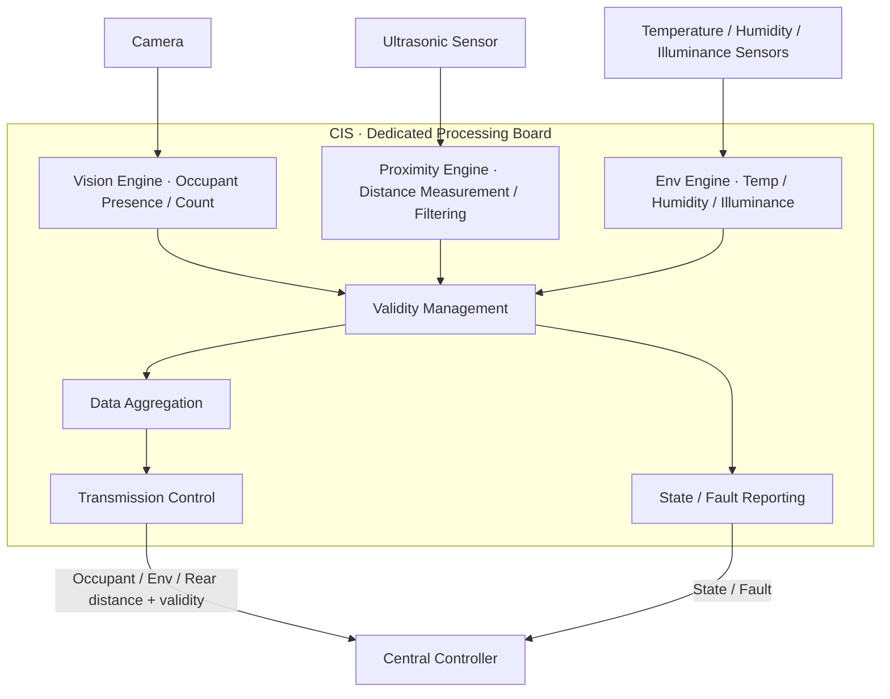
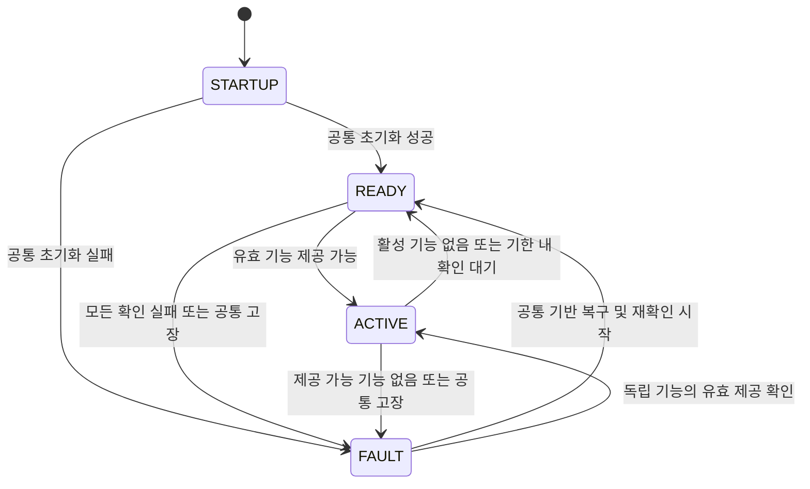
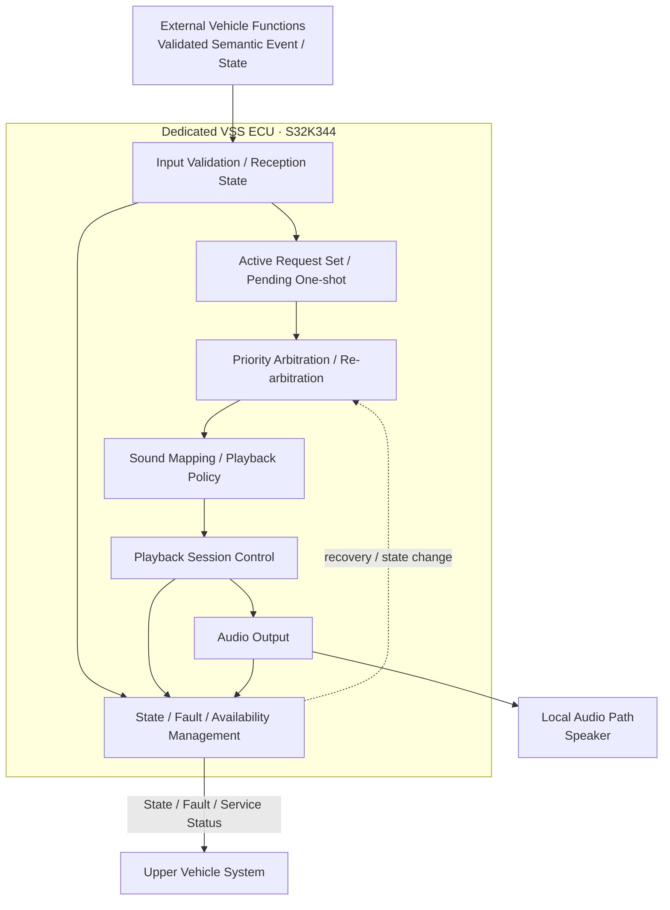
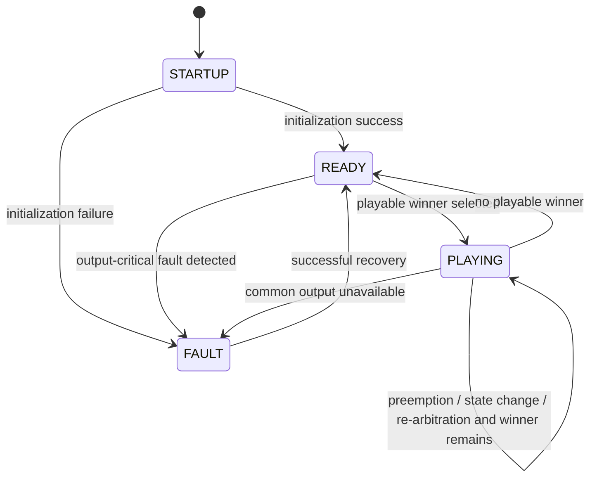
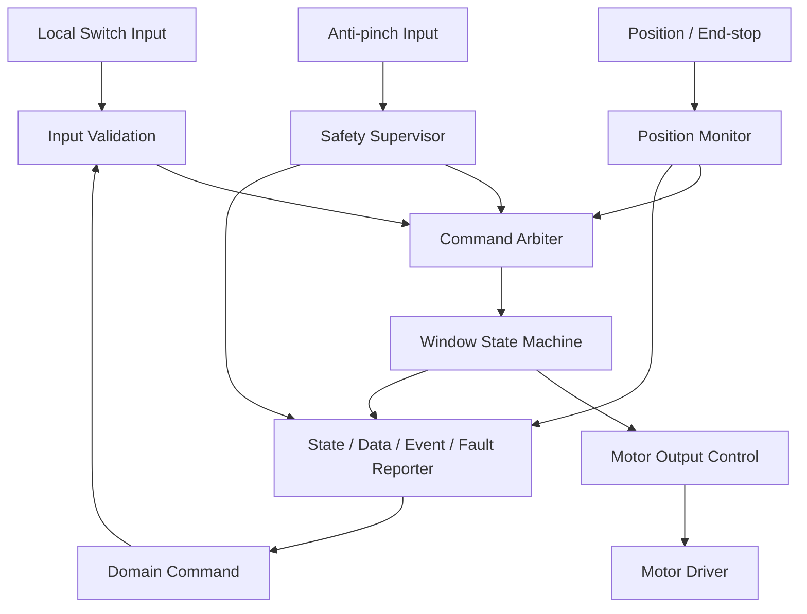
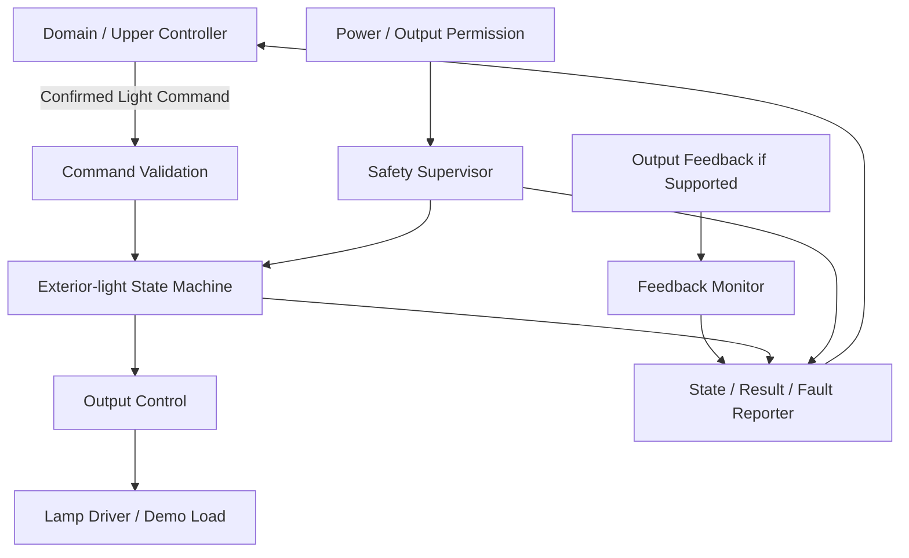

# 통합 차량 제어 시스템 요구사항 명세 (SysRS)

## 0. 문서 안내

버전: v0.26 · 상태: 공유용 초안 · 수정일: 2026-09-18

이 문서는 [SR](SR.md)을 바탕으로 중앙 제어와 각 기능의 동작·상태·입출력·성능·보호 조건을 정의한다. 본문은 공통 요구, 기능별 요구, 영역 간 연결 순서로 구성한다. 부록은 영역별 논리 인터페이스를 설명한다. 기능 동작과 수치는 각 영역의 본문을 기준으로 읽는다.

| 찾아보기 | 내용 |
|---|---|
| [대상](#sys-allocation) · [공통 계약](#sys-semantics) | 역할·용어·요청·결과·품질 |
| [중앙 제어](#sys-central) | 기능별 허용·중재·연결 |
| [BCM](#sys-bcm) · [CIS](#sys-cis) · [MOBILE](#sys-mobile) | 실행·센싱·모바일 |
| [VSS](#sys-vss) · [WINDOW](#sys-window) · [EXTERIOR_LIGHT](#sys-exterior-light) | 음향·창문·외부 조명 |
| [영역 간 연결](#sys-contracts) | 교환 정보와 동작 의미 |
| [논리 인터페이스](#appendix-b) · [VSS 인터페이스](#if-vss) | 정보의 방향·상태·이벤트·고장 |

| 표시 | 읽는 기준 |
|---|---|
| `[잠정]` | 초안에 적용한 임시 정책·배정. 관련 구성과 동작 확인 후 조정 가능 |
| `[검토 필요]`, `TBD`, 미정 | 필요한 입력·조건·구성 또는 값이 아직 결정되지 않음 |
| `[후보]`, `[CANDIDATE]`, 후보 | 검증 전 수치 또는 동작안. 실제 구성에서 확인 필요 |
| `파생` | 상위 기능을 구체화하면서 추가한 상세 요구. 직접 SR 문장과 구분 |
| `BASELINE` | 현재 문서의 의미 기준. 구현 검증·제품 승인 완료를 뜻하지 않음 |
| `PROVISIONAL` | 잠정 표현. 실제 메시지·신호로 확정되지 않음 |
| `OPTIONAL` | 지원 구성에 따라 선택하는 기능 또는 진단 정보 |
| `DEFERRED`, `EXCLUDED` | 현재 구현 의무에서 보류한 후속 기능 / 현재 범위에서 제외한 기능 |

요구 문장과 표에 붙은 표시를 함께 읽는다. 지원 여부나 입력 조건을 확인할 수 없는 기능을 정상 제공 가능으로 해석하지 않는다.

## 1. 대상과 할당

아래는 기능별 대상과 요구 정의 수다. 이번 단말 등록·디지털 키의 담당은 §2.1.1·§3.2.6을 따르며, 그 밖의 물리 배치·통신 상세는 각 절의 기존 확인 항목을 따른다.

| 영역 | 대상 | 요구 정의 수 |
|---|---|---:|
| BCM | 전용 S32K144 ECU | 88 |
| CIS | 전용 처리 보드 | 52 |
| MOBILE | Android 애플리케이션 | 101 |
| VSS | 전용 S32K344 ECU | 114 |
| WINDOW | 전용 S32K144 Window ECU | 73 |
| EXTERIOR_LIGHT | S32K144 기능 요소 후보, 실제 배치 미정 | 58 |
| 영역별 소계 | 위 6개 영역 | 486 |
| 공통 | 요청·등록 확인·품질·범위·중앙 책임·감시·디지털 키·후방 위험 판단 | 23 |
| 전체 | 후속 보안 후보 제외 | 509 |

## 2. 용어·결과·품질 정보

요청·명령(Request/Command), 현재 상태(State), 새로 발생한 일(Event), 고장(Fault), 측정 데이터(Data)는 구분한다. 공통 요약에 같은 상태명이 있더라도 각 노드의 상태 코드(enum)와 상태가 바뀌는 조건을 모두 같게 만들라는 뜻은 아니다. `확정된 명령`은 상위가 선택한 실행 의도이며 문서 전체가 승인됐다는 뜻이 아니다.

| 구분 | 해석 |
|---|---|
| 결과 / 상태 / 발생 | 특정 요청 결과, 현재 관측·서비스 상태, 한 번의 발생을 구분 |
| DONE | 요청별로 정의한 목표 충족; 설정 저장·이미 목표 상태여서 추가 구동이 필요 없는 경우·물리 확인은 같은 기준이 아님 |
| UNKNOWN / FAILED | 결과 확인 기능에서 결과를 확인하지 못함 / 실행 실패 판단을 구분 |
| 유효성 / 최신성 / 인증 | 의미 사용 가능, 원본 정보 경과 시간과 수신 후 경과 시간, 등록된 출처·연결 확인을 구분 |
| 후보 / 설계 선택 | 후보 숫자는 검증 전 값. 현재 설계 선택도 부품·성능 검증 완료를 뜻하지 않음 |
| DEFERRED | 현재 구현 의무에 포함하지 않는 후속 후보 |

BCM은 무관한 새 요청 오류와 현재 유효 동작을 구분하며 실행 허용·유효성 상실 및 로컬 보호를 따로 판단한다. WINDOW는 상위 이동 정지, 현재 저전압 ELS 데모는 OFF, VSS는 제한 Hold 후 중단을 적용한다. 이 동작을 하나의 공통 OFF 또는 무조건 유지 규칙으로 바꾸지 않는다.

### 주요 용어

| 용어 | 이 문서의 의미 |
|---|---|
| 중앙 제어 | 단말 등록 확인·차량 수준의 허용·중재·정책을 담당하는 논리 기능. 상위·Domain·중앙처리장치는 이 기능의 별칭 |
| 실행 노드 | 명령을 받아 장치 출력을 실행하는 기능 노드 |
| ECU | 제어 기능을 구현하는 제어기. 실제 보드 배치와 논리 기능 할당은 구분 |
| Fan | 공기 순환·열 제거에 사용하는 팬 |
| 단발성 이벤트·음향(One-shot) | 유효한 도어 요청의 목표 상태 확인처럼 한 번 일어난 사실과, 그 사실을 알리기 위해 한 번 실행하는 음향 재생 |
| 지속형 정보(Stateful) | 경고가 현재 발생 중인지처럼 계속 달라질 수 있는 상태를 알리는 정보. 같은 상태를 다시 받아도 새로운 발생으로 세지 않음 |
| 선택된 재생 대상(Winner) | 재생할 수 있는 음향들을 우선순위로 비교해 지금 출력하기로 정한 음향 |
| 음원 데이터(Sound Asset) | 재생에 사용하는 저장된 소리 데이터 |
| 재생 과정(Playback Session) | 음향 한 건을 시작해서 종료할 때까지의 전체 과정. 패턴에 정해진 반복과 소리가 나지 않는 구간도 포함 |
| 경고 후보의 제한 유지(Hold) | 입력을 신뢰할 수 없게 되면 마지막 유효 경고를 잠시 재생 후보로 남기는 처리. 그동안에도 우선순위에 따라 선택된 음향만 출력 |
| 재생 판단에 적용할 상태(Effective State) | 마지막 입력값에 정보의 유효성·사용 가능 여부·제한 유지 규칙을 적용해, 현재 재생 후보로 사용할 상태 |
| 실행 선택(중재) / 다시 선택(재중재) | 여러 요청의 우선순위와 실행 가능 여부를 비교해 하나를 선택 / 조건이 바뀌었을 때 다시 비교해 선택 |
| 우선순위에 따른 교체(선점) | 더 높은 우선순위의 요청을 실행하기 위해 현재 출력을 중단하고 교체하는 처리 |
| 실행 노드의 동작 제한 조건(로컬 인터록) | 열린 도어의 잠금을 막는 것처럼, 실행 노드가 직접 확인해 동작을 허용하거나 거부하는 조건 |
| 최신성 / 경과 시간(Freshness / Age) | 정보의 사용 가능 시간을 판단하는 기준 / 지정된 기준 시점부터 지난 시간 |
| 원본 정보 경과 시간 / 수신 후 경과 시간 | 정보별 생성·관측·평가 등 지정된 원본 시점부터 지난 시간 / 마지막 새 갱신을 수신한 뒤 지난 시간. 중계·재전달로 원본 기준을 초기화하지 않음 |
| 차량의 최초 처리 응답 | 동일 요청의 유효한 ACCEPTED·IN_PROGRESS 또는 최종 결과. 통신 전달 ACK는 제외 |
| SNA | 정보를 제공하는 기능이 현재 상태를 판단해 알려줄 수 없다는 표시. 위험이 없음을 확인한 CLEAR와 구분 |
| Availability | 현재 어떤 기능·음향을 제공할 수 있는지 나타내는 정보. VSS가 요청을 받을 수 있는지와 실제 소리를 낼 수 있는지는 별도로 확인 |
| `Semantic Owner` | 센서 값이나 실행 결과를 바탕으로 상태·발생 사실을 판단하는 담당 기능 |
| Network Producer / Consumer | 통신으로 정보를 보내는 노드 / 받은 정보를 사용하는 노드 |

`DONE`, `FAILED`, `UNKNOWN` 등 상태명과 요구사항 ID는 식별자로 사용한다. 같은 상태명이어도 기능별 완료·보호 조건을 함께 적용한다.

### 2.1 공통 요청·등록 확인·품질 계약

요청·등록 확인·품질의 공통 동작은 [SR 공통 요구](SR.md#sr-common-request)를 구체화한다. 실제 ECU 배치·암호 방식·메시지 비트 폭은 별도 설계에서 정한다.

| ID | 요구사항 |
|---|---|
| COM-SYS-REQ-001 | 중앙은 원 요청의 식별·대상·실행 노드 결과·사유를 연결하여 모바일에 제공해야 한다. 전송 완료, 처리 수용, 실행 진행, 목표 달성을 구분해야 하며 전송 또는 수용만으로 DONE을 생성해서는 안 된다. 실행 노드의 로컬 결과를 §2.2 및 §6.6.3에 따라 매핑하고, 결과 불명은 실패로 추정하지 않아야 한다. |
| COM-SYS-REQ-002 | MOBILE·중계·중앙·실행 노드는 단말/차량/세션/요청 식별의 연계를 유지해야 한다. 같은 식별과 같은 내용의 재전달은 새 실행 없이 기존 처리 상태 또는 결과를 반환해야 한다. 같은 식별에 다른 내용은 식별 충돌로 거부하되 기존 요청 결과를 덮어쓰지 않아야 한다. 유효 세션 동안 중복 방지 근거를 유지하고, 근거를 잃거나 용량을 초과하면 해당 요청을 새 실행으로 취급하지 않아야 한다. 재시작 시 보존 근거가 없으면 기존 세션을 무효화하고 새 인증·세션을 요구해야 한다. 과거 요청의 조회 근거가 없으면 UNKNOWN을 제공하고 자동 재수행하지 않아야 한다. |
| COM-SYS-REQ-003 | **[잠정]** 요청 결과를 확인하는 기능은 SENT 이후 차량의 최초 처리 응답 기한과 수용 이후 기능별 최종 결과 기한을 구분해야 한다. 통신 전달 ACK만으로 최초 응답 기한을 종료하지 않아야 한다. 중간 응답의 중복 수신으로 최종 기한을 연장하지 않아야 한다. 진행 중 단절 또는 해당 기한 초과 시 UNKNOWN으로 표시하고 자동 재전송하지 않아야 한다. 뒤늦게 도착한 동일 요청의 인증된 최종 결과가 있으면 UNKNOWN을 해당 결과로 갱신할 수 있다. 이미 확정된 결과는 오래된 중간 응답으로 되돌리지 않아야 한다. 설정·시작·정지 요청 결과와 장시간 작업 상태를 구분해야 한다. 최초 처리 응답은 SENT부터 3초, 수용 이후 결과 대기는 §2.3.1의 기능별 잠정값을 적용해야 한다. 결과 대기 만료를 실행 실패나 실제 정지로 해석해서는 안 된다. |
| COM-SYS-AUT-001 | 중앙은 요청 수용 시 대상 차량에 등록된 단말과 현재 연결·세션이 확인되었는지, 해당 기능이 지원되고 실행 허용 조건을 충족하는지 확인해야 한다. 다른 차량의 등록을 허용 근거로 사용해서는 안 된다. 단말 등록 확인은 §2.1.1을 따르며 MOBILE이 자체 인증 성공이나 실행 허용을 만들어서는 안 된다. 중계의 전달 성공은 등록·연결 확인을 대체하지 않아야 한다. |
| COM-SYS-AUT-002 | 차량 출처·인증/세션 유효성과 개별 상태의 품질을 별도로 판단해야 한다. 출처 또는 인증/세션이 확인되지 않으면 MOBILE의 새 제어 요청을 차단해야 한다. 유효 세션에서 무관한 상태 하나의 STALE/INVALID만으로 모든 제어를 차단해서는 안 된다. 중앙은 기능별 필수 입력의 유효성·최신성·허용 조건을 확인해야 하고, 실행 노드는 자신이 직접 확인하는 동작 제한 조건과 보호를 유지해야 한다. 필수 입력 또는 허용 조건이 정의되지 않은 기능을 임의 허용하지 않아야 한다. 정지 요청의 필수 조건은 해당 기능 계약으로 정하며 모든 품질 검사나 인증을 일괄 면제하지 않아야 한다. |
| COM-SYS-QLT-001 | **[잠정]** 상태 정보를 제공·중계·사용하는 기능은 값별 유효성, 원본 시점과 원본 정보 경과 시간, 수신 시점과 수신 후 경과 시간을 구분 가능한 근거로 전달·평가해야 한다. 재전달된 과거 값의 원본 정보 경과 시간을 새로 시작해서는 안 된다. 정보 사용 기능은 새 메시지가 없어도 최신성 만료를 평가해야 하며 STALE/INVALID/NO_DATA 또는 미수신을 정상 CLEAR나 정상 현재 값으로 치환해서는 안 된다. 기능별 유지·정지·복구 정책은 각 기능 계약을 따라야 한다. 상태별 잠정 최신성 한도와 원본 정보 경과 시간의 연결은 §2.5를 따라야 한다. |
| COM-SYS-EVT-001 | 중앙의 도어 판단 기능은 새로운 유효 요청과 BCM이 확인한 목표 잠금 상태·결과를 연결해야 한다. 요청한 잠금 또는 잠금 해제 상태가 정상적으로 확인되면 DOOR_LOCK_COMPLETE 또는 DOOR_UNLOCK_COMPLETE 이벤트를 생성해야 한다. 요청 시 이미 목표 상태여서 추가 구동 없이 DONE + ALREADY_AT_TARGET으로 완료한 경우에도 해당 확인 이벤트를 생성해야 한다. 같은 요청의 재전달·결과 조회·반복 상태 보고, REJECTED 또는 UNKNOWN만으로 새 확인 이벤트를 생성해서는 안 된다. 수용한 LOCK 요청을 실제로 실행한 뒤 목표 확인에 실패한 경우(NO_FEEDBACK 또는 DRIVE_LIMIT_EXCEEDED)는 DOOR_LOCK_ERROR로 알려야 하며, 잠금 해제 실패를 이 이름으로 알려서는 안 된다. 각 발생은 원 요청·대상 도어·종류와 연결된 식별을 유지해 중계·재전송 때 중복 재생되지 않아야 한다. 서로 다른 새 요청의 확인은 별개 발생으로 구분해야 한다. VSS 재생에는 기존의 입력 유효성, 발생 후 경과 시간, 재생 대상 선택 규칙을 적용해야 한다. |

#### 2.1.1 단말 등록과 연결 확인

차량 등록은 무선 연결 계층의 기기 등록 절차로 수행하며 별도 앱 계정·사용자별·기능별 권한 체계나 독립 등록 절차를 두지 않는다. 이 문서의 `인증`·`AUTHENTICATED`는 등록된 상대 기기와 현재 연결이 확인된 상태를 뜻한다. 차량 이름·주소 등 식별값이 같다는 사실만으로 이 상태를 만들지 않는다.

**[잠정]** 차량 측 무선 연결·등록 확인은 ESP32가 담당하고, 중앙은 ESP32가 현재 연결에 대해 제공한 확인 결과와 차량 기능의 허용 조건을 사용한다. ESP32와 중앙 사이의 확인 결과를 현재 연결에 묶는 형식·갱신·상실 검출은 인터페이스 설계에서 정하며, 확인할 수 없는 연결에서 새 제어를 허용하지 않는다.

기기 등록용 내부 키는 무선 연결 계층이 관리한다. 앱은 해당 계층이 제공한 기기 식별·등록 참조를 보관한다. 내부 정보를 사용자가 직접 열람·입력하는 절차는 두지 않되, 운영체제의 기기 등록 승인·확인은 허용한다. 무선 방식에 따른 실제 지원 여부는 검토가 필요하다.

등록 해제 시 앱의 등록 참조를 삭제하고 연결·새 제어·디지털 키 응답 유지를 중단한다. **[잠정]** 무선 계층의 기기 등록 해제도 수행하며, 사용자의 운영체제 설정 조작이 필요하면 안내한다. 차량 측 등록 기록은 별도로 제거할 수 있어야 한다. 양측 기록 정리를 확인하기 전에는 전체 등록 해제 완료로 표시하지 않으며, 단말의 기능 중단은 그 확인을 기다리지 않는다. 재등록은 무선 계층의 새 기기 등록 절차를 따른다. 별도 사용자 권한 폐기 절차는 두지 않는다.

실행 허용·공조 자원 사용·로컬 보호는 기기 등록과 별개다. 이후 절의 실행 허용 철회는 동작의 허용 상실을 뜻하며 사용자별 권한 관리 기능을 추가하는 뜻이 아니다.

### 2.2 요청 결과와 도어 이벤트

중앙은 다음 의미를 요청 처리 상태와 결과로 제공한다. 기존 ECU의 enum을 일괄 변경하지 않는다. 직접 관측·보유한 근거가 없는 중앙은 성공·고장·취소를 추정해서 만들지 않는다.

| 결과 | 현재 의미와 판정 근거 |
|---|---|
| SENT | 앱이 요청을 전송함. 전송 ACK는 차량 수용이 아님 |
| ACCEPTED | 중앙이 등록·연결 확인·정의된 사전 조건에 따라 처리를 수용함. 실행 노드의 최종 수용/구동을 보장하지 않음 |
| IN_PROGRESS | 실행 노드의 실제 진행 또는 해당 설정 처리의 진행이 확인됨 |
| DONE | 해당 요청의 목표가 확인됨. 설정 요청은 반영, 시작/정지는 해당 동작 상태 확인이며 공조 목표 온도 도달까지 의미하지 않음 |
| REJECTED | 실행 시작 전에 실행 허용·명령 유효성·동작 제한 조건 등으로 거부됨. 중앙 수용 뒤 로컬 실행 전 거부도 포함 |
| CANCELLED | 확인된 사용자 정지·정상 대체 등으로 기존 작업이 정상 중단됨. 고장에 의한 정지는 FAILED |
| FAILED | 실행 또는 목표 확인이 실패했다고 차량이 판단함. 단순 응답 미수신은 제외 |
| UNKNOWN | 결과 확인 기능에서 현재 결과를 확인하지 못함. 실제 액추에이터 정지 또는 실패를 의미하지 않음 |

기존 요청의 중복 상태/결과 반환 및 조회도 등록이 확인된 원 단말·대상 차량의 범위에서만 제공한다. 만료·무효 세션은 새 동작을 수행하지 않으며, 재연결 후 등록 상태와 과거 요청의 원 단말·차량 연결을 다시 확인한다.

정지 요청과 중단된 기존 요청은 각각의 식별자를 가진다. 정지 목표가 확인되면 정지 요청은 DONE, 중단된 진행 요청은 CANCELLED가 될 수 있다. 이미 완료된 ‘공조 시작’ 요청을 이후 공조 정지 때문에 CANCELLED로 변경하지 않는다. 장시간 작업 상태는 별도 상태로 제공한다. 동시 완료/정지 경쟁은 실행 노드의 확정 순서와 해당 기능의 종료 기준으로 판정하며, 구체 우선순위는 기능별 후속 계약에서 정한다.

| 도어 사례 | 결과 | VSS에 제공할 새 이벤트 |
|---|---|---|
| 유효한 새 요청·안전 조건 충족·NORMAL·이미 목표 상태 | DONE + ALREADY_AT_TARGET, 추가 구동 없음 | 목표에 따라 DOOR_LOCK_COMPLETE 또는 DOOR_UNLOCK_COMPLETE 1회 |
| 동일 식별·동일 내용 재전달 | 기존 상태/결과 반환, 새 실행 없음 | 없음; 기존 발생 재전달은 같은 발생 식별 사용 |
| 등록/연결 확인 실패, 무효 명령, 신뢰할 수 없는 상태, LOCK 시 문 열림 | REJECTED + 사유 | 없음 |
| LOCK 구동으로 목표 전이를 정상 확인 | DONE | DOOR_LOCK_COMPLETE 1회 |
| UNLOCK 구동으로 목표 전이를 정상 확인 | DONE | DOOR_UNLOCK_COMPLETE 1회 |
| 수용 후 실제 LOCK 실행의 목표 확인 실패 | FAILED + NO_FEEDBACK/DRIVE_LIMIT_EXCEEDED | DOOR_LOCK_ERROR 1회 |
| UNLOCK 실행 실패 | FAILED + 사유 | 이 표의 LOCK_ERROR로 변환하지 않음; 상태·오류 제공 |
| 요청 밖에서 불일치 상태만 관측 | 현재 이상 상태·오류 제공 | 요청 완료/실패 발생으로 추정하지 않음 |
| 결과 확인 기능에서 결과를 확인하지 못함 | UNKNOWN | 없음 |

추가 구동 없이 요청을 완료하려면 새 요청을 판정하는 시점에 현재 상태가 유효하고 이미 목표에 도달했는지 확인해야 한다. 과거 중복 요청에 반환된 DONE은 과거 요청 결과이며 현재 도어 상태의 최신 증거가 아니다.

DOOR_LOCK_COMPLETE와 DOOR_UNLOCK_COMPLETE는 해당 요청의 목표 잠금 상태가 정상적으로 확인됐다는 뜻으로 사용한다. 이벤트 이름은 유지하되 실제 상태 변화와 이미 목표 상태였던 경우를 모두 포함한다. 중앙은 원 요청·대상 도어·종류별 확인 이벤트를 한 번 생성한다. 새 요청이면 현재 상태를 다시 확인해 별개 이벤트로 제공하고, 같은 요청의 재전달·결과 조회·주기 상태 보고로는 새 이벤트를 만들지 않는다.

확인 이벤트의 원 발생 시점은 BCM이 해당 요청의 목표 상태를 정상적으로 확인한 시점이다. 이미 목표 상태인 경우에는 새 요청을 판정하며 현재 상태를 확인한 시점이며, 이후 중앙이나 VSS가 결과를 받은 시점으로 갱신하지 않는다. 실제 음향은 §7.6의 우선순위·유효기간·출력 가능 조건을 따른다. 확인음은 요청한 잠금 상태를 알리는 소리이며, 도어가 실제로 움직였거나 열리고 닫혔다는 뜻은 아니다.

### 2.3 요청 응답 기준과 입력 조건

| 항목 | 현재 결정 | 남은 결정·담당 및 완료 기준 |
|---|---|---|
| 최초 처리 응답 기한 | **[잠정]** SENT부터 3 s. 전달 ACK 제외, 유효한 ACCEPTED/IN_PROGRESS 또는 최종 결과로 종료 | 중앙·MOBILE 담당: 무선 왕복+등록 확인/접수 처리 실측으로 조정 |
| 최종 결과 대기 | **[잠정]** 최초 ACCEPTED/IN_PROGRESS 관측부터 §2.3.1의 기능별 시간 적용. 중간 수신으로 연장 금지 | 결과 확인 기능의 대기 기한이며 로컬 구동·보호 한도와 별도. 실제 실행/전달 예산 검증 필요 |
| 중복 방지 | 유효 세션 내 기존 요청 식별 보존, 근거 상실 시 무효 세션으로 차단 | 인터페이스 담당: 식별 형식·용량·세션 종료·결과 보관 및 리셋 시험 확정. 용량 부족 시 새 요청 거부 등 안전한 제한 적용 |
| 결과 순서·출처 | 동일 요청·등록·연결이 확인된 출처·인과 순서가 확인되는 결과만 반영 | 인터페이스 담당: 재부팅 세대·상태 순서 식별·결과 조회 응답 최신성 형식 확정 |
| 기능별 필수 품질 | 관련 입력만 검사, 로컬 보호 유지, 정의 없는 허용 금지 | 기능·중앙 담당: 시작/정지/유지별 입력·최신성·허용/철회 행렬 작성  |
| 도어 발생 | 중앙이 BCM의 목표 상태 확인 결과로 확인 이벤트를, 실제 LOCK 실행 실패로 실패 이벤트를 생성하고 VSS가 이를 음향에 사용. **[잠정]** 사건 발생부터 음향 시작까지는 §7.6.3의 2초 미만 | 발생 식별·경과 시간 전달 방식·중재/실제 인지 기한 검증 필요 |

**[잠정]** 최초 응답 감시는 단조 증가 시간으로 측정한다. 기한까지 도착한 동일 요청의 인증된 처리 응답을 먼저 반영하고, 없으면 3초 도달 시 UNKNOWN으로 전이한다. 늦은 ACCEPTED/IN_PROGRESS만으로 UNKNOWN을 해소하거나 완료 대기를 새로 시작하지 않는다. 이후 확인된 최종 결과는 §2.2에 따라 반영한다. 최초 응답 기한과 §2.3.1의 결과 대기, 실제 출력 차단 기한은 별도다. 잠정 대기값을 실제 구동·보호 시간으로 사용하지 않는다.

#### 2.3.1 기능별 최종 결과 대기

**[잠정]** 요청 결과 확인 기능이 해당 요청의 최초 ACCEPTED/IN_PROGRESS를 관측한 때부터 아래 시간을 측정한다. 기한까지 도착한 유효한 최종 결과를 먼저 반영하고, 없으면 기한 도달 시 관측한 결과를 UNKNOWN으로 표시한다. 이 기한은 결과를 기다리는 시간 한도다. 기한이 지났다는 이유만으로 노드의 실행 실패(FAILED), 실제 정지 또는 목표 도달로 판단해서는 안 된다. 더 이른 로컬 실패가 확인되면 즉시 그 결과를 반영한다.

| 요청·결과 확인 기능 | 최종 결과 대기 | 완료 확인 범위 |
|---|---:|---|
| MOBILE → 중앙: 목표 온도·자동 공조 사용·실내 조명 설정 | 2 s | 중앙 설정 반영. 공조 실행·도달 온도·실제 점등과 별도 |
| MOBILE/중앙의 도어 잠금·해제 요청 관측 | 3 s | 실제 목표 잠금 또는 정상 상태에서 이미 목표가 충족되어 추가 구동이 필요 없는 경우 |
| MOBILE/중앙의 수동 Fan·공조 실행/정지 | 5 s | 해당 요청에서 요구한 Fan/출력 상태·종료 확인. 목표 온도 도달은 제외 |
| 중앙 → BCM/ELS: 조명 목표 적용 | 1 s | 현재 구성의 지시 적용 확인. 실제 점등 여부를 확인하는 피드백 미지원 유지 |
| 중앙 → WINDOW: 상위 목표 이동 / STOP | 10 s / 1 s | 이동은 목표 위치, STOP은 출력 비활성 확인. 실제 기구 정지와 구분 |

각 기능은 자신이 요청 접수를 확인한 시점부터 결과 대기 시간을 잰다. 시작 시점이 서로 다르므로 표의 시간을 단순히 더하거나 어느 한 값을 앱 요청부터 차량 동작 완료까지의 전체 시간으로 해석하지 않는다. 진행 상황 응답이나 동작 계속 허용을 새로 받아도 결과 대기 시간을 처음부터 다시 세지 않는다. 결과 확인 불가(UNKNOWN)가 된 요청은 확인된 최종 결과를 받아야 해소할 수 있다. UNKNOWN만으로 자동 재실행하거나 성공/실패를 추정하지 않는다.

자동 환기의 최대 5분, 외부 임시 점등 10초는 작업 상태로 따로 감시한다. 모바일의 WINDOW/ELS 제어 범위를 추가하지 않는다. 로컬 구동 상한·재시도·확인/보호 기한은 기능별 후보 또는 확인 필요 조건을 유지한다. 필요한 로컬 상한·피드백이 정해지지 않은 실구동은 그 조건을 확인하기 전에 활성화하지 않는다.

### 2.4 범위·책임·감시의 공통 요구

다음은 기능 범위·책임·통신 감시의 공통 요구이다. 물리 배치·통신 필드·센서 모델은 별도 설계에서 정한다.

| ID | 요구사항 |
|---|---|
| COM-SYS-SCP-001 | 중앙은 현재 구성에서 제공 가능한 기능과 연결 미완료·입력 확인 불가 기능을 구분하고, 사용할 수 없는 기능의 요청을 정상 수행으로 처리하거나 그 상태를 정상값으로 제공해서는 안 된다. MOBILE은 차량이 제공한 가용성과 사유를 반영해야 한다. 이 가용성 처리는 SR 요구의 삭제나 충족 판정을 대신하지 않으며, 상위 요청 인터페이스의 존재만으로 MOBILE 제어 대상을 확대해서는 안 된다. |
| COM-SYS-CTR-001 | **[잠정]** 중앙은 목표 온도·자동 공조 사용·공기 순환 선택·실내 조명 사용/밝기/색상의 확정 설정과 자동 기능 작업 상태를 관리해야 한다. MOBILE은 요청값을 생성하고 중앙이 확인한 설정을 표시해야 하며, BCM은 중앙의 실행 명령과 실제 적용 상태·결과를 제공해야 한다. 중앙은 동일 자원에 대한 수동·자동·알림 요청을 중재해 일관된 실행 목표를 내려야 하고, 일시적인 출력 개입을 사용자 설정의 변경으로 오인해서는 안 된다. 자동 환기는 §3.2.5, 지원 구성은 §3.5를 따라야 하며, 기능별 우선순위·로컬 보호와 미지원 제한을 지켜야 한다. 외부 자동 점등은 중앙이 §9.6.2.1의 잠정 조건으로 판단해야 한다. |
| COM-SYS-CTR-002 | **[잠정]** 중앙은 §3.2.3~3.2.4의 입력 계약과 발생·해제 조건에 따라 차량 사용 의미와 잔류 탑승자·끼임·이탈 후 열린 도어 경고를 판단해야 한다. 끼임 감지·즉시 보호·실제 반전 결과·현장 확인 전달은 WINDOW가, 탑승자 관측과 품질은 CIS가 제공해야 한다. 후방 근접 위험은 중앙이 CIS의 거리값·유효성·측정 시점과 감지 활성 상태를 확인하여 §3.2.7에 따라 판단해야 한다. CIS는 거리 측정·필터링과 유효성 확인을 담당해야 한다. 각 경고의 상태·품질·모의 여부를 구분하고, 앱 확인·미수신·음향 종료만으로 위험 해제를 생성해서는 안 된다. 실제 입력이 미구성인 기능의 모의 시연을 실제 감지 지원으로 표시해서는 안 된다. |
| COM-SYS-CTR-003 | 중앙의 명령 수용·중재는 실행 노드의 로컬 보호를 해제하거나 지연시키는 근거가 되어서는 안 된다. BCM·WINDOW·EXTERIOR_LIGHT는 해당 기능의 직접 관측과 보호 조건에 따라 출력을 제한하고 그 상태·결과를 제공해야 한다. 통신 상실·실행 허용 철회·복구 시 출력은 기능별 계약을 따라야 하며 모든 기능에 동일한 OFF 또는 자동 재개를 강제해서는 안 된다. VSS는 확정된 의미의 재생을 중재하고 센서 위험 판단이나 액추에이터 보호를 대신하지 않아야 한다. |
| COM-SYS-MON-001 | **[잠정]** 정보를 사용하는 기능은 주기 제공이 약속된 정보와 발생 시 제공되는 이벤트·명령을 구분하여 감시해야 한다. 주기 정보는 감시 활성 조건·첫 수신 대기 기준·최신성 기한·복구 조건을 정한 뒤 감시해야 한다. 이벤트·명령의 단순 미발생은 통신 고장 근거로 사용해서는 안 되며, 발생 또는 요청이 확인된 뒤에는 해당 전달·응답 기한을 감시해야 한다. 통신 정상 여부는 정해진 주기 정보나 연결 진단 근거로 판단하고, 근거가 없는 상태를 정상으로 추정해서는 안 된다. 이 규칙은 기능별 통신 상실 출력 정책을 변경하지 않는다. §2.5의 상태 제공과 §2.6의 활성 목표 유지 허용을 구분해야 한다. 각각의 주기·경과 시간 기준을 적용하고 명령 재전달로 기한을 연장해서는 안 된다. |

### 2.5 상태 최신성과 주기 감시

**[잠정]** 아래는 현재 시연의 논리 상태 제공 기준이다. `P`는 차량 내부에서 새 관측 결과 또는 현재 정보의 신뢰성을 알려주는 간격이다. 최대 허용 경과 시간은 정보가 처음 생성된 때부터 실제로 사용하는 때까지 허용하는 시간이다.

MOBILE로 전달하는 무선 구간의 주기는 아래 별도 기준을 적용한다. 내부 센싱 주기와 네트워크 제공 주기는 별도로 충족해야 하며, 상태·품질 변화의 더 짧은 제공 기한이 있으면 먼저 적용한다.

| 정보·경로 | 주기 P | 원본 정보의 최대 허용 경과 시간 |
|---|---:|---:|
| 후방 거리·측정 종류·활성·품질: CIS → 중앙 | 200 ms | 500 ms |
| 후방 위험 상태·활성·품질: 중앙 → VSS | 200 ms | 500 ms |
| 후방 활성 허용: 중앙 → CIS | 200 ms | 500 ms |
| 차량 사용·사용자 이탈·탑승자 존재/인원수·도어 관측·WINDOW 끼임/정지/보호 상태 → 중앙; 중앙의 끼임·잔류 탑승자·열린 도어 경고 → 정보 사용 기능 | 200 ms | 1,000 ms |
| CIS 온도·습도·실내 조도, 별도 외부 조도 → 중앙 | 500 ms | 2,000 ms |

정보 생성 후 경과 시간이 최대 허용 시간에 **도달하면** STALE로 본다. INVALID/SNA·허용 정보를 신뢰할 수 없는 상태는 경과 시간 한도를 기다리지 않고 즉시 반영한다. 복합 경고는 판정에 필요한 각 입력의 품질·경과 시간 한도와 경고 자체의 한도를 모두 충족해야 한다.

중앙이 같은 옛 입력을 재계산하거나 중계가 다시 보냈다는 이유로 원본 정보 경과 시간을 초기화하지 않는다. 전달 경로 전체의 경과 시간과 시각 오차를 포함한 경과 시간 근거를 확인할 수 없으면 유효로 취급하지 않는다. 끼임의 미해제 발생 이력과 그 이력을 확인해 제공하는 현재 상태의 시점은 구분한다.

**[잠정]** 지정된 주기 경로의 수신 허용 지연은 100 ms다. 송수신 준비·주기 제공 약속이 활성화된 시점을 기준으로 첫 예정 수신 기한은 `P+100 ms`, 이후 기한은 P 간격이다. 기한까지 도착한 새 유효 통신 갱신을 먼저 반영한다.

CIS 관련 경로의 연속 누락 3회 판정은 §5.7.1을 따르며, 실제 주기/위상을 반영한 예정 기한을 사용한다. 예를 들어 기준 시각 0의 P=200 ms 경로가 계속 미수신이면 300/500/700 ms에서 누락을 계수한다. 처음부터 데이터가 없으면 NO_DATA이며 통신 오류 확정 전에도 정상값을 만들지 않는다.

진단 메시지 수신은 센서 원본 정보 경과 시간을 갱신하지 않는다.

**[잠정]** MOBILE의 일반 상태 제공 주기는 500 ms, 무선 구간의 마지막 새 갱신 수신 후 경과 시간 한도는 2초다. 각 정보가 처음 생성된 뒤 사용할 수 있는 최대 시간도 함께 확인한다. 수신 후 경과 시간과 원본 정보의 경과 시간 중 어느 기준이 먼저 만료됐는지 표시한다.

위 표에 없는 항목의 원본 기한은 별도이며 2초를 공통 구동 허용으로 사용하지 않는다. 경고·품질·요청 결과의 변화 전달과 표시에는 기존의 더 짧은 기한을 유지한다. 같은 내용이어도 새 관측/품질 평가임을 확인할 수 있어야 하며 단순 패킷 재전달은 수신 후 경과 시간을 새로 시작하지 않는다.

이 표는 로컬 센서 샘플링·끼임 반응·드라이버 보호 시간을 대신하지 않는다. 결과 대기는 §2.3.1, 명령 수명은 §2.6, 단발성 음향은 §7.6.3을 따르며 실제 구동·확인 기한은 별도다. 표에 없는 경로의 감시 기한도 미정이다. CIS 복구 확인과 각 실행 노드의 복구·새 명령 조건을 유지하며, 시연용 모의 값은 실제 구동 허용이나 로컬 보호를 대체하지 않는다.

### 2.6 명령 수용 기한과 실행 목표 유지

**[잠정]** 새 요청을 받아들일 수 있는 시간과, 받아들인 동작을 계속해도 되는 조건을 구분한다. 아래 표의 시작점부터 흐른 시간이 수용 기한보다 짧을 때만 새 요청을 받아들인다. 이 시간은 시계 보정의 영향을 받지 않는 단조 증가 시간으로 잰다. 시스템 시각을 수정해도 측정 중인 경과 시간이 갑자기 늘거나 줄지 않아야 한다. 전달·대기 시간과 시각 오차를 포함해 남은 기한을 확인할 수 없으면 새 실행을 거부한다. 실제 전달 필드와 시간 표현은 인터페이스 설계에서 정한다.

| 대상 | 수용 기한 | 시작점·적용 |
|---|---:|---|
| MOBILE → 중앙의 새 제어/설정 요청 | 3 s | MOBILE의 SENT. 최초 응답 대기와 별도로 차량에서 수용 가능 여부 판정 |
| 중앙 → BCM/WINDOW/ELS의 새 실행 명령 | 1 s | 중앙의 해당 최종 목표 명령 생성. 수용 직전·최초 실행 직전에 확인 |

같은 요청을 다시 전달해도 처음 정한 수용 기한은 늘어나지 않는다. 이미 수용·완료된 요청은 기존 상태/결과만 반환하며 다시 실행하지 않는다. 요청을 받아들인 뒤에는 아래의 동작 계속 허용 조건, 작업별 제한 시간, 실행 노드의 구동 상한을 적용한다. 수용 기한 1초는 요청을 받아들일 수 있는 시간이며, 시작한 이동을 반드시 1초 안에 끝내라는 뜻은 아니다.

**[잠정]** 중앙은 자신이 선택한 동작을 시작하거나 계속해도 되는지 100ms마다 다시 판단해 실행 노드에 알린다. 실행 노드는 마지막 유효 평가 시점부터 300ms가 경과하면 해당 유지 허용을 상실한 것으로 처리한다. 갱신 지연은 이 300ms 안에 포함하며 추가 유예를 붙이지 않는다. 명시적 철회·INVALID는 기한까지 기다리지 않고 반영한다. 초기 허용은 없음이며, 첫 실행에는 현재 대상·목표와 연결된 유효한 허용이 필요하다.

유지 허용은 현재 동작을 계속해도 되는지를 나타내는 정보다. 새 동작을 시작하라는 명령과 구분한다. 어느 기능의 어떤 목표·작업에 대한 허용인지, 새로 평가한 순서와 평가 후 경과 시간은 얼마인지, 허용 중인지를 구분해 제공한다.

중앙은 현재 요청 출처·실행 허용·필수 입력·실구동 허용을 확인할 수 있을 때만 갱신한다. 같은 평가의 재전달, 무관한 상태 수신 또는 다른 목표의 허용으로 현재 목표를 연장하지 않는다. 갱신은 구동 재시작·재시도 횟수·작업 타이머·결과 대기를 초기화하지 않는다.

판단에 사용한 입력이 처음 생성된 때를 기준으로 경과 시간을 계속 계산한다. 같은 정보를 다시 전달해도 이 기준을 바꾸지 않는다. 시험용으로 만든 정보만으로 실제 구동을 허용하지 않는다.

| 유지 허용을 잃은 대상 | 처리 |
|---|---|
| BCM 도어 구동 | 통전 종료. 잠금 상태를 반대로 바꾸는 명령은 생성하지 않음. 실제 결과는 피드백으로 판단 |
| BCM 온도 출력 | 해당 온도 출력 OFF. 독립적으로 유효한 Fan 목표와 로컬 보호는 유지 |
| BCM Fan 출력 | 종속 온도 출력을 먼저 OFF하고 해당 Fan OFF |
| BCM 실내 조명 | 해당 출력 OFF 시도, 적용 결과·신뢰할 수 없는 사유 제공 |
| 상위 WINDOW 이동 | 그 상위 이동 정지. 독립 로컬 조작·끼임 보호는 §8.6 유지 |
| ELS 출력 | 현재 저전압 데모 OFF, §9.6의 보호·복구 적용 |

여기서 300ms는 상위 목표의 유지 허용 상실 기준이며 물리 정지·전류 차단 완료 보장값이 아니다. 로컬 보호와 구동 상한이 더 이르면 먼저 적용한다. 허용 회복만으로 종료된 목표를 재개하지 않고 현재 조건과 새 명령을 요구한다. 이미 확정한 DONE은 뒤의 유지 허용 상실로 바꾸지 않으며 현재 출력·사유를 갱신한다. 미완료 요청의 종료 사유는 §2.2와 각 노드 결과 규칙으로 연결한다.

STOP/OFF는 필요한 인증·대상·새 명령의 유효성을 확인하되, 동작 유지 허용이 없다는 이유만으로 정지 요청을 거부해서는 안 된다. 가능한 비활성 경로를 적용하고 실제 확인 범위만 보고한다. 로컬 STOP과 전기적 보호·끼임 보호는 해당 네트워크 기한이 지날 때까지 처리를 미뤄서는 안 된다. WINDOW의 로컬 조작과 보호 반전은 상위 목표 유지 허용의 대상으로 편입하지 않으며 실제 전원/구동/위치 허용은 계속 필요하다.

이 감시는 중앙이 선택한 실행 예정·활성 상위 출력 목표에만 적용한다. 출력이 없는 정상 대기·저장된 설정에는 지속 실행 명령을 요구하지 않는다. 앱 연결 단절은 실행 허용 철회와 구분하며 중앙의 유지 허용을 앱의 주기 메시지로 대신하지 않는다. ELS 임시 점등의 10초와 자동 환기의 5분 상한은 허용 갱신으로 늘어나지 않는다.

## 3. 중앙 책임과 기능 연결

책임은 논리 기능에 할당한다. 중앙과 VSS의 물리 보드 동일/분리, 외부 조명 배치, CAN/UART 경로는 확정하지 않는다. 범위는 [현재 SR §3](SR.md#sr-scope)를 따른다. ‘담당 배정’과 ‘세부 조건 확정’, ‘실제 구현’을 구분한다.

### 3.1 논리 책임

| 영역 | 담당 책임 | 관련 영역의 책임 |
|---|---|---|
| 중앙 | 단말 등록 확인·확정 설정, 자동 기능·자원 중재, 차량 사용 의미·후방 위험·잔류 위험·끼임 경고·이탈 후 도어 경고의 판단, 결과 연결·사용자 표시용 상태 매핑 | 직접 센서 측정·로컬 끼임/전기 보호·음향 내부 재생 중재 |
| BCM | 도어·공조·실내 조명의 명령 실행, 직접 관측 가능한 적용 상태·결과·자체 보호 | 사용자 설정의 최종 결정·관리·자동 공조 정책·센싱 정보 중계 |
| CIS | 실내 관측·품질, 후방 거리 측정·필터링과 중앙 제공 | 후방·잔류 위험의 차량 수준 판단·음향 출력 |
| WINDOW | 로컬/상위 창문 요청 실행, 끼임 감지·즉시 보호·반전 수행 결과·위치/상태/고장 | 중앙 경고 정책·MOBILE 기능 확장 |
| EXTERIOR_LIGHT | 최종 외부 조명 목표 실행·채널 보호·관측 가능한 적용 상태 | 외부 조도 측정·차량 자동 조명 판단 |
| VSS | 확정된 이벤트/위험 상태의 수용·품질 확인·음향 중재·출력·서비스 진단 | 센서 위험 재판정·액추에이터 구동·차량 경고 해제 판단 |
| MOBILE | 사용자 요청 생성, 차량에서 확인한 설정·상태·결과·경고·가용성 표시 | 자체 단말 등록 승인·위험 추정·차량 상태 보정·로컬 출력 제어 |

### 3.2 기능별 입력·판단·실행·결과 연결

입력 정보 제공 기능이 정해지지 않은 기능은 미정으로 표시한다. 논리 담당 지정과 실제 입력 제공은 별개이며 물리 전달 경로는 따로 정한다.

| 연결 | 입력 생산 | 판단·명령 | 실행·소비 | 결과·종료 조건과 미정 사항 |
|---|---|---|---|---|
| 도어 | MOBILE 요청, BCM 잠금·개폐·품질 | 중앙 등록 확인·목표/결과 연결 | BCM 실행·목표 상태 확인; MOBILE 표시; VSS 확인음·실패 경고 제공 | 도어 결과·잠금/개폐는 구분 표시. 추가 구동 없이 완료해도 새로운 유효 요청의 목표 상태가 정상 확인되면 확인음 제공. 결과 대기는 §2.3.1의 잠정 3초. 물리 전달·기한 충족 미검증. |
| 공기 순환·자동 온도 | MOBILE 선택·목표/사용, CIS 온도·품질, BCM 상태 | 중앙 설정 수용·모드 중재·최종 Fan/온도 목표 | BCM 실행·보호; MOBILE 설정과 실측 구분 | 설정·목표·측정은 구분 표시. 실제 온도 도달과 설정 DONE 구분. 수치·측정 검증 미결. |
| 실내 조명 | MOBILE 설정, CIS 실내 조도, 중앙 알림 | 중앙 확정 설정·알림/사용자 목표 중재 | BCM 적용·보호; MOBILE 표시 | 사용자 설정·BCM 적용·물리 확인 미지원은 구분 표시. 색상 기준은 §4.13.6. 실제 발광 보정·패턴·유지 시간은 확인 필요. |
| 실내 관측 | CIS 탑승자·온도·습도·조도·품질 | CIS 측정/관측 확정; 중앙 기능별 활용 | 중앙; MOBILE 현행 표시 항목 | 값·품질과 처음 생성된 때부터의 경과 시간을 전달. 부분 고장·회복 §5.3/5.10 반영; 모든 값을 앱 필수 표시로 확대하지 않음 |
| 후방 경고 | CIS 거리값·측정 종류·유효성·측정 시점·활성 상태 | 중앙이 §3.2.7의 거리 구간으로 위험 판단 | VSS 후방 경고 | 측정·필터링은 CIS, 위험 판단은 중앙, 음향은 VSS. 측정 품질은 §5.6, 위험 경계는 §3.2.7, 음향은 §7.6을 따름 |
| 창문 기본·원터치 | WINDOW 로컬 스위치·위치/품질; 유효한 상위 요청 | 중앙은 상위 허용/목표, WINDOW는 로컬/상위 중재·보호 | WINDOW 실행; 중앙·MOBILE 상태/결과 | WINDOW 상태·결과·품질을 표시. 앱의 원격 창문 제어는 범위에 포함하지 않음. |
| 자동 환기 | 현장 사용 허용, 사용 상태, CIS 온도·존재, WINDOW 위치·보호 | 중앙 온도 조건·1회 환기·취소 | WINDOW 목표 실행 | **[잠정]** §3.2.5의 30/28°C·위치 80%·최대 5분. 종료·중단 후 자동 닫힘 없음. |
| 끼임 경고 | WINDOW 발생·보호 상태·출력/이동 상태·현장 해제 확인·품질 | 중앙 경고 ACTIVE/CLEAR와 품질 판단 | VSS; 기존 MOBILE 안전 알림 | **[잠정]** §3.2.4의 정지·현장 확인 조건 적용. 반전 완료·STOP·앱 읽음만으로 CLEAR 금지. |
| 잔류 탑승자 위험 | CIS 존재·품질, 차량 상태 입력의 사용·이탈 상태 | 중앙 잔류 경고 판단 | VSS; MOBILE 일반 안전 경고 | **[잠정]** 사용 종료+사용자 이탈+유효 탑승자 존재. 발생·해제와 신뢰할 수 없는 입력의 처리는 §3.2.4 적용. |
| 차량 사용 음향 | 차량 상태 입력 기능의 사용 상태·품질 | 중앙 사용 시작/종료 의미 확정 | VSS; 선택 조명은 별도 계약 | **[잠정]** §3.2.3의 유효 전이만 발생 생성. 첫 상태·Wake·재접속은 새 발생 아님. 사건 발생부터 음향 시작까지는 §7.6.3의 2초 미만. 실제 경과 시간 전달·전원 유지 미검증. |
| 외부 조명 | 외부 조도 입력, 차량 사용 발생, 현장 수동 요청 | 중앙 단일 최종 목표·임시 작업 | ELS 실행·보호, 중앙 상태/결과 | **[잠정]** ON/OFF·10초 임시 점등, LEVEL/실제 점등 여부 확인 미지원. 외부 자동 기준은 §9.6.2.1의 잠정안 적용. |
| 이탈 후 도어 경고 | BCM 개폐·품질, 차량 상태 입력의 사용자 이탈/복귀 | 중앙 이탈+열린 도어 판단 | MOBILE 등록된 단말의 사용자 | **[잠정]** §3.2.4의 발생·해제 적용. 앱 단절을 이탈로 사용하지 않음. 실제 이탈 감지는 미구성. |

| 등록·연결·결과 | MOBILE 요청; ESP32 등록·연결 확인; 실행 노드 결과 | 중앙 등록 확인·확정 결과·표시용 변환 | MOBILE | §2.1.1의 무선 등록과 제한 재연결·결과 조회 적용. 백그라운드 알림은 선택. 실제 기기 등록 해제·연결 식별 전달은 확인 필요. |
| 상태·진단 | 각 노드 실제 상태·현재 고장/이력·품질 | 원본 의미는 노드; 중앙은 사용자용 분류/매핑 | MOBILE 현재 대상, 기능별 제어 정보 사용 기능 | 값/품질·요청 결과·현재 고장/과거 이력·피드백 지원은 구분. 실제 코드/전달 형식·기한은 미정. |
| 디지털 키 | MOBILE 사용 설정; ESP32 등록·연결·근접·품질; BCM 도어 상태 | 중앙 새 접근·실행 허용·해제 목표 | BCM 실행; MOBILE 원인·결과 표시; 기존 VSS 도어 발생 | **[잠정]** §3.2.6의 활성 화면·초기 OFF·비근접 후 새 접근 조건. 실제 근접 기준·주기·유효 시간 확인 필요. |

### 3.2.1 공조·실내 조명 선택

중앙은 현재 공조를 사용하는 모드를 하나만 선택하고 Fan·온도 장치의 목표를 함께 결정한다. BCM은 최종 목표를 실행하고 로컬 보호를 우선한다.

| 상황 | 기본 처리 |
|---|---|
| 사용자 수동 순환 선택 | 수동 Fan을 적용하고 자동 온도 제어를 종료. 온도 장치는 OFF |
| 사용자 자동 공조 선택 | 현재 유효 온도와 목표로 Fan·온도 목표를 계산. 기존 수동 동작은 대체 |
| 목표 온도만 변경 | 설정을 갱신. 활성 자동 모드에 반영하되 꺼진 공조를 새로 시작하지 않음 |
| 자동 제어의 필수 온도·허용 입력 상실 | 해당 자동 목표 OFF·사유 제공. 무관한 수동 순환까지 차단하지 않음 |

일반 공조는 가장 최근에 명시적으로 선택한 모드를 사용한다. 자동 사용 해제는 해당 자동 모드만 종료한다. 대체·종료된 모드는 이전 목표나 입력 복구만으로 다시 시작하지 않는다. §3.2.3의 모의 사용 상태만으로 실구동을 허용하지 않는다.

Fan과 온도 목표가 함께 전달되지 못한 경우에도 BCM은 확인된 Fan 허용 없이 온도 출력을 시작하지 않는다. 중앙은 필요한 Fan 정상 상태를 받은 뒤 새 온도 지시를 제공한다. 이미 진행 중인 동작의 요청 만료·실행 허용 철회는 중단과 연결하고, 무관한 새 요청 오류만으로 정상 동작을 취소하지 않는다. 명령 수용·유지 허용은 §2.6의 잠정값을 적용하고 실제 전달 방식과 충족 여부는 확인한다.

실내 조명은 중앙이 현재 알림을 선택한다. NORMAL에는 사용자 사용 여부·지원 밝기·색상을 적용하고, 밝기를 별도로 지정하지 않은 자동 구성에는 실내 조도 기준을 사용한다. 사용자 OFF는 NORMAL만 끄며 기존 안전·상황 알림 우선순위는 유지한다. 상위 알림 종료 후에는 최신 NORMAL 설정으로 돌아가고, 중단된 일시 알림은 재개하지 않는다. 알림 종류·색상과 출력 비율은 §4.13.6를 따른다. 알림별 패턴과 표시 시간은 후속 설계에서 정한다.

### 3.2.2 모바일 요청과 차량 결과 연결

중앙은 모든 요청에 대상 차량의 단말 등록·현재 연결, 기능별 실행 허용과 현재 구성의 지원 여부를 확인한다. MOBILE은 이 판정을 표시하며 무관한 센서의 STALE 하나로 전체 제어를 막지 않는다. 미지원 입력·정책은 사용할 수 없다는 사유로 제공한다.

| 앱 요청 | 필요한 기능 근거 | 요청 완료 의미 / 별도 현재 상태 |
|---|---|---|
| 도어 잠금·해제 | BCM의 잠금·개폐·품질·실행 노드의 동작 제한 조건. LOCK은 열린 도어 금지 | BCM이 해당 요청의 목표 잠금 상태를 정상 확인하면 완료. 이미 목표 상태여도 확인음 대상이며 실제 개폐 상태는 별도 |
| 목표 온도·자동 공조 사용 | 설정은 지원 범위 확인. 실제 자동 시작은 유효 CIS 온도·BCM 상태·전원/허용 필요 | 중앙의 설정 반영 확인. 실제 모드·Fan·온도 출력·고장 및 목표 온도 도달과 구분 |
| 수동 공기 순환 선택 | 지원 수준·BCM Fan 상태·허용. 자동 온도 입력 품질은 전역 차단 사유 아님 | 중앙 모드 선택과 BCM의 해당 Fan 목표 확인. 이전 자동 모드는 §3.2.1대로 종료 |
| 실내 조명 사용·밝기·색상 | 지원 설정 범위·중앙 알림 중재. 자동 밝기에만 유효 실내 조도 필요 | 중앙 설정 반영 확인. BCM 적용 결과·현재 알림·밝기·색상은 별도; 안전 알림 개입 시 사유 표시 |
| 근접 자동 잠금 해제 사용 여부 | 등록된 단말·현재 연결, §3.2.6의 근접 판단 지원 여부 | 중앙의 사용 설정 반영. 설정 DONE과 실제 도어 해제는 별개 |

설정 요청의 DONE은 중앙이 반영값을 확정해 반환한 때다. 차량 재시작 뒤에도 보존한다는 뜻은 아니며 저장 지속성은 후속 결정이다. 미지원 값·미정 정책으로 실행 보장할 수 없는 사용 설정은 거부하거나 제한 사유를 명시하며 정상 활성 상태로 꾸미지 않는다.

설정 확인 뒤 출력 적용이 실패해도 이전 설정 요청의 DONE을 뒤집지 않고 현재 적용 실패를 따로 표시한다. 수동 Fan·정지처럼 실행을 목표로 하는 요청은 필요한 실행 결과를 기다린다. 결과 확인 기능의 대기는 §2.3.1의 잠정값을 따르며 최초 응답 3초나 결과 대기 5초를 공조 전체 작업 시간으로 쓰지 않는다.

단말 등록 무효가 차량 측에 확인되면 중앙은 해당 단말의 새 요청을 차단한다. 현재 동작의 실행 허용 상실은 기존 기능별 중단 규칙을 적용한다. 앱 단절·화면 비활성화 자체를 실행 허용 철회로 간주하지 않으며, 연결 복구로 이전 명령을 실행하거나 결과를 추정하지 않는다.

### 3.2.3 차량 상태와 시연 입력

**[잠정]** 아래는 논리 공급원과 저전압 시연 구성을 정한다. 실제 센서가 없는 항목은 별도 시험 입력기로 제공하며 MOBILE의 사용자 제어 기능으로 추가하지 않는다. 보드·핀·메시지 형식은 미정이다.

| 입력 | 논리 공급원·시연 담당 | 제공 의미 |
|---|---|---|
| 차량 사용·사용자 이탈 | 차량 상태 입력 기능, 중앙 통합 담당 | 사용 중/사용 종료, 사용자 있음/이탈을 독립 제공. 시연 담당자의 명시 조작으로 모의 상태 입력 |

| 외부 조도 | 외부 조도 입력 기능, 중앙 통합 담당 | 차량 외부 밝기와 품질. 실물 센서 구성 전에는 모의 입력. CIS 실내 조도를 대용하지 않음 |
| 탑승자·도어 상태 | CIS / BCM | 기존 관측·피드백과 품질 사용. 사용자 이탈을 탑승자 수만으로 추정하지 않음 |
| 끼임 현장 해제 확인 | WINDOW 로컬 확인 입력, WINDOW 담당 | 대상 창문의 끼임 원인 제거를 현장에서 확인한 뒤 새 확인 제공. 모의 확인은 모의 시연에서만 사용 |

각 입력은 값·품질·원본 갱신 근거·실측/모의 구분을 제공해야 한다. 최초 값은 `NO_DATA`이며 초기값을 정상 없음·사용 종료·사용자 이탈로 간주하지 않는다. 시험 입력도 명시적으로 활성화된 동안에만 갱신하고, 종료·상실 시 품질을 유효로 유지하지 않는다. 갱신·최신성 기한이 정해지지 않은 입력은 사용 가능으로 확정하지 않는다.

모의 입력을 하나라도 사용하는 경고는 모의 경고로 식별한다. 모의 입력은 실제 액추에이터의 운전 허용·로컬 보호 해제 근거로 사용하지 않는다. 입력 모드 전환 시 이전 값·확인·발생 식별을 이어 쓰지 않고 새 상태를 확인한다. 모드 전환 자체는 실제 경고의 CLEAR 근거가 아니다.

차량 사용 시작은 유효한 ‘사용 종료→사용 중’, 사용 종료는 유효한 ‘사용 중→사용 종료’ 전이로만 생성한다. 첫 유효 상태와 품질 회복 후 첫 상태는 현재 상태 동기화이며 과거 전이를 추정하지 않는다. 동일 발생의 재전달은 식별을 유지한다. 전원 인가·Wake·앱 재접속으로 차량 사용 발생을 만들지 않는다. 사용 상태는 전원/구동 허용 신호와도 구분한다.

### 3.2.4 경고 발생·해제

**[잠정]** ‘유효’는 현재 입력의 품질·최신성·출처가 해당 판단에 적합한 경우다. 중앙은 다음 조건으로 현재 상태를 정하고, 상태와 별개로 품질·발생 식별·모의 여부를 제공해야 한다.

| 경고 | ACTIVE | CLEAR |
|---|---|---|
| 잔류 탑승자 | 사용 종료·사용자 이탈·CIS 탑승자 존재가 모두 유효하게 확인됨 | 세 입력 모두 유효하고 ACTIVE 조건이 성립하지 않음: 사용 재개·사용자 복귀·탑승자 없음 중 하나가 확인됨 |
| 끼임 | WINDOW가 새 유효 끼임 발생 또는 아직 해제되지 않은 발생을 제공함 | 해당 발생 이후의 현장 해제 확인과 유효한 구동 출력 비활성·이동 정지·보호 처리 종료가 모두 확인되고, 그 뒤 새 끼임이 없음 |
| 이탈 후 열린 도어 | 사용자 이탈과 BCM 도어 열림이 모두 유효하게 확인됨 | 두 입력 모두 유효하고 사용자 복귀 또는 도어 닫힘이 확인됨. 잠금 완료만으로 닫힘을 추정하지 않음 |

잔류 경고에는 별도 온도 임계값·지연 시간을 추가하지 않는다. CIS가 유효하게 확정한 존재 정보를 사용하며 원시 영상 한 장이나 유효하지 않은 인원수 0을 해제 근거로 사용하지 않는다. 환경값은 부가 정보이고, 온도에 따른 신체 위험의 정도를 이 규칙으로 보장하지 않는다. 인식 필터·정확도·최신성은 CIS 조건을 따른다.

끼임 원인 제거 확인은 해당 창문에서 발생한 이번 끼임에 연결된 새 현장 입력이어야 한다. 계속 눌려 있는 입력, 이전 끼임에 대한 확인, 앱의 읽음 표시, 반전 완료 또는 STOP만으로 경고를 해제하지 않는다.

WINDOW는 아직 해제되지 않은 끼임과 받아들인 현장 확인을 상태 정보로 제공한다. 중앙은 발생 알림을 놓쳤더라도 이 정보로 현재 상태를 다시 맞출 수 있어야 한다. 같은 발생의 해제를 확인한 뒤에는 이전 알림이 다시 도착하거나 일반 창문 이동이 이어졌다는 이유로 경고를 다시 켜지 않는다.

새 끼임이 발생하면 이전 확인은 사용할 수 없다. 현장 확인과 새 끼임이 동시에 들어오면 새 끼임을 우선한다. 처음 켰거나 이력을 잃어 해제 여부를 모르는 경우에는 확인 불가로 표시한다. 이때 출력이 꺼지고 이동·보호 처리가 끝났음을 확인한 뒤 새 현장 확인을 받아 초기 CLEAR를 정할 수 있다. 경고의 CLEAR는 고장 해제나 창문 재이동 명령이 아니다.

필수 입력을 신뢰할 수 없으면 현재 경고는 `UNCONFIRMED`로 제공하고 마지막 유효 상태·발생 이력은 유지한다. 이는 `ACTIVE/CLEAR`의 새 정상값이 아니라 품질 표시이며, 유효 ACTIVE를 입력 누락만으로 유효 CLEAR로 바꾸지 않는다. 새 유효 입력이 갖춰지면 조건을 다시 평가한다. VSS의 제한 Hold 후 음향 중단은 §7.6을 따르며 위험 해제와 구분한다. 앱 읽음·음향 종료·재연결·기동 초기화로 경고를 해제하지 않는다.

### 3.2.5 자동 환기

**[잠정]** 현장에서 해당 시연의 환기 사용을 명시적으로 허용한 뒤 한 번만 자동 시작한다. 모바일의 제어 목록은 확대하지 않는다. 시작 조건은 유효한 사용 종료·탑승자 없음·실내 온도 30°C 이상, 공조 정지, WINDOW 위치/끝단·보호 상태와 실제 구동 허용이 모두 확인되는 경우다.

| 구간 | 처리 |
|---|---|
| 목표 | 창문 위치 80%를 사용: 0%=완전 열림, 100%=완전 닫힘이므로 약 20% 열린 위치. 현재 위치가 80% 이하이면 추가 구동하지 않고 더 닫지 않음 |
| 이동 | 현재 위치가 80%를 넘을 때만 VENT 목표를 전달. WINDOW는 기존 위치 제어·로컬 보호 적용. 이동 DONE과 중앙 환기 작업 종료는 구분 |
| 정상 종료 | 유효 온도 28°C 이하 또는 환기 시작부터 단조 증가 시간으로 5분에 도달. 자동 닫힘 명령은 보내지 않음 |
| 취소 | 수동 창문 조작·STOP·환기 사용 해제·정상 구동 허용 철회·차량 사용 재개·탑승자 확인·다른 공조 시작. 이전 환기 명령을 재개하지 않음 |
| 실패 | 필수 값을 신뢰할 수 없음·구동 허용 정보를 신뢰할 수 없음·위치/보호 고장·해당 이동 실패. 작업 실패와 사유 제공 |

환기가 정상 종료·취소·실패했을 때, 창문이 여전히 그 환기 요청에 따라 움직이고 있는 경우에만 정지를 요청한다. 이미 로컬 조작이나 새 요청으로 대체되었다면 그 동작을 별도로 중단시키지 않는다. 정지 결과를 확인하지 못하면 정지 성공으로 표시하지 않는다. 종료 뒤에는 현재 위치를 유지하고, 다시 시작하려면 현장 환기 사용을 해제한 뒤 새로 허용해야 한다. 복구·온도 재상승·재부팅만으로 새 환기를 시작하지 않는다.

30/28°C·5분·위치 80%는 시연용 임시 선택이며 실제 환기 성능이나 열 위험 해소를 보장하는 값이 아니다.

### 3.2.6 디지털 키

관련 SR: [디지털 키 요구](SR.md#sr-mobile-digital-key). 모바일 요구는 [§6.4.6](#sys-mobile-digital-key)을 따른다. 일반 사용자 잠금 해제와 자동 잠금 해제는 발생 원인을 구분하고 같은 BCM 실행·피드백 규칙을 사용한다.

**[잠정]** 기본 시연은 앱 활성 화면의 등록된 연결에서 제공한다. 자동 잠금 해제 설정은 단말·차량·현재 연결에 연결하며 초기 및 새 연결에서는 OFF로 시작한다. 사용자가 다시 사용을 설정할 수 있고, 중앙이 반영한 설정과 현재 사용 가능 여부를 앱에 제공한다. 화면 비활성·활성 여부 확인 불가·연결 상실·등록 해제는 새 자동 해제를 허용하지 않는 조건이며 이미 실행된 잠금 해제의 취소나 자동 잠금 명령이 아니다.

| 담당 | 입력·역할 | 제공 정보 |
|---|---|---|
| MOBILE | 사용 여부 설정, 활성 조건에서 무선 응답 유지, 확정 결과 표시 | 사용 설정 요청; 자체 근접 판정·자동 해제 요청 없음 |
| ESP32 | 차량 측 무선 기기 등록·현재 연결 확인과 근접 여부 판단 | 단말·차량·연결 식별, 앱 활성 여부, 근접 상태, 품질·갱신 근거 |
| 중앙 | 등록·연결·사용 설정·새 접근·도어 상태와 실행 허용 확인 | BCM에 도어 해제 명령, 앱에 반영 설정·가용성·결과·발생 원인 |
| BCM | 기존 도어 명령 실행과 로컬 보호, 실제 목표 상태 확인 | 기존 도어 상태·결과·사유; 근접 거리 판단 없음 |

| ID | 요구사항 |
|---|---|
| COM-SYS-DK-001 | **[잠정]** ESP32는 무선 연결 계층에서 등록된 단말과 현재 연결을 확인하고, 해당 단말의 근접 상태와 기본 시연의 앱 활성 여부를 품질·갱신 근거와 함께 중앙에 제공해야 한다. 단말 식별과 근접 여부는 별도로 확인해야 하며 신호 수신만으로 등록된 단말이라고 판단해서는 안 된다. |
| COM-SYS-DK-002 | **[잠정]** 중앙은 자동 해제 사용 설정, 등록·연결 확인, 유효한 새 접근, BCM의 유효한 잠금 상태와 실행 허용 조건이 모두 충족된 경우 한 접근당 도어 해제 명령을 최대 1회 생성해야 한다. 거부·실패·이미 해제됨 이후 같은 접근으로 자동 재요청하지 않아야 한다. BCM 내부의 기존 제한 재시도는 별도로 유지한다. |
| COM-SYS-DK-003 | **[잠정]** 중앙은 초기·새 연결·자동 사용 설정 직후 유효한 비근접 상태를 확인한 다음 근접 상태로 바뀐 경우에만 새 접근으로 인정해야 한다. 연결 상실·미수신·STALE·INVALID를 비근접으로 사용해서는 안 된다. 같은 접근에서 수동 잠금이 수행되면 실제 이탈 후의 새 접근 전까지 자동으로 다시 해제하지 않아야 한다. |
| COM-SYS-DK-004 | 중앙은 자동 잠금 해제의 발생 원인을 해당 도어 명령·BCM 결과에 연결하고, 실제 잠금 해제 전이가 확인된 경우에만 근접에 의한 해제 완료를 MOBILE에 제공해야 한다. 추가 구동 없이 완료한 DONE과 거부·실패·결과 확인 불가를 실제 해제로 표시해서는 안 된다. 도어 확인음은 COM-SYS-EVT-001의 목표 상태 확인·중복 방지 규칙을 따라야 한다. 확인음을 제공했다는 사실만으로 실제 잠금 해제 전이가 있었다고 표시해서는 안 된다. |

**[검토 필요]** 근접 판단에 사용할 무선 관측 방법, 근접 진입·이탈 기준과 안정화 조건, 근접 정보의 제공 주기·유효 시간과 앱 활성 확인 방법은 실제 구성에서 정한다. 무선 계층이 응답한다는 사실만으로 앱이 활성 상태라고 판단하지 않는다. 이 기준과 등록·현재 연결 확인이 준비되기 전에는 자동 해제를 사용 가능으로 표시하지 않는다. 시험 입력으로 흐름을 시연할 때는 모의 입력임을 표시하며, 실제 단말 감지 검증 완료로 취급하지 않는다.

가까이 있다는 이유만으로 반복 잠금 해제를 하거나 자동 잠금을 추가하지 않는다. 수동 잠금·해제는 기존 사용자 요청으로 제공하며, 자동 사용 해제 설정은 새 자동 명령의 생성을 막는다. 설정 변경 시 이미 실행 중인 도어 동작은 기존 BCM 실행·보호 규칙을 따른다.

### 3.2.7 후방 거리 수신과 위험 판단

관련 SR: [후방 역할 분담](SR.md#sr-rear-control). CIS는 초음파 거리 측정·필터링과 유효성 확인을 수행한다. 중앙은 CIS가 보낸 거리와 품질을 받아 위험을 판단하고 VSS에 전달한다. VSS는 거리로 위험 수준을 다시 계산하지 않고 받은 상태에 따라 음향을 선택한다.

| ID | 요구사항 |
|---|---|
| COM-SYS-REAR-001 | 중앙은 CIS가 제공한 후방 감지 활성 상태, 측정 종류, 거리값, 유효성, 원본 측정 시점과 갱신 순서를 확인해야 한다. 감지가 활성이고 현재 입력의 품질·최신성·필요한 복구 확인이 충족된 경우에만 위험 수준을 판단해야 한다. 미수신·무응답·범위 밖·만료·비활성·활성 확인 불가를 정상 해제로 바꾸어서는 안 된다. |
| COM-SYS-REAR-002 | 중앙은 현재 유효 거리가 긴급 임계값보다 크고 주의 임계값 이하인 경우 `CAUTION`으로 판단해야 한다. 경계와 평가 순서는 아래 거리 구간 표를 따라야 한다. |
| COM-SYS-REAR-003 | 중앙은 현재 유효 거리가 긴급 임계값 이하인 경우 `EMERGENCY`로 판단해야 한다. CIS의 측정 가능 하한보다 작아 유효하지 않은 숫자를 정상 거리로 사용해서는 안 된다. |
| COM-SYS-REAR-004 | 중앙은 후방 감지가 활성인 동안 현재 유효 거리가 주의 임계값을 초과하거나 CIS가 검증된 정상 미감지를 제공한 경우에만 `CLEAR`로 판단해야 한다. 센서 무응답이나 감지 중단을 물체가 없다는 근거로 사용해서는 안 된다. |
| COM-SYS-REAR-005 | 중앙은 후방의 현재 위험 상태와 활성 여부·품질·확인 불가 사유를 VSS에 제공해야 한다. 위험 판단에 사용한 CIS 측정의 시점·순서와 중앙의 판단 갱신을 구분할 수 있어야 하며, 재계산·중계·반복 수신으로 원본 측정의 경과 시간을 초기화해서는 안 된다. 재연결 후에는 새 유효 측정으로 판단한 현재 상태를 제공하고, 누락된 과거 상태를 순서대로 재전달해서는 안 된다. |
| COM-SYS-REAR-006 | 중앙은 같은 유효 입력 이력·순서·활성 조건·설정·초기 상태에서 같은 후방 위험 상태를 판단해야 한다. 주의·긴급·해제의 거리 기준은 중앙의 한 정책으로 관리하고 CIS나 VSS에 별도의 위험 판단 기준을 두어서는 안 된다. |
| COM-SYS-REAR-007 | 중앙의 후방 판단은 실제 센서 대신 거리·품질·활성 상태를 입력하여 시험할 수 있어야 한다. 거리 경계, 정상 미감지와 측정 실패, 비활성, 오래된 값·중복·역순 도착 및 재연결을 아래 확인 사례에 따라 각각 검증할 수 있어야 한다. |

#### 거리 구간과 후보값

판정 순서는 **감지 활성 확인 → 품질·측정 시점·복구 확인 → 측정 종류 확인 → 거리 구간 판단**이다. 아래 값은 기존 통합본에서 옮긴 `[CANDIDATE]`이며 실물 검증으로 확정된 값이 아니다. CIS의 현재 측정 범위 후보는 10~100cm다.

| 입력 조건 | 중앙의 현재 판단 | 처리 조건 |
|---|---|---|
| 유효 거리 `10 ≤ d ≤ 40 cm` | `EMERGENCY` | 측정 범위 안이며 긴급 경계 40cm 포함 |
| 유효 거리 `40 < d ≤ 70 cm` | `CAUTION` | 긴급 미해당, 주의 경계 70cm 포함 |
| 유효 거리 `70 < d ≤ 100 cm` | `CLEAR` | 측정 범위 안에서 주의 기준 밖임을 확인 |
| CIS가 검증한 정상 미감지 | `CLEAR` | 센서가 정상 무물체와 측정 실패를 구분할 수 있는 구성에서만 사용 |
| `d < 10 cm`, `d > 100 cm`, 진단 실패·무응답·미수신·만료 | 현재 위험 확인 불가 | `INVALID`·`NO_DATA`·`STALE` 등 원인 구분 |
| 유효한 감지 비활성 | 서비스 비활성 | `CLEAR` 생성 없음 |
| 필수 활성 입력의 유효성 확인 불가 | 서비스 확인 불가 | 위험 수준·해제 확정 없음 |

현재 후보에는 경계 부근의 반복 전환을 막기 위한 추가 유지 폭(히스테리시스)을 적용하지 않는다. 매 새 유효 측정에 같은 구간을 적용한다. 추가 유지 폭이나 지속 확인 시간을 도입하려면 진입·해제 기준과 시험 사례를 함께 갱신한다. 거리 필터 방식과 센서 측정 성능은 CIS에서 관리한다.

#### 중앙 → VSS 현재 상태 전달

| 논리 이름 | 의미 |
|---|---|
| `REAR_OBSTACLE_CAUTION` | 현재 유효한 주의 상태 |
| `REAR_OBSTACLE_EMERGENCY` | 현재 유효한 긴급 상태 |
| `REAR_OBSTACLE_CLEAR` | 현재 유효한 비위험 상태 |

세 이름은 `REAR_OBSTACLE_STATE`의 서로 배타적인 상태를 뜻하며 실제 메시지·숫자 코드가 아니다. `CLEAR`는 첫 유효 측정에서 위험이 없다고 확인된 경우에도 제공할 수 있다. 비활성·확인 불가에서는 세 상태 중 하나를 현재 유효한 값으로 제공하지 않고 활성·품질·사유를 전달한다. 마지막 정상 상태를 보관하면 그 상태의 과거 측정 시점과 현재 사용할 수 없다는 표시도 보존한다.

거리값이 같아도 새 측정인지, 같은 측정의 재전달인지 구분한다. 위험 상태가 같다는 이유로 품질·활성·측정 시점 갱신을 생략하지 않는다. 중앙은 CIS의 품질을 임의로 정상으로 올리지 않으며, VSS는 받은 위험 상태와 CIS 원본 측정의 경과 시간을 함께 확인한다. CIS 거리와 중앙 위험 상태의 주기·유효 시간은 [§2.5](#common-freshness-profile)를 따른다. 원본 측정의 500ms 유효 시간을 각 구간에서 새로 시작하여 합산하지 않는다.

재시작으로 순서 정보가 사라지면 새로운 실행 구간임을 구분하고 새 유효 측정 전에는 확인 불가를 제공한다. 이전 실행 구간이나 늦게 도착한 과거 측정으로 최신 상태를 덮어쓰지 않는다. 실제 시각·순서 표현은 후속 인터페이스 설계에서 정한다. VSS의 입력 상실 후 제한 유지·중단은 [§7.6.2](#vss-input-loss)를 따르며, 경고음 종료를 위험 해제로 해석하지 않는다.

#### 확인 사례와 남은 검증

| 입력·상황 | 기대 결과 |
|---|---|
| 활성·유효 거리 10/40cm | 긴급 |
| 활성·유효 거리 40cm 직후/70cm | 주의 |
| 활성·유효 거리 70cm 직후/100cm | 해제 |
| 9/101cm 또는 센서 무응답 | 현재 위험 확인 불가, 임의 긴급·해제 없음 |
| 검증된 정상 미감지 | 유효 해제; 단순 echo 없음은 이 조건이 아님 |
| 마지막 측정이 만료됐는데 같은 값이 반복 수신됨 | 원본 측정 시점 기준으로 만료 유지 |
| 60cm 이후 새 30cm 수신, 그 뒤 과거 60cm 지연 도착 | 현재 긴급 유지, 과거 값으로 주의 복귀 없음 |
| 감지 비활성·통신 상실·재연결 | 비활성·확인 불가를 해제와 구분, 새 유효 측정 후 현재 판단 재개 |

**[검토 필요]** 센서의 실제 측정 범위·정상 무물체 구분, 40/70cm 경고 기준과 필터 효과를 함께 시험해야 한다. CIS의 거리값 준비 100ms 후보에는 네트워크·중앙 판단·VSS 재생 시간이 포함되지 않는다. 측정부터 실제 경고음까지의 전체 지연과 각 구간의 기한은 통신·실물 시험을 근거로 정한다.

### 3.3 통신 감시와 기능 허용의 경계

| 정보 종류 | 감시할 근거 | 적용하지 않을 판단 |
|---|---|---|
| 주기 측정·상태·합의된 주기 명령 | 감시 활성 시 첫 기대 시각, 이후 원본 정보 경과 시간/수신 기한, 유효값 복구 | 해당 정보가 아직 생성될 조건이 아닌데 누락 횟수를 누적하지 않음 |
| 사용자 이벤트 명령 | 실제 요청 식별 이후 수용·진행·최종 응답 기한 | 사용자가 조작하지 않는 시간이 길다는 이유로 COMM 판정하지 않음 |
| 경고 단발성 이벤트 | 정보 제공 기능이 확인한 발생의 전달·경과 시간·중복 근거 | 수신자가 발생 사실도 모르는 상태에서 ‘경고 미발생’을 통신 고장으로 판단하지 않음 |
| 지속 위험 상태 | 원본 의미와 갱신/최신성·품질. 신뢰할 수 없을 때의 기능별 정책 | 수신 중단을 CLEAR로 치환하지 않음 |

§2.5에 지정된 상태는 잠정 주기·경과 시간·첫 수신 기준을 적용한다. 활성 상위 목표의 유지 허용은 §2.6을 따른다. 나머지 경로·실물 입력의 유효성 기준과 실제 전달 방식은 확인이 필요하다. CIS의 누락 횟수 경계와 센서 첫 데이터 대기는 §5.3/5.7을 따른다.

시작·유지·정지 요청의 실행 허용과 필수 입력은 기능별로 정한다. 필요한 입력이 아직 정의되지 않은 자동 기능을 임의 허용하지 않는다. 이미 실행 중인 기능의 유지/정지는 기존 기능별 계약을 따르며, 이 절의 가용성 표로 일괄 OFF 처리하지 않는다.

### 3.4 지원 조건과 미정 사항

| 항목 | 기본 동작 | 아직 필요한 내용 | 논리 담당 |
|---|---|---|---|
| 공조·실내 조명 | **[잠정]** §3.5 피드백 구성, 기존 모드 중재 | 구동 허용 입력 구현, 회전·방열 검증, 색상 실측·패턴 | 중앙+BCM·CIS·MOBILE |
| 후방 위험 | CIS 거리·품질 → 중앙 위험 판단 → VSS 재생 | 센서 능력, 활성 입력, 거리 기준·최신성·경고음 제한 유지 시간의 실측 | CIS+중앙+VSS·인터페이스 |
| 끼임 | **[잠정]** WINDOW 보호·현장 확인, 중앙 경고 상태 | 확인 장치·정지 피드백의 실제 구성, 반전 기구·최신성 검증 | 중앙+WINDOW |
| 잔류 탑승자 | **[잠정]** 사용 종료+이탈+유효 존재, §3.2.4 해제 | 실제 사용/이탈 입력·CIS 인식 성능·최신성 | 중앙+CIS |
| 차량 사용 의미 | **[잠정]** 차량 상태 입력의 유효 전이 | 실물 입력 구성, Wake/Goodbye 발생 경과 시간·전원 유지 | 중앙+VSS·인터페이스 |
| 자동 환기 | **[잠정]** 30/28°C·위치 80%·최대 5분·종료 후 자동 닫힘 없음 | 실제 허용·위치/보호 구성, 온도·환기 성능 확인 | 중앙+WINDOW |
| 외부 자동/임시 점등 | **[잠정]** §9.6.2.1 자동 기준, ON/OFF·10초 임시 점등 | 실제 외부 센서·현장 허용·보호 회로·기한 검증 | 중앙+ELS |
| 이탈 후 열린 도어 경고 | **[잠정]** 차량 상태 입력+BCM, §3.2.4 경고 | 실제 이탈 감지 입력·유효성·전달 기한 | 중앙+BCM·MOBILE |

| 디지털 키 | **[잠정]** §3.2.6의 ESP32 근접 정보·중앙 판단·BCM 실행·MOBILE 표시 | 실제 근접 기준·입력 주기/유효 시간·앱 활성 확인·등록 해제 지원 | ESP32+중앙+BCM+MOBILE |
| 요청·연결·등록 | 무선 기기 등록·활성 연결·조회·등록 해제·선택 백그라운드 | 기능별 기한·식별 보관·양측 기기 등록 기록 정리·경고 이력/확인 동기화. 재연결 한도는 §6.6.5의 잠정값 확인 | 중앙+MOBILE·인터페이스 |

위 입력 역할과 경고 정책은 잠정 요구다. 실물 장치가 없는 항목은 모의 시연 가능 여부와 실제 기능 가용성을 구분한다. 담당 배정만으로 구현·감지 검증이 완료된 것은 아니며, 세부 프로토콜·수치는 후속 설계에서 정한다.

### 3.5 저전압 시연의 지원 구성

**[잠정]** 다음 구성을 설계 기준으로 사용한다. 필요한 관측·허용·보호를 구현하지 않은 기능은 실제 구동 미지원으로 표시한다. 부품 모델·배선·보호 임계값·검증 결과를 확정한 표는 아니다.

| 항목 | 기본 구성 | 지원 한계 |
|---|---|---|
| 자동 기능 구동 허용 | 현장 실행 허용을 제공하는 로컬 입력과 노드별 전원/보호 상태. 중앙은 현재 허용·품질을 확인하고 실행 노드는 로컬 조건을 다시 확인 | 초기화·리셋·입력을 신뢰할 수 없는 경우에는 불허. 새 현장 허용 필요. 모의 차량 상태·경고를 이 허용이나 로컬 보호 해제의 대용으로 사용하지 않음 |
| 도어 피드백 | 문이 잠겼는지와 문이 닫혔는지를 각각 별도의 스위치 입력으로 확인 | 명령 기억으로 잠금/닫힘을 추정하지 않음. 실제 센서 부품·고장 검출은 미정 |
| Fan·온도 장치 | 회전 펄스형 Fan 피드백, 양방향 온도 구동에 대비한 양쪽 열교환부 온도 관측과 해당 방열 Fan 확인 | 무펄스를 정상 정지로 단정하지 않음. 방향별 방열을 확인할 수 없으면 해당 냉각/가열을 지원하지 않음 |
| 창문 위치·원터치 | 위치 피드백+독립 끝단 확인, 수동 유지 입력과 별도 열림/닫힘 원터치 입력 | 원터치는 새 입력 전이당 1회. 닫힘에는 유효 끼임 보호 필수. 보정·반전 목표/시간 미확정 시 해당 기능 활성 금지 |
| 실내 조명 | 기존 지시 적용 확인 유지 | 실제 점등·광량·색상 피드백 미지원 |
| 외부 조명 | 대표 1채널 ON/OFF·10초 임시 점등. 현장 수동 요청·자동 사용 허용, 중앙의 조도 판단 또는 유효 사용 발생으로 목표 선택 | SET_LEVEL·실제 점등 여부를 확인하는 피드백 미지원. 출력 적용 확인과 드라이버 보호는 필요. MOBILE 제어 추가 없음 |

로컬 입력의 물리 배치와 전달 경로는 후속 설계에서 정한다. 부품이 없는 동안 모의 입력으로 판단 흐름을 시연할 수 있으나 실제 구동 허용·피드백 검증을 완료한 것으로 표시하지 않는다. 모든 조건을 갖춘 후에도 이번 임시값은 시연 결과에 따라 조정할 수 있다.

## 4. BCM 상세 요구사항

관련 SR: [영역 본문](SR.md#sr-bcm)

### 4.1 대상 시스템과 책임

본 SysRS의 대상은 독립된 물리 S32K144 보드 1대로 구성되는 BCM ECU이다.

BCM ECU의 책임은 다음과 같다.

- 확정된 동작 명령의 수용 및 유효성 확인
- 명령에 대응하는 액추에이터 구동
- 도어·공조의 정의된 피드백 측정과 지시 동작의 대조
- 실내 조명의 출력 지시 적용 상태 확인
- 직접 측정하는 정보에 근거한 자체 안전 차단
- 구동 결과, 기능별 상태 및 오류 제공

BCM ECU의 책임이 아닌 항목은 다음과 같다.

- 동작 수준 및 알림 종류의 결정
- 자동 기능의 시작 및 종료 판단
- 공조 자원 사용 권한의 중재
- 윈도우 구동
- 사용자 화면 표시 및 사용자 입력 수집

BCM ECU는 상위 자동 판단에 사용하는 외부 환경 측정값을 직접 수신하지 않는다. CIS가 제공한 값으로 목표를 결정하는 책임은 중앙에 있으며, 도어·팬·방열의 로컬 측정과 보호는 BCM이 담당한다.

상위 기능의 판단 기준은 [BCM 논리 인터페이스](#if-bcm-s04)에 정의한다.

### 4.2 논리 시스템 구조

BCM ECU의 내부 처리는 다음 순서로 구성된다.

| 처리 단계 | 역할 |
|---|---|
| 명령 수용·유효성 평가 | 실행할 수 있는 명령인지 확인 |
| 구동·확인 | 도어·공조 피드백을 지시와 대조하고, 실내 조명은 지시 적용 상태를 확인 |
| 결과 제공 | 상태·결과·오류 제공 |
| 자체 안전 차단 | 직접 측정한 조건으로 소프트웨어 동작과 독립된 보호 수행 |

세 기능은 서로 독립된 상태와 오류를 가지며, 하나의 기능 처리가 다른 기능의 주기 처리를 차단하지 않아야 한다.

자체 안전 차단 경로는 명령 처리 경로와 분리되며, 소프트웨어 동작 상태와 무관하게 액추에이터 출력을 차단할 수 있어야 한다.

### 4.3 시스템 상태

| 상태 구분 | 값 |
|---|---|
| ECU 동작 상태 | `INIT` / `READY` / `DEGRADED` / `FAULT` |
| 도어 잠금 상태 | `LOCKED` / `UNLOCKED` / `UNKNOWN` |
| 도어 개폐 상태 | `CLOSED` / `OPEN` / `UNKNOWN` |
| 도어 종합 상태 | `NORMAL` / `INCONSISTENT` / `UNTRUSTED` |
| 명령 처리 결과 | `ACCEPTED` / `IN_PROGRESS` / `DONE` / `REJECTED` / `FAILED` |
| Fan 출력 수준 | `OFF` / `LOW` / `MEDIUM` / `HIGH` |
| 온도 장치 방향 | `COOL` / `HEAT` / `IDLE` |
| 조명 알림 종류 | `NORMAL` / `GOODBYE` / `WARNING` / `FAULT` |
| 명령 유효 상태 | `OK` / `STALE` / `INVALID` / `NO_DATA` |
| 오류 분류 | `SENSOR` / `COMM` / `FUNCTION` |

`DEGRADED`는 일부 기능이 정지하였으나 나머지 기능이 안전하게 수행 가능한 상태를 의미한다.

Fan 출력 수준, 온도 장치 방향 및 조명 알림 종류는 **수신한 명령을 보관하기 위한 상태**이며, BCM이 산출하는 값이 아니다.

> **[검토 필요]** §3.5는 도어의 잠금·개폐 스위치, 팬 회전 신호, 열교환부 온도 센서의 임시 구성이다. 이 입력으로 실제 동작을 확인할 수 있는지와 확인에 걸리는 시간을 시험해야 한다. 조명 색상은 [§4.13.6](#bcm-light-colors)에 정했으며 점멸 방식과 알림 유지 시간은 아직 정하지 않았다.

### 4.4 기능 요구사항

#### 4.4.1 명령 수용 및 해석

| ID | 요구사항 |
|---|---|
| BCM-SYS-CMD-001 | BCM ECU는 정의된 명령 집합에 속하는 명령만 수용해야 한다. |
| BCM-SYS-CMD-002 | 정의되지 않은 값 또는 범위를 벗어난 값을 포함한 명령을 실행하지 않아야 한다. |
| BCM-SYS-CMD-003 | 중복 수신되거나 역순으로 수신된 명령을 재실행하지 않아야 한다. *(파생)* |
| BCM-SYS-CMD-004 | 명령의 유효 상태가 `OK`가 아닌 경우 해당 명령을 실행하지 않아야 한다. |
| BCM-SYS-CMD-005 | 명령을 수용한 경우와 거부한 경우를 구분하여 결과와 사유를 제공해야 한다. |
| BCM-SYS-CMD-006 | 수신한 명령의 수준 및 방향을 액추에이터 구동량으로 변환해야 한다. *(파생)* |

#### 4.4.2 도어 잠금 실행

| ID | 요구사항 |
|---|---|
| BCM-SYS-DL-001 | 수용된 도어 제어 명령만 액추에이터에 반영해야 한다. |
| BCM-SYS-DL-002 | 명령 유효성·로컬 안전 조건이 충족되고 도어 종합 상태가 `NORMAL`이며 목표 잠금 상태가 현재 잠금 상태와 동일한 경우 액추에이터를 구동하지 않고 `DONE` + `ALREADY_AT_TARGET`으로 처리해야 한다. 해당 요청의 목표 상태가 정상적으로 확인됐다는 결과를 중앙에 제공해야 하며, 실제 잠금·해제 상태가 새로 바뀐 것으로 보고해서는 안 된다. 중앙은 이 결과를 COM-SYS-EVT-001의 확인 이벤트에 연결해야 한다. |
| BCM-SYS-DL-003 | 도어 잠금 상태와 개폐 상태는 각각 독립된 입력으로부터 취득되어야 한다. |
| BCM-SYS-DL-004 | 접점 입력의 상태 변화는 정의된 안정화 시간 동안 유지된 경우에만 확정되어야 한다. *(파생)* |
| BCM-SYS-DL-005 | 잠금 상태와 개폐 상태의 조합이 정의된 정상 조합에 속하지 않는 경우 `INCONSISTENT`로 관리해야 한다. |
| BCM-SYS-DL-006 | `INCONSISTENT` 또는 `UNTRUSTED` 상태를 임의의 정상 상태로 치환하여 제공하지 않아야 한다. |
| BCM-SYS-DL-007 | 실제 도어 구동이 수행된 요청은 구동 후 정의된 확인 제한시간 이내에 목표 잠금 상태 도달을 측정으로 확인한 경우에만 정상 완료로 처리해야 한다. 이미 목표 상태여서 추가 구동이 필요 없는 경우에는 BCM-SYS-DL-002의 유효한 현재 상태 확인을 따라야 한다. |
| BCM-SYS-DL-008 | 목표 상태 도달이 확인되지 않은 경우 정의된 횟수만큼 재시도한 후 실패 결과와 사유를 제공해야 한다. |
| BCM-SYS-DL-009 | 도어 잠금 상태, 개폐 상태 및 종합 상태를 유효 상태와 함께 제공해야 한다. |

#### 4.4.3 실내 환경 실행

| ID | 요구사항 |
|---|---|
| BCM-SYS-CL-001 | 수용된 Fan 출력 수준을 실제 구동에 반영해야 한다. |
| BCM-SYS-CL-002 | 실제 Fan 동작 상태를 물리적 측정으로 취득하고 정의된 수준으로 분류해야 한다. |
| BCM-SYS-CL-003 | Fan 지시-측정 대조는 현재 실제로 적용한 출력 수준을 기준으로 해야 한다. 정상 구동 중 허용 시간을 넘긴 불일치는 오류로 처리하며, 고장 차단 후의 OFF 일치를 원래 목표에서의 정상 회전 복구로 간주해서는 안 된다. |
| BCM-SYS-CL-004 | 유효한 Fan 동작 측정을 취득하지 못하면 UNKNOWN으로 구분해야 한다. 정지 명령 중 회전 신호가 없다는 사실만으로 센서 고장이나 정상 정지를 확정해서는 안 되며, 정지 확인과 센서 유효성은 §4.6을 따라야 한다. |
| BCM-SYS-CL-005 | 온도 장치는 유효한 방향·수준 조합과 로컬 방열 허용 조건이 함께 충족된 경우에만 구동해야 한다. IDLE의 출력은 0이어야 하며, 잘못된 조합을 실행하거나 반대 방향으로 임의 보정해서는 안 된다. |
| BCM-SYS-CL-006 | 온도 장치 방향 전환 시 먼저 출력을 0으로 하고 전환 지연 후 최신 유효 목표와 로컬 허용을 다시 확인해야 한다. 대기 중 정지·고장·목표 변경이 있으면 이전 반대 방향 목표를 자동 실행해서는 안 된다. |
| BCM-SYS-CL-007 | 열 제거 수단의 온도·품질과 Fan 동작 확인을 함께 사용해 온도 장치의 로컬 허용 상태를 판단해야 한다. 온도 측정 하나만으로 열 배출이 정상이라고 단정해서는 안 되며, 필요한 확인이 불가능하면 온도 출력을 허용하지 않아야 한다. |
| BCM-SYS-CL-008 | Fan 지시 출력 수준, 측정 수준, 온도 장치 방향 및 출력 수준을 제공해야 한다. |

#### 4.4.4 실내 조명 실행

현재 구성의 확인 범위는 **출력 지시 적용 상태**다. 실제 점등 피드백은 미지원이며 단선·단락과 실제 광량·색상의 검출을 보장하지 않는다. [적용·오류 처리](#bcm-lighting)를 따른다.

| ID | 요구사항 |
|---|---|
| BCM-SYS-AL-001 | 수용된 조명 알림 지시를 실제 출력에 반영해야 한다. |
| BCM-SYS-AL-002 | 조명은 확정된 알림 종류와 출력 수준을 반영하고 NORMAL에서는 지원되는 사용자 색상 설정도 반영해야 한다. 안전·상황 알림에는 중앙이 선택한 알림 표현을 적용해야 한다. |
| BCM-SYS-AL-003 | 정의되지 않은 알림 종류를 수신한 경우 직전 출력을 유지하고 오류로 처리해야 한다. *(파생)* |
| BCM-SYS-AL-004 | 현재 적용한 알림 종류·출력 수준·색상과 적용 결과를 제공해야 한다. 물리 피드백이 없는 구성에서는 이를 실제 점등 확인으로 보고해서는 안 된다. |
| BCM-SYS-AL-005 | 출력 지시의 적용에 실패하면 정상 적용으로 처리하지 않고 해당 조명 출력을 OFF로 시도하며 실패 사유를 제공해야 한다. OFF 적용도 확인할 수 없으면 적용 상태를 UNKNOWN으로 제공해야 한다. |
| BCM-SYS-AL-006 | 조명 관련 오류는 조명 출력 이외의 경로로 제공해야 한다. |
| BCM-SYS-AL-007 | 조명 색상은 적색·녹색·청색 세 채널의 출력 비율로 지정해야 한다. 알림별 색상과 전체 밝기의 적용은 §4.13.6를 따라야 한다. |

### 4.5 입력 의미 요구사항

BCM ECU는 이미 결정된 명령을 받아 실행하며 판단에 필요한 원시 정보를 받지 않는다.

| ID | 요구사항 |
|---|---|
| BCM-SYS-SEM-001 | 동작 명령은 BCM이 추가 판단 없이 구동으로 변환할 수 있는 형태로 제공받아야 한다. |
| BCM-SYS-SEM-002 | 명령에는 중복 및 순서를 식별할 수 있는 값이 포함되어야 한다. *(파생)* |
| BCM-SYS-SEM-003 | 명령의 값과 유효 상태를 분리하지 않고 함께 관리해야 한다. |
| BCM-SYS-SEM-004 | 유효 상태는 사용 시점에 평가해야 하며 수신 시점의 평가 결과를 그대로 사용하지 않아야 한다. |
| BCM-SYS-SEM-005 | 수신한 명령 및 상태 정보를 다른 기능으로 전달하는 중계 기능을 수행하지 않아야 한다. *(파생)* |
| BCM-SYS-SEM-006 | 외부에서 액추에이터의 구동량 또는 구동 시간을 직접 지정하는 명령을 수용하지 않아야 한다. *(파생)* |

#### 4.5.1 유효 상태의 평가 시점

명령의 유효 상태는 **명령을 실행하는 시점에 평가**되어야 한다.

수신 당시 정상이라는 판정만 계속 사용하면, 실제 실행 시점에 유효 시간이 지났는지 놓칠 수 있다. 실행할 때 경과 시간을 다시 확인해 오래된 명령을 `STALE`로 구분해야 한다.

> **[검토 필요]** 문이 잠겼는지와 문이 닫혔는지를 각각 별도의 스위치 입력으로 확인하는 안이다. 사용할 센서와 상태 판정 방법은 실제 장치에 맞춰 정해야 한다. 도어 동작 후 결과를 확인하는 시간과, 확인된 완료 사실을 VSS에 전달하는 시간도 시험해야 한다.

### 4.6 기본 실행 동작

#### 4.6.1 도어 상태 조합

| 잠금 \ 개폐 | `CLOSED` | `OPEN` | `UNKNOWN` |
|---|---|---|---|
| `LOCKED` | 정상 | **`INCONSISTENT`** | `UNTRUSTED` |
| `UNLOCKED` | 정상 | 정상 | `UNTRUSTED` |
| `UNKNOWN` | `UNTRUSTED` | `UNTRUSTED` | `UNTRUSTED` |

`LOCKED`와 `OPEN`의 동시 확인은 물리적으로 성립하지 않는다.

#### 4.6.2 도어 제어 시퀀스

| 판단 순서 | 조건 | 처리 |
|---|---|---|
| 1 | 출처·세션/명령 유효성 미확보 | 명령 수용 거부; 기존 요청 결과를 비인가 출처에 제공하지 않음 |
| 2 | 유효한 출처의 기존 요청 식별 재전달 | COM-SYS-REQ-002에 따라 기존 상태/결과만 제공; 새 구동 금지 |
| 2a | 새 요청의 상태 UNTRUSTED/INCONSISTENT | REJECTED + STATE_UNTRUSTED |
| 3 | LOCK 요청 시 개폐가 CLOSED 아님 | 실행 노드의 동작 제한 조건에 의해 REJECTED + DOOR_OPEN |
| 4 | 안전 조건 충족·NORMAL·현재가 목표와 같음 | 추가 구동 없이 DONE + ALREADY_AT_TARGET; 중앙에서 해당 새 요청의 확인 이벤트로 연결 |
| 5 | 실제 구동 필요·허용 조건 충족 | 구동 및 안전 차단 타이머, 이후 접점 확인 |
| 6 | 확인 제한시간 내 목표 도달 확인 | DONE; 중앙에서 해당 요청의 확인 이벤트로 연결 |
| 7 | 목표 미확인 | 기존 제한 재시도·보호 조건 적용 후 FAILED + 사유; 실제 LOCK 실패만 LOCK_ERROR 발생 근거 |

거부 사유 후보: `DOOR_OPEN` / `STATE_UNTRUSTED` / `CMD_INVALID`

장치를 움직이지 않고 요청을 완료한 사유: `ALREADY_AT_TARGET` (거부 사유가 아님)

실패 사유 후보: `NO_FEEDBACK` / `DRIVE_LIMIT_EXCEEDED`

재전달 결과는 과거 요청 결과다. 새 현재 도어 상태 및 새 발생으로 취급하지 않는다. 정의된 한 실행 안의 제한 재시도는 동일 요청의 재전달에 의한 새 실행과 구분한다. 등록·연결 확인 및 실행 허용 판정과 실행 노드의 동작 제한 조건은 [공통 계약](#common-request-contract)을 함께 적용한다.

#### 4.6.3 Fan·온도 장치의 기본 실행

| 구간 | 기본 동작 |
|---|---|
| Fan 구동 | 현재 적용 수준과 측정 수준을 비교. 기동·감속의 허용 시간은 기존 후보 사용 |
| 온도 장치 시작 | Fan의 필요한 동작과 방열 온도·품질을 확인한 뒤 허용. Fan 지시 송신만으로 정상 회전을 간주하지 않음 |
| Fan OFF·측정값을 신뢰할 수 없음·고장 | 온도 출력 OFF. Fan 고장이면 Fan도 기존 안전 수준 OFF로 전이 |
| 방열 과열 | 온도 출력 OFF. 정상 Fan은 기존 허용된 순환을 유지할 수 있음 |
| 방향 전환 | 온도 출력 0 → 전환 지연 → 최신 목표와 로컬 허용 재확인 → 반대 방향 |

Fan의 최소 허용 수준과 방열 정상 판정은 실제 구성에 맞게 정한다. 정지 명령 중 회전 펄스가 없는 것은 정상 정지와 센서 고장 양쪽에서 가능하므로, 그 사실 하나로 고장이나 복구를 확정하지 않는다. 회전 피드백은 §3.5의 펄스형 구성을 잠정 사용하며, 신호 유효성·정지 확인 방법은 실물 검증이 필요하다. Fan 회전 확인은 공기 흐름의 간접 근거이며 막힘 등 모든 방열 실패의 검출을 보장하지 않는다.

#### 4.6.4 온도 장치 방향 전환

방향 전환 지연은 기존 500 ms 후보를 유지한다. 대기 중 새 목표가 오면 최신 목표를 사용하고, OFF·보호·유효성 상실이 생기면 이전 목표를 실행하지 않는다. 전환 지연과 정상 방열 조건은 별개다.

#### 4.6.5 과열 보호와 복구

차단 임계값을 초과하면 온도 출력을 정지한다. 복귀 임계값 이하의 유효 온도가 복구 확인 시간 동안 유지되고 필요한 Fan 조건이 확인된 뒤에만 새 온도 명령을 수용한다. **온도 하강·고장 해제·새 명령 중 하나만으로 재개하지 않는다.** [오류별 복구](#bcm-recovery)를 함께 적용한다.

#### 4.6.6 실내 조명 적용과 확인 범위

현재 구성은 출력 지시 적용을 확인하며, 별도 실제 점등 여부를 확인하는 피드백은 제공하지 않는다. 정상 적용은 목표값이 출력 경로에 적용된 상태를 뜻한다. 조명 단선·단락이나 실제 광량·색상을 확인했다고 보고하지 않는다. 적용 결과와 물리 확인 미지원은 따로 제공한다.

잘못된 새 요청은 거부하고 기존 유효 출력을 유지한다. 적용 중 오류는 해당 조명을 OFF로 시도하고 실패 사유를 별도 상태 경로로 제공한다. OFF 적용도 확인할 수 없으면 UNKNOWN이다. 다른 BCM 기능은 독립적으로 계속 처리한다. 오류 복구만으로 과거 알림을 다시 켜지 않고 중앙의 최신 유효 지시를 받는다.

> **[검토 필요]** 상태를 얼마나 자주 보내고, 생성된 뒤 얼마나 지난 정보를 사용할지는 §2.5의 임시값을 따른다. 실제 통신에서 이 주기를 지킬 수 있는지와 정보의 경과 시간을 전달하는 방법을 확인해야 한다. §2.5에 없는 정보의 시간 기준은 별도로 정해야 한다.

### 4.7 성능 요구사항

| ID | 요구사항 |
|---|---|
| BCM-SYS-PERF-001 | 전원 인가 후 정의된 시간 이내에 `READY` 또는 `FAULT`가 확정되어야 한다. |
| BCM-SYS-PERF-002 | 유효하게 수용되어 실제 구동이 필요한 명령은 정의된 시간 이내에 구동이 시작되어야 한다. 이미 목표 상태여서 추가 구동이 필요 없는 경우, 중복 요청의 기존 결과 반환 및 거부에는 새 구동 시작을 요구하지 않아야 한다. |
| BCM-SYS-PERF-003 | 도어 구동 종료 후 정의된 확인 제한시간 이내에 결과가 확정되어야 한다. |
| BCM-SYS-PERF-004 | 조명 알림 지시 수용 후 정의된 시간 이내에 출력이 전환되어야 한다. |
| BCM-SYS-PERF-005 | 열 제거 수단의 온도 감시 주기는 온도 장치 제어 주기보다 짧아야 한다. |
| BCM-SYS-PERF-006 | 주기 제공이 약속된 명령·상태 또는 연결 진단에 대해 감시 활성 조건과 수신 기한을 정하고, 그 기한을 넘겨 유효한 정보를 받지 못한 경우 `COMM` 오류로 판단해야 한다. 발생 시 제공되는 동작 명령은 단순 미발생만으로 `COMM` 오류로 판단해서는 안 되며, 실제 요청 이후의 응답 감시는 COM-SYS-MON-001을 따라야 한다. *(파생)* |

### 4.8 외부 논리 인터페이스 요구사항

본 절은 통신 프로토콜을 정의하지 않는다.
후속 인터페이스 설계에서 필요한 정보 항목을 누락하지 않기 위한 논리 계약만 정의한다.

정보 의미와 판단 기준은 [BCM 논리 인터페이스](#if-bcm)를 따른다.

#### 4.8.1 BCM이 외부에서 필요로 하는 정보

| ID | 요구사항 |
|---|---|
| BCM-SYS-INT-001 | 도어 제어 명령을 목표 잠금 상태가 구분 가능한 형태로 제공받아야 한다. |
| BCM-SYS-INT-002 | Fan 지시 출력 수준을 정의된 수준 집합으로 제공받아야 한다. |
| BCM-SYS-INT-003 | 온도 장치 지시를 동작 방향과 출력 수준이 구분 가능한 형태로 제공받아야 한다. |
| BCM-SYS-INT-004 | 조명 지시는 알림 종류·출력 수준 및 NORMAL에 적용할 지원 색상을 구분할 수 있게 제공받아야 한다. 사용자 설정과 중앙이 선택한 현재 알림은 별도로 해석해야 한다. |
| BCM-SYS-INT-005 | 모든 명령에 중복 및 순서를 식별할 수 있는 값을 포함하여 제공받아야 한다. |
| BCM-SYS-INT-006 | 명령의 유효 상태를 판단할 수 있는 근거를 함께 제공받아야 한다. |
| BCM-SYS-INT-007 | 즉시성이 요구되는 조명 알림 지시는 주기 전송을 기다리지 않고 제공받을 수 있어야 한다. |

#### 4.8.2 BCM이 외부에 제공해야 하는 정보

| ID | 요구사항 |
|---|---|
| BCM-SYS-INT-008 | 도어 잠금 상태와 개폐 상태를 각각 구분 가능한 형태로 제공해야 한다. |
| BCM-SYS-INT-009 | 도어 종합 상태의 비정상 여부를 제공해야 한다. |
| BCM-SYS-INT-010 | 명령 처리 결과와 거부 또는 실패 사유를 제공해야 한다. |
| BCM-SYS-INT-011 | Fan의 지시 수준과 측정 수준을 각각 구분 가능한 형태로 제공해야 한다. |
| BCM-SYS-INT-012 | 온도 장치의 동작 방향, 출력 수준 및 열 제거 수단 상태를 제공해야 한다. |
| BCM-SYS-INT-013 | 현재 조명 적용 종류·수준·색상·적용 결과와 실제 점등 여부를 확인할 수 있는지를 구분해 제공해야 한다. 적용 성공을 실제 점등 성공으로 변환해서는 안 된다. |
| BCM-SYS-INT-014 | 오류를 센서 오류, 통신 오류 및 기능 오류로 구분하여 제공해야 한다. |
| BCM-SYS-INT-015 | 자체 안전 판단에 의한 명령 거부를 사유와 함께 제공해야 하며, 해당 거부를 BCM 오류로 분류하지 않아야 한다. |
| BCM-SYS-INT-016 | 자신의 동작 상태와 오류 복구 여부를 제공해야 한다. |
| BCM-SYS-INT-017 | 상태 정보는 변화 시점과 주기 양쪽에서 제공되어야 한다. |

#### 4.8.3 상세 설계 항목

- CAN / LIN / UART 등 실제 물리·데이터링크 프로토콜
- Message ID
- Signal ID
- Payload Byte Layout
- DLC / Frame Length
- Endianness
- 송신 주기
- Timeout
- Alive Counter
- Rolling Counter
- CRC / E2E
- Bus-Off 정책
- Bit Rate / Data Rate
- Arbitration 우선순위
- Bus Load
- 액추에이터 구동 회로 방식
- GPIO / 핀맵 / 배선

> **[검토 필요]** 고장이나 과열로 출력을 멈춘 뒤, 어떤 센서 상태가 얼마나 유지되어야 다시 동작할 수 있는지 실제 장치에서 확인해야 한다. §2.5~2.6의 임시 시간 기준에 맞춰 오래된 상태·명령을 감지하고 출력을 차단할 수 있는지도 시험해야 한다.

### 4.9 안전·우선순위 요구사항

본 절의 판단은 BCM이 직접 측정하는 정보에 근거하며, 통신 상태 및 수신한 명령과 무관하게 수행되어야 한다.

| ID | 요구사항 |
|---|---|
| BCM-SYS-SAF-001 | 액추에이터 안전 차단은 소프트웨어 동작 상태와 무관하게 수행될 수 있어야 한다. |
| BCM-SYS-SAF-002 | 도어 액추에이터 통전은 정의된 상한 시간을 초과하여 지속되지 않아야 한다. |
| BCM-SYS-SAF-003 | 도어 개폐 상태가 `CLOSED`로 확인되지 않은 경우 잠금 명령을 거부해야 한다. |
| BCM-SYS-SAF-004 | 방열 온도나 필요한 Fan 상태를 확인할 수 없으면 온도 장치 출력을 정지하고, 로컬 허용 조건이 확인되기 전에는 재개하지 않아야 한다. |
| BCM-SYS-SAF-005 | 열 제거 수단의 온도가 차단 임계값을 초과한 경우 온도 장치 출력을 정지하고 오류를 제공해야 하며, 차단 상태인 동안 출력을 재개하지 않아야 한다. |
| BCM-SYS-SAF-006 | Fan 구동 중 오류를 검출한 경우 해당 출력을 정의된 안전 수준으로 전이시켜야 한다. |
| BCM-SYS-SAF-007 | 하나의 기능에서 발생한 오류가 독립적으로 수행 가능한 다른 기능의 주기 처리를 차단하지 않아야 한다. |
| BCM-SYS-SAF-008 | 기동 시 모든 액추에이터 출력을 정의된 안전 상태로 초기화한 후 기능 처리를 시작해야 한다. |
| BCM-SYS-SAF-009 | 기동 시 이전 동작 상태를 복원하지 않아야 한다. |
| BCM-SYS-SAF-010 | 과열 차단 후에는 방열 온도가 복귀 임계값 이하에서 복구 확인 시간 동안 유효하게 유지되고 필요한 Fan 조건이 확인된 뒤, 새 유효 온도 명령으로만 재개해야 한다. 온도 하강이나 새 명령만으로 보호를 해제해서는 안 된다. |
| BCM-SYS-SAF-011 | Fan 오류 또는 필요한 Fan 동작 확인 상실 시 온도 장치 출력을 정지해야 한다. Fan 복구 확인 중에도 온도 출력은 OFF를 유지하고, Fan 정상 확인 후 새 유효 온도 명령으로만 재개해야 한다. |

**자체 안전 판단은 수신한 명령보다 우선한다.** 명령을 결정하는 기능은 도어 접점 및 열 제거 수단의 온도를 직접 관측하지 않으며, 명령이 전달되는 사이에 해당 조건이 변할 수 있다.

> **[검토 필요]** 고장이나 과열로 출력을 멈춘 뒤, 어떤 센서 상태가 얼마나 유지되어야 다시 동작할 수 있는지 실제 장치에서 확인해야 한다. §2.5~2.6의 임시 시간 기준에 맞춰 오래된 상태·명령을 감지하고 출력을 차단할 수 있는지도 시험해야 한다.

### 4.10 진단 요구사항

#### 4.10.1 논리 고장 분류

| 분류 | 의미 | 예 |
|---|---|---|
| `SENSOR` | 자신이 측정하는 값을 취득할 수 없거나 신뢰할 수 없음 | Fan 측정 불가, 열 제거 수단 온도 측정 불가, 도어 접점 이상 |
| COMM | 연결 또는 수신 명령의 품질 이상 | 약속된 주기 정보 누락·명령 STALE·순서 이상. 이벤트 명령 미발생은 오류가 아니며, 무효한 새 요청과 현재 유효 목표의 동작은 구분 |
| `FUNCTION` | 지시한 동작이 실제로 이루어지지 않음 | 지시-측정 불일치, 목표 상태 미도달, 과열 차단 |

#### 4.10.2 요구사항

| ID | 요구사항 |
|---|---|
| BCM-SYS-DIAG-001 | 오류는 세 분류로 구분되어 관리되고 제공되어야 한다. |
| BCM-SYS-DIAG-002 | 신뢰할 수 없는 상태 정보를 정상 상태로 제공하지 않아야 한다. |
| BCM-SYS-DIAG-003 | 명령을 신뢰할 수 없는 경우 해당 명령을 실행하지 않아야 한다. |
| BCM-SYS-DIAG-004 | 무관한 새 명령의 오류만으로 기존의 유효한 구동을 중단하지 않아야 한다. 진행 중 동작 자체의 허용·유효기간 상실이나 로컬 보호·고장은 별도로 처리해야 한다. |
| BCM-SYS-DIAG-005 | 마지막으로 수신한 명령 또는 오류 복구 사실만을 근거로 새로운 구동을 시작하지 않아야 한다. |
| BCM-SYS-DIAG-006 | 오류별 복구 조건을 적용해야 한다. Fan 고장의 정지 상태 확인과 실제 회전 복구를 구분하고, 새 Fan 명령에 따른 제한된 복구 확인은 §4.10.3을 따라야 한다. |
| BCM-SYS-DIAG-007 | 복구 후 구동은 새 유효 명령에 의해서만 재개해야 한다. Fan의 제한된 복구 확인도 새 Fan 명령이 있어야 하며, 고장 해제나 이전 명령만으로 자동 시험 구동을 시작해서는 안 된다. |

#### 4.10.3 오류별 복구 초안

| 오류 | 복구 확인 | 새 동작 |
|---|---|---|
| 측정 오류 | 해당 값·센서 유효성이 복구 확인 시간 동안 정상 | 최신 유효 명령으로 재개 |
| 주기 정보/연결 COMM | 해당 감시 대상이 정상 수신되고 최신성 확인 | 다른 이벤트 명령 수신만으로 COMM을 지우지 않음 |
| 과열 | 복귀 임계값 이하 온도·품질 유지 및 필요한 Fan 조건 확인 | 새 온도 명령으로 재개 |
| Fan 동작 오류 | 먼저 정지·구동 경로의 기본 허용을 확인. 새 Fan 명령으로 제한된 회전 확인 | 실제 회전 정상 확인 전까지 복구 확인 중으로 제공하고 온도는 OFF |
| 조명 적용 오류 | 출력 경로의 오류 해소와 OFF 적용 확인 | 중앙의 새 유효 알림으로 재개 |
| 기타 기능 오류 | 해당 기능의 확인 조건 적용 | 조건 미정이면 임의 해소하지 않음 |

Fan의 OFF 일치는 정지 상태의 근거이며 회전 고장 해소의 근거가 아니다. 정지 상태에서 기본 허용을 확인한 후 **OFF가 아닌 새 Fan 명령이 있을 때만** 해당 목표 이하로 복구 확인을 수행할 수 있다. OFF 요청은 정지만 수행하고 회전 고장을 해소하지 않는다. 구동 경로의 강제 차단·과전류 등 동작 불허가 남으면 이 확인도 허용하지 않는다. 자동 반복 시험은 수행하지 않는다.

회전 확인에는 기존 불일치 허용 시간과 복구 확인 시간 후보를 사용한다. 새 명령 후 기동 허용 시간 안에 목표 수준에 진입하고 이후 복구 확인 시간 동안 일치하면 정상 구동으로 이어간다. 기동 기한 초과·확인 중 재불일치·센서 정보를 신뢰할 수 없으면 Fan OFF와 실패를 제공하고 다시 새 명령을 기다린다. 실제 확인 값·측정 방법은 후속 결정이며, Fan 정상 확인 후에도 온도 장치는 별도의 새 유효 명령이 필요하다.

> **[검토 필요]** BCM이 주고받을 정보의 의미는 정리했지만 실제 통신 메시지의 필드·코드는 아직 정하지 않았다. 센서 입력의 부품·배선·측정 방법도 §4.14에서 확정해야 한다.

### 4.11 비기능 요구사항

#### 4.11.1 강건성

| ID | 요구사항 |
|---|---|
| BCM-SYS-NFR-001 | 기능별로 독립된 상태와 오류 저장을 유지해야 한다. |
| BCM-SYS-NFR-002 | 반복되는 동일 명령에 대해 교착이 발생하지 않아야 한다. |
| BCM-SYS-NFR-003 | 명령 유효 상태가 반복적으로 변동하는 경우에도 출력이 진동하지 않아야 한다. |

#### 4.11.2 예측 가능성

| ID | 요구사항 |
|---|---|
| BCM-SYS-NFR-004 | 동일한 유효 명령, 현재 상태·이력과 로컬 허용 조건에서는 동일한 구동 결과를 산출해야 한다. 장치를 움직이지 않고 요청을 완료한 경우, 보호 때문에 차단한 경우, 복구를 확인하는 경우를 정상 구동과 구분해야 한다. |
| BCM-SYS-NFR-005 | 구동 처리 주기는 고정 주기로 수행되어야 한다. |

#### 4.11.3 유지보수성

| ID | 요구사항 |
|---|---|
| BCM-SYS-NFR-006 | 명령 해석 계층과 액추에이터 구동 계층을 분리해야 한다. |
| BCM-SYS-NFR-007 | 액추에이터 구동 방식 변경이 명령 해석 계층에 영향을 주지 않아야 한다. |
| BCM-SYS-NFR-008 | 상태 정의와 임계값은 코드 내 분산되지 않고 한 곳에서 관리되어야 한다. |

#### 4.11.4 시험 가능성

| ID | 요구사항 |
|---|---|
| BCM-SYS-NFR-009 | 액추에이터 없이 명령 해석을 검증할 수 있어야 한다. |
| BCM-SYS-NFR-010 | 명령 유효 상태를 강제로 주입하여 오류 동작을 검증할 수 있어야 한다. |
| BCM-SYS-NFR-011 | 지시 수준과 측정 수준을 각각 관측할 수 있어야 한다. |

### 4.12 검증 기준 후보

| 확인 항목 | 판정 기준(후보) |
|---|---|
| Power-on readiness | 전원 인가 후 `≤ 1000 ms` 이내 `READY` 또는 `FAULT` 확정 |
| Command validation | 정의되지 않은 값 포함 명령 수신 시 구동 없음, 사유 제공 |
| Command duplicate | 동일 식별자 명령 재수신 시 재실행 없음 |
| Command stale | 잘못된 새 명령은 실행하지 않음. 기존 유효 구동은 유지하되 해당 구동의 허용 상실·보호는 별도 적용 |
| Command loss detection | 주기 제공이 약속된 감시 대상의 세 번째 연속 수신 기한 누락에서 COMM 후보 판정. 이벤트 명령 미발생은 제외 |
| Door drive start | 명령 수용 후 `≤ 200 ms` 이내 구동 시작 |
| Door result | 구동 종료 후 확인 제한시간 이내 결과 확정 |
| Door idempotency | 정상·허용된 새 동일 목표 요청은 현재 상태 확인 후 추가 구동 없이 DONE + ALREADY_AT_TARGET; 중앙에서 해당 확인 이벤트 생성. 동일 식별 재전달은 기존 결과만 반환하며 새 확인음 없음 |
| Door interlock | 개폐 `OPEN` 상태에서 잠금 명령 수신 시 구동 없음, 사유 제공 |
| Door drive limit | 통전 시간 구동 상한 이내 하드웨어 차단 |
| Inconsistent state | `LOCKED` + `OPEN` 입력 시 정상 상태로 제공하지 않음 |
| Airflow mismatch | 지시-측정 불일치 허용 시간 초과 시 오류 제공 |
| Airflow measurement loss | 구동 중 측정 불가이면 UNKNOWN 및 온도 출력 정지. OFF 중 펄스 없음만으로 센서 정상/고장 확정 금지 |
| Direction reversal | 출력 0·전환 지연 후 최신 목표/허용을 재확인. 대기 중 OFF이면 반대 방향 시작 없음 |
| Thermal cutoff | 차단 임계값 초과 시 온도 장치 출력 정지 |
| Thermal no-auto-resume | 온도·품질 복구 확인 시간 및 필요한 Fan 확인 후 새 온도 명령에서만 재개 |
| Thermal hysteresis | 복귀 임계값을 초과한 상태에서는 새 명령을 수신해도 재개 없음 |
| Error recovery condition | Fan 정지 확인과 회전 복구 구분. 새 Fan 요청으로만 제한 확인, 성공 전 온도 OFF |
| Lighting kinds and color | NORMAL·GOODBYE·WARNING·FAULT만 수용, 우선순위 FAULT > WARNING > GOODBYE > NORMAL. 색상 비율·전체 밝기는 §4.13.6 확인 |
| Lighting unknown kind | 정의되지 않은 알림 종류 수신 시 직전 출력 유지, 오류 제공 |
| Lighting apply failure | 적용 실패를 정상으로 제공하지 않음. OFF 적용도 확인 불가하면 UNKNOWN, 실제 점등 성공 보고 금지 |
| Airflow error stop | Fan 오류 검출 시 출력이 안전 수준으로 전이 |
| Fan error thermal stop | Fan 오류 검출 시 온도 장치 출력도 정지 |
| Function isolation | 한 기능 오류 주입 시 다른 기능 주기 처리 유지 |
| Reset state | 리셋 후 모든 액추에이터 출력 안전 상태 |
| Repeated command | 1000회 순차 명령 후 교착 없음 |
| No relay | 수신한 명령·상태를 다른 기능으로 전달하는 출력이 존재하지 않음 |
| Drive parameter reject | 구동량 또는 구동 시간을 직접 지정한 명령 수신 시 수용하지 않고 사유 제공 |
| Safety reject not fault | 자체 안전 거부 발생 시 `FUNCTION` 오류로 분류되지 않고 거부 사유로 제공 |
| Temperature boundary | 온도차 ±0.5 °C는 IDLE/0 %, 절댓값 2.0은 50 %, 4.0은 구성 최대 출력 |
| Lighting boundary | 초기 300 lux는 75 %. 이후 경계 진입/이탈은 30 % 히스테리시스 규칙 적용 |

> **[검토 필요]** 아래 표의 시간·온도·출력 수치는 시험 전 후보값이다. 실제 부품에서 고장 해제·재동작·통신 감시가 가능한지 확인한 뒤 확정해야 한다.

### 4.13 설계값 후보

**[검토 필요]** 다음 수치·부품은 설계 후보이다. 실제 사양·구동·측정·방열 조건을 확인해야 하며 표의 값만으로 안전 출력이나 양방향 열 제거 능력을 확정하지 않는다.

수치는 검증 전 설계 후보다. 실제 부품·구동·측정·방열 조건에 맞춰 확인하고 조정한다.

중앙 제어가 사용하는 판단 임계값은 [BCM 논리 인터페이스](#if-bcm-s04)에 정의한다. BCM 실행 기능은 해당 판단을 직접 수행하지 않는다.

#### 4.13.1 구성

| 항목 | 후보값 | 확인할 사항 |
|---|---:|---|
| Function controller | Dedicated S32K144 ECU | 현재 설계 선택·구성 검증 필요 |
| 제어 액추에이터 | 도어락 1 · Fan 1 · 온도 장치 1 · 조명 3 ch | 현재 설계 선택·구성 검증 필요 |
| Fan 출력 단계 | 4 | 현재 설계 선택·구성 검증 필요 |
| 조명 알림 종류 | 4 | 프로젝트 선택 확정; 실제 출력 검증은 별도 |

#### 4.13.2 온도 측정

| 항목 | 후보값 | 확인할 사항 |
|---|---:|---|
| 온도 센서 | NTC 10 kΩ · B 3950 · 1 % | 후보·사양/실측 확인 필요 |
| 분압 저항 | 10 kΩ | 후보·사양/실측 확인 필요 |
| ADC 분해능 | 12 bit | 후보·사양/실측 확인 필요 |
| 측정 감도 | 36.7 mV/°C | 후보·사양/실측 확인 필요 |
| 측정 분해능 | 0.022 °C | 후보·사양/실측 확인 필요 |
| 센서 공차에 의한 오차 | ± 0.23 °C | 후보·사양/실측 확인 필요 |

#### 4.13.3 액추에이터 구동

| 항목 | 후보값 | 확인할 사항 |
|---|---:|---|
| 도어 구동 시간 | 400 ms | 스트로크 실측 |
| 도어 구동 상한 시간 | 600 ms | 구동 시간 확정 후 |
| 도어 확인 제한시간 | 800 ms | 구동 시간 확정 후 |
| 도어 접점 안정화 시간 | 30 ms | 접점 파형 확인 |
| 도어 재시도 횟수 | 1 | 사용성 검토 |
| 온도 장치 방향 전환 지연 | 500 ms | 구동 회로 확정 후 |
| 온도 장치 최대 출력 | 100 % | 방열부 온도 실측 |
| 지시-측정 불일치 허용 시간 | 2 s | 기동 시간 실측 |
| 측정 신호 타임아웃 | 500 ms | 후보·사양/실측 확인 필요 |
| Fan 오류 시 안전 수준 | OFF | 현재 설계 선택·구성 검증 필요 |
| 기동 시 액추에이터 안전 상태 | 전 출력 OFF | 현재 설계 선택·구성 검증 필요 |
| 오류 복구 확인 시간 | 1 s | 실측 후 조정 |

> **[검토 필요]** 냉각과 가열 각각에서 열을 충분히 배출할 수 있는지 시험한 뒤 최대 출력을 정해야 한다. 표의 100 %는 후보값이며, 실제 장치를 그 출력으로 사용해도 된다는 뜻은 아니다.

#### 4.13.4 자체 안전

| 항목 | 후보값 | 확인할 사항 |
|---|---:|---|
| 과열 차단 임계값 | 80 °C | 방열 실측 |
| 과열 복귀 임계값 | 60 °C | 방열 실측 |
| 안전 감시 주기 | 10 ms | 태스크 설계 후 |

> **[검토 필요]** 온도 장치를 차단하는 기준 80 °C와 복귀 판단 기준 60 °C는 시험 전 후보값이다. 사용할 소자·구동 회로·방열 장치에 맞는 값인지 확인해야 한다.

#### 4.13.5 시간 조건

| 항목 | 후보값 | 확인할 사항 |
|---|---:|---|
| 기동 확정 | ≤ 1000 ms | 후보·사양/실측 확인 필요 |
| 명령 수용 후 구동 시작 | ≤ 200 ms | 후보·사양/실측 확인 필요 |
| 조명 알림 전환 | ≤ 100 ms | 후보·사양/실측 확인 필요 |
| 순차 명령 시험 | 1000 commands | 후보·사양/실측 확인 필요 |
| 주기 감시 대상의 연속 누락 판정 | 3 회 | 지정 경로 §2.5~2.6, 나머지 경로 확인 필요 |
| 상위 목표 유지 허용 | **[잠정]** 갱신 주기 100 / 최대 허용 경과 시간 300 ms | 전달·목표 연결·출력 종료 확인 |

#### 4.13.6 알림 종류별 색상

알림 종류 4개와 아래 기본 색상을 프로젝트 기준으로 사용한다. 표의 비율은 광량 측정값이 아니며, 실제 발광 차이에 따른 보정은 실물 확인 후 반영한다.

| 알림 종류 | 색 | R (%) | G (%) | B (%) | 사용자 지정 |
|---|---|---:|---:|---:|---|
| `NORMAL` | 흰색 | 100 | 100 | 100 | 가능 |
| `GOODBYE` | 청록 | 0 | 70 | 70 | 불가 |
| `WARNING` | 노랑 | 100 | 70 | 0 | 불가 |
| `FAULT` | 빨강 | 100 | 0 | 0 | 불가 |

`NORMAL`의 값은 사용자 지정 색상을 수신하지 않은 경우의 기본값이다. 사용자 OFF는 NORMAL에만 적용하며, 안전·상황 알림의 색상은 사용자 설정으로 바꾸지 않는다.

**[잠정]** 색상 비율과 전체 밝기(0~100 %)를 분리한다. 각 채널의 켜짐 비율은 `색상 비율 × 전체 밝기 / 100`으로 적용한다. NORMAL의 전체 밝기는 기존 사용자·자동 밝기 규칙을 따르고, 나머지 알림은 전체 밝기 100 %를 기본으로 한다. 이 값은 실측 광량을 뜻하지 않는다. 알림 종류의 우선순위는 [부록 A.BCM.4.3](#if-bcm-s04)을 따른다.

**[검토 필요]** 조명을 깜빡이게 할지, 깜빡인다면 어떤 간격을 사용할지, GOODBYE 알림을 얼마나 오래 켤지는 아직 정하지 않았다. 색상이 정해졌어도 이 동작은 별도로 정해야 한다.

구현 후보는 수정요청서의 S32K144EVB 내장 RGB LED와 FTM0의 3채널 PWM이다. PWM은 LED를 빠르게 켜고 끄면서 한 주기 중 켜진 시간의 비율로 밝기를 조절하는 방식이다.

**[검토 필요]** PTD15·PTD16·PTD0 중 어느 핀이 어느 색상을 제어하는지, LED 양극을 공통으로 연결하는 구성인지, 핀을 LOW로 했을 때 켜지는지는 실제 보드 회로와 설정으로 확인해야 한다. LOW에서 켜지는 구성이라면 원하는 켜짐 비율에 맞춰 LOW인 시간을 정한다. 드라이버에서 출력을 반전했다면 듀티 계산에서도 다시 반전하지 않도록 해야 한다. 이 핀·출력 변환은 BCM 내부에서 처리하며 중앙은 핀의 듀티 값을 직접 명령하지 않는다.

> **[검토 필요]** 상태를 얼마나 자주 보내고, 생성된 뒤 얼마나 지난 정보를 사용할지는 §2.5의 임시값을 따른다. 실제 통신에서 이 주기를 지킬 수 있는지와 정보의 경과 시간을 전달하는 방법을 확인해야 한다. §2.5에 없는 정보의 시간 기준은 별도로 정해야 한다.

### 4.14 미정 항목

#### 4.14.1 상위 판단 기능에서 결정

기본 동작은 §3.2.1 및 §4.6을 따른다. §3.5의 잠정 피드백 구성 외에 아래 구현·검증이 필요하다.

- Fan·온도·조도 기반 출력 후보의 실측과 지원 구성
- 확정한 4종·색상의 실물 출력 검증, 실제 알림 패턴·유지 시간 결정 및 밝기 검증
- 도어 명령의 차량 수준 허용 입력과 실제 확인 조건

공조 모드 중재·경계와 조명 우선순위의 기본 초안은 §3.2.1 및 BCM 논리 인터페이스에 반영되어 있다.

관련 판단 기준은 [BCM 논리 인터페이스](#if-bcm-s04)를 따른다.

#### 4.14.2 인터페이스·네트워크 설계 시 결정

- 통신 프로토콜 및 물리 계층
- Message ID 및 Signal 배치
- 송신 주기, Timeout 및 Alive Counter
- 명령 유효 상태 열거값의 수치 정의
- 오류 분류 열거값의 수치 정의
- 명령 결과 및 사유 코드 체계
- 버스 종단 및 우선순위 배정

#### 4.14.3 구성 요소·소프트웨어·하드웨어 설계 시 결정

- 도어 잠금 상태 및 개폐 상태의 검출 방식
- Fan 실제 수준의 측정 방식
- 열 제거 수단 온도의 측정 방식
- 온도 장치의 구동 회로 및 방향 전환 방식
- 조명 출력의 계조 및 지각 보정 방식
- 액추에이터 안전 차단의 하드웨어 구현
- [§4.13](#sys-bcm-s13)의 후보값 확인
- Fan 정지/센서 유효성·회전 복구 확인 방법, 온도 구동의 최소 Fan 수준
- 냉각/가열 양방향에서 필요한 방열 측정 위치와 허용 조건
- 실제 점등 확인을 추가하려면 피드백 구성과 SR 보장 범위를 함께 재검토

### 4.15 기능 범위 요약

> **BCM 전용 S32K144 ECU는 외부에서 확정된 동작 명령을 받아
> 도어 잠금·공조·실내 조명 액추에이터를 구동하고,
> 도어·공조 피드백과 실내 조명의 지시 적용 상태를 확인하여,
> 구동 결과·상태·오류를 제공하는 실행 시스템이다.**

BCM ECU의 동작 목표는 중앙이 결정한다. 외부 환경 측정값에 따른 자동 판단은 중앙이 수행하고, BCM은 도어·팬·방열의 로컬 측정과 실내 조명 적용 확인을 수행한다.

다만 **자신이 직접 측정하는 정보에 근거한 안전 차단**은 BCM이 수행하며, 이 차단은 수신한 명령보다 우선한다.

실제 차량 통신 프로토콜과 메시지 설계는 전체 시스템 기능 및 인터페이스가 취합된 이후 수행한다.

## 5. CIS 상세 요구사항

관련 SR: [영역 본문](SR.md#sr-cis)

### 5.1 대상 시스템과 책임

본 SysRS의 대상은 독립된 물리 처리 보드 1대로 구성되는 CIS 모듈이다.

CIS의 책임은 다음과 같다.

- 실내 영상 기반 탑승자 존재 여부·인원수 판정
- 실내 온도·습도·조도 측정
- 초음파 센서를 이용한 후방 거리 측정·필터링
- 판정·측정 결과의 유효성 확인
- 측정값·유효성·측정 시점을 중앙 제어에 제공
- 자체 오류 검출 및 상태 제공

CIS의 책임이 아닌 항목은 다음과 같다.

- 후방 위험 상태에 대응하는 음향 재생 및 우선순위 처리 (VSS 책임)
- 도어 잠금, 파워윈도우, 공조 등 차량 액추에이터 제어
- 후방 거리로 주의·긴급·해제를 판단하는 기능 (중앙 제어 책임)
- 후방 거리를 중앙 제어 이외의 노드에 직접 제공하는 기능
- 차량 전체 상태 판단
- 실제 차량 통신 프로토콜 및 메시지 설계

### 5.2 논리 시스템 구조

CIS는 거리를 측정·필터링하고 유효성을 확인하여 중앙 제어에 제공한다. 중앙 제어는 이 거리로 후방 위험을 판단하고 VSS에 상태를 전달한다.

이 구조에서 물리 통신 방식과 메시지 표현은 후속 전체 인터페이스/네트워크 설계에서 결정한다.

### 5.3 시스템 상태

전체 상태는 아래 표를 위에서부터 평가해 하나로 정한다. 개별 기능은 탑승자 존재/인원수, 온도, 습도, 조도, 후방 감지로 구분한다. 환경 센서가 공유 부품인 경우 실제 영향 범위에만 오류를 적용한다. 전체 `ACTIVE`는 모든 정보가 정상임을 뜻하지 않는다.

| 순서 | 조건 | 전체 상태 |
|---|---|---|
| 1 | 공통 초기화가 진행 중이고 초기화 기한 안임 | `STARTUP` |
| 2 | 공통 초기화 실패·기한 초과, 공통 처리 불가 또는 활성 기능이 있으나 중앙으로 제공하는 데 필요한 모든 경로가 사용 불가 | `FAULT` |
| 3 | 공통 기반 정상이며 활성 기능 중 하나 이상이 현재 유효 결과를 중앙 제어에 제공 가능 | `ACTIVE` |
| 4 | 활성 기능이 없거나, 사용 가능한 경로에서 초기/재활성 첫 데이터 또는 복구 데이터를 정해진 기한 안에 확인 중 | `READY` |
| 5 | 활성 기능은 있지만 어느 것도 유효하게 제공할 수 없으며 허용된 확인 대기도 없음 | `FAULT` |

중앙과의 연결에 오류가 나면 해당 제공 경로 오류를 표시한다. 전체 제공 경로가 끊기면 중앙이 미수신으로 이를 확인하며, CIS는 가능한 센싱·진단을 계속한다. 일부 정보만 전달할 수 없는 경우에는 영향 받는 정보와 정상 정보를 구분한다. `FAULT` 자체가 모든 센싱·진단 처리를 중단하라는 명령은 아니다. 정상 기능이 남으면 개별 복구 실패에도 `ACTIVE`가 가능하다. 비활성 기능은 센서 고장으로 계수하지 않는다. 첫 데이터 기한이 지나면 대기를 무한 연장하지 않고 해당 기능의 확인 실패를 표시한다.

전이 중에도 표의 우선 조건을 적용한다. `STARTUP` 통지는 통신 경로가 준비된 이후 가능하며, 통지가 없는 구간은 정보 사용 기능의 첫 데이터 감시 대상으로 구분한다. 상태·오류 이력과 현재 값의 품질은 각각 제공한다.

> **[검토 필요]** 실제 초음파 센서로 물체가 없는 경우와 측정에 실패한 경우를 구분할 수 있는지 확인해야 한다. 측정 가능한 거리 범위·정확도, 차량에서 감지를 허용하는 입력, 측정부터 전달까지 걸리는 시간도 시험해야 한다. 주의·긴급을 나누는 거리 기준은 중앙 제어가 관리한다.

### 5.4 기능 요구사항

| ID | 요구사항 |
|---|---|
| CIS-SYS-FUN-001 | CIS는 전원 인가 후 공통 처리·제공 기반과 기능별 초기화를 수행해야 한다. 공통 기반이 정상 초기화되면 `READY`로 전이하고, 개별 기능 초기화 실패는 해당 기능 오류로 구분해야 한다. 공통 기반의 초기화 실패 시 전체 초기화 `FAULT`를 확정하며 전체 상태는 §5.3을 따라야 한다. |
| CIS-SYS-FUN-002 | CIS는 공통 처리 기반이 정상이고 활성 기능 중 최소 하나의 새 유효 결과를 사용 가능한 제공 경로로 제공할 수 있으면 `ACTIVE`로 전이해야 한다. `ACTIVE`를 모든 기능 정상의 의미로 사용하지 않아야 하며, 각 기능의 준비·유효성·오류와 전체 상태는 §5.3에 따라 구분해야 한다. |
| CIS-SYS-FUN-003 | CIS는 실내 영상을 이용하여 탑승자 존재 여부를 판정해야 한다. |
| CIS-SYS-FUN-004 | CIS는 실내 영상을 이용하여 탑승자 인원수를 판정해야 한다. |
| CIS-SYS-FUN-005 | CIS는 탑승자 존재 여부와 인원수의 유효성·원본 시점 및 같은 판정 회차의 일관성을 §5.4.1에 따라 확인해야 한다. 존재 없음과 양수 인원수 등 모순되는 두 결과를 동시에 정상으로 제공하지 않아야 한다. |
| CIS-SYS-FUN-006 | CIS는 비전 정보를 신뢰할 수 있기 전에는 해당 정보에 기반한 판정 결과를 확정하지 않아야 한다. |
| CIS-SYS-FUN-007 | CIS는 비전 오류의 복구 조건과 새 입력 확인이 §5.10.3에 따라 충족되기 전에는 해당 탑승자 결과를 현재 정상으로 제공하지 않아야 한다. 과거 정상 판정이나 통신 복구만으로 비전 복구를 확정하지 않아야 한다. |
| CIS-SYS-FUN-008 | CIS는 실내 온도를 측정해야 한다. |
| CIS-SYS-FUN-009 | CIS는 실내 습도를 측정해야 한다. |
| CIS-SYS-FUN-010 | CIS는 조도를 측정해야 한다. |
| CIS-SYS-FUN-011 | CIS는 온도·습도·조도의 유효성·원본 시점과 오류를 값별로 구분하고 §5.4.1의 범위·품질 기준을 적용해야 한다. 한 값의 오류만으로 독립된 나머지 환경 값을 무효화하지 않아야 한다. |
| CIS-SYS-FUN-012 | CIS는 센서 정보를 신뢰할 수 있기 전에는 해당 정보에 기반한 값을 확정하지 않아야 한다. |
| CIS-SYS-FUN-013 | CIS는 센서 오류의 복구 조건과 새 입력 확인이 §5.10.3에 따라 충족되기 전에는 해당 측정값을 현재 정상으로 제공하지 않아야 한다. 오류 해제 플래그만으로 새 측정 확인을 대체하지 않아야 한다. |
| CIS-SYS-FUN-014 | CIS는 초음파 센서로 후방 물체와의 거리를 측정하고, 정의된 필터링·유효성 확인을 거친 거리값을 만들어야 한다. 필터 방식과 성능은 실제 센서에 맞춰 검증해야 한다. |
| CIS-SYS-FUN-015 | CIS는 후방 거리의 유효 범위·품질·최신성을 확인하고, 유효 거리, 검증된 정상 미감지, 측정 불가·범위 밖·무응답을 §5.4.1 및 §5.6에 따라 구분해야 한다. |
| CIS-SYS-FUN-020 | CIS는 특정 센서 또는 비전 기능에 오류가 발생하더라도, 오류와 무관한 다른 판정·측정 기능을 불필요하게 중단하지 않아야 한다. |
| CIS-SYS-FUN-021 | CIS는 통신 오류 동안 마지막 정상 값을 현재 정상 값으로 표시하지 않아야 한다. |
| CIS-SYS-FUN-022 | CIS는 유효한 탑승자 판정 결과, 환경 측정값과 후방 거리 측정값을 정의된 주기로 중앙 제어에 전송해야 한다. 값별 유효성·측정 시점과 통신 주기는 §5.5와 §2.5를 따라야 한다. |
| CIS-SYS-FUN-023 | CIS는 제공하는 각 값에 유효 여부, 원본 측정·판정 시점 또는 그로부터의 경과 시간, 새 갱신을 구분하는 정보와 확인 불가 사유를 연결하여 중앙에 제공해야 한다. 정상 값이 없더라도 사용 가능한 경로로 품질·진단 정보를 제공해야 한다. 같은 회차의 재전달은 새 측정으로 표시해서는 안 된다. |
| CIS-SYS-FUN-024 | CIS는 사용 가능한 경로로 통신 오류와 영향 받는 제공 경로를 식별 가능하게 제공해야 한다. 완전 단절된 경로로 오류 통지를 보장하지 않아야 하며, 그 경로의 정보 사용 기능은 §5.7.1의 미수신 감시로 단절을 확인해야 한다. |
| CIS-SYS-FUN-025 | CIS는 해당 제공 경로의 통신 복구 후 획득한 새 유효 값과 해당 기능의 복구 조건이 모두 확인된 경우에만 그 값의 정상 제공을 재개해야 한다. 복구된 경로의 품질·진단 제공은 센서 정상화를 기다리지 않아야 하고, 정상 기능의 재개를 다른 기능의 고장 때문에 지연하지 않아야 한다. |
| CIS-SYS-FUN-026 | CIS는 후방 거리값과 유효성, 측정 종류·활성 여부·원본 측정 시점·갱신 순서를 §5.5에 따라 중앙 제어에 제공해야 한다. CIS는 거리를 주의·긴급·해제로 분류하거나 VSS에 직접 제공해서는 안 된다. 중앙은 이 정보를 후방 위험 판단에 사용해야 한다. |
| CIS-SYS-FUN-027 | CIS는 실내 영상을 탑승자 인식 목적 범위를 벗어나 저장하거나 외부로 전송하지 않아야 한다. |

#### 5.4.1 값·활성·유효성의 구분

다음은 논리 의미이며 특정 enum·비트 배치를 강제하지 않는다. 값의 `VALID`는 활성 조건, 새 입력의 품질·유효 범위, 최신성 및 필요한 복구 확인이 모두 충족된 경우에만 사용한다. 최초 미수신은 `NO_DATA`, 현재 입력의 검증 실패는 `INVALID`, 이전 유효 입력의 허용 경과 시간 만료는 `STALE`로 구분한다. 비활성 및 활성 조건 확인 불가는 별도 서비스 사유로 제공한다. 어느 경우도 숫자 0, 탑승자 없음 또는 정상 미감지로 대체하지 않는다. 중앙도 이러한 상태를 위험 해제로 해석하지 않는다.

| 항목 | 유효한 현재 정보의 조건 | 불일치·신뢰할 수 없는 상태의 처리 |
|---|---|---|
| 탑승자 존재 | 새 영상이 인식 품질 기준을 충족하고 존재 판정 성공 | 품질 저하·판정 실패는 확인 불가. 고장을 ‘탑승자 없음’으로 변환하지 않음 |
| 탑승자 인원수 | 새 영상의 계수 성공, 0 이상의 정수이며 구성의 최대 인원수 이하 | 범위 밖·미확인은 무효. 인원수만 불가하면 독립 검증된 존재 여부는 유지 가능 |
| 존재/인원수 함께 제공 | 같은 판정 회차에서 둘 다 유효하면 없음↔0명, 있음↔1명 이상 관계 일치 | 관계 불일치 시 그 회차의 두 결과 모두 무효. 다른 회차 값을 합쳐 일관성을 주장하지 않음 |
| 온도·습도·조도 | 해당 값의 새 측정, 명시된 단위·측정 범위·센서 품질 및 경과 시간 기준 충족 | 값별 무효. 공통 센서 고장이면 실제 영향 받는 값에 적용 |
| 후방 유효 거리 | 검증된 측정 범위 안의 새 거리이며 센서 품질·경과 시간 충족 | 범위 밖·무응답·진단 실패는 유효 거리 아님 |
| 후방 정상 미감지 | 완료된 새 측정 회차에서 센서가 지원하는 정상 무물체 판정과 정상 진단이 함께 확인됨 | 단순 echo 없음·타임아웃만으로 정상 미감지를 확정하지 않음 |

원본 시점/경과 시간과 수신 시점/경과 시간은 [공통 품질 계약](#com-sys-qlt-001)을 따른다. 새 품질·진단 갱신을 받았다는 사실은 그 안의 센서 값이 정상이라는 뜻이 아니다. 구체 비전 품질·최대 인원수·센서 범위·경과 시간 한도는 [미결 표](#cis-open-parameters)에 남겨 두며 임의 숫자로 정상 판정을 만들지 않는다.

### 5.5 중앙 제어에 제공할 정보

실제 메시지 이름·숫자 코드·비트 배치는 별도 인터페이스 설계에서 정한다. 이 절은 정보의 뜻과 전달 대상을 정의한다.

#### 5.5.1 CIS → 중앙: 후방 거리와 측정 상태

CIS가 제공하는 `REAR_DISTANCE`는 초음파 신호에서 계산하고 필터링한 물체까지의 거리다. 전송 단위는 **cm**다. 초음파 수신 파형·가공 전 센서 신호와 구분하며, 위험 단계가 아직 붙지 않은 측정값이라는 뜻이다. 중앙은 이 거리로 [§3.2.7](#central-rear-control)의 후방 위험을 판단한다.

| 함께 제공할 정보 | 의미·처리 원칙 |
|---|---|
| 거리값 | 현재 유효 측정 범위 안에서 계산한 거리. 정상 값이 없으면 임의의 0이나 최대 거리로 채우지 않음 |
| 측정 종류 | 물체 거리 측정 / 검증된 정상 미감지 / 측정 불가를 구분. 정상 미감지에는 가짜 거리 숫자를 만들지 않음 |
| 유효 여부·사유 | 값의 품질과 최초 미수신·측정 실패·범위 밖·만료·복구 확인 중 등의 이유 |
| 감지 활성 상태 | 활성 / 비활성 / 활성 조건 확인 불가. 숫자 거리나 정상 미감지와 별도 |
| 원본 측정 시점 또는 경과 시간 | 실제 센서 측정 이후 지난 시간. 필터 출력·전송·중앙 수신 시점으로 다시 시작하지 않음 |
| 갱신 순서·실행 구간 | 새 측정과 재전달·역순 도착을 구분. 재시작 전 자료와 이후 자료도 구분 |

거리·유효성·측정 종류·측정 시점은 같은 측정 회차에 연결한다. 필터가 여러 회차를 사용하면 필터 지연을 포함해 측정 후 지난 시간을 확인할 수 있어야 한다. 구체 시각 표현과 필터의 기준 시점 산정 방식은 상세 설계에서 정하고 시험한다. 활성·품질이 바뀌면 거리 숫자가 같아도 그 변경을 중앙이 확인할 수 있어야 한다.

반복 전달은 원본 측정의 시점·순서를 보존한다. 재연결 후에는 복구 뒤 새로 확보한 유효 측정으로 정상 제공을 재개하며 과거 값을 새 측정으로 바꾸지 않는다. 정상 측정 복구를 기다리는 동안에도 가능한 경로로 품질·진단을 제공한다. 주기·유효 시간은 [§2.5](#common-freshness-profile), 누락 감시는 §5.7.1을 따른다.

#### 5.5.2 CIS → 중앙: 전체 출력 목록

| 논리 정보 | 의미 |
|---|---|
| `OCCUPANT_PRESENCE` | 탑승자 존재 여부 |
| `OCCUPANT_COUNT` | 탑승자 인원수 |
| `CABIN_TEMPERATURE` | 실내 온도 |
| `CABIN_HUMIDITY` | 실내 습도 |
| `CABIN_ILLUMINANCE` | 실내 조도 |
| `REAR_DISTANCE` | 계산·필터링한 후방 거리, cm |
| 후방 측정 종류·활성 상태 | 유효 거리·검증된 정상 미감지·측정 불가와 감지 활성 상태 구분 |
| `<value>_VALID` | 각 값의 유효 여부 |
| 기능별 품질·오류·복구·경로 상태 | 어떤 기능을 현재 사용할 수 있는지와 사용할 수 없는 이유 |
| 원본 측정·판정 시점과 갱신 순서 | 값별 최신성, 같은 회차의 반복 전달과 새 결과 구분 |
| `CIS_STATE` | 전체 상태 `STARTUP` / `READY` / `ACTIVE` / `FAULT` |

#### 5.5.3 처리 경계

| 처리 | 담당 |
|---|---|
| 초음파 신호로 거리 계산, 노이즈 필터링·측정 품질 확인 | CIS |
| 유효한 거리와 감지 활성 상태로 주의·긴급·해제 판단 | 중앙 제어 |
| 위험 상태별 음향과 다른 경고와의 재생 우선순위 결정 | VSS |

계산된 거리값의 중앙 전달은 정상 기능이다. 영상 원본·초음파 파형 등 가공 전 센서 자료의 외부 노출 금지와 구분한다. CIS의 운영 출력에 위험 단계나 VSS 재생 명령을 포함하지 않는다.

### 5.6 후방 측정 범위와 유효성 후보

**[CANDIDATE]** 측정·전송 단위는 cm이며 현재 측정 범위 후보는 `10 ≤ d ≤ 100 cm`다. 주의·긴급 경계는 CIS의 측정 기준이 아니라 [중앙 후방 판단](#central-rear-control)의 정책이다.

| 측정 결과 | CIS가 중앙에 제공할 내용 |
|---|---|
| 범위 안의 새 거리, 센서 품질·최신성·필요 복구 확인 충족 | 거리값과 유효 표시, 측정 시점·순서 |
| 검증된 정상 미감지 | 정상 무물체 측정이라는 구분과 품질. 임의의 거리값 없음 |
| `d < 10 cm`, `d > 100 cm`, 비정상 숫자·진단 실패 | 유효하지 않은 측정과 사유. 정상 미감지로 변환하지 않음 |
| 센서 무응답·최초 값 없음·기존 측정의 유효 시간 만료 | `INVALID` / `NO_DATA` / `STALE` 등 해당 품질·사유 |
| 전원 불허·선택 후진 구성의 비후진 | 감지 비활성. 정상 거리·정상 미감지로 표시하지 않음 |
| 필수 활성 입력 확인 불가 | 감지 활성 확인 불가. 이전 측정을 현재 정상 정보로 재사용하지 않음 |

**[검토 필요]** 정상 미감지는 새 측정이 완료되고 센서 진단이 정상이며, 해당 센서가 정상 무물체와 측정 실패를 구분할 수 있을 때만 제공한다. 단순 echo 없음·타임아웃·101cm라는 숫자만으로 정상 무물체를 확정하지 않는다. 지원 능력이 검증되지 않으면 해당 결과는 확인 불가다. 10cm 미만을 이 센서 후보만으로 검출한다고 보장하지 않는다. 측정 범위·정확도·필터 지연은 센서 선정 후 실측해야 한다.

> **[검토 필요]** 실제 초음파 센서로 물체가 없는 경우와 측정에 실패한 경우를 구분할 수 있는지 확인해야 한다. 측정 가능한 거리 범위·정확도, 차량에서 감지를 허용하는 입력, 측정부터 전달까지 걸리는 시간도 시험해야 한다. 주의·긴급을 나누는 거리 기준은 중앙 제어가 관리한다. 거리 출력 준비 시간과 중앙까지의 전달 시간은 서로 구분하여 측정해야 한다.

### 5.7 성능 요구사항

| ID | 요구사항 | 후보값 |
|---|---|---:|
| CIS-SYS-PER-001 | 전원 인가 시점부터 공통 초기화 성공에 따른 `READY` 도달 또는 전체 초기화 실패에 따른 `FAULT` 확정까지의 시간을 제한해야 한다. 이후 유효 결과로 `ACTIVE`에 진입할 수 있으며 기능별 첫 데이터 대기 기한은 별도로 관리해야 한다. | `[CANDIDATE] ≤ 3000 ms` |
| CIS-SYS-PER-002 | CIS는 활성 탑승자/환경/근접 기능의 현재 결과와 품질을 정의된 내부 갱신 주기로 평가하여 논리 제공 경계에 준비해야 한다. 이는 실제 네트워크 송신 주기와 구분하며, 새 후방 거리값의 제공 준비는 PER-003의 기한을 만족해야 한다. | `[CANDIDATE] 200 ms` |
| CIS-SYS-PER-003 | 후방 거리 측정값의 유효성이 CIS에서 확정된 시점부터 해당 거리와 품질을 중앙으로 보낼 수 있도록 CIS 출력 데이터에 준비한 시점까지의 지연을 제한해야 한다. 유효성 확정 전의 측정·필터링 시간, 네트워크 전달, 중앙 위험 판단과 VSS 재생 시간은 이 기한에 포함하지 않아야 한다. | `[CANDIDATE] ≤ 100 ms` |
| CIS-SYS-PER-004 | CIS와 CIS 정보를 사용하는 기능은 각 감시 대상의 주기 제공 약속이 활성인 동안 §5.7.1의 예정 수신 기한에서 유효한 새 통신 갱신의 연속 누락을 계수하고, 정한 횟수에 도달한 시점에 해당 경로 통신 오류를 판단해야 한다. 내부 센싱 갱신 주기를 통신 주기로 대용하거나 이벤트 미발생을 누락으로 계수하지 않아야 한다. | `[CANDIDATE] 연속 누락 3회 도달; 시간은 통신 주기에 따름` |
| CIS-SYS-PER-005 | 통신 복구 이후 획득한 해당 값의 새 유효 입력과 기능별 복구 조건이 모두 충족된 시점부터 그 값의 정상 결과를 논리 제공 경계에 준비하는 시점까지의 지연을 제한해야 한다. 센서 복구 전 전체 대기 시간을 이 기한의 보장으로 해석하지 않아야 한다. | `[CANDIDATE] ≤ 500 ms` |

#### 5.7.1 감시 대상과 관측 시점

| 요구 | 시작 → 종료 | 범위 |
|---|---|---|
| PER-001 | 전원 인가 → 공통 초기화 성공 READY 도달 또는 FAULT 확정 | 후보 3000ms; 첫 센싱 데이터 대기와 별도 |
| PER-002 | 활성 기능의 직전 내부 갱신 → 다음 결과·품질 평가 준비 | 후보 200ms; 네트워크 송신 주기 아님 |
| PER-003 | 후방 거리 유효성 확정 → 중앙으로 보낼 CIS 출력 데이터 준비 | 후보 100ms; 200ms 주기 대기 때문에 초과하지 않음 |
| PER-004 | 약속한 예정 수신 기한별 누락 평가 → 3회째 누락 확정 | 후보 누락 횟수 3; 통신 주기 P와 첫 기한 별도 |
| PER-005 | 경로 복구 후 새 유효 입력·기능 복구 확인 모두 충족 → 해당 값 정상 제공 준비 | 후보 500ms; 이 조건 이전 센서 복구 시간 제외 |

감시 대상마다 활성 조건·첫 예정 수신 기한·후속 간격 P·허용 지연을 정한다. 첫 예정 기한까지 도착한 새 유효 통신 갱신을 먼저 반영한 뒤 누락을 판정한다. 첫 예정 기한부터 누락 1회로 세고 이후 각 기한에서 2회·3회로 증가한다. 3회 도달 시 오류이며 4회까지 기다리지 않는다. 첫 기한 이전에는 초기 대기이고 이미 감시가 활성인 경로의 오류를 진단 ACK만으로 초기 대기로 되돌리지 않는다.

**[잠정]** 지정된 경로는 §2.5의 통신 P와 허용 지연 100ms를 적용한다. P=200ms 경로의 기준 시각이 0이면 예정 수신 기한 300/500/700ms의 세 번째 누락에서 통신 오류를 판단한다. 내부 갱신 후보 200ms에서 네트워크 600ms를 도출하지 않는다. 값별 최대 허용 경과 시간은 별도이므로 통신 오류 확정 전에 STALE일 수 있다. 주기 약속이 없는 이벤트 미발생은 누락으로 계수하지 않는다.

형식·출처·갱신 순서가 유효한 새 통신 갱신은 누락 횟수를 0으로 되돌릴 수 있다. 센서 오류를 정상적으로 보고한 새 메시지도 통신 갱신에 해당하지만 센서 값을 VALID로 만들지는 않는다. 과거 메시지의 중복·재전달은 새 갱신으로 세지 않는다. 값별 원본 정보 경과 시간 만료는 메시지 수신 유무와 별도로 평가한다. CIS는 필수 주기 입력을 감시하고, CIS 정보를 사용하는 기능은 제공이 약속된 CIS 출력을 감시하며 송신자는 자신이 관측 가능한 송신 실패만 직접 판단한다.

PER-003은 중앙 수신 완료까지의 기한이 아니라 CIS 내부의 출력 준비 기한이다. 측정·필터링, 네트워크 전달, 중앙 판단과 VSS 중재·재생을 포함한 전체 지연은 별도로 정하고 시험한다.

> **[검토 필요]** 실제 초음파 센서로 물체가 없는 경우와 측정에 실패한 경우를 구분할 수 있는지 확인해야 한다. 측정 가능한 거리 범위·정확도, 차량에서 감지를 허용하는 입력, 측정부터 전달까지 걸리는 시간도 시험해야 한다. 주의·긴급을 나누는 거리 기준은 중앙 제어가 관리한다.

### 5.8 외부 논리 인터페이스 요구사항

본 절은 통신 프로토콜을 정의하지 않는다.
후속 인터페이스 설계에서 필요한 정보 항목을 누락하지 않기 위한 논리 계약만 정의한다.

#### 5.8.1 CIS가 외부에서 필요로 하는 정보

| ID | 요구사항 |
|---|---|
| CIS-SYS-INT-001 | CIS는 중앙을 통해 후방 감지 활성 판단에 필요한 차량 전원 허용 상태와 그 품질·최신성을 제공받아야 한다. 기본 구성은 유효한 전원 허용 동안 후방 감지를 활성화하며, 불허와 허용 확인 불가를 구분하고 어느 경우에도 정상 거리나 정상 미감지로 치환하지 않아야 한다. |
| CIS-SYS-INT-002 | CIS는 선택 구성의 후진 연계를 위해 차량 후진 기어 상태와 품질을 제공받을 수 있어야 한다. 현재 기본 구성에서는 후진 연계를 사용하지 않아야 하며 기어 미수신만으로 감지를 차단하지 않아야 한다. 후진 연계를 사용하는 구성은 유효한 전원 허용과 후진 상태가 모두 확인될 때만 활성화하고 §5.8.1의 비활성·확인 불가 규칙을 따라야 한다. |

##### 후방 활성 조건 — 현재 기본 구성

| 전원 허용 정보 | 후진 연계 구성 | 후진 정보 | 후방 서비스 |
|---|---|---|---|
| 유효·허용 | 사용 안 함(현재 기본) | 미수신 포함, 사용하지 않음 | 활성 |
| 유효·허용 | 사용 | 유효·후진 | 활성 |
| 유효·허용 | 사용 | 유효·비후진 | 비활성 |
| 유효·허용 | 사용 | 미수신/신뢰할 수 없음/만료 | 활성 확인 불가 |
| 유효·불허 | 어느 구성 | 어느 값 | 비활성 |
| 미수신/신뢰할 수 없음/만료 | 어느 구성 | 어느 값 | 활성 확인 불가 |

중앙은 전원/선택 기어의 실제 출처·시점·품질을 보존한다. CIS 보드에 전원이 들어왔다는 사실만으로 차량 전원 허용을 만들어서는 안 된다. 전원 허용 상태의 실제 정보 제공 기능·원 상태에서의 매핑은 미결이다. 그 근거가 없으면 실제 연계 기능은 사용 가능으로 선언할 수 없고 대체 입력 시험과 구분한다.

비활성·확인 불가로 바뀌면 거리값을 현재 유효 측정으로 제공하지 않고 활성 상태·사유를 중앙에 제공한다. 이를 정상 미감지로 바꾸지 않는다. 재활성 후에는 그 이후의 새 측정으로 유효성을 확인한다. 이전 거리값을 현재 정상 값으로 자동 복원하지 않는다. 후진 연계 설정은 구성 값이며 모바일의 신규 사용자 제어 항목으로 추가하지 않는다. 이 후방 활성 조건을 탑승자·환경 센싱에 일괄 적용하지 않는다.

#### 5.8.2 CIS가 외부에 제공해야 하는 정보

| ID | 요구사항 |
|---|---|
| CIS-SYS-INT-003 | CIS는 탑승자 존재 여부 및 인원수를 중앙 제어가 확인할 수 있도록 제공해야 한다. |
| CIS-SYS-INT-004 | CIS는 실내 온도·습도·조도 측정값을 중앙 제어가 확인할 수 있도록 제공해야 한다. |
| CIS-SYS-INT-005 | CIS는 후방 거리값과 그 유효성, 측정 종류·활성 상태·원본 측정 시점·갱신 순서를 중앙 제어가 후방 위험 판단에 사용할 수 있도록 §5.5.1에 따라 제공해야 한다. CIS는 위험 단계를 분류하거나 VSS를 직접 제어해서는 안 된다. |
| CIS-SYS-INT-006 | CIS는 각 제공 정보의 유효 여부를 함께 제공해야 한다. |
| CIS-SYS-INT-007 | CIS는 전체 상태(`STARTUP`/`READY`/`ACTIVE`/`FAULT`), 기능별 활성·유효성·고장 및 제공 경로 상태를 외부가 구분할 수 있도록 해야 한다. `STARTUP`은 통지 경로가 동작한 이후 제공 가능하며 그 이전 미수신을 정상으로 추정하지 않아야 한다. |
| CIS-SYS-INT-008 | CIS는 기능별 복구 확인과 새 유효 결과의 재개를 외부가 확인할 수 있도록 제공해야 한다. 전체 `ACTIVE` 또는 통신 재연결만으로 모든 기능의 정상 복귀를 표시하지 않아야 한다. |

#### 5.8.3 상세 설계 항목

- CAN / UART 등 실제 물리·데이터링크 프로토콜
- Message ID / Signal ID
- Payload Byte Layout / DLC / Frame Length
- Endianness
- 송신 주기 / Timeout
- Alive Counter / Rolling Counter / CRC / E2E
- Bit Rate / Data Rate
- Bus Load
- 중앙이 관리하는 후방 위험 임계값의 최종 검증: [§3.2.7](#central-rear-control) 참조
- 초음파 센서 샘플링 주기
- 센서 필터링 방식
- 중앙 제어와의 통신 링크에서 사용할 물리 포트(LPUART0/LPUART2 등) 배정

### 5.9 안전 요구사항

| ID | 요구사항 |
|---|---|
| CIS-SYS-SAF-001 | CIS의 오류는 파워윈도우, 공조, 도어 등 다른 차량 기능의 제어 상태를 직접 변경해서는 안 된다. |
| CIS-SYS-SAF-002 | CIS는 신뢰할 수 없는 후방 거리 측정값을 유효한 값으로 표시해서는 안 된다. 측정 실패를 정상 미감지로 표시하거나 임의의 거리값으로 대체해서는 안 된다. |
| CIS-SYS-SAF-003 | CIS는 정상적인 탑승자/환경/근접 정보를 제공할 수 없는 경우 해당 상태가 외부 시스템에서 식별 가능해야 한다. |
| CIS-SYS-SAF-004 | CIS는 실내 영상 원본과 초음파 수신 파형 등 가공 전 센서 자료를 외부 인터페이스로 노출해서는 안 된다. 검증·가공한 탑승자 결과, 온도·습도·조도, 계산·필터링한 후방 거리와 각 값의 품질은 §5.5에 따라 중앙 제어에 제공해야 한다. |

### 5.10 진단 요구사항

#### 5.10.1 논리 고장 분류

- `VISION_FAULT`
- `ENV_SENSOR_FAULT`
- `PROXIMITY_SENSOR_FAULT`
- `COMMUNICATION_FAULT`
- `INITIALIZATION_FAILURE`

실제 DTC 번호 및 네트워크 진단 포맷은 상세 설계에서 정한다.

#### 5.10.2 요구사항

| ID | 요구사항 |
|---|---|
| CIS-SYS-DIA-001 | CIS는 정상 판정·측정을 방해하는 오류를 검출할 수 있어야 한다. |
| CIS-SYS-DIA-002 | CIS는 최근 발생한 주요 오류 원인을 식별 가능하게 유지해야 한다. |
| CIS-SYS-DIA-003 | 공통 처리·제공 기반의 초기화가 실패하면 CIS는 전체 `FAULT`로 전이해야 한다. 개별 기능 초기화 실패는 해당 기능 오류로 기록하고 다른 기능과 전체 상태는 §5.3에 따라 판단해야 한다. |
| CIS-SYS-DIA-004 | CIS는 §5.10.3에 따라 복구 가능한 기능별 오류를 전체 재시작 없이 복구할 수 있어야 한다. 각 복구 시도에는 종료 기한과 재시도 상한을 두고, 무관한 정상 기능을 중단하거나 과거 값을 복구 확인에 사용하지 않아야 한다. |
| CIS-SYS-DIA-005 | 복구에 실패하면 CIS는 해당 기능·경로의 오류를 유지해야 한다. 전체 `FAULT` 여부는 §5.3으로 판단하고, 제공 가능한 정상 기능과 품질·진단은 계속 제공해야 한다. 외부 통지 가능 여부는 실제 경로 상태로 구분해야 한다. |
| CIS-SYS-DIA-006 | CIS는 비전·환경·근접 결함 영역과 영향 받는 개별 값·제공 경로를 구분해야 한다. 현재 활성 오류, 복구 확인 중, 해소 후 오류 이력을 구분하여 과거 이력만으로 현재 고장을 표시하지 않아야 한다. |

#### 5.10.3 기능별 복구 확인

복구 확인은 ‘센서/처리 경로가 다시 사용 가능’과 ‘새 결과가 정상임’을 모두 확인한다. 현재 후보는 영향 받은 값마다 **연속 2회의 새 유효 판정**을 확인한 뒤 정상 제공을 재개한다. 같은 회차 재수신은 두 번으로 세지 않는다. 중간 검증 실패 또는 정해진 입력 간격/최신성 초과가 있으면 확인 횟수를 초기화한다. 연속 2회는 벤치 검토 후보이며 실제 안전성·인식 정확도의 검증 결과가 아니다.

| 오류 범위 | 복구 시작 근거 | 정상 재개 조건 | 실패 또는 대기 중 |
|---|---|---|---|
| 영상 품질·처리의 일시 실패 | 새 영상과 처리 경로 재가용 | 품질/존재·인원수 일관성을 통과한 새 판정 확인 | 해당 값을 신뢰할 수 없다는 표시 유지, 독립 센싱 계속 |
| 환경 센서의 일시 측정 실패 | 영향 센서 응답·진단 회복 | 값별 범위·품질·경과 시간 기준을 충족한 새 측정 확인 | 해당 값만 신뢰할 수 없음; 공유 고장 영향은 함께 표시 |
| 후방 측정 실패 | 활성 조건 충족 및 센서 진단 회복 | 새 유효 거리 또는 검증된 정상 미감지 확인 후 최신 회차를 중앙에 제공; 중앙이 위험 판단 | 확인 불가 표시 유지, 과거 측정을 현재 정상 값으로 재사용하지 않음 |
| 한 제공 경로 단절 | 해당 경로 송수신 재가용의 확인 | 그 이후 새 측정/판정 확보와 영향 받은 기능 복구 조건 충족 | 경로가 복구되면 품질·진단부터 제공, 정상 기능별 재개 |
| 공통 초기화·처리 불가 | 공통 기반 복구 성공 | READY 재확인 뒤 유효 기능 제공 시 ACTIVE | 전체 FAULT이지만 가능한 진단·독립 경로는 유지 |

센서 오류가 없었던 단순 경로 복구는 그 이후 새 유효 결과를 요구하며, 센서 오류 복구의 2회 확인을 일괄 추가하지 않는다. 초기/정상 재활성은 새 유효 데이터의 기본 판정으로 시작한다. 실제 센서 오류가 남아 있으면 비활성화나 재활성으로 복구 확인을 우회하지 않는다.

복구 시도별 완료 기한, 허용 재시도 상한 및 재시도 시작 조건을 센서/처리 방식별로 정한다. 기한 또는 상한에 도달하면 확인 실패를 유지하며 동일 오류를 재발견할 때마다 무한 재시도하지 않는다. 입력 정상화로 가능한 복구를 전체 보드 재시작에만 의존하지 않는다. 영구 단선·고장 부품 자체가 소프트웨어로 정상화된다고 보장하지 않으며 수리/입력 복원 이후 다시 확인한다. 이력은 해소 뒤 유지할 수 있으나 현재 오류와 분리한다.

### 5.11 비기능 요구사항

#### 5.11.1 강건성

| ID | 요구사항 |
|---|---|
| CIS-SYS-NFR-001 | 유효하지 않은 센서/영상 입력이 CIS 전체의 비정상 종료를 유발해서는 안 된다. |
| CIS-SYS-NFR-002 | CIS는 정상적인 처리 과정에서 무한 대기 상태에 진입하지 않아야 한다. |
| CIS-SYS-NFR-003 | CIS 관련 오류는 다른 차량 기능과 기능적으로 격리되어야 한다. |

#### 5.11.2 예측 가능성

| ID | 요구사항 |
|---|---|
| CIS-SYS-NFR-004 | CIS는 동일한 입력 이력·유효성·원본 시점 순서, 초기 내부 상태 및 적용 설정에서 동일한 판정 결과를 산출해야 한다. 필터나 복구 확인 이력이 다른 경우 순간 입력값만 같다는 이유로 결과 일치를 요구하지 않아야 한다. |

#### 5.11.3 유지보수성

| ID | 요구사항 |
|---|---|
| CIS-SYS-NFR-007 | CIS는 논리 인터페이스와 통신 구현을 분리하여 실제 프로토콜 변경이 판정 로직을 불필요하게 바꾸지 않도록 해야 한다. 상위 차량 기능은 정의된 활성 조건을 제공할 수 있으나 CIS 내부 인식 모델·센싱 전처리·필터 처리 방법을 직접 제어하지 않아야 한다. |

#### 5.11.4 시험 가능성

| ID | 요구사항 |
|---|---|
| CIS-SYS-NFR-008 | CIS는 실제 카메라·센서를 직접 연결하지 않고 대체 입력만으로 핵심 판정 로직을 시험할 수 있어야 한다. |

> **[검토 필요]** 실제 초음파 센서로 물체가 없는 경우와 측정에 실패한 경우를 구분할 수 있는지 확인해야 한다. 측정 가능한 거리 범위·정확도, 차량에서 감지를 허용하는 입력, 측정부터 전달까지 걸리는 시간도 시험해야 한다. 주의·긴급을 나누는 거리 기준은 중앙 제어가 관리한다.

### 5.12 검증 기준 후보

아래는 구현 후 확인할 기대 결과다. 실제 ECU·센서 시험을 완료했다는 표가 아니다. 거리값 시험은 활성·품질 정상 및 현재 후보 범위를 전제로 한다.

| 확인 항목 | 판정 기준(후보) |
|---|---|
| Power-on readiness | 전원 인가→READY 도달 또는 공통 실패 FAULT 확정 ≤3000ms 후보. 이후 ACTIVE 가능 |
| Measurement boundaries | 10/40/70/100cm에서 거리·유효성·측정 시점을 중앙에 제공. CIS는 위험 상태를 생성하지 않음 |
| Outside range | 9/101cm는 유효하지 않은 측정. 0이나 정상 미감지로 바꾸지 않음 |
| No object | 정상 무물체 지원·진단이 검증된 새 회차만 정상 미감지. echo 없음·센서 분리는 확인 불가 |
| Initial / stale | 첫 데이터 없음과 경과 시간 만료를 정상 값으로 표시하지 않음 |
| Occupant consistency | 없음+2명 또는 있음+0명은 같은 회차의 두 값 무효. 인원수 미확인이 독립 유효 존재를 자동 무효화하지 않음 |
| Environment isolation | 습도만 고장이면 독립 정상 온도·조도 유지 |
| Partial startup / fault | 비전 실패+정상 온도 제공 가능이면 전체 ACTIVE와 비전 오류 함께 제공 |
| All unavailable | 공통 실패 또는 모든 활성 기능 확인 실패이면 FAULT; 기한 내 첫 확인은 READY |
| Link failure | CIS–중앙 연결 단절은 중앙의 미수신 감시로 확인. 센싱·진단은 가능한 범위에서 계속하고 과거 값을 현재 정상 값으로 제공하지 않음 |
| Missing count | 약속한 수신 기한 3회째 누락에서 오류. 기한까지 도착한 새 갱신 먼저 반영 |
| Communication vs sensing | 새 센서 INVALID 진단 메시지는 통신 누락 계수 해소 가능, 센서 정상화는 아님 |
| Recovery timing | 경로 회복+그 이후 새 유효 값+필요 복구 확인 충족부터 준비 ≤500ms 후보 |
| Intermittent recovery | 정상 1회→오류→정상 1회는 복구 미완료; 후보 연속 2회 확인 및 기한 적용 |
| Activation | 기본은 유효 전원 허용, 기어 미수신 허용. 선택 후진 구성에서 비후진은 비활성, 신뢰할 수 없는 기어 정보는 확인 불가 |
| Reactivation | 비활성·확인 불가는 정상 거리·정상 미감지가 아님. 재활성 이후 새 측정으로 유효성 확인 |
| Resynchronization | 통신 복구 이후 새 거리·품질·원본 측정 시점·순서를 제공. 과거 값 재전달은 새 측정으로 표시하지 않음 |
| Predictability | 동일 입력 이력·품질·설정·초기 상태로 동일 결과; 이력 차이는 구분 |
| Scope | 원시 영상·센서 외부 운영 노출 없음; CIS가 음향·액추에이터 직접 제어하지 않음 |

### 5.13 설계값 후보

| 구분 | 항목 | 후보값 |
|---|---|---:|
| 구성 | CIS controller | Dedicated processing board |
| 시간 | Startup | ≤ 3000 ms |
| 시간 | Data update period | 200 ms |
| 시간 | Rear distance valid-to-output preparation | ≤ 100 ms |
| 시간 | Communication fault detection | 연속 누락 3회 도달; 지정 경로의 P·허용 지연은 §2.5의 잠정값 |
| 시간 | Communication recovery | 경로 복구 후 새 유효 결과·복구 확인 충족→논리 제공 준비 ≤500ms |
| 후방 감지 | 측정 범위 | 10 ~ 100 cm |
| 후방 감지 | 거리 전송 단위 | cm (CIS → 중앙) |
| 복구 | 새 유효 판정 확인 | [CANDIDATE] 오류 영향 값별 연속 2회 |

> **[검토 필요]** 실제 초음파 센서로 물체가 없는 경우와 측정에 실패한 경우를 구분할 수 있는지 확인해야 한다. 측정 가능한 거리 범위·정확도, 차량에서 감지를 허용하는 입력, 측정부터 전달까지 걸리는 시간도 시험해야 한다. 주의·긴급을 나누는 거리 기준은 중앙 제어가 관리한다.

### 5.14 미정 항목

#### 5.14.1 CIS 자체에서 결정

- 채택할 초음파 센서 모델, 측정 범위·정확도·정상 무물체 구분 성능
- 거리값 필터링 방식
- 조도 측정 단위(lux 등)
- 탑승자 인원수 카운팅 정확도 기준
- §5.8.1 기본 전원 허용·선택 후진 구성의 실제 입력 출처·품질 매핑 검증

#### 5.14.2 인터페이스·네트워크 설계 시 결정

- CIS와 중앙 제어 간 물리 통신 경로 (Open Item: LPUART0/LPUART2 중 배정)
- 실제 통신 프로토콜, 메시지/신호 이름, 메시지 ID
- 데이터 길이 및 비트 배치
- 송신 방식 및 주기, Timeout/Freshness
- Alive Counter/CRC/E2E, 통신 장애 복구 정책
- 네트워크 우선순위 및 Bus Load

#### 5.14.3 구성 요소·소프트웨어·하드웨어 설계 시 결정

- 실제 처리 보드/카메라/센서 부품 사양
- 비전 인식 모델 및 파이프라인
- 내부 Queue/Buffer 구조, Task 주기
- Watchdog 주기
- CPU/RAM 세부 Budget

#### 5.14.4 입력·수치 확인 항목

| 항목 | 담당·확인 방법 | 미확정 조건과 영향 |
|---|---|---|
| 센서 모델·유효 범위·정상 무물체 구분 | CIS/HW: 사양과 단선/무물체/근거리 대조 실측 | 10cm 미만 및 범위 밖 감지 보장 없음. 정상 미감지 능력이 없으면 중앙이 정상 무물체를 근거로 해제할 수 없음 |
| 영상 품질·계수 정확도·최대 인원수 | CIS: 준비된 입력·시야·조도별 인식 대조 | 존재/계수 VALID 및 복구 수용의 수치 확정 필요 |
| 환경 센서 범위·단위·경과 시간 한도 | CIS/HW: 실제 부품·갱신 성능과 소비 기능 요구 대조 | 범위·최신성 검증 전 구현 판정 완료 아님 |
| 거리 필터·측정 범위·복구 2회 | CIS: 센서 범위·노이즈·필터 지연·간헐 오류 대조 | 측정 범위와 복구 횟수는 후보. 위험 임계값은 중앙 §3.2.7에서 관리 |
| 첫 데이터·복구 시도 기한·재시도 상한 | CIS/SW: 센서 준비/재가용 지연과 오류 주입 시험 | 무한 대기를 막는 구조 반영, 실제 허용 지연은 미확정 |
| 전원 허용·선택 기어의 실제 정보 제공 기능 | 중앙/인터페이스: 현재 차량 입력 배정과 유효성 매핑 | 입력 없으면 활성 확인 불가. 보드 전원으로 대용하지 않음 |
| 통신 P·첫 기한·허용 지연·경과 시간·순서 표현 | **[잠정]** §2.5의 지정 상태 주기·경과 시간 적용; 인터페이스+CIS+정보 사용 기능이 전달/시각 예산 확인 | 누락 3회와 품질 만료는 별도. 물리 전달·기한 충족 미검증 |
| VSS의 신뢰할 수 없는 입력·비활성 수용과 재생 정책 | CIS 측정 → 중앙 판단 → VSS 음향 연결, §7.6.2 잠정 Hold | 후방 300ms, 끼임/잔류 1초 유지 뒤 중단·미확인. 경과 시간·재생·통합 성능 미검증 |
| 잔류 탑승자 위험의 차량 조건 | **[잠정]** 중앙: §3.2.3~3.2.4의 사용/이탈 입력과 발생·해제 적용 | CIS는 유효 존재/환경만 제공. 실물 입력·인식 성능·최신성 확인 필요 |

### 5.15 기능 범위 요약

> **CIS는 탑승자·실내 환경을 관측하고 후방 거리를 측정하여 각 결과와 유효성을 중앙 제어에 제공한다. 자신의 상태·오류·복구 정보를 결과와 구분하여 관리한다.**

후방 거리 측정·필터링은 CIS, 주의·긴급·해제 판단은 중앙 제어, 음향 출력은 VSS가 담당한다.

실제 차량 통신 프로토콜과 메시지 설계는 전체 시스템 기능 및 인터페이스가 취합된 이후 수행한다.

## 6. MOBILE 상세 요구사항

관련 SR: [영역 본문](SR.md#sr-mobile)

### 6.1 대상 시스템과 책임

본 SysRS의 대상은 사용자 단말에서 동작하는 Android 애플리케이션이다. 차량과는 게이트웨이를 통해 무선으로 연결된다.

모바일 애플리케이션의 책임은 다음과 같다.

- 사용자 입력 수집 및 제어 요청 생성
- 제어 요청의 처리 결과 및 사유 표시
- 차량이 확정한 상태의 표시
- 상태 정보의 신뢰성 구분 표시
- 안전 관련 경고의 우선 표시 및 미확인 관리
- 차량 연결 가능 상태의 표시
- 등록된 단말의 디지털 키 응답 유지·사용 설정·해제 원인 표시(§6.4.6)

모바일 애플리케이션의 책임이 아닌 항목은 다음과 같다.

- 차량 기능의 허용 여부 판단
- 차량 동작의 직접 수행
- 차량 상태의 확정 및 보정
- 단말 등록 확인의 최종 판단
- 차량 네트워크 프레임의 직접 해석

모바일 애플리케이션은 센싱 값을 수신하지 않는다. 차량이 확정한 상태만 수신하여 표시한다.

### 6.2 논리 시스템 구조

모바일 애플리케이션의 내부 처리는 다음 계층으로 구성된다.

| 계층 | 역할 |
|---|---|
| 화면 계층 | 표시 · 입력 수집 |
| 표시 상태 계층 | 수신 값과 신뢰성 결합 · 렌더링 규칙 적용 |
| 요청 계층 | 요청 생성 · 결과 추적 |
| 알림 계층 | 경고 우선순위 · 미확인 관리 |
| 연결 계층 | 세션 · 재연결 · 게이트웨이 연계 |

표시 상태 계층은 수신한 값과 신뢰성을 결합하여 보관하며, 화면 계층은 결합된 형태로만 값을 읽을 수 있어야 한다. 값과 신뢰성이 분리되면 화면에서 신뢰성 표시가 누락된다.

요청 계층은 요청의 전송 상태와 차량에서의 수행 결과를 각각 관리해야 한다. 두 상태를 하나로 합치면 결과를 확인하지 못한 요청을 성공으로 표시하게 된다.

### 6.3 시스템 상태

| 상태 구분 | 값 |
|---|---|
| 연결 상태 | `DISCONNECTED` / `CONNECTING` / `CONNECTED` / `AUTHENTICATED` |
| 요청 상태 | `SENT` / `ACCEPTED` / `IN_PROGRESS` / `DONE` / `REJECTED` / `FAILED` / `CANCELLED` / `UNKNOWN` |
| 표시 값 신뢰성 | `OK` / `STALE` / `INVALID` / `NO_DATA` |
| 경고 확인 상태 | `UNREAD` / `READ` |

`AUTHENTICATED`는 §2.1.1에 따라 등록된 상대와 현재 연결을 확인한 상태다. 별도 사용자 로그인·권한 등급을 뜻하지 않는다.

`UNKNOWN`은 요청을 전송하였으나 처리 결과를 확인하지 못한 상태를 의미한다. 이 상태를 `DONE` 또는 `FAILED`로 임의 분류해서는 안 된다.

`CANCELLED`는 사용자 정지·정상 대체 등으로 진행 작업이 정상 중단된 경우다. 차량의 실제 고장에 따른 실행 실패는 `FAILED`, 결과 미확인은 `UNKNOWN`으로 구분한다. 정지 요청의 결과와 중단된 요청의 결과는 [§2.2](#common-result-meaning)를 따른다.

`READ`는 사용자가 경고를 확인하였음을 의미하며, 해당 경고 상태가 해제되었음을 의미하지 않는다.

> **[검토 필요]** 앱이 차량의 최종 결과를 기다리는 시간은 §2.3.1의 임시값이다. 실제 도어·공조 동작과 무선 전송이 이 시간 안에 끝나는지 시험해야 한다. 경고가 앱 화면에 표시되는 시간과 사용자가 이를 알아보는 데 필요한 조건도 확인해야 한다.

### 6.4 기능 요구사항

#### 6.4.1 제어 요청

| ID | 요구사항 |
|---|---|
| MB-SYS-REQ-001 | 모바일 애플리케이션은 통합 SR §7.3.1의 제어 대상에 대해서만 요청을 생성해야 한다. 자동 공조 사용 설정을 포함하고 창문·외부 조명 원격 제어를 추가해서는 안 된다. |
| MB-SYS-REQ-002 | 각 제어 요청에는 대상 차량·세션 및 중복·순서를 식별할 수 있는 값이 포함되어야 한다. 중앙 명령 및 실행 노드 결과와의 연계는 COM-SYS-REQ-002를 따라야 한다. |
| MB-SYS-REQ-003 | 요청 전송 완료 상태와 차량에서의 수행 완료 상태를 서로 다른 상태로 관리해야 한다. |
| MB-SYS-REQ-004 | COM-SYS-REQ-003의 최초 처리 응답 또는 기능별 최종 결과 기한이 경과하거나 진행 중 연결이 끊겨 결과 확인이 불가능해지면 해당 요청을 `UNKNOWN`으로 관리해야 한다. |
| MB-SYS-REQ-005 | `UNKNOWN` 상태를 근거 없이 성공 또는 실패로 표시해서는 안 된다. 이후 동일 요청의 인증된 최종 결과가 확인되면 §6.6.3에 따라 해당 결과로 갱신해야 한다. |
| MB-SYS-REQ-006 | 거부, 실패 및 중단 결과는 사유와 함께 표시해야 한다. |
| MB-SYS-REQ-007 | 연결이 종료된 경우 전송되지 않은 요청을 자동으로 재전송하지 않아야 한다. |
| MB-SYS-REQ-008 | 연결이 복구된 경우 이전 요청을 자동으로 재수행하지 않아야 한다. |
| MB-SYS-REQ-009 | 연결 상태가 `AUTHENTICATED`가 아니거나 대상 차량의 단말 등록·현재 연결을 확인할 수 없으면 제어 요청을 생성하지 않고 사유를 표시해야 한다. 최종 수용 판단과 기능별 실행 허용은 COM-SYS-AUT-001의 차량 측 책임을 따라야 한다. |
| MB-SYS-REQ-010 | 최근 제어 요청 5건의 결과를 보관하고 사용자가 확인할 수 있도록 해야 한다. 동일 요청의 중복·지연 응답은 같은 항목에 반영해야 한다. |
| MB-SYS-REQ-011 | `UNKNOWN` 상태의 요청을 자동으로 재전송하지 않아야 하며, 재요청은 사용자의 조작에 의해서만 이루어져야 한다. |
| MB-SYS-REQ-012 | 차량 출처 또는 인증/세션을 확인할 수 없는 경우 새 제어 요청을 생성해서는 안 된다. 개별 상태의 `STALE`/`INVALID`는 전역 차단 사유로 사용하지 않고 COM-SYS-AUT-002에 따라 해당 기능의 필수 입력과 허용 조건에 연결해야 한다. |

#### 6.4.2 상태 표시

| ID | 요구사항 |
|---|---|
| MB-SYS-DSP-001 | 표시 값은 수신한 값과 신뢰성이 결합된 형태로 관리되어야 한다. |
| MB-SYS-DSP-002 | 신뢰성이 `OK`가 아닌 값은 정상 값과 구분되는 형태로 표시해야 한다. |
| MB-SYS-DSP-003 | 신뢰성이 INVALID 또는 NO_DATA인 값은 수치나 정상 상태값으로 표시하지 않고 확인 불가 또는 미수신으로 표시해야 한다. 경고의 마지막 유효 이력은 현재 상태와 구분해야 한다. |
| MB-SYS-DSP-004 | 신뢰성이 `STALE`인 값은 마지막 수신 시점을 함께 표시해야 한다. |
| MB-SYS-DSP-005 | 수신이 중단된 경우 마지막 값을 현재 정상 값으로 표시하지 않아야 한다. |
| MB-SYS-DSP-006 | 도어 잠금 상태와 물리적 개폐 상태를 각각 분리하여 표시해야 한다. |
| MB-SYS-DSP-007 | 도어 상태 조합이 비정상인 경우 정상 상태로 표시하지 않고 이상 상태로 표시해야 한다. |
| MB-SYS-DSP-008 | 사용자 요청값, 중앙이 확인한 설정, 차량의 현재 적용·관측 상태를 구분해 표시해야 한다. 설정 반영이나 명령 DONE을 실제 목표 온도 도달 또는 미지원 물리 피드백 확인으로 표시해서는 안 된다. |
| MB-SYS-DSP-009 | 사용자 설정이 안전 정책에 의해 적용되지 않는 경우 그 사유를 표시해야 한다. |
| MB-SYS-DSP-010 | 전체 화면에 공통으로 차량 연결 상태와 마지막 상태 수신 시점을 표시해야 한다. |

#### 6.4.3 경고 및 알림

| ID | 요구사항 |
|---|---|
| MB-SYS-ALT-001 | 안전 관련 경고를 일반 상태 정보보다 상위에 표시해야 한다. |
| MB-SYS-ALT-002 | 경고는 등급에 따라 구분되는 형태로 표시해야 한다. |
| MB-SYS-ALT-003 | 사용자가 확인하지 않은 경고의 존재를 모든 화면에서 인지할 수 있어야 한다. |
| MB-SYS-ALT-004 | 경고의 발생 식별·현재 위험 상태·정보 신뢰성과 사용자 확인 여부를 구분해 관리해야 한다. 같은 경고의 재전달은 확인 여부를 초기화하지 않고 새 발생은 미확인으로 표시해야 한다. |
| MB-SYS-ALT-005 | 사용자가 확인한 이후에도 해당 경고 상태가 유효한 동안에는 상태 표시를 유지해야 한다. |
| MB-SYS-ALT-006 | 백그라운드 연결·경고 알림은 선택 기능으로 두어야 한다. 기본 데모는 앱 화면이 활성화되고 인증된 연결이 유지될 때 경고를 표시하며, 비활성 중 즉시 알림은 보장하지 않고 재진입 시 ALT-007을 적용해야 한다. |
| MB-SYS-ALT-007 | 앱 재진입·재연결 후 등록된 차량에서 현재 경고와 보관된 미확인 이력을 조회해야 한다. 해제된 과거 경고는 현재 위험과 구분하고, 조회 불가·이력 누락을 경고 없음으로 표시해서는 안 된다. |

#### 6.4.4 연결

| ID | 요구사항 |
|---|---|
| MB-SYS-CON-001 | 연결 상태를 정의된 상태 집합으로 관리하고 사용자에게 표시해야 한다. |
| MB-SYS-CON-002 | **[잠정]** 사용자가 연결을 원하는 활성 화면에서 예기치 않은 단절이 발생하면 §6.6.5의 횟수·총 시간 한도로 자동 재연결을 시도해야 한다. 한도에 도달하면 재시도를 종료하고 사유를 표시해야 한다. 명시적 연결 해제·등록 해제·인증 실패·등록 무효·화면 비활성화 시 기본 구성의 자동 재시도를 중단해야 한다. |
| MB-SYS-CON-003 | 반복 연결 실패 시 재시도 간격을 정해진 최대 간격까지 늘리고, 재시도 횟수 또는 전체 시간의 제한에 도달하면 자동 시도를 중단하고 사유를 표시해야 한다. 횟수·총 시간은 §6.6.5의 잠정값을 적용하고 실제 연결 환경에서 확인해야 한다. |
| MB-SYS-CON-004 | 연결 복구 후 차량 측 단말 등록·현재 연결을 다시 확인하고 최신 설정·상태·경고와 미확정 요청 결과를 조회해야 한다. 확인된 항목부터 갱신하며 아직 받지 못한 항목은 이전 값으로 정상 복원하지 않아야 한다. |
| MB-SYS-CON-005 | 연결 복구 시 복구 이전에 보관하던 값을 현재 정상 값으로 표시하지 않아야 한다. |
| MB-SYS-CON-006 | 백그라운드 연결 유지는 선택 구성으로 분리해야 한다. 기본 구성은 활성 화면에서 연결을 운용하며, 백그라운드 지원을 선택할 때에는 연결·알림의 지원 조건과 실패 표시를 함께 검증해야 한다. |

#### 6.4.5 단말 등록 및 연결 안전

| ID | 요구사항 |
|---|---|
| MB-SYS-SEC-001 | 기기 등록에 사용하는 내부 키를 사용자가 열람하거나 직접 입력하는 절차를 두지 않아야 한다. 무선 연결 계층의 등록 승인·확인 조작은 허용해야 한다. |
| MB-SYS-SEC-002 | 무선 연결 계층이 관리하는 등록 키를 앱에 복제하지 않아야 한다. 앱이 보관하는 기기 식별·등록 참조는 단말의 보호된 저장 영역에서 관리해야 한다. |
| MB-SYS-SEC-003 | 등록된 상대 기기와 현재 연결을 확인하지 못한 상태에서 제어 요청을 전송하지 않아야 한다. |
| MB-SYS-SEC-004 | 기기 등록·연결 확인 실패 사유를 사용자에게 표시하되 내부 등록 키를 노출하지 않아야 한다. |
| MB-SYS-SEC-005 | 해당 차량의 단말 등록 해제가 확정되면 보관 등록 정보를 삭제하고 연결·자동 재연결·새 제어 요청을 중단해야 한다. 무선 계층의 등록 해제와 양측 기록 정리 상태는 §2.1.1에 따라 구분해야 한다. |
| MB-SYS-SEC-006 | 단말 등록·연결 확인 성공을 자체적으로 판정하지 않고 무선 연결 계층과 차량 측에서 확인한 결과를 반영해야 한다. |
| MB-SYS-SEC-007 | 차량 등록은 무선 연결 계층의 기기 등록 절차로 수행해야 하며 별도의 앱 등록 절차를 두지 않아야 한다. |
| MB-SYS-SEC-008 | 차량 등록 시 무선 연결 계층의 기기 식별 정보를 보관하여 이후 연결에서 동일 차량임을 확인해야 한다. 식별 정보만으로 연결 확인 성공을 판정하지 않고 §2.1.1의 등록 확인 결과를 사용해야 한다. |

#### 6.4.6 디지털 키

관련 SR: [§7.6.1](SR.md#sr-mobile-digital-key). 단말의 근접 여부는 차량 측에서 판정한다. 앱은 거리를 측정하거나 근접에 따른 잠금 해제 요청을 스스로 생성하지 않는다. 사용자가 누르는 일반 잠금 해제 요청은 기존 기능으로 유지한다.

**[잠정]** 기본 시연은 앱 활성 화면에서 등록된 연결이 확인된 동안으로 제한한다. 백그라운드·앱 종료 중 응답 유지는 기본 범위에 포함하지 않는다. 차량 측 동작은 [§3.2.6](#central-digital-key)을 따른다.

| ID | 요구사항 |
|---|---|
| MB-SYS-DK-001 | 차량에 등록된 상태에서 기본 시연의 활성 조건이 충족되는 동안 차량이 단말을 식별할 수 있도록 무선 연결 계층의 응답 가능 상태를 유지해야 한다. |
| MB-SYS-DK-002 | 단말과 차량 사이의 거리를 자체적으로 측정하거나 근접 여부를 판정하지 않아야 한다. |
| MB-SYS-DK-003 | 근접에 의한 자동 잠금 해제의 사용 여부 설정을 사용자에게 제공하고 그 설정을 차량에 전달해야 한다. |
| MB-SYS-DK-004 | 차량에서 확인한 자동 잠금 해제 사용 여부를 표시해야 한다. 해제 상태를 명확히 표시하고 설정 미확인을 사용 중이나 해제로 단정하지 않아야 한다. |
| MB-SYS-DK-005 | 근접에 의해 잠금이 실제로 해제된 경우 사용자 요청에 의한 잠금 해제와 구분하여 표시해야 한다. 중앙의 명령 전송만으로 잠금 해제 완료를 표시해서는 안 된다. |
| MB-SYS-DK-006 | 차량 등록이 해제되거나 기본 시연의 활성 조건을 벗어난 경우 디지털 키를 위한 응답 가능 상태의 유지를 중단해야 한다. |

> **[검토 필요]** 앱은 오래된 차량 정보를 현재 상태처럼 표시하지 않아야 한다. 정보의 제공 주기와 사용 가능한 시간은 §2.5의 임시값을 따르며, 실제 무선 지연과 정보 생성 시각의 전달 방법을 확인해야 한다. §2.5에 없는 정보의 시간 기준은 별도로 정해야 한다.

### 6.5 입력 의미 요구사항

모바일 애플리케이션은 차량이 의미를 확정한 정보를 받아 표시하며 Raw Data를 직접 판정하지 않는다.

| ID | 요구사항 |
|---|---|
| MB-SYS-SEM-001 | 상태 값은 신뢰성 정보와 결합된 형태로 제공받아야 한다. |
| MB-SYS-SEM-002 | 상태 정보의 최신 여부를 판단할 수 있는 근거를 함께 제공받아야 한다. |
| MB-SYS-SEM-003 | 요청 처리 결과는 전송 접수와 수행 완료를 구분할 수 있는 형태로 제공받아야 한다. |
| MB-SYS-SEM-004 | 거부 및 실패 사유는 사용자에게 표시 가능한 의미 코드로 제공받아야 한다. |
| MB-SYS-SEM-005 | 경고의 종류와 위험 등급을 구분할 수 있는 정보를 제공받아야 한다. |
| MB-SYS-SEM-006 | 오류는 센서 오류, 통신 오류 및 기능 오류로 구분된 형태로 제공받아야 한다. |

#### 6.5.1 신뢰성 판정의 위치

차량이 제공한 신뢰성은 **차량 내부 기준**이며, 애플리케이션은 여기에 **무선 구간의 최신성**을 추가로 판정해야 한다.

차량이 `OK`로 보낸 값이라도 무선 구간에서 지연되면 사용자에게는 최신이 아니다.

| ID | 요구사항 |
|---|---|
| MB-SYS-SEM-007 | 수신한 정보의 품질, 원본 정보가 생성된 뒤 지난 시간, 앱이 마지막으로 새 정보를 받은 뒤 지난 시간을 함께 평가해야 한다. INVALID·NO_DATA는 방금 받았다는 이유만으로 OK로 바꾸어서는 안 된다. 이전에는 유효했지만 허용 시간이 지난 값은 STALE로 구분해야 한다. |
| MB-SYS-SEM-008 | 표시 시점에 신뢰성을 평가하고, 새 메시지가 도착하지 않아도 최신성 만료 시 표시 신뢰성을 갱신해야 한다. 원본 정보 경과 시간과 수신 후 경과 시간의 처리는 COM-SYS-QLT-001을 따라야 한다. |

> **[검토 필요]** 앱이 차량의 최종 결과를 기다리는 시간은 §2.3.1의 임시값이다. 실제 도어·공조 동작과 무선 전송이 이 시간 안에 끝나는지 시험해야 한다. 경고가 앱 화면에 표시되는 시간과 사용자가 이를 알아보는 데 필요한 조건도 확인해야 한다. 메시지 형식과 정보 제공 방법은 §6.14에서 정해야 한다.

### 6.6 화면·요청 처리 동작

#### 6.6.1 화면 구성

| 화면 | 표시 대상 | 제어 |
|---|---|---|
| 홈 | 중요/미확인 경고·기능 가용성·연결 상태 | — |
| 도어 | 잠금·물리 개폐·이상·오류·요청 결과·자동 해제 설정/사용 가능 여부·해제 원인 | 잠금·해제·근접 자동 해제 사용 설정 |
| 실내 환경 | 자동 사용 설정·현재/목표 온도·현재 모드·Fan 설정/목표/측정·온도 출력·오류 | 목표 온도·자동 사용·수동 순환 |
| 조명 | 사용/밝기/색상 설정·현재 적용 알림/밝기/색상·물리 확인 지원 여부·오류 | 사용·밝기·색상 |
| 기타 상태 | WINDOW 동작/결과/고장·CIS 실내 정보/탑승자·VSS 현재 오류/가용성 | — |
| 알림/결과 | 현재 경고·과거 미확인 경고 이력·최근 제어 요청 5건의 결과 | 경고 확인 |

화면은 정보 묶음의 예시다. 창문·음향 상태 표시를 노드 미정이라는 이유로 제외하지 않는다. 물리 메시지와 레이아웃은 후속 설계이며 창문·외부 조명 원격 제어는 추가하지 않는다. 모바일이 받는 온도는 CIS가 확정한 공학값이고 센서 원시 신호를 앱에서 재판정하지 않는다.

#### 6.6.2 신뢰성별 표시 규칙

| 신뢰성 | 표시 |
|---|---|
| `OK` | 값을 정상 형태로 표시 |
| `STALE` | 값을 구분되는 형태로 표시하고 마지막 수신 시점을 함께 표시 |
| `INVALID` | 수치·정상 상태 대신 확인 불가 표시; 마지막 경고 이력은 현재 위험과 구분 |
| `NO_DATA` | 미수신 표시. OFF·닫힘·탑승자 없음·위험 해제로 대체하지 않음 |

`STALE` 값을 정상과 동일하게 표시하면 사용자가 과거 상태를 현재로 오인한다.

#### 6.6.3 요청 상태 전이

아래는 인증된 차량 응답의 의미와 결과 확인 기능에서 관측한 상태를 구분한 전이표다. 중간 메시지를 놓쳐도 확인된 최종 결과를 표시할 수 있어야 한다.

| 현재 | 관측 조건 | 다음 상태 |
|---|---|---|
| SENT | 차량 처리 수용 또는 실제 진행 확인 | ACCEPTED 또는 IN_PROGRESS |
| SENT | 동일 요청의 최종 결과 확인; 중간 메시지 누락 가능 | DONE / REJECTED / CANCELLED / FAILED |
| ACCEPTED | 실행 진행 확인 | IN_PROGRESS |
| ACCEPTED | 실제 시작 전 로컬 거부 또는 최종 결과 확인 | REJECTED / DONE / CANCELLED / FAILED |
| IN_PROGRESS | 실제 실행의 정상 완료/정상 중단/실패 확인 | DONE / CANCELLED / FAILED |
| SENT / ACCEPTED / IN_PROGRESS | 연결 단절로 결과 확인 불가 또는 해당 단계 기한 초과 | UNKNOWN |
| UNKNOWN | 동일 요청에 대한 인증된 최종 결과 확인 | DONE / REJECTED / CANCELLED / FAILED |
| UNKNOWN | 늦은 ACCEPTED/IN_PROGRESS 또는 전송 ACK만 수신 | UNKNOWN 유지; 마지막 알려진 진행 정보만 별도 보관 |
| 최종 결과 | 같은 최종 결과의 중복 또는 늦은 중간 응답 | 기존 결과 유지 |
| 모든 상태 | 다른 요청·미확인 출처·맞지 않는 순서의 응답 | 기존 상태 유지, 불일치 진단. 과거 세션 결과는 아래 인증된 조회로만 조정 |

REJECTED는 실행 전 거부이므로 확인된 IN_PROGRESS 이후의 REJECTED는 순서/매핑 불일치로 진단하고 상태를 회귀시키지 않는다. 이 이력 조건은 UNKNOWN을 거친 경우에도 유지한다. 서로 다른 최종 결과가 충돌하면 자동 덮어쓰지 않고 기존 결과와 불일치 진단을 함께 유지하며 차량 결과 조회로 조정한다. 이때 사용자에게 현재 결과가 불일치함을 표시한다. 같은 요청의 최종 결과가 서로 다를 때 하나를 임의로 선택해서는 안 된다.

최초 처리 응답 기한은 SENT 시점부터, 최종 기한은 최초 ACCEPTED/IN_PROGRESS 관측 시점부터 적용한다. 중간 응답이 반복되어도 대기 시간을 처음부터 다시 계산하지 않는다. 결과 조회는 실행 재요청과 구분하고, UNKNOWN은 자동 실행 재전송하지 않는다. 사용자가 다시 실행을 선택하면 별도 새 요청이며 기존 UNKNOWN 요청을 재사용하지 않는다. 값과 확정 책임은 [§2.3](#common-open-parameters)을 따른다.

재연결 후 새 인증 세션에서 과거 결과를 조회할 수 있다. 이때 차량이 현재 단말 등록과 원 단말·원 차량·원 세션·원 요청의 연결을 확인한 응답만 사용한다. 새 인증만으로 과거 세션의 지연 패킷을 직접 수용하지 않는다. 원 요청의 근거가 없으면 UNKNOWN을 유지한다.

늦은 DONE은 해당 과거 요청 이력을 고칠 수 있지만 현재 설정·실제 차량 상태를 덮어쓰지 않는다. 현재 표시는 새 세션에서 확인한 최신 상태 순서로 갱신한다. UNKNOWN에서 사용자가 새 요청을 선택할 때는 이전 실행이 끝났는지 모른다는 점을 표시하고 새 식별자를 사용한다. 화면에서 아직 전송하지 않은 입력은 SENT/UNKNOWN 차량 결과로 만들지 않는다.

결과 이력은 최근 전송된 제어 요청 5건을 기준으로 표시한다. 동일 요청의 중복·지연 응답은 새 항목으로 추가하지 않고 기존 항목을 갱신한다. 5건은 사용자에게 제공하는 결과 이력의 보관 한도이며, 진행 중인 요청의 처리나 차량 내부 중복 실행 방지에 필요한 식별 근거를 삭제하는 기준으로 사용하지 않는다. 경고 이력의 보관 범위는 별도로 유지한다.

#### 6.6.4 경고 표시 우선순위

| 순위 | 대상 |
|---|---|
| 1 | 안전 관련 경고 중 상위 등급 |
| 2 | 안전 관련 경고 중 하위 등급 |
| 3 | 기능 오류 |
| 4 | 일반 상태 정보 |

미확인 경고가 존재하는 경우 화면 종류와 무관하게 그 존재를 표시한다.

#### 6.6.5 기본 연결·표시 동작

| 상황 | 기본 처리 |
|---|---|
| 사용자가 값을 수정 | 요청 중 값으로 표시. 중앙 확인 전에는 확정 설정이나 실제 상태를 바꾸지 않음 |
| 설정 반영 DONE | 반영된 설정과 현재 적용/제한 사유를 구분. 온도 도달·실제 점등을 추정하지 않음 |
| 재연결 | 단말 등록·현재 연결 확인 → 최신 설정/상태/경고·미확정 결과 조회. 확인된 항목부터 표시 |
| 활성 화면의 예기치 않은 단절 | **[잠정]** 자동 재연결 최대 5회 또는 총 60 s 중 먼저 도달한 한도에서 종료. 간격은 1 s부터 2배 증가, 30 s 상한 후보 |
| 연결 해제·인증 실패·등록 해제·등록 무효 | 자동 재연결과 새 제어 중단. 사용자가 원인을 해결하고 다시 연결해야 함 |
| 화면 비활성·앱 종료 | 기본 구성의 연결/재시도 중단. 미확정 전송 요청은 결과 확인 불가로 관리. 차량 기능을 임의 취소하지 않음 |
| 앱 재진입 | 사용자가 연결을 원하는 등록 차량에 다시 연결. 캐시를 최신 정상으로 복원하거나 이전 요청 재전송하지 않음 |
| 로컬 차량 등록 해제 | 앱 등록 정보 삭제·연결 중단. 무선 계층·차량 측 기록 정리는 §2.1.1에 따라 상태를 구분 |

**[잠정]** 총 60 s는 단절 감지부터 대기·연결 시도 시간을 포함한다. 시도는 한 번에 하나씩 수행하고, 실패한 시도 종료 후 다음 간격을 기다린다. 5회 시도 완료 또는 60 s 경과 시 남은 시도를 끝내고 사용자 조작을 기다린다. 인증된 연결이 복구되면 한도를 초기화한다. 재연결은 이전 제어 요청의 재전송을 허용하지 않는다.

차량 등록 해제 때 화면의 해당 차량 현재 상태와 요청 대기 항목도 정리하고 새 요청을 보내지 않는다. 과거 결과 이력의 보존 범위는 별도 정책이며 재등록 후 현재 상태로 재사용하지 않는다. 무선 계층과 차량 측 등록 기록 정리는 §2.1.1을 따른다.

기본 구성은 **앱 활성 화면의 인증된 연결**을 대상으로 한다. 백그라운드 연결·즉시 알림은 선택 기능이고 기본 데모의 충족 항목으로 계산하지 않는다. 경고의 발생→단말 도달과 수신→화면 표시 기한은 서로 다르며, 단절·비활성 중 즉시 도달을 보장하지 않는다.

#### 6.6.6 경고·품질·이력

중앙은 현재 경고와 보관된 발생 이력을 등록된 단말의 사용자에게 연결한다. 현재 위험, 마지막 유효 위험 이력, 정보 품질, 사용자 확인은 별도다. 같은 발생의 반복 전달은 새 경고가 아니며, 새 발생은 이전 경고를 읽었어도 미확인으로 표시한다. 확인 정보 전달과 차량 측 경고 이력 보존 범위·기간은 인터페이스 단계에서 정한다.

앱 확인·음향 종료·입력 미수신은 CLEAR가 아니다. 최신 유효 CLEAR를 받아도 미확인 과거 발생은 ‘해제된 이력’으로 남길 수 있다. 유효 ACTIVE 뒤 정보가 끊기면 ‘마지막 위험/현재 확인 불가’로 구분하고 임의의 정상 상태를 만들지 않는다. 조회 중이거나 이력 보존 범위를 벗어난 경우도 ‘경고 없음’으로 처리하지 않는다.

**[잠정]** 이탈 후 열린 도어 경고의 입력과 발생·해제는 [§3.2.3~3.2.4](#central-input-profile)를 따른다. MOBILE은 모의 경고와 실제 관측 경고를 구분하고 감지 미지원·확인 불가를 정상으로 표시하지 않는다. CIS 탑승자 존재나 앱 단절을 사용자 이탈 판단의 대용으로 사용하지 않는다. 후방 경고를 새 모바일 필수 화면으로 추가하지 않는다.

> **[검토 필요]** 앱은 오래된 차량 정보를 현재 상태처럼 표시하지 않아야 한다. 정보의 제공 주기와 사용 가능한 시간은 §2.5의 임시값을 따르며, 실제 무선 지연과 정보 생성 시각의 전달 방법을 확인해야 한다. §2.5에 없는 정보의 시간 기준은 별도로 정해야 한다.

### 6.7 성능 요구사항

| ID | 요구사항 |
|---|---|
| MB-SYS-PERF-001 | 상태 수신 후 정의된 시간 이내에 화면 표시가 갱신되어야 한다. |
| MB-SYS-PERF-002 | 사용자 조작 후 정의된 시간 이내에 요청 전송 상태가 표시되어야 한다. |
| MB-SYS-PERF-003 | 최초 처리 응답과 최종 결과의 기한을 COM-SYS-REQ-003 및 §2.3에 따라 각각 감시하고, 해당 기한 초과 시 `UNKNOWN`으로 전이해야 한다. 수용/진행 응답 반복으로 최종 기한을 무한 연장해서는 안 된다. |
| MB-SYS-PERF-004 | 안전 관련 경고는 수신 후 정의된 시간 이내에 표시되어야 한다. |
| MB-SYS-PERF-005 | 일반 주기 상태값의 렌더링은 수신 주기에 맞추어 병합할 수 있다. 이 병합은 신뢰성 만료, 경고, 연결 변화 및 요청 결과의 표시를 지연시키는 근거가 되어서는 안 되며, 해당 표시 기한을 각각 준수해야 한다. |

> **[검토 필요]** 앱에 전달할 정보의 의미는 정리했지만 실제 메시지의 필드·코드와 일부 정보의 생성·전달 방법은 아직 정하지 않았다. 세부 항목은 §6.14에서 확정해야 한다.

### 6.8 외부 논리 인터페이스 요구사항

본 절은 무선 방식 및 데이터 형식을 정의하지 않는다.
후속 인터페이스 설계에서 필요한 정보 항목을 누락하지 않기 위한 논리 계약만 정의한다.

#### 6.8.1 모바일 애플리케이션이 외부에서 필요로 하는 정보

| ID | 요구사항 |
|---|---|
| MB-SYS-INT-001 | 도어 잠금 상태와 물리적 개폐 상태를 각각 구분 가능한 형태로 제공받아야 한다. |
| MB-SYS-INT-002 | 도어 종합 상태의 비정상 여부를 제공받아야 한다. |
| MB-SYS-INT-003 | CIS에서 확인한 현재 실내 온도와 중앙에서 확인한 목표 온도·자동 공조 사용 설정을 각각 품질과 함께 제공받아야 한다. |
| MB-SYS-INT-004 | 중앙의 사용자 순환 설정·현재 선택된 Fan 목표와 BCM의 적용·측정 수준을 구분해 제공받아야 한다. 측정 불가를 요청값으로 대체해서는 안 된다. |
| MB-SYS-INT-005 | BCM 온도 장치의 현재 적용 방향·출력 수준·동작 상태와 오류를 제공받아야 한다. 전기 출력 수준을 실제 열량이나 목표 온도 도달로 해석해서는 안 된다. |
| MB-SYS-INT-007 | 중앙의 조명 사용·밝기·색상 설정과 BCM의 현재 적용 알림·밝기·색상·적용 결과·물리 확인 가능 여부를 구분해 제공받아야 한다. |
| MB-SYS-INT-008 | 각 상태 값에 대한 신뢰성 정보를 함께 제공받아야 한다. |
| MB-SYS-INT-009 | 각 상태 값의 최신 여부를 판단할 수 있는 근거를 제공받아야 한다. |
| MB-SYS-INT-010 | 원 요청과 연결된 결과·사유를 제공받고 설정 요청이면 중앙의 반영값을 확인할 수 있어야 한다. 현재 설정·상태의 순서를 과거 요청 결과로 되돌려서는 안 된다. |
| MB-SYS-INT-011 | **[잠정]** 등록된 대상 차량의 경고 종류·발생 식별·등급·현재 위험 상태·품질·실측/모의 구분과 미확인 이력을 제공받아야 한다. 앱 확인이나 수신 중단을 위험 해제로 해석해서는 안 되며, 모의 경고는 시연임을 식별 가능하게 표시해야 한다. |
| MB-SYS-INT-012 | 오류를 센서 오류, 통신 오류 및 기능 오류로 구분하여 제공받아야 한다. |
| MB-SYS-INT-013 | 기본 활성 화면의 인증된 연결에서는 안전 경고를 일반 주기 상태 전송까지 지연하지 않고 우선 제공받아야 한다. 단절·비활성 중의 경고는 재연결 후 현재 상태와 보관 이력 조회로 확인해야 한다. |

#### 6.8.2 모바일 애플리케이션이 외부에 제공해야 하는 정보

| ID | 요구사항 |
|---|---|
| MB-SYS-INT-014 | 통합 SR §7.3.1의 도어 목표, 목표 온도·자동 사용, 수동 순환, 조명 사용·밝기·색상, 근접 자동 해제 사용 여부 중 요청 대상과 값을 명확히 제공해야 한다. |
| MB-SYS-INT-015 | 각 제어 요청에 중복 및 순서를 식별할 수 있는 값을 포함하여 제공해야 한다. |
| MB-SYS-INT-016 | 무선 연결 계층의 기기 등록·연결 확인에 필요한 응답을 제공해야 한다. 별도 사용자 인증 프로토콜을 추가하지 않아야 한다. |

#### 6.8.3 상태 정보의 제공 주체와 전달 경로

통합 SR §7.4의 창문·실내 정보·음향 오류는 각각 WINDOW·CIS·VSS가 원본을 제공하고 중앙이 앱에 연결한다. 논리 담당은 정해졌으며 물리 메시지 형식은 미정이다.

| ID | 요구사항 |
|---|---|
| MB-SYS-INT-018 | WINDOW가 확정한 동작 상태·요청 결과·품질·고장을 중앙의 의미 연결을 통해 제공받아야 한다. 앱이 생성한 요청과 다른 경로의 창문 요청을 구분해야 한다. |
| MB-SYS-INT-019 | CIS의 차량용 실내 환경 정보와 탑승자 유무·품질을 중앙을 통해 제공받아야 한다. 관측 결과를 신뢰할 수 없거나 NO_DATA인 상태를 탑승자 없음으로 표시해서는 안 된다. |
| MB-SYS-INT-020 | VSS의 현재 고장·서비스 가용성과 고장 이력을 구분해 제공받아야 한다. 과거 고장 이력만으로 현재 오류를 표시하거나 READY만으로 실제 음향 발생을 확인했다고 표시해서는 안 된다. |

#### 6.8.4 상세 설계 항목

- BLE / Wi-Fi 등 무선 방식
- 서비스 및 캐릭터리스틱 구조
- JSON / 바이너리 등 데이터 형식
- 필드 이름 및 자료형
- MTU 및 분할 전송 방식
- 상태 송신 주기
- 무선 계층의 기기 등록·연결 확인 방식과 등록 참조 관리
- 알림 전달 방식
- 화면 레이아웃 및 시각 디자인
- 색상, 아이콘 및 문구

### 6.9 안전·우선순위 요구사항

| ID | 요구사항 |
|---|---|
| MB-SYS-SAF-001 | 안전 관련 경고의 표시가 다른 화면 동작에 의해 가려지지 않아야 한다. |
| MB-SYS-SAF-002 | 신뢰할 수 없는 값을 근거로 사용자에게 안전 상태를 단정하여 표시하지 않아야 한다. |
| MB-SYS-SAF-003 | 요청 결과가 확인되지 않은 상태를 성공으로 표시하지 않아야 한다. |
| MB-SYS-SAF-004 | 애플리케이션의 오류가 차량 기능의 동작에 영향을 주지 않아야 한다. |
| MB-SYS-SAF-005 | 사용자 확인 조작이 경고 상태 자체를 해제하지 않아야 한다. |
| MB-SYS-SAF-006 | 제어 요청의 허용 여부를 자체적으로 판정하여 차량의 판정을 대체하지 않아야 한다. |

### 6.10 진단 요구사항

#### 6.10.1 논리 고장 분류

| 분류 | 의미 | 사용자에게 제시할 행동 |
|---|---|---|
| 연결 오류 | 차량과 연결할 수 없음 | 차량에 접근하거나 대기 |
| 통신 오류 | 전달 누락·지연·세션/출처 문제로 확인 불가 | 연결·정보 상태 재확인. 센서 자체 INVALID와 구분 |
| 센서 오류 | 차량의 센서 정보를 사용할 수 없음 | 점검 필요 |
| 기능 오류 | 차량 기능이 의도한 결과를 만들지 못함 | 점검 필요 |

#### 6.10.2 요구사항

| ID | 요구사항 |
|---|---|
| MB-SYS-DIAG-001 | 오류를 분류별로 구분하여 표시해야 한다. |
| MB-SYS-DIAG-002 | 연결 오류와 차량 기능 오류를 동일한 형태로 표시하지 않아야 한다. |
| MB-SYS-DIAG-003 | 오류 표시에는 사용자가 취할 수 있는 행동이 포함되어야 한다. |
| MB-SYS-DIAG-004 | 해당 오류에 대한 인증된 최신 유효 해제 정보를 확인한 경우 현재 오류 표시를 해제해야 한다. 수신 중단·과거 해제의 지연 도착·정보를 신뢰할 수 없는 상태는 해제로 간주하지 않아야 한다. |

> **[검토 필요]** 앱에 전달할 정보의 의미는 정리했지만 실제 메시지의 필드·코드와 일부 정보의 생성·전달 방법은 아직 정하지 않았다. 세부 항목은 §6.14에서 확정해야 한다.

### 6.11 비기능 요구사항

#### 6.11.1 강건성

| ID | 요구사항 |
|---|---|
| MB-SYS-NFR-001 | 상태 수신이 간헐적으로 중단되어도 화면이 비정상 종료되지 않아야 한다. |
| MB-SYS-NFR-002 | 예상하지 못한 값을 수신한 경우 해당 항목만 확인 불가로 표시하고 다른 항목의 표시를 유지해야 한다. |
| MB-SYS-NFR-003 | 반복적인 연결과 해제에도 요청 상태 관리가 누적 오류를 일으키지 않아야 한다. |

#### 6.11.2 예측 가능성

| ID | 요구사항 |
|---|---|
| MB-SYS-NFR-004 | 동일한 값·품질·경과 시간·연결 상태·요청 이력·사용자 확인 상태가 주어지면 동일한 표시를 산출해야 한다. 값만 같고 신뢰성이나 이력이 다른 경우를 같은 표시로 강제해서는 안 된다. |
| MB-SYS-NFR-005 | 표시 신뢰성은 화면 종류와 무관하게 동일한 기준으로 판정되어야 한다. |

#### 6.11.3 유지보수성

| ID | 요구사항 |
|---|---|
| MB-SYS-NFR-006 | 표시 상태 계층과 화면 계층을 분리해야 한다. |
| MB-SYS-NFR-007 | 무선 방식 및 데이터 형식의 변경이 화면 계층에 영향을 주지 않아야 한다. |
| MB-SYS-NFR-008 | 상태 값의 표현 방식은 한 곳에서 관리되어야 한다. |

#### 6.11.4 시험 가능성

| ID | 요구사항 |
|---|---|
| MB-SYS-NFR-009 | 차량 없이 수신 값을 주입하여 표시를 검증할 수 있어야 한다. |
| MB-SYS-NFR-010 | 신뢰성 상태를 강제로 지정하여 표시 규칙을 검증할 수 있어야 한다. |
| MB-SYS-NFR-011 | 요청 상태를 강제로 지정하여 결과 표시를 검증할 수 있어야 한다. |

### 6.12 검증 기준 후보

| 확인 항목 | 판정 기준(후보) |
|---|---|
| Stale rendering | 상태 수신 중단 후 판정 시간 경과 시 값이 구분 형태로 전환되고 수신 시점이 표시됨 |
| Invalid rendering | `INVALID` 수신 시 수치가 표시되지 않음 |
| No stale-as-normal | 수신 중단 상태에서 마지막 값이 정상 형태로 유지되지 않음 |
| Request unknown | 결과 미수신 시 요청이 `UNKNOWN`으로 전이되고 성공으로 표시되지 않음 |
| Request reason | 거부 및 실패 시 사유가 함께 표시됨 |
| No auto retry | 연결 해제 후 복구 시 이전 요청이 자동 재전송되지 않음 |
| Unknown no auto retry | `UNKNOWN` 전이 후 자동 재전송 없음, 사용자 조작으로만 재요청 |
| Error clear source | 오류 정보의 수신 중단만으로는 오류 표시가 해제되지 않음 |
| Door two-axis | 잠금 상태와 개폐 상태가 각각 표시됨 |
| Door inconsistent | 비정상 조합 수신 시 정상 상태로 표시되지 않음 |
| Demand vs actual | 요구 수준과 실제 상태가 각각 표시됨 |
| Alert priority | 안전 경고가 일반 상태보다 상위에 표시됨 |
| Unread persistence | 재진입 후 차량의 보관된 미확인 경고 조회. 이력 조회 불가를 경고 없음으로 표시하지 않음 |
| Ack does not clear | 사용자 확인 후에도 경고 상태가 유효한 동안 표시가 유지됨 |
| Digital key scope | **[잠정]** 활성 화면·등록된 연결·사용 설정에서만 동작 가능. 비활성·연결 상실 시 새 자동 해제 없음 |
| Digital key approach | **[잠정]** 유효 비근접 이후 새 근접에 한 번. 근접 유지 중 수동 재잠금·연결 재수립·상태 재전달로 재해제 없음 |
| Digital key result | BCM의 실제 해제 확인 뒤 근접 원인 표시. 추가 구동 없이 DONE·거부·UNKNOWN을 실제 해제로 표시하지 않음 |
| Unauthenticated block | 인증 전 제어 요청이 생성되지 않고 사유가 표시됨 |
| Reconnect backoff | 반복 실패 시 간격 증가. [잠정] 5회 완료 또는 단절 후 60 s에 도달하면 종료·사유 표시, 사용자 재연결 전 자동 반복 없음 |
| Reconnect refresh | 연결 복구 후 이전 보관 값이 정상 값으로 표시되지 않음 |
| Background scope | 기본 구성은 비활성 중 즉시 알림을 보장하지 않음. 재진입·인증 후 현재 경고와 보관 이력을 구분해 확인 |
| Unverified origin/session | 차량 출처 또는 인증/세션 미확인 시 새 요청 차단 |
| Unrelated stale input | 유효 등록·연결+무관 센서 STALE만으로 전체 제어를 차단하지 않음; 기능별 필수 입력·로컬 보호는 검사 |
| Pending disconnect | ACCEPTED/IN_PROGRESS 중 결과 확인 불가 시 UNKNOWN, 자동 실행 재요청 없음 |
| Late final result | 동일 요청의 늦은 인증된 최종 결과는 UNKNOWN을 해소; 늦은 진행 응답은 최종 상태를 회귀시키지 않음 |
| Quality expiry render | 새 수신 없이도 최신성 만료 표시, 일반 렌더링 병합과 무관하게 경고 기한 준수 |
| No local permission | 차량이 거부한 요청을 앱이 자체 판정으로 성공 처리하지 않음 |
| No local auth | 차량 인증 응답 없이 인증 성공 상태로 전이되지 않음 |
| Setting vs actual | 목표 온도 설정 DONE이어도 현재 온도/적용 상태는 별도. 조명 설정 OFF와 안전 알림 ON을 구분 |
| Supported controls | 자동 공조 사용 설정과 조명 색상 포함. 창문·외부 조명 원격 제어 추가 없음 |
| Late result isolation | 과거 DONE은 요청 이력만 갱신하고 새로운 설정·실제 상태를 되돌리지 않음 |
| Cross-session query | 재연결·등록 확인 후 원 단말·차량에 연결된 조회로 원 요청 확인. 과거 세션 지연 패킷은 직접 수용하지 않음 |
| Reconnect stop | 화면 비활성·명시적 해제·인증 실패·등록 무효 시 자동 시도 중단 |
| Local unregister | 오프라인에서도 앱 등록 정보 삭제·재연결 중단. 양측 기기 등록 기록 정리 상태는 별도 표시 |
| Alert unknown | ACTIVE 이후 미수신/신뢰할 수 없는 상태는 현재 확인 불가. READ나 소리 종료로 CLEAR 생성 없음 |
| Other domains | WINDOW 상태/결과·CIS 관측 품질·VSS 현재 고장과 과거 이력을 구분해 표시 |

> **[검토 필요]** 아래 표의 표시 지연·응답 대기·재연결 수치는 실제 앱과 무선 연결에서 시험해야 한다. 요청 결과를 기다리는 시간은 장치가 반드시 동작을 마쳐야 하는 시간이나 강제 정지 시간과 다르다.

### 6.13 설계값 후보

**[검토 필요]** 다음 수치와 근거는 초기 설계 후보이다. 실제 앱·연결 환경에서 확인해야 하며 플랫폼 배포 요건의 검증 결과를 뜻하지 않는다.

| 구분 | 항목 | 후보값 | 적용 조건 | 확인할 사항 |
|---|---|---:|---|---|
| 표시 | `STALE` 판정 시간 | **[잠정]** 수신 후 경과 시간 2 s | 프로젝트 표시 기본값; 항목별 원본 만료와 함께 적용 (§2.5) | 후보 · 무선/단말 지연 실측으로 조정 |
| 표시 | 일반 주기 상태 렌더링 병합 간격 | 100 ms | 기존 후보값 유지; 경고·신뢰성·연결·요청 결과에는 공통 제한으로 적용하지 않음 | CANDIDATE · 기한 충족 검증 필요 |
| 표시 | 수신 후 표시 갱신 | ≤ 200 ms | §6.7의 표시 성능 후보 | 후보 · 단말/구현 검증 필요 |
| 요청 | 전송 상태 표시 | ≤ 100 ms | 전송 상태 표시 성능 후보 | 후보 · 단말/구현 검증 필요 |
| 요청 | 차량의 최초 처리 응답 대기 | **[잠정]** 3 s | SENT부터 최초 처리 응답; 전송 ACK 제외 (§2.3) | CANDIDATE · 무선/접수 처리 실측 후 확정 |
| 요청 | 수용 후 최종 결과 대기 | **[잠정]** 설정 2 / 도어 3 / 공조 실행·정지 5 s | §2.3.1, 최초 수용/진행 관측부터. 실제 구동 한도와 별도 | 무선·실행/결과 전달 실측 필요 |
| 요청 | 결과 보관 건수 | 5 | 최근 제어 요청 5건의 결과 확인 | 프로젝트 선택 · 사용성 확인 |
| 알림 | 경고 표시 지연 | ≤ 500 ms | 경고 표시 성능 후보 | 후보 · 단말/구현 검증 필요 |
| 연결 | 초기 재연결 간격 | 1 s | §6.6.5의 재연결 간격 후보 | 연결 안정성 시험 |
| 연결 | 최대 재연결 간격 | 30 s | 재연결 대기 간격 상한 후보 | 연결 안정성 시험 |
| 연결 | 재연결 간격 증가 | 2 배 | 재연결 간격 증가 방식 | 연결 안정성 시험 |
| 연결 | 자동 재연결 최대 횟수 | **[잠정]** 5회 | 단절 한 구간의 무한 재시도 방지를 위한 프로젝트 선택 | 앱·무선 구성에서 조정 |
| 연결 | 자동 재연결 총 시간 | **[잠정]** 60 s | 단절 감지부터 대기·시도를 포함한 상한 | 앱·무선 구성에서 조정 |
| 플랫폼 | 대상 SDK | 36 | 기존 SDK 후보 · 실제 배포 요건 별도 확인 | 후보 · 단말/구현 검증 필요 |
| 플랫폼 | 최소 SDK | 31 | 지원 단말·무선 권한 호환성 확인 필요 | 단말 검토 |

**[잠정]** §2.5의 MOBILE 일반 상태 제공 주기 500ms와 수신 후 경과 시간 한도 2초를 적용한다. 이는 프로젝트 표시 기본값이며 인지 실험에서 산출한 값은 아니다. 실제 주기·무선 지연을 확인해 조정한다. 원본 품질과 항목별 더 짧은 경과 시간 한도를 함께 적용하고, 새 수신만으로 원본 정보 경과 시간을 초기화하지 않는다.

최초 응답 3초와 수신 후 경과 시간 2초는 실제 동작 완료·안전 유효기간을 대신하지 않는다. 자동 재연결 한도는 §6.6.5의 [잠정] 5회·60 s를 유지한다. 기능별 결과 대기는 §2.3.1의 잠정값을 적용하며 실제 충족 여부는 확인이 필요하다.

### 6.14 미정 항목

#### 6.14.1 차량 및 게이트웨이 측에서 결정

- 상태 송신 주기 및 전송 트리거
- 신뢰성 정보의 표현 방식
- 상태 최신 여부 판단 근거의 제공 방식
- 요청 결과 및 사유 코드 체계
- 경고 등급의 정의

#### 6.14.2 인터페이스 설계 시 결정

- 무선 방식
- 데이터 형식 및 필드 정의
- 서비스 및 캐릭터리스틱 구조
- 무선 계층의 기기 등록·연결 확인과 내부 키 관리
- 분할 전송 방식
- 알림 전달 방식

#### 6.14.3 애플리케이션 설계 시 결정

- 화면 레이아웃 및 이동 구조
- 색상, 아이콘 및 문구
- 신뢰성별 시각 표현 방식
- 로컬 보관 범위 및 보존 기간
- 선택 백그라운드 연결·알림의 지원 조건과 검증 범위
- 디지털 키는 활성 화면에서 우선 제공. 백그라운드 확장 여부·응답 유지 지원·실패 표시는 별도 검토
- §3.2.6의 실제 근접 판정·진입/이탈 기준·주기·유효 시간 및 기기 등록 해제 확인
- [§6.13](#sys-mobile-s13)의 후보값 확인
- [잠정] 재연결 5회·60 s 상한의 사용성·연결 복구 확인
- 경고 이력 보존 범위·확인 동기화
- 무선 계층·차량 측 등록 기록 삭제 방법과 완료 상태 확인
- 설정·상태 버전과 과거 요청 결과 조회의 연결 형식

### 6.15 기능 범위 요약

> **모바일 애플리케이션은 사용자 입력으로부터 제어 요청을 생성하여 차량에 전달하고,
> 차량이 확정한 상태·결과·경고를 표시하고 각 정보의 신뢰성을 구분해 보여주며,
> 요청 상태와 연결 상태를 관리한다.**

표시에서는 **전송 완료와 수행 완료를 구분**하고, **결과를 확인하지 못한 요청을 성공으로 표시하지 않는다.**

상태 표시에서는 차량이 제공한 신뢰성에 **무선 구간의 최신성을 더해** 최종 표시 신뢰성을 판정하며, **신뢰할 수 없는 값을 정상 값으로 표시하지 않는다.**

무선 방식, 데이터 형식 및 화면 설계는 전체 시스템 기능 및 인터페이스가 취합된 이후 수행한다.

## 7. VSS 상세 요구사항

관련 SR: [영역 본문](SR.md#sr-vss)

### 7.1 대상 시스템과 책임

본 SysRS의 대상은 독립된 물리 S32K344 보드 1대로 구성되는 VSS ECU이다.

VSS ECU의 책임은 다음과 같다.

- 외부 차량 시스템에서 의미가 확정된 VSS 관련 **단발성 이벤트와 지속형 정보** 수용
- 입력 의미와 유효성 확인
- 상태 유지형 입력의 현재 유효 상태 관리
- 현재 유효한 요청의 우선순위를 비교해 재생 대상을 선택하고, 조건이 바뀌면 다시 선택
- 의미 요청과 장치에 저장된 음원 데이터/재생 정책의 대응
- 재생 시작·우선순위에 따른 음향 교체·종료 및 현재 재생 상태 관리
- 자체 음향 출력 오류 검출과 복구 상태 관리
- 외부 차량 시스템이 활용할 수 있는 VSS 동작 상태 및 오류 정보 제공

VSS ECU의 책임이 아닌 항목은 다음과 같다.

- 센서 Raw Data 처리
- 파워윈도우 끼임 자체 판정
- 잔류 탑승자 자체 판정
- 후방 장애물 거리 측정
- 후방 장애물 충돌 위험 수준 자체 판정
- 차량 전체 상태 판단
- 조도 또는 시간 기반 음량 계산
- 외부 오디오 스트림 수신 및 재생
- 실제 CAN Message ID, Signal bit layout 등 차량 네트워크 매핑 결정

### 7.2 논리 시스템 구조

후방 장애물의 거리는 CIS가 측정하고 위험 수준은 중앙 제어가 판단한다. VSS는 중앙에서 받은 `주의`, `긴급`, `해제` 상태와 품질에 따라 음향을 제공한다.

본 구조는 **논리 책임과 정보 흐름**을 정의한다. 물리 통신 방식, 메시지 배치, ECU 간 실제 Network Producer/Consumer는 후속 Interface/Network 단계에서 확정한다.

> **[검토 필요]** 주고받을 정보의 의미는 정리했지만 실제 메시지의 필드·코드와 일부 정보를 생성해 전달할 장치·기능은 아직 정하지 않았다.

### 7.3 시스템 상태

VSS ECU는 최소 다음의 논리 상태를 제공해야 한다.

| 상태 | 의미 |
|---|---|
| `STARTUP` | 전원 인가 후 초기화가 완료되지 않은 상태 |
| `READY` | 초기화가 완료되었고 현재 활성 재생 세션이 없는 상태 |
| `PLAYING` | 하나의 재생 세션이 활성화된 상태 |
| `FAULT` | 정상적인 VSS 음향 출력 능력을 보장할 수 없는 상태 |

`PLAYING`은 실제 오디오 파형이 발생하는 순간만을 의미하지 않는다. 하나의 재생 세션에 정의된 cue 간 무음, 반복 간격 등도 해당 Session이 유지되는 동안 `PLAYING`에 포함된다.

`READY`와 `PLAYING`은 모두 유효한 Semantic Event/State를 수용하고 중재할 수 있다. 따라서 **현재 재생 중인지**와 **새 입력을 수용 가능한지**를 동일 개념으로 취급하지 않는다.

#### 7.3.1 기본 상태 전이

#### 7.3.2 상태 전이 해석 규칙

- `STARTUP -> READY` 후에도 유효 지속형 경고 요청 또는 아직 의미 유효기간 안에 있는 단발성 음향 요청이 있으면 재생 대상을 다시 선택한 뒤 `PLAYING`으로 전이할 수 있다.
- 지속형 경고 요청의 `CLEAR` 하나만으로 무조건 `PLAYING -> READY`로 전이하지 않는다. 다른 요청이 재생 가능한 대상으로 선택되어 있으면 `PLAYING`, 없으면 `READY`로 간다. 출력 불가 후보만 남아 있으면 `READY/DEGRADED`로 구분한다.
- 더 높은 우선순위의 음향 때문에 중단된 지속형 경고는 그 이유만으로 경고 상태를 해제하지 않는다. 이후 다시 재생 대상으로 선택되면 해당 경고를 재생할 수 있다.
- 이미 시작한 단발성 음향이 더 높은 우선순위의 음향으로 교체되어 중단되면 자동으로 다시 재생하지 않는다.
- `READY` 상태에서도 Output-critical Fault가 검출될 수 있으므로 `READY -> FAULT` 전이를 허용한다.
- Fault 복구 성공 시 우선 `READY`로 복귀한 뒤 현재 유효 요청을 다시 평가한다.
- `SLEEP` 또는 Wake 전원 상태를 top-level `VSS_STATE`에 추가할지는 Power Architecture 확정 후 결정한다.

#### 7.3.3 서비스 가용성

VSS의 동작 State와 실제 서비스 제공 범위는 분리해 해석한다.

- **FULL**: 정의된 VSS 기능을 정상 제공 가능
- **DEGRADED**: 일부 Event/Asset/경로에 제한이 있으나 VSS 전체가 출력 불능은 아님
- **UNAVAILABLE**: 정상적인 VSS 음향 출력을 보장할 수 없음

다음 원칙을 사용한다.

- `UNAVAILABLE`은 정상 출력 능력을 보장할 수 없는 상태이므로 `FAULT`와 연계되어야 한다.
- `FULL` 또는 `DEGRADED` 상태에서는 `READY` 또는 `PLAYING`이 가능하다.
- `STARTUP` 동안 서비스 Availability는 아직 확정되지 않은 것으로 취급하며, 초기화 중이라는 이유만으로 `FAULT`로 간주하지 않는다.
- 실제 외부 Signal 이름, enum 숫자값 및 encoding은 Logical Interface/Network 단계에서 결정한다.

> **[검토 필요]** VSS와 연결되는 확인 사항은 아래 담당별로 구분한다. 담당 배정은 기존 책임을 정리한 것이며, 시험 완료를 뜻하지 않는다.

| 담당 | 확인할 내용 | 기준 위치 |
|---|---|---|
| CIS·후방 센싱 | 정상 무물체와 측정 실패 구분, 측정 범위·정확도, 활성 입력과 측정값의 사용 가능 시간 | [CIS 확인 항목](#cis-open-parameters) |
| 중앙·후방 판단 | 유효 거리의 주의·긴급 기준과 위험 상태 전달, 전체 경고 지연 | [중앙 후방 판단](#central-rear-control) |
| 중앙 제어·입력 담당 | 경고 판단에 필요한 실제 입력, 발생·해제 조건과 원인 제거 확인 | [차량 입력](#central-input-profile), [경고 조건](#central-warning-rules) |
| VSS | 입력의 경과 시간·중복 확인, 우선순위 선택, 출력 시작·종료, 제한 유지, 반복 패턴 | [재생 동작](#vss-draft-behavior), [음향 성능](#sys-vss-s07) |
| 통신 담당·정보를 주고받는 기능 | 메시지 필드·코드, 입력 제공 주체와 전달 경로, 생성 시점부터의 경과 시간 전달 | [VSS 인터페이스](#sys-vss-s08) |
| MOBILE·차량 요청 처리 담당 | 요청 결과 대기와 실제 결과 전달 시간 | [공통 결과 대기](#common-result-deadlines), [MOBILE 성능](#sys-mobile-s07) |
| 통합 시험 담당 | 차량에서 사건이 발생한 뒤 사용자가 경고를 알아차리기까지의 시간 | [음향 성능](#sys-vss-s07), [MOBILE 성능](#sys-mobile-s07) |

### 7.4 기능 요구사항

| ID | 요구사항 |
|---|---|
| VSS-SYS-FUN-001 | VSS ECU는 전원 인가 후 자체 초기화를 수행하고 정상적인 경우 `READY` 상태로 전이해야 한다. |
| VSS-SYS-FUN-002 | VSS ECU는 외부 차량 시스템에서 제공된 유효한 VSS 의미 Event/State를 수용할 수 있어야 한다. |
| VSS-SYS-FUN-003 | VSS ECU는 받아들인 사건·상태 정보(Event/State)에 대해 장치에 저장된 어떤 음원 데이터를 어떤 재생 규칙으로 사용할지 사전에 정해 연결해야 한다. |
| VSS-SYS-FUN-004 | VSS ECU는 동일한 의미 Event/State에 대해 정상 상태에서 일관된 음향 정책을 적용해야 한다. |
| VSS-SYS-FUN-005 | VSS ECU는 한 시점에 음향 한 건의 재생 과정(Playback Session)만 활성 출력 대상으로 선택해야 한다. |
| VSS-SYS-FUN-006 | VSS ECU는 일반 피드백, 주의 경고, 긴급 경고의 세 우선순위 등급을 구분해야 한다. |
| VSS-SYS-FUN-007 | 긴급 경고는 현재 출력 중인 주의 경고 및 일반 피드백보다 우선해야 한다. |
| VSS-SYS-FUN-008 | 주의 경고는 현재 출력 중인 일반 피드백보다 우선해야 한다. |
| VSS-SYS-FUN-009 | 현재 재생 중인 음향보다 우선순위가 낮은 새 요청은 현재 음향의 재생 과정(Session)을 중단시키지 않아야 한다. |
| VSS-SYS-FUN-010 | 이미 재생을 시작한 단발성 음향은 다른 요청을 우선 재생하기 위해 중단되거나 출력 고장으로 중단되면 자동 재개하지 않아야 한다. 이 규칙은 일반 피드백과 도어 잠금 실패 경고에 모두 적용한다. |
| VSS-SYS-FUN-011 | 단발성 음향은 의미 유효기간 안에 출력 가능한 재생 대상으로 선택된 경우 지정된 음향을 출력하고 종료해야 한다. 대기·만료·중단은 §7.6을 따라야 한다. |
| VSS-SYS-FUN-012 | 지속형 경고는 §7.6의 재생 판단에 적용할 상태(Effective State)가 활성인 동안 재생 후보로 유지해야 한다. 해당 경고가 출력 가능한 재생 대상으로 선택된 동안에는 정의된 반복 또는 지속 음향을 제공해야 한다. |
| VSS-SYS-FUN-013 | 상태 유지형 경고의 유효한 해제 정보가 수용된 경우 해당 요청을 Active Request Set에서 제거하고 재생 대상을 다시 선택해야 하며, 해당 경고음은 정의된 종료 시간 안에 종료되어야 한다. |
| VSS-SYS-FUN-014 | 유효한 후방 CAUTION은 주의 경고 후보로 반영하고, 재생 대상으로 선택되면 대응 음향을 제공해야 한다. |
| VSS-SYS-FUN-015 | 유효한 후방 EMERGENCY는 긴급 경고 후보로 반영하고, 재생 대상으로 선택되면 대응 음향을 제공해야 한다. |
| VSS-SYS-FUN-016 | 후방 장애물 상태가 주의에서 긴급으로 바뀌면 VSS ECU는 현재 요청들을 비교해 재생 대상을 다시 선택하고 긴급 경고를 우선 출력해야 한다. |
| VSS-SYS-FUN-017 | 후방 장애물 위험 해제 상태가 유효하게 제공된 경우 VSS ECU는 해당 장애물 요청을 Active Request Set에서 제거하고 재생 대상을 다시 선택해야 한다. |
| VSS-SYS-FUN-018 | VSS ECU는 후방 장애물의 실제 거리값을 이용하여 위험 수준을 직접 판정하지 않아야 한다. |
| VSS-SYS-FUN-019 | VSS ECU는 지원하지 않거나 유효하지 않은 의미 입력을 수용한 경우 임의의 음향을 출력하지 않아야 한다. |
| VSS-SYS-FUN-020 | VSS ECU는 재생에 필요한 저장된 음원 데이터를 사용할 수 없는 경우 다른 의미의 음향으로 임의 대체하지 않아야 한다. |
| VSS-SYS-FUN-021 | VSS ECU는 현재 동작 상태와 정상 음향 서비스 제공 가능 수준 및 오류 존재 여부를 외부 차량 시스템이 확인할 수 있도록 해야 한다. |
| VSS-SYS-FUN-022 | VSS ECU는 조도 변화만을 근거로 음량을 자동 변경하지 않아야 한다. |
| VSS-SYS-FUN-023 | VSS ECU는 시간대 또는 주야간 정보만을 근거로 음량을 자동 변경하지 않아야 한다. |
| VSS-SYS-FUN-024 | VSS ECU는 외부에서 전달되는 오디오 스트림에 의존하지 않고 본 SysRS의 핵심 음향을 제공할 수 있어야 한다. |
| VSS-SYS-FUN-025 | VSS ECU는 다수 음원의 동시 Mixing을 수행하지 않아야 한다. |
| VSS-SYS-FUN-026 | VSS ECU는 일반 미디어 Ducking을 핵심 기능으로 포함하지 않아야 한다. |
| VSS-SYS-FUN-027 | VSS ECU는 Fade-in/Fade-out 연출을 핵심 기능으로 포함하지 않아야 한다. |

#### 7.4.1 이벤트별 기능 요구사항

| ID | 요구사항 |
|---|---|
| VSS-SYS-FUN-028 | 유효한 차량 사용 시작 Event에 웰컴 단발성 음향을 생성하고 FUN-011의 중재·유효기간 규칙으로 제공해야 한다. Wake나 통신 복구 자체를 새 차량 사용 시작으로 해석해서는 안 된다. |
| VSS-SYS-FUN-029 | 유효한 차량 사용 종료 Event에 굿바이 단발성 음향을 생성하고 FUN-011의 중재·유효기간 규칙으로 제공해야 한다. |
| VSS-SYS-FUN-030 | 새로운 유효 잠금 요청의 목표 상태가 정상적으로 확인됐음을 알리는 DOOR_LOCK_COMPLETE 이벤트를 받으면 잠금 확인 단발성 음향을 생성하고 FUN-011을 적용해야 한다. 요청 시 이미 정상적으로 잠겨 있어 추가 구동 없이 완료한 경우에도 같은 확인음을 제공해야 한다. 같은 요청에 연결된 동일 확인 이벤트의 재전달로 새 음향을 생성해서는 안 된다. |
| VSS-SYS-FUN-031 | 새로운 유효 잠금 해제 요청의 목표 상태가 정상적으로 확인됐음을 알리는 DOOR_UNLOCK_COMPLETE 이벤트를 받으면 잠금 확인음과 구분되는 잠금 해제 확인 단발성 음향을 생성하고 FUN-011을 적용해야 한다. 요청 시 이미 정상적으로 잠금 해제되어 있어 추가 구동 없이 완료한 경우에도 같은 확인음을 제공해야 한다. 같은 요청에 연결된 동일 확인 이벤트의 재전달로 새 음향을 생성해서는 안 된다. |
| VSS-SYS-FUN-032 | 수용된 잠금 요청의 실제 실행 후 목표 확인 실패 Event에 주의 수준 단발성 음향을 생성하고 FUN-011을 적용해야 한다. 실행 전 거부나 결과 확인 불가만으로 생성해서는 안 된다. |
| VSS-SYS-FUN-033 | 유효한 Anti-Pinch ACTIVE를 긴급 경고 후보로 유지하고 재생 대상으로 선택된 동안 재생해야 한다. 유효 CLEAR 수용 시 해당 후보와 출력을 PER-006 이내 종료하며, 입력을 신뢰할 수 없는 경우에는 §7.6을 적용해야 한다. |
| VSS-SYS-FUN-034 | 유효한 Occupant Hazard ACTIVE를 긴급 경고 후보로 유지하고 재생 대상으로 선택된 동안 재생해야 한다. 유효 CLEAR 수용 시 해당 후보와 출력을 PER-006 이내 종료하며, 입력을 신뢰할 수 없는 경우에는 §7.6을 적용해야 한다. |

#### 7.4.2 지속형 경고 상태와 재생 대상의 재선택

| ID | 요구사항 |
|---|---|
| VSS-SYS-FUN-035 | 각 지속형 입력에 대해 마지막으로 유효했던 상태, 현재 정보의 품질, 현재 기능을 사용할 수 있는지, 재생 판단에 적용할 상태(Effective State)를 구분해야 한다. 입력을 신뢰할 수 없는 경우, 기능이 비활성화된 경우, 정상 입력이 복구된 경우에는 §7.6의 처리 규칙을 적용해야 한다. |
| VSS-SYS-FUN-036 | 지속형 입력의 경고 발생·해제·등급이 바뀌거나, 현재 재생이 끝나거나, 우선순위에 따른 교체 조건이 바뀌거나, 오류에서 복구되면 VSS ECU는 현재 유효한 요청을 비교해 재생 대상을 다시 선택해야 한다. |
| VSS-SYS-FUN-037 | 더 높은 우선순위의 음향 때문에 중단된 지속형 주의·긴급 경고는 재생 판단에 적용할 상태(Effective State)가 계속 활성인지 확인해야 한다. 우선순위를 다시 비교한 결과 해당 경고가 재생 대상으로 선택되면, VSS ECU는 그 경고의 재생을 다시 활성화해야 한다. |
| VSS-SYS-FUN-038 | `PLAYING`은 음향 한 건의 재생 과정(Playback Session)이 활성화된 전체 기간을 뜻해야 한다. 해당 재생 패턴에 정의된 소리(cue) 사이의 무음과 반복 대기 시간도 이 기간에 포함해야 한다. |
| VSS-SYS-FUN-039 | **[잠정]** 단발성 음향을 새로 시작할 수 있는 유효기간(Max Age)은 사건이 처음 발생한 때부터 2초로 계산해야 한다. 실제 소리는 발생 후 경과 시간이 2초 미만일 때만 시작해야 하며, 송신 대기·중계·VSS 대기·출력 준비 시간도 포함해야 한다. 재전송·복구·요청 수용으로 계산 기준을 바꾸어서는 안 된다. 발생 후 경과 시간이나 남은 유효기간을 확인할 수 없는 요청은 재생하지 않아야 한다. |
| VSS-SYS-FUN-040 | **[잠정]** 아직 시작하지 않은 단발성 음향은 STARTUP, 높은 우선순위 음향의 재생, 출력 제한 때문에 기다리더라도 최초 발생부터 Max Age 미만인 동안에만 대기할 수 있어야 한다. 실제 재생 직전에 유효기간을 다시 확인해야 한다. Max Age에 도달한 미시작 요청은 폐기하고, 이미 시작한 음향은 §7.6.3의 종료 규칙을 따라야 한다. |
| VSS-SYS-FUN-041 | 단발성 이벤트의 음향을 시작한 뒤 더 높은 우선순위의 음향으로 교체되어 중단된 경우에는 VSS-SYS-FUN-010을 적용해야 한다. 아직 시작하지 않은 단발성 음향에는 VSS-SYS-FUN-039 및 VSS-SYS-FUN-040을 적용해야 한다. |
| VSS-SYS-FUN-042 | 후방 경고의 재생 판단에 적용할 상태(Effective State)가 EMERGENCY에서 CAUTION으로 바뀌면, 기존 후방 긴급 후보를 주의 후보로 바꾸고 재생 대상을 다시 선택해야 한다. 기존 긴급 출력은 PER-010에 따라 종료해야 하며, 후방 주의 음향은 다시 비교한 결과 재생 대상으로 선택된 경우에만 시작해야 한다. |
| VSS-SYS-FUN-043 | VSS ECU는 후방 장애물에 대해 최신의 유효한 위험 상태(`CLEAR`, `CAUTION`, `EMERGENCY`)를 관리해야 한다. 상태가 바뀌면 재생 대상을 선택할 때 그 변경을 반영해야 한다. |
| VSS-SYS-FUN-044 | 상태 유지형 입력에서 같은 활성 상태를 주기적으로 다시 받더라도 새로운 경고가 발생한 것으로 해석해서는 안 된다. 메시지를 받을 때마다 음향의 재생 과정(Playback Session)을 처음부터 다시 시작해서는 안 된다. |

### 7.5 입력 의미 요구사항

이 문서에서는 실제 CAN Signal Name, 숫자 Event ID, bit width를 정의하지 않는다. VSS가 필요로 하는 **의미 정보의 종류와 동작 의미**만 정의한다.

#### 7.5.1 단발성 의미 이벤트

| Semantic Event | Meaning | Default Class | Baseline Behavior |
|---|---|---|---|
| `VEHICLE_WELCOME` | 차량 사용 시작 | Feedback | 단발성 피드백 음향 |
| `VEHICLE_GOODBYE` | 차량 사용 종료 | Feedback | 단발성 피드백 음향 |
| `DOOR_LOCK_COMPLETE` | 유효한 새 요청의 잠금 상태 정상 확인; 이미 잠긴 경우 포함 (§2.2) | Feedback | 잠금 확인 단발성 음향 |
| `DOOR_UNLOCK_COMPLETE` | 유효한 새 요청의 잠금 해제 상태 정상 확인; 이미 해제된 경우 포함 (§2.2) | Feedback | 잠금 확인음과 구분되는 잠금 해제 확인음 |
| `DOOR_LOCK_ERROR` | 수용 후 실제 LOCK 실행의 목표 확인 실패 (§2.2) | Warning | 잠금 확인음과 구분되는 실패 경고음 |

> `DOOR_UNLOCK_COMPLETE`의 **2 cues / 150–300 ms**는 Baseline 요구가 아니라 [§7.6](#sys-vss-s06)의 재생 후보값이다.

#### 7.5.2 지속형 의미 정보

| Semantic Information | Required Meaning | Default Class | Baseline Behavior |
|---|---|---|---|
| Power Window Anti-Pinch | `CLEAR / ACTIVE` 의미 구분 | Emergency when ACTIVE | ACTIVE 후보 유지, 재생 대상으로 선택된 때 재생, CLEAR 시 제거 |
| Occupant Hazard | `CLEAR / ACTIVE` 의미 구분 | Emergency when ACTIVE | ACTIVE 후보 유지, 재생 대상으로 선택된 때 재생, CLEAR 시 제거 |
| Rear Obstacle | `CLEAR / CAUTION / EMERGENCY` 의미 구분 | Warning / Emergency | 위험 단계 변경에 따라 재생 대상을 다시 선택, CLEAR 시 종료 |

`SNA (Signal Not Available)`는 정보를 제공하는 기능이 현재 정상 상태를 판단해 제공할 수 없다는 뜻이다. `NOT_AVAILABLE/SNA`, `NOT_RECEIVED`, `STALE`, `INVALID`는 정상적으로 확인한 차량 상태와 동일한 값이 아니다. 위험이 없음을 확인한 `CLEAR`와 통신·수신 정보의 품질 이상을 구분해야 하며, 실제 통신에서 이 구분을 어떤 값과 필드로 표현할지는 후속 단계에서 결정한다.

#### 7.5.3 후방 장애물 위험 상태의 VSS 처리 개념

VSS는 후방 상태를 받으면 후방 경고의 재생 후보를 갱신하고, 다른 음향 후보까지 함께 비교해 무엇을 재생할지 다시 선택한다. `CAUTION/EMERGENCY` 수용만으로 다른 선택된 재생 대상을 무시하고 후방 음향을 출력하지 않는다. `CLEAR`는 후방 후보만 제거한다. [기본 재생 규칙](#vss-draft-behavior)을 적용한다.

후방 장애물 실제 거리값, 거리 임계값, 센서 필터링 및 위험도 판단은 VSS SysRS의 책임 범위가 아니다.

### 7.6 기본 재생 동작과 후보값

#### 7.6.1 기본 재생 규칙

유효한 의미 입력을 받으면 즉시 후보를 갱신하고, 출력 가능한 후보 중 하나만 선택한다. **[잠정]** 같은 등급 안의 재생 순서는 아래 표를 적용한다.

| 구분 | 먼저 재생할 순서 |
|---|---|
| Class | 긴급 → 주의 → 일반 피드백 |
| 긴급 내부 | 끼임 → 후방 충돌 위험 → 잔류 탑승자 위험 |
| 주의 내부 | 후방 접근 → 잠금 실패 |
| 일반 피드백 내부 | 잠금 해제 확인 → 잠금 확인 → 사용 종료 → 사용 시작 |

당장 진행 중인 끼임·충돌 경고를 먼저 제공하는 초안이다. 같은 의미의 여러 단발성 음향은 원 발생 순서, 동률이면 발생 식별자의 고정 순서로 정한다. 새 음향 후보가 표에서 더 높은 순위이면 현재 음향을 중단하고 새 음향으로 교체한다. 수신 순서나 현재 재생 중이라는 이유로 순서를 뒤집지 않는다. 위험 유형 간 순서와 장시간 대기로 다른 위험을 알리지 못하는 경우는 통합 시연에서 다시 검토한다.

| 상황 | 기본 동작 |
|---|---|
| 더 높은 순위의 경고를 재생하기 위해 지속형 경고를 중단함 | 최신 의미와 품질을 유지. 다시 선택될 때만 재생 |
| 아직 시작하지 않은 단발성 음향 | [잠정] 원 발생 기준 2초 미만에서만 대기. 실제 시작 직전 재확인 |
| 이미 시작한 단발성 음향이 우선순위 교체·고장으로 중단됨 | 종료 처리. 이후 자동 재개·재전달 재생 금지 |
| 같은 발생의 재전송 | 새 요청·새 유효기간으로 만들지 않음 |
| 새 도어 요청의 목표 상태 확인 | 이미 목표 상태여도 별개 확인음 후보로 등록. 동일 목표라는 이유로 이전 요청의 확인과 합치지 않음 |
| 특정 경고 CLEAR | 그 후보만 제거하고 재생 대상을 다시 선택. 다른 경고까지 끄지 않음 |
| 후방 긴급 → 주의 | 후방 긴급 출력 종료 후 주의 후보로 변경. 다른 긴급이 있으면 그것을 재생 |
| 일부 음원 데이터 고장 | 해당 의미는 출력 불가로 기록. 정상 음원 데이터의 후보는 계속 처리 |
| 공통 출력 경로 고장 | 재생 중단, 복구 중에도 FAULT/UNAVAILABLE. 성공 뒤 최신 후보 재평가 |

입력 수용은 재생 완료가 아니다. 높은 순위가 계속 활성인 동안 낮은 순위의 출력 시작은 보장하지 않는다. 모든 경고를 사용자가 언제까지 알아차려야 하는지는 아직 확정하지 않았다. 요청을 받아 재생 대상을 선택하기까지의 시간과, 차량에서 사건이 발생해 사용자가 음향을 알아차리기까지의 시간은 후속 시험에서 대조해야 한다. 단발성 이벤트 발생 후 경과 시간과 중복 여부를 확인하는 실제 전달 방식은 인터페이스 단계에서 정한다.

#### 7.6.2 신뢰할 수 없는 입력·비활성·복구

| 입력 상황 | 초안 처리 |
|---|---|
| 유효한 CLEAR | 해당 위험의 정상 해제. 해당 후보와 출력 종료 |
| 후방 기능의 유효한 DISABLED | 후방 후보와 출력 종료. 위험 해제로 표시하지 않음 |
| NOT_RECEIVED 또는 과거 유효 경고 없음 | 새 위험을 추정해 재생하지 않음. 입력 미확인 유지 |
| 활성 경고 후 STALE/INVALID/SNA/UNCONFIRMED | 마지막 경고를 기능별 제한 시간 동안 후보로 유지. 만료 후 후보·출력 중단, 미확인 유지 |
| 정상 입력 복구 | 최신 유효 상태와 가용 여부로 재동기화. 과거 상태 이력은 재생하지 않음 |

Hold는 입력을 신뢰할 수 없게 된 뒤에도 마지막 유효 경고를 제한된 시간 동안 재생 후보로 유지하는 처리다. 이때도 우선순위에 따라 선택된 음향만 출력한다. 위험이 여전히 존재한다고 새로 확인한 것은 아니다. 입력을 처음 신뢰할 수 없게 된 시점부터 시간을 세며, 같은 상태의 입력 반복·재전송으로 유지 시간을 연장하지 않는다. 같은 입력에서 여러 사유로 신뢰할 수 없는 상태가 이어지면 하나의 연속된 구간으로 본다. 유효 DISABLED는 수신 품질과 출처가 정상일 때만 적용한다. 입력을 신뢰할 수 없어 중단된 음향은 CLEAR나 위험 해제를 뜻하지 않는다.

**[잠정]** 최신성은 §2.5를 따르며 입력을 신뢰할 수 없게 된 이후의 Hold는 다음을 적용한다.

| 지속형 경고 | 입력을 신뢰할 수 없게 된 이후의 Hold |
|---|---:|
| 후방 CAUTION/EMERGENCY | 300 ms |
| 끼임 ACTIVE | 1,000 ms |
| 잔류 탑승자 ACTIVE | 1,000 ms |

Hold는 해당 입력을 처음 신뢰할 수 없게 된 시점부터 단조 증가 시간으로 측정한다. 수신 중단에 의한 STALE은 원본 정보 경과 시간 한도 도달 시점부터 세며, 그보다 먼저 INVALID/SNA가 확인되면 그 시점부터 센다. 늦은 평가나 입력의 신뢰성 상실을 알리는 메시지 수신으로 시작을 뒤로 미루지 않는다.

Hold에 도달하면 마지막 경고 후보를 제거하고 해당 출력의 중단을 지시하며 다른 유효 후보를 비교해 재생 대상을 다시 선택한다. 그 전에 새 유효 상태가 복구되면 §7.6.1로 재평가한다. 같은 시점에는 새 유효 입력을 먼저 반영한다.

신뢰할 수 없는 입력의 반복·재전달·다른 경고로의 우선순위 교체는 Hold를 다시 시작하지 않는다.

유지 중에도 현재 입력을 신뢰할 수 없다는 품질 표시를 유지한다. **[잠정]** Hold 만료로 종료가 필요한 음향은 만료 시점부터 100ms 이내에 해당 출력을 끝낸다(VSS-SYS-PER-006). 평가 지연으로 기한을 다시 시작하지 않으며 출력 종료 실패는 기존 출력 진단으로 제공한다.

이 시간은 로컬 끼임 보호·차단의 지연 허용값이 아니다. 음향 중단 이후에도 중앙·MOBILE의 미확인 및 미해제 경고 이력은 유지한다. 입력 미확인·유지/중단 상태는 진단·시험에서 확인하며, 별도 고장 음향은 추가하지 않는다.

끼임 반전 완료나 STOP만으로 중앙의 CLEAR를 만들어서는 안 된다. 실제 경고 전달·인지 성능과 잠정 시간의 적정성은 확인이 필요하다.

음향 길이·출력 수준·반복 간격 등의 후보값은 [§7.13](#sys-vss-s13)에 모아 정의한다.

> **[검토 필요]** 도어 잠금 실패·끼임·잔류 탑승자 경고의 실제 반복 패턴은 미정이다.

#### 7.6.3 단발성 음향의 시작 유효기간

**[잠정]** §7.5.1의 모든 단발성 음향은 원 발생부터 실제 음향 시작까지의 경과 시간이 2초 미만일 때만 재생을 시작한다. 정확히 2초에 도달했거나 경과 시간·동일 발생 여부를 확인할 수 없으면 새로 재생하지 않는다. 수신·중계·기동·중재 대기와 출력 시작 준비 시간을 모두 포함하며, 재전달로 경과 시간을 다시 시작하지 않는다.

재생 대상 선택만으로 유효기간을 확정하지 않고 실제 시작 직전에도 다시 확인한다. 유효기간 안에 시작한 음향은 음원의 재생 길이와 기존 우선순위 교체·고장 규칙에 따라 끝낸다. 따라서 원 발생 후 2초가 됐다는 이유만으로 이미 정상 시작한 음향을 자르지 않는다. 이 2초는 기존 음향 길이 후보 ≤2초와 별개이며 모든 요청의 재생을 보장하는 시간도 아니다. 우선순위 교체·고장으로 중단된 단발성 음향은 자동 재개하지 않는다.

> **[검토 필요]** 이 절의 음향 처리·전달 시간은 실제 구성에서 시험해야 한다. 센서·경고 판단·요청 결과 대기의 확인 사항은 [담당별 표](#vss-review-responsibilities)를 따른다.

### 7.7 성능 요구사항

| ID | 요구사항 | 후보값 |
|---|---|---:|
| VSS-SYS-PER-001 | 전원 인가 후 VSS ECU는 `READY` 또는 `FAULT` 상태를 확정해야 한다. | `≤ 1000 ms` |
| VSS-SYS-PER-002 | 재생 가능한 일반 피드백이 재생 대상으로 선택된 시점부터 실제 음향 출력 시작까지의 지연을 제한해야 한다. 대기 중인 요청에 이 출력 시작 기한을 적용해서는 안 된다. | `≤ 200 ms` |
| VSS-SYS-PER-003 | 재생 가능한 주의 경고가 재생 대상으로 선택된 시점부터 실제 음향 출력 시작까지의 지연을 제한해야 한다. 대기 중인 요청에 이 출력 시작 기한을 적용해서는 안 된다. | `≤ 100 ms` |
| VSS-SYS-PER-004 | 재생 가능한 긴급 경고가 재생 대상으로 선택된 시점부터 실제 음향 출력 시작까지의 지연을 제한해야 한다. 대기 중인 요청에 이 출력 시작 기한을 적용해서는 안 된다. | `≤ 50 ms` |
| VSS-SYS-PER-005 | 새 긴급 경고의 유효 수용 즉시 재생 대상을 다시 선택한 결과 그 요청이 재생 대상으로 선택되었고 출력 가능하면, 수용부터 낮은 우선순위 음향을 종료하고 해당 긴급 출력을 시작하기까지의 시간을 제한해야 한다. | `≤ 50 ms` |
| VSS-SYS-PER-006 | **[잠정]** 상태 유지형 경고의 유효한 CLEAR/해당 기능 DISABLED 수용 또는 §7.6.2의 Hold 만료에 따라 출력 종료가 필요한 경우, 수용 시점 또는 Hold 기한부터 해당 경고의 실제 음향 출력 종료까지의 지연을 제한해야 한다. 다른 유효 경고는 재생 대상을 다시 선택하고 음향 중단을 위험 해제로 바꾸어서는 안 된다. | `≤ 100 ms` |
| VSS-SYS-PER-007 | 후방 CAUTION에서 EMERGENCY로의 유효 변경을 수용해 즉시 재생 대상을 다시 선택한 결과 후방 긴급이 재생 대상으로 선택되었고 출력 가능하면, 수용부터 해당 긴급 출력 시작까지의 시간을 제한해야 한다. | `[CANDIDATE] ≤ 50 ms` |
| VSS-SYS-PER-008 | VSS의 내부 상태가 변경된 후 외부에 제공할 상태 정보가 갱신 가능한 상태가 되기까지의 시간은 제한되어야 한다. | `≤ 100 ms` |
| VSS-SYS-PER-009 | 복구 가능한 VSS 출력 오류는 검출 시점부터 제한된 시간 안에 복구 성공 또는 복구 실패를 결정해야 한다. 공통 출력이 불가능한 동안에는 복구 가능 여부와 관계없이 FAULT/UNAVAILABLE을 제공해야 한다. | `[CANDIDATE] ≤ 2000 ms` |
| VSS-SYS-PER-010 | 후방 EMERGENCY에서 CAUTION으로의 유효 변경 수용 후 기존 후방 긴급 출력 종료까지의 시간을 제한해야 한다. 새 주의 후보의 출력은 중재 결과와 PER-003을 따라야 한다. | `[CANDIDATE] ≤ 100 ms` |

출력 시작 후보값은 출력 가능한 재생 대상의 선택→실제 출력에 적용한다. PER-005/007은 즉시 중재에서 재생 대상으로 선택되는 입력의 수용→출력, PER-006은 CLEAR/DISABLED 수용 또는 Hold 만료→해당 출력 종료, PER-010은 유효 등급 변경 수용→기존 긴급 출력 종료를 측정한다. 기동은 전원 인가, 복구는 오류 검출, 상태 보고는 내부 상태 변경부터 측정한다. 통신 지연과 중재 대기 기한은 별도이며, 수용→중재 기한도 미정으로 남긴다.

> **[검토 필요]** 이 절의 음향 처리·전달 시간은 실제 구성에서 시험해야 한다. 센서·경고 판단·요청 결과 대기의 확인 사항은 [담당별 표](#vss-review-responsibilities)를 따른다. 실제 메시지 필드·코드와 입력 제공 방법은 아직 정하지 않았다.

### 7.8 외부 논리 인터페이스 요구사항

본 절은 실제 통신 프로토콜을 정의하지 않는다. 후속 Interface 설계에서 필요한 **의미 계약**을 누락하지 않기 위한 논리 요구사항이다.

#### 7.8.1 VSS가 외부에서 필요로 하는 정보

| ID | 요구사항 |
|---|---|
| VSS-SYS-INT-001 | VSS ECU는 어떤 단발성 차량 이벤트가 발생했는지 식별 가능한 정보를 제공받아야 한다. |
| VSS-SYS-INT-002 | 상태가 계속 유지되는 경고 입력은 경고가 발생 중인지 또는 해제됐는지 구분할 수 있는 형태로 제공받아야 한다. |
| VSS-SYS-INT-003 | 후방 장애물 경고를 위해 VSS ECU는 최소한 위험 상태가 `주의`, `긴급`, `해제` 중 무엇인지 구분할 수 있는 정보를 제공받아야 한다. |
| VSS-SYS-INT-004 | VSS ECU는 후방 경고를 위해 중앙 제어가 CIS의 거리·품질을 근거로 판단한 위험 상태와 그 유효성을 제공받아야 한다. 거리값을 받아 자체적으로 위험 단계를 계산해서는 안 된다. |
| VSS-SYS-INT-005 | VSS에 제공되는 Event/State 정보는 VSS가 센서 Raw Data를 직접 판정하지 않아도 될 정도로 의미가 확정된 형태여야 한다. |

#### 7.8.2 VSS가 외부에 제공해야 하는 정보

| ID | 요구사항 |
|---|---|
| VSS-SYS-INT-006 | VSS ECU는 `READY`뿐 아니라 입력 수용 가능한 `PLAYING` 상태를 포함하여 현재 Semantic Event/State를 수용 가능한지 외부 시스템이 확인할 수 있도록 해야 한다. |
| VSS-SYS-INT-007 | VSS ECU는 정상/오류 상태와 정상 음향 서비스 제공 가능 수준을 외부 시스템이 확인할 수 있도록 해야 한다. |
| VSS-SYS-INT-008 | VSS ECU는 필요한 경우 음향 한 건의 재생 과정(Playback Session)이 진행 중인지 또는 현재 소리가 출력 중인지 외부 시스템이 확인할 수 있도록 해야 한다. |
| VSS-SYS-INT-009 | VSS ECU가 오류에서 복구된 경우 외부 시스템이 정상 복귀 여부를 확인할 수 있도록 해야 한다. |

#### 7.8.3 기동·깨움·입력 품질 계약

| ID | 요구사항 |
|---|---|
| VSS-SYS-INT-010 | VSS ECU가 STARTUP 또는 Wake 전환으로 아직 정상 Event 처리가 불가능한 구간에 단발성 이벤트가 발생할 수 있는 경우, VSS Logical Interface는 해당 Event가 의미 유효기간 안에서 유실되지 않도록 하는 Delivery Contract를 제공해야 한다. |
| VSS-SYS-INT-011 | Startup/Wake Event Delivery 방식은 VSS 선행 Wake, VSS 수용 가능 상태 확인 후 송신, Startup Event Latch 또는 동등한 방식 중 하나로 프로젝트 Power/Interface 설계에서 확정되어야 하며, 선택된 방식은 VSS-SYS-INT-010의 Event 유실 방지 요구를 만족해야 한다. |
| VSS-SYS-INT-012 | **[잠정]** Startup/Wake 또는 통신 복구 이전에 발생한 미재생 단발성 이벤트의 경과 시간이 원 발생 기준 2초에 도달한 경우 해당 Event를 신규 유효 Event처럼 재생 또는 재전달해서는 안 된다. |
| VSS-SYS-INT-013 | 상태 유지형 입력이 `NOT_AVAILABLE/SNA` 의미를 지원하는 경우, 해당 상태는 정상적으로 판단한 상태와 구분 가능한 형태로 제공되어야 한다. |
| VSS-SYS-INT-014 | VSS ECU는 상태 유지형 입력별로 최소 `NOT_RECEIVED`, `VALID`, `STALE`, `INVALID`의 수신 품질 상태를 내부적으로 구분해야 한다. |
| VSS-SYS-INT-015 | 상태 유지형 입력의 `NOT_RECEIVED`, `STALE`, `INVALID` 또는 `NOT_AVAILABLE/SNA` 상태가 정상 안전 상태인 `CLEAR`로 자동 해석되어서는 안 된다. |
| VSS-SYS-INT-016 | 통합 검증에서 상태 유지형 입력의 수신 품질과 적용된 Fail-safe 상태를 확인할 수 있는 진단 또는 시험 관측 경로가 제공되어야 한다. |
| VSS-SYS-INT-017 | 단발성 이벤트 전달 계약은 동일 발생의 반복 전달과 별개의 새로운 발생을 구분하여 중복 전달이 중복 재생을 유발하지 않도록 해야 한다. |

#### 7.8.4 상세 설계 항목

- CAN / LIN / UART 등 실제 물리·데이터링크 프로토콜
- Message ID / Signal ID / 실제 Signal Name
- Payload Byte Layout / DLC / Start Bit / Endianness
- 최종 송신 주기 / Timeout / Freshness 수치
- Event occurrence 식별 방식의 실제 Counter bit 폭
- Alive/Rolling Counter
- CRC / E2E
- Bus-Off 정책 및 실제 Network Recovery 절차
- Bit Rate / Data Rate
- Arbitration 우선순위 / Bus Load
- Startup/Wake의 실제 전원·네트워크 구현
- 후방 장애물 주의/긴급 거리 임계값
- 초음파 센서 샘플링 주기 및 필터링 방식

### 7.9 안전·우선순위 요구사항

| ID | 요구사항 |
|---|---|
| VSS-SYS-SAF-001 | 긴급 경고는 주의 경고 및 일반 피드백보다 높은 우선순위로 처리되어야 한다. |
| VSS-SYS-SAF-002 | 주의 경고는 일반 피드백보다 높은 우선순위로 처리되어야 한다. |
| VSS-SYS-SAF-003 | 후방 장애물 긴급 상태는 후방 장애물 주의 상태보다 높은 우선순위로 처리되어야 한다. |
| VSS-SYS-SAF-004 | 유효하지 않은 의미 입력 또는 사용할 수 없는 음향 자산으로 인해 잘못된 의미의 음향이 출력되어서는 안 된다. |
| VSS-SYS-SAF-005 | VSS ECU의 오류가 파워윈도우, 공조, 조명, 센싱 등 다른 차량 기능의 제어 상태를 직접 변경해서는 안 된다. |
| VSS-SYS-SAF-006 | VSS ECU가 정상적인 음향 출력을 보장할 수 없는 경우 해당 상태가 외부 시스템에서 식별 가능해야 한다. |

> **[검토 필요]** 주고받을 정보의 의미는 정리했지만 실제 메시지의 필드·코드와 일부 정보를 생성해 전달할 장치·기능은 아직 정하지 않았다.

### 7.10 진단 요구사항

#### 7.10.1 VSS 내부 출력 고장 분류

다음은 VSS 자체의 음향 서비스/출력 능력에 영향을 주는 Internal Fault Category이다.

- `SOUND_ASSET_UNAVAILABLE`
- `PLAYBACK_START_FAILURE`
- `AUDIO_OUTPUT_FAILURE`
- `PLAYBACK_STATE_FAILURE`
- `INITIALIZATION_FAILURE`

실제 DTC 번호, Fault bitmask, Severity encoding 및 네트워크 진단 포맷은 상세 설계에서 정한다.

#### 7.10.2 입력·인터페이스 진단 조건

다음은 외부 입력 또는 통신/수신 품질과 관련된 진단 조건이며, Internal VSS Output Fault와 분리한다.

- `INVALID_EVENT`
- `INPUT_NOT_RECEIVED`
- `INPUT_STALE`
- `INPUT_INVALID`

CRC/E2E/Alive Counter/Bus-Off 관련 세부 진단 항목은 실제 Network 설계 이후 필요한 수준으로 확장한다.

#### 7.10.3 고장·가용성 요구사항

| ID | 요구사항 |
|---|---|
| VSS-SYS-DIA-001 | VSS ECU는 정상 음향 출력을 방해하는 Internal Output Fault를 검출할 수 있어야 한다. |
| VSS-SYS-DIA-002 | VSS ECU는 최근 발생한 주요 Internal Output Fault 원인을 식별 가능하게 유지해야 한다. |
| VSS-SYS-DIA-003 | 초기화 실패 시 VSS ECU는 `FAULT` 상태로 전이해야 한다. |
| VSS-SYS-DIA-004 | 복구 가능한 음향 출력 오류의 경우 VSS ECU는 전체 차량 시스템 재시작 없이 정상 상태로 복귀할 수 있어야 한다. |
| VSS-SYS-DIA-005 | 복구에 실패하여 정상 음향 출력을 보장할 수 없는 경우 VSS ECU는 `FAULT` 상태를 유지하고 오류 상태를 외부에 제공할 수 있어야 한다. |
| VSS-SYS-DIA-006 | 유효하지 않은 의미 입력이 수용된 경우 VSS ECU는 잘못된 음향을 출력하지 않고 해당 이상을 Input Diagnostic으로 처리할 수 있어야 한다. |
| VSS-SYS-DIA-007 | 재생에 필요한 저장된 음원 데이터를 사용할 수 없는 경우 해당 Event/State에 대해 잘못된 대체 음향을 출력하지 않아야 한다. |
| VSS-SYS-DIA-008 | VSS ECU가 `READY` 상태에서 정상 음향 출력을 보장할 수 없게 하는 Output-critical Fault를 검출한 경우 `FAULT` 상태로 전이해야 한다. |
| VSS-SYS-DIA-009 | PLAYING 중 공통 음향 출력을 보장할 수 없는 오류가 검출되면 재생을 중단하고 즉시 FAULT/UNAVAILABLE로 전이해야 한다. 복구 가능한 오류도 복구 중에는 같은 상태를 적용해야 한다. |
| VSS-SYS-DIA-010 | 복구 가능한 오류에 대해 VSS ECU는 복구 절차 수행 중 정상적인 신규 일반 피드백을 출력 가능한 상태로 외부에 잘못 보고해서는 안 된다. |
| VSS-SYS-DIA-011 | 출력 복구 성공 후 READY로 복귀하고 현재 유효한 지속형 정보 및 아직 시작하지 않은 유효기간 내 단발성 음향만 재평가해야 한다. 중단·완료·만료된 단발성 음향은 재생하지 않아야 한다. |
| VSS-SYS-DIA-012 | VSS ECU는 외부 입력의 유효성/수신 품질 이상과 VSS 내부 음향 출력 Fault를 서로 구분 가능한 진단 상태로 관리해야 한다. |
| VSS-SYS-DIA-013 | `INVALID_EVENT`, `INPUT_NOT_RECEIVED`, `INPUT_STALE`, `INPUT_INVALID`와 같은 입력 진단 조건만으로 VSS 내부 Output Fault가 존재하는 것으로 보고해서는 안 된다. |
| VSS-SYS-DIA-014 | VSS ECU는 현재 활성 Internal Output Fault 존재 여부와 최근 발생한 주요 Internal Output Fault 원인을 서로 구분 가능한 형태로 관리해야 한다. |
| VSS-SYS-DIA-015 | Internal Output Fault가 복구된 경우 해당 Active Fault 상태는 해제되어야 하며, 최근 주요 Fault 정보는 정의된 Diagnostic Clear 정책이 적용될 때까지 식별 가능해야 한다. |
| VSS-SYS-DIA-016 | 일부 음향 자산만 사용할 수 없으면 해당 의미의 출력을 제외하고 DEGRADED로 구분해야 한다. 공통 출력 경로가 정상인 경우 다른 재생 가능한 후보를 중재하며, 전체 출력 불가이면 UNAVAILABLE/FAULT로 구분해야 한다. |
| VSS-SYS-DIA-017 | 복구 가능한 Internal Output Fault와 복구 불가능한 Internal Output Fault의 분류 및 각 Fault별 Recovery Action은 정의된 진단 정책에 따라 결정되어야 한다. |
| VSS-SYS-DIA-018 | 둘 이상의 Internal Output Fault가 동시에 존재할 수 있는 경우 VSS ECU는 각 Active Fault 상태를 내부적으로 손실 없이 관리해야 한다. |

##### 서비스 가용성 해석

- 일부 Asset 또는 일부 기능만 제한되고 다른 주요 음향 기능은 계속 제공 가능한 경우 `DEGRADED`로 관리할 수 있다.
- 공통 Audio Output Path 실패 또는 초기화 실패처럼 정상 음향 출력을 보장할 수 없는 경우 `UNAVAILABLE`로 관리하고 `FAULT` 상태와 연계해야 한다.
- `STARTUP`은 초기화 진행 상태이며, 서비스 Availability가 아직 확정되지 않았다는 이유만으로 Internal Fault로 처리하지 않는다.
- 실제 Availability Signal 이름과 wire encoding은 후속 Interface 단계에서 결정한다.

> **[검토 필요]** 이 절의 음향 처리·전달 시간은 실제 구성에서 시험해야 한다. 센서·경고 판단·요청 결과 대기의 확인 사항은 [담당별 표](#vss-review-responsibilities)를 따른다. 입력이 끊기거나 복구될 때 기존 경고를 유지·중단하는 동작도 확인해야 한다.

### 7.11 비기능 요구사항

#### 7.11.1 강건성

| ID | 요구사항 |
|---|---|
| VSS-SYS-NFR-001 | 유효하지 않은 의미 입력이 VSS ECU 전체의 비정상 종료를 유발해서는 안 된다. |
| VSS-SYS-NFR-002 | 반복되는 동일 Event/State 입력으로 인해 재생 상태가 비정상적으로 누적되거나 교착되어서는 안 된다. |
| VSS-SYS-NFR-003 | VSS ECU는 정상적인 Event/State 처리 과정에서 무한 대기 상태에 진입하지 않아야 한다. |
| VSS-SYS-NFR-004 | VSS 관련 오류는 다른 차량 기능과 기능적으로 격리되어야 한다. |
| VSS-SYS-NFR-018 | 입력 상태의 `NOT_RECEIVED`, `STALE`, `INVALID`, `NOT_AVAILABLE/SNA`는 별도로 정의된 Fail-safe 정책 없이 정상 `CLEAR` 상태로 치환되어서는 안 된다. |
| VSS-SYS-NFR-019 | 입력 품질에 이상이 생겨도 VSS ECU는 마지막 정상 입력값, 현재 수신 품질, 재생 판단에 적용한 상태(Effective State)를 구분하여 관리해야 한다. |

#### 7.11.2 예측 가능성

| ID | 요구사항 |
|---|---|
| VSS-SYS-NFR-005 | 동일한 초기 상태와 동일한 유효 요청 집합에서는 동일한 우선순위 및 재생 정책이 적용되어야 한다. |
| VSS-SYS-NFR-006 | 여러 요청이 동시에 유효하면 정해진 우선순위 정책에 따라 어떤 음향의 재생 과정(Playback Session)을 선택할지 결정해야 한다. |
| VSS-SYS-NFR-007 | 한 시점의 활성 재생 대상은 1개를 초과하지 않아야 한다. |
| VSS-SYS-NFR-015 | 동일 Class의 요청은 §7.6의 고정된 의미별 순서로 하나의 재생 대상을 결정해야 한다. 같은 의미의 서로 다른 단발성 음향은 원 발생 순서, 동률이면 발생 식별자의 고정 순서로 결정해야 한다. |
| VSS-SYS-NFR-016 | 동일한 초기 상태와 동일한 유효 요청 집합에서는 요청의 수신 순서와 무관하게 동일한 Arbitration 결과가 결정되어야 한다. |
| VSS-SYS-NFR-017 | 동일 Class 중재 규칙과 Event-level Sub-priority는 재생 로직에 분산되지 않고 일관된 관리 단위에서 변경 가능해야 한다. |

> 동일 Class의 의미별 순서는 §7.6의 초안을 적용한다. 수신 순서만으로 정하는 First Accepted는 사용하지 않는다. 동일 초기 상태에는 후보의 원 발생 순서와 유효기간도 포함한다.

#### 7.11.3 유지보수성

| ID | 요구사항 |
|---|---|
| VSS-SYS-NFR-008 | 의미 Event/State와 음향 자산의 대응 관계는 일관된 관리 단위로 변경 가능해야 한다. |
| VSS-SYS-NFR-009 | 음향 우선순위 정책은 전체 기능 로직에 분산되지 않고 일관되게 관리 가능해야 한다. |
| VSS-SYS-NFR-010 | 실제 통신 프로토콜 변경이 VSS의 음향 정책 자체를 불필요하게 변경시키지 않도록 논리 인터페이스와 통신 구현이 분리 가능해야 한다. |

#### 7.11.4 시험 가능성

| ID | 요구사항 |
|---|---|
| VSS-SYS-NFR-011 | VSS ECU는 실제 파워윈도우 또는 초음파 센서를 직접 연결하지 않고 의미 Event/State 입력만으로 핵심 음향 기능을 시험할 수 있어야 한다. |
| VSS-SYS-NFR-012 | VSS ECU는 각 의미 Event/State에 대해 대응 음향과 우선순위 정책을 독립적으로 검증할 수 있어야 한다. |
| VSS-SYS-NFR-013 | VSS ECU는 음향 자산 미사용 가능, 유효하지 않은 입력 및 출력 실패 조건을 시험할 수 있어야 한다. |
| VSS-SYS-NFR-014 | 서로 다른 의미를 가진 주요 피드백 및 경고 음향은 사용자가 의미 차이를 구분할 수 있도록 서로 구분 가능한 재생 특성을 가져야 한다. |

### 7.12 검증 기준 후보

| 확인 항목 | 판정 기준(후보) |
|---|---|
| Power-on readiness | 전원 인가 후 `≤ 1000 ms` 이내 READY 또는 FAULT 확정 |
| Feedback response | 출력 가능한 Feedback 재생 대상 선택 후 PER-002 이내 출력 시작 |
| 이미 잠긴 도어에 새 잠금 요청 | 정상 목표 상태 확인 뒤 모터 추가 구동 없이 잠금 확인 이벤트 생성. 유효기간 안에 재생 대상으로 선택되고 출력 가능하면 잠금 확인음 제공 |
| 이미 해제된 도어에 새 해제 요청 | 정상 목표 상태 확인 뒤 모터 추가 구동 없이 잠금 해제 확인 이벤트 생성. 같은 재생 조건에서 잠금 확인음과 구분되는 해제 확인음 제공 |
| 같은 도어 요청의 재전달·결과 조회 | 기존 결과만 반환하며 새 확인 이벤트·새 음향을 만들지 않음 |
| 서로 다른 새 동일 목표 요청 | 요청마다 현재 목표 상태를 확인하고 별개 확인 이벤트 생성. 같은 종류나 짧은 간격만으로 중복 처리하지 않으며 기존 우선순위·유효기간 적용 |
| 도어 상태 확인 불가·요청 거부 | 정상 확인음 생성 없음. 실제 LOCK 실행 후 목표 확인 실패는 기존 잠금 실패 경고 규칙 적용 |
| Warning response | 출력 가능한 Warning 재생 대상 선택 후 PER-003 이내 출력 시작 |
| Emergency response | 출력 가능한 Emergency 재생 대상 선택 후 PER-004 이내 출력 시작 |
| Emergency preemption | 새 긴급이 즉시 중재에서 재생 대상으로 선택되면 PER-005에 따라 낮은 순위 출력에서 전환 |
| Anti-Pinch active/clear | ACTIVE를 긴급 후보로 반영, 재생 대상으로 선택된 때 재생. 유효 CLEAR 후 PER-006 이내 해당 출력 종료 |
| Occupant active/clear | ACTIVE를 긴급 후보로 반영, 재생 대상으로 선택된 때 재생. 유효 CLEAR 후 PER-006 이내 해당 출력 종료 |
| Rear obstacle caution | CAUTION 후보가 재생 대상으로 선택되면 PER-003 이내 주의 출력 시작 |
| Rear obstacle escalation | 후방 긴급이 즉시 중재에서 재생 대상으로 선택되면 PER-007 적용. 끼임이 있으면 후방은 대기 |
| Rear obstacle downgrade | PER-010 이내 기존 후방 긴급 출력 종료. 다른 긴급이 있으면 그 요청 재생, 없으면 후방 주의에 PER-003 적용 |
| Rear obstacle clear | CLEAR 상태 수용 후 `≤ 100 ms` 이내 해당 Rear 경고 종료 |
| 지속형 경고의 재생 대상 재선택 | 후방이 Rear=CAUTION인 동안 끼임 Anti-Pinch=ACTIVE가 발생하면 끼임 경고를 먼저 재생한다. 이후 Anti-Pinch=CLEAR가 되고 후방이 계속 CAUTION이면 후방 주의 음향을 다시 재생한다. |
| 우선순위 때문에 중단된 지속형 입력의 갱신 | 높은 우선순위 음향을 재생하는 동안 다른 경고가 바뀌면 그 변경도 기록한다. 이후 재생 대상을 다시 고를 때 최신의 재생 판단 상태(Effective State)를 사용한다. |
| Playback session silence | 반복 cue 사이의 의도된 무음 구간에도 `VSS_STATE=PLAYING` 유지 |
| Equal-class deterministic | 동일 유효 요청 집합을 입력 순서만 바꾸어 적용해도 정의된 동일 재생 대상 선택 |
| Blocked one-shot expiry | 전달과 VSS 대기를 합한 원 발생 경과 시간이 Max Age에 도달하면 폐기. 재전송으로 연장하지 않음 |
| Preempted one-shot | 재생을 시작한 Feedback 또는 잠금 실패 단발성 음향이 우선순위 교체·고장으로 중단되면 자동 재개하지 않음 |
| Repeated state input | 동일 ACTIVE 상태가 주기적으로 반복 수신되어도 재생 세션이 매 프레임마다 처음부터 재시작되지 않음 |
| Startup event delivery | 미재생 Event의 원 발생 경과 시간이 Max Age 미만일 때 전달·중재. Wake/복구 자체로 새 사용 시작 Event를 만들지 않음 |
| Startup stale one-shot | STARTUP/Wake 중 발생한 단발성 음향이 Max Age에 도달하면 READY 이후 신규 Event처럼 재생되지 않음 |
| Invalid event isolation | Invalid/unsupported 입력 시 잘못된 음향이 출력되지 않고 Input Diagnostic만으로 Internal Output Fault로 보고되지 않음 |
| SNA handling | 정상 수신된 SNA/NOT_AVAILABLE이 CLEAR로 오인되지 않음 |
| Stale handling | 활성 후 입력을 신뢰할 수 없으면 제한 Hold, 만료 후 출력 중단·미확인 유지. 신뢰할 수 없는 입력의 반복이 Hold를 연장하지 않음 |
| Recovery resynchronization | 최신 유효 의미/품질/가용 상태로 재생 대상을 다시 선택. CLEAR는 해당 후보만 제거, 과거 이력 재생 금지 |
| Idle fault transition | READY 중 Output-critical Fault 발생 시 FAULT 전이 |
| Degraded fault | 불가 자산의 후보를 제외하고 정상 음원 데이터 후보를 중재. 재생 후보가 없으면 READY/DEGRADED |
| Unavailable fault | 전체 Audio Output을 보장할 수 없는 Fault에서 UNAVAILABLE/FAULT가 식별 가능 |
| Fault recovery | 공통 출력 불가이면 복구 중에도 FAULT/UNAVAILABLE. 복구 후 현재 지속형 정보·미시작 유효 단발성 음향만 평가 |
| Multiple faults | 둘 이상의 Internal Fault 동시 발생 시 각 Active Fault 상태를 내부적으로 손실 없이 유지 |
| State report timing | 내부 상태 변경 후 PER-008 이내 외부 제공 상태 갱신 가능 |
| Lock/Unlock distinction | Lock 및 Unlock 의미 Event에 대해 사용자가 서로 구분 가능한 피드백 제공 |
| Input quality observability | Integration test에서 지속형 입력의 NOT_RECEIVED/VALID/STALE/INVALID와 적용된 Fail-safe 상태를 관측 가능 |
| Illumination variation | 조도 변화만으로 출력 Setpoint 변경 없음 |
| Time variation | 시간/주야간 변화만으로 출력 Setpoint 변경 없음 |
| Streaming dependency | 외부 오디오 스트림 없이 모든 핵심 이벤트 재생 가능 |
| 동급 경고 중재 | 끼임·후방 긴급·잔류 위험의 수신 순서를 바꿔도 §7.6의 같은 재생 대상 선택 |
| No valid history | 최초 미수신에 새 위험 음향을 추정하지 않고 미확인 유지 |
| Rear disabled | 유효 DISABLED는 후방 출력을 종료하되 CLEAR로 보고하지 않음 |

### 7.13 설계값 후보

수치는 기능 검증을 위한 후보이며, `[잠정]`으로 표시한 항목은 초안에 적용한 기본값이다. 출력 시작·종료의 측정 기준은 [§7.7](#sys-vss-s07)을 따른다.

`60/80/100%`는 내부 상대 출력 수준이며 음압(dBA)이나 외부 SET_VOLUME 명령의 요구가 아니다. 잠금 해제의 2회 음향·150–300ms 간격도 검증 전 후보다. 중복 억제 150ms는 보조값이며 동일 발생 식별을 대신하지 않는다. 서로 다른 새 도어 요청의 확인 이벤트를 종류가 같거나 간격이 짧다는 이유만으로 중복 처리하지 않는다. 실제 발생 식별과 카운터 폭은 미정이다.

| 구분 | 항목 | 후보값 |
|---|---|---:|
| 구성 | VSS controller | Dedicated S32K344 ECU |
| 재생 | Active winner | 1 |
| 재생 | Priority levels | 3 |
| 출력 | Feedback setpoint | 60 % |
| 출력 | Warning setpoint | 80 % |
| 출력 | Emergency setpoint | 100 % |
| 시간 | Startup | ≤ 1000 ms |
| 시간 | Feedback start | ≤ 200 ms |
| 시간 | Warning start | ≤ 100 ms |
| 시간 | Emergency start | ≤ 50 ms |
| 시간 | Emergency preemption | ≤ 50 ms |
| 시간 | Rear caution→emergency transition | ≤ 50 ms |
| 시간 | Rear emergency output end on downgrade | ≤ 100 ms |
| 시간 | 지속형 경고 출력 종료 | **[잠정]** CLEAR/DISABLED 수용 또는 Hold 만료 → 종료 ≤100 ms |
| 시간 | Local recoverable fault recovery | ≤ 2000 ms |
| 동작 | 단발성 음향 길이 | ≤ 2.0 s |
| 동작 | Lock feedback cues | 1 |
| 동작 | Unlock feedback cues | 2 |
| 동작 | Unlock cue interval | 150–300 ms |
| 동작 | Rear obstacle caution repeat | 500 ms |
| 동작 | Rear obstacle emergency repeat | 200 ms or continuous |
| 동작 | Duplicate suppression window | 150 ms |
| 동작 | 단발성 이벤트의 최대 경과 시간 | **[잠정]** 2 s 미만에 실제 시작 |
| 중재 | Equal-class Sub-priority / tie-break | §7.6 초안 순서 |
| 강건성 | Sequential event test | 1000 events |

> **[검토 필요]** 이 절의 음향 처리·전달 시간은 실제 구성에서 시험해야 한다. 센서·경고 판단·요청 결과 대기의 확인 사항은 [담당별 표](#vss-review-responsibilities)를 따른다. 실제 메시지 필드·코드와 입력 제공 방법은 아직 정하지 않았다.

### 7.14 미정 항목

#### 7.14.1 후방 센싱/상위 판단 기능에서 결정

- 초음파 센서 구성 및 장착 위치
- 후방 장애물 거리 측정 방식
- 주의 거리 임계값
- 긴급 거리 임계값
- 거리값 필터링
- 센서 고장 및 비정상값 판단
- 후진/차량 상태와의 활성 조건
- `CLEAR / CAUTION / EMERGENCY` 상태 결정 로직
- 후방 위험은 중앙이 CIS 거리·품질을 이용해 §3.2.7에 따라 판단한다. VSS의 정보 수용·재생 규칙은 §7.6을 따른다. 센서·경고 거리 후보값과 실제 전달 경로는 검증이 필요하다.

#### 7.14.2 인터페이스·네트워크 설계 시 결정

- VSS와 상대 ECU 간 물리 통신 경로 및 실제 Protocol
- 각 의미 정보의 Source/Network Producer/Consumer
- §7.6.3의 잠정 Max Age 2초·실제 시작 시점·발생 경과 시간 전달 검증
- 동일 Priority Class 내부 순서는 §7.6 기본 동작. 위험 간 우선순위 적절성과 장시간 대기 영향은 통합 시연에서 재검토
- Startup/Wake Event Delivery 방식
- Event occurrence 식별 방식 및 Sequence/Counter 사용 여부
- Source ECU reset / Event counter wrap-around / VSS duplicate history reset 계약
- Bus-off/통신 복구 시 오래된 단발성 음향 폐기 기준
- 지속형 입력별 SNA 조건
- §2.5·§7.6.2의 잠정 Freshness/Hold 충족과 실제 전달·경과 시간 표현 확인
- Stale Hold 만료 후 음향 중단·미확인 유지. 잠정 시간·차량 수준 신뢰성 표시의 통합 확인 필요
- Message/Signal 이름, CAN ID, DLC, Start Bit, Endianness
- Alive/Rolling Counter / CRC / E2E
- Network Arbitration 우선순위 / Bus Load
- E2E latency budget

#### 7.14.3 고장·진단·가용성 설계 시 결정

- Internal Fault별 실제 Severity 및 Availability 영향
- Fault별 Local Retry/Re-init 횟수와 승격 조건
- `SOUND_ASSET_UNAVAILABLE`의 영향 Scope 판정 기준
- 최근 Fault 정보의 Diagnostic Clear 조건
- Fault History의 NVM 유지 여부
- 정보 사용 기능에 필요한 의미 품질은 제공한다. 추가 내부 Input Validity 진단의 제품/시험 노출 범위는 미정
- MOBILE의 Service Availability 소비는 MB-SYS-INT-020에 반영. 실제 전달 형식·갱신 기한은 미정
- Recovery 진행 상태를 별도 외부 정보로 제공할 필요가 있는지 여부

#### 7.14.4 구성 요소·소프트웨어·하드웨어 설계 시 결정

- 실제 Audio Codec / DAC / Amplifier / Speaker
- 로컬 음향 저장 매체
- MP3 / WAV / PCM 등 실제 저장 포맷
- Sample Rate / Bit Depth
- 내부 Active Request Set 표현
- 단발성 이벤트 대기 저장 용량 및 overflow 정책
- 재생 세션 내부 상태 구조
- Arbitration table 구현 방식
- Task 주기 및 RTOS 적용 여부
- Watchdog 주기
- DMA 사용 여부
- 내부 Buffer/Queue/Pool 구조
- CPU / RAM 세부 Budget
- Fault injection / test hook 구현 방식

#### 7.14.5 범위·검증 조건 결정

- §3.2.3~3.2.4 잠정 경고 조건에 사용하는 실물 입력·품질·현장 확인 수단의 검증
- 발생→인지 기한과 동시 위험이 오래 지속될 때 낮은 순위 경고의 처리
- 유효 DISABLED·UNCONFIRMED와 현재 의미/품질의 전달 방식
- 잠금·잠금 해제 확인/잠금 실패 및 사용 시작/종료 Event의 발생 경과 시간, 중복 이력과 Wake 전원 유지

- Door Lock Error의 실제 반복 패턴
- Anti-Pinch / Occupant Hazard의 실제 반복 패턴
- 외부 Mute 기능을 명시적으로 제외할지 향후 요구로 둘지
- 현재 프로젝트 VSS의 적용/비적용 음향 규제 범위
- Speaker 위치 / Target listening position / Audibility 평가 위치

### 7.15 기능 범위 요약

> **VSS 전용 S32K344 ECU는 외부 차량 시스템에서 의미가 확정된 단발성 이벤트와 지속형 정보를 받아, 현재 유효 요청을 결정적으로 중재하고 로컬 음향을 단일 활성 재생 세션으로 제공하며, 자신의 서비스 상태·오류·복구 상태를 관리한다.**

후방 장애물 기능에서는 VSS가 초음파 거리값을 직접 판정하지 않고 중앙이 판단한 **CLEAR / CAUTION / EMERGENCY 위험 상태**를 음향으로 표현한다.

지속형 위험 정보는 정상 `CLEAR`와 통신 미수신/STALE/INVALID/SNA를 구분해야 한다. 더 높은 우선순위의 음향 때문에 중단된 지속형 주의 경고는 현재 상태가 계속 유효하고 다시 재생 대상으로 선택되면 재생할 수 있다. 이미 시작했다가 우선순위 때문에 중단된 단발성 음향은 자동으로 다시 재생하지 않는다.

실제 차량 통신 프로토콜, Signal Encoding 및 Message Mapping은 전체 시스템 인터페이스 정합성 검토 이후 수행한다.

## 8. WINDOW 상세 요구사항

관련 SR: [영역 본문](SR.md#sr-window)

### 8.1 대상과 책임

#### 8.1.1 대상 시스템

본 SysRS는 로컬 창문 스위치와 중앙 제어의 확정 명령을 받아 모터를 제어하고, 위치·상태·이벤트·고장을 제공하는 Window ECU를 대상으로 한다.

단일 채널을 기준으로 정의하며 다중 도어 확장 시 채널별 인스턴스로 적용한다.

#### 8.1.2 Window ECU 책임

- 로컬 스위치 입력의 샘플링과 안정화
- 의미 기반 상위 명령의 유효성·순서·중복 검증
- 열림, 닫힘, 정지 및 목표 위치 이동 실행
- 모터 방향과 구동 출력의 상호 배타 제어
- 위치, 끝단 및 끼임 정보 처리
- 끼임 감지 시 로컬 즉시 정지와 안전 반전
- 상태, 위치, 명령 결과, 이벤트 및 고장 제공
- 통신 상실과 내부 고장 시 안전 상태 전환

#### 8.1.3 책임 밖

- 모바일/HMI 구현과 단말 등록 확인
- 차량 전체 요청 출처의 권한 및 우선순위 판단
- 자동 환기 조건과 목표 위치 결정
- 네트워크 프레임과 물리 신호 배치
- 모터·기구·센서·드라이버 부품 선정
- 생산 차량의 법규·기구 안전 승인

### 8.2 논리 구조

Safety Supervisor의 끼임 정지 경로는 중앙 제어 응답에 의존하지 않아야 한다.

> **[검토 필요]** 외부 자동 점등 조건은 §9.6.2.1을 따른다. §3.5의 기본 구성은 켜짐·꺼짐과 10초 임시 점등을 지원하며 실제 점등을 측정하는 센서는 사용하지 않는다. 사용할 센서·조명 부품·보호 회로·설치 위치와 동작 시간을 실제 구성에서 확인해야 한다.

### 8.3 시스템 상태

#### 8.3.1 ECU 상태

| 상태 | 의미 | 모터 출력 원칙 |
|---|---|---|
| `INIT` | 초기화와 입출력 안전 확인 중 | OFF |
| `READY` | 정상 명령 수용 가능 | 명령에 따라 제어 |
| `DEGRADED` | 일부 센서 또는 통신 기능 제한 | 허용된 제한 동작만 수행 |
| `FAULT` | 안전한 이동을 보장할 수 없음 | OFF |

#### 8.3.2 창문 동작 상태

| 상태 | 의미 |
|---|---|
| `STOPPED` | 모터 출력이 해제된 정지 상태 |
| `OPENING` | 열림 방향 이동 중 |
| `CLOSING` | 닫힘 방향 이동 중 |
| `ANTIPINCH_REVERSING` | 끼임 대응 안전 반전 중 |
| `UNKNOWN` | 신뢰할 수 있는 동작 상태를 확정할 수 없음 |

#### 8.3.3 명령 결과 상태

`ACCEPTED`, `IN_PROGRESS`, `DONE`, `REJECTED`, `CANCELLED`, `FAILED`를 구분한다. 각 결과는 원 요청 식별자와 거부·중단·실패 사유를 함께 제공할 수 있어야 한다.

#### 8.3.4 데이터 유효성

위치와 외부 입력의 유효성은 최소 `OK`, `STALE`, `INVALID`, `NO_DATA`를 구분한다.

> **[검토 필요]** 수동 유지 조작과 원터치 조작의 구분은 §3.5, 자동 환기는 §3.2.5의 임시안을 따른다. 사용할 스위치, 창문 위치의 보정 방법, 끼임 후 반대 방향으로 움직일 목표와 시간은 아직 정하지 않았다. 끼임 경고는 §3.2.4에 따라 창문 정지와 보호 처리 종료를 확인하고, 현장에서 해당 끼임 원인이 제거됐다는 새 확인 입력을 받은 뒤 경고를 해제한다. 정지를 확인할 센서와 현장 확인 입력의 실제 구성은 아직 정하지 않았다. 반전 완료나 STOP만으로 경고를 해제하지 않는다.

### 8.4 기능 요구사항

#### 8.4.1 초기화와 기능 허용

| ID | 요구사항 | 조건·비고 |
|---|---|---|
| `WIN-SYS-FUN-001` | ECU는 리셋 후 모든 모터 구동 출력을 비활성 상태로 초기화해야 한다. | 안전 |
| `WIN-SYS-FUN-002` | ECU는 필수 입출력과 내부 상태 초기화가 완료된 후에만 `READY`로 전환해야 한다. | 안전 |
| `WIN-SYS-FUN-003` | ECU는 전원/운전 허용이 없거나 확인되지 않으면 새 이동을 시작하지 않고, 진행 중 이동과 반전도 정지해야 한다. | — |
| `WIN-SYS-FUN-004` | ECU는 초기화 실패 시 `FAULT` 또는 정의된 `DEGRADED` 상태로 전환하고 모터 출력을 비활성화해야 한다. | 안전 |

#### 8.4.2 명령 검증과 중재

| ID | 요구사항 | 조건·비고 |
|---|---|---|
| `WIN-SYS-CMD-001` | ECU는 `OPEN`, `CLOSE`, `STOP`, `VENT`, `MOVE_TO_POSITION`으로 정의된 요청만 해석해야 한다. | 의미 기반 인터페이스 |
| `WIN-SYS-CMD-002` | ECU는 요청 종류, 대상 채널, 순서 식별자, 유효성 및 필요한 파라미터를 검증한 후 수용 여부를 결정해야 한다. | — |
| `WIN-SYS-CMD-003` | ECU는 만료, 범위 초과, 미정의 또는 불완전 요청을 실행하지 않고 `REJECTED`와 사유를 제공해야 한다. | — |
| `WIN-SYS-CMD-004` | ECU는 이미 처리한 동일 순서 식별자의 요청을 재수신해도 이동을 다시 시작하지 않아야 한다. | 중복 내성 |
| `WIN-SYS-CMD-005` | ECU는 유효한 `STOP`을 일반 이동과 끼임 반전보다 우선 처리해야 한다. 반전 대기 중에는 반전을 시작하지 않고, 반전 중에는 정지하며 자동으로 다시 반전하지 않아야 한다. | — |
| `WIN-SYS-CMD-006` | ECU는 서로 충돌하는 이동 요청을 동시에 모터 출력으로 적용하지 않아야 한다. | 안전 |
| `WIN-SYS-CMD-007` | ECU는 상위 요청 출처의 차량 수준 권한을 다시 판단하지 않고, 중앙 제어가 확정한 요청으로 취급해야 한다. | 책임 경계 |
| `WIN-SYS-CMD-008` | ECU는 유효한 새 요청으로 기존 동작을 정상 대체하면 기존 요청을 `CANCELLED`로, 고장이나 목표 달성 실패로 중단하면 `FAILED`로 종결해야 한다. | 시험성 |

#### 8.4.3 로컬 스위치와 모터 제어

| ID | 요구사항 | 조건·비고 |
|---|---|---|
| `WIN-SYS-MOT-001` | **[잠정]** ECU는 안정화된 수동 유지 방향 입력과 별도 열림/닫힘 원터치 입력을 구분해야 한다. 원터치는 §3.5의 지원·허용 조건에서 새 입력 전이당 한 번만 시작하고 계속 눌린 입력으로 반복 시작해서는 안 된다. | — |
| `WIN-SYS-MOT-002` | ECU는 수동 유지 입력이 해제되면 정지해야 한다. 허용된 원터치는 입력 해제 후에도 목표까지 유지하되 정지·대체·보호·고장 조건이 발생하면 종료해야 한다. | 수동 동작 |
| `WIN-SYS-MOT-003` | ECU는 열림 방향 출력과 닫힘 방향 출력을 동시에 활성화해서는 안 된다. | 안전 |
| `WIN-SYS-MOT-004` | ECU는 방향을 전환하기 전에 현재 방향 출력을 해제하고 구성된 무출력 시간을 적용해야 한다. | 드라이버 보호 |
| `WIN-SYS-MOT-005` | ECU는 완전 열림 상태에서 추가 열림 출력을, 완전 닫힘 상태에서 추가 닫힘 출력을 활성화하지 않아야 한다. | 기구 보호 |
| `WIN-SYS-MOT-006` | ECU는 정지 조건 성립 시 모터 출력 명령을 안전한 비활성 값으로 전환해야 한다. | — |
| `WIN-SYS-MOT-007` | ECU는 모터 구동 시작 시 프로젝트가 승인한 출력 프로파일을 사용해야 하며 조정값을 기능 로직과 분리해야 한다. | 유지보수성 |

#### 8.4.4 위치와 목표 이동

| ID | 요구사항 | 조건·비고 |
|---|---|---|
| `WIN-SYS-POS-001` | ECU는 창문 위치를 `0 % = 완전 열림`, `100 % = 완전 닫힘` 기준으로 표현해야 한다. | — |
| `WIN-SYS-POS-002` | ECU는 위치값과 위치 유효성을 함께 관리하고 제공해야 한다. | — |
| `WIN-SYS-POS-003` | ECU는 유효한 위치 정보가 있을 때만 `VENT` 또는 `MOVE_TO_POSITION` 요청을 실행해야 한다. | 안전 |
| `WIN-SYS-POS-004` | ECU는 유효한 위치·끝단 정보로 목표 도달이 확인되면 정지하고 `DONE`을 제공해야 한다. 명령 검증과 허용 조건을 통과한 요청이 이미 목표에 있으면 추가 구동 없이 `DONE`으로 처리해야 한다. | 시험성 |
| `WIN-SYS-POS-005` | ECU는 위치 정보가 `STALE`, `INVALID` 또는 `NO_DATA`가 되면 위치에 의존하는 원터치·목표 이동·끼임 반전을 정지해야 한다. 확인할 수 없는 목표 도달을 완료로 보고해서는 안 된다. | — |
| `WIN-SYS-POS-006` | ECU는 위치 센서 고장 중 이전 위치를 현재 정상 위치처럼 보고해서는 안 된다. | 강건성 |

#### 8.4.5 끼임 방지

| ID | 요구사항 | 조건·비고 |
|---|---|---|
| `WIN-SYS-AP-001` | ECU는 닫힘 이동 중 끼임 판단 입력을 주기적으로 감시해야 한다. | — |
| `WIN-SYS-AP-002` | ECU는 닫힘 중 유효한 끼임을 감지하면 중앙 제어 명령을 기다리지 않고 닫힘 출력을 해제해야 한다. | 핵심 안전 |
| `WIN-SYS-AP-003` | ECU는 끼임으로 닫힘 출력을 해제한 뒤, 전원·구동·위치 조건이 유효하고 STOP이 없을 때 구성된 반전 목표까지 열림 방향으로 이동해야 한다. 조건 상실·STOP·고장 시 반전을 중단하고 미완료 사유를 제공해야 한다. | `[CANDIDATE]`, 값 TBD |
| `WIN-SYS-AP-004` | ECU는 끼임 처리 중 일반 닫힘 요청을 실행하지 않아야 한다. | 안전 우선순위 |
| `WIN-SYS-AP-005` | ECU는 한 끼임 발생에 `WINDOW_ANTIPINCH` 이벤트를 한 번 생성하고, 끼임으로 중단된 원 닫힘 요청을 `FAILED`와 끼임 사유로 종결해야 한다. 이후 반전의 완료·중단은 원 닫힘 요청 결과와 구분해야 한다. | VSS 의미 정합 |
| `WIN-SYS-AP-006` | ECU는 끼임 센서가 신뢰 불가 상태이면 자동 닫힘과 원터치 닫힘을 금지해야 한다. | 안전 |
| `WIN-SYS-AP-007` | ECU는 끼임 후 재동작 조건이 확인되고 새로운 유효한 닫힘 입력이 들어오기 전에는 닫힘을 재개하지 않아야 한다. 반전 종료나 계속 눌린 기존 스위치만으로 다시 닫혀서는 안 된다. | 재개 방지 |

#### 8.4.6 상태와 결과 제공

| ID | 요구사항 | 조건·비고 |
|---|---|---|
| `WIN-SYS-STA-001` | ECU는 실제 구동 판단에 따른 이동 상태를 제공하고, ECU의 `INIT`/`READY`/`DEGRADED`/`FAULT` 상태를 별도로 구분해 제공해야 한다. | — |
| `WIN-SYS-STA-002` | ECU는 완전 열림과 완전 닫힘 상태를 위치값과 구분 가능한 상태 데이터로 제공해야 한다. | — |
| `WIN-SYS-STA-003` | ECU는 상위 요청과 로컬 조작의 처리 결과·사유를 구분할 수 있게 제공해야 한다. 상위 결과는 원 요청 식별자에 연결하고 로컬 결과는 해당 조작 문맥에 연결해야 한다. | 추적성 |
| `WIN-SYS-STA-004` | ECU는 물리 위치를 확인할 수 없는 경우 명령 완료만으로 목표 위치 도달을 보고해서는 안 된다. | 강건성 |

> **[검토 필요]** 수동 유지 조작과 원터치 조작의 구분은 §3.5, 자동 환기는 §3.2.5의 임시안을 따른다. 사용할 스위치, 창문 위치의 보정 방법, 끼임 후 반대 방향으로 움직일 목표와 시간은 아직 정하지 않았다.

### 8.5 입력·이벤트 의미 요구사항

#### 8.5.1 입력 의미

| 구분 | 의미 | 최소 데이터 |
|---|---|---|
| `WINDOW_COMMAND` | 중앙 제어가 확정한 창문 요청 | channel, action, target position(선택), source context, sequence, validity/수용 기한 (§2.6) |
| 상위 목표 유지 허용 | **[잠정]** 현재 상위 이동의 실행 유지 근거 | 대상·현재 목표 식별, 허용 여부·새 평가 순서·원본 정보 경과 시간 (§2.6) |
| `LOCAL_WINDOW_SWITCH` | [잠정] 수동 유지 입력과 별도 원터치 입력 | 방향, 수동/원터치 구분, 새 전이/유지 상태, 유효성 |
| `WINDOW_POSITION_FEEDBACK` | 위치 또는 끝단 정보 | position, fully-open, fully-closed, validity |
| `WINDOW_ANTIPINCH_INPUT` | 끼임 판단 입력 | detected, validity |
| 현장 해제 확인 | **[잠정]** 정지한 대상 창문의 끼임 원인 제거 확인 | 대상 채널, 새 확인 식별·발생 연결, 유효성·모의 여부 |
| `POWER_OPERATION_STATE` | ECU/액추에이터 동작 허용 정보 | operation allowed, validity |

#### 8.5.2 제공 의미

| 구분 | 의미 | 최소 데이터 |
|---|---|---|
| `WINDOW_STATE` | 실제 판단한 이동 상태와 ECU 상태 구분 | state, ECU state, channel, validity, timestamp/age basis |
| `WINDOW_POSITION` | 창문 위치 | 0…100 %, validity |
| `WINDOW_ANTIPINCH` | 끼임 발생 이벤트 | channel, event sequence, occurrence information |
| 끼임 보호 처리 상태 | 반전 진행·완료·중단과 판단 근거 | 해당 발생과의 연결, 처리 상태·사유, 입력 유효성 |
| 끼임 확인 상태 | **[잠정]** 미해제 발생과 수용한 현장 확인 | 대상 채널·발생/확인 식별, 구동 출력 비활성·이동 정지 근거, 품질·모의 여부 |
| `WINDOW_COMMAND_RESULT` | 상위 요청/로컬 조작 결과 | 상위 request sequence 또는 로컬 조작 문맥, result, reason |
| `WINDOW_FAULT` | 고장 정보 | category, code, active/recovered, validity |

#### 8.5.3 이벤트 처리 요구

| ID | 요구사항 | 조건·비고 |
|---|---|---|
| `WIN-SYS-EVT-001` | ECU는 완전 열림 전이를 `FULLY_OPENED`, 완전 닫힘 전이를 `FULLY_CLOSED`로 식별할 수 있어야 한다. | — |
| `WIN-SYS-EVT-002` | ECU는 이벤트 재전송이 필요한 경우 동일 이벤트 식별자를 유지해 중앙 제어의 중복 제거를 가능하게 해야 한다. | *(파생)* |
| `WIN-SYS-EVT-003` | ECU는 현재 상태와 일회성 이벤트를 동일 데이터 항목으로 대체해서는 안 된다. | 의미 분리 |

> **[검토 필요]** 수동 유지 조작과 원터치 조작의 구분은 §3.5, 자동 환기는 §3.2.5의 임시안을 따른다. 사용할 스위치, 창문 위치의 보정 방법, 끼임 후 반대 방향으로 움직일 목표와 시간은 아직 정하지 않았다.

### 8.6 기본 동작 초안

이 절은 현재 요청을 어떻게 시작하고 끝낼지 정한다. 스위치 방식·반전 거리·시간값은 미정이다.

#### 8.6.1 조작 방식

| 입력 | 기본 동작 | 종료 |
|---|---|---|
| 로컬 수동 유지 | 누르는 동안 해당 방향 이동 | 입력 해제·끝단·STOP·보호/고장 |
| 로컬 원터치 | 원터치 기능이 허용된 구성에서 원터치 입력을 받으면 목표 위치까지 이동 | 목표·STOP·유효한 대체 요청·보호/고장 |
| 상위 OPEN/CLOSE | 유효한 요청에 따라 끝단까지 이동 | 끝단·STOP·대체·요청 유효성 상실·보호/고장 |
| 상위 VENT/MOVE_TO_POSITION | 위치가 유효하고 목표가 정해진 경우 이동 | 목표·STOP·대체·필수 정보 상실·보호/고장 |

**[잠정]** 수동 유지와 별도 원터치 방향 입력을 사용한다. 짧게/길게 누른 시간을 원터치 판별 기준으로 사용하지 않으며 실제 스위치 부품·접점·안정화는 검증한다. 유효한 끝단·위치 정보가 있어야 목표 도달로 종료한다. 목표가 같아도 요청 검증·허용 조건을 먼저 확인한다. 완료·중단된 동작은 입력 복구만으로 다시 시작하지 않는다.

#### 8.6.2 우선순위

| 순서 | 조건 | 처리 |
|---|---|---|
| 1 | 전기적 보호·전원 불허/신뢰할 수 없음·이동을 허용할 수 없는 고장 | 출력 OFF, 반전도 중단 |
| 2 | 닫힘 중 끼임 감지 | 다른 명령을 기다리지 않고 닫힘 출력 OFF |
| 3 | 유효한 STOP | 일반 이동·반전 대기·반전 모두 정지 |
| 4 | 끼임 후 반전 | 허용 조건이 유지되는 동안 제한 반전, 일반 이동은 실행하지 않음 |
| 5 | 유효 로컬 조작 → 상위 이동 요청 | 로컬 우선, 동시에 반대 방향 구동 금지 |

끼임 감지와 STOP이 함께 발생하면 닫힘 출력을 끊고 반전은 시작하지 않는다. STOP으로 반전을 중단한 것은 반전 목표 도달과 다르다. 상위 통신 상실만으로 로컬 보호를 취소하지 않으며, 반전은 전원·구동·위치가 유효하고 STOP이 없을 때만 계속한다. 전원 허용 입력까지 신뢰할 수 없으면 1번을 적용한다.

로컬 조작으로 대체된 상위 요청은 종료하고, 로컬 입력을 놓았다고 과거 상위 요청을 다시 실행하지 않는다. 반전 중 일반 이동 요청은 거부하며 뒤에 자동 실행하도록 남겨 두지 않는다. 충돌하는 로컬 열림·닫힘 입력은 정지하고 입력 오류로 구분한다.

#### 8.6.3 끼임 처리와 명령 결과

끼임 감지 → 닫힘 출력 OFF → 필요한 무출력 대기 → 허용된 제한 반전 → 목표 확인 또는 중단 순서다. 대기 중에는 출력 OFF이며, 위치 정보를 신뢰할 수 없음·STOP·고장으로 중단하면 반전 미완료로 제공한다. 반전 목표나 완료 여부를 확인할 수단이 없으면 반전 완료로 보고해서는 안 된다.

| 종료 이유 | 원 이동 결과 | 비고 |
|---|---|---|
| 유효 피드백으로 목표 확인 / 이미 목표 | DONE | 이미 목표이면 추가 구동 없음 |
| 사용자 STOP·수동 해제·정상 대체·명시적 실행 허용 철회 | CANCELLED | 목표 완료와 구분 |
| 끼임·고장·위치 정보를 신뢰할 수 없음·진행 요청 만료/통신 상실 | FAILED | 해당 중단 사유 제공 |
| 전원 허용의 정상 철회 / 허용 정보를 신뢰할 수 없음 | CANCELLED / FAILED | 확인된 종료와 필수 정보 상실 구분 |
| 실행 전 유효성·허용 조건 불충족 | REJECTED | 새 요청 거부가 기존 결과를 덮어쓰지 않음 |

STOP 요청 자체는 출력 비활성 확인 시 DONE으로 처리하고, 중단된 원 이동의 결과는 별도로 유지한다. 로컬 조작도 결과와 사유를 구분하지만 별도 네트워크 요청 번호를 의무화하지 않는다. 이미 확정된 결과는 뒤늦은 중간 상태로 되돌리지 않는다.

**[잠정]** 끼임 발생·보호 처리·입력 품질과 함께 미해제 발생 및 현장 확인 상태를 중앙에 제공한다. 현장 확인은 출력 비활성·이동 정지·보호 처리 종료 뒤 새로 입력된 것만 수용한다. 새 끼임이나 계속되는 유효 끼임 검출이 있으면 확인을 수용하지 않는다. 수용한 확인은 해당 발생에 연결해 보관한다. 원인 제거를 직접 확인하는 입력이며 구동 전류가 사라졌다는 이유로 자동 생성하지 않는다. 중앙 경고 해제는 §3.2.4, VSS 출력 종료는 §7.6을 따른다. 로컬 재동작에는 기존 재동작 조건과 새로운 유효 요청이 따로 필요하다.

> **[검토 필요]** 수동 유지 조작과 원터치 조작의 구분은 §3.5, 자동 환기는 §3.2.5의 임시안을 따른다. 사용할 스위치, 창문 위치의 보정 방법, 끼임 후 반대 방향으로 움직일 목표와 시간은 아직 정하지 않았다.

### 8.7 성능 요구사항

끼임 50ms 후보는 내부 판단→닫힘 출력 OFF의 시간이며 실제 기구 정지 시간이 아니다. 방향 전환 100ms 후보는 최소 무출력 시간으로, 반전 시작의 최대 지연을 뜻하지 않는다.

아래 수치는 초기 통합 시험용 후보이며 기구·센서·드라이버 시험과 안전 분석으로 확정해야 한다.

| ID | 요구사항 | 후보값/근거 |
|---|---|---|
| `WIN-SYS-PER-001` | ECU는 정상 전원 인가 후 명령 수용 가능 상태에 도달해야 한다. | `[CANDIDATE]` 1,000 ms 이내, 타 ECU 초기화 기준 정합 |
| `WIN-SYS-PER-002` | ECU는 로컬 스위치 입력을 충분히 빠르게 샘플링해야 한다. | `[CANDIDATE]` 샘플 주기 10 ms 이하 |
| `WIN-SYS-PER-003` | ECU는 로컬 스위치 채터링을 제거해야 한다. | `[CANDIDATE]` 안정화 30 ms |
| `WIN-SYS-PER-004` | ECU는 수용한 일반 이동 명령 후 모터 출력 시작 여부를 결정해야 한다. | `[CANDIDATE]` 200 ms 이내 |
| `WIN-SYS-PER-005` | ECU는 `STOP` 조건 성립 후 모터 출력을 비활성화해야 한다. | `[CANDIDATE]` 100 ms 이내 |
| `WIN-SYS-PER-006` | ECU는 내부에서 유효한 끼임을 판단한 시점부터 닫힘 출력을 비활성화해야 한다. | `[CANDIDATE]` 50 ms 이내, 안전 검증 필요 |
| `WIN-SYS-PER-007` | ECU는 반대 방향 구동 전 무출력 시간을 보장해야 한다. | `[CANDIDATE]` 100 ms 이상, 드라이버 검증 필요 |
| `WIN-SYS-PER-008` | ECU는 내부 상태 변화 후 외부 제공 상태를 갱신해야 한다. | `[CANDIDATE]` 100 ms 이내 |
| `WIN-SYS-PER-009` | ECU는 주기 정보의 약속된 수신 기한과 값의 허용 경과 시간을 감시해야 한다. 이동 명령은 해당 요청의 유효기간을 확인하고, 새 명령이 발생하지 않는 정상 대기를 통신 고장으로 판단해서는 안 된다. | 시간값은 네트워크 설계에서 확정 |

> **[검토 필요]** 끼임 경고는 §3.2.4에 따라 창문 정지와 보호 처리 종료를 확인하고, 현장에서 해당 끼임 원인이 제거됐다는 새 확인 입력을 받은 뒤 경고를 해제한다. 정지를 확인할 센서와 현장 확인 입력의 실제 구성은 아직 정하지 않았다. 반전 완료나 STOP만으로 경고를 해제하지 않는다.

### 8.8 외부 논리 인터페이스 요구사항

#### 8.8.1 필요한 입력

| ID | 요구사항 | 비고 |
|---|---|---|
| `WIN-SYS-INT-001` | 중앙 제어는 Window ECU에 원시 HMI 이벤트가 아니라 권한과 차량 정책이 반영된 `WINDOW_COMMAND`를 제공해야 한다. | 책임 경계 |
| `WIN-SYS-INT-002` | `WINDOW_COMMAND`는 최소 대상 채널, 동작, 순서, 유효성을 포함해야 한다. | 목표 위치는 해당 명령에만 필요 |
| `WIN-SYS-INT-003` | 위치 및 끼임 입력은 값과 품질 상태를 함께 제공해야 한다. | 안전 |
| `WIN-SYS-INT-004` | 전원/운전 상태 입력은 이동 허용 여부를 모호하지 않게 제공해야 한다. | 상위 연계 |

#### 8.8.2 제공해야 하는 출력

| ID | 요구사항 | 비고 |
|---|---|---|
| `WIN-SYS-INT-005` | ECU는 `WINDOW_STATE`와 `WINDOW_POSITION`을 독립적으로 제공해야 한다. | State/Data 분리 |
| `WIN-SYS-INT-006` | **[잠정]** ECU는 끼임 발생 이벤트·현재 보호 처리·미해제 발생·수용한 현장 해제 확인을 구분해 제공해야 한다. 중앙이 §3.2.4를 판단할 수 있도록 반전 진행·완료·중단 사유, 구동 출력 비활성·이동 정지 근거, 관련 입력의 유효성·모의 여부를 제공해야 한다. 현장 확인은 §8.6.3의 조건에서만 수용해야 한다. | VSS 연계 |
| `WIN-SYS-INT-007` | ECU는 `WINDOW_COMMAND_RESULT`를 원 요청 순서와 연결해 제공해야 한다. | 추적성 |
| `WIN-SYS-INT-008` | ECU는 `WINDOW_FAULT`에 최소 고장 범주, 활성 상태 및 복구 상태를 제공해야 한다. | 진단 |

#### 8.8.3 본 문서에서 결정하지 않는 항목

- CAN/LIN/Ethernet 등 전송 매체
- Message ID, Signal ID, byte/bit layout, endianness
- 송신 주기, event-trigger 정책, E2E 보호 방식
- 실제 데이터 타입, scaling, offset, invalid raw value
- 네트워크 수준 timeout과 재전송 횟수

> **[검토 필요]** 수동 유지 조작과 원터치 조작의 구분은 §3.5, 자동 환기는 §3.2.5의 임시안을 따른다. 사용할 스위치, 창문 위치의 보정 방법, 끼임 후 반대 방향으로 움직일 목표와 시간은 아직 정하지 않았다.

### 8.9 안전·우선순위 요구사항

| ID | 요구사항 | 조건·비고 |
|---|---|---|
| `WIN-SYS-SAF-001` | 끼임 방지와 로컬 전기적 보호는 모든 일반 이동 요청보다 우선해야 한다. | 핵심 안전 |
| `WIN-SYS-SAF-002` | ECU는 `FAULT` 또는 모터·드라이버 고장 중 양방향 출력을 비활성화하고 새 이동 요청을 거부해야 한다. 고장 상태에서 끼임 반전도 강제로 구동하지 않아야 한다. | 안전 |
| `WIN-SYS-SAF-003` | ECU는 진행 중인 상위 요청의 만료·실행 허용 철회·유효성 상실 또는 통신 상실 시 그 상위 이동을 정지해야 한다. 무관한 새 요청의 오류만으로 기존 정상 동작을 중단하지 않아야 한다. 독립 로컬 조작과 끼임 보호는 §8.6의 조건을 따라야 한다. | — |
| `WIN-SYS-SAF-004` | 통신 또는 전원이 복구되어도 이전 이동 명령을 자동 재개해서는 안 된다. | 재개 방지 |
| `WIN-SYS-SAF-005` | ECU는 위치 또는 끼임 데이터가 신뢰 불가일 때 이를 정상값으로 대체해 자동 닫힘을 계속해서는 안 된다. | 강건성 |
| `WIN-SYS-SAF-006` | ECU는 고장 중 제한 수동 동작의 허용 조건과 방향이 정해진 경우에만 이를 제공해야 한다. 현재 초안에서 정하지 않은 제한 동작을 임의로 허용해서는 안 된다. | `[CANDIDATE]` 정책 TBD |

> **[검토 필요]** 수동 유지 조작과 원터치 조작의 구분은 §3.5, 자동 환기는 §3.2.5의 임시안을 따른다. 사용할 스위치, 창문 위치의 보정 방법, 끼임 후 반대 방향으로 움직일 목표와 시간은 아직 정하지 않았다.

### 8.10 진단

#### 8.10.1 고장 범주

| 범주 | 예시 |
|---|---|
| `MOTOR_DRIVER` | 상반 출력, 드라이버 보호, 구동 실패 |
| `POSITION_SENSOR` | 범위 초과, 변화 없음, 유효성 상실 |
| `ANTIPINCH_SENSOR` | 입력 고정, 범위 오류, 유효성 상실 |
| `COMMUNICATION` | 약속된 주기 정보 미수신·통신 경로 상실 (새 명령 미발생은 제외) |
| `INITIALIZATION` | 필수 초기화 또는 자체 점검 실패 |
| `FUNCTION` | 상태 전이 불일치, 목표 미도달/시간 초과, 요청 만료·유효성 상실 |

#### 8.10.2 진단 요구사항

| ID | 요구사항 | 조건·비고 |
|---|---|---|
| `WIN-SYS-DIA-001` | ECU는 활성 고장과 복구된 고장을 구분할 수 있어야 한다. | 진단성 |
| `WIN-SYS-DIA-002` | ECU는 고장 범주와 세부 코드를 제공해야 한다. | 정비성 |
| `WIN-SYS-DIA-003` | ECU는 고장이나 실행 중 필수 정보 상실로 중단한 명령을 `FAILED`와 사유로 종결해야 한다. 실행 전 거부와 정상 정지·대체에 의한 취소는 구분해야 한다. | 추적성 |
| `WIN-SYS-DIA-004` | ECU는 고장 원인과 필요한 입력의 정상 복귀를 확인하고 새 유효 요청이 들어온 뒤에만 이동을 허용해야 한다. 로컬 조작도 기존 입력 해제 후 새 조작이 필요하며, 고장 해제만으로 이전 이동을 재개해서는 안 된다. | 안전 |
| `WIN-SYS-DIA-005` | ECU는 물리 피드백이 제공되지 않는 구성에서 검출할 수 없는 고장을 검출된 것으로 보고해서는 안 된다. | 진단 한계 명시 |

#### 8.10.3 복구 원칙

새 요청은 고장 해소의 증거가 아니다. 고장별 정상 확인 방법·시간은 후속 장비 검토에서 정한다.

- 일시 통신 고장: 통신과 필요한 입력의 정상 복귀 후 새 유효 요청으로 이동
- 위치 센서 고장: 위치 기반 원터치·목표 이동·반전 정지. 제한 수동 조건은 미정이며 임의 허용하지 않음
- 끼임 센서 고장: 자동 닫힘 금지, 복구 조건 확인 필요
- 모터/드라이버 고장: 출력 OFF·새 이동 거부. 원인 해소와 정상 입력 확인 후 새 요청 필요

### 8.11 비기능 요구사항

| ID | 요구사항 | 특성 |
|---|---|---|
| `WIN-SYS-NFR-001` | ECU는 동일 상태와 동일 유효 입력에 대해 결정적인 중재 결과를 제공해야 한다. | Predictability |
| `WIN-SYS-NFR-002` | ECU는 입력 누락, 중복, 범위 초과 및 순서 오류를 안전하게 처리해야 한다. | Robustness |
| `WIN-SYS-NFR-003` | 조정 가능한 시간·위치·출력 파라미터는 소스 로직과 분리하여 관리해야 한다. | Maintainability |
| `WIN-SYS-NFR-004` | 시험 환경에서 명령, 상태, 위치, 이벤트, 고장 및 결과를 관찰할 수 있어야 한다. | Testability |
| `WIN-SYS-NFR-005` | 상태 전이와 명령 중재 로직은 모터 하드웨어 없이도 단위 시험할 수 있어야 한다. | Testability, *(파생)* |
| `WIN-SYS-NFR-006` | 다중 채널 확장 시 채널 간 상태와 고장 데이터가 혼동되지 않아야 한다. | Scalability, *(파생)* |

### 8.12 동작 확인 사례

| 상황 | 기대 동작 |
|---|---|
| 수동 누름 → 해제 | 해당 방향 이동 후 정지 |
| 원터치 → 입력 해제 | 허용된 경우 목표까지 유지 |
| 이동 중 STOP | 출력 OFF, 원 이동 CANCELLED, STOP 자체 DONE |
| 닫힘 중 끼임 | 닫힘 OFF, 원 닫힘 FAILED, 조건이 유효하면 제한 반전 |
| 끼임과 STOP 동시 / 반전 중 STOP | 반전 미시작 / 반전 중단; 경고 자동 해제 없음 |
| [잠정] 정지·보호 종료 후 새 현장 해제 확인 | 해당 발생의 확인 제공. 중앙 CLEAR 이후에도 새 요청 없이 이동하지 않음 |
| [잠정] 과거/유지된 확인 입력 또는 새 끼임 | 과거 확인 재사용 금지. 새 끼임은 이전 확인 무효화 |
| 반전 중 위치 정보를 신뢰할 수 없음·전기 고장 | 출력 OFF, 반전 미완료·사유 제공 |
| 상위 이동 중 만료·통신 상실 | 해당 이동 정지·FAILED, 복구만으로 재개하지 않음 |
| 이동/반전 중 전원 허용 상실 | 정지, 정상 철회와 입력을 신뢰할 수 없는 사유 구분 |
| 유효 요청의 목표가 이미 충족됨 | 허용·피드백 확인 후 추가 구동 없이 DONE |
| 모터/드라이버 고장 | 출력 OFF, 새 이동 거부 |
| 유효한 반대 방향 요청 | 기존 이동 취소, 출력 해제·무출력 시간 후 전환 |
| 같은 요청 재수신 | 기존 결과 유지, 추가 구동 없음 |

위 표는 문서상 기대 동작이며 실제 장비 시험 결과가 아니다. 기존 §8.7 후보 시간은 유지하고 실제 기구 정지·반전 거리 보장과 구분한다.

### 8.13 설계값 후보

| 파라미터 | 후보값 | 근거 | 확정에 필요한 검증 |
|---|---:|---|---|
| `T_WIN_INIT_MAX` | 1,000 ms | 타 ECU 기준 정합 | 부팅·초기화 측정 |
| `T_WIN_SWITCH_SAMPLE_MAX` | 10 ms | 사용자 입력 응답성 | 스위치/태스크 부하 시험 |
| `T_WIN_SWITCH_DEBOUNCE` | 30 ms | 일반 기계식 스위치 후보 | 실제 스위치 파형 측정 |
| `T_WIN_CMD_START_MAX` | 200 ms | 사용자 인지 응답 후보 | HIL/실기 응답 측정 |
| `T_WIN_STOP_MAX` | 100 ms | 안전 정지 후보 | 드라이버 출력 측정 |
| `T_WIN_AP_OUTPUT_OFF_MAX` | 50 ms | 끼임 대응 후보 | 센서·기구 포함 안전 시험 |
| `T_WIN_DIRECTION_DEADTIME_MIN` | 100 ms | 드라이버 보호 후보 | 모터/드라이버 검증 |
| `T_WIN_STATE_UPDATE_MAX` | 100 ms | 상위 상태 동기화 후보 | 통합 통신 시험 |
| `D_WIN_START` | 40 % | 기존 저전압 데모 제안값 | 모터 기동 시험 |
| `POS_OPEN` | 0 % | 중앙 제어 인터페이스 정의 | 인터페이스 합의 |
| `POS_CLOSED` | 100 % | 중앙 제어 인터페이스 정의 | 인터페이스 합의 |
| `POS_VENT` | **[잠정]** 80 % | 0%=열림, 100%=닫힘. 약 20% 열림; 이미 더 열려 있으면 닫지 않음 | 실제 스트로크·위치 보정·환기 효과 |
| `AP_REVERSE_TARGET` | TBD | 기구·법규·안전 분석 필요 | 실기 안전 검증 |
| `WIN_COMM_MAX_AGE` | **[잠정]** 300 ms | §2.6 상위 이동 목표 유지 허용의 정보를 평가한 때부터 허용하는 최대 경과 시간. 로컬 이동·반전과 별도 | 주기100ms·전달 지연·상실 정지 확인 |

모터 PWM 주파수, 최대 duty, 전류 제한 및 위치 허용 오차는 드라이버·모터·기구 선정 후 Element/SW/HW 요구사항에서 확정한다.

### 8.14 추가 결정 및 확인 사항

아래 수치·센서 판정·차량 정책은 구현 전에 정해야 한다. 현재 정하지 않은 값을 임의로 적용하지 않는다.

- 잠정 원터치 입력 구성의 실제 부품·접점·위치/끼임 보호 검증
- 반전 목표·최대 이동/반전 감시 기한과 목표 미도달 판정 (시간 초과는 정지·FAILED, 숫자는 미정)
- 잠정 현장 해제 확인 입력의 장치·발생 연결·정지 피드백 확인 방법

#### 8.14.1 중앙 제어에서 결정할 항목

- 로컬 HMI·상위 요청 및 §3.5의 현장 자동 기능 허용 입력 구현
- MOBILE은 현재 창문 표시 범위이며 원격 창문 제어를 추가하려면 별도 범위 결정 필요
- §3.2.5의 환기 목표 80%·취소·종료 조건의 실기 확인
- 전원 상태별 창문 허용 정책
- 끼임 이후 사용자 재시도 정책

#### 8.14.2 인터페이스·네트워크 결정 필요

- Window 명령·상태·이벤트·고장 데이터 계약
- 전송 매체, 메시지/신호 ID, scaling과 invalid 값
- 주기, 최대 age, timeout, alive counter와 E2E 보호
- 명령 sequence와 이벤트 중복 제거 규칙

#### 8.14.3 구성 요소·소프트웨어·하드웨어 결정 필요

- 위치 센서와 끼임 센서 방식 및 진단 범위
- 모터와 H-bridge 사양, PWM, 전류·온도 보호
- 끝단 검출, soft-stop 및 캘리브레이션 절차
- 끼임 임계값, 정지 시간, 반전 거리와 허용 반복 횟수
- 고장 상태에서 제한 수동 이동 허용 여부
- 다중 도어 채널 수와 ECU 물리 배치

### 8.15 기능 범위 요약

본 Functional Baseline은 다음을 고정한다.

- Window ECU는 로컬 스위치와 확정된 중앙 제어 명령을 실행한다.
- 모터 방향 상호 배타, 끝단 정지 및 끼임 로컬 대응을 제공한다.
- 위치는 `0 % = 완전 열림`, `100 % = 완전 닫힘` 의미를 사용한다.
- Request/Command, State, Event, Fault, Data 및 Command Result를 분리한다.
- `WINDOW_ANTIPINCH` 이벤트를 VSS/중앙 제어 연계 의미로 제공한다.
- 네트워크 상세, 기구·부품 수치와 양산 안전 수치는 후속 기준에서 확정한다.

## 9. EXTERIOR_LIGHT 상세 요구사항

관련 SR: [영역 본문](SR.md#sr-exterior-light)

### 9.1 대상과 책임

#### 9.1.1 대상 시스템

본 SysRS는 중앙 제어가 확정한 의미 기반 외부 조명 명령을 받아 대표 조명 채널을 구동하고, 실제 적용 상태·명령 결과·고장을 제공하는 실행 기능을 대상으로 한다.

현재 기준은 저전압 데모 1채널이다. 양산 차량의 전조등, 차폭등, 미등 등 채널별 기능과 법규 요구는 본 기준을 그대로 확장하지 않고 별도 안전·법규 검토를 거쳐야 한다.

#### 9.1.2 EXTERIOR_LIGHT 실행 기능 책임

- 의미 기반 조명 명령의 유효성·순서·중복 검증
- 켜짐, 꺼짐 및 허용된 출력 수준 실행
- 전환 중 상반되거나 미정의된 출력 방지
- 출력 상태와 명령 처리 결과 제공
- 지원되는 하드웨어 범위의 출력 피드백 감시
- 전원·통신·출력 구동 이상 시 채널별 안전 정책 적용
- 상태와 진단 정보 제공

#### 9.1.3 책임 밖

- 원시 외부 조도값의 측정, 필터링 및 유효성 판단
- 자동 점등 임계값, 히스테리시스와 차량 전체 정책 결정
- HMI/모바일 단말 등록 확인과 요청 권한 판단
- 차량 전체 법규·안전 명령의 중재
- 네트워크 프레임과 물리 신호 배치
- 램프, 드라이버, 전원 소자와 피드백 회로 선정
- 생산 차량의 법규 적합성 승인

### 9.2 논리 구조

원시 조도, HMI, 모바일 요청의 해석과 차량 전체 명령 중재는 중앙 제어에 유지한다. 실행 기능에는 최종적으로 확정된 명령만 전달한다.

### 9.3 시스템 상태

#### 9.3.1 기능 상태

| 상태 | 의미 | 출력 원칙 |
|---|---|---|
| `INIT` | 초기화와 출력 안전 확인 중 | 승인된 초기 기본값 |
| `READY` | 정상 명령 수용 가능 | 명령에 따라 제어 |
| `DEGRADED` | 피드백 또는 일부 진단 기능 제한 | 승인된 제한 정책 적용 |
| `FAULT` | 안전한 출력 제어를 보장할 수 없음 | 채널별 안전 기본값 |

#### 9.3.2 조명 채널 상태

| 상태 | 의미 |
|---|---|
| `OFF` | 출력 비활성으로 판단됨 |
| `ON` | 요청된 활성 출력이 적용된 것으로 판단됨 |
| `TRANSITION` | 출력 전환 또는 안정화 중 |
| `UNKNOWN` | 물리 또는 논리 상태를 신뢰할 수 없음 |

`MANUAL`, `AUTO`, `SAFETY`, `TEMPORARY`는 출력 상태가 아니라 명령 문맥이다.

#### 9.3.3 명령 결과 상태

`ACCEPTED`, `IN_PROGRESS`, `DONE`, `REJECTED`, `CANCELLED`, `FAILED`를 구분한다. 결과는 원 요청 식별자와 사유를 함께 제공할 수 있어야 한다.

#### 9.3.4 데이터 유효성

명령, 출력 수준 및 피드백의 유효성은 최소 `OK`, `STALE`, `INVALID`, `NO_DATA`를 구분한다.

> **[검토 필요]** 수동 유지 조작과 원터치 조작의 구분은 §3.5, 자동 환기는 §3.2.5의 임시안을 따른다. 사용할 스위치, 창문 위치의 보정 방법, 끼임 후 반대 방향으로 움직일 목표와 시간은 아직 정하지 않았다. 외부 자동 점등 조건은 §9.6.2.1을 따른다. §3.5의 기본 구성은 켜짐·꺼짐과 10초 임시 점등을 지원하며 실제 점등을 측정하는 센서는 사용하지 않는다. 사용할 센서·조명 부품·보호 회로·설치 위치와 동작 시간을 실제 구성에서 확인해야 한다.

### 9.4 기능 요구사항

#### 9.4.1 초기화와 기능 허용

| ID | 요구사항 | 조건·비고 |
|---|---|---|
| `ELS-SYS-FUN-001` | 현재 저전압 대표 1채널 데모는 리셋 후 출력을 OFF로 초기화하고 이전 활성 목표를 복원하지 않아야 한다. 다른 차량 채널의 기본값은 별도 결정해야 한다. | 안전, 기본값 TBD |
| `ELS-SYS-FUN-002` | 기능은 필수 내부 상태와 출력 제어 경로의 초기화가 완료된 후에만 `READY`로 전환해야 한다. | 안전 |
| `ELS-SYS-FUN-003` | 출력 허용이 없거나 그 유효성을 확인할 수 없으면 새 활성 출력을 시작하지 않고 진행 중 활성 출력도 OFF로 전환해야 한다. 비활성 지시 자체를 전원 허용 미확인을 이유로 막아서는 안 된다. | — |
| `ELS-SYS-FUN-004` | 필수 출력 제어 경로의 초기화에 실패하면 FAULT와 OFF 시도를 적용해야 한다. OFF 적용도 확인할 수 없으면 채널 상태를 UNKNOWN으로 제공해야 한다. 선택 진단만 제한된 경우는 DEGRADED로 구분해야 한다. | 안전 |

#### 9.4.2 명령 검증과 처리

| ID | 요구사항 | 조건·비고 |
|---|---|---|
| `ELS-SYS-CMD-001` | 기능은 정의된 대상 채널에 대한 `SET_OFF`, `SET_ON`, `SET_LEVEL` 명령만 해석해야 한다. | 의미 기반 인터페이스 |
| `ELS-SYS-CMD-002` | 기능은 대상·동작·수준·유효성과 중앙의 채널별 최종 결정 순서를 검증해야 한다. 이전 결정의 지연 도착을 최신 목표로 적용해서는 안 된다. | — |
| `ELS-SYS-CMD-003` | **[잠정]** 기능은 만료, 범위 초과, 미지원, 미정의 또는 불완전 명령을 실행하지 않고 `REJECTED`와 사유를 제공해야 한다. 기본 구성의 `SET_LEVEL`은 §3.5에 따라 미지원으로 거부해야 한다. | — |
| `ELS-SYS-CMD-004` | 기능은 이미 처리한 동일 순서 식별자의 명령을 재수신해도 출력을 다시 시작하거나 불필요하게 전환하지 않아야 한다. | 중복 내성 |
| `ELS-SYS-CMD-005` | 새 유효 명령이 미완료 명령을 정상 대체하면 이전 결과를 CANCELLED로 종결해야 한다. 이미 DONE인 적용 결과는 변경하지 않고 현재 출력과 새 명령 결과를 별도로 제공해야 한다. | 시험성 |
| `ELS-SYS-CMD-006` | 기능은 `MANUAL`, `AUTO`, `SAFETY`, `TEMPORARY` 문맥을 진단·추적 정보로 보존할 수 있어야 한다. | *(파생)* |
| `ELS-SYS-CMD-007` | 기능은 원시 조도값을 근거로 `AUTO` 점등 여부를 자체 결정하지 않아야 한다. | 책임 경계 |

#### 9.4.3 출력 제어

| ID | 요구사항 | 조건·비고 |
|---|---|---|
| `ELS-SYS-OUT-001` | 기능은 수용한 `SET_OFF`에 대해 대상 채널의 활성 출력을 비활성화해야 한다. | — |
| `ELS-SYS-OUT-002` | 기능은 수용한 `SET_ON`에 대해 대상 채널에 구성된 정상 활성 출력을 적용해야 한다. | — |
| `ELS-SYS-OUT-003` | `SET_LEVEL`을 지원하는 구성에서 기능은 승인된 범위의 출력 수준만 적용해야 한다. | `[CANDIDATE]` |
| `ELS-SYS-OUT-004` | 기능은 한 채널에 서로 충돌하는 두 출력 목표를 동시에 적용해서는 안 된다. | 안전 |
| `ELS-SYS-OUT-005` | 기능은 명령 중복, 문맥 변경 또는 상태 보고 갱신으로 인해 육안상 불필요한 순간 점멸을 발생시켜서는 안 된다. | — |
| `ELS-SYS-OUT-006` | 기능은 출력 매핑, 전환 시간 및 진단 필터를 기능 상태 기계와 분리된 조정값으로 관리해야 한다. | 유지보수성 |
| `ELS-SYS-OUT-007` | **[잠정]** 기본 임시 점등은 해당 명령을 최초 수용한 때부터 10초를 유지 상한으로 적용해야 한다. 종료 기한을 확인할 수 있을 때만 수용하고, 상위 새 확정 목표가 대체하거나 유지 기한이 끝나면 종료해야 한다. 재전송에 의한 기한 연장, 이전 출력 자동 복원, 과거 기한에 의한 새 목표 종료를 허용해서는 안 된다. | `[CANDIDATE]` |

#### 9.4.4 상태와 결과 제공

| ID | 요구사항 | 조건·비고 |
|---|---|---|
| `ELS-SYS-STA-001` | 기능은 실제 적용 판단에 따라 `OFF`, `ON`, `TRANSITION`, `UNKNOWN` 상태를 제공해야 한다. | — |
| `ELS-SYS-STA-002` | 기능은 적용 중인 출력 수준과 그 유효성을 제공해야 한다. | — |
| `ELS-SYS-STA-003` | 각 실행 명령의 결과는 원 요청에 연결하고 §9.6의 완료 기준을 따라야 한다. 임시 점등의 출력 적용 완료와 중앙 임시 작업의 종료·취소를 구분해야 한다. | 추적성 |
| `ELS-SYS-STA-004` | 출력 피드백 하드웨어가 없는 구성은 `명령 적용 상태`를 `물리 램프 점등 확인`으로 보고해서는 안 된다. | 진단 한계 |
| `ELS-SYS-STA-005` | 피드백이 신뢰 불가인 경우 기능은 이전 정상 상태를 현재 물리 상태처럼 유지 보고하지 않아야 한다. | 강건성 |

> **[검토 필요]** 외부 자동 점등 조건은 §9.6.2.1을 따른다. §3.5의 기본 구성은 켜짐·꺼짐과 10초 임시 점등을 지원하며 실제 점등을 측정하는 센서는 사용하지 않는다. 사용할 센서·조명 부품·보호 회로·설치 위치와 동작 시간을 실제 구성에서 확인해야 한다.

### 9.5 입력·이벤트 의미 요구사항

#### 9.5.1 입력 의미

| 구분 | 의미 | 최소 데이터 |
|---|---|---|
| `EXTERIOR_LIGHT_COMMAND` | 중앙의 단일 최종 목표 | channel, action, level(선택), context, 최종 결정 순서, validity/수용 마감; 임시 출력 유지 기한은 별도 |
| `POWER_OUTPUT_PERMISSION` | ECU 및 조명 출력 허용 정보 | output allowed, power state, validity |
| 상위 목표 유지 허용 | **[잠정]** 현재 조명 목표의 실행 유지 근거 | 대상·현재 목표 식별, 허용 여부·새 평가 순서·원본 정보 경과 시간 (§2.6) |
| `EXTERIOR_LIGHT_OUTPUT_FEEDBACK` | 지원되는 물리 출력 피드백 | channel, measured/applied state, validity |
| `LOCAL_PROTECTION_STATE` | 드라이버 또는 전원 보호 상태 | protection type, active, validity |

#### 9.5.2 제공 의미

| 구분 | 의미 | 최소 데이터 |
|---|---|---|
| `EXTERIOR_LIGHT_STATE` | 채널별 실제 판단 상태 | channel, state, validity, timestamp/age basis; 임시 작업 식별·남은 유지 시간/종료 상태 |
| `EXTERIOR_LIGHT_LEVEL` | 적용 출력 수준 | channel, level, validity |
| `EXTERIOR_LIGHT_COMMAND_RESULT` | 명령 처리 결과 | request sequence, result, reason |
| `EXTERIOR_LIGHT_FAULT` | 고장 정보 | category, code, channel, active/recovered, validity |

#### 9.5.3 의미 분리 요구

| ID | 요구사항 | 조건·비고 |
|---|---|---|
| `ELS-SYS-SEM-001` | 기능은 `EXTERIOR_LIGHT_COMMAND`와 `EXTERIOR_LIGHT_STATE`를 서로 다른 데이터 의미로 취급해야 한다. | Request/State 분리 |
| `ELS-SYS-SEM-002` | 기능은 출력 상태와 고장 상태를 하나의 열거값으로 혼합하지 않아야 한다. | State/Fault 분리 |
| `ELS-SYS-SEM-003` | 기능은 명령 문맥과 출력 목표를 구분해 처리해야 한다. | AUTO는 상태가 아님 |

> **[검토 필요]** 외부 자동 점등 조건은 §9.6.2.1을 따른다. §3.5의 기본 구성은 켜짐·꺼짐과 10초 임시 점등을 지원하며 실제 점등을 측정하는 센서는 사용하지 않는다. 사용할 센서·조명 부품·보호 회로·설치 위치와 동작 시간을 실제 구성에서 확인해야 한다.

### 9.6 외부 조명 기본 동작

현재 저전압 대표 1채널의 초기·통신 상실·고장 출력은 OFF로 정한다. 서로 다른 원인과 복구 조건은 따로 기록한다. 생산 차량의 조명별 정책을 정한 것은 아니다.

#### 9.6.1 명령 실행과 완료

1. 중앙의 최종 결정인지, 대상·동작·수준·순서·유효성이 정상인지 확인한다.
2. 활성 출력에는 전원 허용과 로컬 보호 조건을 확인한다. 비활성 지시는 가능한 출력 경로로 적용한다.
3. 출력 목표를 적용한다. 이미 같은 목표가 확인된 정상 요청은 불필요한 전환 없이 완료한다.
4. 피드백 미지원은 출력 경로의 적용 확인으로 DONE을 제공한다. 피드백 지원은 필요한 유효 목표 피드백까지 확인한 뒤 DONE을 제공한다.
5. 확인 대기는 IN_PROGRESS다. 적용 실패·진단상 불일치 또는 확인 기한 초과는 FAILED와 사유로 종료한다. 실제 확인·진단 기한은 미정이다.

DONE은 해당 실행 명령의 결과다. 그 뒤 고장이 생기거나 유지 기한이 끝나면 현재 상태·사유를 갱신하고 이미 확정된 DONE을 변경하지 않는다. 물리 피드백이 없는 적용 완료는 실제 점등 확인이 아니다. 피드백이 필요한데 믿을 수 없으면 채널은 UNKNOWN이며, 적용 수준·기능 고장과 구분한다.

#### 9.6.2 우선순위와 중앙 책임

| 순서 | 조건 | 처리 |
|---|---|---|
| 1 | 로컬 단락·과전류·과열 등 보호 | SAFETY 명령도 차단. 위험 출력 OFF |
| 2 | 전원/출력이 허용되지 않거나 허용 정보를 신뢰할 수 없음 | 진행 출력 OFF, 새 활성 출력 거부 |
| 3 | 중앙의 유효 안전 요구 | 일반·임시 요구보다 우선 |
| 4 | 중앙에서 선택한 수동 목표 | 임시·자동 목표보다 우선 |
| 5 | 지원·허용된 임시 점등 | 유지 기한 안에서 적용 |
| 6 | 유효한 자동 목표 | 외부 조도·차량 조건에 따라 중앙에서 결정 |

3~6의 중재는 중앙이 수행하고 채널당 하나의 최종 목표만 보낸다. 명령 순서는 사용자 요청의 도착 순서가 아니라 **중앙이 최종 목표를 결정한 순서**다. 실행 기능은 오래된 결정을 거부한다. 따라서 안전 ON 뒤 지연된 일반 OFF는 적용하지 않고, 중앙이 안전 해제를 확인해 새로 결정한 OFF는 적용한다. 문맥만으로 별도 안전 출력을 무기한 저장하지 않는다.

중앙은 안전 요구가 끝나면 최신 유효 수동/자동 조건을 다시 평가한다. 자동 입력을 믿을 수 없고 다른 유효 목표도 없으면 데모 OFF를 선택한다. 자동 기준은 §9.6.2.1의 잠정안을 적용하며, 외부 조도를 실내 조도로 대용하지 않는다. 수동·자동 사용 허용은 현장 입력이며 현재 MOBILE의 새 기능으로 추가하지 않는다.

##### 9.6.2.1 자동 점등 조건

**[잠정]** 중앙은 유효한 차량 사용 중 상태, 현장 자동 점등 사용 허용, 실제 출력 허용과 정상 로컬 보호가 함께 확인될 때 자동 목표를 계산한다. 외부 조도는 §3.2.3의 별도 입력을 lux로 제공하며 §2.5의 품질·경과 시간 기준을 따른다. 초기·재기동에는 자동 사용이 해제되어 있고 현장에서 새로 허용해야 한다. MOBILE에 새 조명 제어를 추가하지 않는다.

| 조건 | 자동 목표 |
|---|---|
| 외부 조도 ≤100 lux가 1초 지속 | ON |
| 외부 조도 ≥200 lux가 3초 지속 | OFF |
| 100 lux < 외부 조도 <200 lux | 현재 자동 목표 유지. 초기 목표는 OFF |
| 사용 종료·자동 사용 해제·필수 입력을 신뢰할 수 없음 | 자동 목표 OFF, 진행 중 조건 확인 시간 초기화 |

지속 시간은 중앙이 조건을 만족하는 첫 새 유효 관측을 받은 때부터 단조 증가 시간으로 센다. 기준 구간을 벗어나거나 중앙의 새 관측 수신 간격이 600ms를 넘으면 진행 중 확인 시간을 초기화한다. 같은 관측의 재전달만으로 시간을 채우지 않고, 설정 시간 이상 경과한 뒤 도착한 새 유효 관측에서도 조건이 맞을 때 전환한다. 새 관측의 시점·경과 시간이 확인되지 않으면 조건 성립으로 보지 않는다.

안전·수동·10초 임시 점등은 §9.6.2의 순서로 자동 목표보다 우선한다. 안전·수동 목표 선택 또는 사용자 정지 시 자동 사용을 해제하고 자동 목표·확인 시간을 초기화한다. 다시 자동 점등을 사용하려면 현장에서 새로 허용해야 한다. 10초 임시 점등만 선택된 동안에는 유효 조도로 자동 목표를 계속 평가할 수 있지만 임시 출력을 직접 끄지 않는다. 임시 점등 종료 때 최신 자동 목표가 ON이면 불필요한 OFF→ON 펄스 없이 전환한다.

입력을 신뢰할 수 없는 상태에서 복구하면 자동 목표 OFF에서 새 유효 조건의 지속 시간을 다시 확인한다. 실제 출력 허용·로컬 보호 상실로 자동 사용이 중단되면 현장 자동 사용을 다시 허용해야 한다. 과거 ON 명령을 재전송해 복구시키지 않는다. 값·시간은 저전압 시연용 임시 선택이며 실제 센서 측정·설치 조건의 검증이 필요하다.

#### 9.6.3 임시 점등 종료·취소

**[잠정]** 기본 구성은 SET_ON 임시 점등을 지원한다. 중앙의 유효 차량 사용 시작/종료 발생당 한 번 요청하며, ELS가 해당 명령을 최초 수용한 때부터 단조 증가 시간으로 10초에 종료한다. 중복 수신·상태 보고로 타이머를 다시 시작하지 않는다. 중앙은 ELS의 남은 유지 시간·종료 상태로 작업을 확인하고, 수용 마감과 출력 유지 기한은 구분한다. 실제 점등 여부를 확인하는 피드백이 없으므로 10초는 적용 지시의 유지 상한이며 실제 광량 보장 시간이 아니다.

| 상황 | 기본 동작 |
|---|---|
| 임시 시작 | **[잠정]** 유효 사용 발생으로 SET_ON, 최초 수용부터 10초. 기본 구성은 SET_LEVEL 미지원 |
| 정상 종료 | 중앙이 현재 조건을 다시 판단해 새 SET_OFF/SET_ON 전달. SET_LEVEL은 확장 지원 구성에서만 사용 |
| 사용 중 취소 | 중앙이 임시 작업을 취소하고 새 최종 목표로 대체. 별도 CANCEL 명령은 추가하지 않음 |
| 새 목표 없이 유지 기한 도달 | 실행 기능이 해당 임시 목표를 끝내고 데모 OFF 적용 |
| 안전 또는 수동 목표가 우선 적용됨 | 임시 작업 중단. 우선 적용된 목표가 끝나도 과거 임시 작업을 자동 재개하지 않음 |
| 종료 정보가 늦게 도착 | 그 임시 목표가 현재 목표인 경우에만 적용. 새 SAFETY/일반 목표를 끄지 않음 |

종료는 무조건 예전 상태로 돌아간다는 뜻이 아니다. 최신 중앙 목표가 ON이면 유지하고 OFF이면 끈다. 임시 시작 전 출력의 사본을 실행기가 복원하지 않는다. 같은 목표로 대체되면 불필요한 OFF→ON 펄스를 만들지 않는다. 새 유효 사용 발생이 새 임시 작업으로 선택되면 새 작업의 10초를 적용하지만, 같은 발생의 재전달로 새 작업을 만들지 않는다.

**[잠정]** 안전/수동 목표 때문에 시작할 수 없는 임시 점등은 보류 후 자동 실행하지 않는다. 실제 사용 발생의 첫 수신·중복 규칙은 §3.2.3을 따른다.

출력 명령의 DONE은 시작 적용 완료이며 임시 유지 시간 전체의 완료가 아니다. 중앙은 임시 작업의 정상 종료·취소·실패를 실행 명령 결과와 따로 관리한다. 명령의 수용 마감과 출력 유지 기한도 구분하며 재전송으로 임시 종료 시각을 연장하지 않는다.

#### 9.6.4 차단과 복구

| 원인 | 현재 데모 처리 | 재개 |
|---|---|---|
| 초기화·리셋 | OFF, 이전 활성 목표 폐기 | 필수 초기화 완료·허용 확인·새 명령 |
| 통신 상실·유지 허용 상실 | OFF와 원인 제공 | 해당 감시/허용 정상 복귀·새 명령 |
| 드라이버 보호·출력 경로 고장 | OFF 시도, FAULT와 적용 상태 제공 | 원인·출력 경로·허용 확인·새 명령 |
| 구성상 필요한 피드백 고장 | OFF 시도, 피드백 UNKNOWN과 기능 제한/고장 제공 | 해당 피드백 정상 확인·새 명령 |
| 임시 유지 기한 정상 종료 | OFF 또는 새 중앙 목표, 통신 고장으로 오인하지 않음 | 새로운 목표에 따름 |

차단을 지시한 것과 실제 차단을 확인한 것은 다르다. 비활성 지시 적용에 실패하면 기한 충족으로 보지 않고 실패·FAULT를 제공한다. 정상 OFF는 해당 구성의 확인 근거가 있을 때만 보고한다. 고장 중에는 임시 목표도 유지하거나 자동 재개하지 않는다. 구체적인 고장 해제 판정·재초기화 방법은 후속 설계에서 정한다.

> **[검토 필요]** 외부 자동 점등 조건은 §9.6.2.1을 따른다. §3.5의 기본 구성은 켜짐·꺼짐과 10초 임시 점등을 지원하며 실제 점등을 측정하는 센서는 사용하지 않는다. 사용할 센서·조명 부품·보호 회로·설치 위치와 동작 시간을 실제 구성에서 확인해야 한다.

### 9.7 성능 요구사항

아래 수치는 저전압 데모의 기존 후보이며 검증값이 아니다. PER-002는 명령 수용→전환 시작, PER-004는 내부 보호 확정→비활성 지시 적용을 측정한다. 전환 완료·피드백 확인 및 실제 전기 출력 차단 기한은 별도 미정이다.

| ID | 요구사항 | 후보값/근거 |
|---|---|---|
| `ELS-SYS-PER-001` | 정상 전원 인가 후 제한 시간 안에 초기화 결과에 따라 READY, 선택 기능이 제한된 DEGRADED 또는 FAULT를 확정해야 한다. 초기화 실패를 명령 수용 가능 상태로 보고해서는 안 된다. | `[CANDIDATE]` 1,000 ms 이내, 타 ECU 초기화 기준 정합 |
| `ELS-SYS-PER-002` | 기능은 유효한 일반 조명 명령 수용 후 목표 출력 전환을 시작해야 한다. | `[CANDIDATE]` 100 ms 이내, 기존 조명 기능 응답 기준 정합 |
| `ELS-SYS-PER-003` | 기능은 내부 출력 상태 변화 후 외부 제공 상태를 갱신해야 한다. | `[CANDIDATE]` 100 ms 이내 |
| `ELS-SYS-PER-004` | 로컬 보호 조건이 내부에서 확정된 시점부터 출력 제어 경로에 비활성 지시를 반영하기까지의 시간을 제한해야 한다. 실제 부하 전류 차단과 물리 소등 시간은 별도로 검증해야 한다. | `[CANDIDATE]` 50 ms 이내, 드라이버 검증 필요 |
| `ELS-SYS-PER-005` | 주기 제공이 약속된 상태·허용 정보 또는 연결 진단의 기한과 경과 시간을 감시해야 한다. 이벤트 명령 미발생을 통신 상실로 판단해서는 안 되며, 임시 점등의 정상 유지 기한 종료도 통신 고장과 구분해야 한다. | 시간값은 네트워크 설계에서 확정 |
| `ELS-SYS-PER-006` | 지원되는 피드백은 명령 출력과 실제 상태 불일치를 채널별 진단 시간 내 검출해야 한다. | `[CANDIDATE]` 시간값 TBD |

> **[검토 필요]** 외부 자동 점등 조건은 §9.6.2.1을 따른다. §3.5의 기본 구성은 켜짐·꺼짐과 10초 임시 점등을 지원하며 실제 점등을 측정하는 센서는 사용하지 않는다. 사용할 센서·조명 부품·보호 회로·설치 위치와 동작 시간을 실제 구성에서 확인해야 한다.

### 9.8 외부 논리 인터페이스 요구사항

#### 9.8.1 필요한 입력

| ID | 요구사항 | 비고 |
|---|---|---|
| `ELS-SYS-INT-001` | 중앙 제어는 실행 기능에 원시 HMI·모바일 이벤트나 원시 조도값이 아니라 확정된 `EXTERIOR_LIGHT_COMMAND`를 제공해야 한다. | 책임 경계 |
| `ELS-SYS-INT-002` | 조명 명령에는 채널·동작·유효성과 중앙 최종 결정의 순서 식별 근거가 있어야 한다. 임시 점등에는 해당 목표의 출력 유지 종료 기한이 추가로 필요하며, 명령 수용 마감과 구분해야 한다. | 수준/문맥은 필요 시 포함 |
| `ELS-SYS-INT-003` | 출력 허용 정보는 전원 상태와 동작 허용 여부를 모호하지 않게 제공해야 한다. | 안전 |
| `ELS-SYS-INT-004` | 출력 피드백을 사용하는 구성은 측정값과 품질 상태를 함께 제공해야 한다. | 진단 |

#### 9.8.2 제공해야 하는 출력

| ID | 요구사항 | 비고 |
|---|---|---|
| `ELS-SYS-INT-005` | 기능은 `EXTERIOR_LIGHT_STATE`와 `EXTERIOR_LIGHT_LEVEL`을 채널별로 제공해야 한다. | State/Data 분리 |
| `ELS-SYS-INT-006` | 기능은 `EXTERIOR_LIGHT_COMMAND_RESULT`를 원 요청 순서와 연결해 제공해야 한다. | 추적성 |
| `ELS-SYS-INT-007` | 기능은 `EXTERIOR_LIGHT_FAULT`에 최소 범주, 채널, 활성 상태 및 복구 상태를 제공해야 한다. | 진단 |
| `ELS-SYS-INT-008` | 기능은 물리 피드백 확인 가능 여부를 상태 유효성 또는 capability 정보로 구분할 수 있어야 한다. | *(파생)* |

#### 9.8.3 본 문서에서 결정하지 않는 항목

- CAN/LIN/Ethernet 등 전송 매체
- Message ID, Signal ID, byte/bit layout, endianness
- 송신 주기, event-trigger 정책, E2E 보호 방식
- 실제 데이터 타입, scaling, offset, invalid raw value
- 네트워크 수준 timeout과 재전송 횟수
- 램프 드라이버의 전기적 출력 규격

> **[검토 필요]** 외부 자동 점등 조건은 §9.6.2.1을 따른다. §3.5의 기본 구성은 켜짐·꺼짐과 10초 임시 점등을 지원하며 실제 점등을 측정하는 센서는 사용하지 않는다. 사용할 센서·조명 부품·보호 회로·설치 위치와 동작 시간을 실제 구성에서 확인해야 한다.

### 9.9 안전·우선순위 요구사항

| ID | 요구사항 | 조건·비고 |
|---|---|---|
| `ELS-SYS-SAF-001` | 확인된 로컬 전기적 보호는 SAFETY 문맥을 포함한 모든 상위 명령보다 우선해야 한다. 보호 중에는 위험 출력을 비활성화하고 새 활성 출력을 거부해야 한다. | 전기적 안전 |
| `ELS-SYS-SAF-002` | 중앙은 유효한 안전 우선 요구를 일반·임시 요구보다 먼저 선택해 단일 최종 목표를 제공해야 한다. 실행 기능은 최종 결정 순서를 보존하고 로컬 보호를 우선해야 한다. | — |
| `ELS-SYS-SAF-003` | 현재 저전압 대표 1채널 데모는 통신 상실이나 현재 출력 목표의 유지 허용 상실 시 OFF로 전환해야 한다. 무관한 새 요청 오류만으로 기존 유효 목표를 취소해서는 안 되며, 생산 차량 채널의 fallback으로 일반화해서는 안 된다. | 법규/안전 정책 필요 |
| `ELS-SYS-SAF-004` | 통신 복구 후에는 정상 허용·최신성 및 새 유효 명령을 확인한 뒤에만 활성 출력을 재개해야 한다. 복구만으로 이전 목표를 자동 재실행해서는 안 된다. | 재개 방지 |
| `ELS-SYS-SAF-005` | 기능은 신뢰할 수 없는 물리 출력 상태를 정상 `ON` 또는 `OFF`로 보고해서는 안 된다. | 강건성 |
| `ELS-SYS-SAF-006` | 현재 저전압 대표 1채널의 FAULT에서는 OFF를 시도하고 기능 고장과 채널 상태를 구분해 제공해야 한다. 출력 비활성 적용이나 필요한 물리 확인이 불가능하면 정상 OFF로 단정해서는 안 된다. | 안전 기본값 TBD |

> **[검토 필요]** 외부 자동 점등 조건은 §9.6.2.1을 따른다. §3.5의 기본 구성은 켜짐·꺼짐과 10초 임시 점등을 지원하며 실제 점등을 측정하는 센서는 사용하지 않는다. 사용할 센서·조명 부품·보호 회로·설치 위치와 동작 시간을 실제 구성에서 확인해야 한다.

### 9.10 진단

#### 9.10.1 고장 범주

| 범주 | 예시 |
|---|---|
| `OUTPUT_DRIVER` | 드라이버 보호, 구동 명령 실패 |
| `OUTPUT_FEEDBACK` | 명령-피드백 불일치, 피드백 범위/유효성 오류 |
| `COMMUNICATION` | 약속된 주기 정보/연결 진단의 수신 기한·최신성 상실. 잘못된 새 명령이나 정상 무조작은 별도 거부/입력 사유 |
| `INITIALIZATION` | 필수 초기화 또는 자체 점검 실패 |
| `FUNCTION` | 상태 전이 불일치, 출력 전환 시간 초과 |

#### 9.10.2 진단 요구사항

| ID | 요구사항 | 조건·비고 |
|---|---|---|
| `ELS-SYS-DIA-001` | 기능은 활성 고장과 복구된 고장을 구분할 수 있어야 한다. | 진단성 |
| `ELS-SYS-DIA-002` | 기능은 고장 범주, 세부 코드 및 대상 채널을 제공해야 한다. | 정비성 |
| `ELS-SYS-DIA-003` | 고장·실행 실패 또는 유지 허용 상실로 미완료 명령을 중단하면 FAILED와 사유를 제공해야 한다. 정상 대체는 CANCELLED이며, 완료 후 생긴 고장으로 기존 DONE을 변경해서는 안 된다. | 추적성 |
| `ELS-SYS-DIA-004` | 고장 원인·출력 경로·필요 피드백과 전원 허용의 정상 복귀를 확인하고 새 유효 명령이 들어온 경우에만 활성 출력을 재개해야 한다. 고장 해제나 이전 목표만으로 자동 복원해서는 안 된다. | 안전 |
| `ELS-SYS-DIA-005` | 피드백 회로가 없는 구성은 물리 램프 단선·점등 실패를 검출했다고 보고해서는 안 된다. | 진단 한계 |
| `ELS-SYS-DIA-006` | 출력 피드백을 지원하는 구성은 명령과 피드백 불일치를 필터 시간 후 고장으로 판정해야 한다. | `[CANDIDATE]`, 시간 TBD |

#### 9.10.3 복구 원칙

[§9.6.4](#els-behavior)의 원인별 정상 확인과 새 명령을 모두 적용한다. 통신 복구·고장 해제만으로 이전 목표를 복원하지 않는다. 물리 피드백 미지원은 고장으로 만들지 않지만, 구성상 필요한 피드백의 상실은 정상 점등 확인으로 대체하지 않는다.

### 9.11 비기능 요구사항

| ID | 요구사항 | 특성 |
|---|---|---|
| `ELS-SYS-NFR-001` | 기능은 동일 상태와 동일 유효 입력에 대해 결정적인 출력 결과를 제공해야 한다. | Predictability |
| `ELS-SYS-NFR-002` | 기능은 입력 누락, 중복, 범위 초과 및 순서 오류를 안전하게 처리해야 한다. | Robustness |
| `ELS-SYS-NFR-003` | 출력 매핑, 시간, 기본값과 진단 필터는 기능 로직과 분리하여 관리해야 한다. | Maintainability |
| `ELS-SYS-NFR-004` | 시험 환경에서 명령, 상태, 수준, 결과와 고장을 관찰할 수 있어야 한다. | Testability |
| `ELS-SYS-NFR-005` | 명령 검증과 상태 전이 로직은 실제 램프 하드웨어 없이도 단위 시험할 수 있어야 한다. | Testability, *(파생)* |
| `ELS-SYS-NFR-006` | 채널 확장 시 채널별 상태, 결과와 고장 데이터가 혼동되지 않아야 한다. | Scalability, *(파생)* |

> **[검토 필요]** 외부 자동 점등 조건은 §9.6.2.1을 따른다. §3.5의 기본 구성은 켜짐·꺼짐과 10초 임시 점등을 지원하며 실제 점등을 측정하는 센서는 사용하지 않는다. 사용할 센서·조명 부품·보호 회로·설치 위치와 동작 시간을 실제 구성에서 확인해야 한다.

### 9.12 검증 기준 후보

| 상황 | 기대 결과 |
|---|---|
| 정상 ON/OFF/지원 LEVEL | 100 ms 후보 이내 전환 시작. 구성에 따른 적용/피드백 확인 후 DONE |
| 이미 목표 | 유효성과 현재 목표 확인 후 추가 전환 없이 DONE |
| 범위 밖·오래된 결정·중복 | 잘못된 요청 거부 또는 기존 결과 반환, 기존 유효 출력에 불필요한 펄스 없음 |
| 자동→수동의 같은 출력 | 중앙 새 최종 목표를 적용하되 불필요한 순간 점멸 없음 |
| SAFETY ON 중 로컬 보호 | 안전 명령도 차단. 보호 확정→비활성 지시 적용에 50 ms 후보 적용 |
| 안전 ON 뒤 늦은 일반 OFF | 이전 결정 순서는 거부. 안전 해제 후 중앙의 새 OFF는 수용 |
| 전원 허용 상실 | 진행 출력 OFF, 새 활성 출력 거부 |
| 주기 감시 기한 상실 | 데모 OFF·통신 원인 제공. 새 이벤트 명령이 없는 정상 대기는 제외 |
| 임시 기한 종료·취소 | 새 중앙 목표로 대체, 새 목표가 없으면 OFF. 이전 출력 자동 복원 없음 |
| 새 SAFETY 목표 뒤 이전 임시 종료 | 새 SAFETY 목표 유지. 과거 임시 기한으로 소등하지 않음 |
| 임시 시작 적용 성공 | 실행 명령 DONE과 중앙 임시 작업 진행을 구분 |
| 피드백 대기/불일치 | IN_PROGRESS 후 유효 목표 확인이면 DONE, 기한 초과/고장이면 FAILED |
| 피드백 미지원 | 적용 결과만 제공하고 실제 점등 여부를 확인한 결과로 보고하지 않음 |
| OFF 적용 실패 | UNKNOWN·FAULT와 사유 제공. 차단 기한 충족으로 보고하지 않음 |
| DONE 이후 고장 | 현재 출력/고장 갱신. 기존 명령 DONE을 FAILED로 변경하지 않음 |
| 고장·통신 복구 | 정상 조건과 새 유효 명령이 있어야 재개. 이전 임시 목표 자동 재생 없음 |

각 시간은 후보 또는 잠정값이며 실제 장비 시험 결과가 아니다. 기본 임시 점등은 10초, 실제 점등 여부를 확인하는 피드백은 미지원이다. 출력 적용·보호 기한과 고장 해제는 [§9.14](#sys-exterior-light-s14)의 확인 항목이다.

> **[검토 필요]** 외부 자동 점등 조건은 §9.6.2.1을 따른다. §3.5의 기본 구성은 켜짐·꺼짐과 10초 임시 점등을 지원하며 실제 점등을 측정하는 센서는 사용하지 않는다. 사용할 센서·조명 부품·보호 회로·설치 위치와 동작 시간을 실제 구성에서 확인해야 한다.

### 9.13 설계값 후보

| 파라미터 | 후보값 | 근거 | 확정에 필요한 검증 |
|---|---:|---|---|
| `T_ELS_INIT_MAX` | 1,000 ms | 타 ECU 기준 정합 | 부팅·초기화 측정 |
| `T_ELS_CMD_RESPONSE_MAX` | 100 ms | 기존 조명 기능 응답 기준 정합 | HIL/실기 출력 측정 |
| `T_ELS_STATE_UPDATE_MAX` | 100 ms | 상위 상태 동기화 후보 | 통합 통신 시험 |
| `T_ELS_PROTECTION_OFF_MAX` | 50 ms | 보호 확정 → 비활성 지시의 출력 경로 반영 후보 | 지시 적용 관측. 실제 전류 차단 기한은 별도 검증 |
| `ELS_DEMO_INIT_OUTPUT` | OFF | 현재 저전압 대표 1채널 초안 선택 | 초기화 시 출력 확인 |
| `ELS_LEVEL_MIN/MAX` | **[잠정]** 기본 구성 미지원 | ON/OFF 전용. SET_LEVEL 거부 | 확장 시 램프/드라이버 수준 범위 검증 |
| `T_ELS_FEEDBACK_DIAG` | **[잠정]** 기본 구성 미적용 | 실제 점등 여부를 확인하는 피드백 미지원. 출력 적용·보호 진단은 유지 | 피드백 확장 시 회로·고장 주입 시험 |
| `T_ELS_TEMPORARY_MAX` | **[잠정]** 10 s | 최초 수용부터 측정, 중복 수신으로 연장하지 않음 | 실제 출력 적용·종료·우선순위에 따른 교체 확인 |
| `LUX_ON / LUX_OFF` | **[잠정]** 100 / 200 lux | 중앙 자동 목표의 진입/해제 구간 분리 | 센서·설치·조도 변화 시연 |
| `T_ELS_AUTO_ON / OFF` | **[잠정]** 1 / 3 s | 새 유효 관측의 연속 조건 확인 | 경계·반짝임·입력 중단 시연 |
| `ELS_LUX_MAX_AGE` | **[잠정]** 2 s | §2.5 외부 조도 원본 정보 경과 시간 | 중계 지연·재전달·만료 확인 |
| `ELS_COMM_MAX_AGE` | **[잠정]** 300 ms | §2.6 상위 출력 목표 유지 허용의 정보를 평가한 때부터 허용하는 최대 경과 시간. 조도 정보의 경과 시간·임시 점등 10초와 별도 | 주기100ms·상실 OFF·갱신/종료 확인 |
| `ELS_COMM_FAIL_POLICY` | 현재 저전압 데모 OFF | 현재 시연 구성의 기본값 | 통신 상실 시험. 다른 차량 채널은 별도 정책 결정 |

OFF 선택은 현재 저전압 대표 부하 데모에만 적용한다. 초기·통신 상실·고장 때 출력 값은 같지만 원인과 복구 조건은 다르다. 생산 차량 외부 조명의 fail-safe 결론이 아니다. PWM 주파수, duty 매핑, 전류 제한, 램프 진단 임계값은 드라이버와 램프 선정 후 Element/SW/HW 요구사항에서 확정한다.

### 9.14 미정 항목

#### 9.14.1 중앙 제어에서 결정할 항목

초기·단절·고장 시 OFF와 임시 점등 종료는 §9.6, 잠정 지원 구성은 §3.5를 따른다. 실제 공급원·출력 적용·보호 검증은 남아 있다.

- §9.6의 우선순위 초안에 연결할 실제 안전 요구의 발생·해제 조건
- §3.2.3의 별도 외부 조도 입력·§2.5의 잠정 품질/경과 시간 기준과 실물 센서 연결
- §9.6.2.1의 잠정 100/200 lux·1/3초를 실제 조도·설치 환경에서 확인
- 전원/운전 상태별 조명 허용 정책
- 현재 데모 이외 채널의 통신 상실·고장 fallback
- 잠정 10초 임시 점등의 사용 발생 전달·수용 마감·출력 종료 검증

#### 9.14.2 인터페이스·네트워크 결정 필요

- 조명 명령·상태·결과·고장 데이터 계약
- 전송 매체, 메시지/신호 ID, scaling과 invalid 값
- 주기, 최대 age, timeout, alive counter와 E2E 보호
- 중앙 최종 결정 순서의 표현, 리셋/순환 시 이전 결정 거부와 중복 제거
- 수용 마감과 출력 유지 기한의 전달·시간 기준, 임시 종료의 대상 식별
- 출력 capability 및 물리 피드백 가능 여부 표현

#### 9.14.3 구성 요소·소프트웨어·하드웨어 결정 필요

- Exterior Light 기능의 실제 ECU 배치
- 대표 및 최종 조명 채널 목록
- 램프·드라이버·전원·피드백 회로 사양
- 출력 주파수, 수준 매핑, slew/ramp와 진단 임계값
- 단락, 과전류, 과열, 단선 진단과 복구 절차
- 출력 적용 완료·물리 피드백 확인·실제 부하 차단의 관측점과 기한
- 생산 차량 법규 성능과 fail-safe 정책

> **[검토 필요]** 외부 자동 점등 조건은 §9.6.2.1을 따른다. §3.5의 기본 구성은 켜짐·꺼짐과 10초 임시 점등을 지원하며 실제 점등을 측정하는 센서는 사용하지 않는다. 사용할 센서·조명 부품·보호 회로·설치 위치와 동작 시간을 실제 구성에서 확인해야 한다.

### 9.15 기능 범위 요약

본 Functional Baseline은 다음을 고정한다.

- EXTERIOR_LIGHT 실행 기능은 중앙 제어가 확정한 의미 기반 명령을 실행한다.
- 원시 조도와 자동 점등 임계값·히스테리시스 판단은 상위 기능에 유지한다.
- 대표 1채널에 대해 OFF, ON 및 선택적 LEVEL 실행 기준을 정의한다.
- Request/Command, State, Fault, Data 및 Command Result를 분리한다.
- 피드백이 없는 구성에서는 명령 적용과 실제 점등 여부 확인을 구분한다.
- 실제 ECU 배치, 네트워크 상세, 채널 구성, 전기 수치 및 양산 법규 기준은 후속 단계에서 확정한다.

## 10. 영역 간 계약 요약

다음은 영역 간 교환 정보와 기본 처리 조건이다. §3.2의 기능 연결과 함께 적용한다. 세부 정책·수치·물리 경로의 미정 표시는 그대로 유효하다.

이 표는 정보의 의미를 정해 제공하는 기능과 이를 사용하는 기능을 나타낸다. 화살표나 정보 사용 기능 표기는 실제 CAN/UART 직접 연결·패킷 경로 확정이 아니다. 중앙이 정보를 전달하더라도 그 정보를 처음 판단한 기능의 책임이 중앙으로 바뀌지는 않는다. 후보/TBD는 합의 완료가 아니다.

| 정보 | 정보를 생성·판단하는 기능 | 정보를 사용하는 기능 | 전달 의미 | 발생·종료·신뢰성 상실 조건 |
|---|---|---|---|---|
| 도어 잠금/개폐/종합 상태 | BCM | 중앙·MOBILE | 잠금 여부·개폐 여부를 각각 제공하고 종합 신뢰성을 함께 표시 | 목표 변경/실측 갱신; 상태 정보를 신뢰할 수 없을 때 UNKNOWN/유효성 |
| 도어 처리 결과 | BCM, 중앙의 차량 요청 결과는 별도 | 중앙→MOBILE | 요청 식별·결과·사유 | 추가 구동 없이 DONE, 거부, 실패 구분 |
| 도어 확인/실패 이벤트 | 중앙 도어 판단 기능 | VSS | 원 요청·대상 도어·종류에 연결된 발생 식별·경과 시간 | §2.2 목표 상태 정상 확인 시 생성; 이미 목표 상태인 새 요청 포함. 같은 요청 재전달·거부·UNKNOWN으로 새 확인 이벤트 생성 금지; 실제 LOCK 실행 실패는 별도 |
| 실내 온도·습도·조도 | CIS | 중앙·MOBILE(전달 경로 별도) | 측정값+원본 유효성·경과 시간 근거 | 원본 무갱신을 중계 수신으로 새 값 처리 금지 |
| 목표 온도·자동 공조 설정 | MOBILE 요청, 중앙이 설정 확정·관리 | 중앙·MOBILE | 요청 설정/확정 설정 | 설정 수락·장치 적용·다른 정책에 따른 출력 변경을 구분 |
| Fan/냉난방 실행 명령 | 중앙 | BCM | 확정 수준·방향+유효성 | 공유 자원 중재; 보호는 BCM 우선 |
| 공조 실측/보호 상태 | BCM | 중앙·MOBILE | 지시·실측·방열 상태·고장 | 복구 조건+새 명령; 보호 해소만 재개 금지 |
| 실내 조명 설정 | 중앙 확정 설정; BCM은 실제 적용 | BCM 명령 산출·MOBILE | 사용 여부/사용자 밝기/색상 | 사용 OFF와 안전 알림 ON 공존 가능 |
| 실내 조명 적용 | BCM | 중앙·MOBILE | 현재 알림·밝기·색상·적용 결과·진단 한계 | 물리 확인 미지원과 현재 적용/사용자 설정을 구분 |
| 창문 확정 요청 | 중앙 / 로컬은 WINDOW 입력 | WINDOW | 방향·STOP·목표·유효성·식별 | 상위 권한과 로컬 보호 분리. 자동 환기는 §3.2.5의 잠정 80% 목표·현재 그 자동 환기 요청에 따라 움직이는 창문만 정지 |
| 창문 상태/위치/결과 | WINDOW | 중앙·MOBILE | 0%=열림,100%=닫힘; 유효성 | 앱 현행은 표시, 제어 자동 추가 금지 |
| 끼임 발생 | WINDOW | 중앙/VSS(전달 계약 미정) | 한 번의 발생을 구분하는 ID. 같은 발생의 재전달에는 같은 ID 사용 | 발생 이벤트는 해제 상태를 대신하지 않음 |
| 끼임 위험 현재 상태 | 중앙 (WINDOW 발생·정지·현장 확인 근거) | VSS·기존 MOBILE 경고 | ACTIVE/CLEAR+품질·모의 여부 | **[잠정]** §3.2.4의 해당 발생 이후 현장 확인. 반전/STOP만으로 CLEAR 금지 |
| 탑승자 존재/인원수 | CIS | 중앙·MOBILE | 관측값+유효성 | 사람 존재와 위험을 동일시하지 않음 |
| 잔류 탑승자 위험 | 중앙 (CIS·차량 상태 입력 근거) | VSS·경고 표시 | ACTIVE/CLEAR+품질·모의 여부 | **[잠정]** §3.2.4의 사용 종료·이탈·존재 조건과 유효 해제 |
| 후방 거리·측정 상태 | CIS | 중앙 | 거리(cm)·측정 종류·유효성·활성·측정 시점·순서 | 측정 실패와 정상 무물체 구분, 과거 값을 새 측정으로 제공하지 않음 |
| 후방 위험 현재 상태 | 중앙 (CIS 거리·품질 근거) | VSS | CLEAR/CAUTION/EMERGENCY+활성·품질·측정 시점 근거 | §3.2.7, 감지 불가≠CLEAR, 현재 상태 재동기화 |
| 외부 조도와 자동 점등 | **[잠정]** 별도 외부 조도 입력 / 정책 중앙 | 중앙→ELS | 외부 밝기+품질·모의 여부→확정 명령 | 실내 조도 대용 금지. 자동 기준은 §9.6.2.1의 잠정안, 실제 센서 미검증 |
| 외부 조명 출력/결과 | ELS (물리 배치 TBD) | 중앙 (현재 상태·결과 소비) | 적용 상태·피드백 가능 여부·결과 | 초기 OFF와 실패 fallback 분리 |
| 차량 사용 시작/종료 | 중앙 (차량 상태 입력 근거) | VSS 및 선택 조명 | 별개의 단발성 이벤트/임시 명령 | **[잠정]** 유효 사용 상태 전이. 첫 수신은 발생 아님. 발생 후 2초 미만에 음향 시작 잠정 적용. 실제 전달·전원 유지 미검증 |
| VSS 서비스/고장 | VSS | 중앙·MOBILE 오류 표시 | State/Availability/ActiveFault/LastFault | 입력의 신뢰성 상실≠내부 출력 고장 |
| 사용자 이탈+열린 도어 경고 | 중앙 (차량 상태 입력+BCM) | MOBILE | 현재 경고·품질·확인·모의 여부 | **[잠정]** §3.2.4. 앱 단절은 이탈 아님, READ는 CLEAR 아님 |

| 단말 등록/연결 확인 | **[잠정]** ESP32 무선 연결 계층, 중앙 요청 수용 | MOBILE·중앙 | 등록된 단말·차량·현재 연결 확인 | §2.1.1 적용. VSS 후속 ECU 보안과 별개 |
| 근접 자동 해제 | **[잠정]** ESP32 등록·근접 → 중앙 설정·허용 판단 | BCM 실행·MOBILE 표시 | 사용 설정·현재 사용 가능 여부·확정 해제 원인 | §3.2.6. VSS 도어 확인음 연결; 별도 음향·조명 알림 종류 추가 없음 |

### 명령 결과의 공통 의미

모든 노드가 동일 enum을 모두 구현해야 한다는 뜻은 아니다. 중앙에서 사용자 요청 결과로 변환할 때 적용하는 현재 계약이다. 상세는 §2.2를 따른다.

| 결과 | 의미 | 혼동 방지 |
|---|---|---|
| SENT | 앱/전달 측 전송 완료 | 차량 수용/실행 완료가 아님 |
| ACCEPTED | 해당 처리 주체가 요청을 수용 | 중앙 수용과 액추에이터 수용 구분 |
| IN_PROGRESS | 해당 작업이 진행 중 | 명령 접수만으로 실제 액추에이터가 동작 중이라고 판단하지 않음 |
| DONE | 해당 요청의 정의된 목표 달성 | 이미 목표 상태여서 추가 구동이 필요 없는 경우·설정 저장·물리 완료의 기준은 요청별 정의 |
| REJECTED | 요청 실행을 수용하지 않음 | 로컬 안전 거부를 곧 ECU 고장으로 분류하지 않음 |
| CANCELLED | 진행 작업의 정상 중단/대체 등 | 실제 고장 실패와 구분; 현재 BCM에는 이 결과가 없어 중앙 매핑 필요 |
| FAILED | 실행/완료 확인 실패 | 원인과 원 요청 연결 |
| UNKNOWN | 결과 확인 기능에서 결과를 확인하지 못함 | 송신 ECU가 FAILED였다는 뜻 아님; 자동 재시도 금지 원칙 유지 |

### 품질 정보의 변환

| 원본 의미 | 정보 사용 기능의 처리 방향 |
|---|---|
| CIS 유효 플래그 | 값의 원본 유효성 근거; 수신 최신성와 분리 |
| VSS VALID / 기타 노드 OK | 해당 단계 품질 정상 의미를 연결하되 동일 숫자 enum으로 가정하지 않음 |
| NOT_RECEIVED / NO_DATA | 미수신 또는 쓸 수 있는 값 없음의 범위를 계약별 정의 |
| STALE | 경과 시간 기준 초과; 마지막 정상 의미값과 구분 |
| INVALID | 값/형식/품질 부적합; 고장 및 출처 인증과 구분 |
| SNA/NOT_AVAILABLE | 정보 제공 기능이 정상 의미를 제공할 수 없음; 정상 수신일 수 있으나 CLEAR는 아님 |
| 재전송/중계 반복 | 원본 측정·발생 경과 시간을 새로 시작하지 않음 |

### 통신 상실 시 동작

| 영역 | 적용할 동작 | 복구·확인 조건 |
|---|---|---|
| BCM | 잘못된 새 요청과 현재 유효 동작을 구분. 로컬 보호 및 현재 동작의 허용·종료 조건 적용 | 기능별 정상 확인과 새 유효 지시 조건을 따름 |
| WINDOW | 상위 요청이 만료되거나 신뢰할 수 없을 때 해당 이동 정지. 로컬 이동·반전도 전원·구동·위치·STOP 조건 적용 | 정상 조건 확인과 새 요청 필요. 연결 복구만으로 재개하지 않음 |
| EXTERIOR_LIGHT | 현재 저전압 대표 조명 시연은 OFF | 원인·출력·허용 조건을 확인하고 새 유효 명령으로 재개 |
| CIS | 과거 값을 현재 정상값으로 제공하지 않음 | 경로 복구와 새 유효 입력을 확인한 뒤 기능별로 재개 |
| VSS | 입력을 신뢰할 수 없는 상태를 CLEAR로 바꾸지 않음. 지속 상태는 제한 Hold 후 음향 중단·미확인 유지 | 유효 최신 상태로 재평가. 잠정 Hold/Freshness는 §2.5·§7.6.2, 실측 검증 필요 |
| MOBILE | 과거 값을 정상으로 표시하거나 이전 요청을 자동 재전송하지 않음 | 재인증 후 현재 상태·결과 조회. UNKNOWN과 실패 구분 |

## 부록 A. 영역별 논리 인터페이스

이 부록은 정보의 의미·방향·수용 조건을 정의한다. 실제 프로토콜·메시지 배치는 상세 설계 대상이며, 이미 적용한 잠정 시간 기준은 해당 본문을 따른다.

| 영역 | 상세 위치 |
|---|---|
| BCM / CIS / MOBILE / VSS | 아래 영역별 인터페이스 |
| WINDOW | [입력·제공 의미](#sys-window-s05) · [외부 인터페이스](#sys-window-s08) |
| EXTERIOR_LIGHT | [입력·제공 의미](#sys-exterior-light-s05) · [외부 인터페이스](#sys-exterior-light-s08) |

### 부록 A · BCM 논리 인터페이스

#### A.BCM.1 논리 인터페이스 개요

| 정보 방향 | 전달 내용 |
|---|---|
| 중앙 제어 → BCM | 확정 동작 명령 |
| BCM → 액추에이터 | 구동 출력 |
| 실제 동작 측정 → BCM | 지시와 대조할 피드백 |
| BCM → 중앙 제어 | 상태·결과·오류 |

이 문서에서는 정보의 **의미와 방향**만 정의한다.
실제 프로토콜·메시지 ID·데이터 배치는 별도 설계한다. 지정된 시간 기준은 §2.5~2.6의 잠정값을 따른다.

#### A.BCM.2 외부 → BCM

| 필요 정보 | 용도 | 논리 담당 | 전송 방식 |
|---|---|---|---|
| 도어 잠금 목표 상태 | 도어 액추에이터 구동 | 중앙 | 미정(TBD) |
| 도어 명령 식별자 | 중복·역순 실행 방지 | 중앙 | 미정(TBD) |
| Fan 지시 출력 수준 | Fan 구동 | 중앙 | 미정(TBD) |
| 온도 장치 동작 방향 | 온도 장치 구동 | 중앙 | 미정(TBD) |
| 온도 장치 출력 수준 | 온도 장치 구동 | 중앙 | 미정(TBD) |
| 조명 알림 종류 | 조명 출력 선택 | 중앙 | 미정(TBD) |
| 조명 출력 수준·지원 색상 | NORMAL 설정 및 선택된 알림 표현 | 중앙 | 미정(TBD) |
| 각 명령의 유효 상태 근거 | 명령 수용 기한·실행 유지 근거를 구분 (§2.6) | 중앙 | 미정(TBD), 시간 의미는 잠정 적용 |
| 상위 목표 유지 허용 | [잠정] 대상·목표 연결, 현재 허용·새 평가·원본 정보 경과 시간 | 중앙 | §2.6, 실제 전달 형식 미정 |

##### 명령 정보 경계

상위 판단 기능은 실내 온도·조도·사용자 설정에 임계값과 우선순위를 적용해 명령을 결정한다. BCM은 확정 명령을 받아 액추에이터를 구동한다.

- 실내 온도, 실내 조도 등 센싱 Raw Data를 BCM이 직접 수신하는 구조를 기본으로 하지 않는다.
- 임계값 적용, 우선순위 선택 및 자동 기능의 시작·종료 판단은 상위 판단 기능에서 수행한다.
- BCM은 **확정된 수준과 종류만 필요로 한다.**

#### A.BCM.3 BCM → 외부

| 필요 정보 | 용도 | 정보 사용 기능 | 전송 방식 |
|---|---|---|---|
| 도어 잠금 상태 | 상태 표시 · 후속 판단 | 중앙(MOBILE 상태·VSS 도어 발생에 연결) | 미정(TBD) |
| 도어 물리 개폐 상태 | 상태 표시 · 잠금 허용 판단 | 중앙 | 미정(TBD) |
| 도어 종합 상태 비정상 여부 | 이상 상태 표시 | 중앙 | 미정(TBD) |
| 명령 처리 결과 | 요청 결과 표시 | 중앙 | 미정(TBD) |
| 명령 거부·실패 사유 | 사유 표시 · 재시도 판단 | 중앙 | 미정(TBD) |
| Fan 지시 출력 수준 | 지시 반영 확인 | 중앙 | 미정(TBD) |
| Fan 측정 수준 | 실제 동작 확인 | 중앙 | 미정(TBD) |
| 온도 장치 방향·출력 수준 | 적용 방향·전기 출력 확인 | 중앙 | 미정(TBD) |
| 열 제거 수단 상태 | 과열 여부 확인 | 중앙 | 미정(TBD) |
| 현재 조명 적용 종류·수준·색상·결과, 물리 확인 미지원 | 지시 적용 확인과 실제 점등 구분 | 중앙 → MOBILE | 미정(TBD) |
| 오류 분류 | 센서·통신·기능 구분 표시 | 중앙 | 미정(TBD) |
| 자체 안전 차단 발생 및 사유 | 명령 거부 원인 확인 | 중앙 | 미정(TBD) |
| ECU 동작 상태 및 복구 여부 | 기능 사용 가능 확인 | 중앙 | 미정(TBD) |

> **[검토 필요]** 문이 잠겼는지와 문이 닫혔는지를 각각 별도의 스위치 입력으로 확인하는 안이다. 사용할 센서와 상태 판정 방법은 실제 장치에 맞춰 정해야 한다. 도어 동작 후 결과를 확인하는 시간과, 확인된 완료 사실을 VSS에 전달하는 시간도 시험해야 한다. 공조는 팬 회전과 열 배출 상태를 실제 센서로 확인해야 한다. 조명 색상은 §4.13.6을 따르며 점멸 방식·알림 유지 시간·실제 LED 밝기는 별도 확인이 필요하다.

#### A.BCM.4 상위 판단 기능이 적용해야 할 판단 기준 (제안)

본 절의 기준은 BCM이 구동하는 액추에이터의 특성에서 산출되었다. 판단 자체는 상위 기능의 범위이나, **기준을 정하려면 액추에이터 특성을 알아야 하므로** BCM이 제공한다.

값은 모두 제안이며 벤치 측정 후 확정한다.

##### A.BCM.4.1 Fan 출력 수준 결정

자동 공조에서 `d = |목표 온도 − 실내 온도|`를 사용한다. 수동 순환은 사용자가 선택한 수준을 사용한다.

| 경계 | 상승 시 진입 | 하강 시 이탈 |
|---|---|---|
| OFF ↔ LOW | d ≥ 0.5 °C | d < 0.2 °C |
| LOW ↔ MEDIUM | d ≥ 2.0 °C | d < 1.7 °C |
| MEDIUM ↔ HIGH | d ≥ 4.0 °C | d < 3.7 °C |

시작 시에는 상승 경계로 초기 단계를 선택한다. 이후 현재 단계에서 상승 경계를 넘으면 높은 단계로, 하강 경계 아래면 낮은 단계로 이동하며 그 사이에서는 유지한다. 큰 변화에는 여러 경계를 한 번에 통과해 최종 단계로 간다. 하강 경계와 정확히 같으면 현재 단계를 유지한다. 모드 재시작은 초기 선택을 다시 적용한다.

기존 0.3 °C 히스테리시스는 후보로 유지한다. 센서 공차만으로 실제 잡음과 적절한 간격이 검증된 것은 아니다. 온도 구동에 필요한 최소 Fan 수준이 별도로 정해지면 중앙은 이를 함께 반영해야 하며, BCM은 회전·방열 확인 전 온도 출력을 허용하지 않는다.

##### A.BCM.4.2 온도 장치 방향 및 출력 결정

부호가 방향을, 절댓값이 출력을 결정한다. `ΔT = 실내 온도 − 목표 온도`

| 조건 | 방향 |
|---|---|
| ΔT > +0.5 °C | `COOL` |
| −0.5 ≤ ΔT ≤ +0.5 °C | `IDLE` |
| ΔT < −0.5 °C | `HEAT` |

| 온도차 절댓값 | 출력 수준 |
|---|---|
| ≤ 0.5 °C | 0 % |
| 0.5 °C < 절댓값 < 2.0 °C | 30 % |
| 2.0 °C ≤ 절댓값 < 4.0 °C | 50 % |
| 4.0 °C ≤ 절댓값 | 구성에서 확인한 최대 출력 |

기존 ±0.5 °C 불감대 후보를 유지한다. 경계 ±0.5 °C는 IDLE·0 %다. 방향과 출력을 한 목표로 결정하며 모든 비영 출력은 구성의 출력 상한 안으로 제한한다. 실내 온도 정보를 신뢰할 수 없으면 이전 온도로 새 자동 목표를 계산하지 않는다.

최대 출력은 실제 구동·방열 구성에서 확인한 상한으로 제한한다. §4.13.3의 최대 출력값은 검증 전 후보이다.

##### A.BCM.4.3 조명 알림 우선순위

동시에 둘 이상의 표시 조건이 성립한 경우 우선순위가 높은 표시를 선택한다.

| 우선순위 | 알림 종류 | 유지 방식 |
|---|---|---|
| 3 | `FAULT` | 상태 유효 동안 |
| 2 | `WARNING` | 상태 유효 동안 |
| 1 | `GOODBYE` | 일시적 |
| 0 | `NORMAL` | 조건 유지 |

**판정 주기마다 활성 요구 집합에서 최우선 항목을 새로 선택해야 한다.** 요구가 발생한 시점에만 비교하는 구조는 상위 표시가 종료된 후 하위 표시로 복귀하는 경로를 별도로 만들어야 하며, 그 과정에서 중단된 일시적 표시가 되살아나기 쉽다.

**더 높은 순위의 표시로 교체되어 중단된 일시적 표시의 잔여 시간은 보존하지 않아야 한다.**

**사용자 설정에 의한 출력 차단은 `NORMAL` 에만 적용해야 한다.** 사용자가 조명을 끈 상태에서도 안전 관련 표시와 상황 연계 표시는 지시되어야 한다.

##### A.BCM.4.4 조명 출력 수준 결정

NORMAL에 사용자 밝기 설정이 있으면 해당 지원 수준을 사용한다. 별도 밝기 설정이 없는 자동 구성에서만 유효한 실내 조도로 다음 후보를 적용한다.

| 시작 시 조도 구간 | 출력 수준 |
|---|---|
| 조도 < 30 lux | 25 % |
| 30 lux ≤ 조도 < 300 lux | 50 % |
| 300 lux ≤ 조도 < 3000 lux | 75 % |
| 3000 lux ≤ 조도 | 100 % |

시작 시 위 구간으로 단계를 선택한다. 이후 인접 경계 L을 기준으로 높은 단계 진입은 조도 ≥ L × 1.3, 낮은 단계 진입은 조도 < L × 0.7로 정한다. 사이에서는 현재 단계를 유지하고 큰 변화는 여러 경계를 통과할 수 있다. 기존 30 % 히스테리시스를 적용하는 초안이며 값은 실측 후 확정한다.

자동 밝기의 조도 입력을 믿을 수 없으면 새 자동 수준을 계산하지 않는다. 현재 유효한 NORMAL 설정은 유지하되, 입력을 신뢰할 수 없는 상태를 별도로 제공한다. 최초 유효 입력도 사용자 밝기도 없으면 NORMAL은 OFF로 대기한다. 안전·상황 알림 선택은 조도 정보를 신뢰할 수 없다는 이유만으로 취소하지 않는다.

안전 알림은 조도 기반 NORMAL 밝기를 그대로 사용하지 않는다. 고정 색상으로 알림 종류를 구분하고 점멸 사용 여부는 후속 결정으로 남기며, NORMAL이 이미 최대 밝기일 때 불가능한 추가 밝기 차이를 요구하지 않는다. 색상과 지원 밝기 변환은 §4.13.6를 따른다. 구체 패턴·주기·유지 시간은 후속 설계에서 정한다.

##### A.BCM.4.5 도어 제어 명령의 허용 조건

BCM은 다음 조건에 따라 요청을 거부할지, 추가 구동 없이 완료할지 결정한다. **상위 판단 기능은 명령을 생성하기 전에 필요한 상태·허용 조건을 확인해야 하며, BCM의 구동 직전 로컬 확인을 대신하지 않는다.**

| 조건 | BCM 동작 |
|---|---|
| 물리 개폐 상태가 `CLOSED` 아님 (잠금 시) | 거부 · `DOOR_OPEN` |
| 도어 상태가 `UNTRUSTED` | 거부 · `STATE_UNTRUSTED` |
| 정상·허용된 새 요청의 목표 상태가 현재와 동일 | 현재 상태 확인 후 구동 없이 `DONE` + `ALREADY_AT_TARGET`; 중앙에서 해당 요청의 확인 이벤트 생성 (§2.2) |
| 명령 값이 정의 범위 밖 | 거부 · `CMD_INVALID` |

**BCM의 거부는 상위 판단을 무효화하는 것이 아니라 최종 안전 게이트이다.** 명령이 전달되는 사이에 도어가 열릴 수 있으므로 구동 직전 확인이 필요하다.

##### A.BCM.4.6 공조 자원 사용 권한

[중앙 선택 초안](#central-climate)을 적용한다. 중앙만 최종 Fan·온도 목표를 생성하고, BCM은 필요한 Fan 동작 확인 없이 온도 장치를 구동하지 않는다. 전달 순서가 모드 선택을 대신하지 않는다. 대체·종료된 이전 모드는 자동 재개하지 않는다.

#### A.BCM.5 인터페이스 설계 원칙

- 센서 Raw Data보다 의미가 확정된 수준과 종류를 우선 전달한다.
- 상대 기능이 BCM 내부의 PWM 듀티, 구동 시간 등 물리량을 알 필요가 없도록 한다.
- 상대 기능이 BCM 내부 구동 절차를 세세하게 제어하지 않도록 한다.
- BCM은 확정된 수준을 받아 구동 값으로 변환하고 안전 차단을 적용한다.
- 지시 값과 측정 값은 별도 정보로 전달한다. 하나로 합치면 불일치를 검출할 수 없다.
- 같은 의미의 상태를 여러 메시지로 중복 정의하지 않는다.
- 실제 주기 및 Timeout은 기능별 필요 반응시간과 전체 Bus Load를 보고 결정한다.

#### A.BCM.6 상세 설계에서 결정할 범위

| 항목 | 현재 상태 |
|---|---|
| CAN ID | NOT DEFINED |
| Signal ID | NOT DEFINED |
| DLC | NOT DEFINED |
| Bit Position | NOT DEFINED |
| Period | NOT DEFINED |
| Timeout | NOT DEFINED |
| Alive Counter | NOT DEFINED |
| CRC / E2E | NOT DEFINED |
| Bit Rate | NOT DEFINED |
| 명령 식별자 폭 및 순환 방식 | NOT DEFINED |
| 거부·실패 사유 코드 값 | NOT DEFINED |
| 조명 알림 종류 열거값 | 의미 4종 확정(§4.3); 전송 코드값은 미정 |
| 유효 상태 열거값 | NOT DEFINED |

#### A.BCM.7 판단 기준의 확인

Fan·온도·조명 임계값과 도어 허용 조건은 [A.BCM.4](#if-bcm-s04)를 따른다. 후보값은 실제 온도 응답·센서 잡음·방열·조명 시인성·도어 검출을 확인한 뒤 조정한다. 출력 상한과 로컬 보호는 [§4.13](#sys-bcm-s13)의 확인 조건을 충족해야 한다.

### 부록 A · CIS 논리 인터페이스

#### A.CIS.1 논리 인터페이스 개요

| 방향 | 정보 |
|---|---|
| 중앙 → CIS | 차량 전원 허용, 선택 구성의 후진 여부와 각 입력의 품질·시점 |
| CIS → 중앙 | 탑승자·환경·후방 거리, 값별 유효성·원본 시점·순서, 활성·상태·오류·복구 정보 |
| 중앙 → VSS | CIS 측정으로 중앙이 판단한 후방 위험 상태와 활성·품질·측정 시점 근거 |

정보의 의미와 논리 방향을 정의한 표다. 실제 물리 경로·메시지 ID·비트 배치는 별도 설계한다. CIS는 중앙 이외의 노드에 후방 거리나 위험 단계를 직접 제공하지 않는다.

#### A.CIS.2 CIS → 중앙

| 필요 정보 | 용도 | 정보 사용 기능 | 전송 방식 |
|---|---|---|---|
| 탑승자 존재 여부·인원수 | 실내 상태·차량 경고 판단 입력 | 중앙 | 미정(TBD) |
| 실내 온도·습도·조도 | 실내 환경 표시·자동 기능 판단 입력 | 중앙 | 미정(TBD) |
| 후방 거리, cm | 후방 위험 판단 입력 | 중앙 | 미정(TBD) |
| 후방 측정 종류 | 물체 거리 / 검증된 정상 미감지 / 측정 불가 구분 | 중앙 | 미정(TBD) |
| 값별 활성·유효성·원본 시점·갱신 순서 | 최신성·새 측정·재전달·역순 구분 | 중앙 | 미정(TBD) |
| 기능·경로별 현재 오류·복구·이력 | 현재 사용할 수 있는 정보와 사용할 수 없는 정보 구분 | 중앙 | 미정(TBD) |
| CIS 전체 상태 | STARTUP / READY / ACTIVE / FAULT | 중앙 | 미정(TBD) |

거리·측정 종류·품질은 [§5.5](#sys-cis-s05)를, 중앙의 위험 단계·VSS 전달은 [§3.2.7](#central-rear-control)을 따른다. CIS는 가공 전 센서 자료를 외부로 보내지 않지만, 계산·필터링한 거리값은 중앙에 제공한다. 물체가 없다는 정상 측정과 센서 무응답을 같은 정보로 사용하지 않는다.

#### A.CIS.3 외부 → CIS

| 필요 정보 | 용도 | 정보 제공 기능 | 전송 방식 |
|---|---|---|---|
| 차량 전원 상태 | 후방 기본 활성 조건; 유효한 전원 허용 여부 | Central Controller | 미정(TBD) |
| 차량 후진 기어 상태 | 선택 후진 연계에만 사용; 현재 기본은 사용 안 함 | Central Controller | 미정(TBD) |

#### A.CIS.4 인터페이스 설계 원칙

- 영상 원본·초음파 파형 대신 관측 결과와 계산·필터링한 거리값을 중앙에 전달한다.
- 상대 시스템이 CIS 내부 비전 모델·필터링 로직을 알 필요가 없도록 한다.
- CIS와 중앙은 거리 단위·유효성·측정 종류·원본 시점·순서의 뜻을 동일하게 사용한다. 위험 상태 이름은 중앙과 VSS 사이에서 일치시킨다.
- 실내 영상 원본은 어떤 외부 인터페이스로도 노출하지 않는다.
- 같은 의미의 상태를 여러 메시지로 중복 정의하지 않는다.
- 실제 주기 및 Timeout은 기능별 필요 반응시간과 전체 Bus Load를 보고 결정한다.

#### A.CIS.5 상세 설계에서 결정할 범위

| 항목 | 현재 상태 |
|---|---|
| CAN ID / Signal ID | NOT DEFINED |
| DLC / Bit Position | NOT DEFINED |
| Period / Timeout | NOT DEFINED |
| Alive Counter / CRC / E2E | NOT DEFINED |
| Bit Rate | NOT DEFINED |
| 중앙 제어 연결 물리 포트 (LPUART0/LPUART2 등) 배정 | NOT DEFINED |
| 중앙의 후방 위험 거리 기준 | §3.2.7의 후보를 별도 검증; CIS가 위험 기준을 관리하지 않음 |
| 초음파 센서 모델 | NOT DEFINED |

### 부록 A · MOBILE 논리 인터페이스

#### A.MOBILE.1 논리 인터페이스 개요

MOBILE은 사용자 입력을 제어 요청으로 만들고 게이트웨이를 거쳐 중앙 제어에 전달한다. 중앙은 각 노드의 실행을 연결하고 상태·결과·경고를 MOBILE로 제공한다.

이 문서에서는 정보의 **의미와 방향, 그리고 출처 노드**만 정의한다.
무선 방식, 데이터 형식, 메시지 구조 및 주기는 전체 기능 취합 후 결정한다.

**[잠정]** 등록·근접 정보의 차량 측 담당은 ESP32이며 중앙과의 책임 분담은 §3.2.6을 따른다. 게이트웨이의 나머지 상세 구성은 후속 설계에서 정하고 MOBILE은 게이트웨이 너머의 개별 실행 노드와 직접 통신하는 구조를 전제하지 않는다.

#### A.MOBILE.2 MOBILE → 외부

결과/상태 조회와 경고 확인 정보도 중앙에 전달한다. 조회는 실행 재요청이 아니고 경고 확인은 위험 해제 명령이 아니다. 논리 의미만 정하며 별도 메시지 추가나 형식은 확정하지 않는다.

| 필요 정보 | 용도 | 정보 사용 기능 | 전송 방식 |
|---|---|---|---|
| SR §7.3.1의 대상·값·사용 설정/정지 구분 | §3.2.2에 따른 설정/실행 요청 | 중앙 판단 기능 | 의미는 §3.2.2를 따름. 전달 형식은 미정 |
| 대상 차량·세션·요청 식별 및 원 요청-명령 연계 | 앱 요청부터 차량 실행까지 같은 요청인지와 처리 순서를 확인; COM-SYS-REQ-002 | 중앙 판단 기능 | 요청·결과 의미는 공통 계약을 따름. 전달 형식은 미정 |
| 기기 등록·연결 확인 응답 | 등록된 연결 확인 | **[잠정]** ESP32 → 중앙 | 무선 계층 절차 사용; 연결 식별·전달 형식은 미정 |
| 근접 자동 해제 사용 설정 | 등록된 단말·차량의 자동 해제 사용/해제 | 중앙 판단 기능 | §3.2.6; 요청·설정 반영 형식은 미정 |
| 디지털 키 무선 응답 | 차량 측 단말 식별·근접 판단의 입력 | ESP32 | 무선 연결 계층 절차; 앱의 자동 해제 명령은 아님 |

MOBILE은 요청을 생성할 뿐이며 **허용 여부와 실제 수행은 차량이 결정한다.**
MOBILE이 자체 판정으로 차량의 판정을 대체하지 않는다.

> **[검토 필요]** 조명 색상은 §4.13.6에 정했지만 점멸 방식과 알림 유지 시간은 아직 정하지 않았다. 설정한 밝기의 실제 LED 표현, 차량 상태를 앱에 전달할 메시지 형식과 정보 제공 방법도 확인해야 한다.

#### A.MOBILE.3 외부 → MOBILE

##### A.MOBILE.3.1 실행 상태

| 필요 정보 | 용도 | 논리 담당 | 전송 방식 |
|---|---|---|---|
| 도어 잠금 상태 · 물리 개폐 상태 | 상태 표시 | BCM | 미정(TBD) |
| 도어 종합 상태 비정상 여부 | 이상 상태 표시 | BCM | 미정(TBD) |
| 사용자 순환 설정·선택 목표·Fan 적용/측정 | 설정·목표·측정 구분 | 중앙 (설정/목표), BCM (적용/측정) | 미정(TBD) |
| 온도 장치 적용 방향·출력 수준·상태·오류 | 전기 출력 표시, 실제 열량과 구분 | BCM | 미정(TBD) |
| 현재 조명 알림·밝기·색상·적용 결과·물리 확인 지원 여부 | 적용 상태 표시 | BCM | 미정(TBD) |
| 조명 사용·밝기·색상 설정 | 중앙 반영값 표시; 현재 적용과 구분 | 중앙 판단 기능 | 미정(TBD) |

##### A.MOBILE.3.2 센싱 및 환경

| 필요 정보 | 용도 | 논리 담당 | 전송 방식 |
|---|---|---|---|
| 현재 실내 온도 | 현재/목표 온도 표시 | CIS | 미정(TBD) |
| 차량이 확정한 실내 환경 정보 | 실내 상태 표시 | CIS | 미정(TBD) |
| 탑승자 유무 | 실내 상태 표시 | CIS | 미정(TBD) |

##### A.MOBILE.3.3 타 기능 상태

| 필요 정보 | 용도 | 논리 담당 | 전송 방식 |
|---|---|---|---|
| 창문 동작 상태 · 요청 처리 결과 | WINDOW 원본 상태·결과를 중앙이 연결해 표시 | WINDOW (원본), 중앙 (연결) | 미정(TBD) |
| 음향 현재 고장·서비스 가용성·고장 이력 | 현재 제한과 과거 이력 구분 | VSS | 미정(TBD) |

##### A.MOBILE.3.4 판단 결과 및 공통 정보

| 필요 정보 | 용도 | 논리 담당 | 전송 방식 |
|---|---|---|---|
| 근접 자동 해제의 반영 설정·사용 가능 여부·해제 원인 | 설정과 실제 도어 해제 결과를 구분 표시 | 중앙(BCM 결과 연결) | §3.2.6; 전달 형식은 미정 |
| 설정된 목표 온도 · 자동 공조 사용 여부 | 설정 표시 | 중앙 판단 기능 | 미정(TBD) |
| 원 요청에 연결된 처리 결과·거부·실패·중단 사유 | 결과 표시; §2.2 및 §6.6.3 | 중앙 판단 기능 | 요청·결과 의미는 공통 계약을 따름. 전달 형식은 미정 |
| 경고 종류·발생 식별·등급·현재 위험·품질·실측/모의 구분·미확인 이력 | 등록된 단말의 사용자 표시; READ와 CLEAR 및 모의 시연 구분 | 중앙 (원본 의미/이력 연결) | 미정(TBD) |
| 오류 분류 (센서 · 통신 · 기능) | 원본 고장을 보존한 사용자용 분류 표시 | 각 노드 (원본), 중앙 (표시 분류) | 미정(TBD) |
| 각 상태 값의 신뢰성 정보 | 신뢰성 구분 표시 | 각 노드 | 미정(TBD) |
| 각 상태 값의 최신 여부 판단 근거 | `STALE` 판정 | 각 노드 | 미정(TBD) |

> 창문 원본 상태는 WINDOW, 사용자용 상태·고장 분류는 중앙이 담당한다. 물리 전달 방식은 미정이다.
> 해당 항목의 논리 계약은 [MOBILE 외부 인터페이스](#sys-mobile-s08)를 따른다.

#### A.MOBILE.4 인터페이스 설계 원칙

- 상태 값과 신뢰성 정보를 분리하지 않고 함께 전달한다. 분리하면 화면에서 신뢰성 표시가 누락된다.
- 전송 접수와 수행 완료를 구분 가능한 형태로 전달한다. 하나로 합치면 결과를 확인하지 못한 요청을 성공으로 표시하게 된다.
- 센서 원시 데이터가 아니라 차량이 확정한 상태를 전달한다.
- 인증된 연결에서 안전 경고는 주기 상태 전송을 기다리지 않고 전달한다. 단절·비활성 중 즉시 도달은 보장하지 않으며 재연결 후 경고/이력을 조회한다.
- 같은 의미의 상태를 여러 경로로 중복 정의하지 않는다.
- 상태 최신 여부를 판단할 근거를 함께 전달한다. 근거가 없으면 무선 구간 지연을 검출할 수 없다.
- 실제 주기 및 Timeout 은 사용자 인지 한계와 단말 전력 소모를 함께 보고 결정한다.

#### A.MOBILE.5 상세 설계에서 결정할 범위

| 항목 | 현재 상태 |
|---|---|
| BLE / Wi-Fi 등 무선 방식 | NOT DEFINED |
| 서비스 및 캐릭터리스틱 구조 | NOT DEFINED |
| JSON / 바이너리 등 데이터 형식 | NOT DEFINED |
| 필드 이름 및 자료형 | NOT DEFINED |
| MTU 및 분할 전송 방식 | NOT DEFINED |
| 상태 송신 주기 및 전송 트리거 | NOT DEFINED |
| Timeout 및 Freshness 표현 | NOT DEFINED |
| 기기 등록·연결 확인 및 등록 참조 관리 | 무선 계층 절차 사용(§2.1.1); 실제 방식 확인 필요 |
| 알림 전달 방식 | NOT DEFINED |
| 게이트웨이 구성 및 담당 | **[잠정]** ESP32: 무선 연결·등록 확인·근접 정보, 중앙: 실행 허용·잠금 해제 결정 |
| 창문 상태 담당과 물리 전달 경로 | 원본 상태 담당은 WINDOW, 사용자용 연결 담당은 중앙. 물리 경로는 미정 |
| 화면 레이아웃 및 시각 디자인 | NOT DEFINED |

#### A.MOBILE.6 확인이 필요한 항목

| 항목 | 확인 대상 | 사유 |
|---|---|---|
| 창문 상태 전달·표시 매핑 | WINDOW·중앙·MOBILE | 상태·다른 경로의 요청 결과·품질을 구분 표시. 물리 전달 형식·기한 미정 |
| 상태 송신 주기 | 차량 및 게이트웨이 | [§6.13](#sys-mobile-s13)의 최신성 후보와 [공통 품질 기준](#com-sys-qlt-001)을 함께 적용한다 |
| 경고 등급 정의 | 중앙 판단 기능 | 등급 구분 없이는 우선 표시 규칙을 적용할 수 없다 |
| 사용자용 오류 분류 매핑 | 중앙·MOBILE 및 원본 노드 | 원본 고장 의미는 보존하고 표시 분류를 맞춘다. 노드별 enum 숫자를 일괄 통일하지 않음 |

### 부록 A · VSS 논리 인터페이스

VSS는 차량 기능이 판단한 이벤트·경고 상태를 받아 음향으로 제공한다. 아래 표의 이름은 논리 정보의 식별용이며 실제 메시지·신호 이름, 비트 폭, 전송 경로를 확정하지 않는다.

#### A.VSS.0 적용 범위와 표시

정보의 의미·방향·수용 조건은 이 부록을 따른다. 상태 전이·재생·보호 동작은 [§7 VSS 상세 요구사항](#sys-vss), 공통 시간은 [§2.5](#common-freshness-profile)·[§2.6](#common-command-lifetime)을 따른다. `BASELINE`, `PROVISIONAL`, `CANDIDATE`, `OPTIONAL`, `TBD`, `DEFERRED`, `EXCLUDED`는 [문서 안내](#sys-status)의 의미로 사용한다.

> **[검토 필요]** 주고받을 정보의 의미는 정리했지만 실제 메시지의 필드·코드와 일부 정보를 생성해 전달할 장치·기능은 아직 정하지 않았다.

#### A.VSS.1 정보 흐름과 담당

| 방향 | 정보 | 담당 |
|---|---|---|
| 중앙 제어 → VSS | 차량 사용·도어 이벤트, 끼임·잔류 탑승자 경고 | 중앙이 의미 판단. 도어는 BCM의 요청별 목표 상태 확인·실행 결과, 끼임은 WINDOW, 탑승자는 CIS 관측을 근거로 사용 |
| 중앙 제어 → VSS | 후방 위험의 현재 상태·품질·감지 활성 상태 | CIS가 거리·품질을 제공하고 중앙이 §3.2.7에 따라 위험 판단 |
| VSS → 외부 | 동작 상태·입력 수용 가능 여부·서비스 가용성·고장 | VSS 생산. 가용성·현재 고장·고장 이력은 중앙을 통해 MOBILE에 제공 |

후방 거리 측정은 CIS가, 위험 판단과 VSS 전달은 중앙이 담당한다. 이 논리 책임과 실제 보드·통신 경로는 구분한다. 차량 사용·중앙 경고의 조건은 [§3.2.3](#central-input-profile)·[§3.2.4](#central-warning-rules)을 따른다.

#### A.VSS.2 외부 → VSS

논리 이벤트·상태 이름은 `PROVISIONAL`이다. 실제 전달 노드는 `TBD`이며, 표의 열거값은 비트 인코딩을 뜻하지 않는다.

| 논리 정보 | 유형·정상 의미 | 등급 | 의미 판단 담당 |
|---|---|---|---|
| `VEHICLE_WELCOME` | 단발성 이벤트: 차량 사용 시작 | 일반 피드백 | 중앙 차량 사용 판단 |
| `VEHICLE_GOODBYE` | 단발성 이벤트: 차량 사용 종료 | 일반 피드백 | 중앙 차량 사용 판단 |
| `DOOR_LOCK_COMPLETE` | 단발성 이벤트: 유효한 새 요청의 잠금 상태 정상 확인; 이미 잠긴 경우 포함 | 일반 피드백 | 중앙, BCM의 요청별 목표 상태 확인 근거 |
| `DOOR_UNLOCK_COMPLETE` | 단발성 이벤트: 유효한 새 요청의 잠금 해제 상태 정상 확인; 이미 해제된 경우 포함 | 일반 피드백 | 중앙, BCM의 요청별 목표 상태 확인 근거 |
| `DOOR_LOCK_ERROR` | 단발성 이벤트: 수용 후 실제 LOCK 실행의 목표 확인 실패 | 주의 | 중앙, BCM 실행 근거 |
| `WINDOW_ANTIPINCH_STATE` | 지속 상태: `CLEAR / ACTIVE` | 긴급 | 중앙, WINDOW 발생·실행 근거 |
| `OCCUPANT_HAZARD_STATE` | 지속 상태: `CLEAR / ACTIVE` | 긴급 | 중앙, CIS 관측 근거 |
| `REAR_OBSTACLE_STATE` | 지속 상태: `CLEAR / CAUTION / EMERGENCY` | 주의 / 긴급 | 중앙, CIS 거리·품질 근거 |

새로운 유효 도어 요청은 추가 구동이 없어도 목표 상태가 정상 확인되면 확인 이벤트를 생성한다. 같은 요청의 재전달·결과 조회·반복 상태 보고에는 새 확인 이벤트를 생성하지 않는다. 도어 이벤트의 발생·중복 구분은 [§2.2](#common-result-meaning), 끼임·잔류 탑승자 경고의 발생·해제는 [§3.2.4](#central-warning-rules), 후방 위험은 [§3.2.7](#central-rear-control)을 따른다. 탑승자 존재 관측과 잔류 탑승자 위험은 같은 정보가 아니다.

| 추가 정보 | 논리 표현·용도 | 상태 |
|---|---|---|
| `EVENT_OCCURRENCE_IDENTITY` | 같은 발생의 재전달과 새로운 발생을 구분하는 식별 정보 | 의미 필요, 실제 표현·폭 `TBD` |
| 원 발생 시각 또는 남은 유효기간 | 송신 대기·중계·VSS 대기·출력 준비를 포함한 발생 경과 시간 확인 | 표현 `TBD`, 시간은 [§7.6.3](#vss-event-lifetime)의 `[잠정]` 기준 |
| `INPUT_RECEPTION_QUALITY` | 지속 상태별 `NOT_RECEIVED / VALID / STALE / INVALID` | 내부 구분 필요, 별도 외부 진단은 `OPTIONAL` |
| 기능 가용 상태 | 후방의 유효 DISABLED·UNCONFIRMED와 정상 CLEAR 구분 | [중앙 후방 판단](#central-rear-control) 적용, 실제 표현 `TBD` |

동일 발생의 재전달은 중복 재생하지 않으며, 같은 종류가 실제로 다시 발생하면 별개로 구분해야 한다. 식별에는 순서·카운터·토글 또는 정보 제공 기능에서의 보존과 소비 확인 등 동등한 방법을 사용할 수 있다. `EVENT_CODE + EVENT_SEQ`는 `PROVISIONAL` 후보이며 실제 폭·인코딩은 미정이다. 재시작·카운터 순환·중복 이력 초기화 규칙도 정해야 한다.

지속 상태에는 마지막 유효 의미, 현재 수신 품질, 실제 중재에 적용한 상태를 구분한다. 단발성 이벤트에는 발생 식별·원본 정보 경과 시간과 미시작·시작·폐기 상태를 구분한다. 반복 상태 수신만으로 재생 세션을 처음부터 다시 시작하지 않는다.

#### A.VSS.3 판단된 상태와 수신 정보의 품질

> **[검토 필요]** 상태 정보가 오래되었는지, 중앙이 지시한 동작을 계속해도 되는지를 확인하는 시간은 SysRS §2.5~2.6의 임시값을 따른다. 실제 입력과 통신으로 이 조건을 확인하고 필요할 때 정지·차단할 수 있는지 시험해야 한다. 해당 절에 없는 정보의 전달·복구 조건은 별도로 정해야 한다.

| 구분 | 의미 |
|---|---|
| `NOT_RECEIVED` | 기동·깨움 이후 정상 정보를 아직 수용하지 못함 |
| `VALID` | 현재 유효성·최신성 조건을 만족함 |
| `STALE` | 과거 정상 입력은 있으나 현재 최신성 조건을 만족하지 못함 |
| `INVALID` | 수신값·형식·무결성 검증을 만족하지 못함 |
| `SNA / NOT_AVAILABLE` | 정보 제공 기능이 현재 정상적으로 판단한 상태를 제공할 수 없다는 표시. 수신 품질과 별도 |

신뢰할 수 없는 입력을 정상 `CLEAR`로 바꾸지 않는다. 예를 들어 마지막 의미가 ACTIVE이고 현재 품질이 STALE이면 [§7.6.2](#vss-input-loss)의 제한 유지 후 중단을 적용하며 미확인은 계속 표시한다. 마지막 유효 상태·현재 품질·적용 상태는 진단·시험에서 구분할 수 있어야 한다.

#### A.VSS.4 후방 정보의 경계

> **[검토 필요]** 실제 초음파 센서로 물체가 없는 경우와 측정에 실패한 경우를 구분할 수 있는지 확인해야 한다. 측정 가능한 거리 범위·정확도, 차량에서 감지를 허용하는 입력, 측정부터 전달까지 걸리는 시간도 시험해야 한다. 주의·긴급을 나누는 거리 기준은 중앙 제어가 관리한다.

후방 거리 측정·필터링은 CIS가, 주의·긴급·해제 판단은 중앙이 담당한다. VSS는 측정 거리 `distance_cm`으로 위험을 판단하지 않으며, 중앙이 제공한 위험 상태·품질·감지 활성 상태를 사용한다. `CAUTION → EMERGENCY`, `EMERGENCY → CAUTION`, 정상 `CLEAR`는 현재 상태의 변경으로 처리하고 재생 대상을 다시 선택한다. 해당 기능이 비활성화됐다는 유효한 정보와 입력을 신뢰할 수 없는 상태는, 위험이 없음을 확인한 정상 해제와 구분한다.

#### A.VSS.5 VSS → 외부

> **[검토 필요]** 주고받을 정보의 의미는 정리했지만 실제 메시지의 필드·코드와 일부 정보를 생성해 전달할 장치·기능은 아직 정하지 않았다.

| 논리 정보 | 자료형·의미 | 정보 사용 기능·표현 상태 |
|---|---|---|
| `VSS_STATE` | 열거값: `STARTUP / READY / PLAYING / FAULT` | 의미 기준 유지, 신호 이름 `PROVISIONAL`, 최종 정보 사용 기능 `TBD` |
| `VSS_ACCEPTING_EVENTS` | 논리값: 현재 입력을 수용·검증·중재할 수 있는지 | `PROVISIONAL`, 독립 신호 필요 여부·정보 사용 기능 `TBD` |
| `VSS_AVAILABILITY` | 열거값: `FULL / DEGRADED / UNAVAILABLE` | 중앙 → MOBILE, 신호 표현 `PROVISIONAL` |
| `VSS_FAULT_ACTIVE` | 논리값: 현재 내부 출력 고장 존재 여부 | 중앙 → MOBILE, 신호 표현 `PROVISIONAL` |
| `VSS_LAST_FAULT` | 최근 주요 내부 출력 고장. NONE 또는 [§7.10](#sys-vss-s10)의 고장 범주 | 중앙 → MOBILE, 표현·이력 보존/삭제 정책 `TBD` |

PLAYING은 패턴의 의도된 무음 구간을 포함한 재생 세션이며, 재생 중에도 새 입력을 수용·중재할 수 있다. READY만으로 입력 수용 가능 여부를 판단하지 않는다. 입력 수용 가능이 모든 자산의 출력 성공을 보장하지도 않는다.

서비스 수준과 동작 상태의 관계는 [§7.3](#sys-vss-s03)을 따른다. FULL은 전체 기능 제공, DEGRADED는 일부 제한, UNAVAILABLE은 정상 출력 보장 불가를 뜻한다. STARTUP 중 평가 전 표현은 `TBD`이며 별도 NOT_EVALUATED 또는 동작 상태와의 조합 해석을 정해야 한다.

내부 출력 고장이 복구되면 현재 고장은 해제하고 최근 고장 이력은 정의된 삭제 정책까지 유지 가능해야 한다. 동시에 발생한 내부 고장은 각각 손실 없이 관리한다. 입력 진단만으로 내부 출력 고장이 활성이라고 보고하지 않는다.

| 선택 진단 정보 | 용도 | 상태 |
|---|---|---|
| `VSS_CURRENT_REQUEST` | 현재 선택된 재생 의미 | `OPTIONAL` |
| `VSS_RECOVERY_STATUS` | 복구 진행·성공·실패 | `OPTIONAL` |
| 입력별 수신 품질·적용 상태 | 입력을 신뢰할 수 없게 된 이후 실제 중재 입력 관측 | 내부 관측 필요, 외부 제공 `OPTIONAL / Test` |
| 등급·의미별 제공 가능 범위 | DEGRADED의 세부 제한 | 정보 사용 기능이 필요할 때 `OPTIONAL` |

`VSS_READY_BOOL`, `VSS_PLAYBACK_ACTIVE`처럼 기존 상태에서 파생 가능한 신호는 기본으로 중복 생성하지 않는다. 별도 `VSS_RECOVERED_EVENT`도 현재 필수 이벤트가 아니며 정보 사용 기능의 필요를 확인해 추가한다.

#### A.VSS.6 제품 명령과 시험 입력

| 명령 | 현재 범위 |
|---|---|
| `PLAY_SOUND_xxx` | 상위가 내부 음원을 직접 지정하는 명령은 요구하지 않음 |
| `STOP_SOUND` | 범용 정지 명령은 요구하지 않음. 경고 상태·품질과 [§7.6](#sys-vss-s06)의 종료 규칙 적용 |
| `SET_PRIORITY` | 우선순위는 VSS 내부 정책 |
| `SET_VOLUME` | 현재 외부 제품 명령으로 요구하지 않음 |

고장 주입·음원 누락·출력 실패 모의·의미 입력 강제 주입은 제품 제어와 분리한다. 추가 시험/진단 명령 인터페이스는 `DEFERRED`이며, 실제 시험 훅·디버그 UART·진단 명령의 구현은 `TBD`다. 외부 스트리밍·파일 전송·일반 음악·믹싱·자동 음량 제어의 제외 범위는 [SR 음향 범위](SR.md#sr-vss-s09)를 따른다.

#### A.VSS.7 기동·깨움·통신 복구

> **[검토 필요]** 이 절의 음향 처리·전달 시간은 실제 구성에서 시험해야 한다. 센서·경고 판단·요청 결과 대기의 확인 사항은 [담당별 표](#vss-review-responsibilities)를 따른다.

| 입력 | 전달·복구 규칙 |
|---|---|
| 미시작 단발성 이벤트 | 수용 준비 중이라는 이유만으로 유효한 발생이 무조건 유실되지 않도록 전달 계약을 둠. 원 발생 경과 시간·중복 식별 유지 |
| 만료·중단·완료된 단발성 이벤트 | 기동·복구 후 새 발생처럼 재생하지 않음 |
| 지속 상태 | 과거 이력을 재생하지 않고 현재 유효 의미·품질·가용 상태로 재동기화 |

**[잠정]** 단발성 음향의 실제 시작은 원 발생 후 2초 미만일 때만 허용한다. 선택 시점뿐 아니라 실제 시작 직전에도 확인하며, 발생 경과 시간·남은 유효기간 또는 중복 여부를 확인할 수 없으면 새로 재생하지 않는다. 세부 경계와 이미 시작한 음향의 종료는 [§7.6.3](#vss-event-lifetime)을 따른다.

VSS 선행 깨움, 수용 가능 확인 후 송신, 정보 제공 기능에서의 보존, 큐와 소비 확인 등의 실제 방법과 전원 유지 순서는 `TBD`다. 전달·대기·복구가 원본 정보 경과 시간을 갱신해서는 안 된다.

#### A.VSS.8 입력 이상과 내부 출력 고장

> **[검토 필요]** 주고받을 정보의 의미는 정리했지만 실제 메시지의 필드·코드와 일부 정보를 생성해 전달할 장치·기능은 아직 정하지 않았다.

| 이상 | 처리 기준 |
|---|---|
| 미지원·유효하지 않은 이벤트 | 임의 음향 출력 금지, 입력 진단 처리. 내부 출력 고장으로 자동 승격하지 않음 |
| 지속 상태의 신뢰할 수 없음·정보 불가 | 정상 CLEAR로 바꾸지 않음. [§7.6.2](#vss-input-loss)의 유지·중단 적용 |
| 음원 데이터 사용 불가 | 다른 의미 음향으로 대체하지 않음. 불가 후보를 제외하고 정상 후보 중재 |
| 초기화 실패·공통 출력 불가 | FAULT/UNAVAILABLE. 복구 중에도 정상 출력 가능으로 보고하지 않음 |
| 복구 성공 | 현재 고장 해제, READY에서 최신 유효 후보 재평가. 중단·완료·만료된 단발성 이벤트 제외 |
| 복구 실패 | FAULT/UNAVAILABLE과 오류 원인 유지. 다른 차량 기능을 VSS가 직접 변경하지 않음 |

상위 센서·액추에이터 고장은 해당 정보 제공 기능이 판단한다. 정상 의미 제공이 불가능하면 SNA/NOT_AVAILABLE 또는 합의된 상태를 제공해야 하며 실제 표현은 `TBD`다. 이를 `AUDIO_OUTPUT_FAILURE` 같은 VSS 내부 고장으로 바꾸지 않는다. 세부 고장 범주·승격·서비스 영향은 [§7.10](#sys-vss-s10)을 따른다.

#### A.VSS.9 재생·상태·성능 기준

> **[검토 필요]** 주고받을 정보의 의미는 정리했지만 실제 메시지의 필드·코드와 일부 정보를 생성해 전달할 장치·기능은 아직 정하지 않았다.

| 항목 | 기준 위치 |
|---|---|
| 기능·책임·지원 범위 | [§7.1](#sys-vss-s01)·[§7.4](#sys-vss-s04) |
| 상태 전이·서비스 가용성 | [§7.3](#sys-vss-s03) |
| 단일 재생·등급별 순서·우선순위 교체·재생 대상 재선택 | [§7.6.1](#vss-draft-behavior) |
| 유효 해제·비활성·신뢰할 수 없는 입력의 제한 유지와 종료 | [§7.6.2](#vss-input-loss) |
| 단발성 이벤트의 발생 경과 시간·시작·종료 | [§7.6.3](#vss-event-lifetime) |
| 성능의 측정 시작·종료 조건 | [§7.7](#sys-vss-s07) |
| 상대 출력 수준·패턴·시간 후보 | [§7.13](#sys-vss-s13) |

현재 유효 후보에서 하나의 재생 대상을 선택한다. 지속 상태의 변경·재생 종료·높은 우선순위 음향의 종료·고장 복구 시 재생 대상을 다시 선택하며, 먼저 수용됐다는 이유만으로 정해진 우선순위를 바꾸지 않는다. 의미와 음원의 대응은 일관되게 관리하고 필요한 음원을 다른 의미의 음향으로 임의 대체하지 않는다.

#### A.VSS.10 논리 의미와 신호 표현

단발성 발생과 지속 상태, 정상 의미와 수신 품질, 내부 출력 고장과 외부 입력 진단은 각각 구분한다. 상태·가용성·현재 고장·고장 이력의 의미는 제공하되, 이를 독립 신호로 나눌지와 이름·숫자값·자료 배치는 상세 인터페이스에서 정한다. 추가 재생·복구 진단은 정보 사용 기능의 필요가 있을 때만 제공한다.

#### A.VSS.11 상세 설계·검증 항목

| 구분 | 남은 항목 |
|---|---|
| 물리 전달 | CAN/LIN/UART 경로, 실제 송수신 노드, 비트율, 버스 부하·우선순위 |
| 메시지·신호 표현 | 메시지/신호 ID, 데이터 길이·DLC, 비트 위치·폭, 바이트 순서, 열거값·예약값, 실제 구조체 배치 |
| 시간·수명 | [§2.5](#common-freshness-profile)·[§7.6.2](#vss-input-loss)·[§7.6.3](#vss-event-lifetime)의 잠정값 충족, 원본 정보 경과 시간 전달, 미지정 경로의 주기·기한 |
| 발생·무결성 | 발생 식별 폭, 재시작·순환·중복 이력 초기화, 생존/순환 카운터·CRC·E2E |
| 복구·전원 | Bus-Off 복구, 깨움·전원 유지, 이벤트 보존·전달 방법 |
| 진단·가용성 | 고장 심각도·재시도·재초기화·승격, DTC·비트마스크, 현재/최근 고장과 이력 삭제·NVM 보존 |
| 실물·음향 | 실제 입력·출력 경로, 음원·반복 패턴·청취 위치, 발생부터 인지까지의 시간 |

후방 위험의 거리 기준은 중앙 [§3.2.7](#central-rear-control), 거리 측정 범위·필터·센서 성능은 CIS [§5.6](#sys-cis-s06)·[§5.14](#sys-cis-s14)에서 관리한다. VSS는 별도의 거리 기준을 두지 않는다.

[변경·검토·추적 관리 기록](REQUIREMENTS_MANAGEMENT.md#management-index)
