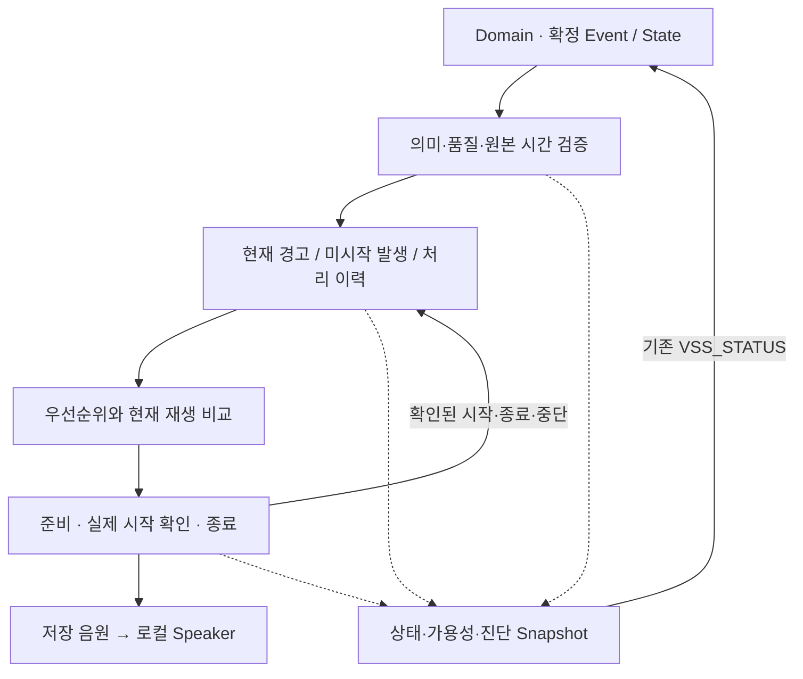

# VSS Functional Design Draft v0.1

> Status: Draft / Team-shareable  
> Scope: Dedicated S32K344 VSS의 의미 입력·음향 선택·재생·상태·고장/복구 동작  
> Validation: Document design only · Firmware/board validation not performed

## 0. 문서 상태와 읽는 방법

| 문서 | 역할 |
|---|---|
| VSS Functional Design | VSS가 기능적으로 어떻게 동작하는가 |
| VSS SW Architecture | 그 기능을 Firmware Component/Layer 책임으로 나누는 구조 |
| Domain Interface Matrix §4.5 | 이미 정해진 VSS Logical Interface |
| Network Design / Network SW Architecture | 기존 wire contract와 Network Stack |

VSS 담당자가 아닌 팀원이 **어떤 입력이 어떤 조건에서 소리로 이어지는지** 이해하기 위한 기능 설계 초안이다. 논리 동작의 기준은 Stage 0~2, Stage 3A v0.2, Stage 3B v0.4 Frozen 및 Architecture Baseline v1.1이다. 공유 초안이라는 표시는 기능을 새로 정한다는 뜻이 아니다.

전체 흐름은 §3, 입력과 정상 동작은 §4~10, 상태·고장과 대표 흐름은 §11~13에서 확인한다. 구현 책임은 [VSS SW Architecture](VSS_sw_architecture.md)에 있다. §14~15에서 현재 정의 범위와 후속 구현을 구분한다.

## 1. 목적과 설계 범위

**VSS는 Domain이 확정한 Event/State의 신뢰성과 최신성을 확인하고, 저장된 음원 중 하나를 선택해 로컬 Speaker로 제공하며, 자신의 상태·가용성·고장을 Domain에 보고한다.**

| VSS 책임 | 다른 담당의 책임 |
|---|---|
| 의미 입력 검증·수용, 현재 경고와 미시작 Event 관리 | CIS의 센싱, Domain의 차량·후방 위험 수준 판단 |
| 중앙 음향 정책에 따른 선택·단일 재생·안전 종료 | BCM/WINDOW 액추에이터 실행, WINDOW의 로컬 Anti-Pinch 보호 |
| 자체 음향 출력 Fault와 허용된 Recovery, 외부 상태 제공 | 차량 전체 상태 판단과 기존 Network transport |

거리 원값으로 위험을 다시 판단하지 않는다. 외부 Audio Stream, 조도·시간 기반 자동 음량, Mixing/Ducking/Fade는 기능 범위에 포함하지 않는다.

WINDOW / Anti-Pinch는 **[구현 보류 — 설계 유지]**다. 음향 의미·우선순위·재생·Test Injection 경로는 유지하며 실제 WINDOW ECU 연동과 보호 기능의 통합 검증은 보류 상태다.

## 2. 기준 자료와 외부 계약

| 기준 자료 | 적용 내용 |
|---|---|
| `VSS_SOFTWARE_ARCHITECTURE_BASELINE_v1.1.md` §5~11 | 최신 VSS 입력·중재·Playback·Fault/Recovery의 통합 의미 |
| `sysRS(20260918-141648).md` VSS §7 | 기능·성능·음향 후보값·진단 요구. 후보와 잠정값의 지위 유지 |
| `Domain_Master_Interface_Matrix_v0.1(2).md` §4.5 | 기존 10 D2V / 10 V2D 논리 의미 |
| `network_design_draft_v0.1.md` §4.3, §5.2~5.4, §8 | 기존 VSS CAN/Wire contract의 메시지·필드·주기·시간 기준 |

기존 Network 경계는 아래 세 메시지로 연결된다. CAN ID, payload, cycle, timeout과 wire code는 **Network Design의 해당 표**를 따른다. 그 문서에 남아 있는 초안 제안·잠정값의 상태도 유지한다.

| 방향 | 기존 메시지 | 연결되는 논리 의미 |
|---|---|---|
| Domain → VSS | `VSS_EVENT` | One-shot 5종과 발생·품질 근거 |
| Domain → VSS | `VSS_WARNING_STATE` | Stateful 경고, Rear Activation, 각 의미의 품질·시간 근거 |
| VSS → Domain | `VSS_STATUS` | State·Availability·Accepting·현재/최근 Fault |

이후 Network binding은 이 기존 계약을 Firmware에 연결하는 작업이다. VSS 내부 재생 동작과 Recovery는 최신 Frozen VSS를 기준으로 읽는다.

## 3. 전체 기능 개요

입력을 수용한 것, Winner로 선택한 것, 실제 출력을 시작한 것은 서로 다른 사실이다. 한 번에 가능한 출력 owner는 하나이며, 교체 시 이전 출력과 옛 시작 권한을 안전하게 정리한 뒤 새 출력을 시작한다.

## 4. 입력 의미와 기능 분류

아래는 **Matrix §4.5의 기존 입력 10개 요약**이다. 숫자 코드나 payload 정의가 아니다.

| 기존 ID | 입력 의미 | 기능 분류와 적용 |
|---|---|---|
| D2V-001 | `VEHICLE_WELCOME` | 차량 사용 시작 전이의 One-shot. Wake·통신 복구 자체는 새 Welcome이 아님 |
| D2V-002 | `VEHICLE_GOODBYE` | 차량 사용 종료 전이의 One-shot |
| D2V-003 | `DOOR_LOCK_COMPLETE` | 새 LOCK 요청의 목표 정상 확인 One-shot. 이미 잠겨 있어도 새 요청이면 별개 발생 |
| D2V-004 | `DOOR_UNLOCK_COMPLETE` | 새 UNLOCK 요청의 목표 정상 확인 One-shot |
| D2V-005 | `DOOR_LOCK_ERROR` | 실제 LOCK 실행 뒤 목표 확인 실패의 Caution One-shot. 실행 전 거부·결과 미확인과 구분 |
| D2V-006 | `WINDOW_ANTIPINCH_STATE` | CLEAR/ACTIVE의 Stateful warning. **[구현 보류 — 설계 유지]** |
| D2V-007 | `OCCUPANT_HAZARD_STATE` | CLEAR/ACTIVE의 Stateful warning |
| D2V-008 | `REAR_OBSTACLE_STATE` | CLEAR/CAUTION/EMERGENCY의 Stateful warning |
| D2V-009 | `REAR_DETECTION_ACTIVATION` | ACTIVE/DISABLED의 Stateful gating/context. 자체 경고음 후보가 아님 |
| D2V-010 | `VSS_INPUT_QUALITY_META` | Validity·Availability·Original Age·Ordering·Generation 등 대상 입력의 검증 근거 |

Quality는 의미를 현재 신뢰할 수 있는지, Original Age는 최초 발생/원본 판단부터 얼마나 지났는지, Ordering은 갱신의 선후, Generation은 source 재시작 문맥을 나타낸다. 전달·수용·재전달로 원본 나이를 초기화하지 않는다. value와 Meta는 동일 원본 근거에 연결돼야 한다.

## 5. 입력 수용과 현재 상태 관리

| 단계 | 뜻 |
|---|---|
| received | 입력이 도착했다. 아직 유효성·저장 성공을 보장하지 않는다 |
| valid | 의미·품질·원본 시간·출처/순서/문맥 검사를 통과했다 |
| accepted | 필요한 상태와 발생 추적 근거를 확보해 Store에 일관되게 반영했다. 출력 완료나 재생 약속은 아니다 |

동일 발생의 재전달은 기존 처리 이력을 조회하며 새 Pending·새 기한·새 소리를 만들지 않는다. 같은 종류라도 별개 새 도어 요청의 확인은 별개 occurrence다. 저장 여유가 없으면 신규 수용을 거부하고 이미 수용한 발생의 추적 근거를 잃지 않는다.

| 지속형 입력에서 유지하는 정보 | 예: 유효 ACTIVE 이후 최신 INVALID |
|---|---|
| last valid | 마지막 정상 판단은 ACTIVE였다는 기록 |
| current quality | 지금 입력은 INVALID이며 현재 위험을 새로 확인할 수 없음 |
| effective state | 제한 Hold 중인 경고 후보 또는 Hold 만료 후 후보 없음 |

**CLEAR는 확인된 위험 해제, DISABLED는 기능 비활성, STALE/INVALID/SNA/UNCONFIRMED는 입력 신뢰 불가**다. 입력을 신뢰할 수 없거나 소리가 멎었다는 이유로 CLEAR를 만들지 않는다. 과거/역순 패킷은 현재 정상값·품질을 덮어쓰지 않는다.

Hold는 **기존에 확인된 경고만** 제한 기간 동안 후보로 유지하는 처리다. 첫 신뢰성 상실 또는 더 이른 원본 freshness deadline부터 계산하고, 반복 INVALID·재전달·선점·Audio Recovery로 연장하지 않는다. 과거 유효 경고가 없으면 새 위험을 추정하지 않는다. 시간 후보값은 Frozen 입력 계약과 SysRS §7.6을 따른다.

## 6. One-shot 기능 동작

One-shot은 사건 한 발생에 대한 음향이다. Welcome, Goodbye, Lock Complete, Unlock Complete, Lock Error의 **5종** 모두 이 규칙을 따른다.

| 처리 상태 | 기능 의미 |
|---|---|
| Pending | accepted됐지만 실제 시작은 확인되지 않음. 중재·초기화·출력 제한 중에도 원 발생 기한은 계속 흐름 |
| Started | 적법한 `OUTPUT_START_CONFIRMED` 이후 실제 시작 사실을 반영 |
| Completed | 전체 음향 정책 완료와 출력 종료·옛 권한 차단이 확인됨 |
| Interrupted | Started된 음향이 선점/출력 고장으로 중단돼 안전 종료됨. 자동 resume 금지 |
| Expired | 미시작임이 확실한 발생이 원 발생 Max Age에 도달함. 같은 발생을 다시 Pending으로 만들지 않음 |

**[잠정] 실제 새 시작은 원 발생부터 2초 미만**이어야 한다. 송신·중계·VSS 대기·준비 시간이 모두 포함되며 실제 시작 직전에도 재검사한다. 정확히 2초에 도달하거나 원 발생·동일성을 확인할 수 없으면 새로 시작하지 않는다. 기한 안에 정상 시작한 음향은 이후 2초가 됐다는 이유만으로 자르지 않는다.

VSS 내부 generic One-shot lifecycle의 **[잠정] Max Age**는 최신 Frozen VSS를 따른다. `VSS_EVENT.USE_LIMIT` field와 wire numeric 값은 기존 Network Design을 따른다. 이 공유 문서는 두 계약을 재정의하거나 통합 수치·새 binding rule을 만들지 않는다.

시작 여부가 불명확한 발생은 Expired나 확정 미시작으로 단정하지 않고 재생 금지 근거를 보존한다. 확실한 no-start와 미래 옛 activation 차단이 입증된 미시작 발생은 원 age·replay 조건 안에서 Pending을 유지할 수 있다. 같은 발생의 이중 start나 즉시 무한 retry는 허용하지 않는다.

Firmware 책임은 **C08이 확인된 시작/종료/중단 사실을 C05에 통지 → C05가 occurrence ledger와 replay guard를 변경 → C08이 안전한 출력 권한 정리 후 Session identity / output owner를 retire**로 나뉜다. ledger terminal과 출력 owner 해제는 서로 다른 경계다.

## 7. Stateful Warning 기능 동작

Anti-Pinch, Occupant Hazard, Rear Obstacle은 현재 effective 경고가 유효한 동안 후보로 남고 Winner로 선택된 동안에만 소리를 낸다. 같은 ACTIVE의 새 정상 갱신이나 반복 수신으로 Session·cue를 처음부터 재시작하지 않는다.

| 현재 조건 | 기능 동작 |
|---|---|
| fresh ACTIVE 또는 Rear CAUTION/EMERGENCY | 대응 경고 후보 생성·등급 갱신, 전체 후보 비교 |
| 유효 CLEAR | 해당 후보만 제거, 해당 출력 종료 후 다른 후보 비교 |
| Rear의 유효 DISABLED | 후방 후보·출력·Hold 제거. **DISABLED != CLEAR** |
| 입력 신뢰성 상실 + 기존 유효 경고 | 제한 Hold 후보로 유지하며 품질은 신뢰 불가로 남김 |
| Hold 만료 | 해당 후보·출력 종료, 입력 미확인 유지 |
| 높은 경고에 선점됨 | **선점은 CLEAR가 아니다.** 최신 상태·기한을 계속 평가 |
| 이후 다시 선택됨 | effective가 현재도 유효하면 새 Session에서 정책 시작점부터 재생 |

후방 경고에는 위험 상태와 Activation의 서로 양립하는 최신 근거가 필요하다. ACTIVE만으로 경고음을 만들지 않으며, 비활성 전의 오래된 EMERGENCY를 재활성화 뒤 자동으로 되살리지 않는다. EMERGENCY→CAUTION은 옛 긴급 출력을 종료하고 전체 후보를 다시 비교한다.

## 8. 우선순위와 음향 선택

Class는 **Emergency > Caution > Feedback**이다. 같은 Class의 아래 semantic sub-priority는 **[잠정]** 지위를 유지한다.

| Class | 높은 순서 → 낮은 순서 |
|---|---|
| Emergency **[잠정]** | Anti-Pinch → Rear Emergency → Occupant Hazard |
| Caution **[잠정]** | Rear Caution → Door Lock Error |
| Feedback **[잠정]** | Door Unlock Complete → Door Lock Complete → Vehicle Goodbye → Vehicle Welcome |

같은 의미의 여러 미시작 One-shot은 원 발생 순서, 동률이면 occurrence 식별자의 고정 순서로 비교한다. 수신 순서나 queue 삽입 순서로 대신하지 않는다.

더 높은 의미 순위의 후보는 현재 음향의 교체를 요구할 수 있고, 낮은 새 후보는 현재 음향을 끊지 않는다. 이미 Started된 같은 의미 One-shot을 뒤늦게 도착한 오래된 occurrence로 선점하지 않는다. Winner가 없다는 이유만으로 계속 유효한 현재 One-shot을 중단하지 않는다.

후보가 존재하는 것, 정책상 Winner가 되는 것, 지금 start할 수 있는 것은 별개다. 높은 경고가 계속 선택되면 낮은 One-shot은 시작 전에 만료할 수 있으며 모든 수용 요청의 출력을 보장하지 않는다.

## 9. 재생 시작·완료·선점·종료

**Winner → prepare → start 요청 → OUTPUT_START_CONFIRMED**를 구분한다. prepare는 음향을 내지 않으며 성공/요청 수락만으로 Started나 PLAYING을 보고하지 않는다. 시작 fact는 추상 출력 경계의 확인으로, 실제 청취·음압 측정 완료를 의미하지 않는다.

종료 때는 옛 출력 종료와 모든 옛 start/cue/repeat의 미래 activation 차단을 확인한다. 이 **retirement fence** 전에는 다음 Backend Session을 prepare/start하지 않는다. 종료 후 최신 coherent Snapshot으로 다시 중재하므로 선점 당시 Winner가 사라졌으면 그대로 시작하지 않는다.

STOPPING은 termination을 기다리는 logical closing이며 stop API 호출 여부로 정의하지 않는다. ABORTING은 긴급/비정상 정리다. start 미확정 상태에서 직접 ABORTING으로 들어가도 no-start / late valid start / uncertain의 같은 구분을 적용한다.

| closing 중 결과 | 기능 처리 |
|---|---|
| 확실한 no-start + 미래 옛 activation 차단 | 안전 retire 후 현재 후보·원 age 재평가 |
| 살아 있는 동일 시도의 적법한 late start, terminal latch 전 | Started/PLAYING 사실 반영, 기존 closing/abort 의도 유지. 정상 ACTIVE로 되돌리지 않음 |
| start outcome uncertain **확정** | QUARANTINED, **FAULT + UNAVAILABLE + PLAYBACK_STATE_FAILURE**, 재생 차단과 cleanup/허용 Recovery |

정상 START_IN_FLIGHT 대기 자체는 Fault가 아니다. abort API 성공이나 현재 무음도 no-start/termination 증거가 아니다. uncertain terminal 이후의 late callback은 진단·옛 cleanup 근거로만 처리하며 발생을 재생 가능 상태로 되살리지 않는다.

## 10. 음향 Mapping과 Pattern

중앙 Sound Catalog/Policy가 **의미 → Class → Asset → 전체 재생 패턴**을 연결한다. Domain 입력은 Asset 주소나 sample을 운반하지 않는다.

| 의미 | Class / 재생 정책 |
|---|---|
| Welcome / Goodbye | Feedback, 각각 구분되는 One-shot |
| Lock Complete / Unlock Complete | Feedback, 잠금/해제를 구분하는 확인음. Unlock의 복수 cue 후보는 하나의 logical Session으로 처리 가능 |
| Door Lock Error | Caution One-shot, 완료음과 구분되는 실패 경고음 |
| Rear CAUTION / EMERGENCY | Caution / Emergency, 선택된 현재 모드의 반복 또는 지속 패턴 |
| Occupant Hazard / Anti-Pinch | Emergency, 선택된 현재 경고의 패턴. Anti-Pinch **[구현 보류 — 설계 유지]** |

cue 수·반복 간격·길이·출력 수준의 기존 후보는 SysRS §7.13을 따른다. 구체 Asset file/주소·호환 sample 형식과 미정 패턴은 **[TBD]**다. 여러 cue와 cue 사이 무음도 하나의 전체 정책 Session일 수 있으며 개별 cue/block 완료를 전체 Completed로 취급하지 않는다. 사용 불가 Asset을 다른 의미의 음향으로 대체하지 않는다.

## 11. 상태·가용성·고장

아래 두 표는 **기존 V2D 10개 의미의 요약**이다. 외부 상태와 내부 Playback gate는 구분한다.

| 기존 ID / 정보 | 해석 |
|---|---|
| V2D-001 / `VSS_STATE` | STARTUP: 초기화 중. READY: 정상 준비 완료·확인된 활성 재생 없음. PLAYING: 실제 start가 확인된 Session 진행. FAULT: 정상 음향 출력 보장 불가 |
| V2D-002 / `VSS_AVAILABILITY` | FULL: 지원 음향 서비스 정상. DEGRADED: 일부 제한이나 다른 주요 음향 제공 가능. UNAVAILABLE: 정상 출력 보장 불가, FAULT와 연결 |
| V2D-003 / `VSS_ACCEPTING_EVENTS` | ingress·검증·Store 자원·시간/source/replay 준비의 coarse 수용 Snapshot |
| V2D-004 / `VSS_FAULT_ACTIVE` | 현재 내부 출력 고장 존재 |
| V2D-005 / `VSS_LAST_FAULT` | 최근 주요 내부 출력 고장. 현재 active fault 집합과 구분 |

| 기존 ID / Internal Fault Category | 뜻 |
|---|---|
| V2D-006 / `SOUND_ASSET_UNAVAILABLE` | 필요한 저장 음원을 사용하지 못함 |
| V2D-007 / `PLAYBACK_START_FAILURE` | Playback 시작 실패 |
| V2D-008 / `AUDIO_OUTPUT_FAILURE` | 공통 Audio Output Path 이상 |
| V2D-009 / `PLAYBACK_STATE_FAILURE` | Session 상태/출력 소유권 정합성 이상. uncertain 확정도 이 근거에 연결 |
| V2D-010 / `INITIALIZATION_FAILURE` | 확인된 초기화 실패 |

PLAYING에는 cue 무음·반복 대기·확인된 시작 이후의 closing도 포함된다. READY/FULL이어도 이전 owner를 닫는 중이면 새 start는 기다린다. DEGRADED여도 정상 Asset 후보는 처리할 수 있다.

정상 STARTUP의 Availability 미평가는 실패가 아니다. 새 외부 State/Availability 값을 추가하지 않으며 평가 전 보고는 기존 계약의 후속 binding에서 다룬다.

ACCEPTING_EVENTS=true는 개별 accepted나 출력 약속이 아니다. false일 때도 정상인 경로의 known duplicate, Stateful/CLEAR·품질 갱신과 기존 기록·기한 처리는 계속할 수 있다. Audio Fault 중 Store가 정상이면 수용 가능한 상태일 수 있다.

미수신·STALE·INVALID 등의 입력 진단은 **출력 고장과 분리**한다. 일부 Asset 손실과 핵심 Asset 전체 손실로 정상 서비스가 불가능한 경우도 구분한다. 정상 서비스 전체 불가인데 FULL을 유지하지 않으며 정확한 Summary 파생·fault binding은 Stage 6/7 상세 정책이다. WINDOW 연동 보류 자체는 DEGRADED/FAULT의 원인이 아니다.

## 12. Fault와 Recovery

VSS 내부 Pending / replay / terminal 처리는 최신 Frozen VSS lifecycle을 따른다. Network Design은 기존 wire / transport contract의 기준이다.

공통 출력 불능이나 uncertain 격리에서는 정상 새 출력을 차단하고 FAULT/UNAVAILABLE을 제공한다. Store·시간 근거가 정상이면 입력 검증과 현재 상태·Pending 기한 관리는 계속한다.

허용된 Recovery의 성공에는 옛 출력 종료·future activation 차단, single owner, 공통 경로 정상, Store/시간/replay 연속성과 진단 gate의 확인이 필요하다. **retire나 무음만으로 READY로 돌아가지 않는다.** 성공 시 복구된 active fault를 해제하되 다른 fault와 최근 이력을 보존한다.

다른 Fault가 없으면 READY로 복귀한 뒤 **현재 유효 Stateful + 아직 미시작·원 유효기간 내·replay 조건을 만족하는 One-shot**만 최신 상태로 재평가한다. Completed/Interrupted/Expired/uncertain terminal을 replay하지 않고 원 age와 Hold도 초기화하지 않는다.

PER-009의 recovery decision 기한은 **recoverable로 분류된 출력 Fault에만** 적용한다. PLAYBACK_STATE_FAILURE도 그 분류를 만족해야 한다. 실제 DIA-017 recoverability 분류와 fault별 Recovery Action은 Stage 6/7 **[TBD]**, HW action·증거는 후속 상세 설계 범위다.

## 13. 대표 기능 흐름

다음은 문서상 동작 예이며 실제 시험 결과가 아니다.

| 흐름 | 기능적으로 진행하는 순서 |
|---|---|
| Door Lock Complete One-shot | 새 요청 목표 확인 → 발생/Meta 검증·Pending 수용 → Winner·준비 → 실제 시작 확인 → 전체 정책·termination 확인 → Completed. 동일 발생 재전달은 새 음향 없음 |
| Rear CAUTION → CLEAR | 유효 위험 + ACTIVE 결합 → Caution 후보 → 선택 시 재생 → 유효 CLEAR로 후방 후보 제거 → 안전 종료 → 다른 최신 후보 비교 |
| Feedback 중 Rear Emergency 선점 | Lock Started → 유효 Rear EMERGENCY가 높은 Winner → Lock closing·termination 확인 → Lock Interrupted → 최신 위험 재중재·새 Session. Lock 자동 resume 없음 |
| Input STALE/INVALID → Hold → stop | 마지막 유효 경고 → current quality 신뢰 불가 → 최초 loss 기준 제한 Hold → 만료 시 해당 후보·출력 종료. 위험 CLEAR로 보고하지 않음 |
| Output Fault → Recovery | 실제 출력 불능 → FAULT/UNAVAILABLE·안전 정리 → 허용 Recovery 및 gate 검증 → READY → 현재 유효 State/미시작 유효 Event만 재평가 |
| WINDOW Anti-Pinch Test Injection | **[구현 보류 — 설계 유지]**. 독립 TEST 출처 → 공통 검증·Store·선택·Playback 경로. 실제 WINDOW 감지/보호 연동 완료를 의미하지 않음 |

## 14. 현재 구현·보류 상태

| 항목 | 상태 |
|---|---|
| 논리 기능·입력/재생 lifecycle | 정의, Frozen 의미 적용 |
| 외부 Logical Interface | 기존 10 D2V / 10 V2D 사용 |
| Network contract | 기존 VSS_EVENT / VSS_WARNING_STATE / VSS_STATUS mapping 참조, 원문 초안 지위 유지 |
| Audio HW binding·실제 시작/종료 증거 | **[TBD]**, 구현·검증 필요 |
| Firmware 구현 / Board validation | 본 문서에서 수행하지 않음 |
| 시간·음향 후보값 | 기존 **[잠정]/후보** 유지, 실측 전 |
| WINDOW 실제 연동 | **[구현 보류 — 설계 유지]** |

## 15. 후속 상세 설계와 관련 문서

| 단계 | 상세화할 내용 |
|---|---|
| Stage 4 | Audio HW/Data Path, Asset·RAM·출력 start/no-start/termination 실제 증거 |
| Stage 5 | 실행·동시성·deadline 처리와 직렬화 |
| Stage 6 | 모듈/API/identity·resource·Fault 정책 상세 |
| Stage 7 | 기존 Network mapping의 VSS semantic/status binding과 integration |
| Stage 8 | 경합·고장·음향·실기 성능 검증 |

구현 책임과 Layer는 [VSS_sw_architecture.md](VSS_sw_architecture.md)를 읽는다. 입력 수용·Hold·ledger 상세는 VSS_05~07, 중재/Playback/Backend 상세는 VSS_09~12의 해당 계약을 따른다.
