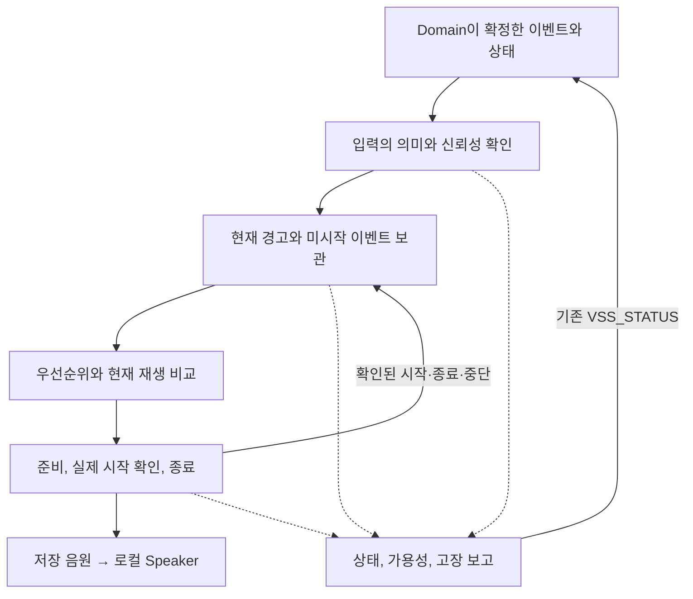

# VSS Functional Design Draft v0.1

> Status: Draft / Team-shareable  
> Scope: Dedicated S32K344 VSS의 입력 처리, 음향 선택과 재생, 상태 보고 및 고장 복구  
> Validation: Document design only · Firmware/board validation not performed

## 0. 문서 목적과 현재 상태

**VSS가 어떤 입력을 받아 어떤 조건에서 소리를 내고, 어떤 상태를 보고하는지** 설명한다. 논리 설계를 팀에 공유하는 초안이다. 펌웨어 구현과 보드 검증은 수행하지 않았다.

처음에는 §1의 역할과 §3의 전체 흐름을 읽고, §5~8에서 음향 선택과 재생 동작을 확인한다. 입력·출력 목록은 §2, 대표 예시는 §9에 있다. 구현 책임은 [VSS SW Architecture](../architecture/VSS_sw_architecture.md), 설계 기준과 후속 구현은 §10을 따른다.

| 문서 | 읽을 내용 |
|---|---|
| 이 기능 문서 | 입력에 따른 음향과 상태의 동작 |
| VSS SW Architecture | 위 동작을 담당하는 펌웨어 구성 요소와 Layer |
| Domain Interface Matrix §4.5 | 기존 10 D2V / 10 V2D 논리 Interface |
| Network Design / Network SW Architecture | 기존 메시지 전송 계약과 통신 SW 구조 |

## 1. VSS 역할과 범위

**VSS는 Domain이 확정한 이벤트와 상태를 확인하고, 저장된 음원 하나를 선택해 로컬 Speaker로 재생한다. 자신의 상태와 가용성, 고장도 Domain에 보고한다.**

| VSS가 담당하는 일 | 다른 담당의 책임 |
|---|---|
| 입력 검증과 수용, 현재 경고와 미시작 이벤트 관리 | CIS의 센싱, Domain의 차량·후방 위험 수준 판단 |
| 중앙 음향 정책에 따라 음향을 선택하고 하나씩 재생하며 안전하게 종료 | BCM/WINDOW의 액추에이터 실행, WINDOW의 로컬 Anti-Pinch 보호 |
| 자체 음향 출력 고장을 관리하고 정책상 허용된 복구와 상태 보고 수행 | 차량 전체 상태 판단과 기존 Network 전송 |

거리 원시값으로 위험을 다시 판단하지 않는다. 외부 Audio Stream, 조도나 시간에 따른 자동 음량 조절, Mixing/Ducking/Fade는 범위 밖이다.

WINDOW / Anti-Pinch는 **[구현 보류 — 설계 유지]**다. 음향 의미와 우선순위, 재생 및 시험 입력(Test Injection) 경로는 유지한다. 실제 WINDOW ECU 연동과 보호 기능의 통합 검증은 보류한다.

## 2. 외부 입력·출력 계약

Domain은 이벤트와 지속되는 경고 상태, 입력의 품질과 시간 정보를 보낸다. VSS는 현재 상태, 서비스 가능 수준, 고장 정보를 돌려준다. 사건이 한 번 발생했을 때 내는 음향을 **One-shot**, 현재 위험 상태에 따라 내는 경고를 **Stateful Warning**이라고 한다.

| 방향 | 기존 Network 메시지 | 연결되는 의미 |
|---|---|---|
| Domain → VSS | `VSS_EVENT` | One-shot 5종과 발생 및 품질을 확인할 정보 |
| Domain → VSS | `VSS_WARNING_STATE` | Stateful 경고, Rear Activation과 품질·시간을 확인할 정보 |
| VSS → Domain | `VSS_STATUS` | 상태, 가용성, 수용 가능 여부와 현재 고장 및 최근 고장 |

CAN ID와 payload, 전송 주기, timeout, 전송 코드는 기존 Network Design의 표를 따른다. 원문의 초안과 잠정값은 그대로 둔다. 아래 표는 **기존 Interface의 의미 요약**이며 새 인코딩이나 Signal을 정의하지 않는다.

### 2.1 Domain → VSS: 기존 입력 10개

| ID | 입력 의미 | 적용 |
|---|---|---|
| D2V-001 | `VEHICLE_WELCOME` | 차량 사용을 시작하는 상태 전이의 One-shot. Wake나 통신 복구 자체는 새 Welcome이 아님 |
| D2V-002 | `VEHICLE_GOODBYE` | 차량 사용을 종료하는 상태 전이의 One-shot |
| D2V-003 | `DOOR_LOCK_COMPLETE` | 새 LOCK 요청의 목표 상태를 정상적으로 확인. 이미 잠겨 있어도 새 요청이면 별개 발생 |
| D2V-004 | `DOOR_UNLOCK_COMPLETE` | 새 UNLOCK 요청의 목표 상태를 정상적으로 확인 |
| D2V-005 | `DOOR_LOCK_ERROR` | 실제 LOCK 실행 뒤 목표 확인에 실패한 Warning / Caution One-shot. 실행 전 거부나 결과 미확인과 구분 |
| D2V-006 | `WINDOW_ANTIPINCH_STATE` | CLEAR/ACTIVE의 Stateful 경고. **[구현 보류 — 설계 유지]** |
| D2V-007 | `OCCUPANT_HAZARD_STATE` | CLEAR/ACTIVE의 Stateful 경고 |
| D2V-008 | `REAR_OBSTACLE_STATE` | CLEAR/CAUTION/EMERGENCY의 Stateful 경고 |
| D2V-009 | `REAR_DETECTION_ACTIVATION` | ACTIVE/DISABLED로 후방 기능 활성 여부와 판단 문맥을 전달. 자체 경고음 후보가 아님 |
| D2V-010 | `VSS_INPUT_QUALITY_META` | Validity, Availability, Original Age, Ordering, Generation 등 대상 입력의 검증 근거 |

Quality는 현재 입력의 신뢰성을, Original Age는 최초 발생이나 원본 판단부터 경과한 시간을 나타낸다. Ordering은 갱신 순서, Generation은 송신 측 재시작 문맥이다. 값과 Meta는 같은 원본을 기준으로 해야 한다. 전달, 수용, 재전달로 원본 경과 시간을 초기화하지 않는다.

### 2.2 VSS → Domain: 기존 출력 10개

| ID | 출력 의미 | 해석 |
|---|---|---|
| V2D-001 | `VSS_STATE` | STARTUP: 초기화 중. READY: 정상 준비 완료, 활성 재생은 확인되지 않음. PLAYING: 실제 시작이 확인된 재생 진행 중. FAULT: 정상 음향 출력을 보장할 수 없음 |
| V2D-002 | `VSS_AVAILABILITY` | FULL: 지원 서비스 정상. DEGRADED: 일부 제한이 있지만 다른 주요 음향은 제공 가능. UNAVAILABLE: 정상 출력을 보장할 수 없으며 FAULT와 연결 |
| V2D-003 | `VSS_ACCEPTING_EVENTS` | 입력 경로와 검증·저장 자원, 시간·출처 정보와 재실행 방지 준비를 종합해 입력 수용 가능 여부를 보고 |
| V2D-004 | `VSS_FAULT_ACTIVE` | 현재 내부 출력 고장이 존재함 |
| V2D-005 | `VSS_LAST_FAULT` | 최근 주요 내부 출력 고장. 현재 고장 집합과 구분 |
| V2D-006 | `SOUND_ASSET_UNAVAILABLE` | 필요한 저장 음원을 사용할 수 없음 |
| V2D-007 | `PLAYBACK_START_FAILURE` | 재생 시작 실패 |
| V2D-008 | `AUDIO_OUTPUT_FAILURE` | 공통 Audio Output Path 이상 |
| V2D-009 | `PLAYBACK_STATE_FAILURE` | 재생 상태나 출력 소유권의 정합성 이상. 시작 결과가 불명확하다고 확정된 경우도 포함 |
| V2D-010 | `INITIALIZATION_FAILURE` | 확인된 초기화 실패 |

## 3. 전체 기능 흐름

입력 수용, 재생 대상 선택, 실제 출력 시작은 서로 다른 사실이다. 동시에 실제 출력을 제어하는 재생은 하나만 허용한다. 교체할 때는 이전 출력을 끝내고 해당 재생에 남은 시작 권한을 안전하게 정리한다.

## 4. 입력을 어떻게 다루는가

| 단계 | 의미 |
|---|---|
| 수신(received) | 입력이 도착함. 유효성이나 저장 성공을 보장하지 않음 |
| 유효(valid) | 의미와 품질, 원본 시간, 출처와 순서 및 문맥 검사를 통과함 |
| 수용 완료(accepted) | 필요한 상태와 발생 추적 정보를 확보해 저장함. 재생 약속이나 출력 완료는 아님 |

동일 발생이 다시 전달되면 기존 처리 이력을 조회한다. 새 대기 항목이나 기한, 소리를 만들지 않는다. 같은 종류라도 새 도어 요청에 대한 확인은 별개 발생이다. 저장 공간이 부족하면 새 입력 수용을 거부하고, 이미 수용한 발생의 추적 정보는 보존한다.

지속형 입력에서는 마지막 정상 판단과 현재 품질, 지금 사용할 경고 상태를 구분한다. 유효한 ACTIVE 뒤에 INVALID를 받으면 마지막 정상 판단은 ACTIVE로 남는다. 현재 입력은 신뢰할 수 없으며, 정해진 유지 기간 동안만 경고 후보를 둘 수 있다.

**CLEAR는 위험이 해제됐다는 확인, DISABLED는 기능 비활성이다.** STALE/INVALID/SNA/UNCONFIRMED는 입력을 신뢰할 수 없다는 뜻이다. 입력이 불확실하거나 무음이라고 CLEAR로 처리하지 않는다. 과거 패킷이나 역순으로 도착한 패킷도 현재 정상값과 품질을 덮어쓰지 않는다.

이전에 확인한 경고를 정해진 기간 동안 유지하는 처리를 **Hold**라고 한다. 처음 신뢰성을 잃은 시점과 원본 유효기한 중 더 이른 시점을 기준으로 계산한다. 반복 INVALID, 재전달, 선점이나 Audio Recovery로 연장하지 않는다. 과거에 유효한 경고가 없었다면 새 위험을 추정하지 않는다. 시간 후보값은 기존 입력 계약과 Domain VSS Cross-check §8.3의 **[잠정]** 근거를 따른다. 미정 항목은 SysRS §14.2에 남아 있다.

## 5. 음향 요청의 두 종류

One-shot은 사건이 한 번 발생했을 때의 음향을 처리하고, Stateful Warning은 현재 유효한 위험 상태를 따른다. 어느 쪽도 입력 수용만으로 재생을 보장하지 않는다.

### 5.1 One-shot: 한 번 발생한 사건

Welcome, Goodbye, Lock Complete, Unlock Complete, Lock Error의 **5종**이 같은 규칙을 따른다.

| 처리 상태 | 기능 의미 |
|---|---|
| Pending | 수용됐지만 실제 시작은 확인되지 않음. 중재나 초기화, 출력 제한 중에도 원본 경과 시간은 계속 누적 |
| Started | 적법한 `OUTPUT_START_CONFIRMED`를 받은 뒤 실제 시작 사실 반영 |
| Completed | 전체 음향 정책의 완료와 출력 종료, 이전 재생의 출력 권한 차단 확인 |
| Interrupted | Started된 음향이 선점이나 출력 고장으로 중단돼 안전하게 종료됨. 자동 resume 금지 |
| Expired | 미시작이 확인된 발생이 원본 발생 기준 Max Age에 도달함. 같은 발생을 Pending으로 되살리지 않음 |

**[잠정] 실제 새 시작은 원 발생부터 2초 미만**이어야 한다. 송신과 중계, VSS 대기와 준비 시간을 모두 포함하며 실제 시작 직전에도 확인한다. 정확히 2초에 도달하면 시작하지 않는다. 원본 발생 시점이나 동일 발생 여부를 확인할 수 없는 경우도 시작하지 않는다. 기한 안에 정상 시작한 음향은 이후 2초가 됐다는 이유만으로 중단하지 않는다.

이 **[잠정] Max Age**는 VSS 내부 One-shot의 공통 생명주기 기준이다. `VSS_EVENT.USE_LIMIT` 필드와 전송되는 수치는 기존 Network Design의 계약이다. 두 기준을 하나의 수치나 새 min/AND 연결 규칙으로 합치지 않는다. 시작 여부가 불명확하거나 미시작이 확인된 경우는 §7.2를 따른다.

### 5.2 Stateful Warning: 현재 위험 상태

Anti-Pinch, Occupant Hazard, Rear Obstacle은 현재 사용할 경고 상태가 유효한 동안 후보로 남고, 선택된 동안에만 소리를 낸다. 같은 ACTIVE가 정상 갱신되거나 반복 수신돼도 재생과 개별 소리를 처음부터 다시 시작하지 않는다.

| 현재 조건 | 동작 |
|---|---|
| 유효 ACTIVE 또는 Rear CAUTION/EMERGENCY | 해당 경고 후보를 만들거나 등급을 갱신한 뒤 전체 후보 비교 |
| 유효 CLEAR | 해당 후보만 제거하고 출력 종료 후 다른 후보 비교 |
| Rear의 유효 DISABLED | 후방 후보와 출력, Hold 제거. **DISABLED != CLEAR** |
| 입력 신뢰성 상실, 기존 유효 경고 있음 | 정해진 기간 동안 Hold 후보를 유지하되 현재 품질은 신뢰 불가로 남김 |
| Hold 만료 | 해당 후보를 제거하고 출력 종료. 입력은 미확인 상태로 유지 |
| 높은 경고에 선점됨 | **선점은 CLEAR가 아니다.** 최신 상태와 기한을 계속 평가 |
| 이후 다시 선택됨 | 경고가 현재도 유효하면 새 재생 단위(Session)에서 정책 시작점부터 재생 |

후방 경고에는 위험 상태와 Activation을 함께 적용할 수 있는 최신 근거가 필요하다. Activation의 ACTIVE만으로 경고음을 만들지 않는다. 비활성화 전의 오래된 EMERGENCY를 재활성화 뒤 자동으로 되살리지 않는다. EMERGENCY→CAUTION이면 이전 긴급 출력을 종료하고 전체 후보를 다시 비교한다.

## 6. 어떤 음향을 먼저 재생하는가

등급은 **Emergency > Warning / Caution > Feedback**이다. Warning / Caution은 주의 경고 Class이며, 후방 상태값 `CAUTION`과 구분한다. 같은 등급 안의 다음 세부 우선순위는 **[잠정]**이다.

| Class | 높은 순서 → 낮은 순서 |
|---|---|
| Emergency **[잠정]** | Anti-Pinch → Rear Emergency → Occupant Hazard |
| Warning / Caution **[잠정]** | Rear Caution → Door Lock Error |
| Feedback **[잠정]** | Door Unlock Complete → Door Lock Complete → Vehicle Goodbye → Vehicle Welcome |

같은 의미의 미시작 One-shot은 원본 발생 순서로 비교한다. 동률이면 발생 식별자의 고정 순서를 쓴다. 수신 순서나 Queue 삽입 순서로 대신하지 않는다.

의미상 순위가 더 높은 후보는 현재 음향의 교체를 요구할 수 있다. 순위가 낮은 새 후보는 현재 음향을 끊지 않는다. 이미 Started된 같은 의미 One-shot을 뒤늦게 도착한 오래된 발생으로 선점하지 않는다. 선택할 새 후보가 없다는 이유만으로 여전히 유효한 현재 One-shot을 중단하지 않는다.

후보가 존재하는 것, 정책상 선택되는 것, 지금 시작할 수 있는 것은 별개다. 우선순위가 높은 경고가 계속 선택되면 낮은 One-shot은 시작 전에 만료할 수 있다.

### 6.1 음원과 재생 패턴

중앙 음향 정책은 **의미 → Class → 음원(Asset) → 전체 재생 패턴**을 연결한다. Domain 입력으로 음원 주소나 sample을 전달하지 않는다.

| 의미 | Class / 재생 정책 |
|---|---|
| Welcome / Goodbye | Feedback, 서로 구분되는 One-shot |
| Lock Complete / Unlock Complete | Feedback, 잠금·해제 확인음. Unlock의 여러 개별 소리(cue) 후보도 한 Session으로 처리 가능 |
| Door Lock Error | Warning / Caution One-shot, 완료음과 구분되는 실패 경고음 |
| Rear CAUTION / EMERGENCY | Warning / Caution과 Emergency에 각각 대응, 선택된 현재 모드의 반복 또는 지속 패턴 |
| Occupant Hazard / Anti-Pinch | Emergency, 선택된 현재 경고 패턴. Anti-Pinch **[구현 보류 — 설계 유지]** |

개별 소리(cue)의 수, 반복 간격, 길이와 출력 수준 후보는 SysRS §6·§13을 따른다. 저장 음원 Asset은 MP3 형식을 사용한다. 실제 음원 파일과 Internal Program Flash 배치·주소, MP3 bitrate/sample rate/channel, decode 후 PCM format과 buffer 상세는 Stage 4~5 **[TBD]**이며, 미정 패턴도 **[TBD]**로 유지한다. 여러 cue와 그 사이의 무음도 한 Session에 포함될 수 있다. 개별 cue나 데이터 block이 끝났다고 전체 Completed로 처리하지 않는다. 사용할 수 없는 음원을 다른 의미의 소리로 대체하지 않는다.

## 7. 재생 동작

선택된 음향을 준비한 뒤 시작을 요청한다. 준비 중에는 소리를 내지 않는다. **`OUTPUT_START_CONFIRMED`로 실제 시작을 확인한 뒤에만 Started/PLAYING을 반영한다.** 요청 수락이나 준비 성공만으로 시작했다고 보고하지 않는다.

이는 설계에서 정의한 출력 경계의 시작 확인이며 실제 청취나 음압 측정을 마쳤다는 뜻은 아니다. 전체 재생 정책을 마치면 출력을 종료하고 다음 후보를 다시 비교한다.

### 7.1 안전 종료와 다음 재생

이전 출력이 끝나고, 그 재생에 남은 모든 시작·cue·반복 권한으로 이후 출력이 발생하지 않음을 확인해야 한다. 이 경계를 **retirement fence**라고 한다. 음원 읽기와 실제 출력을 담당하는 하위 기능 묶음을 Backend라고 한다. 이 경계가 확인되기 전에는 다음 Backend Session을 준비하거나 시작하지 않는다.

종료 뒤에는 일관된 최신 상태를 다시 비교한다. 선점 당시에 선택한 후보가 사라졌다면 그 음향을 시작하지 않는다.

### 7.2 상세 예외: 시작 확인 전 취소와 불명확한 결과

정상 START_IN_FLIGHT는 시작 요청 뒤 결과를 기다리는 단계다. 대기 자체는 Fault가 아니다. STOPPING은 종료 의도를 유지하며 실제 종료를 기다리는 상태이고, stop API 호출 여부로 정의하지 않는다. ABORTING은 긴급하거나 비정상적인 상황의 정리 단계다.

시작 여부가 확인되지 않은 상태에서 직접 ABORTING으로 들어가도 다음 세 결과를 동일하게 구분한다.

| 정리 중 확인 결과 | 처리 |
|---|---|
| 미시작이 확인되고 이전 재생의 모든 출력 권한이 차단됨 | 안전하게 소유권을 해제한 뒤 현재 후보와 원본 발생 후 경과 시간을 재평가. 유효한 미시작 Pending은 원본 경과 시간과 재실행 조건 안에서 유지 가능 |
| 아직 유지 중인 동일 시도에서 적법한 늦은 시작이 확인됨. 최종 처리 확정 전 | Started/PLAYING 사실 반영. 기존 종료·abort 의도를 유지하며 정상 ACTIVE로 복귀하지 않음 |
| 시작 결과가 불명확(uncertain)하다고 **확정**됨 | QUARANTINED, **FAULT + UNAVAILABLE + PLAYBACK_STATE_FAILURE**. 새 재생을 차단하고 정리 및 정책상 허용된 Recovery 수행 |

abort API가 성공했거나 현재 무음이라는 사실로 미시작이나 종료를 입증할 수 없다. 시작 여부가 불명확한 발생을 Expired나 확정 미시작으로 단정하지 않는다. 재실행을 금지할 근거를 보존하며, 같은 발생의 이중 시작이나 즉시 무한 재시도는 허용하지 않는다.

시작 결과가 불명확하다고 최종 확정한 뒤 늦게 도착한 Callback은 진단과 이전 출력 정리에만 사용한다. 해당 발생을 재생 가능한 상태로 되살리지 않는다.

### 7.3 발생 이력과 출력 소유권

재생 세션 관리는 확인된 시작·종료·중단 사실을 요청·상태 저장소에 통지한다. 저장소는 발생 처리 이력과 재실행 방지 기록을 변경한다. 재생 세션 관리는 출력 권한을 안전하게 정리한 뒤 Session 식별자와 출력 소유권을 해제한다. **발생의 최종 상태 기록과 출력 소유권 해제는 서로 다른 경계**다. 담당별 상세 책임은 [SW Architecture의 재생 제어](../architecture/VSS_sw_architecture.md#session)를 따른다.

## 8. 상태·Fault·Recovery

### 8.1 상태와 서비스 가능 수준

§2.2의 VSS_STATE는 재생 진행 상태를, VSS_AVAILABILITY는 서비스 가능 수준을 보고한다. 외부 FULL은 개별 시작 허가가 아니다. READY/FULL이어도 이전 출력의 소유권을 정리하는 중이면 새 시작은 기다린다. DEGRADED여도 정상 음원 후보는 처리할 수 있다.

PLAYING에는 cue 사이의 무음, 반복 대기와 시작 확인 이후의 종료 진행도 포함한다. 정상 STARTUP에서 아직 가용성을 평가하지 않은 것은 실패가 아니다. 평가 전 보고는 기존 계약을 구현하는 후속 단계에서 다루며 새 상태 값을 추가하지 않는다.

VSS_ACCEPTING_EVENTS=true는 개별 입력 수용이나 출력 약속이 아니다. false여도 정상인 경로에서는 이미 알려진 중복을 조회하고, Stateful/CLEAR와 품질을 갱신하며 기존 기록과 기한을 처리할 수 있다. Audio Fault 중에도 저장소가 정상이면 입력 수용이 가능할 수 있다.

미수신, STALE, INVALID 등 입력 진단은 **출력 고장과 분리**한다. 일부 음원 손실과 핵심 음원 전체 손실로 정상 서비스가 불가능한 경우도 구분한다. 정상 서비스를 전혀 제공할 수 없다면 FULL을 유지하지 않는다. 정확한 가용성 요약과 고장 연결은 Stage 6/7 상세 정책에서 정한다. WINDOW 연동 보류 자체는 DEGRADED/FAULT의 원인이 아니다.

### 8.2 고장 발생과 복구

공통 출력 경로를 사용할 수 없거나 시작 결과가 불명확해 격리된 경우에는 새 정상 재생을 차단하고 FAULT/UNAVAILABLE을 보고한다. 저장소와 시간 근거가 정상이면 입력 검증과 현재 상태, Pending 기한 관리는 계속한다.

정책상 허용된 Recovery가 성공하려면 이전 출력의 종료와 남은 출력 권한 차단, 단일 출력 소유권, 공통 경로의 정상 상태를 확인해야 한다. 저장소와 시간 근거가 계속 유지되는지, 기존 발생의 재실행 방지 정보가 계속 보존되는지, 진단상 복구가 허용되는지도 확인한다. **소유권 해제나 무음만으로 READY로 돌아가지 않는다.** 복구된 현재 고장만 해제하고 다른 고장과 최근 이력은 보존한다.

다른 Fault가 없으면 READY로 복귀한 뒤 **현재 유효한 Stateful 경고와 미시작이며 원래 유효기간 안에 있고 재실행 조건을 만족하는 One-shot**만 다시 평가한다. Completed/Interrupted/Expired/uncertain으로 최종 처리된 발생은 재생하지 않는다. 원본 경과 시간과 Hold도 초기화하지 않는다.

Pending과 재실행, 최종 처리 정책은 최신 Frozen VSS를 따른다. Network Design은 기존 전송 계약의 기준이다. PER-009의 복구 결정 기한은 **복구 가능(recoverable)으로 분류된 출력 Fault에만** 적용한다. PLAYBACK_STATE_FAILURE도 같은 조건을 만족해야 한다. 실제 DIA-017 분류와 고장별 Recovery Action은 Stage 6/7 **[TBD]**다. HW 동작과 확인 근거는 후속 상세 설계에서 다룬다.

## 9. 대표 동작 예

아래는 문서상 예시이며 실제 시험 결과가 아니다.

| 예시 | 동작 |
|---|---|
| Door Lock Complete One-shot | 새 요청의 목표 상태 확인 → 입력 검증과 Pending 수용 → 음향 선택과 준비 → 실제 시작 확인 → 전체 정책 완료와 종료 확인 → Completed. 동일 발생 재전달은 새 소리 없음 |
| Rear CAUTION → CLEAR | 유효 위험 + ACTIVE 결합 → Warning / Caution 후보 → 선택 시 재생 → 유효 CLEAR로 후보 제거 → 안전 종료 → 다른 최신 후보 비교 |
| Feedback 중 Rear Emergency 선점 | Lock Started → 높은 Rear EMERGENCY 선택 → Lock 종료 확인 → Interrupted → 최신 위험 재선택과 새 Session. Lock 자동 resume 없음 |
| STALE/INVALID → Hold → stop | 마지막 유효 경고 → 현재 품질 신뢰 불가 → 최초 신뢰성 상실을 기준으로 Hold → 만료 시 후보 제거와 출력 종료. CLEAR로 보고하지 않음 |
| Output Fault → Recovery | 출력 불능 → FAULT/UNAVAILABLE과 안전 정리 → 정책상 허용된 Recovery와 조건 확인 → READY → 현재 유효 상태와 미시작 유효 이벤트만 재평가 |
| WINDOW Anti-Pinch Test Injection | **[구현 보류 — 설계 유지]**. 독립 TEST 출처 → 공통 검증·저장·선택·재생. 실제 WINDOW 감지와 보호 연동을 완료했다는 뜻은 아님 |

## 10. 현재 구현 범위와 다음 단계

| 항목 | 상태 |
|---|---|
| 논리 기능과 입력·재생 생명주기 | 기존에 확정된 설계를 적용한 공유 초안 |
| 외부 Logical Interface | 기존 10 D2V / 10 V2D 사용 |
| Network 계약 | 기존 VSS_EVENT / VSS_WARNING_STATE / VSS_STATUS 참조, 원문의 초안 상태 유지 |
| Audio HW 연결과 실제 시작·종료 근거 | **[TBD]**, 구현·검증 필요 |
| Firmware 구현 / Board validation | 수행하지 않음 |
| 시간·음향 후보값 | 기존 **[잠정]/후보** 유지, 실측 전 |
| WINDOW 실제 연동 | **[구현 보류 — 설계 유지]** |

### 10.1 후속 구현

| 단계 | 상세화할 내용 |
|---|---|
| Stage 4 | 음원과 RAM, Audio HW 경로, 실제 시작·미시작·종료 근거 |
| Stage 5 | 실행과 동시성, 기한 처리와 직렬화 |
| Stage 6 | 모듈/API/식별자, 자원과 Fault 정책 |
| Stage 7 | 기존 Network 계약을 VSS 의미 입력·상태로 연결 |
| Stage 8 | 경합·고장·음향·보드 성능 검증 |

### 10.2 설계 기준과 상세 자료

아래 표는 현재 `develop`의 Repository 기준 자료를 먼저 보여준다. SR·SysRS는 상위 요구의 의도와 최소 범위를, Trace는 요구 근거 탐색을 담당한다. SR은 Draft, SysRS는 Functional Baseline Draft / Review Draft, Trace는 Review Draft이며, Matrix는 Logical Interface Freeze Review Candidate다. Domain VSS 정보서는 Cross-check 상세 자료로 함께 사용한다. 어느 한 문서만을 후속 변경까지 모두 반영한 단일 최신 기준으로 간주하지 않는다. 외부 Logical Interface의 이름·방향·값은 Matrix를 기준으로 확인하고, Original Age·Priority·Hold·Recovery의 세부 의미는 Domain VSS Cross-check 자료와 함께 대조한다. 문구 차이만으로 검증된 내부 설계를 되돌리지 않는다.

| 기준 자료 | 필요한 내용 |
|---|---|
| [docs/requirements/VSS/01_VSS_SR_FUNCTIONAL_BASELINE_DRAFT.md](../requirements/VSS/01_VSS_SR_FUNCTIONAL_BASELINE_DRAFT.md) | 상위 기능 범위와 책임 경계 |
| [docs/requirements/VSS/02_VSS_SYSRS_FUNCTIONAL_BASELINE_DRAFT.md](../requirements/VSS/02_VSS_SYSRS_FUNCTIONAL_BASELINE_DRAFT.md) | 기능·성능·음향·진단 요구와 후보값. §6·§13의 음향 후보, §7의 성능, §14의 미정 항목 |
| [docs/requirements/VSS/04_VSS_SR_SYSRS_TRACE_NAVIGATION_DRAFT.md](../requirements/VSS/04_VSS_SR_SYSRS_TRACE_NAVIGATION_DRAFT.md) | SR↔SysRS 근거 탐색. 후속 refinement까지 모두 갱신됐다는 뜻은 아님 |
| [docs/Domain/interface/Domain_Master_Interface_Matrix_v0.1.md](../Domain/interface/Domain_Master_Interface_Matrix_v0.1.md) §4.5 | 현재 10 D2V / 10 V2D의 이름·방향·값 기준 |
| [docs/Domain/require/VSS/VSS_ECU_Interface_정보서_v1.3.1.md](../Domain/require/VSS/VSS_ECU_Interface_정보서_v1.3.1.md) §4.3·§7.3·§8.3·§8.5·§8.8 | Original Age, Priority, Hold, Fault/Recovery의 세부 의미. **[잠정]/TBD** 유지 |
| `VSS_SOFTWARE_ARCHITECTURE_BASELINE_v1.1.md` §5~11 / VSS_05~07 / VSS_09~12 | 내부 상세 구체화(refinement) 근거. 입력·Hold·발생 이력, 중재·Session·Backend와 Fault/Recovery |
| `network_design_draft_v0.1.md` §4.3, §5.2~5.4, §8 | 기존 메시지와 필드, 주기·시간의 전송 계약 |

Stage 0~2, Stage 3A v0.2, Stage 3B v0.4 Frozen 및 Architecture Baseline v1.1의 설계 의미를 유지한다. 내부 Frozen 근거가 외부 Matrix나 명시적 상위 요구를 자동으로 덮어쓰지는 않는다. 의미 차이는 상위 문서 동기화 대상으로 분리하고, 경로가 확인되지 않은 내부 상세 자료는 파일명으로 참조한다.

구현 구조는 [VSS SW Architecture](../architecture/VSS_sw_architecture.md)를 읽는다.
