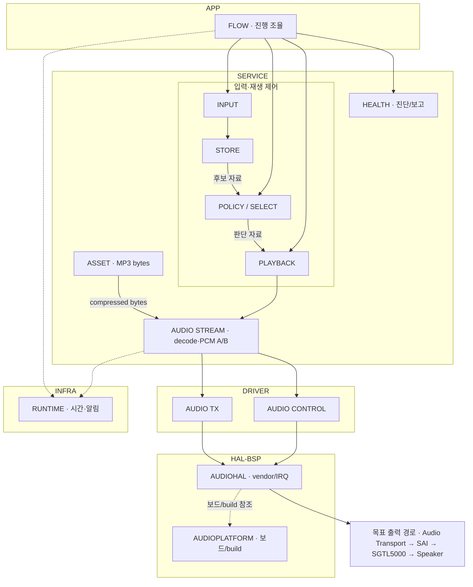

# VSS Design Overview

> R7 — 통합 검수 완료 · 2026-10-08 · 최신 승인 기준 R6 독립 PASS · R7 독립 검수 대기 · 구조/책임·Binding 미정 유지

Dedicated VSS ECU(S32K344)는 Domain 의미 입력을 검증·저장한다. POLICY가 중앙 정책으로 재생 대상과 계획을 선택하고 PLAYBACK이 단일 출력 Session을 진행한다. FLOW는 이 선택 판단과 실행 흐름을 연결한다. 현재 설계 의미를 계층별로 읽도록 배치한다.

## 1. 전체 구조와 주요 경로

그림은 주요 요청·자료 경로다. 후보/판단 자료 전달은 FLOW가 조율하며 POLICY의 PLAYBACK 직접 호출을 뜻하지 않는다. 읽기 관측과 해당 요청·출력 시도에 연결된 결과 반환은 상세 Module에서 설명한다. RUNTIME은 필요한 모든 책임이 사용하는 기존 공통 도구이며 그림에서는 일부 연결만 보인다. 실제 정적 의존은 각 Layer 문서의 경계를 따른다.

문서 분류는 APP / SERVICE / DRIVER / HAL-BSP / INFRA의 **5개 묶음**이다. HAL과 BSP는 다른 책임을 유지하면서 한 문서에서 읽는다. 실제 논리 Module은 기존 10개다. HAL/BSP·RUNTIME은 Layer 내부/공통 Boundary로 읽으며 기존 책임을 추가·삭제하지 않았다. 이를 실제 C file·Task 수로 복제하지 않는다.

### 설계 목표와 현재 Binding 확인 상태

| 구분 | 내용 |
| --- | --- |
| 설계 목표 Audio path | **Internal PFlash MP3 → CPU decode → PCM A/B → Audio Transport → SAI → SGTL5000 → Speaker** |
| Audio Transport 목표 | 논리 설계에서는 eDMA를 목표로 유지한다. 현 프로젝트의 실제 DMA 사용 확정과 구별한다. |
| 기존 source/map에서 확인한 범위 | 2026-09-30의 읽을 수 있는 snapshot은 SAI send/status 기반 A/B 흐름이다. 2026-10-07 build map에는 SAI IRQ handler entry가 있다. generated DMA config의 존재만으로 실제 Audio DMA 사용을 확정하지 않는다. |
| 현재 미확정 Binding | 최신 source/generated config 대조 전에는 polling/IRQ/DMA의 실제 연결 방식, callback·시작/종료 근거의 충분조건이 TBD다. |

위 확인 범위는 [기존 Mapping 근거](../90_BINDING/90_C_FILE_API_MAPPING.md#transport)를 요약한 것이다. R1.1 및 R2/R3에서 새 source/RTD Binding을 확인하거나 확정하지 않았다.

## 2. 핵심 의미

- 상태 원본은 해당 owner 한 곳에서만 변경한다. 관측·결과 문맥은 두 번째 원본이 아니다.
- One-shot의 Occurrence 이력과 Stateful의 현재 유효 후보를 구분한다. Occurrence / Session / Attempt는 수명과 책임이 다르다.
- `winner ≠ prepared ≠ start accepted ≠ actual output start`다.
- `OUTPUT_START_CONFIRMED`, `NO_START_CONFIRMED`, `OUTPUT_TERMINATION_CONFIRMED`를 구분한다.
- 늦게 도착한 결과(late callback)는 원래 출력 시도에 귀속한다. uncertain 최종과 QUARANTINED 이후 정상 재생 이력을 부활시키지 않는다.
- PCM 전송 Buffer는 정확히 A/B 두 개다. `source consumed ≠ safe return ≠ output termination ≠ retirement`다.
- Fault 판단·복구 허용·실제 수행·효과 검증·제한 해제는 서로 다르다.
- WINDOW / Anti-Pinch는 **[구현 보류 — 설계 유지]**다. 제품 연결은 보류하고 TEST 의미 경로를 유지한다.

세부 공통 규칙은 [R4 공통 계약 탐색](../50_CONTRACTS/00_CONTRACT_OVERVIEW.md)에서 찾고 Module/Function/Data별 적용 조건은 해당 상세에 유지한다. 이 요약은 상세 계약을 대체하지 않는다.

## 3. 상세로 내려가는 경로

| 확인할 내용 | 문서 진입점 |
| --- | --- |
| Layer 관계·허용/금지 의존 | [Layer Overview](../10_LAYERS/00_LAYER_OVERVIEW.md) |
| 상태 owner·Module 책임·lifecycle | [Module Overview](../20_MODULES/00_MODULE_OVERVIEW.md) |
| R2 Core 상세·provisional prototype | [Function Overview](../30_FUNCTIONS/00_FUNCTION_OVERVIEW.md) |
| R3 논리 필드·owner·수명·pseudo-C와 32개 판정 | [Data Overview](../40_DATA/00_DATA_OVERVIEW.md) |
| 다섯 공통 Contract와 local 적용 연결 | [Contract Overview](../50_CONTRACTS/00_CONTRACT_OVERVIEW.md) |
| R5-C1 여섯 typed 실행 Flow·기존 11개 의미 참고 흐름 | [Pseudocode Overview](../60_PSEUDOCODE/00_PSEUDOCODE_OVERVIEW.md) |
| R6 논리 Header ownership·18 후보 원형, 실제 ABI 미확정 | [C Interface](../70_C_INTERFACE/00_HEADER_OWNERSHIP_MAP.md) |
| 기존 Stage A/B1 근거·실제 Mapping 미정 | [C Mapping](../90_BINDING/90_C_FILE_API_MAPPING.md) / [Implementation TBD](../90_BINDING/91_IMPLEMENTATION_TBD.md) |

문서 전체 경로와 기존 Trace 연결은 [Document Map](01_DOCUMENT_MAP.md)에서 확인한다.

## 4. 현재 범위와 다음 단계

R0 구조를 유지하며 R1 Layer/Module 책임·owner·입출력·lifecycle·local contract 정규화를 완료했다. R2에서 필요한 Core Function과 의미 계약을 상세화했으며 provisional type은 실제 C 타입/구조체 확정이 아니다. 기존 의사코드는 의미 참고본이며 C 직전 typed 의사코드는 R5에서 작성하고 R5-C1에서 국소 보완했다.

R1.1의 기준 v1.1과 한국어 표현 Guard를 유지한다. R2 Core 18개, R3-C1 Data·두 경계의 독립 국소 PASS, R4 공통 Contract 5개, R5-C1 typed Flow 및 R6 Header 후보의 승인 의미를 인수했다. **R6 독립 PASS를 최신 승인 기준으로 R7 내부 E2E 검수를 완료**했으며 [R7 결과](../../../../R7_RESULT_SUMMARY.md)에 전수 대응·자체 수용 판정·미정을 기록한다. 다음은 일반 채팅 R7 독립 검수다. 최신 팀 인터페이스는 EXTERNAL-IF-TBD이며 B2-R·GATE-C·실제 C 구현·Build·Flash·보드/성능 검증은 수행하지 않았다.
