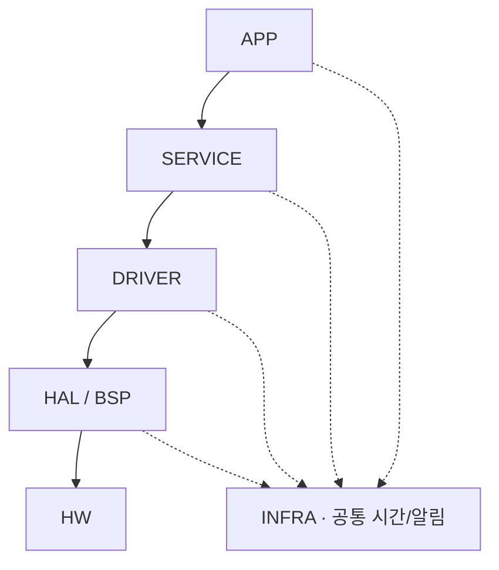

# Layer Overview

> R1 — 5개 Layer의 관계와 상세 진입점. HAL/BSP·RUNTIME은 Layer 내부 Boundary다.

| Layer | 역할 | 포함 Module / 내부 책임 | 상·하위 관계 | 상세 |
| --- | --- | --- | --- | --- |
| APP | 초기화·진행, POLICY의 선택 판단과 PLAYBACK의 실행 흐름, 보고·허용된 복구 순서를 조율한다. | FLOW | SERVICE의 공개 의미 경계, 필요한 INFRA 사용 | [APP](10_APP_LAYER.md) |
| SERVICE | 차량 의미·상태·정책과 MP3/PCM 준비·진단을 관리한다. | INPUT / STORE / POLICY / PLAYBACK / AUDIO STREAM / ASSET / HEALTH | APP에 중립 관측/결과 제공, Audio 요청을 DRIVER로 연결 | [SERVICE](20_SERVICE_LAYER.md) |
| DRIVER | 장치 전송과 구성 준비를 원래 요청에 귀속된 중립 근거로 연결한다. | AUDIO TX / AUDIO CONTROL | SERVICE 요청 → HAL, 결과 → AUDIO STREAM | [DRIVER](30_DRIVER_LAYER.md) |
| HAL/BSP | vendor/IRQ와 보드/build 근거를 연결한다. 두 내부 책임은 구별한다. | AUDIOHAL / AUDIOPLATFORM(BSP) Boundary | DRIVER → HAL → HW, BSP는 binding/build 참조 | [HAL/BSP](40_HAL_BSP_LAYER.md) |
| INFRA | 비교 가능한 시간·연속성·알림/손실을 공통 도구로 제공한다. | RUNTIME 공통 Boundary | 필요한 APP/SERVICE/DRIVER/HAL이 사용 | [INFRA](50_INFRA_LAYER.md) |

결과 반환은 새 역방향 정책 호출 의존이 아니다. 세부 허용/금지 방향은 Layer 상세에서 확인한다. 논리 Layer/Module 수를 C file·Task 수로 복제하지 않는다.

[전체 VSS](../00_OVERVIEW/00_VSS_DESIGN_OVERVIEW.md) · [Module 관계](../20_MODULES/00_MODULE_OVERVIEW.md) · [공통 계약 위치](../50_CONTRACTS/00_CONTRACT_OVERVIEW.md)
