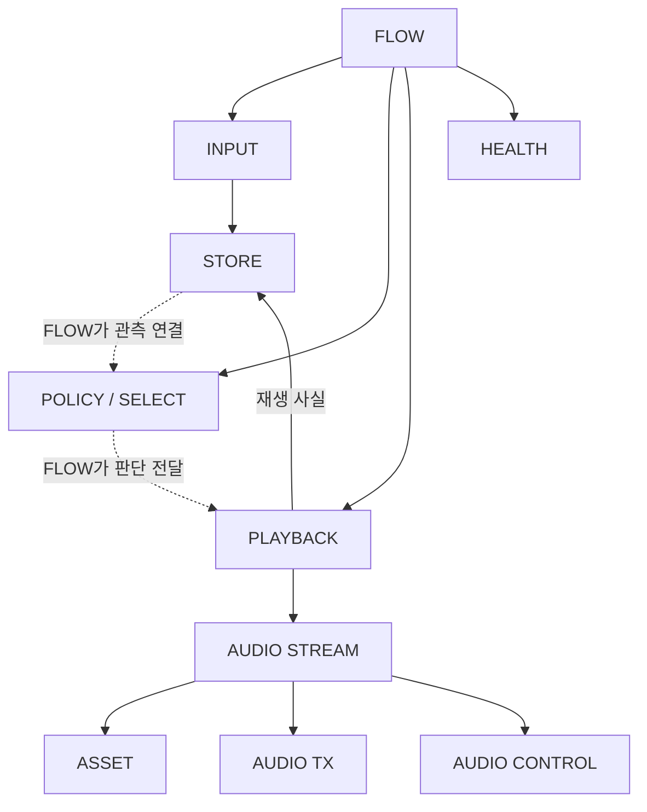

# Module Overview

> R1 — APP 1 / SERVICE 7 / DRIVER 2의 실제 논리 Module 10개. 문서 이름은 C file/API 수를 뜻하지 않는다.

실선은 주요 요청, 점선은 FLOW가 연결하는 자료 경로다. POLICY → PLAYBACK 직접 호출을 뜻하지 않는다. 장치 결과는 요청 경계로 AUDIO STREAM에 반환되고 PLAYBACK이 전체 재생 사실을 STORE에 적용한다. 반영 완료 관측에서 HEALTH가 보고를 파생한다.

| Layer | Module | 역할 | authoritative writer / 소유 요약 | 주요 의존 |
| --- | --- | --- | --- | --- |
| APP | [FLOW](10_FLOW_MODULE.md) | 초기화·처리 기회, POLICY 선택 판단과 PLAYBACK 실행 흐름, 보고·복구 순서 조율 | 조율 단계·재평가·판단에 사용하는 임시 일관된 관측 / C01 | SERVICE 공개 경계·RUNTIME |
| SERVICE | [INPUT](20_INPUT_MODULE.md) | 제품/TEST 의미·품질·시간·출처/세대/순서 검증 | 변환·검증된 적용 문맥 / C02~C04 | STORE·RUNTIME, 기존 Network 의미 경계 |
| SERVICE | [STORE](21_STORE_MODULE.md) | 수용 발생 이력과 현재 Stateful 후보 유지 | accepted·품질/Hold·ledger/replay / C05 | RUNTIME |
| SERVICE | [POLICY](22_POLICY_MODULE.md) | 함께 판단 가능한 일관된 상태 묶음에서 read-only 판단·전체 계획 반환 | 실행 중 읽기 전용 정책·평가 자료 / C06·C07 | 필요한 RUNTIME |
| SERVICE | [PLAYBACK](23_PLAYBACK_MODULE.md) | 단일 Session/Attempt·전체 권한·최종 결과 관리 | 출력 owner·전체 정책 진행 / C08 | AUDIO STREAM·STORE·RUNTIME |
| SERVICE | [AUDIO STREAM](24_AUDIO_STREAM_MODULE.md) | MP3 CPU decode·준비·PCM A/B·Backend 진행 | provider·PCM usage·미래 제출 권한 / C09 | ASSET·TX·CONTROL·RUNTIME |
| SERVICE | [ASSET](25_ASSET_MODULE.md) | read-only Internal PFlash의 bounded MP3 bytes 공급 | image/metadata·읽기 범위·span 참조 / C10 | read-only image·필요한 RUNTIME, BSP build-time 참조 |
| SERVICE | [HEALTH](26_HEALTH_MODULE.md) | 진단·복구 판단(C11)과 파생 보고(C12) | 진단 책임(C11)의 현재/최근 Fault·제한 / 보고 책임(C12)의 파생 보고 | 필요한 RUNTIME |
| DRIVER | [AUDIO TX](30_AUDIO_TX_MODULE.md) | 장치가 PCM 버퍼에 접근할 수 있는 동안의 사용권 보호(retain)·실제 전송/출력을 위한 장치 활성화(arm)·소비·안전 반환·정리 근거 | 장치 전송/descriptor·해당 버퍼 사용 회차 근거 / AUDIOTX | HAL·RUNTIME |
| DRIVER | [AUDIO CONTROL](31_AUDIO_CONTROL_MODULE.md) | Codec/Generator/Reference별 구성 준비·제어 | 해당 장치·구성 readiness / AUDIOCTRL | HAL·RUNTIME |

`HEALTH`는 기존 DIAGNOSTIC STATUS(C11/C12), `AUDIO TX`는 AUDIO STREAM DRIVER(AUDIOTX), `AUDIO CONTROL`은 CODEC-CLOCK DRIVER(AUDIOCTRL)의 문서 이름이다. 기존 책임을 합치거나 늘리지 않았다.

HAL이 요청 전에 저장한 귀속 정보와 vendor/IRQ 연결, BSP의 보드/build, RUNTIME의 시간·알림은 **Layer 내부/공통 Boundary**다. owner가 있어도 별도 Module/C file/Task를 만드는 뜻으로 확대하지 않는다. [HAL/BSP Layer](../10_LAYERS/40_HAL_BSP_LAYER.md)와 [하위 상세](../10_LAYERS/details/40_HAL_BSP_BOUNDARY.md), [INFRA Layer](../10_LAYERS/50_INFRA_LAYER.md)와 [하위 상세](../10_LAYERS/details/50_TIMEBASE_RUNTIME_BOUNDARY.md)에서 읽는다.

각 Module의 §13~15에서 Function / Data / 공통 원문 위치로 이동한다. FLOW의 임시 관측은 [Selection 자료](../40_DATA/30_SELECTION_DATA.md#selection)에 연결한다. 기존 Function 후보 수는 R2 실제 함수 수를 고정하지 않는다.

[Layer Overview](../10_LAYERS/00_LAYER_OVERVIEW.md) · [Function Overview](../30_FUNCTIONS/00_FUNCTION_OVERVIEW.md) · [Data Overview](../40_DATA/00_DATA_OVERVIEW.md) · [Contract Overview](../50_CONTRACTS/00_CONTRACT_OVERVIEW.md)
